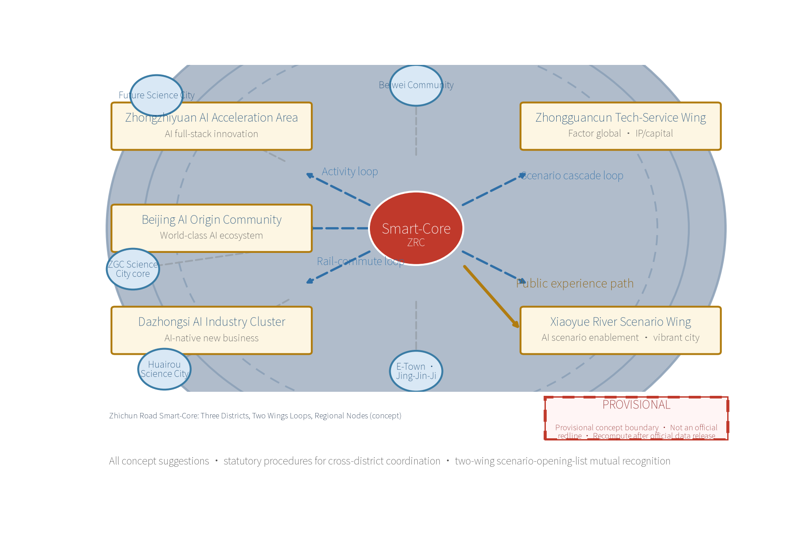
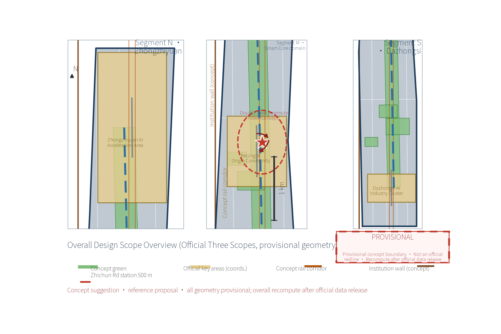
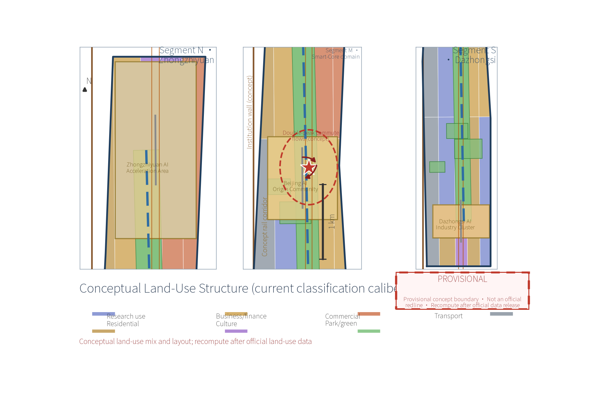
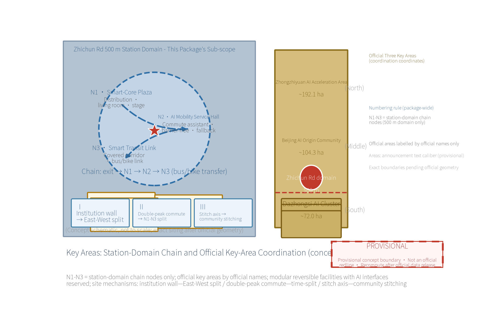
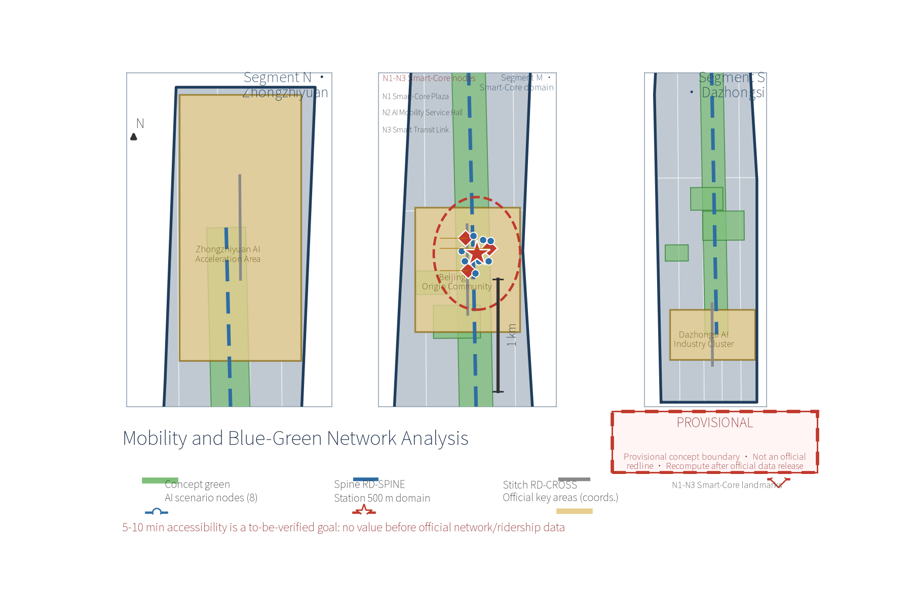
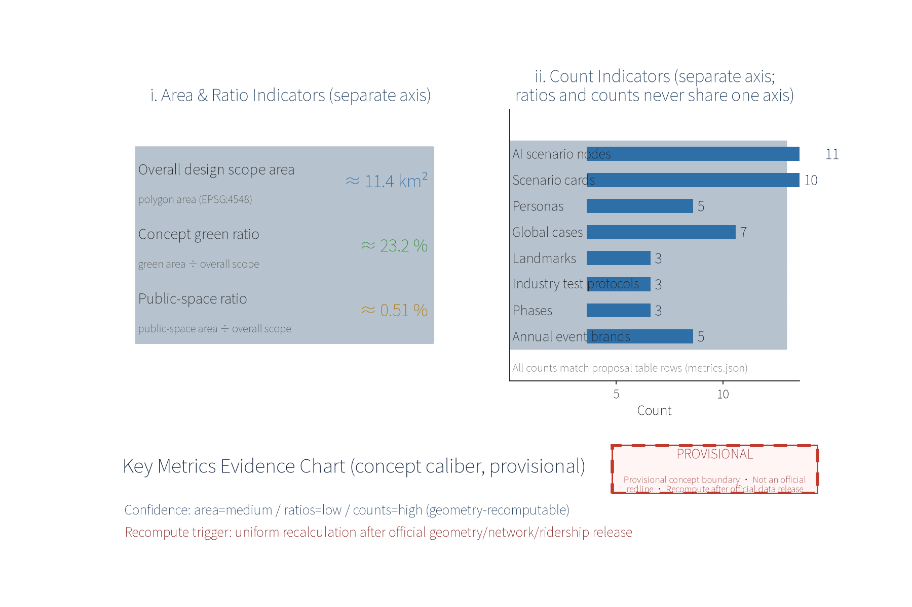

OPEN CITY · HAIDIAN — Concept Proposal for the Centennial Jing-Zhang AI Innovation Belt Urban Design Call

## Design Basis and Source List

This proposal takes the "OPEN CITY · HAIDIAN Centennial Jing-Zhang AI Innovation Belt Urban Design Call Taskbook" as its overall basis ([source:DATA-SRC-AGENT-TASKBOOK-2026-05-18]) and references the following materials. First, statutory plans: the Beijing Master Plan (2016-2035) ([source:DATA-SRC-BEIJING-MASTER-PLAN-2035]) and the Haidian District Plan (Territorial Spatial Plan, 2017-2035) ([source:DATA-SRC-HAIDIAN-DISTRICT-PLAN-2019]).

Second, special and sector basis: Beijing rail transit network planning ([source:DATA-SRC-RAIL-NETWORK-PLAN-2022]), public materials on Zhichun Road station facilities ([source:DATA-SRC-BJSUBWAY-ZHICHUNLU-STATION]), the Code for Urban Rail Transit Network Planning GB/T 50546-2018 ([source:DATA-SRC-RAIL-NETWORK-STD-GBT50546]), the Barrier-Free Environment Law ([source:DATA-SRC-BARRIER-FREE-ENVIRONMENT-LAW]), the Design Code for Accessibility GB 50763-2012 ([source:DATA-SRC-ACCESSIBILITY-DESIGN-STD-50763]), the Beijing Urban Renewal Regulation ([source:DATA-SRC-BEIJING-URBAN-RENEWAL-REG-2022]) and the Complete Residential Community Construction Standard ([source:DATA-SRC-COMPLETE-COMMUNITY-STD-2020]).

Third, district research: the Zhongguancun Science City plan and core-area scope ([source:DATA-SRC-ZHONGGUANCUN-SCIENCE-CITY]) and site survey records of the electronics information districts. Fourth, data-method hypotheses: anonymously aggregated public anonymized data (bus smart-card, bike-sharing, mobile signaling) as a methodology ([source:DATA-SRC-ZHICHUNLU-TRAFFIC-HYPOTHESIS-2026]).

Special notes: (1) as of the submission date no publicly verifiable full text of any regulatory detailed plan under preparation exists for this district; this proposal does not use any unpublished detailed plan as a design basis and treats such content as "to be checked after official publication"; (2) all boundaries in this proposal are provisional initial calibers to be unified after official geometry recalculation by the organizer; all area, scale and investment figures are concept calibers for direction-setting and option comparison only, not statutory planning commitments, and are not used for accounting or approval. Site photographs, survey sketches, survey records and passenger-flow style data cannot currently be verified from public channels; this proposal treats all of them strictly as "hypotheses pending verification," never as established facts.

> **Evidence anchors**: [source:DATA-SRC-OFFICIAL-ANNOUNCEMENT-2026-05-09], [source:DATA-SRC-AGENT-TASKBOOK-2026-05-18] (organizer announcement and taskbook are the textual basis).

## Three-Level Scope Framework

Following the taskbook, this proposal adopts a three-level framework: coordinated research — overall design — key areas, consistent with the official announcement's three-level calibers (official text calibers: coordinated research scope ~43.6 km², overall design scope ~11.4 km², and key areas totaling ~368.4 ha, comprising from north to south the Zhongzhiyuan AI Autonomous-Innovation Acceleration Area ~192.1 ha, Beijing AI Origin Community ~104.3 ha, and Dazhongsi AI Industry Cluster ~72.0 ha). Level 1, the coordinated research scope, covers a wide area around Zhichun Road station including the depth between Zhongguancun and Xueyuan Road, with industry, population, travel-structure and future-city studies answering "for whom and why here." Level 2, the overall design scope, uses the provisional study boundary (see the caliber table below) for regulatory-plan-depth method studies of land use, intensity, height, streets, underground space and renewal proposals, forming urban design guidelines and plan drafts that can connect with planning management. Level 3, the key-area detailed design scope, responds to the station-city interface in the Zhichun Road-Dazhongsi direction: this proposal's service object (conceptual sub-scope) is the 500 m-radius station domain ("Smart-Core") around Zhichun Road station, located inside the overall design scope and adjacent to the Dazhongsi AI Industry Cluster, with an N1-N3 three-node experience chain at integrated building-environment concept design depth. The three official key areas serve as coordination coordinates in this proposal (labelled by official names in the drawings); their own detailed design is delivered by the corresponding topical proposals. The three levels are linked by an "indicator transmission — plan-draft correspondence — implementation check" feedback mechanism; all boundaries are provisional and indicators are concept calibers, to be unified after official geometry recalculation.

**Official three-level scopes and this package's sub-scope (caliber table; provisional; figures are order-of-magnitude only)**:

| Official scope level (announcement caliber) | Geometry source | Area (announcement text caliber / provisional) | Indicator denominator | Purpose in this proposal |
|---|---|---|---|---|
| Coordinated research scope | No independent polygon (research extent) | ~43.6 km² (official text caliber) | Not used as a denominator | Industry, population, travel-structure, future-city studies |
| Overall design scope | geometry/site_boundary.geojson | ~11.4 km² (official text caliber; metrics.site_area_sqm, provisional) | Denominator of green_ratio, public_space_ratio and other area indicators | Land use, intensity, streets, underground space, renewal study |
| Key areas (three) | geometry/key_areas.geojson (KEY-ZHON/KEY-BEIJ/KEY-DAZH) | ~368.4 ha total (official text caliber, provisional): Zhongzhiyuan ~192.1 / AI Origin Community ~104.3 / Dazhongsi ~72.0 ha | Not an area-indicator denominator | Coordination coordinates; labelled by official names in drawings |
| This package's sub-scope (concept) | 500 m-radius Zhichun Road station domain ("Smart-Core"; N1-N3 nodes see geometry/public_space.geojson) | 500 m radius is not separately counted | Not an area-indicator denominator | Three-node (N1-N3) detailed design, scenario siting, passenger-flow organization |

Caliber note: the 500 m radius is used only as the concept caliber of pedestrian accessibility in the sub-scope (5-10 minute walk); it is never a denominator of any area indicator. This sub-scope is not a fourth official key area; precise values for the three official key areas always follow the official recalculation, and the text shows the official text-caliber rounded figures only.

> **Evidence anchors**: [source:DATA-SRC-AGENT-TASKBOOK-2026-05-18], [source:DATA-SRC-OFFICIAL-ANNOUNCEMENT-2026-05-09], [metric:site_area_sqm] (three-level framework follows the taskbook and announcement official text calibers and provisional geometry).

Under the taskbook's three positionings (Centennial Jing-Zhang Culture Belt, Urban AI Life Experience Belt, AI-Integrated Innovation Belt) and five functions (AI full-stack independent innovation system; world-class AI innovation ecosystem; new paradigm of AI+ scenario enablement; intelligent vibrant AI city; global voice in AI governance), this proposal develops the rail-transit and station-city directions as a functional carrier of the "new paradigm of AI+ scenario enablement" and "intelligent vibrant AI city" (concept mapping).

## Coordinated Research Area: Industry and Future City Research

The industrial base of the coordinated research area is "research institutes + electronics information + innovation and entrepreneurship." Dense research institutes, national laboratories and universities, together with technology enterprises along the Zhongguancun core and Xueyuan Road, form a complete chain of "basic research — technology development — industry landing." The electronics-component and information-service districts form an important hinterland of Beijing's electronics information industry. Looking ahead, the study offers three judgments: first, AI and software-defined industries make work-live space more mixed, so station domains should host flexible offices, incubators and shared laboratories; second, commuting shows a bimodal structure of "short-distance walking + long-distance rail," so transfer quality decides hub competitiveness; third, renewal of existing communities will release many "home-front AI scenarios." The resulting future-city form is "rail hub + innovation core + liveable community": with Zhichun Road station as the Smart-Core, mixed innovative businesses and living services within 500 m, transitioning outward to research blocks and mature communities — a balanced, all-day-vibrant future-city unit that turns the hub from a "pass-through" into a "destination."

> **Evidence anchors**: [source:DATA-SRC-PROVISIONAL-BOUNDARIES-2026-06-05] (boundary is provisional; research scope is conceptual only).

### Zhichun Road Problem Diagnosis and Site-Specific Causal Chain (concept)

The core scenarios are not a simple stack of generic smart-city modules but derive from three concrete site contradictions (concept judgments; public calibers, see [source:DATA-SRC-ZHONGGUANCUN-SCIENCE-CITY] and [source:DATA-SRC-PROVISIONAL-BOUNDARIES-2026-06-05]):

First, "the wall of institutes" vs daily community life: research institutes and universities along Zhichun Road-Xueyuan Road are mostly enclosed campuses with little street-front service or night-time vitality — "visible but inaccessible" for walkers and residents; this drives the AI community service station, frontage opening, shared-lab booking and "award-announcement" transformation mechanisms responding to innovation flowing "from lab to street."

Second, the east-west severance of the Jing-Zhang heritage linear space: the heritage park belt and rail facilities form a north-south linear barrier splitting research blocks from residential communities; this drives the three conceptual east-west stitch links (RD-CROSS-00/01/02) with level crossings and shared space, and the "one axis, one core" public-space skeleton along the heritage belt — turning a linear heritage asset into a stitching resource rather than a dividing line.

Third, the bimodal "short walking + long rail" commute structure: the Zhongguancun Science City core (Zhichun Road and Xueyuan Road are core-area boundary elements per the 2011 decision) shows clear job-housing separation; this drives the priority ordering of commute assistant, crowd visualization and dispatch disclosure, and dynamic bike-sharing dispatch — solving the "punctuality" pain first, experience second.

This causal chain is the unified conceptual logic between scenario cards, spatial placement and operation mechanisms, and the originality base of the Smart-Core: AI scenarios grow out of site contradictions rather than being pasted onto the hub. Quantitative evidence for these judgments (enclosure ratios, actual crossing demand, tidal crowding) is not publicly verifiable today and is registered as a pending hypothesis ([source:DATA-SRC-ZHICHUNLU-TRAFFIC-HYPOTHESIS-2026]), to be confirmed by on-site survey before pilots.

## Three Districts, Two Wings: Cooperation Loops and Regional Innovation Nodes (Concept)

This proposal places the "Smart-Core" in the "three districts, two wings" coordination frame (concept mapping): the Smart-Core acts as the interchange center of the cooperation loops — southward receiving innovation spillover from the Zhongguancun Science City core, northward linking the northern R&D hinterland through the Xueyuan Road districts — and builds conceptual two-way links with five regional innovation nodes: Beiwei Community (Xueyuan Road — Beihang — BUPT innovation blocks), Zhongguancun Science City core, Future Science City, Huairou Science City, and the Economic-Technological Development Area (E-Town) / Jing-Jin-Ji coordinated development direction. The loop mechanisms (all concept suggestions): first, a rail-commuting loop using Lines 10/13 and reserved future line-capacity to organize "station-to-station" talent and information flows; second, a scenario cascade loop opening the Smart-Core's AI mobility scenarios to each node's industry scenarios, forming a cycle of "scenario opening — anonymous aggregation — capability return"; third, an activity loop rotating the annual event system across nodes and sharing brand and content assets. All loops are directional suggestions; cross-district coordination requires statutory procedures and confirmation by the relevant entities.

### Xiaoyue River Scenario Enablement Wing: Role, Interface and Public Experience Path (Concept)

Per the taskbook caliber, the Xiaoyue River Scenario Enablement Wing carries the "AI scenario enablement and intelligent vibrant AI city" function ([source:DATA-SRC-AGENT-TASKBOOK-2026-05-18]). This proposal establishes an explicit mapping between the Smart-Core and the Xiaoyue River wing (concept suggestions): (1) role division — the Smart-Core acts as the "station-city interface" hosting high-frequency commuting scenarios (commute assistant, barrier-free guidance, crowd visualization), while the Xiaoyue River wing acts as the "scenario amplifier and living laboratory" hosting lower-frequency deep-experience scenarios (step-free slow-traffic experience segments, multilingual tours, soundscape installations, community co-creation experiments); (2) scenario interface — both sides share one "scenario-opening list" (the Smart-Core publishes commute/mobility interfaces; the Xiaoyue River wing publishes waterfront/experience interfaces), pilot data exchanges under anonymous-aggregation calibers, and test protocols are mutually recognized (see "Industry Test Protocols and Pilot Responsibility Matrix"); (3) public experience path — a continuous route of "station plaza (N1) → AI Mobility Service Hall (N2) → Smart Transit Link (N3) → community greenway → Xiaoyue River wing public experience path," with the greenway and slow-traffic spine (RD-SPINE) as the physical link between the two wings, mutually recognized event schedules, and consistent multilingual guidance and accessibility standards; (4) interface with the Zhongguancun Technology Service Wing — the technology-service wing provides technology transfer, standards and compliance public services and IP/capital enablement channels, while the Smart-Core and the Xiaoyue River wing serve as its "scenario side" interface points: the Smart-Core submits scenario-opening lists and test-validation filings, the Xiaoyue River wing submits experiential-scenario data needs, and the technology-service wing returns data-governance methods, standard interfaces and conversion channels — a closed loop of "factor service — scenario test — capability return." All mappings above are concept suggestions; cross-entity matters require agreements. The two-wing interfaces are registered in the compliance matrix and scenario matrix entries.

> **Evidence anchors**: [source:DATA-SRC-AGENT-TASKBOOK-2026-05-18] (coordination and branding-operation items follow the taskbook).

## Global AI Innovation Ecosystem Cases and Mechanism Transfer (Sourced)

Seven real global cases are selected as methodological references (for learning only, not a commitment to copy; case facts follow each publisher's public materials; each case cites a project/report/announcement PAGE-level source — URLs, published and accessed dates are registered in sources.json, not homepage-level references):

| Case | City | Year | Operator | Transferable mechanism | Source |
|---|---|---|---|---|---|
| Jurong Lake District | Singapore | 2019— | Urban Redevelopment Authority of Singapore (URA) | Hub-driven innovation district planning; slow-traffic-first station-city integration | GLOBAL-CASE-JURONG-2016 |
| Tokyo Station Marunouchi redevelopment | Tokyo, Japan | 2007— | JR East | Station-complex and business-district integration; underground connection | GLOBAL-CASE-TOKYO-2007 |
| King's Cross regeneration | London, UK | 2008— | King's Cross Central (developer consortium) | Whole-area renewal of an existing station district; knowledge-economy scenarios | GLOBAL-CASE-KINGSX-2008 |
| Hudson Yards | New York, US | 2012— | Related Oxford | Platform development above rail yards; public realm combined with tech scenarios | GLOBAL-CASE-HUDSON-2012 |
| Hongqiao Integrated Transport Hub | Shanghai, China | — | Shanghai Municipal Planning and Natural Resources Bureau (planning organizer) | Air-rail hub linked with business district; integrated walking network | GLOBAL-CASE-HONGQIAO-2008 |
| Qianhai Shenzhen-Hong Kong Modern Service Industry Cooperation Zone | Shenzhen, China | 2010— | Shenzhen Qianhai Authority | TOD combined with an innovation industry cluster; institutional opening pilot | GLOBAL-CASE-QIANHAI-2010 |
| Digital Media City (DMC) | Seoul, Korea | 2000— | Seoul Metropolitan Government (built by SH Corporation) | Media-tech cluster coupled with public transport; shared media facilities | GLOBAL-CASE-SEOUL-DMC |

Year-caliber note: the years are publicly traceable mechanism-start/milestone years in each publisher's documents (Jurong Lake District per the 2019 URA urban-design circular and the December 2023 JLD Planning & Urban Design Guide; Tokyo per the JR East 2007 press release on the station-city restoration; King's Cross partnership formed 2008; Hudson Yards construction started 2012 (officially opened 2019); Qianhai per the State Council approval of its first master development plan in August 2010; Seoul DMC per the April 2000 Sangam New Millennium City Plan). Where public sources cannot support a more precise date, this proposal states no such date — for the Hongqiao hub case, the registered project-page documents (2025 draft-plan announcement, 2023 transport plan) contain no citable start year, so the year cell is left blank and the case serves as a mechanism reference only.

Transfer conclusions (concept): the seven cases jointly support the combination of "rail hub + innovation function + high-quality public space." Accordingly, the proposal forms a three-circle AI innovation ecosystem map — a hub-service circle (within the station domain), an innovation-collaboration circle (three-districts/two-wings nodes) and a data-compute support circle (municipal and regional facilities) — and organizes the factor-support matrix from it (see "Factor-Support Matrix and Data Governance").

> **Evidence anchors**: [source:GLOBAL-CASE-JURONG-2016], [source:GLOBAL-CASE-KINGSX-2008] (cases follow publishers' public documents; see sources.json).

## Overall Design Area: Urban Renewal and Regulatory-Plan-Level Urban Design

The overall design scope (~11.4 km², provisional), anchored on Zhichun Road station, follows the principle of "renewal first, precise increments." Old communities receive building-envelope and environment micro-renewal; inefficient parcels and dilapidated buildings receive small-scale infill; research institutes are encouraged to open shared street frontages to form innovation streets; commercial and rail land use is moderately mixed, with conceptual study of over-track and underground integrated development. At regulatory-plan depth: optimize the land-use mix with transit and public-service functions strengthened in the core ring and residential/research dominance outside; propose FAR, height and street-wall-line gradients forming a "mountain-shaped" profile descending from station to city; draft street-section, setback, color and fifth-façade guidelines; delineate conceptual underground connection corridors. The outputs are urban design guideline and plan drafts that can serve as reference for professional teams and for linkage with the regulatory plans under preparation; all boundaries and indicators are provisional concept calibers pending official geometry recalculation. Fixing any of them as regulatory planning controls requires a separate statutory approval process; this proposal announces no controls by itself.

> **Evidence anchors**: [source:DATA-SRC-MOHURD-CONTROL-DETAILED-PLANNING], [source:DATA-SRC-PROVISIONAL-BOUNDARIES-2026-06-05] (regulatory-plan method reference and provisional-boundary warning).

## Detailed Design of Key Areas

The key-area detailed design focuses on this package's sub-scope — the 500 m-radius station domain ("Smart-Core") — organized around three nodes forming a complete people-centered experience chain. Numbering and spatial meaning are unified package-wide: N1 Smart-Core Plaza, N2 AI Mobility Service Hall and N3 Smart Transit Link are all located inside the station domain, arranged consecutively along the "arrival—transfer—connection" route as parts of the station-domain experience chain; the three official key areas (Zhongzhiyuan, Beijing AI Origin Community, Dazhongsi) do NOT use the N1-N3 numbering and are labelled by their official names in the drawings and matrices as coordination coordinates only. Node N1, the Smart-Core Plaza: integrates metro-exit and bus-stop distribution flows with tiered drop-off zones, accessible ramps and rhythmic paving; it also works as an urban living room with movable seating, water features and art installations for daily rest and socializing, and can transform into a performance venue for festivals. Node N2, the AI Mobility Service Hall: at the junction of the concourse and the plaza, offering a commute assistant (real-time conditions and personalized route recommendations), barrier-free multimodal guidance (voice, tactile and sign-language video) and a real-time crowd-visualization screen, with a human-service fallback counter ensuring that elderly people and persons with disabilities travel with ease. Node N3, the Smart Transit Link: a weather-protected corridor linking rail, bus stops, bike-sharing areas and adjacent building frontages, with information screens, lighting and slip-resistant paving for all-weather comfortable transfers. All three nodes use modular, reversible facility systems that can adapt flexibly to passenger-flow changes, with reserved interfaces for AI sensors and edge computing. Node numbering N1-N3, scale bar, north arrow and legend are shown on the node index drawing; the three official key areas are labelled there with their official names under an "coordination coordinate (concept)" legend entry to avoid confusion with the station-domain node numbering.

> **Evidence anchors**: [data:PACKAGE-GEOMETRY] (N1-N3 node polygons come from geometry/public_space.geojson; the three official key-area polygons come from geometry/key_areas.geojson).

## Public-Space Strategy, Stitch Axes, Uses, and Landmark System (Concept)

**Jing-Zhang Heritage Park public-space strategy (concept)**: the park vitality belt is organized in segments — a heritage-display segment (concept exhibition of retained rail-memory elements and a timeline installation), a slow-traffic vitality segment (cycling/walking paths linked to the N3 Smart Transit Link, info columns) and a community-sharing segment (pocket parks, corner gardens and a community service corner). Strategy points include permeable paving and rain gardens, safe night lighting, and a concept connection to the Yuan Dynasty City Wall Relics Park greenway system. The belt and the plaza form a "one axis, one core" public-space skeleton (suggestive; details follow special studies).

**East-west stitching and north-south through-connection (concept)**: east-west stitching uses three conceptual transverse stitch links (RD-CROSS-00/01/02 in geometry/roads.geojson, east-west) to reconnect the research blocks and residential communities on both sides of the heritage-park belt, with level crossings and shared space at intersections; north-south through-connection organizes a longitudinal slow-traffic spine (RD-SPINE) along Zhichun Road and the heritage-park belt linking the plaza, the three nodes and community greenways — a complete slow-traffic skeleton of "one hub through-connected, east-west stitched."

**Dazhongsi use suggestions (concept)**: for the Dazhongsi AI industry cluster (~0.72 km², provisional), a concept use mix is proposed — open AI laboratories and shared piloting space, a digital-media experience hall, smart-hardware and robotics showrooms, small meeting and pitch spaces for founders, and an evening-economy dining street leveraging rail passenger flows. All are directional use suggestions; actual introduction follows market and industry policy.

**Three-landmark directory (concept, matching landmark_count=3)**:

| Landmark | Positioning | Design points (concept) | Operation suggestion (concept) |
|---|---|---|---|
| N1 Smart-Core Plaza | Station-front distribution + urban living room | Tiered drop-off zones, accessible ramps, rhythmic paving, movable seating and art | Festival-venue rotation; event permitting |
| N2 AI Mobility Service Hall | Commute assistant + barrier-free guidance | Multimodal guidance terminal, crowd screen, human fallback window | Concession pilot; experience-officer program |
| N3 Smart Transit Link | Weather-protected corridor + multi-modal transfer | Info screens, lighting, slip-resistant paving, bike-stall interface | Monthly transfer evaluation; volunteer guidance |

**Honor display system (concept)**: a "Centennial Jing-Zhang — Zhongguancun Innovation Honor Wall" concept installation at the Smart-Core Plaza, linked with the annual event system to display innovation outcomes and co-created civic works, with quarterly human review and themed rotation (suggestive). **Facility component library (concept)**: establish a modular reversible component catalog — corridor standard segments, info columns, seating, smart light poles, guidance desks, art-installation bases — with unified dimensions and interface rules for "pilot assembly first, batch production later," reducing renewal cost and waste risk; the library is revised with pilot evaluation (concept).

**Zone mechanism linkage (concept)**: Zhongzhiyuan AI autonomous-innovation acceleration area — an "open challenge + acceleration camp" mechanism suggestion releasing demand through the Smart-Core industry-service scenario; Beijing AI Origin Community — a "scenario validation + community co-creation" mechanism suggestion using the community booth as the validation front end; Zhongguancun technology-service wing — a linkage suggestion for technology-transfer, standards and compliance public services for station-domain enterprises (to be connected with Zhongguancun-style technology-service institutions). All linkages are concept suggestions; cross-entity matters require agreements.

## AI Innovation Ecosystem, Personas, and AI+ Scenarios

The station population is summarized into five persona profiles: researchers and engineers seeking punctual transfers and quiet exchange; startup youth and freelancers relying on flexible workstations and fast connections; university faculty and students with staggered, diverse travel; commuters making hot transfers at peaks; and elderly people, children and other community groups needing safe slow travel and human care. The five-persona table below maps each profile to response mechanisms implemented per scenario card:

| Persona | Core needs | Scenario response (concept) | Accessibility & public care |
|---|---|---|---|
| Researchers and engineers | Punctual connections, quiet space | Commute assistant; shared-lab booking | Frictionless passage, low-disturbance environment |
| Startup youth and freelancers | Flexible workstations, fast connection | Flexible-office booking; bike-sharing dispatch | 24h lighting and safety patrols |
| University faculty and students | Staggered travel, diverse needs | Crowd visualization and dynamic dispatch | Student fares; information accessibility |
| Commuters | Hot peak transfers | Real-time traffic push; transit link | Peak human guidance posts |
| Elderly, children and community groups | Safe slow travel, human care | AI community service booth; aged-care errands | Human fallback window; child-friendly routes |

**Journey of persons with disabilities and co-creation verification (concept)**: the end-to-end journey covers "leave home — enter station — transfer — arrive." Leaving home: the AI community service booth provides route rehearsal and appointment guidance. Entering the station: multimodal guidance (voice, tactile, sign-language video) works with on-duty staff. Transfer: level corridors and continuous tactile paving. Arrival: destination announcements and help buttons. Co-creation verification includes: (1) during pilots, an experience panel of persons with disabilities, elderly representatives and community residents tests guidance terminals, corridor gradients and the human-service window with monthly feedback; (2) complaint channels are public (online channel + in-station service desk) with response times published; (3) service-failure compensation follows a "human termination first" principle — any failed AI service switches to human handling with one touch, with fare compensation or rebooking assistance for missed travel caused by failure. Legal-scope note: under Article 39 of the Barrier-Free Environment Law, on-site guidance and human-operated service apply only to the specifically listed statutory public service matters (medical, social security, financial and living-payment services); the human-fallback design here is a voluntary public commitment of this proposal and is not generalized into a statutory interpretation for all public spaces or digital interfaces — venue-specific compliance requires a professional determination. **Validation plan (concept)**: the compensation scheme, monthly co-creation frequency and accessibility technical parameters above are proposals that have not yet been validated by representative users or an operating entity; the plan is to validate after pilot kickoff on a "3-month initial experience-panel test (persons with disabilities, elderly representatives, community residents, 8-12 people per panel) → parameter and process revision → re-test before the pilot ends" rhythm, with guidance-terminal and gradient parameters checked against the current Design Code for Accessibility (GB 50763, [source:DATA-SRC-ACCESSIBILITY-DESIGN-STD-50763]) and validation conclusions published with the pilot evaluation; no statutory or operational standard is claimed before validation.

AI scenarios are organized into six domains: AI mobility services (commute assistant, bike-sharing dispatch), AI public space (smart light poles, environmental sensing), AI accessibility services (multimodal guidance with public-service fallback), AI community services (government errands, aged-care), AI governance transparency (crowd visualization and dispatch transparency), and AI industry services (digital matching demonstration for research institutes and tech enterprises), linked with station-domain cultural experiences (soundscape and art-installation tours). Each domain's scenario cards declare spatial siting, operator suggestions and compliance boundaries; pilots are evaluated first and then scaled. All scenarios hold the "anonymous aggregation + human review" double guarantee: personal data stays in-station and is never profiled or traced, key decisions keep a human confirmation step, facilities are modular and reversible, and AI is embedded in daily commuting without replacing human service — building resident trust through "technology transparency and human-machine collaboration."

> **Evidence anchors**: [source:DATA-SRC-GENERATIVE-AI-INTERIM-MEASURES], [source:DATA-SRC-BARRIER-FREE-ENVIRONMENT-LAW] (reference for AI governance wording and the Article 39 boundary).

## Scenario Card Index (Concept, 10 Cards)

Ten scenario cards cover the six scenario domains plus station-domain cultural experience. Each card gives spatial siting, operator suggestions, data boundary, human review, offline fallback, KPIs and exit conditions (all concept suggestions):

| Scenario card | Spatial siting | Operator suggestion | Data boundary | Human review | Offline fallback | KPI | Exit condition |
|---|---|---|---|---|---|---|---|
| Commute assistant | Smart-Core Plaza info column | Rail operator + third-party service | Anonymous aggregation, no tracking | Human confirmation on anomalies | Static timetable + human desk | Monthly active usage rate | Complaint rate above limit for 3 months |
| Barrier-free AI guidance | AI Mobility Hall multimodal terminal | Rail operator + NGOs | On-device, no retention | On-duty staff accompany | Large-print guide cards | Service satisfaction | Accessibility revisit below target |
| Crowd visualization & dispatch | Smart Transit Link hall | Rail operator | Aggregated flows, no over-monitoring | Dispatch orders need human approval | Public address + on-site guidance | Peak dispersal rate | Forecast error beyond threshold |
| Bike-sharing smart dispatch | Riding stalls & geofence zones | Bike operators + sub-district office | Vehicle positions aggregated only | Placement plans reviewed by humans | Fixed-location supervisor posts | Parking-complaint count | Geofence misjudgment rate above limit |
| Smart light poles & sensing | Plaza and corridor | District platform company | Environment data aggregated | Alerts handled by humans | Base lighting always on | Energy saving & fault rate | O&M cost over budget |
| AI community service booth | Community service corner | Residents' committee + volunteers | Human review; one-key shutdown | Double human review for errands | Physical counter | Completion & satisfaction | Pilot evaluation fails |
| Non-motorized parking guidance | Both sides of the transit link | Sub-district + parking manager | Bay occupancy aggregated | Overflow alerts routed to humans | Physical induction & supervisors | Parking compliance rate | Bay turnover below target |
| Station public-event broadcast | Hub information screens | Rail operator | Read-only public info | Content approved before publishing | Static bulletin board | Information accuracy rate | Approval chain fails |
| Aged-care assisted errands & voice guidance | Dedicated seat in community booth | Community + professional agency | No biometric collection | Whole-process human accompaniment | Phone & home-visit errands | Elderly coverage | Privacy review fails |
| Soundscape & art tour | Installation nodes in plaza & greenway | Culture operator | Visit aggregation only | Quarterly human content review | Paper tour booklet | Participation count | Installation damage rate above limit |

> **Evidence anchors**: [source:DATA-SRC-AGENT-TASKBOOK-2026-05-18] (scenario card requirements correspond to the taskbook).

## Scenario-Space-Operator Matrix and TRL (Concept)

**Scenario-space-operator matrix** (one-to-one correspondence of the 10 scenarios with space and operating mechanism):

| Scenario | Spatial siting | Operator | Mechanism (concept) |
|---|---|---|---|
| Commute assistant | N1 Plaza info column | Rail operator + service provider | Booking push + human fallback |
| Barrier-free guidance | N2 Service Hall | Rail operator + NGOs | Multimodal + on-duty staff |
| Crowd visualization | N3 Transit Link hall | Rail operator | Real-time display + annual review |
| Bike dispatch | Riding stalls | Bike operators + sub-district | Points incentive + geofence |
| Smart light poles | Plaza & corridor | District platform company | IoT sensing + energy management |
| Community booth | Community corner | Community + volunteers | Discussion solicitation + monthly rotation |
| Parking guidance | Both corridor sides | Sub-district + parking manager | Bay aggregation + supervisor diversion |
| Event broadcast | Hub screens | Rail operator | Read-only + human approval |
| Aged-care assisted errands | Booth dedicated seat | Community + professional agency | No biometric capture + fully human-accompanied service |
| Soundscape tour | Plaza & greenway installations | Culture operator | Visit aggregation + quarterly review |

**Technology readiness level (TRL) estimate table** (inference caliber: TRL ranges are estimated from public evidence of technology maturity; all are concept estimates, not technology commitments; the "verifiable basis" column gives public-source classes whose itemized URLs, published and accessed dates are registered in [source:DATA-SRC-TRL-BASIS-2026-08-25] entries TRL-EVID-01 to 10; TRL shall be re-assessed at pilot kickoff. Technologies without publicly verifiable evidence are deliberately NOT TRL-graded in this table):

| Scenario/technology | TRL estimate | Verifiable basis (registered item by item in sources.json entries TRL-EVID-01 to 10) | Note |
|---|---|---|---|
| Real-time crowd visualization screens | 8-9 | Beijing Metro "smart passenger information system" public report (Beijing government portal 2023-03-24); Shanghai Metro real-time crowd info (public material) (TRL-EVID-01) | This proposal only designs display positions |
| Personalized commute assistant | 7-8 | Amap/Baidu Maps route-planning and AI personalization public product docs (vendor docs without dates; lower confidence) (TRL-EVID-02) | In-station feeds need interface agreements |
| Multimodal barrier-free guidance | 5-7 | MTA (NYC) StationLab accessibility pilot (2019-10 to 2020-01); Connected Places Catapult (UK) sign-language virtual assistant Luna (published 2025-04-11) (TRL-EVID-03) | Needs custom station language data and evaluation |
| Bike geofence dispatch | 7-8 | Shenzhen Transport Bureau Beidou high-precision fixed-stall pilot (2020-09-14); Wuhan e-fence large-scale deployment (2023-12-08) (TRL-EVID-04) | Pilot by connecting operator platforms |
| Smart light poles & edge computing | 6-7 | Fuzhou smart-pole edge-intelligent-gateway demonstration (2024-05-13); group standard T/GDEIIA 8-2021 (2021-07-22) (TRL-EVID-05) | Bound to municipal pole renewal |
| Crowd forecasting & dynamic dispatch | 5-6 | Beijing Metro network-wide crowd analysis public report (2023-03-24); public research on metro passenger-flow forecasting (arXiv paper published 2024-10; ID in sources.json TRL-EVID-06) (TRL-EVID-06) | Dispatch orders require human approval |
| AI community government errands | 4-6 | Xuhui District government LLM (Shanghai gov portal 2024-06-26); Guangzhou "Sui Zhizheng" government AI agents launch (2024-07) (TRL-EVID-07) | Double review + statutory boundary |
| Interactive art installations | 5-7 | Boston "Pulse of the City" interactive installation (boston.gov, 2019-11-23); Montreal "River Lines" interactive pavement (studio website) (TRL-EVID-08) | Quarterly human content review |
| Aged-care errands & proactive care | 4-5 | Wuhan AI eldercare social experiment (2024-07-10); MIIT smart-health-eldercare pilot-list publication (2024) (TRL-EVID-09) | No biometric collection |
| Unified station-domain data platform | 4-6 | Taizhou city public-data platform launch (2023); Xiong'an "Shurongtong" city trusted-data-space (2025-08-01) (TRL-EVID-10) | Anonymous aggregation + permission isolation |

**AI technical evaluation and runtime-monitoring protocols (concept, responding to the taskbook's "AI+ scenarios" technical-trust requirement)**: before pilots, the scenarios above must pass four technical protocols (all concept suggestions; formal standards follow pilot project documents): (1) **Model-evaluation protocol** — before launch, every AI service passes functional-correctness, accessibility-compatibility and adversarial-input evaluation; the evaluation set and results are public and human-reviewable, with pass thresholds written into pilot files; (2) **Data-quality protocol** — provenance, timestamps, missing rates and caliber deviations of training/runtime data are recorded item by item; if anonymous-aggregate values deviate beyond limits from manual sampling, the data is deemed unqualified and must not feed key decisions such as dispatch; (3) **Error-stratification protocol** — forecast/recognition errors are stratified by time-of-day, population, weather and event dimensions; any stratum exceeding thresholds triggers function degradation and human takeover for that stratum, preventing "average error acceptable, specific groups failing"; (4) **Runtime-monitoring protocol** — weekly runtime-monitoring reports (online rate, alarms, human-takeover counts, complaints and misuse) during pilots, published with the annual disclosure; two consecutive failing periods trigger the exit process (linked to scenario-card exit conditions). The four protocols link with scenario-card KPIs, exit conditions and industry test protocols in three layers, ensuring no gap between "perceivable concept" and "engineering-verifiable" claims; protocol execution itself is published in pilot evaluation reports and annual disclosures.

> **Evidence anchors**: [depth:scenario_card_system] (design-depth entries in design_depth_matrix.json).

## Land Use, Building Scale, and Retain-Renovate-Demolish Strategy

Within the ~11.4 km² provisional overall design scope, land use is dominated by rail-transit facilities, research offices, commercial services, housing and supporting uses, with public-service facilities along main streets. Conceptual building scale is order-of-magnitude only: total station-domain building scale is mostly existing stock with limited increments, keeping "stock first, precise increments." The retain-renovate-demolish strategy follows the order of retain, renovate, demolish: retain research buildings, commercial properties and mature communities that are structurally sound and of usable condition, activating them through functional replacement and shared renovation; renovate old housing with energy, accessibility and public-corridor upgrades, renew low-efficiency commercial façades and functions, and study integrated connectivity renovation of buildings around the rail; demolish only dangerous buildings, illegal structures and obstacles blocking slow-traffic corridors, prioritizing new plazas, green space and transfer facilities on the cleared sites. All actions build on a building-by-building evaluation archive; matters involving residents' interests follow statutory publicity, consultation and compensation procedures to keep the renewal open, fair and supervised. Any demolition or renovation list is a concept example and can be implemented only after statutory confirmation.

> **Evidence anchors**: [source:DATA-SRC-MNR-LAND-USE-CLASSIFICATION-202311] (land-use terminology follows the current national standard).

## Transport, Rail, Municipal Infrastructure, and Public Services

The transport system is rail-centric: improving the smoothness of the Line 10/13 interchange at Zhichun Road station, optimizing entrance-exit and concourse connections, and reserving engineering conditions for future lines and density increases. Transfer organization follows "slow traffic first": a radial slow-traffic network centered on the station with walking and cycling priority, integrating rail, bus, bike-sharing and walking. The "5-10 minute full accessibility coverage" is a **to-be-verified goal**, not a quantified conclusion: the package contains only concept network lines (geometry/roads.geojson), and no coverage value is given until official network and ridership data are available. Verification method, assumptions, results and limits will be published with the recompute — method: official network as base, walking 4.5 km/h and cycling 12 km/h equivalent-time grids for 5/10-minute isochrones and covered area; assumptions: actual crossing paths, no straight-line jumps over obstacles; results and limits: isochrone maps and coverage lists published, transfer facility layouts adjusted if the target is not met (concept, not an operator commitment). Reforming bus bays and access corridors, regulating bike-sharing parking with geofences; managing car traffic with flow control and P+R guidance, giving ground space back to pedestrians. Municipal facilities are implemented together with renewal: utilities undergrounding and utility-corridor reservations, sponge-city rain gardens, smart manhole covers with IoT sensing, clean energy and charging facilities. Public services are configured in two rings, "hub services + community services": in-station lost-and-found, mother-and-baby rooms and emergency medical points; off-station community canteens, childcare and eldercare stations on renewed plots — the hub and daily life nourishing each other.

> **Evidence anchors**: [source:DATA-SRC-MOHURD-URBAN-DESIGN-MEASURES], [source:DATA-SRC-ZHICHUNLU-TRAFFIC-HYPOTHESIS-2026] (method reference; accessibility is a to-be-verified goal with hypothesis-registered ridership data).

## Blue-Green Network, Public Space, and Urban Character

The blue-green network weaves station-domain green space like "beads on a green chain": tree-lined green corridors along main streets such as Zhichun Road link pocket parks and corner gardens, connecting toward surrounding parks and the Yuan Dynasty City Wall Relics Park greenway system, giving commuters "5 minutes in the shade." Plazas and corridors use permeable paving and rain gardens; the green ratio is concept caliber (~23.2%, per metrics.green_ratio) with vertical and rooftop greening reserved. Public space forms a four-tier system of "distribution plaza — smart corridor — street living room — pocket park," emphasizing all-weather use and multi-period sharing. Urban character is positioned as "academic heritage + tech temperament + everyday vitality": buildings use pleasant scales and warm brick tones echoing the Xueyuan Road heritage, and lightweight glass, metal and lighting expressing the electronics-information age; street furniture, signage and night lighting are unified into a recognizable "Smart-Core" visual brand; the fifth façade and skyline are strictly managed to avoid high-contrast volumes breaking the community fabric. Character-control suggestions enter the plan drafts as reference for future approval-and-construction studies; statutory character requirements are formed through regulatory-plan compilation procedures — this proposal presets no conclusions.

> **Evidence anchors**: [source:DATA-SRC-MOHURD-URBAN-DESIGN-MEASURES], [metric:green_ratio] (method reference and concept indicator).

## Renewal Projects, Implementation Policy, and Phasing

The project list follows "low-threshold start, quick wins, iterable." Near term (1-3 years): plaza micro-renewal, corridor phase I, AI Mobility Service Hall pilot, bus-bay and bike-sharing optimization, accessibility completion, pocket parks and the first green-corridor segment. Mid term (3-5 years): corridor network, public renovation of old communities, opening research-institute street frontages, concept underground connection works. Long term (5-10 years): concept study of over-track integrated development, full greenway connection and overall street-quality upgrading. Policy suggestions: under the urban renewal regulation, "government coordination + market entities + resident participation," with study pilots for mixed land use and FAR transfer, façade-exemption lists and approval fast tracks (all subject to statutory procedures); AI facilities may trial a "build-operate-iterate" concession model with clear data-governance and security responsibilities, with volunteers and professional teams supporting daily maintenance and evaluation. Each phase has evaluation nodes to roll the project list forward with passenger-flow and operations data.

> **Evidence anchors**: [source:DATA-SRC-AGENT-TASKBOOK-2026-05-18] (phasing and implementation items follow the taskbook).

## Annual Event Brands and Long-Term Operations (Concept)

An annual event brand system for the "Zhichun Road Smart-Core" (5 programs, all concept proposals; actual schedules follow operator arrangements):

| Annual event brand | Time | Venue/carrier | IP elements | Public participation |
|---|---|---|---|---|
| Zhichun Commute Week | Every May | Smart-Core Plaza + Transit Link | Commute-efficiency challenge; slow-map release | Stamp collecting; data-open workshop |
| AI Mobility Open Day | Every June | AI Mobility Service Hall | Multimodal guidance experience; developer market | Booking experience; developer showcase registration |
| Smart Transfer Month | Every September | Smart Transit Link | Transfer-efficiency test; transfer-service evaluation | Volunteer testing; feedback solicitation |
| Plaza Summer Season | July-August | Plaza urban living room | Soundscape art performances; community market | Free performances; merchant joint booths |
| Greenway Slow-Ride Day | Every October | Greenway & riding stalls | Route tours; riding-safety class | Family registration; riding-club linkage |

Supporting long-term operations (concept): a developer community with quarterly scenario-interface briefings, an anonymous-aggregation data sandbox and documentation; scenario opening on a "pilot first, then scale" rhythm with published pilot data and findings; public experience through annual events plus a standing "experience officer" recruitment; landmark operations with quarterly content rotation and maintenance responsibility lists for the three nodes and soundscape installations; and a talent-enterprise conversion mechanism via the AI industry-service scenario — "demand publication — open challenge — outcome landing" — linked with the Zhongzhiyuan, AI Origin Community and other nodes (all mechanisms are concept suggestions).

> **Evidence anchors**: [source:DATA-SRC-AGENT-TASKBOOK-2026-05-18] (event and operation items as concept mapping).

## Brand, Visual Identity and Logo (Concept)

Main name (Chinese): “知春路智核” — English master name: Zhichun Road Smart-Core (short: ZRC / Smart-Core). Naming system (concept): (1) the Chinese name combines "Zhichun Road" with "Smart-Core," meaning both "intelligent core" and "rail-hub core," echoing the station-city integration thesis; (2) the English master name uses a plain "place + function" structure for international searchability; (3) series naming: the three nodes are N1 Smart-Core Plaza, N2 AI Mobility Service Hall and N3 Smart Transit Link, and annual event brands share the "Zhichun + topic" prefix.

Logo direction (original asset, generated for this proposal; see the figure): a "rail ring + smart-core dot" motif, with three progressive rings symbolizing the three-districts/two-wings cooperation loops and a stylized Chinese "智" at the center. Standard colors: the "Jing-Zhang blue (deep blue) + Smart-Core gold (amber)" dual system; auxiliary graphics are radial slow-traffic line bundles. Visual identity (VI) rules (concept): (1) standards — light-ground and dark-ground versions, minimum sizes and clear-space specifications; (2) type — Noto Sans SC (OFL-1.1 open-source font, subset-embedded in the HTML deliverables) with Latin companion; (3) color — primary, supporting and prohibited palettes; (4) application — signage, information screens, fare media, event materials and digital interfaces; (5) usage rights — the logo is an original asset of this proposal's participants, for display and exchange in this proposal only; any commercial use requires separate authorization. International communication slogan (concept): "Smart-Core, Better Commute"; Chinese: "一站知春路，智汇中关村."

**Trademark / prior-rights boundary**: no official trademark or prior-rights search has been completed at this concept stage; all proposed names and marks (e.g. "Zhichun Road Smart-Core", "ZRC", node names, slogans and the logo) are treated as **internal working codenames**, restricted from external use, promotion or registration until clearance is obtained.

> **Evidence anchors**: [source:ASSET-LOGO] (logo and brand assets are self-produced originals; rights ledger in sources.json and the copyright statement).

## Spatial Narrative, Wayfinding, and International Communication (Concept)

Narrative line (concept): Jing-Zhang history — Zhongguancun innovation — AI new culture. Act I, "Jing-Zhang history": the self-reliance spirit of the Jing-Zhang Railway as the base color, with a timeline installation at the Smart-Core Plaza linking the self-reliance of a century ago with today's independent innovation. Act II, "Zhongguancun innovation": the research institutes of Xueyuan Road and the electronics districts as the real foundation, expressed through innovation streets and shared laboratories — innovation flowing "from laboratory to street." Act III, "AI new culture": AI scenarios embedded in daily commuting, advocating "technology that never leaves people behind," with soundscape installations and art tours as experience carriers. The three acts unfold spatially along "plaza — transit link — community greenway" as a readable route.

Wayfinding and symbol system (concept): three levels — regional (entering the scope), station-domain (node directions), facility (scenario and function); symbols include node numbers N1-N3, accessibility symbols, AI-service symbols and event symbols, unified palette and type; with contrast-ratio and Braille-point requirements aligned to accessibility norms (concept suggestion; verify against accessibility codes). International communication copy (ready for review, bilingual): English master: "Where the Century-Old Jing-Zhang Spirit Meets AI: Zhichun Road Smart-Core turns a daily transit hub into a walkable, inclusive, AI-augmented urban living room." Chinese master: "百年京张精神遇上人工智能：知春路智核把日常通勤枢纽，变成步行友好、包容无障碍、AI增强的城市客厅。" Short copy: "Smart-Core, Better Commute / 智核驱动，出行更优." All copy is concept copy subject to operator and communications review before use.

> **Evidence anchors**: [source:DATA-SRC-OFFICIAL-ANNOUNCEMENT-2026-05-09] (the call's theme is the basis of the narrative wording).

## Industry Test Protocols and Pilot Responsibility Matrix (Concept)

**Industry test-validation scenario protocols** (3 items; all concept protocols; test conditions and indicators follow pilot project documents):

| Test scenario | Test conditions | Indicators | Admission mechanism | Exit mechanism |
|---|---|---|---|---|
| Multimodal barrier-free guidance | 3-month station pilot; voice/tactile/sign-language modalities | Service completion rate, satisfaction, human-fallback response time | Operator approval + experience-panel review | Monthly completion below threshold or panel veto |
| Crowd visualization & forecast dispatch | 6-month all-day pilot on weekdays | Forecast error, dispersal rate, dispatch approval time | Pass anonymous-aggregation compliance review before start | Forecast error beyond threshold for 2 weeks → manual mode |
| Bike-sharing geofence dispatch | 6-month riding-stall pilot | Parking complaints, turnover, misjudgment rate | Operator signs a data-responsibility agreement | Misjudgment above limit or unresolved data dispute → suspension |

**Near-term pilot responsibility and evaluation matrix** (one row per pilot; all concept suggestions):

| Pilot | Actor type | Dependencies | Data responsibility | Human takeover | Complaints & appeals | Accessibility co-creation | Pilot period | Success-failure thresholds | Exit mechanism |
|---|---|---|---|---|---|---|---|---|---|
| Plaza micro-renewal | Sub-district office + rail operator | Approval & occupation permits | Public summary of construction/operation data | Municipal emergency takeover | On-site desk + online channel | Accessible ramps & tactile paving accepted with works | 6 months | Success ≥70% satisfaction; failure <50% | Restore original state (reversible) if evaluation fails |
| AI Mobility Hall pilot | Rail operator + third-party | Rail interface agreement & data compliance | Anonymous aggregation; on-device | One-key switch to human window | Online + in-station desk | Monthly panel testing with persons with disabilities | 12 months | Success ≥85% completion; failure <60% | Suspend on unresolved data disputes |
| Corridor phase I | District platform company | Planning permission & rail-protection check | Public O&M ledger | Property emergency takeover | Suggestion box + online | Step-free design + vision testing | 9 months | Success when usage and satisfaction both pass | Pause on structural-safety anomaly |
| Bus bays & bike zones | Transport authority + sub-district | Traffic-diversion scheme review | Public bay aggregation data | Police/sub-district diversion | Hotline transfer | Voice+visual dual guidance | 6 months | Success when transfer time and complaints both decrease | Roll back on diversion incident |
| Accessibility completion | Disabled persons' federation + sub-district + community | Dedicated accessibility budget | Public renovation ledger | Community human errands | Federation complaint channel | Persons with disabilities join acceptance | 12 months | Success ≥80% revisit satisfaction | Rectify and re-accept if failed |

**Implementation responsibility matrix (feasibility detail, concept)** (costs are qualitative tiers only, no amounts; tier meaning, estimation method and recompute triggers per column):

| Item | Rail operator interface | Construction diversion | Cost tier (concept) | Estimation method | Base period | Cost scope | Confidence | Recompute trigger |
|---|---|---|---|---|---|---|---|---|
| Covered corridor (transfer link) | Operator interface confirmation + protection-zone check | Night window diversion | Low | Unit-cost range analogy vs similar city covered links | 2026 concept base (no commitment) | Structure+foundations+lighting; excl. land and rail works | Low (concept) | Pilot feasibility study |
| Over-track development study | Structural & protection-zone interface review with rail operator required | To be argued with rail operation windows | Tier not yet set | Pending feasibility study and rail-interface conditions; NOT estimable by covered-corridor analogy | 2026 concept base (no commitment) | Concept research stage only; excl. works, land and rail works | N/A (concept) | Recompute once the feasibility study and rail-interface conditions are established |
| AI Hall equipment | Concourse interface protocol | No major civil works | Low-mid | Public commercial equipment price range analogy | 2026 concept base | Guidance terminals/screens/edge nodes; excl. software customization | Low (concept) | Supplier quotation |
| Smart light poles | Power & pole interface | With municipal renewal | Mid | Public smart-pole project unit-price range analogy | 2026 concept base | Poles+sensors+edge computing; excl. utility ducts | Low (concept) | Municipal budget estimate |
| Bike geofence | No rail interface | Off-station zones | Low | Public bike-share pricing model estimate | 2026 concept base | Bay markings+geofence; operations extra | Low (concept) | Operator commercial proposal |
| Crowd visualization | Rail data interface (authorized) | None | Low | Existing-system upgrade effort estimate | 2026 concept base | Existing-system upgrade+screens; excl. new sensing | Low (concept) | Data interface authorization |

**Near-term pilot RACI matrix (concept; R=Responsible, A=Accountable, C=Consulted, I=Informed)**:

| Pilot | Sub-district/district government | Rail operator | District platform company | Third-party provider | Residents & experience panel |
|---|---|---|---|---|---|
| Plaza micro-renewal | A/R | C | R | I | C |
| AI Mobility Service Hall pilot | I | A/R | C | R | C |
| Covered link phase 1 | I | C | A/R | R | C |
| Bus bay & bike-share optimization | A | C | I | R | C |
| Accessibility completion | A | C | I | R | R (full acceptance participation) |

> **Evidence anchors**: [depth:industry_test_protocol], [depth:pilot_responsibility_matrix] (see design_depth_matrix.json).

## Factor-Support Matrix and Data Governance (Concept)

**Factor-support matrix** (one row per factor; responsible actor, admission conditions and mechanisms are concept suggestions):

| Factor | Responsible actor (suggested) | Admission conditions | Mechanism (concept) |
|---|---|---|---|
| Land | District government + rail operator | Urban-renewal regulation applicability review | Mixed-use and FAR-transfer pilot study (subject to statutory procedure) |
| Space | District platform company + sub-district | Clarify station-domain public-space ownership | Four-tier public-space system; joint governance |
| Industry | Suggested coordination with Zhongguancun Science City Administration | Industry admission catalog & incubation review | Scenario opening + open-challenge conversion |
| Capital | Government guidance fund + private capital | Investment feasibility review | Concession and special-bond feasibility study (concept) |
| Talent | Universities/institutes + operators | Innovation incubation agreements | Internship bases + developer community |
| Compute | Municipal compute facilities + cloud providers | Compute compliance & security review | Edge-node reservation + public compute-pool access |
| Data | Data-governance task force + operator | Data compliance audit | Anonymous aggregation, permission isolation, purpose limitation |
| Scenario | Suggested scenario-opening committee | Scenario review & pilot approval | Pilot first, then scale; quarterly rotation |

**Data governance matrix (public-interest dimension, concept)**:

| Governance item | Responsible actor | Mechanism | Channel / compensation |
|---|---|---|---|
| Resident opinions & complaints | Sub-district + operator | Monthly discussion + online channel | Online channel + in-station desk; published response time |
| Service-failure compensation | Operator | "Human termination first" | Fare compensation, rebooking assistance, missed-travel relief |
| Human termination | Operator + community | One-key switch to human handling | Termination status publicly displayed |
| Data appeals | Data task force | Anonymous-aggregation caliber disclosure | Appeal window with published review outcome |
| Accessibility co-creation | Federation + experience panel | Monthly testing + acceptance participation | Feedback loop with published improvements |

All mechanisms above are concept suggestions and reference schemes; statutory matters (planning approval, rail-protection-zone control, statutory accessibility requirements, data-compliance duties) require special study and confirmation by professional bodies and competent authorities.

> **Evidence anchors**: [source:DATA-SRC-GENERATIVE-AI-INTERIM-MEASURES] (method reference for data and AI governance wording).

## Metrics, Area Recalculation, and Compliance Matrix

The proposal builds a "goal-indicator-check" three-level indicator system, all concept caliber. Scope level: coordinated research, overall design and key-area areas (provisional, pending official geometry recalculation). Land-use level: functional land-use shares, renewal/extension scale shares. Space level: green ratio (concept ~23.2%), per-capita public space (concept), slow-network connectivity, 5-10 minute coverage (to-be-verified goal: no value assigned until official network and ridership data are released; method/assumptions/limits in the transport section). Operation level: peak transfer time, accessibility coverage, AI scenario count and human-fallback response time. Core indicator values, formulas, confidence and sources are given in metrics.json and the metrics evidence chart; the denominator of area-based indicators is uniformly the overall design scope (provisional). The compliance matrix maps every indicator to higher-level plans, district plans, regulatory plans and special codes (including rail network planning standards, the Barrier-Free Environment Law, complete-residential-community standards), marking "compliant / to be optimized / pending" and responsible actors, and includes a "two-wing and coordination interface" check entry (the Xiaoyue River wing public experience path, the Zhongguancun technology-service wing factor-service interface and their scenario-opening-list mutual recognition with the Smart-Core; see "Three Districts, Two Wings"). All area-recalculation indicators are updated after official geometry publication to keep a consistent, traceable, accountable caliber from concept to implementation.

> **Evidence anchors**: [metric:green_ratio], [metric:public_space_ratio], [source:PACKAGE-GEOMETRY] (indicator and geometry calibers correspond).

## Risk, Copyright, and Compliance

Main risks and responses: (1) boundary and data risk — provisional scope and concept indicators pending official recalculation, with a flexible recalibration mechanism; (2) AI and data risk — anonymous aggregation and human review, no individual-identification tracing, no over-monitoring, no profiling or source reconstruction, human fallback for algorithmic decisions, guarding against bias and misjudgment; (3) implementation risk — phased progress and modular reversible facilities to avoid one-off mass demolition and reduce impact on rail operations and residents; (4) character and construction risk — concept traffic-diversion and noise-control plans protecting heritage and research environments; (5) rights risk — licenses, attribution, transformation and restrictions of all assets used (Noto Sans SC font, OFL-1.1; graphics; map baselines; statistics; code) are registered item by item in the sources.json asset-rights ledger, under the COMMUNITY-DISPLAY-ONLY scope, with no co-copyright claim. Copyright and compliance: this proposal is an original submission not infringing third-party IP; cited public materials are credited in the references and sources.json; per the call rules the organizer may use the submission within the competition scope, while the designer retains attribution and academic-use rights; no unauthorized data is used; AI-related content complies with data-security and personal-information requirements; success-failure thresholds, exit mechanisms and statutory prerequisites (rail-protection-zone checks, special safety assessments, regulatory and approval procedures) of all pilots must be confirmed in project documents — this proposal is concept-level only.

> **Evidence anchors**: [source:DATA-SRC-OFFICIAL-ANNOUNCEMENT-2026-05-09] (the call rules are the basis of ownership and compliance wording).

## References

[1] Open call taskbook: "OPEN CITY · HAIDIAN Centennial Jing-Zhang AI Innovation Belt Urban Design Call Taskbook" ([source:DATA-SRC-AGENT-TASKBOOK-2026-05-18]).
[2] Beijing Master Plan (2016-2035), Beijing Municipal People's Government ([source:DATA-SRC-BEIJING-MASTER-PLAN-2035]).
[3] Haidian District Plan (Territorial Spatial Plan, 2017-2035) ([source:DATA-SRC-HAIDIAN-DISTRICT-PLAN-2019]). Note: no publicly verifiable in-preparation detailed plan exists as of submission; it is not used as a design basis.
[4] Beijing rail transit network planning (2020-2035) ([source:DATA-SRC-RAIL-NETWORK-PLAN-2022]) and public station information for Zhichun Road (Lines 10/13) ([source:DATA-SRC-BJSUBWAY-ZHICHUNLU-STATION]).
[5] Barrier-Free Environment Law ([source:DATA-SRC-BARRIER-FREE-ENVIRONMENT-LAW]) and Design Code for Accessibility GB 50763 ([source:DATA-SRC-ACCESSIBILITY-DESIGN-STD-50763]).
[6] Code for Urban Rail Transit Network Planning GB/T 50546-2018 ([source:DATA-SRC-RAIL-NETWORK-STD-GBT50546]) and related rail standards.
[7] Beijing Urban Renewal Regulation ([source:DATA-SRC-BEIJING-URBAN-RENEWAL-REG-2022]).
[8] Complete Residential Community Construction Standard ([source:DATA-SRC-COMPLETE-COMMUNITY-STD-2020]).
[9] Zhongguancun Science City plan and core-area scope ([source:DATA-SRC-ZHONGGUANCUN-SCIENCE-CITY]) and public materials on the electronics information districts.
[10] Publishers' public documents of the seven global cases (listed in sources.json).
[11] Site survey records and site photographs: no verifiable public originals; treated as "hypotheses pending verification," not cited as facts.
[12] Zhichun Road ridership, bus smart-card, bike-sharing and mobile-signaling data: no verifiable public source; registered as a pending hypothesis ([source:DATA-SRC-ZHICHUNLU-TRAFFIC-HYPOTHESIS-2026]), not used as an indicator basis.

> **Evidence anchors**: [source:DATA-SRC-OFFICIAL-ANNOUNCEMENT-2026-05-09] (first entry is the organizer's public material package).

**Declarative statement on zh/en substantive equivalence**: the Chinese and English versions of this proposal (proposal.md / proposal.en.md, HTML reports, the five figures and their English counterparts, A0/A3 drawings and their English counterparts, and the visual pages and their English counterparts) were produced by the participants from the same data and claim system; substantive equivalence was manually checked by the participants (declaratory). In case of any wording difference, the Chinese version prevails.