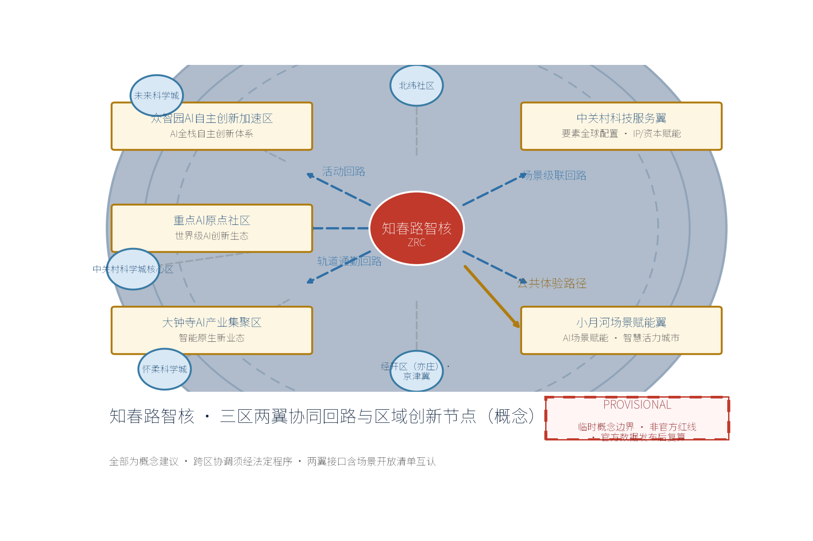
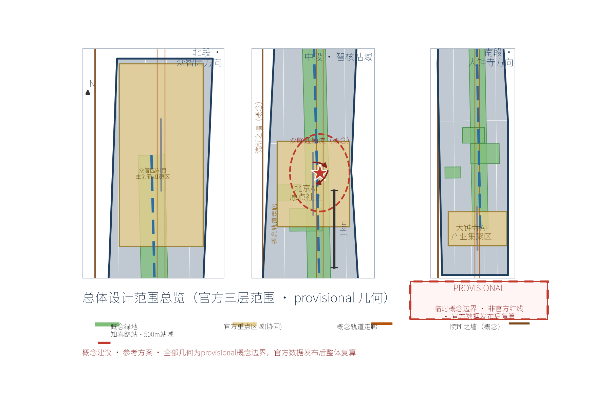
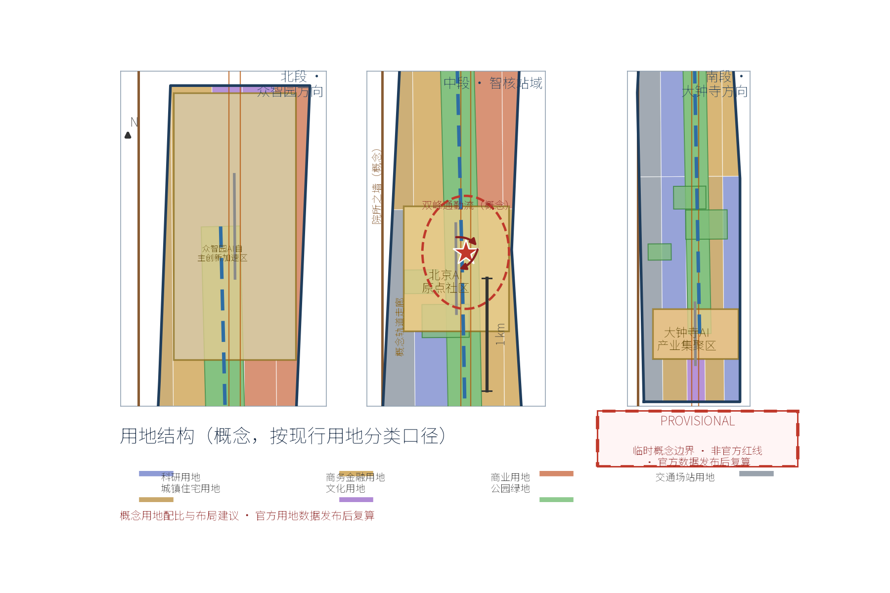
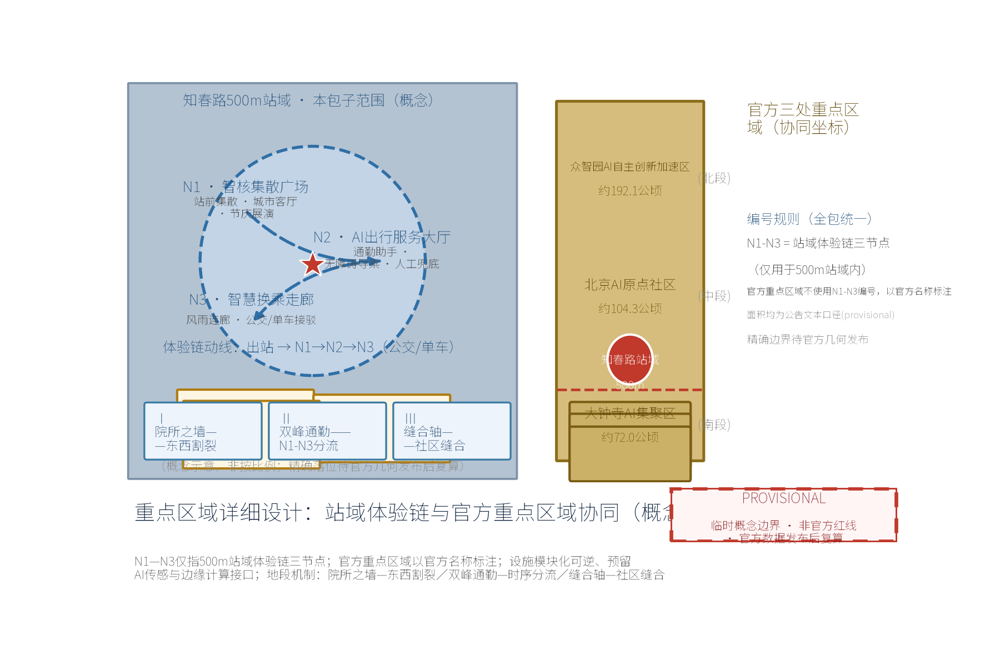
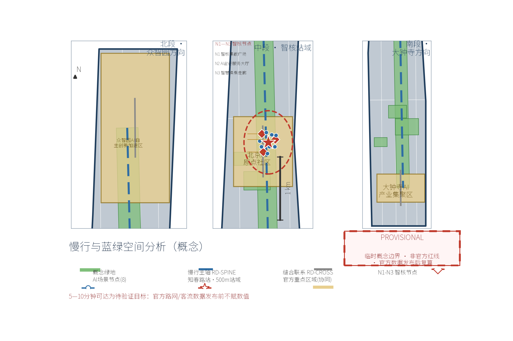
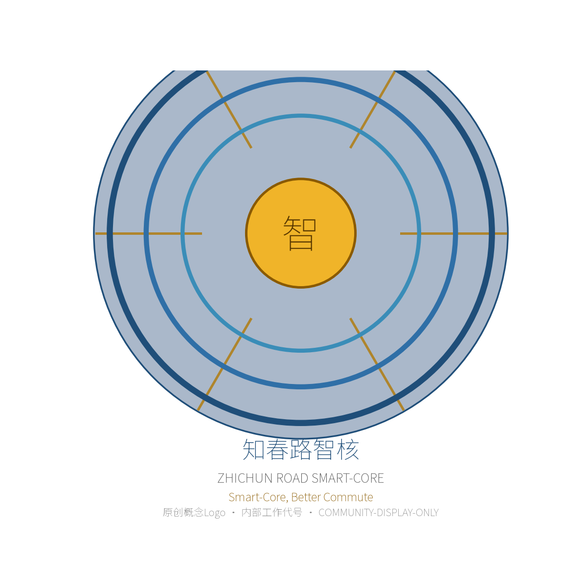
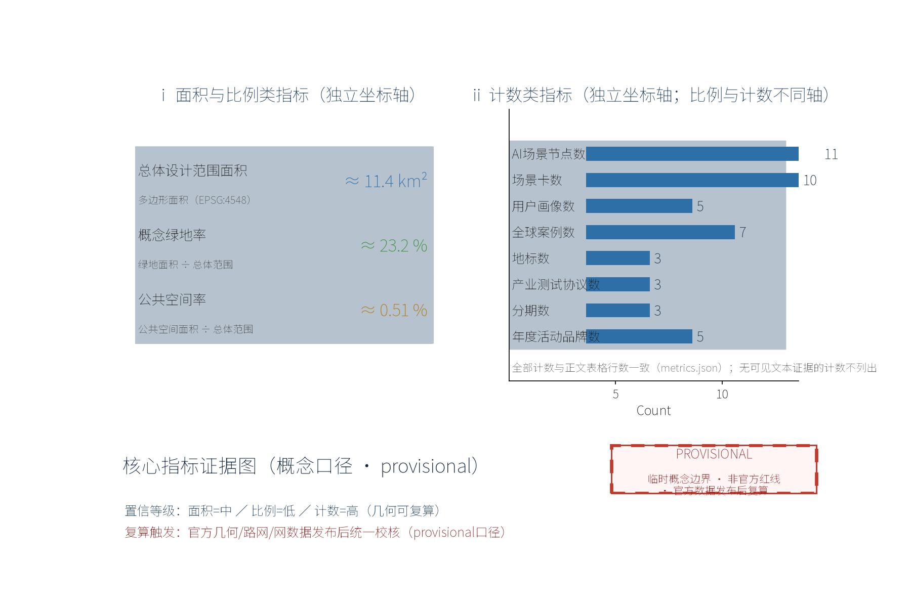

——OPEN CITY · HAIDIAN 百年京张AI创新带城市设计征集概念方案

## 设计依据与资料清单

本方案以《OPEN CITY·HAIDIAN 百年京张AI创新带城市设计征集任务书》为总依据（[source:DATA-SRC-AGENT-TASKBOOK-2026-05-18]），统筹引用以下资料：

其一，上位法定规划，含《北京城市总体规划（2016年—2035年）》（[source:DATA-SRC-BEIJING-MASTER-PLAN-2035]）与《海淀分区规划（国土空间规划）（2017年—2035年）》（[source:DATA-SRC-HAIDIAN-DISTRICT-PLAN-2019]）。

其二，专项与行业依据，含北京市轨道交通线网规划（[source:DATA-SRC-RAIL-NETWORK-PLAN-2022]）、知春路站换乘与设施公开资料（[source:DATA-SRC-BJSUBWAY-ZHICHUNLU-STATION]）、《城市轨道交通线网规划标准》（[source:DATA-SRC-RAIL-NETWORK-STD-GBT50546]）、《无障碍环境建设法》（[source:DATA-SRC-BARRIER-FREE-ENVIRONMENT-LAW]）、《无障碍设计规范》（[source:DATA-SRC-ACCESSIBILITY-DESIGN-STD-50763]）、《北京市城市更新条例》（[source:DATA-SRC-BEIJING-URBAN-RENEWAL-REG-2022]）以及完整居住社区建设标准（[source:DATA-SRC-COMPLETE-COMMUNITY-STD-2020]）。

其三，地段研究资料，含中关村科学城规划与核心区范围（[source:DATA-SRC-ZHONGGUANCUN-SCIENCE-CITY]）、电子信息街区现状踏勘记录；其四，数据方法假设，含公交IC卡、共享单车、手机信令等公开脱敏数据的匿名聚合方法设想（[source:DATA-SRC-ZHICHUNLU-TRAFFIC-HYPOTHESIS-2026]）。

特别说明：其一，截至方案提交日，知春路所在街区尚无公开可核验的"在编详细规划"成果全文，本方案不以任何未公开的在编详细规划作为设计依据，相关表述一律按"待官方发布后校核"处理，不作为正式依据引用；其二，本方案涉及范围边界均为provisional初始口径，须待主办方官方几何复算后统一修正；文中全部面积、规模、投资类指标均为概念口径，仅用于方向论证与方案比选，不构成法定规划承诺，不用于核算与报批；其三，现状照片、测绘草图、踏勘记录及客流类数据在当前公开渠道无法核验原始凭证，本方案将此类内容一律按"待验证假设（hypothesis）"处理，不作为事实结论引用。

> **证据锚点**：[source:DATA-SRC-OFFICIAL-ANNOUNCEMENT-2026-05-09]、[source:DATA-SRC-AGENT-TASKBOOK-2026-05-18]（组织方公告与任务书为文本口径依据）。

## 三层范围工作框架

按照任务书要求，本方案采用"统筹研究—总体设计—重点区域"三层范围逐级深化的工作框架，并保持与官方公告三层范围口径一致（官方文本口径：统筹研究范围约43.6平方公里、总体设计范围约11.4平方公里、重点区域合计约368.4公顷，自北向南为众智园AI自主创新加速区约192.1公顷、北京AI原点社区约104.3公顷、大钟寺AI产业集聚区约72.0公顷）。第一层统筹研究范围，覆盖知春路站周边较大区域，含中关村与学院路之间的纵深地带，开展产业、人口、出行结构与未来城市研究，回答"为谁设计、为何在此"的战略问题。第二层总体设计范围，以 provisional 研究边界为底（见范围口径表），按控规深度方法开展用地、强度、高度、街道、地下空间与更新方案研究，形成可衔接规划管理的城市设计通则与图则草案。第三层重点区域详细设计范围，对应官方三处重点区域中的知春路—大钟寺方向站城界面：本方案的服务对象（概念子范围）为知春路站500米半径站域（「智核」），位于总体设计范围之内、与大钟寺AI产业集聚区相邻，站域内设N1—N3三节点体验链，达到建筑环境一体化概念设计深度；官方三处重点区域在本方案中作为协同坐标（以官方名称标注于图件），其各自的详细设计由对应的子主题方案完成。三层之间建立"指标传导—图则对应—实施校验"的反馈机制；各层边界均为provisional口径，指标仅按概念口径表达，待官方几何复算后统一校核。

**官方三层范围与本包子范围（口径表，provisional，数值仅作量级表达）**：

| 官方范围层（公告口径） | 几何来源 | 面积（公告文本口径/provisional） | 指标分母 | 本方案用途 |
|---|---|---|---|---|
| 统筹研究范围 | 无独立几何（研究性范围） | 约43.6平方公里（官方文本口径） | 不参与指标分母 | 产业、人口、出行结构与未来城市研究 |
| 总体设计范围 | geometry/site_boundary.geojson | 约11.4平方公里（官方文本口径；metrics.site_area_sqm，provisional） | green_ratio、public_space_ratio 等面积类指标分母 | 用地、强度、街道、地下空间与更新方案研究 |
| 重点区域（三处） | geometry/key_areas.geojson（KEY-ZHON/KEY-BEIJ/KEY-DAZH） | 合计约368.4公顷（官方文本口径，provisional）：众智园约192.1/北京AI原点社区约104.3/大钟寺约72.0公顷 | 不进入面积类指标分母 | 三处重点区域为本方案协同坐标，图件以官方名称标注 |
| 本包子范围（概念） | 知春路站500米半径站域（「智核」，几何见 geometry/public_space.geojson 的N1—N3节点与站域示意） | 500米半径站域不单独计面积 | 不进入面积类指标分母 | 三节点（N1-N3）详细设计、场景落位与客流动线组织 |

口径说明：500米半径仅作为本包子范围人本可达性的概念口径（步行5-10分钟），不用于任何面积指标的分母；本包子范围不是官方第四处重点区域，官方三处重点区域的面积精确值一律以官方复算结果为准，正文只显示官方文本口径约数。

> **证据锚点**：[source:DATA-SRC-AGENT-TASKBOOK-2026-05-18]、[source:DATA-SRC-OFFICIAL-ANNOUNCEMENT-2026-05-09]、[metric:site_area_sqm]（三层范围划分依据任务书与公告官方文本口径及 provisional 几何）。

本方案按任务书三大定位（百年京张文化带、都市AI生活体验带、AI融合创新带）与五大功能（AI全栈自主创新体系、世界级AI创新生态、AI+场景赋能新范式、智能化AI活力城市、AI治理全球话语权）中的轨道交通与站城融合相关方向展开，作为「AI+场景赋能新范式」与「智能化AI活力城市」的功能载体之一（概念映射）。

## 统筹研究范围产业与未来城市研究

统筹研究范围的产业底色是"科研院所＋电子信息＋创新创业"。范围内密布科研院所、国家实验室与高校，与中关村核心区、学院路沿线科技企业构成"基础研究—技术开发—产业落地"完整链条；电子元器件与信息服务业街区构成北京电子信息产业重要腹地。面向未来，研究提出三大判断：其一，AI与软件定义产业使职住空间更趋混合，站域应容纳弹性办公、孵化器与共享实验室；其二，通勤结构呈"短距离慢行＋轨道长距离"双峰特征，接驳品质决定枢纽竞争力；其三，存量社区更新将释放大量"家门口的AI场景"。据此形成"轨道枢纽＋创新极核＋宜居社区"的未来城市形态：以知春路站为智核，500米内混合布局创新业态与生活服务，向外圈层过渡为科研街区与成熟社区，构建职住平衡、全天候活力的未来城市单元，使枢纽从"经过地"变为"目的地"。

### 知春路地段问题诊断与独特因果链（概念）

本方案的核心场景并非通用智慧城市模块的简单堆叠，而是从知春路地段三个具体矛盾推导而来（全部为概念判断，基于公开口径，见 [source:DATA-SRC-ZHONGGUANCUN-SCIENCE-CITY]、[source:DATA-SRC-PROVISIONAL-BOUNDARIES-2026-06-05]）：

其一，**"院所之墙"与社区日常的冲突**：知春路—学院路沿线科研院所与大学多以封闭院落方式布局，临街界面缺乏公共服务与夜间活力，步行通勤者与周边社区居民"看得见、进不去"；由此推导AI社区服务站、临街界面开放、共享实验室预约与"揭榜挂帅"转化机制等场景，回应"从实验室到街头"的创新流动。

其二，**京张遗址线性空间的东西割裂**：京张遗址公园活力带与轨道设施在知春路一带形成南北向线性屏障，东西两侧科研街区与居住社区被分隔；由此推导三条概念性东西缝合联系（RD-CROSS-00/01/02）与无高差过街、共享空间设计，以及沿遗址带的"一轴一核"公共空间骨架，把历史线性遗产转化为缝合城市而非分割城市的资源。

其三，**"短距离慢行＋轨道长距离"双峰通勤结构**：中关村科学城核心区（知春路、学院路为2011年确定的核心区边界要素）职住分离明显，早高峰向园区汇聚、晚高峰回流社区；由此推导通勤助手、客流可视化与调度公示、共享单车动态调度等场景的优先级排序——先解决高峰换乘痛点的"准点"问题，再谈"体验"问题。

上述因果链是场景卡、空间落位与运营机制之间的统一逻辑主线（概念），也是"智核"区别于一般TOD的原创性基础：它不是把AI"贴"在枢纽上，而是让AI场景从地段矛盾中生长出来；该判断的现状证据（封闭院落比例、实际过街需求、潮汐客流强度）当前无公开可核验定量数据，已登记为待验证假设（[source:DATA-SRC-ZHICHUNLU-TRAFFIC-HYPOTHESIS-2026]），试点前须经现场踏勘与客流调查复核。

> **证据锚点**：[source:DATA-SRC-PROVISIONAL-BOUNDARIES-2026-06-05]（边界为 provisional，研究范围仅作概念示意）。

## 三区两翼协同回路与区域创新节点（概念）

本方案把「智核」放入"三区两翼"协同框架中定位（概念映射）：知春路智核作为三区两翼协同回路的换乘中枢，向南承接中关村科学城核心区的创新溢出，向北经学院路街区链接北部研发腹地，并以概念性协同回路与五个区域创新节点建立双向联系：北纬社区（学院路—北航—北邮科创街区）、中关村科学城核心区、未来科学城、怀柔科学城、经开区（亦庄）—京津冀协同发展方向。协同回路机制（全部为概念建议、参考方案）：其一，轨道通勤回路——利用10号线、13号线及未来轨道加密预留，组织"站到站"人才与信息流；其二，场景级联回路——把智核的AI出行场景与各节点的产业场景互相开放接口，形成"场景开放—数据匿名聚合—能力回流"的循环；其三，活动回路——年度活动体系在各节点轮换举办，共享品牌与内容资产。上述回路均属方向性建议，涉及跨区协调事项须经法定程序与相关主体确认。

### 小月河场景赋能翼的角色、接口与公共体验路径（概念）

按任务书口径，小月河场景赋能翼承担"AI场景赋能与智能化AI活力城市"职能（[source:DATA-SRC-AGENT-TASKBOOK-2026-05-18]）。本方案据此建立智核与小月河翼的显式映射（概念建议）：其一，角色分工——智核作为"站城接口"提供高频通勤场景（通勤助手、无障碍导乘、客流可视化），小月河翼作为"场景放大与生活实验场"承接低频深度体验场景（无高差慢行体验段、多语导览、声景装置、社区共创试验）；其二，场景接口——双方共用一份"场景开放清单"（智核发布通勤与出行类开放接口，小月河翼发布滨水与体验类开放接口），试点数据按匿名聚合口径互通，测试验证协议互认（见"产业测试验证与试点责任矩阵"一节）；其三，公共体验路径——形成"站前广场（N1）→AI出行服务大厅（N2）→智慧换乘走廊（N3）→社区绿廊→小月河场景赋能翼公共体验路径"的连续动线，绿廊与慢行主轴（RD-SPINE）作为两翼之间的物理衔接，活动排期互认、多语导览与无障碍服务标准一致；其四，与中关村科技服务翼的接口——科技服务翼提供技术转移、标准与合规公共服务及IP/资本赋能通道，智核与小月河翼作为其"场景侧"接口点：智核提交场景开放清单与测试验证备案、小月河翼提交体验场景数据化需求，科技服务翼输出数据治理方法、标准接口与转化通道，形成"要素服务—场景试验—能力回流"的闭合回路。上述映射全部为概念建议，跨主体事项须经各方协议确认；两翼接口在合规矩阵与场景矩阵中登记对应条目。

> **证据锚点**：[source:DATA-SRC-AGENT-TASKBOOK-2026-05-18]（协同与品牌运营条目对应任务书要求）。

## 全球AI创新生态案例与机制迁移（有来源）

选择七个真实全球案例作为机制参照（仅作方法论借鉴，非承诺复制；案例事实以各发布主体公开口径为准；逐案例采用项目/报告/公告页级来源，URL、发布与访问日期登记于 sources.json，不使用仅指向机构主页的引用）。

| 案例 | 城市 | 年份 | 运营主体 | 可迁移机制 | 来源 |
|---|---|---|---|---|---|
| 裕廊湖区（Jurong Lake District） | 新加坡 | 2019— | 新加坡市区重建局（URA） | 枢纽驱动的创新片区规划、慢行优先的站城一体 | GLOBAL-CASE-JURONG-2016 |
| 东京站丸之内再开发 | 日本东京 | 2007— | JR东日本 | 车站综合体与商务区一体化开发、地下连通 | GLOBAL-CASE-TOKYO-2007 |
| 国王十字（King's Cross）更新 | 英国伦敦 | 2008— | King's Cross Central（开发商联合体） | 存量车站区整体更新、知识经济场景导入 | GLOBAL-CASE-KINGSX-2008 |
| 哈德逊广场（Hudson Yards） | 美国纽约 | 2012— | Related Oxford | 轨道上盖平台开发、公共空间与科技场景结合 | GLOBAL-CASE-HUDSON-2012 |
| 虹桥综合交通枢纽 | 中国上海 | — | 上海市规划和自然资源局（规划组织方） | 空铁联运枢纽与商务区联动、一体化步行网络 | GLOBAL-CASE-HONGQIAO-2008 |
| 前海深港现代服务业合作区 | 中国深圳 | 2010— | 深圳市前海管理局 | TOD与创新产业集群结合、制度型开放试点 | GLOBAL-CASE-QIANHAI-2010 |
| 数字媒体城（DMC） | 韩国首尔 | 2000— | 首尔特别市（SH公社代建运营） | 传媒科技集群与公共交通耦合、媒体设施共享 | GLOBAL-CASE-SEOUL-DMC |

案例年份口径说明：表中年份为各发布主体公开文件可追溯的机制启动/标志年份（裕廊湖区以2019年URA城市设计通告与2023年12月《裕廊湖区规划与城市设计指南》为据；东京站城修复工程开工为2007年JR东日本新闻稿；国王十字开发合伙2008年成立；哈德逊广场2012年启动建设（2019年正式开业）；前海以2010年8月国务院批复首个总体发展规划为据；首尔DMC以上岩新千年城计划2000年4月发布为据）。凡公开来源无法支撑的更精确时间节点，本方案不作表述——虹桥枢纽案例因已登记的项目页级文件（2025年专项规划草案公示、2023年综合交通规划）未含可直接引用的启动年份，年份栏留空，仅作机制借鉴。

迁移结论（概念）：七个案例共同印证"轨道枢纽＋创新功能＋高品质公共空间"的组合有效性；本案据此形成AI创新生态图谱的三大圈层——枢纽服务圈（站域内）、创新协同圈（三区两翼节点）、数据与算力支撑圈（市级与区域级设施），并以此组织要素保障矩阵（见"要素保障矩阵与数据治理"一节）。

> **证据锚点**：[source:GLOBAL-CASE-JURONG-2016]、[source:GLOBAL-CASE-KINGSX-2008]（案例以发布主体公开文件为据，详见 sources.json）。

## 总体设计范围城市更新与控规深度城市设计

总体设计范围（约11.4平方公里，provisional）以知春路站为锚，落实"更新优先、增量做精"原则。对老旧社区以楼本体与环境微更新为主，对其间低效用地与危旧建筑实施小规模织补；鼓励科研院所临街界面开放共享，形成创新街道；对商业与轨道用地适度复合化，支持上盖与地下空间一体化开发的概念研究。按控规深度方法落实：优化用地功能配比，站点核心圈层强化交通与公共服务功能，外圈层保持居住与科研主导；提出容积率、建筑高度与贴线率梯度建议，塑造由站到城"山形"递减的轮廓；制定街道断面、退线、色彩与第五立面通则草案；划定地下空间连通概念廊道。设计成果为城市设计图则与导则草案，可作为专业团队深化研究与在编控规衔接的参考方案；所有边界与指标均为provisional概念口径，留待官方几何复算校核，如需固化为规划控制要求，须另行履行法定审定程序，本方案不自行宣布任何控制结论。

> **证据锚点**：[source:DATA-SRC-MOHURD-CONTROL-DETAILED-PLANNING]、[source:DATA-SRC-PROVISIONAL-BOUNDARIES-2026-06-05]（控规方法参照与 provisional 边界警示）。

## 重点区域详细设计

重点区域详细设计聚焦本包子范围——知春路站500米半径站域（「智核」），以"N1—N3三节点"构建完整的人本体验链。编号与空间含义统一如下（全包一致）：N1智核集散广场、N2 AI出行服务大厅、N3智慧换乘走廊均位于站域之内，沿"出站—换乘—接驳"动线连续布置，是站域体验链的组成部分；官方三处重点区域（众智园、北京AI原点社区、大钟寺）不采用N1—N3编号，在本方案图件与矩阵中以官方名称标注，仅作为协同坐标。第一节点（N1）为智核集散广场：整合地铁出入口与公交站台集散流线，设置分级落客区、无障碍坡道与韵律铺装；广场兼具城市客厅功能，配置可移动座椅、水景与艺术装置，日常供休憩交往，节庆可变身为展演场地。第二节点（N2）为AI出行服务大厅：设于站厅与广场交界处，提供通勤助手（实时路况与个性化推荐路线）、无障碍导乘（语音、触觉与视频手语多模态）、实时客流可视化大屏，并设人工服务兜底窗口，确保老年人与残障人士均能从容出行。第三节点（N3）为智慧换乘走廊：以风雨连廊串联轨道、公交站台、共享单车停放区与周边楼宇开放空间，配信息屏、照明与防滑铺装，实现全天候舒适换乘。三节点均采用模块化、可逆的设施体系，便于随客流变化灵活调整，并预留AI传感器与边缘计算接口条件。节点编号 N1-N3、比例尺、指北针与图例见本节点索引图；三处重点区域在索引图中以官方名称与"协同坐标（概念）"图例标注，避免与站域节点编号混淆。

> **证据锚点**：[data:PACKAGE-GEOMETRY]（N1-N3三节点示意多边形来自本包 geometry/public_space.geojson，官方三处重点区域多边形来自 geometry/key_areas.geojson）。

## 公共空间策略、缝合轴、业态与地标体系（概念）

**京张遗址公园公共空间策略（概念）**：沿京张遗址公园活力带分段组织公共空间——历史展示段（保留铁轨与站房记忆要素的概念展示、时间轴装置）、慢行活力段（与N3智慧换乘走廊衔接的骑行与步行道、信息柱）、社区共享段（口袋公园、街角花园与社区服务角）；策略要点包括透水铺装与雨水花园、夜间安全照明、与元大都城垣遗址公园方向绿道系统的概念衔接；该带与站前广场构成"一轴一核"的公共空间骨架（建议性，详情以专项研究为准）。

**东西缝合与南北贯通（概念）**：东西缝合——利用三条概念性横向缝合联系（见 geometry/roads.geojson 中 RD-CROSS-00/01/02，东西向）把京张遗址公园活力带两侧的科研街区和居住社区重新连接，交叉口采用无高差过街与共享空间；南北贯通——沿知春路与遗址公园带组织纵向贯通慢行主轴（RD-SPINE），串联站前广场、三节点与社区绿廊，形成"一站贯通、东西缝合"的完整慢行骨架。

**大钟寺业态建议（概念）**：依托大钟寺AI产业聚集区（约0.72平方公里，provisional）提出概念业态组合——AI开放实验室与共享中试空间、数字媒体体验馆、智能硬件与机器人展示门店、面向创业者的小型会议与路演空间、以及依托轨道客流的夜经济餐饮街；全部为业态方向建议，具体引入以市场与产业政策为准。

**三地标目录（概念，对应 landmark_count=3）**：

| 地标 | 定位 | 设计要点（概念） | 运营建议（概念） |
|---|---|---|---|
| N1 智核集散广场 | 站前集散＋城市客厅 | 分级落客区、无障碍坡道、韵律铺装、可移动座椅与艺术装置 | 节庆展演场地轮换、活动报批 |
| N2 AI出行服务大厅 | 通勤助手＋无障碍导乘 | 多模态导乘台、客流可视化大屏、人工兜底窗口 | 授权经营试点、体验官计划 |
| N3 智慧换乘走廊 | 风雨连廊＋多方式接驳 | 信息屏、照明、防滑铺装、单车驿站接口 | 月度换乘评测、志愿者引导 |

**荣誉展示体系（概念）**：在智核集散广场设置"百年京张—中关村创新荣誉墙"概念装置，与年度活动体系联动展示创新成果与市民共创作品，内容实行季度人工复核与主题轮换（建议性）。**设施组件库（概念）**：建立模块化可逆设施组件目录——连廊标准段、信息柱、座椅、智慧灯杆、导乘台、艺术装置基座，统一尺寸与接口规则，实现"先试点拼装、后批量生产"，降低更新成本与废弃风险；组件库随试点评估滚动修订（概念建议）。

**片区机制联动（概念）**：众智园AI自主创新加速区——"揭榜挂帅＋加速营"机制建议，依托智核产业服务场景发布需求；北京AI原点社区——"场景验证＋社区共创"机制建议，把社区服务站作为场景验证前端；中关村科技服务翼——为站域企业提供技术转移、标准与合规公共服务的对接机制建议（建议与中关村类科技服务机构主体衔接）。以上联动机制均为概念建议，涉及跨主体事项须经各方协议确认。

## AI 创新生态、人才画像与 AI+ 场景

站域人群归纳为五类人才画像：科研人员与工程师，追求高效准点与静谧交流；创业青年与自由职业者，依赖弹性工位与快速接驳；高校师生，错峰出行、需求多样；通勤族，早晚高峰热切换乘；老年人与儿童等社区人群，需要慢行安全与人工关怀。五类人才画像对应关系如下表，并在场景卡中逐项落实响应机制：

| 人才画像 | 核心需求 | 场景响应（概念） | 无障碍与公共关怀 |
|---|---|---|---|
| 科研人员与工程师 | 准点接驳、静谧交流空间 | 通勤助手、站域共享实验室预约 | 无感通行、低干扰环境 |
| 创业青年与自由职业者 | 弹性工位、快速接驳 | 弹性办公预约、共享单车调度 | 24小时照明与安全巡护 |
| 高校师生 | 错峰出行、多样化需求 | 客流可视化与动态调度 | 学生优惠与信息无障碍 |
| 通勤族 | 高峰热切换乘 | 实时路况推送、换乘走廊 | 高峰人工引导岗 |
| 老年人与儿童等社区人群 | 慢行安全、人工关怀 | AI社区服务站、适老代办 | 人工兜底窗口、儿童友好通道 |

**残障人士旅程与共创验证（概念）**：残障人士（含视听与行动障碍）的完整旅程覆盖"出家门—进站—换乘—到达"四个环节：出家门环节由AI社区服务站提供路线预演与预约引导；进站环节由多模态导乘（语音、触觉、手语视频）与人工值守协同；换乘环节依托无高差连廊与盲道连续性保障；到达环节提供目的地信息播报与求助按钮。共创验证过程包括：其一，试点期间邀请残障人士代表、老年人代表与社区居民组成体验小组，对导乘终端、连廊坡度和人工服务窗口进行月度实测反馈；其二，投诉申诉渠道公开（线上通道＋站内服务台），受理响应时效对外公示；其三，服务失败补偿机制按"人工终止优先"原则设计——任何AI服务失效时一键切换人工办理，并对造成的误乘损失提供票务补偿或改签协助。法律边界说明：依据《无障碍环境建设法》第39条，现场指导与人工服务的要求仅适用于该条列举的医疗、社会保障、金融、生活缴费等特定法定公共服务事项，本案的人工兜底设计系自愿增强的公共承诺，不泛化为对全部公共空间或数字界面的法定解释，具体合规须由专业机构单独判断。**验证计划（概念）**：上述补偿方案、月度共创频率与无障碍技术参数目前均为方案提议，尚未经代表性用户或运营主体验证；拟在试点启动后按"首期3个月体验小组实测（残障人士代表、老年人代表、社区居民，每组8—12人）→ 参数与流程修订 → 试点期结束前复测"的节奏验证，导乘终端与坡道参数按现行《无障碍设计规范》（[source:DATA-SRC-ACCESSIBILITY-DESIGN-STD-50763]）校核，验证结论随试点评估公开，未验证前不宣称已达到任何法定或运营标准。

AI场景按六域组织：AI出行服务（通勤助手、共享单车调度）、AI公共空间（智慧灯杆、环境传感）、AI无障碍服务（多模态导乘，公共服务兜底）、AI社区服务（政务代办、适老服务）、AI治理公示（客流可视化与调度公示）、AI产业服务（科研院所与科创企业的数字化对接示范），并与站域文化体验（声景与艺术装置导览）衔接。各域场景卡均标注空间落点、运营主体建议与合规边界，先试点评估、后扩面复制。所有场景坚持"数据匿名聚合＋人工复核"双保险：个人数据不出站、不溯源画像，关键决策保留人工确认环节，设施按模块化可逆原则布设，强调AI嵌入通勤日常但不架空人工服务，以"技术透明、人机协同"赢得居民信任。

> **证据锚点**：[source:DATA-SRC-GENERATIVE-AI-INTERIM-MEASURES]、[source:DATA-SRC-BARRIER-FREE-ENVIRONMENT-LAW]（AI生成内容治理与无障碍法第39条边界的参照依据）。

## 场景卡索引（概念，10项）

十张场景卡覆盖六域场景与站域文化体验，每卡给出落位空间、运营主体建议、数据边界、人工复核、离线替代、KPI与退出条件（全部为概念建议、参考方案）：

| 场景卡 | 落位空间 | 运营主体建议 | 数据边界 | 人工复核 | 离线替代 | KPI | 退出条件 |
|---|---|---|---|---|---|---|---|
| 通勤助手 | 智核集散广场通勤信息柱 | 轨道运营方＋第三方服务商 | 匿名聚合，不追踪个体 | 推荐异常时人工确认 | 静态时刻表与人工问询 | 月活跃使用率 | 连续三月投诉率超限 |
| 无障碍AI导乘 | AI出行服务大厅多模态导乘台 | 轨道运营方＋公益组织 | 端侧处理，不留存 | 人工值守随行 | 纸质大字导乘卡 | 服务满意度 | 无障碍回访不达标 |
| 客流可视化与调度 | 智慧换乘走廊行车厅 | 轨道运营方 | 聚合客流，禁过度监控 | 调度指令人工审批 | 人工广播与现场引导 | 高峰疏散达标率 | 预测偏差超阈值 |
| 共享单车智能调度 | 骑行驿站与电子围栏区 | 单车企业＋街道办 | 仅车辆位置聚合 | 投放计划人工审核 | 定点停放督导岗 | 乱停放投诉量 | 围栏误判率超标 |
| 智慧灯杆与环境传感 | 站前广场与连廊 | 区属平台公司 | 环境数据匿名聚合 | 异常告警人工处置 | 基础照明常开 | 节能率与故障率 | 运维成本超预算 |
| AI社区服务站 | 站前社区服务角 | 社区居委会＋志愿团队 | 人工复核，可一键关闭 | 政务代办双人复核 | 线下柜台 | 办结率与满意度 | 试点评估不通过 |
| 非机动车停放引导 | 换乘走廊两侧 | 街道办＋停车管理公司 | 仅泊位占用聚合 | 超容告警人工分流 | 物理诱导与督导 | 停放规范率 | 泊位周转不达标 |
| 站域公共事件播报 | 枢纽信息屏 | 轨道运营方 | 只读公开信息 | 内容上线人工审签 | 静态公告栏 | 信息准确率 | 审签流程失效 |
| 适老人工代办与语音指引 | AI社区服务站内专席 | 社区＋专业服务机构 | 生物特征不采集 | 全程人工陪同办理 | 电话与上门代办 | 高龄覆盖人次 | 隐私评审未通过 |
| 声景与艺术装置导览 | 广场与绿廊装置节点 | 文化运营机构 | 仅统计到访聚合 | 内容季度人工复核 | 纸质导览手册 | 参与人次 | 装置破损率超标 |

> **证据锚点**：[source:DATA-SRC-AGENT-TASKBOOK-2026-05-18]（场景卡要求对应任务书条目）。

## 场景—空间—运营矩阵与TRL（概念）

**场景—空间—运营矩阵**（10项场景在空间与运营机制上的一一对应）：

| 场景 | 空间落位 | 运营主体 | 机制要点（概念） |
|---|---|---|---|
| 通勤助手 | N1广场信息柱 | 轨道运营方＋服务商 | 预约推送＋人工兜底 |
| 无障碍导乘 | N2服务大厅 | 轨道运营方＋公益组织 | 多模态＋人工值守 |
| 客流可视化 | N3行车厅 | 轨道运营方 | 实时公示＋年度评估 |
| 单车调度 | 骑行驿站 | 单车企业＋街道办 | 积分激励＋电子围栏 |
| 智慧灯杆 | 广场与连廊 | 区属平台公司 | 物联感知＋能耗管理 |
| 社区服务站 | 社区服务角 | 社区＋志愿团队 | 议事征集＋月度轮换 |
| 停放引导 | 走廊两侧 | 街道办＋停车管理 | 泊位聚合＋督导分流 |
| 事件播报 | 枢纽信息屏 | 轨道运营方 | 只读公开＋人工审签 |
| 适老人工代办 | 社区服务站专席 | 社区＋专业机构 | 不采集生物特征＋全程人工陪同 |
| 声景导览 | 广场绿廊装置 | 文化运营机构 | 到访聚合＋季度复核 |

**技术就绪度（TRL）估计表**（推理口径：TRL区间按公开技术成熟度证据估计，均为概念估计、不构成技术承诺；逐行"可复核依据"为公开来源类别，逐项URL、发布与访问日期登记于 [source:DATA-SRC-TRL-BASIS-2026-08-25] 的 TRL-EVID-01—10 条目；进入试点立项时须按立项评审重新评定。凡无法提供公开可复核依据的技术，本表一律不做TRL分级）：

| 场景/技术 | TRL估计 | 可复核依据（逐项登记于sources.json条目TRL-EVID-01—10） | 说明 |
|---|---|---|---|
| 实时客流可视化大屏 | 8-9 | 北京地铁"智慧乘客信息导乘系统"公开报道（北京市政府门户2023-03-24）；上海地铁客流实时信息显示为公开资料（TRL-EVID-01） | 本方案仅做展示位设计 |
| 通勤助手个性化推荐 | 7-8 | 高德/百度地图路线规划与AI个性化推荐公开产品文档（厂商公开文档，无发布日期，置信降低）（TRL-EVID-02） | 站内信源接入需接口协商 |
| 多模态无障碍导乘 | 5-7 | 纽约MTA StationLab无障碍导乘试点（2019-10至2020-01）；英国Connected Places Catapult手语虚拟助手Luna（2025-04-11发布）（TRL-EVID-03） | 需定制站务语料与评测 |
| 单车电子围栏调度 | 7-8 | 深圳市交通运输局北斗高精度定点停放试点（2020-09-14）；武汉市电子围栏规模化部署（2023-12-08）（TRL-EVID-04） | 接入企业平台即可试点 |
| 智慧灯杆与边缘计算 | 6-7 | 福州市智慧灯杆边缘智能网关示范（2024-05-13）；智慧灯杆边缘计算团体标准T/GDEIIA 8-2021（2021-07-22）（TRL-EVID-05） | 与市政杆体改造绑定 |
| 客流预测与动态调度 | 5-6 | 北京地铁全路网客流分析预测公开报道（2023-03-24）；地铁客流预测公开研究（arXiv论文，2024-10发布，编号见sources.json TRL-EVID-06）（TRL-EVID-06） | 调度指令人工审批 |
| AI社区政务服务代办 | 4-6 | 上海徐汇区政务大模型（上海市人民政府门户2024-06-26）；广州市"穗智政"政务智能体发布（2024-07）（TRL-EVID-07） | 双人复核＋法定边界 |
| 声景与艺术装置交互 | 5-7 | 波士顿"城市的脉搏"互动装置（boston.gov，2019-11-23）；蒙特利尔River Lines互动铺装（艺术工作室官网）（TRL-EVID-08） | 内容季度人工复核 |
| 适老代办与主动关怀 | 4-5 | 武汉市人工智能养老服务社会实验（2024-07-10）；工信部等部门智慧健康养老试点示范名单（2024年发布）（TRL-EVID-09） | 不采集生物特征 |
| 站域统一数据中台 | 4-6 | 泰州市公共数据平台上线发布会（2023）；雄安"雄安数融通"城市可信数据空间（2025-08-01）（TRL-EVID-10） | 匿名聚合＋权限隔离 |

**AI技术评测与运行监测协议（概念，对应任务书"AI+场景"的技术可信要求）**：以上场景在试点前须通过四项技术协议方可放行（全部为概念建议，正式标准以试点立项文件为准）：其一，**模型评测协议**——每个AI服务上线前完成功能正确性、无障碍兼容与极端输入集评测，评测集与结果公开、可人工复核，通关阈值与评测口径写入试点立项文件；其二，**数据质量协议**——训练与运行数据的来源、时间戳、缺失率与口径偏差逐项登记，匿名聚合值与人工抽样对照误差超限即视为质量不合格，不得用于调度等关键决策；其三，**误差分群协议**——预测与识别类服务的误差按时段、人群、天气与事件四类维度分群统计，任何群体误差超阈值即触发该群体的功能降级与人工接管，防止"平均误差达标、特定群体失效"；其四，**运行监测协议**——试点期间按周输出运行监测报告（在线率、告警、人工接管次数、投诉与误用），监测结果随年度公示一并公开，连续两期不达标即进入退出流程（与场景卡退出条件衔接）。上述四项协议与场景卡的KPI、退出条件、产业测试验证协议三层衔接，确保"概念可感知"与"工程可复核"之间不出现断层；协议本身的执行情况在试点评估报告与年度公示中公开。

> **证据锚点**：[depth:scenario_card_system]（场景卡与矩阵的设计深度条目见 design_depth_matrix.json）。

## 用地、建筑规模与拆改留方案

依据provisional边界与概念口径，约11.4平方公里总体设计范围内用地以轨道交通设施、科研办公、商业服务、居住及其配套为主，公共服务设施沿主街分布。概念性建筑规模仅作量级表达：站域总建筑规模以存量为主、增量为辅，更新改造与添建占比控制从紧，强调"存量优先、精准增量"。拆改留方案坚持"留改拆"排序：保留——结构完好、风貌可用的科研建筑、商业与成龄社区，通过功能置换与共享化改造激活；改造——老旧住宅实施节能、无障碍与楼道公共化改造，低效商业开展立面与功能更新，轨道周边建筑实施一体化连通改造的概念研究；拆除——仅针对危房、违建及阻断慢行廊道的障碍建筑，拆除后优先补充广场、绿地与接驳设施。全部处置建立在逐栋评估档案基础上，涉及居民利益事项依法履行公示、协商与补偿程序，确保更新过程公开、公正、可监督；任何拆除与改造清单均为概念示例，须经法定程序确认后方可实施。

> **证据锚点**：[source:DATA-SRC-MNR-LAND-USE-CLASSIFICATION-202311]（用地分类名称参照现行国标口径）。

## 交通、轨道、市政与公共服务设施

交通体系以轨道为核心：强化10号线与13号线知春路站换乘的流畅性，优化出入口与站厅衔接，预留未来线路与轨道加密的工程条件。接驳组织贯彻"慢行为先"：构建以站点为中心的放射状慢行网络，步行与骑行优先，轨道、公交、共享单车与步行协同组织。"5—10分钟可达全覆盖"在本方案中为**待验证目标（to-be-verified goal）**而非已量化结论：当前包内路网为概念线（geometry/roads.geojson，RD-SPINE与三条缝合联系），官方路网与客流数据发布前，本方案不给出可达覆盖率数值；验证方法、假设、结果与限制将按下列口径在官方数据发布后公开复算——方法：以官方路网为底网，按步行4.5km/h、骑行12km/h的等效时间栅格计算站点5/10分钟等时域与覆盖面积；假设：不跨障碍物直线估距，慢行过街按人行横道实际路径计；结果与限制：将随复算发布等时域图与覆盖清单，若覆盖率目标与实测不符则调整接驳设施布局（概念建议，不构成运营承诺）。重塑公交港湾与接驳通道，规范共享单车停放区并配电子围栏；对小汽车实施流量管控与P+R引导，压缩地面车行空间让位人行。市政设施结合更新同步实施：管线入地与共同沟预留、海绵城市与雨水花园、智慧井盖与物联感知、清洁能源与充电设施。公共服务按"枢纽服务＋社区服务"双圈配置：站内设失物招领、母婴室与应急医疗点，站外依托更新地块补充社区食堂、托育与养老驿站，实现枢纽功能与日常生活相互滋养、相互赋能。

> **证据锚点**：[source:DATA-SRC-MOHURD-URBAN-DESIGN-MEASURES]、[source:DATA-SRC-ZHICHUNLU-TRAFFIC-HYPOTHESIS-2026]（市政与慢行设计表述的方法参照；可达性为待验证目标，客流数据为假设登记）。

## 蓝绿空间、公共空间与城市风貌

蓝绿空间以"绿链串珠"整合站域绿地：沿知春路等主街构筑林荫绿廊，串联口袋公园与街角花园，并衔接周边公园及元大都城垣遗址公园方向的绿道体系，为通勤者提供"树荫下的5分钟"；广场与连廊采用透水铺装与雨水花园，绿地率按概念口径控制（概念绿地率约23.2%，以 metrics.green_ratio 为准），预留垂直绿化与屋顶绿化。公共空间形成"集散广场—智慧走廊—街道客厅—口袋公园"四级体系，强调全天候可用、多时段共享。城市风貌定位为"学院底蕴＋科技气质＋烟火生活"：建筑以宜人尺度与暖色砖石呼应学院路历史文脉，以轻盈的玻璃、金属与灯光演绎电子信息时代的科技感；统一街道家具、标识与夜景照明，形成可识别的"智核"视觉品牌；严控第五立面与天际轮廓，避免高反差体量破坏社区肌理。风貌控制建议纳入图则草案，供后续审批与建设研究参考；法定风貌要求须经控规编审等法定程序形成，本方案不预设结论。

> **证据锚点**：[source:DATA-SRC-MOHURD-URBAN-DESIGN-MEASURES]、[metric:green_ratio]（蓝绿空间组织的方法参照与概念指标）。

## 更新项目清单、实施政策与分期计划

按照"低门槛起步、快见效、可迭代"原则编制项目清单。近期（1—3年）：站前广场微改造、风雨连廊一期、AI出行服务大厅试点、公交港湾与共享单车区优化、无障碍设施补齐、口袋公园与绿廊首段。中期（3—5年）：连廊成网、老旧小区公共化改造、科研院所临街界面开放、地下空间连通概念工程。远期（5—10年）：站点上盖与周边地块一体化开发的概念研究、绿道全线贯通与街道品质整体提升。实施政策建议：依托城市更新条例推行"政府统筹＋市场主体＋居民参与"，可研究试点混合用地与容积率转移、风貌豁免清单与审批绿色通道（均须法定程序确认）；对AI设施试行"建设—运营—迭代"授权经营模式，明确数据治理与安全责任边界，志愿者与专业团队参与日常维护与运营评估。每期设置评估节点，依据客流与运行数据滚动修正项目清单，确保公共投资与公共价值动态匹配。

> **证据锚点**：[source:DATA-SRC-AGENT-TASKBOOK-2026-05-18]（分期与实施条目对应任务书要求）。

## 年度活动品牌与长期运营（概念）

建立"知春路智核"年度活动品牌体系（5项，全部为概念活动提案，具体档期以运营主体安排为准）：

| 年度活动品牌 | 时间 | 载体 | IP要素 | 公众参与方式 |
|---|---|---|---|---|
| 知春通勤周 | 每年5月 | 智核集散广场＋换乘走廊 | 通勤效率挑战、慢行地图发布 | 打卡集章、数据开放工作坊 |
| AI出行开放日 | 每年6月 | AI出行服务大厅 | 多模态导乘体验、开发者集市 | 预约体验、开发者展示报名 |
| 智慧换乘月 | 每年9月 | 智慧换乘走廊 | 换乘效率实测、接驳服务评测 | 志愿者测评、意见征集 |
| 站前广场夏季活动季 | 每年7—8月 | 广场城市客厅 | 声景装置展演、社区市集 | 免费展演、商户联合摊位 |
| 绿廊慢骑日 | 每年10月 | 绿廊与骑行驿站 | 慢行路线导览、骑行安全课堂 | 家庭报名、骑行社团联动 |

长期运营机制配套建议（概念）：其一，开发者社区——每季度一次场景开放接口说明会，开放匿名聚合数据沙箱与文档；其二，场景开放——按"先试点、后扩面"节奏开放场景，试点期数据与结论公开；其三，公众体验——年度活动与日常体验结合，设置"体验官"长期招募；其四，地标运营——三节点与声景装置实行"内容季度轮换＋维护责任清单"；其五，人才与企业转化——依托AI产业服务场景建立"需求发布—揭榜挂帅—成果落地"的转化机制建议，并与众智园、AI原点社区等节点联动（机制均为概念建议）。

> **证据锚点**：[source:DATA-SRC-AGENT-TASKBOOK-2026-05-18]（活动与运营条目为概念对照）。

## 品牌命名、视觉识别与Logo（概念）

主名称：知春路智核（英文主名：Zhichun Road Smart-Core，缩写 ZRC/智核）。命名体系说明（概念）：其一，中文主名"知春路智核"——"智核"取"智能核心"与"轨道交通枢纽核心"双重含义，呼应站城融合主张；其二，英文主名采用"地名＋功能"直译结构，便于国际传播检索；其三，系列命名——三节点分别命名N1智核集散广场（Smart-Core Plaza）、N2 AI出行服务大厅（AI Mobility Service Hall）、N3智慧换乘走廊（Smart Transit Link），年度活动品牌使用"知春＋主题词"统一前缀。

Logo方向（原创生成，见下图，参与方原创资产）：以"轨道环＋智核点"为图形母题，三环递进象征三区两翼协同回路，中心"智"字图形化；标准色为"京张蓝（深蓝）＋智核金（琥珀）"双色体系；辅助图形为放射状慢行线束。视觉识别（VI）规则（概念）：其一，标准制图——Logo在浅底与深底两种版式，最小使用尺寸与安全预留区公司式规范；其二，字体——正文中文使用 Noto Sans SC（OFL-1.1 开源字体，已随HTML内嵌子集），英文使用同族西文；其三，色彩——主色板、辅助色板与禁用组合；其四，应用——指示牌、信息屏、票卡、活动物料与数字界面的应用示例；其五，使用授权——Logo为本方案参与方原创生成，仅用于本方案展示与交流，任何商业使用需另行取得授权。国际传播主标语（概念）：英文 "Smart-Core, Better Commute"（智核驱动，出行更优）；中文"一站知春路，智汇中关村"。

**品牌在先权利与使用边界（诚实声明）**：截至本方案提交日，参与方未完成任何正式商标检索与在先权利核查；"知春路智核""Zhichun Road Smart-Core""ZRC"、三节点命名、标语与Logo图形等名称与标识，一律按**内部工作代号（internal working codenames）**处理，仅用于本方案展示与交流，在完成清权前不用于对外推广、商业使用或注册；后续任何使用须先完成商标检索与权利确认，涉及与既有主体（含中关村相关机构、轨道运营方、院校院所）名称或标识的近似风险，由专业知识产权意见另行判断。

> **证据锚点**：[source:ASSET-LOGO]（Logo与品牌资产为本包自产原创资产，权利清单见 sources.json 与版权说明）。

## 文化叙事、导视符号与国际传播（概念）

空间叙事主线（概念）：京张历史—中关村创新—AI新文化。第一幕"京张历史"——以京张铁路的"中国自主"精神为底色，在智核集散广场设置历史时间轴装置，把百年前自力更生与今日自主创新的叙事相连；第二幕"中关村创新"——以学院路的科研院所与电子街区为现实基底，用创新街道与共享实验室表达"从实验室到街头"的创新流动；第三幕"AI新文化"——以AI场景嵌入日常通勤，塑造"科技不脱离人"的新文化主张，声景装置与艺术导览作为体验载体。三幕在空间上沿"站前广场—换乘走廊—社区绿廊"展开，形成可阅读的动线。

导视与符号系统（概念）：采用"三级导视"——一级区域级（进入范围）、二级站域级（节点指向）、三级设施级（场景与功能）；符号系统含节点编号N1-N3、无障碍符号、AI服务符号与活动符号，统一色板与字体；与敏华彩度对比度和盲文触点要求衔接（概念建议，具体以无障碍规范校核）。国际传播文案（可直接评审使用，中英双语）：英文主稿："Where the Century-Old Jing-Zhang Spirit Meets AI: Zhichun Road Smart-Core turns a daily transit hub into a walkable, inclusive, AI-augmented urban living room."；中文主稿："百年京张精神遇上人工智能：知春路智核把日常通勤枢纽，变成步行友好、包容无障碍、AI增强的城市客厅。"；短文案："Smart-Core, Better Commute / 智核驱动，出行更优"。全部文案为概念提案，使用前须经运营方与宣传口径审定。

> **证据锚点**：[source:DATA-SRC-OFFICIAL-ANNOUNCEMENT-2026-05-09]（征集主题为叙事表述的依据）。

## 产业测试验证与试点责任矩阵（概念）

**产业测试验证场景协议**（3项，全部为概念协议，测试条件与指标以试点立项文件为准）：

| 测试场景 | 测试条件 | 指标 | 准入机制 | 退出机制 |
|---|---|---|---|---|
| 多模态无障碍导乘 | 站厅试点3个月，覆盖语音/触觉/手语三模态 | 服务完成率、满意度、人工兜底响应时效 | 运营方立项＋残障人士体验小组评审 | 月服务完成率低于阈值或体验小组否决即退出 |
| 客流可视化与预测调度 | 工作日全时段试点6个月 | 预测误差、疏散达标率、调度审批时长 | 数据匿名聚合合规审查通过后启动 | 预测偏差超阈值连续两周即转人工模式 |
| 共享单车智能调度电子围栏 | 骑行驿站试点6个月 | 乱停放投诉量、周转率、误判率 | 单车企业签署数据责任协议 | 误判率超标或数据争议未决即中止 |

**近期试点责任与评估矩阵**（每项试点一行，全部为概念建议）：

| 试点项目 | 主体类型 | 依赖条件 | 数据责任 | 人工接管 | 投诉申诉 | 无障碍共创 | 试点周期 | 成功—失败阈值 | 退出机制 |
|---|---|---|---|---|---|---|---|---|---|
| 站前广场微改造 | 街道办＋轨道运营方 | 立项与占道许可 | 施工与运营数据公开摘要 | 市政应急接管 | 现场服务台＋线上通道 | 无障碍坡道与盲道随工验收 | 6个月 | 满意度≥70%为成功，＜50%为失败 | 评估不通过即恢复原状（可逆设施） |
| AI出行服务大厅试点 | 轨道运营方＋第三方服务商 | 轨道接口协议与数据合规 | 匿名聚合，端侧处理 | 人工窗口一键切换 | 线上通道＋站内服务台 | 残障人士体验小组月度实测 | 12个月 | 服务完成率≥85%为成功，＜60%为失败 | 数据责任争议未决即中止 |
| 风雨连廊一期 | 区属平台公司 | 规划许可与轨道保护区校核 | 运维台账公开 | 物业应急接管 | 意见箱＋线上通道 | 无高差设计与视障测试 | 9个月 | 使用率与满意度双达标为成功 | 结构安全评估异常即暂停 |
| 公交港湾与单车区优化 | 交通部门＋街道办 | 交通导改方案评审 | 泊位聚合数据公开 | 交警与街道应急分流 | 交通热线转办 | 导乘语音与视觉双通道 | 6个月 | 接驳时长下降且投诉下降为成功 | 导改事故即回退 |
| 无障碍设施补齐 | 残联＋街道办＋社区 | 无障碍改造专项经费 | 改造台账公开 | 社区人工代办 | 残联投诉渠道 | 残障人士全程参与验收 | 12个月 | 回访满意度≥80%为成功 | 验收不通过即整改复验 |

**实施责任矩阵（可实施性细化，概念）**（成本仅给定性档位，不给具体金额；档位含义、估算方法与复算触发如下表列）：

| 事项 | 轨道运营接口 | 施工导改 | 成本档位（概念） | 估算方法 | 价格基期 | 包含范围 | 置信等级 | 复算触发 |
|---|---|---|---|---|---|---|---|---|
| 风雨连廊（换乘走廊与接驳段） | 需轨道运营方接口确认与保护区校核 | 夜间天窗期施工导改 | 低 | 同类城市风雨连廊单位造价区间类比 | 2026年概念基期（不对外承诺） | 结构+基础+照明，不含征地与轨道改造 | 低（概念） | 试点立项可行性研究后复算 |
| 站点上盖一体化研究 | 上盖结构须与轨道结构及保护区接口专项校核 | 需结合轨道运营安排专项论证 | 暂不定档 | 待可行性研究与轨道接口条件确定后评估，不以风雨连廊造价类推 | 2026年概念基期（不对外承诺） | 仅概念研究阶段，不含工程、征地与轨道改造 | 不适用（概念） | 可行性研究与轨道接口条件明确后复算 |
| AI大厅设备 | 站厅界面协议对接 | 无土建大改 | 中低 | 公开商用设备报价区间类比 | 2026年概念基期 | 导乘终端/大屏/边缘节点，不含软件定制 | 低（概念） | 服务商报价后复算 |
| 智慧灯杆 | 供电与杆体接口 | 随市政更新同步 | 中 | 公开智慧灯杆项目单价区间类比 | 2026年概念基期 | 杆体+传感+边缘计算，不含市政管线 | 低（概念） | 市政立项概算后复算 |
| 单车电子围栏 | 不涉及轨道接口 | 站外区域 | 低 | 共享单车企业公开收费模式估算 | 2026年概念基期 | 泊位标线+电子围栏，运营费另计 | 低（概念） | 企业商务方案后复算 |
| 客流可视化 | 轨道数据接口（需授权） | 无 | 低 | 既有系统升级工作量估算 | 2026年概念基期 | 既有系统升级+大屏，不含新增采集 | 低（概念） | 数据接口授权后复算 |

**近期试点 RACI 责任矩阵（概念，R=负责执行 A=最终批准 C=咨询 I=知情）**：

| 试点项目 | 街道办/区政府 | 轨道运营方 | 区属平台公司 | 第三方服务商 | 居民与体验小组 |
|---|---|---|---|---|---|
| 站前广场微改造 | A/R | C | R | I | C |
| AI出行服务大厅试点 | I | A/R | C | R | C |
| 风雨连廊一期 | I | C | A/R | R | C |
| 公交港湾与单车区优化 | A | C | I | R | C |
| 无障碍设施补齐 | A | C | I | R | R（全程参与验收） |

> **证据锚点**：[depth:industry_test_protocol]、[depth:pilot_responsibility_matrix]（详见 design_depth_matrix.json）。

## 要素保障矩阵与数据治理（概念）

**要素保障矩阵**（每类要素一行，责任主体/准入条件/机制均为概念建议）：

| 要素 | 责任主体（建议） | 准入条件 | 机制（概念） |
|---|---|---|---|
| 土地 | 区政府＋轨道运营方 | 城市更新条例适用性评估 | 混合用地与容积率转移试点研究（须法定程序） |
| 空间 | 区属平台公司＋街道办 | 站域公共空间权属厘清 | 公共空间四级体系与共建共治 |
| 产业 | 中关村科学城管委会联动建议 | 产业准入目录与孵化评审 | 场景开放＋揭榜挂帅转化机制 |
| 资金 | 政府引导基金＋社会资本 | 投资可行性评审 | 授权经营与专项债可行性研究（概念） |
| 人才 | 高校院所＋运营主体 | 双创人才孵化协议 | 实习实训基地与开发者社区 |
| 算力 | 市域算力设施＋云服务商 | 算力合规与安全审查 | 边缘节点预留＋公共算力池接入 |
| 数据 | 数据治理专班＋运营方 | 数据合规审计 | 匿名聚合、权限隔离、用途限定 |
| 场景 | 场景开放委员会（建议） | 场景评审与试点立项 | 先试点后扩面、季度评估轮换 |

**数据治理矩阵（公共利益维度，概念）**：

| 治理事项 | 责任主体 | 机制 | 渠道/补偿 |
|---|---|---|---|
| 居民意见与投诉 | 街道办＋运营方 | 月度议事会＋线上通道 | 线上通道＋站内服务台，响应时效公示 |
| 服务失败补偿 | 运营方 | "人工终止优先" | 票务补偿、改签协助、误乘免责 |
| 人工终止 | 运营方＋社区 | 一键切换人工办理 | 终止状态现场公示 |
| 数据申诉 | 数据治理专班 | 匿名聚合口径公示 | 申诉窗口与复核结论公开 |
| 无障碍共创 | 残联＋体验小组 | 月度实测＋验收参与 | 反馈闭环与改善公示 |

以上所有机制均为概念建议、参考方案；法定事项（含规划审批、轨道保护区控制、无障碍法定要求、数据合规义务）须由专业机构与主管部门专项论证后确认。

> **证据锚点**：[source:DATA-SRC-GENERATIVE-AI-INTERIM-MEASURES]（数据与AI治理表述的方法参照）。

## 指标体系、面积复算与合规矩阵

方案建立"目标—指标—校验"三层指标体系，全部为概念口径。范围层：统筹研究、总体设计与重点区域面积（provisional，待官方几何复算）；用地层：功能用地比例、更新改造与增建规模占比；空间层：绿地率（概念约23.2%）、公共空间人均面积（概念）、慢行网络连通率、5—10分钟可达覆盖率（**待验证目标**：官方路网与客流数据发布前不赋数值，方法/假设/限制见"交通、轨道、市政与公共服务设施"一节）；运营层：高峰换乘时间、无障碍设施覆盖率、AI服务场景数与人工兜底响应时效。核心指标数值与公式、置信度、来源均在 metrics.json 与指标证据图中给出，面积类指标分母统一为总体设计范围（provisional）；合规矩阵将上述指标逐一对应上位规划、分区规划、控规及专项规范（含轨道线网规划标准、无障碍环境建设法、完整居住社区建设标准等），标注"符合／优化／待落实"状态与责任主体，并设"两翼与协同接口"核对条目（小月河场景赋能翼公共体验路径、中关村科技服务翼要素服务接口及其与智核的场景开放清单互认，见"三区两翼协同回路"一节）。凡涉及面积复算的指标，均在官方几何数据发布后统一校核更新，确保从概念方案到实施管理全过程口径一致、数据可溯、责任明晰。

> **证据锚点**：[metric:green_ratio]、[metric:public_space_ratio]、[source:PACKAGE-GEOMETRY]（指标与几何口径对应）。

## 风险、版权与合规说明

主要风险与应对：其一，边界与数据风险——范围初定provisional、指标为概念口径，待官方复算修正，方案预留弹性校核机制；其二，AI与数据风险——坚持数据匿名聚合与人工复核，不进行个体识别式追踪、禁止过度监控，不做个人画像与溯源，算法决策保留人工兜底，防范歧视与误判；其三，实施风险——更新项目量大面广，采取分期渐进与模块化可逆设施，避免一次性大拆大建，降低对轨道运营与居民生活的影响；其四，风貌与施工风险——编制专项交通导改与降噪方案（概念），保护历史文脉与科研环境；其五，权利风险——本方案使用的字体（Noto Sans SC，OFL-1.1）、图形、地图底图、统计口径与代码等全部资产的许可、归属、转化与限制逐项登记于 sources.json 资产权利清单，社区展示用途（COMMUNITY-DISPLAY-ONLY）边界已声明，不主张共同著作权。版权与合规说明：本方案为应征原创成果，未侵犯第三方知识产权；引用公开资料均在参考资料与 sources.json 中注明出处；正文、图纸与模型版权按征集约定归属，主办方在竞赛范围内有权使用，设计方保留署名与学术使用权；不采用未授权数据，AI相关内容符合数据安全与个人信息保护要求；所有试点的成功—失败阈值、退出机制与法定前置程序（含轨道保护区校核、专项安全评估、控规与审批程序）均须在立项文件中确认，本方案仅作概念建议。

> **证据锚点**：[source:DATA-SRC-OFFICIAL-ANNOUNCEMENT-2026-05-09]（征集规则为权属与合规表述的依据）。

## 参考资料

1. 征集任务书：《OPEN CITY·HAIDIAN 百年京张AI创新带城市设计征集任务书》（[source:DATA-SRC-AGENT-TASKBOOK-2026-05-18]）。
2. 《北京城市总体规划（2016年—2035年）》，北京市人民政府（[source:DATA-SRC-BEIJING-MASTER-PLAN-2035]）。
3. 《海淀分区规划（国土空间规划）（2017年—2035年）》，北京市人民政府批复（[source:DATA-SRC-HAIDIAN-DISTRICT-PLAN-2019]）。注：截至提交日无公开可核验的在编详细规划全文，本方案不以其为设计依据。
4. 北京市轨道交通线网规划（2020年—2035年）（[source:DATA-SRC-RAIL-NETWORK-PLAN-2022]）及知春路站（10号线/13号线）车站与设施公开信息（[source:DATA-SRC-BJSUBWAY-ZHICHUNLU-STATION]）。
5. 《中华人民共和国无障碍环境建设法》（[source:DATA-SRC-BARRIER-FREE-ENVIRONMENT-LAW]）及《无障碍设计规范》（GB 50763，[source:DATA-SRC-ACCESSIBILITY-DESIGN-STD-50763]）。
6. 《城市轨道交通线网规划标准》（GB/T 50546-2018，[source:DATA-SRC-RAIL-NETWORK-STD-GBT50546]）等轨道相关标准。
7. 北京市城市更新条例及老旧小区改造、混合用地等政策文件（[source:DATA-SRC-BEIJING-URBAN-RENEWAL-REG-2022]）。
8. 《完整居住社区建设标准（试行）》及15分钟生活圈相关导则（[source:DATA-SRC-COMPLETE-COMMUNITY-STD-2020]）。
9. 中关村科学城规划与核心区范围（[source:DATA-SRC-ZHONGGUANCUN-SCIENCE-CITY]）及电子信息街区公开资料。
10. 七个全球案例的发布主体公开文件（清单见 sources.json 全球案例条目）。
11. 现场踏勘记录、现状照片等资料：无公开原始凭证，本方案按"待验证假设"处理，不作为事实引用。
12. 知春路站客流、公交IC卡、共享单车与手机信令数据：无公开可核验原始凭证，登记为待验证假设（[source:DATA-SRC-ZHICHUNLU-TRAFFIC-HYPOTHESIS-2026]），不作为指标计算依据。

> **证据锚点**：[source:DATA-SRC-OFFICIAL-ANNOUNCEMENT-2026-05-09]（本清单首条即组织方公开资料包）。

**中英文实质等值说明（声明式）**：本方案中英文版本（proposal.md / proposal.en.md、HTML报告、五张图及其英文对应、A0/A3图纸及其英文对应、视觉页及其英文对应）系由参与方基于同一数据与主张体系分别产出，中英实质等值已由参与方人工核对（声明式）；如存在个别措辞差异，以中文版为准。