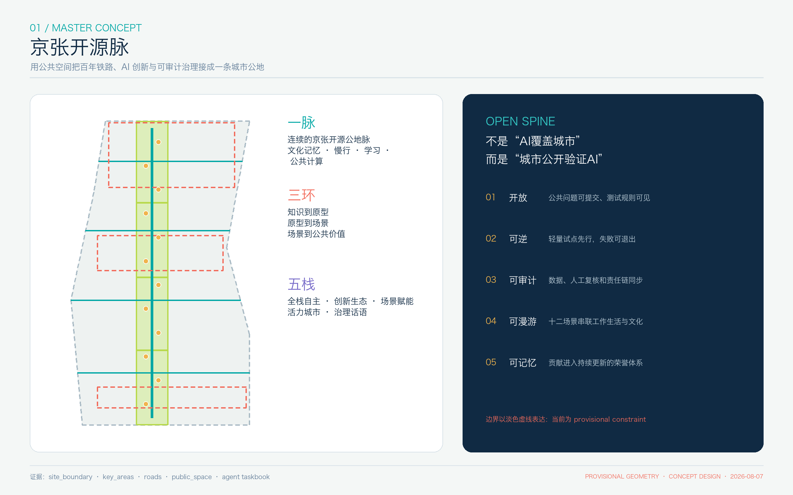
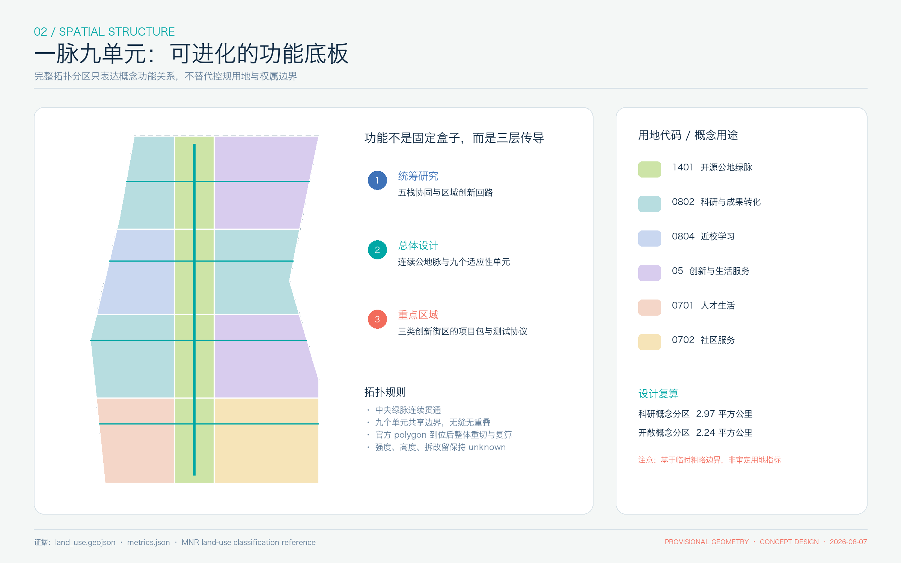
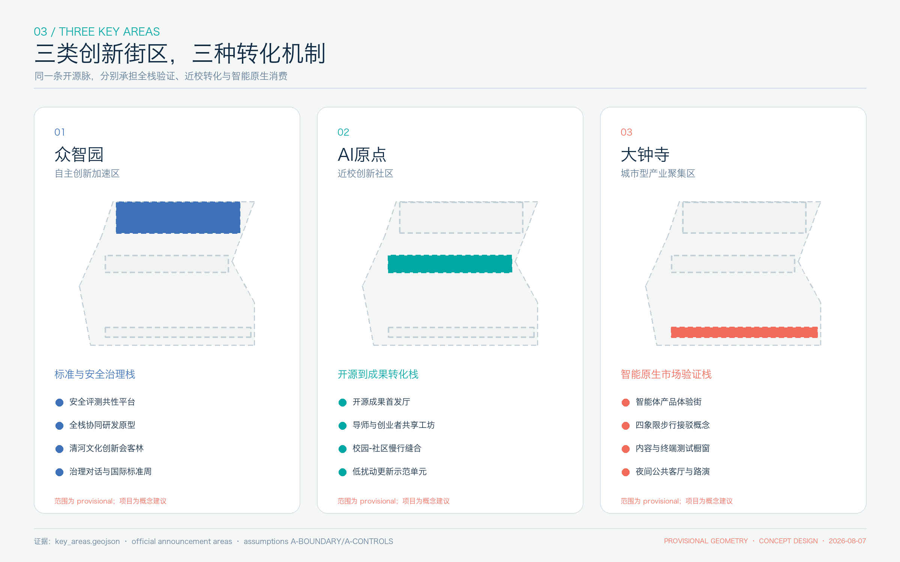
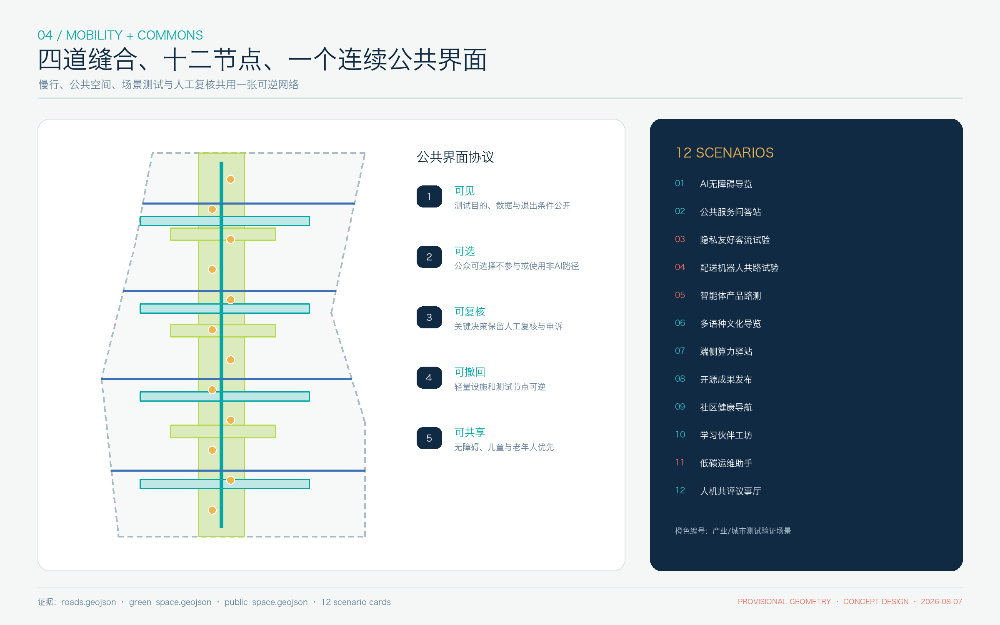
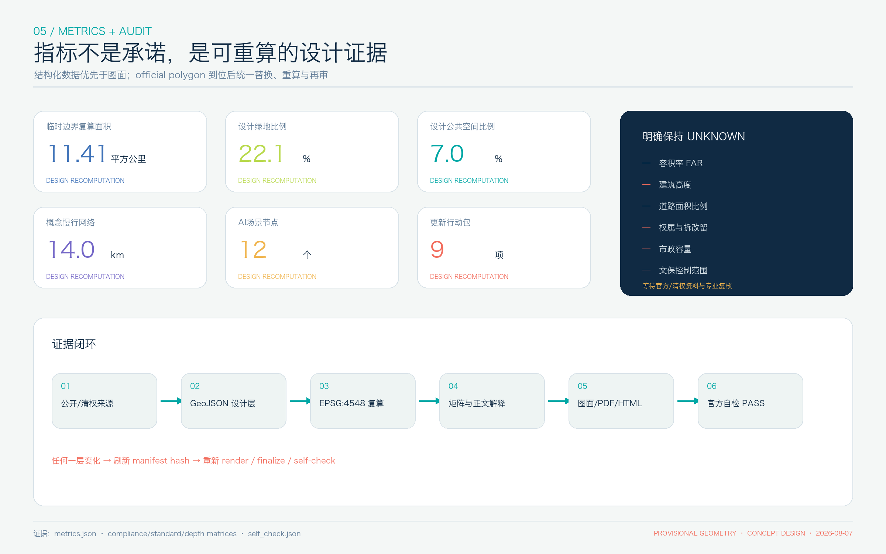

# 京张开源脉：可验证、可漫游、可共创的AI城市公地

**英文名：JINGZHANG OPEN SPINE**

本方案不把 AI 理解为铺满城市的设备，而把城市理解为一套可以公开验证 AI、允许公众选择、保留人工复核并持续沉淀知识的公共接口。百年京张铁路提供时间纵轴，中关村创新文化提供协作方法，AI 新文化提供可审计的共创协议；三者共同形成“京张开源脉”。所有空间落地内容均为**概念建议、参考方案或可供专业团队深化研究的材料**，不替代正式规划，不构成政府审定、审批、投资、工程可行性或实施承诺。[source:AGENT-TASKBOOK] [standard:PROJECT-AGENT-OPEN-CALL-TASKBOOK]

## 设计依据与资料清单

方案首先把“任务事实、临时空间、设计生成、待补资料”分开管理。官方公告用于确认项目名称、三层范围文字与约面积、三处重点区域、征集目的和设计任务；清权任务书用于确认三大定位、五大功能、三区两翼、六项 Agent 任务与统一边界；专业标准用于约束城市设计、公共空间、风貌、控规深度语言和用地分类；仓库临时 polygon 仅用于生成、可视化与 intake 自检。[source:OFFICIAL-ANNOUNCEMENT] [source:SITE-PACKAGE] [source:SOURCE-REGISTRY] [source:PROCESSED-FACT-PACK]

本包的总体设计范围使用仓库维护的临时粗略 polygon；它不是官方红线，也不适合支撑法定控制、精确面积、权属或工程判断。[source:BOUNDARY-SOURCE] [data:geometry/site_boundary.geojson#SITE-001] 三处重点区同样为 provisional constraint，仅用作任务定位与概念详细设计索引。[source:KEY-AREA-SOURCE] [data:geometry/key_areas.geojson#PROV-KEY-001] 由其派生的 `11.41 平方公里`是 EPSG:4548 下的投稿几何复算值 [metric:site_area_sqm]，与公告“约 11.4 平方公里”的事实用途不同。官方 polygon 到位后，应从约束几何开始重切用地、重算指标、重绘图面并重新自检。

本方案只使用仓库资料、官方/一手公开网页和本地生成图面，不使用商业地图瓦片、外部地图截图、非公开政府数据、企业内部数据或个人隐私。`sources.json` 记录每条资料的用途与禁止用途，`assumptions.json` 记录官方边界、控规、道路、权属、建筑、文保、市政和设施底数缺口；`compliance_matrix.json`、`standard_matrix.json` 与 `design_depth_matrix.json` 把正文、图层、指标、PDF 和自检连接起来。[standard:PROJECT-OFFICIAL-ANNOUNCEMENT] [depth:existing_conditions_diagnosis]

需要特别区分五类证据角色：`geometry/*.geojson` 是空间权威层，`metrics.json` 是复算层，三类矩阵是任务与专业证据层，`proposal.md` 是唯一主体说明，PNG/PDF/HTML 是解释层。空的 `constraints.geojson` 不是“没有约束”，而是明确表示当前没有可合法写入的项目级控制线；缺口由假设登记表承接。[data:geometry/constraints.geojson#DATA-GAP-REGISTER]

## 三层范围工作框架

统筹研究范围、总体设计范围和重点区域范围分别回答“创新生态如何协同”“城市空间如何承载”“三类街区如何形成可深化项目包”。统筹研究范围不绘制伪精确边界，使用公告的约 43.6 平方公里、文字四至与三区两翼关系开展机制研究；总体设计范围在 provisional polygon 内形成完整的概念用地分区、慢行公地网络与行动清单；重点区域范围分别形成众智园、AI 原点、大钟寺的定位、空间结构、更新方法、公共空间、AI 场景与风险条件。[depth:three_level_scope_framework]

三层之间采用“问题—协议—空间—运营—评估”的传导方式。统筹层确定公共问题和创新要素；总体层把它们翻译成一条开源公地脉、四道东西缝合和九个适应性功能单元；重点区层把空间翻译成可逆项目包、场景卡与治理协议。这样，产业规划不悬浮在空间之外，空间设计也不越权替代法定规划。总体结构由 [data:geometry/land_use.geojson#LU-OPEN-SPINE] 与 [data:geometry/roads.geojson#ROAD-OPEN-SPINE] 表达，所有功能色块仅是设计建议。[depth:overall_spatial_structure]

“一脉”是贯穿总体设计范围的京张开源公地脉；“三环”是知识到原型、原型到场景、场景到公共价值的转化闭环；“五栈”对应 AI 全栈自主创新、世界级创新生态、AI+场景赋能、智能化活力城市与 AI 治理话语。三处重点区是三类转化器，中关村科技服务翼提供资本、知识产权和专业服务，小月河场景赋能翼提供面向公共生活的测试场域。该框架回应三大定位与五大功能，而不额外制造一套相互竞争的口号。

数据更新规则是三层框架的一部分：官方总体范围 polygon 到位后替换 `SITE-001`；三处重点区 polygon 到位后替换三个 `PROV-KEY` feature；随后重切 `land_use`、检查建筑和公共空间是否仍在边界内、重算所有面积比例，并同步 PNG、HTML、A3/A0 与 manifest hash。任何“只换底图、不重算指标”的更新都视为失败。[depth:metrics_recalculation]

## 统筹研究范围产业与未来城市研究

### 名称、标识与总体概念

主名称“京张开源脉”同时表达历史连续性、开放协作与城市公共性；英文名 `JINGZHANG OPEN SPINE` 便于国际传播。标识方向由两条平行轨迹在中央打开一个缺口：双线对应铁路与数字协作，缺口对应开放接口，沿线节点对应可验证贡献。主色为“铁路墨蓝、开源青、里程金、警示珊瑚红”；红色只用于 provisional、风险和待复核状态，不作为装饰。字体使用系统可用、许可清晰的无衬线字体；不使用企业标识、人物肖像或受限图像。

命名体系按“脉—栈—站—证”组织：全带为“开源脉”，五类功能为“创新栈”，公共空间和场景为“开源站”，可追溯贡献与评审记录为“里程证”。这套体系可延展到导视、活动、数据看板和荣誉展示，但文化导视仍独立表达京张历史，不与总体 Logo 混淆。[source:AGENT-TASKBOOK]

### 六个全球案例与可转化机制

案例只提炼机制，不搬运数值、企业名单、治理权限或空间控制。新加坡 one-north 显示，分主题片区、生活实验室、工作—生活—学习—游憩混合和持续社区活动可以共同构成创新环境；本方案转化为“五栈+十二场景+年度开源议程”，不复制其规模与指标。[source:CASE-ONE-NORTH]

| 案例 | 一手公开机制 | 对京张开源脉的转化 | 不转移内容 |
| --- | --- | --- | --- |
| one-north，新加坡 | 主题集群、living lab、社区编程 | 场景沙盒与公共空间共同运营 | 规模、企业、政策与投资 |
| Kendall Square，剑桥 | 从产业区到创新社区，强调全天公共界面 | 原点社区的近校转化与公共客厅 | 容积率、土地制度和开发条件 |
| Knowledge Quarter，伦敦 | 跨文化、研究、教育、企业与社区会员网络 | “机构开放日+知识步行”协作网络 | 会员数据和经济产出 |
| Paris-Saclay，法国 | 科学—创新—商业连接与校园型协作 | 中关村科技服务翼的成果转化协议 | 交通工程和园区建设指标 |
| Brainport Eindhoven，荷兰 | 政府、企业、研究与社会的四螺旋及 living-lab 组合 | 人机共评、测试组合与跨主体治理 | 政府权责和资金安排 |
| South Boston Innovation District，美国 | 公共滨水、开放空间、混合功能与公共交通先行 | 京张公地脉作为创新基础设施 | 滨水条件、分区与开发权益 |

Kendall Square 的公开规划把“创新区”推进为“创新社区”，提示产业集聚必须补上居民、全天活动和公共空间；本方案因此不把科研用地比例等同于创新质量。[source:CASE-KENDALL] Knowledge Quarter 的价值在于用近距离机构网络和持续知识交换形成“门户”，本方案转化为沿线机构参与的开放课表与公共知识节点。[source:CASE-KNOWLEDGE-QUARTER] Paris-Saclay 的科学—创新—商业协同和低碳转型启发“成果转化服务栈”，但不构成海淀的建设或资金承诺。[source:CASE-PARIS-SACLAY]

Brainport 的四螺旋与长期 living-lab 组合启发“公众也是测试治理主体”，每个场景都必须有显著告知、非 AI 替代路径、人工复核、退出和复盘。[source:CASE-BRAINPORT] South Boston 的公共空间与交通先行说明，创新区应先有可达、可停留、可共享的公共界面，再讨论品牌与招商；本方案据此把连续公地脉置于空间结构中心。[source:CASE-BOSTON-INNOVATION]

### 产业与城市协同回路

众智园侧重全栈研发、安全评测和治理对话；AI 原点侧重高校成果首发、开源协作、孵化与近校生活；大钟寺侧重智能体、终端、内容消费和市场验证。中关村科技服务翼提供知识产权、资本、法务、标准与国际化服务，小月河场景赋能翼承接面向生活的低风险测试。要素进入“问题清单—开放征集—原型共创—沙盒测试—人工评估—成果发布—运营复盘”的循环，未通过安全、伦理、隐私和公众接受度门槛的项目退出，而不是被包装成示范成果。

未来城市形态因此不是固定“AI 园区”，而是可更换场景、共享底层设施、保留线下服务和持续评估的公共学习系统。区域协同建议通过联合课题、共享测试协议、成果巡展和人才交流形成，涉及北纬社区、未来科学城、怀柔科学城、经开区及京津冀时只作为合作方向，不编造已确定协议、企业或资金。

## 总体设计范围城市更新与控规深度城市设计

### 空间结构与功能组织

总体设计采用“一脉、四缝合、九单元、十二节点”。中央开源公地脉以连续绿地、慢行、公共学习、文化展示和低风险场景为主；四道东西缝合是概念性步行与骑行联系，优先连接站点、社区、高校园区和创新载体，但具体穿越位置与工程方式必须等待道路红线、权属、交通、安全和文保资料。[data:geometry/roads.geojson#ROAD-SEAM-01] 九个概念单元完整覆盖临时范围且无缝无重叠，目的在于验证功能关系与指标复算，不代表审定用地。[depth:land_use_layout]

南段侧重人才生活、社区服务和公共门户；中南段侧重大钟寺智能原生服务和市场测试；中北段侧重 AI 原点近校创新、学习和成果转化；北段侧重众智园全栈研发、安全治理与国际服务。中央 1401 概念分区贯穿全带，两侧以 0802、0804、05、0701、0702 等仓库枚举表达功能建议。科研概念分区复算约 2.97 平方公里 [metric:land_use_research_area_sqm]，开敞概念分区约 2.24 平方公里 [metric:land_use_open_space_area_sqm]；两者均基于 provisional geometry，不是法定指标。[standard:MNR-LAND-USE-CLASSIFICATION-GUIDE]

### 更新逻辑与控规边界

城市更新不预先给出具体地块“留、改、拆、新”结论，而使用四步筛选：先核合法合规与文保安全，再核结构与使用性能，再核公共价值和碳影响，最后核实施主体与运营能力。可逆公共设施、首层开放、闲置空间临时使用和导视试点可优先研究；涉及结构改造、产权重组、道路、市政和建设规模的内容必须进入专业专题。当前 `buildings.geojson` 只表达十二类“空间原型包络”，不代表现状建筑或实施边界。[data:geometry/buildings.geojson#BLDG-001]

容积率、建筑高度、建筑密度、绿地率、退线、四线、道路红线、地下空间和工程容量均保持 unknown。形态引导只提出相对原则：公地界面宜开放、首层宜可见可达；沿历史与绿色空间宜控制体量压迫并形成连续步行尺度；重点节点可通过公共性、标识和夜间安全形成识别，而不依靠超高或奇观化地标；屋顶优先研究可达绿化、能源和公共活动，但需结构、防火、运维与景观审查。[standard:MOHURD-CONTROL-DETAILED-PLANNING] [depth:development_intensity_controls] [depth:height_massing_character]

### 交通、市政、公共服务与新基建

慢行系统采用“主脉连续、东西缝合、站点换乘、支路安静化”的概念层级。轨道站周边建议优先研究步行连续、无障碍、骑行停放、换乘信息和共享接驳；四缝合线不预设桥隧或穿越工程。市政与 AI 新基建采用“公共云服务+可撤回端侧节点+最小数据接口”的架构，端侧算力驿站优先复用合法设施，禁止把摄像、识别或持续跟踪设为公共服务的默认前提。公共服务保留人工窗口与非智能渠道，避免数字排斥。[depth:municipal_new_infrastructure]

更新绩效不以招商数量或产值承诺为主，而以公共可达、开放时段、场景通过率、公众申诉响应、跨机构协作、空间复用、低碳运行和知识开源等指标观察。任何企业、投资、财政或活动安排都需要后续协商与正式程序。

## 重点区域详细设计

三处重点区共用“开源脉+公共客厅+创新栈+场景沙盒”语法，但产业角色、空间抓手和运营节奏不同。三处临时 polygon 均位于总体 provisional boundary 内且互不重叠，数量为 3 [metric:key_area_count]；它们只用于索引概念方案，公告面积继续作为任务事实，不能用临时 polygon 反推官方边界。[depth:three_key_area_detailed_design]

### 众智园 AI 自主创新加速区：标准与安全治理栈

定位是花园型全栈自主创新街区。空间建议形成“研发原型—共性评测—产业展示—治理对话—清河文化”五点网络：安全评测共性平台提供模型、智能体、机器人和数据工具的测试协议；全栈协同研发原型支持跨团队短周期项目；产业展示不做企业广告墙，而做可复现实验与失败复盘；治理对话场承接开源标准周与公众讨论；创新会客林把低强度交流接入连续公地。对外交通只提出接驳和慢行连续性的研究任务，不给出五环穿越工程结论。[data:geometry/key_areas.geojson#PROV-KEY-001]

建筑更新优先研究现状可复用空间、共享实验和小尺度增补；新建、扩建或拆改均需现状测绘、权属、控规、交通、市政、消防和生态条件。AI 场景以产业安全、端侧算力、低碳运维和治理评议为主，每个测试必须有人类负责人、明确时限与退出条件。

### 北京 AI 原点社区：开源到成果转化栈

定位是近校型创新社区，不把高校边界或机构空间视为可任意改造对象。空间建议形成“开源成果首发厅—导师与创业者共享工坊—学习伙伴网络—人才公共客厅—校园社区慢行缝合”。首发厅展示可复现的开源成果与贡献记录；共享工坊按短期项目开放；学习伙伴服务面向学生、居民和从业者，但不替代教师或专业咨询；人才公共客厅补足工作—生活—社交—学习的日常空间。[data:geometry/key_areas.geojson#PROV-KEY-002]

更新采用低扰动方法：优先首层开放、闲置时段共享、导视和小微公共空间，再研究建筑改造。五道口、清华东路西口等站点只提出无障碍、步行与骑行接驳的深化议题，不设定工程线位。成果转化建议采用“开源许可检查—安全伦理评估—应用场景匹配—专业服务—公众试用—复盘发布”，避免把孵化等同于招商和面积扩张。

### 大钟寺 AI 产业聚集区：智能原生市场验证栈

定位是城市型智能原生创新街区。空间建议形成“智能体产品体验街—内容与终端测试橱窗—国际路演客厅—四象限步行接驳概念—夜间公共客厅”。体验街强调真人可理解的产品说明、非 AI 替代和售后责任；测试橱窗可用于智能终端、内容工具与生活服务的小规模验证；路演客厅连接企业、开发者、研究者和公众，而非制造封闭园区。[data:geometry/key_areas.geojson#PROV-KEY-003]

大钟寺站四象限连通、非机动车停放和重点企业周边公共环境仅列为专业深化任务。现阶段不判断地下连通、道路改造或地块可实施性；任何企业建筑、标识和权属空间均不得擅自使用。公共空间应兼顾通勤、消费、社区生活与夜间安全，避免把智能原生简化为屏幕和广告。

## AI 创新生态、人才画像与 AI+ 场景

### 六类用户画像

| 用户 | 核心需要 | 空间与服务 | 风险边界 |
| --- | --- | --- | --- |
| 研究者与开源维护者 | 安静协作、算力、发布、同行复核 | 原点首发厅、开源站、短期工坊 | 贡献与许可可追溯，不泄露未公开研究 |
| 创业者与小团队 | 低门槛空间、测试、专业服务 | 共享原型间、场景沙盒、服务翼 | 不承诺资金、订单或政策 |
| 产业工程师与测试人员 | 安全边界、设备接口、复盘 | 众智园评测平台、大钟寺体验街 | 沙盒审批、现场责任人、失败退出 |
| 社区居民与家庭 | 便利、安静、可信、可选择 | 公共客厅、健康导航、非 AI 服务 | 最小数据、拒绝不影响基本服务 |
| 青年学生与学习者 | 学习、社交、实践、可负担 | 学习伙伴工坊、知识步行、开放课表 | 未成年人保护、教师/监护人边界 |
| 国际访客与专业社群 | 多语导览、交流、可理解规则 | 多语文化导览、年度开源周 | 不使用人脸识别作为默认通行条件 |

### 十二张场景卡

场景节点总数为 12 [metric:scenario_node_count]，在 [data:geometry/public_space.geojson#SCN-01] 中与公共空间共同登记。所有场景遵循“显著告知—自愿参与—最小数据—端侧优先—人工复核—申诉与退出—时限删除—独立复盘”，均为拟议测试，不是已运行服务。

| # | 场景 / 空间 | 对象与运行 | 数据与人工复核 | 性质 |
| --- | --- | --- | --- | --- |
| 01 | AI 无障碍导览 / 开源公地脉 | 为视听障碍、老年人与访客提供多模态路线建议 | 位置按会话最小化；可切换人工服务 | 公共服务 |
| 02 | 公共服务问答站 / 社区客厅 | 解释公开办事信息并指向线下窗口 | 只用公开知识库；答案标来源，复杂事项转人工 | 公共服务 |
| 03 | 隐私友好客流试验 / 公共广场 | 评估空间拥挤与活动组织 | 不存人脸；端侧计数、噪声注入、人工抽检 | **产业测试 1** |
| 04 | 配送机器人共路试验 / 支线慢行段 | 研究行人、骑行与低速机器人的路权 | 实体隔离、远程值守、现场安全员和紧急停止 | **产业测试 2** |
| 05 | 智能体产品路测 / 大钟寺体验街 | 小规模验证智能体和终端的可用性 | 明示供应方与责任人；人工接管、缺陷公开 | **产业测试 3** |
| 06 | 多语种文化导览 / 京张文化节点 | 讲述铁路、中关村与 AI 新文化 | 只用审核内容；史实由专业人员校核 | 文化服务 |
| 07 | 端侧算力驿站 / 众智园 | 支持短时计算、模型评测和公共课程 | 任务隔离、日志脱敏、人工运维 | 创新服务 |
| 08 | 开源成果发布 / AI 原点 | 复现实验、版本说明和贡献展示 | 许可检查、人工策展、争议下架 | 创新传播 |
| 09 | 社区健康导航 / 社区服务单元 | 指向公开医疗与运动资源，不做诊断 | 不保存健康档案；高风险问题转专业人员 | 公共服务 |
| 10 | 学习伙伴工坊 / 近校共享空间 | 辅助学习计划、开放课程与同伴协作 | 不替代教师评价；未成年人需专门规则 | 教育场景 |
| 11 | 低碳运维助手 / 创新会客林 | 试验照明、灌溉和设施巡检建议 | 传感器清单公开；人工确认后执行 | **产业测试 4** |
| 12 | 人机共评议事厅 / 治理对话场 | 汇总公众意见、比较方案和记录异议 | 原文脱敏、模型意见不计票、主持人负责 | 治理场景 |

场景—空间—运营映射不是一次性装置清单。每个节点都有“问题拥有者、场地负责人、技术提供方、数据管理员、人工复核人、公众反馈渠道”六个角色；没有明确责任主体时不得进入测试。年度复盘公开测试目的、参与规模、故障、投诉、偏差和退出决定，成功指标包含“关闭了不合格测试”，而非只统计上线数量。

## 用地、建筑规模与拆改留方案

`land_use.geojson` 将临时总体范围拓扑完整地分为中央开源公地脉和八个两侧单元。相邻单元共享坐标，覆盖无缝无重叠；这让 official polygon 到位后可以以同一规则重切，而不是把九个色块误认为法定地块。设计中的用地代码采用仓库列出的国土空间分类子集，名称后均隐含“概念分区”限定。[data:geometry/land_use.geojson#LU-W-01]

`buildings.geojson` 的十二个 polygon 是“空间原型包络”：开放算力与公共服务、人才共享客厅、智能体产品中试、智能原生商业、近校孵化、开源成果转化、安全评测、国际创新服务、全栈研发、治理展示、青年学习、社区 AI 服务。其联合基底复算值 [metric:building_footprint_area_sqm] 只用于检查原型均在临时边界内，不用于推导建筑总量、容积率或投资。[depth:retain_renovate_demolish]

正式拆改留应在现状调查后使用“保留、修缮、功能更新、结构改造、腾退重组、新建待论证”六级台账，并为每栋建筑记录合法性、权属、年代、结构、安全、能耗、使用率、文化价值和公共界面。现阶段不指定任何建筑的保留、改造或拆除结论。建筑形态建议只控制公共性：沿公地首层优先开放和可穿行，转角形成公共客厅，设备与物流界面避开主要慢行；高度、退线、强度和屋顶荷载等待正式控制与专业计算。

空间供给采用“长租稳定载体+短期共享原型间+时段共享公共空间”组合，避免只依赖新建。科研与企业空间应与人才生活、社区服务、文化和绿地共同评估；如果更新减少基本公共服务或造成租金排挤，应进入社会影响复核。该原则落实《城市设计管理办法》关于以人为本、历史文化、宜居公共空间和节约集约用地的要求。[standard:MOHURD-URBAN-DESIGN-MEASURES]

## 交通、轨道、市政与公共服务设施

概念慢行网络复算长度约 14.0 公里 [metric:concept_mobility_length_m]，由一条南北主脉和四条东西缝合组成。这是连通性研究线，不是道路中心线或工程方案。专业深化需要现状路网、道路红线、断面、流量、公交、轨道出入口、无障碍、消防、地下空间和权属资料，再判断哪些段可利用现状道路、园路、街巷或新建连接。[depth:traffic_rail_slow_parking]

轨道站点策略为“到站即公共界面”：清晰的步行导向、连续无障碍、骑行停放、换乘信息、遮雨休息和夜间照明优先于大型形象工程。大钟寺四象限、五道口与清华东路西口等节点只列出问题清单，桥隧、地下通道、道路改造和地铁设施调整必须由主管部门与专业团队论证。停车建议先做共享、时段、无障碍和装卸治理，再讨论新增供给；机器人测试不得占用盲道、消防或紧急通行空间。

市政和新型基础设施采用分层服务：城市级合规云与公共数据目录负责公开服务；片区级共享机房和能源管理需容量审查；场景级端侧节点可撤回、可隔离；个人设备侧遵循最小权限。分布式能源、储能、算力、通信、排水、海绵与消防均只提出接口和复核清单，不给出负荷、管线迁改或工程容量。公共服务设施在底数缺失时采用“十五分钟需求盘点+服务缺口地图+时段共享”方法，不编造学校、医疗、养老和文体容量。

## 蓝绿空间、公共空间与城市风貌

蓝绿系统的主角不是 provisional 边界，而是连续公共界面。`green_space.geojson` 由开源公地绿脉和三处创新会客林组成，联合面积 [metric:green_space_area_sqm]、设计比例约 22.1% [metric:green_ratio]；`public_space.geojson` 的四处公共客厅联合面积 [metric:public_space_area_sqm]、设计比例约 7.0% [metric:public_space_ratio]。这些值用于比较方案内部关系，不是绿地率或公共空间的审定要求。[data:geometry/green_space.geojson#GREEN-OPEN-SPINE]

“蓝”在本阶段不绘制虚构河道或蓝线。清河、小月河等水系只依据任务叙事进入专题清单；待官方水系、蓝线、防洪排涝和生态资料到位后，专业团队再将真实水系与绿脉、慢行和海绵设施叠合。这样避免用概念曲线冒充现状或控制线。公地脉优先提供树荫、座椅、饮水、无障碍、儿童与老年活动、安静交流、临时展陈和夜间安全；AI 设备退居辅助层。

### 四类朝圣地标与荣誉系统

1. **京张里程零点 / Memory Mile 0**：用时间刻度讲述詹天佑、铁路建设、沿线城市变迁与中关村创新史；具体位置避让文保范围并由文史专家审校。
2. **开源成果首发厅 / Open Release Hall**：以可复现实验、版本、许可和贡献链为展陈核心，不用企业广告替代公共知识。
3. **智能体贡献荣誉墙 / Agent Commons Ledger**：记录入选贡献、评审意见、迭代和后续采用情况；提供更正、撤回和争议标记机制。
4. **失败与复盘亭 / Failure Review Pavilion**：公开被停止、未达标或产生偏差的测试，强调负责任创新也包括“没有上线”。

这些地标是可逆组件或空间主题，不是已确定建设项目。公共空间组件库包括双线导视、里程牌、开放课桌、可移动展架、端侧测试柜、人工服务台、反馈信箱和无障碍休息点；材质、结构、照明和基础需专业深化。城市风貌以“铁路的朴素结构、中关村的实验精神、AI 的透明接口”为基调，避免赛博霓虹、巨屏堆叠和娱乐化奇观。

文化叙事采用“三个时代、同一条公共轨迹”：第一章是自主修建铁路与工程精神，第二章是中关村知识协作与创业文化，第三章是可审计、可共享、以人为本的 AI 新文化。导览路线按“记忆—知识—原型—场景—公共价值”展开；国际传播短句为 **Build in the open. Test with the city. Remember every contribution.** 任何历史事实、图片、肖像、商标和论文图像使用前都要核实来源与授权。

## 更新项目清单、实施政策与分期计划

方案形成 9 个概念行动包 [metric:renewal_action_count]，每个行动包都写明依赖条件，而不把活动、资金、政策和建设安排写成确定事项。[data:geometry/phasing.geojson#PHASE-001]

| 行动包 | 主要内容 | 先决条件 | 建议观察指标 |
| --- | --- | --- | --- |
| 01 开源公地脉 | 连续步行、休息、学习与文化界面 | 官方边界、文保、绿地与运营权 | 连续可达、开放时长、无障碍问题 |
| 02 四道慢行缝合 | 东西步行骑行问题清单与可逆试点 | 道路红线、交通、消防、权属 | 过街等待、绕行、冲突与投诉 |
| 03 众智园安全评测平台 | 模型、智能体、机器人和数据工具测试协议 | 场地、伦理、安全与责任主体 | 测试复现、故障公开、退出数量 |
| 04 AI 原点首发厅 | 开源成果首发、许可检查与导师工坊 | 合法空间、运营方、许可规则 | 开源发布、复现率、跨机构合作 |
| 05 大钟寺体验街 | 智能体与终端小规模市场验证 | 商户/场地同意、消费者保护 | 自愿参与、人工接管、缺陷修复 |
| 06 三类创新会客林 | 众智园、原点、大钟寺的公共交流空间 | 绿地、文保、市政与运维审查 | 日常使用、年龄多样性、热舒适 |
| 07 贡献荣誉系统 | 里程零点、首发厅、荣誉墙、复盘亭 | 版权、史实、评审与更正机制 | 贡献可追溯、纠错、采用反馈 |
| 08 十二场景沙盒 | 四类产业测试与八类公共场景 | 数据影响评估、现场安全、申诉渠道 | 通过/停止、投诉、人工复核时效 |
| 09 开源城市年度议程 | 开源周、治理对话、公众体验与国际交流 | 主体协商、预算与审批另行确认 | 参与质量、合作转化、知识沉淀 |

分期只表达依赖顺序，不承诺日历。第一阶段优先官方资料接入、共创治理协议、导视、开放课表和可逆公共空间试点；第二阶段在三处重点区开展现状调查、交通、市政、建筑、文保和运营专题，并选择少量场景沙盒；第三阶段再讨论连续慢行、共享设施、长期品牌、跨区协同和空间更新。`phasing.geojson` 三个 polygon 覆盖临时范围，表示讨论顺序而非土地开发时序。[depth:phasing_implementation]

长期运营建议设立“开源城市议事桌”，由公共部门、专业团队、研究机构、企业、社区、开发者和独立伦理/无障碍代表参与；其职责是维护问题清单、测试准入、申诉、数据目录、年度复盘和知识库。活动体系可包括春季问题发布、夏季原型共创、秋季开放测试、冬季复盘与荣誉更新；名称、日期、主办和资金均需后续协商，不写成既定安排。[depth:renewal_project_list]

人才、企业与开发者的转化路径是“到访—参与问题—加入短期项目—完成可复现实验—进入场景沙盒—获得专业服务—公开复盘—形成长期合作”。国际传播以可复现内容和开放协议为主，不以夸大招商成果为主。社区居民可以提出问题、选择是否参与测试、查看记录、申诉和参与复盘，确保公共利益优先。

## 指标体系、面积复算与合规矩阵

指标分为三组。第一组是**任务事实**：公告约面积、三层范围、三处重点区与六项任务，保持来源表述；第二组是**设计复算**：临时边界面积、概念用地、绿地、公共空间、原型建筑基底、慢行线和场景数量；第三组是**待补控制**：容积率、建筑高度、道路面积、权属、文保和市政容量，保持 unknown。任何图面只显示前两组并明确来源，不把设计复算包装成官方指标。

投稿临时边界复算 11.41 平方公里 [metric:site_area_sqm]；科研概念分区与开敞概念分区分别见 [metric:land_use_research_area_sqm]、[metric:land_use_open_space_area_sqm]；原型建筑联合基底见 [metric:building_footprint_area_sqm]；设计绿地面积与比例见 [metric:green_space_area_sqm]、[metric:green_ratio]；公共空间面积与比例见 [metric:public_space_area_sqm]、[metric:public_space_ratio]；概念慢行网络见 [metric:concept_mobility_length_m]；三处重点区、十二场景和九项行动分别见 [metric:key_area_count]、[metric:scenario_node_count]、[metric:renewal_action_count]。公式、文件、置信度和假设均在 `metrics.json` 中，不从正文手抄。

`compliance_matrix.json` 覆盖公告 1.3、1.4、1.5 与 agent.1—agent.6 共 23 条；`standard_matrix.json` 对五条可用必读标准标记 addressed，对缺少官方正文的建筑深度参考标记 data gap，而非伪称满足；`design_depth_matrix.json` 的 15 项“complete”表示已提供相应设计判断、图层、指标、图纸和缺口说明，不表示拥有法定资质或官方批准。[standard:MOHURD-ARCH-DESIGN-DEPTH-2016]

深度证据依次覆盖现状与缺口 [depth:existing_conditions_diagnosis]、三层范围 [depth:three_level_scope_framework]、总体结构 [depth:overall_spatial_structure]、用地 [depth:land_use_layout]、强度未知 [depth:development_intensity_controls]、形态原则 [depth:height_massing_character]、拆改留方法 [depth:retain_renovate_demolish]、交通 [depth:traffic_rail_slow_parking]、市政新基建 [depth:municipal_new_infrastructure]、蓝绿公共空间 [depth:blue_green_public_space]、三重点区 [depth:three_key_area_detailed_design]、行动清单 [depth:renewal_project_list]、分期 [depth:phasing_implementation]、复算 [depth:metrics_recalculation] 与风险 [depth:risk_missing_data]。

自检 PASS 的含义仅是文件完整、结构化数据一致、空间拓扑可检查、图面可读和证据链满足进入内容评审的基础要求；provisional warning 会继续保留。它不等于方案优秀、专业结论成立或获得政府批准。

## 风险、版权与合规说明

首要风险不是“方案不够精确”，而是把缺少依据的内容伪装得过于精确。因此本包主动保留八类缺口：官方三层与重点区 polygon、项目控规、道路轨道、地块权属、现状建筑、文保控制、市政安全、公共服务底数。对应影响、可接受来源与更新动作记录在 `assumptions.json`；空间层不得用 bbox、OSM、新闻图或文字四至升级为 official constraint。[depth:risk_missing_data]

AI 场景风险包括隐私、偏差、过度自动化、数字排斥、现场安全、供应商锁定与责任不清。治理底线是：基本服务必须保留非 AI 路径；个人数据默认不收集，确需处理时最小化、限时、可撤回；关键结果由人类复核并提供申诉；未成年人、健康、公共安全等高风险领域采用更严格规则；产品测试必须显著告知、现场负责、可紧急停止；采购和接口保持可替换，避免单一供应商成为必要条件。

空间实施风险包括文保、绿地、水系、交通、消防、地下空间和权属冲突。当前所有地标、缝合、站点、建筑包络和分期都是概念建议；待专业资料后可能移动、缩减或取消。公众接受度不是宣传问题，应通过共同定义问题、公开测试记录、补偿时间成本、照顾弱势群体和允许否决来处理。

版权与生成方式见 `report/copyright_statement.md`。本方案的 GeoJSON、五张 PNG、离线 HTML、A3 文册和 A0 展板由本地代码从仓库资料和投稿数据派生，未嵌入外部地图、远程图片、企业标识、人物肖像或论文图像。六个国际案例只引用一手公开网页并用文字概括机制，不复制其图像或设计。正文采用 `COMMUNITY-DISPLAY-ONLY`；第三方来源的权利仍归各自权利人。

最终判断属于人类评审、政府与专业团队。若本方案进入后续深化，第一项工作应是建立官方资料接收、版本、坐标系、许可与哈希登记；第二项是现场、交通、建筑、文保、市政与公众调研；第三项才是空间与场景深化。任何资料或判断变化都应触发“来源—GeoJSON—metrics—矩阵—正文—图面—PDF/HTML—manifest—self-check”的完整更新链，而不是只修改宣传图。

## 参考资料

以下文件构成本方案的本地证据索引；其用途与限制以 [source:SOURCE-REGISTRY] 和 `sources.json` 为准。

- `brief/site-package/design_brief.json`
- `brief/site-package/agent_taskbook.json`
- `brief/site-package/allowed_design_space.json`
- `brief/site-package/standards/standards.json`
- `data/source_registry.json`
- `data/processed/agent_fact_pack.md`
- `geometry/*.geojson`
- `metrics.json`
- `compliance_matrix.json`
- `standard_matrix.json`
- `design_depth_matrix.json`
- `assumptions.json`
- `sources.json`
