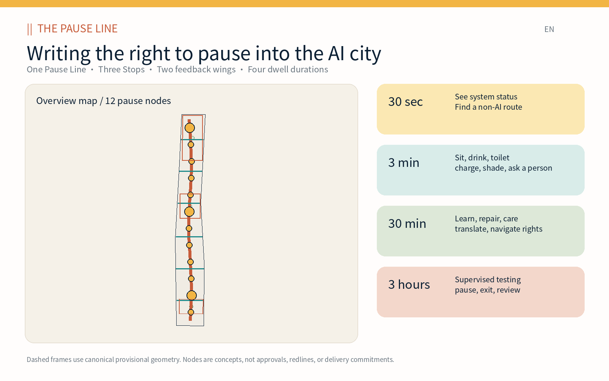
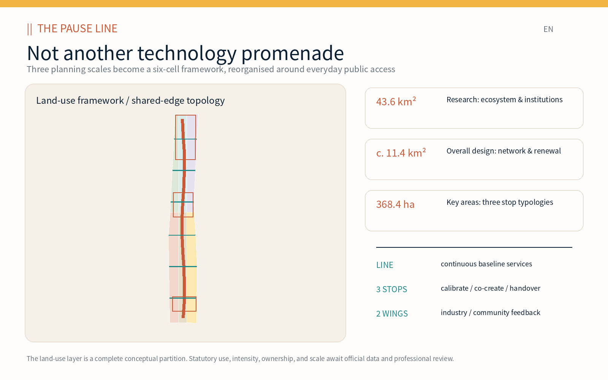
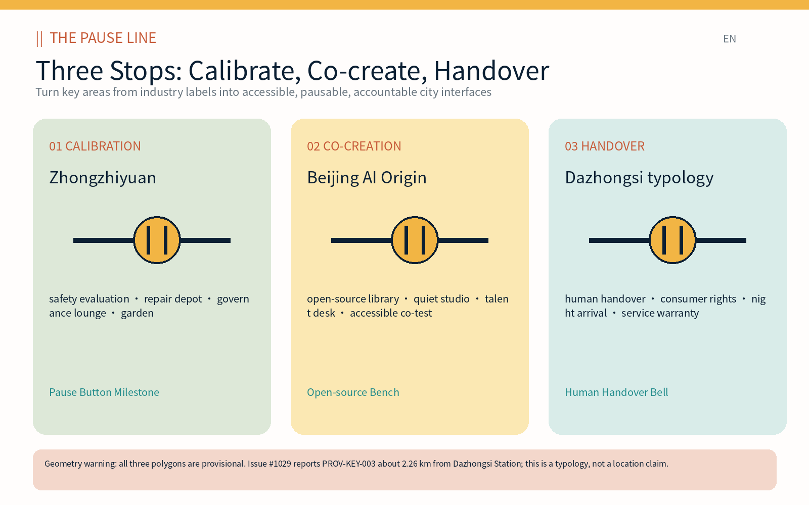
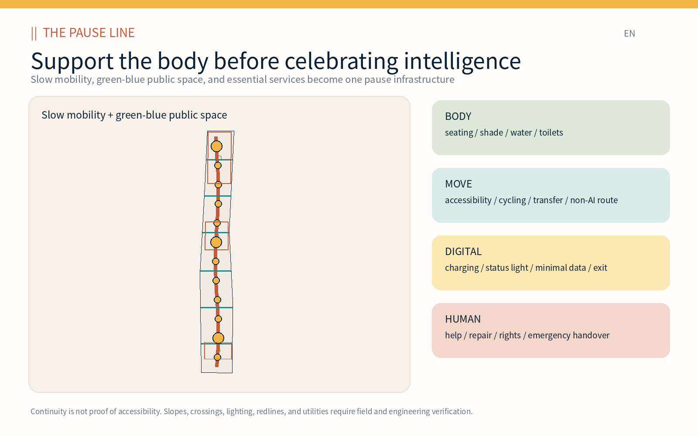
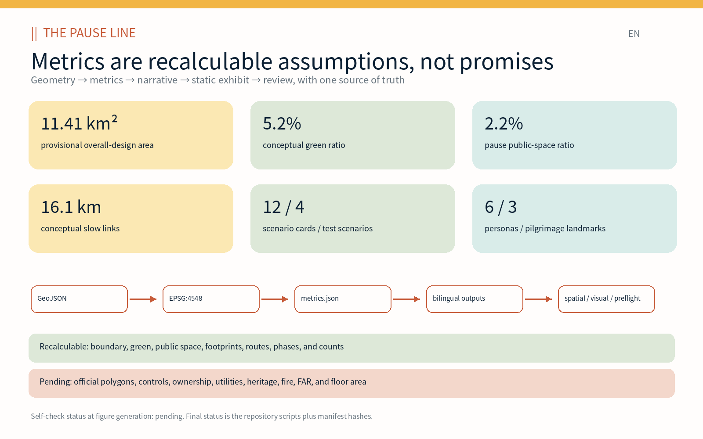

# Jingzhang Pause / THE PAUSE LINE: Writing the Right to Pause into the AI City

This proposal starts with a capability that “innovation cities” easily neglect. A city is intelligent not only when it moves people faster or deploys more models, but when anyone can stop, meet bodily needs, understand a system’s status, refuse identification, choose a non-AI service, and hand an unresolved problem to a real person. **Jingzhang Pause / THE PAUSE LINE** is therefore not a technology promenade. It is public infrastructure organised along the Jing-Zhang corridor: one continuous Pause Line; three key-area typologies—Calibration, Co-creation, and Handover Stops; two feedback chains; and four dwell-time rights from 30 seconds to three hours.

## Design Basis and Source List

The evidence hierarchy is “official announcement—repository-registered material—participant-generated design.” The announcement establishes a 43.6 km² Coordinated Research Area, an approximately 11.4 km² Overall Design Area, three Key-Area Detailed Design Areas totalling 368.4 ha, and the planning tasks. The agent taskbook establishes the open-call requirements for Three Zones and Two Wings, global cases, personas, scenario cards, pilgrimage landmarks, identity, culture, and annual operation. The repository registry, enums, metric structures, and missing-data checklist are machine-readable constraints, not new statutory authority [source:OFFICIAL-ANNOUNCEMENT] [source:AGENT-TASKBOOK].

No publicly cleared official site polygon, precise key-area polygon, regulatory parcel, road redline, ownership, utility, fire, or heritage-control geometry is available. The proposal retains the canonical provisional geometry without moving it to suit the concept. Issue #846 records that the provisional overall polygon does not overlap the OSM Jing-Zhang Railway Heritage Park reference and reports a nearest distance of about 412.5 m. Issue #1029 records that PROV-KEY-003 lies around Beijing North Station and approximately 2.26 km from Dazhongsi Station. These are source-level alignment gaps. They are replacement conditions, not design facts [source:ISSUE-846] [source:ISSUE-1029].

Participant-generated material comprises a six-cell land-use framework, twelve building-adaptation envelopes, one north–south slow-mobility spine, six east–west connectors, a continuous shade ribbon, twelve public pause courts, three conceptual phases, five bilingual figure pairs, bilingual A3 and A0 PDFs, and offline HTML exhibits. Areas are recalculated from GeoJSON in EPSG:4548. Boundary-derived metrics have medium confidence; FAR and total floor area remain unknown. The source and assumption registers preserve this distinction [data:geometry/site_boundary.geojson#SITE-001] [metric:site_area_sqm].

Seven global references contribute mechanisms rather than copied forms or targets: Kendall Square’s public process and active public realm; one-north’s academic-industry collaboration and after-hours programming; MaRS’s downtown ecosystem connections; STATION F’s SHARE/CREATE/CHILL access gradient; Knowledge Quarter’s public gateways to institutional knowledge; Smart Kalasatama’s short recruit–test–assess cycles; and Boston’s combination of civic space, transit, mixed uses, and a 24-hour neighbourhood. Each source is an institutional page, and every local transfer is bounded [source:CASE-KENDALL] [source:CASE-KALASATAMA].

## Three-Level Scope Framework

The three levels are three responsibilities, not three enlargements of one drawing. The Coordinated Research Area asks what AI ecosystem deserves urban support. The Overall Design Area asks how a public baseline becomes continuous and coordinates renewal, mobility, infrastructure, and landscape. The Key Areas ask what a person can actually do on arrival, who is accountable, and how a service stops. The Pause Line transmits strategy into a network and then into testable interfaces [depth:three_level_scope_framework] [standard:PROJECT-OFFICIAL-ANNOUNCEMENT].

| Level | Core question | Pause Line output | Review method |
| --- | --- | --- | --- |
| Coordinated Research Area (c. 43.6 km²) | Does the ecosystem support research, translation, daily life, and public interest? | One Line, Three Stops, Two Wings; seven mechanisms; identity and annual operation | Value chain, case matrix, calendar, source register |
| Overall Design Area (announced c. 11.4 km²) | How does the public baseline enter renewal, mobility, green-blue space, and buildings? | Six land-use cells, one spine, six connectors, twelve nodes, eight projects | GeoJSON topology, EPSG:4548 metrics, drawings, offline exhibit |
| Key-Area Detailed Design Area (announced 368.4 ha total) | How are three AI-city interfaces used and governed? | Calibration, Co-creation, and Handover Stop typologies | Provisional polygons, scenario cards, human review, delivery gates |

Four dwell times operate as an experience contract. Thirty seconds lets a person see running/test/paused status and find a non-AI route. Three minutes secures seating, shade, water, toilets, charging, and a person to ask. Thirty minutes supports learning, translation, repair, care, legal navigation, and consumer rights. Three hours is reserved for booked, supervised, bounded, and reviewed testing. Registration, facial recognition, or a mandatory app may never be a condition for baseline public services.

Three Zones and Two Wings are relationships rather than invented control lines. The three key areas carry Calibration, Co-creation, and Handover roles. The Zhongguancun Technology Services Wing returns standards, safety, intellectual-property, finance, and enterprise questions to the Stops. The Xiaoyue River Scenario Enablement Wing returns resident, carer, maintenance-worker, and night-user experience. The six shared-edge cells express an overall framework while avoiding a false land-control claim [data:geometry/land_use.geojson#LU-001] [depth:overall_spatial_structure].

## Coordinated Research Area: Industry and Future City Research

The Jing-Zhang AI value chain is “identify a problem—open research—controlled validation—product translation—public adoption—maintenance and exit.” Universities and institutes define questions and reproducible experiments. Open-source communities maintain public components and documentation. Startups turn components into products. Larger firms provide engineering, safety, and scale. Public bodies and communities define accessibility, procurement, and rights. Repair, service, and audit teams own the urban lifecycle after deployment. A Pause Stop is the city interface between these steps: every handoff has an object, owner, evidence, and exit [source:AGENT-TASKBOOK] [depth:existing_conditions_diagnosis].

The case matrix separates transferable mechanisms from non-transferable claims. MaRS suggests that downtown proximity can shorten ecosystem links, but does not set a target institution size. Kendall Square connects innovation space with public process and ground-floor activity, but its zoning cannot be transplanted. one-north demonstrates programmed public space beyond office hours, subject to a local operator. STATION F distinguishes public, semi-public, and controlled zones. Knowledge Quarter creates civic access to institutional resources. Kalasatama ends trials in learning and assessment. Boston couples employment with transit, open space, civic uses, housing, and daily life [source:CASE-MARS] [source:CASE-ONE-NORTH] [source:CASE-STATION-F].

The future city has three legible states. In **normal city** mode, seating, routes, information, and human help work without tracking. In **test city** mode, an amber status identifies a limited time, place, participant group, data list, owner, and stop rule. In **paused city** mode, faults, complaints, threshold breaches, missing supervision, or a public request immediately return the service to a non-AI baseline. A Pause Button Milestone, double-line ground mark, and restrained light band make these states visible. The maintenance ledger publishes versions and aggregate incidents, not movement traces.

The name and identity follow the same logic. `||` is both railway track and pause symbol; a deliberate gap represents exit and human takeover. Rail rust, pause amber, service teal, shade green, ivory, and ink blue create a recognisable system without corporate logos, portraits, or unlicensed historical images. Spring is Open Maintenance Month; summer hosts shade and night co-testing; autumn hosts Open-source Contribution Week; winter publishes a Pause Audit of services stopped, restored, or retired. The annual cycle is governance, not a one-off festival.

Ecosystem performance should measure handover time, availability of non-AI services, repair time, accessibility findings closed, tests stopped according to rule, and quality of open-source issue resolution. These are future operational indicators with no current baseline, so the package does not register fabricated known values. Innovation succeeds when the district gains maintainable, rejectable, and reusable public capacity, not when it gains the greatest number of screens or compulsory accounts.

## Overall Design Area: Urban Renewal and Regulatory-Plan-Level Urban Design

The spatial skeleton comprises one Pause spine, six east–west stitches, twelve pause courts, six conceptual land-use categories, and twelve building-adaptation envelopes. The north–south spine is the core of approximately 16.1 km of conceptual centreline geometry. Six transverse lines represent walking, cycling, or transit-connection types but are not road redlines. Twelve courts distribute service and scenarios; three larger nodes correspond to key-area typologies. A continuous shaded ribbon and three pause gardens provide climate comfort. All participant-controlled geometry lies inside the provisional site and is script-reviewable [data:geometry/roads.geojson#ROAD-001] [metric:road_length_m].

Six shared-edge cells completely cover the provisional site: education/near-campus collaboration, independent AI R&D, public pause plazas, park green space, innovation retail/night services, and community care/talent services. This is not an existing-condition survey or statutory land-use plan. It tests whether mixed functions allow researchers, residents, service workers, and visitors to share facilities. Public and green cells occupy the centre rather than becoming the back of an employment campus [standard:MNR-LAND-USE-CLASSIFICATION-GUIDE] [depth:land_use_layout].

Twelve small envelopes mark places where public service could enter buildings; their union footprint is approximately 161,300 m². Four demonstrate “retain and retrofit” through open ground floors, shade, toilets, repair, and human desks; the others are adaptive-infill typologies for incubation, labs, culture, mobility, talent, and community services. Without building surveys, structural safety, ownership, fire review, daylight, height, or regulatory controls, the proposal makes no real retain/demolish decision. FAR and total floor area remain unknown [data:geometry/buildings.geojson#BLDG-001] [metric:floor_area_ratio].

Regulatory-plan-level depth is separated into a reviewable design layer and a statutory layer that must wait. Reviewable items are topology, public-space network, building typologies, movement, green-blue continuity, renewal projects, phasing, and the evidence chain. Waiting items are parcels, primary and compatible uses, FAR, height, coverage, setbacks, road redlines, facility standards, and buildable area. Once official geometry arrives, professional teams must replace and reproject boundaries, rebuild or clip every dependent layer, recalculate metrics, and review every control—not merely change a basemap [standard:MOHURD-CONTROL-DETAILED-PLANNING] [depth:development_intensity_controls].

Renewal follows “add, borrow, adapt, connect” before demolition. Add bodily services and human support. Borrow existing ground floors, courtyards, undercrofts, and residual space for reversible trials. Adapt accessibility, shade, entrances, and maintainable equipment. Connect broken routes and opening hours. Demolition can be considered only after structural, fire, heritage, embodied-carbon, ownership, relocation, and public-benefit comparisons. AI urbanism begins with operation and care, not clearance.

## Detailed Design of Key Areas

All three areas retain their canonical provisional polygons and become transferable Stop types. Their functions, building relationships, mobility, public space, operation, and stop rules can receive content review, while their position and area cannot be treated as official boundaries. PROV-KEY-003’s known misalignment makes the Dazhongsi station proposal explicitly typological [data:geometry/key_areas.geojson#PROV-KEY-001] [metric:key_area_count].

**01 Zhongzhiyuan AI Independent Innovation Acceleration Area / Calibration Stop.** Programme: safety-evaluation booking, edge-device repair, standards advice, open-source dependency review, and a governance lounge. Building: adapt ground floors and courtyards into a visible but physically bounded slow robot/model test court. Movement: separate public passage, Qinghe-facing walking, and service windows. Public realm: a Calibration Garden for waiting and review. A test opens only when the test owner, facility owner, and independent public liaison all sign; any one may pause it. The Pause Button Milestone displays running, testing, or paused—never an individual ranking.

**02 Beijing AI Origin Community / Co-creation Stop.** Programme: open-source library, quiet studio, small release room, talent welcome desk, legal/IP navigation, accessible co-test room, and carer-friendly space. Building: reversible partitions and visible thresholds create public, collaborative, and booked zones. Movement: campus–park–community walking/cycling and a no-app transit route. Public realm: a Co-creation Garden and movable worktables. The Open-source Bench recognises verified documentation, translation, maintenance, accessibility, data, care, and code contributions rather than financing or title.

**03 Dazhongsi AI Industry Cluster / Handover Stop typology.** Programme: human escalation, smart-device consumer rights and repair, night arrival, content-appeal support, and withdrawal of data consent. Building: a visible human window, quiet waiting area, and accessible toilets. Movement: a method connecting concourse, street corner, enterprise frontage, bus, and bicycle. Public realm: waiting without forced consumption. The Human Handover Bell lights only after a real worker accepts a case. Because Issue #1029 reports an approximately 2.26 km misalignment, none of this is claimed as mapped fact within PROV-KEY-003; official boundaries and station GIS must relocate it [source:ISSUE-1029] [depth:three_key_area_detailed_design].

The Stops share an opening gate: baseline public services function; owner, hours, and complaint path are visible; test data, retention, and exit are published; accessibility and child safety receive field review; a non-AI fallback works; and an aggregate review is published within 30 days. A place failing the gate may remain ordinary public space, but may not collect data or affect access under an “AI scenario” label.

## AI Innovation Ecosystem, Personas, and AI+ Scenarios

Services are designed around six people rather than a singular “elite talent.” Researchers and developers need quiet, collaboration, compute, and reproducibility. Early startups need affordable tests, compliance, repair, and first users. Residents, carers, and children need rest, toilets, and protection from event displacement. Older and disabled visitors need continuous accessibility, low cognitive load, and human help. Cleaning, security, maintenance, and delivery workers need accessible replenishment, night safety, and dignity. International visitors and night workers need bilingual information, arrival support, and clear escalation. All six use the same public baseline without an employer or account gate [metric:persona_count] [depth:blue_green_public_space].

| Persona | Daily friction | Spatial/service response | Boundary |
| --- | --- | --- | --- |
| Researcher/developer | Reproduction, test access, night work | Calibration, quiet studio, open-source library, booked sandbox | Public passage is not tied to a research account; uncleared results remain private |
| Early startup | Compliance, repair, first test | Co-test, repair depot, legal/IP navigation, bounded pilot | Scenario access is not procurement or government endorsement |
| Resident/carer/child | Events displace daily life; missing seats/toilets | Three-minute baseline, care space, quiet periods, capacity limits | No child recognition or behavioural recommendation |
| Older/disabled visitor | Broken gradients, complex interfaces, difficult help | No-app wayfinding, regular seating, human handover, co-test authority | AI does not substitute for statutory accessibility or people |
| Service worker | Back-of-house treatment, no rest, night risk | Open replenishment, repair interface, lighting, emergency handover | No individual movement/rest productivity tracking |
| International/night user | Language, payment, last-mile safety | Bilingual static information, staffed window, non-digital help | No default voice recording or differential pricing by language/nationality |

Twelve scenario cards use one contract: user and place, minimum data, human review, non-AI equivalent, and stop/exit rule. Four marked ★ are Testing and Validation Scenarios. `geometry/public_space.geojson` gives each card a conceptual court, while actual operating limits require field definition and permission [data:geometry/public_space.geojson#PUBLIC-001] [metric:testing_scenario_count].

| ID / scenario | User and place | Minimum data | Human review and non-AI equivalent | Stop / exit |
| --- | --- | --- | --- | --- |
| SC-01 Pause Map | Everyone; line wayfinding | Facility/access status, no identity | Staff verification; paper map and fixed signs | Stale dynamic routing goes offline; switch to static map |
| SC-02 Essential Refill | Walkers/workers; 12 nodes | Water/toilet/seat/charger status | Facility inspection; visible signs and human help | Two repeated errors stop automation, not the service |
| SC-03 Accessible Co-test ★ | Disabled/older co-testers; Co-creation Stop | Consented task result and barrier type; no face | Accessibility expert and co-tester sign; human accompaniment | Any participant exits and deletes the session; safety incident stops test |
| SC-04 Edge-AI Repair Lab ★ | Startup/maintainer; Calibration Stop | Necessary device log, local by default | Engineer approves exports; ordinary repair remains | Unauthorised read, heat, or unknown write disconnects and seals device |
| SC-05 Slow Model & Robot Test ★ | Product team/public observer; bounded court | Success, intervention, near miss; no crowd profile | Safety operator holds physical stop; outside passage works | Boundary crossing, stop, complaint threshold, or missing supervisor ends test |
| SC-06 Human Handover Desk | Failed-service user; three Stops | Case text; contact optional and short-lived | Real worker accepts; window/phone equivalent | Anonymous advice and consent withdrawal; timeout escalates, never auto-closes |
| SC-07 Quiet Learning & Translation | Student/international user; Origin | User-submitted text or local voice only | Bilingual review; paper/person alternative | Voice is not retained by default; session end clears temporary content |
| SC-08 Carer & Child Commons | Families; community court | Aggregate occupancy and equipment fault only | Carer/operator observes; non-smart play remains | No child recognition; crowding, noise, or safety complaint pauses event |
| SC-09 Night Arrival Companion | Night worker/visitor; transfer node | Service timetable, lights, open help point | Night worker reviews; fixed map and human route | Stale data becomes static only; phone use is optional |
| SC-10 Rail-memory Pause | Public; cultural node | Rights-cleared index and selected language | Historical editor reviews; plaque/person equivalent | Disputed heritage evidence or rights removes digital content |
| SC-11 Public Maintenance Ledger | Facility user; entire line | Facility ID, time, issue, state; reporter hidden | Supervisor closes with evidence; paper/phone report | Personal data is redacted; a model cannot close without proof |
| SC-12 Event Pause Protocol ★ | Organiser/public; line | Aggregate capacity, facility, safety state | Safety/access/community three-party opening; normal passage remains | Overcapacity, blocked exit, missing staff, or community limit reduces/cancels event |

Four physical keys govern every AI service: visible status, human emergency stop, non-AI bypass, and post-event review. A model may suggest an available seat, cluster maintenance faults, translate text, or summarise a work order. It may not decide who enters public space, replace planning approval, close a complaint without human evidence, or convert testing consent into marketing permission. Providers and models may change; the keys remain [standard:PROJECT-AGENT-OPEN-CALL-TASKBOOK] [depth:municipal_new_infrastructure].

## Land Use, Building Scale, and Retain-Renovate-Demolish Strategy

The land-use layer is a conceptual complete partition, not existing use or a statutory plan. Six repository-approved codes are used: 0804 education/near-campus collaboration; 0802 independent R&D/calibration; 1403 public pause and handover plazas; 1401 continuous pause park; 05 innovation retail/night services; and 0702 community care/talent services. Shared edges produce full coverage without internal overlap. Official parcels, ownership, existing use, and statutory classification must later rebuild these cells [data:geometry/land_use.geojson#LU-001] [standard:MNR-LAND-USE-CLASSIFICATION-GUIDE].

The building layer contains twelve approximately 96-by-140-metre prototype envelopes for community service, mobility, education, lab, incubation, culture, retail, office, mixed use, AI R&D, and talent functions. Their union footprint is 161,279.945 m². This is submitted geometry, not existing stock or a construction programme [metric:building_footprint_area_sqm]. Height, storeys, floor area, building coverage, FAR, setbacks, daylight, parking, and fire access remain unsupported, so no drawing may imply precise intensity.

Demolish–Renovate–Retain uses two filters. First, irreplaceable value—heritage, mature trees, public services, affordable space, community memory, and high embodied-carbon structures—favours retention. Second, adaptability—structural safety, fire egress, accessibility, daylight, ground-floor openness, and equipment maintenance—distinguishes light or deep retrofit from further study. Demolition must compare public benefit, lifecycle carbon, relocation, rights, and alternatives; a building is never removed merely because it does not look “technological” [depth:retain_renovate_demolish] [depth:height_massing_character].

Four interface classes protect the public gradient. Class A is an always-available exterior baseline. B is staffed service and exhibition during declared hours. C is booked co-creation and training. D is controlled testing and back-of-house equipment. A/B services never require a C/D account. D requires physical separation, stop controls, and an independent service window. Roof and façade principles prioritise shade, maintainability, rainwater feasibility, visible entrances, and restrained light; every move awaits structural, utility, fire, accessibility, and character review.

The next scale step is not to invent a plausible FAR. It is a five-table reconciliation of official parcel, existing building, ownership, structure, and control conditions. Each envelope needs a parcel ID, existing-use/legal-status record, and user interviews before retain/retrofit/infill decisions. Only then can a compliant storey model produce floor area. `total_floor_area_sqm` and `floor_area_ratio` remain unknown as evidence of data discipline [metric:total_floor_area_sqm] [depth:metrics_recalculation].

## Transport, Rail, Municipal Infrastructure, and Public Services

Mobility prioritises a “pausable continuity” of walking, cycling, accessibility, and transit. Each segment of the north–south spine should reach seating, shade, water, toilets, charging, and human help. Six transverse stitches test campus–park–community–station crossings. Centreline geometry is not a road redline or section. Field work must inspect gradients, steps, signal timing, underpass clearance, lighting, winter ice, cycle conflict, and night visibility [data:geometry/roads.geojson#ROAD-001] [depth:traffic_rail_slow_parking].

Transit integration follows four steps: visible from the concourse, legible after the exit, a staffed first pause, and a last segment that works without an app. Wudaokou, Qinghuadongluxikou, Dazhongsi, and other announced relationships require official station/exit GIS. For PROV-KEY-003, the proposal does not pretend the temporary polygon is Dazhongsi Station; concourse–corner–enterprise–bus/bicycle is a relocatable Handover typology. Parking quantities remain pending survey and statutory standards, with shared, time-based, accessible, and delivery needs assessed first.

Municipal and public service infrastructure comes in four packages. **Body**: seating, shade, water, toilets, and first aid. **Movement**: accessibility, cycle parking, static signs, and human transfer. **Digital**: low-energy status light, charging, edge processing, and version disclosure. **Human**: information, repair, consumer rights, legal navigation, and emergency handover. Electricity, drainage, communications, fire safety, and a maintenance owner precede “smart” equipment [source:SITE-PACKAGE] [depth:municipal_new_infrastructure].

New infrastructure follows edge first, minimum network, and physical removability. Edge nodes process only task data. Uploads list fields, purpose, retention, and recipient. Public Wi-Fi, sensors, and charging occupy a separate network zone rather than merging by default with security or enterprise production systems. Remote updates preserve version, rollback, and human approval. Cabinets, maintenance doors, and cable routes are designed with benches, tree pits, and tactile paving rather than blocking them.

Opening hours matter more than a fabricated service radius. The three-minute baseline aims for continuous availability; human handover covers commuting and critical night periods; co-creation and testing are booked; major events preserve through-passage and toilets. Operators publish availability, missing staff coverage, repair time, and complaint disposition—not personal heatmaps. Emergency response remains with the existing police, fire, health, and transport systems; an Urban Agent only assists information.

## Blue-Green Network, Public Space, and Urban Character

The green-blue system combines heat comfort, rainwater, ecology, and stopping in one section. Submitted geometry contains a union of 597,439.678 m² of conceptual green space, 5.2348% of the provisional site. A continuous shade ribbon is the baseline; three Stop gardens support waiting, review, and small events. This is an internal design metric, not a statutory green-space ratio. Qinghe, Xiaoyue River, mature trees, sponge infrastructure, and flood boundaries require official data and field survey [metric:green_space_area_sqm] [metric:green_ratio].

The twelve courts have a union of 252,479.558 m², or 2.2122% of the provisional site. A court includes backed seating, a wheelchair companion position, pram space, water/toilet direction, weather protection, a visible human window, and a path that avoids the test zone. The ratio does not prove ownership or all-day access; it tests whether twelve scenarios have sufficient spatial carriers [metric:public_space_area_sqm] [metric:public_space_ratio].

Urban character follows “rail accuracy, restrained AI, visible maintenance.” Rail accuracy means only rights-cleared, professionally confirmed history, components, and locations enter the narrative. Restrained AI means status and responsibility information rather than pervasive screens. Visible maintenance makes repair, update, pause, and human labour part of the district’s identity. Issue #846 shows that the current polygon does not even overlap the OSM park reference, so the proposal avoids false locations for Qinghuayuan Station, rail structures, or heritage controls [source:ISSUE-846] [standard:MOHURD-URBAN-DESIGN-MEASURES].

Three pilgrimage/honour nodes reject the hero-statue model. The **Pause Button Milestone** honours teams that stop an unsafe test. The **Open-source Bench** recognises documentation, translation, maintenance, accessibility, community care, data, and code. The **Human Handover Bell** recognises people who accept responsibility after automation fails. Records use verified project, contribution type, year, and withdrawal—not portraits, personal performance, or funding rank. Their final locations require official geometry and public-art review [metric:landmark_count].

The 1909-to-present rail narrative is about how society learns, maintains, and makes technology public—not a historical backdrop for AI. Rail-memory pauses pair a physical plaque with optional audio. AI-generated reconstruction must be labelled, cite evidence, and receive historical review. The `||` identity may recur as paving inlay, bench gap, or low-intensity status light, but never occupies tactile paving, mimics traffic signals, or interferes with heritage fabric.

## Renewal Projects, Implementation Policy, and Phasing

Eight renewal projects start with reversible and evaluable public service before permanent spatial or institutional work. The count is a proposal structure, not a government project list [metric:renewal_project_count]. Every project has an entry gate: land/use permission, owner, budget, accessibility and safety review, data rule, and public feedback. A missing gate returns the project to research or ordinary public-space operation.

| ID | Project | Phase / suggested lead | Entry condition | Evaluation and exit |
| --- | --- | --- | --- | --- |
| PL-01 | Twelve-node baseline audit and reversible pilot | Near; local/public-space operator + facility team | Official points, field audit, toilet/water maintenance agreement | Availability and repair time; remove unowned equipment while retaining basic signs/seats |
| PL-02 | Pause spine and six stitches | Near–mid; mobility/landscape/local agencies | Redlines, crossings, gradients, trees, utilities, fire review | Closed accessibility barriers; shorten pilot if unsafe |
| PL-03 | Zhongzhiyuan Calibration Stop | Mid; park + independent test operator | True boundary, isolation, stop, insurance, public test rules | Near misses and stop compliance; testing ceases without supervisor |
| PL-04 | AI Origin Co-creation Stop | Near–mid; university/community/open-source body | Ground-floor permission, quiet hours, access and care | Contribution diversity and complaints; limit events that displace baseline |
| PL-05 | Relocate Dazhongsi Handover Stop | After official data; transit/local/enterprise | Correct PROV-KEY-003, station GIS, four-quadrant mobility, ownership | Human acceptance time and no-app success; no AI routing without staff |
| PL-06 | Public Maintenance Ledger | Near; facility alliance | Common facility ID, privacy review, paper/phone channel | Evidence-based closure and privacy events; overcollection removes digital front end |
| PL-07 | Three honour nodes and rail-memory pauses | Mid; culture/heritage/community curators | Evidence, rights, heritage, and public-art review | Correction and withdrawal; disputed content comes down |
| PL-08 | Annual Maintain–Co-test–Contribute–Pause Audit | Continuous; multi-party council | Budget, permission, safety, and public assessment | Improvement completion; events without public review do not renew |

Phase geometry communicates sequence rather than an administrative or investment boundary. Phase 1 (4,229,811.537 m² of temporary geometry) prioritises audit, reversible replenishment, static signs, and the maintenance ledger. Phase 2 (3,856,939.077 m²) advances transverse links, building adaptation, and the Co-creation Stop. Phase 3 (3,326,074.771 m²) advances station integration, Calibration, and long-term governance only after official geometry and controls. These are topology bands, not acquisition areas [data:geometry/phasing.geojson#PHASE-001] [depth:phasing_implementation].

Policy tools include: no data consent attached to baseline service; test permits that specify place, time, participants, and stop; standard scenario applications and post-test reports; procurement that values maintenance, access, and exit; ground-floor operation agreements; repairable, replaceable interfaces; recognition of care and maintenance labour; and a cross-sector council that publishes problems, not only success. Planning, transport, landscape, data, fire, operations, and community representatives may veto an unsafe test.

Operation continues beyond a festival. A monthly maintenance list, quarterly open Stops and handover drills, half-yearly accessibility/night/child co-tests, and an annual Pause Report disclose what was used, returned from AI to people, left unresolved, deleted, or not renewed. Each event must repair a facility, close a risk, improve a rule, or create a rights-cleared public resource—not merely record footfall.

## Metrics, Area Recalculation, and Compliance Matrix

Metrics use one source of truth. GeoJSON is recalculated in EPSG:4548 and recorded in `metrics.json`; bilingual Markdown, HTML, PNG, and PDF repeat those values. Spatial review checks site, land-use coverage, inside-site geometry, key areas, and green/public/building unions. Visual review compares `data-metric` attributes. A geometry edit must trigger recalculation, new displays, and refreshed manifest hashes [depth:metrics_recalculation] [data:geometry/green_space.geojson#GREEN-001].

| Metric | Current value / state | Meaning and confidence |
| --- | --- | --- |
| Overall site | 11,412,825.386 m² | EPSG:4548 area of canonical provisional polygon; medium, not official precision |
| Building-envelope union | 161,279.945 m² | Twelve design envelopes; medium, not existing stock |
| Conceptual green union / ratio | 597,439.678 m² / 5.2348% | Shade ribbon and three gardens; medium, not statutory green ratio |
| Pause public-space union / ratio | 252,479.558 m² / 2.2122% | Twelve scenario carriers; medium, not ownership/access promise |
| Conceptual centreline length | 16,084.109 m | One spine and six stitches; medium, not road-redline length |
| Key areas / pause nodes | 3 / 12 | Key areas provisional; nodes participant-designed |
| Scenarios / tests / personas | 12 / 4 / 6 | Counted from narrative and public-space attributes; high |
| Honour landmarks / renewal projects | 3 / 8 | Counted from proposal lists; high |
| Three phases | 4,229,811.537 / 3,856,939.077 / 3,326,074.771 m² | Complete temporary topology bands; medium |
| FAR / total floor area | unknown / unknown | Official parcels, controls, buildings, and ownership absent |

Machine-readable counts include 12 pause nodes [metric:pause_node_count], 12 scenario cards [metric:scenario_count], and six personas [metric:persona_count]. Phase values remain in `phase_1_area_sqm`, `phase_2_area_sqm`, and `phase_3_area_sqm`, without converting temporary bands into promises [metric:phase_1_area_sqm] [metric:phase_2_area_sqm] [metric:phase_3_area_sqm].

`compliance_matrix.json` covers official tasks 1.3, 1.4, 1.5 and agent.1–agent.6, linking tasks to sections, layers, metrics, drawings, sources, assumptions, and checks. `standard_matrix.json` separates project documents, urban-design measures, regulatory depth, and land-use classification. `design_depth_matrix.json` covers diagnosis, scopes, structure, land use, intensity, character, DRR, mobility, infrastructure, green-blue space, key areas, projects, phases, metrics, and risk. A matrix proves response presence, not professional quality [standard:MOHURD-URBAN-DESIGN-MEASURES] [depth:risk_missing_data].

Invalid geometry, coverage gaps/overlap, out-of-site design, missing required/bilingual files, remote HTML, empty PDFs, or author/path mismatch are blocking or major. Provisional key-area warnings are minor but remain visible. Final status comes from the actual validate, spatial, visual, professional, self-check, and participant-preflight scripts—not from a “pass” label printed in a figure.

## Risk, Copyright, and Compliance

The highest risks are spatial source misalignment and unowned implementation. Spatial dispute is 5/5 because the overall polygon and heritage-park reference are separated and PROV-KEY-003 is separated from Dazhongsi Station. Mitigation is to preserve, repeatedly label, and never promote canonical provisional geometry; official replacement is the first professional gate. Policy uncertainty, delivery complexity, and operation cost are 4/5 because planning, mobility, landscape, data, fire, operation, and community must coordinate. Reversible pilots, named owners, budgets, and exit gates reduce exposure [source:BOUNDARY-SOURCE] [depth:risk_missing_data].

Data privacy is 3/5. Most scenarios avoid identity, face, voice, and persistent movement, while translation, repair, and handover may process user-submitted content. Edge processing, field lists, short retention, optional contact, deletion, and non-AI routes mitigate it. Equity/inclusion is 4/5 because high-profile technology can displace residents, workers, children, or disabled users. Baseline-first space, six-persona co-testing, quiet periods, capacity limits, and human veto respond. Technology maturity and public acceptance are each 3/5; unknown performance belongs in an isolated test, not on a public route.

The proposal claims no official approval, scoring eligibility decision, construction investment, land right, operation authorisation, or procurement intent. AI output is not planning approval, heritage designation, fire review, traffic engineering, structural assessment, or accessibility acceptance. Delivery must follow applicable planning, engineering, data, procurement, participation, and rights procedures. `ready_for_review` means a self-checked package, not an approved plan or upgraded geometry confidence.

All bilingual PNG figures, four PDF sets, two exhibits, narratives, tables, identity, and participant-controlled GeoJSON are generated in this workflow. No photograph, corporate logo, portrait, remote tile, or third-party icon is used. Noto Sans CJK SC only rasterises participant-authored text; it comes from notofonts/noto-cjk under SIL Open Font License 1.1, and the font file is not submitted. Institutional pages are paraphrased and linked rather than copied. Details are in `report/copyright_statement.md` [source:FONT-NOTO].

COMMUNITY-DISPLAY-ONLY permits display under repository terms; it does not relicense official material, institutional webpages, or the font. Any future extraction of a reusable protocol or graphic requires an explicit scope agreement. HTML is offline and contains no script, remote font, iframe, form, network request, telemetry, or tracking. Opening the review files sends no request to a third party.

## References

This section identifies the basis actually used and its purpose. Authority, path, URL, and usage limitations are also recorded in `sources.json`. Claims return to original pages; participant synthesis does not replace them. The site package and processed fact pack navigate tasks and data, while provisional geometry supports only concept generation. Links were checked during preparation on 10 August 2026 [source:SOURCE-REGISTRY] [source:PROCESSED-FACT-PACK].

- Beijing Municipal Commission of Planning and Natural Resources, Haidian Branch, official qualification announcement: primary source for scope, tasks, and key-area descriptions; not a source of unpublished redlines. Public page: `https://ghzrzyw.beijing.gov.cn/zhengwuxinxi/tzgg/hd/202605/t20260509_4643047.html`.
- `brief/site-package/`, `agent_taskbook.json`, `data/source_registry.json`, and `data/processed/agent_fact_pack.md`: repository task, enum, range, source-use, and missing-data navigation.
- `brief/site-package/geometry/provisional_boundaries.geojson`: canonical maintainer-defined provisional geometry; generation, discussion, display, and temporary recalculation only [source:SITE-PACKAGE].
- GitHub Issues #846 and #1029: alignment gaps for site/OSM heritage park and PROV-KEY-003/Dazhongsi Station; risk disclosure, never an independent boundary edit. Public pages: `https://github.com/open-city-ai/haidian/issues/846` and `https://github.com/open-city-ai/haidian/issues/1029`.
- City of Cambridge, Kendall Square/Volpe planning page: public review, innovation space, open space, and active-ground-floor mechanisms; no transfer of zoning numbers. Public page: `https://www.cambridgema.gov/CDD/Projects/Zoning/pudksvolpesite`.
- JTC, one-north estate and public-space material: academic-industry collaboration and programmed public space; no assumption of the same ownership or operator. Public page: `https://www.jtc.gov.sg/find-land/jtc-key-estates/one-north?estate=one-north`.
- MaRS Discovery District, About: downtown innovation-hub ecosystem links; promotional statistics are not local targets. Public page: `https://www.marsdd.com/about/`.
- STATION F, campus organisation: SHARE/CREATE/CHILL access gradient and consolidated support; only the public–collaborative–controlled logic transfers. Public page: `https://faq.stationf.co/hc/en-us/articles/115003119905-How-is-the-STATION-F-campus-organized`.
- Knowledge Quarter London: institutional collaboration and public gateways to knowledge; member count and geography are not copied. Public page: `https://www.knowledgequarter.london/`.
- Forum Virium Helsinki, Agile pilots: recruit, develop, test, assess; transferred into scenario opening, stop, and review gates. Public page: `https://forumvirium.fi/en/about/agile-pilots/`.
- Boston Planning Department, South Boston Waterfront Public Realm Plan: open space, accessible waterfront, transit, mixed use, and daily-life framework; waterfront form is not copied [source:CASE-BOSTON].
- Ministry/agency standards registered under `brief/site-package/`: urban-design management, regulatory detailed-planning depth, and land-use classification. They organise review but do not make this a statutory plan [standard:MOHURD-CONTROL-DETAILED-PLANNING].

Reviewers should read A-BOUNDARY-001, A-HERITAGE-001, A-DAZHONGSI-001, and A-CONTROLS-001 in `assumptions.json` before interpreting any map or metric. If official polygons or formal attachments arrive during review, this version must not continue supporting location, area, or engineering claims. The proper response is a traceable new iteration recording data version, CRS, conversion method, and every recalculation difference.
