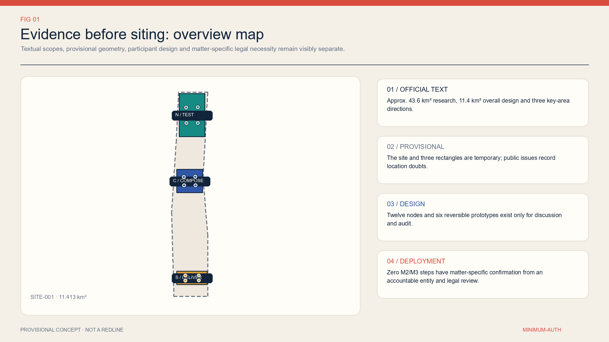
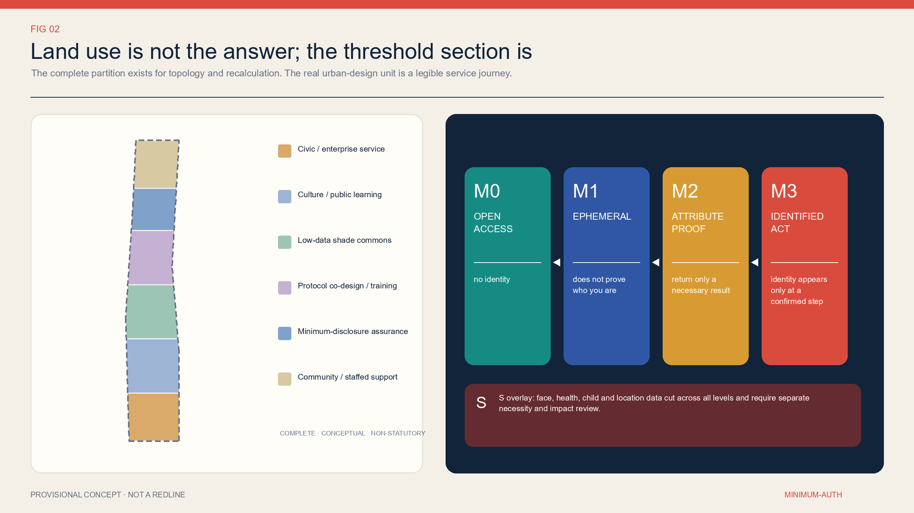
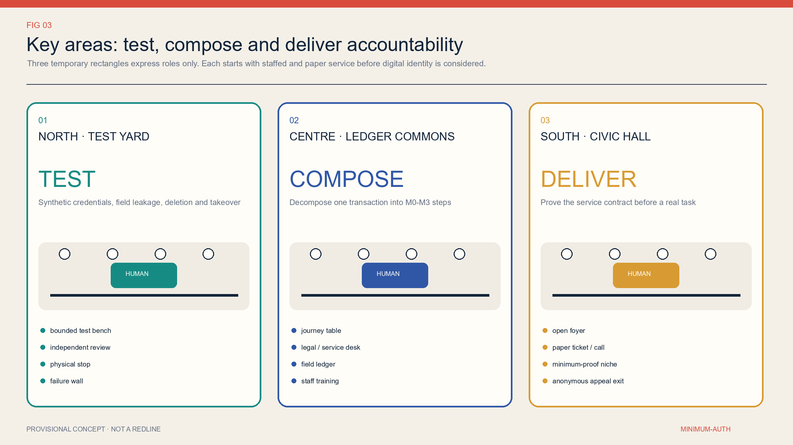
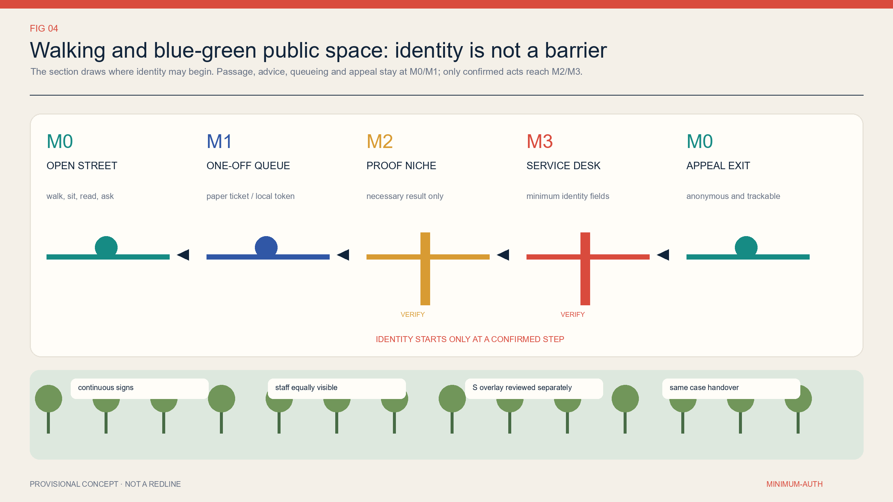
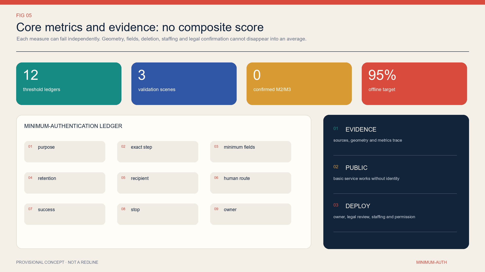

# MINIMUM-AUTH JINGZHANG: Identity Appears Only at the Necessary Step

This proposal no longer treats “usable without an app” as a complete innovation, because more systematic versions of that proposition already exist among the public submissions. It asks one narrower and more actionable question: **when completing a public service, at which exact action is there genuinely a reason to know who the user is?** The default answer is “there is no need.” If a higher threshold is truly required, the accountable institution must disclose the purpose, exact step, minimum fields, retention period, recipient, human entry point, success threshold, stop threshold, and accountable person. Once authentication is complete, unrelated downstream steps immediately return to a lower threshold; one verification event must never become a cross-service profile.

## Design Basis and Source List

The basis for this proposal has three layers. The first layer consists of verifiable facts: the call announcement describes in text a coordinated research area of approximately 43.6 square kilometres, an overall design area of approximately 11.4 square kilometres, and three key areas—Zhongzhiyuan, Beijing AI Origin Community, and Dazhongsi—totalling approximately 368.4 hectares. These figures describe the scale of the assignment; they do not establish the surveying precision of the polygons in this package. The second layer consists of the repository’s machine-readable materials: brief/site-package/, the source registry, task matrices, and provisional geometry. Only the third layer consists of the design deductions, metrics, and scenarios generated by this proposal. None of the three layers may impersonate another. [source:OFFICIAL-ANNOUNCEMENT] [source:SITE-PACKAGE]

Spatial evidence requires particular restraint. Repository maintainers have marked site_boundary.geojson and the three key-area geometries in key_areas.geojson as provisional constraints. Public Issues also identify locational doubts between the overall polygon and the railway heritage park, and between the southern key area and the place name “Dazhongsi.” This package therefore retains the original provisional geometry only for topology, area recalculation, and demonstrations of design relationships. The northern, central, and southern roles shown in the figures are conceptual roles, not conclusions about station entrances, parcels, road red lines, or site selection. Once official or rights-cleared CAD/GIS becomes available, every area, line length, zone, node, and drawing must be recalculated from the same source. [source:BOUNDARY-SOURCE] [data:geometry/site_boundary.geojson#SITE-001]

The legal basis likewise provides constraints rather than a ready-made design answer. The Personal Information Protection Law provides principles including a clear purpose, direct relevance, minimum impact, and the shortest necessary retention. The facial-recognition measures state that, where non-facial methods can achieve the same purpose, facial recognition must not be made the sole verification method. The national network identity authentication measures support retaining other lawful verification methods and returning only the verification result. Current law does not contain an “M0–M3” classification table, so that table is a design deduction in this proposal rather than a statutory classification. [source:PRC-PIPL-2021] [source:CAC-FACE-2025] [source:CAC-NET-ID-2025]

The originality check is also part of the source list. Public PR #1028 has already proposed NO-APP access, no account, no smartphone, non-mandatory facial recognition, and human takeover. Choice Line has already proposed service twins and choice equivalence. Common Eaves has already proposed public space that continues to work when AI is switched off. This proposal does not reproduce those principal themes, texts, or graphics. It narrows the unit of design to “the identity necessity of a single transaction step” and a field-level ledger. [source:PEER-NO-APP] [source:PEER-CHOICE-LINE] [source:PEER-COMMON-EAVES]

## Three-Level Scope Framework

The coordinated research area addresses institutional and ecosystem questions: how can an AI industrial chain create credible public scenarios without turning residents into default data sources? The overall design area addresses spatial and operational questions: how can open access, one-time sessions, attribute proofs, minimum identification, human review, and appeal exits be organised into a legible service network? The three key areas address verification questions: can reversible, small-scale, staffed prototypes demonstrate that the fields are truly minimal, the alternative paths genuinely work, and public service continues after the digital module stops? All three levels use the same minimum-auth ledger as their interface; they are not connected by inventing another slogan about a “smart corridor.” [source:AGENT-TASKBOOK] [depth:three_level_scope_framework]

| Working level | Question in this proposal | Deliverable in this package | Explicitly excluded extrapolation |
| --- | --- | --- | --- |
| 43.6 km² coordinated research area | Who may require identity, and under what circumstances | M0–M3+S protocol, accountability roles, and industrial validation tasks | No claim that a unified identity facility already covers the whole area |
| 11.4 km² overall design area | How thresholds appear on streets, at counters, on terminals, and across shifts | Six conceptual functional bands, open connections, low-data commons, and 12 service nodes | Conceptual bands are not statutory land-use or regulatory-plan zones |
| Three key areas | How to test, compose, and deliver under controlled conditions | TEST / COMPOSE / DELIVER interfaces and six reversible prototypes | No conclusion about station entrances, parcels, ownership, or engineering alignments |

The workflow begins by asking whether no identity is sufficient, not by asking which authentication technology should be adopted. A complete journey is decomposed into entry, orientation, queuing, eligibility determination, formal action, result collection, and appeal. Each step is separately assigned M0, M1, M2, or M3, with an additional S gate for sensitive information. If any step lacks an accountable institution, a basis for the matter, or an alternative channel, it cannot simply carry forward identity obtained at an earlier step. The overall strategy can therefore be implemented through counter signs, paper tickets, call buttons, data fields, deletion operations, and staff rosters rather than remaining a statement of principle. [data:geometry/public_space.geojson#NODE-S04]

The three levels also share three gates. The evidence gate requires every conclusion to trace back to a source, geometry, metric, or openly stated gap. The public gate requires basic service to remain obtainable when a digital module is disabled. The deployment gate requires accountability, permission, item-by-item legal review, identified data recipients, staffed shifts, verified deletion, and a designated appeal owner. The first two gates can be partially examined in this public package. The third has not been passed, so this proposal is a reviewable conceptual protocol, not a system ready for procurement or deployment. [metric:m2_m3_confirmed_gate_count]

## Coordinated Research Area: Industry and Future City Research

The Jingzhang AI innovation ecosystem needs more than models, computing capacity, and companies. It also needs “minimum-auth infrastructure” that government, parks, hospitals, transport providers, cultural institutions, and vendors can execute together. This proposal defines it as a public interface standard rather than a unified account. Each service remains under its own accountable institution, which determines the business outcome. The shared layer only helps describe steps, generate one-time tokens, or return necessary attributes; it does not build a cross-department identity profiling database. Industrial opportunities consequently move from “collecting more data” toward synthetic-data testing, privacy engineering, attribute credentials, accessible service, human takeover, deletion evidence, procurement audit, and appeal tools. [source:BEIJING-SCENARIO-2026]

All three industrial validation scenarios are placed in the conceptual northern TEST role and may use only synthetic data. S01 compares an interface that returns only an eligibility yes/no result with one that copies a complete synthetic document; success means the service side never receives the complete synthetic document. S02 rehearses cross-vendor handoff among queuing, attribute proof, and service completion; success means zero unauthorised field transfers and a revocable token. S03 replays expiry deletion, human takeover, and appeal using synthetic cases; success means every sample can produce either deletion evidence or a lawful reason for retention. If any test introduces real personal data, a fixed cross-scenario identifier, an irrevocable token, or an action for which nobody is accountable, the test stops immediately. [data:geometry/public_space.geojson#NODE-S01]

Future-city research begins with eight provisional user groups: older people without smartphones, ordinary residents who decline facial recognition, people using wheelchairs or visual and hearing assistance, temporary visitors and tourists, new residents who need translation, small-business representatives who do not yet have complete documentation, minors and guardians, and frontline counter and operations staff. These are recruitment and co-design hypotheses, not field-derived personas; this submission has conducted no Jingzhang field interviews and has no representative sample. In the next stage, users and frontline workers must jointly assess discoverability, accessibility, waiting, cost, privacy, dignity, and failure recovery. Response time cannot be the only measure, and the technical team cannot be the only evaluator. [source:BEIJING-ACCESSIBILITY-2021]

The brand does not name another “smart artery, corridor, or link.” It uses a plain public commitment: **identity appears only where it is needed**. Every entrance displays the same threshold card: purpose, current level, exact authentication step, required fields or result, retention period, recipient, whether the material is used by AI, human and paper entry points, deletion, and appeal method. What is unified is public language and the accountability structure, not identity itself. This can support corporate validation and procurement while remaining legible enough for residents to question it on site. [source:NIST-DIGITAL-ID-2025]

## Overall Design Area: Urban Renewal and Regulatory-Plan-Level Urban Design

The overall design uses six topologically complete conceptual bands: public and enterprise services; cultural interpretation and public learning; low-data shaded commons; authentication-process co-design and training; minimum-disclosure validation; and community service and staffed support. They are partitioned from the same provisional site geometry solely so that every square metre participates in the package’s internal recalculation and no gaps or overlaps are hidden in the drawings. Their codes reuse enumerations permitted by the repository; they do not represent existing conditions, statutory land use, property rights, or regulatory-plan amendments. Once statutory information becomes available, the bands should be rearranged around actual blocks, roads, and buildings rather than preserving geometry invented for this draft. [data:geometry/land_use.geojson#LU-AUTH-01]

The spatial core is a conceptual north–south public-service walking connection with three transverse links. Along it are a low-data shaded commons, 12 small service nodes, and six demountable one- or two-storey prototypes: a minimum-disclosure test pavilion, a vendor-handoff clinic, a field-ledger co-design room, a human-review and training hall, a one-step service demonstration hall, and an anonymous appeal and repair room. The prototypes express only area, adjacency, and operational role. They correspond to no existing building and propose no approved demolition, retention, alteration, addition, or new construction. [data:geometry/buildings.geojson#BLDG-AUTH-01] [metric:building_footprint_area_sqm]

The spatial section of one service sequence is as follows: an M0 open foyer for information and first assistance; an M1 paper ticket or local random token to maintain a single queue; an independent and visible M2 verification interface that receives only a confirmed attribute result; an M3 counter with improved visual and acoustic privacy for a statutory or contractual action that is confirmed as necessary; and then a return to M0 for result collection and anonymous appeal. M2 and M3 must not be concealed in an entrance gate or default checkbox. Human service must not be placed farther away, open for shorter hours, or priced higher. [source:CAC-NET-ID-2025]

With incomplete information, “regulatory-plan depth” should be expressed as a reviewable list of questions rather than false numerical precision. Building height, floor area ratio, road red lines, setbacks, parking, fire protection, municipal capacity, flood control, heritage protection, ownership, and investment all remain unknown. What is known consists only of the areas and counts in the participant-created conceptual geometry. Formal development must write these conditions into the entry gate for every node: no site selection without complete information, no construction without permits, no procurement without staffed shifts, and no M2/M3 activation while legal necessity remains unclear. [metric:floor_area_ratio]

## Detailed Design of Key Areas

The three key areas do not inherit fixed industrial labels. Instead, they carry successive evidence roles. Northern **TEST** uses synthetic identities, synthetic eligibility, and synthetic cases to stress-test interfaces; its spaces comprise test pavilions, a vendor-handoff clinic, and observable human replay stations, and it prohibits real residents or production identities. Central **COMPOSE** decomposes public consultation, document pre-checking, queuing, eligibility decisions, and formal submission into visible steps. In its field-ledger co-design room and human-review training hall, service owners, legal reviewers, and users remove unnecessary thresholds one field at a time. Southern **DELIVER** compares digital, paper, and human paths in a one-step service demonstration hall and an anonymous appeal and repair room, publishing waiting, completion, deletion, and complaint outcomes. [data:geometry/key_areas.geojson#PROV-KEY-001]

Success in the northern key area does not mean “connecting more models.” It means that three validations can expose problems without touching real personal data. Every test preregisters its fields, sender, recipient, validity period, revocation method, accountable person, and stop condition. A vendor may see only the data needed to complete its own step. If the system cannot export a complete processing record, prove expiry deletion, or restore the task after human takeover, the test does not advance. Equipment uses demountable furniture and a locally isolated network; site selection, electricity supply, fire protection, and heritage conditions all await professional verification. [data:geometry/public_space.geojson#NODE-S03]

The central key area turns “when identity appears” into a shared annotation exercise conducted on a long table and a counter section. Eight user groups complete journeys using paper cards. The business owner identifies the exact action that creates rights or obligations; legal reviewers assess necessity only for that action; data staff list fields and deadlines; and frontline staff test whether the result can be executed during real shifts. While a dispute remains unresolved, the threshold stays at M0/M1; the system is not deployed first and explained later. This area prioritises S04–S07: multilingual help, government-service pre-checking, health navigation, and on-site reading and borrowing. [data:geometry/public_space.geojson#NODE-S05]

The southern key area places the protocol within the same interfaces as everyday services. It accommodates a youth workshop, accessible shuttle, public events, enterprise service, and complaints. Every task has at least one entry that does not depend on an app. M2 attribute results and M3 identity fields go to explicitly identified recipients, and anonymous feedback is not automatically deprioritised because it lacks identity. The actual locations of all three areas remain provisional; in particular, the current southern polygon must not be described as an integrated Dazhongsi Station design or an official key-area red line. [source:KEY-AREA-SOURCE]

## AI Innovation Ecosystem, Personas, and AI+ Scenarios

M0–M3 are step thresholds, not ranks assigned to groups of people. M0 open use requires no proof of real-world identity and applies to passage, general enquiries, emergency help, public information, and on-site reading. M1 one-time session uses a random paper ticket, local token, or voluntarily supplied single-use contact detail to maintain one queue, reservation, or response without linking services. M2 single-attribute proof returns only a necessary result such as an age band, eligibility, or completed training; it does not copy the complete document and requires confirmation for each matter. M3 minimum identified action identifies a person only where a particular statutory or contractual action truly requires it, and its fields may not spill into earlier or later steps. Every M2/M3 threshold currently remains UNVERIFIED. [source:PRC-PIPL-2021]

Sensitive information is not a higher “M4”; it is an **S overlay gate** across every level. Anonymous health triage may still process health information, and an M0 accessibility preference may expose personal circumstances when combined with other data. Facial data, health data, information about minors, financial accounts, and precise movement therefore require separate assessments of full necessity, applicable additional notice or consent, impact, access control, and minimum retention. Consent cannot cure collection that was unnecessary in the first place, nor may it turn facial recognition into the sole entrance. [source:CAC-FACE-2025]

The twelve scenarios are not a feature list; they are twelve minimum-auth ledgers. S01–S03 are industrial validations using synthetic data only. S04 multilingual help is M0 by default and reaches M1 only for an asynchronous response. S05 government-service pre-checking is M0, ticketing is M1, and formal submission is a candidate M3. S06 emergency help and triage are M0, while formal treatment, prescription, or reimbursement is a candidate M3. S07 on-site reading is M0 and borrowing is a candidate M2. S08 visiting and courses are M0, while controlled equipment is a candidate M2/M3. S09 shuttle access is M1 and concession eligibility is a candidate M2. S10 public activities are M0 and capacity reservations M1. S11 enterprise consultation is M0, follow-up M1, and formal application a candidate M3. S12 feedback is M0, tracking M1, and a remedy affecting personal rights or a refund a candidate M3. [data:geometry/public_space.geojson#NODE-S12]

In these scenarios, AI may only perform content retrieval, translation, document prompts, route suggestions, queue assistance, synthetic-data testing, and explainable risk alerts. If an output affects eligibility, priority, price, benefits, access, or other significant rights and interests, the accountable body and principal basis must be disclosed, with opportunities for explanation, objection, and a human decision. A model cannot make the initial judgment and also serve as the sole reviewer. Raw consultation, health descriptions, complaint materials, and information about minors must not automatically enter training sets under the rationale of “improving the model.” [source:PRC-PIPL-2021]

The required talent is not limited to algorithm engineers. It includes business owners, privacy and security engineers, accessibility specialists, service designers, legal reviewers, frontline counter staff, operations staff, appeal owners, independent evaluators, and compensated user representatives. The launch team for every scenario must be able to answer nine fields: purpose, step, minimum fields, retention period, recipient, human path, success threshold, stop threshold, and accountable person. If any one is absent, the scenario is not ready; it is not merely “being iterated.” [metric:persona_count]

## Land Use, Building Scale, and Retain-Renovate-Demolish Strategy

The land_use.geojson layer is a complete partition composed of six seamless conceptual bands. It exists only to verify the proposal’s internal topology and area formulae. Its names express the operating functions of service delivery, learning, low-data public space, co-design, validation, and staffed support. Its codes come from permitted enumerations, but they must not be interpreted as existing or proposed statutory land use. Each band’s area is recalculated in EPSG:4548 and must be recalculated in full when an official boundary replaces the provisional one. [data:geometry/land_use.geojson#LU-AUTH-06] [metric:site_area_sqm]

The building layer places only six reversible one- or two-storey prototypes, each at the scale of a small pavilion or studio: two serve TEST, two serve COMPOSE, and two serve DELIVER. The floor_area_sqm value is calculated by multiplying the conceptual footprint by the proposed storey count. Its purpose is to cross-check drawings, GeoJSON, and metrics; it is not a commitment to construction scale, floor area ratio, building coverage, or investment. Without an inventory of existing buildings and ownership information, this submission cannot classify any real building for demolition, renovation, or retention. [data:geometry/buildings.geojson#BLDG-AUTH-06] [metric:total_floor_area_sqm]

Future retain-renovate-demolish decisions follow a sequence of gates. First verify existing conditions and ownership; then verify heritage status and structural safety; then determine whether operations can use existing interior space; only then compare a demountable addition. The priority is to reuse existing staffed counters, mobile furniture, and paper interfaces; temporary rental or adaptation comes second, and permanent construction last. Any prototype that damages heritage, occupies a fire-evacuation path, reduces publicly open area, or turns an accessible route into an authentication channel should be rejected. [source:BOUNDARY-SOURCE]

Scale control does not follow a “more is better” principle. Each key-area role initially receives only two reversible prototypes and four service nodes. Expansion can be discussed only after the relevant task’s human and paper paths meet their thresholds, fields are not over-collected, deletion can be proved, appeals close the loop, and site and professional permissions are complete. If formal information shows that a space is unsuitable, the protocol can move into an existing service hall or be removed entirely. Its value resides in the threshold contract, not in a fixed building. [metric:minimum_auth_node_count]

## Transport, Rail, Municipal Infrastructure, and Public Services

The transport strategy begins by asking whether people can arrive and depart without being identified. The conceptual north–south connection and three transverse links express a continuous relationship among walking and public services; they are not road or rail engineering alignments. Every open entrance defaults to M0 and has no QR-code, facial, or account gate. Wayfinding combines high-contrast text, tactile and paper maps, voice, and human directions. Ordinary arrival, passage, rest, drinking water, toilets, and emergency assistance must not be obstructed because someone lacks a smartphone. [data:geometry/roads.geojson#ROAD-AUTH-00]

Accessible shuttle scenario S09 uses an M1 random ticket number to maintain one trip, and the user may voluntarily provide a one-time contact detail. Only an application for a confirmed concession is a candidate M2, preferably returning only “eligible/not eligible.” A roadside call button, staffed dispatch, telephone, paper ticket, cash, or physical transport card sits alongside the digital entry. The proposal target is that at least 95% of trips can be booked without an app and that the p90 wait for the human path is no more than ten minutes longer than the app path. One refusal of service because the rider has no account or declines facial recognition pauses digital-priority dispatch. [metric:offline_completion_target]

Integration with railway stations, parking, non-motorised transport, road circulation, and the feasibility of crossing railways or waterways must await official alignments, station entrances, red lines, passenger-flow data, and engineering information. Current geometry expresses only relationships that should be connected; it cannot support a claim of direct connection to Dazhongsi Station, Qinghe Station, or any entrance. Public-transport operators must also confirm identity, ticketing, security-check, and concession rules item by item. This proposal cannot substitute general personal-information principles for sector-specific review. [source:OFFICIAL-ANNOUNCEMENT]

Municipal and digital facilities follow minimum dependency. Basic lighting, drinking water, toilets, calls for help, and locks remain usable mechanically or through staff. Environmental sensing is locally aggregated by default and does not collect device identifiers. When an edge terminal loses its connection, it can still display static information and a human telephone number. No site information has been obtained for electricity, communications, water supply and drainage, fire protection, flood control, waste, thermal environment, cybersecurity classification, or maintenance budgets. The conceptual nodes therefore must not be presented as “smart infrastructure” that already has the necessary capacity. [data:geometry/constraints.geojson#C-UTIL]

## Blue-Green Network, Public Space, and Urban Character

The low-data shaded commons is a conceptual public-space band. It organises shade, rest, walking, wayfinding, drinking water, assistance, and small service nodes while making explicit that “the usability of space must not depend on personal identification.” If thermal conditions, soil, or footfall are measured, locally aggregated data that does not retain raw individual records is preferred. Any camera or identity-recognition equipment requires a separate public-safety necessity, prominent notice, and a strict purpose boundary. It must not track people by default under the label of experience optimisation. [data:geometry/green_space.geojson#GREEN-LOW-DATA-01]

The public-node area ratio and green-space ratio are package-internal metrics calculated from conceptual geometry; they are not ecological performance, a statutory green-space ratio, or a planning commitment. Real design must recalculate them after surveys of official boundaries, existing trees, daylight, thermal comfort, stormwater, soil, utilities, sponge-city requirements, accessibility, and maintenance. If an identity-threshold prototype displaces shade, seating, or open passage, the prototype should first be reduced or removed rather than turning public space into an equipment showroom. [metric:green_ratio] [metric:public_space_ratio]

Urban character follows a language of being “legible, reversible, and repairable.” The four thresholds use consistent colours and text, but every card names the local accountable institution. Demountable elements avoid faux-historic styling and branded large screens. Privacy counters protect individuals through distance, sightlines, and acoustic treatment without becoming closed black boxes. At night, clear human assistance and accessible paths remain available. Historical narratives use only rights-cleared historical sources; AI-generated images are not treated as heritage facts, and equipment is not fixed to unverified heritage objects. [source:SOURCE-REGISTRY]

The free and open portion of public-activity scenario S10 remains M0. Where capacity control is necessary, an M1 random reservation number is used and at least 30% of places are reserved for anonymous walk-ins. Only if an accountable institution establishes an age or security qualification may it propose a candidate M2/M3 and complete item-by-item verification. If login, scanning, or facial recognition becomes the sole entrance, digital ticketing pauses while paper tickets and staffed entry continue. Publicness thus becomes a testable operating condition rather than an empty plaza in a rendering. [data:geometry/public_space.geojson#NODE-S10]

## Renewal Projects, Implementation Policy, and Phasing

The project list is phased by evidence maturity rather than calendar promises. G1, “threshold inventory and no-permanent-work prototype,” requires service owners to document the current journey, legal roles, staffed shifts, fields, vendors, and complaint baseline for twelve task types, and to complete site permission and participant recruitment. Only paper cards, mobile furniture, and synthetic data are used. G2, “one controlled pilot in each of the three areas,” admits a task only after its M2/M3 steps have been confirmed item by item, staffed shifts are budgeted, deletion and takeover drills pass, and accessibility has been jointly accepted. G3, “evidence-based expansion or withdrawal,” expands only tasks that continuously meet thresholds; all others return to M0/M1 or close the digital module. [data:geometry/phasing.geojson#PHASE-AUTH-01]

Every project uses the same plain-language implementation contract: who does what for whom, at which place and time; what the existing baseline is; which spaces, people, data, budgets, and permits are needed; what counts as success and what triggers a stop; how human, paper, or mechanical service continues after a stop; and who publishes results, handles appeals, and bears responsibility for correction. Equipment cannot enter the site while the contract remains incomplete. A plan that relies on long-term volunteer staffing, reduces human-window hours until they are impractical, or replaces deletion and appeal responsibility with “future optimisation” does not provide a real alternative path. [source:BEIJING-ACCESSIBILITY-2021]

The recommended first round is not a whole-area “launch.” It consists of three synthetic-data validations plus three low-risk everyday tasks: multilingual public help, anonymous feedback, and on-site reading or information. The first two test AI content and appeals, while the third tests M0 publicness. Before any physical work and while the site remains uncertain, all three can be examined through service blueprints and paper rehearsal. Tasks involving health, minors, concession eligibility, formal government service, and enterprise applications affect sensitive information or rights and obligations; they do not enter real-data pilots early merely for exhibition value. [source:BEIJING-SCENARIO-2026]

Procurement policy requires a field-level appendix, vendor exit, and verifiable deletion. An interface may carry only fields listed in the ledger. A model provider may not use raw public consultations for training. Tokens are revocable and cannot be reused across services. At contract termination, the operator exports the business record, deletes vendor copies, and enables an independent spot check. Performance payments are tied to task completion, human equivalence, deletion, appeals, and recovery after shutdown—not primarily to registrations, data volume, or model-call volume. [source:CAC-PIPL-AUDIT-2025]

## Metrics, Area Recalculation, and Compliance Matrix

The proposal refuses to average rights, space, and technology into a single “AI innovation index.” Metrics are divided into five groups and judged separately. Spatial-evidence checks ask whether the provisional site, complete zoning, conceptual buildings, green space, nodes, and connections are recalculated from one source. Identity-boundary checks ask whether a threshold appears exactly at the approved step and whether fields are over-collected. Operational checks examine the visibility, completion rate, waiting time, and opening hours of human and paper paths. Data-governance checks examine recipients, deletion, revocation, export, and purpose. Accountability checks examine explanation, objection, human decisions, and appeals. A major failure in any group cannot be cancelled out by a high score elsewhere. [metric:site_area_sqm]

| Metric | Current value / target | Evidence status | Triggered action |
| --- | --- | --- | --- |
| Confirmed M2/M3 thresholds | 0 | Known package state; it does not mean identification will never be needed | Do not deploy before confirmation |
| Identity appears before the confirmed step | Target 0 | Awaiting a baseline of on-site journeys | Pause the relevant threshold when the limit is exceeded |
| Eligible task completion without an app | Target ≥95% | Awaiting measurement; not a claim about current performance | Return to a lower threshold or add staff after repeated failure |
| Account or facial-recognition blockage at public entrances | Target 0 | Awaiting entrance-by-entrance inspection | One occurrence immediately opens the physical path and disables the gate |
| Conceptual-zone coverage / overlap | 100% / 0 | Recalculable from GeoJSON | Do not use area metrics if the check fails |
| Statutory floor area ratio, parking, and municipal capacity | unknown | Official regulatory-plan and professional information are absent | Keep unknown; the model must not invent values |

Every area and length is calculated from the same-source GeoJSON under measurement_crs=EPSG:4548. Formulae, source files, confidence, assumptions, and reasons for unknown values are recorded in metrics.json. The site_area_sqm metric describes only provisional SITE-001. The green_ratio and public_space_ratio describe only participant-created conceptual geometry. The floor_area_ratio is explicitly unknown. Replacing any official geometry requires regeneration of every derived layer, metric, PNG, HTML, and PDF; one number cannot be edited by hand. [metric:floor_area_ratio]

The compliance_matrix.json file maps assignment requirements. The standard_matrix.json file distinguishes project sources, law, technical guidance, and cases. The design_depth_matrix.json file records depth items including existing-condition diagnosis, the three-level framework, land use, buildings, transport, blue-green systems, and implementation. These matrices show only “where an answer is located”; they do not prove that government, legal reviewers, engineers, or users have accepted the answer. Passing self-checks likewise means only that package structure, spatial topology, metric consistency, and visual legibility have met the repository threshold. [depth:three_key_area_detailed_design]

## Risk, Copyright, and Compliance

The greatest risk is not technical failure but presenting design deductions as established facts. M0–M3 are not statutory identity levels. A provisional polygon is not an official red line. Retention periods in the twelve ledgers are proposal ceilings, not uniform statutory periods. International cases are not Chinese compliance authority. Beijing’s scenario-opening policy is not permission for a particular Jingzhang site. Any real deployment still requires the accountable institution to determine, item by item, the processing basis, full necessity, fields, recipients, retention period, alternative channel, impact assessment, and applicable sector rules. [source:PRC-PIPL-2021]

The second risk is an “exit path” that exists only in prose. Paper is not automatically accessible, and human service is not automatically equivalent. A counter may be farther away, cost more, or open for shorter hours, while staff may lack training and rest. A pilot must separately measure discovery, arrival, completion, waiting, cost, dignity, and failure recovery for digital, human, paper, and mechanical paths. Older people, disabled people, people without devices, people with language needs, and frontline workers must jointly accept the result. Basic service cannot stop when a digital module stops. [source:BEIJING-ACCESSIBILITY-2021]

The third risk is that data minimisation is swallowed by generic invocations of anti-fraud, payment, or child protection. This proposal does not claim that every transaction must remain anonymous forever. It requires risk control to target a specific action and gives priority to one-time sessions, attribute results, human review, and appealable decisions. If identification is truly necessary, M3 occurs only at that action and does not automatically unlock other services. If facial data, health data, information about minors, or movement is involved, the S gate independently blocks progress; one consent cannot cover everything. [source:CAC-FACE-2025]

The text, tables, M0–M3+S design deductions, field ledgers, participant-created GeoJSON, infographics, static web pages, and PDF layouts are original outputs generated for this submission. No third-party photographs, map tiles, logos, peer graphics, or non-public materials were used. Noto Sans SC is embedded in the PDF only as a font subset, and the original font file is not distributed with the package. Complete sources, limitations, and the division of generation work are documented in sources.json, report/copyright_statement.md, and report/narrative.md. [source:FONT-NOTO-SC]

This submission uses `CC-BY-4.0`: third parties may copy, distribute, and adapt the original submission assets provided that they give appropriate credit, link to the licence, indicate changes, and do not imply endorsement by the submitter or related institutions. Official material, legal texts, web pages, provisional geometry, and fonts are not relicensed by this statement and remain subject to their respective rights boundaries.

## References

Project facts are governed by the qualification-review announcement published by the Beijing planning and natural-resources authority. The open call’s deliverable structure, three-level assignment, and agent requirements are governed by the repository’s fixed version of the urban-design-ai-submission Skill, task book, and site package. They are related but distinct procedures: this package participates in the GitHub Agent open call and does not claim professional-institution competition eligibility, government endorsement, compensation rights, or an implementation commitment. [source:OFFICIAL-ANNOUNCEMENT] [source:AGENT-TASKBOOK]

Primary domestic legal and policy sources include the official text of the Personal Information Protection Law; the Measures for the Security Management of the Application of Facial Recognition Technology, effective 1 June 2025; the Measures for the Administration of the National Network Identity Authentication Public Service, effective 15 July 2025; the Beijing Regulations on the Construction of an Accessible Environment; and Beijing’s 2026 work plan for scenario cultivation and open application. Respectively, they support minimum scope, shortest retention, protection of sensitive information, non-facial alternatives, retention of other verification methods, result-based verification, coexistence of traditional service and intelligent innovation, and controlled scenario opening. None directly confirms any location or M2/M3 threshold in this proposal. [source:CAC-NET-ID-2025] [source:BEIJING-SCENARIO-2026]

International mechanism cases include NIST SP 800-63-4, the European Digital Identity framework, Login.gov, and RealMe. They offer lessons in asking first whether real-world identity is necessary, selective disclosure, different identifiers for different services, separation of accounts from identity proofing and service eligibility, and human channels after digital failure. Their legal systems, credential conditions, coverage, and retention periods cannot be transplanted directly. Amsterdam’s algorithm-publication practice, Helsinki Testbed, and UW AccessMap inform public accountability, controlled pilots, stop conditions, AI-assisted extraction with human verification, and explicit uncertainty. [source:NIST-DIGITAL-ID-2025] [source:EU-EUDI-2024] [source:LOGIN-GOV-ID]

The originality boundary refers to three public peers. NO-APP JINGZHANG addresses no-device and no-account access with human takeover. Choice Line addresses genuine choice and equivalence between AI and non-AI paths. Common Eaves addresses public interfaces that remain usable when AI is switched off. This proposal does not rename those achievements. It delivers exact-step necessity, a field ledger, spatial threshold sections, and accountability and stop contracts. Complete URLs, publishers, uses, and limits on extrapolation are registered in sources.json. [source:PEER-NO-APP] [source:PEER-CHOICE-LINE] [source:PEER-COMMON-EAVES]

The final evidence boundary is as follows: public materials prove that the call and the cited laws and cases exist; package GeoJSON and metrics prove the proposal’s internal consistency; drawings and web pages prove that its design intent is legible. None proves site applicability, public acceptance, legal necessity, engineering feasibility, or approval. The real next step is not to change unknown into known, but to close each assumption jointly with the authorised data, professional teams, frontline operators, and affected users. [source:SOURCE-REGISTRY]
