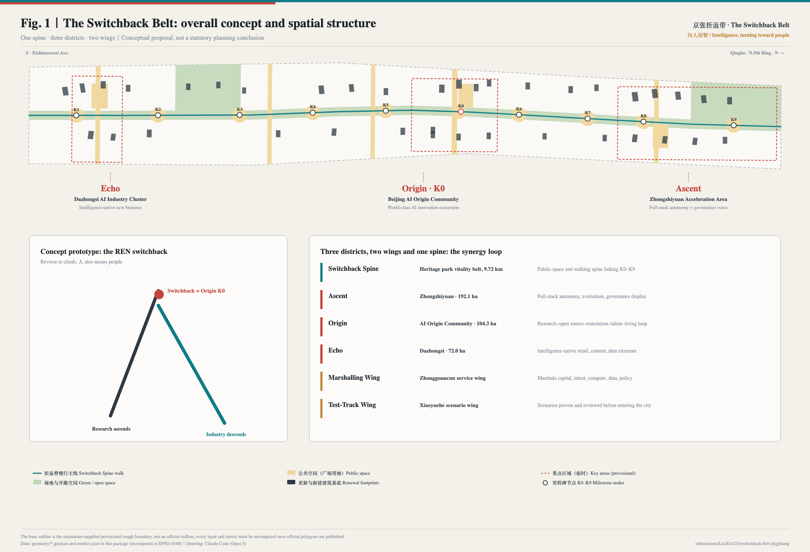
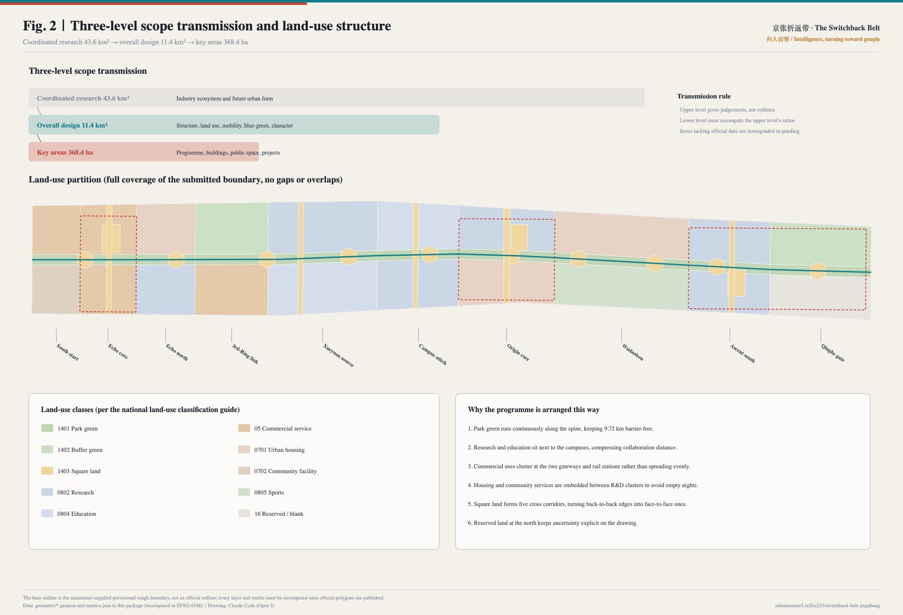
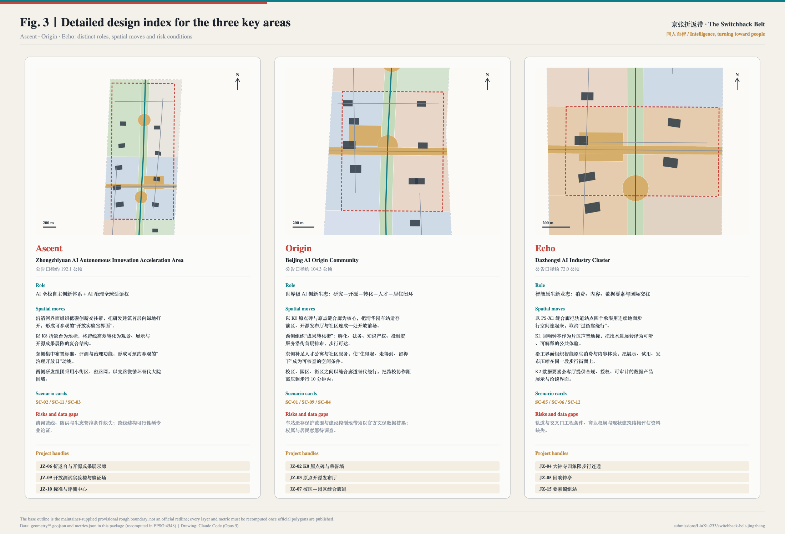
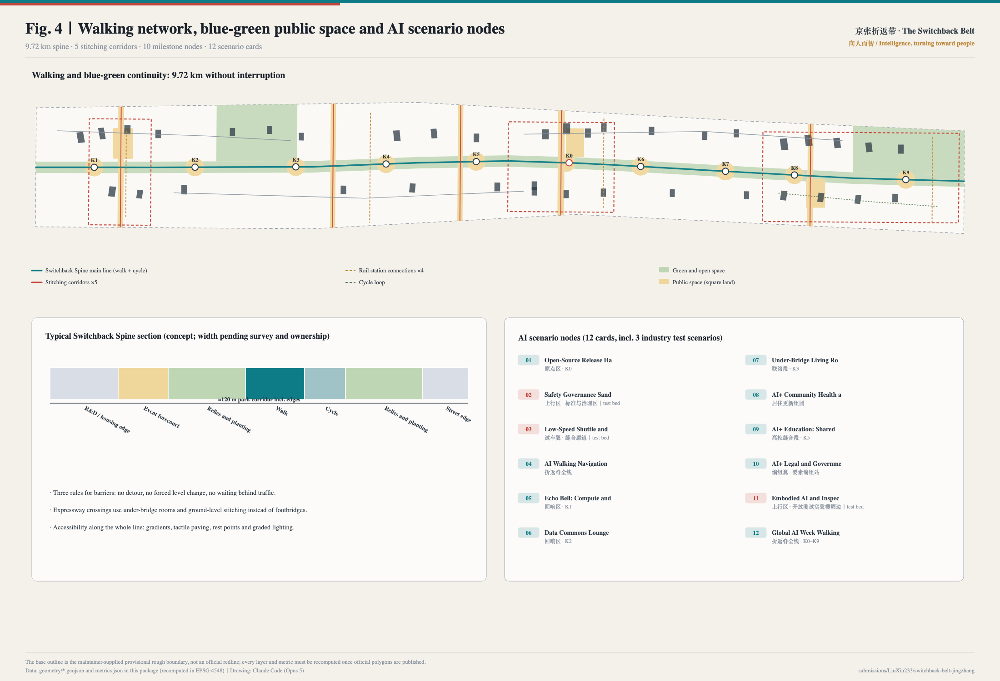
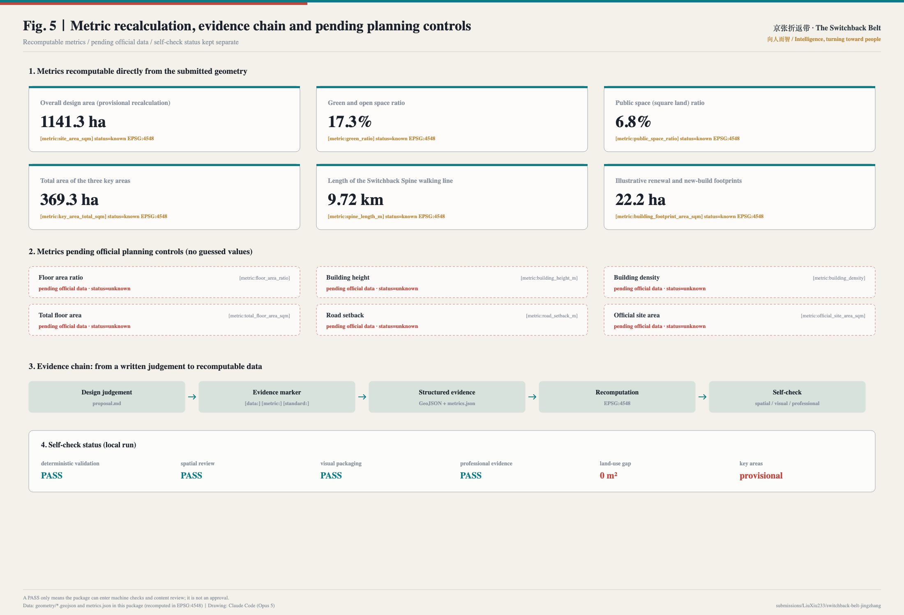

# The Switchback Belt · Urban Design for the Centennial Jing-Zhang AI Innovation Belt

> A century ago, one railway taught a country how to turn on a steep grade.
> A century later, one belt turns artificial intelligence toward people.
> **The Switchback Belt — "Intelligence, turning toward people"**

## Design Basis and Source List

The primary basis of this proposal is the official pre-qualification announcement for the Centennial Jing-Zhang AI Innovation Belt urban design call, covering project purpose, the three-level scope, design tasks and deliverable depth. The second basis is the agent open-call taskbook extract, covering the six required tasks agent.1 to agent.6, the three positionings, five functions, three areas and two wings, and the common boundary clause [source:OFFICIAL-ANNOUNCEMENT] [source:AGENT-TASKBOOK]. The announcement decides *how deep* the work must go; the taskbook decides *which questions* an agent must answer. This proposal merges both into one verifiable deliverable structure.

The spatial base comes from the maintainer-supplied provisional rough boundary. **This must be stated first: neither the overall design boundary nor the three key-area boundaries used here are an official redline.** They are `provisional_constraint`, `official_boundary=false`, `boundary_precision=provisional_rough` [source:BOUNDARY-SOURCE] [data:geometry/site_boundary.geojson#SITE-001]. They may only be used for generation, visualisation, design discussion and local self-check — never as an approval basis, a precise-area basis or a statutory control conclusion. Once official polygons are published, land use, green space, public space, buildings, roads, phasing and every metric must be recomputed as a whole package rather than by swapping a single file [depth:existing_conditions_diagnosis].

Source discipline follows three rules [source:SOURCE-REGISTRY]:

- **Formal-ready sources** are used only where authority is required (scope figures, task requirements, professional standards);
- **Background sources** (government news releases, media reports, third-party policy reprints) are used only for existing-condition description and order-of-magnitude judgements, never to support spatial control conclusions;
- **Provisional sources** are used only for temporary generation and discussion and are never promoted into official boundaries.

Independently retrieved and registered public sources include: the first phase of the Jing-Zhang Railway Heritage Park opening to the public in June 2023, with its southern section opened earlier and the Qinghua Yuan station building and track relics preserved [source:HD-PARK-PHASE1] [source:BJ-PARK-PHASE1-SOUTH]; the official planning commentary on the park's co-creation process [source:BJ-PARK-PLANNING-READING]; and order-of-magnitude background on Haidian's AI enterprises and filed large models [source:HD-AI-ENTERPRISE-COUNT] [source:HD-LLM-FILINGS]. The last two are media and platform reprints, cited here only as background and flagged in the assumptions as requiring cross-checking against official statistics [source:PROCESSED-FACT-PACK].

**A known georeferencing dispute, stated first.** Two participants independently verified this repository's provisional geometry against open data and published the results: Issue #846 finds, using OpenStreetMap, that the provisional overall design polygon **does not intersect** the mapped Jing-Zhang Railway Heritage Park and lies about 412.5 m away, while the coordinated research polygon matches it exactly; Issue #1029 finds that the centroid of `PROV-KEY-003` (Dazhongsi AI Industry Cluster) sits about 2.26 km from Dazhongsi metro station, with Beijing North Station falling inside that polygon instead [source:PEER-ISSUE-846] [source:PEER-ISSUE-1029]. Both await maintainer confirmation, but they change how this proposal speaks: **districts are located by the names and task descriptions in the announcement, not by treating the provisional polygons' coordinates as true geography.** The alignment of the spine, the position of the three districts and the actual coordinates of K0–K9 must therefore be re-derived once official polygons are published, and every area, ratio and length recomputed with them [depth:existing_conditions_diagnosis]. This is recorded as `A-GEOREF-001` in `assumptions.json` and repeated on the presentation page and the boards.

**Credit to prior peer work, and how this differs.** The peer proposal REN AXIS (`submissions/Abreto/ren-axis-jingzhang-ai-belt`, Issue #215) also takes the 人-shaped switchback of the Jing-Zhang Railway as its conceptual starting point [source:PEER-REN-AXIS]. This proposal was generated independently; on discovering that work while searching community Issues, the name was changed from The REN Belt to The Switchback Belt to avoid brand confusion. The switchback is shared public heritage and no party should claim exclusivity over it. This proposal differs through the **K0 zero-kilometre origin with a growing engraving system** as an honours institution, the **Marshalling and Test-Track Wings** as element-dispatch and validation mechanisms, and the **Echo Bell** that turns public compute and open-source commits into sound. No text, drawing or data from that proposal is used here.

Judgements and data stay traceable in both directions: every spatial claim lands on a specific layer and metric, for example the recomputed overall area [data:geometry/site_boundary.geojson#SITE-001] [metric:site_area_sqm] and the independently checked key areas [data:geometry/key_areas.geojson#PROV-KEY-001] [metric:key_area_total_sqm]. The exhaustive source, standard and depth indexes live in `sources.json`, `standard_matrix.json` and `design_depth_matrix.json`; the prose does not repeat machine identifiers.

## Three-Level Scope Framework

The three levels defined by the announcement are not three drawings but three different definitions of *what may be claimed*. The transmission rule adopted here is: **the upper level gives judgements, not redlines; the lower level must be able to recompute the upper level's ratios; any item lacking official data is downgraded to pending** [depth:three_level_scope_framework] [standard:PROJECT-OFFICIAL-ANNOUNCEMENT].

| Level | Scale | Question answered | Permitted output | Data anchor |
| --- | --- | --- | --- | --- |
| Coordinated research area | 43.6 km² | How is the AI innovation ecosystem and future urban form organised | Strategy, ecosystem map, case transfer mechanisms | `compliance_matrix.json`, `sources.json` |
| Overall design area | 11.4 km² | How do structure, land use, mobility, blue-green and character land on the drawing | Structure, zoning, corridors, projects, metrics | [data:geometry/land_use.geojson#LU-001] |
| Key areas | 368.4 ha | How do the three districts reach detailed-design depth | Programme, buildings, public space, projects | [data:geometry/key_areas.geojson#PROV-KEY-002] |

The test between levels is recomputability. The overall design area is partitioned into 48 polygons that fully cover the submitted boundary with a gap area of 0 m² [metric:land_use_coverage_gap_sqm] [depth:overall_spatial_structure]. Any ratio in this proposal is therefore not an estimate but a number a third party can regenerate from the same GeoJSON in EPSG:4548 [metric:site_area_sqm].

**Overall concept: The Switchback Belt.** The most celebrated engineering decision on the Jing-Zhang Railway was the 人-shaped switchback at Qinglongqiao, which solved a steep grade by making the train reverse before climbing further — retreating in order to advance. The prototype offers three lessons. First, **the turn**: technology moving from the laboratory into the city needs an explicit switchback point. Second, **the climb**: the turn is not a retreat but the condition for continuing to rise. Third, **人 means people**: the character is both the track geometry and this proposal's value judgement — AI enters the city on the condition of everyday life, dignity and reviewability. The concept therefore does not give this land a new slogan; it gives it one walkable **spine**, three legible **switchback points** and two dispatchable **wings**.

## Coordinated Research Area: Industry and Future City Research

The core task across the 43.6 km² research area is to answer what a world-class AI innovation ecosystem actually looks like in space. Rather than listing companies, this proposal examines six verifiable international cases and translates their transferable **spatial mechanisms** into Haidian moves [source:AGENT-TASKBOOK] [standard:PROJECT-AGENT-OPEN-CALL-TASKBOOK].

| Case | Verifiable fact | Spatial mechanism | Transferable move |
| --- | --- | --- | --- |
| King's Cross, London | ~67 acres of former railway land incl. ~26 acres of public realm; jobs from ~8,000 (2011) to ~27,000 (2019) | Public realm and heritage reuse precede office delivery | Open the Switchback Spine first, then pursue industry [source:CASE-KINGS-CROSS] |
| STATION F, Paris | Historic rail building; 1,000+ resident startups | One very large hall plus a shared service stack | Concentrate the service stack in the Origin release hall and translation street [source:CASE-STATION-F] |
| Zhangjiang AI Island | ~66,000 m² land, ~100,000 m² floor area; the park itself is the demonstration site; later "island to district" | The district as its own test bed | Test-Track Wing opens scenarios at stitching corridors and milestone nodes first [source:CASE-ZHANGJIANG-AI-ISLAND] |
| MaRS, Toronto | Physical hub for incubation, capital, talent and policy | One front door with an address | A "Marshalling Station" in the Marshalling Wing, one address for everything [source:CASE-MARS-TORONTO] |
| one-north, Singapore | Government-led long-phase R&D district (figures to be verified) | Stable spatial governance and durable phasing rules | Three phases plus reserved land, keeping uncertainty on the drawing [source:CASE-ONE-NORTH] |
| Kendall Square, Boston | University-adjacent innovation district (statistics to be verified) | Walking distance drives collaboration frequency | Campus stitching turns "crossing a road" into "crossing a square" [source:CASE-KENDALL-SQUARE] |

The shared conclusion is that **innovation ecosystems are not planned into existence; they are decided by distance, edges and entrances.** Three spatial mechanisms follow:

1. **Distance**: compress universities, R&D, pilot production, incubation and capital services into a 10-minute walking radius, using stitching corridors to remove detours around walls [data:geometry/public_space.geojson#PS-X3].
2. **Edge**: require part of the ground floor of R&D buildings to open onto public space, producing a visible "open laboratory edge" [data:geometry/land_use.geojson#LU-019].
3. **Entrance**: concentrate policy, scenario, data, compute and capital services at one bookable physical address, so that the ecosystem exists in the city and not only in documents [depth:development_intensity_controls].

On future urban form, the proposal focuses on how AI changes the city's *time structure*: research and open-source collaboration peak at night, public services and daily life peak by day, industry display and international exchange peak during event weeks. Space is therefore supplied in three time modes — everyday (community services and the walking network), night (Origin collaboration space and the Wudaokou vitality ground) and event week (temporary use of K0–K9 along the whole line) [data:geometry/phasing.geojson#PHASE-001]. Haidian's AI enterprise and filed-model figures support this as background only and are deliberately kept out of the metric set [source:HD-AI-ENTERPRISE-COUNT].

## Overall Design Area: Urban Renewal and Regulatory-Plan-Level Urban Design

The 11.4 km² overall design area must reach regulatory-plan-level urban design depth. The method here is to turn "structure" into a *recomputable partition* rather than a diagram [standard:MOHURD-CONTROL-DETAILED-PLANNING] [depth:land_use_layout].

**Spatial structure: one spine, three districts, two wings, ten milestones.**

- **One spine**: the Switchback Spine, the Jing-Zhang heritage park vitality belt, with a 9.72 km walking line — the only continuous north-south public space in the belt not interrupted by traffic [metric:spine_length_m] [data:geometry/roads.geojson#ROAD-001].
- **Three districts**: Ascent (Zhongzhiyuan), Origin (AI Origin Community) and Echo (Dazhongsi), carrying full-stack autonomy and governance, the world-class innovation ecosystem, and intelligence-native new business respectively [data:geometry/key_areas.geojson#PROV-KEY-003].
- **Two wings**: the Marshalling Wing (Zhongguancun technology service wing) marshals capital, talent, compute, data and policy and dispatches them into the three districts; the Test-Track Wing (Xiaoyuehe scenario wing) lets new scenarios run, be evaluated and be reviewed before entering the city.
- **Ten milestones**: nodes K0–K9, at once a wayfinding system and a carrier of honour and scenarios [metric:milestone_node_count].

**Renewal framework.** The belt is organised into ten segments, each with an explicit renewal theme: south gateway, Echo core, Echo north, Third-Ring link, Xueyuan Road source, campus stitching, Origin core, Wudaokou, Ascent south, and Qinghe gateway [data:geometry/land_use.geojson#LU-028]. Segments are not administrative slices: within one segment the renewal moves depend on each other.

**Method for identifying underused space.** Lacking a building survey, ownership records and structural assessments, this proposal gives no parcel-level retain/renovate/demolish conclusion. It gives an executable identification method instead: land within 300 m of the spine that sits back-to-back with public space and has a closed ground floor without any outward-facing service enters the assessment list first; results must be confirmed by survey and ownership verification before entering a project pipeline [depth:retain_renovate_demolish].

**An explicit position on development intensity.** No official control conditions exist for floor area ratio, building height, density, setbacks or road redlines. All are marked "pending official data" and no value is guessed [metric:floor_area_ratio] [depth:development_intensity_controls]. This is not evasion: it separates what can be checked today from what must wait for official material.

## Detailed Design of Key Areas

The three key areas total about 368.4 ha. Each receives a distinct role, spatial moves, scenarios, project handles and risk conditions, avoiding three interchangeable "demonstration zones" [depth:three_key_area_detailed_design] [data:geometry/key_areas.geojson#PROV-KEY-001].

### Ascent · Zhongzhiyuan AI Autonomous Innovation Acceleration Area (~192.1 ha announced)

Role: full-stack autonomous AI innovation plus a global voice in AI governance. Four spatial moves: organise a low-carbon innovation exchange belt along the Qinghe edge, opening R&D ground floors onto the green to create a visitable open-laboratory edge; use the K8 REN Deck to convert the level change across the corridor into a combined viewing, display and open-source gallery structure; concentrate standards, model evaluation and safety governance functions on the east side to form a bookable "governance open day" route; and adopt small blocks with a dense street network on the west, replacing compound walls with branch-road micro-circulation [data:geometry/roads.geojson#ROAD-022]. Scenarios: SC-02, SC-11, SC-03. Risks: Qinghe blue line, flood control and ecological control conditions are missing, and the feasibility of any structure across the corridor requires professional assessment — no bridge or tunnel conclusion is offered here.

### Origin · Beijing AI Origin Community (~104.3 ha announced)

Role: a world-class AI innovation ecosystem closing the loop of research, open source, translation, talent and living. This is the belt's **switchback point** and the location of the K0 zero-kilometre origin. Four spatial moves: make the K0 Origin Marker and the Origin stitching corridor the core, connecting the station-relic forecourt, the open-source release hall and the community into one open front [data:geometry/public_space.geojson#PS-X4]; organise a "translation street" to the west with incubation, legal, IP and investment services on walkable ground floors; add talent housing and community services to the east so that "affordable, walkable, worth staying" becomes a checkable spatial condition rather than a slogan; and replace detours between campus, park and neighbourhood with stitching corridors, compressing cross-campus collaboration to a 10-minute walk. Scenarios: SC-01, SC-09, SC-04. Risks: the protection scope and construction control zone of the station relics must be replaced with official heritage data before recomputation; ownership and resident preferences remain unsurveyed [data:geometry/constraints.geojson#CONSTRAINTS-RAIL-HERITAGE].

### Echo · Dazhongsi AI Industry Cluster (~72.0 ha announced)

Role: intelligence-native new business — retail, content, data elements and international exchange. Four spatial moves: use the PS-X1 stitching corridor to connect the four quadrants of the rail station with continuous ground-level walking space, ending detour crossings [data:geometry/public_space.geojson#PS-X1]; make the K1 Echo Bell Pavilion a sonic landmark that turns technical progress into an audible, explainable public experience; organise intelligence-native retail and content experience along the main edge so display, trial and release compress onto a single walkable frontage; and provide a compliant, authorised and auditable data-product interface at the K2 Data Commons Lounge. Scenarios: SC-05, SC-06, SC-12. Risks: rail and intersection engineering conditions, commercial ownership and structural assessment data are all missing.

## AI Innovation Ecosystem, Personas, and AI+ Scenarios

### Six personas

The proposal answers "for whom" before "what". Each persona carries an explicit governance boundary so that people are not treated as data sources [depth:ai_scenarios_and_governance] [source:AGENT-TASKBOOK].

| Persona | Core need | Spatial response | Governance boundary |
| --- | --- | --- | --- |
| Open-source developer / agent contributor | Publish, collaborate, be seen, be recorded | K0 Origin Marker, release hall, Developer's Walk, night collaboration space | Only voluntarily published contributions; no personal tracking; removal on request |
| Students, faculty and young researchers | Cross-campus collaboration, a route to commercialisation, affordable third places | Campus stitching segment, K5 plaza, translation street, open lab | Campus and research data need authorisation; no face recognition where minors gather |
| AI startup founder | Affordable space, compute and data access, a real test bed | Ascent accelerator, pilot R&D building, open test sections | Tests must be declared, pausable and traceable; pilots must not bypass regulation |
| Corporate product and international business staff | Showcase, negotiation, hosting, recruiting | Echo pitch hall, standards and evaluation centre, gateway interchange | Logos and cases must be cleared; public space must not be permanently occupied |
| Residents, including older people and children | Commuting, groceries, strolling, healthcare, low-disruption renewal | Embedded service points, housing renewal clusters, sports belt, accessible walking network | No resident profiling for commercial recommendation; graded night-time activity |
| International visitors and pilgrims | A route that can be walked, understood and retold | Full-line guidance, three landmarks, bilingual and offline wayfinding | Content states factual status; concepts are never described as built |

### Twelve AI scenario cards (three of them industry test beds)

Every card states its spatial carrier, data source and human-review boundary. **Any scenario whose data cannot be obtained in aggregated, de-identified or public form is simply not proposed** [metric:ai_scenario_card_count].

| No. | Scenario | Spatial carrier | Data source | Human-review boundary |
| --- | --- | --- | --- | --- |
| SC-01 | Open-Source Release Hall and Contribution Engraving | Origin · K0 | Voluntarily published contribution records | Content and attribution reviewed by people; removable on request |
| SC-02 ★ | Safety Governance Sandbox and Red-Team Showcase | Ascent · standards and governance area | Evaluation tasks and model outputs, no personal data | Findings published only after expert review |
| SC-03 ★ | Low-Speed Shuttle and Delivery Test Track | Test-Track Wing · stitching corridors | Section occupancy and aggregated operation logs | Limited sections and hours, one-click stop |
| SC-04 | AI Walking Navigation and Barrier Detection | Whole spine | Public maps, facility ledgers, volunteer reports | Repairs confirmed by municipal staff, never auto-dispatched |
| SC-05 | Echo Bell: Compute and Open Source as Sound | Echo · K1 | Published open-source commits and public compute totals | Mapping rule published and recomputable |
| SC-06 | Data Commons Lounge | Echo · K2 | Authorised data product catalogue and compliance credentials | Fully auditable; unauthorised data refused |
| SC-07 | Under-Bridge Living Room and All-Weather Interchange | Link segment · K3 | Aggregated crowd density counts | Congestion hints only; no identification, no automatic closure |
| SC-08 | AI+ Community Health and Medication Advice Point | Housing renewal clusters | Public medicine and public-health knowledge bases | Licensed staff must confirm; AI only triages and explains |
| SC-09 | AI+ Education: Shared Learning Corners | Campus stitching · K5 | Open courses and open textbooks | No face recognition or behaviour scoring where minors are present |
| SC-10 | AI+ Legal and Government Service Navigator | Marshalling Wing · Marshalling Station | Public regulations and service guides | Outputs cite clauses; formal processing stays with people |
| SC-11 ★ | Embodied AI and Inspection Robot Validation Ground | Ascent · around the open test lab | Facility ledgers and operation logs | Physical separation, published hours, traceable incidents |
| SC-12 | Global AI Week Walking Theatre | Whole spine · K0–K9 | Registrations and published exhibits | Safety, copyright and permits approved event by event |

★ marks the three industry test and validation scenarios [metric:test_validation_scenario_count]. Scenario-to-space correspondence is carried by the public-space and green-space layers [data:geometry/public_space.geojson#PS-K0] [metric:public_space_ratio].

### Scenario–space–operation mapping

A scenario is not a label on a drawing but a triple binding: **spatially** to a specific public-space or building element; **operationally** to a named responsible body and an opening frequency (a monthly Scenario Open Day publishes next month's list); and **in governance** to a data boundary and a human-review rule. If any link is missing, the scenario does not enter the delivery list. The role of a city agent is strictly limited to *assisting identification and explanation*: it may help detect walking barriers, public-space intensity, maintenance needs and event safety risks, but **it may not replace planning approval, output unauthorised personal profiles, or claim any delivery commitment** [source:AGENT-TASKBOOK].

## Land Use, Building Scale, and Retain-Renovate-Demolish Strategy

Land use follows the national land-use classification guide [standard:MNR-LAND-USE-CLASSIFICATION-GUIDE]. The belt is divided into 48 land-use units that fully cover the submitted boundary without overlap, with a gap area of 0 [metric:land_use_feature_count] [data:geometry/land_use.geojson#LU-001].

Six explicable rules govern the partition: (1) park green runs continuously along the spine so that 9.72 km stays uninterrupted; (2) research and education sit next to the campuses to compress collaboration distance; (3) commercial uses cluster at the two gateways and rail stations instead of spreading evenly; (4) housing and community services are embedded between R&D clusters to prevent an empty night-time district; (5) square land forms five cross corridors that turn back-to-back edges into face-to-face ones; (6) reserved land at the north keeps uncertainty explicit on the drawing rather than in conversation.

Thirty-eight illustrative renewal and new-build footprints totalling 22.2 ha express edge relationships and massing [metric:building_footprint_area_sqm] [data:geometry/buildings.geojson#BLDG-016]. **This is emphatically not a complete inventory of existing buildings and is not a retain/renovate/demolish conclusion.** Each footprint carries a retain, renovate or new-build (conceptual) intent, but without a building survey, ownership registry and structural assessment no parcel-level decision can stand [depth:retain_renovate_demolish] [depth:height_massing_character].

For height, massing and character the proposal offers a *method* rather than numbers: a graded edge rising away from the spine to protect sky visibility over the relics and public space; height verification viewpoints at crossing and gateway nodes; and actual heights, densities and setbacks to be completed by professional teams once official control conditions exist [metric:building_height_m].

## Transport, Rail, Municipal Infrastructure, and Public Services

The central mobility proposition is not new alignments but **removing barriers** [depth:traffic_rail_slow_parking]. Three rules govern barrier treatment: **no detour, no forced level change, no waiting behind traffic.**

The walking network has four components: the Switchback Spine main line (walking and cycling, 9.72 km), five east-west stitching corridors, four ground-level rail-station connections, and a cycle loop in Ascent [metric:stitch_corridor_count] [data:geometry/roads.geojson#ROAD-011]. Expressway crossings combine an under-bridge room with a ground-level stitching corridor instead of detour footbridges; station areas use four-quadrant ground connection so that interchange becomes a square problem rather than a crossing problem. Accessibility along the whole line — gradients, tactile paving, rest points, graded lighting — is designed with the main line rather than retrofitted.

**Explicit boundary**: this proposal offers no road alignment, rail alignment, bridge or tunnel engineering, utility or feasibility conclusion; every connection is marked as a conceptual suggestion pending transport review [data:geometry/roads.geojson#ROAD-010].

For municipal and new infrastructure the organising principle is "facilities follow scenarios": edge compute, distributed energy and data access points are located first at nodes with confirmed open scenarios (K0, K3, K7 and the Ascent validation ground), avoiding infrastructure built before a use exists [depth:municipal_new_infrastructure]. Public facilities are arranged in three families: everyday (embedded community service points on a five-minute walking radius), innovation (Marshalling Station, translation street, standards and evaluation centre) and event (public space temporarily converted during event weeks). Everything lacking utility, energy, drainage, flood and fire data is listed as a precondition for formal deepening rather than written as a design conclusion [data:geometry/constraints.geojson#CONSTRAINTS-北三环快].

## Blue-Green Network, Public Space, and Urban Character

The blue-green system is structured by the Switchback Spine. Green and open space totals 197.5 ha, or 17.3% of the submitted area; park green runs continuously along the spine while buffer green along the North Fifth and Third Ring Roads carries ecological and noise functions [metric:green_ratio] [data:geometry/green_space.geojson#GREEN-001]. Public space (square land) totals 77.2 ha, or 6.8%, composed of ten milestone plazas, five stitching corridors and three civic rooms [metric:public_space_ratio] [data:geometry/public_space.geojson#PS-C2]. Both ratios can be regenerated by a third party from the submitted GeoJSON without any non-public data [depth:blue_green_public_space].

The typical spine section (conceptual; widths pending survey and ownership) runs, west to east: R&D or housing edge — event forecourt — relics and planting — walking path — cycle path — relics and planting — street edge, giving a park corridor about 120 m wide. The section insists on three things: relics first, activity at the edges, movement in the middle — so that a commemorative surface does not become a corridor no one can linger in.

**Urban character and cultural narrative — three cultures woven into one walk** [standard:MOHURD-URBAN-DESIGN-MEASURES] [depth:height_massing_character]:

- **Railway culture is the structure**: milestone, switchback, marshalling and test track become the belt's naming system and wayfinding logic, so a visitor reads the spatial hierarchy simply by walking.
- **Zhongguancun culture is the method**: turning knowledge into products has always been its character; the translation street and the release hall make that method spatially visible.
- **New AI culture is the contract**: technology entering the city must be explainable, reviewable and revocable. The Echo Bell publishes its mapping rule, scenario cards publish their data boundaries, and the honour wall allows removal — each is a spatial expression of that contract.

**Four AI pilgrimage landmarks.** (1) **K0 Origin Marker and Agent Contribution Wall**: a zero-kilometre stone with a renewable engraving system that inscribes each year's most valuable proposals, contributors and agents, deliberately leaving blank stone for future years so that commemoration grows rather than closes. (2) **Switchback Deck and Open-Source Gallery**: a switchback ramp and viewing deck reading as 人 in plan, with changeable exhibits below whose objects are code, model cards and evaluation reports. (3) **Echo Bell Pavilion**: mapping the day's published commits, public compute use and opened scenarios into bell rhythms under a published, recomputable rule. (4) **Developer's Walk**: 9.72 km linking K0–K9 with contribution paving, each slab recording one adopted public contribution [metric:pilgrimage_landmark_count].

**Naming system and visual identity direction (agent.1).** The main name is 京张折返带 / The Switchback Belt, with the claim "Intelligence, turning toward people". The naming system runs top to bottom: belt (Switchback Belt) — spine (Switchback Spine) — districts (Ascent / Origin / Echo) — wings (Marshalling / Test-Track) — nodes (Milestones K0–K9). The logo direction is "a switchback drawn in one stroke": two lines meeting at an apex, at once an abstraction of the 人-shaped track and a rising data line, with a solid dot at the apex marking K0. The palette is rail grey (#2E3944), Zhan cyan (#0E7C86, after signal green), milestone sand (#C08A3E) and origin vermilion (#C4453B), extendable to wayfinding, paving, events, publications and digital interfaces. **No unlicensed typeface, image, trademark or portrait is used or supplied.** The logo direction is a conceptual proposal for a professional design team to develop, not a final mark.

## Renewal Projects, Implementation Policy, and Phasing

Eighteen renewal projects are proposed, all of them conceptual handles for professional deepening rather than approved, funded or scheduled works [metric:renewal_project_count] [depth:renewal_project_list].

| No. | Project | Type | Phase | Key dependencies |
| --- | --- | --- | --- | --- |
| JZ-01 | Switchback Spine continuity and barrier stitching | Public space / mobility | 1 | Road redline, under-bridge space, traffic review |
| JZ-02 | K0 Origin Marker and contribution wall | Culture / operation | 1 | Relic protection requirements, copyright and attribution rules |
| JZ-03 | Origin open-source release hall | Industry service / culture | 1 | Ownership, fire safety, operator |
| JZ-04 | Dazhongsi four-quadrant walking connection | Rail integration / walking | 1 | Station, intersection, utilities |
| JZ-05 | Echo Bell Pavilion and sound-data instrument | Public art / outreach | 1 | Acoustic environment, public-art approval |
| JZ-06 | Switchback Deck and open-source gallery | Landmark / culture | 2 | Structural feasibility, safety across the corridor |
| JZ-07 | Campus–park stitching corridor (source segment) | Public space / education | 2 | Campus boundary, ownership, opening hours |
| JZ-08 | Third-Ring under-bridge living room | Public space / interchange | 2 | Under-bridge use permit, structural safety |
| JZ-09 | Ascent open test lab and validation ground | Industry / new infrastructure | 2 | Test approval, safety separation, energy |
| JZ-10 | Standards and evaluation centre | Governance / industry | 2 | Institutional siting, international cooperation |
| JZ-11 | Talent housing and community service complex | Housing / facilities | 2 | Land supply, talent policy, operator |
| JZ-12 | Incremental housing renewal with ground-floor services | Renewal / livelihood | 3 | Resident consent, ownership, funding and delivery body |
| JZ-13 | Park sports belt expansion | Sport / public space | 2 | Existing facility assessment, maintenance |
| JZ-14 | Qinghe gateway and North Fifth Ring ecological edge | Blue-green / gateway | 3 | Blue line, ecological control, flood conditions |
| JZ-15 | Marshalling Station (one-address service centre) | Enterprise service / government | 1 | Cross-department coordination, premises and staffing |
| JZ-16 | Low-speed shuttle and delivery test section | Mobility / industry validation | 2 | Traffic permits, insurance, emergency plans |
| JZ-17 | Bilingual wayfinding and offline guide system | Wayfinding / communication | 1 | Copyright clearance, accessibility standards, translation review |
| JZ-18 | Qinghe gateway reserved-land flexibility | Reserve / long-term governance | 3 | Official regulatory plan, delivery body, sequencing |

**Phasing logic.** Phase 1 covers the three key areas, the full spine and the stitching corridors, starting with light installations and operations rather than large approvals. Phase 2 covers wing stitching, campus–park connection and interchange facilities, pending regulatory and transport conditions. Phase 3 covers incremental renewal of underused space and reserved-land flexibility, pending ownership, utilities and delivery bodies [metric:phase_count] [data:geometry/phasing.geojson#PHASE-002]. The three phases do not overlap and together cover the submitted boundary, so they can later be split by delivery body.

**Long-term operation (agent.6).** Five annual mechanisms are proposed: **Opening Day · Global AI Week** (early October, echoing the railway's opening anniversary, with scenarios, open-source releases, an international forum and a walking theatre in one week); **the Engraving Ceremony** (annual, inscribing selected proposals, contributors and agents on the K0 marker, publicly, with a checkable and appealable list); **Scenario Open Day** (monthly, publishing next month's applicable city scenarios, data boundaries and human-review rules at K7); **the Origin Hackathon** (quarterly, whose outputs enter the public knowledge base and the gallery); and **the Open City Co-Creation Call** (annual, making this open call routine) [metric:annual_event_count]. The conversion path runs from event participation to scenario application, pilot siting, space and policy matching, and long-term residency, each step with a spatial carrier and a responsible interface. **All of these are proposed operating concepts, not confirmed government arrangements, budgets or commitments.**

## Metrics, Area Recalculation, and Compliance Matrix

Metrics are separated into three families by credibility [depth:metrics_recalculation]:

**Family 1 — recomputable directly from the submitted geometry.** Overall design area 1,141.3 ha; green and open space ratio 17.3%; public space ratio 6.8%; three key areas 369.3 ha combined; walking main line 9.72 km; illustrative building footprints 22.2 ha [metric:site_area_sqm] [metric:green_ratio]. All are computed in EPSG:4548, with formulas and source files recorded in `metrics.json` for independent recomputation. The key-area total differs from the announced 368.4 ha by about +0.24%, a difference caused by the provisional geometry itself and to be recomputed once official attachments are published [metric:key_area_total_sqm].

**Family 2 — pending official planning controls.** Floor area ratio, building height, density, total floor area, road setback and official site area are all `status=unknown` with a stated reason and no guessed value [metric:building_density] [metric:total_floor_area_sqm].

**Family 3 — performance metrics requiring operational calibration.** Scenario usage frequency, event participation, walking accessibility and talent retention are given only as monitoring definitions with responsible bodies, and are deliberately kept out of the current metric set so that operational aspiration is never mistaken for an approved condition.

**Compliance matrix.** `compliance_matrix.json` covers every mandatory task in announcement sections 1.3, 1.4 and 1.5 and the six agent tasks agent.1–agent.6, each mapped to report sections, layers, metrics, drawings, HTML sections, sources, assumptions and self-check items. `standard_matrix.json` covers every mandatory professional standard, and all core items in `design_depth_matrix.json` are `complete`. Self-check results: deterministic validation, spatial review, visual packaging and professional evidence all PASS; land-use gap 0 m²; key areas flagged provisional. **A PASS only means the package can enter machine checks and content review; it is not an approval.**

## Risk, Copyright, and Compliance

**Data risk.** The dominant risk is the absence of the official redline, the three official key-area polygons and regulatory control conditions. The response is not avoidance but explicit downgrading: boundaries, areas and ratios are marked provisional; intensity, height, density and setback are marked unknown; retain/renovate/demolish offers method only [depth:risk_missing_data] [data:geometry/constraints.geojson#CONSTRAINTS-RAIL-HERITAGE]. All four features in `constraints.geojson` are `analysis_helper`, explicitly labelled "not a heritage protection scope, not a blue line, not a redline", flagging design sensitivity only and to be replaced by official data [source:SITE-PACKAGE].

**External data risk.** Haidian's AI enterprise count, filed large-model count and the six international cases come from government portals, media or third-party pages retrieved on 2026-08-10, cited as background only, kept out of metric recomputation and never used as an industry commitment. Publishers, retrieval dates and limitations are registered in `assumptions.json` together with the requirement to cross-check against official statistics or official case publications.

**Privacy and governance risk.** All twelve scenario cards specify data minimisation, public-source-first data, explainability and mandatory human review; no face recognition or behaviour scoring where minors are present; no resident profiling for commercial recommendation; test scenarios pausable with one action and fully traceable. Any scenario whose data cannot be obtained in aggregated, de-identified or public form must be removed or replaced during deepening.

**Copyright and generation disclosure.** All text, geometry, figures, HTML and PDFs in this package were generated by the declared AI agent (Claude Code, Opus 5). Figures are derived from this package's GeoJSON and metrics in EPSG:4548; no external map tiles, commercial base maps, uncleared images, typefaces, trademarks or portraits are used. The HTML pages are offline and static, loading no remote scripts, fonts, images, iframes, forms or external APIs, and tracking no reviewer behaviour. See `report/copyright_statement.md`.

**Nature of the deliverable.** This is a **conceptual proposal and reference scheme for professional teams to develop further**. It does not replace statutory planning, does not constitute a government decision, and does not constitute any conclusion on regulatory plan adjustment, floor area ratio, building height, retain/renovate/demolish, road or rail alignment, bridge or tunnel engineering, utilities, investment estimation, development sequencing or approval, nor any commitment on investment attraction, policy or funding.

**Bilingual delivery.** The primary text is Chinese (`proposal.md`); this file is the complete English counterpart. `report/proposal.html`, `visual/index.html`, the A3 booklet, the A0 boards and all five core figures are provided in matching `.en` language copies, with identical sections, claims, metrics, evidence references and figure positions.

## References

- Official pre-qualification announcement for the Centennial Jing-Zhang AI Innovation Belt urban design call (local reference snapshot) [source:OFFICIAL-ANNOUNCEMENT]
- Agent open-call taskbook extract, `brief/site-package/agent_taskbook.json`
- Local reference snapshots of the urban design management measures, regulatory detailed planning requirements and the national land-use classification guide
- Haidian District Government: phase one of the Jing-Zhang Railway Heritage Park opens free to the public (2023-06-30)
- Beijing Municipal Government portal: southern section of phase one opens (2023-02-02)
- Beijing Municipal Commission of Planning and Natural Resources: planning commentary on the heritage park (2021-12-16)
- International case sources: the `CASE-*` entries in `sources.json` (King's Cross / STATION F / Zhangjiang AI Island / MaRS / one-north / Kendall Square)
- Complete machine index: `sources.json`, `metrics.json`, `compliance_matrix.json`, `standard_matrix.json`, `design_depth_matrix.json`
