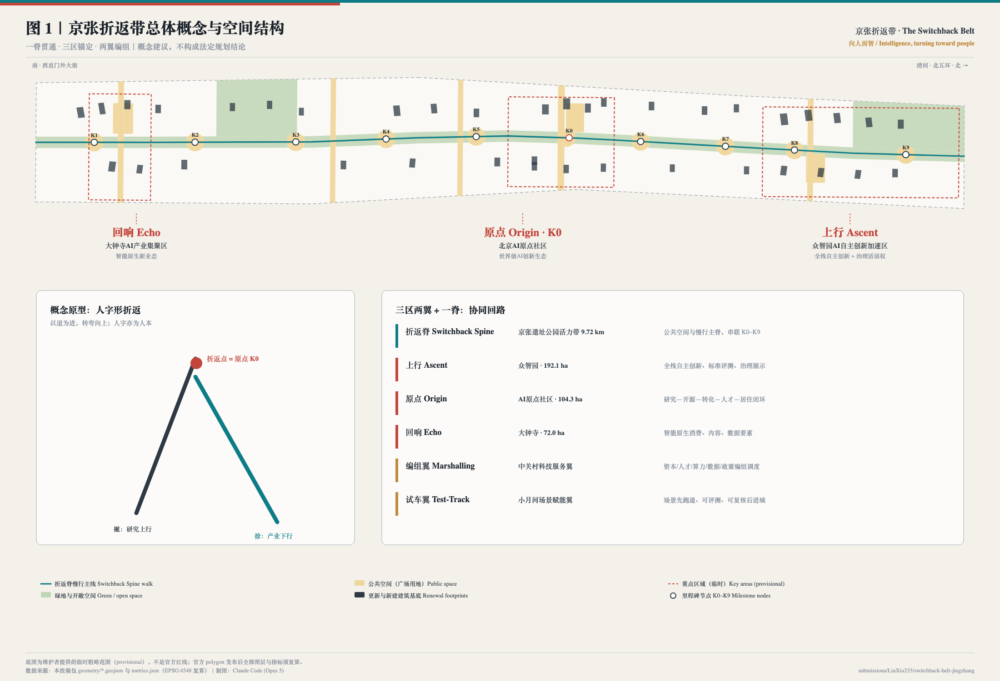
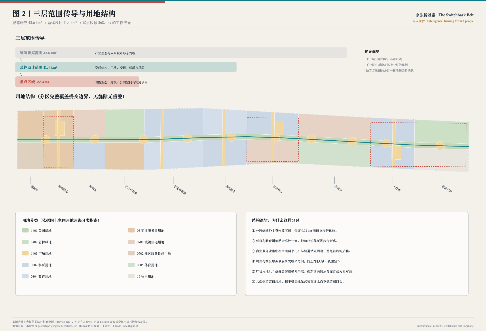
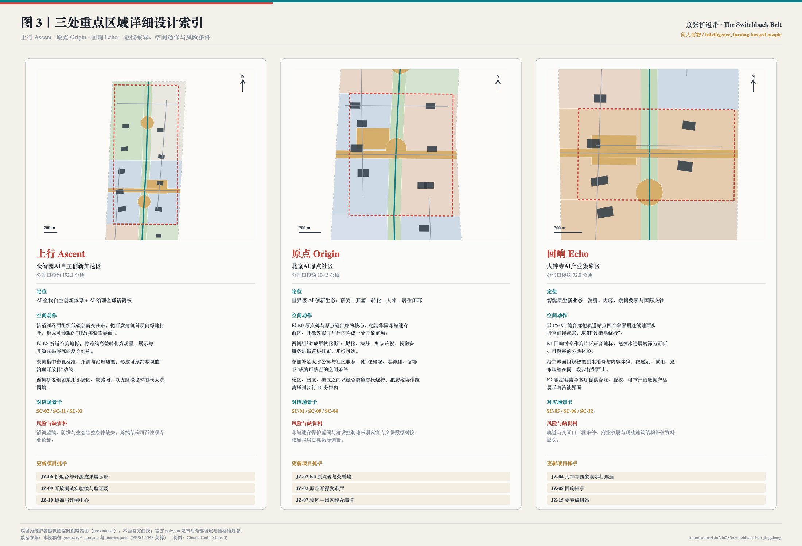
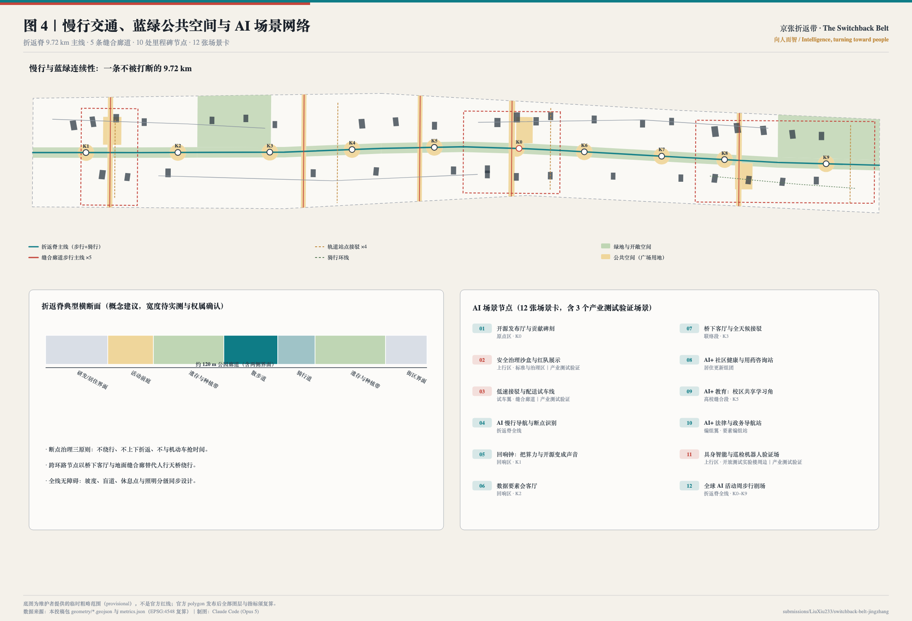
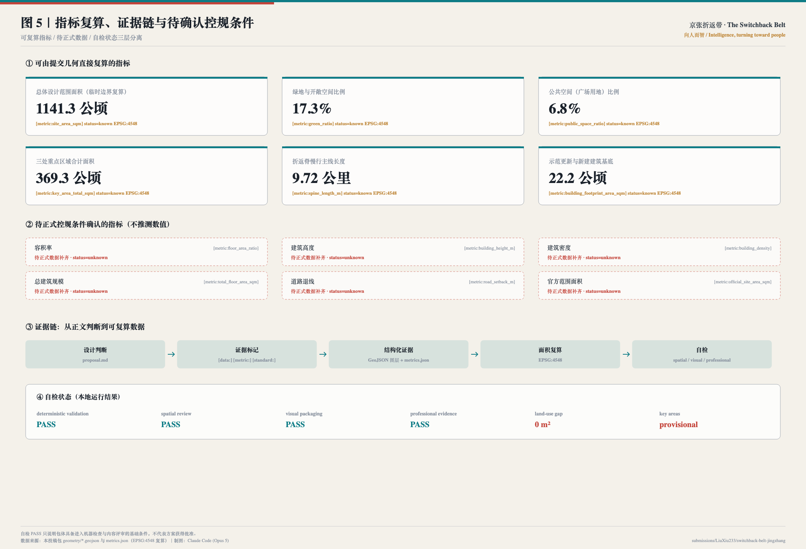

# 京张折返带 · 百年京张AI创新带城市设计

> 一百年前，一条铁路教会中国如何在陡坡上转弯。
> 一百年后，一条智带让人工智能转向人。
> **京张折返带 The Switchback Belt ——「向人而智 / Intelligence, turning toward people」**

## 设计依据与资料清单

本方案的第一依据是《百年京张AI创新带城市设计国际方案征集资格预审公告》中关于项目目的、三层范围、设计任务与成果深度的要求，第二依据是面向全球智能体的开源征集任务书摘录中 agent.1 至 agent.6 六项必答任务、三大定位、五大功能、三区两翼与统一边界条款 [source:OFFICIAL-ANNOUNCEMENT] [source:AGENT-TASKBOOK]。两者的关系是：公告决定"要做到什么深度"，任务书决定"智能体必须回答什么问题"，本方案把两者合并成同一套可核验的成果结构。

方案的空间基底来自维护者提供的临时粗略范围线。**必须首先说明：本方案使用的总体设计范围与三处重点区域边界都不是官方红线**，而是 `provisional_constraint`，`official_boundary=false`，`boundary_precision=provisional_rough` [source:BOUNDARY-SOURCE] [data:geometry/site_boundary.geojson#SITE-001]。它只能用于方案生成、可视化、设计讨论与本地自检，不能作为审批依据、精确面积依据或法定控制结论。官方 polygon 发布后，用地、绿地、公共空间、建筑、道路、分期与全部指标都必须整包复算，而不是替换单个文件 [depth:existing_conditions_diagnosis]。

资料使用遵守三条纪律 [source:SOURCE-REGISTRY]：

- **formal 可用资料**只用于需要权威性的判断（范围口径、任务要求、专业标准）；
- **背景资料**（政府门户新闻稿、媒体报道、第三方政策转载）只用于现状描述与量级判断，不支撑空间控制结论；
- **provisional 资料**只用于临时生成与讨论，不得升级为官方边界。

本方案自行检索并登记的公开资料包括：京张铁路遗址公园一期于 2023 年 6 月建成开放、南段先期开放并保留清华园车站站房与铁轨遗存等现状事实 [source:HD-PARK-PHASE1] [source:BJ-PARK-PHASE1-SOUTH]；遗址公园"众创"规划路径的官方解读 [source:BJ-PARK-PLANNING-READING]；以及海淀 AI 企业与备案大模型规模的量级背景 [source:HD-AI-ENTERPRISE-COUNT] [source:HD-LLM-FILINGS]。后两项为媒体转载与政策平台数据，方案中只作为量级背景引用，并在假设中标注需以官方统计交叉核验 [source:PROCESSED-FACT-PACK]。

**已知几何定位争议（社区复核，必须先说明）。** 两位参赛者用独立公开数据复核了本仓库的临时几何并公开了结论：Issue #846 用 OpenStreetMap 复核发现，临时「总体设计范围」多边形与实际测绘的京张铁路遗址公园**不相交**，最近距离约 412.5 米，而「统筹研究范围」与之完全吻合；Issue #1029 复核发现 `PROV-KEY-003`（大钟寺AI产业聚集区）多边形的质心距大钟寺地铁站约 2.26 公里，北京北站反而落在该多边形内部 [source:PEER-ISSUE-846] [source:PEER-ISSUE-1029]。这两条尚待维护者核实，但它们改变了本方案的表述方式：**本方案的片区定位依据公告中的片区名称与任务描述，而不是把临时多边形的经纬度当作真实地理位置。** 因此，折返脊的走向、三区的落位与 K0–K9 节点的实际坐标，都必须在官方 polygon 发布后重新推导；本方案所有面积、比例与长度指标随之复算 [depth:existing_conditions_diagnosis]。这一点已写入 `assumptions.json` 的 `A-GEOREF-001`，并在展示页与图纸中同步声明。

**同场先例致谢与命名区分。** 同场方案「人字轴 REN AXIS」（`submissions/Abreto/ren-axis-jingzhang-ai-belt`，Issue #215）同样以京张铁路"人"字形折返线作为概念出发点 [source:PEER-REN-AXIS]。本方案独立生成；在检索社区 Issue 时知悉该方案后，主动把原名「人字智带 The REN Belt」改为「京张折返带 The Switchback Belt」，以避免品牌混淆。折返原型属于公共文化遗产，任何一方都不应主张排他；本方案与其区别在于：以 **K0 零公里原点与可生长的碑刻体系**作为荣誉制度、以**编组翼／试车翼**作为要素调度与场景验证机制、以**回响钟**把公共算力与开源提交声音化。本方案未引用其正文、图件或数据。

设计判断与数据之间保持双向可追溯：正文中的每一个空间主张都能落到具体图层与指标，例如总体范围的面积复算 [data:geometry/site_boundary.geojson#SITE-001] [metric:site_area_sqm]，三处重点区域的独立核对 [data:geometry/key_areas.geojson#PROV-KEY-001] [metric:key_area_total_sqm]。完整的来源、标准与深度索引分别保存在 `sources.json`、`standard_matrix.json` 与 `design_depth_matrix.json`，正文不重复堆砌机器编号。

## 三层范围工作框架

公告规定的三个层次不是三张图，而是三种不同的"允许说什么"。本方案据此建立传导规则：**上一层只给判断，不给红线；下一层必须能复算上一层的比例；缺官方数据的条目一律降级为待确认** [depth:three_level_scope_framework] [standard:PROJECT-OFFICIAL-ANNOUNCEMENT]。

| 层级 | 规模 | 本方案回答的问题 | 允许输出 | 数据落点 |
| --- | --- | --- | --- | --- |
| 统筹研究范围 | 43.6 km² | AI 创新生态与未来城市形态如何组织 | 战略判断、生态图谱、案例转化机制 | `compliance_matrix.json`、`sources.json` |
| 总体设计范围 | 11.4 km² | 空间结构、用地、交通、蓝绿与风貌如何落图 | 结构、分区、廊道、项目、指标 | [data:geometry/land_use.geojson#LU-001] |
| 重点区域 | 368.4 ha | 三处片区如何达到详细设计深度 | 功能业态、建筑、公共空间、实施项目 | [data:geometry/key_areas.geojson#PROV-KEY-002] |

三层之间的检验方式是"能否复算"。总体设计范围的用地分区被生成为 48 个多边形，完整覆盖提交边界，缝隙面积为 0 平方米 [metric:land_use_coverage_gap_sqm] [depth:overall_spatial_structure]。这意味着任何一项比例结论都不是估计，而是可以由第三方用同一份 GeoJSON 在 EPSG:4548 下重新算出来的 [metric:site_area_sqm]。

**总体概念：京张折返带 The Switchback Belt。** 京张铁路最著名的工程决断，是在青龙桥用"人"字形折返线解决陡坡问题——列车先退后进、以退为进，用一次转弯换来继续上行。这一原型给本方案三个层次的启发：其一，**转弯**——技术从实验室转向城市、从论文转向生活，需要一个明确的折返点；其二，**上行**——转弯不是退让，而是为了继续爬升；其三，**人**——"人"字既是线形，也是本方案的价值判断：人工智能进入城市的方式，必须以人的日常、尊严与可复核为前提。因此，总体概念不是给这片土地起一个新名字，而是给它一条可以走完的**主脊**、三个可以说清楚的**折返点**和两条可以被调度的**翼**。

## 统筹研究范围产业与未来城市研究

统筹研究范围 43.6 平方公里的核心任务，是回答"世界级 AI 创新生态在空间上到底长什么样"。本方案不重复罗列企业名录，而是先看六个可被验证的国际案例，再把其中可迁移的**空间机制**转译为海淀的空间动作 [source:AGENT-TASKBOOK] [standard:PROJECT-AGENT-OPEN-CALL-TASKBOOK]。

| 案例 | 可核验事实 | 空间机制 | 可迁移到本带的动作 |
| --- | --- | --- | --- |
| 伦敦 King's Cross | 约 67 英亩原铁路用地，含约 26 英亩公共空间；就业由 2011 年约 0.8 万增至 2019 年约 2.7 万 | 公共空间与遗产再利用先于办公开发 | 折返脊一期先贯通、先开放，再谈产业招引 [source:CASE-KINGS-CROSS] |
| 巴黎 STATION F | 历史铁路建筑改造，在园创业团队 1000 家以上 | 单一超大空间 + 共享服务栈 | 原点区"开源发布厅 + 成果转化街"集中服务栈 [source:CASE-STATION-F] |
| 上海张江人工智能岛 | 报道口径约 6.6 万 m² 用地、10 万 m² 建筑，园区即示范场，后由"岛"变"区" | 园区自身作为测试场 | 试车翼先在缝合廊道与里程碑节点开放场景 [source:CASE-ZHANGJIANG-AI-ISLAND] |
| 多伦多 MaRS | 实体枢纽承载孵化、资本、人才、政策对接 | 一个有地址的"前门" | 编组翼设"要素编组站"，一址通办 [source:CASE-MARS-TORONTO] |
| 新加坡 one-north | 政府主导、长周期分期开发（口径待复核） | 稳定的空间治理主体与分期规则 | 三期分期 + 留白用地，把不确定性显式画在图上 [source:CASE-ONE-NORTH] |
| 波士顿 Kendall Square | 大学毗邻型创新街区（统计口径待复核） | 步行距离决定协作频率 | 高校缝合段把"过马路"改为"穿广场" [source:CASE-KENDALL-SQUARE] |

从六个案例中提取的共同结论是：**创新生态不是被规划出来的，而是被距离、界面和入口决定的**。据此，本方案提出海淀 AI 创新生态的三条空间机制：

1. **距离机制**：把高校院所、研发、中试、孵化、资本服务压进 10 分钟步行圈，用缝合廊道消除围墙绕行 [data:geometry/public_space.geojson#PS-X3]。
2. **界面机制**：研发建筑首层必须对公共空间开放一部分，形成"可参观的开放实验室界面"，让创新在街道上可见 [data:geometry/land_use.geojson#LU-019]。
3. **入口机制**：所有政策、场景、数据、算力与资本服务集中到一个可预约的实体地址（要素编组站），避免生态存在于文件而不存在于城市中 [depth:development_intensity_controls]。

未来城市形态方面，方案关注 AI 对城市"时间结构"的改变：研发与开源协作的高峰在夜间，公共服务与生活的高峰在白天，产业展示与国际交往的高峰在活动周。因此空间供给按"日—夜—活动周"三套时相组织：日常时相依靠社区服务与慢行网络，夜间时相依靠原点区协作空间与五道口活力场，活动周时相依靠全线 K0–K9 的临时化利用 [data:geometry/phasing.geojson#PHASE-001]。海淀现有 AI 企业与备案大模型的量级为该判断提供背景支撑，但相关数字来自媒体与平台转载，本方案不将其写入指标体系 [source:HD-AI-ENTERPRISE-COUNT]。

## 总体设计范围城市更新与控规深度城市设计

总体设计范围 11.4 平方公里要求达到控制性详细规划的城市设计深度。本方案的做法是把"结构"变成"可复算的分区"，而不是画一张示意图 [standard:MOHURD-CONTROL-DETAILED-PLANNING] [depth:land_use_layout]。

**空间结构：一脊、三区、两翼、十里程碑。**

- **一脊**：折返脊，即京张铁路遗址公园活力带，慢行主线长度 9.72 公里，是全带唯一一条南北连续、不被机动车打断的公共空间 [metric:spine_length_m] [data:geometry/roads.geojson#ROAD-001]。
- **三区**：上行 Ascent（众智园）、原点 Origin（AI原点社区）、回响 Echo（大钟寺），分别承担全栈自主创新与治理、世界级创新生态、智能原生新业态 [data:geometry/key_areas.geojson#PROV-KEY-003]。
- **两翼**：编组翼（中关村科技服务翼）负责把资本、人才、算力、数据与政策"编组"后调度进三区；试车翼（小月河场景赋能翼）负责让新场景先跑通、可评测、可复核，再进入城市。
- **十里程碑**：K0–K9 十处节点，既是导航系统，也是荣誉与场景载体 [metric:milestone_node_count]。

**城市更新总体框架。** 全带按 10 个空间段落组织，每段有明确的更新主题：南起笔段（门户商务）、回响核心段（智能消费）、回响北段（居住更新）、北三环联络段（防护与接驳）、学院路策源段（科研中试）、高校缝合段（教育与转化）、原点核心段（开源与人才）、五道口段（青年活力）、上行南段（全栈研发）、清河门户段（生态门户与留白）[data:geometry/land_use.geojson#LU-028]。段落划分不是行政切块，而是"同一段里的更新动作彼此依赖"。

**低效空间识别方法。** 由于缺少现状建筑普查、权属与结构评估资料，本方案不给出具体地块的拆改留结论，而是提出可被专业团队执行的识别方法：沿主脊 300 米范围内、与公共空间背靠背、首层封闭且无对外服务功能的用地，优先进入更新评估清单；识别结果须经现场调查与权属核验后才能进入项目库 [depth:retain_renovate_demolish]。

**关于开发强度的明确立场。** 容积率、建筑高度、建筑密度、退线、道路红线均无官方控制条件，本方案一律标注为"待正式数据补齐"，不给出任何推测数值 [metric:floor_area_ratio] [depth:development_intensity_controls]。这不是回避，而是把可复算的部分和不可复算的部分分开，让评审者能够清楚看到哪些结论现在就能核对、哪些必须等待正式资料。

## 重点区域详细设计

三处重点区域合计约 368.4 公顷，本方案对其分别给出定位差异、空间动作、场景配置、项目抓手与风险条件，避免"三个示范区"式的同质化表述 [depth:three_key_area_detailed_design] [data:geometry/key_areas.geojson#PROV-KEY-001]。

### 上行 Ascent · 众智园AI自主创新加速区（公告口径约 192.1 公顷）

定位为"AI 全栈自主创新体系 + AI 治理全球话语权"。空间动作有四：其一，沿清河界面组织低碳创新交往带，把研发建筑首层向绿地打开，形成可参观的开放实验室界面；其二，以 K8 折返台为地标，将跨线高差转化为观景、展示与开源成果展陈的复合结构；其三，东侧集中布置标准制定、模型评测与安全治理功能，形成可预约参观的"治理开放日"动线；其四，西侧研发组团采用小街区、密路网，以支路微循环替代大院围墙 [data:geometry/roads.geojson#ROAD-022]。承载场景为安全治理沙盒（SC-02）、具身智能与巡检机器人验证场（SC-11）、低速接驳与配送试车线（SC-03）。风险条件：清河蓝线、防洪与生态管控条件缺失，跨线结构可行性须专业论证，本方案不给出任何桥隧工程结论。

### 原点 Origin · 北京AI原点社区（公告口径约 104.3 公顷）

定位为"世界级 AI 创新生态：研究—开源—转化—人才—居住的完整闭环"。这里是全带的**折返点**，也是 K0 零公里原点所在。空间动作有四：其一，以 K0 原点碑与原点缝合廊为核心，把清华园车站遗存前区、开源发布厅与社区连成一处开放前场 [data:geometry/public_space.geojson#PS-X4]；其二，西侧组织"成果转化街"，孵化、法务、知识产权与投融资服务沿街首层排布，步行可达；其三，东侧补足人才公寓与社区服务，使"住得起、走得到、留得下"成为可核查的空间条件而非口号；其四，校区、园区、街区之间以缝合廊道替代绕行，把跨校协作距离压到步行 10 分钟内。承载场景为开源发布厅与贡献碑刻（SC-01）、校区共享学习角（SC-09）、AI 慢行导航与断点识别（SC-04）。风险条件：车站遗存的保护范围与建设控制地带必须以官方文保数据替换后重新校核，权属与居民意愿待调查 [data:geometry/constraints.geojson#CONSTRAINTS-RAIL-HERITAGE]。

### 回响 Echo · 大钟寺AI产业集聚区（公告口径约 72.0 公顷）

定位为"智能原生新业态：消费、内容、数据要素与国际交往"。空间动作有四：其一，以 PS-X1 缝合廊把轨道站点四个象限用连续地面步行空间连起来，取消"过街靠绕行" [data:geometry/public_space.geojson#PS-X1]；其二，K1 回响钟亭作为片区声音地标，把技术进展转译为可听、可解释的公共体验；其三，沿主界面组织智能原生消费与内容体验，把展示、试用、发布压缩在同一段步行街面上；其四，K2 数据要素会客厅提供合规、授权、可审计的数据产品展示与洽谈界面。承载场景为回响钟（SC-05）、数据要素会客厅（SC-06）、全球 AI 活动周步行剧场（SC-12）。风险条件：轨道与交叉口工程条件、商业权属与现状建筑结构评估资料缺失。

## AI 创新生态、人才画像与 AI+ 场景

### 六类用户画像

方案先回答"为谁设计"，再回答"设计什么"。每类画像都配一条明确的治理边界，防止把人当作被采集对象 [depth:ai_scenarios_and_governance] [source:AGENT-TASKBOOK]。

| 画像 | 核心需求 | 空间响应 | 治理边界 |
| --- | --- | --- | --- |
| 开源开发者 / 智能体贡献者 | 发布、协作、被看见、被记录 | K0 原点碑、开源发布厅、开发者散步道、夜间协作空间 | 只展示自愿公开的贡献；不采集个人轨迹；可申请撤下 |
| 高校师生与青年研究者 | 跨校协作、转化入口、便宜的第三空间 | 高校缝合段、K5 缝合广场、成果转化街、开放实验楼 | 校园与科研数据须授权；未成年人区域不部署人脸识别 |
| AI 初创团队创始人 | 低成本空间、算力数据入口、真实测试场 | 上行区加速器、中试研发楼、试车翼开放测试路段 | 测试须申报、可暂停、可追溯；不得以试点规避监管 |
| 头部企业产品与国际商务人员 | 展示、洽谈、国际接待、招聘 | 回响区国际路演客厅、标准与评测中心、门户接驳 | 企业标识与案例须清权；公共空间不得被长期独占 |
| 片区居民（含老年人与儿童） | 通勤、买菜、遛弯、看病、低干扰更新 | 社区嵌入式服务点、居住更新组团、活力体育带、无障碍慢行网 | 不将居民画像用于商业推荐；夜间活动分级管理 |
| 国际访客与"朝圣者" | 一条能走完、能理解、能带走故事的路线 | 全线导览、三处朝圣地标、双语导视与离线导览 | 导览内容标注事实状态，不把概念说成已建成 |

### 十二张 AI 场景卡（含三个产业测试验证场景）

每张场景卡都写明空间载体、数据来源与人工复核边界。**凡是无法以聚合、脱敏或公开方式获得数据的场景，本方案一律不提出** [metric:ai_scenario_card_count]。

| 编号 | 场景 | 空间载体 | 数据来源 | 人工复核边界 |
| --- | --- | --- | --- | --- |
| SC-01 | 开源发布厅与贡献碑刻 | 原点区 · K0 | 自愿公开的开源贡献记录 | 人工审核发布内容与署名，可申请撤下 |
| SC-02 ★ | 安全治理沙盒与红队展示 | 上行区 · 标准与治理区 | 评测任务与模型输出（不含个人数据） | 评测结论须专家复核后公开 |
| SC-03 ★ | 低速接驳与配送试车线 | 试车翼 · 缝合廊道 | 路段占用与运行日志（聚合） | 限定路段与时段，可一键暂停 |
| SC-04 | AI 慢行导航与断点识别 | 折返脊全线 | 公开地图、设施台账、志愿者上报 | 断点整改由市政人工确认，不自动派单 |
| SC-05 | 回响钟：把算力与开源变成声音 | 回响区 · K1 | 公开的开源提交与公共算力汇总 | 映射规则公示、可复算 |
| SC-06 | 数据要素会客厅 | 回响区 · K2 | 授权数据产品目录与合规凭证 | 全流程可审计，拒绝无授权数据上架 |
| SC-07 | 桥下客厅与全天候接驳 | 联络段 · K3 | 人流密度聚合计数 | 只做拥挤提示，不做身份识别、不自动限流 |
| SC-08 | AI+ 社区健康与用药咨询站 | 居住更新组团 | 公开药品与公共卫生知识库 | 必须由执业人员确认，AI 只做导诊与解释 |
| SC-09 | AI+ 教育：校区共享学习角 | 高校缝合段 · K5 | 公开课程与开放教材 | 未成年人场景不部署人脸识别与行为评分 |
| SC-10 | AI+ 法律与政务导航站 | 编组翼 · 要素编组站 | 公开政策法规与办事指南 | 输出标注依据条款；正式办理仍由人工受理 |
| SC-11 ★ | 具身智能与巡检机器人验证场 | 上行区 · 开放测试实验楼周边 | 设施台账与作业日志 | 物理隔离、公示时段、事故可回溯 |
| SC-12 | 全球 AI 活动周步行剧场 | 折返脊全线 · K0–K9 | 活动报名与公开展陈内容 | 活动安全、版权与场地许可逐场审批 |

★ 为产业测试验证场景，共 3 个 [metric:test_validation_scenario_count]。场景与空间的对应关系由公共空间图层与绿地图层承载 [data:geometry/public_space.geojson#PS-K0] [metric:public_space_ratio]。

### 场景—空间—运营映射

场景不是贴在图上的标签，而是三重绑定：**空间上**绑定到具体的公共空间或建筑要素；**运营上**绑定到明确的责任主体与开放频率（月度场景开放日发布下月清单）；**治理上**绑定到数据边界与人工复核规则。任何一环缺失，场景不得进入实施清单。城市智能体在本方案中的角色被严格限定为"辅助识别与解释"：可以辅助识别慢行断点、公共空间使用强度、设施维护需求与活动安全风险，**不能替代规划审批、不能输出未经授权的个人画像、不能声称获得实施承诺** [source:AGENT-TASKBOOK]。

## 用地、建筑规模与拆改留方案

用地方案依据国土空间调查、规划、用途管制用地用海分类指南组织 [standard:MNR-LAND-USE-CLASSIFICATION-GUIDE]。全带被划分为 48 个用地单元，完整覆盖提交边界且互不重叠，缝隙面积为 0 [metric:land_use_feature_count] [data:geometry/land_use.geojson#LU-001]。

分区遵循六条可解释的规则：① 公园绿地沿主脊连续不断，保证 9.72 公里无断点步行体验；② 科研与教育用地贴近高校一侧，把跨校协作压进步行距离；③ 商业服务业用地集中在南北两个门户与轨道站点周边，避免沿线均质化；④ 居住与社区服务嵌在研发组团之间，防止"白天满、夜里空"；⑤ 广场用地以 5 条缝合廊道横向串联，把东西两侧从背靠背改为面对面；⑥ 北端保留留白用地，把不确定性显式留在图上而不是留在口头。

建筑方案给出 38 处示范性更新与新建建筑基底，合计 22.2 公顷，用于表达界面关系与体量组织 [metric:building_footprint_area_sqm] [data:geometry/buildings.geojson#BLDG-016]。**必须强调：这不是范围内现状建筑的全集，也不构成拆改留结论。** 每处基底标注了保留、改造更新或新建（概念建议）三类意向，但在缺少现状建筑普查、权属登记与结构评估资料的条件下，任何具体地块的拆改留判断都不成立 [depth:retain_renovate_demolish] [depth:height_massing_character]。

关于建筑高度、体量与风貌，方案只给出**控制方法**而不给出控制数值：主脊两侧宜形成由低到高的梯度界面，保证遗存与公共空间的天空可见度；跨线与门户节点宜设置高度校核视点；具体高度、密度与退线待正式控规条件确认后由专业团队补齐 [metric:building_height_m]。

## 交通、轨道、市政与公共服务设施

交通方案的核心命题不是新增线位，而是**消除断点** [depth:traffic_rail_slow_parking]。本方案提出断点治理三原则：**不绕行、不上下折返、不与机动车抢时间**。

慢行网络由四类要素组成：折返脊主线（步行 + 骑行，9.72 公里）、5 条东西向缝合廊道、4 处轨道站点地面接驳连廊、以及上行区骑行环线 [metric:stitch_corridor_count] [data:geometry/roads.geojson#ROAD-011]。跨环路节点采用"桥下客厅 + 地面缝合廊"的组合，替代绕行式人行天桥；轨道站点周边采用四象限地面连通，把换乘从"过街问题"变成"广场问题"。全线无障碍设计（坡度、盲道、休息点与照明分级）与主线同步，而不是事后补做。

**必须声明的边界**：本方案不提出道路线形、轨道线位、桥隧工程、市政管线与工程可行性结论；所有接驳连廊均标注为概念建议，线位待交通专业复核 [data:geometry/roads.geojson#ROAD-010]。

市政与新型基础设施方面，方案提出"设施跟着场景走"的组织原则：端侧算力、分布式能源与数据接入点优先布置在已确定开放场景的节点（K0、K3、K7 与上行区验证场），避免先建设施再找用途 [depth:municipal_new_infrastructure]。公共服务设施按三类布局：日常型（社区嵌入式服务点，服务半径按步行 5 分钟组织）、创新型（要素编组站、成果转化街、标准与评测中心）、活动型（活动周期间可临时化利用的公共空间）。缺少管线、能源、排水、防洪与消防资料的部分，全部列为正式深化前置条件，而不是写成设计结论 [data:geometry/constraints.geojson#CONSTRAINTS-北三环快]。

## 蓝绿空间、公共空间与城市风貌

蓝绿系统以折返脊为骨架。绿地与开敞空间合计 197.5 公顷，占提交范围的 17.3%；其中公园绿地沿主脊连续布置，防护绿地布置在北五环与北三环沿线承担生态与噪声缓冲 [metric:green_ratio] [data:geometry/green_space.geojson#GREEN-001]。公共空间（广场用地）合计 77.2 公顷，占 6.8%，由 10 处里程碑广场、5 条缝合廊道与 3 处市民客厅组成 [metric:public_space_ratio] [data:geometry/public_space.geojson#PS-C2]。这两个比例都可以由第三方用提交的 GeoJSON 重新算出，不依赖任何未公开数据 [depth:blue_green_public_space]。

折返脊典型横断面（概念建议，宽度待实测与权属确认）自西向东为：研发/居住界面—活动前庭—遗存与种植带—散步道—骑行道—遗存与种植带—街区界面，公园廊道总宽约 120 米。断面强调三件事：遗存优先、活动贴边、通行居中，避免把纪念性铺装做成不能停留的通道。

**城市风貌与文化叙事（三种文化的融合）。** 方案把百年京张铁路文化、中关村创新文化与 AI 新文化组织为一条可步行的叙事线，而不是三段并列的说明文字 [standard:MOHURD-URBAN-DESIGN-MEASURES] [depth:height_massing_character]：

- **铁路文化是"结构"**：里程碑、折返、编组、试车线等铁路语汇被转译为本带的命名系统与导视逻辑，让游客在走路时自然读懂空间等级。
- **中关村文化是"方法"**：从"两通两海"到今天的开源协作，中关村的底色是把知识变成产品；成果转化街与开源发布厅让这个方法在空间上可见。
- **AI 新文化是"契约"**：技术进入城市必须可解释、可复核、可撤回。回响钟公示映射规则、场景卡公示数据边界、荣誉墙允许撤下，都是这份契约的空间表达。

**四处 AI 朝圣地标。** ① **K0 原点碑与智能体贡献荣誉墙**：零公里原点石与可持续更新的碑刻系统，每年把当年最具贡献的方案、贡献者与智能体名称刻入，碑体刻意留白，为后续年份预留，使纪念可生长而非一次性。② **折返台与开源成果展示廊**：折返上行的坡道观景平台，平面呈"人"字，坡道下方展陈可更换，展品即代码、模型卡与评测报告。③ **回响钟亭**：把当日公开的开源提交量、公共算力使用与开放场景数量映射为钟声节奏，映射规则公示可复算。④ **开发者散步道**：全线 9.72 公里，以贡献铺装串起 K0–K9，每块铺装记录一次被采纳的公共贡献 [metric:pilgrimage_landmark_count]。

**命名体系与视觉识别方向（agent.1）。** 主名称"京张折返带"，英文名 "The Switchback Belt"，主张"向人而智 / Intelligence, turning toward people"。命名系统自上而下贯通：一带（京张折返带）—一脊（折返脊）—三区（上行 / 原点 / 回响）—两翼（编组翼 / 试车翼）—节点（里程碑 K0–K9）。Logo 方向为"一笔折返的人字"：两段折线在顶点相交，既是人字形铁路的平面抽象，也是一条向上的数据折线；顶点处的实心圆点即 K0 原点。主色为铁轨灰（#2E3944）、詹青（#0E7C86，取信号灯青）、里程碑砂（#C08A3E）与原点朱（#C4453B）。视觉系统可延展到导视、铺装、活动、出版物与数字界面；**本方案不提供也不使用任何未清权的字体、图片、商标与人物肖像**，Logo 方向为可供专业设计团队深化的概念建议，不是最终标识。

## 更新项目清单、实施政策与分期计划

方案提出 18 个更新项目，全部为供专业团队深化的概念抓手，不构成立项、投资或审批结论 [metric:renewal_project_count] [depth:renewal_project_list]。

| 编号 | 项目 | 类型 | 分期 | 主要依赖条件 |
| --- | --- | --- | --- | --- |
| JZ-01 | 折返脊南北贯通与断点缝合 | 公共空间/交通 | 一期 | 道路红线、桥下空间、交通组织复核 |
| JZ-02 | K0 原点碑与贡献荣誉墙 | 文化/运营 | 一期 | 车站遗存保护要求、版权与署名规则 |
| JZ-03 | 原点开源发布厅 | 产业服务/文化 | 一期 | 权属、消防、运营主体 |
| JZ-04 | 大钟寺四象限步行连通 | 轨道一体化/慢行 | 一期 | 轨道站点、交叉口、市政管线 |
| JZ-05 | 回响钟亭与钟声数据装置 | 公共艺术/科普 | 一期 | 声环境、公共艺术审批 |
| JZ-06 | 折返台与开源成果展示廊 | 地标/文化 | 二期 | 结构与工程可行性、跨线安全 |
| JZ-07 | 校区—园区缝合廊道（策源段） | 公共空间/教育 | 二期 | 校园边界、权属、开放时段 |
| JZ-08 | 北三环桥下客厅 | 公共空间/接驳 | 二期 | 桥下空间使用许可、结构安全 |
| JZ-09 | 上行区开放测试实验楼与验证场 | 产业/新基建 | 二期 | 测试审批、安全隔离、能源条件 |
| JZ-10 | 标准与评测中心 | 治理/产业 | 二期 | 机构落位、国际合作机制 |
| JZ-11 | 人才公寓与社区服务综合体 | 居住/配套 | 二期 | 土地供给、人才政策、运营主体 |
| JZ-12 | 居住片区渐进更新与首层服务嵌入 | 城市更新/民生 | 三期 | 居民意愿、权属、资金与实施主体 |
| JZ-13 | 公园活力体育带扩容 | 体育/公共空间 | 二期 | 现状场地评估、运营维护 |
| JZ-14 | 清河门户与北五环生态界面 | 蓝绿/门户 | 三期 | 水系蓝线、生态管控、防洪条件 |
| JZ-15 | 要素编组站（一址通办服务中心） | 企业服务/政务 | 一期 | 跨部门协同、场地与人员配置 |
| JZ-16 | 低速接驳与配送试车路段 | 交通/产业验证 | 二期 | 交通管理许可、保险与应急预案 |
| JZ-17 | 全线双语导视与离线导览系统 | 导视/传播 | 一期 | 版权清权、无障碍标准、多语校对 |
| JZ-18 | 清河门户留白用地弹性预留 | 留白/长期治理 | 三期 | 正式控规、实施主体、时序安排 |

**分期逻辑。** 一期覆盖三处重点区域与折返脊全线及缝合廊道，以"轻量设施 + 运营活动"启动，不依赖大规模工程审批；二期覆盖两翼缝合、校区园区连接与接驳设施，须待控规与交通条件确认；三期覆盖低效空间渐进更新与留白弹性，须待权属、市政与实施主体确认 [metric:phase_count] [data:geometry/phasing.geojson#PHASE-002]。三期范围在图上互不重叠、合并后完整覆盖提交边界，便于后续按实施主体拆分。

**长期运营机制（agent.6）。** 方案提出五项年度机制：**通车日 · 全球 AI 活动周**（每年 10 月初，呼应京张铁路通车纪念，全线开放场景、开源发布、国际论坛与步行剧场同周举行）；**碑刻典礼**（每年一次，把入选方案、贡献者与智能体名称刻入 K0 原点碑，仪式公开、名单可查、可申诉）；**场景开放日**（每月一次，在 K7 广场发布下月可申请的城市场景清单、数据边界与人工复核规则）；**原点马拉松**（每季度一次，面向开发者与智能体的城市议题黑客松，成果直接进入公共知识库与展示廊）；**城市共创开源征集**（每年一次，把本次征集机制常态化）[metric:annual_event_count]。招引转化路径为"活动参与 → 场景申请 → 中试落位 → 空间与政策对接 → 长期驻留"，每一步都有对应的空间载体与责任接口。**以上活动与机制均为运营设想，不是已确定的政府安排、预算或承诺。**

## 指标体系、面积复算与合规矩阵

指标体系分三类，分别对应三种可信度 [depth:metrics_recalculation]：

**第一类：可由提交几何直接复算的空间指标。** 总体设计范围面积 1141.3 公顷、绿地与开敞空间比例 17.3%、公共空间比例 6.8%、三处重点区域合计 369.3 公顷、慢行主线 9.72 公里、示范建筑基底 22.2 公顷 [metric:site_area_sqm] [metric:green_ratio]。全部在 EPSG:4548 下计算，公式与源文件写入 `metrics.json`，第三方可独立复算。三处重点区域复算值与公告口径 368.4 公顷相差约 +0.24%，差异来自临时几何本身，须在官方附件发布后复算 [metric:key_area_total_sqm]。

**第二类：待正式控规条件确认的管控指标。** 容积率、建筑高度、建筑密度、总建筑规模、道路退线、官方范围面积，全部 `status=unknown` 并给出原因，不推测数值 [metric:building_density] [metric:total_floor_area_sqm]。

**第三类：需运营数据持续校准的绩效指标。** 场景使用频次、活动参与度、慢行可达性、人才留存率等，本方案只提出监测口径与责任主体，不写入当前指标体系，避免把运营愿景误写成审定条件。

**合规矩阵。** `compliance_matrix.json` 逐条覆盖公告 1.3、1.4、1.5 全部必选任务与 agent.1 至 agent.6 六项智能体任务，每条记录对应的报告章节、图层、指标、图纸、HTML 页面、来源、假设与自检项。`standard_matrix.json` 覆盖全部强制专业标准，`design_depth_matrix.json` 的全部核心深度项均为 `complete`。自检结果显示：确定性校验、空间复核、可视化打包与专业证据链四项均为 PASS，用地缝隙 0 平方米，三处重点区域标记为 provisional。**自检 PASS 只说明包体具备进入机器检查与内容评审的基础条件，不代表方案获得批准。**

## 风险、版权与合规说明

**资料风险。** 最大的风险是官方精确红线、三处重点区域正式 polygon 与控规条件缺失。方案的应对不是回避，而是把受影响的结论全部显式降级：边界、面积、比例标注为临时值；强度、高度、密度、退线标注为 unknown；拆改留只给方法不给结论 [depth:risk_missing_data] [data:geometry/constraints.geojson#CONSTRAINTS-RAIL-HERITAGE]。`constraints.geojson` 中的四个要素均为 `analysis_helper`，明确标注"非文保范围、非蓝线、非红线"，只提示设计敏感性，须由官方数据替换 [source:SITE-PACKAGE]。

**外部数据风险。** 海淀 AI 企业数量、备案大模型数量与六个国际案例的数据来自 2026-08-10 检索的政府门户、媒体或第三方页面，仅作背景引用，不进入指标复算，也不作为产业承诺依据。方案已在 `assumptions.json` 中登记其发布者、检索日期与限制，并说明需以官方统计或案例官方发布交叉核验。

**隐私与治理风险。** 12 张场景卡全部设定数据最小化、公开来源优先、可解释与强制人工复核边界；未成年人区域不部署人脸识别与行为评分；居民画像不得用于商业推荐；测试场景可一键暂停并可追溯。任何无法以聚合、脱敏或公开方式获得数据的场景，在深化阶段应删除或替换。

**版权与生成方法披露。** 本投稿包的全部文本、几何、图件、HTML 与 PDF 均由声明的 AI agent（Claude Code, Opus 5）生成；图件由本包 GeoJSON 与 metrics 在 EPSG:4548 下派生绘制，未使用外部地图瓦片、商业底图、未清权图片、字体、商标或人物肖像。HTML 页面为离线静态页面，不加载远程脚本、远程字体、远程图片、iframe、表单或外部 API，不跟踪评审者行为。详见 `report/copyright_statement.md`。

**成果性质声明。** 本方案是面向开源征集的**概念建议与参考方案，可供专业团队深化研究**。它不替代法定规划，不构成政府审定结论，不构成控规调整、容积率、建筑高度、拆改留、道路线形、轨道线位、桥隧工程、市政管线、投资测算、开发时序或审批判断，也不构成任何招商、政策或资金承诺。

**双语与可读性。** 本方案主稿为中文，`proposal.en.md` 为完整对照英文稿；`report/proposal.html`、`visual/index.html`、A3 文册、A0 展板与五张核心图件均提供 `.en` 语言副本，章节、主张、指标、证据引用与图件位置保持一致。

## 参考资料

- 《百年京张AI创新带城市设计国际方案征集资格预审公告》本地参考快照 [source:OFFICIAL-ANNOUNCEMENT]
- 面向全球智能体的开源征集任务书摘录 `brief/site-package/agent_taskbook.json`
- 城市设计管理办法、控制性详细规划技术要求、国土空间用地用海分类指南本地参考快照
- 北京市海淀区人民政府：京张铁路遗址公园一期建成对公众免费开放（2023-06-30）
- 北京市人民政府门户网站：京张铁路遗址公园（一期）南段开放（2023-02-02）
- 北京市规划和自然资源委员会：规划解读·京张铁路遗址公园（2021-12-16）
- 国际案例来源见 `sources.json` 中 `CASE-*` 条目（King's Cross / STATION F / 张江人工智能岛 / MaRS / one-north / Kendall Square）
- 完整机器索引：`sources.json`、`metrics.json`、`compliance_matrix.json`、`standard_matrix.json`、`design_depth_matrix.json`
