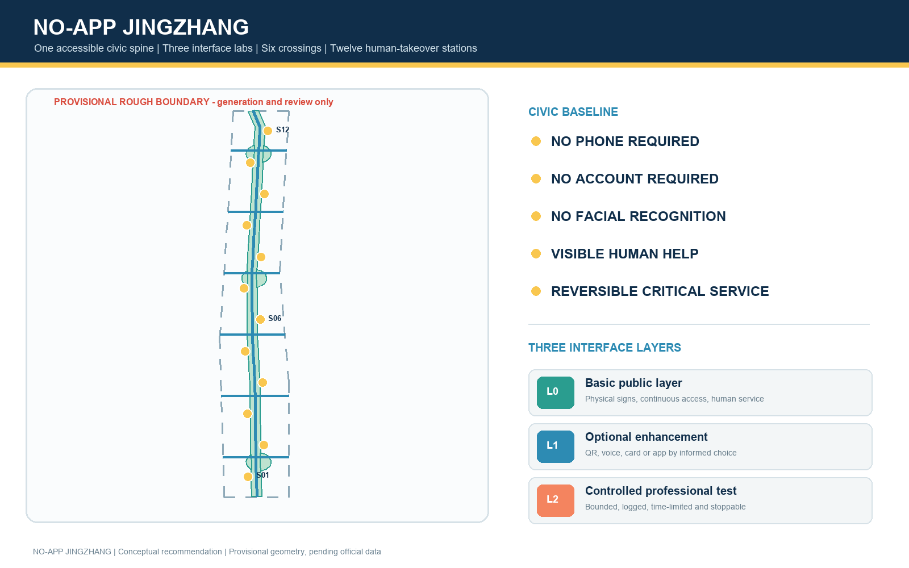
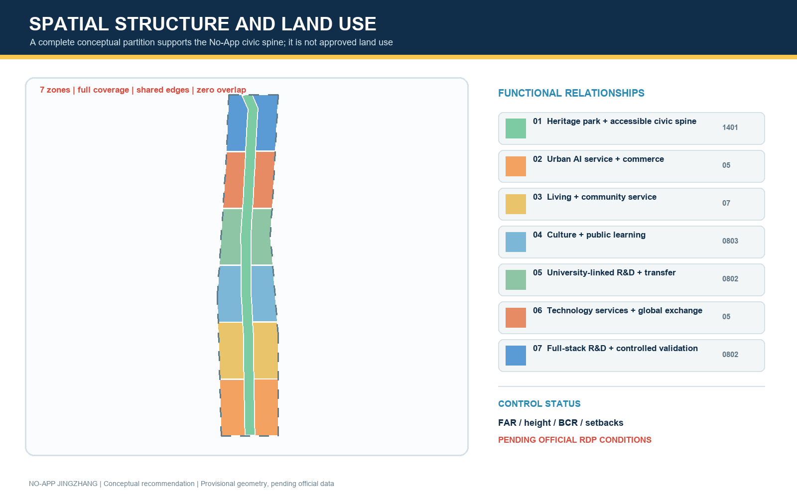
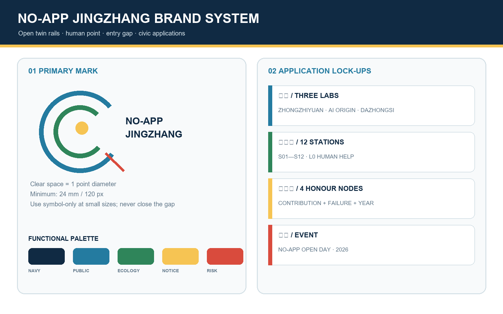
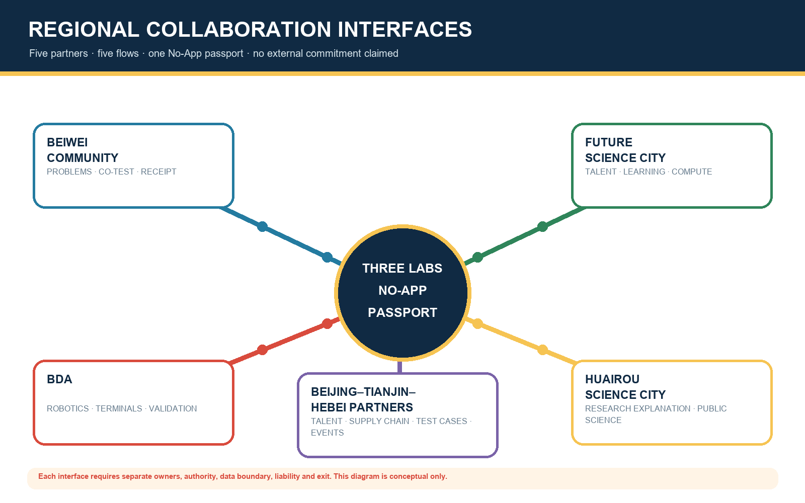
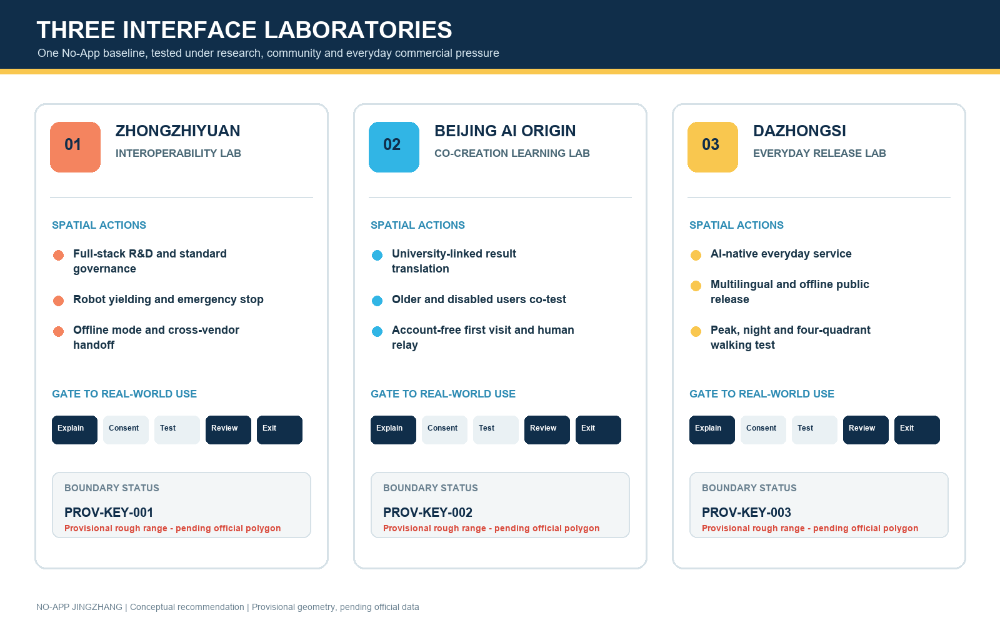
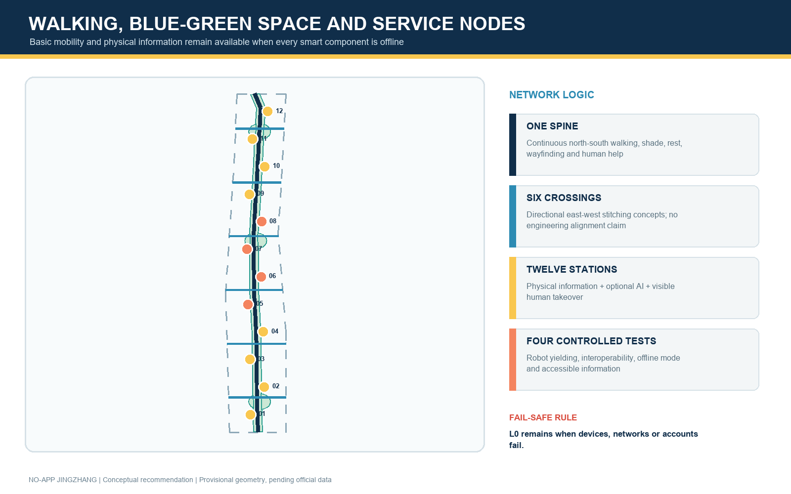
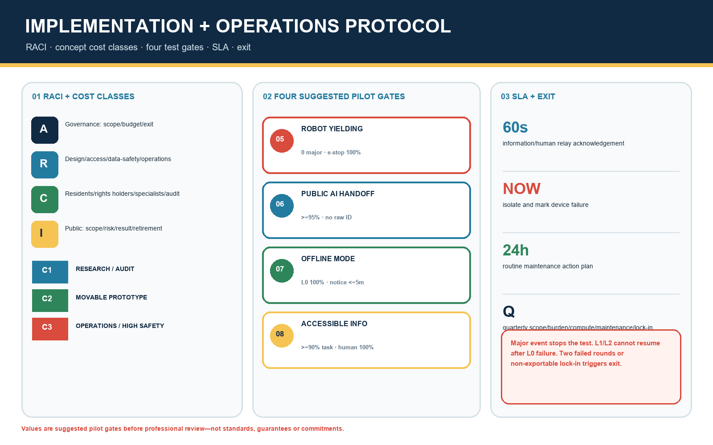
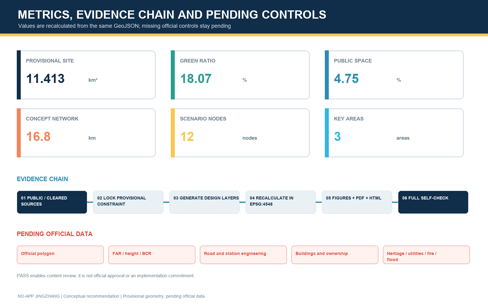

# NO-APP JINGZHANG

> **AI is optional. The city remains available.** “No-App” does not ban applications. It requires every public AI service to retain three interfaces: a public interface that works without registration, an optional personalised interface, and a visible human interface for takeover and appeal. Every spatial move in this proposal is an open co-creation concept for professional teams to deepen; it is not an approved plan, government decision, investment commitment or implementation promise.

## Design Basis and Source List

The official announcement establishes the project name, three-level scope, approximate areas of the three key areas and design tasks. The Agent taskbook establishes the three positionings, five functions, Three Zones and Two Wings, six Agent tasks and the common boundary clause. [source:OFFICIAL-ANNOUNCEMENT] [source:AGENT-TASKBOOK] [standard:PROJECT-OFFICIAL-ANNOUNCEMENT]

The urban-design approach coordinates public space, heritage, building massing and urban character, while separating known facts, conceptual recommendations and pending statutory conditions. Land-use labels follow the classifications registered in the site package. [standard:PROJECT-AGENT-OPEN-CALL-TASKBOOK] [standard:MOHURD-URBAN-DESIGN-MEASURES] [standard:MNR-LAND-USE-CLASSIFICATION-GUIDE]

The No-App baseline is supported by public policy that keeps conventional services alongside smart services, the national accessibility law, and official explanations of transparency, fairness and refusal rights in automated decision-making. [source:SMART-ELDERLY-2020] [source:ACCESSIBILITY-LAW-2023] [source:PIPL-AUTOMATED-DECISION] WCAG 2.2 is used as an international digital-accessibility reference, not as a statutory planning standard for this project. [source:W3C-WCAG22]

The accessibility law is now an approved formal source in the repository registry. The national older-person smart-technology plan remains background only and cannot prove local implementation. The Interim Measures for Generative AI Services apply only where generated-content services are provided to the public in mainland China; this proposal uses them as a service-governance screening reference and does not claim that any scenario has completed filing, security assessment or legal compliance. [source:ACCESSIBILITY-LAW-2023] [source:SMART-ELDERLY-2020] [source:GENERATIVE-AI-MEASURES]

The repository still lacks an official Overall Design Area boundary, three official key-area polygons, road redlines, Regulatory Detailed Planning controls, verified existing buildings and ownership, heritage controls, utilities, fire and flood conditions, and a public-facility inventory. The package therefore uses maintainer-provided provisional rough polygons only for concept generation, topology checks, content review and visualisation. [source:SOURCE-REGISTRY] [source:BOUNDARY-SOURCE] [data:geometry/site_boundary.geojson#SITE-001]

The key-area geometry is likewise provisional and cannot serve as an Official Planning Boundary or precise-area basis. When rights-cleared official data arrives, all nine GeoJSON layers, metrics, five figures, PDFs and web pages must be regenerated together. [source:PROCESSED-FACT-PACK] [source:KEY-AREA-SOURCE] [depth:existing_conditions_diagnosis]

The locally indexed 2016 architectural-design depth reference still lacks a verifiable official full text, so it remains a data gap rather than claimed authoritative compliance. [standard:MOHURD-ARCH-DESIGN-DEPTH-2016] [standard:MOHURD-CONTROL-DETAILED-PLANNING]

## Three-Level Scope Framework

The three levels follow one question chain: **who could be excluded by a digital threshold; which spatial interface removes that threshold; which industry test proves the interface dependable; and who takes over when it fails?** The approximately 43.6 km² Coordinated Research Area translates No-App AI into industry, talent and regional-cooperation mechanisms. The approximately 11.4 km² Overall Design Area organises one north-south civic spine, six east-west stitching relationships and twelve accessible nodes. The three Key-Area Detailed Design Areas, approximately 368.4 ha in total, test research, community and everyday commercial interfaces. [source:OFFICIAL-ANNOUNCEMENT] [depth:three_level_scope_framework]

The spatial structure is **One Spine, Three Labs, Six Crossings and Twelve Stations**. The spine is an accessible public-service, heritage and walking route along the Jing-Zhang Railway Heritage Park. The labs are an interoperability lab at Zhongzhiyuan, a co-creation learning lab at AI Origin, and an everyday-service release lab at Dazhongsi. The six crossings are directional walking, cycling and service links rather than approved roads, bridges or tunnels. The twelve stations combine scenario cards, human assistance, printed information, static wayfinding and optional digital enhancement. [data:geometry/roads.geojson#ROAD-001] [data:geometry/public_space.geojson#PUBLIC-001] [metric:scenario_node_count]

| Level | Design judgement | Human-readable output | Pending data |
| --- | --- | --- | --- |
| Coordinated Research Area | Accessible interfaces can become a shared testing language for AI products entering public space | Six global cases, ecosystem mechanisms, identity and annual operations | Industry inventory, policy authority and operator mandate |
| Overall Design Area | Secure continuous movement and non-digital service before optional AI | Land use, buildings, roads, green and public space, phasing and metrics | Official polygon, roads, facilities and verified base map |
| Key-Area Detailed Design Area | Research, community and commerce require different validation thresholds | Three lab strategies, four industry tests and twelve scenarios | Parcels, ownership, building survey, stations and engineering conditions |

## Coordinated Research Area: Industry and Future City Research

### Identity and the Three Zones and Two Wings

The primary name is “无门槛京张”, with the English name “NO-APP JINGZHANG” and the line “AI is optional. The city remains available.” The primary mark uses two open rail lines, one human point and an unclosed entry gap. The rails refer to Jing-Zhang heritage and the civic spine; the point marks final human judgement; the gap means entry without an account. A supporting graphic may crop the open rails but never replace the primary mark. The event lock-up is “NO-APP OPEN DAY + year”. The three labs, twelve stations and four honour nodes use name lock-ups beneath the primary mark rather than separate logos.

| Application | Composition and clear space | Recommended minimum | Boundary |
| --- | --- | --- | --- |
| Primary mark | Open twin rails + human point + bilingual name; clear space equals one point diameter | 24 mm print / 120 px screen | Use the symbol-only version below this size; never close the gap |
| Three-lab lock-up | Primary mark + Zhongzhiyuan / AI Origin / Dazhongsi | 32 mm print / 160 px screen | A lab name cannot imply independent endorsement |
| Twelve-station code | Open rail + S01–S12 + L0 human-help sign | 18 mm print height | Static wayfinding remains visible before QR or screens |
| Honour node | Primary mark + node name + contribution/failure year | 40 mm print width | No portrait or corporate mark replaces civic recognition |

The palette is Jing-Zhang Navy `#102A43`, Public Interface Blue `#247BA0`, Ecology Green `#2F855A` and Notice Yellow `#F6C453`; warning red is reserved for risk and exit. System fallback fonts are used, with no third-party font files distributed in the package. Every colour pair requires contrast review; line type, number and text preserve meaning in monochrome. Full bilingual applications are recorded in `visual/assets/brand-system.json`. [source:AGENT-TASKBOOK]

The three positionings become a readable Centennial Jing-Zhang Cultural Belt, a freely accessible Urban AI Life Experience Belt and a controlled AI Fusion Innovation Belt. The five functions become interoperability testing, public ecosystem interfaces, non-mandatory AI-enabled scenarios, resilient basic service and governance through informed choice and Human Review. Zhongzhiyuan tests technology, AI Origin defines problems with real users, and Dazhongsi releases mature services in high-frequency daily settings. The Zhongguancun Technology Services Wing supplies standards, legal, finance and international links; the Xiaoyue River Scenario Enablement Wing carries walking, ecological and everyday feedback. [source:AGENT-TASKBOOK]

### Regional collaboration: five interfaces, not spatial expansion

Regional collaboration is a set of conceptual interfaces, not a claim that any external party has committed. Beiwei Community frames resident problems and co-tests everyday services; Future Science City connects research talent, learning and compute needs; Huairou Science City connects research explanation and public science; Beijing Economic-Technological Development Area connects robotics, terminals and manufacturing validation; Beijing–Tianjin–Hebei partners discuss cross-regional talent, supply chains, test-case compatibility and an annual open event. The three Jing-Zhang labs offer a common No-App service passport rather than replacing those places. [source:AGENT-TASKBOOK]

| Partner interface | Talent / technology | Compute / testing | Translation / events | Auditable output and boundary |
| --- | --- | --- | --- | --- |
| Beiwei Community | Residents, older people, families and frontline staff define problems | L0 route, information and human-takeover co-tests | Community problem day and return visit | Participation log, issue list and closure receipt; community consent required |
| Future Science City | Short residency for researchers, students and founders | Tiered model/compute requests; no uncleared personal data transfer | Learning, talent relay and prototype explanation | Data dictionary, compute purpose and mentor log; no resource commitment |
| Huairou Science City | Research explanation, public science and trustworthy communication | Explainability review before a public-setting prototype | Public science week and multilingual content | Source card, uncertainty card and withdrawal log; no substitute for research review |
| BDA | Robotics, terminal, repair and manufacturing teams | Closed-site validation before any real-neighbourhood trial request | Prototype-to-scenario-to-maintenance translation | Test report, BOM, maintenance and retirement owner; no admission claim |
| Beijing–Tianjin–Hebei partners | Cross-regional talent and supply-chain directory | Discussion of interoperable cases and incident classes | Annual open challenge and exchange | Versioned test cases and public summary; mutual recognition requires a separate agreement |

### Six global cases and transferable mechanisms

| Case | Transferable mechanism | Jing-Zhang translation | Limit |
| --- | --- | --- | --- |
| Singapore one-north | Co-locates work, life, learning and community activity | Turn Zhongzhiyuan from an inward R&D park into testing, explanation and exchange interfaces | Background comparison only [source:CASE-ONE-NORTH] |
| Cambridge Kendall Square | Uses mixed use, active ground floors and community links to reduce innovation enclaves | Prioritise six community-transit-innovation stitching relationships | Does not transfer development intensity [source:CASE-KENDALL] |
| Paris STATION F | Reduces entrepreneurial friction through shared programmes and services | Give AI Origin an account-free first visit and tiered specialist services | No local forecast from overseas scale [source:CASE-STATION-F] |
| Helsinki Smart Kalasatama | Lets residents, firms and researchers co-design limited real-neighbourhood trials | Apply fixed-term trials, public feedback, Human Review and reversible exits at twelve stations | A foreign trial is not local approval [source:CASE-KALASATAMA] |
| Toronto Quayside | Connects public space, accessibility review, participation and digital governance | Require public interfaces to pass accessibility and consent explanations before personalisation | Learn governance lessons, not historical promises [source:CASE-QUAYSIDE] |
| Barcelona 22@ | Coordinates industrial renewal, mixed neighbourhoods, public space and city services | Combine AI-native activity at Dazhongsi with everyday services and street publicness | Not a local land-use approval basis [source:CASE-BARCELONA22] |

These cases inform a seven-gate innovation chain: publish the problem, co-create a prototype, run a controlled test, complete an accessibility challenge, invite public use, obtain Human Review, and release an open summary. Space provides adaptable test carriers; finance and legal services remain optional professional support; edge computing, data minimisation and interoperable interfaces reduce platform lock-in; and the public can observe, refuse, comment and appeal. [depth:municipal_new_infrastructure]

## Overall Design Area: Urban Renewal and Regulatory-Plan-Level Urban Design

The proposal does not begin with one universal smart-city platform. It begins with three public-interface layers. **L0 Basic Public Layer** works without devices or registration through continuous paths, physical wayfinding, multi-medium information, help points and staff. **L1 Optional Enhancement Layer** allows a person to choose QR, card, voice or app-based information. **L2 Controlled Professional Layer** supports R&D tests and operations only with a defined boundary, duration, accountable operator and log. L1 and L2 must never displace the area, visibility or funding baseline of L0.

The provisional site is completely partitioned into conceptual research, residential, commercial-service, cultural and park-green-space zones using registered classifications; shared cut lines produce full coverage without overlap. [data:geometry/land_use.geojson#LU-001] [metric:land_use_zone_count] [depth:land_use_layout] These zones express functional relationships, not approved land use. Floor Area Ratio, height, Building Coverage Ratio and setbacks remain pending official controls. [metric:floor_area_ratio] [depth:development_intensity_controls]

Building proposals are prototypes, not parcel-level decisions. Buildings facing the civic spine should provide two-sided entrances, permeable sheltered ground floors, physical information walls and human desks. Research edges use closable test courts; community edges offer quiet, shaded and accessible resting and offline booking; commercial edges keep entry, payment and offers independent from one account. The generated footprints are conceptual carriers whose total is recorded in [metric:building_footprint_area_sqm]; they must be rebuilt after survey. [data:geometry/buildings.geojson#BLDG-001] [depth:height_massing_character]

## Detailed Design of Key Areas

All three boundaries are provisional rectangles expressing north-south sequence and approximate area only. They are displayed as low-contrast dashed constraints and cannot be read as parcel, road or ownership lines. [source:KEY-AREA-SOURCE] [metric:key_area_count] [depth:three_key_area_detailed_design]

### Zhongzhiyuan: Accessible Interoperability Lab

Zhongzhiyuan is conceived as a garden-based full-stack innovation and public-interface test area. A closed R&D core, reservable validation court, observable explanation gallery and always-open public green space form a gradient. Models, robots, terminals and public-information systems must pass offline degradation, multimodal output, human emergency stop, identity minimisation and cross-vendor interoperability tests before entering real settings. Qinghe, Fifth Ring Road and existing-condition data remain incomplete, so green links, walking transfers and scenario courts are directional concepts rather than engineering lines. [data:geometry/key_areas.geojson#PROV-KEY-001]

### Beijing AI Origin Community: Accessible Co-Creation Learning Lab

AI Origin is conceived as a university-adjacent innovation and lifelong-learning community. “A first visit needs no registration” is the design scale: public releases, open learning, result explanation, talent consultation and community comment remain directly accessible; incubator and laboratory services add tiered authorisation only when necessary. An “interface clinic” allows students, residents, founders, older people, disabled users and frontline staff to test services together. Campus links, station entrances, buildings and ownership require survey. [data:geometry/key_areas.geojson#PROV-KEY-002]

### Dazhongsi: Accessible Everyday-Service Release Lab

Dazhongsi is conceived as an urban AI-economy and everyday consumer trial district. Four-quadrant station connectivity remains a transport-design question; this concept only places clear crossing information, cycle-parking guidance, human enquiry and phone-free event notices at public-space nodes. Urban agents, terminals and content services face peak, night-time, multilingual, older-user and accessibility challenges here; all personalised marketing must retain a non-personalised option. [data:geometry/key_areas.geojson#PROV-KEY-003]

Four conceptual pilgrimage and honour components support the public system. The northern Open-Source Signal Tower displays reusable outputs and recorded failures; the First Line of Code Plaza at AI Origin records public contribution through replaceable ground markers; the Human Takeover Pavilion honours maintenance, service, volunteer and safety work; the southern Centennial-Next Stop platform aligns railway engineering history, Zhongguancun innovation history and unresolved future questions. All require heritage, green-space and safety confirmation.

## AI Innovation Ecosystem, Personas, and AI+ Scenarios

Six persona groups define the No-App test baseline: researchers need controlled tests and failure review; start-ups need low-friction first visits and cross-disciplinary handoffs; students and young people need learning, display and night-time safety; residents and families need low-stimulation services that can be refused; older and disabled users need physical information, multimodal interaction and human help; and frontline operators need systems that can be taken over, repaired, disconnected and retired. A scenario that only works for skilled smartphone users fails the baseline. [source:ACCESSIBILITY-LAW-2023]

| # | Scenario and place | User and L0 interface | Optional AI and data boundary | Human review and exit |
| --- | --- | --- | --- | --- |
| 01 | Account-free heritage guide / civic spine | Everyone; physical map, colour and tactile signs | Optional voice or QR; no visitor tracking profile | Heritage editor review and human handoff |
| 02 | Accessible walking route / six crossings | Walking, cycling, wheelchair and pram users; fixed directions and rest points | Optional destination input; no facial recognition | Transport review; static signs remain |
| 03 | Multilingual public release / three labs | Visitors and international talent; Chinese-English essentials and staff | Optional speech translation; no raw-voice retention | Bilingual sampling; withdraw faulty output |
| 04 | Talent-service relay / AI Origin | Students and founders; printed checklist and human triage | Optional task-list generation; no automated eligibility decision | Specialist confirmation; offline pathway retained |
| 05★ | Robot yielding test / Zhongzhiyuan | Pedestrians first; physical boundary, emergency stop and safety steward | Device status and de-identified incidents only | Steward takeover; stop on threshold breach |
| 06★ | Public AI interoperability test / Zhongzhiyuan | Account-free visitor; common explanation and service number | Cross-vendor handoff without unified identity profile | Record failures independently; human relay available |
| 07★ | Offline and degraded-mode test / Zhongzhiyuan | Basic light, wayfinding and broadcast do not depend on cloud | Edge processing of minimum fields | Offline drill, paper log and patrol takeover |
| 08★ | Accessible-information challenge / AI Origin | Older, sensory and cognitive-diversity users co-accept | Test voice, large text, tactile and simple interaction | User veto; retest after repair |
| 09 | Community health navigation / AI Origin | Public service information and human enquiry only | No diagnosis; optional question organisation | Clinician or social-worker confirmation |
| 10 | AI-native retail trial / Dazhongsi | Cash, multiple media and clear prices remain visible | Recommendations switch off; no differential pricing | Staff explanation and clear refund route |
| 11 | Jing-Zhang memory soundscape / civic spine | Text, graphics and tactile timeline | Optional multilingual narration from public history | Sources shown and errors correctable |
| 12 | NO-APP Open City Day / whole belt | Public exhibition requires no reservation | Optional personalised route | On-site desk, printed schedule and lost-property service |

The four starred scenarios are Testing and Validation Scenarios. Each uses a six-field service passport: test objective, boundary, failure threshold, human takeover, public summary and expiry/exit. The twelve nodes correspond to `public_space.geojson`; they are test concepts, not approved operations. [data:geometry/public_space.geojson#PUBLIC-001] [source:PIPL-AUTOMATED-DECISION]

### Real-user co-testing and evidence receipts

Co-testing is a four-step loop: task walkthrough, failure drill, repaired retest and public receipt. Each round covers five roles: older or low-digital-skill people; disabled and cognitively diverse users; nearby residents and families; students and young people; and frontline service, security and maintenance staff. Recruitment, reasonable accommodation, image recording and data fields require separate informed consent; refusal never affects basic service. Round one uses paper and movable prototypes, round two a controlled site, and only round three may consider a fixed-term public trial. Accessibility users and frontline maintainers can veto unresolved critical barriers. Specialists retain final judgement for accessibility, privacy/data, transport, landscape/heritage, structure, fire and engineering safety. [source:ACCESSIBILITY-LAW-2023]

Each test produces five receipts: aggregated participant composition, critical-task completion, failure and takeover log, before/after repair comparison, and open issues with owners. Raw personal data is not committed to the public repository; summaries retain only de-identified counts and reproducible problems. The detailed plan is `visual/assets/user-cotest-plan.json`; equivalence evidence is `visual/assets/bilingual-equivalence-audit.json`.

## Land Use, Building Scale, and Retain-Renovate-Demolish Strategy

Conceptual land use is partitioned from the full provisional boundary. Class 1401 park green space forms the central civic spine; research 0802, culture 0803, residential 07 and commercial-service 05 express adjacent dominant functions. [data:geometry/land_use.geojson#LU-001] [standard:MNR-LAND-USE-CLASSIFICATION-GUIDE] The plan answers which adjacencies support accessible service, not whether statutory land use should change. Areas, ratios and boundaries must be recalculated against official polygons and controls.

The Demolish-Renovate-Retain Strategy follows “survey before decision”: retain assets with heritage, use or structural value; prioritise light renewal through ground-floor openings, accessibility, lifts, shade and service bands; study larger change only after safety, ownership, structure and public-interest review; and use new construction only as a final option for missing public or industry interfaces. [data:geometry/buildings.geojson#BLDG-001] represents twelve prototypes, not real buildings. [depth:retain_renovate_demolish]

Four conceptual character guides are rail rhythm, open ground floor, restrained media and maintainable components. Sheltered space along the spine remains continuous; test equipment sits in replaceable service bands; screens cannot hide physical wayfinding, heritage or accessible routes; lighting prioritises safety, low glare and ecological impact. Height and massing remain professional study questions, not numeric conclusions. [standard:MOHURD-URBAN-DESIGN-MEASURES]

## Transport, Rail, Municipal Infrastructure, and Public Services

One north-south walking-and-green spine and six directional east-west stitching corridors form the transport concept. [data:geometry/roads.geojson#ROAD-001] The value in [metric:road_network_length_m] measures concept lines only, not road redlines or engineering length. Each link first resolves continuity, shade, rest, crossing information, wheelchair and pram access, then studies cycling, rail transfer, kerbs and parking. Dazhongsi, Wudaokou and Qinghuadongluxikou require formal station and transport information. [depth:traffic_rail_slow_parking]

Municipal and new infrastructure follows “basic utility before smart device.” Power, communications, drainage, fire and emergency capacity is not calculated before verified conditions. Edge computing, sensing, charging and digital signs are only interface lists that can be metered, switched off, maintained and retired. Every component declares service scope, collected fields, retention period, maintainer, offline behaviour and human alternative. Toilets, water, seating, lighting, broadcast and help cannot be reduced by digitalisation. [data:geometry/constraints.geojson#DATA-GAP-001] [depth:municipal_new_infrastructure]

## Blue-Green Network, Public Space, and Urban Character

The blue-green civic spine turns the Jing-Zhang Railway Heritage Park from a display backdrop into an everyday public interface. Continuous movement carries L0; shaded and quiet gardens support staying; twelve scenario nodes support optional L1 and L2. Green and public-space metrics are calculated separately, while the Provisional Boundary remains visually subordinate. [data:geometry/green_space.geojson#GREEN-001] [metric:green_ratio] [metric:public_space_ratio]

The component library includes service-passport signs readable without phones, printed-map slots, tactile and high-contrast wayfinding, movable shade and seating, human-help buttons, low counters, physical device-off switches, failure-record walls and replaceable honour modules. Users co-test components before landscape, accessibility, heritage, structure, fire and operations teams deepen them. [depth:blue_green_public_space]

The cultural narrative is not a railway-shaped screen. Three readable timelines connect the Jing-Zhang Railway as independent engineering and public connection, Zhongguancun as knowledge transfer and open collaboration, and a new AI culture in which models explain, failures are recorded and services may be refused. Sleeper rhythm numbers the wayfinding; an open gap marks a public entrance; a human point marks help. The belt identity and heritage signage remain distinct layers.

## Renewal Projects, Implementation Policy, and Phasing

| Package | Concept | Gate before deepening | Exit or fallback |
| --- | --- | --- | --- |
| P1 No-App baseline audit | Door-to-door walking, accessibility, physical information, human service and digital-dependency audit | Official boundary, road and facility base map; user participation | Publish the problem list before construction |
| P2 Spine and crossing demonstrator | Continuous signs, rest, printed maps, shade and public-service interfaces | Heritage, transport, green-space, fire and operation review | Movable components can be removed |
| P3 Three labs and four tests | Interoperability, offline mode, robot yielding and accessible information | Site consent, ethics and safety plans, responsible operator | Fixed term, emergency stop, Human Review and public failure log |
| P4 Twelve-station network | Scenario nodes and human relay | Service inventory, operations budget and training | L1/L2 may go offline while L0 stays |
| P5 Culture and honour system | Four landmarks, contribution archive, failure record and annual display | Historical, copyright, heritage and public review | Modular replacement; no single-company lock-in |
| P6 Open-operation protocol | Service passport, scenario calls, evaluation, appeal and retirement | Professional legal, data, procurement and audit design | Term review; no automatic renewal |

### P1–P6 responsibility, cost and procurement protocol

The RACI chain assigns accountability for scope, budget and exit to a programme governance group (A). Urban design/engineering, accessibility, data/safety and operations teams execute their professional reviews (R). Resident representatives, site rights holders, relevant transport/heritage/fire specialists and procurement auditors are consulted by issue (C). The public is informed of scope, risks, results and retirement state (I). One technology vendor cannot simultaneously execute a test, accept its result and adjudicate disputes.

| Package | Concept cost class | Procurement/funding assumption | Start evidence | Operation and exit |
| --- | --- | --- | --- | --- |
| P1 | C1 research/walkthrough | Planning-research and participation service; create an independent baseline first | Survey scope, sampling and privacy notice | Six-month review; baseline remains open |
| P2 | C2 movable demonstrator | Small works/sample purchase; removable, repairable components | Multidisciplinary review, mock-up and maintenance list | Monthly inspection; remove after two unresolved cycles |
| P3 | C2–C3 controlled test | Site owner and tester share cost; safety and insurance separate | Ethics/safety plan, script and emergency-stop drill | Review each test; major incident terminates immediately |
| P4 | C3 service network | Operating funds precede device purchase; retain human posts | Service catalogue, roster, SLA, training and spares | Quarterly review; L1/L2 pause before L0 if funds fall short |
| P5 | C2 content/modules | Separate content, rights and component packages; no brand monopoly | History/rights review and prototype co-test | Annual update; disputed content removed first |
| P6 | C1 governance/audit | Legal, procurement, data and third-party audit service | RACI, log fields, appeal and retirement templates | Annual public report; no automatic renewal |

C1, C2 and C3 are comparative concept classes—research, light prototype, and sustained operation or high-safety work—not budget amounts. Formal estimates require quantities, market quotations, tax, operating term and contingency. Pre-procurement review covers open interfaces, data portability, maintenance rights and exit cost. An acceptance party verifies that L0 works independently; an audit party samples logs, subcontracts, conflicts and issue closure. Funding sources, tender routes and thresholds are not determined.

### Suggested acceptance thresholds for the four tests

| Test | Suggested pilot threshold (calibrate after professional pre-review) | Human takeover and public summary | Reassessment / exit |
| --- | --- | --- | --- |
| Robot yielding | Zero major injury/collision events; physical emergency stop checked before 100% of shifts; no unresolved critical barrier on routes used by vulnerable participants | Visible safety steward; instrument target of ≤1 second for the local stop chain | Any major event stops the test; independent safety review required before restart |
| Public AI interoperability | Suggested ≥95% pass on predefined account-free handoffs; no raw identity field crosses vendors | Human relay acknowledges within 60 seconds; publish failure type, version and repair state | Exit an interface after two sub-threshold rounds or non-exportable lock-in |
| Offline/degraded mode | L0 lighting, wayfinding, help and movement remain 100%; offline notice within five minutes | Patrol and paper log take over immediately; publish duration and affected service | Review within 24 hours; L1/L2 cannot resume if basic service failed |
| Accessible information | Suggested ≥90% independent completion of critical tasks and 100% human alternative; zero unresolved critical barriers | Human help responds within 60 seconds; publish de-identified failure themes | User veto for unresolved critical issues; retest the same task after repair |

These are **suggested pilot gates** to make a concept testable, not statutory standards, performance guarantees or existing-condition claims. The SLA has three classes: information service acknowledges within 60 seconds; device failure is isolated and marked on site immediately; routine maintenance logs an action plan within 24 hours. Quarterly review covers scope, user burden, energy/compute, maintenance labour and vendor lock-in. The complete machine-readable contract is `visual/assets/implementation-operation-contract.json`.

Phasing divides the Provisional Boundary into three recomputable concept stages. [data:geometry/phasing.geojson#PHASE-001] [metric:phase_count] Stage 1 establishes the baseline, wayfinding and four low-risk tests; Stage 2 expands public service and light ground-floor renewal around the three labs; Stage 3 studies deeper spatial carriers and international operations only after evaluation. It is not an approved development programme and contains no investment, acquisition or approval judgement. [depth:renewal_project_list] [depth:phasing_implementation]

Policy concepts include a No-App acceptance gate before procurement, a service passport and retirement list for every scenario, veto rights for accessibility users and frontline maintainers, non-personalised options beside personalised service, minimum data plus human appeal, and public recognition for documented failures and repairs. A conceptual annual cycle links spring problem calls, summer prototyping, autumn neighbourhood challenges and winter public review with developer residency, public experience routes and international exchange. [source:AGENT-TASKBOOK]

## Metrics, Area Recalculation, and Compliance Matrix

Metrics have three classes: recomputable geometry metrics from package GeoJSON projected to EPSG:4548; task-completeness counts for scenarios, personas, cases and matrices; and statutory or engineering metrics that remain pending formal data. Core recomputable items are the provisional site area [metric:site_area_sqm], building footprints [metric:building_footprint_area_sqm], green ratio [metric:green_ratio], public-space ratio [metric:public_space_ratio], concept road length [metric:road_network_length_m], land-use zones [metric:land_use_zone_count], key areas [metric:key_area_count], scenario nodes [metric:scenario_node_count], and phases [metric:phase_count]. The site value describes this temporary geometry only and cannot replace the announced approximate area or an Official Boundary. [depth:metrics_recalculation]

The compliance matrix covers the seventeen announcement requirements and Agent tasks 1-6 through the narrative, GeoJSON, metrics, A3/A0 drawings, HTML, sources, assumptions and checks. The professional-standard matrix identifies design bases and the design-depth matrix identifies completeness. Together they show a readable and recomputable concept under current evidence; they do not turn missing controls into completed statutory planning.

## Risk, Copyright, and Compliance

The principal risk is not too little AI but the replacement of a city entrance by a digital entrance. Six red lines respond: basic movement does not require an account; public information does not require a smartphone; facial recognition is not a condition for ordinary public-space use; automated prompts do not directly decide matters with major personal-rights effects; every critical service provides visible Human Review and appeal; and when a smart component goes offline, lighting, wayfinding, help and movement continue. [source:SMART-ELDERLY-2020] [source:PIPL-AUTOMATED-DECISION]

Spatial risks are equally explicit: site and key areas are provisional; planning controls, roads, buildings, ownership, heritage, utilities and public facilities are incomplete; buildings and nodes are prototypes; and green, public-space and transport lines are not engineering designs. [data:geometry/constraints.geojson#DATA-GAP-001] New evidence triggers source registration, coordinate review, constraint replacement, design-layer regeneration, metric recalculation, drawing/web updates and a full self-check. [depth:risk_missing_data]

Asset-level rights evidence is recorded in `visual/assets/rights-clearance-ledger.json`. Original Chinese/English narrative, nine conceptual GeoJSON layers, eight bilingual figure sets, four PDFs, two offline HTML sets, brand geometry and structured JSON each record creator, source basis, third-party dependency, licence scope, verification method and unresolved limit. HTML has no remote script, font, map tile or tracking. Figures contain no case-site image, corporate trademark, portrait or third-party drawing. PDFs use only package graphics and build-environment fonts; no font file is redistributed. The toolchain is OpenAI Codex, Python, Pillow and ReportLab; each tool retains its own licence. CC-BY-SA-4.0 covers only original material the contributor may license, not official texts, standards, case websites, font software or third-party tools.

Source roles are corrected as well. Registry-approved formal sources support only their permitted uses. The older-person plan is `background_only`; the legislative privacy explanation, WCAG 2.2 and international cases that are not in the approved registry remain background and cannot prove local statutory controls or compliance. Rights that cannot be verified from the package are marked “citation only / not redistributed” or “rights-holder or professional confirmation pending”, never fully cleared. See `report/copyright_statement.md`. [source:SOURCE-REGISTRY]

Chinese and English files were compared for sections, claims, numbers, units, evidence markers, figure positions, source roles and provisional warnings. The record truthfully identifies an AI-assisted author-side check and does not pretend to be an independent human translation certificate. The contributor or a bilingual professional should sign the final publication check. Human and professional teams retain final planning, engineering, accessibility, privacy, fire, heritage and safety judgement.

## References

Primary project references are the official announcement, Agent taskbook, local professional-standard snapshots, site package, Source Registry and processed fact pack. [source:OFFICIAL-ANNOUNCEMENT] [source:AGENT-TASKBOOK] [source:SITE-PACKAGE] The provisional boundary sources support generation and discussion only. [source:SOURCE-REGISTRY] [source:PROCESSED-FACT-PACK] [source:BOUNDARY-SOURCE]

The No-App basis includes the State Council policy on older people's access to smart services, the accessibility law, official explanations of personal-information and automated-decision safeguards, and WCAG 2.2. [source:SMART-ELDERLY-2020] [source:ACCESSIBILITY-LAW-2023] [source:PIPL-AUTOMATED-DECISION] The six international comparisons are one-north, Kendall Square, STATION F, Smart Kalasatama, Quayside and Barcelona 22@; they inform mechanisms only, not Beijing boundaries, capacity, investment or outcomes. [source:CASE-ONE-NORTH] [source:CASE-KENDALL] [source:CASE-STATION-F]

The remaining machine-readable source index, including [source:KEY-AREA-SOURCE], [source:W3C-WCAG22], [source:CASE-KALASATAMA], [source:CASE-QUAYSIDE] and [source:CASE-BARCELONA22], is maintained in `sources.json` with permitted uses and limitations.
