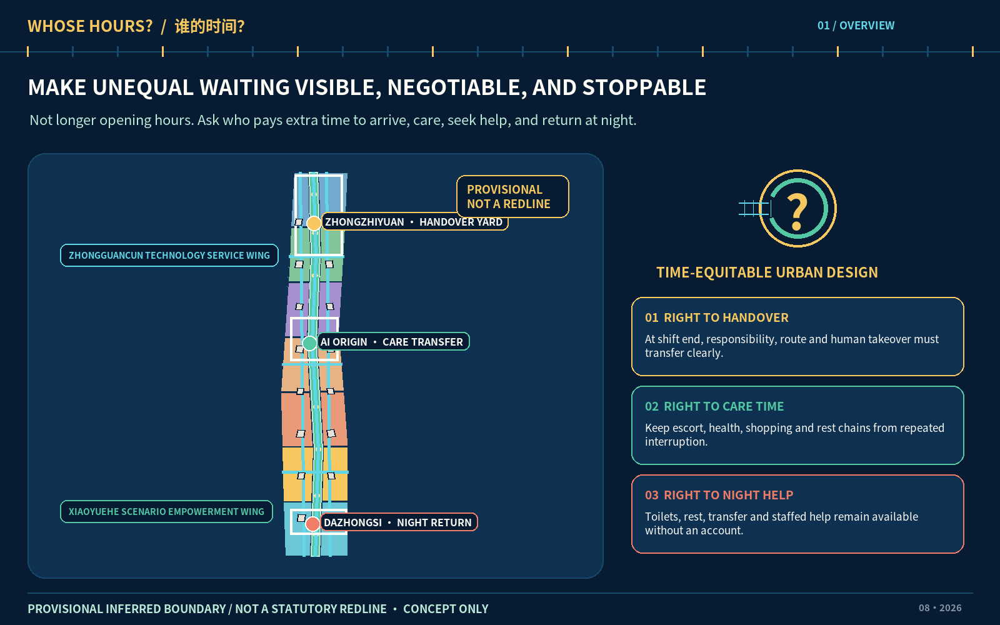
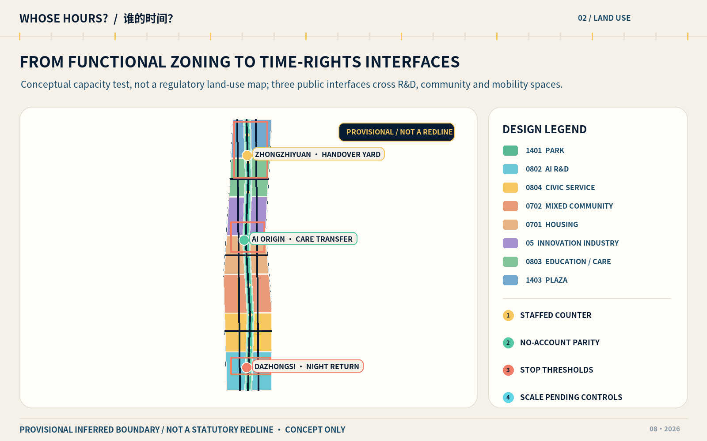
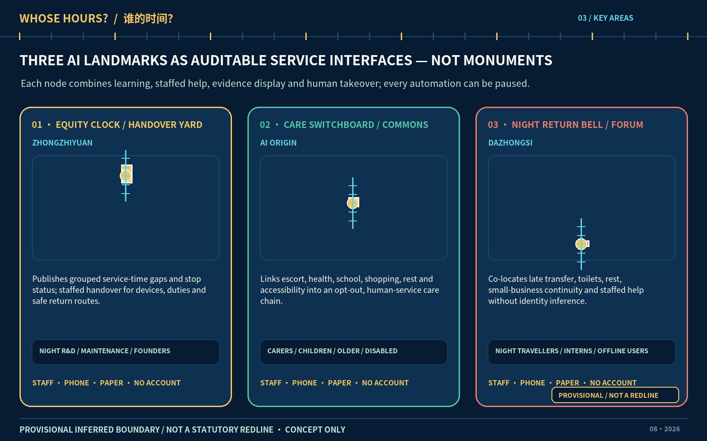
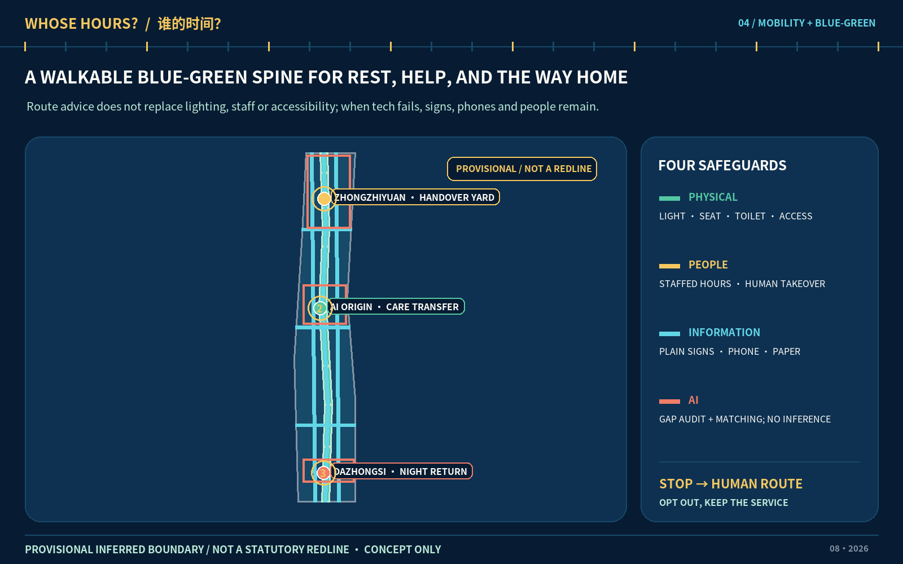
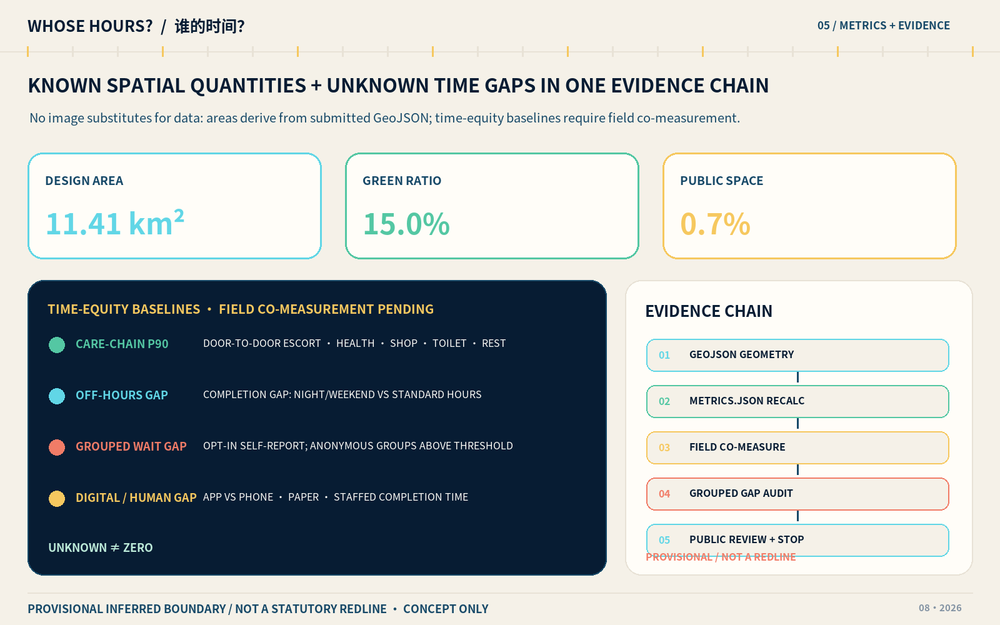

# WHOSE HOURS? — Time-Equitable Urban Design for the Centennial Jing-Zhang AI Innovation Belt

## Design Basis and Source List

This proposal treats time equity as a method for making urban-design decisions. When the same commute, medical visit, school escort, civic errand, toilet visit, rest stop, or innovation service creates different amounts of waiting, detouring, transferring, and care work, the first question is who pays the extra time; only then should a spatial, service, or technical intervention be selected. The “right to care time” is a normative design principle proposed here, not a claim about an existing statutory right. It requires every digital path to retain telephone, paper, no-account, and staffed paths, and it treats safe withdrawal as a condition of success. The work is organized against the public announcement and the agent-facing taskbook; it claims no government endorsement, land, funding, or implementation commitment.[source:DATA-SRC-OFFICIAL-ANNOUNCEMENT-20260509] [source:DATA-SRC-AGENT-TASKBOOK-20260518]

The professional basis has three levels. The Measures for Urban Design Management guide the coordination of public space, urban character, and implementation; the relevant detailed-planning rules are used to audit regulatory-plan-level expression; and national land/sea-use classification guidance controls land-use coding. The architectural design-depth standard is only a reminder of drawings and studies that a future licensed team must add. This conceptual submission does not misrepresent itself as completed architectural preliminary or construction design.[standard:MOHURD-URBAN-DESIGN-MEASURES] [standard:MOHURD-CONTROL-DETAILED-PLANNING] [standard:MNR-LAND-USE-CLASSIFICATION-GUIDE]

The package also maps the project announcement, agent taskbook, and architectural depth reference into an evidence chain of “readable claim—machine matrix—geometry—recalculated metric—human review.” Site interviews, time-of-day counts, existing-building ownership, rail ridership, road redlines, utilities, heritage limits, fire conditions, and statutory regulatory-plan controls have not been supplied or verified. Consequently, demand intensity, opening hours, building renewal categories, and pilot locations remain proposals to be tested rather than findings.[standard:PROJECT-OFFICIAL-ANNOUNCEMENT] [standard:PROJECT-AGENT-OPEN-CALL-TASKBOOK] [standard:MOHURD-ARCH-DESIGN-DEPTH-2016]

Of the six formal data sources, the announcement, taskbook, and three ministry references may establish tasks or methods; the provisional-boundary source may only generate a replaceable design base. `SITE-001` and the three `PROV-KEY` geometries are not official redlines, and their apparent precision must not be upgraded. Once official geometry is available, land use, buildings, roads, green space, public space, phasing, and every dependent metric must be rebuilt together rather than changing a background image.[source:DATA-SRC-MOHURD-URBAN-DESIGN-MEASURES] [source:DATA-SRC-MOHURD-CONTROL-DETAILED-PLANNING] [source:DATA-SRC-MNR-LAND-USE-CLASSIFICATION-202311]

The figure renders the submission extent as a provisional constraint. Readers can return to the boundary layer for geometry and to the diagnostic-depth item for missing information; the illustration is not a substitute for either source.[source:DATA-SRC-PROVISIONAL-BOUNDARIES-20260605] [data:geometry/site_boundary.geojson#SITE-001] [depth:existing_conditions_diagnosis]

## Three-Level Scope Framework

The three scopes form one chain rather than three unrelated scales. The approximately 43.6-square-kilometre coordinated research area frames relationships among universities, research, industry, communities, and international exchange. The approximately 11.4-square-kilometre overall design area translates that frame into land use, active travel, blue-green space, renewal, and service networks. Zhongzhiyuan, Beijing AI Origin Community, and Dazhongsi—the three key areas described as about 368.4 hectares in total—test concrete service chains across a day. These areas come from the formal task text at stated precision; the provisional submission base can only approximate them and cannot manufacture statutory boundaries.[depth:three_level_scope_framework] [data:geometry/key_areas.geojson#PROV-KEY-001] [metric:key_area_count]

At the coordinated level, the “time-equitable innovation belt” asks whether innovation narratives see the night handover of researchers, the chained trips of carers, slower movement by older and disabled people, in-person civic services for people without accounts, and the continuity needs of small businesses. At the overall level, the scheme is “one public-time belt, three stations, and two wings closing the loop”: the Jing-Zhang Heritage Park direction is the continuous public-time belt; three service landmarks are visible stations; the taskbook’s official “Zhongguancun Technology Service Wing” configures IP, capital, talent, and other innovation services, while the “Xiaoyuehe Scenario Empowerment Wing” receives public scenarios and user feedback. Together they close a loop of problem intake, joint definition, small test, disparity audit, human review, public retrospective, and either exit or scaling.[depth:overall_spatial_structure] [data:geometry/land_use.geojson#LU-001] [data:geometry/roads.geojson#ROAD-001]

The key-area level deliberately avoids cloning three spectacular “cores.” Zhongzhiyuan tests night research and maintenance handover; AI Origin tests chained escort, health, shopping, and rest needs; Dazhongsi tests late transfer, toilets, rest, human help, and continuity for small businesses. Each has a spatial carrier, assumed service window, non-digital entrance, accountable roles, and stop triggers. No test may pass to another phase without site co-design, professional review, and authorization.[data:geometry/key_areas.geojson#PROV-KEY-002] [data:geometry/key_areas.geojson#PROV-KEY-003] [depth:three_key_area_detailed_design]

The drawing logic follows the same progression. The coordinated scope uses a problem map and case-transfer diagram to explain why; the overall scope uses land-use, blue-green, mobility, public-space, and phasing plans to explain where; the key areas use service blueprints, 24-hour sections, and implementation contracts to explain who is responsible and when work stops. When official geometry replaces the provisional base, the workflow must verify coordinates, topology, and area, clip every agent-generated layer again, recalculate metrics, and re-review all visual outputs. Old percentages and pseudo-precise nodes cannot survive the replacement.[metric:site_area_sqm] [data:geometry/phasing.geojson#PHASE-001]

## Coordinated Research Area: Industry and Future City Research

The name “WHOSE HOURS?” combines a question mark, a railway switch, and the cells of a timetable. The question mark requires the beneficiary and time payer to be named before a technology is deployed; the switch represents several equivalent service paths; and the timetable cells make service windows auditable. The proposed palette is Railway Ink, Public-Service Cyan, Care Amber, and Stop-Signal Vermilion. Chinese and Latin typography should use openly licensed or system typefaces. Current figures use only original shapes and licensed fonts, not railway, corporate, or institutional trademarks. The visual identity may extend to question-mark ground lines, staffed-service light boxes, paper timetable cards, and public disparity boards, but it remains a concept for later clearance and design.[source:DATA-SRC-AGENT-TASKBOOK-20260518] [depth:height_massing_character]

The “three zones and two wings” use the taskbook’s official names: the three key areas, the **Zhongguancun Technology Service Wing**, and the **Xiaoyuehe Scenario Empowerment Wing**. The former configures IP, capital, talent, and enterprise-growth services; the latter organizes public scenarios, community participation, and user feedback. Together they support five functions: full-stack independent innovation, source collaboration, industry acceleration, cultural experience, and liveable everyday life. They also answer the three identities of a Centennial Jing-Zhang Cultural Belt, an Urban AI Life Experience Belt, and an AI Integrated Innovation Belt. The loop does not aim to collect more personal data. It reduces avoidable waiting, detours, and interruptions by returning grouped disparities, failure records, and human-review results to communities and researchers.[standard:PROJECT-AGENT-OPEN-CALL-TASKBOOK] [data:geometry/public_space.geojson#PUBLIC-001]

All eight mechanisms are framed as proposals that require authorization. The **land** mechanism prioritizes reversible and shared premises, subject to ownership and statutory use. The **space** mechanism connects three interfaces through the public-time belt, subject to official geometry and engineering. The **industry** mechanism introduces disparity audits into product validation, subject to voluntary enterprise participation. The **funding** mechanism ring-fences staffing and maintenance, subject to accountable budgets. The **talent** mechanism proposes care-friendly, night-work-friendly, and accessible conditions, subject to worker co-design. The **computing** mechanism uses bounded edge resources, subject to energy and security review. The **data** mechanism mandates authorization, minimization, and no identity inference, subject to formal agreements. The **scenario** mechanism opens only reversible pilots, subject to site, safety, and insurance permission.

Seven international cases offer background lessons, not evidence of local performance. Vienna’s gender-mainstreaming planning manual foregrounds chained daily travel and differences in how groups use space. Singapore’s one-north mixes work, living, play, and learning in an innovation ecosystem. The Jing-Zhang transfer is not formal imitation: it is the routine of documenting who walks farther, waits longer, or interrupts care, while placing laboratories, community services, and open space in practical proximity.[source:CASE-VIENNA-GENDER-PLANNING] [source:CASE-ONE-NORTH]

Paris-based STATION F shows that enterprise support can extend beyond desks through programs, housing, and administrative help. Helsinki’s Maria 01 demonstrates adaptive reuse, a 24/7 founder community, and programs attentive to founder wellbeing. Their transfer here is to put enterprise assistance alongside care support, late-return information, no-account transactions, and staffed help. It does not assume that longer opening hours are equitable, and it does not make 24-hour operation an unconditional goal.[source:CASE-STATION-F] [source:CASE-MARIA01]

Mila in Montréal makes responsible AI a strategic research priority, while Toronto’s Vector Institute links research, talent, and industry. Cambridge’s Connect Kendall Square framework emphasizes an accessible, inhabitable, walkable public-space network in an innovation district. Translated into this proposal, the spatial sequence is “open problem desk—controlled test ground—disparity audit room—public retrospective court,” using only authorized, minimized, grouped evidence.[source:CASE-MILA] [source:CASE-VECTOR] [source:CASE-KENDALL]

Future-city research is therefore assessed by more than “smartness.” The question is whether an intervention reduces extra time for the least-advantaged users without sacrificing safety, privacy, or human choice. Research teams are encouraged to treat disparity testing, accessibility, human takeover, and failure disclosure as product-validation infrastructure. The city side offers only bounded, reviewable, stoppable conditions. The international message is: **WHOSE HOURS? No one should pay an invisible time tax to use the city.** No site evidence currently establishes a company roster, talent composition, usable hours, or community demand, so every proposed ecosystem relationship remains subject to formal cooperation, rights clearance, and participatory research.

## Overall Design Area: Urban Renewal and Regulatory-Plan-Level Urban Design

The overall structure is a continuous public-time belt, three time-right interfaces, nine care-support nodes, and a two-wing feedback loop. The active blue-green corridor along the Jing-Zhang Heritage Park direction accommodates daily movement, rest, historical interpretation, and low-risk testing. Three interfaces support handover, care transfer, and late return. Nine smaller nodes provide seating, drinking water, accessible information, paper guidance, staffed contact, and visible opening status. The node count comes from the current design layer; it is not an inventory of existing facilities and confers no construction permission.[data:geometry/green_space.geojson#GREEN-001] [metric:care_support_node_count] [depth:blue_green_public_space]

Conceptual zoning follows an auditable rule of full coverage, no overlaps, and reproducibility. Research and testing, incubation and enterprise support, community life, cultural display, public services, mixed commerce, mobility connections, green space, and plazas jointly support time-equitable service chains. Building footprints express representative future spatial supply and make no demolition finding about actual structures. Public spaces around the three interfaces and nine nodes create a continuous system in which human help is visible, pausing is legitimate, and an equivalent route remains available.[data:geometry/land_use.geojson#LU-001] [data:geometry/buildings.geojson#BLDG-001] [depth:land_use_layout]

Development intensity, floor-area ratio, building height, building density, setbacks, road redlines, and total development capacity remain unknown until statutory controls, surveys, ownership, and engineering conditions are available. The currently recalculable building-footprint area is agent-generated design geometry used to examine spatial relationships, not an approval control. A future professional team should prepare parcel-based alternatives ordered as retain first, adaptive alteration, necessary renewal, and reversible additions, then complete daylight, fire, traffic, utilities, and economic studies.[metric:building_footprint_area_sqm] [metric:floor_area_ratio] [depth:development_intensity_controls]

Renewal should repair “time breaks” before considering added floor space: a station exit without late human help, a long route without rest, incompatible hours in a care chain, a laboratory handover disconnected from the last transit service, or a civic entrance available only through a QR code. Each candidate break needs direct observation, consent-based time diaries, or service logs as a baseline, with an equivalent route for people who do not use smart devices. As no field measurement or stakeholder validation has occurred, these are hypotheses and an audit checklist, not claims that the breaks already exist.

The package reaches reviewable urban-design concept depth, not approved regulatory-plan depth. Formal development requires ownership, existing-building condition, heritage, transport, utilities, flood, fire, and public-service evidence. Any proposal conflicting with statutory planning must exit. The constraints layer currently records gaps and provisional conditions; an empty or sparse constraint geometry must never be interpreted as an unconstrained site.[data:geometry/constraints.geojson#CONSTRAINTS] [standard:MOHURD-CONTROL-DETAILED-PLANNING]

## Detailed Design of Key Areas

Zhongzhiyuan receives the “Handover Yard.” A visible staffed desk, short-stay court, equipment handover lockers, paper late-return timetable, and lit walking connection toward transit form one service ensemble. It serves night researchers, laboratory maintenance workers, cleaners and guards, visitors, and workers with care responsibilities. AI may flag handover conflicts, last-connection risks, and staffing gaps only from authorized schedules and anonymous service logs. It must not infer family status or use facial recognition. The pilot stops if the human desk is unstaffed, an equivalent non-digital path fails, or a serious safety incident occurs.[data:geometry/key_areas.geojson#PROV-KEY-001] [data:geometry/roads.geojson#ROAD-001]

Beijing AI Origin Community receives the “Care Transfer Commons.” This is not just a transport concourse; it co-locates school escort, health consultation, everyday shopping, quiet rest, accessible toilets, temporary waiting, and enterprise support. Reversible small-scale installations would connect campus, innovation space, and neighbourhood, with a human desk, telephone booking, paper queue, and no-account path. AI may only reconcile opening-hour conflicts, accessible routes, and capacity. Children’s, health, or family data require explicit authorization and should be handled without retention whenever possible.[data:geometry/key_areas.geojson#PROV-KEY-002] [data:geometry/public_space.geojson#PUBLIC-001]

Dazhongsi receives the “Night Return Forum.” Subject to later study of rail integration and four-quadrant pedestrian connections, it combines visible human assistance, night toilet and rest information, alternatives after the last scheduled service, continuous low-glare wayfinding, and a small-business service-hours board. The “bell” is a public interface showing whether a service promise is being met, not a monumental object. Recommenders must never assign personal or group risk labels, and all route advice requires transport and accessibility verification. Station boundaries, underground space, merchant interest, and night demand remain unknown; every location awaits site survey and rail-operator authorization.[data:geometry/key_areas.geojson#PROV-KEY-003] [depth:traffic_rail_slow_parking]

All three areas use one implementation-contract template. Accountable roles include, at minimum, an asset/site duty holder, a public-service operator, a technology provider, an independent safety/privacy reviewer, and user representatives. Required resources include staffed hours, hotline and paper materials, maintenance funding, accessibility review, and emergency contacts. The baseline includes time-of-day door-to-door duration, completion rate, waiting disparities, access to human help, and withdrawal rate. Every named duty holder, budget, and baseline is currently unknown; the contract takes effect only after written authorization, site evidence, and accessibility and safety review.[depth:three_key_area_detailed_design]

The recommended evidence window begins with two to four weeks of human observation and co-design, followed by a four- to eight-week small, reversible pilot. Growth in user numbers is not the default definition of success. Hard stops include any unconsented sensitive-data collection, loss of an equivalent human/no-account path, a severe safety event, publication of a difference from an undersized group, or release of an accessibility route without human verification. A performance stop occurs when the 90th-percentile duration of a critical service deteriorates beyond a pre-agreed tolerance for two review cycles relative to a concurrent human baseline. Responsible parties must set the numerical tolerance after baseline collection; this document does not invent it.

## AI Innovation Ecosystem, Personas, and AI+ Scenarios

Eight personas are based on situations and tasks, not fixed identities: (1) a researcher or founder with care responsibilities; (2) a night laboratory, maintenance, or city-service worker; (3) a student or short-term intern; (4) a nearby resident or older person who moves more slowly; (5) a carer accompanying a child or patient; (6) a wheelchair or cane user, or a person with sensory disability; (7) a person with low digital literacy, no smartphone, or no willingness to register; and (8) an international first-time visitor. Personas may never become inferred classifications. A person may occupy several situations and may refuse all persona records.[metric:persona_count] [standard:PROJECT-AGENT-OPEN-CALL-TASKBOOK]

Twelve scenario cards share a six-part operating contract: name the user and place; use only the minimum authorized data; retain human, telephone, paper, and no-account fallbacks; name an accountable operating role; record risk and stop conditions; and evaluate anonymous grouped outcomes rather than ranking individuals. Demand, acceptance, and service baselines for all cards remain unknown. The following are candidates for co-design and testing, not deployed products.[metric:scenario_count] [metric:manual_fallback_scenario_ratio]

| Card | User and place | Minimum data and AI role | Fallback, accountability, and stop rule |
| --- | --- | --- | --- |
| S01 Care-chain time audit | Carers; AI Origin | Voluntary time diaries and published schedules identify conflicts across escort, health, shopping, and rest | Co-designer records on paper; operator accountable; stop on any inference of family status |
| S02 Service-hours gap finder | All users; three interfaces | Authorized opening hours and anonymous non-completion records identify service gaps | Staff verify; AI never changes hours; do not publish undersized groups |
| S03 Safe late-return routes **TEST** | Night workers and visitors; Zhongzhiyuan–Dazhongsi | Public network, lighting, and human-verified works information generate several explainable options | Hotline and paper map; stop after serious incident or false closure information |
| S04 Accessible route assistant **TEST** | Disabled users; whole belt | Human-surveyed ramps, lifts, surfaces, and toilet status | Accessibility reviewer signs off; unverified routes cannot launch |
| S05 No-account civic navigator | People without phones/accounts; nine nodes | Public service information with no user profile | Phone, paper, and staffed lookup are equivalent; stop if QR becomes the only entrance |
| S06 Multilingual first-visit helper | International visitors; three landmarks | Cleared terms, open cultural sources, and human-edited translations | Bilingual staff/volunteers review; withdraw misleading text until corrected |
| S07 Staffed care-space booking | Carers; AI Origin | Capacity and time slots, without diagnoses or child profiles | Phone and walk-in queue with protected human quota; stop discriminatory allocation |
| S08 Heat-rest point guidance | Outdoor workers and slow travellers; public-time belt | Official weather alerts and human-verified open refuges | Physical signs first; show only confirmed open points when data are unreliable |
| S09 Maintenance handover co-pilot **TEST** | Night maintenance staff; Zhongzhiyuan | Authorized task list flags responsibility breaks, not performance profiles | Paper handover and supervisor confirmation; stop if used to punish individuals automatically |
| S10 Night circulation simulation **TEST** | Late travellers; Dazhongsi | Anonymous time-of-day demand and network model compare route concepts offline | No passengers before transport approval; stop without human dispatcher and safety staff |
| S11 Closed-course low-speed robot **TEST** | Operations team; controlled site | Only safety-essential environmental data test yielding and human takeover | Barriers, observer, and physical emergency stop; stop on public-road entry or failed takeover |
| S12 Service-failure rehearsal **TEST** | All operating roles; three interfaces | Simulated outage, bad recommendation, queue, and device failure | Switch to human, phone, and paper; stop if basic service cannot recover in the agreed time |

Six cards marked TEST set `test_scenario_count=6` and exceed the minimum taskbook requirement, but “test” does not mean permission. S09 maintenance handover, S10 night circulation, and S11 low-speed robotics are explicitly the three AI industry test-and-validation scenarios. S03, S04, S10, and S11 are safety-critical and require transport, accessibility, equipment, and insurance review first; S09 and S12 should begin with synthetic data, role play, and non-identifying observation. Spatial locations are linked to roads, public spaces, and controlled nodes so that counts and figures remain reviewable.[metric:test_scenario_count] [data:geometry/roads.geojson#ROAD-001] [data:geometry/public_space.geojson#PUBLIC-001]

The disparity audit measures differences in service-completion time, not who is “more efficient.” The 90th-percentile door-to-door care-chain duration, completion gap between standard and non-standard hours, voluntarily grouped waiting-time gap, staffed-help hours at night, care-chain interruptions, and completion gap between digital and phone/paper/human channels are all unknown. They may be computed only with informed consent, minimum group size, no re-identification, and withdrawal. Gender, family relationship, health, and disability must never be inferred from names, appearance, devices, or traces.[metric:p90_care_chain_time_min] [metric:off_hours_service_completion_gap] [metric:group_wait_gap_min]

## Land Use, Building Scale, and Retain-Renovate-Demolish Strategy

Conceptual land use orders space around time-equitable service chains rather than land value alone. Innovation research and testing sit near controlled tests and handover support; incubation and enterprise services connect to the care transfer at AI Origin; mixed commerce and public service support late return, toilets, rest, and human help; culture and green space create a continuous, free, no-registration public interface. Categories follow the permitted national spatial-use vocabulary. The layer covers the provisional boundary without overlaps, while statutory land classes remain subject to official survey and planning.[standard:MNR-LAND-USE-CLASSIFICATION-GUIDE] [data:geometry/land_use.geojson#LU-001]

The buildings layer is a set of representative spatial-supply prototypes, not an existing-building survey. Four reversible types are proposed: light service kiosks along the public-time belt, shared human desks in existing ground floors, adaptable handover/care rooms in key areas, and controlled indoor test space. Building-footprint area is recalculable, but gross floor area, floor-area ratio, and height cannot be derived without storeys, existing conditions, ownership, and statutory controls. Any massing image conveys only interface, shade, and accessibility intentions.[data:geometry/buildings.geojson#BLDG-001] [metric:building_footprint_area_sqm] [metric:building_height_m]

Retain-renovate-demolish decisions pass three evidence gates. Gate one verifies age, structural safety, ownership, use, heritage, and fire conditions. Gate two records the time needs of existing users, tenants, small businesses, and maintenance staff. Gate three compares retain-and-adjust, adaptive reuse, partial replacement, and reversible addition for carbon, cost, rent, and daily time. No building may be designated for demolition without all three gates. Every current footprint is `agent_generated_design`, indicating a proposition for professional development only.[depth:retain_renovate_demolish] [standard:MOHURD-ARCH-DESIGN-DEPTH-2016]

Development control follows the rule “unknown before false precision.” `floor_area_ratio` and `building_height_m` remain null pending formal controls; statutory building density, green ratio, setbacks, and parking standards are likewise not inferred from conceptual geometry. The recalculated design green-space and public-space ratios compare whether rest, transfer, and staffed-service space survives between design versions. They are not statutory greening or facility-compliance claims.[metric:floor_area_ratio] [metric:green_ratio] [metric:public_space_ratio]

Operations should begin with leases, shared rooms, and temporary permissions so unvalidated demand does not trigger irreversible construction. Each location first pilots tables, signs, staff rosters, paper timetables, and low-technology prototypes. Building work can be considered only after evidence on service-chain duration, safety, accessibility, and non-digital equivalence. Rent displacement, forced relocation of existing users, night disturbance, or an unsustainable staffing budget sends the project to review or exit; an innovation label cannot offset those costs.

## Transport, Rail, Municipal Infrastructure, and Public Services

The transport principle is to guarantee choice, not an algorithmic shortest path. A continuous walking/cycling line proposes **north–south continuity**, while three key-area links and cross connections propose **east–west stitching**; both are conceptual structures whose crossings, engineering feasibility, and roadway conditions remain to be verified. Late-return guidance must offer options optimized for few transfers, visible staffed help, accessibility, and conservative lighting, without requiring location sharing. Lines in the road layer are conceptual. They must be overlaid with official redlines, junctions, rail entrances, under-bridge conditions, and works information before any route can guide a person.[data:geometry/roads.geojson#ROAD-001] [metric:road_length_m] [depth:traffic_rail_slow_parking]

Rail integration repairs the “last segment of time” rather than merely enlarging concourses: Dazhongsi links four pedestrian quadrants to a night-help point; AI Origin links campus, innovation space, and daily care services; Zhongzhiyuan links night handover to the final transit services. Parking and cycle storage must not occupy tactile paving, rest areas, or emergency access. A microtransit proposal remains an offline S10 simulation until demand, roadway, operating permission, vehicle safety, and fare equity are professionally reviewed.

Municipal and digital infrastructure follow “basic service first.” Reliable lighting, water, toilets, seating, rain cover, fire protection, and emergency communication precede sensors and computing. Edge computing is limited to minimized, on-site processing, while paper timetables, hotlines, and staff continue through outages. Electricity, drainage, heat, communications, fire, waste, and flood evidence are unavailable, so each node requires professional verification. A blank space in the plan is never evidence of spare capacity.[depth:municipal_new_infrastructure] [data:geometry/constraints.geojson#CONSTRAINTS]

Nine small, staffed care-support nodes connect the three more complete interfaces. Their minimum service is a seat, accessible information, paper map, human contact, current opening status, and a complaint/exit channel, without mandatory QR scanning. Operational review asks first whether staff actually appeared during published hours and whether no-account completion matched the digital channel. Screen touches and the volume of collected data are not success metrics.[metric:care_support_node_count] [metric:digital_human_completion_gap]

## Blue-Green Network, Public Space, and Urban Character

The blue-green framework takes the Jing-Zhang Heritage Park direction as a continuous spatial spine. Qinghe, Xiaoyue River, and adjacent green spaces are potential ecological connections subject to later river, flood, heritage, and park-management review. Green space also supplies “recovery time”: free seating, shade, water, understandable wayfinding, and places where children and carers can pause together prevent slower users from being penalized for resting. Current area and ratio values come from an agent-generated layer and are internal design calculations only.[data:geometry/green_space.geojson#GREEN-001] [metric:green_space_area_sqm] [metric:green_ratio]

Public space joins three interfaces: the Handover Yard for night labour, the Care Transfer Commons for chained daily purposes, and the Night Return Forum for the city after the last scheduled service. Nine support nodes turn large landmarks into everyday services. Public-space area and ratio test whether free stopping, staff, and east-west permeability are squeezed out by building supply; they do not establish statutory facility compliance. Every node should be enterable without purchase, registration, or being photographed.[data:geometry/public_space.geojson#PUBLIC-001] [metric:public_space_area_sqm] [metric:public_space_ratio]

The three “AI pilgrimage landmarks” are service, learning, and evidence nodes, not monuments to technology. In the north, the Equity Clock displays anonymous grouped time disparities, staffed hours, and pause states. In the centre, the Care Switchboard provides staffed, phone, paper, and no-account entrances plus a co-design desk. In the south, the Night Return Bell displays human-confirmed transfer, toilet, rest, and assistance information. Together they form a walkable learning route. No display may include individual traces, faces, or small groups that could be re-identified.[metric:landmark_count] [source:DATA-SRC-AGENT-TASKBOOK-20260518]

A reusable **time-equity component library** includes a movable staffed desk, paper timetable card, telephone contact sign, no-account queue token, accessible and low-vision wayfinding, sitting/leaning furniture, live opening-state board, vermilion pause mark, physical emergency stop, and complaint/exit card. The landmarks also host non-ranked contribution and honour displays. With consent, these credit open-source fixes, staffed shifts, accessibility verification, and disclosed failures; they never rank people by code volume, hours, finance, or personal scores, and contributors may remain anonymous or withdraw attribution.

The cultural narrative is “from railway time to time held in common.” The connection, engineering cooperation, and timetable discipline associated with Centennial Jing-Zhang are translated into respect for different contemporary rhythms. Zhongguancun’s innovation culture becomes open problems, reproducible experiments, and retrospectives on failure. The narrative invents no historical event and appropriates no image of Qinghuayuan Station, Dazhong Temple, or a company. Heritage significance, interpretive content, and naming rights require confirmation by professionals and rights holders.

Urban character uses a quiet base, cyan service lines, amber staffed nodes, and vermilion stop marks, with long-distance legibility and colour-vision differences considered. Night lighting prioritizes continuity, low glare, and genuinely staffed help over screens that merely simulate safety. Roof form, massing, ground-floor interfaces, and material directions remain concepts subject to formal height, daylight, structure, fire, energy, and historic-environment study.[depth:height_massing_character] [standard:MOHURD-URBAN-DESIGN-MEASURES]

## Renewal Projects, Implementation Policy, and Phasing

Eight divisible implementation contracts make up the renewal list: P01 official geometry and site evidence; P02 public-time-belt break audit; P03 Zhongzhiyuan Handover Yard; P04 AI Origin Care Transfer Commons; P05 Dazhongsi Night Return Forum; P06 nine support nodes; P07 six controlled scenario tests; and P08 a public disparity board and annual retrospective. Every contract must name the site duty holder, operator, technology party, independent reviewer, user representatives, staff hours, maintenance resources, authorized data, baseline, test window, stop rules, and restoration after exit.[depth:renewal_project_list] [data:geometry/phasing.geojson#PHASE-001]

Phases are gates, not date promises. Phase A, “See Time” (roughly months 0–6 after authorization), covers survey, stakeholder mapping, staffed-service prototypes, non-identifying baselines, and safety/accessibility review. Phase B, “Exchange Time” (roughly months 6–18 after evidence gates pass), runs six small and reversible tests. Phase C, “Common Time” (roughly months 18–36 and only after independent evaluation), may consider network expansion, adaptive reuse, and an annual program. If a gate fails, human service remains while the technical intervention shrinks or exits; schedule pressure cannot override a gate.[metric:phase_count] [depth:phasing_implementation]

Long-term operations could use a “Time Equity Council Table” rather than another unaccountable algorithmic platform. Seats should include site and public-service operators, community and labour representatives, disabled users, technologists, and privacy, safety, transport, and accessibility professionals. A monthly session handles interruptions and complaints; a quarterly review publishes grouped disparities, fallback performance, and stop records; an annual decision renews, modifies, or retires each scenario. A developer community receives issues through public trackers, co-design days, and maintenance rotations. Scenario opening follows published call, data/safety review, human baseline, controlled test, independent retrospective, and exit/renewal; an annual version release lists fixes, unresolved issues, and retired work. The organization, funding, and authority do not yet exist and require a real governance agreement.

An annual activity proposal, “WHOSE HOURS? OPEN WEEK,” combines a night-maintainer public class, care-chain co-design walk, no-account service challenge, failure drill, open-source and disparity-audit workshop, three-landmark walking route, and international case dialogue. It is not an investment-attraction commitment. The talent pathway is participation in a public problem, verifiable contribution, non-ranked peer recognition, and an optional job or research collaboration. The enterprise pathway is public issue, shared brief, controlled prototype, independent evaluation, and a service specification that might later be procured. Real parties must confirm every position, collaboration, and purchase. Service may never be exchanged for participant data, and one event’s popularity is not proof of long-term demand.[source:CASE-MARIA01] [source:CASE-MILA]

Policy directions for later consideration include non-digital equivalence and human takeover in public procurement; minimum staffed hours and published stop clauses in site permissions; data agreements prohibiting identity inference, secondary marketing, and individual punishment; adaptive reuse and tenant/small-business impact review before construction; and project accounts that record both time saved and time displaced. These are research suggestions for public authorities, asset holders, and operators—not enacted policy.

## Metrics, Area Recalculation, and Compliance Matrix

Spatial metrics are recalculated from GeoJSON in one projected coordinate system. Overall design area `site_area_sqm`, agent-generated building footprint `building_footprint_area_sqm`, design green-space area and ratio `green_space_area_sqm/green_ratio`, public-space area and ratio `public_space_area_sqm/public_space_ratio`, and conceptual route length `road_length_m` can be known values for this version. They are internal consistency checks and cannot be upgraded into statutory site area, green ratio, road mileage, or approved development capacity.[metric:site_area_sqm] [metric:building_footprint_area_sqm] [metric:green_space_area_sqm]

Ratios and network values must be read with their layers. The green ratio tests whether recovery time and continuous walking have physical room; the public-space ratio tests whether free staying and staffed help survive; road length is only the total of this version’s conceptual lines. Official boundaries, waterways, streets, and controls trigger complete re-clipping, topology repair, and recalculation. Previous values cannot be carried forward.[metric:green_ratio] [metric:public_space_area_sqm] [metric:public_space_ratio]

Delivery counts include three key areas, twelve scenario cards, six test cards, eight personas, three service landmarks, three phases, and nine care-support nodes. Manual fallback ratio is defined as the number of scenarios explicitly offering a human/telephone/paper/no-account alternative divided by the total number of scenarios; the coded result in this package is full coverage. It measures whether the contract is written, not whether fallback is operational on site.[metric:road_length_m] [metric:key_area_count] [metric:scenario_count]

The remaining counts are cross-checked among prose, matrices, and geometry. Test scenarios and personas must be findable in the scenario table; landmarks and phases must map to public-space and phasing evidence; support nodes must map to a structured layer. If a generated count differs from the prose, verified structured data governs and the prose must be corrected.[metric:test_scenario_count] [metric:persona_count] [metric:landmark_count]

Contract completeness is further checked through phase, fallback, and support-node counts, while actual performance needs separate evidence. The 90th-percentile care-chain time, off-hours completion gap, grouped waiting gap, staffed-help hours, chain interruptions, and digital-versus-human completion gap remain unknown until informed on-site baselines, minimum sample sizes, and independent review exist.[metric:phase_count] [metric:manual_fallback_scenario_ratio] [metric:care_support_node_count]

Metric governance combines absolute stops and relative improvement. Any unauthorized sensitive collection, missing equivalent human path, or severe safety event produces an absolute stop. Relative improvement is measured against a concurrent human baseline, never by ranking groups against one another. The AI innovation index, talent density, output, satisfaction, and event participation have no credible current value and do not appear as outcomes. Future reporting must state who was not covered and who paid additional time as well as what was saved.

The compliance matrix covers the required announcement tasks and agent.1–agent.6. The standard matrix separates mandatory and reference material. The design-depth matrix maps existing-condition diagnosis, three scopes, structure, land use, intensity, character, retain-renovate-demolish, transport, utilities, blue-green space, key areas, projects, phases, recalculation, and missing-data risk. “Complete” means only that the package contains evidence; it does not mean official approval, professional acceptance, or demonstrated site effects.[depth:metrics_recalculation] [depth:risk_missing_data]

## Risk, Copyright, and Compliance

The first risk is geometry and statutory control. The overall boundary and three key areas are rough provisional geometry, not official redlines. Statutory parcel, land-use, intensity, height, setback, road, utility, fire, flood, heritage, and ownership conditions are missing. Every zone, footprint, line, node, and phase is an agent-generated recommendation that must be reviewed by qualified planning, architecture, transport, municipal, landscape, heritage, and accessibility professionals when formal evidence arrives.[source:DATA-SRC-PROVISIONAL-BOUNDARIES-20260605] [data:geometry/site_boundary.geojson#SITE-001]

The second risk concerns demand and equity evidence. The team has not completed a site visit, interview, co-design session, time-of-day observation, or usability test, and cannot claim support from night workers, carers, residents, disabled people, merchants, companies, or rail operators. Future participation must explain its purpose, permit refusal and withdrawal, compensate people’s time, offer non-digital channels, and avoid treating the most vocal participants as the whole population. Small groups must never be exposed through a disparity display.

The third risk is AI harm. Facial recognition, identity or family inference, covert risk scoring, secondary marketing, individual performance punishment, and registration as the price of basic service are prohibited. Safety-critical routing, accessibility information, health-service navigation, and robot trials require human verification and physical takeover. A model output is not a planning approval, medical, legal, or safety decision; bad advice must be discoverable, correctable, logged, and stoppable.[standard:PROJECT-OFFICIAL-ANNOUNCEMENT]

For copyright, the proposal text, diagrams, schematic maps, identity, and charts are generated by the submitter and AI tools for this package, with use governed by `COMMUNITY-DISPLAY-ONLY` and the copyright statement. No external case image, map tile, company logo, remote font, script, iframe, form, or tracking code is embedded. Cases are discussed in text with source records. Any later photograph, archive item, or brand asset requires item-level permission and registration.

The bilingual contract requires equivalent Chinese and English proposals, HTML, five text-bearing figures, and A3/A0 drawings. Translation differences may never strengthen a claim; any official commitment, precise control, or on-site outcome appearing only in one language must be removed. Before submission, spatial, visual, professional, file-integrity, and preflight checks should test topology, metric calculations, source coverage, local assets, PDF pages, and legibility. Human review remains the final quality gate.

## References

1. Beijing Municipal Commission of Planning and Natural Resources, Haidian Branch, “Prequalification Announcement for the Centennial Jing-Zhang AI Innovation Belt International Urban Design Solicitation,” 9 May 2026. Scope and areas are understood only at the precision of the original.[source:DATA-SRC-OFFICIAL-ANNOUNCEMENT-20260509]

2. Open City AI, “Agent-Facing Taskbook for the Centennial Jing-Zhang AI Innovation Belt Urban Design,” 18 May 2026. The currently merged repository version governs this open-call package.[source:DATA-SRC-AGENT-TASKBOOK-20260518]

3. Ministry of Housing and Urban-Rural Development, *Measures for Urban Design Management* and the relevant detailed-planning compilation rules. These guide method and depth; they do not replace Beijing statutory planning.[source:DATA-SRC-MOHURD-URBAN-DESIGN-MEASURES] [source:DATA-SRC-MOHURD-CONTROL-DETAILED-PLANNING]

4. Ministry of Natural Resources, *Guidelines for Land and Sea Use Classification for Territorial-Space Survey, Planning and Use Control*, 2023; provisional geometry as registered in the repository.[source:DATA-SRC-MNR-LAND-USE-CLASSIFICATION-202311] [source:DATA-SRC-PROVISIONAL-BOUNDARIES-20260605]

5. City of Vienna, *Gender Mainstreaming in Urban Planning and Urban Development*; JTC, official *one-north* information. Accessed 10 August 2026.[source:CASE-VIENNA-GENDER-PLANNING] [source:CASE-ONE-NORTH]

6. STATION F official website; Maria 01 official Campus and Programs pages. Accessed 10 August 2026.[source:CASE-STATION-F] [source:CASE-MARIA01]

7. Mila, *Responsible AI*; Vector Institute, *About / Research and Talent*. Accessed 10 August 2026.[source:CASE-MILA] [source:CASE-VECTOR]

8. City of Cambridge, *Connect Kendall Square Framework Report*. Accessed 10 August 2026.[source:CASE-KENDALL]

9. The full machine source and licence index is in `sources.json`. Metrics, task coverage, standards, and depth are in `metrics.json`, `compliance_matrix.json`, `standard_matrix.json`, and `design_depth_matrix.json`. These audit files do not convert unknown values into known ones.
