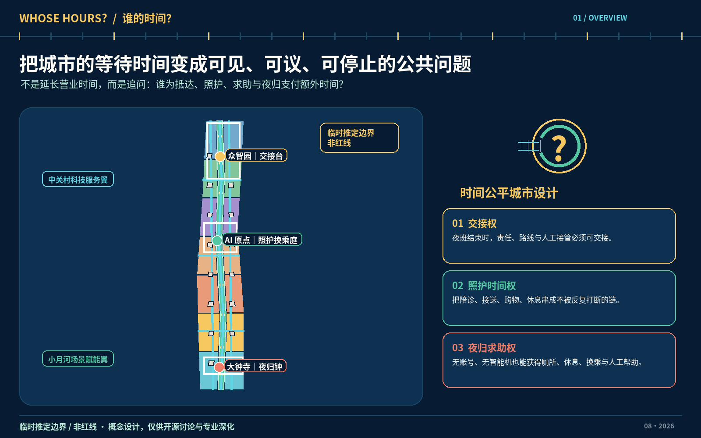
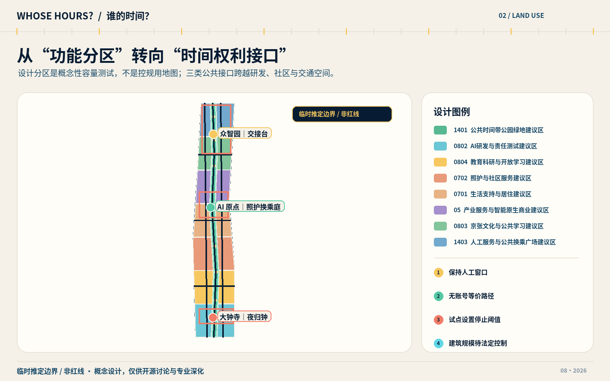
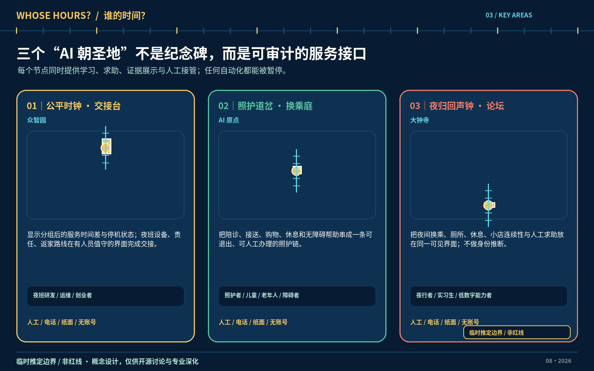
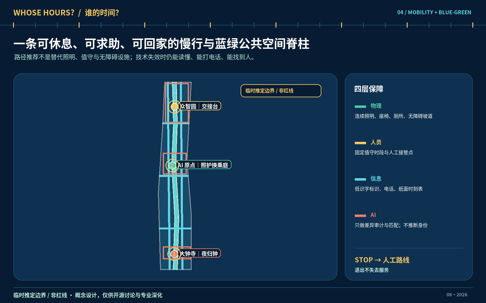
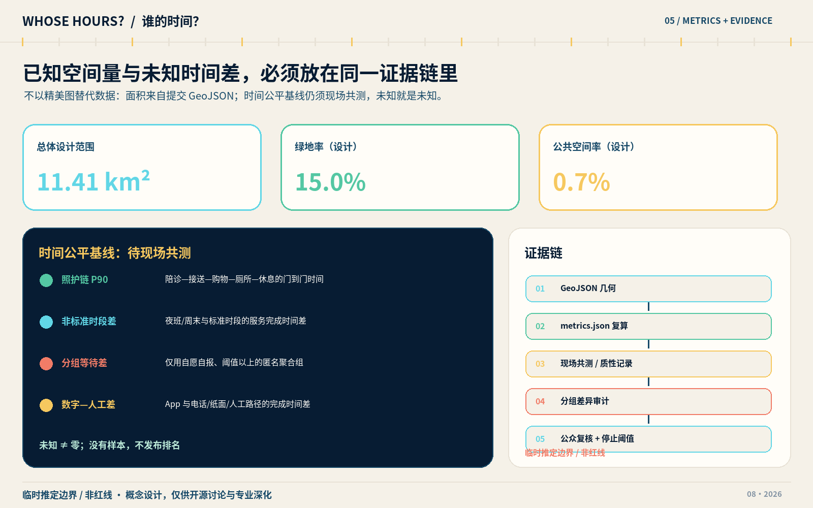

# 谁的时间？ WHOSE HOURS? —— 京张 AI 创新带的时间公平城市设计

## 设计依据与资料清单

本方案把“时间公平”定义为一项城市设计判断方法：当同一项通勤、就医、接送、办事、如厕、休息或创新服务对不同人产生不同的等待、绕行、换乘和照护负担时，先找出是谁在支付额外时间，再决定空间、服务与技术是否值得建设。“照护时间权”是本方案提出的规范性设计原则，不冒充现行法定权利；它要求每一条数字路径同时保留电话、纸面、无账号与现场人工路径，并把能否安全退出作为成功条件。方案依据公开征集公告与面向智能体任务书组织任务，不声称获得政府认可、资金、用地或实施承诺。[source:DATA-SRC-OFFICIAL-ANNOUNCEMENT-20260509] [source:DATA-SRC-AGENT-TASKBOOK-20260518]

专业依据分为三层：城市设计统筹采用《城市设计管理办法》作为公共空间、风貌和实施衔接的工作参照；控规层面的表达采用详细规划编制相关办法作为深度检查；用地编码遵循国土空间调查、规划、用途管制用地用海分类指南。建筑设计深度标准仅用于提醒后续专业团队补图，不被本概念方案伪装成已完成的建筑施工或初步设计。[standard:MOHURD-URBAN-DESIGN-MEASURES] [standard:MOHURD-CONTROL-DETAILED-PLANNING] [standard:MNR-LAND-USE-CLASSIFICATION-GUIDE]

本稿还逐项映射项目公告、智能体任务书和建筑设计深度参考，形成“正文判断—机器矩阵—几何图层—指标复算—人工审阅”证据链。现场使用者访谈、分时客流、现状建筑权属、轨道客流、道路红线、地下管线、文保边界、消防条件、控制性详细规划指标均未提供或未完成核验，因此所有需求强度、服务时段、建筑更新类别和试点点位都属于待验证建议。[standard:PROJECT-OFFICIAL-ANNOUNCEMENT] [standard:PROJECT-AGENT-OPEN-CALL-TASKBOOK] [standard:MOHURD-ARCH-DESIGN-DEPTH-2016]

六项正式数据源中，公告、任务书和三项国家部委文件可用于说明任务或方法；临时边界源只用于生成可替换的设计底图。`SITE-001` 与三处 `PROV-KEY` 图形不是官方红线，面积精度不应被升级，正式边界到位后须整体重跑用地、建筑、道路、绿地、公共空间、分期与指标，而不是只换一张底图。[source:DATA-SRC-MOHURD-URBAN-DESIGN-MEASURES] [source:DATA-SRC-MOHURD-CONTROL-DETAILED-PLANNING] [source:DATA-SRC-MNR-LAND-USE-CLASSIFICATION-202311]

图中方案范围以临时约束表达，边界证据可回到总体图层，缺失资料与诊断工作进入设计深度清单；任何读者均可从源文件复算而不依赖渲染图。[source:DATA-SRC-PROVISIONAL-BOUNDARIES-20260605] [data:geometry/site_boundary.geojson#SITE-001] [depth:existing_conditions_diagnosis]

## 三层范围工作框架

三层范围不是三个互不相干的尺度。统筹研究范围约 43.6 平方公里，用来判断高校、科研、产业、社区与国际交往怎样形成创新生态；总体设计范围约 11.4 平方公里，用来把判断转成用地、慢行、蓝绿、更新和服务网络；众智园、北京 AI 原点社区与大钟寺三处重点区域合计约 368.4 公顷，用来检验一天中的具体服务链。上述面积来自正式任务文本的量级描述，提交底图只能作近似核对，不能反向宣称得到法定边界。[depth:three_level_scope_framework] [data:geometry/key_areas.geojson#PROV-KEY-001] [metric:key_area_count]

统筹层提出“时间公平创新带”的问题框架：研发者的夜班交接、照护者的多目的出行、老年人与障碍使用者的慢速通行、无账号使用者的线下办事和小商户的连续经营，是否被创新叙事看见。总体层采用“一带三站、两翼成环”：京张遗址公园为连续公共时间带，三座服务型地标为可见节点；任务书正式称谓“中关村科技服务翼”配置知识产权、资本、人才等创新服务，“小月河场景赋能翼”承接公共场景与使用反馈，两翼共同构成“问题进入—共同定义—小规模测试—差异审计—人工复核—公开复盘—停止或扩围”的闭环。[depth:overall_spatial_structure] [data:geometry/land_use.geojson#LU-001] [data:geometry/roads.geojson#ROAD-001]

重点层不追求三个展示性“核心”雷同复制，而是分工验证：北部众智园验证夜间研发与维护交接，中部原点社区验证接送、健康、购物、休息相连的照护链，南部大钟寺验证夜归换乘、如厕、休息、人工求助和小商户连续性。每个重点区都有空间载体、服务时段假设、非数字入口、责任边界和停止触发器，只有经过现场共创、专业复核和授权的小试验才可进入下一阶段。[data:geometry/key_areas.geojson#PROV-KEY-002] [data:geometry/key_areas.geojson#PROV-KEY-003] [depth:three_key_area_detailed_design]

三层工作的图纸关系为：统筹层以问题地图和案例转译图说明“为何”；总体层以用地、蓝绿、慢行、公共空间和分期图说明“在哪里”；重点层以服务蓝图、一天剖面和实施合同说明“谁来做、何时停”。替换正式边界时，先核对坐标、拓扑和面积，再重新裁切所有代理生成图层，最后重新计算指标并复审展示图，不能保留旧百分比或伪精确点位。[metric:site_area_sqm] [data:geometry/phasing.geojson#PHASE-001]

## 统筹研究范围产业与未来城市研究

方案名称“谁的时间？ WHOSE HOURS?”把一个问号、铁路道岔和时刻表的分格组合为识别符号：问号提醒技术部署前先问受益者与付出者，道岔代表多条等价服务路径，时刻格代表可审计的服务时段。主色建议为“铁路墨黑、公共服务青、照护暖黄、停止信号朱红”，中文使用可自由许可的黑体系统，英文使用开放字体；本次图件只使用自绘形状和授权字体，不复制京张铁路、企业或机构商标。VI 可落到地面问号导线、人工服务灯箱、纸面时刻卡和公开差异看板，但仅是待深化品牌提案。[source:DATA-SRC-AGENT-TASKBOOK-20260518] [depth:height_massing_character]

“三区两翼”以三处重点区域为验证区，以“中关村科技服务翼 / Zhongguancun Technology Service Wing”和“小月河场景赋能翼 / Xiaoyuehe Scenario Empowerment Wing”为任务书规定的两翼。前者配置知识产权、资本、人才与企业成长服务，后者组织公共场景、社区参与与使用反馈。它们共同支撑全栈自主创新、源头协同、产业加速、文化体验、宜居生活五类功能，也回应该创新带作为百年京张文化带、都市 AI 生活体验带与 AI 融合创新带的三重定位。闭环不以收集更多个人数据为目标，而以减少不必要的等待、绕行和服务中断为目标：公共问题从两翼进入，在三区形成可撤回的小试验，再把分组差异、失败记录和人工复核结果公开回送社区与研发者。[standard:PROJECT-AGENT-OPEN-CALL-TASKBOOK] [data:geometry/public_space.geojson#PUBLIC-001]

八类机制均按“概念建议、授权后实施”表达：土地机制建议优先利用可逆和共享空间，待权属与法定用途确认；空间机制建议以公共时间带串联三处接口，待边界与工程核验；产业机制建议把差异审计纳入产品验证，待企业自愿参与；资金机制建议设置人工服务与维护专款，待责任主体和预算批准；人才机制建议支持照护友好、夜班友好与无障碍工作条件，待劳动者共创；算力机制建议采用受控端侧资源，待能耗与安全评估；数据机制坚持授权、最小化和不推断身份，待合规协议；场景机制只开放可撤回小试验，待场地、安全与保险许可。

七个国际案例只提供可转译的背景经验，不构成本地成效证明。维也纳性别主流化规划手册提示从日常链式出行和不同群体的使用差异审视空间；新加坡 one-north 把工作、生活、游憩与学习置于创新园区的混合生态。对京张的转译不是复制形态，而是把“谁多走、谁多等、谁必须中断照护”写进路线审计，并让实验室、社区服务和开放空间相邻。[source:CASE-VIENNA-GENDER-PLANNING] [source:CASE-ONE-NORTH]

巴黎 STATION F 的创业项目、居住与行政支持说明企业服务不应只提供工位；赫尔辛基 Maria 01 的旧建筑再利用、全天候社区和创业者福祉项目提示，历史空间可通过运营和支持网络焕新。京张对应做法是把企业服务台与照护、夜归、无账号办理和人工求助并列，而不假定延长营业时间就是公平，也不把 24 小时开放作为无条件目标。[source:CASE-STATION-F] [source:CASE-MARIA01]

蒙特利尔 Mila 的负责任 AI 研究方向与多伦多 Vector Institute 的研究—人才—产业连接，提示创新带应把安全、审计和人才培养做成基础设施；剑桥 Kendall Square 公共空间框架则提示创新集聚区需要可进入、可停留、可连续步行的公共网络。转译后的空间机制是“开放问题台—受控测试场—差异审计室—公共复盘庭”，其评估材料只使用授权、最小化和分组数据。[source:CASE-MILA] [source:CASE-VECTOR] [source:CASE-KENDALL]

未来城市研究因此不以“更聪明”为单一目标，而以“是否减少最不利使用者的额外时间，同时不损害安全、隐私与人工选择”为判据。产业端鼓励研发团队把差异测试、可访问性、人工接管和失败披露纳入产品验证；城市端只提供条件明确、边界可控、可被叫停的场景。国际传播短句为：**WHOSE HOURS? No one should pay an invisible time tax to use the city.** 统筹研究阶段尚无企业清单、人才结构、场地可用时段和社区需求的现场证据，所有生态连接均须在正式合作、清权和参与式研究后确认。

## 总体设计范围城市更新与控规深度城市设计

总体结构为“连续公共时间带 + 三个时间权接口 + 九个照护支持节点 + 两翼反馈环”。京张遗址公园方向的慢行蓝绿廊道承担日常通行、休息、历史叙事和低风险测试；三个接口分别服务交接、照护换乘和夜归；九个小节点提供座椅、饮水、无障碍信息、纸面导引、人工联络与可视时刻。节点数量是当前设计图层的方案计数，不是既有设施普查，也不代表获得建设许可。[data:geometry/green_space.geojson#GREEN-001] [metric:care_support_node_count] [depth:blue_green_public_space]

用地分区采用“完整覆盖、无重叠、可重算”的概念功能层：研发与实验、孵化与企业服务、社区生活、文化展示、公共服务、混合商业、交通联系、绿地与广场共同支撑时间公平网络。建筑基底只表达示意性空间供给，不对现状单体作拆除判定；公共空间围绕三类接口和九个节点形成“能看见人工帮助、能短暂停留、能换一条等价路径”的连续系统。[data:geometry/land_use.geojson#LU-001] [data:geometry/buildings.geojson#BLDG-001] [depth:land_use_layout]

开发强度、容积率、建筑高度、建筑密度、退线、道路红线和建设规模均列为 unknown，待正式控规、现状测绘、权属与工程条件确认。当前可复算的建筑基底面积仅代表代理生成方案几何，用于检查空间关系，不是审批指标；后续专业团队应以地块为单位建立“保留优先—适应性改造—必要更新—新增可逆设施”方案，并完成日照、消防、交通、市政和经济性论证。[metric:building_footprint_area_sqm] [metric:floor_area_ratio] [depth:development_intensity_controls]

更新方法先修补“时间断点”再讨论增量建设：识别夜间无法求助的站口、连续路线中的无座休息段、照护链中不可兼容的时段、园区交接与公共交通脱节的位置，以及只允许扫码的服务入口。每项更新都要有人工观察、使用者同意的时间日记或服务日志作为基线，并保留对不使用智能设备者等价的动线。由于当前没有现场测量和利益相关者确认，本稿只给出核验清单，不声称这些断点已经存在。

总体图层达到的是可审阅的城市设计概念深度，而非已审定控规深度。正式深化需要补齐土地权属、现状建筑质量、文保、交通、市政、防洪、消防与公共服务数据；任何与法定规划冲突的建议须退出。约束图层目前主要记录缺口与临时边界，不能被解释成“无约束”。[data:geometry/constraints.geojson#CONSTRAINTS] [standard:MOHURD-CONTROL-DETAILED-PLANNING]

## 重点区域详细设计

众智园提出“交接台 Handover Yard”。空间上以可见的人工值守台、短暂停留庭、设备交接柜、纸面夜归时刻和通往公共交通的照明慢行为组合，服务对象包括夜班研发者、实验室维护人员、保洁保安、访客与有照护责任的员工。AI 只可在授权排班和匿名服务日志上提示交接冲突、末班接驳风险与人工资源缺口，不推断家庭身份，不调用人脸识别；若人工台未到岗、等价非数字路径中断或出现严重安全事件，试点立即暂停。[data:geometry/key_areas.geojson#PROV-KEY-001] [data:geometry/roads.geojson#ROAD-001]

北京 AI 原点社区提出“照护换乘庭 Care Transfer Commons”。它不是交通换乘大厅，而是一处把接送、健康咨询、日常购物、安静休息、无障碍如厕、临时等候和企业服务并置的公共接口。布局建议用可逆的小尺度设施连接校区、园区和社区，设置人工总台、电话预约、纸面排队与无账号路径；AI 仅帮助核对营业时段冲突、无障碍路径和服务容量。任何有关儿童、健康或家庭关系的数据都须由使用者明确授权，并优先采用不留存的现场处理。[data:geometry/key_areas.geojson#PROV-KEY-002] [data:geometry/public_space.geojson#PUBLIC-001]

大钟寺提出“夜归钟 Night Return Forum”。围绕轨道换乘与四象限步行连通的方向性研究，设置可见人工求助、夜间厕所与休息信息、末班后替代路线、低照度但连续的导视和小商户服务时刻板。所谓“钟”是服务承诺是否兑现的公开界面，不是大型纪念物；推荐系统不得把所谓风险标签加到个人或群体，路径建议必须由交通与无障碍专业人员核验。站点红线、地下空间、商户意愿与夜间客流均未知，所有位置待现场踏勘和轨道运营方授权。[data:geometry/key_areas.geojson#PROV-KEY-003] [depth:traffic_rail_slow_parking]

三处设计采用同一实施合同模板：责任方至少包括资产/场地责任人、公共服务运营者、技术提供者、独立安全与隐私审核者和使用者代表；资源包括有人值守时数、热线与纸面材料、维护预算、无障碍审查和应急联络；基线包括分时门到门用时、服务完成率、等待差异、人工求助可达性与退出率。当前责任主体、预算和基线全部 unknown，合同只有在书面授权、现场证据、无障碍与安全复核完成后才生效。[depth:three_key_area_detailed_design]

测试窗口建议从 2—4 周人工观察与共创开始，再进行 4—8 周小样本、可撤回试验；不以扩大用户量为默认成功。硬停止条件包括未经同意采集敏感信息、无法提供人工或无账号等价路径、严重安全事件、最小分组样本不足仍公开差异、无障碍路线未经人工核验；性能停止条件是在并行人工对照下，关键服务的第 90 百分位用时连续两个复盘周期恶化超过预设容忍值。具体数值须由责任方在基线后共同确定，不能由本稿臆定。

## AI 创新生态、人才画像与 AI+ 场景

八类画像以“处境与任务”而非固定身份建模：①兼有照护责任的研发者/创业者；②夜班实验室、维护或城市服务工作者；③学生与短期实习者；④周边居民与行动较慢的老年人；⑤带儿童或陪诊的照护者；⑥使用轮椅、盲杖或有感官障碍的人；⑦低数字素养、无智能手机或不愿注册账号者；⑧首次到访的国际访客。画像不得用于推断性分类，每个人可以跨越多种处境，并可拒绝留下任何画像记录。[metric:persona_count] [standard:PROJECT-AGENT-OPEN-CALL-TASKBOOK]

十二张场景卡共同遵守六列运行契约：明确服务对象和空间、只用获得授权的最少数据、给出人工/电话/纸面/无账号兜底、指定可承担责任的运营角色、记录风险与停止条件、将效果按匿名分组而非个人排名。当前所有需求量、接受度和服务基线都是 unknown；下表是用于共创和测试的候选卡，不是已部署产品。[metric:scenario_count] [metric:manual_fallback_scenario_ratio]

| 卡片 | 服务对象与空间 | 最小数据与 AI 作用 | 人工兜底、责任与停止条件 |
| --- | --- | --- | --- |
| S01 照护链时间审计 | 照护者；原点社区 | 自愿时间日记与公开时刻，检测接送—健康—购物—休息的冲突 | 共创员纸面记录；运营方负责；任何家庭身份推断即停 |
| S02 服务时段缺口发现 | 所有人；三处接口 | 经许可的营业时段与匿名未完成记录，提示“服务空窗” | 人工台核实，不自动修改时段；样本过小不发布 |
| S03 夜归安全路线【测试】 | 夜班者与访客；众智园—大钟寺 | 公开路网、照明与经核实施工信息，生成多条解释性路线 | 人工热线与纸图；严重安全事件或错误封路信息即停 |
| S04 无障碍路线助手【测试】 | 障碍使用者；全带 | 经人工踏勘的坡道、电梯、路面与厕所状态 | 无障碍审核员签核；未核验路线不得上线 |
| S05 无账号公共服务导航 | 无手机/拒绝注册者；九节点 | 公开办事信息，不建用户档案 | 电话、纸卡、人工代查完全等价；扫码成为唯一入口即停 |
| S06 多语初访助手 | 国际访客；三地标 | 清权术语、开放文化资料与人工审定译文 | 双语志愿者/服务员复核；误导性翻译未修复即下线 |
| S07 有人照护空间预约 | 照护者；原点社区 | 可用时段与容量，不收健康诊断或儿童画像 | 电话及现场排队；人工保留配额，歧视性分配即停 |
| S08 热浪休息点建议 | 户外工作者与慢行者；公共时间带 | 官方气象预警和人工核验开放点位 | 现场标识优先；开放状态不可靠时仅显示人工确认点 |
| S09 维护交接协作器【测试】 | 夜班维护者；众智园 | 授权任务清单，提示责任断点，不做绩效画像 | 纸面交接与主管确认；用于自动惩罚个人即停 |
| S10 夜间微循环模拟【测试】 | 夜归者；大钟寺 | 匿名分时需求与路网，离线比较线路方案 | 交通专业人员审批前不载客；无人工调度或安全员即停 |
| S11 低速机器人封闭试验【测试】 | 运营人员；受控场地 | 仅采集安全所需环境数据，测试礼让与人工接管 | 围界、观察员、实体急停；进入公共路或无法接管即停 |
| S12 服务失败演练【测试】 | 所有运营角色；三处接口 | 模拟断网、错误推荐、排队与设备故障 | 切换人工/电话/纸面；无法在约定时间恢复基本服务即停 |

六张标为“测试”的卡使 `test_scenario_count=6`，超过任务书最低三张要求，但“测试”不等于许可。其中 S09 维护交接、S10 夜间微循环和 S11 低速机器人明确构成三个 AI 产业测试验证场景；S03、S04、S10、S11涉及安全关键路径，必须先完成交通、无障碍、设备与保险审查；S09 与 S12优先用合成数据、角色扮演和非识别性观察。场景的空间落点分别进入道路、公共空间和受控节点图层，计数与图件可复核。[metric:test_scenario_count] [data:geometry/roads.geojson#ROAD-001] [data:geometry/public_space.geojson#PUBLIC-001]

差异评估关注“服务完成时间差”而非“谁更高效”。门到门第 90 百分位照护链时长、标准工时与非标准工时服务完成差、按自愿分组的等待差、夜间人工帮助覆盖时数、照护链中断次数、数字与电话/纸面/人工路径完成差当前均为 unknown。只有在告知同意、最低分组样本、禁止再识别和可退出条件满足时才计算；不从姓名、外貌、设备或轨迹推断性别、家庭关系、健康或残障。[metric:p90_care_chain_time_min] [metric:off_hours_service_completion_gap] [metric:group_wait_gap_min]

## 用地、建筑规模与拆改留方案

概念用地以时间公平服务链而非单一地价排序：创新研发与实验空间靠近可控测试和交接设施；孵化与企业服务空间连接原点社区的照护换乘；混合商业与公共服务支持夜归、如厕、休息和人工帮助；文化与绿地形成连续、免费、无需注册的公共界面。分类只采用允许的国土空间用途表达，图层完整覆盖临时设计边界并避免重叠，正式地类仍须以法定调查和规划为准。[standard:MNR-LAND-USE-CLASSIFICATION-GUIDE] [data:geometry/land_use.geojson#LU-001]

建筑图层是“代表性空间供给原型”，不是现状建筑测绘。建议形成四种可逆类型：沿公共时间带的轻量服务亭、既有建筑首层的共享人工台、重点区内可改造的交接/照护空间、受控的室内测试场。建筑基底面积可以由图层复算，但总建筑面积、容积率与高度无法在缺少层数、现状、权属和控规时得出；任何渲染体量都只表达界面、阴影与可达性意图。[data:geometry/buildings.geojson#BLDG-001] [metric:building_footprint_area_sqm] [metric:building_height_m]

拆改留采用证据闸门。第一闸门核验建筑年代、结构安全、权属、用途、文保与消防；第二闸门记录现有使用者、租户、小商户和维护人员的时段需求；第三闸门比较“维持并微改、适应性再用、局部替换、新建可逆设施”对碳、成本、租金和日常时间的影响。没有通过三道闸门，任何单体不得标为拆除；本稿所有建筑均为 `agent_generated_design`，只示意未来专业深化。[depth:retain_renovate_demolish] [standard:MOHURD-ARCH-DESIGN-DEPTH-2016]

强度控制采用“unknown 先于假精确”。`floor_area_ratio` 与 `building_height_m` 保持空值并注明待正式控制条件；建筑密度、绿地率法定值、退线和停车配建同样不由概念几何反推。可复算的绿地与公共空间比例是方案构成比例，用于比较不同版本是否保留休息、换乘和人工服务空间，不等同法定绿地率或公共服务配建指标。[metric:floor_area_ratio] [metric:green_ratio] [metric:public_space_ratio]

运营上优先租用、共享和临时许可，避免在需求未经验证时投入不可逆建设。每处空间先以桌椅、导视、人工轮值、纸面时刻和低技术原型试运行；只有服务链用时、安全、可访问性与非数字等价路径得到证据，才讨论建筑改造。若租金挤压、原使用者被迫迁移、夜间扰民或人工预算不可持续，项目进入复盘或停止，而不是用“创新”叙事抵消代价。

## 交通、轨道、市政与公共服务设施

交通策略是“保证选择，不保证算法最短”。公共时间带组织南北贯通的连续步行与骑行主线，三条重点区联系和横向接入承担东西缝合；两者都是概念性空间结构，工程可行性、跨线跨河和道路条件仍待核验。夜归路线必须同时展示最少换乘、有人可求助、无障碍和保守照明四种选择，并允许使用者不共享位置。道路图层中的路线为概念连线，需与正式红线、交叉口、轨道出入口、桥下空间和施工信息叠合后才可用于导航。[data:geometry/roads.geojson#ROAD-001] [metric:road_length_m] [depth:traffic_rail_slow_parking]

轨道一体化重点不是扩大站厅，而是修复“最后一段时间”：大钟寺的四象限步行连通与夜归人工点、原点社区的校区—园区—服务链、众智园的夜班交接—末班交通衔接。停车与非机动车组织应避免侵占盲道、休息点和应急空间；任何微循环接驳都须经过交通需求、道路条件、运营许可、车辆安全和票制公平性论证，S10在此之前仅做离线模拟。

市政与新型基础设施采用“基本服务先行”：稳定照明、饮水、厕所、座椅、避雨、消防和应急通信先于传感器与算力；端侧计算只承担不出场的数据最小化任务，断网时纸面时刻、热线和现场人员继续工作。电力、排水、热环境、通信、消防、垃圾收运和防洪资料尚缺，节点位置必须经专业复核，不可因图面留白推断容量充足。[depth:municipal_new_infrastructure] [data:geometry/constraints.geojson#CONSTRAINTS]

公共服务设施采用九个“小而有人”的支持节点连接三座较完整的时间权接口。节点的基本清单包括可坐休息、无障碍信息、纸面地图、人工联络方式、当前开放状态和投诉/退出渠道；不设置强制扫码门槛。运营评价首先看人工帮助能否在公布时段出现、无账号完成率是否与数字渠道相当，而不是看屏幕点击量或采集的数据规模。[metric:care_support_node_count] [metric:digital_human_completion_gap]

## 蓝绿空间、公共空间与城市风貌

蓝绿结构以京张遗址公园方向的连续空间为骨架，把清河、小月河及沿线绿地作为待专业校核的生态联系，不越过河道、防洪、文保或公园管理条件。绿地在本方案中还承担“恢复时间”功能：提供免费座椅、遮阴、饮水、可理解导视、儿童与陪护共同停留点，让慢速使用者不因休息而被路线系统惩罚。当前绿地面积与比例来自代理生成图层，仅是方案内部复算。[data:geometry/green_space.geojson#GREEN-001] [metric:green_space_area_sqm] [metric:green_ratio]

公共空间串联三种界面：交接台面向夜间劳动，照护换乘庭面向多目的日常链，夜归钟面向末班之后的城市。九个支持节点把大地标拆成可日常使用的小服务；公共空间面积和比例用于检查节点、停留与横向连通是否被建设量挤压，不代表法定配建已满足。所有节点均应允许不消费、不注册、不被拍摄地进入。[data:geometry/public_space.geojson#PUBLIC-001] [metric:public_space_area_sqm] [metric:public_space_ratio]

三座“AI 朝圣地标”是服务、学习和证据节点，而非技术崇拜纪念物。北部“公平时钟 Equity Clock”公开展示匿名分组的服务用时差、人工时段和暂停状态；中部“照护道岔 Care Switchboard”提供有人、电话、纸面、无账号的共同入口与共创台；南部“夜归回声钟 Night Return Bell”显示经人工确认的换乘、厕所、休息和求助信息。它们共同形成可步行的学习路线，任何展示不得含个人轨迹、面孔或可再识别小样本。[metric:landmark_count] [source:DATA-SRC-AGENT-TASKBOOK-20260518]

可复用“时间公平组件库”包括：可移动人工服务台、纸面时刻卡、电话联络牌、无账号取号器、无障碍与低视力导视、可坐可倚的休息件、当前开放状态牌、朱红暂停标记、实体急停和投诉/退出卡。地标还设置非排名式贡献与荣誉展示，只记录经过同意的开源修复、人工值守、无障碍核验和失败披露，不按代码量、工时、融资或个人评分排序；贡献者可以匿名或撤回署名。

文化叙事称为“从铁路时刻到共同时间”。百年京张所代表的连接、工程协作和时刻组织，被转译为当代城市对不同生活节律的尊重；中关村创新文化则被转译为公开问题、可复现试验和失败复盘。叙事不杜撰历史事件，不挪用清华园车站、大钟寺或企业形象；文保价值、展陈内容和名称授权均须由专业机构与权利人确认。

风貌控制采用低饱和基础、青色服务线、暖黄人工节点与朱红停止标记，保证远距离可读并兼顾色觉差异；夜间照明以连续、低眩光和真实有人服务为先，不用动态屏幕制造“安全感”。屋顶、体量、首层界面与材料只提出方向性建议，需在正式高度、日照、结构、消防、节能和历史环境研究后深化。[depth:height_massing_character] [standard:MOHURD-URBAN-DESIGN-MEASURES]

## 更新项目清单、实施政策与分期计划

更新项目形成八项可拆分合同：P01 临时边界与现场证据补齐；P02 公共时间带断点审计；P03 众智园交接台；P04 原点照护换乘庭；P05 大钟寺夜归钟；P06 九个支持节点；P07 六项受控场景测试；P08 公开差异看板与年度复盘。每项必须填写场地责任人、运营责任人、技术方、独立审核者、使用者代表、人员时数、维护经费、授权资料、基线、测试窗口、停止条件和退出后的恢复办法。[depth:renewal_project_list] [data:geometry/phasing.geojson#PHASE-001]

分期不是日期承诺，而是闸门。A 期“看见时间”（取得授权后约 0—6 个月）只做踏勘、利益相关者地图、人工服务原型、非识别性基线和安全/无障碍审查；B 期“交换时间”（证据满足后约 6—18 个月）运行小范围、可撤回的六项测试；C 期“共同时间”（约 18—36 个月且独立评估通过）才讨论网络扩展、适应性改造和年度活动。任一闸门失败则维持人工服务、缩小或终止，不以工期压力越级。[metric:phase_count] [depth:phasing_implementation]

长期运营建议建立“时间公平理事桌”，而非新增无责任的算法平台。桌边角色包括场地和公共服务运营者、社区与劳动者代表、障碍使用者、技术团队、隐私/安全/交通专业人员；每月处理服务中断与投诉，每季度公开分组差异、人工兜底与停止记录，每年决定场景续期、修改或退出。开发者社区以公开 issue、共创日和维护轮值承接问题；场景开放依次经过公开征题、数据/安全审查、人工基线、受控测试、独立复盘和退出/续期；每年发布包含已修复、未解决和已停止事项的公开版本。组织形式、经费和权限当前未落实，必须通过实际治理安排确认。

年度活动体系建议使用总品牌“WHOSE HOURS? OPEN WEEK”：包含夜班维护者公开课、照护链共创走读、无账号服务挑战、失败演练、开放源代码与差异审计工作坊、三座地标步行路线和国际案例对话。活动不是招商承诺；人才转化路径是“参与公共问题—形成可验证贡献—获得非排名式同行认可—进入自愿岗位/研究合作”，企业转化路径是“公共问题—共同课题—受控原型—独立评估—可采购服务规范”。任何岗位、合作与采购均待真实主体确认，禁止以参与者数据换取服务，也不能把一次活动热度当作长期需求。[source:CASE-MARIA01] [source:CASE-MILA]

政策建议包括：公共采购要求非数字等价路径与人工接管；场地许可附带最短人工服务时数和公开停止条款；数据协议禁止身份推断、二次营销和个人绩效惩罚；适应性改造优先、租户与小商户影响先评估；项目台账同时记录节省和转嫁的时间。以上均为供主管部门、资产方和运营团队研究的建议，不是已发布政策。

## 指标体系、面积复算与合规矩阵

空间指标从 GeoJSON 在统一投影下复算。总体设计范围面积 `site_area_sqm`、代理建筑基底 `building_footprint_area_sqm`、设计绿地面积与比例 `green_space_area_sqm/green_ratio`、公共空间面积与比例 `public_space_area_sqm/public_space_ratio`、概念道路长度 `road_length_m`均可作为当前版本的 known 设计值；它们只用于内部一致性检查，不能升级为法定面积、绿地率、道路里程或建设量。[metric:site_area_sqm] [metric:building_footprint_area_sqm] [metric:green_space_area_sqm]

比例和网络指标需与图层一起阅读：绿地比例说明恢复时间与连续慢行是否获得空间，公共空间比例说明无需消费的停留与人工服务是否被保留，道路长度只表示本版本概念路线总长。正式边界、河道、道路和控规数据到位后必须重新裁切、消除拓扑误差并重算，旧数值不得沿用。[metric:green_ratio] [metric:public_space_area_sqm] [metric:public_space_ratio]

方案交付指标包括三处重点区、十二张场景卡、六张测试卡、八类画像、三座服务地标、三阶段与九个照护支持节点；人工兜底覆盖率定义为“明确写出人工/电话/纸面/无账号替代路径的场景数 ÷ 场景总数”，本版本目标和编码结果为全部覆盖。它衡量契约是否写全，不证明现场兜底实际可用。[metric:road_length_m] [metric:key_area_count] [metric:scenario_count]

其余计数由正文、矩阵和图层交叉核验，避免只在叙事中宣称完成。测试场景和画像必须能追到场景表，地标和阶段必须能追到公共空间与分期图，支持节点必须能追到图层；若生成脚本与正文计数不一致，以复核后的结构化数据为准并返修文本。[metric:test_scenario_count] [metric:persona_count] [metric:landmark_count]

实施契约的结构完整性由阶段、人工兜底和节点计数辅助检查；实际绩效另行取证。门到门照护链第 90 百分位用时、非标准时段完成差、分组等待差、夜间人工帮助时数、照护链中断和数字—人工完成差保持 unknown，直到有告知同意的现场基线、最低样本和独立复核。[metric:phase_count] [metric:manual_fallback_scenario_ratio] [metric:care_support_node_count]

指标治理采用“绝对停止 + 相对改进”双门槛：任何未授权敏感采集、人工等价路径缺失或严重安全事件触发绝对停止；相对改进只与并行人工基线比较，不跨群体做优劣排名。创新指数、人才密度、产值、满意度和活动参与度没有可信现值，不写入成果性结论；即使未来采集，也必须同时报告谁没有被覆盖、谁花费了额外时间。

合规矩阵覆盖公告必选任务与 agent.1—agent.6，标准矩阵区分强制依据与参考依据，设计深度矩阵将现状诊断、三层框架、空间结构、用地、强度、风貌、拆改留、交通、市政、蓝绿、重点区、项目、分期、复算和风险逐项挂接。每一项的“complete”只表示提交包证据齐全，不等于政府审批、专业审定或现场效果通过。[depth:metrics_recalculation] [depth:risk_missing_data]

## 风险、版权与合规说明

首要风险是边界和控规。总体边界与三处重点区均为临时粗略几何，不是 official redline；缺少法定地块、用地、强度、高度、退线、道路、市政、消防、防洪、文保和权属条件。所有分区、建筑、路线、节点和阶段都是代理生成设计建议，正式资料到位后必须由具备资质的规划、建筑、交通、市政、景观、文保和无障碍专业人员复核。[source:DATA-SRC-PROVISIONAL-BOUNDARIES-20260605] [data:geometry/site_boundary.geojson#SITE-001]

第二类风险是需求与公平证据。团队尚未开展现场踏勘、访谈、共创、时段观察或可用性测试，不能声称夜班者、照护者、居民、障碍使用者、商户、企业或轨道运营方支持方案。未来参与必须告知目的、允许拒绝与撤回、补偿时间成本、提供非数字渠道，并避免把最常发声者当作全部使用者。小样本不得公开可再识别差异。

第三类风险是 AI 伤害。禁止人脸识别、身份或家庭关系推断、隐性风险评分、二次营销、个人绩效惩罚和以注册换基本服务；安全关键路线、无障碍信息、健康服务和机器人试验必须有人核验与实体接管。模型输出不是规划审批、医疗、法律或安全决定，任何错误建议都要能被发现、纠正、记录和停止。[standard:PROJECT-OFFICIAL-ANNOUNCEMENT]

版权方面，正文、图形、示意地图、VI 与图表由投稿者及其 AI 工具为本次方案生成，许可范围以 `COMMUNITY-DISPLAY-ONLY` 和版权声明为准；本稿不嵌入外部案例图片、地图瓦片、企业 logo、远程字体、脚本、iframe、表单或跟踪代码。案例只作文字评论并保留来源记录；若后续加入照片、档案或品牌资产，须逐件取得授权并登记。

本双语版本要求中文、英文正文、HTML、五张含字图件和 A3/A0 图纸等义对应。翻译差异以不扩大主张为原则；中文或英文中任何更强的政府承诺、精确控制或现场成效都应删除。提交前运行空间、视觉、专业、文件完整性和预检脚本，检查图层拓扑、指标复算、来源覆盖、本地资源、PDF 页数与清晰度；人工评审仍是最终质量闸门。

## 参考资料

1. 北京市规划和自然资源委员会海淀分局：《百年京张 AI 创新带城市设计国际方案征集资格预审公告》，2026-05-09。任务范围与面积只按原文理解。[source:DATA-SRC-OFFICIAL-ANNOUNCEMENT-20260509]

2. Open City AI：《百年京张 AI 创新带城市设计面向智能体任务书》，2026-05-18；正式任务边界以仓库当前合并版本为准。[source:DATA-SRC-AGENT-TASKBOOK-20260518]

3. 住房和城乡建设部：《城市设计管理办法》；详细规划编制相关办法。二者用于方法和深度检查，不替代北京法定规划。[source:DATA-SRC-MOHURD-URBAN-DESIGN-MEASURES] [source:DATA-SRC-MOHURD-CONTROL-DETAILED-PLANNING]

4. 自然资源部：《国土空间调查、规划、用途管制用地用海分类指南》，2023；临时边界资料见仓库来源登记。[source:DATA-SRC-MNR-LAND-USE-CLASSIFICATION-202311] [source:DATA-SRC-PROVISIONAL-BOUNDARIES-20260605]

5. City of Vienna, *Gender Mainstreaming in Urban Planning and Urban Development*；JTC, *one-north* 官方介绍。访问日期：2026-08-10。[source:CASE-VIENNA-GENDER-PLANNING] [source:CASE-ONE-NORTH]

6. STATION F 官方网站；Maria 01 官方 Campus 与 Programs 页面。访问日期：2026-08-10。[source:CASE-STATION-F] [source:CASE-MARIA01]

7. Mila, *Responsible AI*；Vector Institute, *About / Research and Talent*。访问日期：2026-08-10。[source:CASE-MILA] [source:CASE-VECTOR]

8. City of Cambridge, *Connect Kendall Square Framework Report*。访问日期：2026-08-10。[source:CASE-KENDALL]

9. 完整机器索引及许可见 `sources.json`；指标、任务、标准和深度覆盖分别见 `metrics.json`、`compliance_matrix.json`、`standard_matrix.json` 与 `design_depth_matrix.json`。这些文件用于复核，不把 unknown 转为 known。
