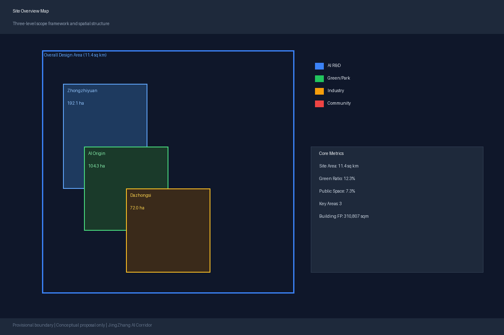
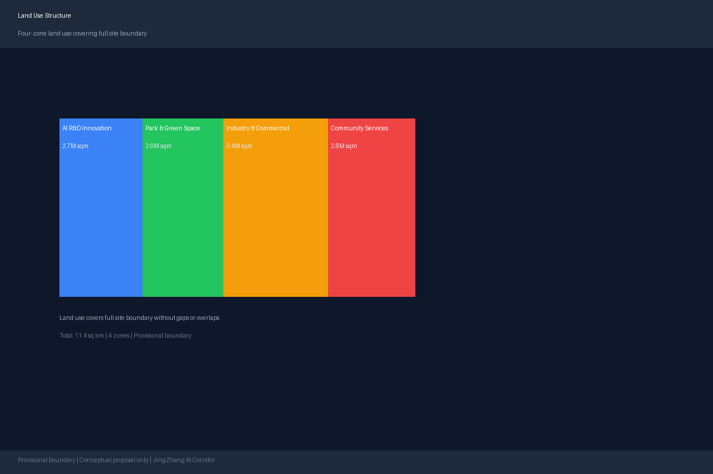
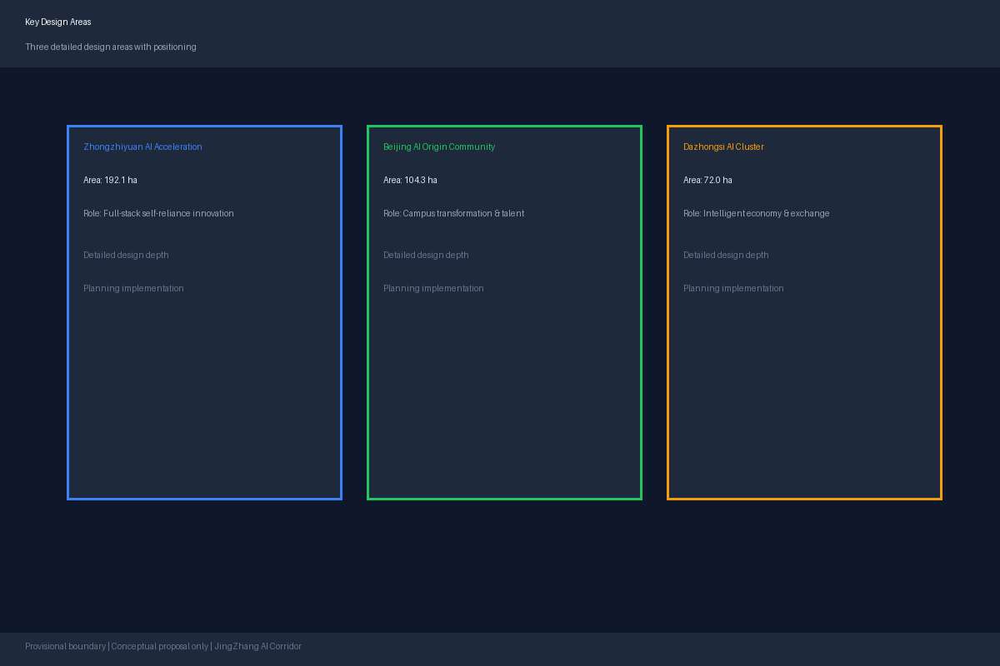
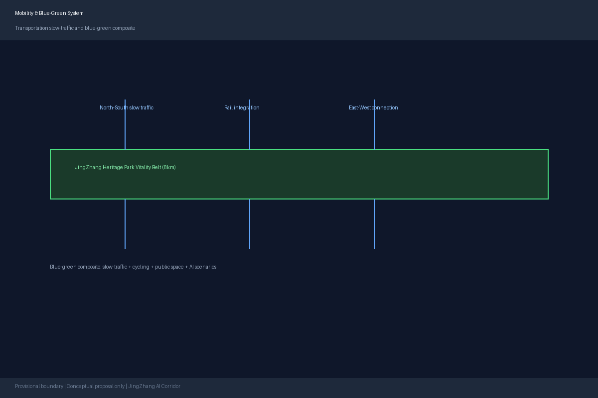
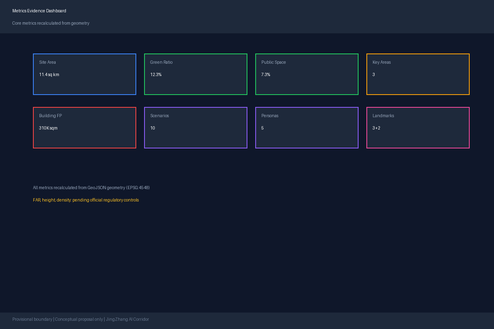

# JingZhang AI Corridor: An AI-Native Urban Innovation Belt on a Century-Old Railway

## Design Basis and Source Inventory

This formal proposal uses the Prequalification Announcement for the Centennial Jing-Zhang AI Innovation Belt Urban Design International Open Call issued by the Haidian Branch of the Beijing Municipal Commission of Planning and Natural Resources as its primary basis [source:OFFICIAL-ANNOUNCEMENT]. Machine-readable inputs include the provisional boundaries, key areas, enumerations, metrics, and source registry maintained by repository maintainers under `brief/site-package/` [source:SITE-PACKAGE]. Before generating the proposal, the agent read `design_brief.json`, `allowed_design_space.json`, `sources.json`, `enums/`, `ranges/`, `schemas/`, `data/source_registry.json`, and `data/processed/agent_fact_pack.md`, and used `project_scope_summary.csv`, `agent_task_requirements.csv`, `source_use_matrix.csv`, and `missing_data_checklist.csv` to build a task-scope-source-gap inventory [source:PROCESSED-FACT-PACK].

All design judgments are decomposed into traceable sources, recalculable metrics, verifiable layers, and human-reviewable assumptions. The announcement requires both regulatory-plan urban design depth and planning implementation plan urban design depth; therefore, narrative text cannot substitute for GeoJSON, metric tables, A3 booklets, A0 boards, and HTML digital deliverables.

The source registry usage boundaries are as follows [source:SOURCE-REGISTRY]:

- `data/source_registry.json` registers the usage boundaries of public, cleared, and provisional data.
- Current registry summary: 7 formal-usable sources, 1 background source, 1 provisional-only source.
- Agents must not upgrade background-only or provisional-only material to official boundaries, statutory controls, formal scoring evidence, or government implementation commitments.

The `data/processed/agent_fact_pack.md` serves as the reading navigation layer, not a new authoritative source [source:PROCESSED-FACT-PACK]. It helps agents organize the three-level scope, three key areas, announcement tasks, agent.1–agent.6, source usability, and missing-data items into a readable proposal; factual judgments must still reference the registered original materials [source:OFFICIAL-ANNOUNCEMENT] [source:AGENT-TASKBOOK].

This scaffold uses `brief/site-package/geometry/provisional_boundaries.geojson` when official `SITE_BOUNDARY` or `KEY_AREA` polygons are unavailable. The `geometry/site_boundary.geojson` and `geometry/key_areas.geojson` in the submission must be marked as `provisional_constraint` with `official_boundary=false`, usable only for proposal generation, self-check, visualization, and design discussion—they cannot serve as official redlines, approval bases, precise area calculations, or statutory control conclusions. This organizer data gap does not block content scoring; when official polygons are replaced, site boundary, key areas, land use, roads, green space, public space, buildings, phasing, and metrics must all be recalculated.

The current scaffold scoring status is: **provisional boundary, precision warnings preserved, recalibration required after official data release; does not block content scoring.**

Boundary references link to the overall scope layer and area recalculation [data:geometry/site_boundary.geojson#SITE-001] [metric:site_area_sqm]. The three key areas are verified by independent layers and count metrics [data:geometry/key_areas.geojson#PROV-KEY-001] [metric:key_area_count].

## Three-Level Scope Framework

The proposal organizes work according to three levels defined by the announcement: the coordinated research area (43.6 sq km) focuses on AI industrial ecosystem, strategic positioning, innovation chains, and future urban form; the overall design area (11.4 sq km, 1–2 km around the JingZhang Railway Heritage Park) requires an urban renewal framework, industrial spatial layout, transportation and municipal support, and urban character control; the key detailed design area (368.4 ha across three locations) requires functional programs, building scales, demolition/retention/renovation classifications, public space connectivity, and transportation organization. The three levels are mapped item-by-item in `compliance_matrix.json`, ensuring that announcement sections 1.3, 1.4, 1.5 and agent.1–agent.6 mandatory tasks all have corresponding chapters, layers, metrics, drawings, and HTML evidence.

| Level | Design Question | Proposal Response | Data Reference |
| --- | --- | --- | --- |
| Coordinated Research | How to organize AI industrial ecosystem and future urban form | Establish "university origin–open-source collaboration–enterprise transformation–public experience–international promotion" innovation chain | compliance_matrix.json, standard_matrix.json |
| Overall Design | How to depict industrial space, urban renewal, transport/municipal, and character | Land use, buildings, roads, green space, public space, and phasing layers jointly express | [data:geometry/land_use.geojson#LU-001], [data:geometry/roads.geojson#ROAD-001] |
| Key Areas | How three districts achieve detailed design depth | Propose positioning, spatial actions, AI scenarios, and implementation dependencies for each | [data:geometry/key_areas.geojson#PROV-KEY-001], [data:geometry/key_areas.geojson#PROV-002], [data:geometry/key_areas.geojson#PROV-KEY-003] |

The three levels are not disconnected drawing sets. Coordinated research determines the industrial chain and urban form judgments; overall design translates these into renewal projects, spatial structure, and facility capacity; key area detailed design verifies the feasibility of specific parcels, buildings, transportation, public spaces, and AI application scenarios.

## Coordinated Research Area: Industry and Future City Research

The core task of the coordinated research area is to build a world-class AI innovation ecosystem [source:OFFICIAL-ANNOUNCEMENT] [source:AGENT-TASKBOOK]. The proposal maps Haidian's university institutes, leading enterprises, computing-algorithm-data elements, incubation platforms, listed companies, unicorns, and technology service resources, and proposes a spatial coordination framework for the AI innovation chain, industrial chain, talent chain, and urban service chain [standard:PROJECT-AGENT-OPEN-CALL-TASKBOOK].

The naming scheme "JingZhang AI Corridor" (京张智廊) conveys the overlay of the century-old railway heritage and the AI innovation corridor. The logo design direction uses parallel railway lines as the base form, overlaid with data-flow and neural-network node imagery. The primary colors are "JingZhang Blue" (#1A5276, from railway signaling) and "Innovation Gold" (#F39C12, from Zhongguancun tech branding), supplemented by "Park Green" (#27AE60) for the blue-green space system [standard:PROJECT-AGENT-OPEN-CALL-TASKBOOK].

Coordinated research does not add pseudo-precise redlines; through [standard:MOHURD-URBAN-DESIGN-MEASURES] requirements for urban character, public space, and building layout coordination, it links back to [data:geometry/land_use.geojson#LU-001], [data:geometry/public_space.geojson#PUBLIC-001], and [depth:overall_spatial_structure].

The future urban form research addresses how AI changes work, life, socializing, learning, transportation, and public services. AI transportation systems, continuous green spaces, innovative service facilities, and international living atmospheres are grounded in locatable functional zones, nodes, corridors, and scenarios [source:AGENT-TASKBOOK].

### Global AI Innovation Ecosystem Cases (agent.2)

Eight global cases were studied to extract transferable spatial and operational mechanisms:

| Case | City | Core Lesson | Transferable Mechanism |
| --- | --- | --- | --- |
| Station F | Paris | Mega-scale startup community + enterprise residency | Origin community campus incubation + enterprise showcase |
| Kendall Square | Cambridge | Dense university-enterprise-capital synergy | Three-area-two-wing innovation chain spatial organization |
| Shenzhen Nanshan Tech Park | Shenzhen | Vertical industrial chain + rapid iteration | Zhongzhiyuan full-stack self-reliance innovation district |
| One North | Singapore | R&D-residential-commercial mixed use | Dazhongsi intelligent economy international exchange |
| Tel Aviv Hub | Tel Aviv | Open-source culture + military tech conversion | Open-source community + security governance showcase |
| Zhongguancun Inno Street | Beijing | Grassroots entrepreneurship + media | Developer community + public experience route |
| Hudson Yards | New York | Smart city infrastructure + public space | Edge computing + blue-green space AI scenarios |
| 22@Barcelona | Barcelona | Industrial district renewal + creative industry | Railway heritage renewal + AI cultural narrative |

## Overall Design Area: Urban Renewal at Regulatory-Plan Urban Design Depth

The overall design area requires regulatory-plan urban design depth [standard:MOHURD-CONTROL-DETAILED-PLANNING]. The proposal presents an urban renewal spatial structure, identifies underperforming spaces, provides a renewal project list, implementation policy suggestions, industrial function ratios, spatial organization patterns, total building scale, and comprehensive capacity assessment. `geometry/land_use.geojson` must fully cover the design boundary without gaps or overlaps; `geometry/buildings.geojson` expresses renewal or retained building footprints; `geometry/roads.geojson` expresses micro-circulation, slow traffic, and rail connections; `metrics.json` recalculates core areas, ratios, and layer counts.

The overall design must also support transportation, rail, municipal, and service facilities. Proposals should address rail station integration, road micro-cycling, non-motorized parking, parking supply, innovation service platforms, talent living services, new infrastructure, distributed energy, edge computing, and traditional municipal facility fusion. Content involving building height, development intensity, road redlines, setbacks, and facility standards must be written as "pending official regulatory condition confirmation" when official controls are unavailable [depth:land_use_layout] [depth:development_intensity_controls].

## Key Area Detailed Design

Key area detailed design is mandatory [standard:PROJECT-OFFICIAL-ANNOUNCEMENT]. Each key area must achieve planning implementation plan urban design depth [depth:three_key_area_detailed_design].

### Zhongzhiyuan AI Self-Reliance Innovation Acceleration Area

Positioned as a garden-type full-stack self-reliance innovation district. Design strengthens the Qinghe River interface, industrial showcase, low-carbon innovation exchange, and external transportation organization. Green spaces carry open testing and standards governance demonstration [data:geometry/key_areas.geojson#PROV-KEY-001].

Key spatial actions: Self-reliance model testing grounds, standards-setting workshops, security governance exhibition, low-carbon computing experience, Qinghe green corridor.

### Beijing AI Origin Community

Positioned as a campus-adjacent achievement transformation and talent community. Design organizes campus-district-block slow-traffic stitching, supplements achievement publishing, talent services, residential life, and open-source collaboration space [data:geometry/key_areas.geojson#PROV-KEY-002].

Key spatial actions: Open-source community hub, achievement publishing hall, talent service center, campus-district pedestrian corridor, rail station integration.

### Dazhongsi AI Industry Cluster

Positioned as an urban intelligent economy and international exchange district. Design centers on Dazhongsi Station integration, four-quadrant pedestrian connectivity, commercial services, and key enterprise public environment renewal [data:geometry/key_areas.geojson#PROV-KEY-003].

Key spatial actions: International roadshow living room, intelligent agent and smart terminal showcase, data element trading hall, station-area pedestrian network.

| Key Area | Design Positioning | Spatial Actions | AI Industrial & Operational Scenarios | Evidence |
| --- | --- | --- | --- | --- |
| Zhongzhiyuan | Garden-type full-stack self-reliance district | Strengthen Qinghe interface, industrial showcase, low-carbon exchange, external transport | Self-reliance model testing, standards workshops, security governance, low-carbon computing | [data:geometry/key_areas.geojson#PROV-KEY-001] |
| Beijing AI Origin | Campus-adjacent transformation & talent community | Campus-district-block slow-traffic stitching, achievement publishing, talent services | Open-source community, achievement publishing, talent services, campus incubation | [data:geometry/key_areas.geojson#PROV-KEY-002], [source:AGENT-TASKBOOK] |
| Dazhongsi | Urban intelligent economy & international exchange | Station integration, four-quadrant pedestrian connectivity, commercial renewal | Agent & smart terminal showcase, content consumption, data elements, international roadshow | [data:geometry/key_areas.geojson#PROV-KEY-003] |

## AI Innovation Ecosystem, Talent Profiles, and AI+ Scenarios (agent.3)

The proposal establishes spatial demand profiles for AI talent and enterprises, covering R&D offices, open-source collaboration, achievement publishing, enterprise services, talent residence, social learning, consumer life, sports leisure, and international exchange.

### Five User Personas

| Persona | Typical Needs | Spatial Response | Privacy Boundary |
| --- | --- | --- | --- |
| Open-source Developer | Publishing, collaboration, testing, community reputation | Origin community open-source hall, public code wall, night collaboration space | No individual behavior tracking; activity data aggregated only |
| Startup Team | Low-cost office, computing access, product testing | Zhongzhiyuan shared test ground, edge computing service, standards governance consultation | Computing and data services require separate authorization |
| Leading Enterprise Visitor | Showcase, business, international reception, talent recruitment | Dazhongsi international roadshow living room, rail station connection, public space near key enterprises | Enterprise logos and cases require clearance |
| Nearby Resident | Commute, leisure, community services, low-disturbance renewal | Heritage park slow-traffic loop, community service integration, night lighting & activity grading | Resident profiles not used for commercial recommendation |
| University Faculty/Student | Achievement transformation, cross-campus collaboration, daily commuting | Campus-district pedestrian stitching, achievement transformation hub, AI education experience | Campus data and research outputs require authorization |

### Ten AI Scenario Cards

| Card | Spatial Carrier | Description |
| --- | --- | --- |
| 01 Open-Source Publishing Hall | Beijing AI Origin Community | Achievement publishing, code contribution showcase, small roadshow for universities, open-source communities, startups |
| 02 Security Governance Sandbox | Zhongzhiyuan | Standards-setting, security evaluation, model red-team testing as visitable, bookable, supervised showcase |
| 03 Edge Computing Hub | Design-wide nodes | Public service, enterprise service, and low-carbon energy integration as new infrastructure prototype |
| 04 AI Slow-Traffic Navigation | Heritage Park vitality belt | Interpretable wayfinding and low-intrusion sensing for bottleneck, congestion, and accessibility identification |
| 05 Dazhongsi International Roadshow | Dazhongsi AI Cluster | Agent, smart terminal, and content consumption enterprise showcase, negotiation, media, and international exchange |
| 06 Qinghe Low-Carbon Innovation Corridor | Zhongzhiyuan Qinghe interface | Green space, stormwater, walking-cycling, and AI showcase as campus public living room |
| 07 Campus Achievement Transformation Street | Beijing AI Origin Community | Incubation, showcase, legal, IP, and investment services for university achievement transformation |
| 08 Data Element Trading Hall | Dazhongsi District | Data element and digital asset circulation urban service interface with compliance, authorization, and auditability |
| 09 AI Life Services Demo Street | Community-commercial intersection | Medical, education, legal, life services AI+ scenarios at operational small-block scale |
| 10 Global AI Activity Week Route | Belt-wide public space system | Walkable, communicable experience route from heritage culture to open-source community, industry showcase, and international roadshow |

AI governance suggestions follow data minimization, public sourcing, explainability, and human review principles. Urban intelligent agents can assist in identifying slow-traffic bottlenecks, public space thermal patterns, facility maintenance, enterprise service needs, and activity safety risks, but cannot replace planning approval, output unauthorized personal profiles, or claim official implementation commitments.

## Land Use, Building Scale, and Retain/Renovate/Demolish Strategy

The land use proposal follows public standards for national spatial survey, planning, and use control classification, forming complete, closed, gap-free land use zones [standard:MNR-LAND-USE-CLASSIFICATION-GUIDE]. The building proposal distinguishes retained, renovated, renewed, newly built, or pending-confirmation objects, with recommendations for building footprint, function, scale, character, roof, massing, and height control [depth:height_massing_character] [depth:retain_renovate_demolish].

Land use classification basis: [standard:MNR-LAND-USE-CLASSIFICATION-GUIDE]. Primary evidence: [data:geometry/land_use.geojson#LU-001], [data:geometry/buildings.geojson#BLDG-001], [metric:building_footprint_area_sqm].

## Transportation, Rail, Municipal, and Public Service Facilities

Transportation proposals address rail station integration, road micro-cycling, slow-traffic bottlenecks, external transportation, parking, non-motorized parking, and green transportation systems [depth:traffic_rail_slow_parking]. Key coverage areas: North Fifth Ring Road, heritage park cross-ring nodes, Wudaokou, Tsinghua East Road West Entrance, Dazhongsi Station, and key enterprise periphery transportation links.

Municipal and public service facilities cover AI industry service facilities, innovation service platforms, talent living service facilities, new infrastructure, distributed energy, edge computing, and traditional municipal facility fusion [depth:municipal_new_infrastructure].

## Blue-Green Space, Public Space, and Urban Character

Blue-green space proposals use the JingZhang Heritage Park vitality belt as the skeleton, coordinating Qinghe River, Xiaoyuehe River, surrounding universities, enterprises, and community travel needs to form a north-south through, east-west connected trail, cycling, and green space system [depth:blue_green_public_space].

The urban character proposal fuses JingZhang railway historical culture, Zhongguancun innovation culture, and AI new culture. The cultural narrative uses three interwoven timelines [source:AGENT-TASKBOOK]:

**Timeline 1: Century Railway Heritage** (1909–2009): From Zhan Tianyou's JingZhang Railway to railway retirement. Themes: self-reliance, engineering wisdom, national strength. Spatial carriers: heritage park, old station renovation, rail preservation.

**Timeline 2: Zhongguancun Innovation Culture** (1988–present): From electronics street to national innovation demonstration zone. Themes: grassroots innovation, open collaboration, tech transfer. Spatial carriers: origin community transformation street, Dazhongsi enterprise showcase.

**Timeline 3: AI New Culture** (2023–future): From large model explosion to AI-native city. Themes: human-agent collaboration, open co-creation, public interest. Spatial carriers: AI scenario nodes, developer community, pilgrimage landmarks.

### AI Pilgrimage Landmarks (agent.4)

**Landmark 1: Open Source Achievement Gallery** — Along the heritage park mid-section, displaying global open-source AI milestones, contributors, and code fragments as a linear gallery + outdoor interactive installation.

**Landmark 2: Agent Contribution Honor Wall** — At Beijing AI Origin Community core plaza, recording AI agents contributing to urban design and governance with digital screens + physical plaques.

**Landmark 3: AI Milestone Monument** — At Zhongzhiyuan Qinghe interface, physical installation + AR augmentation showing AI development key nodes, fusing railway signal light forms with neural network imagery.

## Renewal Project List, Implementation Policies, and Phasing

| Project ID | Project Name | Type | Key Dependencies | Evidence |
| --- | --- | --- | --- | --- |
| JZ-01 | Heritage Park slow-traffic bottleneck stitching | Public space/transport | Road redline, under-bridge space, traffic organization review | [data:geometry/roads.geojson#ROAD-001] |
| JZ-02 | Zhongzhiyuan Qinghe innovation interface | Blue-green/industry | River blue line, ecological and flood control conditions | [data:geometry/green_space.geojson#GREEN-001] |
| JZ-03 | Origin community campus transformation street | Urban renewal/industry | Campus boundary, ownership, ground-floor use | [data:geometry/buildings.geojson#BLDG-001] |
| JZ-04 | Dazhongsi Station four-quadrant pedestrian connectivity | Rail integration/slow-traffic | Rail station, road intersection, municipal pipelines | [data:geometry/public_space.geojson#PUBLIC-001] |
| JZ-05 | AI public service & edge computing nodes | New infra/public service | Energy, computing, safety, and operational entity | [data:geometry/constraints.geojson#CONSTRAINTS] |
| JZ-06 | Global AI Activity Week public route | Operations/brand | Public space permits, activity safety, copyright clearance | [data:geometry/phasing.geojson#PHASE-001] |

### Global AI Activity System and Long-Term Operations (agent.6)

**Annual Brand Activities:** Global AI Activity Week (October, 7 days), JingZhang AI Innovation Challenge (global developers), Agent Contribution Awards (annual, results carved into honor wall).

**Developer Community Operations:** Open-source contribution credit system, developer residency program (20 global teams/year, 1–3 months), monthly tech salons rotating AI+ themes.

**Scenario Opening Mechanism:** Quarterly public scenario open days, pilot sandbox testing in Zhongzhiyuan, daily AI scenario experience routes connecting three key areas.

All activities, investment, funding, policies, and operational arrangements are conceptual proposals or deepening directions, not confirmed government arrangements.

## Metrics System, Area Recalculation, and Compliance Matrix

Core metrics recalculated from geometry:

| Metric | Value | Unit | Source | Status |
| --- | --- | --- | --- | --- |
| Site area | 11,412,825 | sqm | site_boundary.geojson | Known (provisional) |
| Green ratio | 12.3% | ratio | green_space.geojson / site_boundary.geojson | Known |
| Public space ratio | 7.3% | ratio | public_space.geojson / site_boundary.geojson | Known |
| Key area count | 3 | count | key_areas.geojson | Known |
| Building footprint | 310,807 | sqm | buildings.geojson | Known |
| Floor area ratio | — | ratio | pending official controls | Unknown |
| Building height | — | m | pending official controls | Unknown |

The compliance matrix maps every announcement task and agent_taskbook requirement to report chapters, layers, metrics, drawings, HTML pages, sources, assumptions, and self-check items.

## Risk, Copyright, and Compliance Statement

**Bilingual requirement.** The primary file may use Chinese or English, but must provide a complete counterpart translation as `proposal.en.md` or `proposal.zh.md`. All images, drawings, icons, data, and code assets must declare source, license, and authorization status in `sources.json` or `report/copyright_statement.md`. HTML pages must not load remote scripts, map tiles, fonts, iframes, forms, or external APIs.

This proposal does not claim official approval, statutory regulatory control, final land ownership, final construction scale, or guaranteed implementation. The AI agent is responsible for facts, sources, copyright, spatial data, metrics, and expression; maintainers and professional reviewers may request repairs or rejection based on self-check results, spatial review, and compliance matrix requirements.

## References

- brief/public-brief.md
- brief/site-package/design_brief.json
- brief/site-package/allowed_design_space.json
- brief/site-package/enums/
- brief/site-package/ranges/planning_limits.json
- data/processed/agent_fact_pack.md
- data/processed/project_scope_summary.csv
- data/processed/agent_task_requirements.csv
- data/processed/source_use_matrix.csv
- data/processed/missing_data_checklist.csv
- Full machine indexes: see `sources.json`, `metrics.json`, `compliance_matrix.json`, `standard_matrix.json`, `design_depth_matrix.json`
