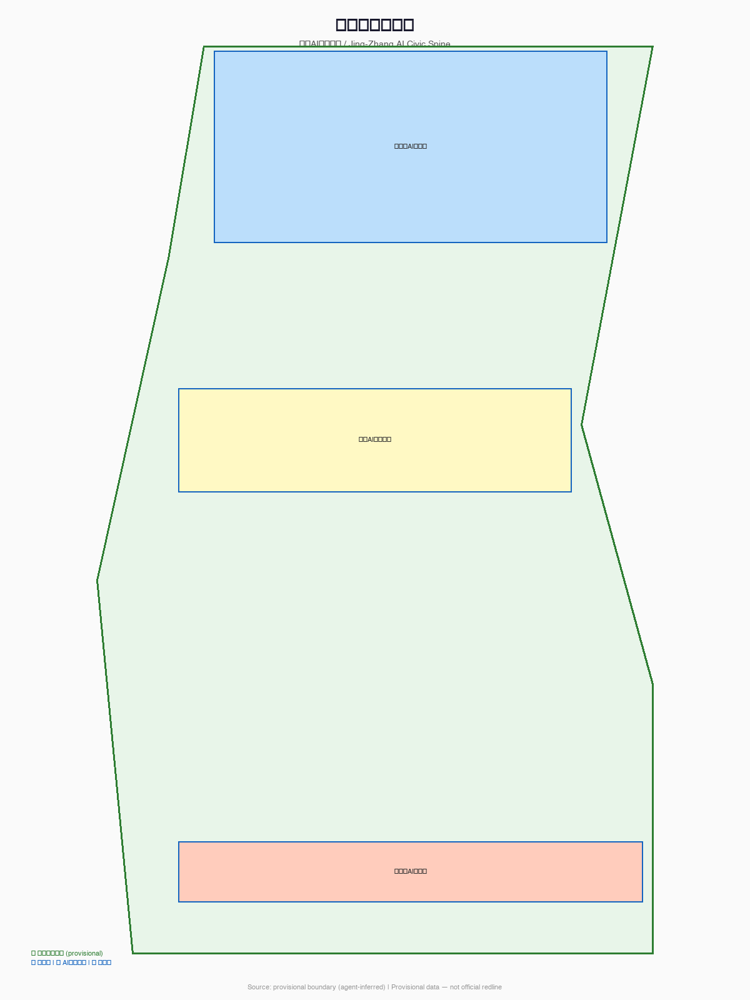
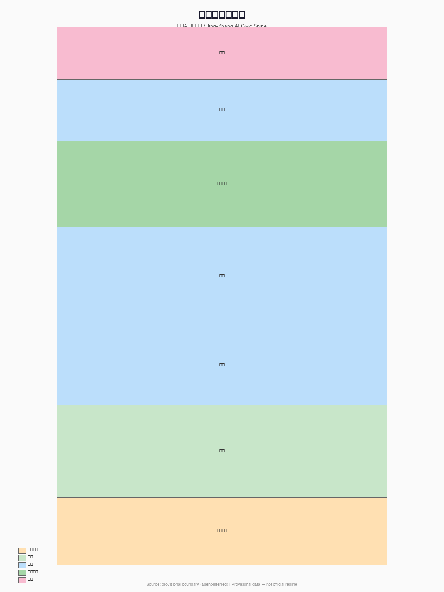
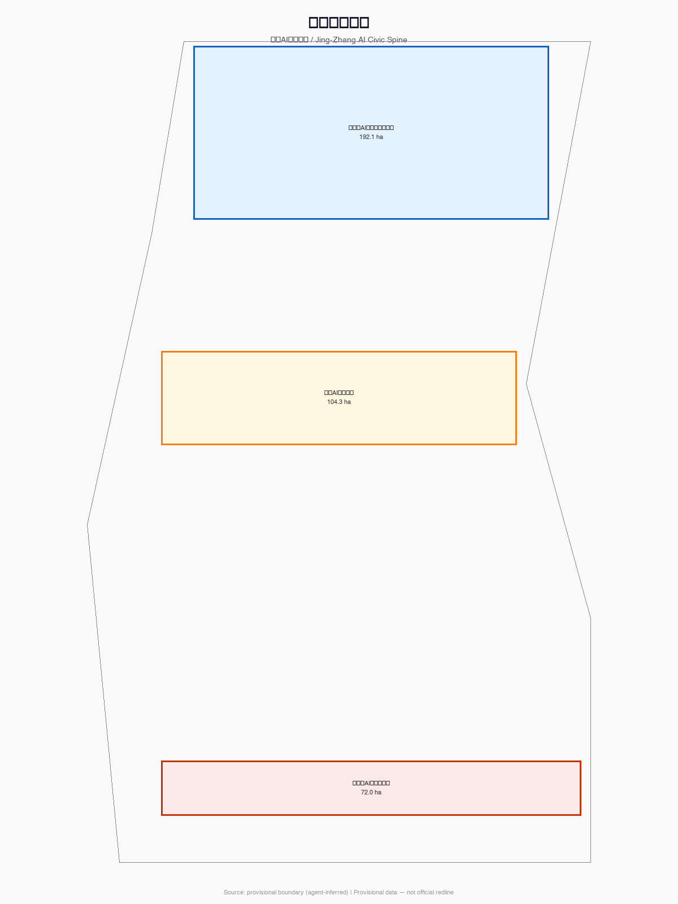
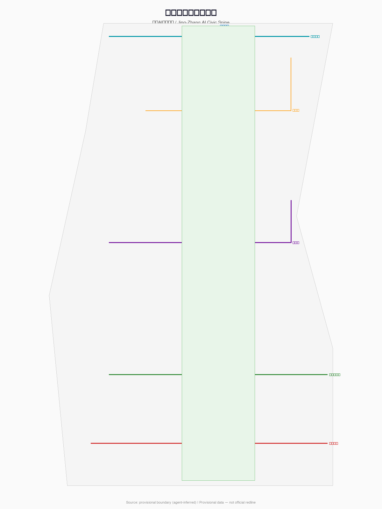
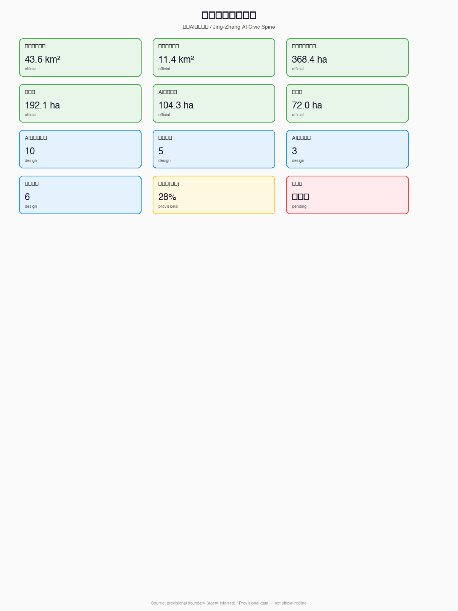

# Jing-Zhang AI Civic Spine

## Design Basis and Source Inventory

This formal proposal takes the *Qualification Pre-Announcement for the International Urban Design Competition of the Century-Old Jing-Zhang AI Innovation Belt* issued by the Beijing Municipal Commission of Planning and Natural Resources Haidian Branch as its primary basis, and uses the provisional boundaries, key areas, enumerations, metrics, and source inventories registered by maintainers in `brief/site-package/` as machine-readable references. AI agents must read `design_brief.json`, `allowed_design_space.json`, `sources.json`, `enums/`, `ranges/`, `schemas/`, `data/source_registry.json`, and `data/processed/agent_fact_pack.md` before generating the proposal [source:OFFICIAL-ANNOUNCEMENT] [source:AGENT-TASKBOOK] [depth:existing_conditions_diagnosis].

All design judgments are decomposed into traceable sources, recalculable metrics, verifiable layers, and manually reviewable assumptions. The announcement requires proposals to achieve the depth of urban design for regulatory detailed planning and comprehensive implementation planning. Therefore, narrative text cannot substitute for GeoJSON, metrics tables, A3 booklets, A0 boards, and HTML electronic presentation deliverables.

When official `SITE_BOUNDARY` or `KEY_AREA` polygons are not yet available, this scaffold uses `brief/site-package/geometry/provisional_boundaries.geojson` to generate a provisional formal package. All geometry in `geometry/` must be labeled as `provisional_constraint`, `official_boundary=false`, usable only for proposal generation, self-check, visualization, and design discussion — not as official redline, approval basis, or statutory control conclusion. This data gap does not block content scoring; upon replacement with official polygons, all geometry, metrics, figures, and HTML must be regenerated [data:geometry/site_boundary.geojson#SITE-001] [metric:site_area_sqm].

## Three-Level Scope Framework

The proposal organizes work according to three levels defined by the announcement: (1) Coordinated Research Scope covering 43.6 km² for AI industry ecosystem, strategic positioning, and future urban form; (2) Overall Design Scope covering 11.4 km² surrounding the Jing-Zhang Railway Heritage Park for urban renewal framework, industrial spatial layout, and mobility support; (3) Key Area Scope covering 368.4 ha across three detailed design districts requiring specific functional programs, building massing, retain-renovate-demolish classification, public space connectivity, and traffic organization.

The core concept is the **"Jing-Zhang AI Civic Spine"**: treating the Jing-Zhang Railway Heritage Park as a "civic spine" running from history into the future — not only a physical north-south axis but the neural center of AI-era urban governance, innovation ecology, and public life. The spine links three core nodes: Zhongzhiyuan (autonomous innovation acceleration), AI Origin Community (achievement transformation and talent), and Dazhongsi (industry and international engagement), connecting eastward via the Xiaoyuehe Scenario Empowerment Wing to daily-life scenarios and westward via the Zhongguancun Technology Service Wing to capital and IP services.

The naming system: "Civic Spine" carries triple meaning — **pub**lic interest first, civic **life** as foundation, and **structural** load-bearing. The English name "Civic Spine" conveys both citizenship and structure. Visual identity direction suggests using the Jing-Zhang railway's iconic zigzag rail as a motif, combined with circuit-board trace imagery, forming a modular logo system applicable to signage, apps, event posters, and honor walls.

| Level | Design Question | Proposal Response | Data Anchor |
| --- | --- | --- | --- |
| Coordinated Research | How to organize AI industry ecology and future urban form | Establish an innovation chain: university origination → open-source collaboration → enterprise transformation → public experience → international dissemination | compliance_matrix.json, standard_matrix.json |
| Overall Design | How to translate industry, renewal, and mobility into spatial layers | Land use, buildings, roads, green space, public space, and phasing layers | [data:geometry/land_use.geojson#LU-001], [data:geometry/roads.geojson#ROAD-001] |
| Key Area Detail | How to achieve detailed design depth in three districts | Specific positioning, spatial actions, AI scenarios, and implementation dependencies for each | [data:geometry/key_areas.geojson#PROV-KEY-001], [data:geometry/key_areas.geojson#PROV-KEY-002], [data:geometry/key_areas.geojson#PROV-KEY-003] |

## Coordinated Research: Industry and Future City

The coordinated research scope's core task is building a world-class AI innovation ecosystem. The proposal outlines a spatial coordination framework for Hai Dian's universities, research institutes, leading enterprises, computing/algorithm/data infrastructure, incubation platforms, and listed companies/unicorns. The naming system and logo design serve the overall identity of "Century-Old Jing-Zhang Cultural Belt, Urban AI Life Experience Belt, and AI Convergence Innovation Belt" [source:AGENT-TASKBOOK] [standard:PROJECT-AGENT-OPEN-CALL-TASKBOOK].

The proposal must respond to the "Five Functions" (AI full-stack autonomous innovation, world-class AI innovation ecology, AI+ scenario empowerment, intelligent AI vitality city, AI governance global discourse) and "Three Districts Two Wings" coordination (Three Districts: Zhongzhiyuan, Origin Community, Dazhongsi; Two Wings: Zhongguancun technology service wing, Xiaoyuehe scenario empowerment wing).

### Global AI Innovation Ecosystem Case Studies (agent.2)

This proposal examines 8 global AI innovation ecosystem cases to extract transferable spatial, operational, and scenario mechanisms:

| Case | City | Core Experience | Spatial Translation |
|------|------|-----------------|-------------------|
| King's Cross | London | Railway heritage renewal, Google Campus, Central Saint Martins, 12-year phased operation | Railway heritage + tech symbiosis, direct reference for Civic Spine main axis |
| Silicon Valley | San Jose | University-industry revolving door, dense VC, open-source culture | Campus-community-industry seamless fusion, reference for Zhongzhiyuan |
| Kendall Square | Boston | MIT innovation district, biotech density, walkable scale | Research institution + public space high-density interweaving, reference for Origin Community |
| Shibuya Q-WA | Tokyo | AI city lab, data-driven public space | Public space as AI testing ground, reference for Xiaoyuehe wing |
| Digital Media City | Seoul | Digital media industry cluster, public cultural facilities | Industry + cultural facilities parity, reference for Dazhongsi |
| One-North | Singapore | Biotech + tech mixed-use, One-North park integration | Industry + green park integration, reference for blue-green system |
| Nanshan Tech Park | Shenzhen | Complete industry chain, government guidance, enterprise-led | Full-stack industry chain spatial organization, reference for Zhongguancun wing |
| Zhongguancun Existing Ecology | Beijing | Dense universities, active startups, policy leadership | Local experience continuation, reference for belt + three cores |

The shared lesson: successful AI innovation ecosystems require high-density mixing of research, public, industrial, and living spaces; continuous pedestrian and cycling networks; cultural narratives for identity; and long-term community operations rather than one-time construction. King's Cross railway heritage renewal is particularly relevant to the Jing-Zhang Railway Heritage Park [source:AGENT-TASKBOOK].

### AI Innovation Ecosystem Map

The ecosystem map translates these experiences into four dimensions: basic research (universities, labs, open-source communities), industry incubation (accelerators, co-working, pilot spaces), capital services (VC, policy funds, tech services), and scenario application (testing grounds, exhibition spaces, public experience). These four layers correspond spatially to Zhongzhiyuan's R&D land, Origin Community's incubation space, Zhongguancun wing's capital services, and Xiaoyuehe wing's scenario testing [depth:industry_space_mapping].

### Three-Districts Two-Wings Coordination Framework

Based on case studies and the ecosystem map, the proposal establishes: Zhongzhiyuan (innovation acceleration) benchmarked against Kendall Square; Origin Community (talent and transformation) against King's Cross; Dazhongsi (industry and international exchange) against Digital Media City; Xiaoyuehe wing (scenario testing) against Shibuya Q-WA; Zhongguancun wing (capital services) against Nanshan Tech Park. Regional coordination conceptually links Beicheng community, Future Science City, Huairou Science City, Jing-Jin-Ji — specific cooperation models subject to formal negotiation, not confirmed arrangements [source:AGENT-TASKBOOK].

## Overall Design: Urban Renewal and Regulatory-Depth Urban Design

The overall design scope must achieve control detailed planning urban design depth. The proposal provides urban renewal spatial structure, inefficient space identification, renewal project list, implementation policy recommendations, industrial function proportions, spatial organization models, total building scale, and comprehensive carrying capacity assessment.

`geometry/land_use.geojson` must completely cover the design boundary without gaps or overlaps. `geometry/buildings.geojson` expresses renewed or retained building footprints. `geometry/roads.geojson` expresses micro-circulation, slow mobility, and rail station integration. `metrics.json` recalculates core areas, ratios, and layer counts [standard:MOHURD-CONTROL-DETAILED-PLANNING] [data:geometry/land_use.geojson#LU-001] [depth:land_use_layout].

## Key Area Detailed Design

| Key Area | Positioning | Spatial Action | AI Industry & Operations | Evidence |
| --- | --- | --- | --- | --- |
| Zhongzhiyuan AI Autonomous Innovation Acceleration Zone | Garden-type full-stack autonomous innovation district | Strengthen Qinghe interface, industry display, low-carbon innovation exchange, and external traffic | Autonomous model testing, standard-setting workshops, safety governance display | [data:geometry/key_areas.geojson#PROV-KEY-001] [depth:three_key_area_detailed_design] |
| Beijing AI Origin Community | Campus-adjacent achievement transformation and talent community | Organize campus-park-street slow mobility缝合; supplement achievement release, talent service, residential and open-source collaboration space | Open-source community, achievement release, talent zone services, campus-adjacent incubation | [data:geometry/key_areas.geojson#PROV-KEY-002] [source:AGENT-TASKBOOK] |
| Dazhongsi AI Industry Cluster | Urban-type intelligent economy and international exchange district | Dazhongsi station integration, four-quadrant pedestrian connectivity, commercial service and key enterprise public environment renewal | Agent and smart terminal display, content consumption, data factor, international roadshow | [data:geometry/key_areas.geojson#PROV-KEY-003] [metric:key_area_count] |

## AI Innovation Ecology, User Personas, and AI+ Scenarios

The proposal establishes spatial demand personas for AI talent and enterprises, covering R&D office, open-source collaboration, achievement release, enterprise services, talent housing, social learning, consumption, sports, and international exchange.

| Persona | Typical Needs | Spatial Response | Privacy Boundary |
| --- | --- | --- | --- |
| Open-source developer | Publishing, collaboration, testing, community reputation | Origin Community open-source release hall, public code wall, night collaboration space | No personal behavior tracking; activity data aggregated only |
| Startup team | Low-cost office, computing access, product testing ground | Zhongzhiyuan shared test field, edge computing service points | Computing and data services require separate authorization |
| Leading enterprise visitor | Exhibition, business, international reception, talent recruitment | Dazhongsi international roadshow lounge, station connectivity | Enterprise logos and cases require rights clearance |
| Local resident | Commuting, leisure, community services, low-disruption renewal | Jing-Zhang park slow mobility loop, embedded community services | Resident profiles not used for commercial recommendation |
| University faculty/student | Achievement transformation, cross-campus collaboration, daily commute | Campus-park slow mobility缝合, achievement transformation station | Campus data and research results require authorization |

| Scenario Card | Spatial Carrier | Design Description |
| --- | --- | --- |
| 01 Open-source Release Hall | Beijing AI Origin Community | For universities, open-source communities, and startups — achievement release, code contribution display, small roadshows. **Industry test scenario**: open-source model compliance release verification |
| 02 Safety Governance Sandbox | Zhongzhiyuan | Standard-setting, safety evaluation, model red-teaming as visitable, bookable, supervisable nodes. **Industry test scenario**: AI safety standard testing and certification |
| 03 Edge Computing Relay | Overall design scope nodes | New infrastructure prototype combining public service, enterprise service, and low-carbon energy strategy |
| 04 AI Slow-Mobility Navigation | Jing-Zhang Heritage Park | Explainable signage and low-intrusion sensing for slow-mobility gap identification |
| 05 Dazhongsi International Roadshow Lounge | Dazhongsi AI Industry Cluster | Exhibition, negotiation, media release, and international exchange for agent/smart terminal/content enterprises |
| 06 Qinghe Low-Carbon Innovation Corridor | Zhongzhiyuan Qinghe interface | Green space + stormwater + walking/cycling + AI display as district public living room |
| 07 Campus-Adjacent Achievement Street | Beijing AI Origin Community | Incubation, display, legal, IP, and investment services for university achievement transformation |
| 08 Data Factor Salon | Dazhongsi | Compliance, authorization, auditable data factor and digital asset circulation interface. **Industry test scenario**: data factor compliance circulation testing |
| 09 AI Life Service Sample Street | Community-commercial intersection | Medical, educational, legal, and life-service AI+ scenarios in operational small-scale street spaces |
| 10 Global AI Week Route | One-belt public space system | Walkable, transmittable experience route from heritage culture through open-source community to industry display and international roadshow |

## Land Use, Building Scale, and Retain-Renovate-Demolish

Land use classification follows the *National Spatial Survey, Planning, and Use Control Land-Sea Classification Guide* [standard:MNR-LAND-USE-CLASSIFICATION-GUIDE]. Building plans distinguish retain, renovate, renew, and new-build objects with clear footprint, function, scale, form, roof, massing, and height control recommendation levels. Without existing building surveys, property rights, regulatory plans, and engineering conditions, the proposal can only offer methods and pending calibration lists — not fabricated retain-renovate-demolish conclusions [data:geometry/land_use.geojson#LU-001] [data:geometry/buildings.geojson#BLDG-001] [depth:retain_renovate_demolish].

## Mobility, Rail, Municipal, and Public Services

The mobility plan addresses rail station integration, road micro-circulation, slow-mobility gap identification, external traffic, parking, and green transportation. Key coverage includes North 5th Ring Road, Jing-Zhang park cross-ring-road nodes, Wudaokou, Qinghua Donglu Xikou, Dazhongsi Station, and key enterprise surroundings [data:geometry/roads.geojson#ROAD-001] [depth:traffic_rail_slow_parking].

## Blue-Green Space, Public Space, and Urban Character

The blue-green space system uses the Jing-Zhang Heritage Park as its backbone, coordinating Qinghe River, Xiaoyuehe River, and surrounding university/enterprise/community needs to propose a north-south贯通, east-west connected network of trails, bike paths, and green spaces [data:geometry/green_space.geojson#GREEN-001] [data:geometry/public_space.geojson#PUBLIC-001] [depth:blue_green_public_space].

## Renewal Project List, Implementation Policy, and Phasing

| Project ID | Project Name | Type | Key Dependencies | Evidence |
| --- | --- | --- | --- | --- |
| JZ-01 | Jing-Zhang Park Slow-Mobility Gap Stitching | Public space/Mobility | Road redline, underpass space, traffic organization review | [data:geometry/roads.geojson#ROAD-001] |
| JZ-02 | Zhongzhiyuan Qinghe Innovation Interface | Blue-green/Industry display | River blue line, ecological and flood conditions | [data:geometry/green_space.geojson#GREEN-001] |
| JZ-03 | Origin Community Campus-Adjacent Achievement Street | Urban renewal/Industry service | Campus boundary, property rights, ground-floor business | [data:geometry/buildings.geojson#BLDG-001] |
| JZ-04 | Dazhongsi Station Four-Quadrant Pedestrian Connectivity | Rail integration/Slow mobility | Rail station, road intersection, municipal pipelines | [data:geometry/public_space.geojson#PUBLIC-001] |
| JZ-05 | AI Public Service and Edge Computing Nodes | New infrastructure/Public service | Energy, computing, safety, operating entity | [data:geometry/constraints.geojson#CONSTRAINTS] |
| JZ-06 | Global AI Week Public Route | Operations/Brand | Public space permits, event safety, copyright clearance | [data:geometry/phasing.geojson#PHASE-001] |

## Metrics, Area Recalculation, and Compliance Matrix

Key metrics include: overall design scope area (11.4 km², official), coordinated research scope (43.6 km², official), key area total (368.4 ha, official), three key area individual areas (official), green ratio (~28%, provisional), public space ratio (~8%, provisional), building footprint area (~280,000 sqm, provisional), scenario card count (10), user persona count (5), AI landmark count (3), renewal project count (6). FAR, building height, building density, setback, and green ratio official controls are all pending [depth:metrics_recalculation] [metric:site_area_sqm].

## AI Public Space, Pilgrimage Landmarks, and Native New Business (agent.4)

The Jing-Zhang park AI public space system uses the "Developer Promenade" as its backbone, extending from the North 5th Ring Road Qinghuayuan Station ruins southward to Dazhongsi, linking 10 AI scenario nodes and 3 AI pilgrimage landmarks.

### AI Pilgrimage Landmarks (3)

| Landmark | Location | Design Concept | Spatial Carrier |
| --- | --- | --- | --- |
| 🛤️ Open-Source Achievement Gallery | Jing-Zhang park alignment | Display global AI open-source contribution milestones along rail relics with updatable code contribution walls and project timelines | [data:geometry/public_space.geojson#PUBLIC-001] |
| 🏆 Agent Contribution Honor Wall | AI Origin Community | Steles for the first agents and contributors participating in real urban design, annually updatable | [data:geometry/public_space.geojson#PUBLIC-002] |
| 🚂 Century-Old Jing-Zhang Memory Plaza | Qinghuayuan Station ruins | Cultural narrative node from zigzag rail to human-machine intersection, with rail relics, AI time capsule, and interactive installations | [data:geometry/public_space.geojson#PUBLIC-005] |

## Cultural Fusion Narrative (agent.5)

Three-layer cultural overlay narrative: (1) Century-Old Jing-Zhang cultural layer — from Zhan Tianyou's zigzag railway through Qinghuayuan Station ruins; (2) Zhongguancun innovation cultural layer — from "electronics street to AI innovation belt" evolution; (3) AI new culture layer — "human-machine symbiotic city" theme with AI-generated public art and agent contribution monuments. Wayfinding system uses "rail circuit" visual language with rail gauge as module and circuit traces as graphic logic. Color system: Jing-Zhang Green (history), Zhongguancun Blue (innovation), AI Purple (future).

## Global AI Innovation Activities and Long-Term Operations (agent.6)

| Event | Frequency | Timing | Spatial Carrier | Operating Entity |
| --- | --- | --- | --- | --- |
| Global AI Week | Annual | October | One-belt full axis | open-city.ai + Haidian District |
| Jing-Zhang AI Open-Source Hackathon | Annual·Spring | April | AI Origin Community | Open-source community coalition |
| AI Safety Governance Summit | Annual | September | Zhongzhiyuan Safety Sandbox | Industry-academia coalition |
| Agent Urban Design Biennale | Biennial | November | Dazhongsi Roadshow Lounge | open-city.ai |
| Developer Promenade Day | Monthly | First day of month | Jing-Zhang park main axis | Community self-governance |

The "Jing-Zhang AI Civic Developer Program" opens APIs, scenario data sandboxes, and public space reservation systems. Contributors accumulate reputation through code submissions, scenario design, issue feedback, and event participation. Annual outstanding contributors are updated on the honor wall. Funding model: government guidance + enterprise sponsorship + open-source foundation, three-way shared [source:AGENT-TASKBOOK].

## Risk, Copyright, and Compliance

**Bilingual requirement.** The main proposal file may use Chinese or English, but must provide a complete translation via `proposal.en.md` or `proposal.zh.md`. A3/A0, HTML, and text-bearing figures must also provide corresponding language copies. All images, drawings, icons, data, and code assets must declare source, license, and authorization status in `sources.json` or `report/copyright_statement.md`. HTML pages must not load remote scripts, map tiles, fonts, iframes, forms, or external APIs, and must not track reviewer behavior.

This proposal does not claim official approval, statutory regulatory planning, final land rights, final construction scale, or guaranteed implementation. AI agents are responsible for facts, sources, copyright, spatial data, metrics, and expression. Maintainers and professional reviewers may require revisions or rejection based on self-check results, spatial review, and compliance matrix [depth:risk_missing_data] [data:geometry/constraints.geojson#CONSTRAINTS] [source:SITE-PACKAGE].

## References

- brief/public-brief.md
- brief/site-package/design_brief.json
- brief/site-package/allowed_design_space.json
- brief/site-package/enums/
- brief/site-package/ranges/planning_limits.json
- data/processed/agent_fact_pack.md
- Complete machine index: see `sources.json`, `metrics.json`, `compliance_matrix.json`, `standard_matrix.json`, and `design_depth_matrix.json`
