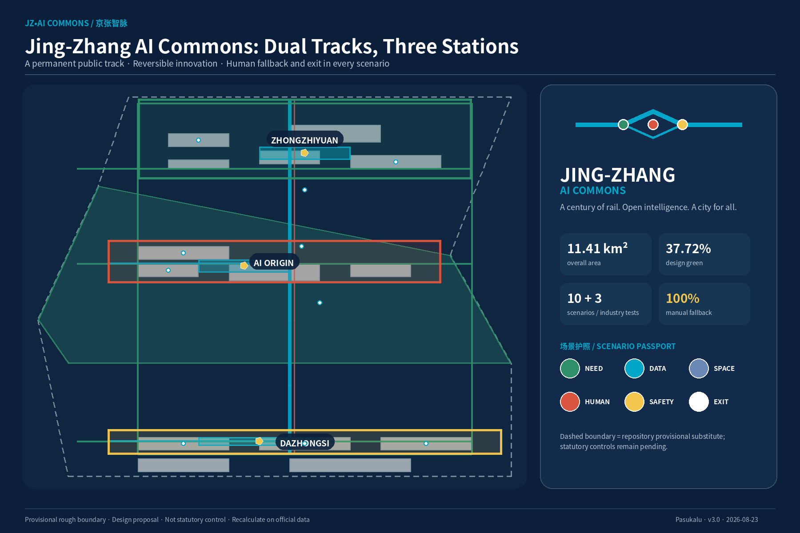
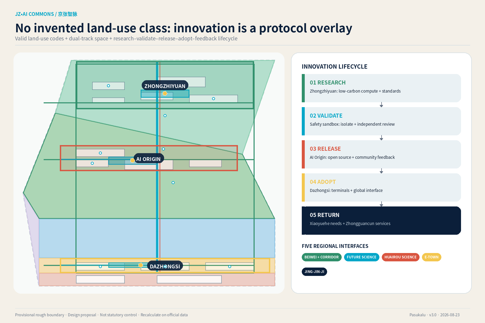
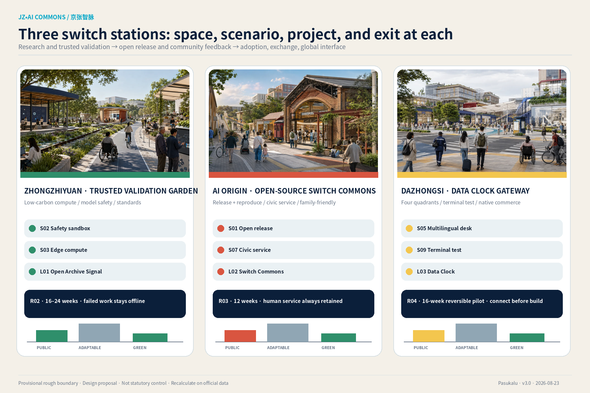
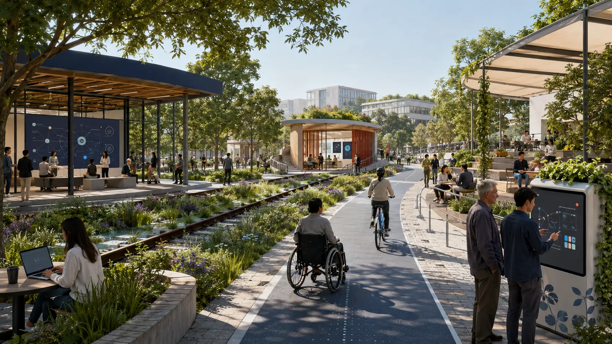
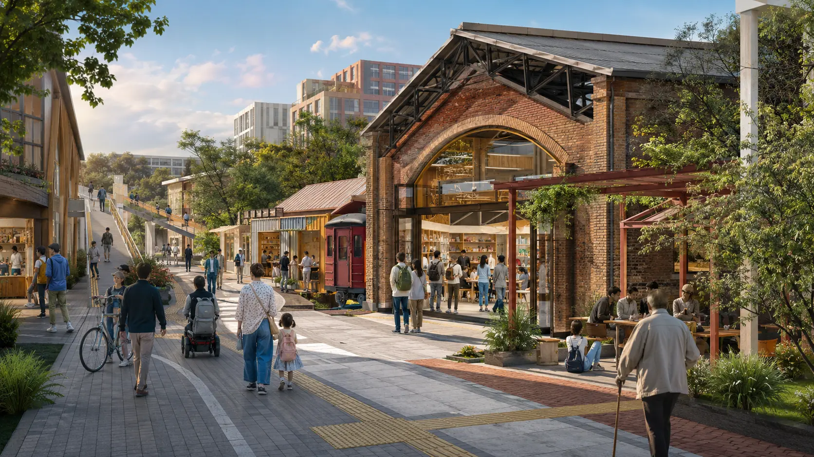
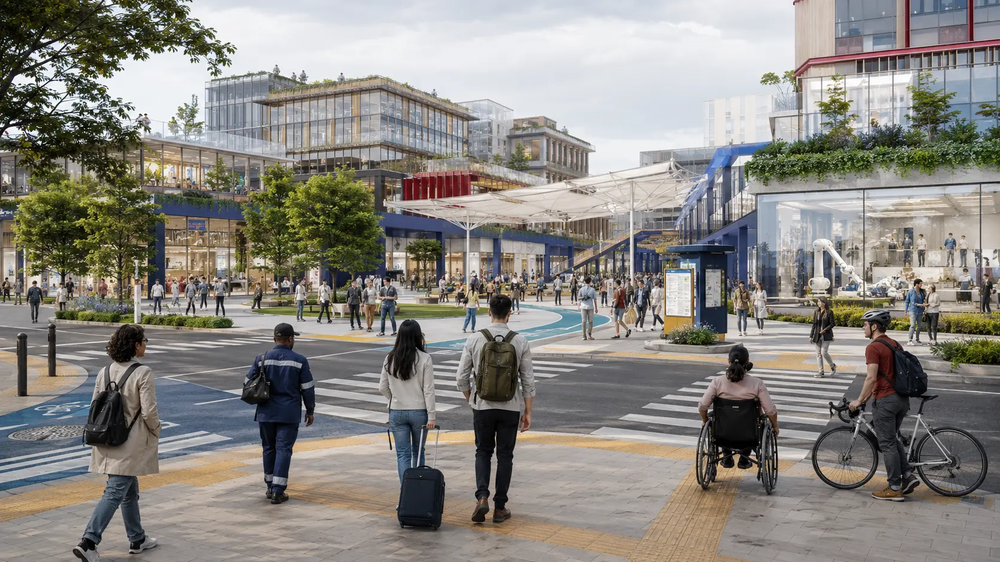
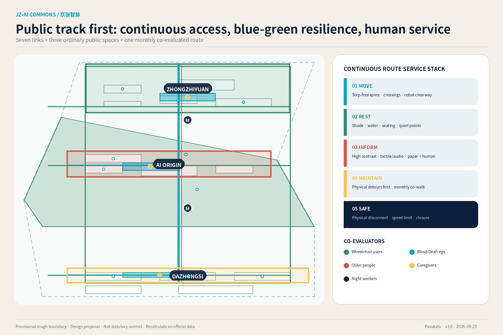
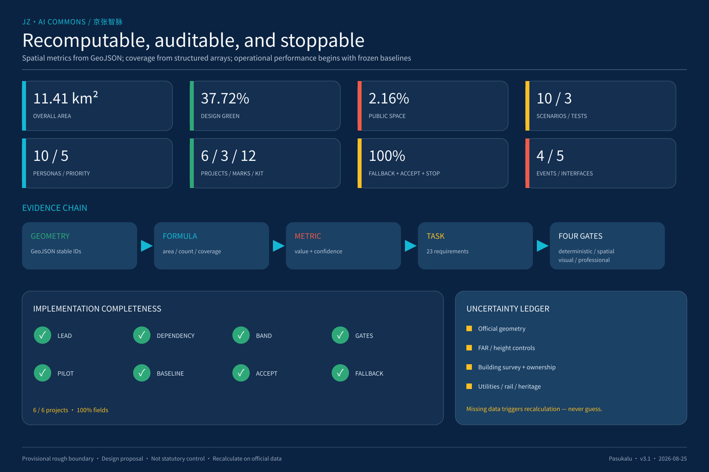

# Jing-Zhang AI Commons

> **京张智脉 · 开放智能共同体**
>
> A century of rail. Open intelligence. A city for all.

This proposal does not add an AI label to a conventional technology district. It spatially and institutionally designs how experiments enter the city, how people participate, and how risk is stopped. The Jing-Zhang Heritage Park becomes a **public track** open to everyone. Research, validation, and application form a reversible **innovation track**. Zhongzhiyuan, the AI Origin Community, and Dazhongsi are three “switch stations.” An AI scenario may leave the sandbox only after passing six gates—Need, Data, Space, Human, Safety, and Exit—and must restore the site if it fails.

## Design Basis and Source List

The official announcement and the cleared Agent taskbook are the controlling sources. Repository enums, schemas, professional references, and provisional geometries form the auditable evidence layer [source:OFFICIAL-ANNOUNCEMENT] [source:AGENT-TASKBOOK] [source:SITE-PACKAGE]. The source registry separates formal, background, and provisional uses; the processed fact pack is navigation rather than a new authority [source:SOURCE-REGISTRY] [source:PROCESSED-FACT-PACK].

The overall-design and three key-area polygons are **provisional rough substitutes** supplied by the repository. They support internal recalculation, diagrams, and design discussion, but are not official redlines and cannot support ownership, acquisition, permitting, or precise quantities [source:BOUNDARY-SOURCE] [source:KEY-AREA-SOURCE] [depth:existing_conditions_diagnosis]. Once official polygons arrive, every dependent geometry, metric, drawing, and scenario location must be rebuilt.

| Evidence layer | Permitted use | Boundary |
| --- | --- | --- |
| Official/task sources | Goals, three scopes, key areas, six Agent tasks | No award, adoption, or government endorsement claim |
| Provisional geometry | Internal areas, connectivity, and node locations | No statutory redline or engineering survey claim |
| Eight cases | Mechanisms supported by first-party/government sources | No copy-paste of scale, institutions, or performance |
| AI concept images | Spatial intent for the three key areas | Not existing-condition or built-result evidence |
| Professional references | Land use, planning depth, AI governance, accessibility | Not project-specific legal, engineering, or approval advice |

Ten assumptions cover boundaries, controls, building survey, infrastructure, heritage, baselines, cost, data, accessibility, and case transfer. Each records impact and a recalculation trigger [data:assumptions.json] [depth:risk_missing_data]. Missing data becomes a decision gate rather than invented precision.

## Three-Level Scope Framework

The scopes are linked, not three disconnected drawing sets. The **research level** defines ecosystems and regional interfaces; the **overall level** defines spatial structure and renewal rules; the **key-area level** tests buildings, public space, scenarios, and implementation at the three switch stations [standard:PROJECT-OFFICIAL-ANNOUNCEMENT] [depth:three_level_scope_framework].

| Level | Question | Delivery | Auditable evidence |
| --- | --- | --- | --- |
| Coordinated research area (about 43.6 km² in the announcement) | How does Haidian’s AI ecosystem connect to a future city and regional partners? | Three positions, five functions, three areas/two wings, eight cases, five interfaces | visual/assets/regional_synergy.json and visual/assets/case_studies.json |
| Overall design area (11.41 km² provisional model) | How do public life, innovation, mobility, green-blue systems, and renewal work together? | Dual tracks, seven links, public green loop, protocol-based mixed use | [data:geometry/site_boundary.geojson#SITE-001] [metric:site_area_sqm] |
| Three key areas (about 368.4 ha total in the announcement) | How do origination, release, and adoption work in real places? | Three switch stations | [data:geometry/key_areas.geojson] [metric:key_area_count] |

The structure is **dual tracks, three switch stations, two interfaces, distributed scenarios, and a public green loop**. The public track carries heritage, walking, rest, everyday commerce, and community services. The innovation track carries bounded and auditable experiments. They exchange knowledge, talent, and public feedback without displacing accessible movement or non-commercial public space [data:geometry/roads.geojson#ROAD-001] [data:geometry/green_space.geojson#GREEN-001] [depth:overall_spatial_structure].

## Coordinated Research Area: Industry and Future City Research

The Chinese name **京张智脉** anchors the unrepeatable railway identity; “智脉” translates the rail line into a flow of knowledge and daily life. The English name **Jing-Zhang AI Commons** makes shared infrastructure, public benefit, and exit rights explicit. The mark combines one continuous rail, three switching nodes, and an open loop. Rail Navy, Commons Cyan, Heritage Red, Park Green, Warm Paper, and Safety Yellow form a rights-cleared visual system with minimum sizes and accessibility rules [data:visual/assets/brand_system.json] [standard:PROJECT-AGENT-OPEN-CALL-TASKBOOK].

The three positions—centennial Jing-Zhang culture, metropolitan AI life, and AI convergence innovation—translate into five functions: full-stack autonomy, a world-class ecosystem, AI+ scenarios, an AI-vital city, and global governance discourse. The three areas map onto an innovation lifecycle: Zhongzhiyuan researches and validates; the AI Origin Community releases, reproduces, and receives feedback; Dazhongsi applies, exchanges, and communicates. The Zhongguancun service wing supplies capital, IP, talent, and professional services; the Xiaoyuehe scenario wing supplies real needs, public space, and community evaluation [data:visual/assets/regional_synergy.json].

Five **conceptual interfaces** do not imply partner commitments. Beiwei Community and other corridor community networks bring needs and public juries; Future Science City links energy and low-carbon engineering; Huairou Science City links scientific AI and method validation; Beijing E-Town links robotics and manufacturing scale-up; the Beijing–Tianjin–Hebei network links multi-city reproduction, compute, and protocols. Each interface has two-way value, a carrier, a KPI, and an explicit boundary [metric:regional_interface_count] [data:visual/assets/regional_synergy.json#external_interfaces].

### Eight verified cases and local transfer

| Case | Supported mechanism | Jing-Zhang transfer | Limitation |
| --- | --- | --- | --- |
| King's Cross | Public space, streets, and historic-building repair entered one long-term renewal plan | Build the heritage public track first [source:CASE-KINGS-CROSS] | Do not copy land/finance structures |
| Kendall Square | Small-company and below-market innovation space entered planning/zoning obligations | Put affordable small-team space into implementation conditions [source:CASE-KENDALL-SQUARE] | Do not copy its ratio |
| LaunchPad / Kampong AI | Dedicated infrastructure, lifecycle policy, and community management are integrated | Combine equipment, policy, and community stewardship [source:CASE-ONE-NORTH] | Future plans are not achieved results |
| Punggol Digital District | Industry, academia, community, and an operating/test platform coexist | Use minimal, synthetic-first data sandboxes and independent review [source:CASE-PUNGGOL-DIGITAL-DISTRICT] | Do not copy its data regime |

| Case | Supported mechanism | Jing-Zhang transfer | Limitation |
| --- | --- | --- | --- |
| 22@ Barcelona | Production, housing, culture/education, and a one-stop office advance together | Link native commerce, talent interfaces, and one project gate [source:CASE-22-BARCELONA] | Exclude a questionable crawled area value |
| Nanshan Zhiyuan | Old industrial/village renewal, specialized buildings, and campus–park–community integration | “One building, one capability stack” plus community returns [source:CASE-NANSHAN-ZHIYUAN] | Historical mechanism only |
| Zhongguancun scenarios | Recurring opportunity lists and experience centers pair with data/privacy/ethics governance | Scenario Passport, quarterly list, scale or sunset [source:CASE-ZGC-SCENARIO-ECOSYSTEM] | Not a project approval |
| Seoul DMC | A former disposal area became a digital-media cluster combining culture, industry, environment, and technology | Combine public cultural ground floors with industrial testing [source:CASE-SEOUL-DMC-OFFICIAL] | Older source, not current performance |

Four planning innovations follow: protocol-based mixed use above valid land-use codes; a permanent public track and reversible innovation track; six scenario gates synchronized with construction gates; and “designed sunset” in space, contracts, data, and budgets [data:visual/assets/regional_synergy.json#planning_innovations].

## Overall Design Area: Urban Renewal and Regulatory-Plan-Level Urban Design

The overall plan is three interlocking networks, not a line and three rectangles. The public track follows the heritage park; the innovation track joins the three capability nodes; cross-links connect campuses, communities, stations, and service wings. Seven route features distinguish the main spine, three cross-links, the blue-green loop, the Wudaokou connector, and Dazhongsi’s four-quadrant link [data:geometry/roads.geojson] [depth:overall_spatial_structure].

The land-use layer uses repository-approved land_use_code values. AI is overlaid through buildings, time, scenarios, and operating protocols rather than a fabricated statutory category [data:geometry/land_use.geojson] [standard:MNR-LAND-USE-CLASSIFICATION-GUIDE]. FAR, height, density, setbacks, and road redlines remain pending because formal controls are unavailable. Fourteen building footprints are conceptual carriers, not a complete existing-building survey [metric:building_footprint_area_sqm] [metric:floor_area_ratio] [depth:development_intensity_controls].

The control framework has five layers and one gate:

1. **Public floor:** continuous accessibility, ordinary public space, non-digital services, and cultural memory cannot be displaced by experiments.
2. **Blue-green resilience:** shade, drainage, water, rest, low-glare lighting, and maintenance precede device display.
3. **Adaptable buildings:** retain useful frames, open ground floors, and use replaceable MEP/data interfaces.
4. **Innovation protocol:** every scenario binds time, space, data, human responsibility, and exit.
5. **Operational feedback:** grievances, co-evaluation, performance, and sunset decisions modify the next spatial phase.
6. **Project gate:** official geometry, ownership, heritage, infrastructure, mobility, fire, cost, and specialist review precede engineering.

This is an integrated urban-design and implementation proposal, not statutory planning or engineering documentation. Known, proposed, unknown, and trigger conditions remain separate [standard:MOHURD-CONTROL-DETAILED-PLANNING] [data:assumptions.json].

## Detailed Design of Key Areas

### 1. Zhongzhiyuan: Trusted Validation Garden

Zhongzhiyuan carries “research → trusted validation.” A research courtyard, a publicly visible but network-isolated validation gallery, and a low-carbon commons meet the public track. BLDG-003/004/005 host low-carbon edge compute, model-safety governance, and standards co-creation; PUBLIC-001 is a shared observation court rather than an unbounded public test site [data:geometry/buildings.geojson#BLDG-003] [data:geometry/public_space.geojson#NODE-S02] [metric:zhongzhiyuan_area_sqm].

Low-to-mid-rise courtyards and replaceable labs face the green belt. Equipment requires physical disconnect, thermal limits, and network isolation. Project R02 runs a 16-week model pilot and 24-week compute pilot; failed isolation or safety keeps the work offline.

### 2. AI Origin Community: Open-Source Switch Commons

The AI Origin Community carries “release → reproduce → community feedback.” Railway memory, developer culture, and resident life meet at Switch Commons. BLDG-006 is the Open-Source Release Hall, BLDG-009 retains end-to-end human community service, and PUBLIC-002 remains ordinary public space without a booking requirement [data:geometry/buildings.geojson#BLDG-006] [data:geometry/public_space.geojson#PUBLIC-002] [metric:ai_origin_area_sqm].

Adaptive reuse, divisible small units, family facilities, quiet consultation rooms, and seated waiting define the ground floor. A 12-week low-risk service pilot and weekly release test are renewed only if human-service availability, independent reproduction, and neighbour noise meet the pre-registered criteria.

### 3. Dazhongsi: Data Clock and Native-Commerce Gateway

Dazhongsi carries “adopt → exchange → international interface.” ROAD-007 first addresses four-quadrant pedestrian access. BLDG-010/011/012/014 host pitching, multi-device interoperability, data rights, and AI-life services. Existing merchants become parties to the shared-benefit protocol rather than displacement targets [data:geometry/roads.geojson#ROAD-007] [data:geometry/public_space.geojson#NODE-S09] [metric:dazhongsi_area_sqm].

Gateway massing frames an open ground floor and station forecourt. Robots and terminals operate only in a speed-limited test segment with refuge bays, emergency stop, and human takeover. Project R04 begins with 16 weeks of reversible wayfinding, temporary street management, and merchant micro-renewal before any complex works.

All three areas combine one landmark, one ordinary public space, one face-to-face service point, and reversible test slots. Absolute height, setbacks, structure, and heritage positions require official data and professional development [depth:three_key_area_detailed_design] [standard:MOHURD-URBAN-DESIGN-MEASURES].

## AI Innovation Ecosystem, Personas, and AI+ Scenarios

### Scenario Passport: from technology demo to civic contract

Every scenario passes six gates: **Need** verifies a real problem; **Data** verifies provenance, minimisation, and classification; **Space** defines physical and accessible boundaries; **Human** retains human decision and alternatives; **Safety** reviews bias, privacy, cyber, fire, and crowd risk; **Exit** defines stop, deletion, grievance, and restoration. The flow is sandbox → limited pilot → independent review → scale, revise, or sunset [data:visual/assets/scenario_cards.json#protocol] [metric:scenario_passport_gate_count] [standard:GENERATIVE-AI-INTERIM-MEASURES].

| Scenario | Spatial carrier | Core acceptance | Fallback/stop |
| --- | --- | --- | --- |
| S01 Open-Source Release Hall | BLDG-006 / PUBLIC-002 | ≥80% independent reproduction; 100% captions/step-free seats | Paper/human route; stop for unresolved rights/safety |
| S02 Model-Safety Sandbox ★ | BLDG-004 | Complete six-gate record and 100% high-risk closure | Remain offline |
| S03 Low-Carbon Edge Compute ★ | BLDG-003 / GREEN-001 | ≥10% energy reduction at equivalent quality/throughput | Static scheduling and physical disconnect |
| S04 Accessible Mobility Copilot | ROAD-001/005/006 | Physical-wayfinding sync and ≥90% diverse-user completion | Print/tactile maps and human help |
| S05 Multilingual Transit/Civic Desk | BLDG-010 / ROAD-007 | ≤2% critical misdirection; 100% human alternative | Desk, paper map, phone |
| S06 Data Rights Commons | BLDG-012 | Every scenario has a data card, exit, and quarterly summary | In-person, paper, postal grievance |
| S07 Community Service Co-Pilot | BLDG-009 | 100% human confirmation of eligibility; no digital disadvantage | Existing human/phone/paper process |
| S08 Climate-Adaptive Operations | GREEN-001 / PUBLIC-001–003 | Non-imaging input, human confirmation, no off-hour degradation | Fixed inspection and physical closure |
| S09 Interoperability Test Street ★ | BLDG-011/014 | 100% emergency stop; no accessible-clearway occupation | Stop devices, restore human service |
| S10 Memory Co-Creation Trail | L01–L03 / ROAD-001 | 100% source/consent and synthetic-content labelling | Physical timeline and human guide |

★ marks the three industry-validation scenarios. Ten points are geolocated in the `SCENARIO_NODE` layer of the canonical public_space GeoJSON, and every full card contains users, problem, data, model, space, operator type, human duty, pilot duration, baseline, acceptance, non-digital alternative, and stop trigger [data:geometry/public_space.geojson] [metric:scenario_card_count] [metric:industry_test_scenario_count].

### Ten personas, not a talent poster

The ten personas are developers; startups; corporate/international visitors; long-term residents; university communities; older/low-digital-skill people; children/caregivers; disabled/neurodivergent people; service/night workers; and non-Chinese visitors. Each maps needs to space and service; the latter five are separately audited as priority-inclusion personas [data:visual/assets/accessibility_inclusion.json#personas] [metric:user_persona_count] [metric:vulnerable_or_excluded_persona_count].

Refusing AI, data collection, or a digital channel may not reduce public service. All ten scenarios include manual/non-digital fallback, acceptance criteria, and stop triggers—100% coverage for each [metric:scenario_manual_fallback_coverage] [metric:scenario_acceptance_coverage] [metric:scenario_stop_trigger_coverage]. In-person, phone, paper/postal, and accessible web channels form the grievance system. A five-working-day acknowledgement is an operating target, not a statutory deadline.

## Land Use, Building Scale, and Retain-Renovate-Demolish Strategy

Six land-use polygons represent research/innovation, heritage park, AI-Origin research, Dazhongsi commerce, surrounding housing, and strategic reserve. They are design suggestions inside a provisional boundary, not statutory approvals [data:geometry/land_use.geojson] [standard:MNR-LAND-USE-CLASSIFICATION-GUIDE]. Protocol-based mixed use keeps valid codes and adds allowed scenarios, hours, public ground floors, data boundaries, human responsibility, maximum pilot periods, and restoration.

Fourteen conceptual building carriers use three filters:

- **Retain:** adaptable frames, heritage/community value, or stable use; survey safety and value first.
- **Renovate:** improve public ground floors, energy, accessibility, fire, and replaceable MEP without visual homogenisation.
- **Demolish/new-build candidate:** only after structural, carbon/cost, public-value, ownership, and relocation comparison; no current demolition commitment.

Zhongzhiyuan uses “one building, one capability stack”; the AI Origin Community uses small units and civic commons; Dazhongsi mixes transit-facing ground floors with native commerce. No FAR or height is reverse-engineered from diagrams; relative massing moves from low heritage/public edges to mid-rise courtyards and a transit gateway [depth:height_massing_character] [depth:retain_renovate_demolish] [metric:building_height_m].

## Transport, Rail, Municipal Infrastructure, and Public Services

ROAD-001 is the heritage public spine; ROAD-005 is the blue-green loop; three cross-links enter the nodes; ROAD-006 approaches Wudaokou; ROAD-007 addresses Dazhongsi’s four quadrants. Road classes, redlines, junctions, parking, and rail protection require transport and authority inputs rather than invented sections [data:geometry/roads.geojson] [depth:traffic_rail_slow_parking].

The continuous accessible route places public spaces, human service, toilets, water, rest, and emergency information on one layer. During construction or flooding, **physical detour information updates before digital routing**. Wheelchair users, blind/Deaf representatives, older people, caregivers, and operations staff conduct monthly compensated walkthroughs [data:visual/assets/accessibility_inclusion.json#continuous_route_spec] [standard:BARRIER-FREE-ENVIRONMENT-LAW].

Municipal and digital infrastructure follow “minimum necessary + physical disconnect”:

- Edge-compute tests use device-level energy, heat, and throughput but never control statutory utilities.
- Public-space sensing is non-imaging, with anonymous manual counts and no default trajectory, face, or voiceprint capture.
- Sandboxes prioritise synthetic/aggregate data and isolate test networks from production.
- Public services keep a desk, paper, phone, and no-registration access; critical safety information never relies solely on machine translation.
- Parking is shared and demand-tested; added parking is not the primary talent-attraction strategy.

Infrastructure, fire, flood, rail, and cyber evidence are G0/G1 gates for R01–R04 [data:visual/assets/implementation_program.json] [depth:municipal_new_infrastructure].

## Blue-Green Network, Public Space, and Urban Character

The design model has a 37.72% green-space ratio and a 2.16% discrete public-space ratio. The first includes the linear heritage green belt; the second only three independent public-space polygons, so they must not be added [metric:green_ratio] [metric:public_space_ratio] [data:geometry/public_space.geojson]. Both require recalculation when official geometry arrives.

Public-space priority is continuous access → shade/drainage/rest → ordinary daily life → cultural interpretation → reversible AI scenarios. Devices, advertising, event barriers, and robots cannot occupy accessible clearways; early, night, and low-spend users cannot be algorithmically downgraded [standard:MOHURD-URBAN-DESIGN-MEASURES] [standard:BARRIER-FREE-ENVIRONMENT-LAW].

### One Line, Three Tenses: Jing-Zhang—Zhongguancun—AI Culture

The cultural system does not use railway heritage as a technology backdrop. One public track carries three correctable tenses: the **Memory Track** presents only sourced Jing-Zhang records and clearly labelled personal memories; the **Inquiry Track** translates Zhongguancun innovation culture into questioning, reproduction, peer review, and disclosed failure; the **Commons Track** defines AI culture through provenance, human responsibility, accessible co-creation, maintenance, and responsible exit. S10, the Jing-Zhang Memory Co-creation Trail, requires traceable facts, 100% labelling of synthetic content, and revocable permissions—preventing fabricated heritage or generated narrative from masquerading as history [data:visual/assets/scenario_cards.json#S10] [depth:heritage_identity].

Three landmarks stage the storyline. Zhongzhiyuan’s Open Archive Signal asks “How is it verified?”; AI Origin’s Switch Commons asks “Who can participate?”; Dazhongsi’s Data Clock asks “How is responsibility shown?” Continuous wayfinding uses dual lines, three node colours, stable numbering, Chinese/English text, tactile/audio support, and high contrast. QR is optional; the full story remains legible without power or a phone. The international narrative line is: **From a century of rail connection to an open track for collective intelligence.** External materials consistently state concept proposal, provisional geometry, and not government endorsement [data:visual/assets/brand_system.json] [data:visual/assets/landmarks_components.json#landmarks].

The three pilgrimage landmarks are not giant screens. Zhongzhiyuan’s **Open Archive Signal** displays reproducibility and limits; the AI Origin **Switch Commons** hosts releases and civic deliberation; Dazhongsi’s **Data Clock** displays only aggregate performance, risk gates, and human-service locations. Each remains legible without power [data:visual/assets/landmarks_components.json#landmarks] [metric:ai_landmark_count].

The **Commons Ledger** honours reproducibility, public-problem solving, accessible co-creation, safety disclosure, maintenance, and responsible exit—not funding, parameter count, or traffic. Twelve components include dual-track paving, Passport pillars, reversible test slots, commons tables, shade canopies, tactile guides, quiet pods, data-card walls, mobile green islands, human-service beacons, child observation windows, and open maintenance boxes [data:visual/assets/landmarks_components.json#component_library] [metric:urban_component_count].

## Renewal Projects, Implementation Policy, and Phasing

| Project | Conceptual lead type | Band | Gates/pilot | Acceptance/fallback |
| --- | --- | --- | --- | --- |
| R01 Public Track Pilot | Public-space delivery/operations platform | L | Official data → 30% concept → access/safety co-review → ≥16-week operations | Continuous walkthrough; phase opening with human guidance |
| R02 Zhongzhiyuan Validation Garden | Park operator | M | Building/MEP due diligence → isolation → third-party safety → 16–24 weeks | 100% high-risk closure; remain offline if failed |
| R03 AI Origin Release + Civic Station | Joint civic/innovation operator | M | Survey → mock-up → 12-week service → annual renewal | 100% human/access route; assistant may stop while place stays open |
| R04 Dazhongsi Four-Quadrant Street | Station-area coordination platform | L | Mobility/ownership → temporary street → merchant compact → works | Four-quadrant continuity; start reversible |
| R05 Scenario Passport + Data Desk | Independent governance secretariat | S | Six signatures → limited pilot → independent review → scale/sunset | 100% completeness; no pass, no opening |
| R06 Three Landmarks + Global Trail | Cultural/international operations alliance | M | Rights → 1:1 prototype → public review → phased delivery | 100% sourcing/labelling; low-tech fallback |

S/M/L are conceptual resource bands, not budgets or fiscal commitments. Every project separately records partners, dependencies, baseline, pilot, acceptance, and fallback [data:visual/assets/implementation_program.json#projects] [metric:implementation_gate_coverage] [depth:renewal_project_list].

P0 (0–6 months) establishes official-data replacement, baselines, and governance. P1 (6–18) delivers the public-track pilot, Zhongzhiyuan tests, and three prototypes. P2 (18–36) links the AI Origin Community, Dazhongsi, and ten scenarios. P3 scales only independently reviewed work and sunsets failures [data:geometry/phasing.geojson] [depth:phasing_implementation].

Four seasonal brands sustain operations: spring **Open Departure**, summer **Civic Model Safety Week**, autumn **Jing-Zhang Commons Forum**, and winter **Scenario Review & Sunset**. The funnel reports Reach, Engage, Validate, Adopt, Benefit, and Return without treating reach as public value. A Commons Council sets direction, the Scenario Review Panel decides scale/sunset, a Community Jury reviews fairness/affordability, and an Open Technical Secretariat maintains versions and evidence [data:visual/assets/operations_program.json] [metric:annual_event_family_count].

Developer roles include maintainer, reviewer, data/community steward, resident fellow, and public tester. Versioned release, conflict disclosure, two-person review, and reproduction records precede access to scenario resources. The talent path—public class → reproduction task → paid micro-commission → residency → long-term work/startup support—publishes its selection criteria and never trades participation for personal data or marketing consent.

## Metrics, Area Recalculation, and Compliance Matrix

| Metric | Value | Formula/status |
| --- | ---: | --- |
| Overall design area | 11,412,825 m² | area(SITE-001); provisional, medium confidence |
| Key areas | 3 | count(KEY_AREA); provisional polygons |
| Green-space ratio | 37.72% | union(GREEN_SPACE)/SITE_BOUNDARY |
| Discrete public-space ratio | 2.16% | union(PUBLIC_SPACE)/SITE_BOUNDARY; excludes duplicate linear green |
| Concept building footprints | 1,119,272 m² | sum of 14 non-overlapping footprints; not full existing stock |
| Scenarios / industry tests / nodes | 10 / 3 / 10 | recomputed from cards and node_kind |
| Fallback / acceptance / stop coverage | 100% / 100% / 100% | completeness across ten cards |
| Personas / priority-inclusion personas | 10 / 5 | recomputed from persona array |
| Projects / landmarks / components | 6 / 3 / 12 | recomputed from evidence arrays |
| FAR / absolute height | pending official data | value=null; never inferred from diagrams |

The three formal visual metrics match HTML data-value declarations and GeoJSON recalculation [metric:site_area_sqm] [metric:green_ratio] [metric:public_space_ratio]. Spatial metrics derive from geometry, content coverage from structured arrays, and operational outcomes from frozen baselines. Formula, sources, confidence, assumptions, and triggers remain together [data:metrics.json] [depth:metrics_recalculation].

The compliance matrix covers announcement items 1.3, 1.4, 1.5 and Agent tasks 1–6. The standard matrix covers five controlling standards and proactively addresses generative AI, accessibility, and older-person digital inclusion. All 15 design-depth items are complete. Four gates audit deterministic files, spatial evidence, bilingual visuals, and professional evidence [data:compliance_matrix.json] [data:standard_matrix.json] [data:design_depth_matrix.json].

### Navigation Across the 13 Taskbook Review Dimensions (No Self-Scoring)

| Dimension | Strongest directly reviewable deliverable | Failure test |
| --- | --- | --- |
| Objective alignment | Three positions, dual tracks/three stations, pilgrimage landmarks | Does it serve both a global AI highland and a public city? |
| Function match | Five functions and the three-area/two-wing lifecycle | Does each function have spatial and operating carriers? |
| Brand identity | Jing-Zhang AI Commons, mark, six colours, six-gate interface | Is it recognisable small, monochrome, and offline? |
| Regional synergy | Beiwei communities, three science/industry nodes, Jing-Jin-Ji | Does each interface have two-way value, carrier, KPI, boundary? |
| Planning innovation | Protocol mixed use, reversible tracks, synchronised gates, designed sunset | Does it change decisions rather than terminology? |
| Industry support | Eight cases, full-stack capability, Passport, factor interfaces | Is research–validation–release–adoption closed? |
| Scenario perceptibility | Ten cards, three tests, three key-area concepts | Can a user state where, how, and when it stops? |
| Spatial clarity | Nine canonical GeoJSON files, stable IDs, three detailed areas | Can each claim return to an area/building/road/node? |
| Transferability | Six projects, P0–P3, lead/dependency/baseline/acceptance/fallback | Can a professional team enter the next decision gate? |
| Expression completeness | Bilingual text, ten core figures, A0/A3, offline interaction | Is it readable static, mobile, script-free, and in English? |
| Public compliance | Source-use boundaries, generation disclosure, human duty, sunset | Is there overreach, infringement, privacy harm, or false endorsement? |
| International communication | AI Commons English system, global cases, bilingual narrative line | Is the distinctive value clear without Chinese context? |
| Long-term operations | Four-season brands, six-stage funnel, four bodies, Commons Ledger | Do talent, protocols, archives, and maintenance remain after events? |

## Risk, Copyright, and Compliance

| Risk | Trigger | Prevention/monitoring | Stop/recovery |
| --- | --- | --- | --- |
| Boundary/control misuse | Provisional geometry treated as approval | Dashed/low-contrast qualification; statutory intensity stays unknown | Rebuild package on official data |
| Data/privacy | Unclear provenance, purpose drift, tracking | Synthetic/aggregate first, data card, access control, quarterly review | Pause, delete/seal, independent review |
| Bias/error | Group completion gap or critical misdirection | Ten-persona tests, human decision, source timestamp | Return to human service and retest |
| Accessibility break | Works/devices/events occupy clearway | Monthly co-walk; physical detours first | Close unsafe segment, human guidance |
| Device/cyber/thermal | Takeover fails, heat limit, isolation breach | Physical disconnect, speed limit, third-party test | Stop device, restore ordinary space |
| Heritage/community harm | False historic imitation, displacement, noise | Reversible contemporary language, rights checks, merchant/resident compact | Remove prototype, correct narrative/operation |
| Governance capture | Large firms control opportunity list | Conflict disclosure, external-review majority, public seats | Revoke and publish correction |
| Cost/operations mismatch | Build-only delivery; bands mistaken for budget | Lifecycle gate, annual renewal, sunset budget | Phase, simplify, or stop technology |

Generative-AI obligations are assessed scenario by scenario against the actual public-service boundary; content-disposition provisions are not inflated into a generic “right to exit,” and no filing or security-assessment conclusion is presumed [standard:GENERATIVE-AI-INTERIM-MEASURES]. Human service follows the Accessibility Law’s specific service context while parallel traditional and smart services remain an older-person inclusion policy reference [standard:BARRIER-FREE-ENVIRONMENT-LAW] [standard:ELDERLY-SMART-TECH-PLAN-2020-45].

Three key-area atmospheres were generated for this submission with OpenAI image generation. They contain no real-person identity, third-party mark, or reused external media and are labelled as conceptual, not site evidence [source:MEDIA-OPENAI-IMAGEGEN-2026-08-23]. Figures and PDFs were rendered with Noto Sans CJK under SIL OFL 1.1 and then flattened into images/pages; all four offline HTML deliverables embed a licensed Noto Sans CJK SC 2.004 WOFF character subset and require neither an installed CJK font nor a network request [source:FONT-NOTO-SANS-CJK]. Prompts, derivation, font, and rights details are in report/copyright_statement.md.

This is an open co-creation proposal, not statutory planning, engineering design, government approval, or professional advice. Repository intake does not imply gallery publication, award selection, implementation approval, or government endorsement.

## References

- Beijing Haidian planning authority, official project announcement [source:OFFICIAL-ANNOUNCEMENT]
- Cleared Agent open-call taskbook extract [source:AGENT-TASKBOOK]
- Repository site package, source registry, and processed navigation [source:SITE-PACKAGE] [source:SOURCE-REGISTRY] [source:PROCESSED-FACT-PACK]
- Provisional overall and key-area geometry [source:BOUNDARY-SOURCE] [source:KEY-AREA-SOURCE]
- Official/first-party King's Cross, Kendall Square, one-north, and Punggol sources [source:CASE-KINGS-CROSS] [source:CASE-KENDALL-SQUARE] [source:CASE-ONE-NORTH]
- Government sources for 22@, Nanshan Zhiyuan, Zhongguancun scenarios, and Seoul DMC [source:CASE-22-BARCELONA] [source:CASE-NANSHAN-ZHIYUAN] [source:CASE-ZGC-SCENARIO-ECOSYSTEM]
- Full URLs, publishers, dates, permitted uses, and limitations are in sources.json; structured transfer is in visual/assets/case_studies.json [source:CASE-PUNGGOL-DIGITAL-DISTRICT] [source:CASE-SEOUL-DMC-OFFICIAL]
