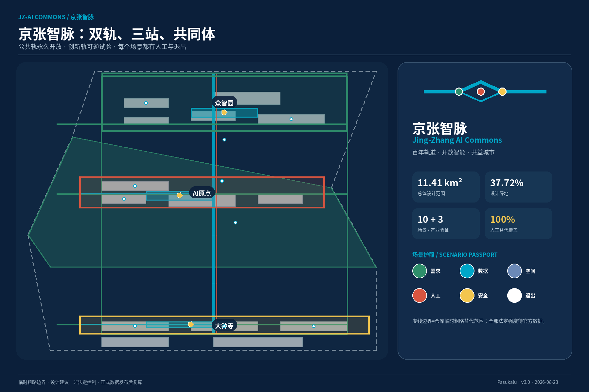
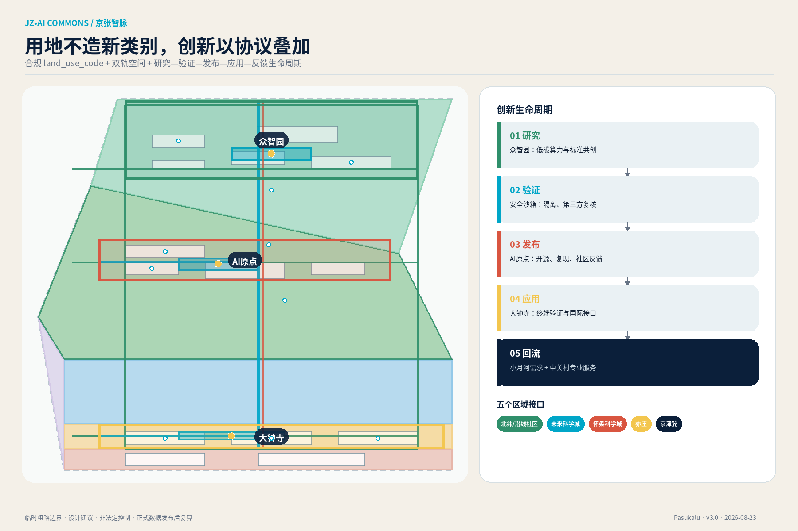
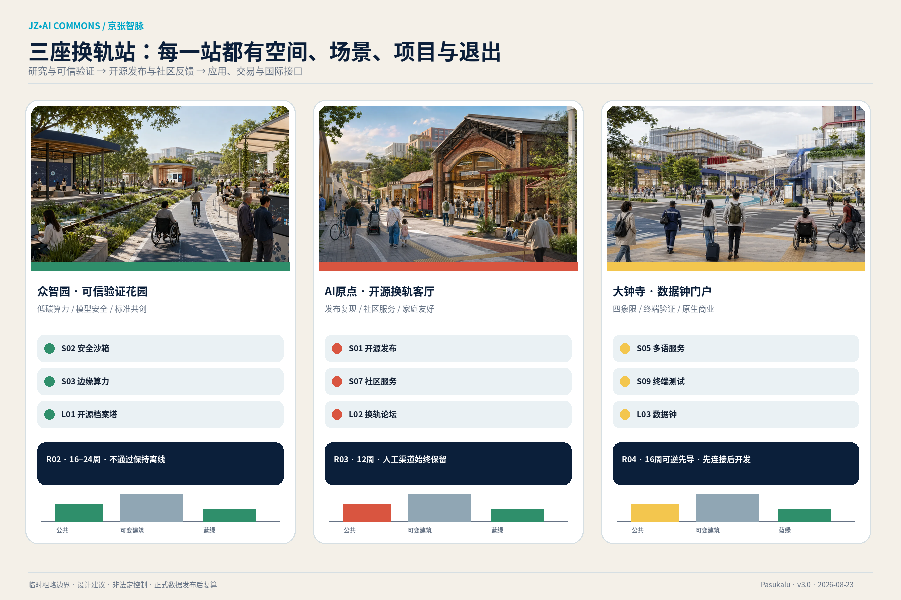
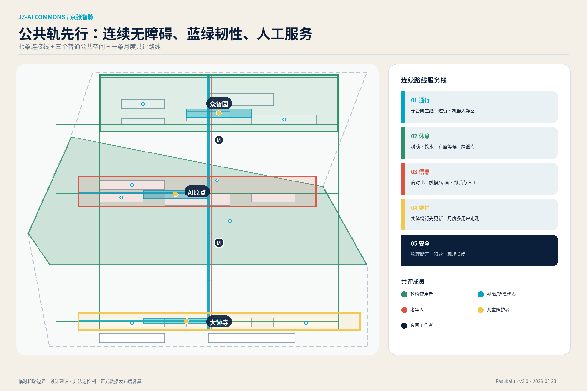
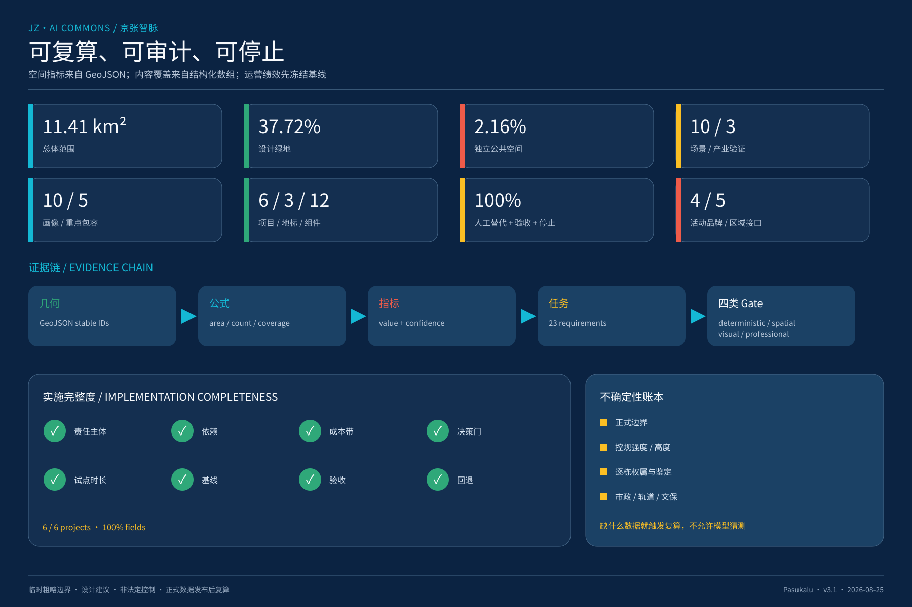

# 京张智脉 · 开放智能共同体

> **Jing-Zhang AI Commons**
>
> 百年轨道 · 开放智能 · 共益城市
>
> A century of rail. Open intelligence. A city for all.

本方案不是给传统园区贴上 AI 标签，而是把“试验如何进入城市、公众如何参与、风险如何停止”设计成空间和制度。京张遗址公园成为任何人都能使用的**公共轨**；研究、验证与应用构成可逆的**创新轨**；众智园、AI原点社区和大钟寺是三座“换轨站”。每个 AI 场景只有通过 Need、Data、Space、Human、Safety、Exit 六道门，才能从沙箱进入受限试点；未达标即可退出并恢复现场。

## 设计依据与资料清单

方案以官方公告和清权的面向智能体任务书为主控依据，使用仓库场地包的枚举、schema、专业标准和临时几何建立可复核证据链 [source:OFFICIAL-ANNOUNCEMENT] [source:AGENT-TASKBOOK] [source:SITE-PACKAGE]。data/source_registry.json 负责区分正式可用、背景参照和临时资料；处理后的 fact pack 只作导航，不创造新的权威事实 [source:SOURCE-REGISTRY] [source:PROCESSED-FACT-PACK]。

当前总体设计范围与三处重点区域 polygon 是仓库提供的**临时粗略替代边界**，用于方案内面积复算、图示和设计讨论，不是官方红线，不支持权属、征拆、许可或精确工程量判断 [source:BOUNDARY-SOURCE] [source:KEY-AREA-SOURCE] [depth:existing_conditions_diagnosis]。正式 polygon 发布后，应替换边界、重跑空间审查，并同步更新用地、道路、绿地、公共空间、建筑、分期、场景节点、指标和图纸。

| 证据层 | 本方案使用方式 | 不越过的边界 |
| --- | --- | --- |
| 官方与任务依据 | 目标、三层范围、三处重点区、六项 agent 任务 | 不推定获奖、采纳或政府背书 |
| 临时空间几何 | 方案内一致性、面积、连通与节点定位 | 不作为正式红线或工程测绘 |
| 八个外部案例 | 只提取有一手/政府来源支持的机制 | 不复制规模、制度或绩效数字 |
| AI 概念图 | 表达三处重点区空间意图 | 不作为现状、建成效果或尺寸证据 |
| 专业标准 | 约束用地、控规深度、AI治理与无障碍 | 不替代个案法律、工程或审批意见 |

十项假设分别覆盖边界、控规、逐栋调查、市政、遗产、运营基线、成本、数据、无障碍和案例转译；每项都有影响和复算触发条件 [data:assumptions.json] [depth:risk_missing_data]。这使“暂缺数据”成为明确的决策门，而不是被模型猜成精确结论。

## 三层范围工作框架

三层范围不是三套彼此割裂的图：**研究层**回答生态与区域协同，**总体层**回答空间结构与更新制度，**重点层**用三处换轨站验证建筑、公共空间、场景和实施闭环 [standard:PROJECT-OFFICIAL-ANNOUNCEMENT] [depth:three_level_scope_framework]。

| 层级 | 核心问题 | 方案交付 | 可核验证据 |
| --- | --- | --- | --- |
| 统筹研究范围（公告约 43.6 km²） | 海淀 AI 生态如何连接未来城市与区域伙伴 | 三大定位、五大功能、三区两翼、8案例与5个区域接口 | visual/assets/regional_synergy.json、visual/assets/case_studies.json |
| 总体设计范围（临时模型 11.41 km²） | 公共、创新、交通、蓝绿和更新如何形成同一系统 | 双轨共生、七条连接线、蓝绿公共环、协议型混合用地 | [data:geometry/site_boundary.geojson#SITE-001] [metric:site_area_sqm] |
| 三处重点区域（公告合计约 368.4 ha） | 策源—发布—应用如何在具体空间运转 | 众智园、AI原点社区、大钟寺三座换轨站 | [data:geometry/key_areas.geojson] [metric:key_area_count] |

空间结构由“**双轨共生、三座换轨站、两翼接口、多点场景、蓝绿公共环**”组成。公共轨承载遗产、步行、休息、普通商业与社区服务，始终连续；创新轨承载可逆、受限、可审计的 AI 试验。两轨在三处重点区交换知识、人才和公共反馈，但技术试验不得挤占无障碍通行和非商业公共空间 [data:geometry/roads.geojson#ROAD-001] [data:geometry/green_space.geojson#GREEN-001] [depth:overall_spatial_structure]。

## 统筹研究范围产业与未来城市研究

品牌中文名为“**京张智脉**”，英文名为“**Jing-Zhang AI Commons**”。“京张”锁定铁路遗产身份，“智脉”把轨线转译为知识与生活流，“Commons”强调共享基础设施、公共利益和退出权。标志由一条连续轨线、三个转辙节点和一个开放环构成；色彩为 Rail Navy、Commons Cyan、Heritage Red、Park Green、Warm Paper 和 Safety Yellow。完整构图、色值、字体、最小尺寸、应用与权利记录在品牌证据中 [data:visual/assets/brand_system.json] [standard:PROJECT-AGENT-OPEN-CALL-TASKBOOK]。

三大定位——百年京张文化带、都市 AI 生活体验带、AI 融合创新带——被落实为五项功能：全栈自主创新、世界级生态、AI+场景、AI活力城市和治理话语权。三区两翼则对应一条可解释的创新生命周期：众智园“研究与可信验证”，AI原点社区“开源发布与公众反馈”，大钟寺“应用、交易与国际接口”；中关村科技服务翼供给资本、知识产权、人才和专业服务，小月河场景赋能翼供给真实需求、公共空间与社区评估 [data:visual/assets/regional_synergy.json]。

五个外部接口是可协商的**概念接口**，不代表任何单位承诺：北纬社区等沿线在地社区网络提供问题与公众陪审；未来科学城衔接能源/低碳工程；怀柔科学城衔接科学智能与方法验证；北京经济技术开发区（亦庄）衔接机器人/制造工程化；京津冀网络衔接多地复现、算力与标准。每个接口均有双向价值、空间载体、KPI 和边界，不用“协同”替代责任 [metric:regional_interface_count] [data:visual/assets/regional_synergy.json#external_interfaces]。

### 八个可核验案例与本地转译

| 案例 | 经来源支持的机制 | 京张转译 | 局限 |
| --- | --- | --- | --- |
| King's Cross | 公共空间、新街道与历史建筑修复共同进入长期更新 | 遗产公共轨先行，六个项目分段接入 [source:CASE-KINGS-CROSS] | 不复制土地与融资结构 |
| Kendall Square | 小企业创新空间和低价空间义务进入更新/分区 | 可负担小团队席位进入实施条件 [source:CASE-KENDALL-SQUARE] | 不直接套用比例 |
| LaunchPad / Kampong AI | 专用设施、全生命周期政策与社区经理并列 | 众智园同时设置设备、政策和运营席 [source:CASE-ONE-NORTH] | 未来计划不写成已实现 |
| Punggol Digital District | 产学社区共址，受控地区平台兼顾运营与试验 | 最小化数据沙箱、合成优先、独立复核 [source:CASE-PUNGGOL-DIGITAL-DISTRICT] | 不复制数据制度 |

| 案例 | 经来源支持的机制 | 京张转译 | 局限 |
| --- | --- | --- | --- |
| 22@ Barcelona | 产业、住房、文化教育与一站式办公室并行 | 大钟寺原生商业、人才接口和项目门同步 [source:CASE-22-BARCELONA] | 不引用网页疑似错误面积 |
| 南山智园 | 旧村/旧工业更新、专业楼宇、校园园区社区融合 | 众智园“一栋一能力栈”，社区共享反馈 [source:CASE-NANSHAN-ZHIYUAN] | 只作机制历史 |
| 中关村场景生态 | 定期机会清单、体验中心与数据/隐私/伦理治理 | 场景护照、季度清单、扩大或日落 [source:CASE-ZGC-SCENARIO-ECOSYSTEM] | 非本项目审批承诺 |
| 首尔 DMC | 旧处置场地区向数字媒体集群转型，文化与产业并行 | 大钟寺公共首层连接展演和产业验证 [source:CASE-SEOUL-DMC-OFFICIAL] | 旧资料不代表当前绩效 |

上述研究产生四项规划创新：在合规用地代码上叠加“协议型混合用地”；让公共轨先行、创新轨可逆；把六门场景评审与建设项目门同步；把“日落”写入空间插槽、合同、数据和预算 [data:visual/assets/regional_synergy.json#planning_innovations]。

## 总体设计范围城市更新与控规深度城市设计

总体空间不是直线加三个色块，而是三套互补网络：公共轨沿遗址公园形成连续慢行与文化体验；创新轨连接三处产业能力；横向缝合线把高校、社区、站点和服务翼接入。七条线路分别承担主轴、三处横向联系、蓝绿环、五道口接驳和大钟寺四象限连接 [data:geometry/roads.geojson] [depth:overall_spatial_structure]。

用地层使用仓库允许的 land_use_code，AI 功能作为建筑、时段、场景与运营协议叠加，不创造新的法定用地类别 [data:geometry/land_use.geojson] [standard:MNR-LAND-USE-CLASSIFICATION-GUIDE]。容积率、高度、建筑密度、退线和道路红线因缺少正式控制条件保持待确认；14 个建筑只表示可讨论的空间载体，其基底可复算但不等于现状全量建筑 [metric:building_footprint_area_sqm] [metric:floor_area_ratio] [depth:development_intensity_controls]。

总体控制采用“五层一门”：

1. **公共底线层**：连续无障碍、普通公共空间、非数字服务和文化记忆不可被技术试验挤占。
2. **蓝绿韧性层**：遮阴、雨洪、饮水、休息、低眩光照明和运维先于设备展示。
3. **适应性建筑层**：优先保留结构骨架，公共首层可变，机电/数据接口可替换。
4. **创新协议层**：每个场景绑定时间、空间、数据、人工责任和退出。
5. **运营反馈层**：投诉、无障碍共评、绩效和日落决定反向修改下一期空间。
6. **项目门**：正式边界、权属、文保、市政、交通、消防、投资与专项审查齐套后才能进入工程深化。

这是一套城市设计与实施综合方案，不是法定控规或工程设计文件；已知、建议、未知和触发条件在指标与假设中分开保存 [standard:MOHURD-CONTROL-DETAILED-PLANNING] [data:assumptions.json]。

## 重点区域详细设计

### 1. 众智园：可信验证花园

众智园承担“研究→可信验证”。北侧保留连续研发庭院，中部建立公众可见但网络隔离的验证廊，南侧由低碳会客厅接入遗址公共轨。BLDG-003/004/005 分别承载低碳边缘算力、模型安全治理和标准共创；PUBLIC-001 是开放观察与共同评审庭，不把高风险试验直接暴露给公共空间 [data:geometry/buildings.geojson#BLDG-003] [data:geometry/public_space.geojson#NODE-S02] [metric:zhongzhiyuan_area_sqm]。

空间控制：以低—中层庭院和可替换实验单元为主，主要公共首层面向绿带；设备有物理断开、热风险和网络隔离边界。实施先做 R02 开放验证庭，模型试验 16 周、算力试验 24 周，未通过隔离或安全门则保持离线。

### 2. AI原点社区：开源换轨客厅

AI原点社区承担“发布→复现→社区反馈”。铁路记忆、开发者文化与居民日常在换轨论坛交汇；BLDG-006 是开源发布厅，BLDG-009 是保留全程人工渠道的社区服务站，PUBLIC-002 承载无需预约的普通公共空间 [data:geometry/buildings.geojson#BLDG-006] [data:geometry/public_space.geojson#PUBLIC-002] [metric:ai_origin_area_sqm]。

空间控制：优先适应性再利用、可拆分小单元、家庭卫生间、静谧咨询间和有座等候；活动不阻断连续无障碍路径。R03 以 12 周低风险服务和每周发布测试运营，人工渠道、独立复现与邻里噪声共同决定续期。

### 3. 大钟寺：数据钟与原生商业门户

大钟寺承担“应用→交易→国际接口”。ROAD-007 先解决站区四象限步行连接，BLDG-010/011/012/014 分别承载路演、多设备互操作、数据权益和 AI 生活服务；原有商户是共益协议参与者，不以“智能升级”作为清退理由 [data:geometry/roads.geojson#ROAD-007] [data:geometry/public_space.geojson#NODE-S09] [metric:dazhongsi_area_sqm]。

空间控制：门户体量围合公共首层和站前空地，机器人/终端只在限速试验段运行并保留回避湾、紧急停止和人工接管。R04 先做 16 周可逆导视、临时路权和商户微更新，复杂工程待轨道保护、交通、人流和权属专项。

三处共同采用“一个地标 + 一个普通公共空间 + 一个面对面服务点 + 一组可逆试验插槽”。绝对高度、退线、结构和文保位置须由正式资料与专业团队深化 [depth:three_key_area_detailed_design] [standard:MOHURD-URBAN-DESIGN-MEASURES]。

## AI 创新生态、人才画像与 AI+ 场景

### 场景护照：从技术演示到城市契约

任何场景先过六门：**Need** 证明真实公共/产业问题；**Data** 证明来源、最小化和分级；**Space** 明确物理边界与无障碍；**Human** 保留人工决定和替代；**Safety** 完成偏差、隐私、网络、消防与拥挤评审；**Exit** 写明停止、删除、申诉和恢复现场。流程为“沙箱验证→受限试点→独立复核→扩大/修正/日落” [data:visual/assets/scenario_cards.json#protocol] [metric:scenario_passport_gate_count] [standard:GENERATIVE-AI-INTERIM-MEASURES]。

| 场景 | 空间载体 | 核心验收 | 回退/停止 |
| --- | --- | --- | --- |
| S01 开源发布厅 | BLDG-006 / PUBLIC-002 | 独立复现≥80%，字幕与无台阶席位100% | 保留纸质/人工；版权或安全未闭环即停 |
| S02 模型安全治理沙箱 ★ | BLDG-004 | 六门资料和高风险缺陷关闭100% | 不通过保持离线 |
| S03 低碳边缘算力台 ★ | BLDG-003 / GREEN-001 | 同等质量/吞吐能耗较基线下降≥10% | 回退静态调度、物理断开 |
| S04 无障碍慢行协同导航 | ROAD-001/005/006 | 实体导视同步、多类用户实测≥90% | 纸质/触摸图与人工问询 |
| S05 多语轨道与公共服务台 | BLDG-010 / ROAD-007 | 关键路线错引导≤2%，人工替代100% | 人工柜台、纸图、电话 |
| S06 数据权益会客厅 | BLDG-012 | 所有场景有数据卡、退出和季度汇总 | 面对面/纸质/邮寄申诉 |
| S07 社区服务协作站 | BLDG-009 | 资格决定人工确认100%，非数字不降级 | 保留原人工/电话/纸质流程 |
| S08 气候适应公共空间运维 | GREEN-001 / PUBLIC-001–003 | 非成像、人工确认、弱势时段不降级 | 固定巡检和现场关闭 |
| S09 智能终端互操作试验街 ★ | BLDG-011/014 | 紧急停止100%，不占无障碍净空 | 停机并恢复人工服务 |
| S10 京张记忆共创径 | L01–L03 / ROAD-001 | 来源/授权与合成标识100% | 实体时间线和人工讲解 |

“★”为三项产业测试验证场景；十个节点在标准 public_space GeoJSON 的 `SCENARIO_NODE` 图层中定位，十张完整卡均包含用户、问题、数据、模型、空间、运营者类型、人工责任、试点时长、基线、验收、非数字替代和停止触发 [data:geometry/public_space.geojson] [metric:scenario_card_count] [metric:industry_test_scenario_count]。

### 十类用户不是一张“人才画像”海报

十类画像为开发者、初创团队、企业/国际访客、长期居民、高校师生、老年人与低数字技能者、儿童与照护者、残障/神经多样性使用者、服务/夜班工作者、非中文访客。每类均绑定空间和服务响应；后五类作为重点包容画像单独核验 [data:visual/assets/accessibility_inclusion.json#personas] [metric:user_persona_count] [metric:vulnerable_or_excluded_persona_count]。

公共服务不得因拒绝 AI、拒绝数据或选择人工渠道而降级。所有十个场景都有人工/非数字替代、验收和停止触发，覆盖率均为 100% [metric:scenario_manual_fallback_coverage] [metric:scenario_acceptance_coverage] [metric:scenario_stop_trigger_coverage]。现场、电话、纸质/邮寄和无障碍网页共同构成投诉渠道；一般问题“5个工作日确认受理”仅是概念运营目标，不是法定时限。

## 用地、建筑规模与拆改留方案

六个用地 polygon 表达科研创新、遗址公园、AI原点科研、大钟寺商业、周边居住和战略留白；它们是临时边界内的设计建议，不替代法定用地审批 [data:geometry/land_use.geojson] [standard:MNR-LAND-USE-CLASSIFICATION-GUIDE]。协议型混合用地不改变 land_use_code，只附加允许场景、开放时段、公共首层、数据边界、人工责任、最大试点期和恢复条件。

14 个概念建筑载体按三类处理：

- **保留**：具适应性骨架、遗产/社区价值或稳定使用的建筑，先做安全与价值调查。
- **改造**：通过首层开放、节能、无障碍、消防和可替换机电提升使用，不追求外观统一。
- **拆除/新建候选**：仅在结构鉴定、碳/成本、公共价值、产权和安置比较后进入专业决策；当前不作拆除承诺。

众智园采用“一栋一能力栈”，AI原点采用小单元与公共客厅，大钟寺采用站城首层和原生商业混合。高度和容积率不从示意模型反推；相对体量以“低层遗产/公共界面—中层创新庭院—站区门户”为控制逻辑 [depth:height_massing_character] [depth:retain_renovate_demolish] [metric:building_height_m]。

## 交通、轨道、市政与公共服务设施

ROAD-001 是遗产公共主轴，ROAD-005 是蓝绿慢行复合环，三条横向联系分别接入三核，ROAD-006 对接五道口方向，ROAD-007 组织大钟寺四象限。具体道路等级、红线、交叉口、停车和轨道保护仍需交通及管理条件，不在概念图上伪造精确断面 [data:geometry/roads.geojson] [depth:traffic_rail_slow_parking]。

连续无障碍路线把三处公共空间、人工服务、卫生间、饮水、休息和避难信息放在同一层级；施工或积水时，**实体绕行标识先于数字推荐更新**。每月由轮椅使用者、视障/听障代表、老年人、儿童照护者和运维人员共同走测，并计入运营成本 [data:visual/assets/accessibility_inclusion.json#continuous_route_spec] [standard:BARRIER-FREE-ENVIRONMENT-LAW]。

市政与新型基础设施采用“最小必要 + 物理可断开”：

- 低碳算力以设备级能耗、热和吞吐测试，不连接法定市政控制；容量待供电、散热和能源专项。
- 公共空间只使用非成像环境传感和匿名人工计数，默认不收集轨迹、人脸或声纹。
- 数据沙箱优先合成/聚合数据，生产网与试验网隔离；运营者承担数据卡、事件响应和日落删除。
- 公共服务保留人工窗口、纸质、电话和不注册访问；关键安全信息不依赖机器翻译单独发布。
- 停车采用共享、错峰和后续交通评估，不把新增停车作为吸引创新人才的主要手段。

市政、消防、防洪、轨道和网络安全是 R01–R04 的 G0/G1 决策门，而非“后期再解决”的附注 [data:visual/assets/implementation_program.json] [depth:municipal_new_infrastructure]。

## 蓝绿空间、公共空间与城市风貌

设计模型中的绿地比例为 37.72%，独立公共空间比例为 2.16%；前者包含连续遗址公园绿带，后者只计三个独立公共空间 polygon，二者不可简单相加 [metric:green_ratio] [metric:public_space_ratio] [data:geometry/public_space.geojson]。这两个数字基于临时边界和设计建议，正式几何到位后必须复算。

公共空间的优先级为：连续通行→遮阴/雨洪/休息→普通日常活动→文化解释→可逆 AI 场景。设备、广告、活动围栏和机器人试验不得侵占无障碍净空；清晨、夜间和低消费人群的使用不因“低商业价值”而被算法降级 [standard:MOHURD-URBAN-DESIGN-MEASURES] [standard:BARRIER-FREE-ENVIRONMENT-LAW]。

### “一线三时态”：百年京张—中关村—AI 新文化

文化系统不把铁路遗产当作科技布景，而把同一条公共轨组织为三个可校正的时态：**记忆轨**只呈现有来源的京张史料与明确标记的个人记忆；**求真轨**把中关村创新文化转译为提问、复现、同行评审和公开失败；**共益轨**把 AI 新文化定义为来源披露、人类责任、无障碍共创、长期维护与负责任退出。S10“京张记忆共创径”要求事实可追溯、合成内容 100% 标识、授权可撤回，避免伪造遗存或把生成叙事冒充历史 [data:visual/assets/scenario_cards.json#S10] [depth:heritage_identity]。

三处地标组成空间叙事：众智园“开源档案塔”回答“如何验证”，AI原点“换轨论坛”回答“谁能参与”，大钟寺“数据钟”回答“如何负责”。连续导视采用双轨线、三色节点、统一编号、中英双语、触摸/语音与高对比信息；二维码只是补充，断电或拒绝手机仍可完整阅读。国际传播母句为：**From a century of rail connection to an open track for collective intelligence.** 对外内容统一标注 concept proposal、provisional geometry 与 not government endorsement，使城市气质、传播力和事实边界共存 [data:visual/assets/brand_system.json] [data:visual/assets/landmarks_components.json#landmarks]。

三处 AI 朝圣地标不是巨型屏幕：众智园“**开源档案塔**”展示可复现和限制；AI原点“**换轨论坛**”承载发布与社区议事；大钟寺“**数据钟**”只显示聚合绩效、风险门和人工服务位置。断电后仍可作为实体时间线、公共论坛和翻页信息 [data:visual/assets/landmarks_components.json#landmarks] [metric:ai_landmark_count]。

“共益轨迹”荣誉体系奖励可复现、公共问题解决、无障碍共创、安全披露、长期维护和负责任退出，不按融资、模型参数或流量排名。12件组件包括双轨铺装、场景护照柱、可逆插槽、共益长桌、遮阴能量篷、触摸导视轨、静谧舱、数据卡墙、移动绿岛、人工服务灯、儿童观察窗和维护开放盒 [data:visual/assets/landmarks_components.json#component_library] [metric:urban_component_count]。

## 更新项目清单、实施政策与分期计划

| 项目 | 概念责任主体类型 | 资源带 | 决策门与试点 | 验收/回退 |
| --- | --- | --- | --- | --- |
| R01 智脉公共轨先导段 | 公园/公共空间建设运营平台 | L | 正式资料→30%概念→无障碍/安全共评→≥16周运维 | 连续走测通过；分段开放、现场人工引导 |
| R02 众智园开放验证庭 | 园区运营平台 | M | 建筑机电尽调→隔离→第三方安全→16–24周受限开放 | 高风险关闭100%；不通过保持离线 |
| R03 AI原点开放发布与社区站 | 公共服务+创新空间联合体 | M | 现状调查→样板间→12周服务→年度续约 | 人工渠道和无障碍100%；停止助手仍保留空间 |
| R04 大钟寺四象限与原生商业街 | 站区更新协调平台 | L | 交通权属→临时路权→商户共益→工程 | 四象限连续；先做可逆导视/微更新 |
| R05 场景护照与数据权益台 | 独立场景治理秘书处 | S | 六门签字→受限试点→独立复核→扩大/日落 | 完整率100%；不通过不开放 |
| R06 三站地标与国际路线 | 文化/国际传播运营联盟 | M | 史料权利→1:1样机→公众共评→分站实施 | 来源/合成标识100%；低技术替代 |

S/M/L 是概念资源等级，不是投资估算或财政承诺；每个项目另有伙伴、依赖、基线、试点时长、验收和 fallback [data:visual/assets/implementation_program.json#projects] [metric:implementation_gate_coverage] [depth:renewal_project_list]。

分期为：P0（0–6月）正式资料、基线和治理先行；P1（6–18月）公共轨、众智园试验和三站样机；P2（18–36月）AI原点、大钟寺和十场景分批联动；P3（36月后）只扩大通过评估的项目，未达标者日落 [data:geometry/phasing.geojson] [depth:phasing_implementation]。

长期运营由四季品牌构成：春“开源发车季”、夏“城市模型安全周”、秋“京张共益论坛”、冬“场景年检与日落夜”。转化漏斗依次记录 Reach、Engage、Validate、Adopt、Benefit、Return，不把触达量冒充公共价值。Commons Council 定年度方向，Scenario Review Panel 决定扩大/日落，Community Jury 评议公平与可负担性，开放技术秘书处维护版本与证据 [data:visual/assets/operations_program.json] [metric:annual_event_family_count]。

开发者社区采用维护者、复核者、数据/社区守护者、驻地研究者和公众测试者五类角色；版本化发布、利益冲突披露、双人审查和可复现记录是获得场景资源的前提。人才路径为公开课→复现任务→付费微委托→驻地项目→长期岗位/创业支持，选取条件公开，参与不与个人数据或营销同意捆绑。

## 指标体系、面积复算与合规矩阵

| 指标 | 值 | 公式与状态 |
| --- | ---: | --- |
| 总体设计范围面积 | 11,412,825 m² | area(SITE-001)；临时边界、中置信度 |
| 重点区域 | 3 | count(KEY_AREA)；三处临时 polygon |
| 绿地比例 | 37.72% | union(GREEN_SPACE)/SITE_BOUNDARY；设计模型 |
| 独立公共空间比例 | 2.16% | union(PUBLIC_SPACE)/SITE_BOUNDARY；不含线性绿带重复面积 |
| 概念建筑基底 | 1,119,272 m² | 14 个非重叠 footprint 之和；非现状全量 |
| 场景/产业验证/节点 | 10 / 3 / 10 | 从场景卡和 node_kind 复算 |
| 人工替代/验收/停止覆盖 | 100% / 100% / 100% | 十张卡字段完整率 |
| 用户/重点包容画像 | 10 / 5 | 从 persona 数组复算 |
| 更新项目/地标/组件 | 6 / 3 / 12 | 从结构化证据数组复算 |
| 容积率/绝对高度 | 待正式数据补齐 | value=null，不从示意图反推 |

三项 formal 核心视觉指标与 HTML data-value 和 GeoJSON 复算一致 [metric:site_area_sqm] [metric:green_ratio] [metric:public_space_ratio]。空间指标来自几何，内容覆盖来自数组，运营结果先冻结基线再评估；每项保留公式、来源、置信度、假设和复算触发 [data:metrics.json] [depth:metrics_recalculation]。

任务覆盖矩阵逐条覆盖公告 1.3、1.4、1.5 和 agent.1–agent.6；专业标准矩阵覆盖五项主控标准并主动响应生成式AI、无障碍与老年数字包容；15项设计深度均为 complete。四类 Gate 分别检查确定性文件、空间几何、双语视觉和专业证据 [data:compliance_matrix.json] [data:standard_matrix.json] [data:design_depth_matrix.json]。

### 13 个任务书评审维度导航（不自评分）

| 维度 | 评委可直接核验的最强交付 | 失效检验 |
| --- | --- | --- |
| 目标契合度 | 三大定位、双轨三站、朝圣地标 | 是否真正服务全球 AI 高地与公共城市 |
| 功能匹配度 | 五大功能、三区两翼创新生命周期 | 每一功能是否有空间与运营载体 |
| 品牌识别度 | 京张智脉、标志、六色与六门界面 | 缩小、黑白、离线时是否仍可识别 |
| 区域协同性 | 北纬社区、三城一区、京津冀五接口 | 是否有双向价值、载体、KPI 与边界 |
| 规划创新性 | 协议型混合用地、双轨可逆、项目门同步、设计日落 | 是否可改变决策而非只换术语 |
| 产业支撑度 | 八案例、全栈能力栈、场景护照、要素接口 | 研究—验证—发布—应用是否闭环 |
| 场景可感知度 | 10 张卡、3 个产业验证、3 张重点区概念图 | 用户能否说清在哪里、怎么用、何时停 |
| 空间明确性 | 9 个标准 GeoJSON、稳定 ID、三处详细设计 | 每项主张能否回到片区/建筑/道路/节点 |
| 可转化性 | 6 个项目、P0–P3、主体/依赖/基线/验收/回退 | 专业团队能否直接接续下一决策门 |
| 表达完整性 | 中英正文、10 幅核心图、A0/A3、离线交互页 | 静态、移动、无脚本和英文环境是否可读 |
| 公开合规性 | 来源用途边界、生成披露、人工责任与日落 | 是否存在越权、侵权、隐私或伪背书 |
| 国际传播力 | AI Commons 英文体系、国际案例、双语母句 | 不依赖中文语境能否理解独特价值 |
| 长期运营价值 | 四季品牌、六级漏斗、四治理主体、共益轨迹 | 活动后是否留下人才、协议、档案与维护责任 |

## 风险、版权与合规说明

| 风险 | 触发 | 预防/监测 | 停止与恢复 |
| --- | --- | --- | --- |
| 边界与控规误用 | 临时几何被当作审批条件 | 全图虚线/低对比标注，法定强度保持 unknown | 正式数据到位后全包复算 |
| 数据与隐私 | 来源不清、目的漂移、个体追踪 | 合成/聚合优先、数据卡、访问控制、季度审查 | 暂停、删除/封存、独立复盘 |
| 模型偏差与错误 | 不同人群完成率差、关键错引导 | 十类画像共测、人工决定、来源时间 | 回退人工，修正后重测 |
| 无障碍中断 | 施工、设备或活动占净空 | 月度共走、实体标识先更新 | 封闭风险段、人工引导 |
| 设备/网络/热安全 | 接管失败、温升越限、隔离破坏 | 物理断开、限速、第三方测试 | 立即停机，恢复普通空间 |
| 遗产与社区伤害 | 仿造遗存、清退原生商业、噪声 | 可逆新旧可辨、权利核验、商户/居民协商 | 撤除样机、修正叙事/运营 |
| 治理俘获 | 大企业/技术团队控制机会清单 | 利益冲突披露、非项目复核占多数、公众席 | 撤销决定并公开更正 |
| 成本与运维失配 | 只建不管、S/M/L被当预算 | 全生命周期测算门、年度续约、日落预算 | 分段实施、降低技术复杂度 |

生成式 AI 合规按实际公开服务边界逐案判断；本方案不把内容处置条款泛化为任意“用户退出权”，也不推定备案或安全评估结论 [standard:GENERATIVE-AI-INTERIM-MEASURES]。无障碍人工服务严格按法律列举场景和项目实际义务落实，同时把传统服务与智能服务并行作为老年友好政策参照 [standard:BARRIER-FREE-ENVIRONMENT-LAW] [standard:ELDERLY-SMART-TECH-PLAN-2020-45]。

三张重点区氛围图由 OpenAI 图像生成工具为本投稿生成，无真实人物身份、第三方标志或外部媒体复用；均标记为概念图，不能证明场地事实 [source:MEDIA-OPENAI-IMAGEGEN-2026-08-23]。图表与 PDF 使用 SIL OFL 1.1 的 Noto Sans CJK 字体渲染后固化为图像/页面；四份离线 HTML 则内置经许可的 Noto Sans CJK SC 2.004 WOFF 字符子集，不依赖系统中文字体或网络请求 [source:FONT-NOTO-SANS-CJK]。完整提示、派生、字体和权利说明见 report/copyright_statement.md。

方案是开放共创建议，不替代法定规划、工程设计、政府审定或专业意见；PR 合并只代表仓库 intake，不代表画廊发布、获奖、实施批准或政府背书。

## 参考资料

- 北京市规划和自然资源委员会海淀分局，项目官方公告 [source:OFFICIAL-ANNOUNCEMENT]
- 面向智能体开源征集任务书清权摘录 [source:AGENT-TASKBOOK]
- 仓库场地包、来源登记与处理导航 [source:SITE-PACKAGE] [source:SOURCE-REGISTRY] [source:PROCESSED-FACT-PACK]
- 临时总体与重点区几何来源 [source:BOUNDARY-SOURCE] [source:KEY-AREA-SOURCE]
- King's Cross、Kendall Square、one-north 与 Punggol 官方/项目一手资料 [source:CASE-KINGS-CROSS] [source:CASE-KENDALL-SQUARE] [source:CASE-ONE-NORTH]
- Barcelona 22@、南山智园、中关村场景生态与首尔 DMC 政府资料 [source:CASE-22-BARCELONA] [source:CASE-NANSHAN-ZHIYUAN] [source:CASE-ZGC-SCENARIO-ECOSYSTEM]
- 完整 URL、发布者、访问日期、可用范围和限制见 sources.json；结构化案例转译见 visual/assets/case_studies.json [source:CASE-PUNGGOL-DIGITAL-DISTRICT] [source:CASE-SEOUL-DMC-OFFICIAL]
