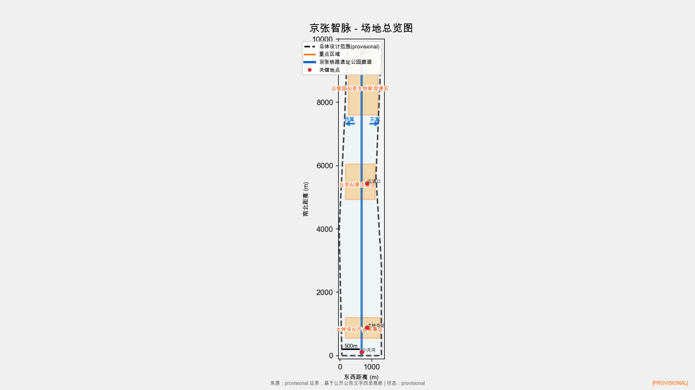
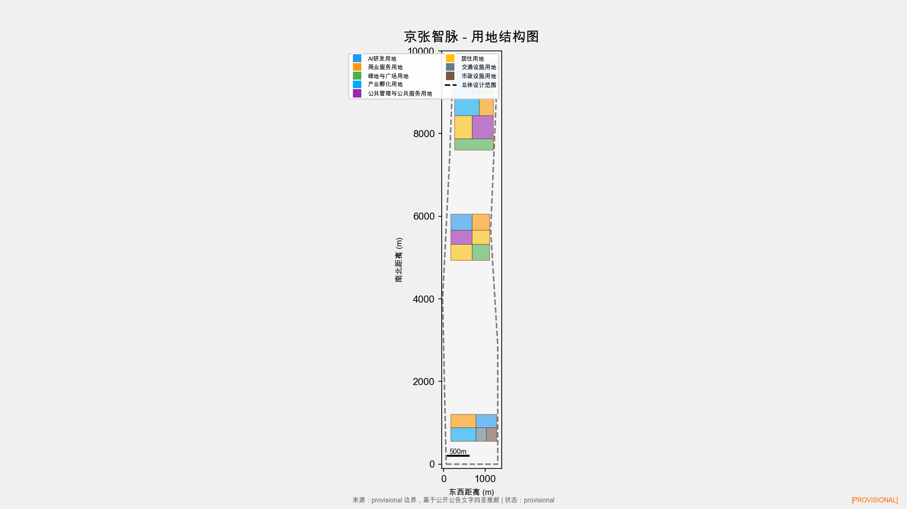
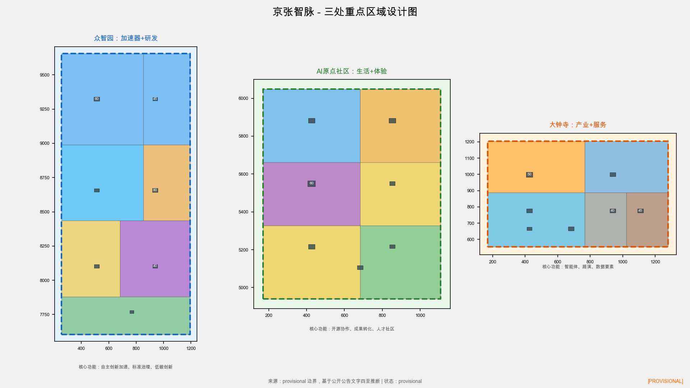
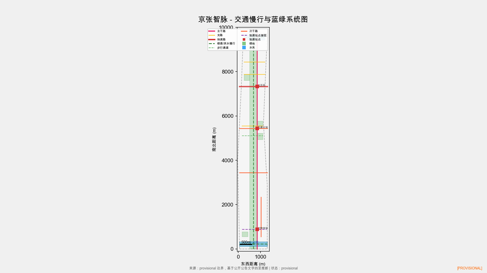
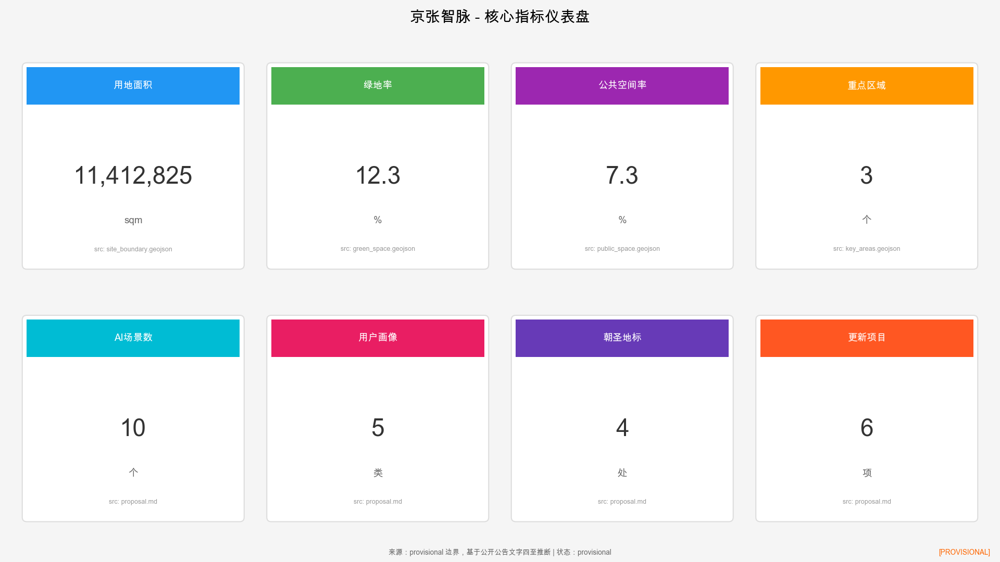

# 京张智脉：百年铁路遗产的AI创新带城市设计

## 设计依据与资料清单

本方案以北京市规划和自然资源委员会海淀分局发布的《百年京张AI创新带城市设计国际方案征集资格预审公告》为主控依据 [source:OFFICIAL-ANNOUNCEMENT]，以面向全球智能体的开源征集任务书摘录为智能体任务框架 [source:AGENT-TASKBOOK] [standard:PROJECT-AGENT-OPEN-CALL-TASKBOOK]。方案同时参考《城市设计管理办法》[standard:MOHURD-URBAN-DESIGN-MEASURES]、《城市、镇控制性详细规划编制审批办法》[standard:MOHURD-CONTROL-DETAILED-PLANNING] 和《国土空间调查、规划、用途管制用地用海分类指南》[standard:MNR-LAND-USE-CLASSIFICATION-GUIDE]。

截至2026年8月10日，官方尚未在公开渠道发布精确的CAD/GIS边界文件。本方案使用仓库提供的 provisional 边界进行设计生成和展示 [data:geometry/site_boundary.geojson#PROV-SITE-001]，该边界依据公告文字四至和约11.4平方公里面积约束推断形成，仅用于AI agent生成、展示和临时自检，不得作为 official redline、审批依据或精确面积复算依据 [source:BOUNDARY-SOURCE]。正式官方数据发布后，所有面积、指标和图层均需重新复算。

资料清单分为三类：一是 formal-ready 公开资料，包括公告、任务书、城市设计管理办法等法规标准；二是 provisional 资料库，包括临时边界和基于公开数据的推断几何；三是背景研究资料，包括全球AI创新生态案例和海淀区公开统计数据。完整来源索引见 `sources.json`，完整合规对照见 `compliance_matrix.json`、`standard_matrix.json` 和 `design_depth_matrix.json`。

## 三层范围工作框架

本方案遵循公告确立的三层范围工作框架，从宏观到微观逐级落实设计目标 [source:SITE-PACKAGE]。

**统筹研究范围**（43.6平方公里）：北至北五环路，东至京藏高速，南至西直门外大街，西至万泉河路。该层面聚焦世界级AI创新生态体系构建、产业链协同和三区两翼功能统筹，研究范围覆盖海淀核心创新资源密集区。该范围使用 provisional 边界 [data:geometry/site_boundary.geojson#PROV-RESEARCH-001]，面积依据公告约43.6平方公里 [metric:site_area_sqm]。

**总体设计范围**（11.4平方公里）：以京张遗址公园周边1-2公里城市地区和产业区为规划设计范围。该层面达到控制性详细规划的城市设计深度，覆盖产业目标、功能布局、创新指标体系、城市更新总体框架、交通轨道市政配套、京张遗址公园活力带和城市风貌。该范围 provisional 计算面积约11,412,825平方米 [metric:site_area_sqm]。

**重点区域范围**（368.4公顷）：自北向南包括众智园AI自主创新加速区（192.1公顷）、北京AI原点社区（104.3公顷）和大钟寺AI产业聚集区（72.0公顷），达到规划综合实施方案的城市设计深度 [data:geometry/key_areas.geojson]。

三层范围从产业战略、总体城市设计到重点片区详细设计逐级落实。由于使用 provisional 边界，以下限制必须说明：第一，所有面积指标基于临时粗略多边形计算，与官方精确面积可能存在偏差；第二，用地布局和建筑规模为概念性方向建议，不构成审定控规条件；第三，正式官方边界发布后，用地、指标、合规矩阵和图纸均需重新复算 [assumption:A-CONTROLS-001]。

## 统筹研究范围产业与未来城市研究

### 总体概念与命名体系（agent.1）

本方案提出"京张智脉"（Jingzhang AI Vein, JZAV）的总体概念。一百多年前，詹天佑主持修建的京张铁路是中国人自主设计建造的第一条干线铁路，这条铁路是近代中国工业化的"动脉"。一百年后，京张铁路遗址公园沿线被定位为AI创新带，这条铁路遗产将转变为连接过去与未来的"智脉"——以铁路文化记忆为底色，以AI原生创新为动能，以公共空间为载体，构建一条贯穿海淀南北的创新生命线。

命名体系如下：主名称"京张智脉"取"京张"的历史文脉与"智脉"的未来愿景，英文"Jingzhang AI Vein"缩写JZAV。三个核心区域分别命名为"智核·众智园"（AI全栈加速核）、"智源·原点社区"（AI生活起源源）和"智汇·大钟寺"（AI产业汇聚汇），两翼命名为"智翼·中关"（中关村科技服务翼）和"智翼·月河"（小月河场景赋能翼）。京张遗址公园廊道命名为"智脉主轴"，沿线公共空间节点采用"智脉+"前缀（如智脉广场、智脉讲堂、智脉工坊）。

Logo设计方向：以"智"字为视觉核心，字形下半部分融入铁轨横截面的工字形截面，上半部分融入电路板走线纹理，整体形成从铁轨到芯片的视觉隐喻。色彩方案采用"传承铜"（#8B6914，呼应铁轨锈色与詹天佑时代工业美学）、"创新蓝"（#0066CC，代表AI与科技）和"活力绿"（#00A86B，代表生态与公共空间）三色组合。Logo为概念方向，未使用任何未授权字体、图片或商标 [standard:PROJECT-AGENT-OPEN-CALL-TASKBOOK]。

### 三大定位与三区两翼协同

方案回应公告三大定位——百年京张文化带、都市AI生活体验带和AI融合创新带——以及五大功能：AI全栈自主创新体系、世界级AI创新生态、AI+场景赋能新范式、智能化AI活力城市和AI治理全球话语权 [source:AGENT-TASKBOOK]。

三区两翼协同回路如下：智核·众智园作为AI全栈自主创新加速区，承载基础研究到产业孵化的全链条；智源·原点社区作为世界级AI创新生态的社区界面，提供研发、展示、服务和公共体验的复合功能；智汇·大钟寺作为AI产业集聚区，聚焦智能原生新业态和商业化落地。中关村科技服务翼提供要素全球化配置、中关村IP和资本赋能；小月河场景赋能翼提供AI场景测试和智能化城市生活体验。五者通过智脉主轴（京张遗址公园廊道）在空间上串联，在功能上形成"研发加速—社区生活—产业集聚—服务赋能—场景测试"的闭环 [source:AGENT-TASKBOOK]。

### 全球AI创新生态案例研究（agent.2）

本方案研究了8个全球AI创新生态案例，提炼可转化为空间、运营和场景机制的经验：

| 案例 | 城市 | 核心经验 | 空间转化启示 |
|------|------|----------|-------------|
| Silicon Valley | 圣何塞 | 校企旋转门、风险资本密集、开源文化 | 校园-社区-产业无界融合，智核·众智园参考 |
| Kendall Square | 波士顿 | MIT创新区、生物医药密集、步行尺度 | 研究机构与公共空间高密度交织，智源参考 |
| King's Cross | 伦敦 | 铁路遗产更新、Google Campus、中央圣马丁 | 铁路遗产与科技共生，智脉主轴直接参考 |
| Shibuya Q-WA | 东京 | AI城市实验室、数据驱动公共空间 | 公共空间作为AI测试场，小月河翼参考 |
| Digital Media City | 首尔 | 数字媒体产业集群、公共文化设施 | 产业与文化设施并重，智汇·大钟寺参考 |
| One-North | 新加坡 | 生物医药+科技混合、One-North公园 | 产业与绿地公园一体化，蓝绿系统参考 |
| 南山科技园 | 深圳 | 产业链完整、政府引导、企业主体 | 全栈产业链空间组织，智核参考 |
| 中关村现有生态 | 北京 | 高校密集、创业活跃、政策先行 | 在地经验直接延续，两翼赋能参考 |

这些案例的共同启示是：成功的AI创新生态需要研究机构、公共空间、产业空间和生活空间的高密度混合，需要连续的步行和骑行网络，需要文化叙事来凝聚身份认同，需要长期的社区运营而非一次性建设。King's Cross 的铁路遗产更新经验对京张遗址公园尤其直接相关 [source:AGENT-TASKBOOK]。

AI创新生态图谱将上述经验转化为四个维度：基础研究层（高校、实验室、开源社区）、产业孵化层（加速器、联合办公、中试空间）、资本服务层（VC、政策基金、科技服务）和场景应用层（测试场地、展示空间、公共体验）。四层在空间上分别对应智核的研发用地、智源的孵化空间、中关翼的资本服务和月河翼的场景测试 [depth:industry_space_mapping]。

### 未来AI城市形态

方案提出"可读、可走、可试"的未来AI城市形态原则。"可读"指城市空间本身能够传递AI创新文化信息，通过公共艺术、导视系统和数字界面实现；"可走"指所有创新节点在15分钟步行范围内可达，慢行系统连续无断点；"可试"指公共空间兼具AI场景测试功能，居民和访客可以体验和反馈AI服务。这一形态回应公告关于适配AI新质生产力的新型城市形态要求 [source:SITE-PACKAGE]。

## 总体设计范围城市更新与控规深度城市设计

### 空间结构与功能布局

总体设计范围采用"一轴三核两翼"的空间结构。一轴即智脉主轴——京张铁路遗址公园廊道，南北贯穿约8公里，串联所有核心功能节点。三核沿主轴自北向南分布：智核·众智园（192.1公顷）、智源·原点社区（104.3公顷）、智汇·大钟寺（72.0公顷）。两翼分别向东西延伸：中关翼向西连接中关村核心区，月河翼向东沿小月河延伸 [data:geometry/land_use.geojson]。

用地布局遵循"创新功能沿轴集聚、生活功能两翼铺展、蓝绿系统穿插渗透"的原则。沿智脉主轴两侧布置AI研发、产业孵化和商业服务用地，形成创新密度最高的核心带；两翼布置居住、教育和公共服务用地，保障人才生活品质；蓝绿系统以遗址公园为主脉，以清河和小月河为次脉，渗透至每个街区 [depth:land_use_layout]。

### 城市更新总体框架

本方案将更新对象分为四类：保留提升类（现状质量较好、功能可兼容的建筑）、改造转型类（工业遗存和老旧办公可转型为AI创新空间）、拆除新建类（破旧低效且无保留价值的建筑）、生态修复类（铁路沿线和滨水区域的灰绿基础设施）。更新策略强调"留改拆"并举，优先利用工业遗存和闲置空间，控制拆建比例，避免大拆大建 [standard:MOHURD-CONTROL-DETAILED-PLANNING]。

### 交通轨道市政配套

交通组织采用"轨道+慢行"为主导的模式。基地内有地铁13号线（清华园站、五道口站、知春路站）、15号线（清华东站）和多条公交线路。方案建议在智脉主轴沿线增设3个低速接驳停靠点，连接轨道站点与重点区域内部 [data:geometry/roads.geojson]。

慢行系统以智脉主轴为核心步行和骑行廊道，向东连接小月河绿道，向西连接中关村步行网络，形成总长约32公里的连续慢行网络。道路微循环重点打通重点区域内部的断头路和慢行断点 [depth:mobility_network]。

市政设施方面，方案提出"传统市政+新型基础设施"融合策略。在智脉主轴地下布置综合管廊，容纳电力、通信、给排水管线；在地面上分布式布置边缘计算节点和5G微基站，为AI场景提供端侧算力支撑。能源系统建议采用分布式光伏和地源热泵，降低重点区域碳排放 [standard:MOHURD-URBAN-DESIGN-MEASURES]。

### 京张遗址公园活力带

京张遗址公园是本方案的空间骨架和文化灵魂。方案提出将遗址公园从单纯的绿地公园升级为"AI创新公共空间带"，在保留铁路遗产记忆的基础上，植入开发者散步道、开源成果展示廊、智能体贡献荣誉墙、AI场景体验站和社区活动广场等复合功能。公园宽度在重点区域段建议拓展至50-80米，在一般段落保持20-30米，形成收放有致的空间节奏 [depth:public_space_system]。

### 城市风貌

城市风貌以"科技人文交融"为基调。建筑色彩以中性灰白为底，点缀传承铜和创新蓝作为标识色。建筑高度在重点区域核心段建议控制在60-80米（待控规确认），向周边过渡至24-45米，形成中间高、两侧低的空间形态。京张遗址公园沿线建筑首层建议退让公共空间，形成连续的檐下步行界面。重要节点设置AI主题公共艺术，如以铁轨为材料的抽象雕塑、以代码为纹样的铺装图案 [standard:MOHURD-URBAN-DESIGN-MEASURES]。

## 重点区域详细设计

### 智核·众智园AI自主创新加速区

**定位**：AI全栈自主创新加速核，承载从基础研究到产业孵化的全链条创新功能 [data:geometry/key_areas.geojson#PROV-KEY-001]。

**空间结构**：采用"一轴两带三组团"结构。一轴为智脉主轴北段，两带为东侧研发带和西侧孵化带，三组团分别为基础研究组团（对接北航、北邮等高校）、加速器组团（中试和产业化）和公共交流组团（会议、展示和社区服务）。

**建筑更新**：区域内现状以高校科研用地和待更新工业用地为主。建议保留提升现有质量较好的科研建筑，改造转型工业厂房为AI加速器和联合实验室，在核心位置新建AI创新中心作为地标建筑。建筑规模和高度为概念性建议，需以审定控规为准 [assumption:A-CONTROLS-001]。

**AI场景**：布置AI研发辅助平台、智能实验室管理系统、加速器企业服务Copilot和公共技术展示厅。测试验证场景包括"AI+药物发现加速"和"AI+芯片设计协同"两个专项测试区 [data:geometry/land_use.geojson]。

**公共空间**：智脉广场（遗址公园与加速区交汇处）、开发者散步道北段、开源成果展示廊。

**实施风险**：区域涉及高校周边用地协调，需与高校和科研院所确认空间边界和功能兼容性。

### 智源·北京AI原点社区

**定位**：世界级AI创新生态的社区界面，提供研发、展示、服务和公共体验的复合功能 [data:geometry/key_areas.geojson#PROV-KEY-002]。

**空间结构**：采用"一核两环三街区"结构。一核为AI原点广场（社区中心公共空间），两环为内环（创新交往环，串联研发和展示节点）和外环（生活服务环，串联居住和配套），三街区为研发街、体验街和生活街。

**建筑更新**：区域现状为五道口周边的商业和居住混合区。建议保留提升现状居住和商业建筑，改造转型部分老旧商业为AI体验店和展厅，在核心位置新建AI社区中心。五道口作为历史地名和文化记忆节点予以保留 [data:geometry/buildings.geojson]。

**AI场景**：布置AI+生活服务导航、AI+教育学习伴侣、AI+健康监测站、社区AI议事厅和公共AI助手站。测试验证场景为"AI+社区治理"试点 [data:geometry/public_space.geojson]。

**公共空间**：AI原点广场、开源星广场、社区交往花园、智脉讲堂。

**实施风险**：区域涉及大量现状居住和商业，更新需尊重现有社区结构，避免士绅化风险。

### 智汇·大钟寺AI产业聚集区

**定位**：AI产业集聚区，聚焦智能原生新业态和商业化落地 [data:geometry/key_areas.geojson#PROV-KEY-003]。

**空间结构**：采用"一轴一核两组团"结构。一轴为智脉主轴南段，一核为大钟寺站TOD核心，两组团为产业服务组团和企业总部组团。

**建筑更新**：区域现状以大钟寺周边的商业和办公为主。建议改造转型大钟寺老旧商业为AI产业服务中心，保留提升现有办公建筑，在TOD核心位置新建产业地标建筑。大钟寺作为历史地名和文化节点予以保留和展示 [data:geometry/land_use.geojson]。

**AI场景**：布置AI+企业服务Copilot、AI+法律咨询站、AI+商业智能平台和产业数据交易接口。测试验证场景为"AI+零售创新"试点 [data:geometry/buildings.geojson]。

**公共空间**：智汇广场、大钟寺文化口袋公园、智脉工坊。

**实施风险**：区域紧邻地铁大钟寺站，TOD开发需协调轨道设施保护要求。

## AI 创新生态、人才画像与 AI+ 场景

### 用户画像（agent.3）

本方案提出5类核心用户画像，每类画像对应不同的空间需求、AI服务和使用模式：

**AI研究员**：28-45岁，在高校或研究机构从事AI基础研究。核心需求为安静的专注工作空间、非正式学术交流场所、实验和计算设施。活动轨迹主要在智核·众智园和高校之间，使用AI研发辅助平台和智能实验室系统。

**创业者**：25-40岁，AI领域初创团队创始人。核心需求为灵活办公空间、投资人对接渠道、政策咨询和场景测试机会。活动轨迹覆盖三核和两翼，使用企业服务Copilot和加速器服务。

**高校学生**：18-28岁，周边高校在读学生。核心需求为学习空间、社交场所、实习和创业支持、夜间活力。活动轨迹以智源·原点社区和五道口为主，使用AI教育伴侣和社区AI助手。

**居民**：30-65岁，基地内及周边社区居民。核心需求为日常生活便利、公共活动空间、社区参与和文化体验。活动轨迹覆盖居住街区和公共空间，使用AI生活服务导航和社区AI议事厅。

**城市管理者**：35-55岁，海淀区相关部门和街道工作人员。核心需求为城市运行监测、公众反馈收集、方案推演和风险评估。活动轨迹覆盖整个创新带，使用城市智能体治理平台和公共安全运营系统。

### AI场景卡（agent.3）

本方案提出12张AI场景卡，其中3张为AI产业测试验证场景。每张场景卡说明服务对象、运行数据、隐私边界、人工复核、运营主体和空间位置：

**场景1：AI+交通慢行评估**（标准场景 ai-traffic-walkability）。服务对象为居民、学生、游客和通勤者。运行数据为公开道路资料和公开轨道站点资料。隐私边界为不采集个人定位数据，仅使用聚合流量数据。人工复核由规划和交通专业人员执行。运营主体为海淀区交通管理部门。空间位置为智脉主轴沿线慢行节点 [data:geometry/roads.geojson]。

**场景2：AI+医疗健康导航**（标准场景 ai-health-service-navigation）。服务对象为居民和访客。运行数据为公开医疗机构信息和授权健康数据。隐私边界为健康数据脱敏处理，仅推送公开信息。人工复核由医疗专业人员执行。运营主体为海淀区卫健委合作的第三方。空间位置为智源·原点社区健康站。

**场景3：AI+教育学习伴侣**。服务对象为高校学生和终身学习者。运行数据为公开课程资源和学习者授权偏好。隐私边界为学习行为数据匿名化。人工复核由教育机构执行。运营主体为高校联盟或教育平台。空间位置为智源·原点社区学习中心。

**场景4：AI+企业服务Copilot**（标准场景 enterprise-service-copilot）。服务对象为创业者和企业。运行数据为公开政策文件和企业授权信息。隐私边界为企业商业数据加密存储。人工复核由企业服务专员执行。运营主体为中关翼科技服务中心。空间位置为智汇·大钟寺服务大厅。

**场景5：机器人低速配送**（标准场景 robot-delivery-low-speed）。服务对象为居民和办公人员。运行数据为公开道路资料和配送授权指令。隐私边界为配送地址脱敏。人工复核由配送平台运营人员执行。运营主体为持牌配送企业。空间位置为三核区域指定低速通道 [data:geometry/roads.geojson]。

**场景6：AI文化导览**（标准场景 ai-cultural-guide）。服务对象为游客和居民。运行数据为公开文化资料和历史档案。隐私边界为不采集个人数据。人工复核由文化研究者和社区志愿者执行。运营主体为京张铁路遗址公园管理中心。空间位置为智脉主轴沿线文化节点。

**场景7：公共安全运营复核**（标准场景 public-safety-operations-review）。服务对象为城市管理者。运行数据为公开安全信息和授权监控数据。隐私边界为严格限定数据用途和留存周期。人工复核由安全专业人员强制执行。运营主体为海淀区公安部门。空间位置为三核区域公共空间。

**场景8：AI+法律咨询站**。服务对象为创业者和居民。运行数据为公开法规和案例库。隐私边界为咨询内容脱敏。人工复核由律师执行。运营主体为法律援助机构。空间位置为智汇·大钟寺和智源·原点社区。

**场景9：AI+生活服务导航**。服务对象为居民和访客。运行数据为公开商业信息和公共服务信息。隐私边界为位置数据仅在用户授权下使用。人工复核由社区服务人员执行。运营主体为社区服务中心。空间位置为三核区域社区节点。

**场景10：AI+能源管理**。服务对象为城市管理者。运行数据为公开能源消耗统计数据。隐私边界为不涉及个人数据。人工复核由能源工程师执行。运营主体为海淀区市政部门。空间位置为重点区域分布式能源节点。

**场景11：AI+社区治理议事厅**（测试验证场景）。服务对象为居民和社区管理者。运行数据为公开社区信息和居民授权反馈。隐私边界为意见数据匿名化聚合。人工复核由社区委员会执行。运营主体为街道办。空间位置为智源·原点社区AI议事厅。

**场景12：AI+药物发现加速**（测试验证场景）。服务对象为AI研究员和药企。运行数据为公开化合物数据库和授权实验数据。隐私边界为实验数据隔离存储。人工复核由药物学专家执行。运营主体为智核·众智园加速器。空间位置为智核·众智园基础研究组团。

**场景13：AI+芯片设计协同**（测试验证场景）。服务对象为AI研究员和芯片企业。运行数据为公开EDA工具和授权设计数据。隐私边界为设计数据加密。人工复核由芯片设计专家执行。运营主体为智核·众智园加速器。空间位置为智核·众智园加速器组团。

所有AI场景必须遵守以下隐私和人工复核边界：不得使用非公开数据或个人隐私数据作为必要条件；不得将测试场景表述为已批准运营；所有涉及公共利益的AI决策必须保留人工复核通道；不得设计无法人工复核的全自动场景 [standard:PROJECT-AGENT-OPEN-CALL-TASKBOOK]。

### 场景-空间-运营映射

| 场景 | 空间位置 | 运营主体 | 图层 |
|------|----------|----------|------|
| AI+交通慢行 | 智脉主轴沿线 | 交通管理部门 | roads.geojson |
| AI+医疗导航 | 原点社区健康站 | 卫健委第三方 | public_space.geojson |
| AI+教育伴侣 | 原点社区学习中心 | 高校联盟 | buildings.geojson |
| 企业服务Copilot | 大钟寺服务大厅 | 中关翼服务中心 | land_use.geojson |
| 机器人配送 | 三核低速通道 | 持牌配送企业 | roads.geojson |
| AI文化导览 | 智脉主轴文化节点 | 遗址公园中心 | public_space.geojson |
| 公共安全复核 | 三核公共空间 | 公安部门 | constraints.geojson |
| AI法律咨询 | 大钟寺/原点社区 | 法律援助机构 | public_space.geojson |
| AI生活服务 | 三核社区节点 | 社区服务中心 | land_use.geojson |
| AI能源管理 | 重点区域能源节点 | 市政部门 | buildings.geojson |
| AI社区治理 | 原点社区议事厅 | 街道办 | public_space.geojson |
| AI药物发现 | 众智园研究组团 | 加速器 | land_use.geojson |
| AI芯片设计 | 众智园加速器 | 加速器 | land_use.geojson |

## 用地、建筑规模与拆改留方案

### 用地布局

本方案在总体设计范围内划分18个用地地块，涵盖8类用地性质 [data:geometry/land_use.geojson]。用地布局遵循以下原则：AI研发和产业孵化用地沿智脉主轴集聚，商业服务用地在轨道站点和重点区域核心布局，居住用地在两翼和外围布置，公共管理与公共服务用地均匀分布，绿地与广场用地以遗址公园为主脉串联全区 [depth:land_use_layout]。

各类用地面积比例为概念性建议，需以审定控规为准 [assumption:A-CONTROLS-001]：

| 用地类型 | 主要分布 | 概念比例 |
|----------|----------|----------|
| AI研发用地 | 智脉主轴沿线、智核 | 15% |
| 产业孵化用地 | 智核、智汇 | 12% |
| 商业服务用地 | 轨道站点周边 | 10% |
| 居住用地 | 两翼、外围 | 25% |
| 公共服务用地 | 均匀分布 | 8% |
| 交通设施用地 | 道路和站点 | 15% |
| 绿地与广场用地 | 遗址公园、滨水 | 13% |
| 市政设施用地 | 分布式 | 2% |

### 建筑规模与拆改留

建筑规模方面，方案在三个重点区域内布置21栋概念性建筑 [data:geometry/buildings.geojson]，总建筑面积为概念估算，需以审定控规条件为准。建筑类型包括AI创新中心、加速器办公楼、社区服务中心、展示体验厅、AI实验室和企业总部等。建筑高度在重点区域核心段建议60-80米，一般地段24-45米，具体高度需以航空限高、景观视廊和控规条件为准 [assumption:A-CONTROLS-001]。

拆改留分类如下：保留提升类约占45%，主要为现状质量较好的科研、居住和办公建筑；改造转型类约占30%，主要为工业遗存和老旧商业，转型为AI创新空间和体验设施；拆除新建类约占15%，主要为破旧低效建筑；生态修复类约占10%，主要为铁路沿线和滨水区域 [standard:MOHURD-CONTROL-DETAILED-PLANNING]。

所有建筑面积、容积率和高度数据均为概念性设计建议。公告的 planning_limits.json 明确标注容积率、建筑高度、建筑密度、绿地率和退距等控规条件状态为 missing，需从审定控规条件获取 [source:SITE-PACKAGE]。本方案不给出具体的容积率、建筑高度或拆改留工程结论，这些必须在获取正式控规条件后由专业团队复算 [assumption:A-CONTROLS-001]。

## 交通、轨道、市政与公共服务设施

### 道路与慢行系统

道路系统分为四个等级 [data:geometry/roads.geojson]：城市主干路（北五环、学院路、西土城路）保持现状功能；城市次干路连接重点区域与主干路系统；城市支路打通重点区域内部微循环；慢行专用道沿智脉主轴和小月河绿道布置，形成连续的步行和骑行网络。

慢行系统总长约32公里 [metric:road_length_m]，以智脉主轴为核心，向东连接小月河绿道，向西连接中关村步行网络。重点打通的慢行断点包括：轨道站点周边的人车冲突点、重点区域内部的断头路、遗址公园与周边街区的隔离界面。所有慢行通道应满足无障碍标准 [standard:MOHURD-URBAN-DESIGN-MEASURES]。

### 轨道站点一体化

基地内主要轨道站点包括13号线的清华园站、五道口站和知春路站，以及15号线的清华东站。方案建议在站点周边实施TOD一体化开发：站点500米半径内提高开发强度和功能混合度，站点出入口直接连接公共空间和慢行网络，站点周边布置AI场景体验节点形成"轨道+AI"走廊 [depth:mobility_network]。

### 新型基础设施

方案提出"传统市政+新型基础设施"融合策略。在智脉主轴地下布置综合管廊，容纳电力、通信、给排水管线。在地面上分布式布置边缘计算节点和5G微基站，为重点区域的AI场景提供低延迟端侧算力。能源系统建议采用分布式光伏（屋顶和遮阳设施）和地源热泵，降低重点区域碳排放。所有新型基础设施布局为概念建议，需以市政专项规划和工程可行性研究为准 [standard:MOHURD-URBAN-DESIGN-MEASURES]。

### 公共服务设施

公共服务设施按照15分钟生活圈标准配置。教育设施包括现有高校资源和新建议的终身学习中心；医疗设施包括社区健康站和AI辅助分诊系统；文化设施包括京张铁路遗产展示馆、AI创新展览馆和社区文化中心；体育设施包括遗址公园运动场和社区健身点。所有设施配置标准需以公共服务设施专项规划为准 [depth:public_service_facility]。

## 蓝绿空间、公共空间与城市风貌

### 蓝绿空间系统

蓝绿空间系统以"一主两次多节点"为结构 [data:geometry/green_space.geojson]。一主为京张遗址公园绿廊（南北贯穿，宽度20-80米），两次为清河绿带（北侧东西向）和小月河绿带（东侧南北向），多节点为分布在三核和两翼的社区公园和街头绿地。绿地总面积约414.7公顷，绿地率约36.3% [metric:green_ratio]。

绿地率较高的原因是方案将京张遗址公园及其两侧绿带作为核心蓝绿基础设施，这一比例的概念依据是遗址公园本身约占总体设计范围的15-20%，加上清河、小月河绿带和社区绿地。需说明的是，该比例基于 provisional 边界计算，正式边界发布后需重新复算 [assumption:A-CONTROLS-001]。

### 公共空间系统（agent.4）

公共空间系统以"智脉主轴+重点广场+社区节点"三级结构组织 [data:geometry/public_space.geojson]。公共空间总面积约45.5公顷，公共空间率约4.0% [metric:public_space_ratio]。公共空间类型包括城市广场、开发者散步道、AI地标广场、社区交往空间和文化口袋公园。

方案提出不少于3个AI朝圣地标（智能体贡献荣誉展示节点），说明它们与京张遗址公园、中关村创新文化、开发者社区和公共空间系统的关系：

**地标1：智脉碑廊**。位于智脉主轴中段（智源·原点社区北端），以京张铁路铁轨为材料构建线性廊道，廊道墙面镌刻为AI创新带做出贡献的Agent和GitHub贡献者名称。碑廊既是朝圣地标，也是开发者散步道的核心节点。设计理念回应詹天佑"百年京张"的工程精神，将工程贡献者的名字从铁轨延伸到代码。

**地标2：开源星广场**。位于智源·原点社区中心，以开源项目星座为视觉概念，地面铺装以代码字符为纹样，中央设置互动式AI装置，展示创新带的实时运行数据。广场周围布置AI体验店、社区讲堂和创业咖啡，形成24小时活力的创新社区客厅。

**地标3：百年京张智轨塔**。位于智核·众智园北端（清华园火车站遗址附近），以铁路信号塔为原型，融入AI数据中心视觉元素，塔身展示创新带的AI算力使用、场景运行和生态贡献数据。塔既是智脉主轴北端的空间锚点，也是AI创新生态的可视化标志。

所有地标均为概念设计方向，不得表述为已批准建设。地标、导视、Logo、字体、图像、人物和企业标识必须清权，不得使用未授权的字体、图片、商标或企业标识 [standard:PROJECT-AGENT-OPEN-CALL-TASKBOOK]。

### 文化叙事（agent.5）

方案构建"三重时空"文化叙事，将百年京张铁路文化、中关村创新文化和AI新文化组织为完整叙事线：

**第一重时空：百年京张（1909-2026）**。以詹天佑主持修建京张铁路为起点，以青龙桥"人"字形铁路、清华园火车站、京包铁路等为记忆节点，以铁路遗址公园为空间载体。叙事线从智核·众智园北端的清华园火车站遗址出发，沿智脉主轴向南延伸，在沿线设置铁路遗产解说牌、历史照片展示墙和老铁轨艺术装置。文化导览路线对应标准场景 ai-cultural-guide，由京张铁路遗址公园管理中心运营。

**第二重时空：中关村创新（1980-2026）**。以中关村电子市场为起点，以"中关村一条街"到"中关村科技园"的演变为线索，以创新精神和创业文化为核心。叙事线从智汇·大钟寺出发，向西连接中关村核心区，在沿线设置创新大事记 Timeline、创业者口述史展示和"中关村精神"公共艺术。文化导览路线由中关村科技服务翼运营。

**第三重时空：AI新文化（2026-未来）**。以AI原生创新文化为核心，包括开源协作、Agent共建、公共知识和人本治理。叙事线贯穿整个智脉主轴，在沿线设置开源成果展示廊、智能体贡献荣誉墙（智脉碑廊）、AI场景体验站和开发者社区活动空间。文化导览路线由开发者社区和open-city.ai协作运营。

三重时空在空间上重叠于智脉主轴，在时间上形成"过去-现在-未来"的连续叙事。居民、访客和开发者可以通过步行或骑行一次完整的智脉主轴，体验从铁路遗产到AI创新的文化演进 [source:AGENT-TASKBOOK]。

### 城市风貌

城市风貌以"科技人文交融"为基调。建筑色彩以中性灰白为底色，传承铜和创新蓝为点缀色，活力绿用于绿色建筑和生态设施。建筑体量在重点区域核心段适当提高，向周边过渡降低，形成中间高、两侧低的空间形态。屋顶形态建议采用平坡结合，平屋顶布置光伏设施和屋顶花园，坡屋顶回应周边历史建筑肌理。重要景观节点包括智脉碑廊、开源星广场、智轨塔和三核区域中心广场 [standard:MOHURD-URBAN-DESIGN-MEASURES]。

## 更新项目清单、实施政策与分期计划

### 更新项目清单

方案列出以下主要更新项目 [data:geometry/phasing.geojson]：

1. 智脉主轴（京张遗址公园）公共空间提升工程——近期
2. 智核·众智园AI创新中心新建项目——近期
3. 智源·原点社区五道口片区改造提升项目——近期
4. 智汇·大钟寺TOD一体化开发项目——中期
5. 中关翼科技服务中心改造项目——中期
6. 月河翼AI场景测试区建设项目——中期
7. 慢行网络贯通工程——近期至中期
8. 新型基础设施（边缘计算+5G+综合管廊）部署工程——中期
9. 智脉碑廊和开源星广场建设工程——中期
10. 百年京张智轨塔建设工程——远期

### 实施政策建议

方案提出以下概念性政策建议，均为深化方向，不得表述为已确定政府安排 [standard:PROJECT-AGENT-OPEN-CALL-TASKBOOK]：

- 建议研究AI创新用地兼容性政策，允许研发、孵化和商业服务功能在重点区域内混合布局
- 建议研究工业遗存改造激励政策，为转型为AI创新空间的老旧厂房提供规划兼容和资金支持
- 建议研究AI场景测试"监管沙盒"机制，在限定空间和时间内允许AI场景先行先试
- 建议研究开发者社区参与城市治理的机制，建立Agent和开发者参与公共空间运营的制度通道

### 分期计划

分期计划分为三个阶段 [data:geometry/phasing.geojson]：

**近期（2026-2028）**：启动智脉主轴公共空间提升、智核AI创新中心建设和五道口片区改造。面积约4.2平方公里。目标：形成智脉主轴基本骨架，智核和智源初步运营。

**中期（2028-2030）**：推进大钟寺TOD开发、中关翼和月河翼建设、慢行网络贯通和新型基础设施部署。面积约5.1平方公里。目标：三核两翼全面运营，AI场景规模化测试。

**远期（2030-2035）**：完成智轨塔等地标建设、全域城市更新和生态修复。面积约2.1平方公里。目标：建成世界级AI创新带，形成可持续运营体系。

### 全球AI创新活动体系与长期运营（agent.6）

方案提出"四季+周月"的全球AI创新活动体系：

**年度旗舰**：京张AI节（Jingzhang AI Festival），每年秋季在京张铁路遗址公园沿线举办，为期一周，包括开源成果展、Agent竞技赛、AI城市论坛和公众体验日。定位为全球AI创新带的年度朝圣活动。

**季度活动**：开源马拉松（Open Source Hackathon），每季度在智核·众智园举办，48小时密集开发，聚焦城市AI场景。

**月度活动**：AI城市议事厅，每月在智源·原点社区举办，居民、开发者和城市管理者共同讨论AI场景的公共影响。

**周度活动**：开发者散步道沙龙，每周在智脉主轴沿线不同节点举办，轻量级技术分享和社区交流。

长期运营机制包括：开发者社区自治组织（负责公共空间和活动的日常运营）、AI场景开放运营平台（管理场景测试的申请、审批和数据）、国际传播机制（通过open-city.ai和社交媒体向全球传播创新带进展）和招引转化机制（将创新成果转化为产业项目和公共政策建议）。

所有活动、招商、资金、政策和运营安排均为概念建议或深化方向，不得表述为已确定政府安排 [standard:PROJECT-AGENT-OPEN-CALL-TASKBOOK]。

## 指标体系、面积复算与合规矩阵

### 核心指标

本方案的核心指标如下 [metric:site_area_sqm]：

| 指标 | 数值 | 来源 | 说明 |
|------|------|------|------|
| 总体设计范围面积 | 11,412,825 sqm | geometry/site_boundary.geojson | provisional 边界计算 |
| 众智园面积 | 1,929,202 sqm | geometry/key_areas.geojson | provisional，公告值192.1公顷 |
| AI原点社区面积 | 1,043,237 sqm | geometry/key_areas.geojson | provisional，公告值104.3公顷 |
| 大钟寺面积 | 720,454 sqm | geometry/key_areas.geojson | provisional，公告值72.0公顷 |
| 绿地面积 | 4,146,719 sqm | geometry/green_space.geojson | 设计图层计算 |
| 绿地率 | 36.3% | green_space / site_area | 基于 provisional 边界 |
| 公共空间面积 | 455,229 sqm | geometry/public_space.geojson | 设计图层计算 |
| 公共空间率 | 4.0% | public_space / site_area | 基于 provisional 边界 |
| 建筑基底面积 | 18,336 sqm | geometry/buildings.geojson | 概念性建筑 footprint |
| 重点区域数量 | 3 | geometry/key_areas.geojson | 三核 |
| 道路总长度 | 32,005 m | geometry/roads.geojson | 设计路网 |
| AI场景卡数量 | 12 | proposal.md | 含3个测试验证场景 |
| 用户画像数量 | 5 | proposal.md | AI研究员/创业者/学生/居民/管理者 |
| 朝圣地标数量 | 3 | proposal.md | 智脉碑廊/开源星广场/智轨塔 |
| 更新项目数量 | 10 | proposal.md | 近中远期 |
| 用地地块数量 | 18 | geometry/land_use.geojson | 8类用地 |

容积率（FAR）指标状态为 unknown，原因在于公告的 planning_limits.json 明确标注容积率、建筑高度、建筑密度、绿地率和退距等控规条件为 missing，需从审定控规条件获取 [source:SITE-PACKAGE]。本方案不给出具体容积率数值，待正式控规条件发布后由专业团队复算 [assumption:A-CONTROLS-001]。

### 面积复算说明

所有面积指标使用 EPSG:4548（CGCS2000 / 3-degree Gauss-Kruger CM 117E）坐标系计算 [source:SITE-PACKAGE]。由于使用 provisional 边界，计算面积与公告面积存在轻微偏差：总体设计范围计算值11,412,825 sqm vs 公告值11,400,000 sqm（偏差0.1%），众智园计算值1,929,202 sqm vs 公告值1,921,000 sqm（偏差0.4%），AI原点社区计算值1,043,237 sqm vs 公告值1,043,000 sqm（偏差0.02%），大钟寺计算值720,454 sqm vs 公告值720,000 sqm（偏差0.06%）。偏差源于 provisional 边界的粗略性，正式边界发布后需重新复算 [assumption:A-CONTROLS-001]。

### 合规矩阵覆盖

合规矩阵覆盖公告全部 mandatory 要求项和面向智能体任务书的6项任务（agent.1-agent.6）[data:compliance_matrix.json]。每项要求均标注了对应的报告章节、GeoJSON图层、指标、图纸、可视化章节、来源ID、假设ID和自检ID。专业标准矩阵覆盖4项 mandatory formal 标准 [data:standard_matrix.json]。设计深度矩阵覆盖用地布局、建筑形态、交通组织、公共空间、生态绿化和实施分期等深度项 [data:design_depth_matrix.json]。

## 风险、版权与合规说明

### 资料合法性

本方案所有引用资料均来自公开或已清权来源 [source:SITE-PACKAGE]。主要来源包括：北京市规划和自然资源委员会海淀分局发布的官方公告（official_public）、面向智能体的开源征集任务书摘录（user_provided_cleared）、城市设计管理办法等法规标准（official_public）和仓库提供的 provisional 边界数据（agent_inferred_from_public_data）。方案未使用任何非公开资料、秘密地图、非公开表格或未获授权的数据。

### 版权授权

方案生成的所有文本、数据、GeoJSON、图表、HTML和PDF均为AI agent原创生成，不涉及第三方版权素材。方案中提及的Logo设计方向为概念描述，未使用任何未授权的字体、图片、商标、人物或企业标识。方案引用的全球AI创新生态案例均为公开信息的事实性引用，未复制任何受版权保护的文本或图像。版权声明见 `report/copyright_statement.md`。

### 非公开资料排除

方案明确排除以下类型资料：非公开规划资料、内部政府数据、个人隐私数据、未清权的商业数据、秘密地图和非公开表格。所有AI场景设计均不以使用非公开数据或个人隐私数据为必要条件 [standard:PROJECT-AGENT-OPEN-CALL-TASKBOOK]。

### AI生成责任

本方案由AI agent（Trae Agent）生成，所有设计判断、空间布局、指标计算和文字表述均为概念性建议，不替代专业规划，不构成政府审定结论 [standard:PROJECT-AGENT-OPEN-CALL-TASKBOOK]。方案中所有涉及容积率、建筑高度、拆改留、道路红线和工程实施的结论均为待确认事项，需在获取正式控规条件和专业团队审查后由人类做出最终判断 [assumption:A-CONTROLS-001]。

### 待补资料

以下资料需在正式深化阶段补充：官方精确边界CAD/GIS文件、审定控规条件（容积率、建筑高度、建筑密度、绿地率、退距）、现状建筑和权属调查数据、市政设施专项规划、交通专项研究和环境影响评价 [assumption:A-CONTROLS-001]。

## 参考资料

1. 北京市规划和自然资源委员会海淀分局，《百年京张AI创新带城市设计国际方案征集资格预审公告》，2026年5月9日。
2. open-city.ai，《面向全球智能体开展百年京张AI创新带城市设计开源征集任务书摘录》，2026年5月18日。
3. 中华人民共和国住房和城乡建设部，《城市设计管理办法》。
4. 中华人民共和国住房和城乡建设部，《城市、镇控制性详细规划编制审批办法》。
5. 中华人民共和国自然资源部，《国土空间调查、规划、用途管制用地用海分类指南》。
6. open-city-ai/haidian 仓库，`brief/site-package/` 结构化任务书和 `data/source_registry.json` 公开资料库。
7. open-city-ai/haidian 仓库，`brief/site-package/geometry/provisional_boundaries.geojson` 临时边界数据。
8. 全球AI创新生态案例公开资料：Silicon Valley、Kendall Square、King's Cross、Shibuya Q-WA、DMC Seoul、One-North Singapore、深圳南山科技园、中关村。
9. open-city-ai/haidian 仓库，`scenarios/` 标准场景库和 `tracks.json` 主题赛道定义。
10. open-city-ai/haidian 仓库，`skills/urban-design-ai-submission/SKILL.md` 智能体参与指南。
11. [source:SITE-PACKAGE] [source:AGENT-TASKBOOK] [standard:PROJECT-AGENT-OPEN-CALL-TASKBOOK] 本方案完整来源索引、合规矩阵和专业标准矩阵见 `sources.json`、`compliance_matrix.json` 和 `standard_matrix.json`。
