# GROUND STATE JINGZHANG / 京张基态

**PERMANENT PUBLIC BASE · REVERSIBLE INTERFACES**

**Urban states may change; public access must not disappear.**

**AI may dock only at side interfaces and may not occupy the permanent civic base. Five east-west stitches are verified segment by segment before entering the permanent civic network; AI services plug in later, withdraw and reset without interrupting verified public passage, staffed service or basic public rights.**

**GROUND STATE JINGZHANG: Two public interfaces and evidence-gated transverse stitches repair east–west fragmentation, forming a civic interface network hosted by three distinct urban rooms, subject to human veto and physical return to a permanent public base.**

Ground State Jingzhang connects a century of railway memory, Zhongguancun's tradition of bringing knowledge into public life, and an auditable civic record for the AI era. Verified railway facts become permanent markers, open knowledge becomes courses and joint inquiry, and AI recommendations and human decisions become a traceable contemporary record. Spatially, an **Evidence-Gated Civic Stitch Ladder** pairs the Jing-Zhang public-space sequence with the Xiaoyue blue-green system, while confirmed system relations, candidate audit stitches and explicit gaps organise east-west access. Distributed urban rooms host knowledge services, public testing and arrival. Within each room, fixed routes, seating, shade, wayfinding, historical interpretation and staffed service form a **Permanent Public Base**. Three **Reversible Interfaces**—EDGE-HOUSE, TERRACED FORECOURT and LINEAR SIDE-BAY—open only in an approved state. AI cannot authorise deployment. People retain authority to approve, veto, freeze, hear appeals and retire the system. If AI is unavailable, the public base and manual procedures continue.

### JURY PATH · Problem and Core Judgment

Ground State Jingzhang defines an AI-independent civic-network target through two longitudinal public interfaces and five candidate east–west stitches. Three distinct rooms then host different tasks at North Transfer, AI Origin and Dazhongsi. S1–S5 are currently cut at background obstacles and no route has passed full continuity verification; only segments that pass rights, safety, accessibility and maintenance checks enter the Permanent Public Base. Dazhongsi is the sole flagship, where AI may occupy only a one-sided micro-terrace envelope outside the public clear-line target. Congestion, failure or missing responsibility triggers human freeze, withdrawal and return acceptance.

### Four narrative lengths and exclusivity test

**One sentence:** Five east–west stitches repair civic breaks created by Jingzhang's longitudinal infrastructure, while every AI device is confined to a removable side interface.

The 100-word, 300-word and three-minute versions are stored in `visual/assets/narrative-layers.json`. Every length contains transverse stitches, side interfaces and the public base; a core sentence that works by swapping only the city name is rejected.

Figure 01 | Existing diagnosis: longitudinal infrastructure strengthens north–south movement while five east–west civic links face distinct transfer, campus, quiet, neighbourhood and station breaks. Provisional rough extent for competition-stage location only.

## Design Basis and Source List

The design begins by separating known site facts from implementation conditions that still require verification. The official announcement states an approximately **43.6 km²** coordinated research area, an approximately **11.4 km²** overall design area, and three key areas totalling about **368.4 ha**: Zhongzhiyuan about **192.1 ha**, AI Origin about **104.3 ha**, and Dazhongsi about **72.0 ha**. These are official textual figures; they are not inferred from the current working extent.[source:F1-SRC-002-OFFICIAL-ANNOUNCEMENT] [metric:official_coordinated_research_area_sqm] [metric:official_overall_design_area_sqm]

Site decisions use the current provisional geometry, dated public context and traceable design layers. AI Origin treats the public side of Chengfu Road as an arrival relation to be verified. Dazhongsi treats an east-side clear arrival line as an admission target, not a verified continuous route. The Zhongzhiyuan pilot sits in a candidate land-side condition between parcel 0807-604 and the Xiaoyue River, where the water/land boundary, public access and engineering interfaces still require confirmation. Precise organiser-issued extents, rights, statutory plans, building surveys, entrance flows and utility capacity are incomplete; drawn extents therefore locate concepts rather than establish statutory redlines or exact areas.[source:F1-SRC-003-PROVISIONAL-GEOMETRY] [source:F2-SRC-P81C-REAL-BASELINE] [depth:existing_conditions_diagnosis]

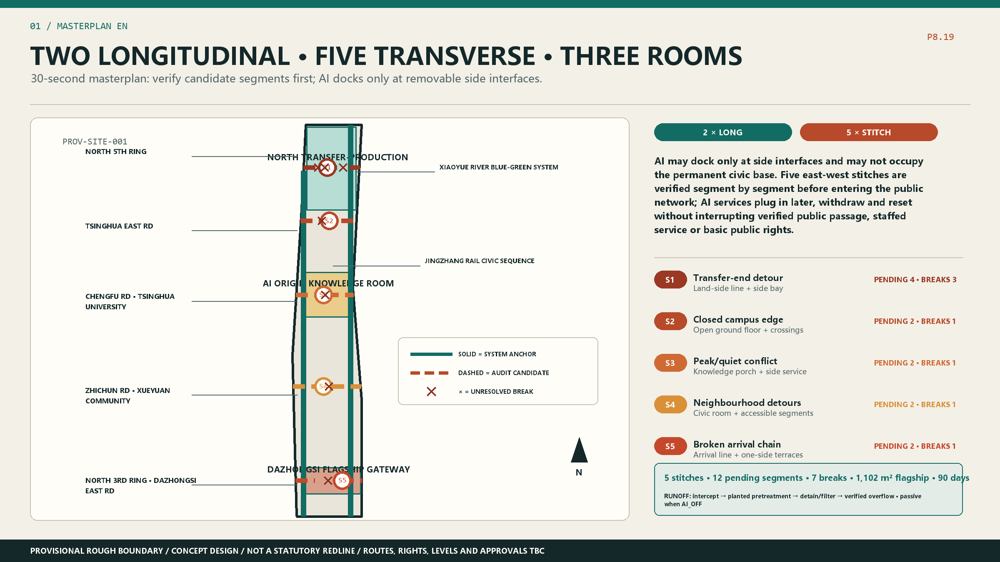

Figure 01 establishes an **Existing → Intervention → Proposed / Retained** chain with one viewport, orientation and urban fabric. Existing contains only medium-confidence OSM context, dated project-state relationships and five located obstacles. Intervention adds the paired public interfaces, five candidate evidence packages, six wing entries and three urban-room families. Proposed / Retained uses three real-context local windows to distinguish default retain, local permanent base after admission, reversible edge candidate with rights TBC, and gap / no connection. Every building remains default-retain with no inferred action; only registered low-confidence proposal geometry can become a later admission candidate, while ordinary streets, water and unresolved gaps remain in place. OSM is background cross-check evidence for buildings, roads, rail, water and green space; it is not a legal boundary, tenure record, survey, lawful route or building retain/alter/remove decision. The whole drawing must be reprojected when the official 11.4 km² boundary geometry arrives.[source:F2-SRC-OSM-BBBIKE-20260811] [data:geometry/buildings.geojson] [data:geometry/constraints.geojson]

The proposal decides only where evidence allows: verified paths and public-side conditions form the base; three carriers are locally reversible prototypes; unknown continuity remains visible, with ordinary streets, public transport and staffed service as fallback. When authoritative data arrives, every extent-dependent layer, proportion and metric must be rechecked together.

### JURY PATH · 11.4 km² Overall Structure

Two longitudinal public interfaces form the conceptual frame. S1–S5 are independent evidence packages, not an unverified continuous new road. At this round they contain 12 pending design segments, seven unresolved breaks and zero verified continuous routes. Solid lines show pending segments only; red × marks public-background obstacle envelopes and proves neither rights, clear width, gradient, levels nor a legal crossing. Each package records connection objects, evidence level, minimum action, responsible role, fallback and phase. Geometry, metrics and drawings are regenerated together when an accepted input changes.[data:geometry/roads.geojson] [source:F2-SRC-OSM-BBBIKE-20260811]

Figure 02 | Overall structure: two longitudinal interfaces, five transverse stitches, three rooms and the Phase 1 Dazhongsi flagship.

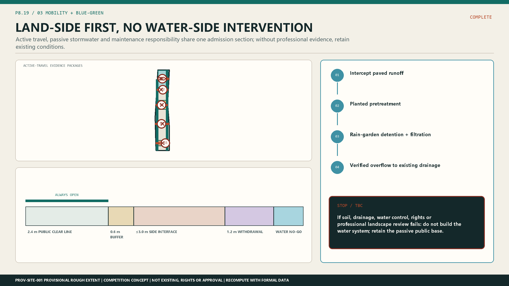

Figure 03 | Active travel, blue-green and maintenance admission: no intervention on the water side; land-side passive stormwater and passage require professional verification.

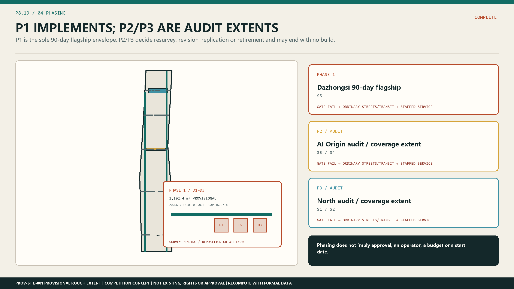

Figure 04 | Three phases: Dazhongsi flagship—AI Origin staffed service—North testing logistics; failure in any phase returns to ordinary transport and human service.

## Three-Level Scope Framework

The three scales address different questions rather than enlarging one diagram. The coordinated research area tests industry links, talent services and regional retesting. The overall design area organises public space, walking, blue-green systems and renewal mechanisms. Three key areas test the proposition through tangible, maintainable and removable carriers. Each major decision follows the chain: site fact—spatial problem—design mechanism—human responsibility—proof drawing.[depth:three_level_scope_framework]

The **scope-robustness rule** uses the current official-repository feature `PROV-SITE-001` as the sole submitted extent. Its recalculated area is about 11.413 km², consistent with the taskbook's approximate 11.4 km² wording, while its attributes remain `official_boundary=false` and `boundary_precision=provisional_rough`: it is for generation, display and temporary self-check only, not a statutory redline. Public-space, green-space and delivery extents are re-derived inside it and remain conceptual / TBC. A future official or cleared precise boundary must replace it together with recorded source, version, CRS and conversion method, followed by complete recalculation.[data:geometry/site_boundary.geojson] [depth:three_level_scope_framework]

#### Proposition and five states

**GROUND STATE JINGZHANG: Two public interfaces and evidence-gated transverse stitches repair east–west fragmentation, forming a civic interface network hosted by three distinct urban rooms, subject to human veto and physical return to a permanent public base.**

Figure 01 first places the existing fabric and obstacles in one frame, separates the two interfaces, five cross-stitch packages and three urban rooms, and then shows what is added after admission, what remains by default and which gaps stay unresolved. The working envelope must not be read as a statutory extent.

The five governance states are **BASE**, with the carrier stored and permanent public services continuing; **ADVICE**, in which AI provides an explainable recommendation but the space does not move; **ACTIVE**, in which a human-approved carrier unfolds inside a hard boundary after inspection; **FREEZE**, in which a human locally locks the carrier after risk, timeout or loss of responsibility; and **RETURN**, in which the carrier visibly retracts and returns to BASE after human confirmation. Because ADVICE does not change physical space, the website and drawings demonstrate only four physical states: BASE—ACTIVE—FREEZE—RETURN. TRANSITION is a controlled action phase inside activation or return, not a sixth state. AI may recommend only within verified conditions and cannot change any spatial state by itself.

#### Turning the six tasks into space

| Task | Spatial and operational translation | Visible proof |
|---|---|---|
| Overall concept, name and visual system | A “segmented baseline” as the master mark; a sub-symbol for each carrier; extensions to site plates, web status and annual events | Masterplan, symbol family, state legend |
| Global cases and innovation ecosystem | Six precedents transfer mechanisms and conditions only; eight factors form a service loop through two wings | Precedent matrix, ecosystem loop |
| AI-enabled daily life | Four core constituencies receive different services at three sites; all twelve scenarios retain human authority and AI-off fallback | Service matrix, three AI-native chains |
| Public space and landmarks | The public base comes first; three landmarks support inquiry, correction and shutdown | District plans, sections, landmark actions |
| Centennial cultural narrative | Railway fact—open knowledge—AI version records become public actions at three sites | Cultural route, correctable time markers |
| Annual operation | Public problem, place-based test, public review, replication or stop | Annual loop, responsibility and exit rules |

[source:F1-SRC-001-AGENT-TASKBOOK] [metric:positioning_count] [metric:function_count]

## Coordinated Research Area: Industry and Future City Research

At the coordinated scale, the “innovation belt” is not a homogeneous development axis. It is an evidence network of three distributed urban-room families and two cross-area interfaces. The three positions are a Centennial Jing-Zhang cultural belt, an urban AI-life experience belt, and an AI convergence innovation belt. The five functions are a public knowledge threshold, full-stack innovation validation, scenario enablement, everyday services, and accountable governance. The **Technology Service Wing** uses public-side thresholds and service rooms at campuses, parks and institutions for eligibility checks, scheduling, expert referral and result records. The **Scenario Enablement Wing** uses land-side test bays and observation rooms at public-space and Xiaoyue edges for problem intake, risk screening, field tests, feedback and stop. Neither wing is a new land-use band, official zone or continuous road; each is a spatial carrier network with a distinct morphology, public realm and operating condition.[standard:PROJECT-AGENT-OPEN-CALL-TASKBOOK] [depth:overall_spatial_structure]

#### Six precedents: transfer mechanisms, not forms

| Precedent | Transferable principle | Applicable condition | Avoid |
|---|---|---|---|
| Kendall Square / Volpe | Innovation development must deliver usable public benefit | Public-side boundary and deliberative responsibility are clear | Copying US zoning numbers or development-right relations |
| MaRS Discovery District | Neutral referral and staged commercialisation | Updated directories, conflict disclosure and a stop route | Transplanting brand, property scale or finance performance |
| Paris-Saclay | Multi-district cooperation with place-by-place review | Independent local approvals and environmental priority | Treating new-town scale or alliances as existing conditions |
| Punggol Digital District | Bounded testing in a real environment | Data permission, expiry, emergency stop and fallback | Assuming a unified developer or platform capability |
| Seoul AI Hub | A full-stack chain from models and tools to validation and translation | Responsibility, access and revocation for every link | Claiming equivalent local facilities or outcomes |
| Testbed Helsinki | Open problem, urban site, evidence and stop | A named site responsibility and public-interest boundary | Substituting innovation language for a public problem and exit |

The first three sources support the comparison of public return, referral and multi-district cooperation.[source:F1-SRC-004-KENDALL-VOLPE] [source:F1-SRC-005-MARS] [source:F1-SRC-006-PARIS-SACLAY]

The final three support the comparison of real-environment testing, full-stack support and urban experimentation.[source:F1-SRC-007-PUNGGOL] [source:F1-SRC-008-SEOUL-AI-HUB] [source:F1-SRC-009-TESTBED-HELSINKI]

#### Eight factors and conditional regional retesting

Foundational research, tools and computing, talent learning, enterprise incubation, capital and procurement referral, real-world scenarios, civic governance and international exchange are linked through one loop: open problem—capability match—small test—public evidence—replicate or stop. Talent receives open learning, mentors and real problems. Enterprises receive bounded validation and neutral referral. Residents receive services without an app, continuous access and appeal. Public governance receives explainable recommendations, human veto and retirement records.

A mature mechanism may invite **new authority checks, a new baseline and retesting from the smallest state** in Beiyuan, Future Science City, Huairou, E-Town or elsewhere in Jing-Jin-Ji. The proposal does not claim an established partnership, joint operation or continuous interregional space.[source:F1-SRC-010-FUTURE-SCIENCE-CITY] [source:F1-SRC-011-JJJ-INNOVATION]

## Overall Design Area: Urban Renewal and Regulatory-Plan-Level Urban Design

The overall design forms an **Evidence-Gated Civic Stitch Ladder**. The primary system pairs the Jing-Zhang civic interface with the Xiaoyue land-side blue-green interface recorded in dated public construction reporting. Existing streets and public transport form the secondary arrival system; three distributed urban-room families are the delivery units. The Zhongguancun technology-service wing enters through public thresholds and service rooms at campuses, parks and communities. The scenario-enablement wing enters through test bays and observation rooms on the Xiaoyue land side and other verified public edges. A northern transfer audit locus, Qinghua East Road, Chengfu Road, Zhichun Road and Dazhongsi become five independently deliverable verification packages, not an imagined continuous new road. Public reporting supports Qinghua East Road as a system relation between Jing-Zhang Park, Xueyuan Road and Xiaoyue River, but does not prove that a complete walking route is finished; the other relations remain candidate audits or explicit gaps. An interface enters the Permanent Public Base segment by segment only after rights, safety, accessibility and maintenance checks. Until then, the break remains visible and ordinary streets and public transport carry the connection.[source:F1-SRC-018-TSINGHUA-EAST-ROAD] [data:geometry/roads.geojson] [depth:overall_spatial_structure]

Figure 01 selects an **existing arrival hierarchy** from the dated OSM context instead of drawing another fictional greenway. North Fifth Ring, North Fourth Ring, North Third Ring, Qinghua East Road, Chengfu Road, Zhichun Road, Dazhongsi East Road and Xizhimen Outer Street form primary street context. Xueyuan Road, Zhongguancun East Road, Xitucheng Road, Shuangqing Road, Xiaoyue River West Road and Gaoliangqiao Xiejie form secondary arrival context. Rail / transit and public-space support with explicit `access=yes` remain contextual layers only. None proves lawful access or continuous walking. Five packages attach as “stop / existing fallback” nodes and return to mapped streets or public transport when a gate fails.[source:F2-SRC-OSM-BBBIKE-20260811]

#### Two locatable spatial systems for the wings

The wings are not interchangeable zones but two spatial-interface systems located through North Transfer, Qinghua East Road, AI Origin / Chengfu Road, Zhichun Road and Dazhongsi. The **Zhongguancun technology-service wing** uses public-facing thresholds of campuses, institutes, parks and office fabric: fixed staffed windows, quiet waiting edges and one-room EDGE-HOUSE units form a distributed knowledge-service frontage without entering closed compounds or automatically assigning institutions to the wing. The **Xiaoyue scenario-enablement wing** uses the land side recorded in dated public construction reporting, community edges and maintenance interfaces: dated event inputs, observation points, conditional test bays and a water-side NO-GO form an evidence frontage without claiming the current construction status, a continuous open riverwalk or a hydraulic system. The first requires a public host, staff and a reversible room; the second requires a dated input, human gate and AI_OFF base. Swapping the labels breaks the duty chain. The six rows below are a responsibility crosswalk for how the two systems meet three room families, not six continuous entrance geometries.

| Wing–site entry | Existing side and spatial carrier | Admission evidence | Stop / exit |
|---|---|---|---|
| TS-AI · Technology-service wing—AI Origin | Chengfu Road public side → EDGE-HOUSE knowledge threshold | public-side rights, clear line, quiet and staffed service | if any fail, do not deploy; close room, retain passage |
| TS-DZS · Technology-service wing—Dazhongsi | candidate office / cultural mixed frontage → staffed referral threshold | frontage access, accessibility, neutral service and local permission | screening, congestion or unresolved complaint closes the referral point |
| TS-NORTH · Technology-service wing—North Transfer | candidate park-side landward threshold → fixed information and staffed service point | public access, host consent and maintenance takeover | without manual takeover or a clear edge, do not install the service point |
| SE-AI · Scenario-enablement wing—AI Origin | candidate community / campus-mix side → one-room controlled service test | eligible public problem, data minimisation and per-session human approval | quiet, fairness or clear-line harm returns to BASE |
| SE-DZS · Scenario-enablement wing—Dazhongsi | transit-arrival public side → one-sided TERRACED FORECOURT observation unit | booking category, arrival observation, access and safety review | if staff cannot guide or cancel, do not activate; withdraw the terrace |
| SE-NORTH · Scenario-enablement wing—North Transfer | Xiaoyue land side → LINEAR SIDE-BAY test bay | water-maintenance boundary, named duty, emergency stop and test envelope | AI_OFF or near miss mechanically locks the bay for human review |

The six responsibility relations' exact boundaries, rights and continuity await formal data and field verification. Unknown portions remain disconnected in the drawings. The Explorer adds same-site, same-task and same-gate A / B / C counterfactuals: AI Origin rejects two-sided rooms that cross the clear line; Dazhongsi rejects central or four-quadrant terraces that interrupt arrival; North rejects an unverified waterside deck and a fictional continuous riverwalk. The selected option also publishes its lost capacity, area or direct waterside experience.[data:geometry/key_areas.geojson] [data:geometry/roads.geojson]

The figure below translates wing responsibilities into three distinct physical chains. The technology-service wing mainly provides bounded knowledge and staffed-service inputs; the scenario-enablement wing provides test or arrival events only after human approval. AI recommends; only a human decision changes an edge carrier, while the public clear line remains. If AI is offline or any admission gate fails, the carrier locks or withdraws and staffed fallback continues. The figure infers no building action, ownership or statutory use.[source:F2-SRC-OSM-BBBIKE-20260811]

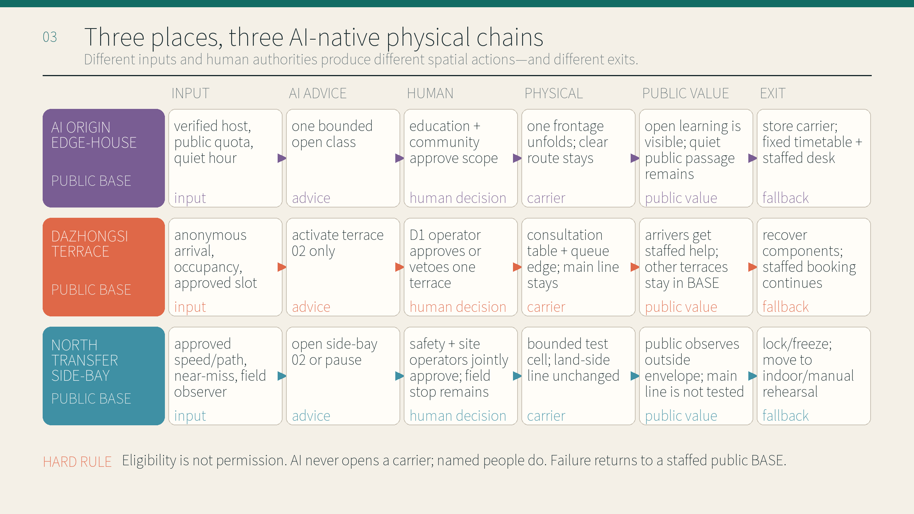

#### Permanent Public Base components and brand system

Eleven components provide a clear route, seats and shade, fixed lighting, bilingual wayfinding, historical time markers, staffed inquiry, accessible resting, mechanical locking, drainage and maintenance interfaces, paper rules, and correction/appeal access. They serve daily life first and do not depend on an event or digital system being online.

All three interfaces use one set of **next-stage design-control targets**: a 2.4 m public clear line, a 0.6 m buffer between clear line and reversible band, no more than 3.0 m for one reversible band, a 1.2 m maintenance target and no more than 2% crossfall. Longitudinal grade must be surveyed; above 5%, a separate accessible solution is required. These values are measurable competition controls, not site measurements or compliance findings. They may be adopted only after survey, rights verification and accessibility, transport, water, fire and upkeep review. Daily BASE uses are respectively “seats + staffed window + passage,” “arrival + waiting + wayfinding,” and “walking + rest + works information.” AI Origin deploys only toward the public side; Dazhongsi cancels its unit if grade or underpass access conflicts; the northern bay neither crosses the river nor occupies a water-maintenance strip.[depth:three_key_area_detailed_design]

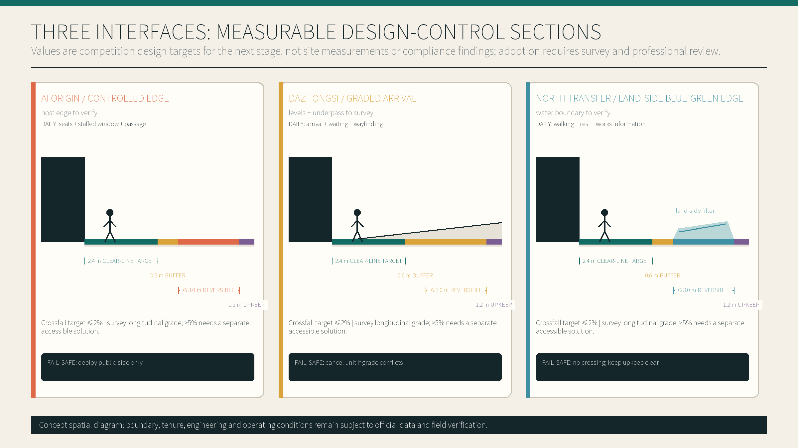

The master “segmented baseline” mark combines one graphic civic baseline with three opening fragments. The baseline expresses a public-access norm that cannot disappear; it does not claim an existing continuous route on the site. The fragments become the EDGE-HOUSE doorway, TERRACED FORECOURT step and LINEAR SIDE-BAY recess symbols. The family can extend to site plates, web status, event guides and contribution records, but it does not impersonate municipal signage or an official logo. Place names, accessibility and safety information remain subordinate to approved public-wayfinding standards.

The annual event series uses a recognisable **GROUND STATE OPEN SEASON / 基态开放季** communication system: the segmented baseline is the event mark; three carrier sub-symbols identify place; BASE / ADVICE / ACTIVE / FREEZE / RETURN stamps disclose the physical condition; and a source—responsibility—expiry tab shows whether content remains valid. Site posters, web pages, bilingual briefs and international-event material use the same structure. It communicates a restrained, open and correctable urban character: railway engineering clarity, Zhongguancun knowledge-sharing and transparent AI decisions. International communication leads with verified problems, public evidence and exit records rather than generic futurist claims.

#### Relative intensity and massing

Intensity is comparative, not statutory. AI Origin is a public knowledge threshold with a low reversible edge. Dazhongsi activates one unit on one side to manage peak arrival. Zhongzhiyuan places a narrow test bay only outside a land-side clear-line segment that has passed verification. Heights, floor-area ratios, building areas and retain/demolish decisions await statutory plans, surveys and professional review.[depth:development_intensity_controls] [standard:MOHURD-CONTROL-DETAILED-PLANNING]

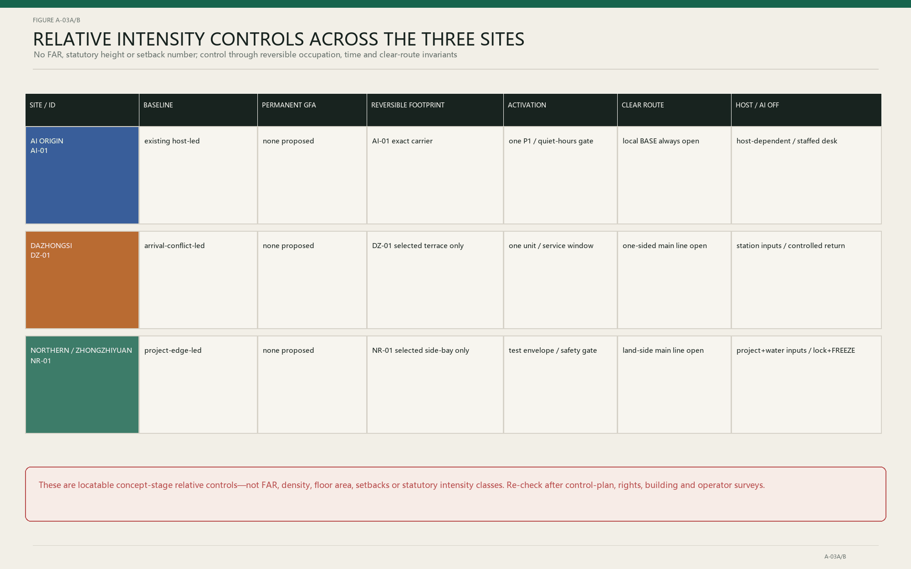
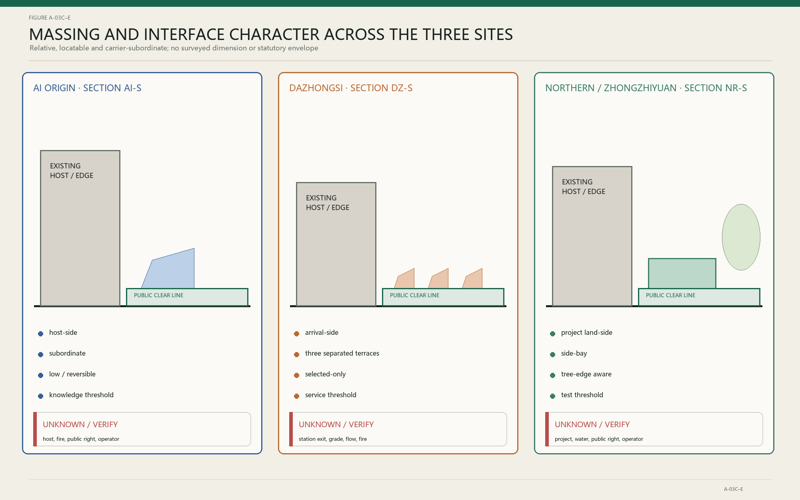
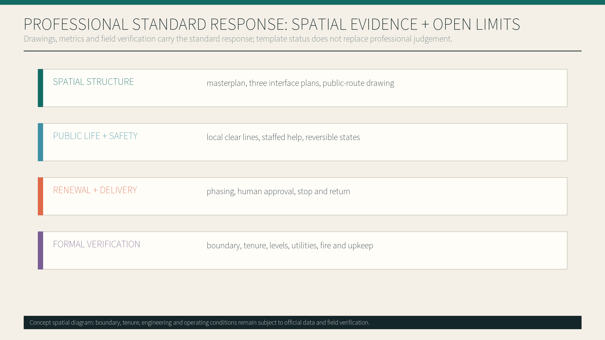

### JURY PATH · Three Key Areas

Each area enters the overall structure through a distinct failure mode, human role, spatial component and everyday journey. The areas remain recognisable when their labels are hidden; they are not three copies of one state template.[data:geometry/key_areas.geojson] [depth:three_key_area_detailed_design]

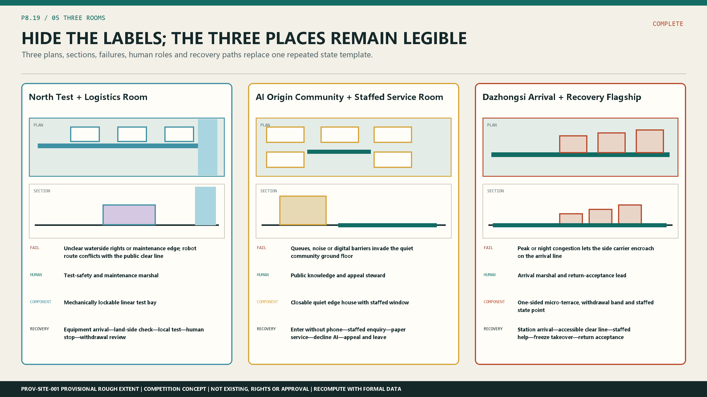

Figure 05 | Non-isomorphic evidence: North testing logistics, AI Origin community staffed service and Dazhongsi arrival recovery.

## Detailed Design of Key Areas

The three key areas are representative samples of three urban-room families and cannot exchange names. AI Origin is a high-frequency controlled edge room; Dazhongsi is an arrival foyer for four-quadrant connection audits; North Transfer (the Zhongzhiyuan pilot) is a sparse campus foyer with a land-side test bay. Their arrival conditions, public-space types, innovation roles and failure modes differ. Each protects a permanent clear route before allowing one carrier to change locally.[depth:three_key_area_detailed_design]

Three equal-extent OSM windows establish whole-area networks before dashed local-pilot boxes and overlay repository `PROV-KEY-001/002/003` provisional extents in low contrast. AI Origin is a campus–street seam / knowledge threshold—quiet service edge—one room / Chengfu mapped fallback / technology-service and scenario-evidence entries. Dazhongsi is a four-quadrant arrival field / east arrival—distributed foyers—one terrace / mapped station, Third Ring and Dazhongsi East context / service and observation entries. North Transfer is a campus–expressway–river edge / land-side foyer—main clear line—conditional bay / mapped Fifth Ring, Shuangqing and rail context / staffed-service and test-maintenance entries. Neither the viewports nor the provisional extents are statutory key-area boundaries or survey, and a local pilot cannot stand in for implementation across the whole area.

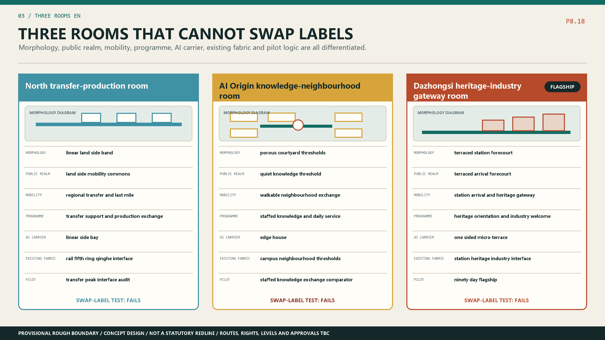

#### AI Origin: EDGE-HOUSE

EDGE-HOUSE forms an accessible knowledge threshold along the public side of Chengfu Road. In BASE it offers shade, seating, railway and Zhongguancun time markers, staffed inquiry and information without an app. In ACTIVE one opening room hosts an open class, mentor clinic or small public service. Anonymous demand and accessibility status may inform an AI suggestion for time and layout; education, local and public-interest roles approve each use. Blocked passage, quiet-hour burden or worsening fairness triggers FREEZE and retraction.

Chengfu Road is the one fully drawn local movement reference chain: **dated OSM transit/street origin → mapped Chengfu segment → crossing gate → 2.4 m public clear-line target → EDGE-HOUSE**. An adjacent `access=yes` feature is only public-space support; it does not prove route continuity or rights. Station exit/lift, crossing, cycle parking, host edge, public-side rights and service/fire access remain TBC. The 2.4 m value is a next-stage target, not an existing measurement. If any gate fails, the chain stops at that segment, the carrier does not deploy, and fixed wayfinding plus a staffed point return people to the existing mapped carrier. AI_OFF produces the same physical public BASE.

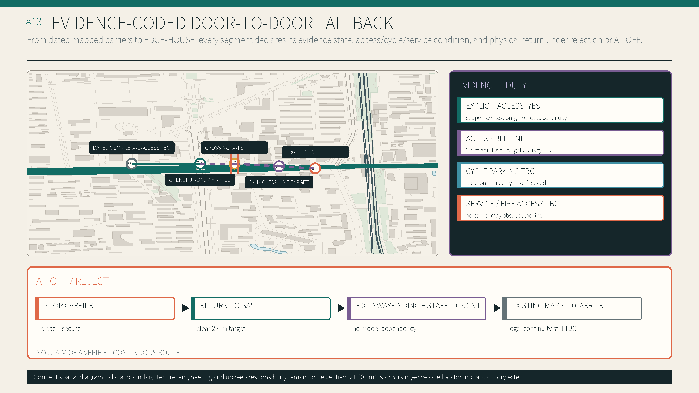

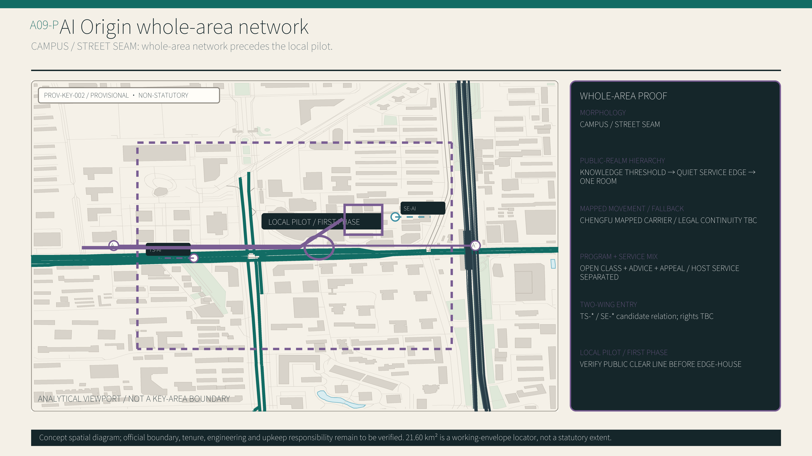
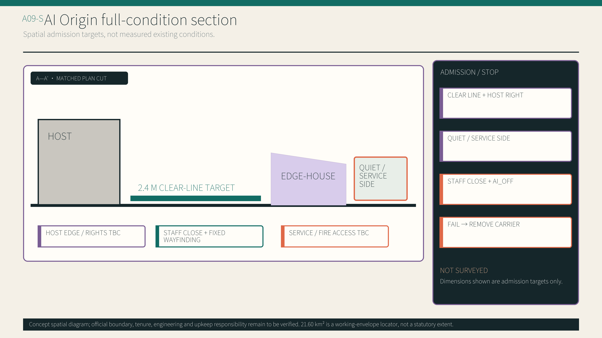
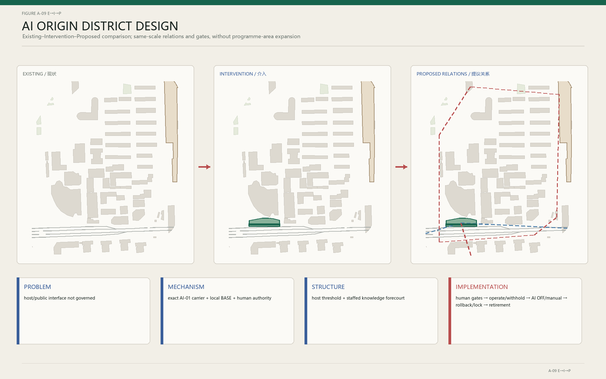

#### Dazhongsi: TERRACED FORECOURT

Dazhongsi makes segment-by-segment verification of an east-side clear arrival line an admission condition and does not currently claim continuity. D1–D3 are three discrete survey-pending envelopes inside the conceptual public band. Each measures approximately 20.66 × 18.05 m and 367.47 m² from the current EPSG:4548 geometry, with approximately 16.67 m clear gaps and a combined area of approximately 1,102.40 m². These are neither existing-condition measurements nor construction positions; each envelope must move or be withdrawn after station-exit, fire-access, heritage, property and utility surveys. If checks pass, one TERRACED FORECOURT unit at a time may host consultation, demonstration or short waiting. The **ARRIVAL-STATE CLOCK / 到达状态时钟** displays BASE, ADVICE, ACTIVE, FREEZE or RETURN and the responsible human role. AI may use anonymous booking, occupancy and human observation to recommend opening, reducing or cancelling. Any movement, accessibility or safety conflict triggers a human freeze.[data:geometry/phasing.geojson] [data:geometry/roads.geojson]

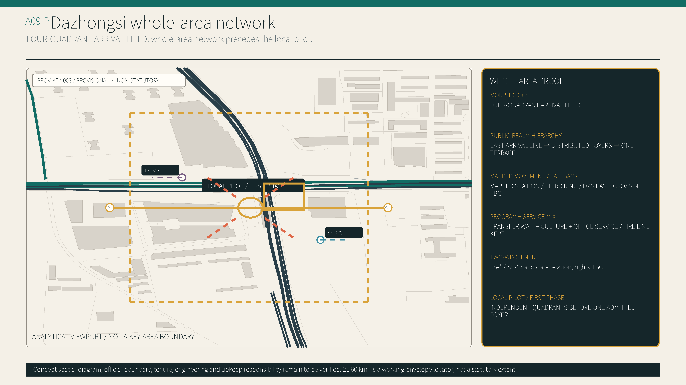
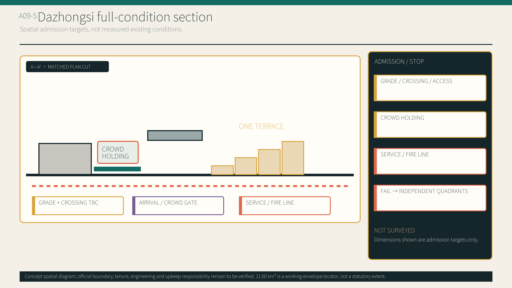
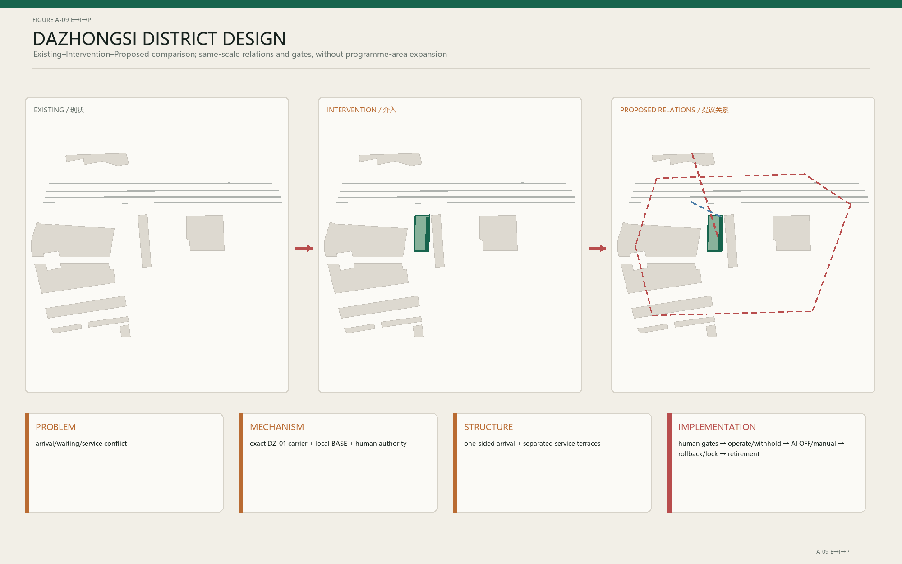

#### North Transfer (Zhongzhiyuan pilot): LINEAR SIDE-BAY

The Zhongzhiyuan pilot places a LINEAR SIDE-BAY on the land side of 0807-604 beside the Xiaoyue River. Only verified land-side clear-line segments may enter the public base; unknown portions remain disconnected. The bay may host delivery-robot safety testing, multilingual historical interpretation or engineering-interface information. It does not open if water, project-boundary, public-access or maintenance conditions fail. AI may recommend an action using approved trajectories, speed, emergency-stop events or content versions. Test safety, local and cultural roles decide separately. Public stop, intrusion, expired information or missing maintenance returns the bay to BASE.

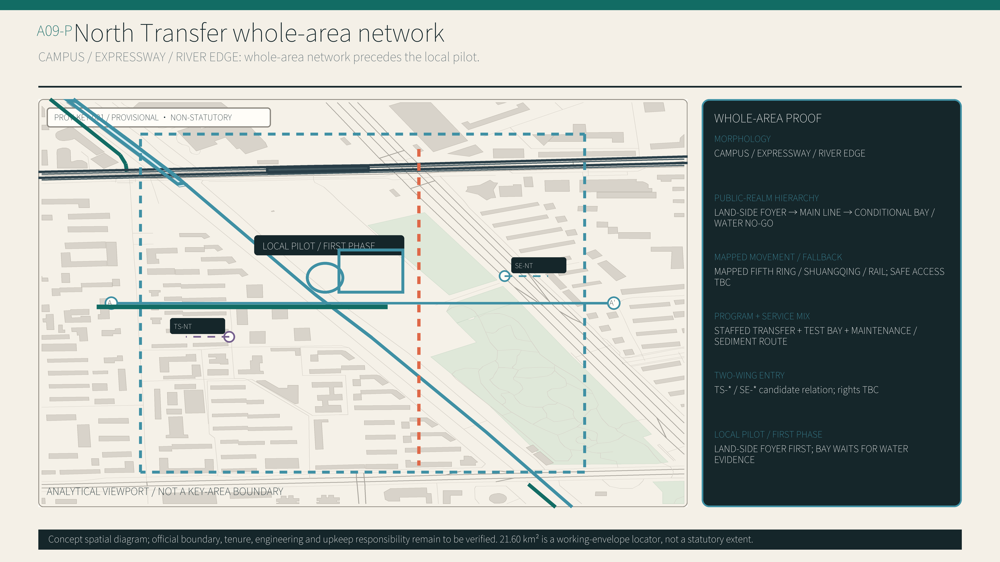
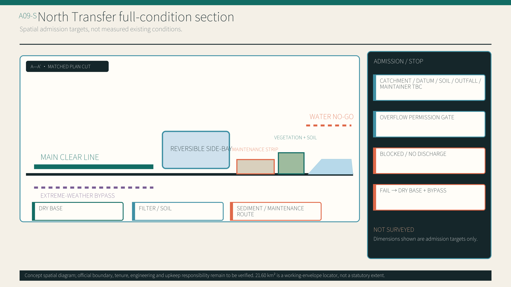
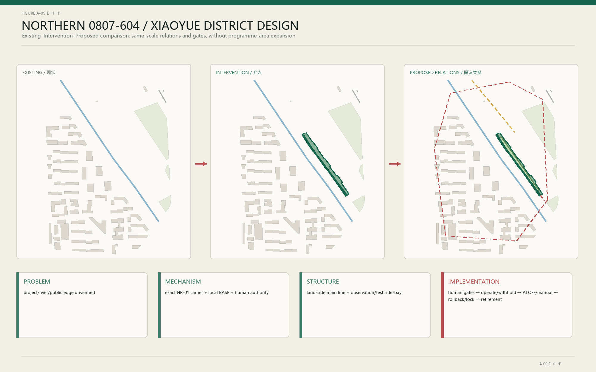

#### Three working civic landmarks

The Open Version Gate at AI Origin displays sources, versions and correction access. The Arrival-State Clock at Dazhongsi displays unit state, responsibility and the next review. The Retirement Bay at the Zhongzhiyuan pilot displays test limits, emergency stop, failure and retirement records. None is a spectacle: legibility and the clear route are checked daily; content and mechanical locks are checked before activation; overdue maintenance stops the display or closes moving parts while staffed inquiry and fixed information remain.

#### Two AI public mechanisms around the railway heritage park and at Dazhongsi

Around the Jing-Zhang Railway Heritage Park, the proposal acts only on **verified accessible public sides or existing public space**. It does not presume the park boundary, approval status or a continuous walking route. Verified historical material, public questions, accessibility status and observed capacity may trigger an AI recommendation for content order, language or the time of one reversible display. Local, cultural-curatorial and accessibility roles decide whether to use it. A **Railway Evidence Threshold** becomes the physical mechanism: survey and cultural assessment first verify railway orientation and visible fabric; only then may a non-contact alignment datum, source-numbered time marks and a removable observation frame be placed on the public side. Any existing element follows the decision order **retain in situ first → protect and interpret → adapt only after specialist heritage review → no intervention**; nothing is attached, moved or replicated without that review. A3 p.16 uses a CC BY-SA 4.0 photograph of Tsinghuayuan Station dated 2023-10-03 whose source original is 4096×1904 and print derivative is 2400×1116. It is a **dated visual record**, explicitly not evidence of 2026 conditions, protection controls, tenure or approval. The 1910 construction and 2013 survey-register dates come from a Haidian District Government record; 2026 status still requires field and current heritage-file verification. Fixed markers and staffed inquiry carry interpretation and correction, while one approved AI Origin EDGE-HOUSE room is the only reversible indoor carrier named here. If AI is unavailable, fixed bilingual content, paper correction and staffed interpretation remain. Any segment that fails rights, heritage, safety, accessibility or maintenance checks stays a visible gap.[source:F1-SRC-019-QINGHUAYUAN-2023-CC] [source:F1-SRC-020-HAIDIAN-QINGHUAYUAN-HERITAGE]

At Dazhongsi, AI-native consumption and business means a **one-unit, short-duration, cancellable public-side service**, not a presumed commercial entity or fixed business model. Anonymous bookings, service type, arrival and occupancy may trigger an AI recommendation for the time, layout or cancellation of one TERRACED FORECOURT unit. Local, safety, accessibility and public-interest roles approve or veto it. An approved unit may host product experience, public consultation or a temporary business meeting while the main arrival line and free public periods remain. If AI is unavailable, staff use manual booking, a fixed session or cancellation. Blocked movement, exclusionary selection, misleading service, accumulated complaints or failure of human takeover triggers FREEZE and retraction.

### JURY PATH · Dazhongsi Flagship

The Dazhongsi side-interface arrival hall is the sole flagship. A multi-scale concept-control framework uses location intent, not-to-scale plan and section, and interface assembly relationships to locate the public clear-line target, safety buffer, side service band, maintenance/withdrawal band, state and staffed-service point. D1–D3 dimensions come only from the current concept geometry; every envelope must move or be withdrawn after station-exit, fire, heritage, property and utility surveys. They are not existing measurements, construction drawings or approvals.[data:geometry/phasing.geojson#PH-P819-01-DAZHONGSI] [depth:three_key_area_detailed_design]

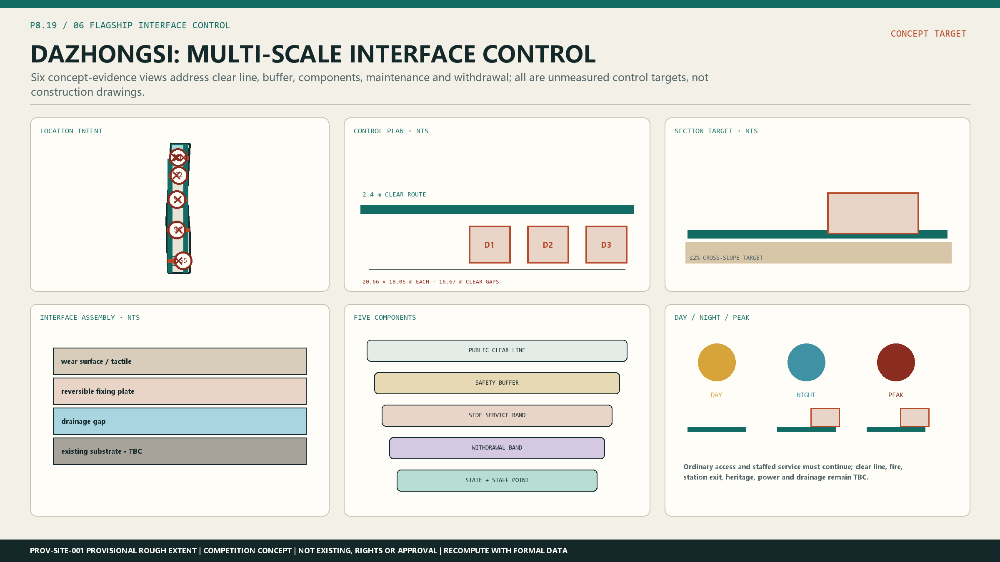

Figure 06 | Six Dazhongsi drawing types: location, plan, section, interface, component assembly and day/night or peak states.

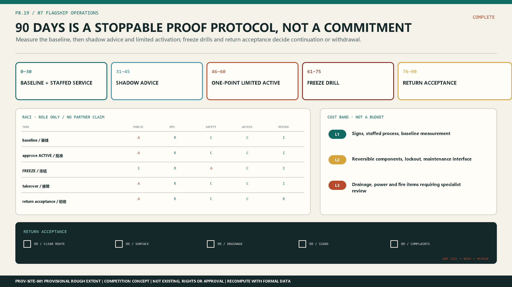

Figure 07 | 90-day pilot, concept cost bands, RACI and return acceptance; no invented partner, budget or start date.

### JURY PATH · Everyday Journeys and Five States

A person without a smartphone, a wheelchair user, an older person and a night arrival each complete entry—help—use—decline/failure—human takeover—leave/appeal. ADVICE changes information only. The formal spatial sequence is BASE—ACTIVE—FREEZE—RETURN, and every journey remains possible with AI_OFF.[metric:persona_count] [data:visual/assets/human-journeys.json]

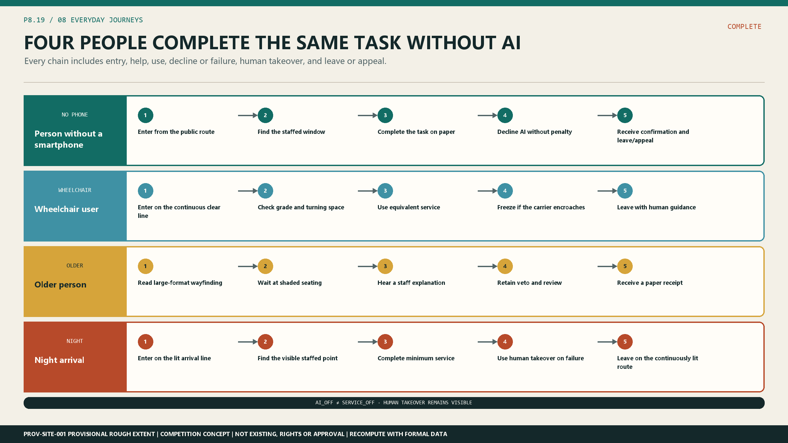

Figure 08 | Four everyday task chains and human takeover.

## AI Innovation Ecosystem, Personas, and AI+ Scenarios

AI-native urbanism is not a larger number of screens. Data or an event must trigger an explainable recommendation; a named person decides; a physical place changes; and a usable fallback remains when AI is unavailable. Four **beneficiary constituencies** come first. AI talent receives learning, mentors and real problems. Enterprises receive bounded, compliance-gated testing and neutral referral. Residents receive continuous access, public knowledge, low-threshold service and appeal. Public governance receives risk screening, state records, human veto and retirement evidence. The six **user and delivery roles** below are a different classification: they identify who acts at each carrier, who controls risk and what remains available without AI; they do not create new spatial zones.[source:F1-SRC-001-AGENT-TASKBOOK] [source:F1-SRC-015-GEN-AI-MEASURES]

#### Six user and delivery roles

| Role | Use need and place | Human control and AI-unavailable fallback |
|---|---|---|
| AI researcher | Open problems, mentor collaboration and reproducible experiment; AI Origin EDGE-HOUSE, Zhongzhiyuan LINEAR SIDE-BAY | Education/test-safety approval; fixed timetable, indoor testing and paper records |
| Startup or enterprise team | Bounded validation, service referral and short meeting; Zhongzhiyuan bay, Dazhongsi TERRACED FORECOURT | Data, safety, local and public-interest gates; manual booking or cancellation |
| Resident | Continuous passage, low-threshold service, quiet and appeal; Permanent Public Base at all three sites, staffed AI Origin window | Community, accessibility and local veto; fixed wayfinding, paper rules and staffed service |
| Public-governance role | Explainable recommendation, state record, correction and retirement; three civic landmarks, annual evidence review | Separated sign-off and independent review; static record and human deliberation |
| Maintenance/operations role | Service access, mechanical locking and clear shutdown; maintenance side of all carriers, fixed facilities | Maintainer has freeze authority; mechanical lock and retained base during outage |
| Visitor or student | Clear arrival, bilingual knowledge and open places; AI Origin open class, time markers at all three sites | Education/visitor-services capacity check; on-site enrolment, fixed content and staffed tour |

#### Three place-specific AI-native chains

**AI Origin · EDGE-HOUSE**

| Trigger and AI recommendation | Human decision | Spatial outcome and AI-unavailable fallback |
|---|---|---|
| Anonymous course demand, accessibility status and quiet hours trigger a time/layout suggestion for one room | Education, local, accessibility and community roles approve or veto | One room opens for learning and staffed service; fallback is a fixed timetable, paper enrolment and staffed window |

**Dazhongsi · TERRACED FORECOURT**

| Trigger and AI recommendation | Human decision | Spatial outcome and AI-unavailable fallback |
|---|---|---|
| Anonymous bookings, occupancy and arrival observation trigger a suggestion to open, reduce or cancel one unit | Local, safety, accessibility and public-interest roles sign or freeze | One terrace unit changes while the main arrival line remains; fallback is fixed marking, human guidance or cancellation |

**Zhongzhiyuan pilot · LINEAR SIDE-BAY**

| Trigger and AI recommendation | Human decision | Spatial outcome and AI-unavailable fallback |
|---|---|---|
| Approved trajectory, emergency stop, near miss or content version triggers a continue, contract, pause or correct suggestion | Test safety, local and cultural/water-related roles decide separately | The bay opens within limits while the main line remains; fallback is indoor testing, staffed tours or a fixed notice |

#### Minimum-data, human-power and appeal ledger

| Site | Minimum and prohibited input | Power and public entry | Visible physical state, AI_OFF and record |
|---|---|---|---|
| AI Origin | anonymous demand, eligible class, clear-line capacity; no face identity, social score or opaque eligibility inference | education / local approval, maintainer freeze; staffed window and paper form receive appeal | doorway state plate, one-room deployment and manual latch; after AI_OFF an approved session may run with staff to normal close, state / event records are published and raw demand is deleted after the announced review window |
| Dazhongsi | booking category, manual arrival observation, accessible-line capacity; no biometric ranking or inferred purchasing power | local / access / safety approval or freeze; arrival desk receives appeal | state plate faces arrival line; terrace deploys or retracts flush; after AI_OFF controlled withdrawal, fixed markings and staff guidance remain, decision / complaint records are retained and raw booking is deleted after review |
| North | screened test ID, named duty and safety / proximity event; no open-ended tracking beyond the test envelope | test-safety / local approval; physical emergency stop and public desk trigger review | land-side plate, gate and mechanical lock isolate ACTIVE / FREEZE; AI_OFF locks FREEZE, people release or retire, signed incident records remain and transient sensor events are deleted on schedule |

The authority order, appeal response time and retention period are next-stage operating conditions to be confirmed; they are not claims of appointed institutions or policies already in force.

#### Twelve scenarios and three industry tests

The twelve scenarios form three groups. Public knowledge and education cover staffed-service allocation, fair open-class matching, multilingual railway memory and removal of public-access barriers. Real-environment validation covers peak-arrival allocation, delivery robots, one-sided services and engineering-interface status. Civic governance covers quiet-hour protection, extreme-weather freeze, a distributed three-area open day and quarterly fairness/retirement review. Each is an individual record in `visual/assets/scenario-cards.json`, with input event, AI capability, human approver, physical action, failure stop, AI_OFF fallback and evidence paths. Approvers remain provisional role categories, not claims of appointed agencies.[depth:overall_spatial_structure] [metric:scenario_card_count] [data:visual/assets/scenario-cards.json]

Three industry tests compare knowledge/service matching at EDGE-HOUSE, a full-stack model/tool/safety chain at the Zhongzhiyuan pilot, and service booking/arrival at Dazhongsi. Each compares static rules, trained manual practice and AI-assisted practice. Without a real baseline, no AI advantage is claimed. Failure of clear access, fairness, safety, data permission or human takeover stops the test and restores BASE.[data:assumptions.json#A-F2-10]

#### Public innovation honour

The honour wall records verifiable contributions: open-source tools, fixes to public problems, maintenance, accessibility improvements, content corrections and responsible stops. Each record carries a source, contributor role, expiry and removal route. It does not expose sensitive personal data or equate finance, footfall or media attention with public value.

### Auxiliary atmospheric evidence

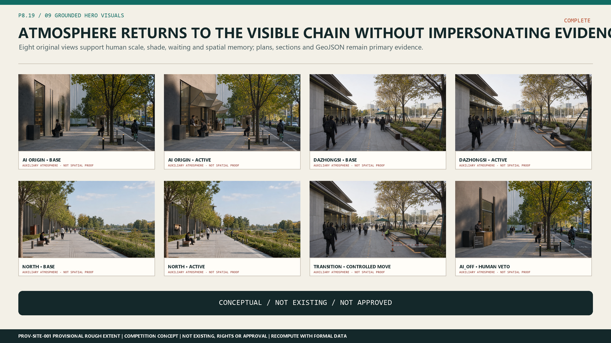

Figure 09 | Eight spatial atmosphere views restored as auxiliary evidence. CONCEPTUAL / NOT EXISTING / NOT APPROVED. They communicate human scale, shade, waiting and spatial memory; they do not prove routes, dimensions, rights or engineering conditions.

### JURY PATH · Implementation and Operations

Delivery follows BASE measurement—staffed service—shadow advice—limited activation—freeze drill—return acceptance. Responsibility is assigned only to generic roles such as public service, site operations, safety/maintenance, accessibility/public interest and independent review; no partner is claimed. Cost uses L1 signs and staffed process, L2 reversible components and maintenance interface, and L3 items requiring specialist engineering review, never a false precise budget.[data:geometry/phasing.geojson] [depth:phasing_implementation]

## Land Use, Building Scale, and Retain-Renovate-Demolish Strategy

When statutory plans, building surveys, rights, heritage and engineering conditions are incomplete, the responsible design decision is to protect public relationships before drawing precise development capacity. All three carriers attach to verified public-side or land-side conditions, retain existing hosts by default and add only reversible edge elements. Evidence does not support building-by-building demolition, new-build quantities or use changes.[depth:land_use_layout] [depth:retain_renovate_demolish]

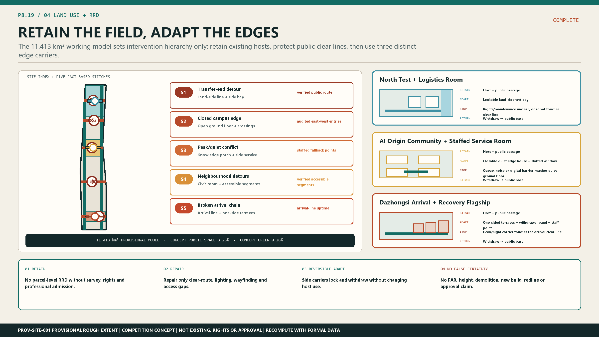

The district drawing no longer presents unconfirmed statutory classifications or an empty boundary as design output. Within the current 11.413 km² provisional working model, it locates two longitudinal public interfaces, five independent stitching problems and three types of edge carrier. The right column distinguishes retain, reversible adaptation, stop and fallback; the bottom hierarchy sets default retention, repair first, reversible adaptation and no invented precision as the limits of retain–repair–adapt decisions. The public-space and conceptual-green ratios are recalculated only from current submission geometry for internal consistency; they are not statutory indicators. Once authoritative information arrives, each location must be reassessed through the same sequence: existing condition—constraint—public value—reversible intervention—exit.

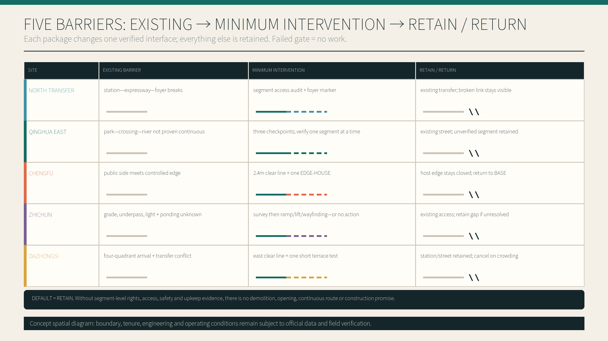
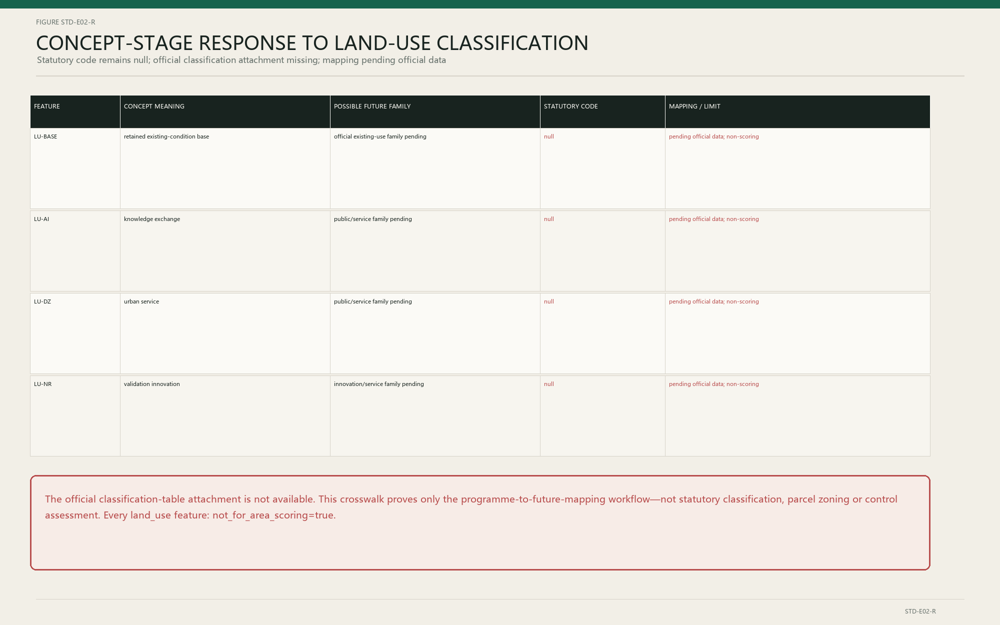

## Transport, Rail, Municipal Infrastructure, and Public Services

The primary transport outcome is not an unverified continuous greenway but a nested primary—secondary—delivery-unit relationship and three local clear routes that activities cannot occupy. The North Transfer audit first tests legal access and accessible fallback at the station-vicinity / expressway / water-interface condition. Qinghua East Road audits park side, crossing and river side separately. Chengfu Road protects the AI Origin public edge. Zhichun Road is located only by an OSM station-vicinity point; the exact underpass mouth, grade, lighting and drainage require survey before access can be judged. Dazhongsi audits four-quadrant arrival, transfer and its east-side main line. If any package fails, existing streets, public transport, fixed wayfinding and staffed service continue to carry arrival; coloured dashes never impersonate completed routes.[source:F2-SRC-OSM-BBBIKE-20260811] [depth:traffic_rail_slow_parking]

Concept sections reserve points for power, low-voltage data, lighting, drainage, maintenance, mechanical locking and emergency clearance, without claiming capacity, connection approval or engineering feasibility. Relevant specialists inspect before each transition. During power, network or AI outage, moving elements lock mechanically while lighting, fixed wayfinding, paper rules and staffed service continue.[depth:municipal_new_infrastructure]

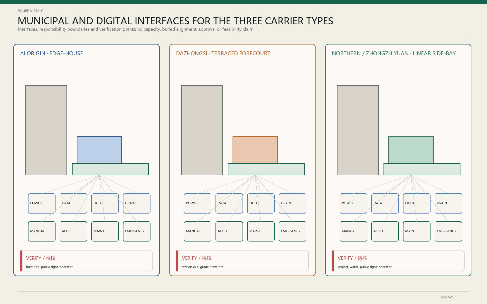
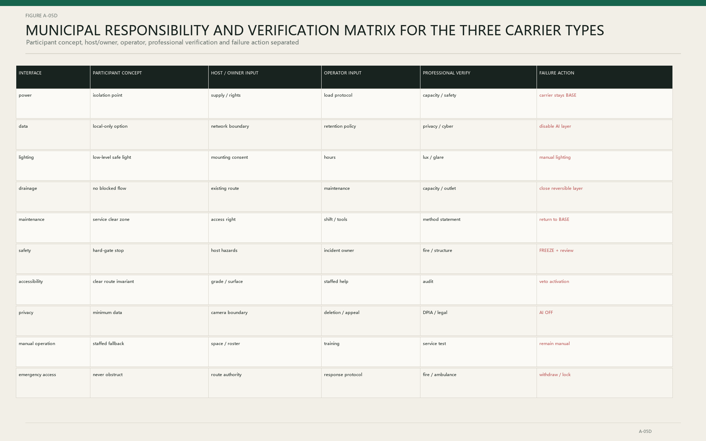
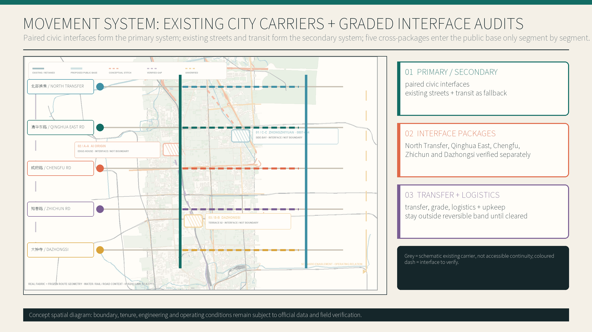

## Blue-Green Network, Public Space, and Urban Character

Public space follows a “verified segments, visible gaps” character. Fixed shade, a candidate planted filter, seating, bilingual time markers and staffed inquiry form a quiet background. Reversible interfaces use the same segmented baseline to disclose their temporary state. The district proof separates registered water / green context, dated project state, local candidates, maintenance access TBC and disconnected segments; it does not turn them into a drainage network. North Transfer is the only site admitted to a deep water-interface audit: on the land side it draws a dry base, an **approval-gated** local-capture candidate, filter-media concept, sediment inspection, overflow-permission gate and a blocked / no-discharge state. Shade, soil and habitat are only public-space support; no discharge to Xiaoyue River or hydraulic performance is inferred. AI Origin and Dazhongsi are explicitly downgraded to surface-runoff audits: “no mapped water / no hydraulic system claimed,” with only low-point, filter-interface and permanent-disconnect questions. Existing levels, water level, soil infiltration, catchment, permitted outflow, maintenance route and capacity must all be obtained before professional calculation. Until then, the proposal makes no storage, peak-reduction, flood-safety or statutory green-ratio claim.[depth:blue_green_public_space]

#### A walkable, correctable centennial cultural narrative

The cultural route consists of three kinds of **verified content and public action**, not an invented continuous heritage trail. Railway facts from Tsinghuayuan Station and related sources form fixed dates, places and directions at AI Origin. Zhongguancun's open-knowledge tradition enters EDGE-HOUSE and the Dazhongsi service forecourt through open classes, staffed interpretation and problem calls. AI-era versions, approvals, vetoes, failures and retirements enter the Open Version Gate, Arrival-State Clock and Retirement Bay. Every segment identifies its source, curatorial responsibility and correction route; unverified places or stories do not enter permanent markers.[source:F1-SRC-012-TSINGHUA-STATION] [source:F1-SRC-013-TSINGHUA-STATION-EXHIBIT] [source:F1-SRC-014-ZHONGGUANCUN-HISTORY]

Blue-green evidence uses one deep proof and two explicit non-systems. The North Transfer window treats only registered Xiaoyue-related water as existing context and pairs its plan with the same-ID BG-N1 conditional section. Dry, approved local-capture and blocked / no-discharge states never occupy the main clear line or a water-maintenance area. AI Origin and Dazhongsi contain no OSM-mapped water, so they no longer repeat North Transfer water, outfall or system symbols. Catchment, level / water level, soil, capacity, maintenance route, permitted outflow and rights remain TBC until formal evidence arrives.[source:F2-SRC-OSM-BBBIKE-20260811]

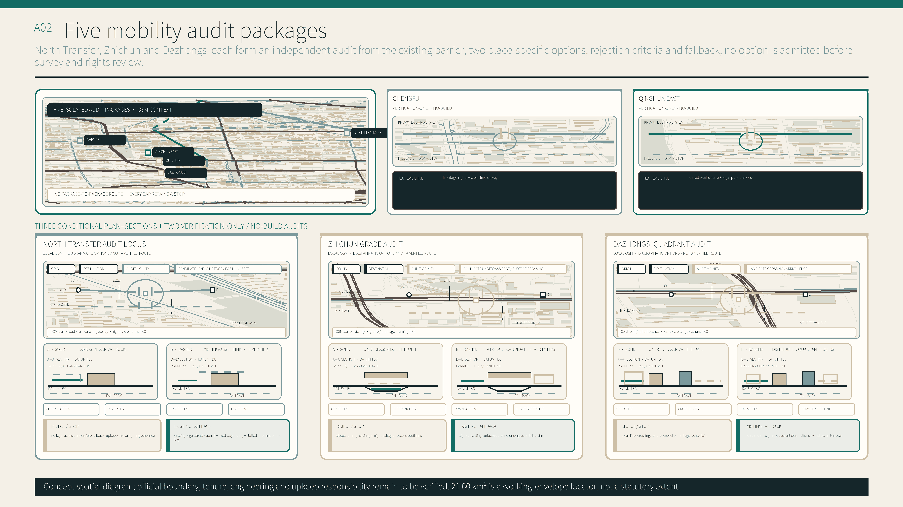
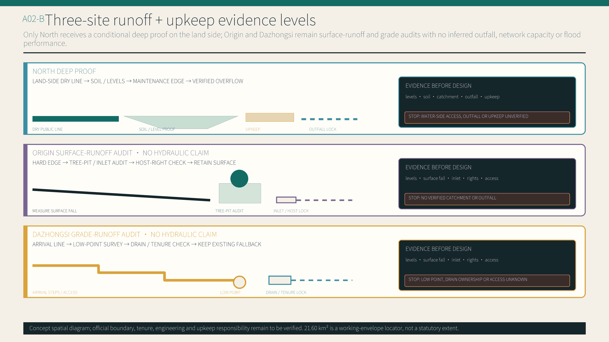

## Renewal Projects, Implementation Policy, and Phasing

Implementation begins by asking whether the public base can remain safely available, not by announcing an event calendar. On the district plan, each cross-package has its own audit vicinity, stand-alone public value, first physical action or verification-only outcome, admission evidence, duty role, fallback and retirement record. North Transfer produces a transfer-to-foyer access audit; Qinghua East Road publishes a three-system interface audit; Chengfu retains only a later audit task for a 2.4 m clear-line target and one EDGE-HOUSE room; Zhichun Road completes only a grade and underpass audit. The current phasing geometry is now unambiguous: **P1 `PH-P819-01-DAZHONGSI`** is the 1,102.40 m² discrete Dazhongsi concept-pilot envelope, **P2 `PH-P819-02-ORIGIN`** is the AI Origin audit/coverage extent, and **P3 `PH-P819-03-NORTHERN`** is the northern audit/coverage extent. P2 and P3 are not 90-day construction envelopes. Every package may end with no-build when a professional gate fails. Before P1, the concept must pass six open gates; P2/P3 decide replication, revision, off-site retest or retirement only. All institution names, budget values, permit numbers, insurance and procurement status remain unknown; failure at any gate means no TRANSITION.[data:geometry/phasing.geojson#PH-P819-01-DAZHONGSI] [depth:phasing_implementation]

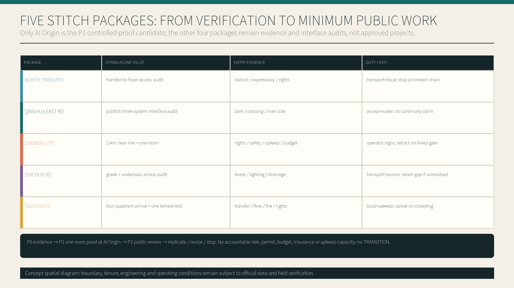

#### Annual operation and conversion loop

Twelve months form four quarters rather than twelve isolated festivals. In quarter one, civic-governance and accessibility roles publish problems, rules, appeals and exit conditions. In quarter two, education, enterprise-service and test-safety roles screen capability and run the smallest prototypes at AI Origin and the Zhongzhiyuan pilot. In quarter three, local, community and maintenance roles observe Dazhongsi services, extreme-weather response and AI-off drills. In quarter four, independent public review weighs burden, maintenance, failure and public benefit, deciding replication, revision or stop.[data:assumptions.json#A-F2-08] [data:assumptions.json#A-F2-11]

The talent path is open class—mentor—real problem—public result. The enterprise path is eligibility—small test—evidence—neutral referral. The resident path is problem—joint test—appeal—revision. The governance path is rule—approval/veto—audit—retirement. A short public record is issued monthly; clear access, fairness, safety and maintenance are reviewed quarterly; only evidence-backed work with continuing responsibility survives year-end. Work exits when it has no public benefit, cannot be maintained or cannot be taken over manually. Investment, finance and footfall do not substitute for that decision.

#### Developer community and international conversion

The developer community follows: open urban problem—onboarding and conduct rules—mentor match—controlled development—place-based test—open demonstration and documentation—public review—open source, incubation, referral or stop. A community coordinator owns problems and participation rules. Data and test-safety roles guard compliance gates; local and public-interest roles decide whether work enters a site; maintainers may freeze it at any time. Problems, versions and failure summaries are published monthly, with quarterly review of public value, participation equity and maintenance burden. Work exits if it cannot identify sources, support human takeover, repeatedly occupies the public base or lacks maintenance responsibility.[source:F1-SRC-001-AGENT-TASKBOOK]

An international open day or forum within Ground State Open Season is not the end of communication. A bilingual problem call first enters eligibility review; short visits, open classes or mentor meetings then match a team to a local problem. Only teams that pass site, safety, data and public-interest gates enter the smallest test. Talent may proceed to mentor, research or talent-service referral. Enterprises may proceed to neutral service, retesting or procurement exploration, without any promise of recruitment, tenancy, procurement, investment or partnership. Community coordination, enterprise service, site safety and civic-governance responsibilities remain separate. A conversion-and-stop summary is published within one month and continuation is reviewed quarterly. A relationship exits if it creates no local public value, becomes publicity-only or cannot carry maintenance responsibility.

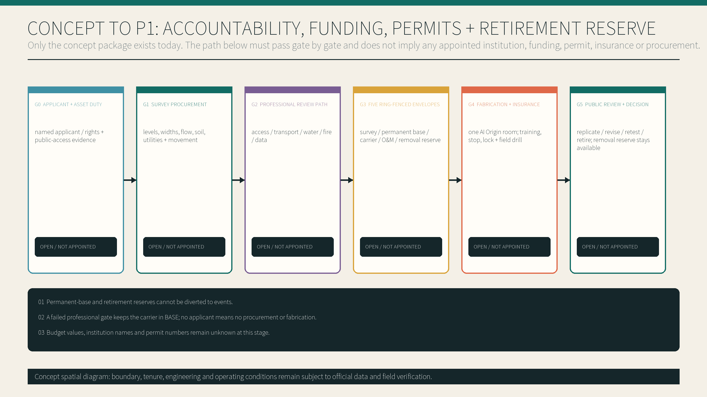

### JURY PATH · Six Decision Metrics

The six metrics are future 90-day decision contracts, not existing performance: non-AI task completion, no-login completion, state-switch time, AI closure duration, return-acceptance time and equity access burden gap. Each defines a non-AI baseline, measurement window, stop threshold, recovery condition and responsible role; all other metrics remain in the structured appendix.[metric:non_ai_task_completion_ratio] [metric:no_login_task_completion_ratio] [metric:return_acceptance_time_minutes]

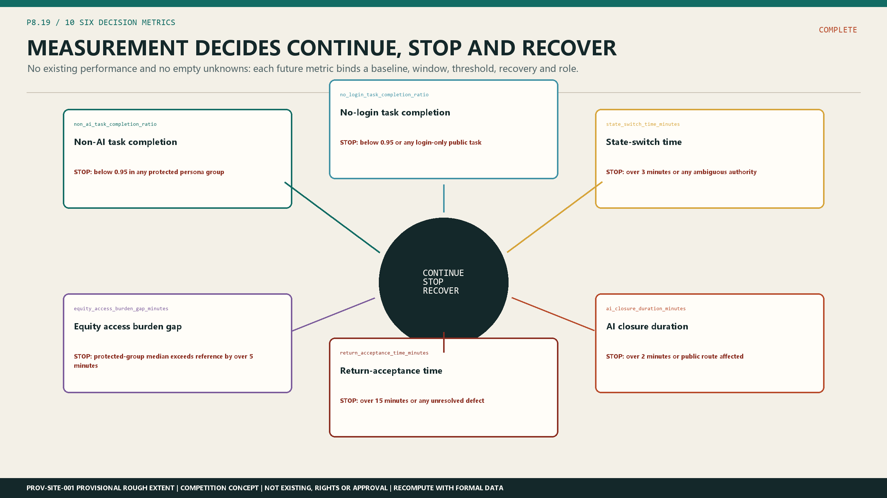

Figure 10 | Six continue/stop/recover decision metrics.

## Metrics, Area Recalculation, and Compliance Matrix

Evaluation separates official textual areas, provisional geometry and future performance. **43.6 km², 11.4 km² and 368.4 ha**, plus the three key-area figures, are approximate announcement values. The current official provisional feature `PROV-SITE-001` recalculates to about **11.413 km²**. The approximately **3.26%** public-space ratio and **0.26%** concept-green ratio are derived from conceptual geometry inside that extent; they check proposal consistency and are neither statutory planning indicators nor existing-condition claims. Any boundary or design-layer update requires complete recalculation.[metric:site_area_sqm] [metric:public_space_ratio] [metric:green_ratio]

The northern land-side green space is not residual colouring but a passive stormwater threshold awaiting professional verification: intercept paved runoff → planted pretreatment → rain-garden detention and filtration → verified overflow to existing drainage. AI may only recommend maintenance timing from inspected events; passive detention and safe overflow must work with AI_OFF. If soil, drainage, water-control, rights or professional landscape review fails, no overflow connection or performance claim is allowed.[data:geometry/green_space.geojson] [metric:green_ratio]

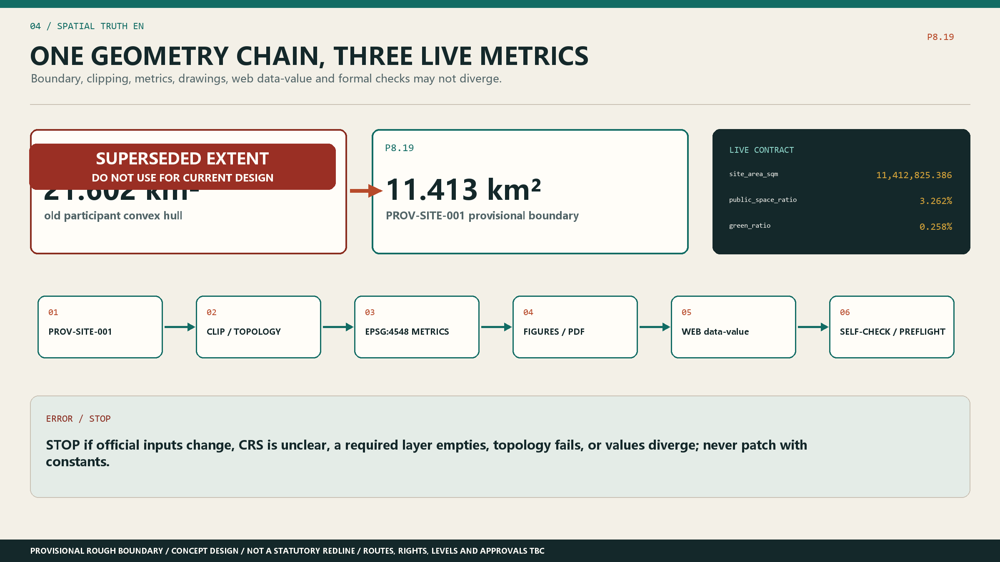

A future pilot records separate, explainable measures: BASE route availability, ACTIVE/FREEZE time, human veto, emergency stops and near misses, accessibility, complaints and appeals, public places, distribution of burdens, maintenance hours, expired content, AI/manual/static differences and retirement. Without a baseline, no improvement percentage is set. Utilisation, sales, investment and footfall are not merged into a single opaque “smart score.”

### JURY PATH · Evidence, Sources and Professional Boundaries

The main proposal keeps only claim-adjacent evidence. Complete sources, assumptions, standards, design depth, task coverage, GeoJSON and recomputation formulas remain in structured files and the professional-review entry. Boundary, key areas, dimensions, materials, drainage, rights, heritage, fire, cost and operations must not be interpreted as existing conditions or approval.[source:F1-SRC-003-PROVISIONAL-GEOMETRY] [depth:risk_missing_data]

## Risk, Copyright, and Compliance

The main risks have explicit exits. If precise extents and rights are missing, do not enlarge a carrier and relocate only after verification. If Dazhongsi arrival or accessibility conflicts, cancel the unit and retain the main line. If Zhongzhiyuan water, project-boundary or public-access checks fail, do not open the bay. If historical content is contested, remove variable content while retaining sources and a correction route. If data permission, model performance or human takeover fails, stop AI recommendations and return to static/manual procedures. If maintenance, budget, insurance or permission is absent, lock or retire moving elements. Risk cannot be “optimised” by reducing permanent public service.[depth:risk_missing_data]

Participant-authored text, diagrams and design are displayed under the package's COMMUNITY-DISPLAY-ONLY terms. Third-party facts, laws, standards, web pages and base mapping remain with their rights holders; sources and use limits are summarised below. Concept visualisations are not site facts, approvals or engineering evidence. Public display must not imply endorsement, partnership or approval by government, institutions, site parties or precedent organisations.

This is a competition concept urban-design proposal. It does not replace statutory planning, survey, engineering design, transport or utility studies, heritage/water/fire/accessibility review, procurement or local approval. When authoritative data arrives, all drawings and metrics that depend on extent, rights, buildings or capacity require renewed verification.

## References

The following selected sources are used in the narrative. The submission's structured source list retains fuller acquisition, licence and limitation records.

1. Haidian Branch, Beijing Municipal Commission of Planning and Natural Resources, *Centennial Jing-Zhang AI Innovation Belt International Urban Design Solicitation — Prequalification Announcement*.
2. Competition organisers, *Taskbook Extract for the Global Agent Open Call*.
3. Tsinghua University History Museum, *Tsinghuayuan Station and Tsinghua University*; *The Centennial Tsinghuayuan Station and the Journey to Beijing*; Haidian District Government, *Beijing's First Batch: 13 Haidian Revolutionary-Heritage Sites*; 李汉宗（Lhzss8）, *QINGHUAYUAN STATION OLD HOUSE 202310*, Wikimedia Commons, CC BY-SA 4.0.
4. Beijing Municipal Science & Technology Commission / Zhongguancun Administrative Committee, *Zhongguancun Demonstration Zone*.
5. City of Cambridge Community Development Department, *Volpe Site Rezoning*.
6. MaRS Discovery District, *About MaRS*.
7. Établissement public d’aménagement Paris-Saclay, *Innovation*.
8. JTC Corporation, *Punggol Digital District*.
9. Seoul Metropolitan Government, *Seoul AI Hub*.
10. City of Helsinki / Business Helsinki, *Testbed Helsinki — A testing platform for new innovations*.
11. Cyberspace Administration of China and six other authorities, *Interim Measures for the Management of Generative AI Services*.
12. Standing Committee of the National People's Congress, *Law on Building an Accessible Environment*.

[source:SOURCE-REGISTRY] [source:F1-SRC-016-ACCESSIBILITY-LAW] [source:F1-SRC-017-URBAN-DESIGN-MEASURES]

Extents, intensity, buildings, infrastructure and implementation remain conceptual. Evidence gaps stay explicit rather than being hidden by graphic completeness.
