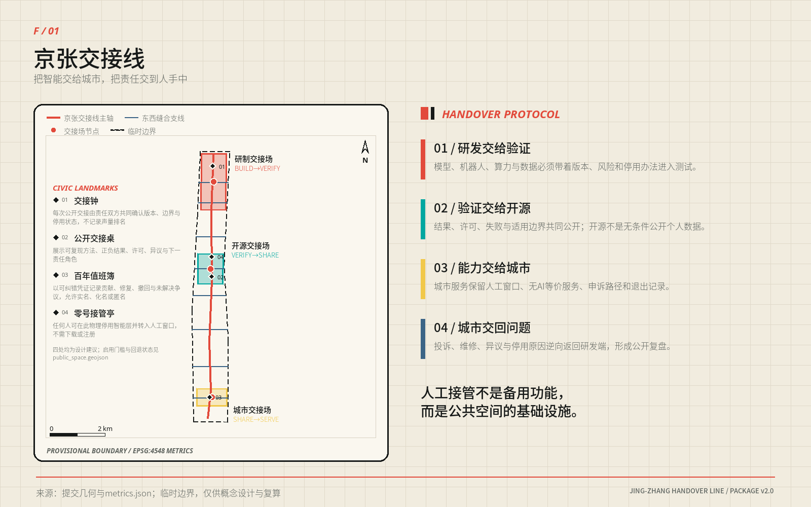
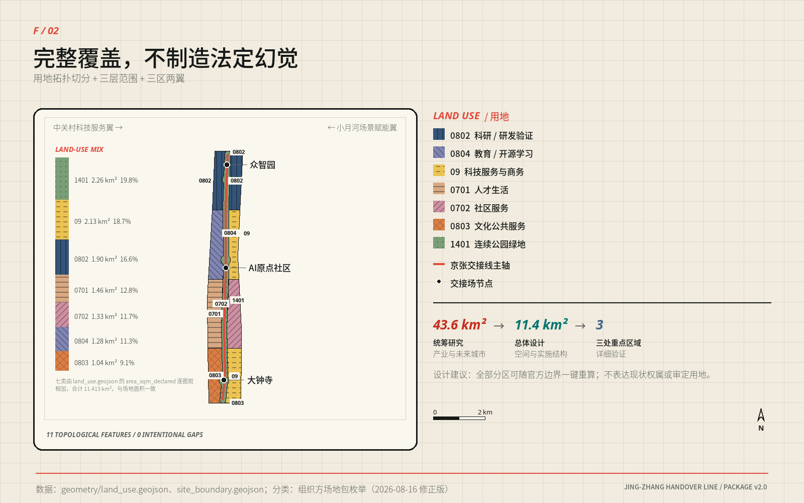
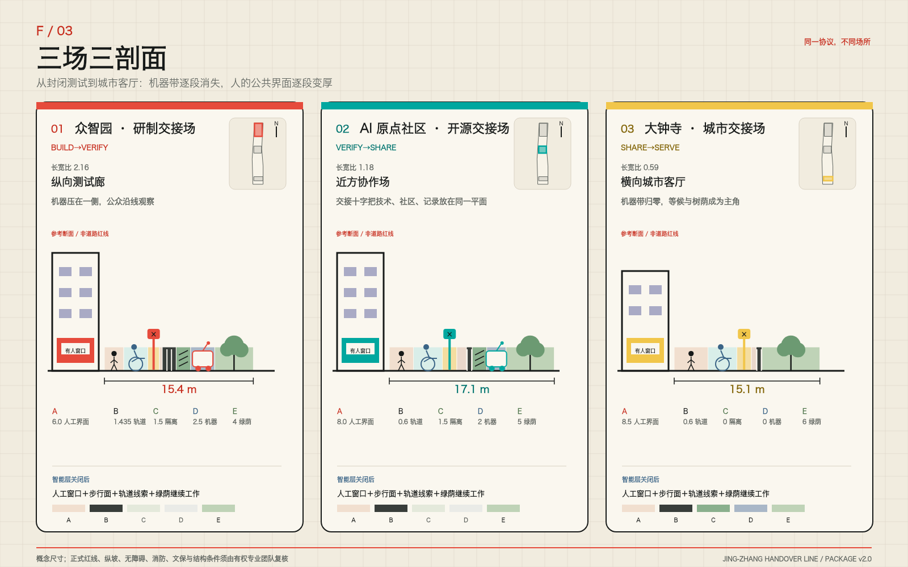
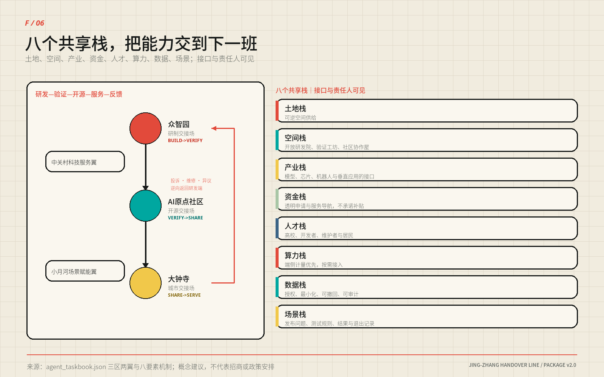
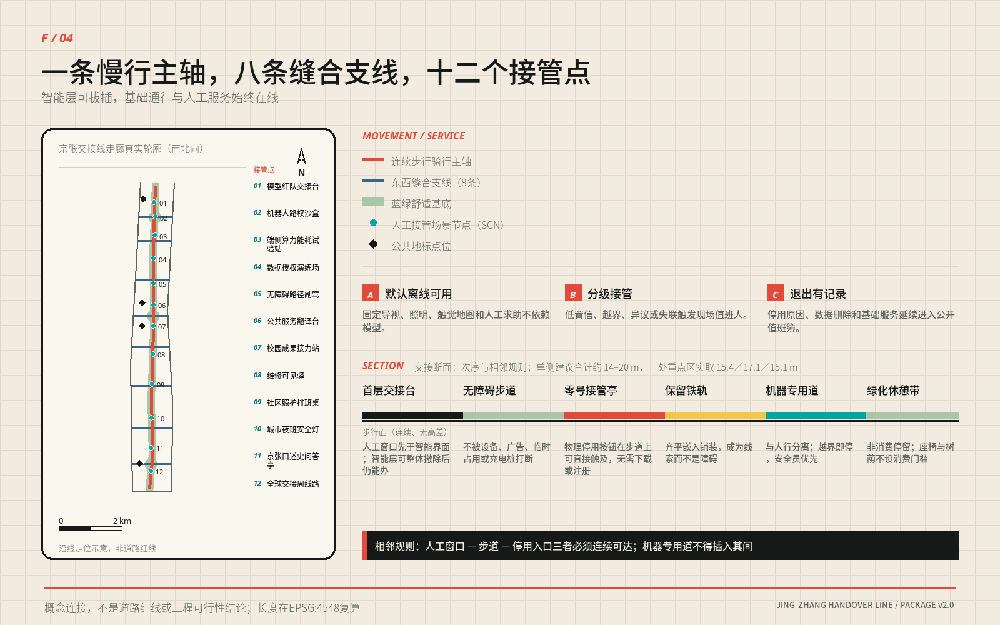
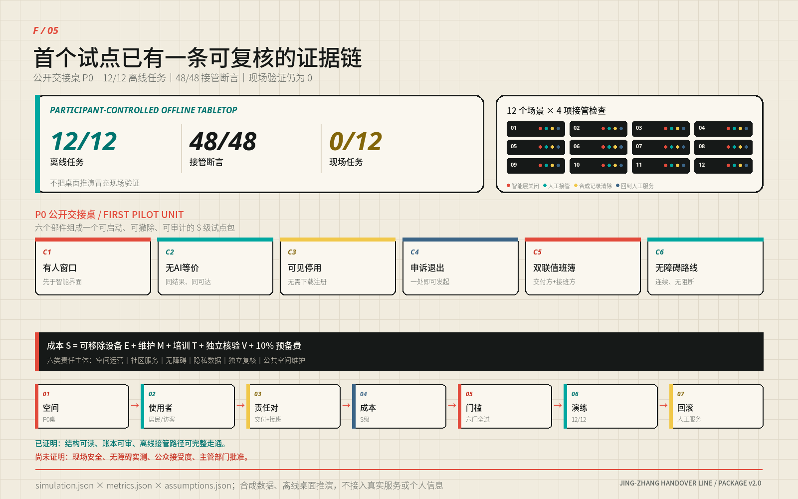

# 京张交接线 / JING-ZHANG HANDOVER LINE

**设计宣言｜把智能交给城市，把责任交到人手中**

**一条 9.5 公里的连续公共脊像梳背，八条东西向城市联系像梳齿；三座交接场让研制、验证、开源、服务与问题回程各有位置。**

京张铁路留下的不只是线位，也是一套让复杂系统可靠运行的日常纪律：上一班说明交出了什么，下一班独立判断是否接收，未完成事项不能在换班中消失。今天，AI 从实验室进入城市时缺少的恰好是这段空间与责任之间的交接。

“京张交接线”因此不是一座新的 AI 园区，也不是沿铁路摆放十二种设备。它是一套可以步行穿过的城市结构：北部把研发能力交给验证，中部把验证结果交给开源协作，南部把可用能力交给日常服务；投诉、维修、异议和停用原因再沿原路回到研发端。能力可以加速流动，责任始终有签收人与回程票。

方案的公共底线只有一句：**任何智能服务，都必须在没有 AI 时仍能办成同一件事。** 人工窗口、纸本、电话、固定导视、触觉地图和物理停用入口先存在，智能层才有资格打开。人工接管不是藏在后台的按钮，而是公共空间的基础设施 [standard:BARRIER-FREE-ENVIRONMENT-LAW] [standard:ELDERLY-SMART-TECH-PLAN-2020-45]。

| 评委在一分钟内需要看见什么 | 本方案的唯一回答 |
| --- | --- |
| 空间主张 | 一梳、三场、两翼、八支、二十单元 |
| AI 如何进入城市 | BUILD→VERIFY→SHARE→SERVE→RETURN |
| 三处重点区为何不同 | 北段纵向测试，中段开放协作，南段横向城市客厅 |
| 如何开始 | 先搭一张 S 级可移动“公开交接桌”，再决定是否扩展 |
| 失败后怎么办 | 关闭智能层、人工服务继续、临时记录清除、空间恢复普通使用 |

本轮已经完成 12/12 个合成离线任务和 48/48 项接管断言；**现场任务仍为 0/12**。这证明协议能被机器执行和审计，不证明现场安全、公众接受、无障碍实测或任何实施批准 [metric:simulation_task_count] [metric:offline_takeover_assertion_count] [metric:field_rehearsal_task_count]。

## 设计依据与资料清单

百年京张走廊同时存在两种城市方向：铁路遗产、公园和轨道形成南北向连续线；高校、园区、社区与商业生活形成东西向高频流动 [source:SRC-JINGZHANG-1909] [source:SRC-HERITAGE-PARK-P1] [source:SRC-BAXUEYUAN-1952]。

今天的断点不是缺少一条“智慧走廊”，而是研发成果与城市日常之间没有一套共同可读的空间接口 [depth:existing_conditions_diagnosis]。

方案依据征集公告、面向智能体任务书、仓库场地资料包、公开资料登记表和本地专业标准快照；所有外部事实与权利边界登记在 `sources.json`，所有未知条件登记在 `assumptions.json` 与 `geometry/constraints.geojson`。百年京张的历史只用于提取“连续线形、道口缝合、双联交班”三种设计方法，不用于推出法定空间结论。

## 三层范围工作框架

三层范围各做一件不同的事：

| 工作层级 | 设计任务 | 本方案的交付 |
| --- | --- | --- |
| 约 43.6 km² 统筹研究范围 | 建立产业、人才、区域协同与长期运营接口 | 五类区域协同接口、八类共享要素、年度活动与国际传播机制 |
| 约 11.4 km² 总体设计范围 | 形成连续空间结构和可计算的更新框架 | 9.5 km 主轴、八条横向联系、七类用地、二十个概念更新单元 |
| 三处重点区域 | 把抽象协议转译为能画平面、剖面与场景的城市空间 | 研制交接场、开源交接场、城市交接场三套不同原型 |

提交几何复算的总体设计范围约为 11.413 km²，三处重点区约为 1.93、1.04、0.72 km²，均为临时模型量 [metric:site_area_sqm] [metric:key_area_count]。仓库没有可用于法定判断的精确边界、审定控规、权属、现状建筑、道路红线、市政容量、消防、文保和完整生态本底；本方案不以商业地图、新闻图或模型推断补齐这些缺口 [source:SITE-PACKAGE] [source:SOURCE-REGISTRY]。

**所有成果均为开放共创建议，不替代正式规划，不构成政府审定结论。所有空间落地建议均为“概念建议”“参考方案”“可供专业团队深化研究”。** 临时边界替换后，九类几何、指标、图件、PDF 与中英文正文按同一公式一键重算 [assumption:A-BOUNDARY-001] [depth:risk_missing_data]。

## 统筹研究范围产业与未来城市研究

统筹范围的核心判断是：AI 产业需要的不只是办公面积，而是从实验室到城市服务之间可共享、可拒收、可退出的接口。土地与时段、验证空间、开源成果、算力设备、合规数据、人才、资金服务和城市场景构成八类共享要素；北纬社区、未来科学城、怀柔科学城、经开区和京津冀节点以“最小可交付成果＋拒收条件”形成五类区域接口。企业和机构可以更替，接口规格与失败记录仍可延续 [depth:three_level_scope_framework] [source:AGENT-TASKBOOK]。

未来城市在这里不是设备密度更高，而是更换智能系统时不伤害基础服务。双联交接、无 AI 等价和退出先于启用三项机制，把创新速度、公共信任与空间更新放进同一个可证伪框架；六个国际案例只用于比较验证、开放与运营机制，不复制其形态、品牌或指标。

## 总体设计范围城市更新与控规深度城市设计

总体结构不是沿线分三块地，而是一把连接城市两侧的“交接梳”：

- **一条梳背**：约 9.5 km 连续公共交接脊，叠合慢行、蓝绿、遗产线索、人工服务与责任展示。
- **八根梳齿**：八条东西联系把高校、园区、社区、轨道站点和商业生活接回主轴；它们表达连接意图，不是道路工程线位。
- **三座交接场**：北部研制、中部开源、南部城市服务，承担三次不能互换的责任转换。
- **两翼支撑**：西翼偏向验证、社区协作与风险收敛；东翼偏向开放研发、共享服务与城市释放。
- **二十个成对单元**：十对概念更新单元横跨主轴布置，以“西收东放”形成可读的产业—公共界面。

七类概念用地由同一拓扑模型切分，11 个图斑完整覆盖临时边界且不相互重叠。科研与验证承载 BUILD→VERIFY，教育与开源学习承载 VERIFY→SHARE，科技服务、商业与社区服务承载 SHARE→SERVE，连续公园绿地与公共空间贯穿全线 [data:geometry/land_use.geojson#LU-001] [metric:land_use_zone_count] [depth:land_use_layout]。

这套结构最重要的形态判断，是**越接近日常生活，主轴越主动让位给横向城市界面**。三处重点区的南北/东西长宽比依次为 2.16、1.18、0.59：北部是纵向测试廊，中部接近方形协作场，南部翻转为横向城市客厅。主轴全长中只有约 39.6% 位于三处重点区，另外约 60.4% 是三区之间的连接段；因此“一线”不是三块地的编号线，而是把中间地带也纳入公共设计 [data:geometry/key_areas.geojson#PROV-KEY-001] [metric:handover_spine_length_m]。

## 重点区域详细设计

### 空间原型｜交接不是流程图，是一条可以走过的断面

人工接管必须变成城市设计关系。三处重点区共享同一条空间顺序：

**建筑首层人工窗口 → 连续无障碍步行面 → 可直接触及的停用入口 → 铁路线索带 → 人机物理隔离 → 可选机器试验带 → 无消费门槛绿化休憩带。**

机器专用空间不得插入人工窗口、步道与停用入口之间；当智能层关闭，前四项仍能独立工作 [depth:three_key_area_detailed_design] [standard:MOHURD-URBAN-DESIGN-MEASURES]。

| 断面分段 | 参考尺寸 | 设计意义 |
| --- | ---: | --- |
| A 建筑退线（含等候、步行、停用设施） | 6.0–8.5 m | 让人工服务、双向轮椅错行和伸手可及的停用入口排在第一顺位 |
| B 铁路线索带 | 0.6 m 或 1.435 m | 以轨枕模数或整轨距嵌入铺装，不制造仿古景观 |
| C 人机物理隔离 | ≥1.5 m | 靠实际距离和可维护构件隔离，不靠地面标线 |
| D 机器试验带 | 0 或 2.0–2.5 m | 只在受控测试段存在；进入城市服务段时归零 |
| E 绿化休憩带 | 4.0–6.0 m | 树荫、雨洪、停留和非消费使用共同组成公共底盘 |
| **单侧合计** | **约 14–20 m** | 是概念设计建议，不是道路红线或施工图尺寸 |

三处断面实取值分别为 **15.4 / 17.1 / 15.1 m**。北部把更多宽度给试验与隔离，中部把最大余量给公开交接桌，南部取消机器试验带，把空间还给等候、树荫和横向城市生活。尺寸来源、逐项复算、相邻规则和待专业确认事项完整保存在 `assets/media/technical-evidence-book.md`。

### 三座交接场｜从封闭测试到城市客厅

三座交接场使用同一协议，却有完全不同的城市性格。它们不是三个相似园区换颜色，而是同一项能力逐步接近日常生活时，空间由“控制”转向“开放”的连续梯度。

#### 众智园｜研制交接场 / BUILD→VERIFY

**场所性格：长、窄、可控。** 约 1.93 km² 的纵向场地把机器人、模型与端侧设备的验证压在主轴一侧，另一侧保持连续公众通行；两者之间以 1.5 m 物理隔离和可关闭接口分开。

- 城市界面：沿主轴形成可观看但不可误入的“观察窗”，而不是把封闭围栏当街墙。
- 建筑策略：五个概念单元优先利用既有主体，插入小尺度评审室、独立计量间与可撤测试棚。
- 公共生活：测试开放日只开放观察、解释与人工问答，不开放机器路权。
- 对应场景：SCN-01 模型红队台、SCN-02 机器人路权沙盒、SCN-03 端侧能耗站。
- 退出状态：设备撤除后恢复普通步道、展陈和院落使用，不留下专用门禁。

#### 北京 AI 原点社区｜开源交接场 / VERIFY→SHARE

**场所性格：近方、可会合、可共同复现。** 约 1.04 km² 的中段以一处“交接十字”组织横向街道、纵向遗产脊、公开交接桌与社区首层；这是全线唯一把技术、社区和公共记录放在同一平面上的位置。

- 城市界面：连续开放首层围绕交接十字布置，任何人不进入办公区也能查看版本、许可、失败与人工渠道。
- 建筑策略：两个概念单元承担开源工作室和共享服务栈，以可拆内装适应项目更替。
- 公共生活：日常是社区客厅和开放工作桌，活动时成为成果复现、翻译和维护协作场。
- 对应场景：SCN-06 公共翻译台、SCN-07 校园成果接力站；LANDMARK-02 公开交接桌与 LANDMARK-04 零号接管亭共同落位。
- 退出状态：智能层停用后，桌、亭、窗口仍作为人工问询、纸本目录和社区议事设施。

#### 大钟寺｜城市交接场 / SHARE→SERVE

**场所性格：横向、开放、以人的等候为中心。** 约 0.72 km² 的南段第一次让东西向城市界面大于南北向走廊；这里不设机器试验带，智能只通过人工窗口进入公共服务。

- 城市界面：一排朝街窗口与 6 m 绿化休憩带组成城市客厅，树荫、座椅和非消费停留优先于展示屏。
- 建筑策略：两个概念单元承载社区服务与文化公共空间，先做首层开放和无障碍修缮。
- 公共生活：日常办事、口述史、无 AI 服务和年度“全球交接周”共用同一公共底盘。
- 对应场景：SCN-12 全球交接周线路；LANDMARK-03 百年值班簿记录维修、异议、停用与修复。
- 退出状态：活动撤场后保留固定导视、人工服务与普通公园使用，不留下临时消费围挡。

## 用地、建筑规模与拆改留方案

二十个建筑要素是**概念类型单元，不是现状建筑清单、拆除清单或获批建设规模** [assumption:A-BUILDING-001]。十对单元沿线成对出现：西侧五个验证工坊与五个社区协作屋负责收敛风险，东侧五个开放研发院与五个共享服务栈负责释放成果；东西各十个、四类各五个 [metric:renewal_cell_count]。

概念基底合计约 **22.10 万 m²（221,014.099 m²）**，只用来比较四类空间供给；研制与服务两类各 51,744 m²，验证与共享两类仅相差约 74 m²。单元到主轴垂距为 245–414 m，平均 330 m、中位 330 m、合计 6596 m。完整二十行落点表与复算过程见技术证据册 [metric:building_footprint_area_sqm]。

更新采用四步判定：

1. **保留 R**：继续使用并补齐测绘、权属、结构和使用档案。
2. **修缮 A**：优先解决消防、节能、无障碍和首层开放。
3. **插入 I**：以可撤构件验证真实需求，不以临时试点替代永久审批。
4. **待核 D**：条件不足时保持现状，不把“待调查”偷换为“待拆除”。

法定容积率、建筑高度、建筑密度、总建筑面积、退界与停车均保持 unknown [metric:floor_area_ratio] [metric:building_density]。当官方控规和逐栋调查到位后，可在二十个单元上叠加经确认的层数与强度；在此之前，本方案宁可不给一个漂亮但虚假的体量总数 [depth:development_intensity_controls] [standard:MOHURD-CONTROL-DETAILED-PLANNING]。

## AI 创新生态、人才画像与 AI+ 场景

产业支撑不靠一份会过期的企业名单，而靠八个可被不同主体接入的共享接口：土地与时段、验证空间、开源成果、算力设备、合规数据、人才、资金服务和城市场景。每个接口都必须说明最小交付、接入条件、拒收条件和退出记录；满足规则的主体可以更替，城市结构不随名单失效 [depth:overall_spatial_structure]。

十二个场景按同一张“交接卡”设计：智能任务、最小数据、责任角色、人工路径、停止条件、退出后用途。它们共同覆盖产业验证、公共服务、知识、运维、照护、夜间安全、文化与活动 [metric:scenario_node_count] [metric:industry_validation_scenario_count]。

| 环节 | 场景 | 人工接管 / 无 AI 等价 | 失败后的空间用途 |
| --- | --- | --- | --- |
| 研制验证 | SCN-01 模型红队交接台 | 人工评审＋纸面风险登记 | 普通评审桌 |
| 研制验证 | SCN-02 机器人路权沙盒 | 安全员物理停机＋封闭测试 | 开放铺地与观察窗 |
| 研制验证 | SCN-03 端侧能耗试验站 | 独立电表＋人工停机 | 设备维护点 |
| 研制验证 | SCN-04 数据授权演练场 | 线下授权单＋即时删除窗口 | 公共工作桌 |
| 公共服务 | SCN-05 无障碍路径副驾 | 触觉地图＋人工问路 | 固定无障碍导视 |
| 公共服务 | SCN-06 公共服务翻译台 | 人工窗口＋多语纸本 | 多语服务台 |
| 知识共享 | SCN-07 校园成果接力站 | 人工策展＋开放目录 | 社区展台 |
| 城市运维 | SCN-08 维修可见驿 | 电话报修＋人工派单 | 值班与维修公告点 |
| 社区照护 | SCN-09 社区照护排班桌 | 工作人员电话排班 | 社区服务桌 |
| 夜间安全 | SCN-10 城市夜班安全灯 | 固定照明＋人工巡查 | 普通照明节点 |
| 文化记忆 | SCN-11 京张口述史问答亭 | 人工讲解＋纸本目录 | 口述史阅读亭 |
| 国际活动 | SCN-12 全球交接周线路 | 固定导视＋志愿者服务 | 日常慢行线路 |

离线页面 `visual/index.html` 提供一个真正可操作的“智能层开关”：关闭后，十二张卡全部翻到无 AI 等价的一面。这个交互不是演示特效，而是方案的公开验收方式——任何一张卡在关闭后办不成同一件事，该场景就不应上线。

## 交通、轨道、市政与公共服务设施

交通策略不是新增一条车行大道，而是把公共服务的连续性放在地面：

`geometry/roads.geojson` 把这一意图落实为 1 条主轴与 8 条横向联系：主轴 `ROAD-001` 的复算长度为 9499.778 m，九条线全部标为 `conceptual_connectivity_only`，所以图上表达的是必须保持的连接关系，而不是工程线位 [data:geometry/roads.geojson#ROAD-001] [metric:handover_spine_length_m]。十二个场景点与四处公共地标沿主轴布置，三座交接场分别组织受控测试、公开协作和城市服务；任何需要预约、申诉、翻译、照护或维修的设施，都必须同时接到有人窗口、无 AI 等价和连续无障碍路线 [depth:traffic_rail_slow_parking] [standard:BARRIER-FREE-ENVIRONMENT-LAW]。

- 主轴提供连续步行与骑行意图，约 9.5 km；线位、坡度、净宽和跨越方式待交通与无障碍专业复核。
- 八条横向联系标记必须被解决的东西断点，不预判桥、隧、平交或道路红线。
- 公交、轨道、停车与市政只设置接口条件，不以缺少数据为由编造工程方案。
- 铁路遗产线索以齐平铺装、构件编号和可阅读记录保留，不复制仿古车站或主题乐园形象。

市政与公共服务采用“先接口、后容量”的推进方式：P0 只需可逆供电、照明、通信、排水和消防接入，不新设永久地下干线；扩展前再由有权单位核验电力余量、雨污分流、通信冗余、消防救援、轨道保护与垃圾清运 [depth:municipal_new_infrastructure]。当前缺少道路红线、轨道保护区、站点客流、停车基线、地下管线、设施容量与权属资料，因此不输出桥隧形式、交叉口渠化、车位数或管径；这些未知项进入条件门，资料不到位时维持现状交通与人工服务，不以 AI 推断补空。

## 蓝绿空间、公共空间与城市风貌

概念绿地约 226.5 ha、公共交接面约 103.9 ha，对应临时模型中的约 19.8% 和 9.1%；它们表达结构性供给，不是现状净增量或法定指标 [metric:green_ratio] [metric:public_space_ratio]。蓝绿底盘承担树荫、雨洪、停留、慢行和非消费使用；即使所有智能设备断电，照明、导视、触觉地图、座椅、人工窗口和普通公园功能仍然存在 [depth:blue_green_public_space]。

八类使用者——研发者、创业者、园区员工、居民、老人、残障者、儿童与国际访客——不以“平均用户”合并。最严格的反例是：一个没有智能手机、行动不便、不会中文、又拒绝被算法记录的人，仍应能沿固定导视到达人工窗口、获得同一项基础服务并提出异议。只要这条路径不成立，场景就不开放智能层。

**公共利益现在是第三道开闸条件，不是项目做完后的加分项。** 第一门问“值得做吗”，第二门问“能安全接管吗”，第三门问“收益是否真实到达公众、代价是否公平分配、拒绝后是否仍有服务”。`visual/assets/governance/public-benefit-gate.json` 将任务书明示的六类群体——居民、青年人才、企业、高校、访客、被忽略与高排斥风险群体——逐类绑定公共价值、无 AI 入口和待采证据；再把 SCN-01—12 全部写成一张“公共收益—要避免的伤害—保障—停止条件—移除技术后仍留下什么”的硬门槛表 [metric:public_benefit_group_count] [metric:scenario_public_benefit_gate_count]。

这张表首先规定**公共生活优先于技术奇观**：普通通行、非消费座椅、树荫休息、低眩光低噪声、儿童/老人/残障者安全、无需个人设备、无强制人脸识别、人工责任、申诉和最小数据，任何一项被技术展示挤掉都关闭智能层。它也逐场景区别风险：照护排班不得作诊断或自动拒绝服务；翻译涉及权益决定时必须人工核对；夜班照明不得以人脸与过度照明换安全；口述史不得生成无出处史实或真人合成引语；全球交接周不得以门票、消费、营销围挡和活动后遗留构筑物占用日常公共空间。**技术效果再好，只要公共底盘失败，仍判失败。**

**公共服务等价合同把这条底线拆成可核验任务，而不是把“包容”留作形容词。** `visual/assets/governance/public-service-equivalence-contract.json` 将 SCN-01—12 逐一绑定到一条先于智能层存在的无 AI 基础路线和两条人工渠道，12/12 均要求无需个人设备，拒绝智能服务不得降低基本服务水平；同一核心结果、同队列优先级、零额外费用和相同基础安全信息是设计目标 [metric:no_ai_equivalent_scenario_count] [metric:no_ai_equivalent_service_target_ratio] [metric:algorithm_refusal_no_penalty_scenario_count]。

| 八类需求夹具 | 必须同时存在的基础路线 | 失败动作 |
| --- | --- | --- |
| 非视觉／屏幕阅读 | 可读真实文本＋触觉或人工口述＋结果回读 | 找不到人工渠道或拿不到同一基础结果，关闭智能层 |
| 仅键盘／无指针 | 原生键盘控件＋可见焦点；现场不要求操作个人设备 | 关键操作只能靠鼠标或个人设备，关闭智能层 |
| 低视力／色觉障碍 | 高对比文字＋代码、形状或唯一纹理＋大字纸本 | 关键区分仍只靠颜色，关闭智能层 |
| 行动不便／轮椅 | 连续步行面＋坐姿窗口／等候位＋可触及停用入口 | 路线被高差、障碍或机器带切断，关闭智能层 |
| 老年／认知负荷 | 单任务短句纸本＋重复说明／结果回读＋无强制倒计时 | 依赖复杂记忆、限时或因求助降级，关闭智能层 |
| 非中文／多语 | 中英核心载体＋多语纸本＋人工复核权利决定 | 权利或停止条件只能靠中文或机器翻译，关闭智能层 |
| 无智能手机／无 App | 固定导视＋有人窗口＋纸本、电话或值班簿 | 任一步骤强制手机、App、扫码或个人账户，关闭智能层 |
| 拒绝算法／可选数据 | 人工决定＋最小记录＋申诉、删除或停用回执 | 拒绝导致延后、加价、少安全信息或无核心结果，关闭智能层 |

这八类当前是 **8/8 设计需求夹具，不是 8 次用户测试**；真实参与者观察 **0**、真实通过记录 **0**，所有人工渠道仍标为 `not_observed` [metric:accessibility_requirement_fixture_task_count] [metric:accessibility_requirement_fixture_coverage_ratio] [metric:real_user_accessibility_observation_count]。授权后的共测已经预注册为至少 **24 个任务场次**，六类任务书群体均须留下任务记录，其中至少 8 场覆盖非视觉/低视力、行动不便、认知负荷、非中文、无设备或拒绝算法等交叉需求；固定补偿、合理便利、失败不扣补偿、可退出和匿名记录是招募底线 [metric:planned_equity_cotest_session_min_count]。这个 24 是计划下限，**当前完成数仍为 0**；场地授权后必须由无障碍专业人员主持真实任务，以观察结果逐项替换夹具，不能把机器审计 PASS 改写成真实可用性。

## 更新项目清单、实施政策与分期计划

### P0 实施｜先搭一张桌，再决定是否建一条线

首个现场原型不是建筑，而是一张**公开交接桌**。这次不再只画它：`visual/index.html#p0-prototype` 在正式评审入口中内嵌了可直接操作的 SCN-05 离线服务原型。评审者可以亲自关闭智能层、拒绝算法与数据、启用大字/高对比、比较智能与无 AI 两条路线、签发投诉/停用/删除回执并打印纸本；两条路线共享同一个 `SCN-05-CORE-001` 核心结果，页面不联网、不留存、不采个人信息 [metric:offline_service_prototype_route_count]。它证明服务义务已经可操作，仍不证明现场路径安全或无障碍达标。

现场套件采用 S 级成本口径。F/05 画出六类宏观构件与原六类交付门；新的 `visual/assets/governance/p0-delivery-contract.json` 把它深化为 **12 项带数量和验收方法的构件清单、8 道进入门和 10 项 RACI 工作包** [metric:p0_component_line_item_count] [metric:p0_entry_gate_count] [metric:p0_raci_work_package_count]。

同一合同再预注册 **5 个 90 天节点和 8 项验收判据** [metric:p0_delivery_stage_count] [metric:p0_preregistered_acceptance_criterion_count]。角色引用 `role-spec.json`，但全部保持 `unassigned`；三方报价槽、保险、总预算、持续预算、场地和专业签认在真实证据到位前一律为 `null` 或 `not_started`，没有把表格完整冒充实施已发生。

#### 授权前八道门

| 条件门 | 必须出现的证据 | 未通过时 |
| --- | --- | --- |
| 场地 | 书面授权、使用边界、开放时段 | 不进场 |
| 双联角色 | 交出方与接入方由不同责任人指派 | 不签收、不开放智能层 |
| 安全与无障碍 | 独立专业复核、撤场与应急方案 | 只保留基础人工服务 |
| 保险与维护 | 覆盖范围、维护岗、持续预算 | 不搭建或当日撤除 |
| 数据 | 最小化、合成夹具、删除与留存规则 | 不采集、不记录个人信息 |
| 成本 | 三方询价或同等可核依据，按构件分项 | 维持 S 级，不外推总投资 |
| 消防、交通与市政 | 疏散救援、慢行与轮椅回转、用电通信排水和线缆保护复核 | 不向公众开放，只用既有安全人工设施 |
| 共测、同意与合理便利 | 六类群体招募、知情同意、固定补偿、合理便利、失败—修复—复测记录 | 不宣称包容性已验证，智能层关闭 |

#### 一次 P0 的七个工作步骤

1. 现场复核公共路径与停用入口，划出不留永久痕迹的桌面边界。
2. 先搭人工窗口、纸本、电话和固定导视，再安装智能层。
3. 由交出方登记对象、版本、开放项、失败项与回滚动作。
4. 由接入方独立复现最小证据，明确 ACCEPT 或 REFUSE。
5. 注入同人双签、未决项缺失与智能层失联等可控异常，观察是否被拒。
6. 现场关闭智能层，验证同一事项能否由人工路径完成。
7. 当日撤场，核对临时记录删除、基础服务延续和地面恢复。

这是一份**授权后可直接签认与填证的参考工序**，不是已经执行的现场记录。P0 只允许 SCN-05 一个场景，按 `PRE-D0 → D0 → D1–30 → D31–60 → D61–90` 推进：八门不齐不开始计时；D0 先让人工底盘独立办成；前 30 天只做人员异常演练；31–60 天才在授权、同意与便利齐备后做至少 24 场真实任务；61–90 天由独立角色给出“继续／修复／终止”三选一结论，未全过不得扩到第二场景。

八项验收不以满意度平均数代替公平：核心结果和安全信息必须 100% 对齐；拒绝智能的队列差为 0、价格附加为 0；无 AI 路线完成率不得比智能路线低超过 10 个百分点，中位完成时间比总体不大于 1.5、任一必备群体不大于 2.0；投诉/停用/删除回执生成率 100%；八类无障碍必备任务须 8/8 由真实任务与专业复核共同通过。阈值是**预注册判据，不是观测结果**，当前 `observed_value` 全部为 `null`，现场任务继续保持 0/12 [assumption:A-OPERATIONS-001]。

#### 正式评审交接｜投稿闭合不等于现场获准

最新官方评审在确定性、空间、视觉、专业证据四道 Gate 全部通过后给出 **96/100**，公共利益与包容性 **5/5**、可实施性 **4/5**；评论同时列出七项“下一步”，其中包含正式评委的完整翻阅程序、组织方正式数据、未来现场开闸条件和未来公众绩效发布门。`visual/assets/governance/review-3825-readiness-matrix.json` 将它们逐项拆开，避免把未来实施责任误写成当前投稿缺件，也避免为了“看起来可实施”而伪造主体、授权、报价、保险、预算、签字或用户数据。

| 判定层 | 当前状态 | 谁在何时关闭 | 当前投稿能否代填 |
| --- | --- | --- | --- |
| 概念投稿包 | `CLOSED_FOR_FORMAL_REVIEW`；参与者可控制的开放修复 **0 项** | 本轮以正文、矩阵、原型、权利链和四道 Gate 交给正式评委 | 已闭合；这只是参与者自审，不是官方接收或获奖 |
| 人类评委程序 | `REVIEW_PROCEDURE_NOT_PARTICIPANT_REPAIR` | 正式评分时完整翻阅四份 PDF、比较中英主张与图位；若发现差异再形成新修复项 | 不能把“评委尚未评阅”伪装成参与者缺件 |
| 正式边界与控制数据 | `WAITING_ORGANIZER_INPUT` | 组织方提供后，专业团队按 EPSG:4548 固定公式联动复算 | 不能猜测；当前只保持临时边界警示 |
| SCN-05 真实现场 | `BLOCKED_EXTERNAL_PRE_PILOT` | 有权主体与专业角色用真实证据关闭八道门 | 不能代填；任一门未过，现场时钟不启动、智能层关闭 |
| 包容性与现场绩效主张 | `BLOCKED_UNTIL_24_REAL_TASKS` | 授权后由真实参与者和无障碍专业人员完成至少 24 场任务、失败—修复—复测 | 当前只能主张 8/8 设计夹具与离线功能，真实观察仍为 0 |

同一矩阵按官方六类强制拒绝事实做了一次**证据核对**，不是替评委下结论：个人或非公开数据、伪造官方背书、违法／歧视／恶意内容、实质跑题、agent.1—agent.6 缺失、把建议写成既定政府决定，当前均未在包内观察到对应事实，证据命中 **0/6**。包内仍显式声明：所有成果均为开放共创建议，不替代正式规划，不构成政府审定结论；本节的 `CLOSED` 也不构成接收、批准、采购、认证、实施承诺或政府背书。

### 分期与运营｜不按年份推进，按证据开闸

三期不是政府时间表，而是三道可回滚的条件门 [metric:phase_count] [data:geometry/phasing.geojson#PHASE-001]：

| 阶段 | 空间动作 | 进入下一阶段的必要条件 | 失败回滚 |
| --- | --- | --- | --- |
| PHASE-01 交回基线 | 南段人工服务底盘＋一张 P0 公开交接桌 | 八道准入门、基础层单独完成、无障碍与安全通过 | 撤除智能构件，保留普通公共服务 |
| PHASE-02 开源接力 | 中段交接十字＋开源交接场 | 跨主体复现、社区协商、维护预算与权属边界成立 | 缩回单桌或单场景 |
| PHASE-03 全带运营 | 北段研制交接场＋全线协同 | 交通、市政、消防、文保、隐私、持续运营全部经专业复核 | 保留已验证片段，不扩区 |

长期运营围绕四个季节事件形成公共记忆：春季“开放问题周”、夏季“验证开放日”、秋季“全球交接周”、冬季“年度交接账发布”。活动不公布排行榜，而是公开哪些问题被修复、哪些服务被停用、哪些异议改变了设计。

区域协同采用最小可交付单位而非合作口号：北纬社区交换社区服务问题与人工路径；未来科学城和怀柔科学城交换可复现实验与风险清单；经开区交换产业验证和制造接口；京津冀节点交换开放规范、失败记录和退出模板。任何一方无法提供最小证据时可以拒收，不以机构名称制造背书 [depth:three_level_scope_framework]。

国际传播统一为 **HANDOVER LINE**：全球访客看到的不只是技术演示，而是一座城市如何公开交代版本、责任、异议与退出。品牌的四个公共地标——交接钟、公开交接桌、百年值班簿、零号接管亭——记录维护和纠错，而不是资本与流量；完整 Logo、视觉系统、双语导览、音频、视频和触觉地图均已随包交付。

## 指标体系、面积复算与合规矩阵

`metrics.json` 共 **86 项指标，72 项已赋值、14 项待测**。72 项已赋值项来自 GeoJSON、合成演练、设计合同或机器校验；新增九项只统计 P0 的门、阶段、RACI、构件、验收、群体、场景公共门、离线路线和计划共测下限，不把任何一项写成真实实施。故“8/8 需求夹具”“24 场计划下限”和“真实观察 0”分别记录设计覆盖、未来样本计划与证据边界，绝不合并为用户测试通过。待测项包括法定强度、真实交接时间、返工轮次、公众接受度、现场无障碍和运营效果，不以推测填空 [depth:metrics_recalculation]。

| 观察层 | 当前可核值 | 正确读法 |
| --- | ---: | --- |
| 空间 | 约 11.4 km²、9.5 km 主轴、8 条横向联系、3 处重点区、20 个概念单元 | 临时模型量，可复算，不是法定控制 |
| 公共底盘 | 约 19.8% 概念绿地、9.1% 公共交接面 | 结构建议，不是现状净增或法定比例 |
| 场景 | 12 个场景，其中 4 个产业验证场景 | 每个都有人工路径、停止条件与退出用途 |
| 离线证据 | 12/12 任务、48/48 接管断言、96 条规则检查 | 参与者控制的合成验证，不外推现场绩效 |
| 现场证据 | 0/12 | 未授权、未实测、未完成 |

第一年只追踪六类交接质量：HV-01 双联交接完整率、HV-02 人工路径连续可达、HV-03 基础层单独完成率、HV-04 退出记录完备率、HV-05 无障碍实测、HV-06 拒绝算法者的服务等价性。任一场景出现同人双签、停用入口不可及、基础层不能单独完成、退出记录缺项或无障碍必备项不通过，先关闭该场景智能层，基础服务继续，再决定修复或退出。

指标不是为了证明方案永远正确，而是让方案能被及时推翻。详细采样、统计、异常处理和公开格式见技术证据册与 `visual/assets/governance/measurement-protocol.json`。

## 风险、版权与合规说明

| 主要风险 | 当前控制 | 触发后的回滚 |
| --- | --- | --- |
| 临时边界被误读为正式红线 | 全图虚线、低置信度、临时模型注记 | 停止精确落位和法定解读，等待官方几何重算 |
| 智能层失联、越权或误导 | 人工窗口、物理停用、双联角色 | 关闭智能层，基础服务继续 |
| 个人数据过采或无法撤回 | 最小数据、合成夹具、删除断言 | 停止采集并清除临时记录 |
| 老人、残障者或无设备者被排除 | 触觉、纸本、电话、固定导视与人工服务 | 不开放智能层，先修复路径 |
| 临时试点长期化 | S 级可移动构件、撤场清单、维护责任 | 当日撤除，空间恢复普通使用 |
| 概念方案被宣传为政府决定 | 全包统一边界声明与来源登记 | 撤回误导材料并发布订正 |

针对两组在色觉模拟下接近的用地色，F/02 与中英 A0／A3 第 2 页现已在保留原色、代码、面积和几何不变的前提下，为七类用地分别叠加七种唯一纹理；图斑与图例不再只靠颜色区分。随包脚本逐像素核验 7 类 × 6 载体和 98 个区域，但**这仍不是低视力或色觉障碍真实用户共测**；公众部署前须由无障碍专业人员与真实参与者完成共测并保留失败与修复记录 [assumption:A-CONTRAST-001] [standard:WCAG-CONTRAST]。

本包不使用个人隐私、非公开政府数据或企业专有信息，不作诊断、判决、资格、评分和审批决定。任何涉及公共安全、结构、消防、交通、市政、文保、无障碍、法律或个人权益的判断，必须由具备相应资质的专业团队依法依规复核 [standard:GENERATIVE-AI-INTERIM-MEASURES] [depth:risk_missing_data]。

全部成果**不代表任何机构，不得被表述为政府背书或官方认可，不得被表述为实施批准或已确定安排**。空间、品牌、活动、责任组织、成本等级与工序均为概念建议，可供专业、运营和传播团队深化研究。

包内正文、几何推演、程序化图件、PDF、离线网页与合成演练由参与者和已披露智能体协作完成；外部案例只转述公开机制，不复制照片、地图、商标或受保护版式。字体、生成工具、封面生成图、音视频与许可边界逐项登记在 `sources.json`、`manifest.json#rights_inventory` 与 `report/copyright_statement.md`。

机器可读标识为 `COMMUNITY-DISPLAY-ONLY`；在组织方条款尚未发布期间，权利人另行授予 CC BY-NC 4.0 范围内的署名、非商业、标明修改之使用许可，并要求保留“不代表政府决定或审批结论”的声明。完整授权、优先顺序与第三方排除范围见版权声明和技术证据册。

### 证据导航

- **主阅读**：本文件、五张核心图、A3/A0 图册、`visual/index.html`。
- **技术深读**：`assets/media/technical-evidence-book.md`，保留旧版全部逐项论证、表格与复算口径。
- **机器复核**：`metrics.json`、九类 `geometry/*.geojson`、`assumptions.json`、`sources.json`、三个合规矩阵与 `simulation.json`。
- **协议验证**：`visual/assets/governance/` 下的 schema、合成账本、规则检查、模型影子测试与测量协议。

## 参考资料

主要依据包括征集公告、面向智能体任务书、仓库场地资料、城市设计与控规编制规范、用地分类指南、生成式 AI 管理、无障碍环境建设与老年人智能技术政策；完整 43 条来源及其用途、状态、限制和获取日期见 `sources.json` [source:OFFICIAL-ANNOUNCEMENT] [source:AGENT-TASKBOOK] [standard:PROJECT-AGENT-OPEN-CALL-TASKBOOK]。

来源按用途分三层：官方公告、法规与标准只界定任务和底线；公开机构资料只支持历史、产业与案例事实；本包生成的几何、指标、演练和图件只证明本方案内部如何推导，不能反过来替代官方现状。面积、长度和比例均由包内临时几何在 EPSG:4548 中复算，网页新闻或案例页面不进入法定指标；同理，国际案例只转译“可见责任、开放接口、人工接管、退出记录”等方法，不移植其绩效结论。

尚缺的官方边界、地块权属、道路红线、地下管线、设施容量、逐栋调查、消防文保与公众共测都登记为未知项。任何新资料到位时，先更新 `sources.json` 的状态与限制，再替换对应几何并重跑 `metrics.json`、专业矩阵和图件；在复核完成前，11.41 km²、9.5 km、三处重点区和全部断面尺寸只作为概念建议与参考方案，不构成政府审定结论。

**智能可以流动。责任必须始终可见。**
