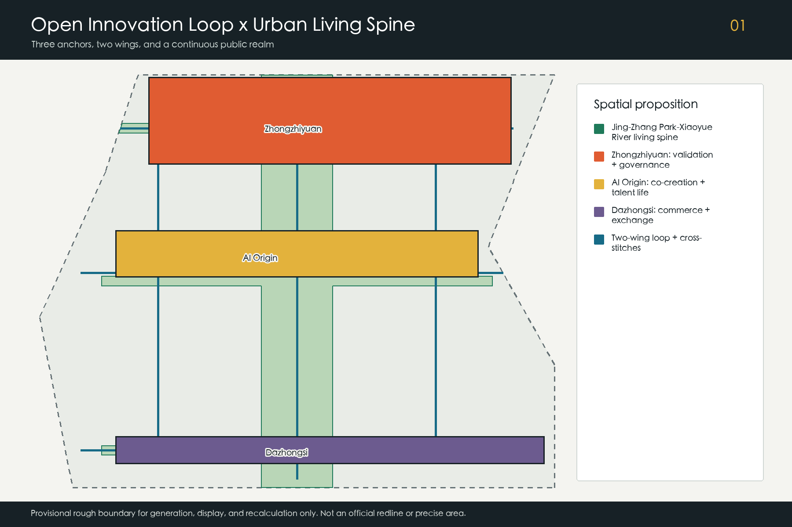
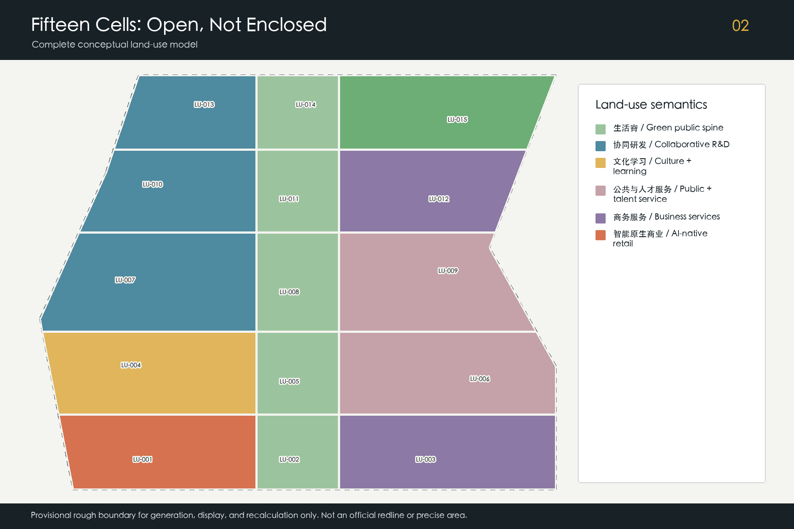
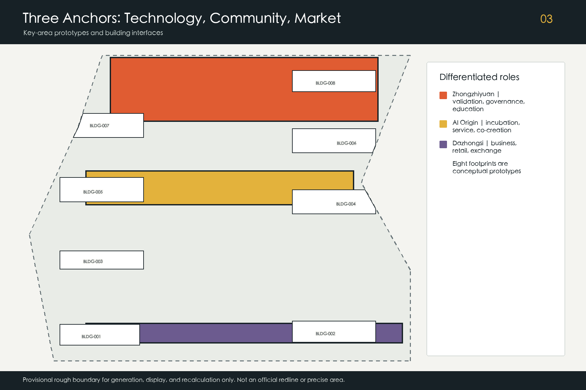
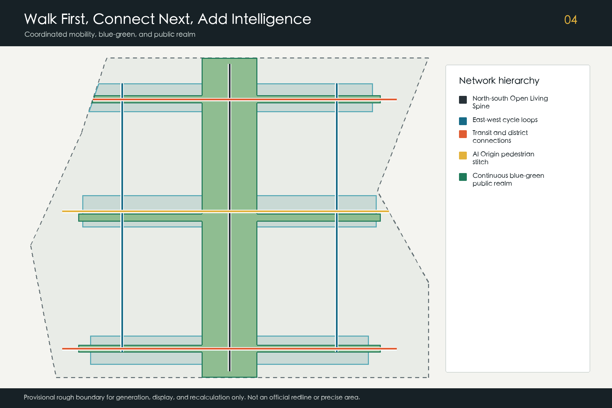
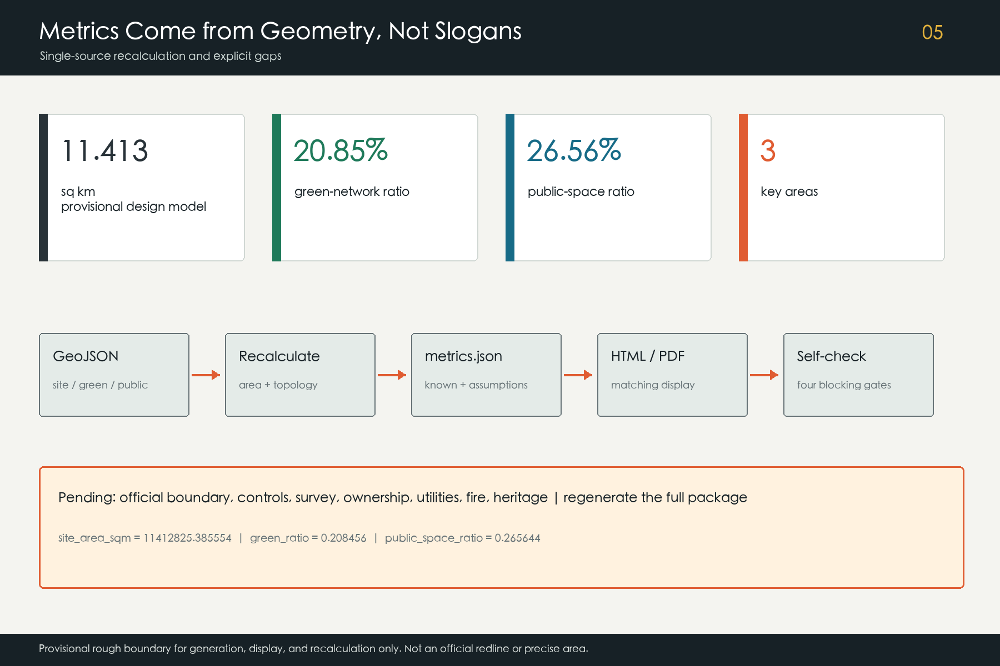

# Jing-Zhang AI Open Loop

**京张 AI 开放生活环**

The Open Loop is neither an enclosed technology campus nor a new planning boundary. It is an urban operating system that connects university research, enterprise translation, public validation, talent services, daily life, and Jing-Zhang culture. The Jing-Zhang Heritage Park-Xiaoyue River corridor becomes the north-south living spine. Zhongzhiyuan, Beijing AI Origin Community, and Dazhongsi are three differentiated anchors, while the Zhongguancun technology-service wing and Xiaoyue River scenario-empowerment wing close an east-west loop. Every spatial claim remains auditable, and every AI service retains human review, a non-AI alternative, and a complaint route.

## Design Basis and Source List

The qualification announcement and Agent open-call taskbook define the project scope. Public national documents provide professional boundaries for urban design, land-use terminology, accessibility, and applicable AI governance [source:DATA-SRC-OFFICIAL-ANNOUNCEMENT-20260509] [source:DATA-SRC-AGENT-TASKBOOK-20260518]. Land-use codes align machine-readable semantics but do not replace an approved regulatory plan [standard:MNR-LAND-USE-CLASSIFICATION-GUIDE].

Official polygons for the overall design area and three key areas were not available. The package therefore uses repository-maintained provisional rough geometry for generation, visualization, topology checks, and design discussion only. Every such feature remains `official_boundary=false`, `geometry_role=provisional_constraint`, `boundary_precision=provisional_rough`, and `confidence=low`; it is not a statutory redline, parcel boundary, or precise official area [source:DATA-SRC-PROVISIONAL-BOUNDARIES-20260605] [data:geometry/site_boundary.geojson#PROV-SITE-001]. When official geometry arrives, all downstream layers, metrics, figures, and PDFs must be regenerated together.

Six public institutional case pages support method-level comparison: Punggol Digital District, Helsinki and Amsterdam public AI or algorithm registers, Barcelona Sentilo, Seoul S-Map, and the Montréal Declaration for Responsible AI. They do not prove that Jing-Zhang already has equivalent infrastructure or governance. No third-party image, logo, map, font, or page asset is copied. Rights, access dates, permitted uses, and prohibitions are recorded in `sources.json`, while the remaining evidence gaps and recalculation triggers are recorded in `assumptions.json` [depth:existing_conditions_diagnosis].

## Three-Level Scope Framework

The coordinated research area, approximately 43.6 square kilometres, frames wider innovation relationships. The overall design area, approximately 11.4 square kilometres, is the common geometric base for this package. The three announced key areas total approximately 368.4 hectares and test whether functions, public space, access, and operations can be made spatially specific. The last two figures are announcement values or provisional model outputs, not precise official measurements [standard:PROJECT-OFFICIAL-ANNOUNCEMENT] [depth:three_level_scope_framework].

The spatial structure is “one spine, three anchors, two wings, and four loop reaches.” The living spine follows Jing-Zhang Heritage Park and Xiaoyue River. The anchors address full-stack validation and governance, open-source translation and talent life, and AI-native commerce and international exchange. The west wing brings capital, legal, intellectual-property, talent, and professional services; the east wing opens real scenarios in neighbourhoods, parks, mobility, and public facilities. Four reaches make this a walkable and repeatable public network rather than a chain of isolated campuses [data:geometry/land_use.geojson#LU-014] [depth:overall_spatial_structure].

| Level | Core question | Evidence in this package | Information still required |
| --- | --- | --- | --- |
| Coordinated research | How can an open innovation ecosystem work regionally? | cases, ecosystem mechanisms, six Agent tasks | verified institution and enterprise datasets |
| Overall design | How can the living spine organise land, mobility, and public space? | 15 land-use cells, six routes, continuous green/public networks | official boundary, regulatory plan, survey, ownership |
| Key areas | Can technology, community, and market interfaces be tested spatially? | three key areas, eight building prototypes, twelve scenario cards | exact polygons and engineering conditions |

All levels use one evidence chain so that research claims, drawings, and metrics do not drift apart. A boundary update triggers geometry and metric recalculation; industry claims require renewed verification by human professionals using current public data [metric:site_area_sqm] [data:geometry/key_areas.geojson#PROV-KEY-001].

## Coordinated Research Area: Industry and Future City Research

The Open Loop translates the taskbook's five functions into operating interfaces. Zhongzhiyuan hosts full-stack validation and safety work; the three anchors form a broader innovation ecosystem; the Xiaoyue River wing opens AI+ test scenarios; the living spine makes intelligent services perceptible in daily life; and public registers, human review, and annual evaluation support accountable governance. The operating cycle is: publish a need, authorise data, prototype, validate, let people experience the result, consider procurement or market translation, and publish a review [standard:PROJECT-AGENT-OPEN-CALL-TASKBOOK] [depth:overall_spatial_structure].

| Public case | Method used as reference | Jing-Zhang translation | Limitation |
| --- | --- | --- | --- |
| Punggol Digital District | industry, education, and public-realm integration | continuous campus-park-community interfaces | no copied scale, tenant, or policy claim [source:CASE-PUNGGOL-DIGITAL-DISTRICT] |
| Helsinki AI Register | public descriptions of system purpose and responsibility | pre-launch register of purpose, data, and reviewer | not a Chinese compliance conclusion [source:CASE-HELSINKI-AI-REGISTER] |
| Amsterdam Algorithm Register | discoverable and contestable public algorithms | visible notices and complaint routes | transparency mechanism only [source:CASE-AMSTERDAM-ALGORITHM-REGISTER] |
| Barcelona Sentilo | open-source urban sensor interfaces | minimal, replaceable device and data interfaces | no claim of local deployment [source:CASE-BARCELONA-SENTILO] |
| Seoul S-Map | multi-scale urban information | offline three-level maps for review | no reuse of data or graphics [source:CASE-SEOUL-SMAP] |
| Montréal Declaration | principles for responsible AI | public interest, dignity, and accountability gates | principle reference, not legal advice [source:CASE-MONTREAL-RESPONSIBLE-AI] |

The west service wing and east scenario wing reduce cross-organisation friction. Land, space, capital, talent, computing, data, and scenarios are managed through interface catalogues that name a responsible party and an exit condition. Investment, tenant, funding, procurement, and government-support statements remain proposals, never commitments.

The identity direction uses a continuous “Loop” line and three open nodes in rail black, public green, innovation blue, and safety orange. The Chinese name and English name link geography, history, and open collaboration without copying an organisation or enterprise name. A professional identity team must complete trademark, font, accessibility, and duplication checks before public deployment.

## Overall Design Area: Urban Renewal and Regulatory-Plan-Level Urban Design

Fifteen non-overlapping conceptual land-use cells cover the provisional overall design model. Four green/open-space reaches form the living spine. Research, culture and learning, public services, talent services, business support, and AI-native retail interfaces sit on either side. The codes provide consistent machine semantics, but the layout is not a parcel-level regulatory plan or land-use approval [data:geometry/land_use.geojson#LU-001] [standard:MOHURD-CONTROL-DETAILED-PLANNING] [depth:land_use_layout].

Renewal follows the sequence “public interface first, adaptive reuse second, additional capacity last.” The first move repairs walking discontinuities, closed ground floors, inaccessible edges, and missing shade. The second converts verified reusable structures into shared research, release, education, and community space. Demolition or new construction can only follow survey, heritage, ownership, fire, carbon, and public-impact review. The eight submitted footprints are functional and massing prototypes only [data:geometry/buildings.geojson#BLDG-001] [depth:retain_renovate_demolish].

Approved floor-area ratio, total floor area, height, road redlines, and setbacks remain pending official data. Three qualitative controls guide future work: keep the living spine continuous and comfortable; use adaptable mid-scale blocks around the anchors; and reduce massing and operational disturbance near heritage, green, and residential edges. Official regulatory, heritage, daylight, fire, utility, and ownership conditions must be reviewed by the relevant disciplines before any quantitative control is adopted [depth:development_intensity_controls] [depth:height_massing_character].

## Detailed Design of Key Areas

The three key-area polygons are provisional rough constraints. Their rectangular edges are not roads or parcels. The areas form three different interfaces within one loop: Zhongzhiyuan asks whether a technology is safe and dependable; AI Origin Community asks whether it can be co-created and used in daily life; Dazhongsi asks whether it can enter commercial and international exchange [data:geometry/key_areas.geojson#PROV-KEY-001] [depth:three_key_area_detailed_design].

**Zhongzhiyuan: full-stack validation and governance park.** A validation collaboration building, open AI-governance laboratory, and education/exchange hub form a reservable cluster. A low-carbon walking edge meets the living spine, while a conceptual cross-connection links both sides of the area. Model evaluation, edge computing, robotics, and low-carbon operations start in contained sandboxes before any public release [data:geometry/buildings.geojson#BLDG-006] [data:geometry/roads.geojson#ROAD-006].

**Beijing AI Origin Community: a human-AI public commons.** An open-source incubator and public service station line the east-west pedestrian stitch. Release, legal, talent, learning, and resident deliberation occupy a continuous ground-floor interface. Non-digital service remains available; university results enter testing only after authorisation, intellectual-property, and safety conditions are clear [data:geometry/buildings.geojson#BLDG-005] [data:geometry/roads.geojson#ROAD-005].

**Dazhongsi: AI-native commerce and urban application.** A business commons, street prototype, and southern living-spine reach support rail interchange, four-quadrant walking, product experience, content, and international exchange. Bridges, tunnels, underground links, and traffic changes are conceptual connections pending transport, fire, ownership, and engineering review [data:geometry/buildings.geojson#BLDG-002] [data:geometry/roads.geojson#ROAD-004].

## AI Innovation Ecosystem, Personas, and AI+ Scenarios

Six personas shape the service design: open-source developers; start-ups; university staff and students; enterprise teams; nearby residents; and older, young, or disabled users who require accessible and understandable alternatives. These are need profiles, not personal behaviour records, and they must never be used for commercial targeting [standard:MOHURD-URBAN-DESIGN-MEASURES] [source:DATA-SRC-BARRIER-FREE-ENVIRONMENT-LAW].

| # | AI scenario card | Users and space | Data, human review, and operating boundary |
| --- | --- | --- | --- |
| 01 | Open-source release hall | developers and universities; AI Origin | authorised work only; moderated release |
| 02 | Model safety sandbox | R&D teams; Zhongzhiyuan | isolated data; red-team and accountable release |
| 03 | Edge-compute station | start-ups; anchor service points | auditable quotas; no personal sensitive data |
| 04 | Accessible walking assistant | residents and visitors; living spine | on-device first; staffed help point retained |
| 05 | Public-realm maintenance assistant | operators; park and river | facility events only, no identity tracking |
| 06 | Community service co-pilot | residents; Origin service station | generated advice requires confirmation; offline channel |
| 07 | Low-carbon operations board | facility teams; Zhongzhiyuan | aggregated equipment data; engineer review |
| 08 | Business matching commons | enterprises; Dazhongsi | voluntary disclosure, no government endorsement |
| 09 | Data-governance clinic | start-ups; service wing | joint legal, privacy, and security review |
| 10 | Jing-Zhang culture co-guide | public; cultural reach | traceable sources and human correction |
| 11 | Event safety co-pilot | operators; anchor events | recommendations only; human command retains authority |
| 12 | Open scenario registry | developers and scenario owners; whole loop | publishes owner, cycle, exit, and review records |

Scenarios 02, 07, and 11 are the three industry validation settings. Each follows need registration, data review, bounded prototype, red-team or failure exercise, user feedback, accountable human acceptance, and exit review. Passing a test does not authorise full deployment. Public generative services still require case-specific review of content, complaints, accessibility, and responsibility [source:DATA-SRC-GENERATIVE-AI-INTERIM-MEASURES] [data:geometry/public_space.geojson#PUBLIC-001].

The ecosystem issues “scenario tickets” rather than prescribing vendors. A scenario owner publishes a problem and evaluation criteria; interchangeable teams propose solutions; a neutral group records effects and side effects; people can see the purpose and use a non-AI option. The east wing therefore becomes a governed public test interface, not a ubiquitous surveillance zone, while the west wing translates verified results into intellectual-property, standards, capital, and market services.

## Land Use, Building Scale, and Retain-Renovate-Demolish Strategy

The package contains 15 conceptual land-use cells and eight building footprint prototypes. Land-use cells cover the provisional model without overlap. The footprints total approximately 1,608,255.916 square metres as a modelled plan projection; this is not existing floor area, gross floor area, or approved development capacity [metric:building_footprint_area_sqm] [data:geometry/buildings.geojson#BLDG-008].

Retain, renovate, or demolish decisions depend on evidence rather than appearance. Structures with heritage, structural, and continued-use value should be retained. Adaptation is preferred where structure is usable but the ground floor, energy, or function is deficient. Demolition is considered only after measured survey, structure, heritage, ownership, fire, carbon, and public-impact review. Current evidence is insufficient for building-specific decisions, so all footprints remain conceptual new-build or adaptive-reuse references [depth:retain_renovate_demolish].

Adaptable modules support changing research teams. Public service and cultural space line active ground floors. Shared halls prevent occasional events from permanently occupying public space. Roofs may combine energy, rainwater, planting, and maintenance only after engineering review. Final gross floor area, FAR, and height are recalculated when regulatory, ownership, and survey data become available.

## Transport, Rail, Municipal Infrastructure, and Public Services

The transport hierarchy is walking continuity, complete cycling, clear rail transfer, and reduced vehicle intrusion. The living-spine route connects the anchors, west and east cycle loops close the network, and three cross-stitches address local barriers. All six are conceptual centrelines with `official_redline=false`; they do not claim road, bridge, tunnel, or traffic approval [data:geometry/roads.geojson#ROAD-001] [depth:traffic_rail_slow_parking].

Rail areas first improve ground-level wayfinding, shade, accessible crossings, cycle parking, and transfer information. Underground links are not assumed. Parking combines shared and off-peak use, bookable logistics, and event mobility plans; counts await a transport survey. Every walking reach should retain non-digital signs, seating, drinking water, and safe lighting, and should be tested with children, older people, and disabled users.

Municipal and digital infrastructure follows a small-unit, isolatable, replaceable approach. Edge computing, public connectivity, energy metering, drainage, and maintenance interfaces are separated. Sensors identify their purpose, steward, retention period, and shutdown method. Existing utility, flood, fire, power, and communications capacity is unknown, so all locations require professional utility, fire, cyber-security, and operating review [depth:municipal_new_infrastructure].

## Blue-Green Network, Public Space, and Urban Character

The green network connects Jing-Zhang Heritage Park, Xiaoyue River, and three cross greenways as one living spine. Modelled green space equals 20.8456 percent of the provisional overall design area; the public-space network equals 26.5644 percent. The layers may overlap because public space includes green space, plazas, walking interfaces, and the three commons, so the ratios must not be added [metric:green_ratio] [metric:public_space_ratio] [data:geometry/green_space.geojson#GREEN-001]. These are reproducible design values, not approved planning ratios.

Three AI pilgrimage landmarks celebrate public knowledge rather than spectacle. The northern **Open Validation Gate** reveals evaluation, data, and safety workflows. The central **Origin Co-creation Stage** records traceable contributions by developers, residents, and universities. The southern **Urban Futures Hall** hosts product prototypes, commercial exchange, and international dialogue. Recognition is based on reproducibility and public value, not capital scale; every name, mark, and result requires permission [data:geometry/public_space.geojson#PUBLIC-001] [standard:PROJECT-AGENT-OPEN-CALL-TASKBOOK].

The component library includes movable co-creation tables, shaded charging seats, digital and non-digital signs, low accessible information panels, switchable sensors, rain-garden edges, and safe event power. Urban character combines the structural clarity of railway infrastructure, Zhongguancun's pragmatic openness, and an AI culture of transparency. Historical content requires source and expert review; generated interpretation must be labelled and correctable [depth:blue_green_public_space] [depth:height_massing_character].

## Renewal Projects, Implementation Policy, and Phasing

The near term connects public life: verify boundaries, audit walking breaks, pilot the AI Origin commons, launch an accessible walking assistant, and open the scenario registry. The medium term establishes validation in Zhongzhiyuan with safety, low-carbon operations, education, and west-wing professional services. The long term strengthens Dazhongsi as the market and international interface with AI-native streets, the Urban Futures Hall, and recurring exchange [data:geometry/phasing.geojson#PHASE-001] [depth:phasing_implementation].

| Package | Content | Start gate | Exit or adjustment condition |
| --- | --- | --- | --- |
| P1 Living Spine continuity | barriers, shade, signs, access, water | official boundary and survey | unacceptable heritage, traffic, or resident effect |
| P2 Origin public commons | release, community service, talent support | site permission and operator | disturbance, low use, or governance failure |
| P3 Zhongzhiyuan validation network | safety, edge compute, low-carbon operations | safety, fire, energy, data review | risk exceeds contained test capacity |
| P4 Dazhongsi AI-native district | business commons, experience, rail access | transport, ownership, commercial review | loss of public value or excessive traffic |
| P5 Two-wing service mechanism | professional services, problem registry, evaluation | collaboration rules and neutral review | vendor lock-in or irreproducible evaluation |

An annual cycle begins with spring problem calls, continues with summer prototyping and red-teaming, presents public work during an autumn “Open Loop Week,” and closes with a winter transparency and performance report. Developer recognition depends on reproducibility and public value. Moving from testing to market requires separate procurement, investment, and business decisions. All events are proposals, not confirmed government programmes [depth:renewal_project_list].

## Metrics, Area Recalculation, and Compliance Matrix

Three core metrics are recomputable from submitted geometry: the provisional overall design model is 11,412,825.386 square metres; green ratio is 0.208456; and public-space ratio is 0.265644. Modelled building footprints total 1,608,255.916 square metres, and the package contains three key areas [metric:site_area_sqm] [metric:green_ratio] [metric:public_space_ratio]. The same values appear as numeric `data-value` attributes in the offline visual page.

The compliance matrix covers the 17 announcement tasks and Agent tasks 1-6. It links the concept and identity, ecosystem, twelve scenarios and six personas, public realm and three landmarks, cultural narrative, annual activity cycle, and long-term operations to narrative, geometry, drawings, visualization, sources, assumptions, and self-check evidence. Six professional standards and fifteen formal depth items remain separately auditable [depth:metrics_recalculation].

FAR, approved height, road redlines, total floor area, and utility capacity remain pending official data. This is an evidence boundary, not a hidden estimate. Official geometry, regulatory controls, survey, ownership, utility, fire, and heritage information trigger professional review and regeneration of metrics, matrices, PDFs, HTML, and manifest hashes.

## Risk, Copyright, and Compliance

The principal risks are spatial dispute from provisional boundaries; implementation uncertainty from unknown ownership and controls; privacy, safety, bias, and vendor lock-in in AI scenarios; event disturbance to residents, mobility, and ecology; and exclusion of older or disabled users. Responses include official-data replacement triggers, bounded prototypes, data minimisation, human review, non-digital channels, complaint routes, switchable devices, and independent annual evaluation [depth:risk_missing_data] [source:DATA-SRC-ELDERLY-SMART-TECH-PLAN-2020-45].

The declared AI agent generated the text, code, design geometry, data-driven diagrams, offline pages, and raster PDFs for this package. External cases are cited as links and factual methods only. No third-party image, map, logo, trademark, font file, or page asset is redistributed. Details appear in `sources.json` and `report/copyright_statement.md`.

This proposal is an open co-creation contribution, not an approval document, engineering drawing, legal opinion, procurement promise, or investment commitment. Translation, history, accessibility, cyber-security, transport, utility, structure, fire, and heritage matters require final human professional judgement. Personal information, institutional marks, event names, and contributor credits require permission before public display.

## References

- Qualification announcement for the Centennial Jing-Zhang AI Innovation Belt urban-design call [source:DATA-SRC-OFFICIAL-ANNOUNCEMENT-20260509]
- Agent open-call taskbook [source:DATA-SRC-AGENT-TASKBOOK-20260518]
- Urban-design, regulatory-plan, and land-use classification references [source:DATA-SRC-MOHURD-URBAN-DESIGN-MEASURES]
- Provisional rough boundaries and derivation notes [source:DATA-SRC-PROVISIONAL-BOUNDARIES-20260605]
- Interim Measures for Generative AI Services and the Barrier-Free Environment Law [source:DATA-SRC-GENERATIVE-AI-INTERIM-MEASURES]
- Public pages for Punggol Digital District, Helsinki AI Register, Amsterdam Algorithm Register, Barcelona Sentilo, Seoul S-Map, and the Montréal Declaration [source:CASE-PUNGGOL-DIGITAL-DISTRICT]

Complete bibliographic metadata, access dates, permitted use, and limitations are recorded in `sources.json`. Case studies are not evidence of local existing conditions, and provisional geometry is not a statutory control. The narrative, structured evidence, diagrams, PDFs, and offline visual page form one auditable submission package.
