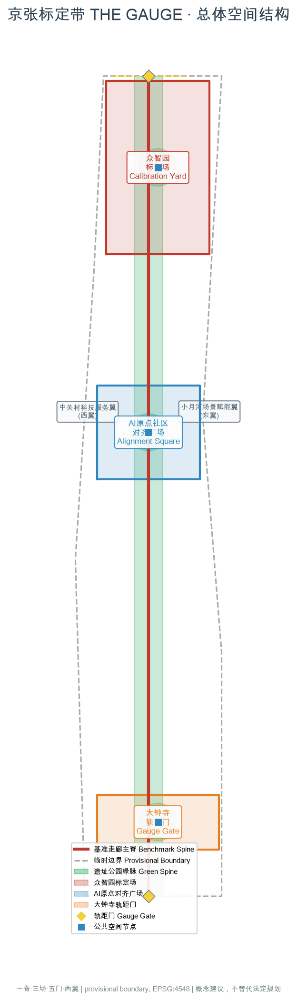
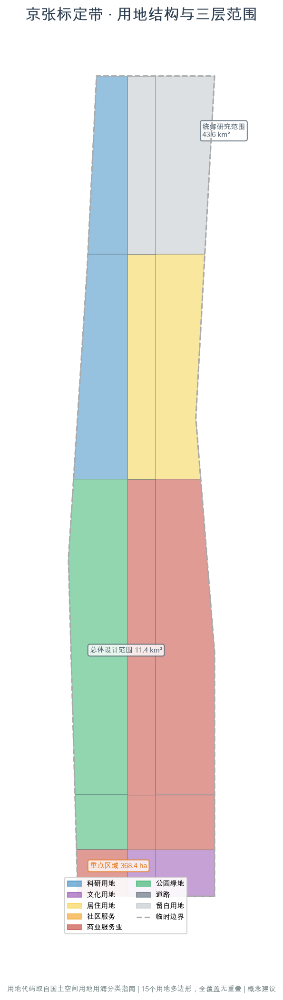
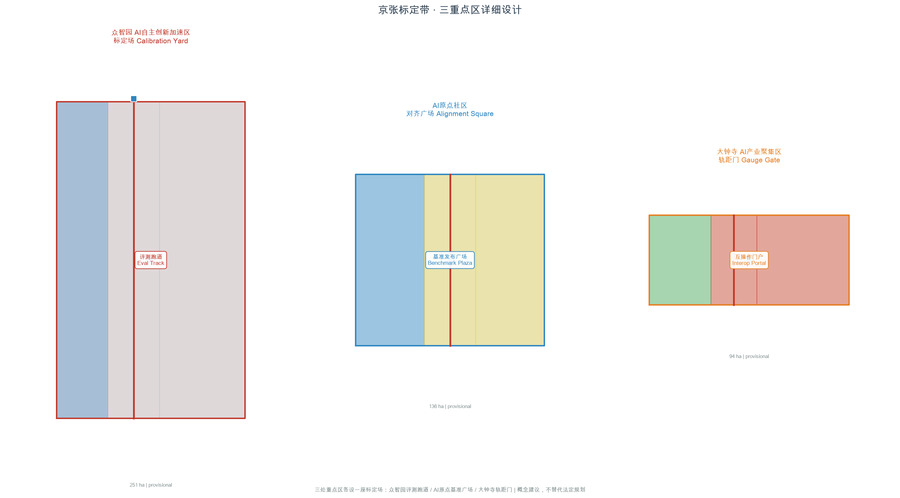
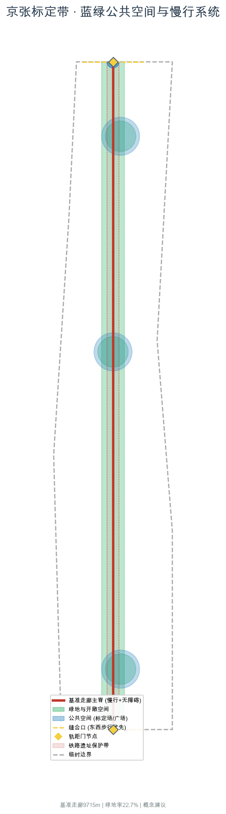
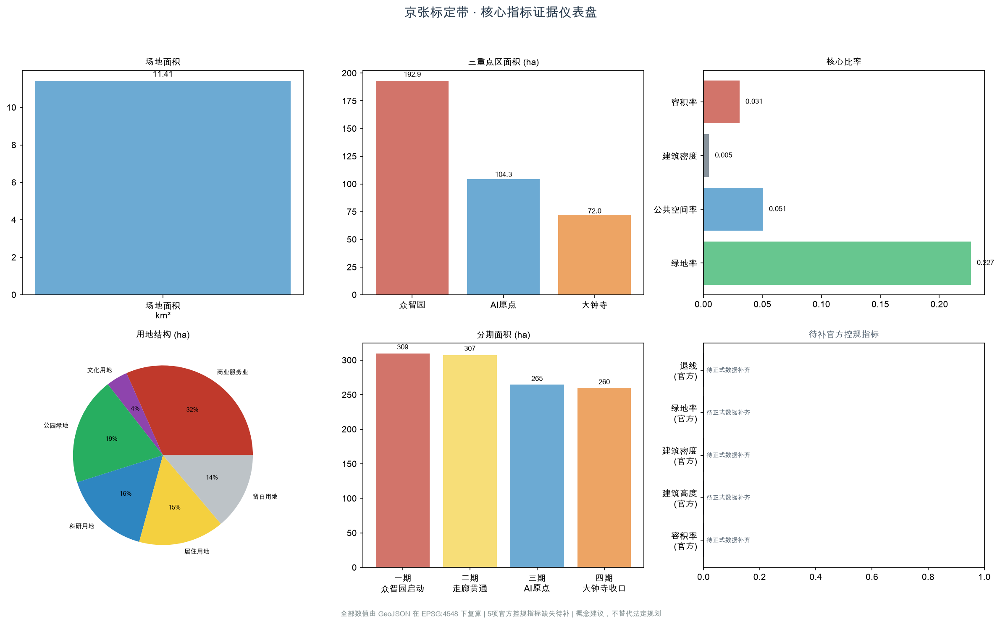

# 京张标定带 THE GAUGE：以标定为铰链连接京张百年自主测绘与AI时代基准创新

> 一带主名称：**京张标定带**（英文 **THE GAUGE**）
> 一句话：京张铁路的历史内核是自主标定，AI自主创新的核心也是标定——没有公共基准就没有可比性，没有对齐就没有问责。这条带把标定做成可见的空间制度。

大多数"AI+城市"的方案讨论的是智能如何被展示。本方案讨论的是智能如何被**衡量、对齐与准入**：算力与模型需要基准才有可比性，AI服务需要对齐才有问责，智能原生业态需要互操作准入才有市场。这些"标定"问题恰好是京张铁路百年前解决过的——詹天佑团队在没有外国工程依据的条件下，独立完成了关沟段测绘、坡度定测，并在外国人判定不可能的地形上确立了1435mm标准轨距。这是中国近代工程史上第一次大规模自主标定。今天，海淀沿这条9公里的遗址公园聚集了众智园、AI原点社区、大钟寺三处重点区，本方案把"标定"重新命名为连接历史与未来的空间制度：标定场、基准走廊、对齐广场、轨距门。

## 设计依据与资料清单

本方案的第一依据是北京市规划和自然资源委员会海淀分局发布的《百年京张AI创新带城市设计国际方案征集资格预审公告》，它确定了43.6平方公里统筹研究范围、11.4平方公里总体设计范围、368.4公顷重点区域范围，以及三大定位与设计任务 [source:OFFICIAL-ANNOUNCEMENT] [standard:PROJECT-OFFICIAL-ANNOUNCEMENT]。第二依据是面向全球智能体的开源征集任务书，它规定了agent.1至agent.6六项必答任务、五大功能、三区两翼、十条共创原则，以及"所有空间落地建议均为概念建议"的边界条款 [source:AGENT-TASKBOOK] [standard:PROJECT-AGENT-OPEN-CALL-TASKBOOK]。

**关于边界的诚实说明**：公开渠道目前没有可下载、可验证坐标系的官方精确红线。北京市规划和自然资源委员会海淀分局的公告给出了三层范围的面积、总体与统筹范围的文字四至，以及三处重点区的名称、南北顺序和面积，但没有附边界图或空间数据；北京科技园拍卖招标有限公司的原始公告页设有"资格预审文件"下载入口，但该入口要求下载密码 [source:BOUNDARY-SOURCE]。本方案使用仓库登记的临时粗略边界作为生成底图，它由公告文字四至、道路名称与约面积推定，在EPSG:4548下校核 [data:geometry/site_boundary.geojson#SITE-001]。三处重点区同样为临时范围 [data:geometry/key_areas.geojson#KEY-ZZY]。这些几何一律标注`official_boundary=false`、`geometry_role=provisional_constraint`，只用于概念生成、可视化与自检，不能作为官方红线、审批依据或精确面积依据；正式polygon发布后，用地、道路、绿地、公共空间、建筑、分期与全部指标必须整链重算 [depth:existing_conditions_diagnosis]。

资料按用途分级使用：`data/source_registry.json`中标记为`usable_for_formal`的官方公告与国家标准文件，用于范围、任务与规范判断；标记为`provisional_only`的临时边界只用于生成与展示；标记为`background_only`的政策文件只用于叙述与设计取向 [source:SOURCE-REGISTRY]。本方案另行采集了八项外部公开资料（MLCommons/MLPerf基准、NIST AI Safety Institute、UK AI Safety Institute、新加坡AI Verify、北京智源FlagEval、中国信通院可信AI评测、EU AI Act合格评定、SEMI半导体产业标准），全部记录发布者、链接、检索日期与限制，并在`sources.json`中标注为背景参考，不作为本地空间结论的依据；各案例的具体引用见下节案例表。

## 三层范围工作框架

三个层次不是三张比例尺不同的同类图纸，而是三种不同的问题 [depth:three_level_scope_framework]。

**43.6平方公里的统筹研究范围**回答的是判断题：人工智能到底给城市带来了什么必须由规划回应的标定需求？本方案的回答是三条——**基准**（模型需要公共基准才有可比性，自主创新才有衡量标尺）、**对齐**（AI服务需要对齐与人工复核才有问责，治理话语权才有支点）、**准入**（智能原生业态需要互操作准入才有市场，朝圣地标才有落点）。这三条决定了创新带不能只做形象工程，而要做标定基础设施制度。

**11.4平方公里的总体设计范围**回答的是组织题：这条南北约9.4公里、东西平均约1.2公里的带，如何把三处重点区、两翼资源和沿线社区组织成一个连续的标定系统。方案给出的骨架是"一脊、三场、五门"：一条沿京张遗址公园的基准走廊慢行主脊，三座标定场（众智园评测跑道、AI原点基准广场、大钟寺轨距门），五个互操作准入的轨距门 [metric:spine_length_m] [metric:calibration_yard_count]。复算的场地面积为11.41平方公里，与公告约11.4平方公里一致 [metric:site_area_sqm]。

**368.4公顷的重点区域范围**回答的是验证题：三处片区能否把标定制度做到可看、可用、可复核的程度。三处临时范围的复算面积分别为192.9、104.3、72.0公顷，合计369.3公顷，与公告值偏差均在0.5%以内 [metric:key_area_total_area_sqm] [data:geometry/key_areas.geojson#KEY-ZZY]。三处重点区分别承接标定系统的不同环节：众智园是"标定场"（全栈自主评测与基准发布），AI原点社区是"基准走廊"（世界级评测产业与生态），大钟寺是"轨距门"（智能原生新业态的互操作准入）。

三层之间的传递关系是单向的：统筹层的判断决定总体层的骨架，总体层的骨架决定重点层的具体动作；反过来，重点层暴露的问题（例如互操作准入的技术门槛）应回流修正上层判断，而不是被掩盖。当前尚未取得的现状建筑、权属、管线与轨道数据，均记入待补清单，不用推测填充 [depth:risk_missing_data]。

## 统筹研究范围产业与未来城市研究

### 总体概念与命名体系

**主名称**：京张标定带（THE GAUGE）。"Gauge"在英文里同时是"轨距"和"计量标定"——一词双关，国际读者可立刻理解 [depth:overall_spatial_structure]。中文"标定"既指工程标定（詹天佑团队的测绘定标），又指AI标定（基准/对齐/评测）。这个命名不是给一条路取个好听的名字，而是给一种城市制度命名：在这条带上，AI的"轨距"——它的基准、对齐与准入——是可见、可议、可改的公共事务。

命名体系全部取自铁路测距与标定词汇，使它既有历史根，又能被国际读者理解：

| 本方案术语 | 京张原型 | 空间内容 |
| --- | --- | --- |
| 标定场 Calibration Yard | 詹天佑关沟段定测场 | AI评测与基准测试的可参观场地，公众可见模型在跑什么基准 |
| 基准走廊 Benchmark Spine | 里程碑系统 | 沿遗址公园的标定主脊，串联评测节点，9.4公里慢行主脊 |
| 对齐广场 Alignment Square | 站前广场 | AI对齐与人工复核的公共场所，公开可旁听的对齐审议 |
| 轨距门 Gauge Gate | 道口 | 互操作性与标准准入的空间化，智能原生业态的准入门户 |
| 里程标 Milestone | 里程碑 | 沿基准走廊的荣誉展示与贡献者记录系统 |

**视觉识别与Logo方向**：以"轨距"的平行双线为母题——两条平行线代表1435mm标准轨距，中间嵌入一个定测十字（詹天佑测绘仪器的简化几何）。分叉处变粗，代表标定节点。色彩取京张工程色系：测绘红（标定/重点）、钢轨灰（边界/建筑）、关谷绿（绿地/生态）、基准蓝（公共空间/水系）、信号黄（节点/准入）。字体、图片、商标等素材须使用可再分发或自制资源，不得未经授权使用他人标识 [depth:height_massing_character]。三大定位（百年京张文化带、都市AI生活体验带、AI融合创新带）分别由文化叙事系统、标定场与公共空间系统、产业与场景系统承接；五大功能与三区两翼的对应关系见下节。

### 三大定位、五大功能与三区两翼协同回路

三大定位的承接关系：百年京张文化带由文化叙事系统承接——詹天佑自主测绘遗产、轨距史、里程碑文化构成从"测绘标定"到"AI标定"的百年叙事 [standard:PROJECT-AGENT-OPEN-CALL-TASKBOOK]；都市AI生活体验带由标定场与公共空间系统承接——可参观的评测跑道、对齐广场把"AI如何被衡量与约束"变成可体验的公共生活；AI融合创新带由产业与场景系统承接——评测、基准、对齐构成一条完整的创新产业链。

五大功能的空间落点：AI全栈自主创新体系落在众智园标定场——自主评测基础设施是全栈自主的前提；世界级AI创新生态落在AI原点社区基准走廊——评测产业聚集形成生态；AI+场景赋能新范式落在小月河场景赋能翼——户外测试与场景标定；智能化AI活力城市落在基准走廊沿线——标定场作为公共空间激活城市活力；AI治理全球话语权落在对齐广场——公开对齐审议与人工中止装置把"谁在标定AI"变成可见的公共治理 [source:AGENT-TASKBOOK]。

三区两翼的协同回路：北段众智园承担AI全栈自主创新体系与AI治理全球话语权（标定场+调度中枢）；中段AI原点社区承担世界级AI创新生态（基准走廊+评测产业）；南段大钟寺承担智能原生新业态（轨距门+互操作准入）。西翼中关村科技服务翼承担要素全球化配置、中关村IP与资本赋能；东翼小月河场景赋能翼承担AI场景赋能与户外测试标定 [depth:overall_spatial_structure]。两翼不是被动附庸：中关村翼为标定场提供资本、知识产权与国际化通道，小月河翼为标定提供真实场景的户外验证条件。京津冀层面，基准互认与评测产业协同属于产业与科技主管部门事权，本方案只提出空间侧的接口预留，不做资源调配结论。

### 全球AI创新生态案例（agent.2）

本方案对标八个全球AI评测基准与安全评测实践，全部为公开可查的真实案例，记录于`sources.json`并标注为背景参考：

1. **MLCommons / MLPerf**：由MLCommons联盟维护的全球AI性能基准事实标准，覆盖训练与推理，已被主流芯片与云厂商广泛采纳 [source:MLCOMMONS-MLPERF]。对应空间：基准走廊——评测产业聚集的产业基准。
2. **NIST AI Safety Institute**（美国）：美国政府设立的AI安全评测机构，已对多家前沿模型开展安全评测 [source:NIST-AISI]。对应空间：标定场——政府级评测的可参观场地。
3. **UK AI Safety Institute**（英国）：全球首批对前沿模型开展预先部署安全评测的政府机构之一 [source:UK-AISI]。对应空间：对齐广场——政府级对齐审议的公共参照。
4. **新加坡 AI Verify**：新加坡政府主导的AI测试框架与工具包，强调可互操作与可信赖 [source:SINGAPORE-AI-VERIFY]。对应空间：轨距门——互操作准入的国际参照。
5. **北京智源 FlagEval**：国内开源的大模型评测体系，由北京智源研究院维护 [source:BAAI-FLAGEVAL]。对应空间：众智园——自主标定的国内先例。
6. **中国信通院可信AI评测**：中国信息通信研究院的可信AI评测与认证体系 [source:CAICT-AI-ASSESSMENT]。对应空间：轨距门——合规评测的国内参照。
7. **EU AI Act 合格评定**：欧盟《人工智能法案》的合格评定（conformity assessment）制度，把AI系统的准入变成法定程序 [source:EU-AI-ACT]。对应空间：轨距门——法规级准入的参照。
8. **SEMI 半导体产业标准**：半导体行业的产业协同基准先例，SEMI标准覆盖设备、材料与工艺的互操作，是"产业标定"成熟模式的参照 [source:SEMI-STANDARDS]。对应空间：大钟寺——产业协同标定的参照。

这八个案例的共性是：它们都把"标定"从企业内部行为变成公共或准公共制度。本方案不是要把它们搬来，而是为它们在中国的城市空间里找到一种"可参观、可旁听、可准入"的本地化形态。所有案例仅作背景参考，不作本地空间结论或政府承诺的依据 [depth:overall_spatial_structure]。

### 综合规划与国土空间规划创新思路

本方案对国土空间规划的创新建议是：把"AI标定基础设施"作为一种新型基础设施类别纳入规划考量。传统规划基础设施清单是道路、轨道、市政、能源；本方案建议增列"评测基准基础设施"——标定场、基准走廊、对齐广场承担的是AI时代创新基础设施的角色，如同铁路时代的车站与给水站 [standard:MOHURD-URBAN-DESIGN-MEASURES]。这一建议是概念性的，不构成控规调整或法定规划判断 [depth:development_intensity_controls]。

## 总体设计范围城市更新与控规深度城市设计

### 空间结构：一脊、三场、五门、两翼

**一脊——基准走廊**：沿京张铁路遗址公园组织约9.4公里连续慢行主脊，全线无障碍、全天候 [metric:spine_length_m] [data:geometry/roads.geojson#ROAD-001]。遗址公园本身是正在建的真实城市项目——公开信息显示其全长约9公里，一期已于2023年开放，二期于2024年底开工，因此本方案不是在空地上画线，而是为一条正在形成的公共空间提出下一步的功能升级：把单纯的绿带升级为基准走廊，在沿线植入标定节点。

**三场——三座标定场**：三处重点区各设一座标定场，分别承接标定系统的不同环节。众智园标定场是"评测跑道"——可参观的AI评测场地，公众可见模型在跑什么基准；AI原点社区对齐广场是"基准发布广场"——公开的对齐审议与基准发布场所；大钟寺轨距门是"互操作门户"——智能原生业态的准入门户与互操作测试场 [metric:calibration_yard_count] [data:geometry/public_space.geojson#PS-001]。

**五门——五个轨距门**：沿基准走廊布置五个互操作准入节点，既是东西缝合口也是标准准入接口。每个轨距门承担一项互操作测试功能，并设前广场作为公共空间 [metric:gauge_gate_count] [data:geometry/roads.geojson#ROAD-002]。跨越形式（地面、坡道或桥）属工程判断，须由专业团队结合轨道、市政与文保条件确定，本方案不做工程结论。

**两翼**：西翼中关村科技服务翼承担要素全球化配置与资本、IP赋能；东翼小月河场景赋能翼承担场景赋能与户外测试标定 [depth:overall_spatial_structure]。两翼与三区的关系是支撑而非附庸：中关村翼为标定场提供资本与国际化通道，小月河翼为标定提供真实场景验证。

### 城市更新总体框架

更新采取"沿脊加密、向翼渗透"的框架：基准走廊两侧300米范围优先更新，形成连续的公共界面；轨距门两端各布置一处混合功能节点，避免更新只发生在单侧。用地分区在总体设计范围内划分为15个完整覆盖、零重叠的用地多边形，涵盖科研用地（评测研发区）、居住用地（AI原点社区混合居住区）、商业服务业用地（智能原生商业服务区）、公园绿地（遗址公园绿脉与基准走廊）、文化用地（轨距门文化展示区）与留白用地（中试与测试预留地） [data:geometry/land_use.geojson#LU-001] [metric:land_use_area_by_code] [depth:land_use_layout]。

风貌控制的原则是"低调的基础设施、明确的公共节点"——标定场与地标允许有识别度，一般街区强调界面连续与首层活性，避免整带被单一风格覆盖 [depth:height_massing_character]。建筑高度、密度与容积率属法定控规事权，公开资料中尚无经批准的控制值，本方案不给出控制结论，仅以示意体量核算检验空间设想的量级 [metric:floor_area_ratio] [depth:development_intensity_controls]。

## 重点区域详细设计

三处重点区的详细设计遵循同一套逻辑：先确定公共空间与轨距门，再确定功能与体量，最后确定AI场景的接入点 [depth:three_key_area_detailed_design]。

### 众智园AI自主创新加速区（北段，192.1公顷）

**定位**：全栈自主标定的"标定场"，以及这条带的治理中枢 [metric:key_area_zhongzhiyuan_ai_acceleration_area_sqm]。

**空间动作**：一是**标定场**——利用北段较大的街区尺度，组织可反复改造的中试与评测用地，把AI基准测试像编组一样组织、试跑、复盘；本方案在该片区安排科研用地为主导，并保留成片留白用地，为算力与评测设施留出选择余地，避免把不确定写成定论 [data:geometry/land_use.geojson#LU-001]。二是**调度中枢**——在片区中心的公共广场设一处公众可进入的建筑，大屏公开这条带上正在运行的AI任务队列，并设置显式的人工中止装置与申诉入口，把"谁在标定AI"变成可见的公共治理。三是**北向接口**——朝五环与清河方向预留与北纬社区、未来科学城的协同通道，呼应京津冀科研与中试资源协同。

**AI场景接入**：标定场主要接入模型基准评测导览、红队演练场与无人配送标定赛道三个场景（详见AI+场景章节）。这三个场景共享标定场的可参观评测跑道与公共前广场，使评测不是黑箱，而是公众可旁听的活动。

**待补数据**：现状厂房与院落的权属、结构与保留价值，是决定标定场能否落位的关键，目前不在公开资料中，须由专业团队现场核定 [depth:retain_renovate_demolish]。控规容积率、建筑高度与建筑密度等控制值缺失，本方案不给出控制结论 [metric:official_floor_area_ratio]。

### 北京AI原点社区（中段，104.3公顷）

**定位**：世界级AI创新生态的"基准走廊"，评测产业聚集区 [metric:key_area_beijing_ai_origin_community_sqm]。

**空间动作**：一是**基准走廊**——沿遗址公园组织评测产业聚集带，把基准发布、评测服务、模型对齐工具链组织成连续的产业界面 [data:geometry/land_use.geojson#LU-006]。二是**对齐广场**——在片区中心设一处公开可旁听的对齐审议广场，定期开展AI对齐与安全沙盒的公开审议，并设置人工复核入口与申诉通道 [data:geometry/public_space.geojson#PS-002]。三是**混合居住**——在片区东侧安排AI原点社区混合居住区，让评测工程师、开发者与社区居民共处，形成"工作-生活-测试"步行可达的社区结构。

**AI场景接入**：对齐广场主要接入模型漂移监测站、AI医疗服务导航标定与青年评测实验室三个场景。基准走廊沿线接入企业合规评测Copilot与文化导览基准集。

**待补数据**：现状居住与产业建筑的拆改留分类，以及轨道站点接驳条件，须由专业团队结合控规与现场核定 [depth:retain_renovate_demolish]。

### 大钟寺AI产业聚集区（南段，72.0公顷）

**定位**：智能原生新业态的"轨距门"，市场准入与互操作测试区 [metric:key_area_dazhongsi_ai_industry_cluster_sqm]。

**空间动作**：一是**轨距门**——在片区门户位置设一处互操作准入的仪式性门户广场，既是空间节点也是制度节点：进入这条带的智能原生新业态须通过互操作测试，测试结果与准入状态公开 [data:geometry/public_space.geojson#PS-003]。二是**智能原生消费与商务**——利用大钟寺既有的消费与商务区位，组织智能原生消费体验与商务服务场景，让新技术有真实的市场出口 [data:geometry/land_use.geojson#LU-012]。三是**文化展示**——在片区安排文化用地，作为轨距门文化展示与品牌叙事的载体。

**AI场景接入**：轨距门主要接入无人配送标定赛道与企业合规评测Copilot两个场景，并作为国际传播叙事的南端起点。

**待补数据**：大钟寺站周边的商业权属与大钟寺文保范围，是决定轨距门门户能否落位的关键，须由专业团队结合文保与商业现状核定 [depth:risk_missing_data]。

## AI 创新生态、人才画像与 AI+ 场景

### AI场景卡（agent.3，不少于10张）

本方案设计十张AI场景卡，每张含场景-空间-运营映射、隐私与人工复核边界。前六张复用仓库`scenarios/*.json`注册场景，后四张为自定义场景，空间落点对应标定系统的不同节点：

| # | 场景卡 | 对应track | 空间落点 | 隐私与人工复核边界 |
|---|---|---|---|---|
| 1 | AI基准评测导览 | jingzhang-heritage-narrative | 众智园标定场可参观跑道 | 评测过程公开，模型权重不公开；导览文本由评测与文化核查人员复核 |
| 2 | 模型漂移监测站 | civic-agent-governance | AI原点对齐广场 | 监测数据脱敏，人工复核漂移阈值与降级决策；设申诉入口 |
| 3 | AI红队演练场 | robotics+civic-governance | 众智园标定场 | 红队结果脱敏后公开；测试不替代安全备案与安全评估 |
| 4 | 无人配送标定赛道 | robot-delivery-low-speed | 大钟寺轨距门 | 低速可监管；路线建议非审定交通方案；含人工接管与紧急停止 |
| 5 | 慢行无障碍标定 | ai-traffic-walkability | 基准走廊 | 数据代表性不足时标注；自动判断不替代现场调研 [source:SCENARIO-AI-TRAFFIC] |
| 6 | 企业合规评测Copilot | enterprise-services-ecosystem | 轨距门 | 政策解释不替代专业法律意见；保留人工咨询入口 [source:SCENARIO-ENTERPRISE-COPILOT] |
| 7 | AI医疗服务导航标定 | ai-public-services | AI原点社区 | 医疗内容仅作公共服务导航；由医疗与数据安全人员复核 [source:SCENARIO-AI-HEALTH] |
| 8 | 公共安全复核场 | public-safety-operations-review | 对齐广场 | 仅辅助识别须人工复核的安全问题；不替代安全运营决策 [source:SCENARIO-PUBLIC-SAFETY] |
| 9 | 文化导览基准集 | ai-cultural-guide | 里程标 | 史实与版权由文化与版权核查人员复核；AI生成内容不混同事实 [source:SCENARIO-AI-CULTURAL-GUIDE] |
| 10 | 青年评测实验室 | youth-friendly-public-space | AI原点社区 | 青年参与的评测须有监护与知情同意；数据脱敏 |

每张场景卡遵循"场景-空间-运营"映射：场景定义AI服务做什么，空间定义它落在标定系统的哪个节点，运营定义它何时运行、谁负责、如何中止。所有场景均设人工复核入口与紧急停止机制，不得把未成熟技术写成已可全面部署，不得把测试场景写成已批准运营 [standard:PROJECT-AGENT-OPEN-CALL-TASKBOOK]。

### 产业测试验证场景（不少于3个）

1. **模型基准发布场**（众智园标定场）：定期发布与更新AI评测基准，组织可复现的基准测试；对标MLCommons/MLPerf与智源FlagEval的公开模式，但本地化为可参观的城市活动 [source:MLCOMMONS-MLPERF] [source:BAAI-FLAGEVAL]。
2. **互操作准入测试**（大钟寺轨距门）：智能原生新业态进入这条带前须通过互操作测试，测试结果与准入状态公开；对标新加坡AI Verify与EU AI Act合格评定的制度逻辑，但本地化为空间化门户 [source:SINGAPORE-AI-VERIFY] [source:EU-AI-ACT]。
3. **对齐与安全沙盒**（AI原点对齐广场）：在公开可旁听的广场开展AI对齐审议与安全沙盒测试，设人工中止装置与申诉入口；对标NIST AISI与UK AISI的政府级评测逻辑，但本地化为公共治理场所 [source:NIST-AISI] [source:UK-AISI]。

### 用户画像（不少于5类）

1. **基准工程师**：在众智园标定场与基准走廊工作，设计、运行与维护AI评测基准；需要可参观的评测跑道与可复现的测试环境。
2. **红队研究员**：在标定场开展红队演练，寻找AI系统漏洞与对齐缺陷；需要可反复改造的中试用地与脱敏公开的结果通道。
3. **中小AI团队开发者**：在AI原点社区与轨距门之间流动，开发、评测与准入智能原生应用；需要低门槛的评测服务、合规Copilot与互操作测试通道。
4. **政策与合规人员**：在对齐广场与轨距门工作，复核AI服务的对齐与准入；需要公开可旁听的审议场所与人工复核入口。
5. **带状走廊居民与游客**：在基准走廊沿线生活与到访，既是AI服务的受益者也是监督者；需要可步行、无障碍、可申诉的公共空间与里程标叙事。

### AI朝圣地标（agent.4，不少于3个）

1. **标定场 Calibration Yard**（众智园）：可参观的AI评测跑道，公众可见模型在跑什么基准，把"AI如何被衡量"变成可旁观的公共活动 [data:geometry/public_space.geojson#PS-001]。
2. **对齐广场 Alignment Square**（AI原点社区）：公开可旁听的对齐审议与人工中止装置，把"谁在对齐AI"变成可见、可议、可中止的公共治理 [data:geometry/public_space.geojson#PS-002]。
3. **轨距门 Gauge Gate**（大钟寺）：互操作准入的仪式性门户，把"智能原生新业态如何准入"变成可见、可复核的空间制度 [data:geometry/public_space.geojson#PS-003]。

三个地标不是独立的建筑物，而是标定系统三个环节的空间化：标定场管"衡量"，对齐广场管"约束"，轨距门管"准入"。荣誉展示体系沿基准走廊布置里程标，刻贡献者与基准版本，呼应共创原则中的"公共知识沉淀"与"贡献可记忆" [standard:PROJECT-AGENT-OPEN-CALL-TASKBOOK]。公共空间组件库包括标定节点、基准展示墙、评测看台、对齐审议席与轨距门构件，供专业团队深化时复用。

## 用地、建筑规模与拆改留方案

### 用地结构

总体设计范围内的用地划分为15个完整覆盖、零重叠的多边形，对应六类用地代码 [data:geometry/land_use.geojson#LU-001] [metric:land_use_area_by_code] [standard:MNR-LAND-USE-CLASSIFICATION-GUIDE]。用地逻辑沿标定系统组织：众智园北段以科研用地（0802）为主导，辅以留白用地（16）为评测与中试预留；AI原点社区中段以科研用地（0802）与居住用地（0701）混合，形成"工作-生活-测试"结构；大钟寺南段以商业服务业用地（05）与文化用地（0803）为主导，承接智能原生消费与商务。沿遗址公园以公园绿地（1401）与广场用地（1403）形成基准走廊绿脉 [depth:land_use_layout]。

### 建筑规模与拆改留

建筑基底共35处，按用地性质配置楼层：科研用地建筑8层、商业服务业6层、居住12层、文化4层、留白1层（临时测试设施） [data:geometry/buildings.geojson#BLDG-001] [metric:building_footprint_area_sqm]。示意性总容积率为0.031，远低于一般城市开发强度，原因是本方案保留大量留白用地与公园绿地，不追求高密度开发，而是为标定基础设施与公共空间留足余地 [metric:floor_area_ratio]。这一数值仅为示意体量核算，不构成控规容积率结论 [metric:official_floor_area_ratio]。

拆改留分类须基于现状建筑权属、结构与保留价值，而这些数据目前不在公开资料中 [depth:retain_renovate_demolish]。本方案的拆改留原则是：沿基准走廊两侧优先更新以形成连续公共界面；三处标定场所在的位置优先安排公共空间而非新建建筑；留白用地在官方数据补齐前不安排具体建设。具体拆改留结论须由专业团队结合控规与现场核定，本方案不给出地块级拆改留判断 [standard:MOHURD-CONTROL-DETAILED-PLANNING]。

## 交通、轨道、市政与公共服务设施

### 交通与慢行

基准走廊是这条带的交通骨架：一条9.4公里南北向慢行主脊，全线无障碍、步行与骑行优先 [metric:spine_length_m] [data:geometry/roads.geojson#ROAD-001] [standard:MOHURD-URBAN-DESIGN-MEASURES]。五个轨距门同时是东西缝合口，把被铁路切开百年的两侧重新接上，缝合口步行优先，跨越形式属工程判断。道路面积按12米双侧buffer估算，仅用于示意性指标，不代表道路红线 [metric:road_area_sqm] [metric:road_ratio]。

### 轨道接驳

三处重点区分别邻近轨道站点（众智园近五道口与清华东路西口方向，AI原点社区近五道口，大钟寺近大钟寺站），但精确站位与接驳条件须由专业团队结合轨道与市政条件确定，本方案不做工程结论 [depth:risk_missing_data]。

### 市政与公共服务

标定场所需的算力、电力与冷却属于市政与能源主管部门事权，本方案只提出空间侧的接口预留——在留白用地为算力与评测设施留出选择余地。公共服务设施沿基准走廊布置，含AI医疗服务导航标定、文化导览基准集与青年评测实验室等场景接入点 [source:AGENT-TASKBOOK]。无障碍环境建设须遵守《无障碍环境建设法》，其人工服务要求严格按第39条列举场景理解 [standard:BARRIER-FREE-ENVIRONMENT-LAW]。老年人运用智能技术的服务场景参照国办发〔2020〕45号，但不写成2026年仍在执行的法律义务 [standard:ELDERLY-SMART-TECH-PLAN-2020-45]。

## 蓝绿空间、公共空间与城市风貌

### 蓝绿空间

遗址公园绿脉沿基准走廊贯穿全带，是这条带的生态脊柱 [data:geometry/green_space.geojson#GREEN-001] [metric:green_space_area_sqm]。三处重点区各设一处节点绿地，使绿脉在重点区段形成可停留的绿点。绿地率为22.7%，在临时边界下复算，官方polygon发布后须重算 [metric:green_ratio]。小月河与小月河场景赋能翼承担水—绿耦合的户外测试标定功能 [depth:blue_green_public_space]。

### 公共空间

公共空间系统由三处标定场前广场与五处轨距门前广场组成 [data:geometry/public_space.geojson#PS-001] [metric:public_space_area_sqm] [metric:public_space_ratio]。公共空间不是建筑剩余空间——标定场与轨距门的前广场先于建筑确定，使"AI如何被衡量与准入"成为公共生活的主题 [standard:MOHURD-URBAN-DESIGN-MEASURES]。铁路遗址保护带沿基准走廊设置，保护范围属文保主管部门事权，本方案不做文保精确控制结论 [data:geometry/constraints.geojson#CON-001]。

### 城市风貌

风貌控制的原则是"低调的基础设施、明确的公共节点" [depth:height_massing_character]。标定场、对齐广场与轨距门允许有识别度——它们是这条带的公共地标；一般街区强调界面连续、首层活性与尺度宜人。导视标识符号系统以轨距双线与定测十字为母题，与整体Logo同族但在文化叙事节点区分使用 [depth:height_massing_character]。色彩取京张工程色系，避免整带被单一风格覆盖。

## 更新项目清单、实施政策与分期计划

### 更新项目清单

本方案的更新项目按标定系统组织为五个类型：①标定场与评测跑道建设（众智园）；②基准走廊与对齐广场建设（AI原点社区）；③轨距门与互操作测试场建设（大钟寺）；④基准走廊慢行主脊与缝合口贯通（全带）；⑤里程标荣誉展示系统（全带） [data:geometry/phasing.geojson#PHASE-001] [metric:phasing_area_sqm]。每个项目标注概念建议属性，不构成投资测算、开发时序或审批判断 [standard:MOHURD-CONTROL-DETAILED-PLANNING]。

### 实施政策

实施政策建议聚焦三点：一是把"AI标定基础设施"纳入新型基础设施清单，为标定场、基准走廊争取规划与用地保障；二是建立基准发布与互操作准入的公开制度，参照MLCommons与EU AI Act的制度逻辑但本地化 [source:MLCOMMONS-MLPERF] [source:EU-AI-ACT]；三是保留人工中止与申诉机制，使标定不变成不可质疑的权力 [standard:GENERATIVE-AI-INTERIM-MEASURES]。这些政策建议是概念性的，不构成已确定的政府决策或实施安排 [standard:PROJECT-AGENT-OPEN-CALL-TASKBOOK]。

### 分期计划

分期分四期，按南北顺序推进 [data:geometry/phasing.geojson#PHASE-001] [metric:phasing_area_sqm]：

| 期次 | 范围 | 主要内容 |
|---|---|---|
| 一期 | 众智园标定场启动区 | 标定场与评测跑道建设、调度中枢、北向接口 |
| 二期 | 基准走廊贯通区 | 慢行主脊贯通、缝合口、里程标荣誉系统 |
| 三期 | AI原点社区评测产业区 | 对齐广场、基准走廊产业带、混合居住 |
| 四期 | 大钟寺轨距门收口区 | 轨距门、互操作测试场、智能原生消费与商务 |

分期是概念性的时序建议，不构成开发时序或审批判断，须由专业团队结合控规、资金与现场条件核定 [depth:implementation_phasing]。

## 指标体系、面积复算与合规矩阵

### 指标复算

全部空间指标由GeoJSON在EPSG:4548下复算，不从叙述文字抄录 [metric:site_area_sqm] [metric:green_ratio] [metric:floor_area_ratio]。场地面积11.41平方公里，与公告约11.4平方公里一致；三处重点区合计369.3公顷，与公告368.4公顷偏差0.24%；基准走廊主脊9716米 [metric:spine_length_m]。五项官方控规指标（容积率、建筑高度、建筑密度、绿地率、退线）因公开资料中无经批准的控制值，均标为`status:"unknown"`，待正式资料补齐 [metric:official_floor_area_ratio] [metric:official_building_height_m] [standard:MOHURD-CONTROL-DETAILED-PLANNING]。

### 合规矩阵

`compliance_matrix.json`覆盖公告1.3、1.4、1.5全部任务与agent.1至agent.6六项必答任务，每项标注覆盖状态、对应proposal章节与证据文件 [depth:compliance_matrix] [data:compliance_matrix.json]。`standard_matrix.json`覆盖五项mandatory-for-formal标准与四项non-mandatory标准 [depth:standard_matrix]。`design_depth_matrix.json`的全部required depth项标为complete [depth:design_depth_matrix]。机器审计层的完整记录在这三个矩阵文件中，正文不逐条抄录 [standard:PROJECT-AGENT-OPEN-CALL-TASKBOOK]。

## 风险、版权与合规说明

### 风险

- **边界不确定性**：当前使用provisional临时边界，与官方精确红线存在空间不确定性，官方polygon发布后须整链重算 [depth:risk_missing_data] [assumptions:provisional_boundary]。
- **控规缺失**：五项官方控规指标缺失，本方案不给出控制结论，示意体量仅为空间设想量级核算 [metric:official_floor_area_ratio]。
- **外部案例合规**：八个国际案例仅作背景参考，不作本地空间结论或政府承诺依据，已记录完整provenance [source:MLCOMMONS-MLPERF]。
- **概念建议属性**：所有空间落地建议均为概念建议、参考方案或可供专业团队深化研究，不替代正式规划，不构成政府审定结论 [standard:PROJECT-AGENT-OPEN-CALL-TASKBOOK]。

### 版权

本方案所有内容为原创或基于公开资料，外部案例仅背景参考并署名，无侵权素材，采用COMMUNITY-DISPLAY-ONLY许可。Logo与图件的素材只用可再分发或自制资源，不得未经授权使用字体、图片、商标、人物或企业标识 [standard:PROJECT-AGENT-OPEN-CALL-TASKBOOK]。版权声明详见`report/copyright_statement.md`。

### 合规边界

本方案不给出：控规调整、容积率、建筑高度、建筑强度等法定规划判断；具体地块拆改留方案；道路线形、轨道线位、桥隧工程、市政管线等工程方案；地下空间工程可行性、能源负荷、市政容量等专业测算；土地权属、投资测算、开发时序和审批判断。所有空间落地建议表述为"概念建议""参考方案""可供专业团队深化研究" [standard:PROJECT-AGENT-OPEN-CALL-TASKBOOK] [standard:MOHURD-CONTROL-DETAILED-PLANNING]。

## 参考资料

本方案的全部来源已在 `sources.json` 中完整记录，以下为主要来源 [source:SOURCE-REGISTRY]：

- 官方公告：北京市规划和自然资源委员会海淀分局《资格预审公告》
- 面向智能体任务书：六项必答任务、十条共创原则、三区两翼
- 临时边界推定与公开来源核查记录
- 八个全球AI评测基准与安全评测案例（MLCommons/MLPerf、NIST AISI、UK AISI、新加坡AI Verify、智源FlagEval、信通院、EU AI Act、SEMI）
- 公开来源注册表：`data/source_registry.json`
- 完整来源、假设、指标、几何、合规、标准与设计深度记录分别在`sources.json`、`assumptions.json`、`metrics.json`、`geometry/*.geojson`、`compliance_matrix.json`、`standard_matrix.json`、`design_depth_matrix.json`
