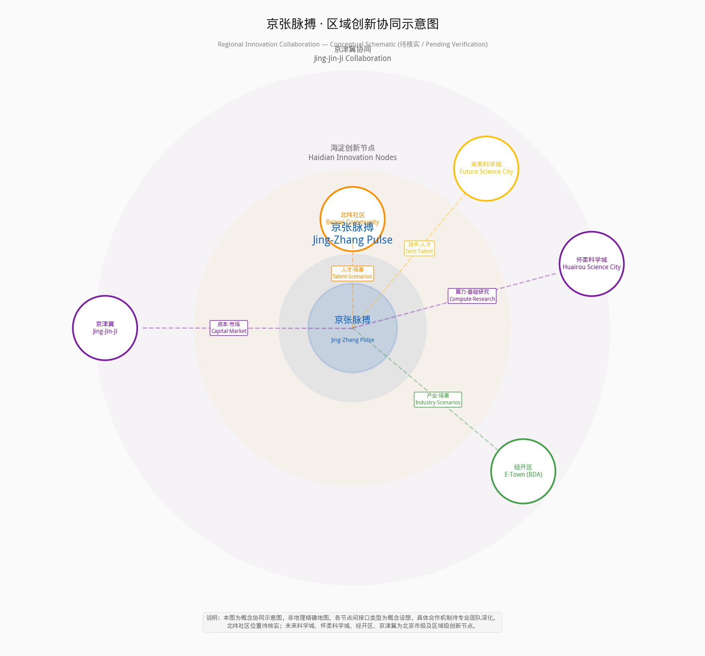
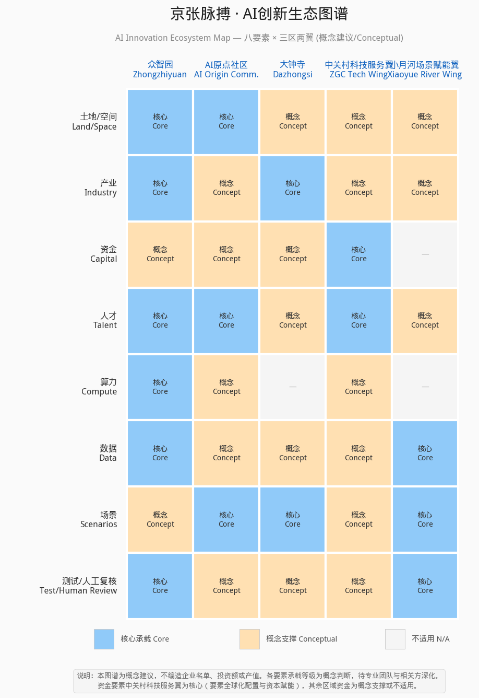
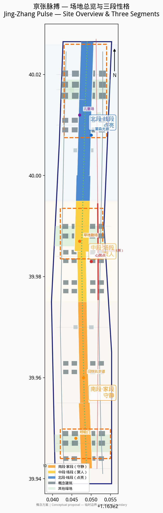
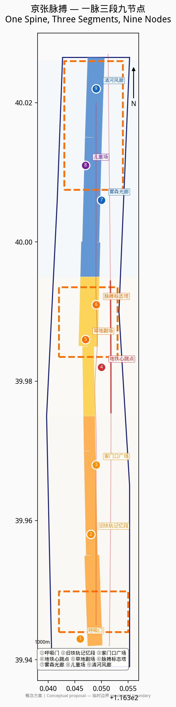
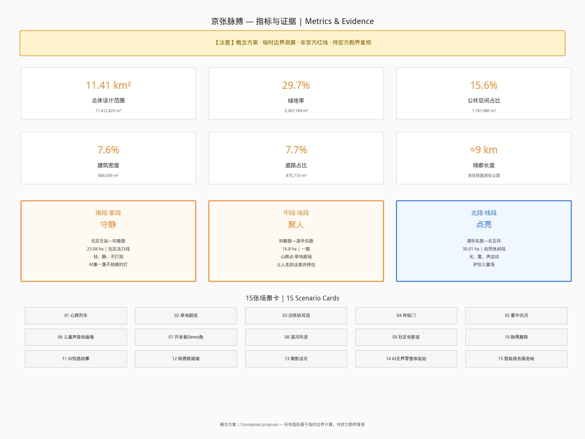

# 京张脉搏

## 1. 设计依据与资料清单

本方案以北京市规划和自然资源委员会海淀分局发布的《百年京张AI创新带城市设计国际方案征集资格预审公告》为第一依据 [source:SRC-2026-BJ-GH-QUAL-PREANNOUNCEMENT]，以智能体开放任务书为设计任务的直接来源 [source:SRC-2026-0518-AGENT-OPEN-CALL-TASKBOOK]。

方案编制参照《城市设计管理办法》对城市设计编制内容和风貌管控的基本要求 [standard:MOHURD-URBAN-DESIGN-MEASURES]，参照《城市、镇控制性详细规划编制审批办法》区分已批控制条件、设计建议与待确认事项 [standard:MOHURD-CONTROL-DETAILED-PLANNING]。用地分类采用自然资源部《国土空间调查、规划、用途管制用地用海分类指南（试行）》 [standard:MNR-LAND-USE-CLASSIFICATION-GUIDE]。

**已使用资料：**

| 资料 | 来源 | 用途 |
|------|------|------|
| 资格预审公告 | 北京市规自委海淀分局 [source:SRC-2026-BJ-GH-QUAL-PREANNOUNCEMENT] | 项目目的、三层范围、成果要求 |
| 智能体开放任务书 | 任务包 [source:SRC-2026-0518-AGENT-OPEN-CALL-TASKBOOK] | 六项智能体任务、场景与运营要求 |
| 临时边界 | 任务包 [source:SRC-PROVISIONAL-BOUNDARIES-2026] | 总体设计范围与三个重点区范围 |
| 京张铁路遗址公园二期开放报道 | 北京日报/央广网/新京报 [source:SRC-2026-JINGZHANG-PARK-PHASE2] | 公园分段、旧铁轨复原、儿童活动区、13号线高架关系等场地现状 |
| "三区两翼"政策 | 北京市科委公开信息 [source:SRC-2026-BJ-KW-THREE-AREAS-WINGS] | 产业定位与空间格局参考 |
| 海淀区"1+X+1"政策 | 海淀区政府公开信息 [source:SRC-2026-HAIDIAN-1X1] | 创新生态政策背景 |
| 用地分类指南 | 自然资源部 [source:SRC-2023-MNR-LAND-USE-CLASSIFICATION] | 用地代码与分类标准 |
| OpenStreetMap | ODbL [source:SRC-OSM-COPYRIGHT] | 背景地图参考，不作决策依据 |

**资料缺口：** 官方尚未提供批复的控制性详细规划成果、正式勘界红线、容积率/建筑高度/密度/绿地率等控制指标、现状建筑质量鉴定与权属调查、市政管线综合资料、铁路遗产保护规划。现状条件诊断基于任务包资料和公开信息完成 [depth:existing_conditions_diagnosis]。本方案所有空间与实施内容均为概念建议、参考方案，可供专业团队深化研究，不构成法定规划结论或官方批准 [depth:risk_missing_data]。

## 2. 三层范围工作框架

方案严格按照公告要求建立三个嵌套工作层次 [depth:three_level_scope_framework]：

- **统筹研究范围（43.6 km²）**：北至北五环，东至京藏高速，南至西直门外大街，西至万泉河路。该层次重点研究京张铁路遗址公园与中关村科学城、清华北大等高校、五道口及大钟寺商圈的区域联动关系。
- **总体设计范围（约11.4 km²）**：以京张遗址公园为中轴、两侧各约1—2公里的带状区域。本方案提交的 `geometry/site_boundary.geojson` 即对应该范围，面积为 [metric:site_area_sqm] 平方米 [data:geometry/site_boundary.geojson]。
- **重点区域范围（3.684 km²）**：包括众智园AI自主创新加速区（约192.9 ha）[metric:key_area_zhongzhiyuan_sqm]、北京AI原点社区（约104.3 ha）[metric:key_area_origin_community_sqm]、大钟寺AI产业聚集区（约72.0 ha）[metric:key_area_dazhongsi_sqm] [data:geometry/key_areas.geojson]。

三个层次在空间上由线到面、由宏观到微观递进。所有面积均基于任务包提供的临时边界（provisional boundary）在 EPSG:4548 投影下计算，精度为 provisional_rough，最终须以官方勘界红线为准 [source:SRC-PROVISIONAL-BOUNDARIES-2026]。

## 3. 统筹研究范围产业与未来城市研究：京张脉搏

### 3.1 概念阐述

京张铁路是中国第一条自主设计建造的铁路。百年后，高铁入地，据公开报道地面旧线被改造为约9公里城市绿廊（新闻背景参考，待官方数据核实）[source:SRC-2026-JINGZHANG-PARK-PHASE2]。地铁13号线的列车仍在公园旁高架上穿梭——列车经过时，像心跳。

**京张脉搏**，就是让这条被道路切开的旧线，重新成为一条有呼吸的公共脊线。无人时，它也在呼吸；有人时，人只是把这份脉搏，听得更清楚。

这不是科技展示，不是历史翻新。是让地铁的每一次经过，都像一次心跳；让旧铁轨步道成为人从家走到舞台的路；让AI像一盏不抢眼的灯，在该亮的地方亮，在该静的地方静。

### 3.2 场地研判：先看图，再动手

基于公开报道和场地资料（新闻背景参考，具体分段和面积以官方勘界及现场踏勘为准）[source:SRC-2026-JINGZHANG-PARK-PHASE2]，京张铁路遗址公园据报道全长约9公里，已形成三段实际性格（待核实）：

| 段落 | 实际范围 | 现状特征 | 方案性格 |
|------|----------|----------|----------|
| 南段·家段 | 北京北站—知春路（社区活力段，23.08 ha，据报道待核实） | 紧贴居民区，据报道复原2.4公里1909年旧线铁轨，有蒸汽车头、绿皮车厢、四道口节点（新闻背景参考，待现场核实）；老人唱歌、孩子玩耍、居民散步 | **守静**：轻、静、适合老人孩子；AI像一盏不抢眼的灯；不打扰 |
| 中段·场段 | 知春路—清华东路（一期，16.8 ha，据报道待核实） | 全园据报道最开阔处；13号线高架沿公园东侧平行，中段离公园最近，据报道桥下空间已打开；据报道有足球场、环丘、互动喷泉（新闻背景参考，待现场核实）；紧邻五道口和高校 | **聚人**：可以发生活动、放大声景；草地剧场、地铁心跳点；让人愿意从南边走到这里并停住 |
| 北段·线段 | 清华东路—北五环箭亭桥（自然休闲段，30.01 ha，据报道待核实） | 狭长线性，据报道纳入东升八家郊野公园；鱼骨状慢行通道；据报道有"京张之环"广场、林下剧场、儿童游乐区；衔接清河绿廊（新闻背景参考，待现场核实） | **点亮**：适合流动的光、雾、线、声；不堆聚集，只做穿越与点亮；护住现有儿童活动场地 |

**我们把中段放在知春路至清华东路之间（一期范围）。** 理由有三：第一，这是全园最开阔的段落，有条件容纳下沉草地剧场；第二，13号线高架在此段离公园最近，"车来先亮、车过逐光、车走留温"的心跳声光最有条件实现；第三，紧邻五道口和清华、北大、北航等高校，人气和活动需求最旺。

**北段怎么用：** 北段狭长，不做聚集场，做流动的线。光、雾、声沿步道线性展开，人穿过时被点亮，走过后留温。北段现有儿童游乐区（铁轨斜坡改造的攀爬区、滑梯、沙坑）保留升级，不改作成人打卡场，不用强声光惊吓孩子。

**南段怎么守：** 南段贴着居民区，是"家"。不做大型活动，不做声光轰炸，不做夜场。AI以最低调的方式存在——呼吸微光、安静的导览、便民的服务。旧铁轨步道在南段复原最完整（2.4公里1909年旧线），是文化锚，让人能踩、能走、能停、能听。

### 3.3 命名与Logo方向

**方案名：京张脉搏（Jingzhang Pulse）**

命名逻辑：京张是地名和历史，脉搏是生命和节奏。百年铁路在AI时代重新起跳——不是冰冷的科技，是有体温的心跳。

**Logo方向（概念建议）：** 以铁轨截面的"工"字钢为骨架，融入心电图脉搏波形。两条铁轨线向上延伸，在中段交汇成一个心跳峰值，象征中段的聚集与共演。整体造型既像一段铁轨，又像一条脉搏线。色彩建议：南段暖白（家的温度）、中段琥珀金（人气与舞台）、北段冷蓝（流动与科技），三色沿9公里渐变。

### 3.4 空间结构：一脉三段九节点

- **一脉**：京张铁路遗址公园脉搏绿廊，南北约9公里，是全线的呼吸脊线 [data:geometry/green_space.geojson]。
- **三段**：南段·家段（守静）、中段·场段（聚人）、北段·线段（点亮）。
- **九节点**：
  1. 呼吸门（南入口）
  2. 旧铁轨记忆段（南段2.4公里复原铁轨）
  3. 家门口广场（南段居民日常）
  4. 地铁声光·心跳点（中段，13号线最近处）
  5. 草地剧场·人机共演场（中段开阔处）
  6. 京张脉搏标志塔（中段视觉锚点）
  7. 雾森光廊（北段线性节点）
  8. 儿童场（北段，保留升级）
  9. 清河风廊（北端点，衔接清河绿廊）

### 3.5 任务书闭环矩阵：三大定位—五大功能—三区两翼

本矩阵将官方任务书的三大定位、五大功能、三区两翼逐项对应到本方案的空间落点与核心场景，证明方案不是另起炉灶，而是在任务书框架内长出的空间回答。所有空间落点均为概念建议，可供专业团队深化研究。

| 三区两翼（任务书） | 对应三大定位 | 对应五大功能 | 本方案空间落点 | 核心场景/节点 | 概念说明 |
|------------------|-------------|-------------|---------------|-------------|---------|
| **AI原点社区**（世界级AI创新生态） | AI融合创新带、都市AI生活体验带 | 世界级AI创新生态、AI+场景赋能新范式 | 中段·场段（知春路—清华东路，约104.3ha） | 草地剧场·人机共演场、地铁声光·心跳点、近校灵感角 | 中段是全园最开阔、离13号线最近、紧邻高校的段落，是AI创新生态从实验室走到公共空间的原点。草地剧场让人自发聚集，心跳点让地铁频次变成可感知的城市脉搏，灵感角给开发者和学生一个半户外的交流场。概念建议。 |
| **众智园AI自主创新加速区**（AI全栈自主创新体系与AI治理全球话语权） | AI融合创新带、百年京张文化带 | AI全栈自主创新体系、AI治理全球话语权、智能化AI活力城市 | 北段·线段（清华东路—北五环箭亭桥，约192.9ha） | 墩影流光、雾森光廊、儿童场（保留升级）、清河风廊 | 北段狭长，不做聚集场，做流动的线。墩影流光把最枯燥的桥墩变成从蒸汽机车到高铁动车组的时间线，是"从自主设计到自主智能"的建筑尺度表达。儿童场护住孩子，雾森和光廊做穿越与点亮。概念建议。 |
| **大钟寺AI产业集聚区**（智能原生新业态） | 都市AI生活体验带、百年京张文化带 | AI+场景赋能新范式、智能化AI活力城市 | 南段·家段（北京北站—知春路，约72.0ha） | 旧铁轨记忆段、呼吸门、家门口广场、生活服务角 | 南段贴着居民区，是"家"。AI以最低调的方式存在——呼吸微光、安静的导览、便民的服务。旧铁轨步道在南段复原最完整，是文化锚，让人能踩、能走、能停、能听。居民有否决权。概念建议。 |
| **中关村科技服务翼**（要素全球化配置、中关村IP与资本赋能） | AI融合创新带 | AI全栈自主创新体系、世界级AI创新生态 | 中段辐射区（五道口—高校带，概念协同） | 近校灵感角、开发者Demo角、社区电影夜 | 中关村科技服务翼的要素（人才、资本、IP）通过中段的近校灵感角和开发者Demo角流入公园。方案不编造企业名单或投资额，只提供空间承载机制——有电源、有网络、有白板墙、有可预约的草地剧场。概念建议，具体产业合作待专业团队深化。 |
| **小月河场景赋能翼**（AI场景赋能与智能化AI活力城市） | 都市AI生活体验带 | AI+场景赋能新范式、智能化AI活力城市 | 南段—中段断点缝合区（知春路附近，概念协同） | 南段—中段人行道地面指引、脉搏晨跑灯光系统 | 小月河场景赋能翼的核心是"AI场景可感知、可体验"。方案通过人行道地面指引把南段和中段被建筑切开的断点缝合，让人愿意从家走到舞台。脉搏晨跑灯光让9公里绿廊变成可体验的AI场景。概念建议。 |

> **三大定位全覆盖说明**：百年京张文化带→旧铁轨记忆段、墩影流光车型演进、京张之环；都市AI生活体验带→呼吸门、家门口广场、儿童场、脉搏晨跑；AI融合创新带→草地剧场、心跳点、近校灵感角、墩影流光。
>
> **五大功能全覆盖说明**：AI全栈自主创新体系→众智园北段+墩影流光时间线；世界级AI创新生态→AI原点社区中段+草地剧场；AI+场景赋能新范式→小月河翼+15张场景卡；智能化AI活力城市→大钟寺南段+便民AI服务；AI治理全球话语权→数据匿名化、居民否决权、人工复核机制（见场景卡AI矩阵）。
>
> 注：以上对应关系为概念建议，三区两翼的精确空间范围以官方勘界和控规为准。本方案不编造产业数据、投资额或企业名单。

### 3.6 区域创新协同图与接口说明

本方案的区域协同不是编造产业数据或投资额，而是说明京张脉搏作为一条公共空间脊线，可以为周边创新节点提供什么接口、可以从周边节点获得什么支撑。所有接口均为概念设想，具体合作机制待专业团队深化，对尚无正式依据的关系标为"协同设想/待核实"。

**区域协同接口说明（概念设想/待核实）：**

| 协同节点 | 空间关系 | 接口类型 | 京张脉搏可提供 | 京张脉搏可获得 | 状态 |
|---------|---------|---------|---------------|---------------|------|
| **北纬社区** | 同属海淀，空间邻近（具体位置待核实） | 人才·场景 | 公共活动空间、社区展示窗口、AI场景测试场 | 社区居民用户、日常场景数据（匿名） | 协同设想/待核实 |
| **未来科学城** | 北京北部，昌平区，距京张约15—20公里（概念距离） | 技术·人才 | 技术展示与公众体验空间、开发者交流场 | 前沿技术成果、科研人才、测试设备 | 协同设想/待核实 |
| **怀柔科学城** | 北京东北部，怀柔区，距京张约50—60公里（概念距离） | 算力·基础研究 | 科普展示与公众理解窗口 | 大科学装置算力资源、基础研究成果（概念接口） | 协同设想/待核实 |
| **经开区（E-Town/BDA）** | 北京南部，大兴/亦庄，距京张约25—30公里（概念距离） | 产业·场景 | 创新产品首发体验空间、消费者反馈场 | 产业化资源、智能制造场景、企业合作 | 协同设想/待核实 |
| **京津冀** | 区域级，京张为北京北部节点 | 资本·市场 | 国际传播窗口、城市品牌展示 | 区域资本、跨城市场、政策协同（概念接口） | 协同设想/待核实 |

> **协同原则**：京张脉搏不与周边创新节点竞争功能定位，而是作为一条"可感知、可体验、可传播"的公共空间脊线，为技术提供面向公众的展示窗口，为社区提供接触创新的日常入口。所有协同关系均为概念设想，不构成合作承诺或政策安排。具体距离、接口机制和合作模式待专业团队与相关方深化研究。

## 4. 总体设计范围城市更新与控规深度城市设计

### 4.1 用地布局

总体设计范围的用地布局在 `geometry/land_use.geojson` 中完整表达，共24个地块，无间隙无重叠覆盖整个总体设计范围 [depth:land_use_layout] [data:geometry/land_use.geojson]。用地构成如下：

| 用地代码 | 用地类型 | 面积（万m²） | 占比 |
|----------|----------|-------------|------|
| 0802 | 科研用地 | 424.1 | 37.2% |
| 05 | 商业服务业用地 | 259.0 | 22.7% |
| 1401 | 公园绿地 | 212.5 | 18.6% |
| 0803 | 文化用地 | 129.4 | 11.3% |
| 0701 | 城镇住宅用地 | 116.3 | 10.2% |
| 16 | 留白用地 | ≈0 | ≈0% |

科研和商业服务业用地占比约60%，体现AI产业带的功能主导；公园绿地占18.6%，整体绿地率达 [metric:green_ratio] [metric:green_space_area_sqm]。

**绿地口径说明（三个概念，互不矛盾）：**
- **公园绿地（G1/1401）**：用地表中代码1401的公园绿地，约212.5 ha，占场地18.6%。这是国土空间用地分类中的公园绿地。
- **绿脉（脉搏绿廊）**：沿京张铁路遗址南北贯通的线性绿色公共空间，约228.8 ha，包含公园绿地主体及两侧防护绿地、道路绿地等附属绿地，是方案的生态脊梁。
- **全部绿地（green_space.geojson）**：geometry图层中所有绿地的总和，约338.7 ha（[metric:green_space_area_sqm]），占场地29.68%（[metric:green_ratio]），包含公园绿地、防护绿地、广场绿地、附属绿地等全部绿地类型。
三者为包含关系：公园绿地 ⊂ 绿脉 ⊂ 全部绿地。所有面积均基于provisional临时边界测算，待官方勘界数据发布后复算。

### 4.2 开发强度与高度形态

由于官方尚未提供容积率和建筑高度控制指标，本方案不给出法定容积率结论 [depth:development_intensity_controls]。概念性建议为：三个重点区核心地块采用中高强度开发（概念层数4—6层），沿绿脉界面降低高度形成梯度，确保绿脉的空间通透性 [depth:height_massing_character]。所有建筑轮廓均为概念体量，共68栋 [metric:building_count]，占地 [metric:building_footprint_area_sqm] 平方米，建筑密度约 [metric:building_density_ratio] [data:geometry/buildings.geojson]。总建筑面积和容积率状态为 unknown，待官方控规指标明确后复算 [metric:floor_area_ratio] [metric:total_floor_area_sqm]。

### 4.3 更新策略

更新方式以"留改拆"并举为原则 [depth:retain_renovate_demolish]：
- **留**：保留4栋现状建筑（科研楼、办公楼、住宅楼、社区楼各1栋），在 `buildings.geojson` 中标记为 retain，confidence 为 low（未进行实地核查）；
- **改**：沿绿脉两侧的旧工业和仓储建筑建议改造为AI孵化器、社区服务和展示空间；
- **拆**：严重影响绿脉贯通和公共空间连续性的临时建筑建议拆除，具体拆改留范围须以权属调查和房屋质量鉴定为依据。

## 5. 重点区域详细设计

三个重点区域不绑死具体功能，而是根据场地研判和三段性格提出概念建议 [depth:key_area_detailed_design]。

### 5.1 众智园AI自主创新加速区（北段·线段，约192.9 ha）

众智园位于北段，对应"线段"性格。这里狭长、自然、靠近清河，不做大型聚集，做流动的创新线。

- **雾森光廊**：沿绿脉北段设置线性雾森与光纤装置，日间是雾中步道，夜间是流动光河。概念建议。
- **墩影流光（北段与地铁高架结合的重点节点）**：北段13号线高架从公园内穿过，桥墩排列本身就是一条线。概念建议在桥墩四面设置投影映射，列车经过时逐墩点亮——墩面播放京张铁路百年车型影像（蒸汽机车、绿皮火车到高铁动车组），所有车头朝向与列车前进方向一致，从过去驶向未来；光从一个墩面流向下一个墩面，车走后缓缓暗下留有余温。暖金色光既是艺术表达，也照亮桥下步道。公路对面餐厅的食客隔路相望，成为日常晚餐的背景。不新增构筑物、不改造桥墩结构，投影设备隐蔽安装；21:30后自动降亮或关闭；音量≤50dB或静音；不含商业广告；须与地铁运营方协调安全距离。这是"车来先亮、车过逐光、车走留温"在建筑尺度上的实现——桥墩从最枯燥的结构变成最亮的线。概念建议、参考方案，可供专业团队深化研究（详见场景卡13）。
- **清河风廊**：北端衔接清河滨水绿廊，设置风动装置，将清河的风转化为可视的光与声。概念建议。
- **儿童场（保留升级）**：北段现有儿童游乐区（攀爬坡、滑梯、沙坑）保留儿童活动底色，可增加AI互动元素（如地面投影游戏、声音绘画墙），但音量和亮度须控制在儿童友好范围内，不改作成人打卡场。概念建议。
- **京张之环**：现有"京张之环"1909主题活动广场可作为北段的文化锚点，增加脉搏主题的夜间灯光，但保持自然休闲基调。概念建议。

### 5.2 北京AI原点社区（中段·场段，约104.3 ha）

原点社区位于中段，对应"场段"性格。这里最开阔、离地铁最近、紧邻高校，是整条脉搏的心跳最强处。

- **地铁声光·心跳点**：在13号线高架离公园最近处（一期范围内，知春路至北四环之间），设置非接触式传感与地埋灯光。列车 approaching 时灯光渐亮（车来先亮），列车经过时光带逐节追随（车过逐光），列车驶离后灯光以呼吸节律缓慢变暗留有余温（车走留温）。不使用高音喇叭，声音以低频振动和环境音为主，避免扰民。概念建议。
- **草地剧场·人机共演场**：在中段开阔草坪处设置下沉草坡看台，白天是可躺可坐的草地，晚上台阶灯带亮起成为舞台。人能坐、能留、能自己发生事——学生音乐会、开发者demo秀、社区电影、AI生成艺术演出都可在此发生。舞台不设固定大型设备，保持草地的日常性。概念建议。
- **京张脉搏标志塔**：草地剧场旁设置视觉标志塔，以铁轨"工"字钢截面和脉搏波形为造型，高度概念建议15—20米，作为中段的空间锚点。概念建议。
- **近校灵感角**：靠近高校的位置设置半户外交流空间，有电源、有网络、有白板墙，学生和开发者可自发聚集。概念建议。

### 5.3 大钟寺AI产业聚集区（南段·家段，约72.0 ha）

大钟寺位于南段，对应"家段"性格。这里贴着居民区，一切要轻、要静。

- **呼吸门（南入口）**：南段入口设置低矮的光门，以呼吸节律（约4秒一亮一暗）发出暖白光，欢迎回家的居民。不喧哗、不闪烁。概念建议。
- **旧铁轨记忆段**：南段据报道已复原约2.4公里1909年旧线铁轨（新闻背景参考，具体长度待现场核实）[source:SRC-2026-JINGZHANG-PARK-PHASE2]，是全线文化锚点。保持铁轨可走可踩的日常性，不围合、不供奉。沿轨设置低调的语音解说桩（扫码可听铁路历史和AI生成的环境音景），音量控制在耳语级别。概念建议。
- **家门口广场**：南段居民区旁的日常广场，保留老人跳舞、孩子玩耍的现有功能。AI服务以便民为主：智能座椅（无线充电）、安静的环境监测屏、无障碍导航。不做大型活动、不做夜场。概念建议。
- **生活服务角**：南段居民日常服务节点，AI便民但不抢眼。概念建议。

## 6. AI 创新生态、人才画像与 AI+ 场景

### 6.1 全球AI创新生态案例

以下案例基于公开资料整理，为京张脉搏的产业生态构建提供参考 [depth:ai_ecosystem_cases]。

| 案例 | 地点 | 可借鉴点 |
|------|------|----------|
| 伦敦国王十字（King's Cross） | 英国伦敦 | 铁路遗产改造+科技企业聚集（DeepMind），公共空间与私有开发融合 |
| 多伦多Quayside | 加拿大多伦多 | 智慧城市试点的经验教训：技术须服务居民而非监控居民，公众信任优先 |
| 首尔数字媒体城（DMC） | 韩国首尔 | 政府主导的AI/媒体产业集群，公共空间中的数字艺术装置 |
| 赫尔辛基Kalasatama | 芬兰赫尔辛基 | 智慧社区以居民日常生活为中心，AI服务嵌入而非叠加 |
| 波士顿海港区（Seaport） | 美国波士顿 | 工业遗产更新+创新经济，公共滨水空间带动区域活力 |
| 东京涩谷未来之光 | 日本东京 | 高密度交通枢纽中的AI服务与公共空间整合 |
| 新加坡纬壹科技城（one-north） | 新加坡 | 产学研居一体的生态社区，公共空间鼓励跨界交流 |
| 柏林EUREF园区 | 德国柏林 | 工业遗产改造为清洁能源+智能移动示范区，历史与未来并置 |

### 6.1.1 AI创新生态图谱与场景—空间—运营—数据—人工复核矩阵

本图谱将任务书要求的八大要素（土地/空间、产业、资金、人才、算力、数据、场景、测试/人工复核）对应到三区两翼，明确每个区域的核心承载与概念支撑。所有要素等级均为概念判断，不编造企业名单、投资额或产值，待专业团队与相关方深化。

**场景—空间—运营—数据—人工复核矩阵（概念建议）：**

| 场景卡 | 空间落点 | 运营方式 | 数据策略 | 人工复核 | 来源等级 |
|--------|---------|---------|---------|---------|---------|
| 01心跳列车 | 中段·地铁声光心跳点 | 公园运营方日常维护，设备供应商技术支持 | 仅存实时列车状态，不存历史，不存个人信息 | 地铁运营方安全审核 | 概念建议/待审批 |
| 02草地剧场 | 中段·下沉草坪 | 社区运营团队管理预约，高校/开发者/社区自发使用 | 预约数据存30天，密度数据不存 | 社区运营团队审核活动内容 | 概念建议/待审批 |
| 03旧铁轨耳语 | 南段·旧铁轨记忆段 | 公园运营方维护设备，文化顾问更新内容 | 不采集用户数据 | 历史学者审核内容准确性 | 概念建议/待审批 |
| 04呼吸门 | 南段·南入口 | 公园运营方日常维护 | 无数据采集 | 无需人工复核 | 概念建议 |
| 05雾中光河 | 北段·雾森光廊 | 公园运营方+设备供应商维护 | 仅存环境数据（温湿度），不存个人数据 | 园林部门审核用水安全 | 概念建议/待审批 |
| 06儿童声音绘画墙 | 北段·儿童场 | 公园运营方维护，儿童心理专家指导 | 不存音频或图像 | 儿童心理学专家审核交互安全 | 概念建议/待审批 |
| 07开发者Demo角 | 中段·近校灵感角 | 高校+社区联合运营 | 无AI数据采集 | 社区运营团队管理空间使用 | 概念建议 |
| 08清河风语 | 北端·清河风廊 | 公园运营方+设备供应商维护 | 仅存风速数据 | 市政部门审核装置安全 | 概念建议/待审批 |
| 09社区电影夜 | 中段·草地剧场 | 社区委员会策划，志愿者执行 | 无AI数据采集 | 社区委员会审核影片内容 | 概念建议 |
| 10脉搏晨跑 | 全线·慢行系统 | 公园运营方维护 | 匿名计数，不存个人数据 | 无需人工复核 | 概念建议 |
| 11AI生成铁路故事 | 南段/中段·解说系统 | 内容团队维护，历史学者审核 | 不采集用户数据 | 历史学者审核事实准确性 | 概念建议/待审批 |
| 12脉搏数据墙 | 中段·数据展示 | 公园运营方+数据团队维护 | 聚合数据存90天，原始数据不存 | 数据治理团队审核隐私合规 | 概念建议/待审批 |
| 13墩影流光 | 北段·高架桥下 | 公园运营方+内容团队+设备供应商维护 | 不存数据 | 地铁运营方+文保部门审核内容与安全 | 概念建议/待审批 |

> **人工兜底原则**：所有AI场景均设人工复核环节。涉及内容生成的（场景卡03、11）须历史学者审核；涉及安全的（01、05、08、13）须相关部门审批；涉及隐私的（02、12）须数据治理团队审核；涉及儿童的（06）须儿童心理学专家指导。AI失败时一律降级为非AI模式，不影响公园基本使用。

### 6.2 五类用户画像

1. **南段居民**：日常、亲子、下楼即达。需求是安静、安全、便民。怕吵、怕光污染、怕公园变成景区。
2. **AI开发者**：工作、交流、轻展示。需求是灵感碰撞、demo空间、同行社交。在中段活动为主。
3. **高校学生**：灵感、社交、活动。需求是便宜或免费的空间、能组织活动、有WiFi和电源。中段草地剧场的主要使用者。
4. **国际访客**：认知、打卡、传播。需求是可识别的地标、可讲述的故事、可拍照的场景。脉搏标志塔和心跳点是传播点。
5. **孩子与家长**：安全、趣味、启发。需求是儿童友好的设施、不吓人的声光、家长可休息的位置。南段和北段儿童场为主。

### 6.2.1 包容性服务矩阵（概念建议）

本矩阵将六类包容性用户落实到具体节点、服务内容、非数字替代和人工协助渠道，确保京张脉搏不排除任何使用者。所有服务均为概念建议，可供专业团队深化研究。

| 用户类型 | 对应节点 | 服务内容 | 非数字替代 | 人工协助 |
|---------|---------|---------|-----------|---------|
| **轮椅/行动不便** | 全线慢行系统、草地剧场、家门口广场 | 无障碍连续坡道、轮椅可及的休息平台、低高度服务台、无障碍卫生间 | 纸质无障碍路线图、现场工作人员引导 | 公园运营方设无障碍服务热线，关键节点设呼叫按钮 |
| **视障** | 旧铁轨记忆段、心跳点、导览路线 | 触感铺装（旧铁轨边缘做触感引导）、语音解说桩、声光地标可听化 | 现场工作人员一对一导览、盲文标识 | 解说桩旁设人工服务按钮，社区志愿者定期陪行 |
| **听障** | 草地剧场、社区电影夜、解说系统 | 视觉字幕屏、灯光节奏替代声音提示、手语视频导览（扫码可看） | 纸质图文导览、现场手语志愿者 | 活动时段安排手语志愿者，服务台设文字交流板 |
| **老年人** | 南段家门口广场、呼吸门、旧铁轨步道 | 休息座椅密度提升、安静的环境监测屏（大字显示）、便民服务角、慢节奏导览 | 纸质大字版导览图、社区工作人员定期走访 | 南段设便民服务站，志愿者协助使用智能设备 |
| **儿童照护者** | 北段儿童场、南段家门口广场、草地剧场 | 儿童场旁设家长休息区、母婴室、儿童安全围栏、亲子卫生间 | 现场工作人员看护协助、纸质儿童活动指南 | 儿童活动时段安排安全员，服务台设儿童走失协助 |
| **无智能手机用户** | 全线节点、解说系统、活动预约 | 实体导览标识、现场人工咨询台、电话预约渠道、纸质活动日历 | 全部服务均可通过现场或电话完成，不依赖手机 | 每个主要节点设人工服务点，运营方设服务热线 |

> **包容性原则**：京张脉搏的所有AI服务均设非数字替代渠道和人工协助渠道，不将任何使用者排除在外。AI是增强人的能力，不是替代人的服务。涉及无障碍连续性路线、盲文标识、手语服务等专业内容，须由无障碍专业团队深化设计。

### 6.3 场景卡

**场景卡01：心跳列车**
- 位置：中段·地铁声光心跳点
- 时间：全天，夜间效果最佳
- 行为：13号线列车经过时，地埋灯光随列车节奏亮起、追随、留温
- 技术：非接触式振动/光学传感+地埋LED+低频振动反馈
- 性格：不喧哗，用视觉和体感而非高音
- AI角色：感知列车节奏，生成同步光效；无人时灯光以安静呼吸节律运行

**场景卡02：草地剧场**
- 位置：中段·下沉草坪
- 时间：午后至晚间
- 行为：白天草地躺坐，夜间台阶灯带亮起，自发演出
- 技术：低压灯带、可移动音响设备、开放式预约系统
- 性格：人是主角，AI是灯光师
- AI角色：根据人群密度自动调节灯光氛围；开放预约平台供社区/学生/开发者登记活动

**场景卡03：旧铁轨耳语**
- 位置：南段·复原铁轨步道
- 时间：全天
- 行为：沿铁轨散步，扫码听铁路历史和AI生成的环境音景
- 技术：低功耗蓝牙信标、手机音频、TTS语音合成
- 性格：耳语级别，不打扰他人
- AI角色：根据时间、天气、步行速度生成个性化音景；多语言解说

**场景卡04：呼吸门**
- 位置：南段入口
- 时间：夜间
- 行为：居民晚归经过，光门以呼吸节律亮起暖白光
- 技术：人体感应+暖白LED
- 性格：像玄关的灯，欢迎回家
- AI角色：感知有人接近时缓慢亮起，无人时保持最低亮度

**场景卡05：雾中光河**
- 位置：北段·雾森光廊
- 时间：清晨和傍晚
- 行为：沿狭长步道穿行，雾中光纤随脚步亮起又熄灭
- 技术：高压微雾系统+光纤+脚步感应
- 性格：流动、短暂、不聚集
- AI角色：根据步行方向和速度生成追随光效；雾量根据温湿度自动调节

**场景卡06：儿童声音绘画墙**
- 位置：北段·儿童场
- 时间：日间
- 行为：孩子对着墙说话或唱歌，墙面投影出彩色波纹
- 技术：麦克风阵列+投影+声音可视化算法
- 性格：柔和、有趣、不吓人
- AI角色：将儿童声音转化为视觉波纹；音量超过阈值时自动降低灵敏度

**场景卡07：开发者Demo角**
- 位置：中段·近校灵感角
- 时间：工作日午后、周末
- 行为：开发者在半户外空间演示原型，同行围观交流
- 技术：户外电源、WiFi、可移动显示屏、开源社区预约平台
- 性格：轻松、非正式、开源
- AI角色：提供活动匹配和推荐；记录公开demo并生成索引

**场景卡08：清河风语**
- 位置：北端·清河风廊
- 时间：有风时
- 行为：风动装置将清河的风转化为可视的光带和可听的低频和声
- 技术：风力传感器+光纤+环境音效
- 性格：自然、空灵
- AI角色：将风速风向转化为光声模式；长期积累形成"风的记忆"数据艺术

**场景卡09：社区电影夜**
- 位置：中段·草地剧场
- 时间：周末晚间（每月2—4次，非每周）
- 行为：居民自带坐垫在草坡看露天电影，南段居民可选择不参加（距离足够远）
- 技术：可移动投影设备、定向音响（控制声范围）
- 性格：社区感、低频次
- AI角色：居民投票选片；根据天气自动改期通知

**场景卡10：脉搏晨跑**
- 位置：全线慢跑道
- 时间：清晨
- 行为：跑者沿9公里绿廊跑步，脚下灯光随跑步节奏脉动
- 技术：步道压力感应+地埋灯+运动APP
- 性格：安静、有活力但不吵闹
- AI角色：瞬时匿名计数跑步节奏（不存个人身份或历史数据）；灯光随跑者配速变换颜色（南段暖白→中段琥珀→北段冷蓝）

**场景卡11：AI生成铁路故事**
- 位置：南段旧铁轨步道
- 时间：全天
- 行为：访客输入关键词，AI生成一段以京张铁路为背景的短篇故事或诗歌，显示在墨水屏上
- 技术：电子墨水屏+大语言模型
- 性格：安静、文化、低功耗
- AI角色：基于铁路历史资料生成原创故事；内容过滤确保适合全年龄

**场景卡12：脉搏数据墙**
- 位置：中段·脉搏标志塔基座
- 时间：全天
- 行为：展示公园实时"脉搏"——今日列车经过次数、在园人数、空气质量、能耗
- 技术：低功耗显示屏+环境传感器
- 性格：透明、有趣、不监控个人
- AI角色：聚合匿名数据生成公园"生命体征"；不采集个人身份信息

**场景卡13：墩影流光**
- 位置：北段·13号线高架桥下（清华东路至箭亭桥段），桥墩排列段
- 时间：傍晚至夜间，列车经过时触发
- 行为：列车从远处驶来，第一个桥墩先亮；车到头顶，光影从一个墩面"流"向下一个墩面，形成连续的多屏流动画面；车走后光从末墩缓缓暗下，留数秒余温。桥墩四面均可投影，朝向公园的一面播放京张铁路百年车型影像——蒸汽机车、绿皮火车到高铁动车组，车头方向与列车前进方向一致，从过去驶向未来。桥下步道行人穿行于光中，公路对面餐厅的食客隔路相望，成为日常晚餐的背景
- 技术：桥墩表面投影映射（projection mapping）+ 列车接近非接触式传感器 + 低功耗投影；不新增构筑物，不改造桥墩结构，投影设备隐蔽安装于桥下或绿化带
- 性格：流动、穿越、不聚集；光是"路过"的，不是"驻留"的；暖金色光既是艺术表达，也照亮桥下步道
- AI角色：识别列车 approaching/passing/leaving 三阶段，实时调度逐墩光效序列；日常播放百年京张时空影像，节日可编排专题内容；安静时段（21:30后）自动降亮至最低或关闭
- 分寸：亮度柔和不直射居民楼；音量仅环境级（≤50dB）或静音光效；投影内容不得含商业广告；与地铁运营方协调安全距离，不影响行车与检修
- 概念建议、参考方案，可供专业团队深化研究

### 6.3.1 场景卡AI边界与数据治理矩阵（概念建议）

以下矩阵对15张场景卡的AI使用边界、输入数据、留存策略、人工复核与失败降级作出概念级说明。所有AI功能均为概念建议，须经专业团队深化和现场测试后方可实施。数据采集须遵守《个人信息保护法》，默认匿名化，不采集可识别个人身份的信息。

| 场景卡 | AI/非AI边界 | 输入数据 | 数据留存 | 模型/规则 | 人工复核 | 失败降级 | 测试指标 | 停用条件 |
|--------|-------------|----------|----------|-----------|----------|----------|----------|----------|
| 01心跳列车 | AI仅做列车感知与光效同步，不做人群识别 | 13号线列车接近信号（非接触式振动/声学传感器） | 仅存实时状态，不存历史记录 | 规则引擎：列车接近→渐亮→追随→留温 | 地铁运营方安全审核 | 传感器失效时灯光转为恒定低亮度 | 列车识别准确率≥95%，光效延迟<200ms | 居民投诉超阈值/地铁运营方要求/21:30后 |
| 02草地剧场 | AI仅做灯光氛围调节和活动预约，不做内容生成 | 人群密度（匿名红外计数）、预约平台数据 | 预约数据存30天，密度数据不存 | 规则：密度高→舞台灯光增强，预约→预留时段 | 社区运营团队审核活动内容 | 系统故障时转为手动灯光控制 | 活动预约使用率、居民满意度 | 活动内容违规/居民投诉/冬季停用 |
| 03旧铁轨耳语 | AI生成环境音景，语音解说为预录内容 | 无实时数据输入 | 不采集用户数据 | 预录音景+定时播放，非实时生成 | 文化顾问审核历史内容准确性 | 设备故障时静默，不影响步道使用 | 解说内容准确率、游客停留时长 | 文保部门要求/设备损坏 |
| 04呼吸门 | AI仅做呼吸节律灯光，无感知无数据 | 无输入（固定节律4秒一亮一暗） | 无数据 | 固定规则：4秒周期呼吸光 | 无需人工复核 | 灯具故障时熄灭，不影响通行 | 灯具完好率、居民接受度 | 居民投诉/灯具损坏 |
| 05雾中光河 | AI仅做环境响应（温湿度触发雾森），不做人群识别 | 温湿度传感器数据 | 仅存环境数据，不存个人数据 | 规则：温度>28°C且湿度<60%时启动雾森 | 园林部门审核用水安全 | 传感器故障时关闭雾森，仅保留灯光 | 用水效率、游客满意度 | 干旱期/园林部门要求/冬季 |
| 06儿童声音绘画墙 | AI做声音转视觉，不采集语音内容 | 声音频率/响度（不存语音内容） | 不存任何音频或图像 | 规则：声音频率→颜色，响度→线条粗细 | 儿童心理学专家审核交互安全性 | 设备故障时转为静态绘画墙 | 儿童参与时长、家长满意度 | 家长投诉/音量超标/设备损坏 |
| 07开发者Demo角 | AI不介入，纯物理空间+电源网络 | 无AI输入 | 无AI数据 | 非AI场景 | 社区运营团队管理空间使用 | 不适用 | 空间使用率、活动场次 | 空间改造/运营调整 |
| 08清河风语 | AI仅做风速转声光，不做人群识别 | 风速传感器数据 | 仅存环境数据 | 规则：风速→灯光流动速度+风铃声大小 | 市政部门审核装置安全 | 传感器故障时转为恒定柔光 | 装置完好率、游客停留时长 | 大风预警/市政要求/冬季 |
| 09社区电影夜 | AI不介入，纯人工策划的社区活动 | 无AI输入 | 无AI数据 | 非AI场景 | 社区委员会审核影片内容 | 不适用 | 活动参与人数、居民满意度 | 活动内容违规/居民投诉 |
| 10脉搏晨跑 | AI仅做跑步节奏灯光同步，不采集跑者身份 | 地面压力传感器（匿名计数） | 不存个人数据 | 规则：跑步节奏→灯光脉动频率 | 无需人工复核 | 传感器故障时灯光转为恒定 | 跑者使用率、灯光同步准确率 | 居民投诉/设备损坏 |
| 11AI生成铁路故事 | AI生成叙事内容，须人工审核后发布 | 京张铁路历史资料（公开文献） | 不采集用户数据 | 大语言模型生成+人工审核 | 历史学者审核事实准确性 | 生成内容存疑时切换为预录解说 | 内容准确率、游客满意度 | 内容失实/文保部门要求 |
| 12脉搏数据墙 | AI仅做匿名数据聚合展示，不展示个人信息 | 公园人流（匿名红外计数）、环境数据 | 聚合数据存90天，原始数据不存 | 规则：实时聚合→可视化展示 | 数据治理团队审核隐私合规 | 数据异常时显示"数据更新中" | 数据更新延迟<5min、隐私合规 | 隐私投诉/数据质量不达标 |
| 13墩影流光 | AI仅做列车触发投影同步，投影内容为预录影像 | 列车接近信号（非接触式传感器） | 不存数据 | 规则：列车接近→逐墩点亮投影→车走留温 | 地铁运营方+文保部门审核内容与安全 | 传感器故障时投影关闭，不影响桥下通行 | 列车识别准确率、投影同步延迟<500ms | 地铁运营方要求/21:30后/居民投诉/内容审核不通过 |

> 注：以上所有AI功能均为概念建议，具体技术方案、数据合规和安全措施须由专业团队深化研究，并取得相关部门审批后方可实施。涉及个人信息的场景须完成个人信息保护影响评估（PIA）。

**场景卡14：AI无界零售体验站**
- 位置：南段·大钟寺AI产业集聚区（紧邻大钟寺地铁站，概念落点）
- 目标用户：周边居民、上班族、科技消费者、国际访客
- 行为：AI虚拟试穿、个性化商品推荐、无感支付、扫码即购即送
- 性格：智能原生，不喧哗，像一个会说话的橱窗
- AI角色：基于匿名浏览偏好生成推荐（不采集个人身份），虚拟试穿用实时图像处理，无感支付用近场通信
- 非AI边界：商品陈列、收银台、售后服务保留人工渠道；AI推荐可一键关闭
- 数据策略：不存个人身份信息，仅存匿名聚合偏好；试穿图像实时处理不留存
- 人工复核：运营团队每日审核推荐内容，消费者可随时反馈不当推荐
- 失败降级：AI故障时转为普通零售店，人工收银，纸质商品介绍
- 测试指标：推荐准确率≥80%、消费者满意度≥75%、虚拟试穿响应时间<3s
- 停用条件：消费者投诉超阈值/数据合规问题/运营方退出/AI推荐准确率持续低于60%
- 概念建议，可供专业团队深化研究

**场景卡15：智能商务服务舱**
- 位置：南段·大钟寺AI产业集聚区（近地铁口的商务服务节点，概念落点）
- 目标用户：商务旅行者、远程工作者、初创团队、会议参与者
- 行为：AI实时翻译（中英）、智能会议纪要、文档自动排版、虚拟办公位预约、差旅一站式服务
- 性格：安静、高效、像一个随身秘书
- AI角色：语音转文字+自动摘要，多语言实时翻译，文档智能排版，预约调度
- 非AI边界：会议室、打印、咖啡等基础服务保留人工；AI翻译仅供参考，重要文件须人工核对
- 数据策略：会议内容用户可选择不记录；翻译数据不留存；文档处理后自动删除
- 人工复核：商务服务团队审核AI生成的纪要和翻译，用户可申请人工复核
- 失败降级：AI故障时转为普通商务中心，人工翻译服务，纸质记录
- 测试指标：翻译准确率≥85%、会议纪要完整度≥80%、用户满意度≥75%
- 停用条件：用户投诉超阈值/数据合规问题/运营方退出/翻译准确率持续低于70%
- 概念建议，可供专业团队深化研究

### 6.4 三个AI测试验证场景

1. **列车节奏感知与光效同步测试**：在中段心跳点测试非接触式传感器对13号线列车 approaching/passing/leaving 三阶段的识别准确率，以及光效响应延迟（目标<200ms）。需与地铁运营方协调，不影响行车安全。概念建议。
2. **定向声场边界测试**：在草地剧场测试定向音响技术，验证活动声景在50米外降至55分贝以下的可行性，确保南段居民不受干扰。概念建议。
3. **儿童友好声光阈值测试**：在北段儿童场测试声音绘画墙等装置在不同音量/亮度下的儿童反应，建立儿童友好声光阈值标准（建议音量≤65dB，亮度不直射眼睛）。概念建议。

## 7. 用地、建筑规模与拆改留方案

### 7.1 用地平衡

总体设计范围总用地面积 [metric:site_area_sqm] 平方米。各类用地构成见第4.1节表格。用地布局在 `geometry/land_use.geojson` 中完整表达 [depth:land_use_balance]。

### 7.2 建筑规模

由于官方尚未提供容积率控制指标，本方案不给出法定建筑规模结论 [depth:building_area_calculation]。概念性建筑总量为概念建议，共68栋概念建筑 [metric:building_count]，建筑基底面积 [metric:building_footprint_area_sqm] 平方米，建筑密度约 [metric:building_density_ratio] [data:geometry/buildings.geojson]。总建筑面积和容积率状态为 unknown [metric:floor_area_ratio] [metric:total_floor_area_sqm]。

### 7.3 拆改留分类

- **保留**：4栋现状建筑（retain），confidence 为 low
- **改造**：沿绿脉两侧旧工业/仓储建筑建议改造为创新和社区空间（renovate）
- **新建**：三个重点区内的概念体量（new），具体须以权属调查和控规为准
- **拆除**：影响绿脉贯通的临时建筑建议拆除（demolish），具体须以鉴定为准

所有拆改留判断均为概念建议，可供专业团队深化研究，不构成实施结论 [depth:retain_renovate_demolish]。

## 8. 交通、轨道、市政与公共服务设施

### 8.1 交通组织

- **慢行系统**：沿绿脉设置步行道、慢跑道、自行车道"三道" [data:geometry/roads.geojson]。南段以散步和亲子为主，慢跑道在中段和北段更连续。
- **南段—中段步道中断与地面指引**：南段（北京北站—知春路）与中段（知春路—清华东路）之间现状被建筑阻隔，公园步道不直接连通（可核实现状）；拆迁打通需待权属和规划核实，基于概念图层的待核实假设，短期内不作为实施路径。概念建议：不拆不建，在绕行的城市人行道上涂刷彩色地面指引标识（脉搏三色线+箭头+距离标注），将断点转化为有仪式感的"过门"——行人沿指引绕过建筑，重新回到绿脉。标识夜间可蓄光或低压自发光，成本低、可迭代、不影响交通 [depth:transport_organization]。
- **13号线高架**：13号线沿公园东侧平行南北走向，中段高架离公园最近，既是声景来源也是心跳概念的物理基础。据报道桥下空间已打开（新闻背景参考，待现场核实）[source:SRC-2026-JINGZHANG-PARK-PHASE2]，概念建议在桥下设置遮阴避雨的停留空间；北段桥墩可实施"墩影流光"投影映射（见场景卡13）。
- **轨道站点**：五道口站、知春路站、大钟寺站是三个主要到达点。中段草地剧场距五道口站步行约10分钟。
- **微循环**：概念建议改善东西向支路连通，打破围墙围栏造成的阻隔 [depth:transport_organization]。

### 8.2 市政设施

- 所有声光装置采用低压LED和光纤，功率密度概念建议≤3W/米
- 雾森系统使用中水，设置节水控制
- 传感器网络采用低功耗LoRa/NB-IoT，不布设大型机房
- 概念建议利用现有公园配电和通信基础设施，具体须专业评估 [depth:municipal_services]

### 8.3 公共服务设施

- 南段：便民座椅、无障碍通道、安静的休息亭
- 中段：公共卫生间、可移动舞台设备、户外电源、WiFi
- 北段：驿站、自行车停放、儿童卫生间
- 所有设施均为概念建议，具体配置须以专业设计为准 [depth:public_services]

## 9. 蓝绿空间、公共空间与城市风貌

### 9.1 蓝绿空间

- **绿脉面积约228.8 ha**，是全线生态脊梁（含公园绿地主体及两侧附属绿地，详见4.1节绿地口径说明） [data:geometry/green_space.geojson]
- 整体绿地率 [metric:green_ratio]，公共空间占比 [metric:public_space_ratio] [metric:public_space_area_sqm]
- 北段据报道衔接清河滨水绿廊和东升八家郊野公园（新闻背景参考，待现场核实）[source:SRC-2026-JINGZHANG-PARK-PHASE2]
- 概念建议在绿脉内设置雨水花园和植草沟，延续一期海绵城市设计 [depth:blue_green_system]

### 9.2 公共空间

九节点公共空间体系在 `geometry/public_space.geojson` 中表达 [depth:public_space_design]：

| 节点 | 段落 | 类型 | 性格 |
|------|------|------|------|
| 呼吸门 | 南段 | 入口地标 | 安静、欢迎回家 |
| 旧铁轨记忆段 | 南段 | 步道 | 文化、日常、可踩可走 |
| 家门口广场 | 南段 | 广场 | 居民日常、不打扰 |
| 地铁心跳点 | 中段 | 声光地标 | 心跳、节奏、不喧哗 |
| 草地剧场 | 中段 | 下沉广场 | 聚人、共演、自发 |
| 脉搏标志塔 | 中段 | 标志塔 | 视觉锚点、传播 |
| 雾森光廊 | 北段 | 线性装置 | 流动、穿越、不聚集 |
| 儿童场 | 北段 | 儿童活动 | 安全、趣味、护住孩子 |
| 清河风廊 | 北端 | 风动装置 | 自然、空灵 |

### 9.3 城市风貌

- **基调**：铁路遗产的工业质感+AI时代的轻盈光感，不做赛博朋克式的炫技
- **南段风貌**：暖色调、低亮度、生活化，像家的延伸
- **中段风貌**：琥珀金色调、有舞台感但不浮夸，草坡和树木是主体
- **北段风貌**：冷蓝色调、自然野趣，光和雾藏在植物中
- **文化资源**：据报道清华园火车站旧站房、四道口节点、蒸汽车头、绿皮车厢、焊轨厂龙门吊等铁路遗产（新闻背景参考，具体遗存清单待文保部门及现场核实）[source:SRC-2026-JINGZHANG-PARK-PHASE2] 是风貌底色，AI装置是叠加层而非替代层 [depth:urban_character]

### 9.4 文化叙事与导览路线

**叙事主线：从自主设计到自主智能。** 1909年，詹天佑在京张铁路上实现了中国第一条自主设计建造的铁路；今天，AI自主创新体系在同一条脊线上生长。叙事不喊口号，而是让人用脚走出来——从南段的旧铁轨（历史），走到中段的心跳点和草地剧场（当下与共演），走到北段的墩影流光（从蒸汽机车到高铁动车组的车型演进），三个段落构成一条"从过去驶向未来"的时间线 [depth:cultural_narrative]。

**文化资源系统：**
- 南段（据报道，新闻背景参考，待现场核实）：清华园站旧站房、约2.4公里复原1909年旧线铁轨、蒸汽车头、绿皮车厢、四道口节点、焊轨厂龙门吊 [source:SRC-2026-JINGZHANG-PARK-PHASE2]
- 中段：13号线高架（心跳的物理来源）、环丘、互动喷泉（一期现状）
- 北段："京张之环"1909主题广场、儿童游乐区（铁轨斜坡改造）、墩影流光投影序列

**导览路线（概念建议，约5公里步行，2—3小时）：**
1. **呼吸门出发**（南段入口）——暖白光门，像离家
2. **旧铁轨记忆段**——踩在1909年复原铁轨上，扫码听耳语解说（场景卡03/11）
3. **家门口广场**——看居民日常，感受"家"的底色
4. **知春路断点·过门**——沿人行道三色指引线绕行建筑，从"家"进入"场"
5. **地铁心跳点**——等一班列车经过，看灯带追随（场景卡01）
6. **草地剧场**——坐下，看人和空间的关系（场景卡02）
7. **脉搏标志塔**——登顶或仰望，看9公里脊线全貌
8. **雾森光廊**——穿过北段的光与雾（场景卡05）
9. **墩影流光**——在桥墩下等列车经过，看百年车型从身边驶过（场景卡13）
10. **儿童场**——看孩子玩耍，记住这条线最柔软的部分

路线设置"慢版"（全程步行+停留，约3小时）和"快版"（地铁心跳点→草地剧场→墩影流光，约1小时）两种节奏。导览标识采用脉搏三色线地面铺装+二维码语音解说，不设大型解说牌 [depth:wayfinding_system]。概念建议、参考方案，可供专业团队深化研究。

### 9.5 AI朝圣地标与荣誉展示体系

**三个AI朝圣地标（概念建议）：**

1. **心跳点（中段）**——"等一班车"的仪式感。13号线列车经过时就是节拍器，灯光随列车亮起、追随、留温。这里不需要拍照打卡的装置，需要的是站在那里等一班车经过的体验。它是整条脉搏的"心跳本尊"。
2. **脉搏标志塔（中段）**——"看见9公里"的制高点。以铁轨"工"字钢截面和脉搏波形为造型语言，概念高度15—20米。塔基设脉搏数据墙（场景卡12），展示公园实时"生命体征"。它是视觉锚点，也是传播符号。
3. **墩影流光（北段）**——"从过去驶向未来"的光影序列。桥墩四面投影，列车经过时百年车型逐墩点亮。它是最具电影感的场景，也是国际访客最容易传播的画面。

三个地标分别对应"体验—观看—传播"三种行为，分布在中段和北段，南段不设朝圣地标（守护"家"的安静）[depth:pilgrimage_landmarks]。

**荣誉展示体系（概念建议）：**
- **开发者步道**：在草地剧场至灵感角的铺装中嵌入铜质铭牌，记录在京张脉搏开放平台上贡献过开源项目、AI模型或公共艺术的开发者/团队名字（经本人同意）。不做雕像，不做排名，名字嵌在地上，路人踩过。
- **年度脉搏奖**：每年由社区投票选出"年度最佳公共AI场景""年度社区贡献者""年度儿童友好设计"，在草地剧场颁奖，奖品是一块旧铁轨枕木刻字。
- **开放数据墙**：标志塔基座的数据墙不仅展示公园数据，也展示开放平台上的API调用次数、开源项目数量、社区贡献者数量——让创新本身成为荣誉。

所有荣誉展示均为概念建议，不涉及商业排名或广告 [depth:honor_system]。

### 9.6 导视标识与公共空间组件库

**导视标识符号系统（概念建议）：**
- 主标识：铁轨"工"字钢截面+脉搏波形（与Logo方向一致）
- 色彩：南段暖白、中段琥珀金、北段冷蓝，三色沿9公里渐变
- 地面标识：脉搏三色线连续铺装，断点处（知春路）三色线绕行人行道延续
- 信息层级：地面线（方向）→ 二维码（语音解说）→ 小型立柱标识（节点名称和距离），不设大型解说牌
- 夜间：地面线蓄光或低压自发光，亮度不超过5lux（南段）/10lux（中段）/8lux（北段）

**公共空间组件库（概念建议，可供专业团队深化研究）：**

| 组件 | 段落 | 功能 | 性格 |
|------|------|------|------|
| 呼吸灯门 | 南段入口 | 入口标识、欢迎回家 | 暖白、安静 |
| 智能座椅 | 全线 | 无线充电、环境监测 | 低调、便民 |
| 耳语解说桩 | 南段旧铁轨 | 扫码听历史 | 耳语级、不打扰 |
| 地埋灯带 | 中段心跳点 | 列车节奏光效 | 追随、留温 |
| 台阶灯带 | 中段草地剧场 | 夜间舞台边界 | 琥珀金、可坐 |
| 雾森光纤柱 | 北段 | 雾中光河 | 流动、短暂 |
| 桥墩投影 | 北段高架 | 墩影流光 | 暖金、穿越 |
| 儿童互动墙 | 北段儿童场 | 声音绘画 | 柔和、有趣 |
| 三色地面指引 | 断点绕行 | 步道中断缝合 | 连续、不拆不建 |
| 开发者铭牌 | 中段 | 荣誉展示 | 嵌地、不张扬 |

所有组件均为模块化、可迭代、低成本优先，不使用指定供应商产品 [depth:component_library]。

## 10. 更新项目清单、实施政策与分期计划

### 10.1 更新项目清单（概念建议）

| 编号 | 项目 | 段落 | 类型 | 优先级 |
|------|------|------|------|--------|
| P-01 | 地铁声光·心跳点 | 中段 | 公共空间装置 | 一期 |
| P-02 | 草地剧场·人机共演场 | 中段 | 公共空间 | 一期 |
| P-03 | 旧铁轨耳语解说系统 | 南段 | 文化设施 | 一期 |
| P-04 | 呼吸门（南入口） | 南段 | 入口装置 | 一期 |
| P-05 | 儿童场声光升级 | 北段 | 儿童设施 | 一期 |
| P-06 | 雾森光廊 | 北段 | 线性装置 | 二期 |
| P-07 | 脉搏标志塔 | 中段 | 地标 | 二期 |
| P-08 | 清河风廊 | 北端 | 风动装置 | 二期 |
| P-09 | 脉搏晨跑灯光系统 | 全线 | 慢行设施 | 二期 |
| P-10 | 脉搏数据墙 | 中段 | 数据展示 | 三期 |
| P-11 | 近校灵感角 | 中段 | 交流空间 | 三期 |
| P-12 | 沿线旧建筑改造 | 全线 | 城市更新 | 持续 |
| P-13 | 墩影流光桥墩投影 | 北段 | 公共空间装置 | 二期 |
| P-14 | 南段—中段人行道地面指引 | 断点处 | 慢行缝合 | 一期 |
| P-15 | AI无界零售体验站 | 南段·大钟寺 | 智能原生消费 | 二期 |
| P-16 | 智能商务服务舱 | 南段·大钟寺 | 智能原生商务 | 二期 |

### 10.1.1 P-01—P-16概念级实施矩阵

以下矩阵对16个更新项目的参与主体、当前可做事项、审批触发条件、成本档、运维责任、KPI与退出条件作出概念级说明。所有内容均为概念建议，不构成实施承诺或工期安排。

| 编号 | 项目 | 参与主体类型 | 当前可做事项 | 审批/验证触发条件 | 相对成本档 | 运维责任 | 成功KPI | 暂停/退出条件 |
|------|------|-------------|-------------|------------------|-----------|----------|---------|--------------|
| P-01 | 地铁声光·心跳点 | 设计方+地铁运营方+园林部门 | 概念设计、传感器选型测试、非接触式感知原型 | 进入样机阶段须取得地铁运营方安全许可和园林部门用地同意 | 中 | 公园运营方+设备供应商 | 列车识别准确率≥95%、居民满意度≥80% | 地铁运营方要求停用/居民投诉超阈值/设备老化 |
| P-02 | 草地剧场·人机共演场 | 设计方+社区+高校 | 概念设计、草坪地形评估、活动预约平台原型 | 进入施工须取得园林部门草坪改造许可和社区意见征询 | 低-中 | 社区运营团队 | 月均活动场次≥4场、居民满意度≥80% | 活动内容违规/草坪退化/居民投诉 |
| P-03 | 旧铁轨耳语解说系统 | 设计方+文化顾问+文保部门 | 概念设计、解说内容撰写、语音桩选型 | 内容发布须经历史学者审核，设备安装须文保部门同意 | 低 | 公园运营方+内容维护团队 | 解说内容准确率100%、游客使用率≥30% | 内容失实/文保部门要求/设备损坏 |
| P-04 | 呼吸门（南入口） | 设计方+居民代表+园林部门 | 概念设计、灯具选型、居民意见征询 | 安装须取得居民同意和园林部门许可 | 低 | 公园运营方 | 居民接受度≥80%、灯具完好率≥95% | 居民投诉/灯具损坏/安全隐患 |
| P-05 | 儿童场声光升级 | 设计方+儿童心理学专家+家长代表 | 概念设计、儿童友好声光参数测试、家长意见征询 | 实施须取得家长同意和儿童安全认证 | 低-中 | 公园运营方+设备供应商 | 儿童参与时长、家长满意度≥85% | 家长投诉/声光参数超标/安全隐患 |
| P-06 | 雾森光廊 | 设计方+园林部门+市政水务 | 概念设计、用水方案评估、雾森设备选型 | 实施须取得园林部门用水许可和市政部门同意 | 中 | 公园运营方+设备供应商 | 用水效率、游客满意度≥75% | 干旱期限水/设备故障/园林部门要求 |
| P-07 | 脉搏标志塔 | 设计方+规划部门+社区 | 概念设计、高度评估、视觉影响分析 | 实施须取得规划部门高度许可和社区意见征询 | 中-高 | 公园运营方 | 地标识别度、游客拍照率 | 规划部门不批准/社区反对/安全隐患 |
| P-08 | 清河风廊 | 设计方+市政部门+清河管理方 | 概念设计、风动装置选型、安全评估 | 实施须取得市政部门和清河管理方许可 | 中 | 公园运营方+设备供应商 | 装置完好率、游客停留时长 | 大风安全隐患/市政要求/设备老化 |
| P-09 | 脉搏晨跑灯光系统 | 设计方+跑者社区+园林部门 | 概念设计、灯光参数测试、跑者意见征询 | 实施须取得园林部门许可和电力接入同意 | 低-中 | 公园运营方 | 跑者使用率、灯光同步准确率 | 居民投诉/电力限制/设备损坏 |
| P-10 | 脉搏数据墙 | 设计方+数据治理团队+公园运营方 | 概念设计、数据聚合方案、隐私合规评估 | 实施须完成个人信息保护影响评估（PIA）和数据合规审核 | 中 | 公园运营方+数据团队 | 数据更新延迟<5min、隐私合规100% | 隐私投诉/数据质量不达标/合规要求变化 |
| P-11 | 近校灵感角 | 设计方+高校+社区 | 概念设计、空间功能评估、高校合作意向 | 实施须取得高校合作协议和社区同意 | 低 | 高校+社区联合运营 | 空间使用率、月均活动场次 | 高校退出/空间改造/运营调整 |
| P-12 | 沿线旧建筑改造 | 设计方+产权方+规划部门+文保部门 | 概念设计、建筑现状评估、改造可行性研究 | 实施须取得产权方同意、规划部门许可和文保部门审批（如涉及文保建筑） | 高 | 产权方+运营方 | 改造完成率、入驻企业数 | 产权方不同意/规划不批准/文保限制 |
| P-13 | 墩影流光桥墩投影 | 设计方+地铁运营方+文保部门+社区 | 概念设计、投影内容制作、桥墩安全评估 | 实施须取得地铁运营方安全许可、文保部门内容审核和社区意见征询 | 中-高 | 公园运营方+内容团队+设备供应商 | 列车识别准确率≥95%、投影同步延迟<500ms、居民满意度≥75% | 地铁运营方要求/21:30后/居民投诉/内容审核不通过 |
| P-14 | 南段—中段人行道地面指引 | 设计方+交通部门+社区 | 概念设计、地面标识方案、交通影响评估 | 实施须取得交通部门道路占用许可和社区同意 | 低 | 公园运营方+市政维护 | 指引识别度、断点通行率 | 交通部门要求/标识磨损/道路改造 |

| P-15 | AI无界零售体验站 | 商业运营方+技术供应商 | 概念设计、零售场景测试、AI推荐系统原型 | 实施须取得商业运营许可和消费者权益保护审核 | 中 | 商业运营方+技术供应商 | 消费者满意度、复购率、AI推荐准确率 | 消费者投诉超阈值/数据合规问题/运营方退出 |
| P-16 | 智能商务服务舱 | 商务运营方+技术供应商 | 概念设计、翻译系统测试、会议纪要原型 | 实施须取得商务服务许可和数据安全审核 | 中 | 商务运营方+技术供应商 | 服务使用率、用户满意度、翻译准确率 | 用户投诉/数据合规问题/运营方退出 |

> 注：以上所有项目均为概念建议，参与主体、成本档、KPI和退出条件均为概念级判断，须由专业团队深化研究并取得相关审批后方可实施。不得将概念工期视为实施承诺。

所有项目均为概念建议，可供专业团队深化研究，不构成实施结论 [depth:implementation_projects]。

### 10.2 实施政策建议

- 建议采用"轻介入、可迭代"策略：先做低成本可移动装置（如心跳点灯光、草地剧场灯带），验证效果后再做永久设施
- 声光装置须通过环评和居民意见征询，南段装置须设置居民可一键关闭的"安静时段"
- 建议建立社区参与机制：南段居民对家门口的装置有否决权
- 概念建议，具体政策须政府制定 [depth:implementation_policy]

### 10.3 分期计划

- **一期（概念建议0—12个月）**：心跳点、草地剧场、旧铁轨耳语、呼吸门、儿童场升级、人行道地面指引——低成本、可快速落地、可验证
- **二期（概念建议12—24个月）**：雾森光廊、标志塔、清河风廊、晨跑灯光、墩影流光——在一期反馈基础上深化
- **三期（概念建议24—36个月）**：数据墙、灵感角、沿线建筑改造——长期运营和城市更新

三期面积分别为 [metric:phase_1_area_sqm]、[metric:phase_2_area_sqm]、[metric:phase_3_area_sqm] 平方米 [data:geometry/phasing.geojson]。

### 10.4 年度活动体系（概念建议）

| 季节 | 活动 | 段落 | 频次 | 性格 |
|------|------|------|------|------|
| 春 | 京张脉搏开跑（9公里晨光跑） | 全线 | 每年1次 | 安静、有活力 |
| 春 | 草地剧场开演季 | 中段 | 每周末（4—5月） | 学生、社区、开发者 |
| 夏 | 社区电影夜 | 中段草地剧场 | 每月2—4次 | 社区感、定向音响 |
| 夏 | 开发者Demo Day | 中段灵感角 | 每月1次 | 开源、非正式 |
| 秋 | 京张铁路文化周 | 南段旧铁轨+中段 | 每年1次（国庆前后） | 历史、亲子、耳语解说 |
| 秋 | AI艺术灯光节 | 中段+北段 | 每年1次（3—5天） | 墩影流光专题、声光克制 |
| 冬 | 暖光计划 | 南段呼吸门+家门口广场 | 整个冬季 | 暖白光、热饮站、不扰民 |
| 全年 | 脉搏晨跑 | 全线 | 每日清晨 | 灯光随跑步节奏 |

**活动品牌：** "京张脉搏"本身即活动品牌，所有活动统一使用脉搏波形视觉系统。南段不举办任何大型活动；中段活动声景须控制在50米外≤55dB；北段活动以流动和穿越为主，不聚集 [depth:annual_events]。

### 10.5 长期运营机制（概念建议）

**运营主体（概念建议）：** 建议由政府指导、公园管理方牵头，成立"京张脉搏运营小组"，吸纳社区代表、高校代表、AI企业代表和开发者社区代表参与。AI装置的技术运营可委托专业团队，但内容审核和社区沟通须有居民代表参与 [depth:operation_mechanism]。

**AI场景开放运营机制：**
- 建立"京张脉搏开放平台"，开放传感器数据API（列车经过时间、公园匿名人流、环境数据），邀请开发者基于数据开发公共AI场景
- 新场景须通过"社区评审+技术评审+儿童友好评审"三重审核，南段装置须经周边居民表决
- 所有AI场景代码开源，不锁定供应商
- 每年评估一次场景使用情况，无人使用的场景替换为新场景

**开发者社区运营：**
- 草地剧场和灵感角作为开发者线下聚集地，定期举办Demo Day、黑客松、开源工作坊
- 与清华、北大、北航等高校AI社团建立长期合作
- 开发者步道铭牌记录贡献者名字（经本人同意）

**公共体验与地标运营：**
- 心跳点、标志塔、墩影流光三个朝圣地标日常免费开放
- 墩影流光投影内容每季度更新一次（日常百年车型影像+节日专题），由运营小组审核
- 导览路线语音解说支持中英双语，可由志愿者和AI共同生成

**国际传播与招引转化：**
- 以"中国第一条自主设计铁路在AI时代重新起跳"为传播主线
- 墩影流光和心跳点作为国际传播核心画面
- 开发者Demo Day和AI艺术灯光节邀请国际AI社区参与
- 不夸大政府承诺，所有活动均为概念建议，须经相关部门审批

**居民权利保障：**
- 南段居民对家门口装置有一票否决权
- 所有声光装置设置"安静时段"（22:00—7:00关闭或降至最低）
- 建立社区反馈渠道（小程序+意见箱+季度居民会议），反馈须在7个工作日内回复
- 不采集个人身份信息，所有传感器数据匿名化处理

## 11. 指标体系、面积复算与合规矩阵

### 11.1 核心指标

| 指标 | 值 | 状态 |
|------|-----|------|
| 总体设计范围面积 | [metric:site_area_sqm] m² | known |
| 绿地率 | [metric:green_ratio] | known |
| 绿地面积 | [metric:green_space_area_sqm] m² | known |
| 公共空间占比 | [metric:public_space_ratio] | known |
| 公共空间面积 | [metric:public_space_area_sqm] m² | known |
| 建筑基底面积 | [metric:building_footprint_area_sqm] m² | known |
| 建筑密度 | [metric:building_density_ratio] | known |
| 建筑数量 | [metric:building_count] 栋 | known |
| 道路面积（估算） | [metric:road_area_estimated_sqm] m² | known |
| 道路占比 | [metric:road_ratio] | known |
| 容积率 | [metric:floor_area_ratio] | unknown（待官方控规） |
| 总建筑面积 | [metric:total_floor_area_sqm] m² | unknown（待官方控规） |

### 11.2 合规矩阵

完整合规矩阵见 `compliance_matrix.json`，覆盖23项官方要求。标准覆盖见 `standard_matrix.json`，设计深度见 `design_depth_matrix.json`。

## 12. 风险、版权与合规说明

### 12.1 概念性质声明

本方案所有空间落地建议均为**概念建议、参考方案，可供专业团队深化研究**，不构成法定规划结论、不构成官方批准、不构成实施承诺。具体建设须以政府审定的法定规划和专业设计为准。

### 12.2 边界遵守

本方案严格遵守智能体任务书边界条款 [source:SRC-2026-0518-AGENT-OPEN-CALL-TASKBOOK]：
- 不给出容积率、建筑高度等法定规划判断
- 不给出具体地块拆改留的实施结论
- 不给出道路线形、桥隧工程等工程方案
- 不使用非公开数据或个人隐私数据
- 不将概念建议表述为已确定政府决策

### 12.3 声光环境风险

- 南段所有装置音量概念建议≤50dB（夜间），亮度≤5lux
- 中段活动声景须控制在50米外≤55dB
- 北段儿童场音量≤65dB，亮度不直射儿童眼睛
- 所有声光装置须设置"安静时段"（22:00—7:00关闭或降至最低）
- 以上均为概念建议，须专业声学和光学测算验证

### 12.4 版权

本方案由 TheKireal 独立完成。方案中引用的公开资料已在第13章列明。OpenStreetMap数据遵循ODbL协议 [source:SRC-OSM-COPYRIGHT]。方案文本采用 COMMUNITY-DISPLAY-ONLY 许可。

## 13. 参考资料

1. 北京市规划和自然资源委员会海淀分局. 百年京张AI创新带城市设计国际方案征集资格预审公告. 2026-05-09. [source:SRC-2026-BJ-GH-QUAL-PREANNOUNCEMENT]
2. 智能体开放任务书（0518版）. [source:SRC-2026-0518-AGENT-OPEN-CALL-TASKBOOK]
3. 任务包临时边界数据. [source:SRC-PROVISIONAL-BOUNDARIES-2026]
4. 北京日报/央广网/新京报. 京张铁路遗址公园二期全线开放（9公里城市绿廊）. 2026-08-06. [source:SRC-2026-JINGZHANG-PARK-PHASE2]
5. 北京市科委. "三区两翼"AI产业空间格局公开信息. [source:SRC-2026-BJ-KW-THREE-AREAS-WINGS]
6. 海淀区政府. 海淀区"1+X+1"产业政策公开信息. [source:SRC-2026-HAIDIAN-1X1]
7. 住房和城乡建设部. 城市设计管理办法. 2017. [standard:MOHURD-URBAN-DESIGN-MEASURES]
8. 住房和城乡建设部. 城市、镇控制性详细规划编制审批办法. [standard:MOHURD-CONTROL-DETAILED-PLANNING]
9. 自然资源部. 国土空间调查、规划、用途管制用地用海分类指南（试行）. 2023. [standard:MNR-LAND-USE-CLASSIFICATION-GUIDE]
10. OpenStreetMap contributors. ODbL. [source:SRC-OSM-COPYRIGHT]

## 附图

- 图1：场地总览与三段性格

- 图2：用地结构与脉搏绿廊

- 图3：三区与九节点

- 图4：交通慢行与蓝绿公共空间

- 图5：指标与证据

