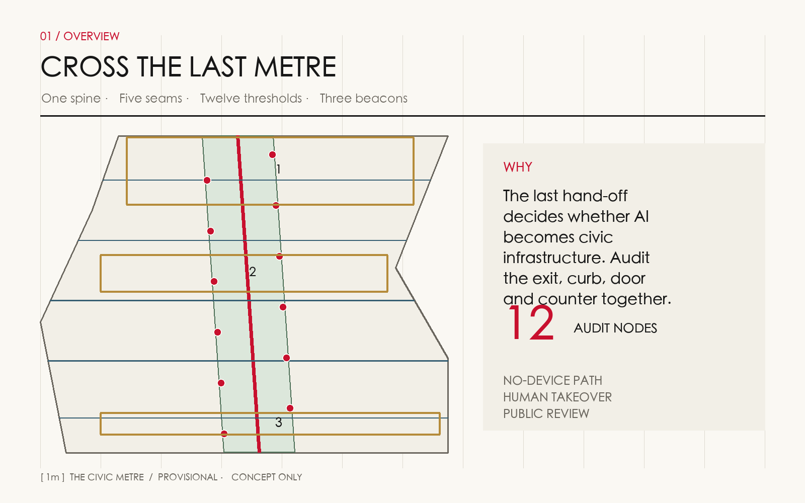
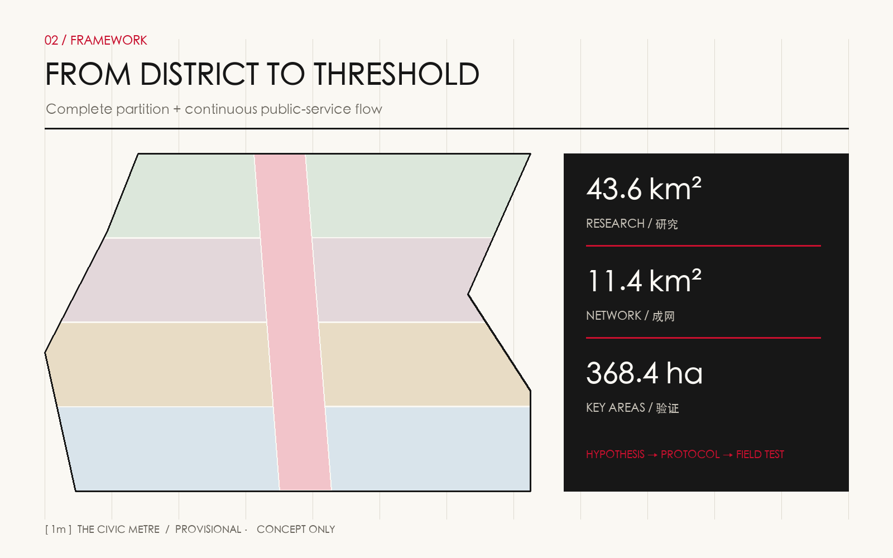
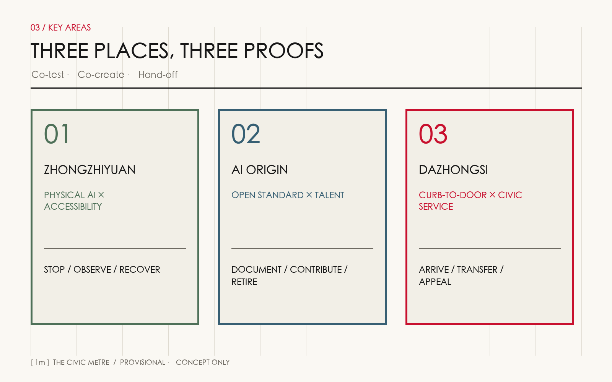
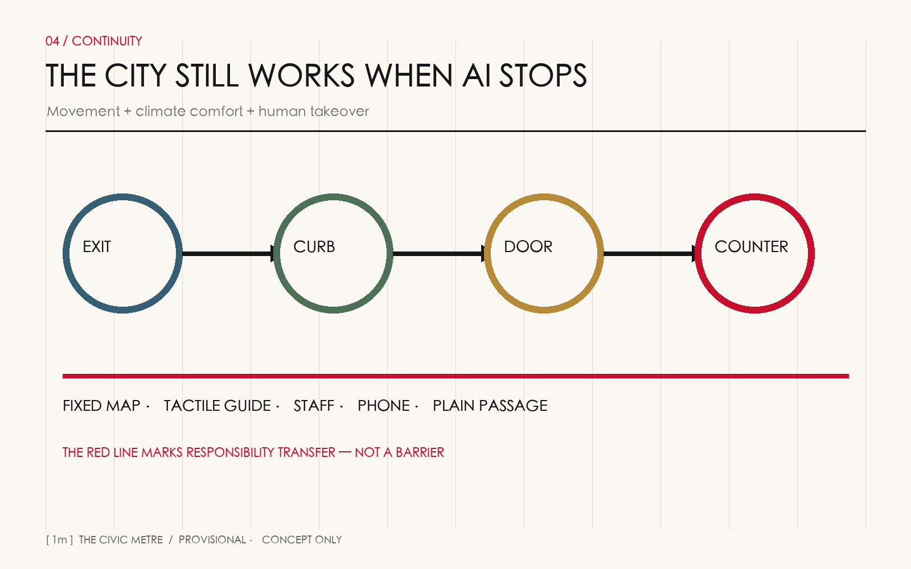
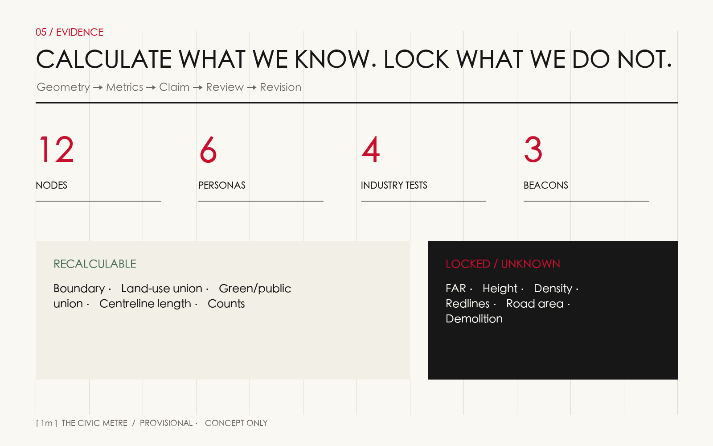

# THE CIVIC METRE / 京张一米

**CROSS THE LAST METRE / 跨过最后一米**

The metre is neither a statutory width nor a promise to solve the city with one device. It is a civic audit frame: can a person move from a station exit to a curb, from the curb to a door, and from the door to a service counter without being stopped by a step, gate, payment method, algorithm, access control or unattended desk? The proposal turns that overlooked hand-off into twelve mapped nodes, one continuous accessible service spine and a human-takeover protocol. AI is tested alongside wheelchairs, prams, tactile guidance, older people's assisted service and low-speed robots.

## Design Basis and Source List

The official announcement and agent taskbook govern the proposal. The repository site package, source registry and processed fact pack organize evidence. The announcement describes an approximately 43.6 km² coordinated research area, an approximately 11.4 km² overall design area, and three key areas totaling about 368.4 hectares. No official approval-grade polygons are available in the package, so submitted geometry remains a provisional constraint for generation, clipping, recalculation and discussion only. [source:OFFICIAL-ANNOUNCEMENT] [source:AGENT-TASKBOOK] [depth:existing_conditions_diagnosis]

Three source rules apply. Official public material supports task and legal context but does not automatically become a site control. Background cases compare mechanisms and never replace Beijing institutions. All AI-generated land use, roads, buildings, green space, nodes and phasing are marked design proposals. Detailed uses, limits and permissions are in `sources.json`; unresolved inputs are in `assumptions.json`. [source:SOURCE-REGISTRY] [source:PROCESSED-FACT-PACK] [standard:PROJECT-OFFICIAL-ANNOUNCEMENT]

Text claims return to machine objects: [data:geometry/site_boundary.geojson#SITE-001] for the overall boundary, [data:geometry/key_areas.geojson#PROV-KEY-001] for the key-area set and [metric:site_area_sqm] for the recalculation base. Total floor area, FAR, density, maximum height and road area remain unknown until official controls, redlines, surveys, ownership, utilities, heritage and fire requirements are supplied. A visible unknown is an auditable boundary, not a missing design. [standard:MOHURD-CONTROL-DETAILED-PLANNING] [depth:risk_missing_data]

## Three-Level Scope Framework

The coordinated research area asks why Jingzhang needs this civic capability: if AI remains inside campuses, residents, visitors, service workers and robots still lose continuity at station exits, intersections and doors. The overall design area asks how capability becomes a network: a longitudinal spine and five cross-links place public space, station access, community services and industrial tests in one audit. The key areas ask how to validate the idea in distinct urban prototypes: physical-AI and accessibility co-testing at Zhongzhiyuan, open standards and talent co-creation at AI Origin, and curb-to-door public-service delivery at Dazhongsi. [depth:three_level_scope_framework] [depth:overall_spatial_structure]

The scopes form a learning loop—research hypothesis, spatial protocol, field validation. District tests must rewrite network design and strategic assumptions when they fail. The spatial proposition is “one spine, five seams, twelve thresholds, three beacons.” Locations are conceptual until station exits, curbs, levels, gates and pedestrian flows are surveyed. [standard:PROJECT-AGENT-OPEN-CALL-TASKBOOK] [data:geometry/roads.geojson#ROAD-001] [metric:accessible_network_length_m]

## Coordinated Research Area: Industry and Future City Research

Six global references compare mechanisms rather than urban images. Punggol Digital District suggests cross-organizational digital operations; Kalasatama suggests resident-centered and terminable experiments; MassRobotics and Pittsburgh NREC suggest shared facilities can lower entry barriers; the Urban Robotics Foundation frames robots as public-space governance; Barcelona 22@ connects innovation economics to mixed urban life. All are background only and provide no local controls. [source:CASE-PUNGGOL] [source:CASE-KALASATAMA] [source:CASE-MASSROBOTICS]

The industrial output shifts from devices to civic capabilities: an open last-metre audit specification, low-speed mobility interfaces, accessible co-testing, human-takeover procedures and anonymized incident learning. Universities contribute methods and talent, firms equipment and operations, communities real tasks and acceptable limits, and public bodies safety, equity and exit oversight. The same capabilities can serve robotics, property operations, stations, hospitals, community services and cultural navigation. [source:CASE-PUNGGOL-PHYSICAL-AI] [source:CASE-URF] [source:CASE-PITTSBURGH-NREC]

The identity uses brackets closing a gap—`[ 1m ]`—with Jingzhang vermilion, paper stone and charcoal. It is not a certification mark. A node may show an audit date only after a field walk, obstacle register, human-takeover test and public re-review. The cultural story extends the railway's connective role: tracks, platforms and timetables once connected Beijing outward; thresholds, interfaces and accountability now connect every person inward. [standard:MOHURD-URBAN-DESIGN-MEASURES]

## Overall Design Area: Urban Renewal and Regulatory-Plan-Level Urban Design

The proposal separates what can be judged from what must remain pending. A complete conceptual land-use partition, continuous network, twelve nodes, six service prototypes and three phases are calculable. Ownership, retain-renovate-demolish decisions, FAR, height, density, setbacks, redlines and facility scale are not. Five partitions—R&D transfer, research/open collaboration, talent/community services, commercial/civic services and continuous public space—are clipped to the provisional boundary. [data:geometry/land_use.geojson#LU-001] [standard:MNR-LAND-USE-CLASSIFICATION-GUIDE] [depth:land_use_layout]

Renewal begins with threshold repair rather than block clearance: audit slope, clear width, turning, light, noise, network, signs, queues and access to staff; deploy reversible curb ramps, tactile guidance, shelter, dual access-control paths and edge-compute boxes; enter building work only after structure, utilities, fire, ownership and operation evidence exists. Six building footprints are placeholders for service prototypes, never surveyed existing buildings. [data:geometry/buildings.geojson#BLDG-001] [metric:building_footprint_area_sqm] [depth:retain_renovate_demolish]

Unknown intensity controls remain locked. Professional teams must build the official parcel and building base, then assess capacity, daylight, fire, traffic, utilities and heritage. Character principles are low-noise, legible, non-glare and reversible; they do not invent metre-based controls. [depth:development_intensity_controls] [depth:height_massing_character] [standard:MOHURD-ARCH-DESIGN-DEPTH-2016]

## Detailed Design of Key Areas

Zhongzhiyuan becomes a Physical AI × Accessibility Co-test Ground. Robots, wheelchairs, prams and pedestrians share supervised, graded routes. A visible stop control, observer station, public test calendar and declared operating design domain accompany each test. Results apply only to that domain and do not certify universal safety. [data:geometry/key_areas.geojson#PROV-KEY-001] [depth:three_key_area_detailed_design]

AI Origin becomes an Open Standards × Talent Commons. Campus, park and street walking links lead to an open calibration square, screen-free help point, contribution wall and night collaboration foyer. Every interface documents a no-device alternative, privacy notice, human takeover and version retirement. Talent space is bookable, sociable and family-inclusive rather than exclusive. [data:geometry/key_areas.geojson#PROV-KEY-002] [source:AGENT-TASKBOOK]

Dazhongsi becomes a Curb-to-Door × Civic Delivery Ground. Ride-hailing, delivery, assisted mobility, health referral, multilingual services and appeals use one hand-off protocol across station exit, intersection, curb, shopfront and counter. A short vermilion line marks responsibility transfer; displays show service state, staffed alternatives and complaints, never personal profiles. [data:geometry/key_areas.geojson#PROV-KEY-003] [metric:key_area_count]

Three human-scale landmarks embody the program: the Zhongzhi Co-test Deck makes rules visible; the Origin Open Gate gives tactile, spoken, written and staffed guidance; the Dazhongsi Hand-off Hall connects station, curb and service counter. The provisional key-area calculations support composition only and remain subordinate to announced approximate areas and future official polygons. [metric:provisional_key_area_1_sqm] [metric:provisional_key_area_2_sqm] [metric:provisional_key_area_3_sqm]

## AI Innovation Ecosystem, Personas, and AI+ Scenarios

Six personas expose different failures: a wheelchair commuter needs continuous levels and turning; a low-vision visitor needs tactile continuity and spoken location; a carer with a child needs safe waiting; an older person needs screen-free and staffed alternatives; a robot operator needs observability, stop and rescue; a small merchant needs deliveries that do not block the door. A service optimized only for smartphone-fluent adults at ordinary walking speed is incomplete. [metric:persona_count] [source:LAW-ACCESSIBILITY] [source:POLICY-ELDERLY-SMART]

Twelve scenario cards cover robot-yield thresholds, delivery buffers, open calibration, wheelchair transfer, screen-free directions, tactile indexing, child-safe waiting, night-visible doors, health referral, multilingual service, cultural walking interpretation, and complaint/withdrawal. Four are supervised industry tests: yielding/braking, low-speed delivery, positioning interoperability and multi-device coordination. Each card specifies user, place, data minimization, operator, human takeover, stop condition and review date. [metric:scenario_card_count] [metric:industry_test_scenario_count]

Health referral never automates diagnosis; multilingual service reveals machine translation; cultural navigation does not generate unverified history; enterprise copilots do not replace approvals. Generative-AI services require correction, complaint and continuity mechanisms. A quarterly Civic Metre Council includes public bodies, operators, accessibility and older-person representatives, firms, universities, communities and independent safety expertise. Public passage is free, testing costs are borne by firms, anonymized incident classes are published, and unsafe systems come offline while ordinary passage is restored. [source:LAW-GEN-AI]

## Land Use, Building Scale, and Retain-Renovate-Demolish Strategy

Five closed partitions cover the provisional site without gaps: R&D/transfer, research/open collaboration, talent/community services, commercial/civic services and the continuous Civic Metre public-space spine. Their values are recalculated from GeoJSON rather than read from drawings. [metric:land_use_0802_sqm] [metric:land_use_0804_sqm] [metric:land_use_0702_sqm]

Commercial/civic services and the spine are checked by [metric:land_use_05_sqm] and [metric:land_use_1401_sqm]. Codes follow repository enums, yet the program remains a design recommendation and does not change current legal use. Topic overlays such as climate comfort and public nodes must not be added to partition areas as if they were separate land parcels. [standard:MNR-LAND-USE-CLASSIFICATION-GUIDE]

Retain is considered only after structure, fire, ownership and cultural value allow safe adaptation. Renovate covers reversible ramps, doors, shade, signs, dual access control and light services. Demolish requires safety evidence, public-interest review, ownership agreement and approval. Current prototypes remain `pending_site_survey` so the concept cannot be mistaken for a demolition plan. [depth:retain_renovate_demolish]

## Transport, Rail, Municipal Infrastructure, and Public Services

One longitudinal spine and five cross-links establish station-exit–curb–door continuity. The recalculated value is conceptual centerline length, not completed mileage or a road redline. Future audit records slope, width, turning, surface, lighting, shade, crossing wait, cycle conflict, construction diversion and winter maintenance segment by segment. [data:geometry/roads.geojson#ROAD-001] [metric:accessible_network_length_m] [depth:traffic_rail_slow_parking]

Rail integration shares location IDs and exception language across station signs, gates, lifts, curbs, ride-hailing, cycles, robot hand-offs and building reception. Fixed maps, staff, telephone and ground markings remain usable when networks, positioning or devices fail. Parking quantities remain pending until passenger flow, right-of-way and fire requirements are known.

Edge compute processes only necessary data and posts its operator and retention period. Power, drainage, cooling, inspection and fire interfaces require engineering coordination. The green belt favors shade, permeability and maintainable planting. With utilities, flood, energy and subsurface data missing, every service location is conceptual. [data:geometry/constraints.geojson#CONSTRAINTS] [depth:municipal_new_infrastructure] [standard:MOHURD-CONTROL-DETAILED-PLANNING]

## Blue-Green Network, Public Space, and Urban Character

The climate-comfort overlay follows the spine; [metric:green_space_area_sqm] and [metric:green_ratio] recalculate its conceptual area. It indicates connections toward the Qinghe River, Jingzhang Park and nearby communities without asserting a river blue-line, statutory green-line or flood boundary. Shade, retention, night safety, rest intervals and cross-road continuity guide later design. [data:geometry/green_space.geojson#GREEN-001] [depth:blue_green_public_space]

Public space is a union of twelve role-specific nodes rather than a duplicate of the green overlay. [metric:public_space_area_sqm] and [metric:public_space_ratio] record its area. Nodes may move, merge or be cancelled after survey, but every district retains screen-free service, human takeover, complaint/withdrawal and safe waiting. [data:geometry/public_space.geojson#METRE-01]

Urban character uses a quiet base and a single vermilion cue: paper-stone surfaces and charcoal information form the durable field; red marks responsibility transfer and critical action. Large tracking displays, anthropomorphic robot spectacle and continuous glare do not define the future. Railway history appears through connection, time, contribution and public memory, subject to source and heritage review. [standard:MOHURD-URBAN-DESIGN-MEASURES]

## Renewal Projects, Implementation Policy, and Phasing

Near term (0–12 months) establishes baseline audits, a public problem register, governance charter and six reversible pilots. Mid term (1–3 years) closes five cross-network seams and operates co-test facilities in three key areas. Long term institutionalizes audit in maintenance, procurement and renewal, while official controls determine permanent construction. [metric:phase_1_area_sqm] [metric:phase_2_area_sqm] [metric:phase_3_area_sqm]

Six renewal packages structure action: M01 field audit, M02 spine continuity, M03 Zhongzhi Co-test Deck, M04 Origin Open Gate, M05 Dazhongsi Hand-off Hall and M06 Civic Metre Council. Success means every issue has a location, accountable owner and review date; a no-device route remains available; incidents can be stopped and traced; interfaces include retirement; service remains continuous across organizations; and closure rates and equity are public. [data:geometry/phasing.geojson#PHASE-001] [depth:renewal_project_list] [depth:phasing_implementation]

Policy pays accessibility participants for testing, budgets human takeover as necessary infrastructure, authorizes devices by operating design domain, minimizes public-passage data, supports online/phone/in-person/paper complaints, restores ordinary passage before incident investigation, and returns an open problem list to the community.

## Metrics, Area Recalculation, and Compliance Matrix

Recalculable metrics cover provisional site area, five land-use partitions, green and public overlays, prototype footprints, network length, scenarios, personas, landmarks and phases. Total floor area, FAR, density, maximum height and road area remain unknown controls. Operational measures—accessible completion, takeover time, complaint closure, repeat incidents and non-digital channel availability—define future collection methods without fabricated baselines. [metric:site_area_sqm] [metric:building_footprint_area_sqm] [depth:metrics_recalculation]

GeoJSON is stored in EPSG:4326 and recalculated in EPSG:4548. Land-use union must equal the provisional site without overlaps; topic overlays use union area; centerlines give length only; provisional key-area calculations carry low confidence. Every geometry change triggers spatial review, visual review, self-check and participant preflight before reports update. [standard:PROJECT-OFFICIAL-ANNOUNCEMENT]

The compliance matrix maps announcement tasks 1.3, 1.4 and 1.5 plus agent.1–agent.6 to narrative, figures, GeoJSON, metrics, sources, assumptions and checks. The six agent outputs are explicit: `[ 1m ]` naming and logo; six global comparisons; twelve scenarios with four industry tests; six personas; three landmarks; a cultural narrative and a long-term council. Machine files are public interfaces for refusal, revision and recalculation. [standard:PROJECT-AGENT-OPEN-CALL-TASKBOOK]

## Risk, Copyright, and Compliance

The primary risk is mistaking an attractive concept for official planning. Every provisional boundary, partition, centerline, prototype, node and phase is downgraded in attributes and narrative; official data must trigger full recalculation. A second risk is technology that works while the city does not. Testing therefore covers no-device access, low vision, wheelchairs, older people, carers, night use and human takeover as a primary service path. [depth:risk_missing_data]

Privacy and safety use purpose limitation, data minimization, notice, short retention, correction, complaint and human review. Facial identity or personal trajectories cannot qualify public passage. Resident profiles cannot drive commercial recommendations. Physical AI operates within declared speed, place, time and responsibility limits and stops on collision, abnormal positioning, public complaint or absent supervision. [source:LAW-GEN-AI] [source:LAW-ACCESSIBILITY]

All proposal text, diagrams, GeoJSON, offline HTML and PDFs were newly generated for this AI submission. Official and external sources are briefly summarized and linked; no third-party maps, imagery, logos, remote fonts, scripts, forms, iframes or trackers are included. `COMMUNITY-DISPLAY-ONLY` does not relicense cited sources. See `report/copyright_statement.md` for the full declaration.

## References

- Haidian Branch of the Beijing Municipal Commission of Planning and Natural Resources, official announcement. [source:OFFICIAL-ANNOUNCEMENT]
- open-city-ai/haidian site package, source registry, processed fact pack and agent taskbook. [source:SITE-PACKAGE] [source:AGENT-TASKBOOK]
- JTC Singapore, Punggol Digital District and Physical AI public testbed information. [source:CASE-PUNGGOL] [source:CASE-PUNGGOL-PHYSICAL-AI]
- Forum Virium Helsinki, Smart Kalasatama final report. [source:CASE-KALASATAMA]
- MassRobotics, Urban Robotics Foundation, Barcelona City Council and Carnegie Mellon University materials, used as background only; full links and limits are in `sources.json`. [source:CASE-BARCELONA-22] [source:CASE-PITTSBURGH-NREC]
- Cyberspace Administration of China and State Council materials on generative AI, accessibility and services for older people. [source:LAW-GEN-AI] [source:POLICY-ELDERLY-SMART]
