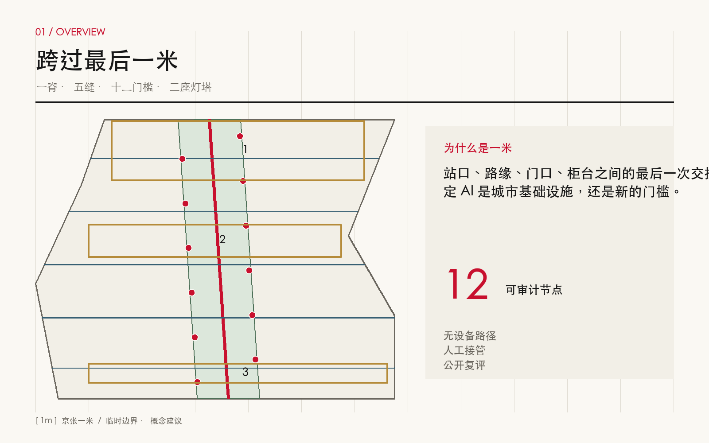
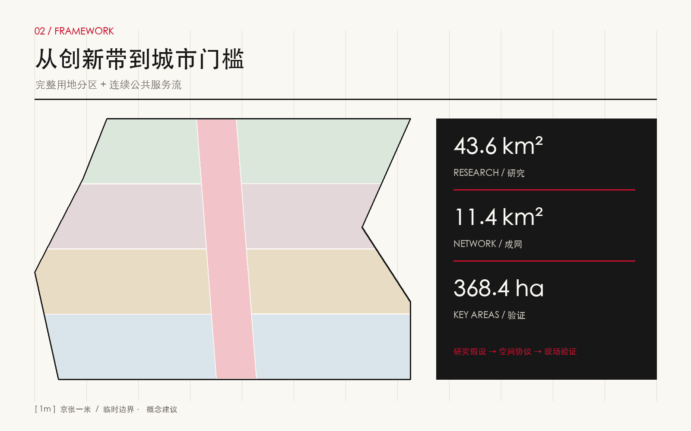
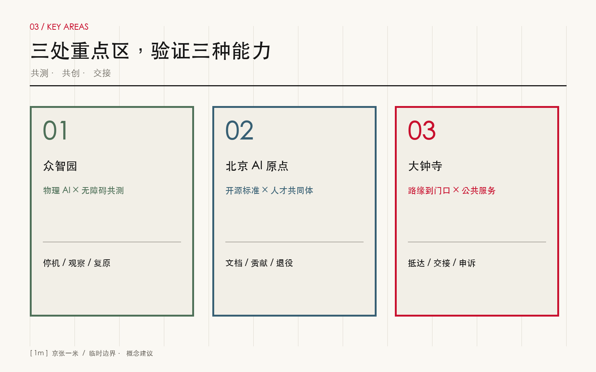
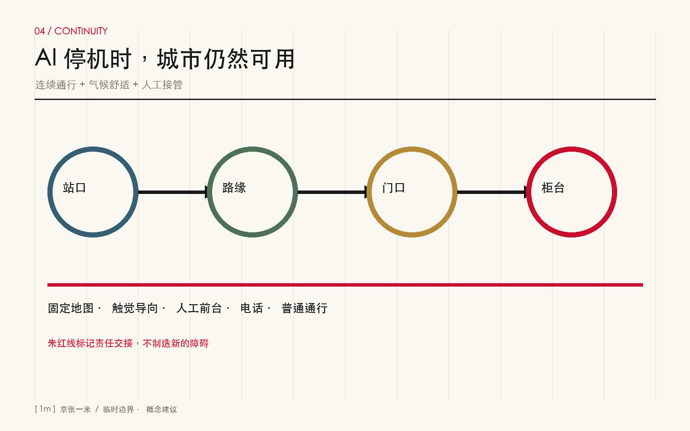
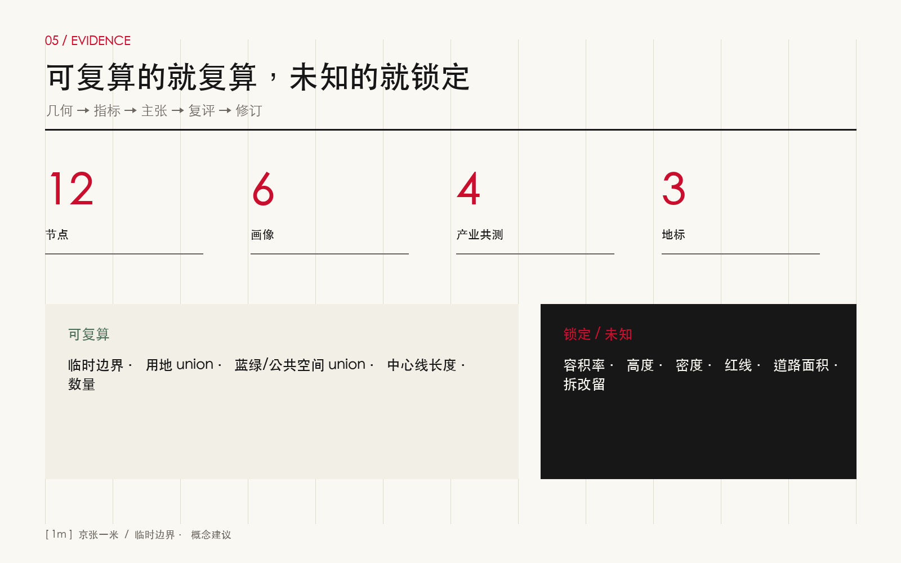

# 京张一米 / THE CIVIC METRE

**跨过最后一米 / CROSS THE LAST METRE**

“一米”不是法定宽度，也不是把整座城市缩成一个技术装置。它是一把公共性尺子：一个人从轨道出口走到路缘、从路缘走到建筑门口、从门口走到服务柜台，是否在最后一段被台阶、围栏、算法、支付方式、门禁或无人值守拦住？本方案把这个容易被总图忽略的交接面，变成十二个可定位节点、一条连续无障碍服务主脊和一套人机接管协议。AI 不再只是展示内容，而是与轮椅、婴儿车、视障触觉、长者人工服务、低速机器人共同接受城市测试。

## 设计依据与资料清单

本方案首先服从官方公告和面向智能体任务书，再使用仓库登记的场地包、来源注册表和事实导航包组织空间证据。公告提供约 43.6 平方公里统筹研究范围、约 11.4 平方公里总体设计范围和三处合计约 368.4 公顷重点区域；仓库当前没有可作为审批依据的官方 polygon，因此提交几何仍是 provisional constraint。它只用于概念生成、裁剪、复算和公开讨论，不能升级为红线、控规或实施承诺。[source:OFFICIAL-ANNOUNCEMENT] [source:AGENT-TASKBOOK] [depth:existing_conditions_diagnosis]

资料治理遵循三条规则。其一，`official_public` 可支持任务背景与公共法规，但不自动构成场地控制；其二，`background_only` 的全球案例只用于比较机制，不能替代北京制度；其三，所有智能体生成的用地、道路、建筑、绿地、节点和分期必须标记为 `design_proposal`。完整条目、用途、限制与许可见 `sources.json`，缺口见 `assumptions.json`。[source:SOURCE-REGISTRY] [source:PROCESSED-FACT-PACK] [standard:PROJECT-OFFICIAL-ANNOUNCEMENT]

证据链从文字主张回到机器对象：总体边界为 [data:geometry/site_boundary.geojson#SITE-001]，三处重点区为 [data:geometry/key_areas.geojson#PROV-KEY-001]，空间复算基数为 [metric:site_area_sqm]。在正式 polygon、道路红线、现状建筑、权属、市政、文保、消防和高度控制发布前，本方案将开发规模、容积率、建筑密度、最高高度和道路面积保留为 unknown。这样的空白是可审计的诚实边界，不是遗漏。[standard:MOHURD-CONTROL-DETAILED-PLANNING] [depth:risk_missing_data]

## 三层范围工作框架

统筹研究范围回答“京张为何需要这套城市能力”：AI 产业若只在园区内部闭环，居民、访客、服务人员和机器人仍会在站口、路口、门口失去连续体验。总体设计范围回答“能力如何成网”：以纵向主脊串联五条东西连接，把公共空间、轨道接驳、社区服务和产业测试置于同一套审计表。重点区域回答“如何在不同城区原型中验证”：众智园验证物理 AI 与无障碍共测，原点社区验证开源标准与人才共创，大钟寺验证路缘到门口的公共服务交付。[depth:three_level_scope_framework] [depth:overall_spatial_structure]

三层不是三套互不相干的愿景，而是“研究假设—空间协议—现场验证”的闭环。43.6 平方公里层面建立产业、人才与治理框架；11.4 平方公里层面形成连续网络、项目包和复算指标；三处重点区把通行、等待、问询、交付、撤回与投诉转译成节点详则。每一个重点区试验失败，都应回写总体网络设计和统筹研究假设，而不是只修一块铺装。[standard:PROJECT-AGENT-OPEN-CALL-TASKBOOK] [data:geometry/roads.geojson#ROAD-001]

“京张一米”的空间结构是“一脊、五缝、十二门槛、三座灯塔”。一脊是连续无障碍服务主脊；五缝是东西向最后一米连接；十二门槛对应可审计公共空间节点；三座灯塔分别是众智共测台、原点开源门、大钟寺交接厅。它们都是概念建议，位置需在实测站口、路缘标高、门禁和客流基础上深化。[metric:accessible_network_length_m] [metric:civic_metre_node_count] [metric:landmark_count]

## 统筹研究范围产业与未来城市研究

全球参照不以“像不像某个园区”为目标，而比较可移植机制。新加坡 Punggol Digital District 提示数字运行平台可服务跨组织协同；Helsinki Kalasatama 提示试验需要居民参与与可终止机制；MassRobotics 与 Pittsburgh NREC 提示共享测试设施能降低中小团队进入门槛；Urban Robotics Foundation 把公共空间机器人置于安全、可达与责任讨论；Barcelona 22@ 提示创新经济需要混合城市生活。六案均为背景，不证明本地适用，也不提供本项目控制指标。[source:CASE-PUNGGOL] [source:CASE-KALASATAMA] [source:CASE-MASSROBOTICS]

| 参照 | 可借鉴机制 | 京张转译 | 明确不照搬 |
| --- | --- | --- | --- |
| Punggol Digital District | 跨机构数字运行 | 公开一米审计台账与接口 | 平台架构、采购与治理 |
| Kalasatama | 居民参与式试验 | 每季用户走查与退出机制 | 福利制度与气候方案 |
| MassRobotics | 共享设备与测试支持 | 中小团队低门槛共测时段 | 组织模式与认证结论 |
| Urban Robotics Foundation | 城市机器人公共议题 | 路权礼让、事故停机、投诉链 | 行业主张直接变标准 |
| Barcelona 22@ | 创新与混合城区协同 | 产业空间与日常服务同网 | 地价、用地与开发强度 |
| Pittsburgh NREC | 研究—产业协作 | 高校成果进入真实但受控场景 | 具体合同和科研路径 |

产业策略由“设备输出”转为“公共能力输出”：开放一米测评规范、低速移动互操作接口、无障碍共同测试场、服务人工接管流程、事故与投诉数据的匿名化回流。高校贡献方法和人才，企业贡献设备与运维，社区贡献真实任务与可接受边界，公共部门把关安全、公平和退出。成果既可被机器人企业复用，也可被物业、站城运营、医院、社区服务和文旅导览复用。[source:CASE-PUNGGOL-PHYSICAL-AI] [source:CASE-URF] [source:CASE-PITTSBURGH-NREC]

品牌使用方括号闭合缺口的符号 `[ 1m ]`，主色为京张朱红、石纸白与炭黑。标志不是测量合格认证，只有当节点完成现场走查、障碍登记、人工接管测试和公开复评后，才可显示“已审计”日期。文化叙事从“铁路把城市接到远方”转为“公共服务把每个人接到门内”：百年京张的连接精神由轨距、站台与时刻表，继续进入算法时代的门槛、接口与责任链。[standard:MOHURD-URBAN-DESIGN-MEASURES]

## 总体设计范围城市更新与控规深度城市设计

总体设计不制造伪精确控规，而把可判断与待确认分层。可判断层包括完整无缝的概念用地分区、连续网络、十二节点、六个服务原型、三阶段实施包；待确认层包括现状权属、保留改造拆除、容积率、高度、密度、退线、道路红线和设施规模。用地以科研、研发转化、人才生活、商业公共服务和连续公共空间五类组织，全部裁剪在临时边界内并可复算。[data:geometry/land_use.geojson#LU-001] [standard:MNR-LAND-USE-CLASSIFICATION-GUIDE] [depth:land_use_layout]

更新方法从“大拆大建地块”转向“门槛修复项目包”。先做坡度、净宽、转弯、照度、噪声、网络、标识、排队和人工服务可达性普查；再用可逆铺装、路缘坡化、门禁双通道、等待遮蔽、触觉导向和边缘算力盒形成轻触媒；只有当结构、市政、消防、产权和运营证据齐备后，才进入建筑改造。六个建筑基底只是服务原型占位，不是现状建筑识别。[data:geometry/buildings.geojson#BLDG-001] [metric:building_footprint_area_sqm] [depth:retain_renovate_demolish]

开发强度采取“未知即锁定”的治理：任何面向公众的图表都不得给 unknown 指标分配看似合理的数值。后续专业团队应以正式控规与实测建库，完成地块级容量、日照、消防、交通、市政和文保评估，再决定服务原型嵌入现有首层、临建模块或新建设施。风貌控制只提出低层、透明、可识别、夜间不眩光、可撤回的界面原则，不提出未经证实的米数。[depth:development_intensity_controls] [depth:height_massing_character] [standard:MOHURD-ARCH-DESIGN-DEPTH-2016]

## 重点区域详细设计

众智园定位为“物理 AI × 无障碍共测场”。清河与绿色界面提供低速机器人、轮椅、婴儿车和步行者的混合但分级路线；入口设机器人礼让门槛、事故停机按钮、人工观察台和公开测试日历；企业测试须声明设备尺寸、速度、感知盲区、责任主体和退出条件。共测结果只说明特定运行设计域，不颁发普遍安全结论。[data:geometry/key_areas.geojson#PROV-KEY-001] [depth:three_key_area_detailed_design]

北京 AI 原点社区定位为“开源标准 × 人才共同体”。以高校—园区—街区日常慢行为主线，设置开源校准广场、无屏问路台、贡献墙和夜间协作前厅。学生、研究人员、初创团队与居民共同维护问题清单；每个接口文档都包含无设备替代路径、隐私说明、人工接管和版本退役。人才服务不以高端封闭会所表达，而用可预约、可偶遇、可带家属的共享空间表达。[data:geometry/key_areas.geojson#PROV-KEY-002] [source:AGENT-TASKBOOK]

大钟寺定位为“路缘到门口 × 公共服务交付场”。围绕站口、路口四象限、商业首层和社区服务门口，把叫车、快递、助行、健康转介、多语办事与人工申诉编入同一交接协议。地面用一条朱红短线标出“责任切换点”，上方只显示服务状态、人工值守方式和投诉入口，不展示个体画像。商业推广不得占用轮椅回转、盲道和等候区。[data:geometry/key_areas.geojson#PROV-KEY-003] [metric:key_area_count]

三座地标不是巨型屏幕：众智共测台是一处看得见测试规则的遮蔽平台；原点开源门是一道同时支持触觉、语音、文字和人工问询的城市门；大钟寺交接厅是一处把站城、路缘和服务前台接在一起的全天候公共客厅。地标通过公共使用和贡献记录形成记忆，而非依靠企业标识堆叠。三处临时 polygon 的计算面积仅用于构图，公告约面积和后续官方边界始终优先。[metric:provisional_key_area_1_sqm] [metric:provisional_key_area_2_sqm] [metric:provisional_key_area_3_sqm]

## AI 创新生态、人才画像与 AI+ 场景

六类人物让同一段路暴露不同问题：轮椅通勤者关心高差与转弯；低视力访客关心触觉连续与语音定位；带儿童照护者关心安全等待与双手被占用；长者关心无屏、现金或人工替代；机器人运维员关心可观测、停机和救援；小微商户关心交付不堵门与责任清晰。任何场景若只服务手机熟练、普通步速、单一语言的成年人，就不能被标为完成。[metric:persona_count] [source:LAW-ACCESSIBILITY] [source:POLICY-ELDERLY-SMART]

| # | 场景卡 | 位置与服务对象 | 失败时的人工路径 | 产业测试 |
| --- | --- | --- | --- | --- |
| 01 | 机器人礼让门槛 | 众智园；机器人、轮椅、行人 | 现场观察员停机并引导绕行 | 是：礼让与刹停 |
| 02 | 快递交接缓冲带 | 大钟寺；骑手、商户、居民 | 人工货架与电话联系 | 是：低速交付 |
| 03 | 开源校准广场 | 原点社区；研发团队、公众 | 封闭设备并恢复普通广场 | 是：定位互操作 |
| 04 | 轮椅转乘湾 | 轨道接驳；行动不便者 | 人工助行与预约车 | 是：多设备协同 |
| 05 | 无屏问路台 | 原点社区；长者、访客 | 固定地图与人工前台 | 否 |
| 06 | 低视力触觉索引 | 连续主脊；低视力者 | 触觉地图与热线 | 否 |
| 07 | 儿童安全等候格 | 社区门口；照护家庭 | 有视线的普通座椅 | 否 |
| 08 | 夜间可见服务门 | 产业首层；夜班人群 | 明示值守电话与线下窗口 | 否 |
| 09 | 社区健康转介点 | 社区服务；居民 | 人工分诊，不给诊断结论 | 否 |
| 10 | 多语办事前台 | 大钟寺；国际访客 | 人工翻译与纸质流程 | 否 |
| 11 | 文化慢行解说 | 京张主脊；公众 | 可关闭音频的实体铭牌 | 否 |
| 12 | 投诉与撤回窗口 | 全网；所有用户 | 现场、电话、纸面三通道 | 否 |

十二张场景卡均记录服务对象、位置、数据最小化、人工接管、运营主体、停机条件和复评日期；其中四项产业验证仅在围栏可撤、速度受限、现场监督和责任明示条件下启动。健康转介不做自动诊断，多语服务不隐藏机器翻译，文化导览不生成未经核实史实，企业服务助手不代替审批。生成式 AI 服务还需提供纠错、投诉和服务连续性机制。[metric:scenario_card_count] [metric:industry_test_scenario_count] [source:LAW-GEN-AI]

长期运营由“一米议会”承担：公共部门、场地运营方、残障与长者代表、企业、高校、社区和独立安全人员按季度评审。企业支付测试与维护成本，公共基础通行不得付费；匿名事件台账公开问题类型、处理时长和复评结果，不公开个人轨迹。达不到安全或公平阈值的设备立即下线，场地恢复普通通行。品牌授权与测试资格分离，避免“贴标即背书”。

## 用地、建筑规模与拆改留方案

概念用地分为五个闭合分区：AI 研发与转化、科研与开源协作、人才生活与社区服务、商业与公共服务复合、京张一米连续公共空间。五类分区在 EPSG:4548 下裁剪并无缝覆盖临时总体边界；每一类面积均从 GeoJSON 复算，而不是从图面估读。[metric:land_use_0802_sqm] [metric:land_use_0804_sqm] [metric:land_use_0702_sqm]

商业公共服务复合用地和连续公共空间分别由 [metric:land_use_05_sqm] 与 [metric:land_use_1401_sqm] 复核。编码遵循仓库允许枚举，但功能配置仍是设计建议；它们不改变现行用地性质。连续公共空间与蓝绿覆盖可以叠加表达服务与舒适网络，面积核算时必须区分“用地分区”和“专题覆盖”，避免重复相加。[standard:MNR-LAND-USE-CLASSIFICATION-GUIDE]

建筑采用“留—改—拆待证据”规则。留：经结构、消防、权属和文化价值核验可安全承载的首层界面优先保留；改：通过坡化、开门、遮蔽、导视、门禁双通道和轻量机电可修复的界面优先改造；拆：只有安全鉴定、公共利益论证、权属协商与审批齐备后才进入清单。当前六个服务原型不对应真实门牌，分类字段保持 `pending_site_survey`，防止概念图被误读为拆迁图。[depth:retain_renovate_demolish]

## 交通、轨道、市政与公共服务设施

交通系统用一条纵向主脊和五条东西连接建立站口—路缘—门口连续性。复算长度是概念中心线长度，不是已建成里程，也不代表道路红线。每条连接后续必须逐段记录纵坡、横坡、净宽、转弯半径、铺装、防滑、照明、遮蔽、过街等待、非机动车冲突、施工绕行和冬季维护。[data:geometry/roads.geojson#ROAD-001] [metric:accessible_network_length_m] [depth:traffic_rail_slow_parking]

轨道一体化不止于站口增设屏幕。站内导视、闸机、垂直交通、站外路缘、叫车点、共享单车、机器人交付与建筑前台需共享地点标识和异常处理语言。遇到断网、定位漂移、设备停机或排队溢出时，固定地图、人工前台、电话和可见地面标记仍能完成服务。停车与非机动车供应量因缺数据保持待核，后续基于客流、路权和消防条件专项测算。

市政策略以“能耗与责任随节点公开”为原则。边缘算力盒只处理必要数据，保存期限和运营主体在现场明示；设备电源、排水、防水、散热、检修和消防必须与既有系统协调；蓝绿带优先采用透水、遮荫和可维护植物。缺少管线、洪涝、能源容量和地下空间资料时，任何点位都只是概念占位。[data:geometry/constraints.geojson#CONSTRAINTS] [depth:municipal_new_infrastructure] [standard:MOHURD-CONTROL-DETAILED-PLANNING]

## 蓝绿空间、公共空间与城市风貌

蓝绿系统围绕主脊形成气候舒适覆盖，概念面积和比例分别由 [metric:green_space_area_sqm] 与 [metric:green_ratio] 复核。它连接清河、京张遗址公园及周边社区的方向性关系，但不声称掌握河道蓝线、绿线或防洪边界。设计重点是遮荫、雨水滞留、夜间安全、休息间距和跨路连续，所有植物、铺装和设施应接受四季维护评估。[data:geometry/green_space.geojson#GREEN-001] [depth:blue_green_public_space]

公共空间不是绿色专题的重复面积，而是十二个精确到服务角色的微节点，其 union 面积和占比由 [metric:public_space_area_sqm] 与 [metric:public_space_ratio] 记录。节点可在正式总图中平移、合并或取消，但角色不得消失：每个区域至少保留一个无屏服务、一个人工接管、一个投诉撤回和一个安全等待界面。[data:geometry/public_space.geojson#METRE-01]

风貌采用“低噪声基础、单点朱红提示”：石纸色铺装与炭黑信息构成耐久背景，朱红只标责任切换和关键行动；不以连续大屏、追踪式灯光或机器人拟人表演制造未来感。京张历史通过连接、时刻、贡献与公共记忆表达；新增叙事必须由史料与专业团队核实。三座地标保持人尺度、可触摸、可关闭、可夜间识别，并给不使用手机的人同等信息。[standard:MOHURD-URBAN-DESIGN-MEASURES]

## 更新项目清单、实施政策与分期计划

近期（0—12 个月）建立基线：完成一米审计、问题台账、共治章程和六个轻触媒样点；不涉及未经核验的永久建设。中期（1—3 年）连接五条东西缝合线，建设三处重点区共测设施并形成公开接口。长期（3 年后）将审计纳入日常运维、采购与改造复评，依据正式控规和专项条件决定建筑工程。三阶段概念包分别由 [metric:phase_1_area_sqm]、[metric:phase_2_area_sqm]、[metric:phase_3_area_sqm] 复算。[depth:phasing_implementation]

| 项目 | 近期动作 | 依赖 | 成功定义 |
| --- | --- | --- | --- |
| M01 一米审计 | 现场同行、测绘、障碍登记 | 官方边界、许可、用户招募 | 问题有位置、有责任、有复评日 |
| M02 主脊连续化 | 六处轻触媒和双通道门禁 | 路权、消防、市政 | 无设备路径始终可用 |
| M03 众智共测台 | 受控物理 AI 测试 | 保险、停机、监督员 | 事故可停、可追责、可复原 |
| M04 原点开源门 | 发布接口与贡献机制 | 高校、社区、版本治理 | 文档含替代路径与退役策略 |
| M05 大钟寺交接厅 | 串联站口、路缘与前台 | 轨道、交通、物业 | 服务跨主体仍不断链 |
| M06 一米议会 | 季度公开复评 | 代表性、预算、数据治理 | 问题关闭率与公平性公开 |

实施政策包括：把无障碍用户纳入付费测试岗位；把人工接管列为采购必要成本；设备按运行设计域授权而非一次性准入；公共通行数据最小化；投诉可在线、电话、现场和纸面提交；事故后先恢复普通通行再调查；轻触媒采用可回收、可维修构件；企业测试成果以开放问题清单回馈社区。[data:geometry/phasing.geojson#PHASE-001] [depth:renewal_project_list]

## 指标体系、面积复算与合规矩阵

指标分三类。第一类可从本包复算：临时总体面积、五类概念用地、蓝绿覆盖、公共节点、原型基底、网络长度、场景卡、画像、地标与分期。第二类必须等待正式控制：总建筑面积、容积率、建筑密度、最高高度和道路面积。第三类需运营采集：无障碍完成率、人工接管时长、投诉关闭率、重复事故率与非数字通道可用率。第三类只定义口径，不编造基线。[metric:site_area_sqm] [metric:building_footprint_area_sqm] [depth:metrics_recalculation]

核心空间数据使用 EPSG:4326 存储、EPSG:4548 复算。用地 union 应等于临时 site，分区之间不得重叠；专题绿地与节点允许叠加但分别计算 union；中心线只计算长度，不推导道路面积；重点区面积带低置信度警告。每次替换边界、移动节点或调整用地，都需重跑 spatial review、visual review、self-check 和 participant preflight，再更新图册与网页。[standard:PROJECT-OFFICIAL-ANNOUNCEMENT]

合规矩阵将公告 1.3、1.4、1.5 与 agent.1—agent.6 逐项挂到正文、图件、GeoJSON、指标、来源、假设与自检。六项智能体任务在此被具体回应：命名与 Logo 是 `[ 1m ]`；全球案例为六案比较；场景卡十二张且四项产业共测；画像六类；地标三处；文化叙事和一米议会提供长期运营。机器文件不是正文附属，而是让判断可被拒绝、修订和重算的公共接口。[standard:PROJECT-AGENT-OPEN-CALL-TASKBOOK]

## 风险、版权与合规说明

最大风险是把漂亮的概念图误读为官方规划。所有临时边界、概念用地、中心线、原型建筑、公共节点与分期都在属性和正文中降级声明；正式资料一旦发布，应整体重算而非局部替换。其次是“技术可用但城市不可用”：测试必须包含无设备、低视力、轮椅、长者、儿童照护和夜间情境，并把人工接管作为主流程，而非失败后的临时补丁。[depth:risk_missing_data]

隐私与安全遵循数据最小化、目的限定、公开告知、短期保存、纠错投诉和人工复核。不得用人脸或个人轨迹做通行资格，不得把居民画像用于商业推荐，不得用生成内容代替医疗、审批或历史事实。物理 AI 需限定速度、空间、时段和责任主体，发生碰撞、定位异常、公众投诉或监督缺位即停机。[source:LAW-GEN-AI] [source:LAW-ACCESSIBILITY]

本包中所有文字、示意图、GeoJSON、HTML 与 PDF 为本次智能体原创生成；官方文字和外部案例只做短句概述与链接引用，未复制第三方图像、地图瓦片、Logo、字体或代码资产。网页完全离线，不加载远程脚本、字体、表单、iframe 或跟踪器。社区展示许可为 `COMMUNITY-DISPLAY-ONLY`，不代表第三方来源重新授权。详细声明见 `report/copyright_statement.md`。

## 参考资料

- 北京市规划和自然资源委员会海淀分局，官方征集公告。[source:OFFICIAL-ANNOUNCEMENT]
- open-city-ai/haidian，场地包、来源注册表、事实导航包与面向智能体任务书。[source:SITE-PACKAGE] [source:AGENT-TASKBOOK]
- 新加坡 JTC，Punggol Digital District 与 Physical AI 公共测试信息。[source:CASE-PUNGGOL] [source:CASE-PUNGGOL-PHYSICAL-AI]
- Forum Virium Helsinki，Smart Kalasatama final report。[source:CASE-KALASATAMA]
- MassRobotics、Urban Robotics Foundation、Barcelona City Council、Carnegie Mellon University 案例资料；均仅作背景比较，完整链接与限制见 `sources.json`。[source:CASE-BARCELONA-22] [source:CASE-PITTSBURGH-NREC]
- 国家互联网信息办公室、中国政府网，生成式人工智能、无障碍与长者智能服务相关法规政策。[source:LAW-GEN-AI] [source:POLICY-ELDERLY-SMART]
