# 京张译场 JING-ZHANG TRANSLATION GROUNDS

> 把前沿智能翻译成可验证的城市公共价值。所有空间落地建议均为概念建议与参考方案，可供专业团队深化研究；不替代正式规划，不构成政府审定结论。

## 评委一页结论：让每项 AI 先成为可纠错的城市校样

京张译场的核心不是再增加一个 AI 展示带，而是建立原创的“六门校译法”：任何 AI 服务进入公共空间前，必须依次说明**来源、同意、可达、复核、回退、维护**。六项互不补偿；任一项缺失，服务返回“重译”，普通人工服务继续运行。三座译院分别负责协议验证、知识转化和公众采用，六道公共门把抽象治理变成可触摸、可询问、可停止的城市界面 [standard:PROJECT-AGENT-OPEN-CALL-TASKBOOK] [depth:overall_spatial_structure] [data:geometry/public_space.geojson#PUBLIC-001]。

本轮以 SCN-05“跨语城市服务台”为最小可复跑样例：在本地、零联网环境中，用 1 条完整路径和 6 条单门失败路径验证“全部通过才形成校样、任一失败即返回重译”。结果为 7/7 合成路径符合预期；这只证明规则逻辑可复跑，不证明现场安全、居民同意、运营绩效或部署获批 [metric:proofing_gate_count] [metric:synthetic_proof_case_count] [metric:synthetic_proof_pass_count]。

V3 再把协议压缩为一个可检查、可搬离的最小城市单元：TG-PILOT-01 由 72 平方米、五个空间区和五个运行状态组成；每次服务生成一张不含个人身份的“城市校样回执”，公开人工责任、有效期、普通服务、申诉和回退。12 条匿名包容性合成路径得到 12/12 预期判断；这仍是零联网规则证据，不是现场结果 [metric:pilot_module_area_sqm] [metric:pilot_operating_state_count] [metric:synthetic_inclusion_journey_pass_count]。

V4 不改变上述空间与治理逻辑，只把“如何开始、由谁负责、失败怎么办、怎样验收、何时退出”变成可机读 MVP 契约：八项启动门、七类 RACI 角色、六类异常处置、四档降级、八项验收指标和退出后的公共用途复用均已定位；当前可复跑的是 16/16 结构检查、7/7 六门逻辑路径和 12/12 匿名合成旅程，现场状态仍为 `not_started` [metric:pilot_launch_gate_count] [metric:pilot_raci_role_count] [metric:pilot_acceptance_metric_count]。

### 策略比选

| 选项 | 主要收益 | 主要风险 | 判断 |
| --- | --- | --- | --- |
| 单一科技展示带 | 传播直接 | AI 成为装饰，失败与退出不可见 | 不选 |
| 三个独立产业园 | 招商叙事清楚 | 三地割裂，公共利益难以传递 | 不选 |
| 京张译场与六门校译法 | 同一公共协议贯穿研发—转化—采用，允许重译和退场 | 真实试点启动时触发场地、运营、专业和公众程序；当前不阻断概念成果 | 采用为概念建议 |

### 五个区域协同接口

北纬社区提供社区问题与日常服务反馈；未来科学城提供基础研究议题；怀柔科学城提供科学装置与科研场景需求；经开区提供制造验证与供应链问题；京津冀节点提供跨区域公共服务与成果转化问题。京张译场只接收公开或清权的问题卡、最小测试需求和可撤回反馈，输出带来源、责任、限制和退出条件的“城市校样”；不声称已有合作、数据共享、采购或结果互认 [source:AGENT-TASKBOOK] [depth:three_level_scope_framework]。

| 概念接口 | 只接收 | 只输出 | 到期/退出 |
| --- | --- | --- | --- |
| 北纬社区 | 去身份化的社区问题卡 | 普通服务与 AI 服务差异回执 | 一个试验周期后关闭 |
| 未来科学城 | 公开基础研究问题与复现条件 | 带适用边界的模型校样 | 复现失败即重译 |
| 怀柔科学城 | 公开装置需求与安全前提 | 场景约束清单 | 安全责任不明即停止 |
| 经开区 | 清权制造验证问题 | 可撤回的测试记录 | 供应链或权利不清即退出 |
| 京津冀 | 公开跨区域服务问题 | 双语普通服务与校样接口 | 不互认审批或采购结论 |

### 面向任务书的六项成果导航

任务书的六项要求不是正文中的六次提及，而是 6 项任务、31 个 required outputs 的逐项定位。完整机器索引位于 `visual/assets/taskbook-response-index.json`，下表给出评审阅读路径；`compliance_matrix.json` 同时为每项任务绑定章节、图层、指标、图纸、HTML、来源与独立 `standard_ids` 命名空间 [metric:taskbook_required_task_count] [metric:taskbook_required_output_count] [metric:taskbook_mapped_output_count]。

| 任务 | 本方案响应 | 空间 / 机制 | 章节与图件 | 结构化证据 / 来源 |
| --- | --- | --- | --- | --- |
| agent.1 总体概念与统筹 | “京张译场”、双轨译括号、一脊三院六门十二场景、五接口 | 翻译绿脊 + 三译院 + 两翼反馈 | 一页结论、三层范围；总览 / 识别系统 / 任务书图 | `compliance_matrix#agent.1`、道路与公共空间 GeoJSON；任务书 / 公告 |
| agent.2 全栈与创新生态 | 六案例机制、研发—权利—验证—采用—退出链 | 协议 / 知识 / 采用译院 + 科技服务翼 | 产业研究、重点区；重点区 / 任务书图 | `compliance_matrix#agent.2`、案例来源、五接口指标 |
| agent.3 AI+ 场景 | 12 场景、3 产业验证、7 类人物、12 合成旅程 | 六门 + TG-PILOT-01 五区五态 | 场景章节、SCN-05；包容路径 / MVP 图 | 场景 GeoJSON、pilot plan、synthetic journeys |
| agent.4 公共空间与地标 | 六种公共组件、三地标、贡献回执墙、可撤离组件库 | 遗产绿脊 + 六门 + 72㎡公共单元 | 蓝绿风貌；慢行蓝绿 / 识别 / MVP 图 | 公共空间与绿地 GeoJSON、地标指标 |
| agent.5 文化与传播 | 铁路工程纪律 × 中关村开放协作 × 可解释 AI | 档案门、协议塔、翻译厅、双语导视 | 产业研究、城市风貌、版权；识别 / 总览图 | 绿地 GeoJSON、任务书、版权声明 |
| agent.6 活动与运营 | 春季征集—夏季演练—秋季译场周—冬季退场审计 | 三译院轮值 + 六门校样 + 回执续期/退出 | 项目分期、MVP、回执；回执 / MVP / 任务书图 | 分期 GeoJSON、pilot plan、12 周指标 |

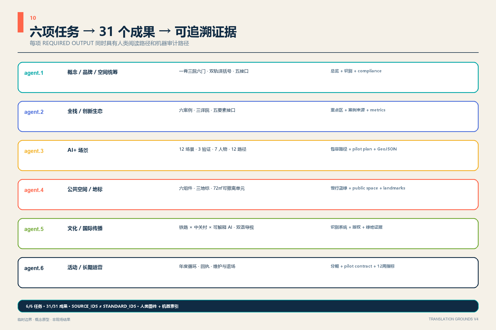

## 设计依据与资料清单

本方案把官方公告确认的三层范围、三处重点区、设计目标和任务作为主控，把面向智能体任务书的三大定位、五大功能、六项任务作为开放共创要求 [source:OFFICIAL-ANNOUNCEMENT] [source:AGENT-TASKBOOK]。来源登记表只允许已批准资料支撑相应用途，处理事实包仅作导航；两者不新增权威结论 [source:SOURCE-REGISTRY] [source:PROCESSED-FACT-PACK]。

现有总体设计边界与重点区 polygon 均为仓库临时约束，只用于生成、可视化和投稿入口自检 [source:BOUNDARY-SOURCE] [source:KEY-AREA-SOURCE]。建筑、道路、文保、市政和权属资料的缺失不构成当前包的参赛者修复项：`assumptions.json` 已为每类资料分别记录 `blocking_now=false`、触发条件、责任归属和触发后动作；触发前坚持“可逆、可停、先验证”，不以伪精确体量填空 [depth:existing_conditions_diagnosis]。

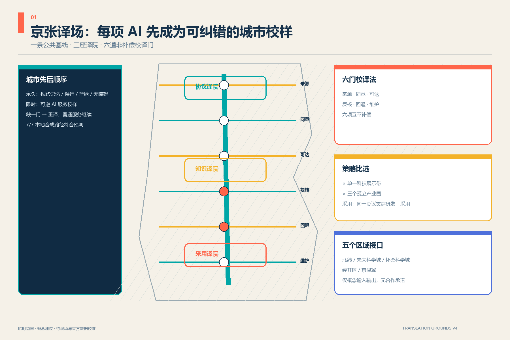

## 三层范围工作框架

“京张译场”不是新画一条红线，而是把 43.6 平方公里统筹研究、约 11.4 平方公里总体设计和 368.4 公顷重点区组织成同一条转译链：统筹层决定资源如何协同，总体层安排公共空间与更新原型，重点层用三座译院验证具体场景。约 11.4 平方公里只引用公告约值；提交几何复算值用于内部一致性，不冒充官方精确面积 [standard:PROJECT-OFFICIAL-ANNOUNCEMENT] [data:geometry/site_boundary.geojson#SITE-001] [depth:three_level_scope_framework]。

总体结构为“一脊、三译院、六门、十二场景、两翼回路”。京张翻译绿脊承担南北文化与慢行连续；众智园“协议译院”、AI原点“知识译院”、大钟寺“采用译院”分别把研究翻成标准、知识翻成产品、产品翻成日常服务；中关村科技服务翼与小月河场景赋能翼构成资金/IP/人才与场景反馈回路 [depth:overall_spatial_structure] [data:geometry/roads.geojson#ROAD-001]。

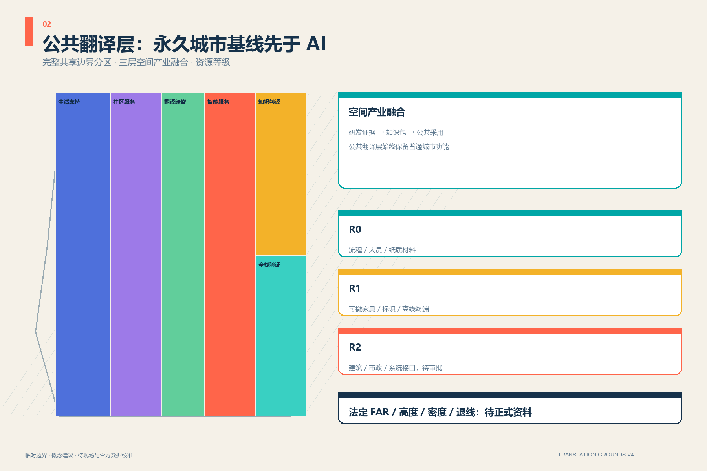

## 统筹研究范围产业与未来城市研究

六个案例只提炼机制，不照搬尺度或政策。剑桥 Kendall Square 提示创新区要从“园区”变成创新社区 [source:CASE-KENDALL]；新加坡 one-north 说明模块化创业空间应与工作—生活—游憩—学习环境共同运营 [source:CASE-ONENORTH]。首尔 AI Hub 提供从教育、孵化到验证的阶段服务链 [source:CASE-SEOUL]；Paris-Saclay 的 Urba(IA) 强调用用户委员会比较和评估城市 AI 方案 [source:CASE-PARIS-SACLAY]。伦敦 Knowledge Quarter 展示文化、研究、商业和社区的跨机构协作 [source:CASE-KQ-LONDON]；多伦多 Vector Institute 展示研究、产业与公共领域的持续召集机制 [source:CASE-VECTOR]。

京张的转化不是复制“硅谷外观”，而是设置六道公共门：来源门核对数据与知识产权，同意门说明参与和退出，可达门保证无障碍与低数字门槛，复核门明确人工责任，回退门保留暂停和降级，维护门公开运营与更新责任。六门既是东西缝合的公共空间，也是每项 AI 服务进入日常前的放行协议 [standard:PROJECT-AGENT-OPEN-CALL-TASKBOOK] [data:geometry/public_space.geojson#PUBLIC-001]。

视觉识别采用原创“双轨译括号”：两条京张轨线在中央形成开放括号，青绿表示可追溯的公共路径，暖黄表示人的判断。标志不借用企业商标；“译场 / Translation Grounds”同时指空间场所与持续翻译的共同实践。

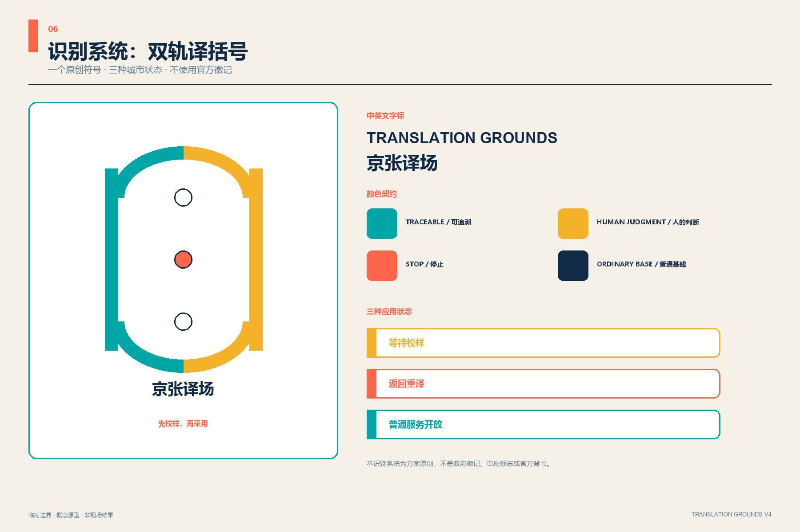

## 总体设计范围城市更新与控规深度城市设计

总体设计以完整用地分区为机器审查底板：西侧布置共居与社区服务原型，中部连续绿脊，东侧由南向北组织城市服务、知识转译教育和全栈研发验证。分区由同一临时边界切分，覆盖完整且无缝，但用途只是方案分类，不是已批控规 [standard:MNR-LAND-USE-CLASSIFICATION-GUIDE] [data:geometry/land_use.geojson#LU-03] [depth:land_use_layout]。

城市更新遵循“先留用、再适配、后新增”。十二个建筑基底只表达译院、共享服务和开放验证所需的空间原型，不指认现状楼宇的拆除或权属变化。正式控规发布前，容积率、高度、密度和退线均保持 `unknown/value=null`；发布即触发 shared owner 按 CF-02 复核，当前体量控制只提出首层开放、可变隔断、低扰动屋顶设备和沿绿脊退让的方法 [depth:development_intensity_controls] [depth:height_massing_character] [data:geometry/buildings.geojson#BLDG-001]。

## 重点区域详细设计

三座译院既分工又形成闭环 [depth:three_key_area_detailed_design]：

| 重点区 | 译院定位 | 空间动作 | 先行验证 |
| --- | --- | --- | --- |
| 众智园 | 协议译院：技术→标准 | 绿色测试庭、标准共议室、失效展示廊、清河界面公共客厅 | 开源模型门诊、端侧算力负荷彩排 [data:geometry/key_areas.geojson#PROV-KEY-001] |
| 北京AI原点社区 | 知识译院：研究→产品 | 近校成果街、共享中试间、人才生活站、开源发布阶梯 | 多模态无障碍验证室、青少年AI造物院 [data:geometry/key_areas.geojson#PROV-KEY-002] |
| 大钟寺 | 采用译院：产品→日常 | 国际回译厅、终端修理循环站、服务首问台、公共评价场 | 城市服务翻译、智能终端采用与回访 [data:geometry/key_areas.geojson#PROV-KEY-003] |

大钟寺临时 polygon 尚未锚定大钟寺站；Issue #1029 的复核表明当前位置存在约 2.26 公里的站点关系疑问。本方案不自行平移上游几何，也不把四象限连通画成已确定工程。触发条件是组织方发布正式重点区 polygon，责任为 shared；触发后参赛者按 CF-01 整体重算，触发前公告任务只作文字与空间类型响应 [source:ISSUE-1029] [metric:key_area_count]。

三地采用同一校译协议，但空间职责不可互换：众智园的“模型门诊—隔离测试庭—失败展廊—协议签发台”先形成失败可见的技术证据；AI 原点的“成果街—权利台—共享中试—开放发布阶”把证据编成可维护的知识包；大钟寺的“普通服务台—平行校译台—公众校样庭—申诉回退廊”决定采用、重译或退场。概念断面分别预留 2.4 米清晰通行带、1.8 米服务/设备带和 2.4 米停留带；尺寸仅为无障碍与运营深化的检查起点，不是施工尺寸 [depth:three_key_area_detailed_design] [standard:MOHURD-URBAN-DESIGN-MEASURES]。

| 译院 | 第一份可核证据 | 唯一责任角色 | 禁入/停止条件 | 无 AI 基线 |
| --- | --- | --- | --- | --- |
| 协议译院 | 失败样本、接口说明、复测条件 | 概念责任：测试负责人；S3 启动门 L3 前必须实名指派 | 来源不清、测试隔离或安全责任缺失 | 人工登记与线下技术评审 |
| 知识译院 | 来源—贡献—许可—撤回版本链 | 概念责任：知识维护人；S3 启动门 L3 前必须实名指派 | 权利不清、撤回无响应、维护责任缺失 | 纸质咨询与普通公共展廊 |
| 采用译院 | 人工接管和服务恢复演练记录 | 概念责任：服务运营人；S3 启动门 L3 前必须实名指派 | 转人工失败、申诉不通、普通通道受阻 | 有人值守的普通服务台 |

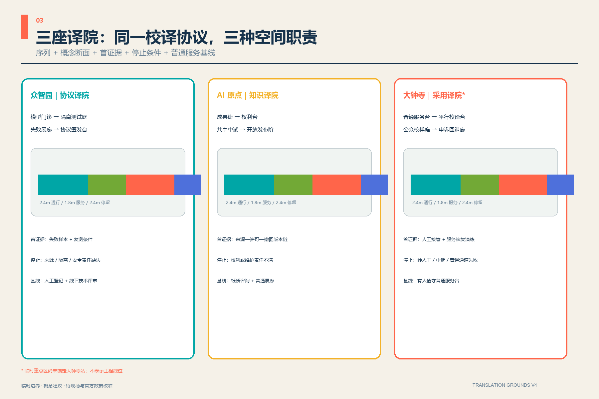

## AI 创新生态、人才画像与 AI+ 场景

七类使用者共同决定场景：研究者需要可复现环境，初创团队需要低成本验证，成熟企业需要采用反馈，居民需要清楚的人工服务入口，老年人与低数字能力者需要不被强制数字化，残障使用者需要多模态可达，国际访客需要跨语解释。场景不以持续识别人群为前提，只使用最少必要的公开或经授权数据。

V3 不把“七类使用者”停留在画像清单，而以六条正向、六条失败路径检查服务是否真的保留纸质、人工、无障碍、跨语、监护和技术日志条件。合成的无智能手机居民、轮椅访客、低视力研究者、国际访客、监护人陪同青年和初创测试者各有一条可达路径与一条故障路径；缺少必要通道、人工接管超过 120 秒概念目标、回执字段不足或普通服务关闭，均返回重译 [metric:synthetic_inclusion_journey_count] [metric:pilot_handoff_target_seconds] [metric:proof_receipt_required_field_count]。

| 合成人物路径 | 必须保留的通道 | 不可接受的替代 | 普通服务基线 |
| --- | --- | --- | --- |
| 无智能手机居民 | 纸质 + 人工 | 仅屏幕/扫码 | 有人窗口与纸质说明 |
| 轮椅访客 | 无台阶 + 人工 | 以楼梯或绕行代替 | 连续无障碍入口 |
| 低视力研究者 | 音频 + 大字 + 人工 | 仅小字屏幕 | 可朗读的人工说明 |
| 国际访客 | 双语 + 人工 | 仅机器翻译 | 双语人工复核 |
| 监护人陪同青年 | 监护告知 + 人工 | 默认同意 | 可撤回的线下活动 |
| 初创测试者 | 技术日志 + 人工 | 黑箱结果 | 线下技术评审 |

十二张场景卡以 `scenario_ids` 登记在六道公共门空间中，前三项为产业测试验证场景 [metric:scenario_node_count] [metric:test_validation_scenario_count] [data:geometry/public_space.geojson#PUBLIC-001]：

1. 开源模型门诊：带数据卡、失败样本和人工签字的模型复诊。
2. 端侧算力负荷彩排：在限定能耗与安全边界内测试边缘部署。
3. 多模态无障碍验证室：当前只用匿名合成路径检查语音、视觉、触觉和人工替代；取得伦理、知情同意、补偿与隐私方案后才触发真人共测。
4. 慢行共驾助手：只提供路线建议，不持续追踪个人。
5. 跨语城市服务台：机器翻译先行，复杂事项转人工。
6. 公共算法标签站：展示用途、数据、责任人、到期日与停止按钮。
7. 京张口述档案亭：授权后采集、可撤回、保留原始语境。
8. 青少年 AI 造物院：作品公开署名，监护与安全规则前置。
9. 法律服务首问台：只做信息分流，由持证专业人员复核。
10. 社区健康导引台：只做预约与健康信息导航，由医疗人员兜底。
11. 智能终端修理循环站：维修、再用和无品牌绑定的设备体验。
12. 国际演示—社区回译场：外部演示必须回应本地使用者问题并公开改动记录。

三个 AI 朝圣地标不是高耗能奇观：北段“公开协议塔”展示标准与失败记录；中段“百年一公里档案门”把铁路里程、创新贡献和公共记忆并置；南段“城市翻译厅”呈现产品如何被采用、质疑、修正和退出 [metric:landmark_count]。

### SCN-05 六门校译记录：12 周可退出试验

第 1—2 周只记录普通人工服务基线；第 3—5 周用合成问题离线校译；第 6—8 周在保留人工主通道的前提下做平行服务；第 9—11 周公开校样、申诉和回退演练；第 12 周只允许“采纳、限期重译、退场”三种结论。任一阶段若出现来源无法追溯、告知/撤回失效、无障碍或非数字路径中断、人工接管失败、回退失败或维护责任空缺，即恢复普通服务 [metric:proofing_pilot_duration_weeks] [metric:proofing_stop_condition_count]。

责任在协议层保持原创 T/R/C/W 分工；进入场地层后扩展为场地责任人、普通服务员、校译操作员、专业复核员、社区见证人、版本维护人和 AI 供应方七角色 RACI。当前只有概念角色，没有真实机构承诺；启动门 L3 要求实名排班和职责签字，且供应方在任何活动中都不得成为放行责任人。资源只分 R0 流程/人员/纸质、R1 可撤离家具/标识/离线终端、R2 建筑/市政/系统接口三档，不虚构金额 [depth:phasing_implementation] [source:AGENT-TASKBOOK]。

### TG-PILOT-01：72 平方米可撤离校译单元

校译单元采用 12 米 × 6 米设计原型，不绑定具体建筑或地块：14.4 平方米普通服务与等候、10.8 平方米知情与撤回、18 平方米隔离/平行校译、14.4 平方米人工复核与回执、14.4 平方米安静申诉与回退。AI 只依赖中央校译区，其余四区在 AI 关闭后仍工作；真实落地必须重新核验权属、消防、无障碍、结构、市政和排班 [metric:pilot_module_area_sqm] [depth:three_key_area_detailed_design]。

每个开放班次的概念最低资源是两名在场人员——普通服务员与校译操作员职责分离——另有一名专业复核员待命；配置一台隔离终端、一个物理停止键、两套触觉/大字导引和一个上锁证据柜。供应方只能提交证据，不能批准自己的六门；普通服务员无需供应方许可即可恢复人工服务。这是待校准的资源原型，不是机构排班或财政承诺 [metric:pilot_minimum_open_shift_staff_count] [depth:phasing_implementation]。

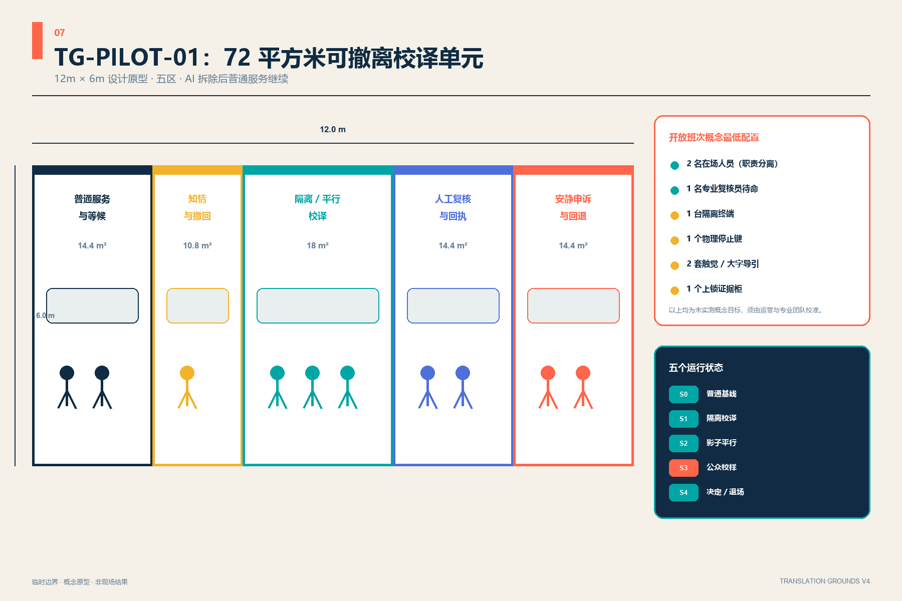

### MVP 启动、责任、异常、验收与退场闭环

TG-PILOT-01 的“可实施”不是声称已经能开工，而是把进入现场前必须关闭的门写清楚。八项启动门依次核对：L1 场地许可与可撤离性、L2 普通服务基线、L3 实名角色与职责分离、L4 最小数据与权利、L5 适用专业安全复核、L6 异常/回退合成演练、L7 中英及无障碍告知/回执、L8 物理停止与退场复用。当前 L6 已有合成契约证据，其余为“设计已定位、现场未触发”或“条件未触发”；场地方与运营主体书面启动真实单元后才进入 S0 [metric:pilot_launch_gate_count] [depth:phasing_implementation]。

| 活动 | Accountable | Responsible | Consulted / witness | 硬边界 |
| --- | --- | --- | --- | --- |
| 场地开放与普通基线 | 场地责任人 | 普通服务员 | 专业复核员、社区见证人 | 普通服务先于 AI 开放 |
| 最小数据接收 | 版本维护人 | 校译操作员 | 专业复核员 | 原始个案默认不留存 |
| 隔离 AI 草稿 | 校译操作员 | AI 供应方 | 专业复核员、维护人 | 输出不直接面向公众 |
| 六门放行 | 专业复核员 | 校译操作员 | 社区见证人、维护人 | 供应方不得自批 |
| 转人工、申诉、停止 | 普通服务员 | 普通服务员、维护人 | 专业复核员、社区见证人 | 无需供应方许可即可恢复 D0 |
| 退场与公共复用 | 版本维护人 | 场地责任人、普通服务员 | 专业复核员、社区见证人 | 删除临时凭据/缓存，保留公共家具 |

最小数据只允许会话目的、完成服务所需的最少内容、用户主动选择的语言/可达通道，以及八字段匿名回执；姓名、面部、生物特征、精确或连续位置、联系人、跨服务身份和原始音视频默认禁入。AI 只可翻译/重排清权内容、生成待复核草稿、暴露来源/不确定性和建议人工路由；人工负责告知、撤回、专业/权利/安全判断、放行、投诉、停止和退场。无 AI 时保留有人窗口、纸质与双语说明、无台阶/大字/朗读/触觉路径和预约专业复核，不因撤回或投诉降低普通服务 [metric:pilot_raci_role_count] [metric:proof_receipt_required_field_count]。

六类异常分别落入现有六门：来源/权利失败即隔离并暂停 S3；重大错误即撤回输出并人工接管；无障碍/语言障碍即切换可达人工路径；120 秒概念目标未达即记失败而非延长掩盖；回退/停止失败即物理隔离并拆除 AI 层；隐私/安全事件即断开终端并按未来合法运营政策处置。八项验收同时记录“当前证据”和“现场状态”：普通服务 1.0、人工接管 ≤120 秒、撤回确认 ≤1 开放班次、回执 8/8、六门 6/6、包容路径 12/12、停止恢复 1/1、默认保留禁入字段 0；前三项和真实停止演练均明确为 `unmeasured`，不得把合成检查冒充现场绩效 [metric:pilot_acceptance_metric_count] [metric:pilot_handoff_target_seconds]。

退出后移除 AI 终端、供应商品牌、临时凭据和临时个案缓存；普通服务台、安静申诉区、无障碍导引、社区会议家具和修理/学习桌继续作为公共用途。只归档非个人聚合指标、协议版本、退场决定与维护经验，普通服务和公共家具不得被供应方锁定。

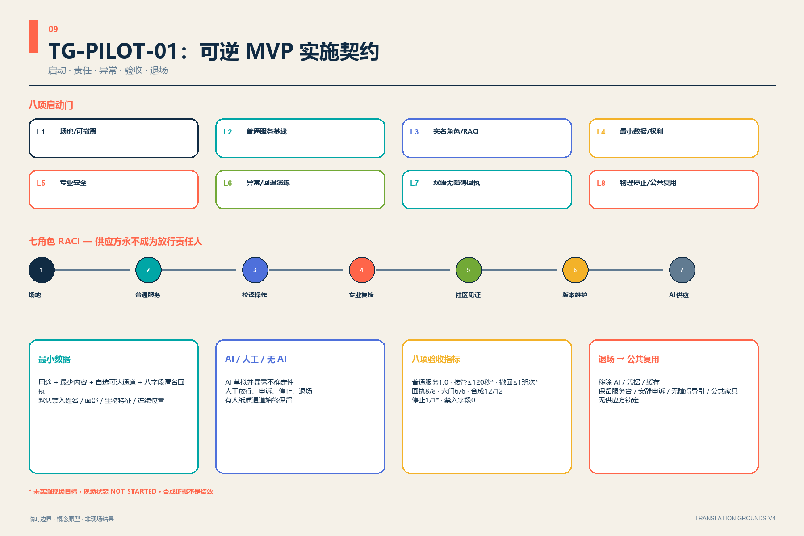

### 城市校样回执：把退出权交还给使用者

每次公众校样只产生匿名令牌、服务目的、六门状态、人工责任角色、有效期、普通服务路径、申诉路径和回退状态八项字段；不使用姓名、面部、连续位置或“区块链身份证”。回执到期不自动续期，任一门失败即盖“返回重译”，物理停止键把空间从公众校样状态恢复到普通服务状态 [metric:proof_receipt_required_field_count] [metric:proofing_gate_count]。

五个状态同时约束服务与空间：S0 只运行普通服务；S1 在隔离区用公开/合成问题校译；S2 输出只给人工复核、不面向公众；S3 六门全部通过后才展示带回执的公众校样；S4 只能选择限量采纳、返回重译或拆除 AI 层并恢复基线。120 秒人工接管和一个开放班次内确认撤回均是待实测、待专业校准的概念目标 [metric:pilot_operating_state_count] [metric:pilot_handoff_target_seconds]。

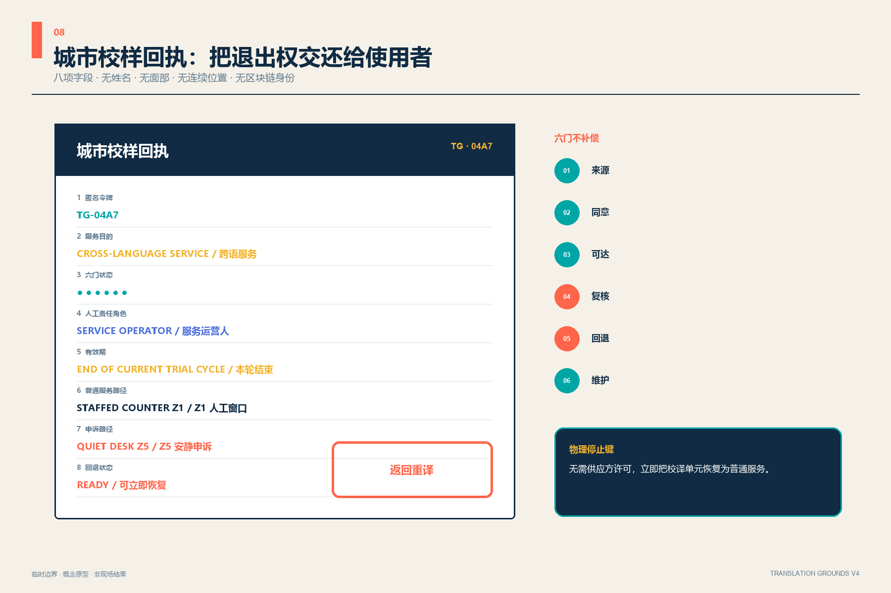

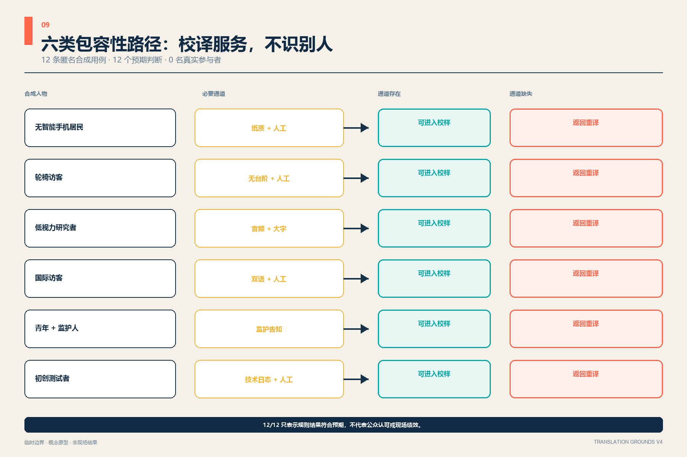

## 用地、建筑规模与拆改留方案

用地面积由临时边界内的六个共享边界分区复算；中部绿脊与两侧功能带构成“公共翻译层—知识生产层—日常采用层”。用地代码采用仓库枚举；自然资源部本地参考快照只保存通知页面，因此 CF-09 把“仓库补充清权正式附件或进入专业设计阶段”设为触发条件，触发前不把当前分类写成法定用地 [standard:MNR-LAND-USE-CLASSIFICATION-GUIDE] [depth:land_use_layout]。

建筑策略不是逐栋拆改留结论，而是一套调查后决策树：有安全与使用价值的建筑优先保留；能够通过首层开放、设备更新和共享空间改善的建筑优先改造；只有在权属、结构、文保、碳排和公共利益评估完成后，才讨论拆除或新增。提交的原型基底面积及覆盖比只用于方案内部一致性 [metric:building_footprint_area_sqm] [metric:building_coverage_ratio_design_prototype] [depth:retain_renovate_demolish]。

## 交通、轨道、市政与公共服务设施

交通系统由一条南北慢行绿脊和六条东西“换译门”连接构成，表达跨越与接驳关系，不表达道路红线或桥隧工程。概念中心线长度用于检查网络是否随几何更新同步变化 [metric:road_centerline_length_m] [depth:traffic_rail_slow_parking] [data:geometry/roads.geojson#ROAD-002]。

市政与新基建采用“边缘小节点、集中审计、人工可接管”架构：译院可设置预约式算力、模型评测、数据授权和设备维修接口。正式道路、轨道、市政和交通调查资料到位即触发 CF-04 shared owner 专项复核；触发前只表达接口关系，公共服务始终保留人工窗口、非智能路径和离线说明 [depth:municipal_new_infrastructure] [standard:MOHURD-CONTROL-DETAILED-PLANNING]。

## 蓝绿空间、公共空间与城市风貌

京张翻译绿脊把遗址叙事、步行骑行、无障碍伴行和低侵入 AI 体验放在同一连续空间中；六座公共门在东西向提供停留、解释和换乘。绿地与公共空间比例来自方案几何，不是法定绿地率或政府承诺 [metric:green_space_area_sqm] [metric:green_ratio] [data:geometry/green_space.geojson#GREEN-001]。

公共空间按六种译场组件深化：带人工窗口的服务台、可擦写的公共协议墙、可回收展架、低亮度状态灯、无障碍触觉/语音导视、带物理停止键的演示台。其面积与占比只说明本方案的公共性投入 [metric:public_space_area_sqm] [metric:public_space_ratio] [depth:blue_green_public_space]。

城市风貌使用耐久金属、再生砖、木质触摸面和可更换信息层，形成“铁路工程理性 + 中关村开放实验 + AI 可解释界面”的基调。任何涉及文保建筑、清河或小月河控制、既有公园设施的动作都应低扰动、可逆并经专业审查 [standard:MOHURD-URBAN-DESIGN-MEASURES]。

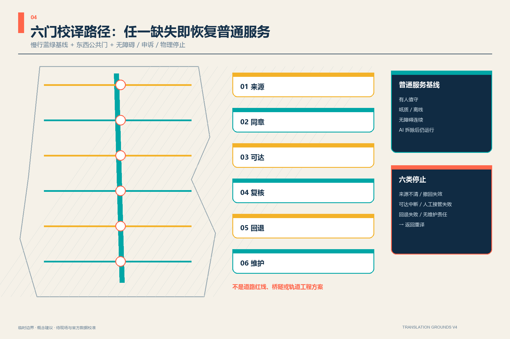

## 更新项目清单、实施政策与分期计划

| 项目 | 内容 | 依赖与退出条件 |
| --- | --- | --- |
| T-01 翻译绿脊样段 | 导视、人工服务点、公共标签、无障碍伴行 | 文保/公园/交通许可；可整体撤除 |
| T-02 众智协议译院 | 标准共议、模型门诊、失败展示 | 建筑安全与运营主体确认 |
| T-03 原点知识译院 | 中试共享、开源发布、人才生活服务 | 校园园区边界与权属确认 |
| T-04 大钟寺采用译院 | 服务首问、终端循环、国际回译 | 官方重点区与站点锚定确认 |
| T-05 六道公共门 | 来源、同意、可达、复核、回退、维护 | 道路红线与无障碍专项确认 |
| T-06 十二场景轮换计划 | 90 天测试—公开复盘—续期/停止 | 数据授权、人工责任人、投诉渠道 |
| T-07 TG-PILOT-01 校译单元 | 五区、两人在场、隔离终端、物理停止、回执与退场 | 真实场地、运营主体、消防与无障碍专业确认 |

每个项目在进入下一阶段前提交六项“校样包”：问题卡、空间卡、数据/权利卡、人工责任卡、停止恢复卡和维护退场卡。T-01、T-05 属 R1 可逆组件；T-06 从 R0 流程开始；T-02—T-04 只有在建筑、权属、消防、市政和运营主体确认后才可能从 R1 进入 R2。资金只在后续由专业团队形成成本区间，本稿不编造投资额或财政承诺。

T-07 将责任进一步拆开：场地责任人掌握场地与普通用途，普通服务员掌握人工接管，校译操作员运行隔离草稿，AI 供应方只提交模型与数据说明，专业复核员判断安全/权利/可达，社区见证人只记录可达与申诉观察、不接触案例内容，版本维护人负责期限、删除和拆除记录。七类角色目前均为概念角色；场地方与运营主体书面启动真实试点后触发 L3 实名 RACI，缺任一关键责任人，S3 不得开始。

第一阶段只做可逆标签、服务流程和临时场景；第二阶段在调查后进行三译院适应性更新；第三阶段等待官方边界和专项条件后再决定系统性建设。阶段一图形面积只表示依赖顺序，不是开工范围 [metric:phase_1_area_sqm] [depth:renewal_project_list] [depth:phasing_implementation]。

年度运营形成“春季公开问题征集—夏季场景彩排—秋季全球译场周—冬季维护与退场审计”。开发者贡献以公开问题、测试记录和维护承诺计入荣誉系统；企业从演示进入小规模验证，再经居民/专业复核决定续期；国际传播强调“被验证与被修正的创新”，不宣称活动、招商、资金或政策已经确定。

## 指标体系、面积复算与合规矩阵

临时总体边界在 EPSG:4548 下的复算值记录于 `site_area_sqm`，只用于包内拓扑和比例一致性 [metric:site_area_sqm] [depth:metrics_recalculation]。绿地、公共空间、建筑原型、慢行中心线和分期指标均由相应 GeoJSON 复算；法定容积率、高度、道路面积率和现状保留比保持 `unknown/value=null`，分别在 CF-01—CF-04 的正式数据触发后复算。

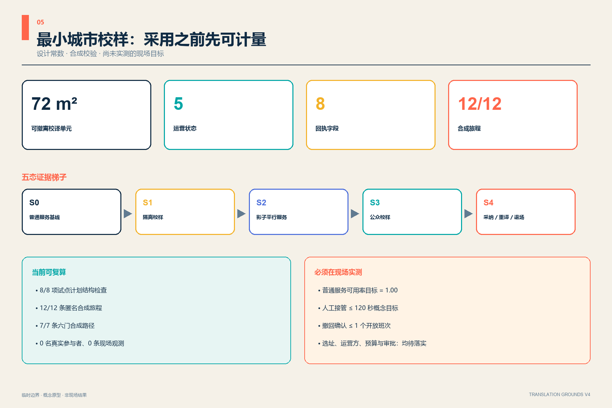

任务覆盖矩阵逐项响应公告 1.3、1.4、1.5 与 agent.1—agent.6，并把来源 `source_ids` 与专业标准 `standard_ids` 分开；31 个任务书 required outputs 均在任务书索引中绑定人类图件与机器证据。专业标准矩阵记录五项强制依据和一项未取得官方文件的资料缺口；设计深度矩阵把十五项成果深度全部落到正文、图层、指标、图纸和自检。`complete` 表示已提供当前临时资料条件下的可审查证据，不等于法定规划完成或官方批准 [metric:conditional_followup_count]。

## 风险、版权与合规说明

最大风险不是方案缺少数字，而是临时数字被截取后误读为官方结论。官方边界、重点区、控规、道路、建筑、文保、市政和公共服务底数到位时，必须整体重算并更新 manifest 与自检 [depth:risk_missing_data]。建筑工程设计文件深度规定尚无仓库可用的官方文件，本方案仅把它登记为资料缺口，不声称已据此完成建筑专业设计 [standard:MOHURD-ARCH-DESIGN-DEPTH-2016]。

`assumptions.json` 将九类未来事项统一设为结构化 conditional follow-up；它们不是当前参赛者修复项：

| 条件项 | 当前处理 | 触发 | Owner | 触发后动作 |
| --- | --- | --- | --- | --- |
| 正式总体/重点区几何 | provisional_rough，仅概念与包内复算 | 组织方发布可复用正式 polygon | shared | 全量重算几何、指标、图件、PDF、HTML、矩阵与自检 |
| 法定控规 | `unknown/value=null` | 发布清权控规条件 | shared | 补充 FAR/高度/密度/退线并复核体量 |
| 建筑/权属 | 适应性更新原型 | 取得测绘、结构、用途和权属 | shared | 逐栋执行保留—适配—新增决策树 |
| 道路/市政 | 只表达连接与接口 | 取得正式道路、轨道、市政和交通资料 | shared | 复核线位、容量与设施接口 |
| 文保 | 可逆、低扰动 | 取得文保范围或进入真实场地 | shared | 文保专业复核落位、材料和活动扰动 |
| 真实试点 | `not_started`，只交付 MVP 契约与合成证据 | 场地/运营主体书面启动 | shared | 完成 L1—L8 后进入 S0 |
| 真人无障碍共测 | 12 条均为匿名合成 | 取得伦理、同意、补偿、隐私和场地授权 | shared | 真人共测并校准指标 |
| 外部区域合作 | 五个概念输入/输出接口 | 机构提供可公开书面授权 | external | 才可转为合作、共享、采购或互认安排 |
| 建筑专业正式文件 | 资料缺口 + 概念断面 | 仓库补入清权文件或进入专业设计 | shared | 更新标准矩阵并取得专业签署 |

来源与版权采用“资产—来源—权利—是否再分发”闭环。全部图件、封面、PDF 页面、Logo、回执、动画画面和正文为本方案独立生成；六案例只转述机制，不复制其图像或版式。Microsoft YaHei 与 Arial 仅用于本机栅格化，字体文件不入包，PDF 也不嵌入字体程序。为保证受信任 Linux/Chromium 离线截图可读，四份 HTML 内联嵌入仅覆盖本包实际字符的 Noto Sans SC Regular/Bold WOFF2 子集，使用非保留族名 `TG CJK`；来源、原字体与子集 SHA、字符覆盖证据及 SIL Open Font License 1.1 全文均随包公开，不发起远程字体请求。Pillow（HPND）、Shapely（BSD-3-Clause）、pyproj（MIT）、fontTools、Brotli 和 imageio-ffmpeg 0.6.0 / FFmpeg 仅用于本地生成，除上述 OFL 字体子集外，库和二进制均未再分发。包内没有商业地图瓦片、第三方照片、商标、人物肖像、外部音频/视频/代码；MP4 无声、无自动播放，并有中英字幕与权利文字稿。逐源访问日期、用途、evidence level、reuse scope 和限制见 `sources.json`，逐资产说明见 `report/copyright_statement.md`。

## 参考资料

完整的发布者、链接、访问日期、允许用途和限制保存在 `sources.json`；本节说明资料怎样影响设计，而不把案例经验误写成法定控制。官方公告与任务书确定三层范围、三大重点区和开放任务，直接形成“一脊—三译院—六门—十二场景”的任务结构 [source:OFFICIAL-ANNOUNCEMENT] [source:AGENT-TASKBOOK]。标准快照约束证据等级、公开程序和概念方案边界；六个国际案例只提供运营机制启发，不提供可直接移植的指标或许可结论 [standard:MOHURD-URBAN-DESIGN-MEASURES] [source:CASE-KENDALL]。

空间底板来自仓库临时几何，因而面积、绿地和公共空间比例只用于验证包内拓扑与方案一致性 [data:geometry/site_boundary.geojson#SITE-001] [metric:site_area_sqm]。Issue #1029 证明 PROV-KEY-003 尚未锚定大钟寺站，本方案不自行移动上游多边形，也不据此声称站城关系已落实 [source:ISSUE-1029]。官方边界、控规、道路、建筑、文保、市政、权属和设施底数到位后，应整体复算几何与指标并重新运行四门自检；当前成果是可深化的开放共创投稿，不代表入选、批准或实施。
