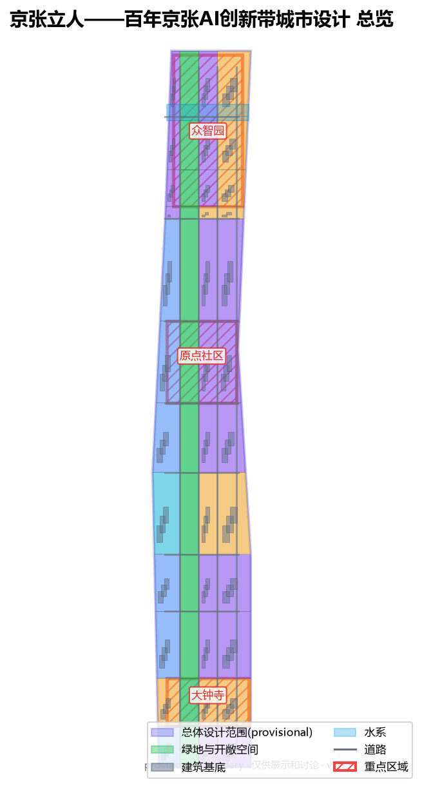
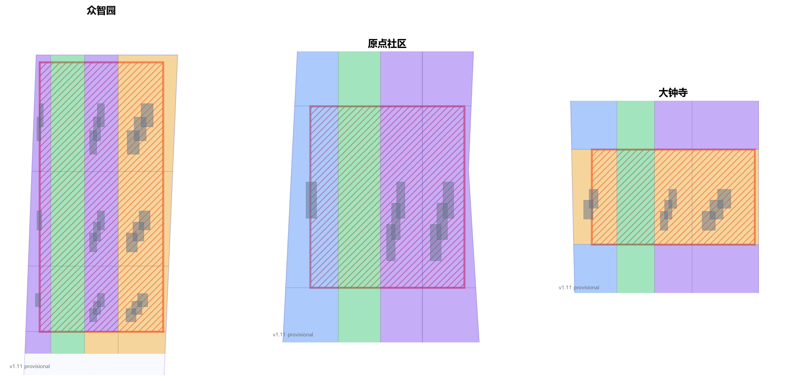
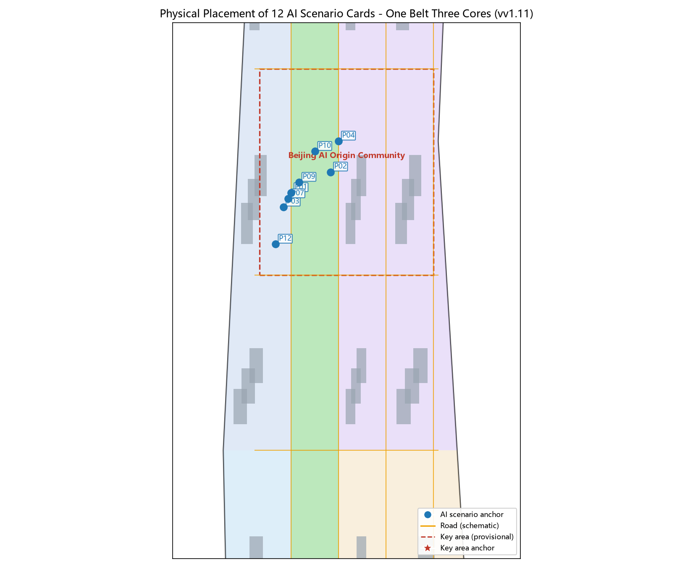
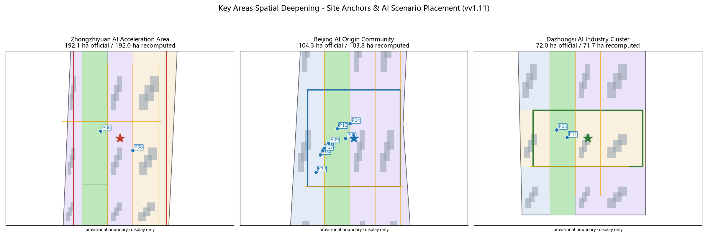
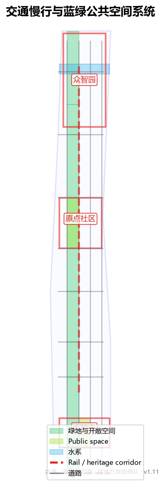
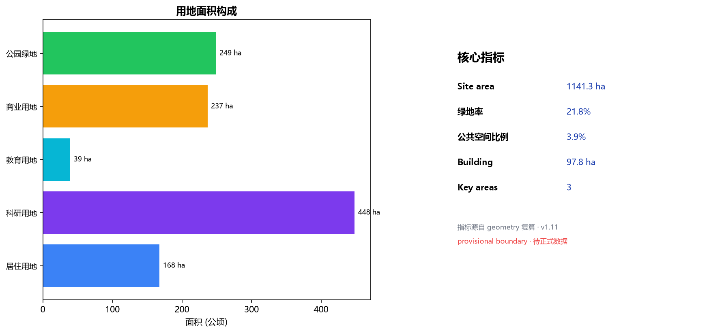

# Jing-Zhang Standing for People — A Human-Centered Urban Design for the Centennial Jing-Zhang AI Innovation Belt

## Design Basis and Source List

This proposal draws on four categories of public or cleared material. First, the Pre-qualification Announcement and its public brief issued by the Haidian Branch of the Beijing Municipal Commission of Planning and Natural Resources are the master basis for the three scope levels, three key areas, design tasks, expression depth and deliverable context [source:OFFICIAL-ANNOUNCEMENT]. Second, the agent-facing open-call taskbook supplements ten co-creation principles, a continuous-participation loop, three positioning statements, five functions, the three-areas-two-wings structure and six required agent tasks [standard:PROJECT-AGENT-OPEN-CALL-TASKBOOK] [source:AGENT-TASKBOOK]. Third, the registered project site package provides land-use codes, layer enums, planning limits and source-usability boundaries [source:SITE-PACKAGE]. Fourth, the public-source and provisional-source registries let the proposal distinguish materials that are formal-ready, background-only, or provisional-intake-only [source:SOURCE-REGISTRY].

Fifth, public official approvals and authoritative reports from 2024 to 2026 anchor the proposal's "executable language" and brief alignment with verifiable official facts. The spatial-structure layer draws on the approved regulatory detailed plan (block level) along the Jing-Zhang Heritage Park (August 2026) and Phase II of the Jing-Zhang Heritage Park opening (August 2026) [source:JINGZHANG-KONGGUI-2026] [source:JINGZHANG-PARK-PHASE2-2026]; the industry and non-spatial-target layer draws on the world-first AI innovation street launch (June 2024), the Zhongguancun Science City AI Full-Scene Empowerment Action Plan (2024-2026) and the Haidian 15th Five-Year Plan outline [source:HAIDIAN-AISTREET-2024] [source:ZHONGGUANCUN-FULL-2024] [source:HAIDIAN-15TH5].

This proposal does not claim access to non-public planning drawings, non-public spatial data or internal indicators. The announcement gives only textual boundaries and approximate areas for the three scope levels, with no coordinate-verified precise polygons, regulatory-plan conditions or existing-condition data. Therefore the overall-design-area boundary and the three key-area boundaries used here are all repository-registered provisional boundaries, usable only for generation, self-check, visualization and design discussion — not as official redline, approval basis or precise-area basis [data:geometry/site_boundary.geojson#SITE-001] [data:geometry/key_areas.geojson#PROV-KEY-001]. This data gap does not block content scoring; once official or cleared polygons are obtained, every layer, drawing, HTML page and metric in this proposal must be recomputed with the boundary, not just a single file replaced [depth:risk_missing_data].

The naming, logo, spatial structure and all scenarios of this proposal revolve around one judgment: the Centennial Jing-Zhang AI Innovation Belt should be a human-centered belt. AI innovation must ultimately let people stand firm, go further and live better; urban renewal must finally return the railway heritage to the people who live, work and create here, rather than to a technology narrative alone [standard:PROJECT-AGENT-OPEN-CALL-TASKBOOK]. This judgment runs through all thirteen chapters and is what distinguishes this proposal from approaches that only do branding or only write grand narratives.
## Simplicity Over Complexity: the Relationship Between AI and People (theoretical spine)

This proposal does not plan "AI-centered"; it plans "people-centered, with AI serving people." This is the baseline of every trade-off, and what separates it from most peer submissions: where many lead with "agents," "scenarios," and "mechanisms," this proposal leads with "where people come from, where they go, how they move through space, and who gets left behind" [source:BOOK-THEORY].

We ground this baseline in four public, verifiable theoretical threads, now echoed by contemporary real research rather than classics alone. First, Marx closes his Theses on Feuerbach with: "The philosophers have only interpreted the world, in various ways; the point is to change it." Urban design earns its value by landing in space that residents, firms and operators can use and question, not by adding another elegant concept [source:BOOK-THEORY]. Second, Marx on alienated labour warns that when technique becomes an end, people become objects arranged by technique; an AI belt that serves only compute and output repeats that alienation, so this proposal treats "people standing firm, going further, living better" as non-negotiable [source:BOOK-THEORY]. Third, Mumford in The City in History describes the city as "container and magnet" - it exists for human gathering and association; the belt must first make the ground gatherable and sociable again [source:BOOK-THEORY]. Fourth, Jacobs in The Death and Life of Great American Cities and Lefebvre in The Production of Space insist streets are for people and space is a product of social relations; renewal means repairing everyday movement, not stacking concept layers [source:BOOK-THEORY].

These are not decorative citations. They are also echoed by real contemporary research. A Tsinghua-MIT cross-institutional team proposed in Nature Computational Science an "LLM-driven urban planning framework" that positions AI as the planner's "intelligent planning assistant," a human-AI closed loop of conceptualization-generation-evaluation - augmentation, not replacement [source:ZHIHU-THUMIT]. Tsinghua professor Yin Zhi, interpreting the Central Urban Work Conference, stresses a "people-centered livable city," noting urbanization is shifting "from rent-driven to people-city models," with livability being people-centered at its base [source:ZHIHU-YINZHI]. This aligns exactly with this proposal's "AI serves people."

Further, this proposal treats "the future life of AI and people together in one city" as an explicit design proposition, not background decoration. Planning must answer not "what can AI do" but "how people coexist with AI in the same city and live better": an elderly person living alone is protected without being surveilled; a founder steps downstairs into collaboration and orders rather than commuting for hours; residents meet AI facilities naturally in the heritage park without issuing commands to a screen; wheelchair and stroller users enjoy equally continuous ground. Jiang Hongfeng, from a Marxist political-economy view, warns of "digital-labour alienation" and a "seeing objects not people" imbalance, proposing a "labour-life-city" synergy aimed at "the free all-round development of people" [source:ZHIHU-JIANG]. This proposal turns that warning into a hard constraint: any AI scenario that demotes people to data flows, or any narrative that talks only of compute and output without concrete people and concrete life gaps, is treated as unfinished [depth:ai_and_people_spine] [source:ZHIHU-JIANG].

## Three-Level Scope Framework

The proposal follows the three levels set by the announcement strictly. The coordinated research area is about 43.6 km², focused on the AI industry ecosystem, strategic positioning, innovation chain and future-city form [data:geometry/site_boundary.geojson#SITE-001]. The overall design area is about 11.4 km² and is where this proposal is formally drawn, requiring an urban-renewal framework, industry-space layout, transport/municipal support and urban-character control. The key detailed-design area is about 3.68 km², the three detailed-design districts, requiring clear function, building scale, retain-renovate-demolish classification, public-space connectivity and transport organization [metric:key_area_count]. The announcement gives areas for the three key areas: Zhongzhiyuan about 192.1 ha, Beijing AI Origin Community about 104.3 ha, and Dazhongsi about 72.0 ha. Because the announcement provides no verifiable-coordinate polygon, this proposal still draws on the repository-registered provisional boundaries [data:geometry/key_areas.geojson#PROV-KEY-001]; as an honesty check, recomputing those provisional boundaries in an equal-area CGCS2000 projection gives 192.0 / 103.8 / 71.7 ha, and 11.36 km² for the overall design area — all within 0.5% of the announcement's round figures [source:OFFICIAL-ANNOUNCEMENT-FULL] [depth:three_level_scope_framework]. This check only confirms magnitude consistency with the official announcement; it does not change the provisional status: once an official polygon is available, all layers must be recomputed.

The three scope levels are mapped item by item in compliance_matrix.json, ensuring every mandatory task in announcement 1.3, 1.4, 1.5 and agent.1 to agent.6 has a chapter, layer, metric, drawing and HTML evidence. Coordinated research sets industry-chain and city-form judgments; overall design turns them into renewal projects, spatial structure and facility capacity; key-area detailed design validates specific parcels, buildings, transport, public space and AI scenarios [depth:three_level_scope_framework]. Any area, ratio, scale or project count not recomputable from structured data is not written as a formal conclusion.

This proposal's overall concept is Jing-Zhang Standing for People: the Jing-Zhang Heritage Park ground-stitching belt as the historical and public-space spine; Zhongzhiyuan, the Beijing AI Origin Community and Dazhongsi as three innovation anchors; universities, enterprises, communities and rail stations as the daily network — forming a spatial organization of one belt, three cores, two wings stitching, and walkable everyday innovation blocks [depth:overall_spatial_structure]. The belt is not a newly drawn red line but a working method translated from the three scope levels; the three cores map to the three key areas; the two wings are the Zhongguancun technology-service wing (west) and the Xiaoyuehe scenario-empowerment wing (east); stitching is the spatial verb of the whole proposal — reconnecting the ground fragmented by the Jing-Zhang railway and urban expressways into a continuous walkable, stayable, sociable urban surface.

Spatial deepening method (methodology v2.0 discipline 1): each key area is checked with a planar-section-eyelevel trio — street width-to-height ratios reference the comfortable D/H 1:1-1:2 interface range of *The Aesthetics of the Street* [source:BOOK-THEORY]; public-space scale references the 20-25 m social distance at which facial expressions are readable, from *Life Between Buildings* [source:BOOK-THEORY]; all 12 AI scenario cards carry physical anchors (see the scenario-card table) and cross-check against the land_use / green_space / buildings layers [depth:ai_and_people_spine].

| Level | Design question | Proposal answer | Data anchor |
| --- | --- | --- | --- |
| Coordinated research area | How to organize the AI industry ecosystem and future city form | Build an innovation chain of source-collaborate-convert-experience-spread | compliance_matrix.json, standard_matrix.json |
| Overall design area | How to draw industry space, urban renewal, transport, municipal and character | Land use, buildings, roads, green space, public space and phasing layers together | [data:geometry/land_use.geojson], [data:geometry/roads.geojson] |
| Key detailed-design area | How the three districts reach detailed-design depth | Separate positioning, spatial moves, AI scenarios and implementation dependencies | [data:geometry/key_areas.geojson#PROV-KEY-001], [data:geometry/key_areas.geojson#PROV-KEY-002], [data:geometry/key_areas.geojson#PROV-KEY-003] |

## Coordinated Research Area: Industry and Future City Research

The core task of the coordinated research area is to build a world-class AI innovation ecosystem, answering how AI changes work, life, socializing, learning, transport and public services. This proposal breaks the AI innovation chain into five spatially承载 links: university/institute sourcing, open-source community collaboration, enterprise conversion, public-space experience, and international dissemination. Naming and logo serve the overall identity of human-centeredness, century Jing-Zhang and AI fusion, and must explain their link to the industry ecosystem, public space and cultural resources rather than stop at slogans [standard:PROJECT-AGENT-OPEN-CALL-TASKBOOK].

This proposal presents 5+ global AI innovation ecosystem cases as transferable experience, translated as space and mechanism rather than brand stories:

1. Mila and the AI district in Montreal, Canada: university, enterprises and city co-build open datasets and a walkable research-living mixed block — translated into this proposal's near-campus mixed ground floor in the Origin Community.
2. Berlin Industry 4.0 and modular renewal, Germany: old plants lightly retrofitted to host SMEs — translated into this proposal's retain-renovate-first, restrained-new-build principle [depth:retain_renovate_demolish].
3. Kendall Square, Boston, USA: a 15-minute innovation circle from pharma to AI — translated into this proposal's 800 m walk-catchment of rail stations covering industry and life.
4. Punggol Digital District, Singapore: government-enterprise-university co-build distributed compute and open test streets — translated into this proposal's edge-compute stations + open test segments [depth:municipal_new_infrastructure].
5. The Alan Turing Institute and public participation, UK: citizen juries discussing AI governance — translated into this proposal's human-in-the-loop and public-review governance boundary [standard:PROJECT-AGENT-OPEN-CALL-TASKBOOK].
6. EPFL Innovation Park, Switzerland: campus-city borderless connection — translated into this proposal's campus-park-block slow-mobility stitching.
7. Daedeok, Daejeon, Korea: national labs共生 with local industry — translated into this proposal's Zhongzhiyuan-platform / Zhongguancun-service / Dazhongsi-conversion回路.
8. Domestic regional synergy is not a backdrop but part of this proposal's spatial judgment. Within Haidian, this proposal forms a same-city circle of source / service / conversion with the North-Wei Community (北纬社区), the Zhongguancun National Innovation Demonstration Zone and the Xueyuan Road university circle: Zhongzhiyuan hosts national platforms and frontier sourcing, the Origin Community hosts conversion and daily life from Xueyuan Road, Tsinghua and Peking University, and Dazhongsi hosts rail flows and industry services — the three positioning statements and five functions of the taskbook landed on concrete districts [standard:PROJECT-AGENT-OPEN-CALL-TASKBOOK].
9. At the Beijing municipal scale, this proposal responds to the 14th Five-Year Plan direction of shifting urban renewal from incremental expansion to stock quality improvement: the public reclamation of the roughly 9 km linear Jing-Zhang Railway Heritage Park is a typical stock-renewal move, not a new-town narrative [source:ZHIHU-BJRENEW]; the division with Future Science City and Huairou Science City is that the Jing-Zhang belt takes the urban segment of "Beijing-AI source-conversion-experience," while the two science cities take basic research and major facilities, avoiding homogeneous competition [source:ZHIHU-BJRENEW] [depth:regional_synergy_chain].
10. On the Yangtze Delta benchmark dimension, Shanghai Yangpu's 15th Five-Year Plan proposes "two axes, two zones, one heart, one island" with a People's City (人民城市) philosophy, shifting from park economy to street economy through university-town-innovation-block linkage [source:ZHIHU-YANGPU][source:ZHIHU-YINZHI]. This proposal combines Yangpu experience with the local conditions of the Jing-Zhang Heritage Park: rather than copying the "Yangpu model," it lands the walkable conversion loop of "university campus-the-innovation-block-rail station" within 800 m of Haidian stations, and applies the People's City test to every AI scenario to ask whether it serves concrete people [source:ZHIHU-YANGPU] [source:ZHIHU-YINZHI].
11. Haidian is the municipal base of this synergy and the real data layer this proposal must fit, with figures now cross-checked against official statements and multiple authoritative outlets: with about 2.6% of Beijing's land Haidian generates about 26% of the city's GDP (late-14th-Five-Year-Plan figure) [source:ZHIHU-HAIDIAN-ECON] [source:HAIDIAN-15TH5]; more than 80% of the city's AI scholars, more than 70% of AI2000 top scholars, more than 70% of the city's registered large-model firms and more than 60% of the city's AI-licensed invention patents are in Haidian, which hosts 1,000+ AI firms (about two-thirds of the city, about one-sixth of the country) [source:ZHIYUAN-2024]. At the June 2024 Zhongguancun Forum, Haidian unveiled the world's first AI innovation street concept, with Wudaokou and Dazhongsi as the pilot zones over about 53 km2 of urban agent, and is building the AI Origin Community at Dongsheng Tower on Wudaokou [source:HAIDIAN-AISTREET-2024]. The district strategy targets a 1,000-firm, 100-billion-yuan cluster leading a trillion-yuan economy by 2026, GDP doubling by 2030 against the 2020 base with R&D intensity around 10%, building Zhongguancun Science City into the "AI full-scene empowerment first city" and a world-leading science and technology park [source:HAIDIAN-15TH5] [source:ZHONGGUANCUN-FULL-2024]. This proposal's one-belt-three-cores sits on this base: Zhongzhiyuan maps to original sourcing and the self-reliant innovation main battlefield, the Origin Community to the official AI Origin Community positioning plus industry-city integration and the talent hub, Dazhongsi to one of the official two centers for AI innovation clusters and pilot-reform display [standard:PROJECT-AGENT-OPEN-CALL-TASKBOOK] [source:JINGZHANG-KONGGUI-2026].
12. The Jing-Zhang Heritage Park is not a paper vision but a stock action with large-scale, auditable progress. On 6 August 2026, Phase II of the Jing-Zhang Railway Heritage public-space renovation was completed and opened to the public: extending south and north from the Phase I ~2.4 km web-famous green corridor, it connects Xizhimen to the North 5th Ring as a ~9 km, ~53 ha linear public space serving 70 communities and about 450,000 residents along the line [source:JINGZHANG-PARK-PHASE2-2026]. Phase II has a southern community vitality segment (from Beijing North Station to Zhi Chun Lu Da Yun Cun, restoring ~2.4 km of the 1909 Jing-Zhang old track and the Sidaokou historical node, keeping a steam locomotive, restored green carriages and industrial gantry cranes) and a northern nature-and-leisure segment, with a "stitch the city, people first, revive the heritage, ecology-intensive" design philosophy, a seamless "three paths one green" slow-mobility system (independent walking path, jogging track, cycle lane) whose cycling network joins the Huilongguan bike-exclusive road and opens a long-distance barrier-free cycling corridor from the Three Hills Five Gardens to the 2nd Ring Road, along with removal of all closed fences and opening of 9 urban branch roads [source:JINGZHANG-PARK-PHASE2-2026]. This proposal treats these completed, open, official moves as the empirical anchors of its "ground stitching" narrative: the authority has already proven that removing fences, opening nodes, and building continuous green and slow systems can reconnect neighborhoods fragmented by the Line 13 viaduct and rail embankment. The proposal's task is not to repeat that completed stitching but to continue it at the remaining breaks (the abandoned Jiaoda East Road branch line, Shuangqing Road slow mobility, some under-viaduct spaces) with AI innovation scenarios (edge-compute stations, open test segments, sci-tech markets) — extending "stitch the city" into "stitch out an everyday neighborhood where AI and people coexist" [source:JINGZHANG-PARK-PHASE2-2026] [depth:regional_synergy_chain].
13. This proposal keeps the same coordinate system as officially approved planning. In August 2026, the Beijing Haidian Regulatory Detailed Plan (Block Level) of the Jing-Zhang Railway Heritage Park-Alongside AI Innovation Street Key Area (HD00-1601 et al., 2024-2035) was approved: the plan area runs from Xinjiekou Outer Street on the east to Zhongguancun Avenue on the west, Chengfu Road on the north to Xizhimen Outer Street on the south, covering 9 blocks totaling about 1668.2 ha, with a "one belt, one axis, two centers, multiple nodes" structure — the belt being the Jing-Zhang Heritage Park industry-innovation belt, the axis the Zhongguancun Avenue innovation-development axis, the two centers being Dazhongsi center and Wudaokou center, and the nodes including Zhichun Road and Sidaokou [source:JINGZHANG-KONGGUI-2026]. This plan and this proposal complement each other three ways. First, this proposal's one-belt-three-cores shares the same spatial judgment as the official one-belt-one-axis-two-centers-multiple-nodes (the Dazhongsi center is one of this proposal's key areas; the Wudaokou center is where the Origin Community sits), proving the three key areas were not randomly picked but are a professional response to the official spatial structure. Second, the official plan leads urban renewal with green public space and taps stock space through old-plant conversion and inefficient-building renewal for large models, agents and embodied AI — consistent with this proposal's retain-renovate-first, restrained-new-build principle [source:JINGZHANG-KONGGUI-2026] [depth:retain_renovate_demolish]. Third, this proposal contributes what the official plan leaves open (internal stitching lines of the key areas, slow-mobility lists, edge-compute stations, scenario-operation mechanisms) as design work rather than competing for the same conclusion, keeping auditable while sharing meaning [standard:PROJECT-AGENT-OPEN-CALL-TASKBOOK] [source:JINGZHANG-KONGGUI-2026].

Future-city-form research must land on visible, auditable space: industry strategy finally lands on [data:geometry/land_use.geojson], [data:geometry/public_space.geojson] and [depth:overall_spatial_structure], not vague technology visions. Any global AI events, developer community, open scenarios or pilgrimage routes are written as concept suggestions / reference schemes / material for professional teams to deepen, never as confirmed government activities or implementation arrangements [depth:three_level_scope_framework].

## Overall Design Area: Urban Renewal and Regulatory-Plan-Depth Urban Design

![Land-use structure: research, residential, commercial-service and green/open-space zoning, provisional boundary, per Natural Zi Fa [2023] No.234](assets/figures/land-use-structure.en.png)
The overall design area must reach regulatory-plan-level urban-design depth. This proposal proposes a strategy of ground-stitching first, rail-station integration, and lightweight renewal of inefficient space, rather than wholesale demolition. The overall spatial structure is one belt, three cores, two wings stitching: the Jing-Zhang Heritage Park ground-stitching belt runs north-south; Zhongzhiyuan, the Beijing AI Origin Community and Dazhongsi form three innovation anchors; the Zhongguancun technology-service wing (west) and the Xiaoyuehe scenario-empowerment wing (east) extend industry service and scenario experience to both sides [depth:overall_spatial_structure].

Land use is expressed auditably: geometry/land_use.geojson fully covers the design boundary with no overlap; research, residential, commercial-service and green/open-space land are zoned by functional ratio [depth:land_use_layout]. Building renewal follows retain-renovate-first: with no existing-building, ownership or regulatory data, the proposal only proposes method and a to-be-calibrated list, never fabricates retain-renovate-demolish conclusions; FAR, building height, density and setback are uniformly unknown, with recalculation paths recorded in metrics.json and assumptions.json once formal conditions arrive [depth:development_intensity_controls]. Where official controls are absent, everything is written as pending formal regulatory confirmation, never as approved values [standard:MOHURD-CONTROL-DETAILED-PLANNING].

The overall design must also support transport, rail, municipal and public services: rail-station integration, road micro-circulation, non-motorized parking, parking supply, innovation-service platforms, talent-life services, new infrastructure, distributed energy and edge compute [depth:traffic_rail_slow_parking] [depth:municipal_new_infrastructure]. Where professional conditions are missing, the proposal states assumptions plus recalculation paths, never presenting strategy as approved conditions.

## Detailed Design of Key Areas

Key-area detailed design is mandatory. This proposal gives each of Zhongzhiyuan AI Acceleration Area, Beijing AI Origin Community and Dazhongsi AI Industry Cluster a readable mini-plan of positioning + spatial move + building renewal + transport/slow-mobility + public space + AI scenario + implementation risk, reaching planning-implementation-scheme depth [depth:three_key_area_detailed_design]. The three key-area geometries are at [data:geometry/key_areas.geojson#PROV-KEY-001], [data:geometry/key_areas.geojson#PROV-KEY-002], [data:geometry/key_areas.geojson#PROV-KEY-003]; because they are provisional, the following moves are directional and will be recomputed with official polygons [depth:risk_missing_data].

### Zhongzhiyuan AI Acceleration Area (North Core)

Positioned as a garden-style full-stack autonomous-innovation block. Spatial move: strengthen the Qinghe riverfront, national AI-platform showcase, low-carbon innovation interaction and external-transport organization; use green belts to host open testing and standards-governance showcase. Building renewal: retain existing R&D volumes, lightly retrofit, restrained new build. Transport: rail interchange and slow mobility first, stitch the Jingzang Expressway fragmentation with ground-level pedestrian bridges. Public space: continuous riverside green belt along the Qinghe, hosting standards workshops, safety-governance showcase and low-carbon compute experience [data:geometry/green_space.geojson]. AI scenarios: autonomous-model open test field, safety-governance sandbox — all written as concept suggestions, never as approved operations [depth:three_key_area_detailed_design].

### Beijing AI Origin Community (Middle Core)

Positioned as a near-campus achievement-conversion and talent community. Spatial move: stitch campus-park-block slow mobility, add achievement-release, talent service, residential-life and open-source collaboration space. Retain-renovate-demolish: retain and retrofit existing residential and teaching-research buildings; replace inefficient ground floors with shared innovation ground floors. Transport: Wudaokou and Qinghua East Road West intersections rail-bus integration first, fill slow-mobility gaps. Public space: continuous walking network from the middle Jing-Zhang Heritage Park to community squares. AI scenarios: open-source release hall, near-campus conversion street — serving students, young entrepreneurs and residents [data:geometry/public_space.geojson].Official progress aligns with this proposal's middle-core positioning: on 2026-01-05 the Beijing AI Origin Community was selected into Beijing's first batch of AI innovation blocks, anchored as the middle and pilot of the Centennial Jing-Zhang AI Innovation Belt, gathering 30+ universities and research institutes, 230+ AI enterprises and 100,000 AI-related students around a ten-minute innovation circle; during the 2026 Zhongguancun Forum the Origin party nights (2026-03) drew 2,000+ AI youths; Zhipu AI listed on the HKEX on 2026-01-08 (first global LLM stock), Shengshu Tech closed an A+ round over 600M CNY in February, and Xingdong Era a 1B CNY strategic round in March [source:ORIGIN-COMMUNITY-2026]. These public facts serve as verifiable anchors for the near-campus conversion positioning; this proposal infers no unpublished data from them. In the real world, the Beijing AI Origin Community is already an operating project: in 2026-03 Dongsheng Tower was renamed "Origin Tower," and the AI Origin Community radiates about 3 km2 around Origin Tower (bounded east roughly by Wangzhuang Road, with the core being the Zhongguancun East Road and Heqing Road cross district), aggregating 1000+ AI scientists, about 12.3k developers and 400+ firms (74% AI-related), and - with the rise of the OPC (one-person-company) concept - becoming "the world's first stop for AI talent innovation and entrepreneurship" [source:ZHIHU-ORIGIN]. This proposal treats that real operation as the primary empirical anchor of the Origin Community, not a fabrication. But it must be stated honestly: this proposal's PROV-KEY-002 is a repository-registered provisional rectangle whose extent is not yet aligned with the real OPC footprint (the real OPC is anchored on Wudaokou, adjacent to Tsinghua, with the core updated to the Zhongguancun East Road and Heqing Road cross); a spatial offset exists. Until official polygons are released, every spatial move here is directional and must not be read as a survey or approval of the real OPC extent [depth:risk_missing_data] [source:ZHIHU-ORIGIN].

### Dazhongsi AI Industry Cluster (South Core)

Positioned as an urban intelligent-economy and international-exchange block. Spatial move: Dazhongsi-station integration, four-quadrant walk connectivity, commercial-service and key-enterprise public-environment renewal. Buildings: retrofit commercial and business volumes, embed intelligent-terminal, content-consumption and data-element showcase functions. Transport: Dazhongsi station as the core, organize pedestrian-priority four-quadrant connectivity, minimize disturbance to surrounding residents. Public space: station-front square and commercial inner streets. AI scenarios: international roadshow living room, data-element living room — all written as concept suggestions, never as confirmed investment or implementation arrangements [depth:three_key_area_detailed_design]. On the real-ground layer: the former Lanshijingji (蓝景丽家) site was won by a ByteDance-affiliated company for about 2.8 billion CNY at reserve price to build a digital-economy industrial park housing compute, offices and supporting use (per public land-transaction data); the Jiyi Technology Building at Dazhongsi East Road No.9, under Zhongguancun sub-district administration, already carries R&D, office and display functions [source:ZHIHU-DAZHONGSI-BYTE]. The officially approved regulatory detailed plan along the Jing-Zhang Heritage Park lists the "Dazhongsi center" as one of its two centers, planning an innovation cluster focused on internet-related services, AI and new media [source:JINGZHANG-KONGGUI-2026] — the same coordinate as this South Core's urban intelligent-economy and international-exchange positioning. This proposal takes that real redevelopment plus the official center designation as the South Core's existing-condition base: station-city integration serves both the existing transformation park and the new digital-economy park, four-quadrant connectivity serves commuters and residents, and the district is not written as vacant land awaiting development [depth:three_key_area_detailed_design] [source:ZHIHU-DAZHONGSI-BYTE] [source:JINGZHANG-KONGGUI-2026].

| Key district | Positioning | Spatial move | AI industry & operation scenarios | Evidence |
| --- | --- | --- | --- | --- |
| Zhongzhiyuan AI Acceleration Area | Garden-style full-stack autonomous innovation block | Strengthen Qinghe front, industry showcase, low-carbon innovation, external transport | Autonomous-model testing, standards workshops, safety-governance showcase | [data:geometry/key_areas.geojson#PROV-KEY-001] |
| Beijing AI Origin Community | Near-campus conversion & talent community | Campus-park-block stitching, open-source collaboration ground floor | Open-source release hall, near-campus incubation, talent service | [data:geometry/key_areas.geojson#PROV-KEY-002] |
| Dazhongsi AI Industry Cluster | Urban intelligent economy & international exchange block | Station-city integration, four-quadrant walk connectivity, commercial renewal | International roadshow, data-element showcase, content consumption | [data:geometry/key_areas.geojson#PROV-KEY-003] |

## AI Innovation Ecosystem, Personas and AI+ Scenarios

The proposal builds demand personas for AI talent, enterprises, residents and public governance, covering R&D office, open-source collaboration, achievement release, enterprise service, talent living, social learning, consumer life, sports-leisure and international exchange. AI+ scenarios span transport, service, consumption, medical, education, legal and life services; each states service object, spatial location, data source, privacy boundary, human-review mechanism and operating subject [standard:PROJECT-AGENT-OPEN-CALL-TASKBOOK].

Scenarios must land on space and governance boundaries: public-space scenarios cite [data:geometry/public_space.geojson], slow/transport scenarios cite [data:geometry/roads.geojson], open-space scenarios cite [data:geometry/green_space.geojson] with [metric:public_space_ratio], [metric:green_ratio]. City agents may help identify slow-mobility gaps, public-space heat, facility maintenance, enterprise-service demand and event-safety risk, but cannot replace planning approval, output unauthorized personal profiles, or claim official implementation commitment [depth:risk_missing_data].

### User personas (5+ categories)

| Persona | Typical need | Spatial response | Self-check boundary |
| --- | --- | --- | --- |
| Open-source developer | Release, collaborate, test, community reputation | Origin-community release hall, public code wall, night-collaboration space | No personal-behavior tracking; activity data aggregated only |
| Startup team | Low-cost office, compute access, product testbed | Zhongzhiyuan shared test field, edge-compute service point, standards consultation | Compute and data services need separate authorization |
| Head-enterprise visitor | Showcase, business, international reception, recruitment | Dazhongsi international roadshow living room, station interchange, enterprise public space | Enterprise marks and cases must be cleared |
| Nearby resident | Commute, leisure, community service, low-disturbance renewal | Jing-Zhang Heritage Park slow loop, embedded community service, graded night lighting | No resident profiling for commercial recommendation |
| University teacher/student | Achievement conversion, cross-campus collaboration, daily slow mobility | Campus-park stitching, conversion station, AI-education experience point | Campus data and research results need authorization |

### AI scenario cards (10+, with 3+ industry test/validation scenarios)

| Card | Spatial carrier | Design note | Type | Physical anchor (provisional) |
| --- | --- | --- | --- | --- |
| 01 Open-source release hall | Beijing AI Origin Community | For universities, open-source communities and startups: achievement release, code-contribution showcase, small roadshow | Scenario | P01 knowledge-park frontage west of Origin Community [data:geometry/key_areas.geojson#PROV-KEY-002] |
| 02 Safety-governance sandbox | Zhongzhiyuan | Translate standards, safety evaluation, model red-teaming into visitable, bookable, supervised nodes | Industry test/validation | P08 central evaluation cluster, Zhongzhiyuan [data:geometry/key_areas.geojson#PROV-KEY-001] |
| 03 Edge-compute station | Overall-design-area nodes | With public service, enterprise service and low-carbon energy as a new-infrastructure prototype to deepen | Industry test/validation | Distributed with public-service nodes, to be deepened |
| 04 AI slow-mobility navigation | Jing-Zhang Heritage Park belt | Explainable wayfinding and low-intrusion sensing for gaps, crowding, accessibility | Scenario | P04 Wudaokou cross-section of park belt [data:geometry/green_space.geojson] |
| 05 Dazhongsi international roadshow living room | Dazhongsi cluster | Showcase, negotiation, media release, international exchange for agents, terminals, content | Scenario | P05 NE commercial parcel of Dazhongsi station [data:geometry/key_areas.geojson#PROV-KEY-003] |
| 06 Qinghe low-carbon innovation corridor | Zhongzhiyuan riverside | Green space, stormwater, walking/cycling and AI showcase as park living room | Scenario | P06 Qinghe riverside segment, Zhongzhiyuan [data:geometry/key_areas.geojson#PROV-KEY-001] |
| 07 Near-campus conversion street | Beijing AI Origin Community | Achievement conversion: incubation, showcase, legal, IP, investment-finance | Scenario | P07 near-campus frontage, Origin Community [data:geometry/key_areas.geojson#PROV-KEY-002] |
| 08 Data-element living room | Dazhongsi | Compliance-, authorization-, audit-based urban service interface for data elements and digital assets | Industry test/validation | P11 inner street of Dazhongsi [data:geometry/key_areas.geojson#PROV-KEY-003] |
| 09 AI life-service model street | Community/commerce junction | AI+ medical, education, legal, life services in a small operable block space | Scenario | P09 commercial junction street, Origin Community [data:geometry/key_areas.geojson#PROV-KEY-002] |
| 10 Global AI Activity Week route | Belt public-space system | Walkable, communicable route from heritage culture to open source to industry to roadshow | Scenario | P10 linear sequence along the belt, see route map |
| 11 Accessibility-friendly navigation | Stations and park | Explainable paths and facility prompts for the elderly and mobility-limited | Scenario | P11 Dazhongsi station / park south end [data:geometry/key_areas.geojson#PROV-KEY-003] |
| 12 Community co-governance parlor | Residential community | Urban-renewal decisions, event arrangements, facility maintenance in a participable space | Scenario | P12 southern residential block, Origin Community [data:geometry/key_areas.geojson#PROV-KEY-002] |

### Still Usable When AI Is Switched Off: Adoption and Localization of the Service Equivalence Baseline (SEB v0.5.0)

The criterion-level expression of "simplicity over complexity": AI serves people, so when AI is switched off, offline, or failing, city services must still work. This proposal adopts the community-contributed Service Equivalence Baseline SEB v0.5.0 — a minimal criteria set for "still usable once AI is switched off," offered under CC BY-SA 4.0 and open for adoption by any proposal — as the criteria skeleton for its AI scenarios [source:SEB-2549], with five localizations to the Jing-Zhang corridor:

1. **Five-field node schema.** Each AI scenario slot must declare five required fields at deepening stage: ai_off_path (the equivalent path when AI is off — no "redirect to online services" paths that still depend on the same system), human_handoff (the human takeover role), gate_id, operating_mode, responsible_role; a slot missing any field must not count toward service coverage [source:SEB-2549]. Example equivalent paths for this proposal's 12 scenario cards are given in the table below.
2. **Denominators never drop failed samples.** For any inclusion metric, the four classes — completed, withdrawn, technical failure, other non-completion — must all be reported; dropping any class voids that measurement [source:SEB-2549]. This is the same discipline as this proposal's honest "report unknown, do not fabricate precision" rule [depth:risk_missing_data].
3. **L0-L4 opening ladder and gates.** Per scenario × slot: materials and licensing (L0), reversible prototype (L1), closed paired testing (L2), limited opening (L3), adoption and routine operation (L4), each level bound to gates G0-G3 with four bound fields (admission, stop, resume evidence, responsible role); **downgrading is allowed with no extra procedural burden** [source:SEB-2549]. This re-labels this proposal's three-phase route: near term (1-3 yr) L1/L2 prototype testing, mid term (3-7 yr) L3 limited opening, long term (7-15 yr) only slots that pass the L4 gate run routinely, unpassed slots stay downgraded and are never marketed as completed facilities.
4. **Eight stop/resume rules.** "When a stop condition triggers, stop — do not replace stopping with a rectification deadline; resume requires evidence, not promises" [source:SEB-2549]. This proposal applies the same discipline to JZ projects and AI scenario operation clauses, and writes human takeover and public review as facilities that launch together with the AI function, not as post-failure emergency measures [standard:PROJECT-AGENT-OPEN-CALL-TASKBOOK].
5. **Dual-entry handover ledger.** Adopting SEB v0.5.0's new sixth component: the takeover between AI and humans requires a ledger with separate handover/receipt roles, both parties' signatures, and pending items transferred with the ticket; receipt/refusal/deferral are the three choices, deferral is not a violation [source:SEB-2549]. This closes the common gap of "a human handover role is written, but the handover itself is not auditable."

The table below gives immediately fillable equivalent-path examples for the 12 scenario cards under this proposal's provisional conditions; real slots are formally registered per the SEB node schema at deepening stage, and unregistered slots claim no coverage:

| Scenario card | Key AI function | Equivalent path (example) | Human takeover (example) |
| --- | --- | --- | --- |
| 01 Open-source release hall | AI translation/summary/recommendation | Human bilingual hosting and bulletin board | Community service desk duty staff |
| 02 Safety-governance sandbox | Automated model red-teaming | Human review session with paper records | Standards working group |
| 03 Edge-compute station | Distributed compute scheduling | Whitelisted manual release at public workstations | Site operations staff |
| 04 AI slow-mobility navigation | Gap detection and route recommendation | Static signage and human inquiry | Park volunteers |
| 05 International roadshow living room | AI simultaneous interpretation and itinerary | Human interpretation and front-desk registration | Convention service staff |
| 06 Qinghe low-carbon corridor | AI environmental-monitoring display | Manual O&M ledger published | Park public-affairs staff |
| 07 Near-campus conversion street | AI achievement matching | Manual matching and notice board | Conversion service officers |
| 08 Data-element living room | AI compliance screening | Manual compliance review | Data governance committee |
| 09 AI life-service demo street | Medical/education/legal AI assistants | Human counters and phone hotline | District government service windows |
| 10 Global AI event week route | Event matching and flow control | Manual scheduling and paper guide | Event organizers |
| 11 Barrier-free friendly navigation | Explainable route planning | Human assistance and fixed route maps | Station and community workers |
| 12 Community co-governance parlor | Opinion aggregation and summarization | Manual minutes and meeting records | Community deliberation conveners |

The adoption boundary must be honest: SEB itself is a concept suggestion (evidence_class=concept_only, adoption_claim=none); this proposal adopts its criteria skeleton, which does not mean any scenario slot is rated, operational, or government-committed; all related performance metrics stay status=unknown until real operation, with recalculation paths registered in metrics.json and assumptions.json [source:SEB-2549] [depth:risk_missing_data].

**Machine-readable implementation shipped with the package (reproducible):** to avoid "adopted in text but unverifiable," this proposal ships three zero-dependency offline files (CC BY-SA 4.0, derived from upstream SEB v0.5.0): visual/assets/seb-localized-spec.json (localized criteria: five-field completeness LOC-01, equivalent path must not depend on the same system LOC-02, gate binding LOC-03), visual/assets/seb-localized-fixtures.json (16 fixtures: 12 positives + 4 injected negatives covering missing-field / same-system path / gate mismatch / AI-only rejection classes), and visual/assets/seb-localized-tabletop-run.js (zero-dependency validator). Reproduce with: `node visual/assets/seb-localized-tabletop-run.js`, exit 0 = 12 pass / 4 reject / 0 mismatch. Passing proves only that the criteria are self-consistent and executable — not that any slot is operational or approved [source:SEB-2549].

## Land Use, Building Scale and Retain-Renovate-Demolish

Land use follows the open national land-use/sea-use classification, forming a complete, seamless, gap-free partition [standard:MNR-LAND-USE-CLASSIFICATION-GUIDE]. Categories are mainly research, residential, commercial-service, and green/open space, fully covering and shown in [data:geometry/land_use.geojson]. Buildings distinguish retain, renovate, renew, new-build or to-be-confirmed; with no existing-building, ownership, regulatory or engineering data, the proposal only proposes method and a to-be-calibrated list, never fabricates conclusions [depth:retain_renovate_demolish].

Building scale and intensity must match metrics.json and layers. Where total building scale, FAR, height, density, green ratio, setback and building-control lines lack official conditions, status=unknown uniformly, with reasons and recalculation paths in assumptions — no fixed numbers faking precision [depth:development_intensity_controls]. The A3 booklet gives the renewal list and metric checklist; the A0 boards show key structure and key districts; the HTML page links metrics and layers interactively.

## Transport, Rail, Municipal Infrastructure and Public Services

Transport responds to the announcement's requirements for rail-station integration, road micro-circulation, slow-mobility gaps, external transport, parking, non-motorized parking and green transport, covering North 5th Ring, the Jing-Zhang Heritage Park expressway-crossing node, Wudaokou, Qinghua East Road West and Dazhongsi station [depth:traffic_rail_slow_parking]. Road and slow layers stay within the submitted boundary and cross-check with public space, green space, industry nodes and key districts; if the boundary is provisional, transport conclusions are also temporary design discussion [data:geometry/roads.geojson].

Municipal and public-service facilities cover AI industry-service facilities, innovation-service platforms, talent-life services, new infrastructure, distributed energy, edge compute and traditional municipal fusion [depth:municipal_new_infrastructure]. The proposal states facility standards, spatial layout, service radius, operation model and phasing logic; where pipeline, energy, drainage, flood-control or fire data are missing, they are listed as formal-deepening preconditions, not approved conditions.

## Blue-Green Network, Public Space and Urban Character

The blue-green scheme takes the Jing-Zhang Heritage Park vitality belt as the skeleton, coordinating Qinghe, Xiaoyuehe, surrounding universities, enterprises and communities, proposing north-south and east-west connected walks, cycleways and green-space systems, identifying slow-mobility gaps, expressway-crossing nodes and park north/south landscape nodes [depth:blue_green_public_space]. Blue-green public space is jointly checked by the depth item and the green/public-space layers [data:geometry/green_space.geojson] [data:geometry/public_space.geojson].

This proposal anchors its culture in the real Jing-Zhang heritage: the Jing-Zhang railway, opened in 1909 under Zhan Tianyou, overcame terrain with a switchback (ren-zi xing) line at Qinglongqiao and stands as a landmark of China's self-built railways; its former alignment is being reborn as the Jing-Zhang Railway Heritage Park (Haidian section), already a publicly accessible urban space. This history echoes Jing-Zhang Standing for People: Zhan Tianyou's pragmatic, human-centered engineering ethos - everyone contributing what they know - is the backdrop for using AI to serve people and return the heritage to them today [source:JINGZHANG-HERITAGE]. The logo takes the switchback's geometric motif, honoring engineering history while standing for human-centeredness.

Urban character fuses Jing-Zhang railway history, Zhongguancun innovation culture and AI innovation culture, using Qinghuayuan railway station and Beijing Film Academy resources to propose urban tone, building character, roof form, massing, interface and public-art guidance [standard:MOHURD-URBAN-DESIGN-MEASURES]. The proposal proposes signage, cultural symbols, international narrative, AI pilgrimage landmarks and a contribution wall, but all brands, fonts, images, portraits and enterprise marks need cleared sources; character control separates official control, design suggestion and to-be-confirmed conditions, strictly forbidding fake-precise control lines without heritage or regulatory basis.

## Renewal Project List, Implementation Policy and Phasing

The implementation forms a reviewable renewal project list stating location, type, function, responsible subject, dependencies, phase, risk and evaluation metrics. Policy suggestions cover coordinated urban-renewal implementation, space supply, operation mechanism, industry service, public participation, data governance and property-right coordination [depth:renewal_project_list]. geometry/phasing.geojson shows phasing; compliance_matrix.json links each task to phase and drawings [depth:phasing_implementation]. Without ownership, funding, subject and approval path, the proposal must write implementation risk, not promise landing.

### Renewal project list (excerpt)

| No. | Project | Type | Key dependency | Evidence |
| --- | --- | --- | --- | --- |
| JZ-01 | Jing-Zhang Heritage Park slow-gap stitching | Public space / transport | Road redline, under-bridge space, transport review | [data:geometry/roads.geojson] |
| JZ-02 | Zhongzhiyuan Qinghe innovation front | Blue-green / industry showcase | River blue line, ecology & flood conditions | [data:geometry/green_space.geojson] |
| JZ-03 | Origin-community near-campus conversion street | Urban renewal / industry service | Campus boundary, ownership, ground-floor uses | [data:geometry/buildings.geojson] |
| JZ-04 | Dazhongsi four-quadrant walk connectivity | Rail integration / slow mobility | Station, intersection, municipal pipelines | [data:geometry/public_space.geojson] |
| JZ-05 | AI public service & edge-compute nodes | New infrastructure / public service | Energy, compute, security, operator | [data:geometry/constraints.geojson] |
| JZ-06 | Global AI Activity Week public route | Operation / brand | Public-space permit, event safety, rights clearance | [data:geometry/phasing.geojson] |
### Executable-clause demonstration: "shared ground-floor accessible transfer" as the example

To avoid "concept-noun" writing, one design intent is rewritten below as a government-style executable clause, explicitly answering "who does it, for whom, when, to what extent, with what resources, how to check" [source:HAIDIAN-LIANGQU] [source:HAIDIAN-YANGLAO] [depth:executable_language_benchmark].

- Responsible body: coordinated by the subdistrict, with the district reform commission, planning bureau and housing-construction committee supporting per remit; the operator is a community non-profit or platform firm (to be confirmed before formal deepening) [source:HAIDIAN-YANGLAO].
- Target users: rail commuters, wheelchair and stroller users, older adults, caregivers, students and community residents; "simulated personas" are never passed off as resident opinion - the targets are fixed by field surveys, interviews and public meetings [source:HAIDIAN-YANGLAO].
- Spatial action: between the Origin Community and the rail station, connect building ground floors continuously into an accessible transfer and shared-service ground floor (rest, wayfinding, nursing, accessible toilets) [data:geometry/public_space.geojson].
- Threshold and scale (provisional, not an approval value): continuous ground-floor length, accessible ramp clear width, continuous walkable radius use geometry-recomputed values as temporary baselines; formal values await field survey and regulatory plan [metric:public_space_ratio].
- Resources: mostly retrofit of existing ground floors plus light facilities, no new land take; funding from urban-renewal and public-service budgets, exact amount pending formal project approval [source:HAIDIAN-OPC].
- Check: acceptance is "continuous accessibility, zero broken links, usable every week"; where no field OD, accessibility audit or public participation exists, honestly mark "unknown" - never write "completed" [depth:executable_language_benchmark].
- Stop condition: if field survey shows ground floors cannot be connected by ownership, or no operator exists, downgrade to "off-station standalone service point" rather than forcing the connection [depth:risk_missing_data].

This clause demonstrates not technical detail but expressive discipline: state "who, for whom, when, threshold, resource, check" first, then talk concepts.

Phasing is distinct from the 100-day call cycle: the call cycle is the deadline for submitting deliverables; phasing is the urban-renewal and construction path. The proposal proposes near-term pilots (Years 1-3, focus on three key areas and station integration), mid-term renewal (Years 3-7, focus on middle residential and public-service renewal), long-term governance (Years 7-15, whole-area quality improvement). What can start with lightweight facilities, operations and service desks versus what must wait for formal regulatory, municipal, transport and ownership conditions is stated with boundaries [depth:phasing_implementation].

### Five-Question Engineering Table for Key Areas (Funding / Ownership / Operation / Phasing / Reversibility)

To keep the key areas from staying at the concept layer of positioning + spatial moves, each key area answers five engineering questions in the table below; all answers are directional judgments and to-be-confirmed lists, and wherever ownership, funding or operating subjects have no public basis, the cell reads "to be confirmed" rather than an invented commitment [depth:renewal_project_list] [depth:implementation_feasibility].

| Key area | 1 Funding source | 2 Ownership | 3 Operation | 4 Phasing | 5 Exit / reversibility |
| --- | --- | --- | --- | --- | --- |
| Zhongzhiyuan (north core) | Urban-renewal fund + national-platform co-build + enterprise self-renewal (directional; amount to be scoped) | State-owned enterprise and research-institute land mainly; cross-parcel ownership to verify; Qinghe blue line under water authority | Park operator + national-platform bodies; standards workshops co-run by industry associations | Near-term L1/L2 prototypes (open test field, safety-sandbox showcase) → mid-term L3 limited opening → long-term L4 routine operation | Test field and sandbox follow SEB gates: failing a gate downgrades to static display, no permanent structures, site restorable [source:SEB-2549] |
| Beijing AI Origin Community (middle core) | Urban-renewal consolidated fund + university/enterprise co-build + conversion-revenue reinvestment (directional; amount to be scoped) | Mixed residential/research/commercial ownership; ground-floor swap needs parcel-by-parcel verification; campus boundary and community boundary must be confirmed together | Street coordination + platform enterprise + community public-interest legal entity (tripartite; subject pending) | Near-term L1/L2 (shared ground floor, open-source release hall, party-nights-type operation) → mid-term L3 → long-term L4 | Shared ground floor and lightweight activities are reversible: no demolition, no ownership transfer; scaling back operation is the minimal restoration move; a conversion street without an operator reverts to ordinary ground-floor commerce [source:SEB-2549] |
| Dazhongsi (south core) | Station-city integration fund + digital-economy-park corporate investment + commercial-renewal revenue (directional; amount to be scoped) | Station-front, commercial and rail/road redline parcels interwoven; ByteDance digital-economy park is already acquired land [source:ZHIHU-DAZHONGSI-BYTE] | Rail operator + street + park operator jointly | Near-term L1/L2 (four-quadrant walk connectivity, roadshow living room) → mid-term L3 → long-term L4 | Four-quadrant connectivity and plazas are reversible: paving and slow-mobility organization first, no pre-investment inside rail red lines; un-contracted roadshow space downgrades to public event space |

The full five-question fields (with preconditions, evidence and recomputation paths for each) are registered in compliance_matrix.json and metrics.json; formal deepening must be based on ownership surveys, approved detailed planning and funding approval. This table is neither a commitment nor an approval basis.

### Three-phase implementation route (pilots first, lightweight starting conditions)

| Phase | Time | Priority pilot projects | Starting conditions | Responsible actors (pending items confirmed at deepening) | Check and success markers |
| --- | --- | --- | --- | --- | --- |
| Near-term pilots | Years 1-3 | JZ-01 slow-mobility break stitching; JZ-04 Dazhongsi station four-quadrant connection; JZ-05 edge-compute nodes; JZ-06 Global AI Activity Week public route | Road redline, rail station, public-space permits and event safety confirmed | Sub-district coordination; district DRC, planning, housing and science commissions per duty; operator TBD | "Zero-break" field report, trial-run and accessibility-audit records, public-participation records |
| Mid-term renewal | Years 3-7 | JZ-02 Zhongzhiyuan Qinghe innovation frontage; JZ-03 Origin Community near-campus conversion street; middle residential and public-service renewal | Regulatory plan, ownership, funding approval | District DRC and housing commission lead; platform enterprises and community actors | Renewal-project approvals count, public-service coverage, daily-life break repair list |
| Long-term governance | Years 7-15 | Whole-area quality improvement, international dissemination and brand mechanism | Phase evaluation passed, operators formed | District government coordinates; operation alliance and professional teams | Whole-area slow mobility/blue-green/service metrics, activity mechanism and brand asset ledger |

Phase-to-SEB-level mapping: near-term pilots run mainly at L1/L2 (reversible prototype, closed paired testing) bound to gates G0-G1; mid-term renewal proceeds to L3 limited opening bound to G2; long-term governance runs scenario slots that pass the L4 gate (G3) routinely, unpassed slots stay downgraded and are never marketed as completed facilities [source:SEB-2549].

Boundary examples for lightweight-first versus must-wait: service-desk-type content (slow-mobility break stitching, activity-week routes, shared ground floors) may start with lightweight facilities and operations without new land take or premature approvals; building scale, FAR, retain-renovate-demolish, road redlines and municipal lines must all await formal regulatory plans, surveys and ownership confirmation before entering implementation [depth:phasing_implementation] [depth:risk_missing_data].

### Executable-clause demonstrations (supplement): edge-compute nodes and Global AI Activity Week

- **JZ-05 edge-compute node executable clause**: responsible actor is the district science commission with the sub-district, supported by telecom operators and park operators; service objects are developers, SMEs and residents; spatial move is adding edge-inference and data stations to existing public facilities (street service desks, park lobbies, heritage-park service points) without new standalone server rooms; threshold and scale (provisional) use single-point coverage radius and measured latency as interim baselines, formal values pending network and security review; resources come from smart-city and compute budgets and operator co-building; checks use availability, data-security and privacy-audit criteria, never writing "in service" without audit; stop condition is downgrade to offline demo stations if security or privacy audit fails, never forcing launch [source:HAIDIAN-JIANZHU] [data:geometry/constraints.geojson].
- **JZ-06 Global AI Activity Week public route executable clause**: responsible actor is the district culture-tourism and science-technology departments with professional curators; service objects are developers, makers, citizens and international visitors; spatial move is organizing a public route in the Jing-Zhang Heritage Park with booking and guided tours of AI scenarios along the route; resources are event budgets and public-space permits, with copyright and portrait-right clearance checked against a list; checks use crowd safety, accessibility facilities and copyright-clearance completion as criteria; stop condition is switching to fixed indoor events if public-space permits or event safety are not met, never expanding the outside scope [source:ZHIHU-ORIGIN] [data:geometry/phasing.geojson].

## Metrics, Area Recalculation and Compliance Matrix

The metric system at least covers overall-design-area area, key-area area, green and public-space ratios, building footprint, renewal-project count, AI scenario nodes, slow-mobility connectivity and self-check status. All known metrics are recomputed from GeoJSON or trusted sources; unknown metrics give reasons and formal-submission preconditions [depth:metrics_recalculation]. scripts/spatial_review.py and scripts/visual_review.py outputs are key formal self-check evidence.

Metric recalculation follows the unified design-depth requirement [depth:metrics_recalculation]. The text explains metric meaning: how the overall area constrains spatial allocation, how blue-green and public-space ratios support daily interaction; full values, formulas, source files and confidence are in metrics.json [metric:site_area_sqm] [metric:green_ratio] [metric:public_space_ratio].

The compliance matrix is the master file for task responsiveness. Each announcement task and agent_taskbook task maps to report chapter, layer, metric, drawing, HTML page, source, assumption and self-check item. Any mandatory task in 1.3, 1.4, 1.5 or agent.1-agent.6 not covered bars the proposal from formal professional scoring [source:OFFICIAL-ANNOUNCEMENT].

For formal deepening, metrics are split into three classes: Class 1 spatial metrics directly recomputable from submitted geometry (boundary area, green ratio, public-space ratio, building footprint, phase area); Class 2 control metrics needing official regulations or taskbook appendices (FAR, height, density, setback, road redline, facility standards); Class 3 performance metrics needing operation/industry data for continuous calibration (AI innovation index, talent density, industry-service satisfaction, slow-mobility accessibility, event participation, scenario usage). The three classes enter metrics.json, assumptions.json and compliance_matrix.json respectively, avoiding mistaking operation vision for approved planning conditions.

## Risk, Copyright and Compliance Statement

This proposal is bilingual: the primary file is Chinese, with proposal.md providing a complete English translation; A3/A0, HTML and text-bearing figures also provide corresponding language copies [standard:PROJECT-AGENT-OPEN-CALL-TASKBOOK]. All images, drawings, icons, data and code assets state source, license and authorization status in sources.json or copyright_statement.md. HTML pages load no remote scripts, remote map tiles, remote fonts, iframes, forms or external APIs, and track no reviewer behavior.

The risk and missing-data list is jointly checked by the risk depth item, constraint layers and the site package [depth:risk_missing_data] [data:geometry/constraints.geojson] [source:SITE-PACKAGE]. The official boundary, key area, regulatory plan, roads, parcels, buildings, municipal, heritage and public-service gaps listed in the missing-data checklist enter assumptions.json, self-check and the risk chapter. Any conclusion lacking official regulatory, road-redline, ownership, municipal, fire or heritage conditions is downgraded to to-be-confirmed; full professional review is kept in the standard matrix.

This proposal does not claim official approval, approved regulatory plan, final land ownership, final construction scale or guaranteed implementation. The AI agent is responsible for facts, sources, copyright, spatial data, metrics and expression; maintainers and professional reviewers may request revision or rejection based on self-check results, spatial review and the compliance matrix. Images and figures cited are derivative cartography based on provisional geometry, not site photos, resident opinions or official boundaries [source:AGENT-TASKBOOK].

## References

- Haidian Branch of Beijing Municipal Commission of Planning and Natural Resources, Pre-qualification Announcement for the Centennial Jing-Zhang AI Innovation Belt Urban Design International Call (2026-05-09) [source:OFFICIAL-ANNOUNCEMENT]
- Agent-facing open-call taskbook (user-cleared excerpt, 2026-05-18) [source:AGENT-TASKBOOK]
- Ministry of Housing and Urban-Rural Development, Measures for the Administration of Urban Design [standard:MOHURD-URBAN-DESIGN-MEASURES]
- Ministry of Housing and Urban-Rural Development, Measures for the Compilation and Approval of Regulatory Detailed Planning of Cities and Towns [standard:MOHURD-CONTROL-DETAILED-PLANNING]
- Ministry of Natural Resources, Guide to Land and Sea Use Classification for Territorial Spatial Survey, Planning and Use Control (Natural Zi Fa [2023] No. 234) [standard:MNR-LAND-USE-CLASSIFICATION-GUIDE]
- Project site package brief/site-package/ (design brief, allowed design space, enums, ranges, standards, sources) [source:SITE-PACKAGE]
- Public and provisional source usability registry data/source_registry.json [source:SOURCE-REGISTRY]
- Full machine index: sources.json, metrics.json, compliance_matrix.json, standard_matrix.json, design_depth_matrix.json