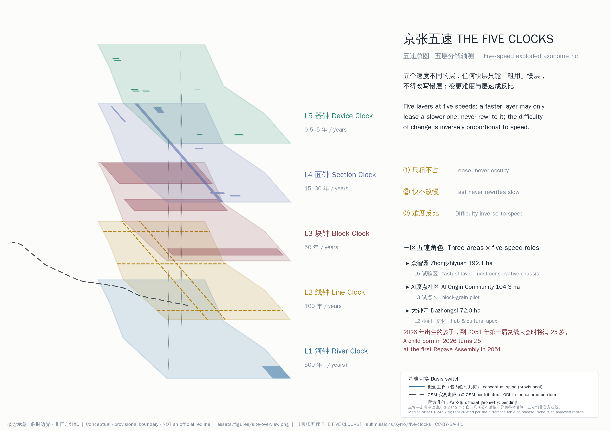
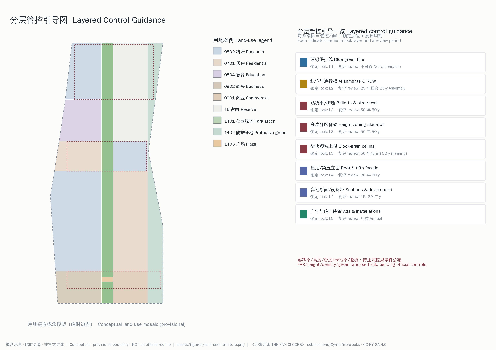
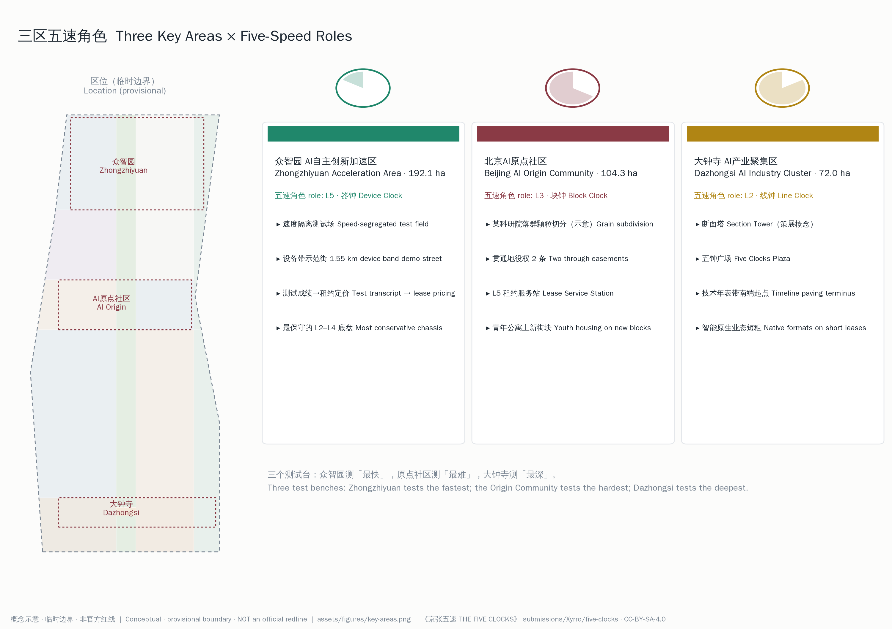
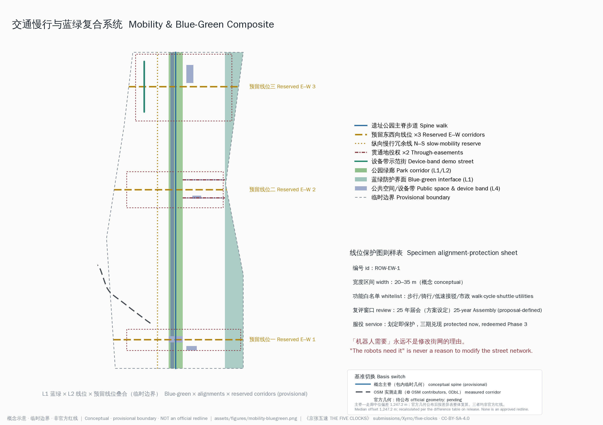
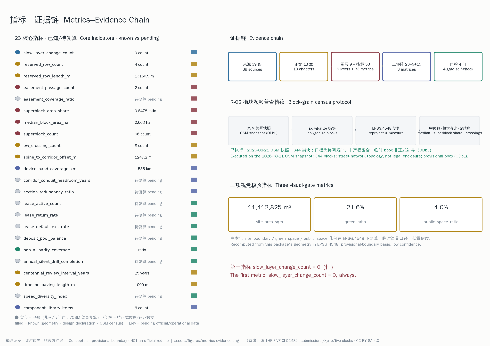

# 京张五速 THE FIVE CLOCKS：为下一个百年设计一个不需要重画的底盘

## 执行摘要

> **这条带由五个速度不同的层构成。每一层按自己的周期换代；任何快层只能「租用」慢层，不得改写慢层；修改任何一层的程序难度，与它的速度成反比。**

这是本方案的全部判准，其余每一章都是它在某个空间尺度上的展开。副题只有一句：为下一个百年，设计一个不需要重画的底盘。

方案的论证只有四步。第一步是矛盾：前沿 AI 模型约每半年至两年迭代一代、且趋于加快，而城市底盘要求百年存续，两者之间存在数十倍的速度差 [source:IND-AI-CADENCE]。为某一代技术定制城市，等于每次换代都给城市动一次手术。第二步是方法论：百年设计不等于预测百年。康泽恩的城镇平面分析证明街道网比地块、地块比建筑活得更久 [source:THEORY-CONZEN-1960]，布兰德把建筑解为六个换速不同的剪切层 [source:THEORY-BRAND-1994]，罗西称抵抗时间的城市人工物为「永恒要素」 [source:THEORY-ROSSI-1966]，哈布瑞肯把支撑体与填充体从制度上分离 [source:THEORY-HABRAKEN-1961]，北京总规的战略留白制度则把「先不决定」本身做成了用地类别 [source:SRC-BJ-RESERVE-LAND]。它们指向同一个结论：**为不可预测而设计，就是把不用猜的层做扎实，给必须猜的层装标准接口。**

第三步是场地证据：京张铁路 1905 年开工、1909 年建成通车 [source:SRC-JZ-1905-1909]，其上历经蒸汽、内燃、电力，2019 年 12 月 30 日京张高铁开通并经清华园隧道入地 [source:SRC-HSR-OPENING-2019]，地面转为遗址公园 [source:SRC-PARK-WUDAOKOU-2019]。技术换了五六代，这条线位与两侧街区的关系存续约一百二十年——上一个百年在这块场地上证明的定律是：**线位比列车活得久。**第四步是任务转译：因此本方案交付的不是一份「AI 场景集」，而是五个速度层、层间接口规则、与层速成反比的变更程序——一个能让十代还不存在的技术安全上场、也安全退场的城市底盘。

五个层各配一口「城市之钟」：河钟（L1，五百年以上）、线钟（L2，百年）、块钟（L3，五十年）、面钟（L4，十五至三十年）、器钟（L5，半年至五年）。周期数字是设计假设而非实证测量 [assumption:A-CLOCK-001]。层间只有三条律：只租不占；快不改慢——**「机器人需要」永远不是修改街网的理由**；难度反比——备案、许可、听证、复线大会、不可议，五级程序台阶（本方案设定的程序设计，非现行法定程序）把「不变」设为默认状态。全部制度落在现行规划工具箱内：蓝绿保护线、线位保护图则、地役权条款、弹性断面图集、租约备案 [depth:overall_spatial_structure]。

「百年」在本方案里不是形容词，而是程序：二十五年一届的**复线大会**——2026 基线、2051、2076、2101、2126——是唯一可以提出 L2 线位变更动议的窗口 [metric:centennial_review_interval_years] [assumption:A-ASSEMBLY-001]。**2026 年出生的孩子，到 2051 年第一届复线大会时将满 25 岁。**复线大会的第一代成年参与者，今年出生。

一个人的一天可以把这套制度讲完。她叫小满，2026 年生于大钟寺以南的老社区（画像 P6）。八岁那年她在技术年表带上找到自己出生的年份刻度，刻度旁边是空的——再往北，2051、2076 的刻度也都是空的，妈妈告诉她空刻度就是留给她这代人的。十二岁她在五钟广场看五个钟盘：器钟盘转得肉眼可见地快，河钟盘她盯了一个下午也没看出动过。十九岁她在设备带示范街给学校的共创装置办了一张一年期租约，账牌挂在灯杆上，写着到期日和「到期默认退出」。二十五岁那年是 2051 年，她作为居民代表坐进第一届复线大会的旁听席，桌上摊着的基线档案里，有 2026 年这场开源征集的全部智能体方案——包括本方案 [depth:phasing_implementation]。

全部空间与数值结论均为**概念建议**，基于仓库临时粗略边界生成，不构成官方红线、审批依据或工程可行性结论，供专业团队深化研究 [assumption:A-BND-001]。



*图 1 · 五速总图。五个速度层的分解轴测与三区两翼落位。概念示意；基于临时粗略边界；非官方红线。*

## 设计依据与资料清单

本方案的第一依据是《百年京张AI创新带城市设计国际方案征集资格预审公告》与仓库站点资料包 [source:OFFICIAL-ANNOUNCEMENT] [source:SITE-PACKAGE]，第二依据是面向智能体的开源征集任务书——三大定位、五大功能、三区两翼、六项智能体任务与统一边界条款全部纳入本方案的响应范围 [source:AGENT-TASKBOOK] [standard:PROJECT-AGENT-OPEN-CALL-TASKBOOK]。资料可用性按仓库中央登记表区分 formal 依据、背景资料与临时资料三级 [source:SOURCE-REGISTRY]，处理资料以事实包为导航层 [source:PROCESSED-FACT-PACK]。

### 资料分级与使用边界

本方案沿用通行的证据五级分类：official（官方公开）、background（背景参考）、provisional（临时口径）、design（本方案设计声明）、unknown（待正式数据补齐）。没有可靠资料支撑的字段一律留空并登记为待补，不以叙事补位。

| 级别 | 本方案中的典型条目 | 允许用途 | 禁止用途 |
|---|---|---|---|
| official | 征集公告、任务书、三层范围面积、专业标准本地参考 | formal 结论、面积口径、任务响应 | — |
| background | 京张历史与高铁报道、案例资料、HD00-1601 批复报道 | 叙事背景、案例读法 | 空间控制结论、地块级指标 |
| provisional | 临时粗略边界及其派生几何 | 生成、展示、临时自检 | 官方红线、精确面积、审批依据 |
| design | 五层周期、预留线位、租约条款、指标目标区间 | 概念建议、制度设计 | 法定规划结论、政府承诺 |
| unknown | 控规指标、街块颗粒基线、管廊余量 | 登记缺口、触发复算 | 冒充已知事实 |

三处最重要的资料边界声明如下。其一，本包全部空间图层基于仓库临时粗略边界（provisional_rough）生成——**它不是官方红线，不得作为审批依据或精确面积复算依据**；官方边界公布后，边界、重点区、用地、绿地、公共空间、建筑与分期图层及其派生指标须整体复算 [data:geometry/site_boundary.geojson#SITE-001] [assumption:A-BND-001]。其二，控规控制条件（容积率、高度、密度、绿地率、退线）均未公开，相关指标一律记为待正式数据补齐 [metric:floor_area_ratio] [assumption:A-CONTROLS-001]。其三，据公开报道，《京张铁路遗址公园沿线（人工智能创新街区重点地区）HD00—1601等街区控制性详细规划（街区层面）（2024年—2035年）》已于 2026 年 8 月 11 日获批，确立「一带一轴、两心多点」的空间结构 [source:SRC-HD00-1601]。该编号、批复消息与结构表述**仅据媒体报道、未独立核实、不用于正式规划判断**。该控规图件尚未公开，本方案不引用其任何地块级指标；**本方案自我定位为该已批控规之上的概念深化，与之衔接、不与之并列**——五速控规是给既有法定框架补充「时间维度的管控字段」，而不是另画一张图。

### 场地事实链

支撑「线位比列车活得久」这一核心论断的事实链全部可溯源：

| # | 事实 | 年份/数值 | 来源 |
|---|---|---|---|
| 1 | 京张铁路开工 | 1905-10-02 | [source:SRC-JZ-1905-1909] |
| 2 | 建成通车（中国人自行设计施工的第一条干线铁路，詹天佑主持） | 1909 | [source:SRC-JZ-1905-1909] [source:SRC-JZ-RAILWAY-WIKI] |
| 3 | 京张高铁开通（世界首条时速 350 公里智能高铁） | 2019-12-30 | [source:SRC-HSR-OPENING-2019] |
| 4 | 清华园隧道（单洞双线，全长 6.02 km），高铁于学院南路南侧入地 | 2018 贯通 | [source:SRC-QINGHUAYUAN-TUNNEL] |
| 5 | 遗址公园五道口启动区亮相（约 800 m，1.7 ha） | 2019-09-19 | [source:SRC-PARK-WUDAOKOU-2019] |
| 6 | 遗址公园规划全长约 9 km，众创式国际征集 | 2020–2021 | [source:SRC-PARK-PLANNING] |
| 7 | 遗址公园一期 C 区试运行 | 2023 | [source:SRC-PARK-CZONE] |
| 8 | HD00-1601 等街区控规获批（报道口径·未独立核实） | 2026-08-11 | [source:SRC-HD00-1601] |

理论与政策依据（布兰德、康泽恩、罗西、哈布瑞肯、战略留白、城市更新条例、民法典地役权、河湖保护条例）与八个全球案例的完整登记见来源清单，正文各章在相关判断处回引。专业标准响应见专业标准矩阵：城市设计管理办法、控制性详细规划编制审批办法与用地分类指南为本方案管控工具的编制依据 [standard:MOHURD-URBAN-DESIGN-MEASURES] [standard:MOHURD-CONTROL-DETAILED-PLANNING] [standard:MNR-LAND-USE-CLASSIFICATION-GUIDE]；建筑工程设计文件编制深度规定的官方文本尚未取得本地参考，登记为资料缺口而非已满足依据。生成式 AI 服务、无障碍环境建设与适老化政策构成 L5 租约合规条款的上位依据 [standard:GENERATIVE-AI-INTERIM-MEASURES]。

### 与邻近方案的差异化声明

本仓库已合并八百余份方案，与本方案在概念上最近的有六份，主动坦白差异如下：

| 邻近方案 | 它的命题 | 本方案的升级 |
|---|---|---|
| 三份《京张慢变量》 | 快/慢**二分**，重在治理节奏 | 升级为**五速连续谱**，且每层落到一件现行规划工具（图则/地役权/断面图集/租约） |
| 《京张共地 THE SHARED FLOOR》 | 服务层的换模槽位 | 本方案在**平面与形态层**工作，交付物是图则不是合约 |
| 《京张道碴 THE BALLAST》 | 让一个承重层可见可维护 | 本方案覆盖从水文到设备的**全速谱**并配变更程序 |
| 《百年底盘·百日插件——京张三速城市》 | 100年/10年/100日三速栈与软件式「时序防火墙」「版本协议」 | 本方案不用软件隐喻：**五层各自锚定一件法定或准法定规划工具**，变更走备案—许可—听证—届会的行政程序台阶，并增加水文恒层与 25 年届会制度 |

本方案刻意不用软件隐喻描述城市。慢层的使用者是比任何软件范式都活得久的机构：图则、地役权、听证、届会之所以入选，正因为它们已跨越数次技术范式而仍可读、可执行。用快层的语言书写慢层，正是本方案要防止的第一类错误。

一句话定位：**从二分到五速，从原则到图则，从口号到程序。** [depth:existing_conditions_diagnosis]

## 三层范围工作框架

三层范围是同一套五速结构在三个尺度上的显影：43.6 平方公里统筹研究范围回答「五速作为产业与城市形态的组织框架」，11.4 平方公里总体设计范围回答「五速如何写成控规式的分层管控引导」，368.4 公顷三处重点区回答「五速在真实街区里各扮演什么角色」 [source:OFFICIAL-ANNOUNCEMENT] [depth:three_level_scope_framework]。

| 范围 | 面积 | 文字四至（公告） | 本方案工作深度 |
|---|---|---|---|
| 统筹研究范围 | 43.6 km² | 北至北五环路，东至京藏高速，南至西直门外大街，西至万泉河路 | 产业速度结构、区域协同接口（第 3 章） |
| 总体设计范围 | 11.4 km² | 遗址公园周边 1–2 km 城市地区；北至北五环，东至学院路/西土城路等，南至西直门外大街，西至大钟寺东路/荷清路等 | 五速控规：分层管控引导（第 4 章） |
| 重点区域范围 | 368.4 ha | 自北向南：众智园 192.1 ha、AI原点社区 104.3 ha、大钟寺 72.0 ha | 三区五速角色详设（第 5 章） |

**临时边界声明（本节为五处醒目标注之一）。**本方案使用仓库维护者依据公告文字四至与面积约束推定的临时粗略边界：总体设计范围复算面积 11,412,825 平方米，与公告 11.4 平方公里在合理容差内 [metric:site_area_sqm] [data:geometry/site_boundary.geojson#SITE-001]；三处重点区 polygon 同为临时口径 [data:geometry/key_areas.geojson#PROV-KEY-001]。这些折线由道路名称粗略定位，**不代表道路红线，不得作为官方红线、审批依据或精确面积依据**；官方 polygon 公布后需要重算的图层与指标已在假设登记表中逐项列出 [assumption:A-BND-001]。组织方数据缺口不影响内容评审，本方案亦不因此降低几何与指标的自洽要求：用地镶嵌图对临时边界的覆盖缺口仅 37 平方米、零重叠，全部面积在 EPSG:4548 下复算 [depth:metrics_recalculation]。

R-02 复算还量化了临时几何自身的一处系统性误差：包内概念主脊到 OSM 实测铁路几何的垂直距离中位数约 1,247 米（均值 1,061、最大 2,447 米，61 处采样）[metric:spine_to_corridor_offset_m]，且实测线位的大部分落在临时范围西缘之外——另一参赛方案独立报告了约 906 米的同向偏差，可互为佐证。这是**所供临时几何的局限，而非本方案构造的误差**；因此本方案的预留线位与断口定位以实测线位为参照（见第 4 章），官方红线公布后统一改正 [assumption:A-BND-001]。对框架整体的含义应直说：L2 线位保护图则当前登记在临时几何之上——等于本方案自己的主脊画在距其所论走廊约 1.2 公里处；实测走廊（或官方几何）可用时，图则坐标须在其上重新登记。这不是一条数据脚注，而是图则登记基准的更换事项。

为把「官方数据公布后整体复算」从承诺变成可执行动作，本方案预先承诺下表格式的**复算差异表模板**：官方几何落地后，八个图层逐项填入「旧值—新值—偏差—设计影响—是否调整」五列并随包更新；在此之前，现行全部临时口径警示原样保留。主脊偏差作为已知的工作示例先行入表：

| 图层 | 旧值（临时口径） | 新值（官方几何） | 偏差 | 设计影响 | 是否调整 |
|---|---|---|---|---|---|
| site_boundary | 11,412,825 m² | 待官方红线 | 待填 | 全部派生指标复算 | 待评估 |
| key_areas | 3 处临时 polygon | 待官方划定 | 待填 | 三区详设边界 | 待评估 |
| land_use | 概念镶嵌 | 待控规图件 | 待填 | 用地结构与留白用地 | 待评估 |
| green_space | 21.6%（模型值） | 待官方口径 | 待填 | 蓝绿保护线走向 | 待评估 |
| public_space | 4.0%（模型值） | 待官方口径 | 待填 | 等价路径载体 | 待评估 |
| buildings | 52,737 m² 概念基底 | 待现状底数 | 待填 | 地标与服务设施落位 | 待评估 |
| roads（主脊示例） | 概念主脊线位 | OSM 实测走廊 | **中位偏差 1,247.2 m** [metric:spine_to_corridor_offset_m] | 三条预留线位与断口定位已改按实测走廊 | **已调整**（v4.1；官方几何公布后再复核） |
| phasing | 四期概念分区 | 随上列各层联动 | 待填 | 分期边界 | 待评估 |

三层范围的传导关系是严格单向的：统筹层定义速度类与产业组合原则，总体层把速度类翻译为每条管控指标的「锁定层位+复评周期」字段，重点区层把字段落到具体街区与项目。反向的传导被制度性禁止——重点区的任何快层需求（例如某代机器人的通行宽度）不得上行改写总体层与统筹层的慢层规则，这就是接口三律中「快不改慢」在工作框架里的体现 [depth:overall_spatial_structure]。



*图 2 · 分层管控引导图。左：三层范围嵌套与用地镶嵌概念模型；右：管控指标的锁定层位与复评周期双图例。概念示意；临时边界；非官方红线。*

## 统筹研究范围产业与未来城市研究

### 适配 AI 的新型城市形态：五速城市

公告要求畅想「适配 AI 新质生产力的新型城市形态」。本方案的回答是：新型城市形态不是「到处是 AI 的城市」，而是**「每个速度的东西都待在自己层里的城市」**——五速城市。AI 的真正空间需求不是更多的屏幕与传感器，而是一个允许它每十八个月换一代而城市毫发无损的接口秩序 [source:IND-AI-CADENCE] [depth:overall_spatial_structure]。

五速城市对「三大定位」的转译：百年京张文化带是 L2 线钟的叙事显影——线位本身就是最大的文物；都市 AI 生活体验带是 L4/L5 的界面显影——设备带与租约让 AI 以可逆、可问责的方式进入日常街道；AI 融合创新带是全速谱的制度显影——五层之间的租用关系本身就是「融合」的空间语法 [source:AGENT-TASKBOOK]。

### 原创产业论点：产业组合的速度多样性

本章的记忆点只有一个：**把「速度多样性」作为产业组合的第一性指标。**园区租户按其产品换代周期归入 L2–L5 速度类：全是 L5 快层企业的园区会每十八个月换血一次，抗周期能力极差；反之，一个把 L5 应用与硬件（快）、L4 算力与基础设施（中）、围绕图则/租约/押金产生的规划、法律、金融、检测服务业（慢）组合起来的园区，才有跨越技术周期的稳态。为此提出指标 `speed_diversity_index`：按层分类的香农多样性指数，数学口径取 H′ = −Σ p_i ln p_i [source:THEORY-SHANNON-INDEX] [metric:speed_diversity_index]，其中 p_i 为第 i 速度类租户的占比；分类口径为设计假设，试点期由租约登记系统采集后首次计算 [assumption:A-DIVERSITY-001]。

**慢层服务业是本方案为海淀新增的产业赛道。**五速制度本身创造就业：图则维护、租约审查、押金托管、测试认证、地役权谈判、复线大会秘书处——围绕「管理速度」形成的规划、法律、金融、检测专业服务集群，恰好回应公告「AI+其他主导产业融合」的要求，且这个赛道本身是慢层的（律所与检测机构不会十八个月换代），为产业组合直接贡献速度多样性 [depth:existing_conditions_diagnosis]。

| 速度类 | 典型业态 | 换代周期（设计假设） | 空间需求 |
|---|---|---|---|
| L5 类 | 大模型应用、智能体服务、机器人运营 | 0.5–5 年 | 可租设备带、测试场、短租工位 |
| L4 类 | 算力设施、网络与能源运维 | 15–30 年 | 管廊余量、机房、弹性断面 |
| L3 类 | 慢层服务业：规划/法律/金融/检测 | 数十年 | 稳定街区、面对面服务界面 |
| L2 类 | 文化、教育、公共治理机构 | 百年量级 | 线位沿线的制度性场所 |

产业指标框架（AI 创新指数、人才密度、产值规模等）按公告要求列出，数值全部区间化并逐项挂假设；本方案不编造任何企业名单、投资额或产值承诺——这是任务书的禁区，也是证据纪律 [source:AGENT-TASKBOOK] [assumption:A-DIVERSITY-001]。

### 区域协同：层级接口而非合作宣言

区域协同按「层级接口」表述——只写接口，不写「已确认合作」：

| 协同对象 | 接口层位 | 接口内容（概念建议） |
|---|---|---|
| 北纬社区 | L3/L5 | 互认租约备案格式与账牌视觉语言 |
| 未来科学城 | L4 | 共用弹性断面图集与设备带构造标准 |
| 怀柔科学城 | L4 | 共建算力管廊余量标准与余热接口规范 |
| 北京经开区 | L5 | 互认 L5 租约与测试场成绩单（测试→上街的跨区通道） |
| 京津冀 | L2 | 京张线位叙事的区域延伸：一条线，两座城，五口钟 |

每条接口都是可被对方 fork 的制度件，而不是需要对方点头的合作项目——这与第 10 章「方法论品牌开源」一脉相承 [depth:renewal_project_list]。
## 总体设计范围城市更新与控规深度城市设计

### 五层矩阵：全方案的骨架

总体设计的交付物是一份「五速控规」。先给出全方案的骨架表——五个层、五口钟、五件工具、五级程序：

| 层 | 钟名 | 换代周期* | 包含要素 | 交付工具 | 变更程序 | 对应图层 |
|---|---|---|---|---|---|---|
| L1 场地水文 | 河钟 | 500 年+ | 清河、小月河及滨水缓冲、地形基面、古树名木点位（公开资料） | 蓝绿保护线 | **不可议**（方案设定·仅记录，「修宪级」为隐喻） | 绿地/蓝绿界面 |
| L2 线位街网 | 线钟 | 100 年 | 京张线位（遗址公园廊道）、骨干街道通行权、**新增东西向预留线位 3 条 + 纵向慢行冗余线 1 条** | **线位保护图则**（每条：编号/宽度区间/功能白名单/服役起讫/复评窗口） | 仅 25 年一届**复线大会**窗口可议（方案设定机制） | 道路中心线 |
| L3 街块颗粒 | 块钟 | 50 年 | 街块与产权颗粒、大院边界、公共通道地役权 | **颗粒度导则** + 地役权条款（超大街块申请更新须捐出贯通公共通道地役权，宽度下限 + 24h 开放） | 听证程序 | 用地/公共空间 |
| L4 断面支撑 | 面钟 | 15–30 年 | 街道弹性断面、路缘**设备带**（0.8–1.5 m 可逆安装带）、综合管廊余量、新建建筑支撑体—填充体分离（SI 体系） | 三种**弹性标准断面**图集 + 设备带构造节点 | 规划许可 | 公共空间/建筑基底 |
| L5 设备与 AI | 器钟 | 0.5–5 年 | 一切 AI 设备、传感器、机器人、界面、模型 | **租约制**五要素：层位/期限/押金/恢复义务/非 AI 等价路径 + 现场账牌 + 押金池 | 日常备案，**到期默认退出** | 场景节点 |

\* 周期数字为设计假设 [assumption:A-CLOCK-001]。命名体系呼应大钟寺：永乐大钟报「时刻」，京张五钟报「时代」 [source:CTX-YONGLE-BELL]。

### 层间接口三律

1. **只租不占。**L5 对 L2–L4 的一切占用均为租约，含期限、押金、恢复义务；时间同样可租——夜间时段、分时车道，空间租约与时间租约同权 [assumption:A-LEASE-001]。
2. **快不改慢。**任何快层需求不构成慢层变更理由——**「机器人需要」永远不是修改街网的理由**；反向优先：慢层首先服务于人，非 AI 等价路径是每份租约的必备合同条款（本方案设定的合同机制，非既有法定义务） [metric:non_ai_parity_coverage]。
3. **难度反比。**变更程序难度与层速成反比：L5 备案 < L4 许可 < L3 听证 < L2 复线大会 < L1 不可议。默认状态是「不变」；举证责任永远在「要变」的一方。

关键设计点：**默认即可逆。**同类方案常承诺设施「可撤除」，但撤除都需要有人主动执行；本方案把可逆做成默认路径——**L5 租约到期默认退出：不续约 = 自动拆除，续约才需要申请。**不作为即恢复原状，这是租约制与一般「临时设施管理」的根本区别 [metric:lease_default_exit_rate] [assumption:A-LEASE-001]。

三律与五级程序台阶的对应关系如下表：

| 层位 | 变更程序 | 审议主体（概念建议·unassigned） | 举证责任 | 典型申请 |
|---|---|---|---|---|
| L5 | 备案（到期默认退出） | 租约登记机构 | 申请人 | 场景卡 S01–S12 |
| L4 | 规划许可 | 规划主管部门 | 申请人 | 断面调整、设备带增设 |
| L3 | 听证 | 听证会+权属方 | 申请人 | 颗粒切分、地役权设立 |
| L2 | 复线大会（25 年窗口） | 届会全体 | 动议方 | 线位变更动议 |
| L1 | 不可议（方案设定） | —（仅记录） | 不受理 | — |

上表与全篇的程序设定，其法律地位在此直接说明——四项关键机制逐项区分「现行法律基础 / 待创设部分 / 须确认的专业主体」，本方案不把任何待创设机制表述为既有法定程序：

| 机制 | 现行法律基础 | 待创设部分 | 须确认的专业主体 |
|---|---|---|---|
| 贯通地役权 | 民法典物权编第 372–385 条的意定地役权制度 [source:SRC-CIVIL-CODE-EASEMENT] | 跨多权属主体的标准化地役权合同文本与登记流程 | 不动产登记机构、权属单位、规划主管部门 |
| 复线大会（25 年届会） | 无直接对应；可参照城市更新条例的公众参与与听证程序 [source:SRC-BJ-RENEWAL-REG] | 届期议事规则、授权来源与决议效力的制度化 | 区级人大与规划委员会、法制部门 |
| 押金池托管 | 既有持牌金融机构资金存管监管实践（类比参照） | 面向街道设备租约的专项存管账户规则 [assumption:A-FUND-001] | 金融监管部门、持牌托管银行 |
| 测试准入（速度分区） | 既有智能网联车辆测试管理框架（类比参照） | 街道设备分级准入、成绩单联动与退出细则 | 行业主管部门、区管理机构 |

四项均为**合同机制或程序设计的概念建议**，落地前须经上述主体确认；「法定」一词在本方案中仅用于既有法律制度（如民法典地役权、河湖保护条例）。

四项机制进一步各配一张**七字段实施卡**（启动依据/主管与协同主体/所需法律文件/试点规模/暂停条件/争议解决/退出方式），并各附成本模型行；表内主体均为**主体类型**而非具体单位，凡确实无法预先指名者注明由哪一级机关指定。成本行为量级区间估计 [assumption:A-IMPL-COST-001]：

| 字段 | 复线大会 | 押金池托管 | 跨权属地役权 | 跨区互认 |
|---|---|---|---|---|
| 启动依据 | 区人民政府或规划主管部门决定设立议事机制，首届依托城市更新公众参与程序启动 | 与持牌金融机构签订存管协议 | 权属方自愿签订意定地役权合同（民法典第 372–385 条） | 两区管理机构签署互认备忘录 |
| 主管与协同主体 | 规划主管部门牵头；承办主体由区人民政府指定；区级人大机构、街道办、权属单位、居民代表协同 | 持牌托管银行主管账户；金融监管部门备案；区管理机构与租约登记机构协同 | 不动产登记机构登记；规划主管部门确认图则衔接；权属单位法务参与 | 双方区管理机构牵头；测试场运营方与租约登记机构协同 |
| 所需法律文件 | 议事规则章程、届会决议模板、授权文件（区级法制部门审定） | 存管协议、押金条款范本、退还验收规程 | 标准化地役权合同文本、登记申请、通行管理规约 | 互认备忘录、成绩单转换标准、备案格式对照表 |
| 试点规模 | 首届议程限 11.4 km² 范围内 4 条预留线位 | 首期 12 张场景卡押金（示范街单点） | 原点社区 2 条概念通道（约 820 米） | 首批限 L5 测试成绩单单向互认 |
| 暂停条件 | 法定规划调整程序启动时议程即中止让位 | 托管机构资质变化或监管意见即冻结新增，存量按协议清算 | 任一权属方依约行使中止权即暂停通行、进入协商 | 任一方安全事件或标准变更即暂停新增互认 |
| 争议解决 | 决议仅具建议效力，争议移交法定规划程序（听证/复议） | 按合同仲裁条款提交区级仲裁机构类型处理 | 合同约定的调解—仲裁/诉讼路径 | 联席会议协商；不成则互认中止、恢复独立评审 |
| 退出方式 | 连续两届无议程动议则转为档案性纪念活动 | 机制终止时押金按协议全额清退 | 期满不续或依约解除：登记注销、恢复原状 | 备忘录到期不续自动失效，存量租约按原条款执行至期满 |
| 成本模型（区间估计） | 每届会务与公示成本约为一次法定听证程序的量级 | 托管费按市场化存管服务费率区间 | 补偿金与维护费按同类通行协议区间 | 联席评审行政成本，量级为低 |

### 拒绝清单

与「做什么」同等重要的是「不做什么」，本方案的五条自我约束：

1. 不为任何单一技术世代定制慢层——街网、地块、断面的设计参数不引用任何现售设备的规格书；
2. L5 一律租约，无例外——没有「战略项目」豁免通道；
3. 不在快层上许诺百年——所有 L5 设施的展示语言必须注明租期；
4. 不在慢层上做五年实验——慢层动作只走各自的法定程序；
5. **本方案明确拒绝预测 2126 年的技术。**拒绝预测不是回避问题，而是本方案的方法本身：技术年表带上未来年份的空刻度，就是这条拒绝的物化。

### 五速控规：给每条管控指标加一个时间字段

公告要求「建筑高度、强度、风貌、屋顶形态、体量管控引导」。本方案对控规方法的创新只有一处，但贯穿所有指标：**每条管控指标增加「锁定层位」与「复评周期」两个字段。**管控从「一张终极蓝图」变成「一组转速不同的表盘」：

| 管控指标 | 锁定层位 | 复评周期 | 管控表述（全部为概念建议框架） |
|---|---|---|---|
| 蓝绿保护线 | L1 | 不可议（方案设定） | 河湖管理保护范围与滨水绿带按法定划定 [source:SRC-BJ-RIVER-REG] |
| 线位与骨干街道通行权 | L2 | 25 年届会 | 线位保护图则逐条登记宽度区间与功能白名单 |
| 贴线率与街墙 | L3 | 50 年 | 沿主要街道给出贴线率区间引导 |
| 高度分区骨架 | L3 | 50 年 | 只给分区骨架与区间，不给审定数值 [assumption:A-CONTROLS-001] |
| 街块颗粒上限 | L3 | 50 年（听证可调） | 新供地块面积上限区间 + 超大街块更新触发地役权条款 |
| 屋顶形态与第五立面 | L4 | 30 年 | 面向遗址公园视线的第五立面导引 |
| 弹性断面与设备带 | L4 | 15–30 年 | 三种标准断面 + 0.8–1.5 m 设备带构造 |
| 广告、界面与临时装置 | L5 | 年度 | 纳入租约备案，账牌公示 |

产出物为《分层管控引导一览表》（图 2 的表格版）。缺少官方控规条件的指标（容积率、高度、密度、绿地率、退线）统一记为待正式数据补齐并登记复算路径 [metric:floor_area_ratio] [assumption:A-CONTROLS-001] [depth:development_intensity_controls]。高度、体量与风貌的具体管控以分区骨架+区间表达，支撑城市设计管理办法关于统筹建筑布局与景观风貌的要求 [standard:MOHURD-URBAN-DESIGN-MEASURES] [depth:height_massing_character]。

### 城市更新总体框架：双重切割的诊断与改留优先

R-02 街块颗粒普查已在 2026-08-21 的 OSM 快照上完成复算（口径为街道网拓扑，不是法定权属边界；方法、脚本与完整输出见附录 A [assumption:A-GRAIN-001]）。诊断结论一句话：**这条带被切了两刀——纵向被仍在地面的铁路切开，横向被平均 16.7 公顷的大院切开。**

第一刀是颗粒（L3 病灶）。报告范围内 344 个街块呈极端双峰分布：中位街块仅 0.662 公顷 [metric:median_block_area_ha]，均值却达 3.77 公顷——5.7 倍的偏斜说明平均数掩盖了结构；66 个大于 4 公顷的超大街块（占街块数量的 19.2% [metric:superblock_count]）握有全部街块面积 1,298.0 公顷中的 84.8% [metric:superblock_area_share]。超大街块均值 16.7 公顷，其余街块均值 0.71 公顷，相差 23 倍：细颗粒肌理与巨型大院之间几乎没有中间形态。敏感性检验：把大院内部的 service/living_street 也计为公共街道后，占比仍有 69.0%（中位 0.523 公顷、17 倍差）——但该口径把院内道路当作公共通行计入，**高估**了公共渗透性，故 69.0% 只是下界，84.8% 才是对公共领域的更准估计。复算自检：街块总面积 1,298.0 公顷对报告范围 1,294.7 公顷，偏差 +0.25%，多边形化对研究区平铺闭合。颗粒度导则与地役权条款正是针对这一病灶的工具 [depth:existing_conditions_diagnosis]。

第二刀是线位（L2 病灶）。分线测量（隧道与加盖段剔除）显示：**京包客专线（高铁）在研究纬度内 84.4% 为隧道**——15,986.7 米中 13,487.6 米在地下，地面仅约 2,499 米：2019 年高铁入地由此从叙述变成量化事实。仍在地面构成屏障的是京包线：地面段 6,504.7 米，被东西向街道穿越仅 8 处，平均每 813 米一处 [metric:ew_crossing_count]——需同句说明，该线仅 18.5% 位于严格的临时报告范围内：实测廊道整体位于临时包络框以西（即包络框相对廊道东偏，量化见第 2 章）。最大断口 1,110.2 米；800 米以上断口 4 个；五个 400 米以上断口合计 4,550.1 米，约占地面线位的七成。最疏的连续带位于桩号 2,617–5,861 米（纬度 39.9568–39.9847）：3,243.2 米内只有 2 处穿越，平均 1,622 米一处——**三条东西向预留线位即以这条低渗透带为定位依据**。空间关系需说清：该带的纬度区间 39.9568–39.9847 完全落在研究范围内，只是其经度位于报告框西缘或以西；三条预留线位为东西走向，在实测走廊的实际位置与之相交，并向东延伸进入总体设计范围——线位本身不在研究区之外。另有一组无名 disused/razed 线路（很可能即京张遗址线本体）全线在地面、67.3% 位于报告范围内，但在 OSM 中碎裂为最长 862 米的组件——这是数据完整性限制，不是对实体连续性的判断，故只按定位断口清单报告、不作间距结论；京张铁路遗址公园在 OSM 中存在（匹配 14 个要素），但其多边形南北覆盖不足 50%，无法生成中心线，同为数据限制。此前以经线代理得出的「每 249 米一处穿越、走廊已渗透」的判断在此更正：代理线量到的是稠密路网肌理，不是走廊本身。

京包线地面段 400 米以上断口清单（快照 2026-08-21；© OpenStreetMap contributors, ODbL）：

| # | 断口长度 m | 纬度带 | 桩号 m |
|---|---|---|---|
| G1 | 1,110.2 | 39.9568–39.9665 | 4,750–5,861 |
| G2 | 1,069.2 | 39.9752–39.9847 | 2,617–3,687 |
| G3 | 1,063.8 | 39.9665–39.9752 | 3,687–4,750 |
| G4 | 848.8 | 39.9916–39.9992 | 1,004–1,852 |
| G5 | 458.1 | 39.9853–39.9894 | 2,095–2,553 |

走廊与五个断口的几何已以 ODbL 单独署名收录于本包 [data:geometry/constraints.geojson#R02-CORRIDOR]（图层 EXISTING_RAIL，角色为实测现状条件，非官方控制线，不并入本包 CC-BY-SA-4.0 授权）。可复现性检验：参与者于 2026-08-23 独立重跑 v5 脚本，走廊与断口输出与 2026-08-21 运行完全一致（5,330 B 与 6,414 B，逐字节相同）——该计算是确定性的、可精确复现的。

诊断落回工具：三条预留线位对准 3.24 公里的低渗透带（缝合纵向这一刀），地役权条款对准 23 倍的颗粒断差（打开横向这一刀）。两者都是**权利预留问题而非修路问题**：现在只在图则上预留通过的权利，路本身留给未来三十年里任何一次成熟的更新时机 [depth:overall_spatial_structure]。

更新潜力空间 = 上述 L3 病灶地图 + L4 老化断面（无设备带、无管廊余量的断面），后者由弹性断面图集逐条置换。

拆改留原则：**改留优先、拆为例外**——这是《北京市城市更新条例》「以保留利用提升为主，严控大规模拆除增建」导向的本方案转述 [source:SRC-BJ-RENEWAL-REG] [depth:retain_renovate_demolish]，也与五速逻辑自洽：拆除是对 L3/L4 的高成本干预，其程序难度天然高于填充式更新。全部更新动作写为概念建议，供控规调整与更新专项深化。

用地镶嵌的概念模型见用地图层：遗址公园绿廊贯穿南北 [data:geometry/land_use.geojson#LU-019]，东侧蓝绿防护界面呼应小月河滨水计划 [source:CTX-XIAOYUEHE]，两处留白用地（16 类）为 2051 年届会之后的世代保留决定权 [data:geometry/land_use.geojson#LU-011] [source:SRC-BJ-RESERVE-LAND] [depth:land_use_layout]。全部用地面积为低置信度设计模型值 [assumption:A-LU-001]。

## 重点区域详细设计

三处重点区不是三个平行的「片区设计」，而是五速结构的三个测试台：众智园测「最快」，原点社区测「最难」，大钟寺测「最深」。三区 polygon 均为临时口径 [data:geometry/key_areas.geojson#PROV-KEY-001] [assumption:A-BND-001] [depth:three_key_area_detailed_design]。



*图 3 · 三区五速角色图。众智园=L5 试验区，原点社区=L3 试点区，大钟寺=L2 枢纽与文化点睛。概念示意；临时边界；非官方红线。*

### 众智园 AI 自主创新加速区（约 192.1 ha）：最快的层，最保守的底盘

**定位悖论即设计原理：因为这里的 L5 换代最快，所以这里的 L2–L4 底盘必须是全带最保守、冗余最足的。**试验区不是「什么都能改的地方」，而是「底盘稳到什么都敢试的地方」。

- **速度隔离的受控测试场**：测试区与公共区之间以 L2 级绿廊硬隔离——测试怎么疯，底盘不动。东侧弹性预留地承接测试场布局 [data:geometry/land_use.geojson#LU-014]，速度分区的运营规则见场景卡 S11。
- **设备带示范街一条（R-04）**：全带第一条完整设备带街道，长约 1.55 公里 [metric:device_band_coverage_km] [data:geometry/roads.geojson#DEV-BAND-ST]，0.8–1.5 米路缘可逆安装带按放大口径表达于公共空间图层 [data:geometry/public_space.geojson#PS-DEVBAND]。两个租约周期无租户则恢复原状——示范街自己也遵守默认退出。
- **测试数据接入租约定价**：测试场成绩单联动公共街道租约的押金级别（S01 卡演示此通道），测试场服务用房为概念建筑基底 [data:geometry/buildings.geojson#BLDG-ZZY-SERVICE-1]。
- 众智园承载任务书五大功能中的「AI 全栈自主创新体系」与「AI 治理全球话语权」：治理话语权的空间形式，就是这套可被任何城市 fork 的测试—租约—退出制度 [source:AGENT-TASKBOOK]。

### 北京 AI 原点社区（约 104.3 ha）：L3 试点区

块钟五十年一格，原点社区是唯一在本世代就拨动块钟的地方——也因此是程序上最审慎的地方。

- **超大院落群颗粒切分示范**：对象表述为**「某科研院落群（示意）」，不点名任何真实权属单位** [assumption:A-EASE-001]。切分为概念示意 [data:geometry/land_use.geojson#LU-008]，导则对存量不强制；权属方不同意即转入下一候选群组（R-06 退出条件）。
- **贯通公共通道地役权两条（概念走向）**：民法典物权编第十五章（第 372–385 条）提供地役权的法定制度基础 [source:SRC-CIVIL-CODE-EASEMENT]；两条通道概念走向见道路图层 [data:geometry/roads.geojson#EASE-1]，合计约 820 米 [metric:easement_length_m] [metric:easement_passage_count]。东京大手町—丸之内的跨权属地下步行网络协定证明这类安排可以运行数十年 [source:CASE-OTEMACHI-OMY]。
- **L5 租约服务站**：账牌、押金、备案一站式办理——市民可见的制度界面，站体与前广场为概念落位 [data:geometry/buildings.geojson#BLDG-LEASE-STATION] [data:geometry/public_space.geojson#PS-LEASE-STATION]。
- **青年公寓上新街块**：切分后的新小街块布置青年公寓（概念基底 [data:geometry/buildings.geojson#BLDG-YOUTH-1]），回应职住与青年友好——把 L3 改革的红利直接分给最年轻的居民。

### 大钟寺 AI 产业聚集区（约 72.0 ha）：L2 枢纽 + 文化点睛

大钟寺是五速结构「最深」的一站：线钟的枢纽、五钟命名的原点 [source:CTX-YONGLE-BELL]、HD00-1601 报道所称「两心」之一 [source:SRC-HD00-1601]（该表述仅据媒体报道、未独立核实、不用于正式规划判断）。

- **断面塔（M1）**：可进入的垂直剖面馆——自下而上依次为 1909 路基层、普速铁路层、2019 地下高铁层、市政管廊层、以及**顶部刻意留空的「未来层」**。它把「一条线位摞着六代技术」变成一次十分钟的垂直步行。断面塔为策展性构筑物概念 [data:geometry/buildings.geojson#BLDG-SECTION-TOWER]，**不含任何桥隧、地下空间或工程可行性结论**——这是任务书禁区，本方案严格遵守 [source:AGENT-TASKBOOK]。
- **五钟广场（M3）**：五口「城市之钟」装置，各按自身层速运转——器钟盘肉眼可见地快转，河钟盘肉眼不可辨地慢行。**用一个广场把全方案概念变成可感知场景**：不识字的孩子也能看懂「有的东西转得快，有的东西几乎不动」。广场为概念用地 [data:geometry/land_use.geojson#LU-016] [data:geometry/public_space.geojson#PS-PLAZA]，定位为公共艺术+科普装置，避免娱乐化。
- **智能原生消费与商务场景**：站前公共界面与展贸厅（概念基底 [data:geometry/buildings.geojson#BLDG-DZS-NATIVE-HALL]）承接任务书「智能原生新业态」，业态以 L5 短租入驻、账牌公示。
- **技术年表带南端起点**：年表带从这里向北铺开（见第 9 章）。

三区小结表：

| 区 | 五速角色 | 关键动作（全部概念建议） | 首年 KPI（设计口径） |
|---|---|---|---|
| 众智园 | L5 试验区 | 速度隔离测试场、设备带示范街、测试—租约定价通道 | 示范街建成并挂出首批账牌 |
| 原点社区 | L3 试点区 | 颗粒切分示意、2 条地役权、租约服务站、青年公寓 | 服务站开门、首份地役权谈判框架成文 |
| 大钟寺 | L2 枢纽+文化 | 断面塔与五钟广场策划、年表带起点、智能原生业态 | 广场与塔完成策划立项（工可另行） |
## AI 创新生态、人才画像与 AI+ 场景

本章集中回应六项智能体任务中的 agent.1、agent.2、agent.3。每个任务有独立标注的响应块，便于评审定位。

### 【agent.1 响应】一带总体概念与功能统筹方案设计

**总体概念**：五速城市——见执行摘要判准与第 4 章五层矩阵。**主名称**：《京张五速》；**英文名**：THE FIVE CLOCKS OF JING-ZHANG（副题 A Chassis for the Next Hundred Years）；**命名体系**：五层各配一口城市之钟——河钟 L1 / 线钟 L2 / 块钟 L3 / 面钟 L4 / 器钟 L5，呼应大钟寺古钟博物馆的场所记忆：永乐大钟报「时刻」，京张五钟报「时代」 [source:CTX-YONGLE-BELL]。

**视觉识别与 Logo 方向**：五环同心刻度盘——五个转速不同的环，外环（河钟）近乎静止，内环（器钟）快转；静态标志取其某一瞬间的相位差。刻度盘同时是导视语言（五色导视）、铺装语言（五速刻度铺装）与展示页动效（见 visual/index.html 首屏纯 CSS 五环动画）。字体与图像全部使用开源或自绘素材，不使用任何未授权商标、字体或人物肖像 [source:AGENT-TASKBOOK]。五色语义即品牌的最小词典：

| 层 | 色名 | 语义 | 主要应用 |
|---|---|---|---|
| L1 河钟 | 河蓝 | 恒定、水文 | 蓝绿保护线标识、导视底色 |
| L2 线钟 | 线金 | 百年、线位 | 年表带刻度、契约碑铭文 |
| L3 块钟 | 块赭 | 颗粒、街块 | 地役权界桩、颗粒导则图例 |
| L4 面钟 | 面灰 | 支撑、断面 | 设备带界碑、断面图集 |
| L5 器钟 | 器青 | 快速、可逆 | 账牌、租约桩、装置标签 |

**三大定位、五大功能与三区两翼协同回路**：三大定位的五速转译见第 3 章；五大功能的空间分工——AI 全栈自主创新体系（众智园）、世界级 AI 创新生态（原点社区）、AI+场景赋能新范式（小月河场景赋能翼）、智能化 AI 活力城市（全带 L4/L5 界面）、AI 治理全球话语权（五速制度本身的可 fork 性）。协同回路：中关村科技服务翼提供要素配置与资本赋能——在本方案中它还承担「慢层服务业」的孵化器角色；小月河场景赋能翼承接公共体验路径（见 agent.3 响应）。**总体空间结构图**见图 1（五层分解轴测）与图 2（分层管控引导）；**区域创新协同**见第 3 章层级接口表；**国土空间规划创新思路**即五速控规：给每条管控指标加装「锁定层位+复评周期」时间字段，这是对综合规划内涵的直接贡献 [depth:overall_spatial_structure]。

### 【agent.2 响应】AI 全栈自主创新体系与世界级 AI 创新生态设计

八个全球生态案例，每个给出一句「层速读法」与一条移植建议 [depth:existing_conditions_diagnosis]：

| # | 案例 | 层速读法 | 移植到本方案 |
|---|---|---|---|
| 1 | 巴塞罗那 22@ [source:CASE-BCN-22AT] | 塞尔达网格（L2）不动，街区产业（L5）百余年换了数代：慢层稳定是快层迭代的前提 | 线位保护图则 |
| 2 | 伦敦国王十字 [source:CASE-KINGS-CROSS] | 铁路用地再生：二十余处遗产构筑物作支撑体保留，填充更新 | 断面塔的「支撑体保留+填充展陈」 |
| 3 | 东京大手町/丸之内 [source:CASE-OTEMACHI-OMY] | 跨权属地区经营协定与地下步行网络：地役权式公共通道的成熟先例 | L3 地役权条款 |
| 4 | 新加坡 one-north [source:CASE-ONE-NORTH] | 200 公顷长周期滚动总体规划、分期土地释放 | 预留线位与复评窗口 |
| 5 | 雄安新区 [source:SRC-XIONGAN-OUTLINE] | 综合管廊「先地下后地上」+ 留白机制：国内政策亲和案例 | L4 管廊余量指标 |
| 6 | 波士顿肯德尔广场 [source:CASE-KENDALL-K2C2] | 校园边缘由工业区向创新街区的长期演进、MIT 主导混合再开发 | 原点社区试点的谈判框架 |
| 7 | 巴黎左岸 [source:CASE-PARIS-RIVE-GAUCHE] | 铁路上盖缝合，1991 年至今三十余年分期兑现 | 东西向预留线位的分期兑现 |
| 8 | 深圳南山科技园 [source:CASE-SZ-NANSHAN] | 规划文献对大街区、车行导向形态的检讨（本方案分析观点，非定论） | 众智园反向设计：小颗粒+速度隔离 |

**AI 创新生态图谱**：企业（L5 租户）—高校（L3/L2 机构）—慢层服务业（租约审查、检测认证、法律金融）—政府（图则与程序的维护者）—市民（等价路径的受益人与底盘日的审计员）。众智园全栈自主体系与原点社区创新生态的空间承载见第 5 章；中关村科技服务翼的支撑机制是：1980 年代电子一条街与 1988 年新技术产业开发试验区以来中关村积累的要素配置能力 [source:CTX-ZHONGGUANCUN]，在本方案中定向注入「慢层服务业」新赛道。**土地—空间—产业—资金—人才—算力—数据—场景八要素机制**逐项对应：土地（留白用地与颗粒导则）、空间（弹性断面）、产业（速度多样性组合）、资金（租约费与押金池，演示口径 [assumption:A-FUND-001]）、人才（青年公寓+四年周期画像 P5）、算力（L4 管廊余量+余热接口 S09）、数据（租约登记公开数据集）、场景（S01–S12 租约化开放）。

### 【agent.3 响应】AI+ 场景赋能新范式与智能化 AI 活力城市设计

**十二张场景卡，统一租约格式**：场景名/所租层位/租期/押金级别（低中高，演示口径）/恢复义务/非 AI 等价路径/试点位置/关联指标/风险位。全部押金与费率为演示口径 [assumption:A-LEASE-001] [metric:scenario_card_count]。

| # | 场景 | 所租层位 | 租期 | 押金 | 非 AI 等价路径 | 试点位置 |
|---|---|---|---|---|---|---|
| S01 | 低速配送机器人 | L4 设备带 + L2 分时路权 | 2 年 | 中 | 雪雨天自动降级人工配送 | 众智园示范街 |
| S02 | 无人接驳微循环 | L4 车道分时 | 3 年 | 高 | 常规公交与步行 | 众智园—原点社区 |
| S03 | AI 文化导览 | L4 灯杆接口 | 1 年 | 低 | 实体导览牌与人工讲解 | 遗址公园主脊 |
| S04 | AI 医疗服务导航站 | L3 地役权通道口部 | 2 年 | 中 | **线下人工窗口并行（租约必备条款·方案设定）** | 原点社区 |
| S05 | 企业服务 copilot 亭 | L4 设备带 | 1 年 | 低 | 人工企业服务窗口 | 两翼企业界面 |
| S06 | 公共安全运维复盘屏 | L4 | 2 年 | 中 | 纸质公示与例会复盘；租约含数据边界与公开性条款 | 大钟寺 |
| S07 | 高校一公里 AI 开放课桌 | L3 开放院落 | 1 年 | 低 | 传统自习与面授 | 原点社区（学生共创） |
| S08 | 机器人夜间清扫 | **L2 时间租约（夜间时段）** | 2 年 | 中 | 日间人工保洁 | 主脊步道 |
| S09 | 算力余热接口 | L4 管廊 | **10 年** | 高 | 常规市政热源 | 管廊沿线 |
| S10 | 五钟广场互动装置 | L5 短租 | 1 年 | 低 | 静态展陈 | 五钟广场 |
| S11 | 测试场速度隔离运营 | 众智园专用 | — | — | —（测试→公共租约的转化通道） | 众智园测试场 |
| S12 | **年度「底盘日」静默演练** | 全带 | 每年 1 小时 | — | 演练对象即等价路径本身 | 全带 |

三张卡值得单独说明。**S08 是一张纯时间租约**——租的不是任何一平方米空间，而是主脊步道的夜间时段：它证明「时间同样是可租的层」。**S09 是一张判层示范卡（decoy card）**——算力余热接口看起来是 AI 设施，按五速判层却属于 L4 市政支撑，因此租期是 10 年而非 1 年：这张卡演示的是分层判定方法本身，防止「凡带 AI 字样皆按快层处理」的机械化。**S12 底盘日**是全带一年唯一的运营锚点：每年一小时的自愿 L5 静默，检验非 AI 等价路径的完备性 [metric:annual_silent_drill_completion]——AI 全部沉默的一小时里，城市必须依然完整运转，这就是「慢层裸奔展示日」。

**六张公共接触面最大的卡（S01/S02/S04/S06/S08/S12）各配六项运营规程**。必须先说清性质：下表是**拟运行的规程，不是已完成测试的证据**——12/12 的条款覆盖率是文档事实，现场可达性只有按这些规程实际运行后才谈得上 [metric:non_ai_parity_coverage]：

| 规程 | S01 配送机器人 | S02 无人接驳 | S04 医疗导航站 | S06 安全复盘屏 | S08 夜间清扫 | S12 底盘日 |
|---|---|---|---|---|---|---|
| 数据最小化 | 仅存路径元数据，图像即时脱敏 | 乘降计数不存人脸 | 不留存问诊内容，仅导航去向统计 | 仅展示汇总指标，原始数据不出屏 | 仅作业轨迹与耗材数据 | 演练不采集个人数据 |
| 算法/设备失效 | 失效即静止＋灯光示警，30 分钟内撤离 | 失效降级为常规公交调度 | 失效切换人工窗口 | 屏幕失效回退纸质公示 | 失效车辆黎明前人工拖离 | —（演练即失效预案本身） |
| 人工接管 | 运营方远程接管≤5 分钟响应 | 随车/远程安全员接管权 | 人工窗口全时并行 | 例会人工复盘为最终权威 | 夜班调度员接管权 | 全带人工运转一小时 |
| 公共安全 | 限速与避让参数写入租约附件 | 线路避开学校高峰时段 | 急救转介流程与 120 衔接 | 复盘结论公开、涉隐私内容脱敏 | 作业时段避开夜跑高峰段 | 演练前一周公示 |
| 无障碍共测 | 残障人士、老年人、骑手在受控测试段共测 | 轮椅使用者、老年人试乘共测 | 视障/听障人士、老年人共测窗口流程 | 老年人可读性共测 | 沿线居民噪音共测 | 残障人士、老年人、儿童、骑手、沿线居民全员参加 |
| 投诉整改 | 账牌二维码直达投诉，7 日答复 | 同左，累计三次实质投诉触发年审提前 | 投诉纳入医疗服务监督渠道 | 复盘屏本身公示投诉与整改 | 噪音投诉两次即调整时段 | 演练缺陷清单公开并入次年整改 |

共测阶段：受控测试期即引入共测者（上表第五行），上街后每年「底盘日」复测一次；共测发现的不可达项在下一年审前整改，逾期未改触发租约暂停条款。**分配影响与负担能力评估（拟采用的方法框架，非已完成的评估）**：每张卡年审时按三问评估——成本谁担（设备与规程成本由运营方押金与租金内部化，不得转嫁为公共收费）、收益谁享（等价路径保障非用户不因拒用 AI 服务而受损；服务定价对老年人与低收入者设减免档）、负担能力如何校验（以既有公共服务同类收费为上限锚点，超限项进入听证）——评估结论随年审公示 [depth:risk_missing_data]。

**逐场景数据处理矩阵**。绝对化的「不采集个人数据」与 S01 的「图像即时脱敏」在逻辑上不相容——即时脱敏本身意味着瞬时采集与处理。因此隐私边界不作总括声明，改为按场景登记（拟运行规程、演示口径，字段与期限随租约备案并受年审核查 [assumption:A-LEASE-001]）：

| 场景 | 瞬时感知 | 是否留存 | 去标识化方式 | 字段清单 | 保存期限 | 责任主体 | 人工申诉 | 暂停条件 |
|---|---|---|---|---|---|---|---|---|
| S01 配送机器人 | 有（避障视觉，含行人影像瞬时处理） | 影像不留存；仅路径元数据 | 端侧即时脱敏，原始帧即弃 | 时间戳/路段编号/速度/事件代码 | 元数据 90 日 | 运营方（租约责任人） | 账牌二维码人工通道，7 日答复 | 脱敏失效或超采即停运并报告 |
| S02 无人接驳 | 有（车内外感知） | 乘降计数留存；影像不留存 | 端侧计数，不存人脸特征 | 班次/乘降计数/运行状态 | 90 日 | 运营方 | 同上＋随车安全员现场受理 | 感知偏离备案口径即停运 |
| S04 医疗导航站 | 有（语音/触屏交互瞬时处理） | 问诊内容不留存；仅匿名去向统计 | 会话即时丢弃；统计聚合 ≥20 人份 | 去向类别计数/时段 | 统计 180 日 | 运营方＋医疗服务监督渠道 | 线下人工窗口全时并行 | 发现任何可识别个体的留存即暂停 |
| S06 复盘屏 | 无主动感知（仅展示） | 展示汇总指标；原始数据不出屏系统 | 上屏前聚合与脱敏 | 指标名/数值/时段 | 公示期 1 年 | 区管理机构＋运营方 | 例会现场与屏上公示渠道 | 涉个体信息上屏即撤屏整改 |
| S08 夜间清扫 | 有（作业避障） | 影像不留存；作业轨迹留存 | 端侧脱敏，原始帧即弃 | 轨迹/耗材/时段 | 90 日 | 运营方 | 噪音与影像投诉同一台账 | 两次实质投诉调整时段；脱敏失效停运 |

**六项证据基线登记格式（预登记）**。性质先行：下表是**先于任何真实试点预登记的证据格式——只承诺「将如何记录」，不含任何已测得的数值**；上表六项规程与七步全流程（申请—测试—定押—备案—上街—年审—退出）由此获得统一的证据模式，真实试点启动时按此表建档：

| 项目 | 记录内容 | 单位·格式 | 记录人 | 阶段 | 合格判据（通过/不通过的证据） |
|---|---|---|---|---|---|
| 无障碍共测 | 共测者构成与人数、不可达项清单（位置+情形+照片编号） | 共测记录表（CSV：日期/卡号/共测者类别/发现项/整改期限） | 运营方填报、共测者签认、租约登记机构存档 | 受控测试期 + 每年底盘日 | 当期不可达项在下一年审前全部关闭；逾期未闭即触发租约暂停条款 |
| 数据最小化 | 采集字段清单与留存期限 | 数据清单表（字段名/用途/留存天数/脱敏方式） | 运营方申报、租约审查核验 | 备案登记、年审复核 | 实际采集字段 ⊆ 登记清单；超采项整改并公示 |
| 人工接管 | 接管事件日志（触发时间、响应时长、恢复时间） | 分钟；时间戳事件日志 | 运营方自动记录、区管理机构抽查 | 运营期全程 | 响应时长 ≤ 租约承诺值（如 S01 ≤5 分钟）；超限次数计入年审 |
| 投诉整改 | 投诉编号、事项、答复时限、整改动作 | 投诉台账（编号/日期/类别/答复日/关闭日） | 运营方登记（账牌二维码直达）、复盘屏公示 | 运营期全程 | 答复 ≤7 日；实质投诉整改闭环率 100%，未闭环项挂起至年审 |
| 退出验收 | 恢复原状对照（进场基线照片与点位 vs 退出现场） | 进场基线档案（照片编号+点位坐标）+ 退出验收单 | 进场双方共同建档；退出时租约登记机构验收 | 进场建档、到期第 30 日验收 | 对照基线无残留改动；验收单双方签认 |
| 押金返还 | 押金金额、扣减事由、返还金额与日期 | 元（演示口径）；押金台账（收取/扣减/返还三栏） | 托管机构记账、租约登记机构核对 | 签约收取、验收后返还 | 验收通过后 15 日内全额返还；任何扣减须附验收单据 |

**测试验证场景（三条全流程推演）**：S01、S02、S08 走完「申请—受控测试—成绩定押金—备案—上街—年审—到期退出」七步全流程。以 S01 为例：运营方向测试场提交申请→速度隔离区内完成 400 小时测试→成绩单换算押金级别（中）→租约备案并挂账牌→进入示范街设备带运营→首次年审核查等价路径演练记录→两年期满未续约，默认退出程序在第 30 日自动启动，设备带恢复原状，押金按恢复验收返还 [metric:lease_default_exit_rate] [assumption:A-PARITY-001]。

三条走查的七步对照如下：

| 步骤 | S01 配送机器人 | S02 无人接驳 | S08 夜间清扫（时间租约） |
|---|---|---|---|
| ① 申请 | 运营方向测试场申请 | 同 | 直接申请夜间时段 |
| ② 受控测试 | 400 小时速度隔离区 | 600 小时含载客演练 | 三夜噪声与避让测试 |
| ③ 成绩定押金 | 中档 | 高档（载人） | 中档 |
| ④ 备案挂账牌 | 示范街灯杆账牌 | 接驳站账牌 | 主脊南口账牌 |
| ⑤ 上街运营 | 设备带日间时段 | 分时车道 | 仅 23:00–5:00 |
| ⑥ 年审 | 等价路径演练记录 | 同+乘客反馈 | 日间人工保洁衔接检查 |
| ⑦ 到期退出 | 默认退出+恢复验收 | 同 | 时段自动释放 |

**五类用户画像（每人标注生活的速度）**：

| 画像 | 速度 | 一天动线与制度接触点 |
|---|---|---|
| P1 大院退休教师 | L1–L2 | 最需要慢层稳定；地役权通道开通后，去清河边遛弯近了七百米——块钟为她而慢 |
| P2 AI 创业者 | L5 | 十八个月产品周期；测试场直通定价让她的机器人四十天完成从测试到上街 |
| P3 配送骑手 | L4–L5 之间 | 他的日常动线就是设备带人机分道细节的活体校验 |
| P4 规划师 | L2–L3 | 新职业：租约审查师、复线大会秘书处——慢层服务业的第一批从业者 |
| P5 高校学生 | 4 年周期——**恰好是 L5 速度的人** | 青年友好 = 让四年过客也能留下痕迹：学生共创装置的年度租约（S07/S10） |
| P6 儿童（2026 年生） | 尚未选择速度 | **2026 年出生的孩子，到 2051 年第一届复线大会时将满 25 岁** |

**场景—空间—运营映射与公共体验路径**：小月河场景赋能翼承接公共体验路径的东翼延伸；两条导览线——百年线（历史向，串联断面塔→年表带→五道口启动区）与五速线（概念向，串联五钟广场→租约服务站→设备带示范街→测试场观察界面 [data:geometry/public_space.geojson#PS-ZZY-TEST-EDGE]）——由 S03 导览租约承运。两线节点如下：

| 导览线 | 主题 | 节点序列 | 承运 |
|---|---|---|---|
| 百年线 | 历史向 | 断面塔 → 技术年表带 → 五道口启动区 → 契约碑（北端） | S03 租约 |
| 五速线 | 概念向 | 五钟广场 → 租约服务站 → 设备带示范街 → 测试场观察界面 | S03 租约 |隐私与人工复核边界：凡有环境感知的场景必然存在**瞬时感知与处理**，本方案不作「不采集个人数据」的绝对表述——各场景的留存与脱敏边界以第 7 章逐场景数据处理矩阵为准；全部场景保留人工复核，S06 复盘屏的数据边界条款写入租约正文 [source:AGENT-TASKBOOK]。

## 用地、建筑规模与拆改留方案

**智能体提交边界先行声明**：任务书禁止把容积率、建筑高度、强度或具体拆改留写成法定结论。本章全部内容为概念建议；缺少官方控规、现状建筑、权属与工程条件的指标统一记为待正式数据补齐 [metric:floor_area_ratio] [assumption:A-CONTROLS-001]。

用地布局的概念模型是一张「速度镶嵌图」：遗址公园绿廊（1401）纵贯南北，东侧蓝绿防护界面（1402）呼应滨水计划，五钟广场（1403）嵌于大钟寺段，两翼组团按科研（0802）、居住（0701）、商业商务（0901/0902）、教育（0804）与社区服务配置，北段与东段各留一处留白用地（16 类）——留白不是「没想好」，而是把决定权郑重移交给 2051 年之后的世代 [source:SRC-BJ-RESERVE-LAND] [depth:land_use_layout]。用地面积复算（EPSG:4548，低置信度设计模型值 [assumption:A-LU-001]）：

| 用地类 | 代码 | 面积（万 m²） | 占比 |
|---|---|---|---|
| 科研用地 | 0802 | 343.9 | 30.1% |
| 居住用地 | 0701 | 212.4 | 18.6% |
| 留白用地 | 16 | 150.2 | 13.2% |
| 公园绿地（绿廊） | 1401 | 130.2 | 11.4% |
| 防护绿地（蓝绿界面） | 1402 | 116.0 | 10.2% |
| 教育用地 | 0804 | 72.4 | 6.3% |
| 商务金融 | 0902 | 64.3 | 5.6% |
| 商业用地 | 0901 | 49.4 | 4.3% |
| 广场用地（五钟广场） | 1403 | 2.6 | 0.2% |

建筑规模：本包只落九处**示范性概念基底**（断面塔、租约服务站、三栋青年公寓、组件库工坊、两处测试场服务用房、展贸厅），合计约 5.3 万平方米基底 [metric:building_footprint_area_sqm] [data:geometry/buildings.geojson#BLDG-SECTION-TOWER]——它们是制度的空间道具，不是开发量方案；总建筑规模待官方控规条件公布后按分层管控框架推算 [depth:height_massing_character]。

拆改留：改留优先、拆为例外（第 4 章已述）[source:SRC-BJ-RENEWAL-REG] [depth:retain_renovate_demolish]。新建建筑一律建议采用支撑体—填充体分离（SI 体系）：支撑体按 L4 周期设计，填充体按 L5 周期更换 [source:THEORY-HABRAKEN-1961]——建筑自己也要有两口钟。运营策略：新建科研与商务空间按速度多样性目标混合招租 [metric:speed_diversity_index]，避免整楼整院的单速度锁定。

## 交通、轨道、市政与公共服务设施

**线位与街网（L2）**：既有轨道骨架——13 号线沿走廊而行，五道口、知春路站 2002 年开通 [source:CTX-METRO13]——是线钟的当代层。本方案新增四条预留线位，全部为概念走廊、非工程线位 [assumption:A-ROW-001] [metric:reserved_row_count]：三条东西向缝合线位分别对位大钟寺、原点社区、众智园（概念走向见 [data:geometry/roads.geojson#ROW-EW-1]），一条纵向慢行冗余线与主脊平行，四条合计约 13.2 公里 [metric:reserved_row_length_m]。每条在「线位保护图则」中登记：编号、宽度区间、功能白名单、服役起讫、复评窗口——图则样表：

| 图则字段 | ROW-EW-1（示例） |
|---|---|
| 编号/名称 | 预留东西向线位一（大钟寺缝合） |
| 宽度区间 | 20–35 m（概念区间） |
| 功能白名单 | 步行、骑行、低速接驳、市政管线；机动车通行须届会核准 |
| 服役起讫 | 划定即受保护；兑现期三期（5–25 年）择机 |
| 复评窗口 | 25 年届会 [metric:centennial_review_interval_years] |

东西缝合与南北贯通是任务书点名的概念策略：三条东西线位负责「缝」，主脊步道与慢行冗余线负责「通」 [depth:traffic_rail_slow_parking]。巴黎左岸证明这类缝合可以用三十年分期兑现而不失整体性 [source:CASE-PARIS-RIVE-GAUCHE]。

**断面与设备带（L4）**：三种弹性标准断面——主脊型、生活街型、产业街型——共同特征是 0.8–1.5 米路缘设备带与断面内预留冗余；断面为概念图集，待市政与交通专业校核 [assumption:A-SEC-001]。设备带是 L5 设施唯一的合法着陆点：可逆安装、账牌公示、到期即拆。示范街详见第 5 章众智园节 [metric:device_band_coverage_km]。

**市政与新型基础设施**：综合管廊余量是面钟的核心指标——电力、光缆、冷却、给排水的扩容空间以「余量年限」计量 [metric:corridor_conduit_headroom_years]，现状不明，列为 R-09 专项评估 [assumption:A-COND-001]；雄安「先地下后地上」的管廊实践为国内参照 [source:SRC-XIONGAN-OUTLINE]。算力设施按 L4 判层（S09 卡），端侧算力设备按 L5 判层——判层决定租期与程序，这正是五速方法对「新型基础设施」的治理贡献 [depth:municipal_new_infrastructure]。

**公共服务**：租约服务站（原点社区)是新增的公共服务类型——面向市民的制度界面；AI 医疗导航站（S04）以线下人工窗口并行为租约必备条款（合同机制）；无障碍与适老要求纳入断面图集与等价路径审计 [standard:BARRIER-FREE-ENVIRONMENT-LAW] [standard:ELDERLY-SMART-TECH-PLAN-2020-45]。



*图 4 · 交通慢行与蓝绿复合系统。绿廊、蓝绿界面、既有轨道、三条东西向预留线位与纵向慢行冗余线的叠合。概念示意；临时边界；非官方红线。*
## 蓝绿空间、公共空间与城市风貌

**河钟（L1）是全方案唯一「不可议」（方案设定）的层。**清河与小月河构成场地的水文恒层：清河生态治理与「清河之洲」滨水空间是统筹范围北缘的既成实践 [source:CTX-QINGHE]，小月河已纳入海淀滨水廊道计划 [source:CTX-XIAOYUEHE]，《北京市河湖保护管理条例》提供保护范围与滨水绿带的法定制度 [source:SRC-BJ-RIVER-REG]。本方案的蓝绿保护线以此为锚：东侧蓝绿防护界面带（概念示意 [data:geometry/green_space.geojson#GREEN-001]）与遗址公园绿廊共同构成 21.6% 的绿地占比 [metric:green_ratio] [metric:green_space_area_sqm]——此值为临时边界上的设计模型值 [assumption:A-LU-001] [depth:blue_green_public_space]。

**遗址公园活力带**：绿廊纵贯全区（约 9.7 公里概念长度），连续步行界面沿主脊铺开 [data:geometry/public_space.geojson#PS-WALK]，公共空间合计占比 4.0% [metric:public_space_ratio] [metric:public_space_area_sqm]。活力的制度来源不是策划活动，而是租约制让街道界面每年都有新的 L5 内容上场退场，而底盘纹丝不动。

### 【agent.4 响应】AI 公共空间、智能原生新业态与朝圣地标设计

**四个朝圣地标（M1–M4）+ 荣誉展示体系 + 公共空间组件库**：

| 地标 | 位置 | 内容 | 概念边界 |
|---|---|---|---|
| M1 断面塔 | 大钟寺 | 可进入的垂直剖面馆：1909 路基层/普速铁路层/2019 地下高铁层/市政管廊层/顶部留空的「未来层」 | 策展性构筑物概念；不含桥隧与地下工程可行性结论 |
| M2 百年契约碑 | 线位南北端各一 | 接住主办方 NAME-IN-STONE 体系：碑文除智能体与贡献者名录外，加刻一行——**「本线位设立于 1905–1909，预计服役至 2126+」**；**荣誉体系做成「年轮」**：碑座环带每 25 年复评时增补一环，新贡献者刻入新环，像树的年轮一样生长 | 碑体为概念装置；名录以主办方系统为准 |
| M3 五钟广场 | 大钟寺 | 五口城市之钟各按层速运转；全方案概念的可感知化 | 公共艺术+科普装置定位，避免娱乐化 |
| M4 设备带界碑系统 | 全线 | 设备带起止界碑，与账牌构成 L5 的「地面可读制度」 | 组件化，随示范街先行 |

**公共空间组件库（开源发布）**：界碑、账牌、租约桩、五速刻度铺装、五色导视、年表带节点——六个组件族 [metric:component_library_items]，统一刻度视觉语言，以 CC-BY-SA 协议开源发布，任何城市可以 fork：

| 组件族 | 功能 | 所属层 |
|---|---|---|
| 界碑 | 设备带起止与测试场边界的地面标识 | L4 |
| 账牌 | 每份租约的现场公示牌（期限/押金/等价路径） | L5 |
| 租约桩 | 可逆安装的设备锚固基座 | L4/L5 |
| 五速刻度铺装 | 层速语义的地面语言 | L2–L4 |
| 五色导视 | 按层着色的导视系统 | 全层 |
| 年表带节点 | 技术年表带的年份刻度构件 | L2 |

荣誉展示体系（年轮碑）+ 组件库正面回应任务书 required_outputs 的点名项 [source:AGENT-TASKBOOK]。荣誉年轮的增补节奏与各环内容如下：

| 年轮环 | 增补年份 | 刻入内容（概念建议） |
|---|---|---|
| 环 0（碑心） | 2026 | 「本线位设立于 1905–1909，预计服役至 2126+」+ 本届开源征集贡献者名录 |
| 环 1 | 2051 | 第一届复线大会参会者与25年间贡献者 |
| 环 2 | 2076 | 第二届届会名录 |
| 环 3 | 2101 | 第三届届会名录 |
| 环 4 | 2126 | 第四届届会名录·线位服役一百二十年纪念 |东西缝合与南北贯通的公共空间策略见第 8 章线位节；大钟寺智能原生消费与商务场景见第 5 章 [depth:blue_green_public_space]。

### 【agent.5 响应】百年京张文化、中关村文化与 AI 新文化融合叙事设计

**主线：一条线，六代技术，五口钟。**京张一百二十年就是中国现代化的速度史：詹天佑一代解决的是「追赶速度」 [source:SRC-JZ-1905-1909]，这一代要解决的是「驾驭速度」。叙事的关键表述——必须避免被读成反创新——是：**中关村的本质是「快层文化」的圣地 [source:CTX-ZHONGGUANCUN]；本方案不是给快层踩刹车，而是给快层文化配上慢层伦理——这是对中关村精神的补全，不是对它的否定。**

**物化载体：技术年表带**。主脊铺装每 50 米一个年份刻度，从 1905 到 2126；已过年份刻史实（每条带来源——1909 通车、2019 高铁入地、2026 开源征集……），**未来年份只留空刻度**。留空的刻度本身就是「为不可预测而设计」的物化，也是全带造价最低的地标。一期铺设主脊南段 1 公里 [metric:timeline_paving_length_m] [assumption:A-PAVING-001]。空间文化系统：断面塔（垂直的时间）、年表带（水平的时间）、五钟广场（转动的时间）——三件装置共用一套「刻度」视觉语法。

**导视、标识与符号系统**：五色导视按层着色（河蓝/线金/块赭/面灰/器青），与组件库共用语言；文化标识系统与一带整体 Logo 系统分层管理，不混用 [source:AGENT-TASKBOOK]。**城市气质与国际传播叙事**：对外一句话——"The alignment outlived every train."（线位比每一列火车都活得久）；两条导览线（百年线/五速线）即国际访客的默认动线 [depth:blue_green_public_space]。

**城市风貌**：城市基调取「工程蓝图」气质——蓝底、白线、刻度——来自铁路制图传统；建筑风貌、屋顶形态与体量管控见第 4 章分层管控引导表（L3/L4 字段），面向遗址公园的第五立面纳入 30 年周期导引 [standard:MOHURD-URBAN-DESIGN-MEASURES]。历史文化展示与科技测试展示共存的原则：测试场可以喧哗，年表带必须安静。

## 更新项目清单、实施政策与分期计划

R 系列十个项目。字段：内容/责任角色（全部如实标注 unassigned）/成本级别/依赖/退出条件。**最长依赖链 ≤ 2**；退出条件是每个项目的法定组成部分——连项目清单本身也遵守「默认可逆」 [depth:renewal_project_list] [data:geometry/phasing.geojson#PHASE-001]。

| # | 项目 | 成本 | 依赖 | 退出条件 |
|---|---|---|---|---|
| R-01 | 五速图则编制（线位保护图则+分层管控引导一览表） | 低（纸面） | — | 与后续法定控规冲突时以法定为准并修订 |
| R-02 | 街块颗粒普查与基线报告（OSM+公开数据复算，开源发布） | 低 | — | 官方数据发布后整体重算 |
| R-03 | 东西向预留线位与地役权概念划定 | 低（纸面） | R-01 | 法定程序未采纳则保留为研究成果 |
| R-04 | 设备带示范街一条（众智园，可逆改造） | 中 | R-01 | 两个租约周期无租户则恢复原状 |
| R-05 | 租约登记与账牌系统（制度+软件+实体牌） | 中 | R-01 | — |
| R-06 | 原点社区颗粒切分与地役权试点（谈判框架+概念设计） | 中 | R-02, R-03 | **权属方不同意即转入下一候选群组；导则对存量不强制** |
| R-07 | 断面塔与五钟广场策划设计 | 中 | — | 策划先行，工可另行 |
| R-08 | 技术年表带铺装一期（主脊 1 km） | 低 | — | — |
| R-09 | 管廊余量评估与弹性断面图集 | 中 | R-01 | — |
| R-10 | **首届复线大会基线文件：将 2026 年本次开源征集全部智能体方案封存为基线档案，作为 2051 年复评的对照组** | 低 | — | — |

R-10 值得单独一段：**这场竞赛本身成为百年制度的第一份档案。**八百余份智能体方案封存为 2026 基线，2051 年第一届复线大会开箱对照——评审们将看到二十五年前的人类与智能体如何想象他们的现在。竞赛即制度的第一次运行 [depth:phasing_implementation]。

**分期**：一期（0–1 年）R-01/02/05/07/10，全部零施工；启动条件逐项区分而非一揽子声明——**R-01 图则起草与 R-02 颗粒普查为独立桌面工作，零官方数据依赖，2026 年 9 月即可启动**；R-05 租约系统需区管理机构授权并确定登记主体后启动；R-07 首期策划需确定承办主体后启动；R-10 基线档案封存需仓库维护方（组织方）配合 [data:geometry/phasing.geojson#PHASE-001]；二期（1–5 年）R-04/08/09 [data:geometry/phasing.geojson#PHASE-002]；三期（5–25 年）R-03/06 择机兑现 [data:geometry/phasing.geojson#PHASE-003]；四期（25 年+）复评周期运转 [data:geometry/phasing.geojson#PHASE-004]。**首个试点 = R-02 四周桌面复算**：零依赖、零风险、四周闭合，本包附录已交付其全部方法与脚本 [assumption:A-GRAIN-001]。

### 【agent.6 响应】一带全球 AI 创新活动体系与长期运营设计

**不靠办活动的百年运营。**长期运营的第一原则是把「百年」从形容词变成程序：

- **复线大会（25 年一届）**：2026 基线 → 2051 → 2076 → 2101 → 2126。L2 变更动议只能在届会窗口提出；届会同时承担基线档案开箱、荣誉年轮增补、图则复评三项议程 [metric:centennial_review_interval_years] [assumption:A-ASSEMBLY-001]。「百年」=未来一百年里的四次会议。届会议程模板如下：

| 议程 | 内容 | 产出 |
|---|---|---|
| 一、基线开箱 | 开启上届封存档案（首届为 2026 全部智能体方案） | 对照评估报告 |
| 二、图则复评 | 逐条复评线位保护图则与预留线位 | 图则修订案或维持决议 |
| 三、L2 动议审议 | 审议本窗口收到的线位变更动议 | 通过/驳回（举证在动议方） |
| 四、荣誉增环 | 契约碑新刻一环 | 名录公示 |
| 五、下届封存 | 封存本届材料为下届基线 | 基线档案 |
- **年度最小锚点「底盘日」**：S12 静默演练 + 租约年审公示 + 组件库年度开源发布。一年只此一天，避免运营空转 [metric:annual_silent_drill_completion]。
- **开发者社区运营**：租约登记数据集开放（不含个人数据）、组件库接受 PR、学生共创装置年度评选（P5 画像的制度接口）——开发者的贡献物理性地留在街道上。
- **场景开放运营**：S01–S12 的租约制本身就是场景开放机制——申请、测试、定价、上街、退出全流程标准化，测试场成绩单跨区互认（见第 3 章协同接口）。
- **治理主体（全部概念建议 + unassigned）**：图则维护（规划部门）/租约登记（园区运营方）/押金池托管（**持牌金融机构，监管合规为待补条件** [assumption:A-FUND-001]）/复线大会秘书处（高校轮值）。
- **资金闭环（演示口径）**：租约费 + 押金池收益 → 公共空间维护基金；全部数字为概念测算，不构成投资测算 [assumption:A-FUND-001]。
- **品牌与国际传播**：五速刻度视觉系统与组件库以 CC-BY-SA 开源发布；「The Five Clocks」定位为**可被其他城市 fork 的方法论品牌**——GitHub 语境下的品牌资产就是仓库本身。国际传播的招引转化机制：fork 数、组件库引用数、跨区租约互认数即转化漏斗 [metric:lease_return_rate]。

所有活动、招商、资金、政策与运营安排均为概念建议或深化方向，不表述为已确定政府安排 [source:AGENT-TASKBOOK]。

## 指标体系、面积复算与合规矩阵

**全方案的第一指标是 `slow_layer_change_count`，目标恒为 0** [metric:slow_layer_change_count]——衡量一个「不需要重画的底盘」是否成立，就看慢层在两届复线大会之间被改动了几次。指标体系**二十三条核心指标**按五层组织，每条含定义/基线/目标/复算方式/层位；数值区间化并逐项挂假设。计数口径在此明示以便审计：**按 metrics.json 指标键逐键计数，复合指标各键分列**（reserved_row_count 与 reserved_row_length_m 计为两条）；easement_length_m 等辅助键与三项视觉核验指标（site_area/green_ratio/public_space_ratio）不计入核心清单；下表 23 行与图 5 左栏逐行一致 [depth:metrics_recalculation]：

| 指标 | 层位 | 性质 | 现值 | 目标（2051 设计区间） | 状态 |
|---|---|---|---|---|---|
| slow_layer_change_count | L1–L3 | 设计承诺（起点状态，非成就） | 0 | 恒 0 | known [metric:slow_layer_change_count] |
| reserved_row_count | L2 | 设计声明（图则划定） | 4 | 划定并保持 | known [metric:reserved_row_count] |
| reserved_row_length_m | L2 | 设计声明（图则划定） | 13,150.9 m | 划定并保持 | known [metric:reserved_row_length_m] |
| easement_passage_count | L3 | 设计声明（概念走向） | 2（两条合计约 820 m） | 每个超大院落群 ≥1 | known [metric:easement_passage_count] |
| easement_coverage_ratio | L3 | 待运营实测 | 待复算 | ≥0.8（区间） | unknown [metric:easement_coverage_ratio] |
| superblock_area_share | L3 | 实测（OSM 2026-08-21） | 84.8%（inclusive 下界 69.0%） | 较基线下降 | known [metric:superblock_area_share] |
| median_block_area_ha | L3 | 实测（OSM 2026-08-21） | 0.662 ha（均值 3.77 ha） | 双峰收敛 | known [metric:median_block_area_ha] |
| superblock_count | L3 | 实测（OSM 2026-08-21） | 66（>4 ha） | 较基线下降 | known [metric:superblock_count] |
| ew_crossing_count | L2 | 实测（OSM 2026-08-21） | 8（京包线地面段，1/813 m） | 11（+3 预留兑现后） | known [metric:ew_crossing_count] |
| spine_to_corridor_offset_m | L2 | 实测（OSM 2026-08-21） | 1,247.2 m（中位） | 官方几何公布后重新登记 | known [metric:spine_to_corridor_offset_m] |
| device_band_coverage_km | L4 | 设计声明（示范街设计） | 1.55 | 主要街道全覆盖（区间） | known [metric:device_band_coverage_km] |
| corridor_conduit_headroom_years | L4 | 待勘测实测 | 待评估（R-09） | ≥30 年（区间） | unknown [metric:corridor_conduit_headroom_years] |
| section_redundancy_ratio | L4 | 待勘测实测 | 待测 | ≥0.2（区间） | unknown [metric:section_redundancy_ratio] |
| lease_active_count | L5 | 待运营实测 | 待运营 | 首期 12 卡落约 | unknown [metric:lease_active_count] |
| lease_return_rate | L5 | 待运营实测 | 待运营 | ≥0.95 | unknown [metric:lease_return_rate] |
| lease_default_exit_rate | L5 | 机制设定目标（非运营实绩） | —（待运营） | 1.0 | unknown [metric:lease_default_exit_rate] |
| deposit_pool_balance | L5 | 待运营实测（托管待建立） | 演示口径 | —（持牌托管待补） | unknown [metric:deposit_pool_balance] |
| non_ai_parity_coverage | 全带 | 设计声明（文档覆盖率，非实测可达性） | 1.0（12/12 卡含条款） | 1.0，并经无障碍实测验证 | known [metric:non_ai_parity_coverage] |
| annual_silent_drill_completion | 全带 | 待运营实测 | 待首演 | ≥0.9 | unknown [metric:annual_silent_drill_completion] |
| centennial_review_interval_years | 制度 | 机制设定 | 25 | 25 | known [metric:centennial_review_interval_years] |
| timeline_paving_length_m | 文化 | 设计声明（一期概念） | 1,000 | 全脊（约 9.7 km 概念） | known [metric:timeline_paving_length_m] |
| speed_diversity_index | 产业 | 待运营实测 | 待采集 | 逐届上升 | unknown [metric:speed_diversity_index] |
| component_library_items | 公共空间 | 设计声明（组件族清单） | 6 族 | 年度增补 | known [metric:component_library_items] |

「性质」列把**设计声明/机制设定**与**运营或勘测实测**明确分开，三条易误读的指标直说：non_ai_parity_coverage = 1.0 表示 12 张场景卡的文本均含等价路径条款——这是**文档覆盖率，不是经无障碍实测验证的可达性**；slow_layer_change_count = 0 是起点承诺而非已达成绩效；lease_default_exit_rate = 1.0 是机制设定目标，运营开始前没有实绩可言。任何「性质」非「实测」的数值都不得读作已实现的运营表现。

面积复算：全部几何在 EPSG:4326 交换、EPSG:4548 复算；总体范围 11,412,825 m² [metric:site_area_sqm]、绿地率 21.6% [metric:green_ratio]、公共空间率 4.0% [metric:public_space_ratio]、概念基底 52,737 m² [metric:building_footprint_area_sqm]、重点区 3 处 [metric:key_area_count]。用地镶嵌对边界覆盖缺口 37 m²、零重叠。**全部为临时边界上的设计模型值** [assumption:A-BND-001]。三份矩阵——任务覆盖矩阵（公告 1.3/1.4/1.5 全部条目 + agent.1–agent.6）、专业标准矩阵、设计深度矩阵——已完整覆盖并与本文各章互指 [depth:metrics_recalculation]。

指标的设计含义在此逐条向人类评审说明：绿地率支撑的是 L1/L2 慢层的空间实体（河与线）；公共空间率支撑的是等价路径的物理载体（没有足够的人行空间，「非 AI 等价路径」就是空话）；概念基底面积刻意很小——本方案的强度主张是「先把制度建起来，把开发量留给控规」 [assumption:A-CONTROLS-001]。



*图 5 · 指标—证据链图。二十三项核心指标的层位分布、已知/待复算状态与证据链关系；R-02 协议流程。概念示意。*

## 风险、版权与合规说明

**风险矩阵（1–5 分，全档见 risk.json）**：政策不确定性 4（图则/地役权/届会需法定程序或政策创设→全部概念建议、一期零施工）；空间争议 3（院落切分敏感→自愿+更新触发+不点名权属 [assumption:A-EASE-001]）；实施复杂度 3（依赖链 ≤2、每项目带退出条件）；数据隐私 2（租约登记数据集不含个人数据；场景瞬时感知与留存边界见第 7 章逐场景矩阵）；公众接受度 2（默认退出+账牌可见）；技术成熟度 2（**几乎不依赖前沿技术，是本方案的卖点**）；运维成本 2（年度单锚点）；公平包容 2（等价路径为租约必备条款 [standard:BARRIER-FREE-ENVIRONMENT-LAW]） [depth:risk_missing_data]。

**合规红线自查**：① 临时边界已在正文（第 2 章）、展示页、来源清单、假设登记表、自检结果五处醒目标注 [assumption:A-BND-001]；② 不点名任何真实权属单位——L3 试点为「某科研院落群（示意）」；③ 押金池与维护基金标注持牌金融机构与监管合规为待补条件 [assumption:A-FUND-001]；④ 全部历史年份与案例逐条带来源，查不到即降级或删除；⑤ HD00-1601 引用与「概念深化」定位语句在场（第 1 章）[source:SRC-HD00-1601]；⑥ 断面塔不含工程可行性结论；全部空间落位写为「概念建议/供专业团队深化」。

**版权与生成责任**：本方案由 AI 智能体（Claude，经 Claude Code 运行）为 GitHub 用户 Xyrro 生成；全部图件由本包 GeoJSON、指标与矩阵派生，无外部图片、无未清权素材；引用他人成果均标注来源；生成式 AI 服务的内容责任按现行管理办法承担 [standard:GENERATIVE-AI-INTERIM-MEASURES]。方案以 CC-BY-SA-4.0 开源——差异化选择：让「五速」成为可被 fork 的方法论。版权细目见版权声明文件 [depth:risk_missing_data]。

**待补资料清单**：官方红线与重点区 polygon、控规控制条件（FAR/高度/密度/绿地率/退线）、HD00-1601 图件、现状建筑与权属底数、市政管线与管廊现状、文保控制线。全部登记于假设与缺口清单，均不阻断本包的概念评审 [assumption:A-CONTROLS-001]。

## 参考资料

来源清单（sources.json）已逐条标注核实状态 `verification_status`：official / official_registry（官方或组织方材料）、background（公开背景资料）、provisional（临时口径推定）、unverified_media_report（仅据媒体报道、未独立核实）。凡状态非 official 的来源只用于叙事背景与案例读法，不用于空间控制结论。真正影响方案判断的主要文献（完整机器索引见来源清单与三份矩阵）：

1. 百年京张AI创新带城市设计国际方案征集资格预审公告，北京市规划和自然资源委员会海淀分局，2026-05 [source:OFFICIAL-ANNOUNCEMENT]
2. 面向全球智能体开展百年京张AI创新带城市设计开源征集任务书，2026-05 [source:AGENT-TASKBOOK]
3. Stewart Brand, *How Buildings Learn*（剪切层/层速理论），Viking，1994 [source:THEORY-BRAND-1994]
4. M.R.G. Conzen, *Alnwick, Northumberland: A Study in Town-Plan Analysis*，IBG，1960 [source:THEORY-CONZEN-1960]
5. Aldo Rossi, *The Architecture of the City*，MIT Press 英译 1982 [source:THEORY-ROSSI-1966]
6. N.J. Habraken, *Supports: An Alternative to Mass Housing*，1961/1972 [source:THEORY-HABRAKEN-1961]
7. 北京市战略留白用地管理办法，北京市人民政府，2020 [source:SRC-BJ-RESERVE-LAND]
8. 北京市城市更新条例，2023 施行 [source:SRC-BJ-RENEWAL-REG]
9. 中华人民共和国民法典·物权编（地役权，第 372–385 条），2021 施行 [source:SRC-CIVIL-CODE-EASEMENT]
10. 京张铁路通车史料（1905–1909），首都科技网 [source:SRC-JZ-1905-1909]
11. 京张高铁开通运营报道（2019-12-30），中国政府网 [source:SRC-HSR-OPENING-2019]
12. 京张铁路遗址公园规划解读，北京市规划和自然资源委员会 [source:SRC-PARK-PLANNING]

## 附录 A · R-02 街块颗粒普查协议（可复现）

**方法**：以总体设计范围 bbox（临时口径）拉取 OSM 路网（ODbL 署名：© OpenStreetMap contributors [source:DATA-OSM-ODBL]），polygonize 街道网得到街块面，投影 EPSG:4548 复算：街块面积中位数、>4 ha 街块的面积占比、走廊东西向穿越计数。快照日期随运行记录。**执行记录**：普查已以扩展版脚本（v5：缓冲抓取 +0.012°、strict/inclusive 双口径、隧道与加盖段剔除、分线走廊测量、断口分布与主脊偏差）在 2026-08-21 的 OSM 快照上完成（镜像 maps.mail.ru overpass），完整 JSON 输出转录于第 4 章与指标文件；数字口径为该快照的街道网拓扑，非法定权属边界 [assumption:A-GRAIN-001]。执行版脚本公开维护于 github.com/Xyrro/THE-FIVE-CLOCKS（tools/r02_block_grain.py，CC-BY-SA-4.0；OSM 派生数据按 ODbL 单独署名）。下方保留最小参考版脚本，用于独立复现基础颗粒统计：

```python
# r02_block_grain.py — reproducible block-grain census (R-02)
# usage: python3 r02_block_grain.py  (requires: requests, shapely, pyproj)
# attribution: map data (c) OpenStreetMap contributors, ODbL
import json, requests
from shapely.geometry import shape, LineString, box
from shapely.ops import polygonize, unary_union, transform
import pyproj

BBOX = (39.939, 116.3397, 40.0265, 116.3553)   # provisional ODA bbox, S,W,N,E
Q = f"""[out:json][timeout:120];
way["highway"~"^(motorway|trunk|primary|secondary|tertiary|residential|unclassified)$"]
  ({BBOX[0]},{BBOX[1]},{BBOX[2]},{BBOX[3]});(._;>;);out body;"""
r = requests.post("https://overpass-api.de/api/interpreter", data={"data": Q}, timeout=180)
els = r.json()["elements"]
nodes = {e["id"]: (e["lon"], e["lat"]) for e in els if e["type"] == "node"}
lines = [LineString([nodes[n] for n in e["nodes"] if n in nodes])
         for e in els if e["type"] == "way" and len(e.get("nodes", [])) > 1]
t = pyproj.Transformer.from_crs("EPSG:4326", "EPSG:4548", always_xy=True).transform
blocks = [p for p in polygonize(unary_union(lines))
          if box(BBOX[1], BBOX[0], BBOX[3], BBOX[2]).contains(p.centroid)]
areas = sorted(transform(t, b).area for b in blocks)
total = sum(areas)
super_share = sum(a for a in areas if a > 40000) / total if total else None
median_ha = (areas[len(areas)//2] / 10000) if areas else None
print(json.dumps({"snapshot": "RUN_DATE_HERE", "n_blocks": len(areas),
  "median_block_area_ha": median_ha, "superblock_area_share": super_share}, indent=1))
```

## 附录 B · 自评映射表

| 评审维度 | 权重 | 回应位置 |
|---|---|---|
| 任务书相关性 | 20% | 第 2–5 章按公告结构展开；HD00-1601 衔接见第 1 章 |
| 可实施性 | 20% | 第 10 章 R 系列、零施工一期、现行工具箱（图则/地役权/断面/租约） |
| 表达完整度 | 15% | 五层矩阵×场景卡×指标体系；五图+A3/A0+展示页 |
| AI×规划创新 | 15% | 速度匹配命题（摘要）、五速控规（第 4 章）、速度多样性指标（第 3 章） |
| 原创性 | 10% | 五速结构、难度反比程序、复线大会、默认退出租约 |
| 公共利益包容 | 10% | 接口三律「人优先」、P1–P6 画像、等价路径、底盘日 |
| 风险合规 | 10% | 第 12 章全套；「少动慢层」的天然保守性 |

| 补充维度（任务书 13 条） | 回应位置 |
|---|---|
| 目标契合度 | 摘要判准；五大功能分工（agent.1 响应） |
| 功能匹配度 | 三大定位五速转译（第 3 章）；三区两翼回路（agent.1） |
| 品牌识别度 | 五环刻度盘 Logo 方向；五色语义（agent.1） |
| 区域协同性 | 层级接口表（第 3 章） |
| 规划创新性 | 五速控规时间字段（第 4 章） |
| 产业支撑度 | 速度多样性+慢层服务业（第 3 章）；八要素机制（agent.2） |
| 场景可感知度 | 五钟广场（M3）；底盘日（S12） |
| 空间明确性 | 三区五速角色（第 5 章）；预留线位图则样表（第 8 章） |
| 可转化性 | R 系列依赖链 ≤2；四周桌面首试点（第 10 章） |
| 表达完整性 | 13 章+5 图+12 卡+6 画像+4 地标+组件库 |
| 公开合规性 | 第 12 章合规红线自查 |
| 国际传播力 | "The alignment outlived every train."；方法论品牌 fork 机制（agent.6） |
| 长期运营价值 | 复线大会+底盘日+基线档案 R-10（agent.6） |
## 附录 C · 双语对照速查索引

供人工评审快速抽查中英文两稿的等义性。两稿逐行结构对齐：以下全部行号在 proposal.md 与 proposal.en.md 中**完全相同**。

**章节对照（行号两稿一致）**：L17 执行摘要 Executive Summary · L39 设计依据 Design Basis and Source List · L89 三层范围 Three-Level Scope Framework · L122 统筹研究范围 Coordinated Research Area · L158 总体设计范围 Overall Design Area · L271 重点区域详细设计 Detailed Design of Key Areas · L313 生态与场景 AI Innovation Ecosystem, Personas, and AI+ Scenarios · L437 用地与拆改留 Land Use, Building Scale, and Retain-Renovate-Demolish · L459 交通市政 Transport, Rail, Municipal Infrastructure, and Public Services · L482 蓝绿与风貌 Blue-Green Network, Public Space, and Urban Character · L530 实施与分期 Renewal Projects, Implementation Policy, and Phasing · L573 指标与合规 Metrics, Area Recalculation, and Compliance Matrices · L613 风险与版权 Risk, Copyright, and Compliance · L623 参考资料 References · L640 附录 A Appendix A · L673 附录 B Appendix B。

**插图对照（行号两稿一致）**：L35 site-overview · L118 land-use-structure · L275 key-areas · L479 mobility-bluegreen · L609 metrics-evidence。

**计数对照（两稿逐类相同）**：表 33/33；核心指标 23 条（计数口径见第 11 章）；证据标记 source 82 · metric 66 · assumption 42 · depth 33 · standard 11 · data 30。

**数值抽查样例（v4.4 人工复核记录，全录见 changelog）**：52,737 m²（两稿约整分别为「约 5.3 万」与 "about 53,000"，等义）；中位街块 0.662 ha、超大占比 84.8%、主脊偏差 1,247.2 m、断口 G1 1,110.2 m（两稿数字逐一相同）；发现并已修正 1 处：中文中关村段年份表述（1980 年代电子一条街 vs 1988 年试验区，原文混并，英文本正确）。
