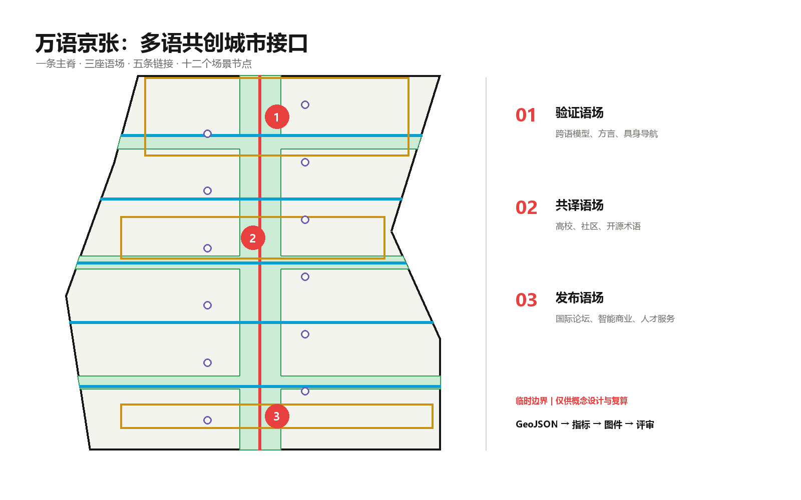
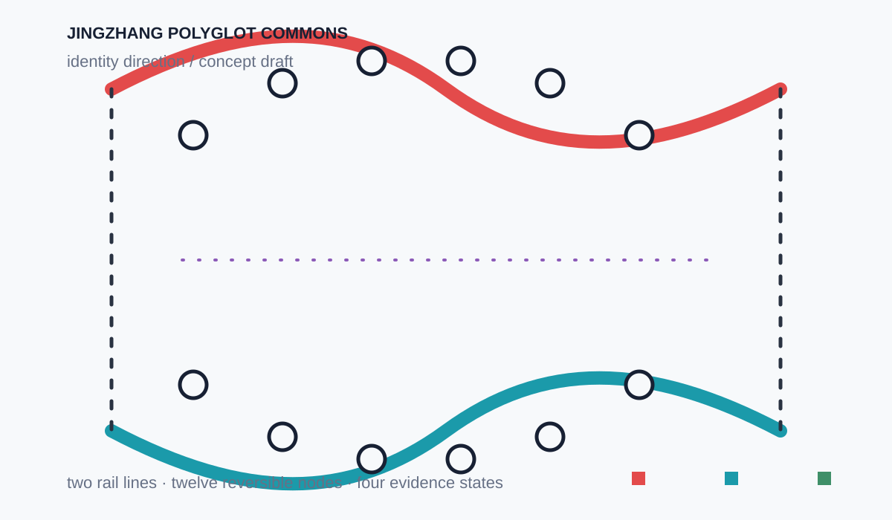
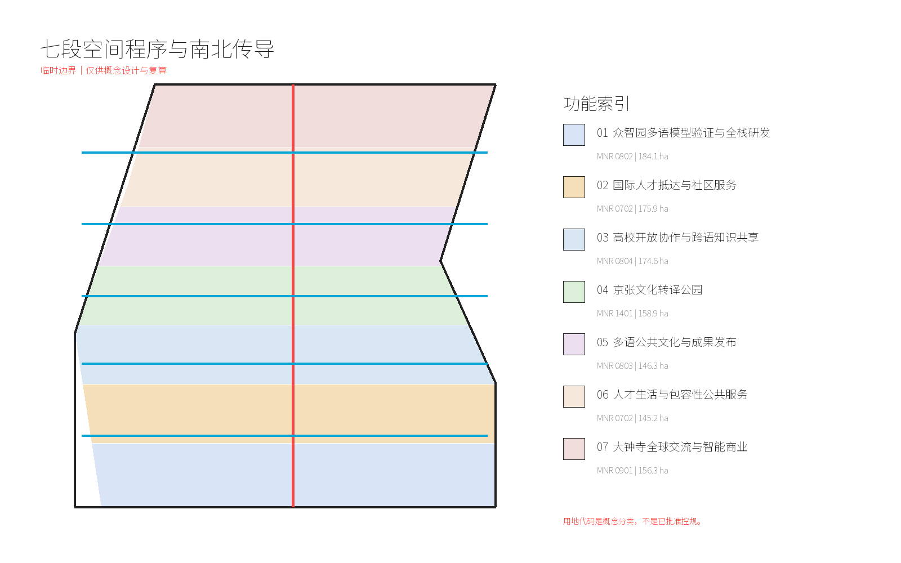
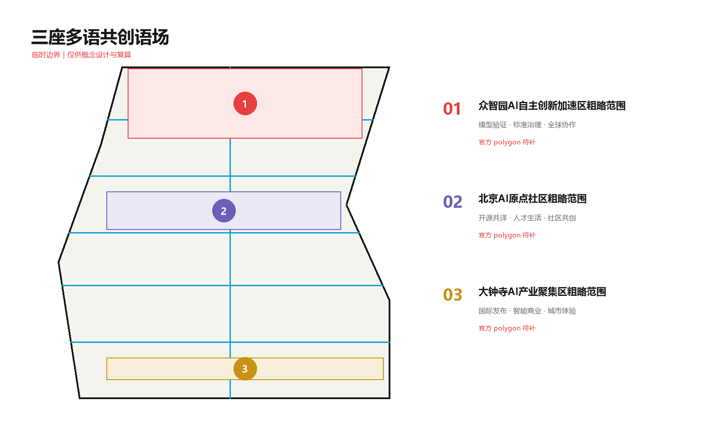
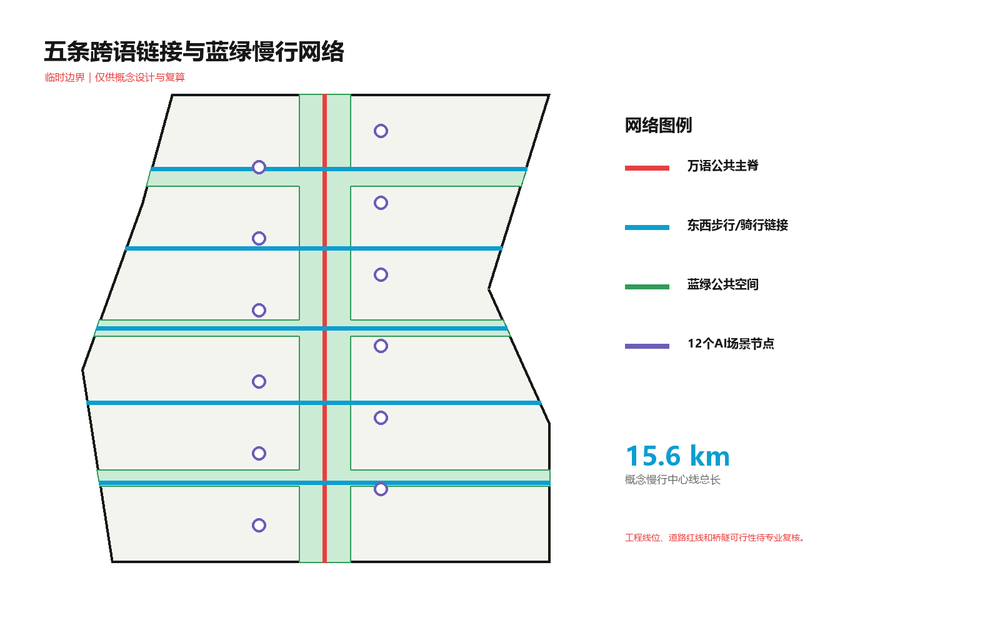
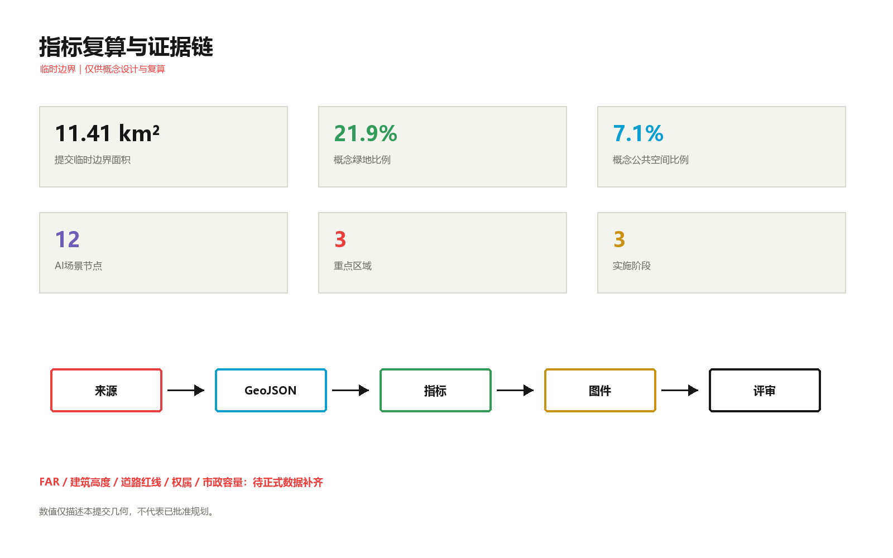

# 万语京张 / JINGZHANG POLYGLOT COMMONS

**面向全球AI人才的多语共创城市接口**

“万语京张”不是把翻译软件铺进城市，而是把跨语言协作当作公共空间、产业测试和城市服务的共同基础设施。方案以京张遗址公园为一条可步行、可相遇、可共同编辑的多语公共主脊，连接众智园“验证语场”、北京AI原点“共译语场”和大钟寺“发布语场”，让模型在进入真实城市前接受测试，让全球人才抵达后能获得服务，让居民在不依赖AI时仍保有人工窗口与非数字替代。

所有空间落地建议均为概念建议、参考方案或可供专业团队深化研究；不替代正式规划，不构成政府审定、工程可行性、投资或实施承诺。

## 设计依据与资料清单

方案首先服从官方公告的三层范围、三处重点区和设计任务，再以面向智能体任务书补充品牌、场景、运营与公共合规要求 [source:OFFICIAL-ANNOUNCEMENT] [source:AGENT-TASKBOOK]。专业判断同时参照本地标准快照，结构化成果的权威顺序为 GeoJSON、metrics、三个矩阵、正文和展示物 [source:SITE-PACKAGE]。

公开来源登记表把资料分为 formal-ready、background-only 与 provisional-only。本方案没有把背景案例升级为本项目事实，也没有把临时 polygon 写成官方红线 [source:SOURCE-REGISTRY]。处理后的事实包仅作为阅读导航，不替代原始公告和任务书 [source:PROCESSED-FACT-PACK]。

当前仓库没有官方 `SITE_BOUNDARY` 和三处 `KEY_AREA` polygon。提交边界来自维护者提供的临时粗略几何，仅用于生成、展示、设计讨论与入口自检 [source:BOUNDARY-SOURCE] [data:geometry/site_boundary.geojson#SITE-001]。三处重点区同样是临时约束范围；正式数据到位后，全部用地、建筑、道路、绿地、公共空间、分期和指标必须整体重算 [source:KEY-AREA-SOURCE] [data:geometry/key_areas.geojson#PROV-KEY-001]。

现状诊断采用“已知任务—可用证据—缺失资料”三列表，而不是虚构现状。已知的是公告面积、文字范围、任务和三处重点区定位；可用的是临时几何与本地标准；缺失的是官方红线、现状地块建筑、道路红线、权属、市政、文保和控规条件 [depth:existing_conditions_diagnosis]。因此本方案只对提交几何内的概念空间关系负责。

## 三层范围工作框架

统筹研究范围约 43.6 平方公里，回答海淀如何通过多语模型、国际人才和全球协作形成创新生态；总体设计范围约 11.4 平方公里，回答京张公共主脊如何连接产业、生活、交通与蓝绿空间；重点区域由三个临时 polygon 代表，回答验证、共译、发布三种原型如何落到可深化的空间对象 [depth:three_level_scope_framework] [metric:site_area_sqm]。

总体结构为“**一脊三语场、五链十二点**”。一脊是万语公共主脊；三语场分别承担产业测试、开源共编与全球发布；五链把验证、校园、文化、生活、全球交流横向接入主脊；十二点是可人工接管、可暂停和可退出的AI场景节点 [depth:overall_spatial_structure] [data:geometry/roads.geojson#ROAD-001]。

品牌主名为“万语京张”，英文名为 **JINGZHANG POLYGLOT COMMONS**。Logo 方向以两条平行轨线构成开放对话框，中间十二个点代表场景节点，红色表示公共责任主脊、青色表示横向连接、绿色表示蓝绿空间；不使用第三方商标、人物肖像或受限字体。命名层级为“一带（Polyglot Commons）—三语场（Commons）—五链接（Links）—十二节点（Nodes）”，既可用于导视，也可用于场景开放清单。

### 独立视觉识别方向

为回应任务书中“命名、Logo 与识别系统”的独立成果要求，本 V2 增加一页可直接评估的几何识别方向。两条不闭合轨线代表京张铁路与跨语对话，十二个节点代表可暂停、可接管的服务场景；红色主脊、青色链接、绿色公共空间和紫色证据状态形成四类导视语义。该方向是概念识别草案，不代表注册商标或最终导视施工图，图形以无字体 SVG 保存，便于专业团队替换比例、材质和中英文锁定组合 [depth:overall_spatial_structure] [source:AGENT-TASKBOOK]。

三大定位被转译为：百年京张文化带是“可被多语讲述的历史主脊”，都市AI生活体验带是“可人工接管的日常服务”，AI融合创新带是“可审计的跨语测试网络”。五大功能对应：全栈自主创新用于跨语模型评测，世界级创新生态用于全球协作，AI+场景用于真实服务验证，智能活力城市用于公共界面，AI治理话语权用于公开测试协议。三区两翼中，众智园验证、AI原点共译、大钟寺发布，中关村科技服务翼提供法务、资本与知识服务，小月河场景赋能翼提供日常应用与反馈回路 [standard:PROJECT-AGENT-OPEN-CALL-TASKBOOK]。

## 统筹研究范围产业与未来城市研究

多语能力不是单独的语言产业，而是模型研发、数据治理、国际合作、公共服务、无障碍和文化传播之间的接口。方案提出“数据与语料治理—模型与终端研发—跨语测试—城市服务采用—公众反馈—版本迭代”的全周期链条；空间上由众智园测试、AI原点共编、大钟寺采用与发布，中关村翼提供专业服务，小月河翼提供真实场景。

以下六个案例只用于提炼机制，不作为本项目红线、面积、控规或实施事实：

| 背景案例 | 可迁移机制 | 京张转译 |
| --- | --- | --- |
| Vector Institute | 研究机构连接人才、企业与应用网络 [source:CASE-VECTOR] | 建立跨语模型测试共同体与人才驻留 |
| City of Helsinki | 公共数字城市与规划界面 [source:CASE-HELSINKI] | 让指标、假设和更新版本向公众可读 |
| MIT Kendall Square | 校园、产业与公共空间接口 [source:CASE-KENDALL] | 把高校开放协作落到五条东西链接 |
| STATION F | 可见的一站式创业服务入口 [source:CASE-STATION-F] | 在大钟寺设置跨境创业与采用服务前厅 |
| Singapore AI Verify | 开放测试与治理工具链 [source:CASE-AI-VERIFY] | 三项产业测试均生成公开测试卡与退出条件 |
| Knowledge Quarter London | 铁路周边知识机构协同 [source:CASE-KNOWLEDGE-QUARTER] | 用遗址主脊连接高校、社区、文化与企业 |

这些机制的共同点不是复制地标，而是建立“谁可以进入、在哪里协作、如何验证、谁负责接管、怎样留下公共知识”的运营协议。任何案例机制进入京张前，都要经过本地需求验证、许可审查和专业深化。

## 区域协同与八类要素生态

任务书点名的区域协同不是一句“全球案例—京张转译”可以替代的背景口号。本方案把北纬社区、未来科学城、怀柔科学城、经开区和京津冀定义为待协商的概念接口，五者不被表述为已建立合作或政府安排。每个接口均以“角色—输入—输出—边界—责任状态”记录，正式合作须由相关主体另行确认 [source:OFFICIAL-ANNOUNCEMENT] [source:AGENT-TASKBOOK] [metric:regional_interface_count]。

| 区域接口 | 概念角色 | 可交换输入 | 可交换输出 | 协作边界与当前状态 |
| --- | --- | --- | --- | --- |
| 北纬社区 | 居民共译与日常服务反馈端 | 语言障碍样本、无障碍需求、服务投诉（需同意） | 易懂术语、更正记录、线下服务反馈 | 不导入个人敏感数据；由社区组织与专业团队共同确认，待协商 |
| 未来科学城 | 基础研究与验证伙伴 | 模型评测方法、科研人才、算力需求清单 | 可复用测试卡、失败样本摘要、人才交流机制 | 不承诺共享算力或入驻；需科研机构和数据管理方确认，待协商 |
| 怀柔科学城 | 高风险科学场景与长期评测伙伴 | 科研设施场景、科学传播需求、长期评测问题 | 安全边界、科学术语包、公众解释材料 | 不触及实验设施控制或安全审批；仅提出知识交换接口，待协商 |
| 经开区 | 制造、终端与产业化验证伙伴 | 终端样机、供应链场景、质量与运维反馈 | 可维护组件、终端适配测试、采用复盘 | 不承诺订单、产业落地或投资；由企业与园区主体确认，待协商 |
| 京津冀 | 跨区域人才与公共知识网络 | 多语人才流动需求、公共术语差异、交通服务问题 | 可迁移术语版本、跨城服务接口、年度比较报告 | 不代表行政协同或统一平台；需跨区域授权与数据协议，待协商 |

五个接口与三座语场的流向是：北纬社区提供需求反馈进入 AI 原点共译语场；未来科学城与怀柔科学城的评测方法进入众智园验证语场；经开区的终端与运维反馈进入五条链接；京津冀的跨城术语与人才议题在大钟寺发布语场公开复盘。每条流都设置“最小必要数据、人工责任、版本记录和退出”四个审计点，未达条件时只保留纸面研究，不开放真实服务。

八类要素生态用同一张责任表串起空间与运营：

| 要素 | 进入系统的最小材料 | 主要承接空间 | 输出与审计点 | 当前缺口 |
| --- | --- | --- | --- | --- |
| 土地 | 正式用地、权属与红线 | 七段用地与三语场 | 兼容性清单、红线复核 | 官方控规与权属待补 |
| 空间 | 现状测绘、建筑、道路和公共空间 | 主脊、五链、十二点 | 可逆界面清单、无障碍验收 | 现状测绘待补 |
| 产业 | 测试问题、企业场景、运维需求 | 众智园验证月台、经开区接口 | 测试卡、失败样本、采用复盘 | 产业主体待确认 |
| 资金 | 成本级别、维护预算、采购条件 | P01-P06 分期 | 资金来源与退出门记录 | 资金和采购待确认 |
| 人才 | 共同设计样本、驻留与培训需求 | AI 原点、五条链接 | 参与率、服务差异、驻留转化 | 调查样本待建立 |
| 算力 | 计算任务、容量与能耗约束 | 验证语场与科研接口 | 任务队列、容量上限、停机条件 | 算力与市政容量待补 |
| 数据 | 清权语料、隐私等级、版本记录 | 共译庭、测试室、术语库 | 来源、同意、访问、撤回审计 | 数据协议待确认 |
| 场景 | 服务流程、风险等级、人工接管 | 十二场景节点与公共窗口 | 可用率、人工接管率、退出记录 | 基线尚无实测 |

该表把“区域协同”落到可交换的材料与责任，而不把未知条件包装成实施承诺 [depth:metrics_recalculation] [depth:phasing_implementation]。

产业空间采用七段无缝分区：众智园多语模型验证与研发、国际人才抵达服务、高校开放协作、京张文化转译公园、多语公共文化发布、人才生活与包容服务、大钟寺全球交流与智能商业 [data:geometry/land_use.geojson#LU-001] [depth:land_use_layout]。分类使用自然资源部用地代码语义，但只是本方案的概念性表达，不是已批准用地 [standard:MNR-LAND-USE-CLASSIFICATION-GUIDE]。

## 总体设计范围城市更新与控规深度城市设计

城市更新以“先开放接口、再验证需求、后决定重资产”为顺序。近期优先布置可撤回的服务台、字幕与导视、公开测试协议和临时活动；中期在官方红线、交通、市政和权属明确后深化五条连接与三座语场；长期才讨论建筑更新、固定设施和片区运营。该顺序避免把临时边界直接转换为工程承诺 [standard:MOHURD-CONTROL-DETAILED-PLANNING] [depth:development_intensity_controls]。

七段用地由同一边界剖分，完整覆盖且不重叠。建筑层提供 14 个概念基底，分别标注“保留参考”或“改造参考”，不声称现状建筑身份、拆除必要性或最终规模 [data:geometry/buildings.geojson#BLDG-001] [depth:retain_renovate_demolish]。建筑总基底及设计覆盖比例仅描述本提交几何 [metric:building_footprint_area_sqm] [metric:design_building_coverage_ratio]。

建筑高度、体量、屋顶和界面遵循“小尺度公共首层、主脊侧连续开放、重点节点可识别、天际线服从正式控制”的概念原则。官方高度、日照、消防、文保和航空限制待补，因此不提供确定高度值 [depth:height_massing_character]。未取得官方文件的《建筑工程设计文件编制深度规定》只列为资料缺口，不作为已满足的强制依据 [standard:MOHURD-ARCH-DESIGN-DEPTH-2016]。

## 重点区域详细设计

三处重点区域都从“产业任务—公共空间—服务接口—退出条件”四层展开，位置以临时 polygon 表达，不能用于精确面积、审批或地块拆改留判断 [depth:three_key_area_detailed_design] [metric:key_area_count]。

**1. 众智园验证语场。** 概念建议把跨语模型安全、方言与少数语种鲁棒性、多语具身导航三项产业测试布置为可预约的“验证月台”。每个项目提交数据来源、测试语言覆盖、失败样本、人类接管与退场记录；公共绿地只承担可移动展示和讨论，不承担未经批准的高风险实测。正式深化需补清河、五环交通、生态、防洪和现状建筑资料 [data:geometry/key_areas.geojson#PROV-KEY-001]。

**2. 北京AI原点共译语场。** 概念建议以高校—园区—社区慢行链接组织开源术语库、跨文化共创、人才服务和成果发布。空间原型包括可人工服务的“抵达前厅”、居民与研究者共同编辑的“共译庭”、面向听障者的实时字幕界面。任何采集都需知情同意，社区服务保留线下窗口 [data:geometry/key_areas.geojson#PROV-KEY-002]。

**3. 大钟寺发布语场。** 概念建议围绕轨道接驳和四象限步行需求设置全球发布、跨境创业服务、智能终端体验与采用复盘。这里不是只展示“最好结果”，而要同步展示适用语言、失败边界、人工责任和退出状态。正式深化需补站点、道路红线、非机动车、权属、市政和商业运营条件 [data:geometry/key_areas.geojson#PROV-KEY-003]。

## AI 创新生态、人才画像与 AI+ 场景

六类画像把“全球人才”拆成可验证需求，而不是抽象标签：

| 画像 | 主要障碍 | 空间与服务响应 |
| --- | --- | --- |
| 跨语模型研究者 | 数据合规、测试语种、失败复现 | 众智园验证月台、受控测试室、公开测试卡 |
| 国际创业者 | 政务、法务、融资与场景入口碎片化 | 大钟寺跨境创业服务前厅、人工顾问 |
| 来访学者与学生 | 抵达、住房、医疗和校园信息断裂 | AI原点抵达助手、五条链接与线下服务点 |
| 本地居民与商户 | 技术术语难懂、申诉路径不清 | 共译庭、易懂语言、非数字替代与申诉窗口 |
| 老年人与听障者 | 语音界面、字幕与设备门槛 | 实时字幕、文字/手语/人工并行、低门槛终端 |
| 城市运营与专业人员 | 多系统版本不一致、责任不清 | 术语版本库、审计记录、人工审批与回滚 |

十二张场景卡均落在 `SCENARIO_NODE` 中，并要求人工复核、非数字替代与退出机制 [data:geometry/constraints.geojson#SCENARIO-001] [metric:scenario_node_count]：

| 编号 | 场景 | 类型 | 数据边界与人工复核 | 空间 / 运营 |
| --- | --- | --- | --- | --- |
| S01 | 跨语模型安全评测 | 产业测试 | 仅清权测试集；专家确认风险与停测 | 众智园验证月台 / 季度公开测试 |
| S02 | 方言与少数语种鲁棒性测试 | 产业测试 | 社群同意；不公开敏感语料 | 众智园共测室 / 社群评审 |
| S03 | 多语具身导航测试 | 产业测试 | 封闭低速；安全员随时接管 | 验证链接 / 预约时段 |
| S04 | 国际人才抵达助手 | 公共服务 | 最少信息；线下窗口并行 | AI原点抵达前厅 / 日常服务 |
| S05 | 医疗就诊多语协助 | 公共服务 | 不作诊断；医护最终确认 | 人才服务点 / 医疗机构协作 |
| S06 | 法律与政务易懂转译 | 公共服务 | 不替代法律意见；原文并列 | 共译庭 / 法务志愿网络 |
| S07 | 无障碍实时字幕 | 包容服务 | 本地处理优先；人工校正 | 公共活动界面 / 全年 |
| S08 | 京张文化多语讲述 | 文化 | 史实与译文双重校审 | 遗址主脊 / 公共路线 |
| S09 | 开源术语共编 | 社区 | 版本记录、署名和争议机制 | AI原点共译庭 / 每月编辑会 |
| S10 | 跨境创业服务台 | 企业服务 | 人工顾问确认政策与材料 | 大钟寺前厅 / 工作日 |
| S11 | 多语城市导视 | 交通 | 原标识优先；故障不影响通行 | 五条链接 / 持续维护 |
| S12 | 全球AI公共论坛 | 运营 | 公开议程、字幕和会后记录 | 大钟寺发布场 / 年度活动 |

所有场景是“可验证的服务原型”，不是批准运营项目；任何隐私、医疗、法律、交通或高风险决策都不得由模型单独完成。

## 共同设计与包容性验证计划

六类画像目前仍是设计假设。V2 将“以后调研”改成可执行的验证协议：第一轮在不采集身份证明的前提下招募 24 名参与者（每类画像至少 4 人，老年人与听障者各至少 4 人）；第二轮邀请社区翻译员、医护/法律服务人员和城市运营人员进行任务走查；第三轮只在前两轮发现风险已被人工复核后，进行低风险、可退出的现场压力测试。样本数量是目标值，不是已完成样本 [source:AGENT-TASKBOOK] [metric:co_design_sample_target]。

| 验证环节 | 参与者与任务 | 记录指标 | 通过门槛与退出 |
| --- | --- | --- | --- |
| 共同设计工作坊 | 六类画像各 4 人；共同绘制抵达、求助、申诉路径 | 任务完成率、未理解术语数、人工转接原因 | 任一关键服务无人能转人工则停止该原型 |
| 听障与字幕走查 | 听障者、老年人、字幕校对员；模拟活动、导视和故障 | 字幕延迟、错字率、对比度可读性、非数字替代可达性 | 字幕不可读或故障阻断通行即回滚 |
| 多语服务差异测试 | 中文、英文及参与者自选语种；医疗/政务只做导航 | 各语种完成时间差、人工接管率、申诉响应时间 | 任何语种差异超过预设阈值时不发布自动结果 |
| 版本与撤回审计 | 参与者检查术语、署名、撤回和更正 | 更正时长、撤回完成率、版本可追溯率 | 无法追溯来源或撤回失败则暂停数据集 |

基线在测试前登记为“尚无实测”，不得以目标值冒充效果。建议形成 `co-design/round-01`、`accessibility/round-01` 和 `service-difference/round-01` 三组公开摘要，只保留汇总结果，不发布个人身份、敏感语料或未经同意的录音 [metric:language_service_difference] [metric:accessibility_test_completion] [metric:correction_time_hours]。

## 用地、建筑规模与拆改留方案

七段用地完整覆盖提交临时边界，功能之间通过一条南北公共主脊和五条东西链接传导。科研、教育、文化、社区服务、商业服务与公园绿地使用统一代码；其中 LU-007 依据“全球交流与智能商业”的概念功能采用当前枚举 `0901`（商业用地），具体兼容性仍需正式控规确认 [data:geometry/land_use.geojson#LU-007] [standard:MNR-LAND-USE-CLASSIFICATION-GUIDE]。

建筑层不复原未知现状，而是提供可供专业团队替换的概念基底。保留参考优先用于既有公共界面，改造参考优先补足开放首层、共享会议、无障碍和可逆设施；没有官方权属、结构安全和价值评估前，不提出具体拆除 [data:geometry/buildings.geojson#BLDG-007] [depth:retain_renovate_demolish]。

规模控制采用“已知设计量”和“待正式数据补齐”双栏：基底面积与覆盖比例可从提交几何复算，FAR、总建筑面积、建筑高度、正式建筑密度、退线和停车指标保持 unknown。任何未来数值均需回到批准控规、现状测绘和专业评估。

## 交通、轨道、市政与公共服务设施

慢行系统由万语公共主脊和验证、校园、文化、生活、全球五条链接构成，概念中心线总长从道路图层复算 [data:geometry/roads.geojson#ROAD-002] [metric:walking_cycling_network_length_m]。它表达连通优先级，不是道路红线、桥隧方案或施工线位；轨道接驳、跨路口和过五环节点必须另行开展交通与工程论证 [depth:traffic_rail_slow_parking]。

公共服务采用“数字助手 + 人工窗口 + 非数字备份”三联配置。新型基础设施只提出端侧字幕、公开术语版本、隐私分级、设备状态和人工接管接口；能源、算力、通信、排水、防洪、消防和市政容量待正式资料和专项测算 [depth:municipal_new_infrastructure]。

无障碍不是单独场景，而是所有节点的进入条件：步行连续、字体和对比度可读、语音与文字并行、关键服务可转人工、故障时不阻断通行。站点与公共服务设施的具体位置仍需结合官方底图和运营单位深化。

## 蓝绿空间、公共空间与城市风貌

绿地层以窄幅南北主脊和三处横向绿楔组织连续性，公共空间层设置抵达前厅、开源共译庭、百年语轨广场和万语发布场 [data:geometry/green_space.geojson#GREEN-001] [data:geometry/public_space.geojson#PUBLIC-001]。两类面积和比例从各自图层复算，不用于声称法定绿地率 [metric:green_ratio]。

城市风貌遵循《城市设计管理办法》关于公共空间、建筑形态和特色塑造的统筹要求，但只给出概念性引导：遗址主脊保持材料克制和连续步行尺度，三语场通过颜色与信息层级识别，建筑首层优先开放与可逆使用，任何文保、天际线和建筑控制以正式文件为准 [standard:MOHURD-URBAN-DESIGN-MEASURES] [depth:blue_green_public_space]。

三处“AI朝圣地标”不是高大纪念物，而是可使用的公共知识界面：

1. **百年语轨里程标**：沿主脊记录京张工程术语、AI术语与多语译法，保留出处和修订历史。
2. **开源贡献墙**：展示可验证的代码、数据、术语和公共服务贡献，允许更正、撤回与版本追踪。
3. **全球对话站**：在大钟寺以环形字幕、人工主持和无障碍座席承载发布与公共讨论。

文化叙事从“自主修路”转向“共同铺设可理解的城市接口”：京张铁路的工程自主精神提供时间主线，中关村的开放创新提供协作方法，AI新文化以可解释、可纠错、可共同编辑的服务体现。导视系统区分整体品牌、场所名称、运营状态和证据状态，避免把文化符号变成科技装饰。

## 更新项目清单、实施政策与分期计划

| 项目 | 概念动作 | 依赖条件 | 评估 / 退出 |
| --- | --- | --- | --- |
| P01 万语公共主脊 | 连续步行、字幕与术语里程标 | 遗址、公园、交通与无障碍深化 | 连续性、可读性；设备可拆除 |
| P02 众智园验证月台 | 三项产业测试和公开测试卡 | 数据清权、安全与运营主体 | 失败样本、接管率；不合格停测 |
| P03 AI原点共译庭 | 术语共编、抵达与公共服务 | 社区共创、隐私与人工服务 | 更正时长、线下可用性 |
| P04 大钟寺发布前厅 | 全球发布、采用复盘、创业服务 | 轨道、权属、市政与商业运营 | 采用质量；无主体则暂停 |
| P05 五条公共链接 | 步行骑行与场景串联 | 道路红线、交评和工程论证 | 断点减少；不可行则调整线位 |
| P06 多语公共组件库 | 导视、字幕、服务台、贡献墙 | 原型测试、维护与版权 | 可维护性；到期退役 |

更新项目由 `PHASE` 图层分为三期 [data:geometry/phasing.geojson#PHASE-001] [metric:phase_count]。第一期（2026-2027）验证轻量服务与治理协议；第二期（2028-2030）在正式数据支持下连接公共空间并深化三语场；第三期（2031+）形成长期运营、年度评估和资产退役机制 [depth:phasing_implementation]。

为避免“有分期、无责任”，每个项目增加概念级责任和条件驱动阶段门。下表中的“责任角色”是待确认的工作接口，不是已签约主体；资金、审批、维护来源均保持待确认。

| 项目 | 责任角色（待确认） | 阶段门 | 运营基线 / 目标 | 暂停或退场条件 |
| --- | --- | --- | --- | --- |
| P01 公共主脊 | 遗址与公共空间专业团队 + 无障碍顾问 | 正式边界、交通安全和遗址审查通过 | 连续步行断点数、字幕可读率 | 边界或安全条件不满足，先用可拆组件 |
| P02 验证月台 | 测试平台主管 + 数据合规与安全负责人 | 测试集清权、风险分级和安全员到位 | 测试卡发布数、人工接管率 | 高风险未能人工接管，立即停测 |
| P03 共译庭 | 社区共创组织 + 语言服务团队 | 共同设计样本完成、线下窗口可用 | 术语更正时长、线下服务可达率 | 个人数据无法撤回，停止采集 |
| P04 发布前厅 | 发布运营团队 + 人工政策顾问 | 站点、权属、消防和运营主体明确 | 活动参与率、申诉响应时长 | 无明确责任人或预算，转为临时活动 |
| P05 五条链接 | 交通与景观专业团队 | 道路红线、交评、慢行和市政条件明确 | 慢行断点数、无障碍可达率 | 工程不可行或影响安全，调整线位 |
| P06 组件库 | 设计系统维护人 + 版权审查人 | 字体、版权、维护和版本协议明确 | 组件可维护率、撤回完成率 | 版权或维护失效，到期退役 |

阶段门顺序为“资料齐备—低风险原型—专业复核—有限开放—年度复盘”。每个门都要求记录未满足项、责任人和下一次复核日期；没有责任人时不将项目标为 ready。

政策概念建议包括：统一场景开放清单、跨语数据与术语治理、人工接管最低要求、非数字服务底线、年度公众共议、失败与退出记录、贡献署名和可撤回机制。实施主体、资金、审批和具体年度安排均待确认。

长期运营以“万语AI周”为年度窗口，包含跨语模型公开测试、开源术语编辑马拉松、国际人才城市行走、无障碍字幕压力测试和全球AI公共论坛；配套开发者驻留、社区翻译员网络、季度场景开放日和年度退出评估。活动是运营建议，不代表政府已确定举办。

## 指标体系、面积复算与合规矩阵

指标分三类。第一类是提交几何可复算值：临时边界面积、建筑基底、概念绿地、公共空间、慢行中心线、场景节点和分期；第二类是待正式控规补齐的 FAR、高度、正式建筑密度和退线；第三类是运营后才能观察的服务可用性、更正时长、人工接管率和退出完成率 [depth:metrics_recalculation]。

提交临时边界面积为约 11.41 平方公里，与公告“约 11.4 平方公里”处于相同量级，但不代表精确官方面积 [metric:site_area_sqm]。概念绿地面积与比例由 `GREEN-001` 复算 [metric:green_space_area_sqm] [metric:green_ratio]。

概念公共空间面积与比例由四处公共空间求和 [metric:public_space_area_sqm] [metric:public_space_ratio]。建筑基底与设计覆盖比例只用于检查本提交内部一致性，不可转写为批准开发强度 [metric:building_footprint_area_sqm] [metric:design_building_coverage_ratio]。

慢行中心线、十二个场景节点、三个重点区和三期实施分别由对应图层计数或测长 [metric:walking_cycling_network_length_m] [metric:scenario_node_count] [metric:key_area_count]。分期数量单独由 `phasing.geojson` 复核 [metric:phase_count]。

任务覆盖矩阵逐条映射公告 1.3、1.4、1.5 与 agent.1-agent.6；专业标准矩阵映射五项强制依据；设计深度矩阵覆盖现状、范围、结构、用地、强度、建筑、拆改留、交通、市政、蓝绿、重点区、项目、分期、指标和风险。矩阵是完整机器索引，正文只保留与判断相邻的证据。

本 V2 进一步把六项智能体任务定位到可检查成果：agent.1 的命名与 Logo 对应本节独立 SVG 方向和品牌层级；agent.2 的六个案例、八类要素与测试协议对应“统筹研究”和“区域协同”章节；agent.3 的十二张场景卡和三项产业测试对应 `constraints.geojson#SCENARIO-001` 及共同设计表；agent.4 的主脊、五链、三处地标对应道路、绿地、公共空间图层和图件；agent.5 的京张—中关村—AI 新文化叙事对应文化风貌段落与百年语轨里程标；agent.6 的万语 AI 周、驻留、翻译员网络和年度退出评估对应实施政策与阶段门表。所有链接都是概念建议，待专业团队和相关主体确认 [source:AGENT-TASKBOOK] [depth:phasing_implementation]。

## 风险、版权与合规说明

最大风险是临时边界被误读为官方红线。页面、图件和图纸持续标注 provisional；正式 polygon 到位后必须重新运行全部几何、指标、图件、HTML、PDF 与自检 [depth:risk_missing_data]。第二类风险是把国际人才需求当作既成事实；六类画像只是设计假设，必须通过共同设计和调查验证。第三类风险是多语AI在医疗、法律、交通和公共服务中产生误译；关键结论必须保留原文、人工确认、申诉与非数字替代。

方案不声称官方批准、审定控规、最终土地权属、确定建设规模、工程可行性、投资、招商或保证实施。官方控规具有法定效力，本AI方案只提供开放共创建议 [standard:PROJECT-OFFICIAL-ANNOUNCEMENT] [standard:MOHURD-CONTROL-DETAILED-PLANNING]。

本提交中英文正文、HTML、A3/A0 与含文字图件成对提供。结构化数据、正文、图件、HTML 和 PDF 为本次征集原创生成；未使用商业地图瓦片、新闻图片、第三方商标或人物肖像。`gpt-image-2` 仅生成一张未提交的界面概念图用于版式研究，未支持任何事实、边界或指标；提交图件全部由本地 GeoJSON 和 metrics 确定性绘制。完整声明见 `report/copyright_statement.md`。

## 参考资料

本节列出的仓库文件与结构化索引共同构成可复核书目入口 [source:SITE-PACKAGE]。

- `brief/site-package/design_brief.json`
- `brief/site-package/agent_taskbook.json`
- `brief/site-package/allowed_design_space.json`
- `brief/site-package/ranges/planning_limits.json`
- `brief/site-package/standards/standards.json`
- `data/source_registry.json`
- 结构化来源与用途边界：`sources.json`
- 复算公式与未知项：`metrics.json`
- 假设与触发条件：`assumptions.json`
- 任务、标准与深度覆盖：`compliance_matrix.json`、`standard_matrix.json`、`design_depth_matrix.json`
