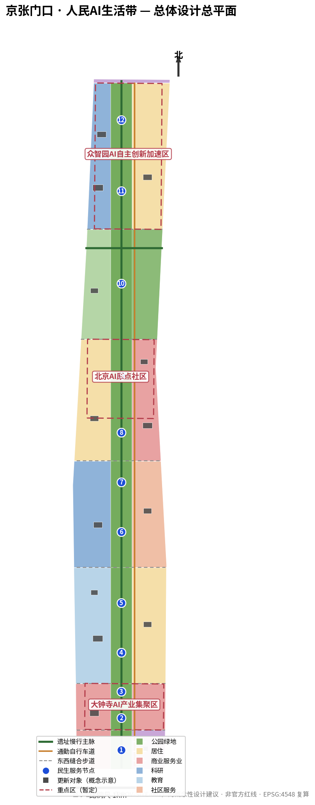
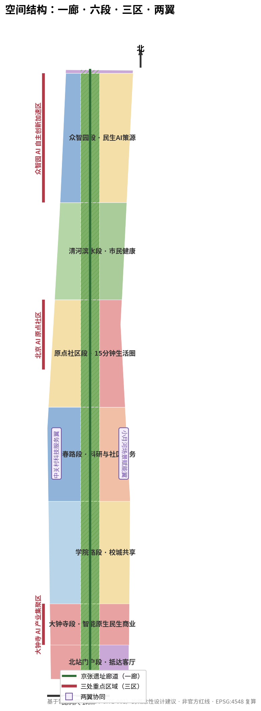
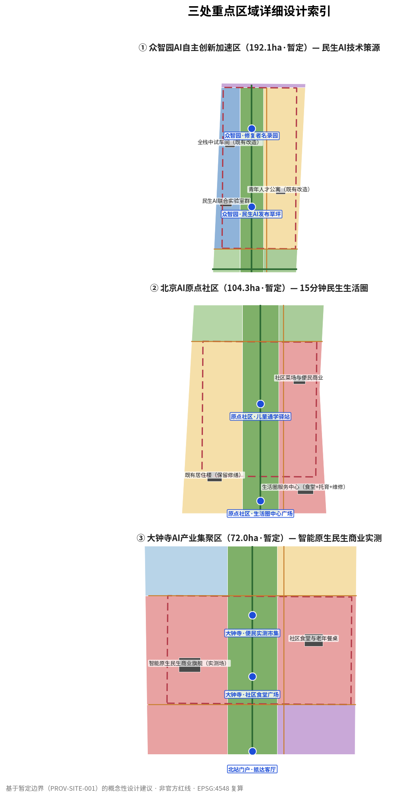
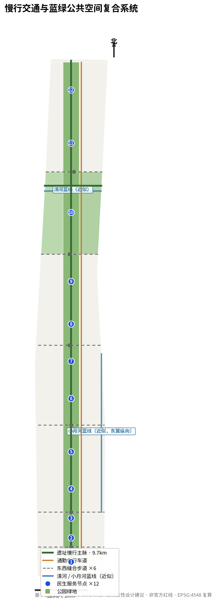
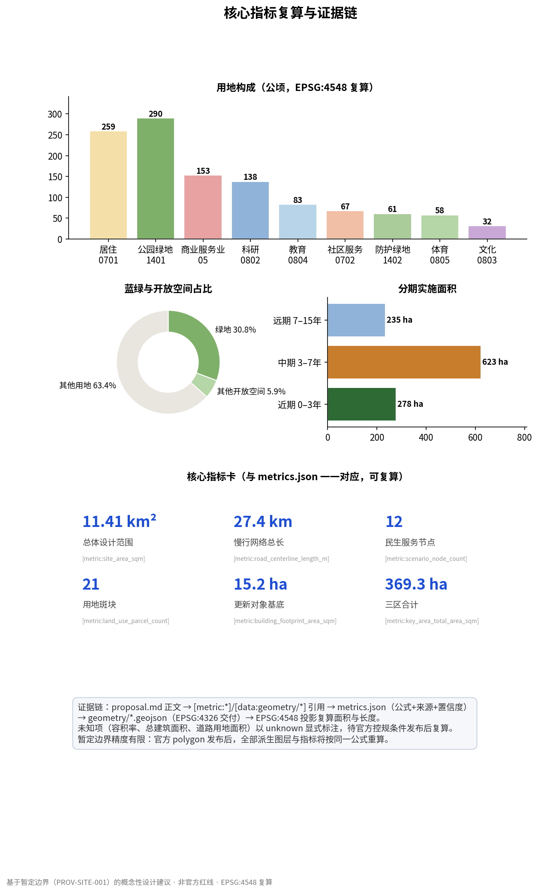

# The Jingzhang Doorstep · People's AI Belt

**One-sentence claim**: this innovation belt does not need another grand narrative. What it needs is to answer the questions residents along the corridor ask every day — how to get to work faster, whether an elderly parent is safe at home, whether a child's commute is trustworthy, and how long a repair request takes to be answered. This proposal turns those questions into a design brief, so that AI stops being a specimen on display and becomes a tool people can actually use at their doorstep. [source:AGENT-TASKBOOK]

## Design Basis and Source Inventory

This proposal uses only public or rights-cleared material. The formal basis comprises: the official announcement (project name, the three-level scope, announced areas and textual boundaries, and the design tasks), the agent-facing taskbook (six agent tasks, co-creation principles, and non-transgression clauses), and local snapshots of professional standards; the provisional basis is the provisional boundary polygons provided by the repository; the background navigation layer is the agent fact pack. [source:OFFICIAL-ANNOUNCEMENT][source:AGENT-TASKBOOK][source:PROCESSED-FACT-PACK]

Source usability follows strictly the grading of the public Source Registry: formal-usable sources support formal conclusions, background-only sources serve as background, and provisional sources are used only for concept generation and self-checking. [source:SOURCE-REGISTRY] This proposal uses no non-public planning drawings, internal control indicators, or personal information; statements concerning development intensity, building height, road alignment, and land tenure are conceptual recommendations for professional teams to develop further, and do not constitute approved conclusions.

International benchmarking data cited in the case studies (see the chapter "Industry and Future-City Research for the Coordinated Research Area") come from public channels with verification status noted; any figure that could not be cross-validated is not used as a decision basis in the body text, only as an order-of-magnitude reference.

## The Three-Level Scope Working Framework

- **Coordinated Research Area (43.6 km²)**: bounded by the North 5th Ring Road to the north, the Beijing–Tibet Expressway to the east, Xizhimen Outer Street to the south, and Wanquanhe Road to the west. This layer carries industry and future-city research: a livelihood-problem mapping, the organization of the AI innovation ecosystem, and the Three Zones and Two Wings coordination mechanism. [source:OFFICIAL-ANNOUNCEMENT]
- **Overall Design Area (11.4 km²)**: defined by the urban districts within 1–2 km around the Jing-Zhang Railway Heritage Park. This layer reaches the depth of urban design at regulatory detailed planning level: land-use zoning, renewal framework, walking-and-cycling and blue-green systems, and phased implementation. The recomputed area [metric:site_area_sqm] matches the announced 11.4 km².
- **Key-Area Detailed Design Area (368.4 ha)**: the Zhongzhiyuan AI Independent Innovation Acceleration Area (192.1 ha), the Beijing AI Origin Community (104.3 ha), and the Dazhongsi AI Industry Cluster (72.0 ha), each reaching the depth of an Integrated Planning Implementation Plan. [data:geometry/key_areas.geojson#KEY-001][data:geometry/key_areas.geojson#KEY-002][data:geometry/key_areas.geojson#KEY-003]

The geometries of all three levels are currently provisional polygons (provisional): limited in accuracy, and not to be used as official planning boundaries or as a basis for precise areas. [source:BOUNDARY-SOURCE] Once official polygons are released, land-use zoning, green and public space, phasing extents, and all derived indicators will be recomputed with the same formulas recorded in `metrics.json`; every area conclusion in this proposal holds only for the current provisional geometry. [depth:three_level_scope_framework]

## Industry and Future-City Research for the Coordinated Research Area

### Naming and Identity: The Jingzhang Doorstep

The primary name is **"The Jingzhang Doorstep"**, with the subtitle **People's AI Belt**. Naming logic: for residents, whether a technology is any good does not depend on how advanced it is, but on how close it is to their own doorstep. Logo direction: the shape of the Chinese character for "door" （门） is made isomorphic with the cross-section of a railway gauge — the two vertical strokes are the rails, the horizontal turn is the household door; the primary colour is warm orange (the warmth of livelihood) rather than technology blue, with the heritage park's green as the auxiliary colour. The wayfinding and signage system extends the same "doorstep" vocabulary: every livelihood service node is called "XX Doorstep" — the Canteen Doorstep, the Schoolhouse Doorstep, the Waystation Doorstep. The name duplicates no existing city, park, or enterprise name, and uses no unauthorized fonts, trademarks, or likenesses. [source:AGENT-TASKBOOK]

### Translating the Three Positionings, Five Functions, and Three Zones and Two Wings into Livelihood Terms

The three positionings are each turned into a verifiable livelihood commitment: **the Centennial Jing-Zhang Cultural Belt** — commemorating not only an engineering marvel but also Zhan Tianyou's practical tradition of "building a railway of the Chinese people's own", expressed today as a problem list of "solve one, count one"; **the Metropolitan AI Life Experience Belt** — the protagonists of the experience are residents, not tourists, and the density of AI services perceptible within a 15-minute living circle is the core indicator; **the AI Integration and Innovation Belt** — innovation enters through livelihood problems, and real demand is the most full-stack test there is. [source:AGENT-TASKBOOK]

The five functions are reorganized along "problem → tool → scenario": the Full-Stack Independent AI Innovation System answers "where do the tools come from" in Zhongzhiyuan; the world-class AI innovation ecosystem answers "who builds them"; the new paradigm of AI-enabled scenarios answers "how to use them"; the intelligent AI-powered vibrant city answers "what it feels like to use them"; and the global voice in AI governance is made concrete in this proposal as "rules for human review and privacy boundaries of livelihood AI" — homework that other cities can copy.

The Three Zones and Two Wings coordination loop: Zhongzhiyuan (build tools) → AI Origin Community (use tools) → Dazhongsi (turn tools into business) → Zhongguancun Technology Services Wing (standardize and export validated services) → Xiaoyue River Scenario Enablement Wing (open community scenarios to more developers) → new problems flow back to Zhongzhiyuan. The criterion for closing this loop is not output value, but the **livelihood-problem resolution rate**.

### Global Case Benchmarking: Seven Cases, Learning Mechanisms, Not Slogans

| Case | Core mechanism | Transfer to The Jingzhang Doorstep |
|---|---|---|
| Kendall Square, Boston | University–industry symbiosis, laboratories adjacent to community | Zhongzhiyuan labs open a "problem pool" to the community |
| King's Cross, London | Railway heritage revitalization mixed with tech headquarters | The heritage corridor is not a museum but living infrastructure |
| High Line, New York | Public operation of a linear heritage park | Regularized public programming on the walking-and-cycling spine |
| 22@, Barcelona | Mixed-use renewal of an industrial district | Dazhongsi's tested mix of "commerce + R&D + housing" |
| Stanford Research Park | Low-density park for research-to-production transfer | Pilot-scale workshops next to R&D shorten the validation chain |
| Shenzhen Bay Science and Technology Ecological Park | Government guidance with enterprise clustering and talent support | Talent apartments supplied in step with livelihood services |
| Zhangjiang Science City, Shanghai | Indicator-system governance of a science city | Managing innovation-belt iteration with recomputable metrics |

Across these seven benchmarks, this proposal deliberately avoids "second Silicon Valley"-style grand analogies: what is genuinely transferable in these cases is **mechanisms** (problem pools, mixed use, operating entities, indicator systems), not scale or fame. Case data all come from public channels; some figures vary by year and serve as mechanism references only, not precise citations. [depth:overall_spatial_structure]

### Livelihood Ordering of the Eight-Factor Allocation Mechanism

Of the eight factors — land, space, industry, capital, talent, computing power, data, and scenarios — this proposal sets an explicit allocation priority: **scenarios > data > talent > space > industry > computing power > capital > land**. The reasoning: livelihood scenarios are the source of demand, data are the by-product of scenarios, and talent stays because "the problems are worth solving" — the reverse of the traditional park logic that starts with land and capital, and precisely the industrial organization of "People's AI".

## Urban Renewal and Regulatory-Depth Urban Design for the Overall Design Area

### Spatial Structure: One Corridor, Six Segments

With the Jing-Zhang heritage corridor as the central spine (the one corridor), seven functional segments are organized from south to north: the North Station Gateway segment (arrival services), the Dazhongsi segment (livelihood-commerce testing), the Xueyuan Road segment (campus–city sharing), the Zhichun Road segment (research and community services), the AI Origin Community segment (core of the 15-minute living circle), the Qinghe Waterfront segment (citizen health), and the Zhongzhiyuan segment (livelihood-AI source of innovation). [data:geometry/land_use.geojson#LU-B05-W] A 1–2 km service hinterland extends on each side of the corridor, and six east–west stitching footpaths reconnect blocks severed by the railway. [data:geometry/roads.geojson#ROAD-STITCH-01]

### Land-Use Zoning and Renewal Framework

The land-use zoning is a complete, non-overlapping conceptual subdivision of 21 parcels: residential (0701) 258.8 ha, park green space (1401) 289.9 ha, commercial services (05) 153.0 ha, research (0802) 138.3 ha, education (0804) 83.1 ha, community services (0702) 67.5 ha, with the remainder in protective green space, sports, and cultural land. [metric:land_use_area_0701_sqm][metric:land_use_area_1401_sqm][metric:land_use_area_05_sqm] Residential plus community services total about 326 ha, 28.6% of the full corridor — the largest functional group. This is not the logic of "an industrial park with dormitories", but of "a living district with industry attached". [depth:land_use_layout]

The renewal strategy is "retain and renovate first, demolish cautiously, build little": among 16 conceptual renewal objects, 4 are retained and repaired, 10 are renovated and upgraded, and only 2 are newly built (the livelihood-AI joint laboratory cluster and the full-stack pilot workshop, both in Zhongzhiyuan). [data:geometry/buildings.geojson#BLDG-01] All building footprints are schematic, target no specific tenure parcels, and do not constitute demolish–renovate–retain conclusions. [depth:retain_renovate_demolish]

### Honest Treatment of Regulatory Planning Conditions

Statutory regulatory detailed planning conditions — floor area ratio, building height, building coverage ratio, green ratio, setbacks — are not in the public site package. This proposal records all of them as unknown and draws no intensity conclusions. [metric:floor_area_ratio] Conceptual-level intensity discussions (such as Zhongzhiyuan as the only concentrated area of new construction) are directional suggestions only, to be recomputed once formal regulatory conditions are released. [depth:development_intensity_controls]

## Detailed Design of the Three Key Areas

### ① Zhongzhiyuan AI Independent Innovation Acceleration Area (192.1 ha, provisional) — Source of Livelihood-AI Technology

**Positioning**: the only functional zone along the corridor to carry new construction, tasked with "building tools for livelihood problems". **Spatial structure**: the west wing concentrates the livelihood-AI joint laboratory cluster and full-stack pilot workshop; the east wing mixes talent apartments with housing; the central corridor is the heritage park with the launch lawn. [data:geometry/land_use.geojson#LU-B07-W] **Building renewal**: 2 new builds and 1 renovation (BLDG-01/02/03). **Mobility and walking-cycling**: the northern terminus of the walking-and-cycling spine, connecting to the Qinghe waterfront greenway. [data:geometry/roads.geojson#ROAD-SPINE] **Public space**: the Livelihood-AI Launch Lawn (PS-11) and the Fixers' Honour Garden (PS-12). **AI scenarios**: the technological source of S07 repair-response and S12 housekeeping-robot testing. **Implementation risk**: new-build volume depends on confirmation of regulatory conditions and is listed as a precondition. [depth:three_key_area_detailed_design]

### ② Beijing AI Origin Community (104.3 ha, provisional) — The 15-Minute Livelihood Living Circle

**Positioning**: the corridor's "main ground", answering "how AI makes daily life better". **Spatial structure**: mixed housing in the west wing, community commerce and the living-circle centre in the east wing, and the heritage park in the central corridor. [data:geometry/land_use.geojson#LU-B05-E] **Building renewal**: the living-circle service centre (canteen + childcare + repair integrated in one stop, BLDG-06), the community market (BLDG-07), and retained-and-repaired existing housing (BLDG-05). **Mobility and walking-cycling**: the densest stretch of east–west stitching footpaths, with full coverage of children's school routes. **Public space**: the living-circle central square (PS-08) and the children's school-commute waystation (PS-09). **AI scenarios**: S02 in-home guardianship, S03 school-commute guardianship, S08 smart catering, and S12 housekeeping-robot testing. **Implementation risk**: community scenarios depend on resident authorization and property-management coordination; a deliberation mechanism must be established before any equipment is deployed.

### ③ Dazhongsi AI Industry Cluster (72.0 ha, provisional) — AI-Native Livelihood-Commerce Testing

**Positioning**: answering "how AI services become a sustainable business", so livelihood services can survive without subsidies. **Spatial structure**: the AI-native livelihood-commerce test street in the west wing, community convenience commerce in the east wing, and the Dazhongsi segment of the heritage park in the central corridor. [data:geometry/land_use.geojson#LU-B02-W] **Building renewal**: the livelihood-commerce flagship (BLDG-13) and the community canteen with senior dining tables (BLDG-14). **Public space**: the community canteen square (PS-02) and the convenience-testing market (PS-03). **AI scenarios**: S11 last-100-metre unmanned delivery and S06 legal-aid pre-screening. **Implementation risk**: commerce testing involves food-safety, labour, and fire-safety compliance; the pilot agreement must pass item-by-item review.

## AI Innovation Ecosystem, Talent Profiles, and AI-Enabled Scenarios

### User Profiles: Six Kinds of Real People

| Profile | Pain points of a day | Corresponding scenarios |
|---|---|---|
| Mother with children (AI Origin Community) | Pick-up and childcare time conflicts | S03, S08 |
| Senior living alone (Zhichun Road) | In-home safety and chronic-disease management | S02, S01 |
| Commuter with disabilities (whole corridor) | Broken connections and missing accessibility information | S04 |
| Night-shift worker (Dazhongsi) | Night travel and night dining | S04, S08 |
| Couriers and delivery riders (whole corridor) | Difficulty of last-100-metre delivery | S11 |
| Small community merchants (Dazhongsi) | High digitalization threshold, unstable footfall | S06, S11 |

The profiles are constructed from public demographic structure and common knowledge of community governance, using no personal data; they must be verified through community research before implementation. [source:AGENT-TASKBOOK]

### The Thirteen Scenario Cards

Every scenario card follows the same format: **Problem → AI solution → spatial placement → data and privacy boundaries → human review → operating entity → effect metrics → exit conditions**. All scenarios are conceptual recommendations; testing-type scenarios may be piloted only after dual approval by the competent authority and the community council.

1. **S01 Community chronic-disease management** (AI + healthcare): long queues for chronic-disease follow-ups and prescriptions → community health records with pre-consultation triage → PS-10 and BLDG-04 → health data stay within the community edge node, aggregated only after de-identification → physicians give final review of prescriptions → operated by the community health service centre → reduced follow-up waiting time → data automatically deleted upon authorization expiry.
2. **S02 In-home guardianship for seniors living alone** (AI + eldercare): children not nearby → water/electricity/gas anomaly detection and millimetre-wave (non-camera) fall detection → B05 residential parcel → no audio or video collected; raw data never leave the household → anomalies call the senior first, then family and social workers → street-office and property-management coordination → response time, false-alarm rate → the senior or their guardian can opt out with one tap.
3. **S03 School-commute guardianship for children** (AI + education/safety): mixed pedestrian and vehicle traffic on school routes → route-risk heat maps and crossing-guard scheduling → PS-09 and the stitching footpaths → no facial recognition, only flow counting → crossing guards make on-site decisions → schools and transport authorities → number of school-route accidents → continuation decided after end-of-term evaluation.
4. **S04 Accessible connection service** (AI + transport): broken connections for people with disabilities and night-shift workers → dynamic accessible-route planning and low-speed shuttle reservation → the full walking-and-cycling spine → location data anonymized in real time → passengers can switch to a human operator at any time → conceptual cooperation with public-transport operators → accessible-route completion rate → low-demand routes revert to reservation-only.
5. **S05 Community AI public-interest classes** (AI + education): unequal access to AI for youth → university faculty, students, and open-source courses brought into communities → PS-04 → no personal information collected from participants → teachers present throughout → co-governed by universities and communities → number of schools covered and course-continuation rate → courses open-sourced, can stop at any time.
6. **S06 AI-assisted pre-screening for legal aid** (AI + legal): no place to turn with labour and rental disputes → structured case pre-screening and document-template generation → PS-03 and online → case data retained locally → issued only after review by licensed lawyers → public-interest cooperation between judicial offices and law firms → consultation response time → does not replace legal advice; disclaimer stated explicitly.
7. **S07 Repair-response for older residential compounds** (AI + life services): slow repairs, opaque progress → intelligent work-order dispatch and public progress tracking → B03/B05 residential parcels → work-order data minimized → property manager gives final approval on dispatch → property management and street office → reduced average response time → compatible exit with existing property systems.
8. **S08 Smart catering for community canteens** (AI + food service): insufficient senior dining-table coverage → demand forecasting and meal-planning optimization → PS-02 and BLDG-14 → only order volumes collected, never linked to health data → nutritionists review menus → community catering operators → number of seniors covered by dining tables → any food-safety incident halts the line for rectification.
9. **S09 Skills matching for flexible employment** (AI + employment): information asymmetry for gig workers → skills mapping and job matching → online and PS-08 → résumés de-identified → job seekers confirm each submission themselves → human-resources service agencies → match success rate → users can deregister at any time.
10. **S10 Intelligent dispatch for Swift Response to Public Complaints** (AI + governance): too many dispatch layers for citizen appeals → semantic dispatch with progress made public to residents → PS-07 deliberation pavilion → follows government data specifications → the handler-responsibility system unchanged → street-level citizen-appeal handling centre → dispatch accuracy, resolution time → dispatch errors fall back to manual handling.
11. **S11 Last-100-metre unmanned delivery** (industry test 1): parcels hard to get upstairs, riders pressed for time → low-speed delivery robots entering residential compounds → B02 test street and B05 pilot buildings → no household information collected → dual staffing of remote takeover operator and on-site safety officer → merchant alliance and robotics enterprises → average delivery time per order, complaint rate → speeding triggers remote parking; six-month pilot evaluation.
12. **S12 Housekeeping and repair robot testing** (industry test 2): seniors inconvenienced by home repairs → robots provide carrying and inspection services under community service centre supervision → BLDG-06 → household entry requires written resident authorization → service staff accompany throughout → housekeeping enterprises and the community → service completion rate → any incident stops operations; liability insurance first.
13. **S13 Mobile health screening station** (industry test 3): health check-ups inconvenient for seniors → vehicle-mounted screening equipment with AI pre-diagnosis on rotating rounds → PS-10 → medical data stored per medical regulations → reports signed by licensed physicians → medical institutions → screening coverage in person-times → health-authority approval as precondition.

The overarching privacy principle for all scenario cards: **do not collect what need not be collected; do not let leave the household what need not leave; anonymize what can be anonymous; every scenario has human review and an exit button**. [standard:PROJECT-AGENT-OPEN-CALL-TASKBOOK]

## Land Use, Building Scale, and the Demolish–Renovate–Retain Strategy

The land-use layout is organized around "life first": residential and community-service land concentrates in the AI Origin Community and the east wings of Xueyuan Road and Zhichun Road; research and new construction concentrate in Zhongzhiyuan; commerce testing concentrates in Dazhongsi; and cultural functions anchor the two gateways at the ends (the North Station memory-and-culture space and the Qinghuayuan Station memory hall). [data:geometry/land_use.geojson#LU-B01-E][data:geometry/land_use.geojson#LU-B03-W]

At the building-scale level: the combined footprint of the 16 conceptual renewal objects is about 15.2 ha [metric:building_footprint_area_sqm], with 4 retained, 10 renovated, and 2 newly built. Total floor area and floor area ratio are marked unknown due to the absence of statutory regulatory conditions, and no intensity conclusions are provided. [metric:total_floor_area_sqm][metric:floor_area_ratio] The spatial supply strategy: release stock space through renovation to carry livelihood services (canteens, childcare, care, repair), and concentrate new construction on the R&D and pilot functions of Zhongzhiyuan — leave the "new" to tools, and turn the "old" into life.

## Transport, Rail, Municipal Utilities, and Public Service Facilities

The walking-and-cycling system is this proposal's first transport infrastructure: the heritage walking-and-cycling spine runs the full corridor for about 9.7 km; the east-wing commuter cycling lane parallels it; six east–west stitching footpaths repair the severance caused by the railway; the Qinghe waterfront greenway connects at the northern end; and the walking-and-cycling network totals about 27.4 km. [metric:road_centerline_length_m][data:geometry/roads.geojson#ROAD-SPINE] On rail, the proposal suggests no new alignments, only arrival-service integration (BLDG-15 Arrival Living Room) around the existing hub (Beijing North Station) and connection optimization, subject to the opinions of transport authorities. [depth:traffic_rail_slow_parking]

The integration principle for municipal utilities and new infrastructure: computing power sinks to community edge nodes (supporting the "data stay in the community" of S01/S02); age-friendly and accessibility retrofits enter the municipal micro-renewal list; stormwater storage relies on the waterfront green belt and the vertical design of the heritage corridor. Road red-line widths and cross-sections are not in public sources, and road land area is marked unknown. [metric:road_area_sqm][depth:municipal_new_infrastructure]

## Blue-Green Space, Public Space, and Urban Character

The green-space system consists of the heritage-park central corridor (289.9 ha of park green space), the Qinghe waterfront protective green belt, and sports-and-health land; the green ratio is 30.8%, and public open space totals 36.6%. [metric:green_ratio][metric:public_open_space_ratio] The belt's core design move is **to turn the park from "a place to look at" into "a place to get things done"**: 12 livelihood service nodes are evenly distributed along the spine at an average spacing of about 800 metres, so a "doorstep" is always within a 10-minute walk. [data:geometry/public_space.geojson#PS-08]

### Three AI Pilgrimage Landmarks: Not a Pilgrimage to Technology, but to "Problems Solved"

1. **The Solutions Wall** (Qinghuayuan Station memory square, PS-05): a wall that grows over time; each solved livelihood problem adds an inscribed line — the problem, the way it was solved, the participants. Its exhibits are not devices, but case-closure reports.
2. **The Fixers' Honour Garden** (Zhongzhiyuan, PS-12): the core of the contributor-honour system, recording the concrete roles of developers, social workers, and residents in problem-solving, answering the co-creation principle that "contributions be remembered".
3. **The Arrival Living Room** (North Station gateway, PS-01 and BLDG-15): everyone's first impression of the innovation belt — not an exhibition hall, but a living room where one can genuinely rest, ask directions, charge a phone, and ask for help.

All three landmarks are low-intervention, reversible public-space transformation concepts; they involve no construction conclusions and are not written as approved construction; the wayfinding system continues the "doorstep" vocabulary and the warm-orange primary colour, with fonts under open-source licences. [depth:blue_green_public_space]

## Renewal Project List, Implementation Policies, and Phasing Plan

### Renewal Project List (12 items, all conceptual recommendations)

| # | Project | Location | Type | Dependencies |
|---|---|---|---|---|
| 1 | Full connection of the heritage walking-and-cycling spine | Whole corridor | Walking-cycling | Park opening schedule |
| 2 | Six east–west stitching footpaths | Segment junctions | Walking-cycling | Road cross-section coordination |
| 3 | Living-circle service centre | B05 | Renovation | Property and tenure coordination |
| 4 | Community canteen and senior dining tables | B02 | Renovation | Food-safety licence |
| 5 | Children's school-commute waystation | B05 | Renovation | School coordination |
| 6 | Silver-age day-care centre | B04 | Renovation | Civil-affairs registration |
| 7 | Livelihood-AI incubator | B04 | Renovation | Operating-entity recruitment |
| 8 | Campus–city shared academy | B03 | Renovation | University opening agreement |
| 9 | Qinghuayuan Station memory hall | B03 | Renovation | Heritage-conservation approval |
| 10 | Livelihood-commerce flagship test field | B02 | Renovation | Merchant-alliance formation |
| 11 | Livelihood-AI joint laboratory cluster | B07 | New build | Regulatory-condition confirmation |
| 12 | North Station Arrival Living Room | B01 | Renovation | Hub-management coordination |

[depth:renewal_project_list][data:geometry/buildings.geojson#BLDG-06]

### Phasing Plan

Near term (0–3 years, about 278 ha): the Dazhongsi and AI Origin Community segments go first — low-cost, high-visibility livelihood scenarios start up (canteens, waystations, the testing market). [metric:phasing_phase1_area_sqm] Medium term (3–7 years, about 623 ha): Xueyuan Road, Zhichun Road, and Zhongzhiyuan — campus–city sharing and the technological source. [metric:phasing_phase2_area_sqm] Long term (7–15 years, about 235 ha): completion of the North Station gateway and Qinghe waterfront. [metric:phasing_phase3_area_sqm][depth:phasing_implementation]

### Annual Programming and Long-Term Operation

The programming system revolves around "problem-solving" rather than "technology showcase": **opening of the year** — the "Problem List Release" (residents vote on the year's top ten livelihood problems); **spring** — the "Fixers' Market" (open day on the Dazhongsi test street); **summer** — the "Doorstep Summer Camp" (concentrated period of youth AI public-interest classes); **autumn** — the "Fixers' Annual Conference" (the Solutions Wall line-unveiling ceremony and the annual resolution-rate release); **year-round** — the "Wednesday Doorstep Council". Developer-community operation is bound by the "problem pool": residents pose problems, developers take them up, the community evaluates. Scenario access operation adopts the standard text of "pilot agreement plus exit clauses". The attraction-and-conversion path: a tested scenario proves out → a standardized service package → export through the Zhongguancun Technology Services Wing. All programming is a conceptual recommendation and constitutes no government commitment or definite arrangement; the onward conversion of talent, enterprises, and developers enters through "participating in solving real problems". [source:AGENT-TASKBOOK]

## Indicator System, Area Recomputation, and the Compliance Matrix

All spatial indicators are recomputed from the delivered layers under EPSG:4548: total land 1141.3 ha (consistent with the announced 11.4 km²), green ratio 30.8%, public open space 36.6%, walking-and-cycling network 27.4 km, 12 livelihood service nodes, 21 land-use parcels, renewal-object footprints of about 15.2 ha, and the three key areas totalling 369.3 ha (a deviation of about 0.24% from the announced 368.4 ha, stemming from the provisional geometry). [metric:site_area_sqm][metric:green_ratio][metric:public_open_space_ratio]. The slow-mobility network totals 27.4 km and the three key areas 369.3 ha [metric:road_centerline_length_m][metric:key_area_total_area_sqm]

The design meaning of the indicators: the green ratio and open-space share support outdoor life that is "used every day", not image projects; the length of the walking-and-cycling network determines the accessibility of the 12 nodes; the share of residential and community-service land determines whether the living circle can hold. Unknown indicators (floor area ratio, total floor area, road land area) are explicitly marked unknown with reasons in `metrics.json`, to be recomputed with the same formulas once official conditions are released. [depth:metrics_recalculation]

Task coverage: the item-by-item coverage of announcement tasks 1.3–1.5 and agent.1–agent.6 is recorded in `compliance_matrix.json`; responses to professional standards in `standard_matrix.json`; design-depth evidence in `design_depth_matrix.json`. [standard:PROJECT-OFFICIAL-ANNOUNCEMENT][standard:PROJECT-AGENT-OPEN-CALL-TASKBOOK]

## Risk, Copyright, and Compliance Statement

**Material compliance**: all inputs come from public or rights-cleared material; the accuracy limits of the provisional boundary are declared in the body text and in the attributes of every layer, and it is not an official planning boundary. [source:BOUNDARY-SOURCE] **Conceptual status**: all spatial, industrial, operational, and programming arrangements are conceptual recommendations and represent no government approval, authorization conclusion, or implementation commitment; statutory regulatory conditions, road red lines, tenure, heritage conservation, and engineering conditions are all listed as preconditions to be confirmed. [depth:risk_missing_data] **Privacy and human review**: all scenario cards follow the four principles of minimal collection, local retention, human review, and exitability; scenarios involving healthcare, eldercare, and children take competent-authority approval as a precondition. **AI-generation responsibility**: this proposal was generated by an AI agent; all conclusions require review by a professional team; final judgment belongs to humans. Copyright and licensing details are in `report/copyright_statement.md`.

**Main risk list**: ① Missing regulatory conditions mean intensity can only be discussed as scenarios (mitigation: mark everything unknown and commit to recomputation); ② community-scenario deployment depends on resident authorization (mitigation: deliberation mechanism first, consensus before devices); ③ food-safety, labour, and fire-safety compliance of commerce testing (mitigation: item-by-item review of pilot agreements, insurance first); ④ deviation between the provisional and formal boundaries (mitigation: recompute geometry and indicators with the same formulas); ⑤ operational sustainability (mitigation: the Dazhongsi test street carries the "self-sustaining" validation).

## References

1. Announcement of the International Open Call for Urban Design of the Centennial Jing-Zhang AI Innovation Belt (official project announcement, 2026).
2. Taskbook of the Centennial Jing-Zhang AI Innovation Belt Urban Design Open Call for Global Agents (excerpt edition, 2026-05-18).
3. Measures for the Administration of Urban Design (Ministry of Housing and Urban-Rural Development) — local snapshot.
4. Requirements for the Preparation of Regulatory Detailed Planning (Ministry of Housing and Urban-Rural Development) — local snapshot.
5. Guidelines for Land and Sea Use Classification in Territorial Spatial Survey, Planning, and Use Control (Ministry of Natural Resources, 2023) — project subset.
6. Public Source Registry `data/source_registry.json` and the agent fact pack `data/processed/agent_fact_pack.md`.
7. Public materials on King's Cross Central (reference for heritage revitalization and mixed-development mechanisms).
8. Public operating materials on the High Line (reference for public operation of a linear heritage park).
9. Public materials on Barcelona's 22@ district (reference for industrial-area mixed-renewal mechanisms).
10. Public reports on Beijing's "Swift Response to Public Complaints" reform (reference for livelihood-appeal governance mechanisms).
