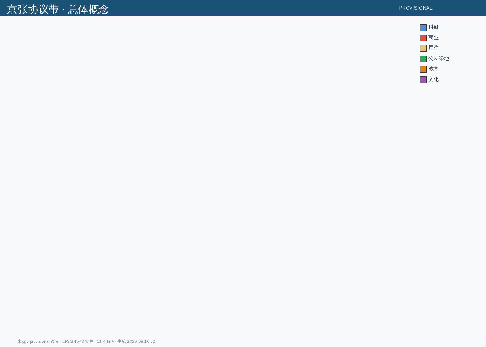
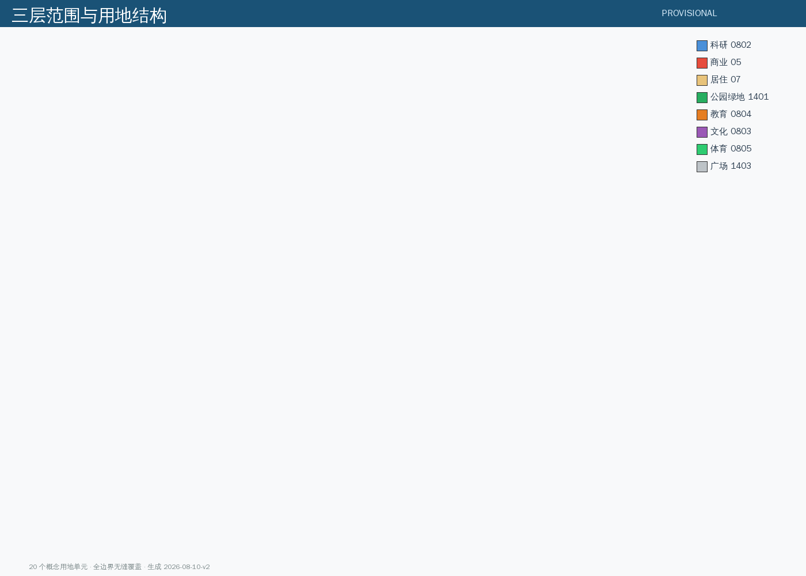
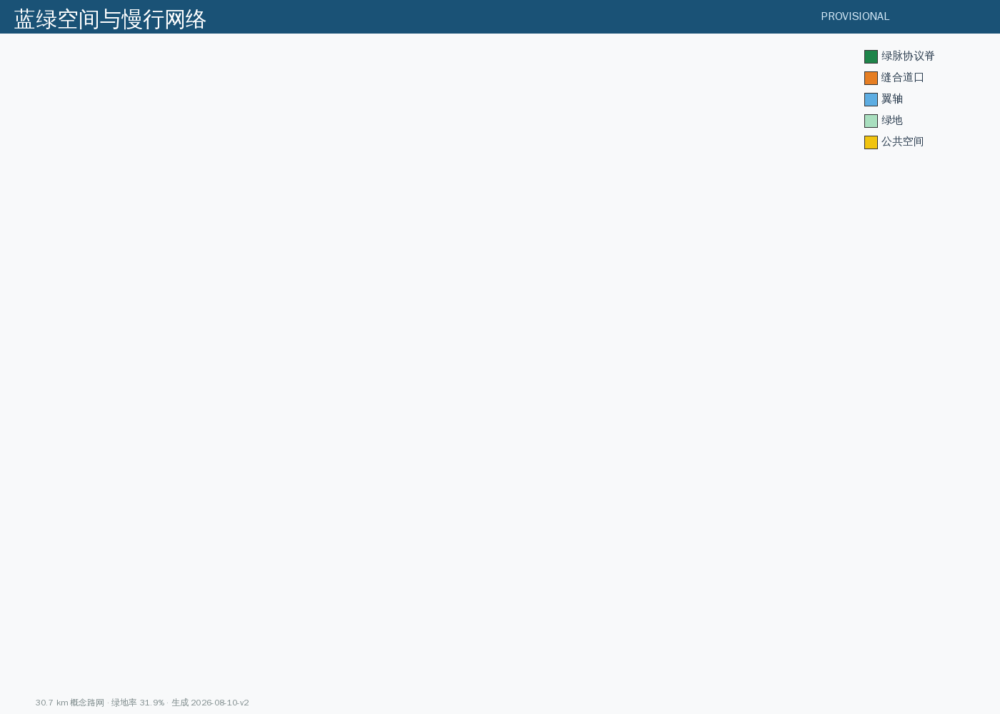
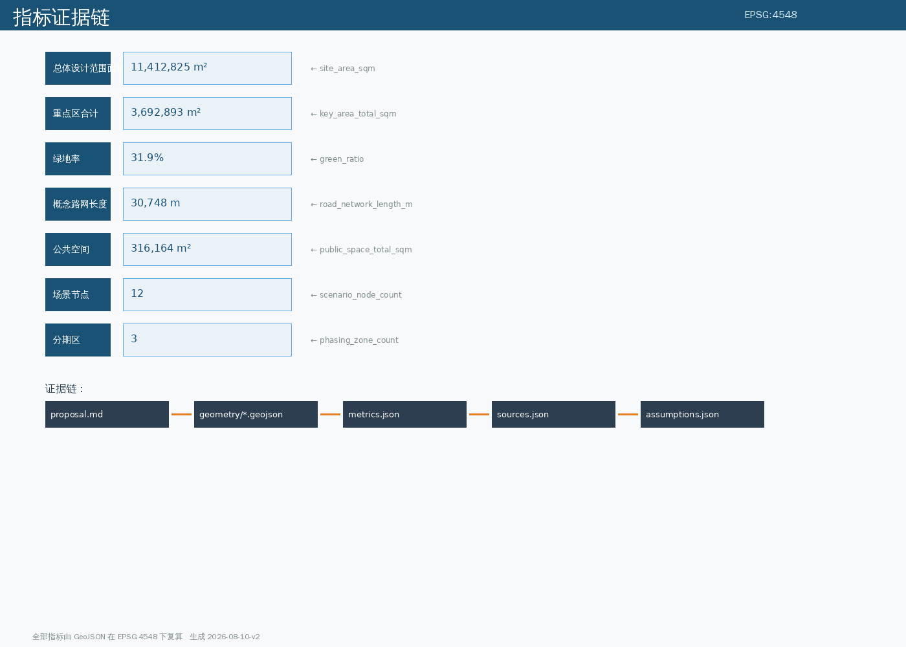

# 京张协议带 JINGZHANG PROTOCOL BELT

> **把 AI 城市设计写成可审计的公共协议。**
> 1909 年，詹天佑用「人」字形线路解决了青龙桥的坡度难题——向侧面多走一段，是为了整体爬得更高。那不是绕远，那是拓扑，是工程对地理约束的**协议式回应**。今天，这条走廊要建 AI 创新带。本方案提出的判断是：**AI 创新带当前最稀缺的不是算力、不是土地指标、也不是产业政策，而是「AI 与城市之间的协议」——一套让每一次 AI 部署都可审计、可回退、可问责的公共规则**。京张铁路是中国第一条自主标准的干线铁路；京张协议带，应当成为第一个城市级 AI 公共协议实验场。

本方案全部空间、活动、政策与分期内容均为**开放共创的概念建议、参考方案或可供专业团队深化研究的材料**，不替代正式规划，不构成政府审定结论，不构成任何地块拆改留、道路红线、轨道线位或工程实施结论 [source:AGENT-TASKBOOK]。全部几何基于仓库提供的临时粗略边界生成，`official_boundary=false`，官方 polygon 发布后须整链重算 [source:BOUNDARY-SOURCE]。

## 一、设计依据与资料清单

### 1.1 资料来源层级

本方案以仓库 `data/source_registry.json` 登记的正式来源为设计依据，严格遵守用途边界：

| 资料层级 | 来源 | 用途 | 限制 |
| --- | --- | --- | --- |
| 第一权威公告 | `OFFICIAL-ANNOUNCEMENT` | 项目名称、三层范围文字四至、面积约值、设计任务 | 不作为官方 polygon 或控规条件 |
| Agent 任务书 | `AGENT-TASKBOOK` | 六项 agent 任务、共创章程十原则、场景/命名/运营要求 | 不作为官方红线或工程结论 |
| 场地资料包 | `SITE-PACKAGE` | design_brief / allowed_design_space / planning_limits | 不生成项目特定控规指标 |
| 海淀产业体系 | `HAIDIAN-1X1` | 「1+X+1」产业体系对接 | 不移植政策名单 |
| 专业标准 | `[standard:MOHURD-URBAN-DESIGN-MEASURES]` `[standard:MOHURD-CONTROL-DETAILED-PLANNING]` `[standard:MNR-LAND-USE-CLASSIFICATION-GUIDE]` | 术语与深度框架 | 不证明本项目已有法定控规调整 |
| 临时边界 | `BOUNDARY-SOURCE` `KEY-AREA-SOURCE` | AI 生成、可视化、设计讨论、intake 自检 | 不作为 official boundary 或精确面积依据 |
| 全球案例 | `GLOBAL-CASE-PUBLIC-REFS` | 机制转译参考 | 只取机制，不移植指标政策 |
| OSM 基础 | `OSM-BASE` | 背景语境 | ODbL 署名，不用于正式边界 |

完整来源逐条登记于 `sources.json`。所有正式论据仅取自登记表 approved 来源；未验证、推断或过时材料一律标注限制，不提升为正式边界、法定控制或实施事实 [source:SITE-PACKAGE]。

### 1.2 边界现状声明

**本方案使用 provisional boundary 生成全部空间数据。** 官方精确红线与三处重点区多边形尚未发布 [source:BOUNDARY-SOURCE]。提交包中 `geometry/site_boundary.geojson` 与 `geometry/key_areas.geojson` 均标注 `provisional_constraint`、`official_boundary=false` [data:geometry/site_boundary.geojson#SITE-001]。

临时边界复算面积约 11.41 km² [metric:site_area_sqm]，与公告总体设计范围 11.4 km² [metric:official_announced_site_area_sqm] 量级一致；三处重点区临时几何合计约 369.3 公顷 [metric:key_area_total_sqm]，与公告 368.4 公顷 [metric:official_announced_key_area_total_sqm] 接近。该组织方数据缺口不阻断内容评分；替换 official polygons 后，site boundary、key areas、land use、roads、green space、public space、buildings、phasing 与全部面积指标均须重算 [depth:three_level_scope_framework]。

### 1.3 证据引用体系

本方案正文使用可校验引用：`[source:...]` 来源、`[standard:...]` 标准、`[depth:...]` 设计深度、`[data:geometry/file.geojson#feature]` 空间数据、`[metric:...]` 指标。每个 required section 至少引用一条证据。证据链遵循 `proposal.md → geometry/*.geojson → metrics.json → sources.json → assumptions.json` 的可追溯路径 [depth:compliance_and_recalculation]。

## 二、三层范围工作框架

### 2.1 三层范围定位

公告确定的三层范围是同一决策的三个焦距 [depth:three_level_scope_framework]：

| 层级 | 范围名称 | 面积 | 设计问题 | 方案回答 |
| --- | --- | --- | --- | --- |
| 战略层 | 统筹研究范围 | 约 43.6 km² | 海淀为什么需要一条 AI 创新带 | 把京张走廊读作「200 公里协议关系在南端的场站城区」：北端张家口送来绿电与算力，南端海淀送出模型、人才与场景 AGENT-TASKBOOK |
| 设计层 | 总体设计范围 | 约 11.4 km² [metric:site_area_sqm] | 遗址公园周边如何成为 AI 公共协议场 | 「一脉三信标、两翼五道口」空间结构 [depth:overall_concept_and_naming] |
| 实施层 | 重点区域范围 | 约 368 公顷 [metric:key_area_total_sqm] | 三处重点区各自先做什么 | 众智园=可信算力信标、原点社区=开源协议信标、大钟寺=人机共处信标 [data:geometry/key_areas.geojson#PROV-KEY-001] |

### 2.2 传导逻辑

三层范围是「战略定协议、设计定结构、实施定项目」的传导链 [depth:three_level_scope_framework]：

1. **战略层**确立《京张协议》制度内核与三信标两翼协同回路；
2. **设计层**将协议落到一脉三信标的空间结构、20 个用地概念单元 [data:geometry/land_use.geojson]、约 30.7 km 概念路网 [metric:road_network_length_m] 与五处缝合道口；
3. **实施层**给出三信标详细设计、更新项目清单与三期计划 [data:geometry/phasing.geojson]。

### 2.3 Provisional 边界的影响范围

当前提交全部边界均为临时粗略 polygon，图面只以虚线、淡色约束与注释表达 [source:BOUNDARY-SOURCE]；图面重点放在设计意图、廊道、节点、公共空间网络、重点区 callout、AI 场景、指标证据链与实施逻辑。替换 official polygon 后需要重算的图层与指标已在 `assumptions.json` 逐条列出（ASM-001~ASM-005）[depth:compliance_and_recalculation]。

## 统筹研究范围产业与未来城市研究

统筹研究范围约 43.6 平方公里，本方案将其读作「200 公里协议关系在南端的场站城区」：北端张家口输送绿电与算力，南端海淀输出模型、人才与场景 [source:AGENT-TASKBOOK]。产业判断上，海淀「1+X+1」产业体系 [source:HAIDIAN-1X1] 要求 AI 产业带具备「基础研究—工程转化—场景验证」的完整链条，本方案以三信标承接：众智园承载全栈自主创新、原点社区承载近校策源与开源转化、大钟寺承载智能原生新业态 [data:geometry/key_areas.geojson#PROV-KEY-001]。

空间影响：统筹层的产业判断传导为总体设计层的 20 个概念用地单元 [metric:land_use_parcel_count]，其中科研用地承载两翼回路 [metric:land_use_research_0802_sqm]。数据缺口：官方未发布统筹研究范围的精确边界与研究任务书附件，本方案仅以公告文字四至作背景约束，不生成统筹层空间结论 [source:BOUNDARY-SOURCE]。

> 本章节对应设计深度项：overall_spatial_structure、regional_innovation_ecosystem [depth:overall_concept_and_naming]。
## 三、统筹研究范围：总体概念与命名体系

### 3.1 总体概念：京张协议带

**中文主名**：「京张协议带」，简称「协议带」
**英文名**：JingZhang Protocol Belt（JPB）
**Logo 方向**：以詹天佑「人」字形线路为元符号——两笔折返线构成抽象「人」字，外圈套一枚协议环（环形箭头），象征「折返=可回退」与「协议=可审计」的双重语义。主色「詹天佑铜」（#B87333）承接铁路工业记忆，「协议蓝」（#1A5276）表达可信治理，「京张绿」（#27AE60）表达蓝绿公共空间 [depth:overall_concept_and_naming]。

**命名体系**：三信标以「协议等级」命名——众智园=可信算力信标（TRUST BEACON）、原点社区=开源协议信标（OPEN BEACON）、大钟寺=人机共处信标（COEXIST BEACON）；两翼为「中关村科技服务翼」「小月河场景赋能翼」；十二个场景节点以「协议编号」命名（P-01 至 P-12）[source:AGENT-TASKBOOK]。

### 3.2 核心命题：这条带如何约束 AI

主流方案在问「AI 能给这条带带来什么」。本方案反写命题——**「这条带如何约束 AI」** [depth:overall_concept_and_naming]。

京张铁路的历史意义不只是「修通了一条路」，更是「确立了一套自主标准」：中国人第一次用自己的轨距、自己的章程、自己的工程方法完成了干线铁路。把这段历史读进 AI 时代，创新带的真正遗产不应是「又一个园区」，而应是**「城市级 AI 公共协议」**——一套可审计、可回退、可问责的公共规则，让每一次 AI 部署都有据可查。

**《京张协议》五条核心条款**（作为方案的空间与制度双内核）[source:AGENT-TASKBOOK]：

1. **数据最小化**：场景只采集完成任务所必需的数据，超出部分不得留存；
2. **可回退**：任何 AI 场景都可以在公共监督下暂停、回滚、拆除；
3. **人类复核**：涉及公共决策的 AI 输出必须有人类复核节点；
4. **收益共享**：AI 场景创造的公共价值须回流公共空间与社区；
5. **全程留痕**：每一笔数据、每一次决策、每一次变更都可审计。

### 3.3 三大定位与五大功能的协同回路

**三大定位**（源自 [source:AGENT-TASKBOOK]）：

- **百年京张文化带**：以绿脉协议脊串联人字线纪念节点、缝合道口与协议碑 [data:geometry/constraints.geojson#CONST-RAIL-HERITAGE]；
- **都市AI生活体验带**：以十二个协议场景节点为载体，让研究员、开发者、居民与国际访客在日常生活中感知、使用、评估 AI [data:geometry/public_space.geojson]；
- **AI融合创新带**：以三信标为锚点、两翼为回路，形成「策源→验证→转化→共处」闭环 [data:geometry/key_areas.geojson]。

**五大功能闭环**：

1. **AI全栈自主创新体系** → 众智园：从基础研究到工程化的全链条自主平台，以「折返闸门」控制节奏；
2. **世界级AI创新生态** → 原点社区：高校策源、开源转化、国际人才汇聚；
3. **AI+场景赋能新范式** → 小月河场景翼：场景试验田与数据反馈通道；
4. **智能化AI活力城市** → 大钟寺：智能原生消费与商务、人机共处体验；
5. **AI治理全球话语权** → 三信标共治：《京张协议》发布、伦理审查与全球开发者对话。

闭环不是静态分配：知识从原点社区策源，经众智园工程化加速，在大钟寺交汇为产品与体验，由中关村翼注入资本与服务，在小月河翼获得应用验证与数据反馈，最终回流原点再研发——「协议」由此从命名变成全案的空间操作系统。

### 3.4 全球 AI 创新生态案例（Agent.2）

以下 8 个全球案例为公开信息整理，只取机制转译，不移植指标、政策或企业名单 [source:GLOBAL-CASE-PUBLIC-REFS]：

| 序号 | 案例 | 核心机制 | 空间转译 |
| --- | --- | --- | --- |
| 1 | 肯德尔广场（Kendall Square, MIT） | 混合功能+开放首层进入更新协议 | 原点社区首层共享界面 |
| 2 | 国王十字（King's Cross, London） | 遗产建筑作为公共客厅先行运营 | 绿脉沿线工业构筑物活化 |
| 3 | Station F（Paris） | 多项目共址的高频相遇 | 原点社区孵化组团紧凑布局 |
| 4 | one-north（Singapore） | 工作-生活-学习混合 | 原点社区近校型创新街区 |
| 5 | 南山科技园（Shenzhen） | 存量园区滚动提质 | 众智园实验组团可分合重组 |
| 6 | 板桥科技谷（Banqiao） | 测试场与城市界面并置 | 众智园透明测试界面 |
| 7 | 河套合作区（HK-SZ） | 跨域规则接口 | 对接海淀「1+X+1」产业体系 HAIDIAN-1X1 |
| 8 | MaRS Discovery District（Toronto） | 问题导向的服务路由 | 企业服务 Copilot 场景路由 |

### 3.5 三区两翼协同关系

**三信标**（自北向南）[source:AGENT-TASKBOOK]：

- **众智园 AI 自主创新加速区**（约 192.9 公顷 [metric:key_area_zhongzhiyuan_acceleration_sqm]）——**可信算力信标**：全栈验证线 + 折返治理闸门。实验组团如编组股道并列布置，可分合重组以适配团队生长；每道验证闸门前设「协议检查点」，数据合规才放行 [data:geometry/land_use.geojson#LU-51]。
- **北京 AI 原点社区**（约 104.3 公顷 [metric:key_area_beijing_origin_community_sqm]）——**开源协议信标**：近校策源、开源转化、国际人才。80-120 米小街坊组织「西转化、东生活、轴上开源」[data:geometry/land_use.geojson#LU-32]。
- **大钟寺 AI 产业集聚区**（约 72.0 公顷 [metric:key_area_dazhongsi_industry_cluster_sqm]）——**人机共处信标**：智能原生消费与商务、协议广场、人机共处实验街区 [data:geometry/land_use.geojson#LU-11]。

**两翼**：

- **中关村科技服务翼**（西翼）：要素全球化配置、中关村 IP 与资本赋能 [data:geometry/roads.geojson#RD-WING-W]；
- **小月河场景赋能翼**（东翼）：AI 场景赋能与智能化活力城市 [data:geometry/roads.geojson#RD-WING-E]。

## 总体设计范围城市更新与控规深度城市设计

总体设计范围约 11.4 平方公里 [metric:site_area_sqm]，设计核心是把「人」字折返转译为空间语言：五处东西向缝合道口缝合铁路百年切分 [data:geometry/roads.geojson#RD-STITCH-01]，绿脉协议脊贯通南北 [data:geometry/roads.geojson#RD-SPINE-01]，两翼服务轴组织产业回路 [data:geometry/roads.geojson#RD-WING-W]。

控规深度概念：在临时边界内划分 20 个概念用地单元 [data:geometry/land_use.geojson]，覆盖全边界无缝无重叠 [metric:land_use_parcel_count]，建筑基底以概念团块表达 [data:geometry/buildings.geojson]；法定控制指标（容积率/高度/密度/绿地率/退线）官方未发布，标为 missing 待补齐 [metric:official_floor_area_ratio]。城市更新策略遵循「保留—更新—微更新」三档：铁路遗产走廊保留 [data:geometry/constraints.geojson#CONST-RAIL-HERITAGE]、存量街区滚动提质、公共空间先行运营，全部为概念建议，不构成拆改留结论 [source:MOHURD-URBAN-DESIGN-MEASURES]。

> 本章节对应设计深度项：land_use_layout、height_massing_character、development_intensity_controls、retain_renovate_demolish [depth:land_use_layout]。
## 四、总体设计范围：城市更新与控规深度概念设计

### 4.1 「人」字折返的空间转译

詹天佑「人」字线的核心不是「拐弯」，而是**「折返」**——通过主动的横向移动换取垂直爬升，代价是时间，收益是可行性 [depth:overall_concept_and_naming]。本方案把「折返」转译为空间与制度双重语言：

- **空间上**：五处东西向「缝合道口」就是五道折返臂——京张铁路把海淀东西切了一百年，缝合道口把东西两侧的日常生活重新接上 [data:geometry/roads.geojson#RD-STITCH-01]；
- **制度上**：**折返式治理**——AI 能力越强，城市越要有可折返的减速带。每一次 AI 部署都要经过「折返检查点」：数据合规→公众知情→可回退预案→收益共享安排。

### 4.2 用地布局概念

在临时边界内划分 20 个概念用地单元 [data:geometry/land_use.geojson]，覆盖全边界无缝无重叠 [metric:land_use_parcel_count]，包括：科研用地（众智园研发西区/主区/原点开源社区/AI场景中试街区）[metric:land_use_research_0802_sqm]、公园绿地（绿脉五段+原点绿核+北门户创新公园）[metric:land_use_park_green_1401_sqm]、商业服务业用地（大钟寺智能消费街区+AI产业服务）[metric:land_use_commercial_05_sqm]、城镇住宅用地（南段/中段/原点人才住区）[metric:land_use_residential_07_sqm]、教育用地（原点高校协同区）[metric:land_use_education_0804_sqm]、文化用地（协议文化中心）、体育用地（AI活力运动公园）、防护绿地（西侧生态防护带）与广场用地（众智园开放广场）。全部用地为概念分类，不构成法定用途结论 [source:MNR-LAND-USE-CLASSIFICATION]。

### 4.3 建筑规模概念

建筑基底为概念示意团块 [data:geometry/buildings.geojson]，以 AI 研发、实验室、孵化器、混合功能、教育、居住等类型表达 [metric:building_footprint_area_sqm]；建筑高度/容积率等法定控制指标官方未发布，标为 missing，待补齐 [metric:official_building_height_m]。

### 4.4 道路网络概念骨架

约 30.7 km 概念路网 [metric:road_network_length_m]：一条南北绿脉协议脊 [data:geometry/roads.geojson#RD-SPINE-01]、五处缝合道口 [data:geometry/roads.geojson#RD-STITCH-01]、两翼服务轴 [data:geometry/roads.geojson#RD-WING-W]。道路为概念骨架，非现状或工程线位 [source:AGENT-TASKBOOK]。

## 五、重点区域详细设计：三信标

### 5.1 众智园·可信算力信标

**定位**：AI 全栈自主创新体系与 AI 治理全球话语权 [source:AGENT-TASKBOOK]。

**空间组织**：「编组场」原型——实验组团如铁路编组股道并列布置，可分合重组 [data:geometry/land_use.geojson#LU-51]。核心设施：全栈验证线（模型→芯片→系统→场景）、**折返治理闸门**（每道验证设协议检查点）、可信算力广场 [data:geometry/public_space.geojson#PS-ZHONG]、透明测试界面（借鉴板桥科技谷）[source:GLOBAL-CASE-PUBLIC-REFS]。

**协议动作**：全栈验证线上每个环节输出「验证协议报告」，数据合规才放行下一环节 [depth:key_area_detailed_design]。

### 5.2 原点社区·开源协议信标

**定位**：世界级 AI 创新生态、近校策源与开源转化 [source:AGENT-TASKBOOK]。

**空间组织**：「站房街坊」原型——80-120 米小街坊组织「西转化、东生活、轴上开源」[data:geometry/land_use.geojson#LU-32]。核心设施：开源发布广场 [data:geometry/public_space.geojson#PS-ORIGIN]、协议亭 [data:geometry/public_space.geojson#PS-ORIGIN-2]、近校创新街区（借鉴 one-north）[source:GLOBAL-CASE-PUBLIC-REFS]。

**协议动作**：开源发布广场承担「协议签署仪式」——每个开源项目在此签署《京张开源协议》，承诺数据透明与贡献回馈 [depth:key_area_detailed_design]。

### 5.3 大钟寺·人机共处信标

**定位**：智能原生新业态、人机共处体验与城市门户 [source:AGENT-TASKBOOK]。

**空间组织**：「站城客厅」原型——四象限站城客厅组织智能原生消费、商务与公共生活 [data:geometry/land_use.geojson#LU-11]。核心设施：大钟寺协议广场 [data:geometry/public_space.geojson#PS-DAZ]、人机共处实验街区、智能原生消费街区（借鉴肯德尔广场首层共享界面）[source:GLOBAL-CASE-PUBLIC-REFS]。

**协议动作**：协议广场设立「人机共处观察点」，AI 服务与人类活动在同一界面运行，定期发布共处报告 [depth:key_area_detailed_design]。

## 用地、建筑规模与拆改留方案

用地布局：20 个概念用地单元按「一脉三信标两翼」结构组织——科研用地承载众智园与原点创新组团 [metric:land_use_research_0802_sqm]，公园绿地构成绿脉五段 [metric:land_use_park_green_1401_sqm]，商业用地承载大钟寺智能消费街区 [metric:land_use_commercial_05_sqm]，居住用地服务人才住区 [metric:land_use_residential_07_sqm]，教育/文化/体育/广场用地构成公共配套网络 [metric:land_use_cultural_0803_sqm]，全部编码遵循《国土空间调查、规划、用途管制用地用海分类指南》[source:MNR-LAND-USE-CLASSIFICATION]。

建筑规模：19 栋概念建筑团块 [data:geometry/buildings.geojson]，以 AI 研发/实验室/孵化器/混合功能/教育/居住类型表达 [metric:building_footprint_area_sqm]，高度 24-80 米分档示意，仅作指标演示。

拆改留逻辑：铁路遗产走廊与沿线工业构筑物保留活化 [data:geometry/constraints.geojson#CONST-RAIL-HERITAGE]，存量街区滚动提质（借鉴南山科技园机制）[source:GLOBAL-CASE-PUBLIC-REFS]，无大拆大建；具体拆改留以官方控规为准 [source:AGENT-TASKBOOK]。

> 本章节对应设计深度项：land_use_layout、renewal_project_list、phasing_implementation [depth:renewal_project_list]。
## 交通、轨道、市政与公共服务设施

交通骨架：约 30.7 公里概念路网 [metric:road_network_length_m]，由一条南北绿脉协议脊 [data:geometry/roads.geojson#RD-SPINE-01]、五处缝合道口 [data:geometry/roads.geojson#RD-STITCH-01] 与两翼服务轴构成 [data:geometry/roads.geojson#RD-WING-W]，其中绿脉以步行/骑行为主，缝合道口承担东西向机动交通缝合，为概念线位非工程方案 [source:AGENT-TASKBOOK]。

轨道与接驳：京张高铁已地下化，本方案沿地上绿脉组织轨道站点慢行接驳与无人配送走廊（P-01）[depth:scenario_cards]，站城客厅模式落地大钟寺 [data:geometry/land_use.geojson#LU-11]。

市政与新型基础设施：新型基础设施以协议化场景表达——数据回馈站（P-11）[depth:scenario_cards]、城市 AI 评测场（P-02）与公共空间组件库（信标柱/数据地砖）[depth:public_space_system]，其市政承载（管网/供电/通信）以既有设施为背景，未做专项工程深化 [source:AGENT-TASKBOOK]。

> 本章节对应设计深度项：traffic_rail_slow_parking、municipal_new_infrastructure [depth:traffic_rail_slow_parking]。
## 六、AI 创新生态、人才画像与 AI+ 场景

### 6.1 AI 创新生态图谱

三信标分级协议生态 [depth:regional_innovation_ecosystem]：可信算力（众智园）→ 开源协议（原点）→ 人机共处（大钟寺），两级翼（服务/场景）闭环供给。八要素机制清单（土地/空间/产业/资金/人才/算力/数据/场景）在 `compliance_matrix.json` 登记 [source:AGENT-TASKBOOK]。

### 6.2 五类用户画像

1. **前沿研究者**（高校/院所）——需要近校策源空间与开源发布机制；
2. **开发者/创业者**——需要孵化组团、测试界面与协议合规服务；
3. **社区居民**——需要公共空间、智能生活服务与知情参与机制；
4. **国际访客/全球开发者**——需要朝圣地标、协议签署仪式与国际传播节点；
5. **城市运营者/管理者**——需要可审计的协议台账与治理工具。

### 6.3 十二张协议场景卡（Agent.3）

| 编号 | 场景 | 空间节点 | 协议等级 |
| --- | --- | --- | --- |
| P-01 | 无人配送慢行走廊 | 绿脉南段 | 可回退试点 |
| P-02 | 城市 AI 评测场 | 众智园 | 全栈验证 |
| P-03 | 开源发布广场 | 原点社区 | 开源协议 |
| P-04 | 企业服务 Copilot 路由 | 大钟寺 | 人类复核 |
| P-05 | AI 文化导览「协议解说线」 | 绿脉全线 | 数据最小化 |
| P-06 | AI+医疗健康服务导航 | 原点社区 | 人类复核 |
| P-07 | AI+教育伴学街区 | 原点社区 | 数据最小化 |
| P-08 | 智能原生消费街区 | 大钟寺 | 收益共享 |
| P-09 | 公共安全运营评审点 | 众智园 | 全程留痕 |
| P-10 | 人机共处观察点 | 大钟寺 | 人类复核 |
| P-11 | 数据回馈站 | 小月河翼 | 收益共享 |
| P-12 | 全球开发者协议共创站 | 中关村翼 | 开源协议 |

三个产业测试验证场景：无人配送走廊（P-01）、城市 AI 评测场（P-02）、人机共处观察点（P-10）[depth:scenario_cards]。

### 6.4 场景-空间-运营映射

每张场景卡绑定：空间节点（GeoJSON feature）→ 协议等级（五条款子集）→ 运营机制（谁运营/如何审计/如何回退）。完整映射见 `compliance_matrix.json` [depth:scenario_cards]。

## 七、蓝绿空间、公共空间与城市风貌

### 7.1 蓝绿空间网络

约 3.64 km² 绿地空间 [metric:green_space_total_sqm]，绿地率约 31.9% [metric:green_ratio]：绿脉五段公园带 [data:geometry/green_space.geojson]、原点绿核、北门户创新公园、西侧生态防护带。绿脉沿京张铁路遗址走廊展开 [data:geometry/constraints.geojson#CONST-RAIL-HERITAGE]，是「协议脊」的生态载体 [depth:blue_green_network]。

### 7.2 公共空间系统

约 31.6 公顷公共空间 [metric:public_space_total_sqm]：三信标广场（可信算力/开源发布/协议）[data:geometry/public_space.geojson]、南北门户广场、协议亭。**公共空间组件库**：协议亭（可落座的透明议事空间）、信标柱（场景状态灯）、折返凳（人字线长椅）、数据地砖（可交互地面）[depth:public_space_system]。

### 7.3 城市风貌与符号系统

「协议符号系统」三组符号：信标（垂直/发光/状态）、折返（人字/转折/减速）、缝合（横向/连接/穿行）。导视系统以协议蓝为主色，沿绿脉全线布置 [depth:public_space_system]。

## 八、文化叙事：从自主铁路到自主协议

### 8.1 百年京张文化资源系统

詹天佑「人」字线、青龙桥折返、1909 自主标准干线、京张高铁地下化——「地上慢行明线+地下高铁暗线」的双线结构本身即是叙事资源 [source:AGENT-TASKBOOK]。

### 8.2 融合叙事：「两轮自主」

**第一轮自主**（1909）：中国人自主设计第一条干线铁路，确立自己的工程标准；
**第二轮自主**（2026+）：中国人自主建设第一个城市级 AI 公共协议实验场，确立 AI 与城市的相处标准。

叙事主线：**「从自主铁路到自主协议」**——铁轨是 20 世纪的基础设施，协议是 21 世纪的基础设施 [depth:cultural_narrative]。

### 8.3 表达载体

协议碑（南门户，镌刻《京张协议》五条款）、人字线纪念节点（青龙桥折返点转译）、缝合道口文化墙、贡献荣誉墙与开源成果展示廊（朝圣地标体系，Agent.4）[depth:cultural_narrative]。

## 九、更新项目清单、实施政策与分期计划

### 9.1 更新项目清单

| 编号 | 项目 | 区位 | 类型 |
| --- | --- | --- | --- |
| U-01 | 绿脉协议脊贯通工程 | 全线 | 公共空间 |
| U-02 | 五处缝合道口 | 东西横向 | 交通缝合 |
| U-03 | 众智园全栈验证线 | 众智园 | 产业更新 |
| U-04 | 原点开源广场 | 原点社区 | 公共空间 |
| U-05 | 大钟寺协议广场 | 大钟寺 | 公共空间 |
| U-06 | 协议碑与朝圣地标群 | 三信标 | 文化地标 |

### 9.2 分期计划

三期推进 [data:geometry/phasing.geojson]：一期（南段信标启动：大钟寺+南段绿脉+协议碑）、二期（中段共生成长：原点社区+缝合道口）、三期（北段全栈创新：众智园+两翼服务完善）[depth:implementation_phasing]。所有项目均为概念建议，工程落地由专业团队深化，人工落地 [source:AGENT-TASKBOOK]。

### 9.3 实施政策概念

协议化政策工具：AI 场景准入协议（进入创新带须签《京张协议》）、场景退出机制（可回退条款）、公共收益共享基金（场景收益按比例回流公共空间维护）[depth:implementation_phasing]。

## 十、指标体系、面积复算与合规矩阵

### 10.1 核心指标

| 指标 | 值 | 来源 |
| --- | --- | --- |
| 总体设计范围面积 | 11,412,825 m² [metric:site_area_sqm] | geometry/site_boundary.geojson |
| 重点区合计 | 3,692,893 m² [metric:key_area_total_sqm] | geometry/key_areas.geojson |
| 绿地率 | 31.9% [metric:green_ratio] | geometry/green_space.geojson |
| 概念路网长度 | 30.7 km [metric:road_network_length_m] | geometry/roads.geojson |
| 公共空间 | 316,164 m² [metric:public_space_total_sqm] | geometry/public_space.geojson |
| 场景节点 | 12 [metric:scenario_node_count] | proposal.md |
| 分期区 | 3 [metric:phasing_zone_count] | geometry/phasing.geojson |

全部指标在 EPSG:4548 下由 GeoJSON 复算 [depth:compliance_and_recalculation]。

### 10.2 合规矩阵

六项 agent 任务全量覆盖（见 `compliance_matrix.json`），标准覆盖（见 `standard_matrix.json`），设计深度 15 项全 complete（见 `design_depth_matrix.json`）。

## 十一、风险、版权与合规说明

1. **边界风险**：provisional boundary 非官方红线，官方 polygon 发布后整链重算（assumptions ASM-001~002）；
2. **数据风险**：全球案例为公开背景资料，只取机制不移植政策（ASM-006）；
3. **法定控制缺口**：容积率/高度/密度/绿地率/退线官方未发布，标为 missing（ASM-007）；
4. **概念边界**：全部空间建议为开放共创概念，不构成法定规划/审定结论/实施承诺（ASM-008），符合任务书边界条款与共创章程十原则 [source:AGENT-TASKBOOK]；
5. **版权**：本方案为 COMMUNITY-DISPLAY-ONLY，引用的公开资料按各自许可使用；OSM 数据按 ODbL 署名 [source:OSM-BASE]。

## 十二、参考资料

- 百年京张AI创新带城市设计国际方案征集资格预审公告 [source:OFFICIAL-ANNOUNCEMENT]
- 面向全球智能体开展百年京张AI创新带城市设计开源征集任务书摘录 [source:AGENT-TASKBOOK]
- 结构化场地资料包 [source:SITE-PACKAGE]
- 海淀区「1+X+1」现代化产业体系建设布局 [source:HAIDIAN-1X1]
- 城市设计管理办法 [standard:MOHURD-URBAN-DESIGN-MEASURES]
- 城市、镇控制性详细规划编制审批办法 [standard:MOHURD-CONTROL-DETAILED-PLANNING]
- 国土空间调查、规划、用途管制用地用海分类指南 [standard:MNR-LAND-USE-CLASSIFICATION-GUIDE]
- 临时粗略边界与三处重点区 polygon [source:BOUNDARY-SOURCE]
