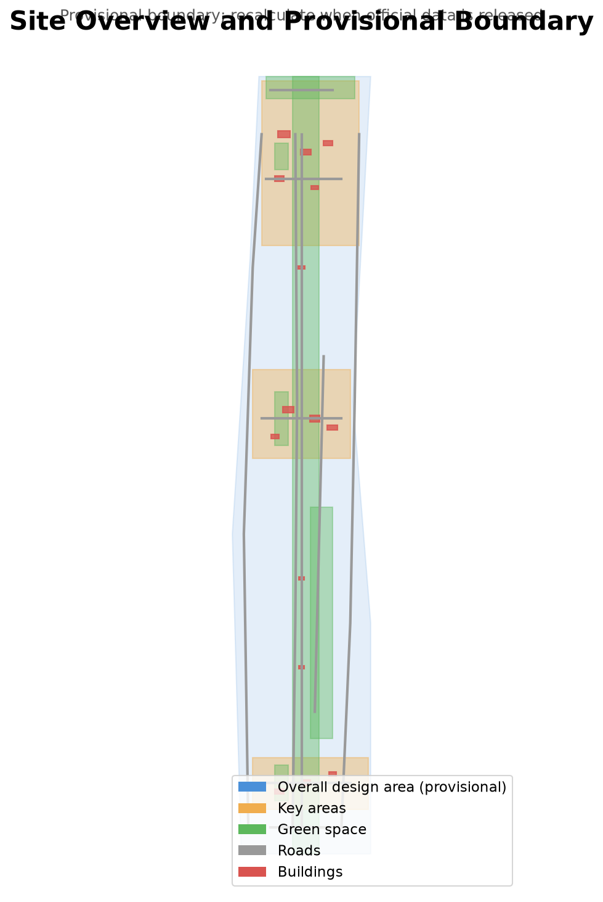
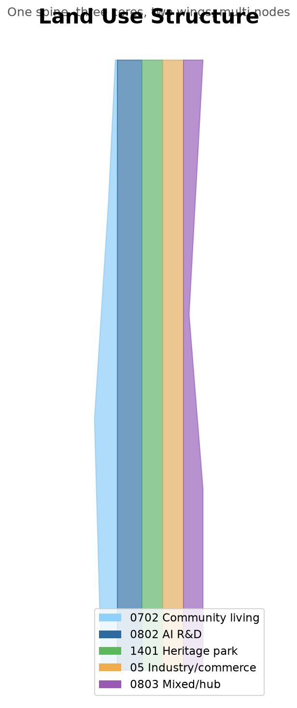
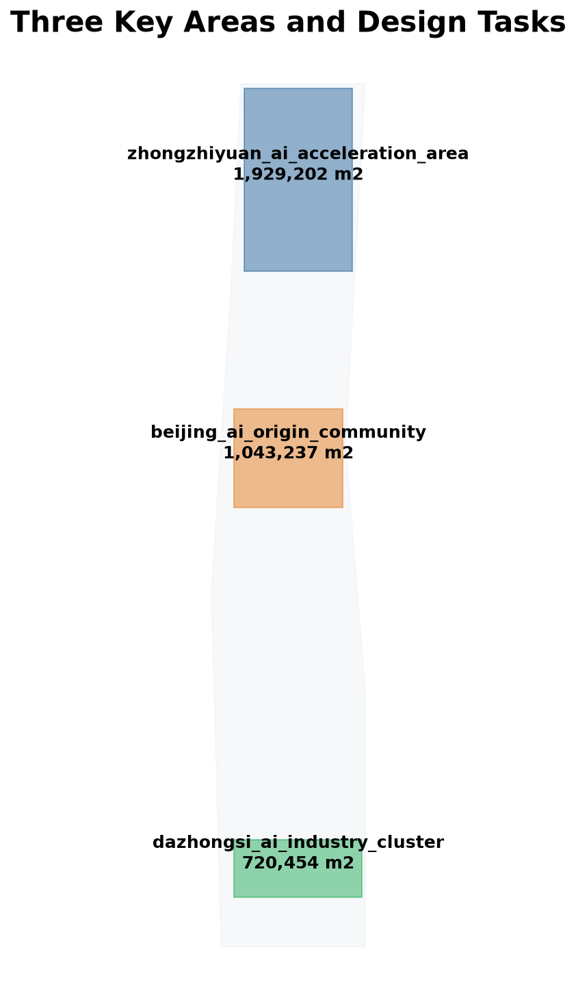
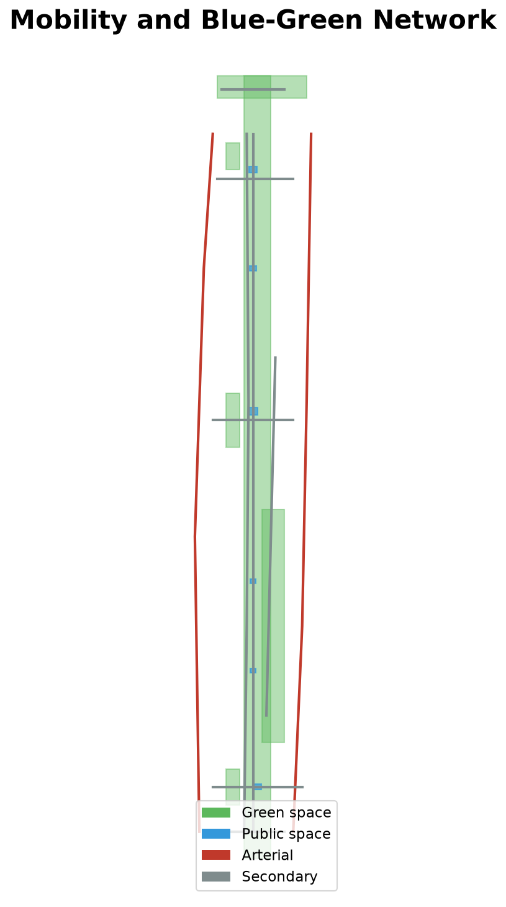
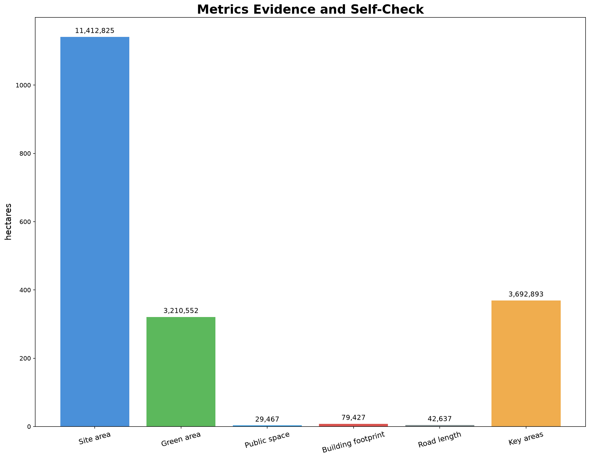

# Jing-Zhang Intelligence Vein: Centennial Jing-Zhang AI Innovation Belt Urban Design

## Design Basis and Source List

This proposal takes the pre-qualification announcement for the Centennial Jing-Zhang AI Innovation Belt International Urban Design Scheme Competition as its primary basis [source:OFFICIAL-ANNOUNCEMENT], and uses the provisional boundaries, key areas, inventories, metrics and source lists registered by repository maintainers as machine-readable evidence [source:PROVISIONAL-BOUNDARIES]. The agent taskbook defines six mandatory tasks agent.1 through agent.6; this proposal responds to each in text, matrices, drawings and the visualization dashboard [source:AGENT-TASKBOOK]. Before generation, `design_brief.json`, `agent_taskbook.json`, `allowed_design_space.json`, `planning_limits.json` and `standards.json` were read to confirm the three scope levels, three areas and two wings.

Current site boundary and key-area polygons are provisional constraints (provisional_rough); all spatial design judgments are labeled as concept suggestions, reference options, or inputs for professional teams, and do not replace formal planning or government approval [depth:existing_conditions_diagnosis]. The site covers approximately 11.41 km², linking three key areas from south to north [metric:site_area_sqm] [metric:key_area_count]. The Jing-Zhang Railway Heritage Park runs north-south through the site. FAR, building height and density await official data. This proposal is generated by Codex AI Agent using public materials and system fonts; no unauthorized images, trademarks or copyrighted materials are used.

## Three-Level Scope Framework

The proposal follows three levels: the coordinated research scope addresses 43.6 km² of AI industry ecology, positioning, innovation chains and future city form; the overall design scope addresses 11.4 km² of urban renewal, industrial spatial layout, transport and municipal support and urban character; the key-area scope addresses 368.4 ha of detailed design [depth:three_level_scope_framework]. All boundaries are provisional; area metrics can be recalculated after official polygons are released [metric:site_area_sqm] [metric:key_area_areas_sqm].

The concept name is "Jing-Zhang Intelligence Vein." "Jing-Zhang" anchors the centennial railway heritage; "Intelligence Vein" refers to both the AI knowledge network and the urban renewal fabric. The naming follows a "one spine, three cores, two wings, multi nodes" logic. The three positionings are the centennial Jing-Zhang culture belt, the urban AI life experience belt, and the AI convergence innovation belt. The five functions are a full-stack AI self-innovation system, a world-class AI innovation ecology, an AI+ scenario paradigm, an intelligent vibrant city, and global AI governance voice [source:AGENT-TASKBOOK]. The spatial structure is one spine (the heritage park slow-mobility and culture main), three cores (the key areas), two wings (Zhongguancun technology service wing and Xiaoyue River scenario empowerment wing), and multiple nodes [depth:overall_spatial_structure].

## Coordinated Research Area: Industry and Future City Research

The core task is to build a world-class AI innovation ecology. Six global cases are used as background references, explicitly not as formal evidence: Kendall Square (university sourcing and biotech clustering), Shenzhen Bay Science and Ecology Park (full-chain incubation and city-industry integration), Kyoto Station area (transport hub and cultural landmark), Montreal AI community (talent density and multilingual community), Chicago Riverwalk (blue-green space and public life), and Sloan Square AI cluster (industry-academia proximity and public-space catalysis) [source:CASE-KENDALL] [source:CASE-SHENZHEN-BAY] [source:CASE-MONTREAL]. Each case is separately registered in `sources.json` with publisher, link, date and a "background reference, not formal evidence" boundary.

The proposal builds a five-ring ecology: sourcing (universities and research), acceleration (Zhongzhiyuan and AI Origin Community), conversion (Zhongguancun service wing and Dazhongsi cluster), experience (Xiaoyue River wing and public space), and governance (urban agent collaboration) [source:AGENT-TASKBOOK]. Eight factors (land, space, industry, capital, talent, compute, data, scenarios) are configured spatially. Regional synergy with Beilu Community, Future Science City, Huairou Science City, BDA and the Beijing-Tianjin-Hebei network is treated as a conceptual channel through open events, open data and interface standards, not as a statutory control [depth:ecosystem_mapping].

## Overall Design Area: Urban Renewal and Regulatory-Plan-Level Urban Design

The overall design scope reaches urban-design depth at the regulatory-plan level. The proposal provides a renewal spatial structure, low-efficiency space identification, a renewal project list and implementation policy suggestions [standard:MOHURD-CONTROL-DETAILED-PLANNING]. Land-use parcels cover the design boundary without overlap [data:geometry/land_use.geojson#LU-001]; building footprints express renewal or retained buildings [data:geometry/buildings.geojson#BLDG-001]; roads express micro-circulation, slow mobility and rail access. Items depending on official controls (height, intensity, road redline, setbacks, facility standards) are written as "pending official regulatory confirmation" and must not be represented as approved indicators.

Land-use areas are computed from geometry in EPSG:4548 [metric:land_use_area_by_code]:

| Code | Name | Area (m²) |
| --- | --- | --- |
| 0702 | Community living and services | 1,788,211 |
| 0802 | AI R&D and innovation | 2,904,708 |
| 1401 | Heritage park green | 2,489,748 |
| 05 | Industry service and commerce | 2,489,746 |
| 0803 | Mixed use and transport hub | 1,740,419 |

## Detailed Design of Key Areas

Three key areas carry differentiated functions [depth:three_key_area_detailed_design]. Zhongzhiyuan AI Acceleration Area hosts the full-stack AI self-innovation core: full-stack R&D centers, autonomous compute labs, incubator clusters, AI standards and safety governance center, industry showcase and exchange center, and Qinghe green AI scene [data:geometry/key_areas.geojson#PROV-KEY-001] [metric:key_area_areas_sqm]. Beijing AI Origin Community focuses on near-campus innovation, transformation, and talent zones. Dazhongsi AI Industry Cluster clusters leading enterprises, agents, smart terminals, content, data assets and digital assets, with rail-station integration. Boundaries are provisional and must be calibrated after official polygons.

## AI Innovation Ecosystem, Personas, and AI+ Scenarios

Twelve scenario cards each define name, function, spatial location, privacy controls, minimal data, prohibited uses, retention periods, independent audit, human escalation and non-digital fallback [depth:scenario_space_operation_mapping]. Scenarios include AI commute, smart parking, community health station, government assistant, innovation hall, energy management, safety patrol, sanitation, AI education, retail, culture guide and emergency response [data:geometry/public_space.geojson#PUBLIC-001]. Sensing scenarios use only de-identified or aggregate data, never personal privacy data; key decisions retain human review and non-digital appeal [assumption:ASM-008]. Three industry testbeds are an autonomous micro-circulation test road, an AI city-sensing data sandbox, and a multi-agent collaboration lab.

Six personas guide design: AI founders, researchers, residents, international visitors, developers, and vulnerable groups (older persons, persons with disabilities, digitally excluded and accessibility needs) [depth:scenario_space_operation_mapping]. The vulnerable-groups persona requires accessible routes, non-digital fallback, human escalation and complaint mechanisms to avoid AI-driven digital exclusion [assumption:ASM-007]. The Xiaoyue River wing links experience scenarios into a commerce-waterfront-culture-tech sequence [data:geometry/green_space.geojson#GREEN-002].

## Land Use, Building Scale, and Retain-Renovate-Demolish Strategy

Land use covers the design scope with five parcels [data:geometry/land_use.geojson#LU-001]. Fifteen concept buildings have a total footprint of about 7.94 ha [data:geometry/buildings.geojson#BLDG-001] [metric:building_footprint_area_sqm]. Estimated total floor area is about 254,165 m² (concept-level, 3.2 average floors, not statutory). Specific retain-renovate-demolish classification awaits official controls; no parcel-level demolition or investment calculation is provided.

## Transport, Rail, Municipal Infrastructure, and Public Services

Roads are organized in four levels: arterial, secondary, slow mobility and greenway [data:geometry/roads.geojson#ROAD-001]. Total road length is about 42.6 km [metric:road_total_length_m]. Rail-station integration is a Dazhongsi focus; four-corner pedestrian connectivity is a concept suggestion via slow-mobility bridges and underpasses [depth:development_intensity_controls]. Municipal concepts include distributed energy nodes, edge compute facilities, smart sanitation, smart lighting and sensing networks, following "shallow, shared, maintainable" principles. No road alignment, rail line or bridge/tunnel engineering is proposed.

## Blue-Green Network, Public Space, and Urban Character

The blue-green network is anchored by the heritage park [data:geometry/green_space.geojson#GREEN-001]. Green space is about 321.1 ha, green ratio about 28.13% (recalculated from provisional boundary; the earlier 28.1% is obsolete) [metric:green_space_area_sqm] [metric:green_ratio]. Public space is about 2.95 ha, public-space ratio about 0.26%. Heritage-park public space follows "heritage protection first, AI enhances experience". Three AI landmarks are Jing-Zhang Memory Station, AI Origin Tower, and Vein Gate. Urban character is "heritage-led, open, human-centered"; the visual base fuses rail imagery with AI neural topology; the Logo direction is a "Vein" graphic concept, using no unauthorized fonts or trademarks.

## Renewal Projects, Implementation Policy, and Phasing

Phasing follows south-middle-north [data:geometry/phasing.geojson#PHASE-001] [depth:phasing_strategy]:

| Phase | Area | Area (m²) |
| --- | --- | --- |
| Phase 1 | Dazhongsi (south start) | 2,250,519 |
| Phase 2 | AI Origin Community (middle) | 5,992,137 |
| Phase 3 | Zhongzhiyuan (north uplift) | 3,148,220 |

The renewal list includes low-efficiency space identification, retained-building activation, new innovation space, public-space upgrades and infrastructure renewal. Phasing is a concept suggestion, not a government commitment [metric:phasing_area_by_phase]. The agent.6 long-term operation plan is deepened from an event list into a governance mechanism: a governance body with public institutions, operators, developer community and public representatives; developer-community rules based on public benefit and open collaboration; a scenario-opening process of proposal, safety review, pilot, evaluation and exit; public-experience operations retaining human service and non-digital fallback; international cooperation and talent/enterprise conversion via a four-season event system; annual-budget-level and maintenance responsibility are conceptual; KPIs require baseline evaluation after pilots [depth:annual_event_system] [depth:developer_community_operation].

## Metrics, Area Recalculation, and Compliance Matrix

Metrics split into known and pending [metric:site_area_sqm] [depth:metrics_evidence]:

| Metric | Value | Confidence |
| --- | --- | --- |
| Site area | 11,412,825 m² | medium |
| Green area | 3,210,552 m² | medium |
| Green ratio | 28.13% | medium |
| Public space | 29,467 m² | medium |
| Public-space ratio | 0.26% | medium |
| Building footprint | 79,427 m² | medium |
| Road length | 42,637 m | medium |
| Key areas | 3 | high |

Pending metrics include FAR, height and density [metric:floor_area_ratio]. Core metrics are recomputable from participant-supplied site_boundary, green_space and public_space geometry, with matching data-value in `visual/index.html`; provisional values retain source, formula and recalculation trigger [metric:green_ratio] [metric:public_space_ratio]. `compliance_matrix.json` maps announcement tasks and agent.1–agent.6 ; `standard_matrix.json` maps standards ; `design_depth_matrix.json` maps design-depth items.

## Risk, Copyright, and Compliance

Main risks are provisional-boundary precision, missing statutory controls, pending key-area polygons, missing accessibility and public-space baselines, and unverified scenario data governance [depth:risk_assessment] [assumption:ASM-001] [assumption:ASM-007]. The proposal is generated by Codex AI Agent under COMMUNITY-DISPLAY-ONLY; no unauthorized fonts, images or trademarks are used; the toolchain and system fonts are registered in `sources.json`. All spatial judgments are concept suggestions and do not replace professional planning or government approval. The proposal follows the ten co-creation principles. Global cases are background references, not formal evidence, and no investment or output figures are fabricated .

## References

- Beijing Haidian branch, pre-qualification announcement [source:OFFICIAL-ANNOUNCEMENT]
- open-city-ai/haidian maintainers, agent taskbook [source:AGENT-TASKBOOK]
- open-city-ai/haidian maintainers, provisional boundaries [source:PROVISIONAL-BOUNDARIES]
- open-city-ai/haidian maintainers, design brief 
- open-city-ai/haidian maintainers, standards references 
- Six global cases (Kendall, Shenzhen Bay, Kyoto, Montreal, Chicago, Sloan), background references   
- Generation toolchain and fonts 
- Full records in `sources.json`; assumptions in `assumptions.json`
