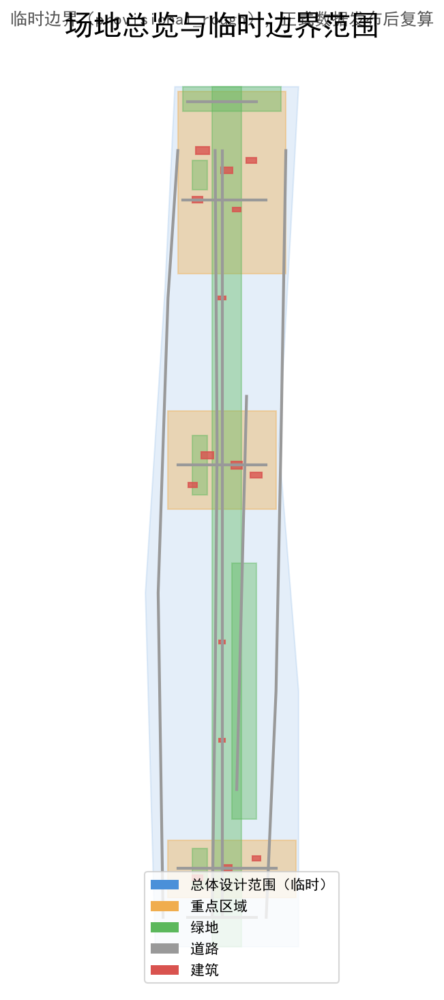
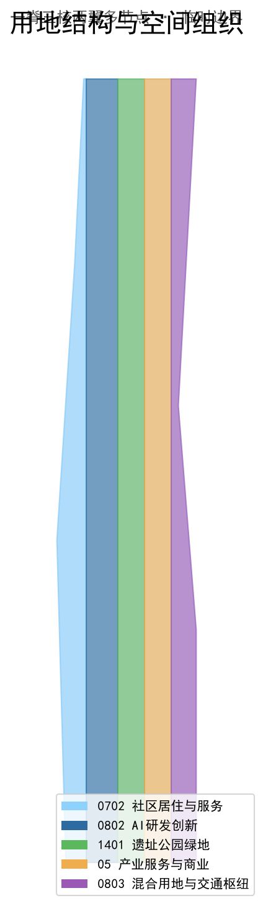
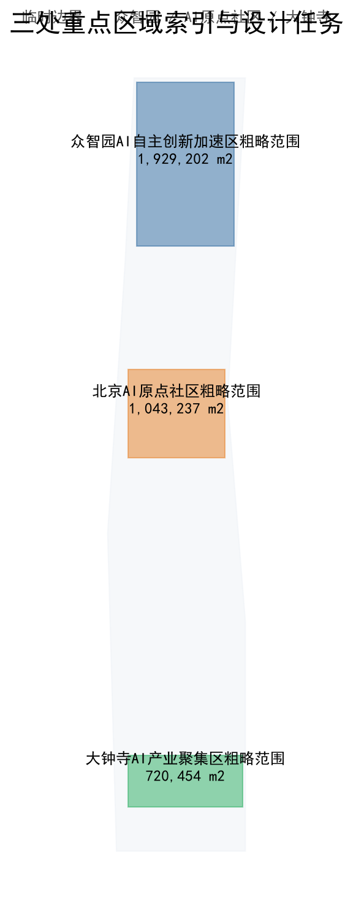
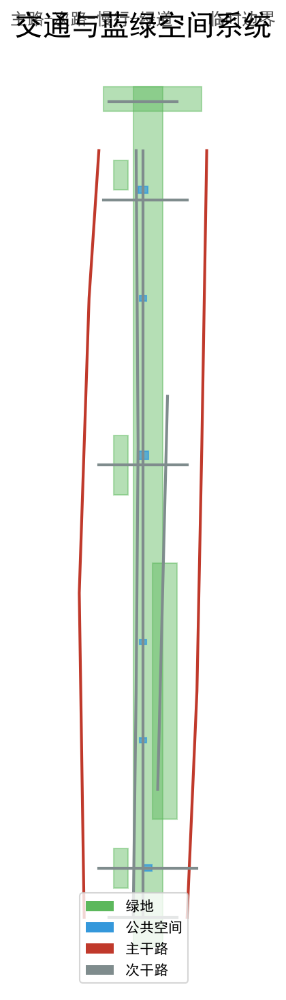
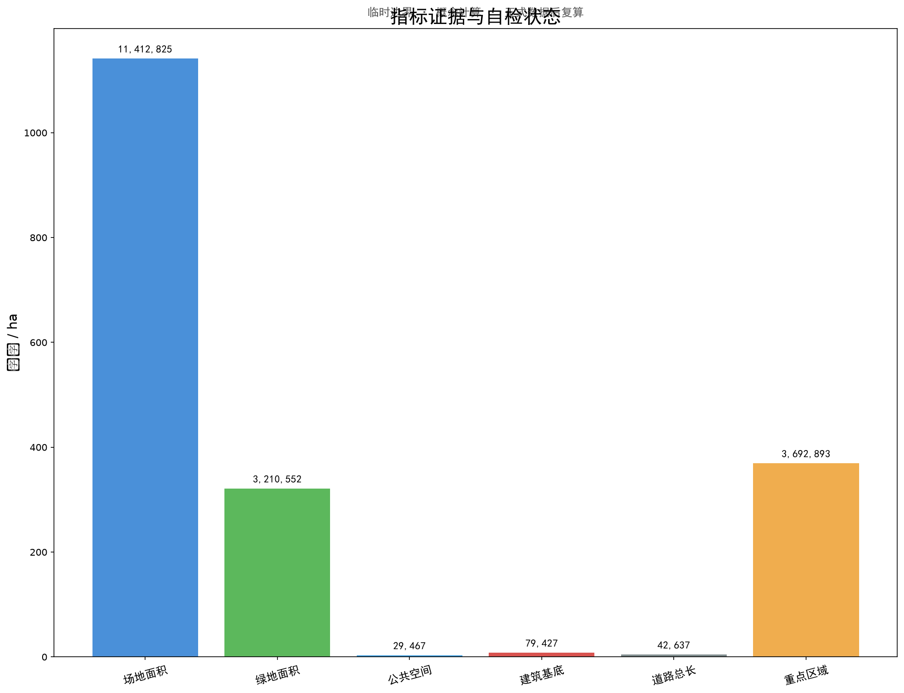

# 京张智脉：百年京张AI创新带城市设计

## 设计依据与资料清单

本方案以北京市规划和自然资源委员会海淀分局发布的《百年京张AI创新带城市设计国际方案征集资格预审公告》为第一依据 [source:OFFICIAL-ANNOUNCEMENT]，以仓库维护团队登记的临时粗略边界、重点区域、枚举、指标和来源清单为机器可读依据 [source:PROVISIONAL-BOUNDARIES]。面向智能体任务书规定了 agent.1 至 agent.6 六项必选任务，方案逐条回应并在正文、矩阵、图件和可视化仪表板中落实 [source:AGENT-TASKBOOK]。生成前已读取 `design_brief.json`、`agent_taskbook.json`、`allowed_design_space.json`、`planning_limits.json` 和 `standards.json`，确认三层范围、三区两翼和三处重点区域 。

当前场地边界和重点区域 polygon 为临时约束范围（provisional_rough），所有空间设计判断标注为“概念建议”“参考方案”“可供专业团队深化研究”，不替代正式规划或政府审定 [depth:existing_conditions_diagnosis]。场地总面积约 11.41 km²，由南至北串联三处重点区域 [metric:site_area_sqm] [metric:key_area_count]。京张铁路遗址公园贯穿南北，是方案的文化主脉和慢行主脊。容积率、建筑高度和密度等控规指标待官方数据补齐 。本方案由 Codex AI Agent 生成，使用公开资料和系统自带字体，不使用未授权图片、商标或版权材料 。

## 三层范围工作框架

方案按照公告确定的三个层次组织工作：统筹研究范围关注 43.6 km² 的AI产业生态、战略定位、创新链和未来城市形态；总体设计范围关注 11.4 km² 京张遗址公园周边城市地区和产业区，要求形成城市更新总体框架、产业空间布局、交通市政支撑和城市风貌控制；重点区域范围关注 368.4 ha 三处详细设计地区 [depth:three_level_scope_framework]。三层范围均使用临时边界，面积指标可在官方 polygon 发布后复算 [metric:site_area_sqm] [metric:key_area_areas_sqm]。

方案提出“京张智脉”（Jing-Zhang Intelligence Vein）作为一带总体概念名称。“京张”锚定百年京张铁路的历史文化基底，“智脉”既指AI创新的知识脉络，也指城市更新的空间肌理。命名体系遵循“一脊三核两翼多节点”逻辑，三大定位为百年京张文化带、都市AI生活体验带、AI融合创新带，五大功能为AI全栈自主创新体系、世界级AI创新生态、AI+场景赋能新范式、智能化AI活力城市、AI治理全球话语权 [source:AGENT-TASKBOOK]。总体空间结构为“一脊三核两翼多节点”：一脊指京张遗址公园慢行与文化主脊 [data:geometry/green_space.geojson#GREEN-001]；三核对应三处重点区域；两翼沿主脊东西展开，东翼为中关村科技服务翼，西翼为小月河场景赋能翼；多节点为AI场景落位节点 [depth:overall_spatial_structure]。

## 统筹研究范围产业与未来城市研究

统筹研究范围的核心任务是构建世界级 AI 创新生态体系。方案梳理六个全球AI创新生态案例作为背景参照，但明确其仅作设计参照，不作为正式证据：肯德尔广场（高校策源+生物科技集聚）、深圳湾科技生态园（全链条孵化+产城融合）、京都站周边（交通枢纽+文化地标）、蒙特利尔AI社区（人才密度+多语种社区）、芝加哥河滨步道（蓝绿空间+公共生活）和斯隆广场AI集群（产学研紧邻+公共空间催化）[source:CASE-KENDALL] [source:CASE-SHENZHEN-BAY] [source:CASE-MONTREAL]。每个案例已在 `sources.json` 中单独登记发布者、链接、日期和“背景参照，不可作为正式证据”的边界，避免以“various public sources”承担正式证据功能 。

方案构建“策源—加速—转化—体验—治理”五环生态图谱：策源以高校和科研机构为源头；加速以众智园和AI原点社区为载体；转化以中关村科技服务翼和大钟寺产业聚集区为节点；体验以小月河场景赋能翼和公共空间为场景界面；治理以城市智能体协作机制为支撑 [source:AGENT-TASKBOOK]。方案提出土地、空间、产业、资金、人才、算力、数据、场景八要素的空间配置机制，并明确区域协同回路：北纬社区、未来科学城、怀柔科学城、经开区和京津冀网络不作为本项目法定控制范围，但作为概念协同通道，建议通过公开活动、开源数据和接口标准连接 [depth:ecosystem_mapping]。

## 总体设计范围城市更新与控规深度城市设计

总体设计范围要求达到控制性详细规划的城市设计深度。方案提出城市更新总体空间结构、低效空间识别、更新项目清单和实施政策建议 [standard:MOHURD-CONTROL-DETAILED-PLANNING]。用地分区完整覆盖设计边界且无重叠 [data:geometry/land_use.geojson#LU-001]，建筑基底表达更新建筑或保留建筑 [data:geometry/buildings.geojson#BLDG-001]，道路系统表达微循环、慢行和轨道接驳 。涉及建筑高度、开发强度、道路红线、退线和设施标准的内容，若尚无官方控制条件，均写为“待正式控规条件确认”，不得以 agent 推测值冒充审定指标 。

用地分区面积由 geometry 在 EPSG:4548 投影下计算 [metric:land_use_area_by_code]：

| 用地代码 | 用地名称 | 面积（m²） |
| --- | --- | --- |
| 0702 | 社区居住与服务用地 | 1,788,211 |
| 0802 | AI研发创新用地 | 2,904,708 |
| 1401 | 京张遗址公园绿地 | 2,489,748 |
| 05 | 产业服务与商业用地 | 2,489,746 |
| 0803 | 混合用地与交通枢纽 | 1,740,419 |

## 重点区域详细设计

重点区域详细设计是必选项。三处重点区域分别承担差异化功能 [depth:three_key_area_detailed_design]。众智园AI自主创新加速区承担AI全栈自主创新体系核心功能，布局AI全栈研发中心、自主算力实验楼、AI创业孵化器群、AI标准与安全治理中心、AI产业展示与交流中心和清河文化绿地AI场景区 [data:geometry/key_areas.geojson#PROV-KEY-001] [metric:key_area_areas_sqm]。北京AI原点社区以近校创新、成果孵化转化和人才特区为核心，布局近校创新实验室群、成果转化加速空间、人才公寓与社区服务、开源协作中心和品牌活动广场 。大钟寺AI产业聚集区围绕领军企业、智能体、智能终端、内容消费、数据要素和数字资产布局，商业空间与轨道站点一体化设计 。三处重点区域边界均为临时约束，落位需在官方 polygon 发布后校准 。

## AI 创新生态、人才画像与 AI+ 场景

方案提出12张AI场景卡，每张卡明确场景名称、功能描述、空间落位、隐私保护要求、最小数据、禁止用途、保存期限、独立审计、人工升级和非数字替代服务 [depth:scenario_space_operation_mapping]。场景包括AI通勤优化、智慧停车引导、AI社区健康站、智能政务助手、AI创新展厅、智慧能源管理、AI安全巡逻、智慧环卫、AI教育辅导、智能零售体验、AI文化导览和智慧应急响应 [data:geometry/public_space.geojson#PUBLIC-001]。所有感知类场景仅使用脱敏或聚合数据，不使用个人隐私数据；关键决策保留人工复核和非数字申诉通道 [assumption:ASM-008]。三个AI产业测试验证场景为自动驾驶微循环测试道、AI+城市感知数据沙盒和智能体协同实验场 。

方案提出6类用户画像：AI创业者、研究人员、社区居民、国际访客、开发者，以及弱势群体（老年人、残障人士、数字弱势群体和无障碍需求者），指导场景设计与空间配置 [depth:scenario_space_operation_mapping]。弱势群体画像要求无障碍路径、非数字替代服务、人工升级和投诉申诉机制，避免AI服务加剧数字排斥 [assumption:ASM-007]。小月河场景赋能翼串联公共体验类场景，形成“商业—滨水—文化—科技”体验序列 [data:geometry/green_space.geojson#GREEN-002]。

## 用地、建筑规模与拆改留方案

用地布局通过五类用地垂直分区覆盖总体设计范围，社区居住与服务、AI研发创新、遗址公园绿地、产业服务与商业、混合用地与交通枢纽五类用地在空间上相互支撑 [data:geometry/land_use.geojson#LU-001]。方案布局15栋概念建筑，建筑基底总面积约 7.94 ha，表达更新建筑或保留建筑的概念落位，而非实测建筑 [data:geometry/buildings.geojson#BLDG-001] [metric:building_footprint_area_sqm]。总建筑规模估算约 254,165 m²（概念级估算，按平均3.2层，非法定建筑面积），用于比较空间容量，不能作为审批或投资测算依据 [metric:total_floor_area_sqm]。拆改留策略遵循“先识别、后活化、再增建”的概念顺序：优先识别低效与可活化空间，再布局新增创新空间，最后评估公共空间与基础设施更新。具体地块拆改留分类、建筑高度和开发强度需待正式控规条件确认，本方案不给出具体地块拆改留方案或投资测算 [depth:land_use_layout]。所有面积由临时边界在 EPSG:4548 下复算，官方 polygon 发布后需重新计算用地和建筑规模 [assumption:ASM-002]。

## 交通、轨道、市政与公共服务设施

交通系统按“主路—次路—慢行—绿道”四级组织，主路承担对外衔接，次路服务片区微循环，慢行和绿道串联京张遗址公园、公共空间和重点区域 [data:geometry/roads.geojson#ROAD-001]。道路总长约 42.6 km，由概念道路中心线在 EPSG:4548 下计算，不代表道路红线或工程线形 [metric:road_total_length_m]。轨道站点一体化设计是大钟寺区域的重点，路口四象限步行连通通过慢行桥和下穿通道实现概念建议，具体桥隧方案需专业团队深化 [depth:development_intensity_controls]。市政基础设施概念建议包括分布式能源节点、端侧算力设施、智慧环卫系统、智能照明和环境感知网络，遵循“浅埋、共享、可维护”原则，与道路和绿地空间协同布局 [standard:MOHURD-CONTROL-DETAILED-PLANNING]。公共服务设施概念建议包括社区健康站、政务助手、教育和文化节点，保留人工服务和非数字替代。本方案不提出道路线形、轨道线位或桥隧工程方案，相关指标保持 unknown 或概念估算。

## 蓝绿空间、公共空间与城市风貌

蓝绿空间以京张遗址公园绿地为主体 [data:geometry/green_space.geojson#GREEN-001]。绿地总面积约 321.1 ha，绿地率约 28.13%（基于临时边界重算，旧版图件中 28.1% 已废弃）[metric:green_space_area_sqm] [metric:green_ratio]。公共空间面积约 2.95 ha，公共空间率约 0.26% 。京张遗址公园AI公共空间设计以“遗址保护优先、AI增强体验”为原则 。方案提出3个AI朝圣地标：京张记忆驿站、AI原点塔和智脉之门 。城市风貌定位于“传承开创、开放协作、人本活力”，以铁轨意象与AI神经网络拓扑融合为视觉基底，Logo方向为“智脉”图形系统概念，不使用未授权字体或商标 。

## 更新项目清单、实施政策与分期计划

方案按“南启动—中深化—北提升”三期推进 [data:geometry/phasing.geojson#PHASE-001] [depth:phasing_strategy]：

| 分期 | 区域 | 面积（m²） |
| --- | --- | --- |
| 一期 | 大钟寺（南启动） | 2,250,519 |
| 二期 | 原点社区（中深化） | 5,992,137 |
| 三期 | 众智园（北提升） | 3,148,220 |

更新项目清单包括低效空间识别、保留建筑活化、新增创新空间建设、公共空间提升和基础设施更新。分期时序为概念建议，不构成政府实施承诺 [metric:phasing_area_by_phase]。agent.6 长期运营方案从活动清单深化为治理机制：治理主体建议由公共机构、运营团队、开发者社区和公众代表组成；开发者社区规则以公共利益优先和开源协作为原则；场景开放流程包括提案、安全审查、试点、评估和退出；公共体验运营保留人工服务和非数字替代；国际合作与人才/企业转化通道通过四季四节活动体系连接；年度预算级别和维护责任为概念建议，KPI 需在试点后对照基线评估 [depth:annual_event_system] [depth:developer_community_operation] 。

## 指标体系、面积复算与合规矩阵

方案指标体系分为已知指标和待补齐指标 [metric:site_area_sqm] [depth:metrics_evidence]：

| 指标 | 值 | 置信度 |
| --- | --- | --- |
| 场地总面积 | 11,412,825 m² | medium |
| 绿地面积 | 3,210,552 m² | medium |
| 绿地率 | 28.13% | medium |
| 公共空间面积 | 29,467 m² | medium |
| 公共空间率 | 0.26% | medium |
| 建筑基底面积 | 79,427 m² | medium |
| 道路总长度 | 42,637 m | medium |
| 重点区域数量 | 3 | high |

待补齐指标包括容积率（FAR）、建筑高度和密度 [metric:floor_area_ratio]。核心指标可从投稿者提交的 site_boundary、green_space 和 public_space 几何复算，并在 `visual/index.html` 中提供一致的 `data-value`；provisional 几何的临时设计模型值保留来源、公式和复算触发条件 [metric:green_ratio] [metric:public_space_ratio]。`compliance_matrix.json` 逐条映射公告任务和 agent.1 至 agent.6 ；`standard_matrix.json` 映射专业标准 ；`design_depth_matrix.json` 映射设计深度项 。

## 风险、版权与合规说明

主要风险包括临时边界精度不足、控规指标缺失、重点区域 polygon 待校准、无障碍与公共空间使用基线缺失和场景数据治理未验证 [depth:risk_assessment] [assumption:ASM-001] [assumption:ASM-007]。方案内容为 Codex AI Agent 生成，采用 COMMUNITY-DISPLAY-ONLY 许可，不使用未经授权的字体、图片或商标；生成工具链和系统字体已登记在 `sources.json` 。所有空间设计判断为概念建议，不替代专业规划和政府审批。方案遵守共创建议十项原则：公共利益优先、公开资料边界、概念建议属性、AI原生创新、结构化与可读并重、生成方法披露、人类最终判断、公共知识沉淀、贡献可记忆和人本治理 。全球案例仅作背景参照，不作为正式证据，且未编造投资额或产值承诺  。

## 参考资料

- 北京市规划和自然资源委员会海淀分局，《百年京张AI创新带城市设计国际方案征集资格预审公告》[source:OFFICIAL-ANNOUNCEMENT]
- open-city-ai/haidian 维护团队，面向全球智能体的任务书摘要 [source:AGENT-TASKBOOK]
- open-city-ai/haidian 维护团队，临时粗略边界 [source:PROVISIONAL-BOUNDARIES]
- open-city-ai/haidian 维护团队，设计任务资料包 
- open-city-ai/haidian 维护团队，专业标准参考文件 
- 六个全球案例（肯德尔广场、深圳湾、京都站、蒙特利尔、芝加哥河滨、斯隆广场），背景参照   
- 生成工具链与字体 
- 完整来源记录见 `sources.json`，假设记录见 `assumptions.json`
