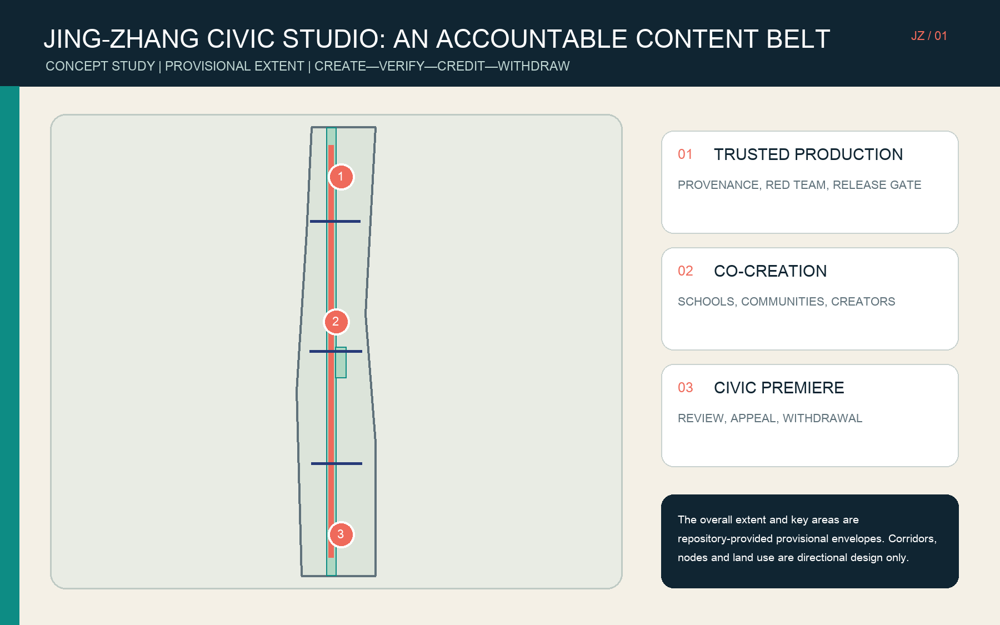
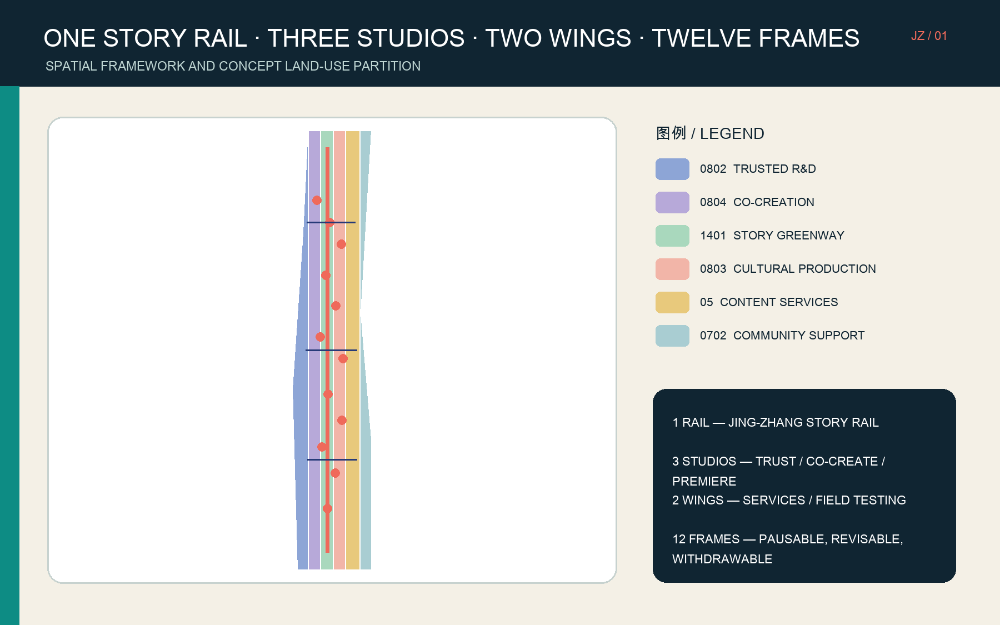
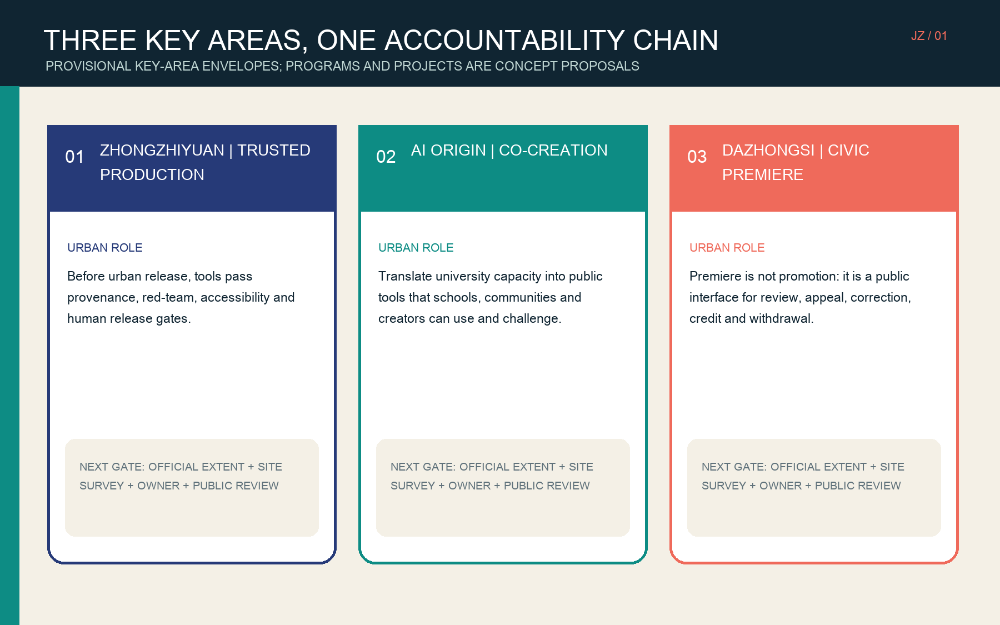
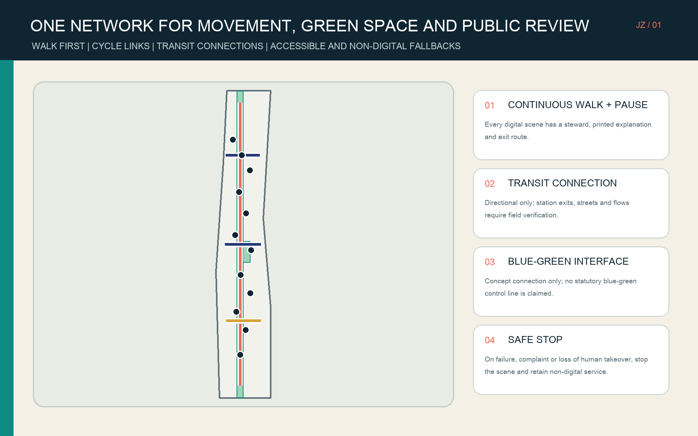
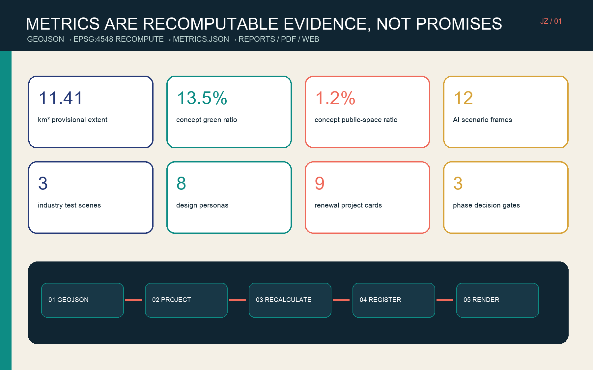

# JING-ZHANG CIVIC STUDIO / 京张城市片场

Civic Studio does not turn Jing-Zhang into a technology spectacle. It makes visible the accountability process that AI-mediated content should pass before entering urban life: **create—verify—credit—publicly review—correct—withdraw**. Zhongzhiyuan hosts trusted production, AI Origin hosts co-creation, and Dazhongsi hosts civic premiere. A Story Rail links the three studios to public feedback. The proposal is valuable only if every scene can answer who is responsible, what inputs were used, who may be affected, how a person receives the service without AI, and when the system must stop.

This is a concept-study package for an open call, not statutory planning, an approval file, a construction commitment, or a partnership announcement. The overall extent and three key areas use the repository’s provisional rough geometry. Every geometry-derived area, ratio and length must be recomputed when official redlines arrive. [source:BOUNDARY-SOURCE] [data:geometry/site_boundary.geojson#SITE-001]

## Design Basis and Source List

Evidence is separated by authority. The first tier is the public announcement by the Beijing planning and natural-resources authority, used for project purpose, three work scopes, key-area names and announced approximate areas. The second tier is the cleared repository site package, agent taskbook, standards index and structured enums, used for submission rules, task coverage and allowed design space. The third tier consists of official websites of international institutions and public standards, used only for mechanism research; it cannot replace Beijing statutory conditions. [source:OFFICIAL-ANNOUNCEMENT] [source:SITE-PACKAGE]

The package does not contain an official overall redline, accurate key-area polygons, parcels and ownership, an existing-building survey, heritage-control zones, road redlines, municipal capacity, public-facility inventory, FAR, height, density, statutory green ratio or setbacks. Therefore, `site_boundary.geojson` and `key_areas.geojson` are calculation and layout envelopes only. `land_use.geojson`, `buildings.geojson` and other participant layers are concept proposals and cannot be read backwards as existing conditions or approved plans. [source:SOURCE-REGISTRY] [standard:MOHURD-CONTROL-DETAILED-PLANNING]

The Beijing Film Academy guide is used only as public evidence of a local film-and-technology education context; it does not imply participation. C2PA informs a mechanism for recording media provenance and edit history, but Content Credentials do not prove that a claim is true. MIT Media Lab, MIT Open Documentary Lab, Ars Electronica Futurelab, ZKM, Mila and S+T+ARTS are likewise mechanism references, not partners, endorsers or implementation conditions. [source:BFA-2026-GUIDE] [source:C2PA-SPEC]

Machine-reviewable evidence includes `sources.json`, `assumptions.json`, `metrics.json`, a 23-item task matrix, a six-item standard matrix, a 15-item design-depth matrix and nine spatial layers. Prose explains judgments; JSON and GeoJSON enable recomputation; five diagrams, offline web pages and PDFs support reading. Presentation artifacts never override structured evidence. [standard:PROJECT-OFFICIAL-ANNOUNCEMENT] [depth:existing_conditions_diagnosis]

## Three-Level Scope Framework

The **approximately 43.6 km² coordinated research area** is used for mechanism research on industry, talent, culture, public governance, mobility and blue-green systems, without project-level building decisions. The **approximately 11.4 km² overall design area** hosts the concept framework, land-use partition, spatial typologies, slow-mobility network and project sequence. The **approximately 368.4 hectares announced across three key areas** support role and delivery-gate studies for Zhongzhiyuan, about 192.1 ha; AI Origin, about 104.3 ha; and Dazhongsi, about 72.0 ha. The areas come from the announcement, while package polygons are rough locators. [source:OFFICIAL-ANNOUNCEMENT] [depth:three_level_scope_framework]

One accountability chain connects all levels. Coordinated research asks which content ecosystem is worth supporting. Overall urban design asks how responsibility is carried by space. Key-area design asks who completes which review step and where. Industry research does not create a building redline; concept land use does not create a property action; and a key-area scenario does not create a procurement or construction list. Moving to a more detailed level requires more official data, field evidence, affected-party participation and professional review, not more narrative certainty. [standard:MOHURD-URBAN-DESIGN-MEASURES] [depth:overall_spatial_structure]

The repository’s provisional overall polygon was inferred from announcement text, approximate area and road names; key-area rectangles were inferred from sequence and announced approximate areas. They can test the data pipeline and layout contract, but cannot establish the actual heritage-park alignment, parcels, road redlines or a construction area. When official polygons arrive, all four constraint envelopes must be replaced, the six land-use zones, nine footprints, green space, public space, roads and phases must be clipped again, and every metric, figure, HTML page and PDF must be refreshed. [source:KEY-AREA-SOURCE] [data:geometry/constraints.geojson#CONSTRAINT-001]

## Coordinated Research Area: Industry and Future City Research

The proposal narrows the broad AI industry chain into a **trusted-content value chain**. Upstream actors research models, chips, compute and media tools. Midstream actors co-create film, education, design, public explainers and cultural memory. Downstream services provide credentials, intellectual-property and labor rights, accessibility, multilingual production, public review, distribution and creator support. This does not reclassify all companies as content firms; it creates an understandable urban scene through which software, law, education, culture, governance and daily services can collaborate. [source:AGENT-TASKBOOK] [standard:PROJECT-AGENT-OPEN-CALL-TASKBOOK]

The framework is **One Story Rail, Three Civic Studios, Two Support Wings and Twelve Frames**. The Story Rail carries source-linked heritage narratives, slow movement, pause points and feedback. The three studios are Trusted Production at Zhongzhiyuan, Co-Creation at AI Origin and Civic Premiere at Dazhongsi. A Zhongguancun service wing supports law, rights, finance, talent and distribution; a Xiaoyue River testing wing supports low-speed devices, environmental sensing and public-space prototypes. The twelve frames are services with owners, exits and stop conditions, not check-in installations. [data:geometry/roads.geojson#ROAD-001] [metric:public_scenario_count]

The original identity combines an open film frame, railway-sleeper rhythm and square brackets. The open frame means a work can be challenged and revised; short parallel lines refer to Jing-Zhang railway memory; brackets signal that every AI output needs context. Deep indigo, teal, coral and paper cream form the palette. The identity avoids company logos, film characters, third-party graphic marks and external map screenshots. It belongs first on rule cards, provenance labels and public-review desks, not on an oversized landscape object. [depth:blue_green_public_space] [source:SITE-PACKAGE]

Six global cases contribute mechanisms rather than forms. MIT Media Lab contributes interdisciplinary research and external collaboration. MIT Open Documentary Lab contributes open co-creation and new-storytelling incubation. Ars Electronica Futurelab contributes art-science research, prototyping and public engagement. ZKM combines research, production, exhibition, archives and social discourse. Mila connects open science, academic collaboration, industry transfer and an ethics mission. S+T+ARTS connects artists, scientists and engineers through residencies, prizes, academies and regional nodes. Jing-Zhang translates these into three gates: test the work, co-create it with affected people, then expose it to public review. [source:MIT-MEDIA-LAB] [source:MIT-ODL] [source:ZKM]

## Overall Design Area: Urban Renewal and Regulatory-Plan-Level Urban Design

The overall structure begins with **plug-in accountability nodes** within the existing city, not a field of new landmarks. The concept land-use layer contains six non-overlapping categories that cover the provisional envelope: research 0802, education 0804, park green space 1401, culture 0803, commercial services 05 and community services 0702. A central green band reserves the Story Rail and public interface, while research, education, culture, translation and community support occupy both sides. This is a functional hypothesis for later regulatory review, not a statutory land-use change. [standard:MNR-LAND-USE-CLASSIFICATION-GUIDE] [data:geometry/land_use.geojson#LU-001]

Nine building footprints express spatial typologies only: trusted media testing, content credentials, creator-rights clinic, co-creation classroom, youth imaging, public explainers, accessible media, civic premiere and independent-creator incubation. Where safety, ownership and structure allow, they should first test adaptive reuse. If field evidence proves reuse unsuitable, leasing, temporary structures or small new construction can be compared. Because there is no existing-building dataset, the package labels no real building for retention, renovation or demolition and does not calculate total floor area or FAR. [data:geometry/buildings.geojson#BLDG-001] [metric:floor_area_ratio]

The road layer proposes one north-south Story Rail and three east-west links for trusted production, co-creation and civic premiere. They express walking, cycling and transit-connection directions, not verified station exits, lanes, redlines or crossings. Municipal and digital infrastructure follows a small-first rule: validate edge processing, privacy logs, offline operation, human takeover and compatibility with conventional infrastructure before discussing concentrated compute, energy or device networks. A scene stops if a device cannot be manually taken over or blocks accessible passage. [data:geometry/roads.geojson#ROAD-002] [depth:municipal_new_infrastructure]

Urban character avoids unsupported numeric height claims and instead defines four later review rules. Heritage-facing edges maintain readable old-new relationships. The Story Rail receives small-scale, pause-friendly and publicly legible ground floors. Technical equipment is consolidated, maintainable and subordinate to roofs and streets. Light, sound, cameras and interactive devices have time, intensity and exit controls. Heights, skyline, roofs, setbacks and view corridors remain subject to official controls and field-based visual analysis. [depth:height_massing_character] [standard:MOHURD-CONTROL-DETAILED-PLANNING]

## Detailed Design of Key Areas

**01 Zhongzhiyuan | Trusted Production Studio.** This area is positioned as a validation environment for AI media tools before urban release. Small units for trusted testing, content credentials, red-teaming and accessibility benchmarks surround a shared review court. Building strategy first tests safe adaptation of suitable research or office space and assumes no demolition. A slow-mobility link joins the Story Rail, while controlled tests are separated from ordinary public passage by time and space. Official extent, survey, equipment-risk assessment, data controller and human release owner are required before further design. [data:geometry/key_areas.geojson#PROV-KEY-001] [depth:three_key_area_detailed_design]

**02 Beijing AI Origin | Co-Creation Studio.** This is a translation zone between university capability and city needs. Co-creation classrooms, a youth imaging lab, community memory studio and public-explainer workshop form an open learning loop. The goal is not to display the strongest model, but to let students, teachers, residents, local businesses and cultural workers ask questions, inspect sources, refuse collection, revise credit and withdraw work. Walking and cycling connect to the Story Rail. Real-person and community-memory content requires granular consent and retains paper, human explanation and offline workshops. [data:geometry/key_areas.geojson#PROV-KEY-002] [source:MIT-ODL]

**03 Dazhongsi | Civic Premiere Studio.** This area supports public review, creator services and responsible content translation through a civic premiere desk, independent-creator rights clinic, accessible public screening and multilingual talent service. “Premiere” is not promotional release. It displays provenance, degree of AI participation, rights holders, edits, limits and withdrawal path at the same time. A rights, accuracy, safety or discrimination objection pauses dissemination before a human owner responds. Any exact connection to stations and streets requires an on-site accessibility audit. [data:geometry/key_areas.geojson#PROV-KEY-003] [source:C2PA-SPEC]

The three key areas share one production sheet: input source, authorization status, AI role, accountable human, affected parties, accessible version, non-digital fallback, release time, correction and withdrawal history. Their difference is which responsibility dominates. Because all key-area polygons are rough rectangles, this section establishes only roles, relationships and delivery gates. Building positions, scale, retain-renovate-demolish decisions, vehicle access, fire safety, utilities, heritage controls and public-space boundaries are not implementation-ready. [source:KEY-AREA-SOURCE] [standard:PROJECT-OFFICIAL-ANNOUNCEMENT]

## AI Innovation Ecosystem, Personas, and AI+ Scenarios

Eight personas check whether services leave people out; they are not profiling datasets: model and media-tool teams; film, design and independent creators; students and teachers; residents, families and older adults; local businesses and frontline workers; rights holders, archivists and cultural workers; disabled, multilingual or low-digital-confidence visitors; and operators, reviewers and public-service staff. Each person must be able to understand the AI role, choose a non-AI route, reach an accountable human and appeal. [metric:persona_count] [source:AGENT-TASKBOOK]

Twelve scenario cards are all `concept_only`. Each has a non-digital fallback and a stop condition:

1. **Media provenance stress test — industry test.** Zhongzhiyuan; serves tool teams and rights holders. Cleared test media are inputs; AI identifies credential-chain gaps; a human safety owner releases or rejects. Unconfirmed provenance stops public dissemination.
2. **Multilingual and accessibility benchmark — industry test.** Zhongzhiyuan; serves disabled and multilingual users. Consent-based test sets support caption, audio-description and translation candidates; human language and accessibility reviewers sign off. Harmful or excessive-error outputs stop.
3. **Synthetic-media safety red team — industry test.** Zhongzhiyuan; serves product teams and the public. Synthetic or authorized media generate controlled attack cases; a human safety team runs an isolated environment. Loss of containment or takeover stops the test.
4. **Source-linked heritage guide.** Story Rail; serves visitors and cultural workers. AI retrieves and drafts from public sources; human editors verify. Paper maps and human explanation remain available; insufficient evidence is marked unknown, never invented. [data:geometry/public_space.geojson#PUBLIC-004]
5. **Withdrawable community memory studio.** AI Origin; serves residents and archivists. Recording, image use and credit receive granular consent; AI organizes and retrieves; a human archivist controls access. Withdrawal, rights dispute or sensitive content takes the item offline.
6. **Youth AI media-literacy lab.** AI Origin; serves students, teachers and guardians. Self-made or cleared course media are used; AI is an object of comparison and critique; the teacher is responsible and an equipment-free lesson remains. Missing minor consent, copyright or safety stops the activity.
7. **Multilingual talent onboarding desk.** Public service points; serves newcomers and families. Only actively submitted minimum information is processed; AI suggests routes and a human counter verifies. Paper and human service remain. AI is barred from eligibility decisions and sensitive inference.
8. **Accessible civic premiere.** Dazhongsi; serves the public and creators. Cleared works, provenance cards and accessible versions are shown; AI assists captions and descriptions; a human curator releases. Rights, accuracy or accessibility complaints pause the screening.
9. **Independent-creator rights clinic.** Dazhongsi; serves creators and rights holders. AI organizes questions and evidence lists but gives no final legal conclusion; a qualified human adviser is responsible. No answer is issued without human review or when facts or conflicts remain unresolved.
10. **Public-service explainer studio.** AI Origin and the service wing; serves residents and public-service staff. Official public documents support plain-language drafts; responsible staff check every line. Originals and human counters remain. Policy changes, source conflict and high-risk cases stop automation.
11. **Local-business cultural story kit.** Neighborhood Story Rail interfaces; serves shops and frontline workers. Only voluntarily supplied cleared material is used; AI supports layout and translation and performs no customer profiling. Owner confirmation precedes release; withdrawal or disruption removes the display.
12. **Low-speed device public-space test.** Xiaoyue River testing wing; serves device teams, pedestrians and managers. Only minimum safety-event data are recorded; AI assists avoidance and an on-site human steward takes over. Missing takeover, complaint or blocked passage stops the test. [metric:industry_test_count]

## Land Use, Building Scale, and Retain-Renovate-Demolish Strategy

Six concept zones use the project subset of national spatial land-use codes. Research 0802 supports trusted tests; education 0804 supports co-creation; park green space 1401 supports the Story Rail; culture 0803 supports production and premiere; commercial services 05 support rights and translation; community services 0702 support daily life. The complete partition tests functional relationships and does not change a real parcel’s land-use nature. Official parcels and conditions require a new legally valid topology. [data:geometry/land_use.geojson#LU-006] [depth:land_use_layout]

The union of nine concept footprints is approximately 450,981.632 m² in EPSG:4548. It means only “illustrative ground area for spatial typologies”; it is not an existing-building area, approved footprint or construction indicator. Total floor area, FAR, building density, height, floor count and underground space remain unknown because the site package lacks official controls and a building survey. Drawings therefore show only small scale, public ground-floor access, maintainability and phased adaptation, not false precision. [metric:building_footprint_area_sqm] [depth:development_intensity_controls]

Retain-renovate-demolish decisions follow four gates. First, survey title, age, structure, fire safety, energy, use and cultural value. Second, a professional team prepares an evidence matrix for retention, repair, adaptive reuse, partial replacement and necessary demolition. Third, users, neighbors and operators review relocation, rent, construction and business impacts. Only then can classifications enter a project layer. No real building may be treated as demolishable because of its location in this concept diagram. [depth:retain_renovate_demolish] [source:SOURCE-REGISTRY]

The supply priority is shared existing space and time slots, then light equipment and reversible fit-out, then safe adaptation, and only after evidence a small new building. This lowers capital and carbon exposure while rules, services and user needs are tested first. A scenario does not advance even when space is available if it lacks an accountable operator, accessible design, maintenance budget or exit path. [standard:MOHURD-URBAN-DESIGN-MEASURES] [data:geometry/phasing.geojson#PHASE-001]

## Transport, Rail, Municipal Infrastructure, and Public Services

The concept network contains an approximately 8,938.604 m north-south Story Rail and three east-west links. The Story Rail supports walking, pause points, guidance and public review; the cross-links connect trusted production, co-creation and civic premiere. The length comes from a concept line within provisional geometry and is not a surveyed accessible-route length. Station entrances, buses, road gaps, parking, bicycle parking, loading and fire access require official data and field counts. [metric:story_rail_length_m] [depth:traffic_rail_slow_parking]

Walking and accessibility priority means continuity, legibility and exit, not more sensors. Every digital interface has a human desk or clear contact. Guidance offers large-text, easy-read, multilingual, audio and paper versions. Devices cannot reduce clear width, block tactile paths or compel facial recognition. Quiet hours, device-free periods and bypass routes become operating rules. Automated doors, robots and interactive systems default to a safe stop when human takeover is lost. [data:geometry/roads.geojson#ROAD-004] [source:AGENT-TASKBOOK]

Municipal and digital infrastructure follows edge processing, data minimization, offline availability, auditability and maintainability. Cameras, sound and location are not default inputs. Where a test genuinely needs them, it first identifies the data controller, retention period, access, deletion and public notice. Edge compute and device power must use verified existing capacity where possible; AI display is not a reason to create an unmaintainable system. Energy, water, communications, sanitation, fire safety and flood conclusions remain for professional review. [depth:municipal_new_infrastructure] [source:SITE-PACKAGE]

Public services are organized around rights, learning, explanation and daily support. The creator-rights clinic opens a route for contracts and credit. Co-creation classrooms support education and media literacy. The public-explainer workshop translates official information into understandable versions. Community service points retain human and non-digital routes. They can begin as shared spaces and service shifts; service existence does not depend on a new large center. [data:geometry/buildings.geojson#BLDG-003] [standard:PROJECT-AGENT-OPEN-CALL-TASKBOOK]

## Blue-Green Network, Public Space, and Urban Character

The concept green-space union equals 13.4709% of the provisional overall envelope and consists of a central Story Greenway and Xiaoyue River ecological interface. Public scenario frames equal 1.1761%. Both are participant design values, not statutory green or public-space ratios. The diagram treats the Story Rail as a public narrative spine, but the provisional boundary cannot prove its exact intersection with the real Jing-Zhang heritage park. Official park alignments, river controls, protection zones and passage conditions require a redraw. [metric:green_ratio] [metric:public_space_ratio]

Public space follows pass—pause—participate—review—exit. A passer-by need not leave data. A person who pauses can inspect a source card. A participant chooses permissions item by item. A reviewer sees the AI role and accountable human. A person who exits can close the interaction, choose a non-digital service or request withdrawal. Night light, sound, screen brightness and events respect neighbors. A continuously operating installation is not placed without an operator and complaint response. [data:geometry/public_space.geojson#PUBLIC-008] [depth:blue_green_public_space]

Three requested pilgrimage or honor nodes become accountable public facilities, not monumental objects. **Century Frame** presents Jing-Zhang history with source links and leaves unknowns blank. **Open Credits Wall** shows only opt-in, withdrawable contributor, rights and version records. **Civic Premiere Desk** displays the production sheet, accessible versions, appeals and correction status. All are concept nodes; their names, positions, forms and operations need heritage, cultural, accessibility and community co-design. [metric:honor_node_count] [source:AGENT-TASKBOOK]

Urban character borrows the open frame and railway rhythm with restraint. Ground-floor interfaces are legible, entrances clear and equipment maintainable. Materials are durable and replaceable; screens and dynamic lights do not dominate the street. Historic material is not imitated as fake old fabric, while new components remain identifiable and reversible. Every font, image, portrait, company mark and film clip requires explicit rights clearance before use. [standard:MOHURD-URBAN-DESIGN-MEASURES] [depth:height_massing_character]

## Renewal Projects, Implementation Policy, and Phasing

Nine project cards follow rules first, then space, then scale. They are recommendations, not confirmed arrangements:

| Card | Proposed role | Dependency and stop condition |
|---|---|---|
| P01 Production sheet and provenance rule | Belt-wide fields for source, AI role, credit, correction and withdrawal | Do not activate before legal, rights, data and accessibility review |
| P02 Trusted media test studio | Zhongzhiyuan; run three industry tests | Stop without isolation, human release owner or incident process |
| P03 Co-creation curriculum loop | AI Origin; schools, communities and creators test courses | Collect no content without real participants and informed-consent design |
| P04 Creator-rights clinic | Dazhongsi; contract, credit and credentials entry point | Give no case conclusion without a qualified human adviser |
| P05 Century Frame and source-linked guide | Story Rail; traceable heritage narrative | Use indoor or web prototypes while official heritage and site evidence are missing |
| P06 Accessible civic premiere desk | Dazhongsi; public review and appeal | Do not open before accessibility, rights and complaint review |
| P07 Xiaoyue River low-speed testing time | Testing wing; controlled device and public-space tests | Stop without steward, bypass, insurance or manual takeover |
| P08 Nine typology adaptations | Key areas; match needs to real buildings | No construction before survey, title, structure, fire safety and user negotiation |
| P09 Residency, premiere and open archive program | Belt-wide long-term research and public record | Do not scale without a stable operator, budget, maintenance and withdrawal process |

The three phases are decision gates, not a promised calendar. **Phase one: rules and public prototypes** tests P01–P04 at low cost and publishes the unresolved-question log. **Phase two: spatial adaptation and district linkage** may advance P05–P08 only after official geometry, field study and responsible parties are clear. **Phase three: stewardship and international collaboration** considers P09 only if earlier work proves useful, equitable and maintainable. Phase polygons are work envelopes, not acquisition or investment boundaries. [data:geometry/phasing.geojson#PHASE-003] [metric:phase_count]

An annual program could use four rhythms: spring open review, summer co-creation residency, autumn civic premiere and winter accountability retrospective, supported by monthly rights clinics and recurring media-literacy classes. Success is not traffic or event size alone. It measures issues found, correction time, accessible coverage, contributor retention, successful withdrawal and availability of real services. Branding, international communication and talent translation require a confirmed organizer, funding, visas, rights, safety and public-space permission. [source:STARTS] [standard:PROJECT-AGENT-OPEN-CALL-TASKBOOK]

Operations need six human roles: overall accountability, scene owner, rights and data, accessibility, facility maintenance and public oversight. Version logs, open issue lists and annual stop decisions should be published. Public funding, procurement, charges, recruitment and site use require lawful procedures. This proposal appoints no government, school, enterprise or community as an operator. If nobody accepts responsibility for stopping, correcting and maintaining a scene, adding AI functions cannot repair the governance gap. [depth:phasing_implementation] [metric:renewal_project_count]

## Metrics, Area Recalculation, and Compliance Matrix

All spatial metrics are recomputed from the same GeoJSON layers in EPSG:4548. The provisional overall envelope is **11,412,825.386 m²**. The union of nine concept footprints is **450,981.632 m²**. The green-space ratio is **0.134709**, the public-frame ratio **0.011761**, and the concept Story Rail length **8,938.604 m**. These values verify data-chain consistency, not official precision or implementation. [metric:site_area_sqm] [metric:building_footprint_area_sqm] [metric:story_rail_length_m]

Non-spatial counts include three key areas, twelve scenario cards, three industry tests, eight design personas, three public honor nodes, nine renewal cards and three phase gates. A count verifies that the proposal delivers an item; it does not prove effectiveness, resident support or industry impact. Later evaluation should replace release volume with provenance completeness, human-review completion, correction time, successful exit, accessible-task completion and non-digital service availability, using real operational evidence. [metric:key_area_count] [metric:industry_test_count] [metric:honor_node_count]

Statutory FAR, total floor area, height, density, green ratio, parking, public facilities and utility capacity remain unknown; concept footprints are not used to invent them. Recalculation after official redlines follows a fixed sequence: replace constraints, repair topology, reclip participant layers, recompute areas and lengths, update `metrics.json`, update three matrices, regenerate five figures, bilingual HTML, A3 and A0 PDFs, then rerun all checks. [depth:metrics_recalculation] [source:SITE-PACKAGE]

`compliance_matrix.json` covers 23 mandatory announcement and agent-taskbook items. `standard_matrix.json` records five mandatory responses and one non-mandatory data gap. `design_depth_matrix.json` covers 15 design-depth items. “Addressed” or “complete” means the concept package provides reviewable evidence; it does not mean planning conditions, engineering or participation are complete. If prose, matrices and spatial data conflict, structured geometry and metrics prevail and trigger rerendering. [standard:PROJECT-OFFICIAL-ANNOUNCEMENT] [depth:risk_missing_data]

## Risk, Copyright, and Compliance

**Spatial and professional risk.** The overall extent and key areas are not official redlines, while parcels, ownership, buildings, heritage, transport and municipal conditions are missing. Every position, renewal action, link, green space and phase is a discussion hypothesis. If official data creates non-intersection, overrun, conflict or area change, geometry and metrics must change before the concept narrative is preserved. [source:BOUNDARY-SOURCE] [depth:risk_missing_data]

**Participation and equity risk.** This submission did not conduct a site visit, resident interview, accessibility walk-through, business interview or stakeholder workshop. Eight personas are design hypotheses, not demand evidence. Residents, students, creators, local businesses, frontline workers, disabled people and people with low digital confidence must join later co-design. The project should publish what feedback was accepted, declined or remains disputed; one exhibition cannot substitute for sustained participation. [data:assumptions.json#A-FIELDWORK-003] [source:MIT-ODL]

**AI, rights and privacy risk.** Provenance records do not make a claim true. Synthetic media can create impersonation, deception, discrimination, labor, copyright and privacy harm. Public outputs retain original sources, AI role, accountable human, correction and withdrawal paths. Sensitive judgment, high-risk cases, eligibility decisions and services without human takeover do not use automated decisions. Data are not collected by default; necessary processing follows purpose limitation, minimum use, short retention and deletion. [source:C2PA-SPEC] [data:assumptions.json#A-PROVENANCE-006]

**Implementation and commitment risk.** No operator, funding, procurement, site, permit, partner, construction or event calendar is confirmed. Named schools, institutions, companies and government bodies are background or role hypotheses. All projects, phases, residencies and premieres are directions for further study. Any real action requires proper authority, lawful procedure, professional review, insurance and public communication. The open-call result cannot imply government approval or inevitable implementation. [data:assumptions.json#A-PARTNERS-004] [standard:MOHURD-CONTROL-DETAILED-PLANNING]

**Copyright and generation.** Text and original diagrams are submitted under CC BY 4.0. The five core figures, offline visual pages and PDFs are generated from package GeoJSON, metrics and original vector composition. They contain no external map tiles, third-party photos, company logos, film characters or uncleared type assets. External institution names and links are factual citations only. `report/copyright_statement.md` contains the full statement; any later photo, archive or partner asset needs rights holder, license, credit and withdrawal terms. [data:report/copyright_statement.md#scope] [source:SOURCE-REGISTRY]

## References

1. Beijing Municipal planning and natural-resources authority, international design competition announcement for the Centennial Jing-Zhang AI Innovation Belt; used for project tasks, scope levels and approximate announced areas, not exact redlines. [source:OFFICIAL-ANNOUNCEMENT]
2. open-city-ai/haidian `brief/site-package`, `agent_taskbook.json`, `source_registry.json` and standards index; used for evidence limits, package contract, task coverage and provisional geometry. Repository processing creates no new official authority. [source:SITE-PACKAGE]
3. National urban-design and regulatory-planning rules and the natural-resources land-use classification guide; used to separate urban-design advice, statutory controls and land-use codes. [standard:MOHURD-URBAN-DESIGN-MEASURES]
4. Beijing Film Academy, 2026 undergraduate and vocational arts admissions guide; local film-and-technology education background only, with no participation or partnership claim. [source:BFA-2026-GUIDE]
5. C2PA, Specification / About; used for media provenance, edit history and Content Credentials mechanisms, which do not replace fact-checking. [source:C2PA-SPEC]
6. MIT Media Lab, About the Lab; used for interdisciplinary research, iterative experimentation and external collaboration mechanisms, without copying its institution or membership model. [source:MIT-MEDIA-LAB]
7. MIT Open Documentary Lab, About; used for open co-creation, interactive storytelling, workshops and experimental-project incubation. [source:MIT-ODL]
8. Ars Electronica Futurelab and ZKM official introductions; used for art-science R&D, production, exhibitions, archives, public engagement and adaptive use of older buildings. [source:ARS-FUTURELAB] [source:ZKM]
9. Mila, About Mila; used for open science, academic collaboration, industry transfer, ethics and public-benefit mission, without importing scale claims as local targets. [source:MILA]
10. S+T+ARTS, About; used for residency, prize, academy and regional-node mechanisms. No international collaboration or activity resource is promised. [source:STARTS]

This list contains the sources that materially changed the design. Complete permitted-use and limitation records are in `sources.json`; missing evidence and unfinished work are in `assumptions.json` and `self_check.json`. When new evidence conflicts with the proposal, current official information, field evidence and lawful procedure prevail, while version differences and revision reasons remain visible. [depth:existing_conditions_diagnosis] [data:assumptions.json#A-CONTROLS-001]
