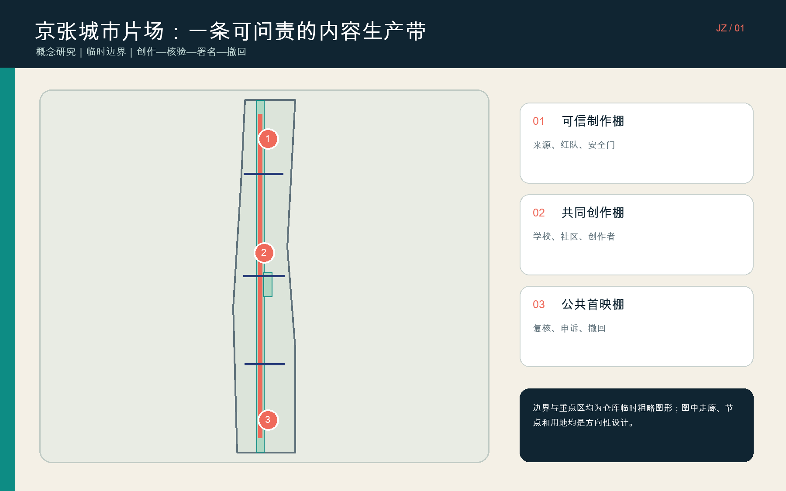
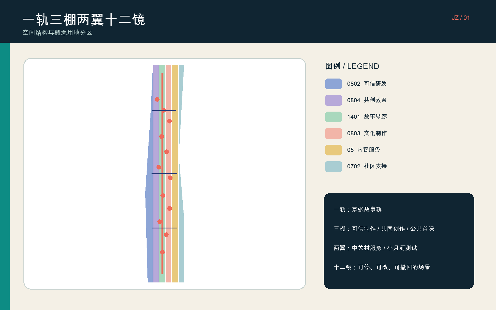
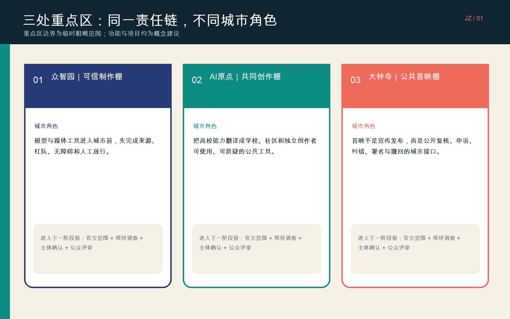
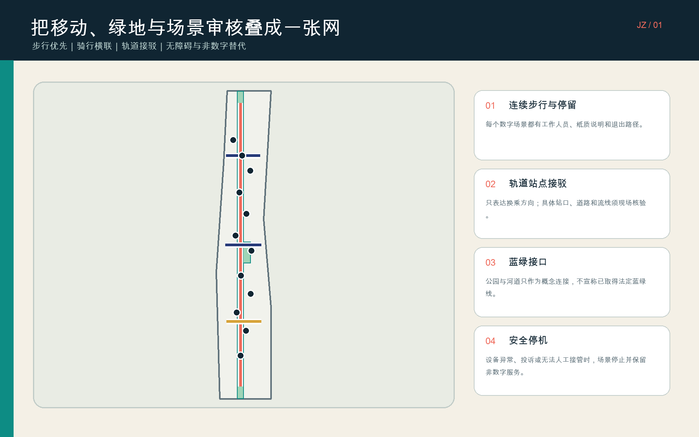
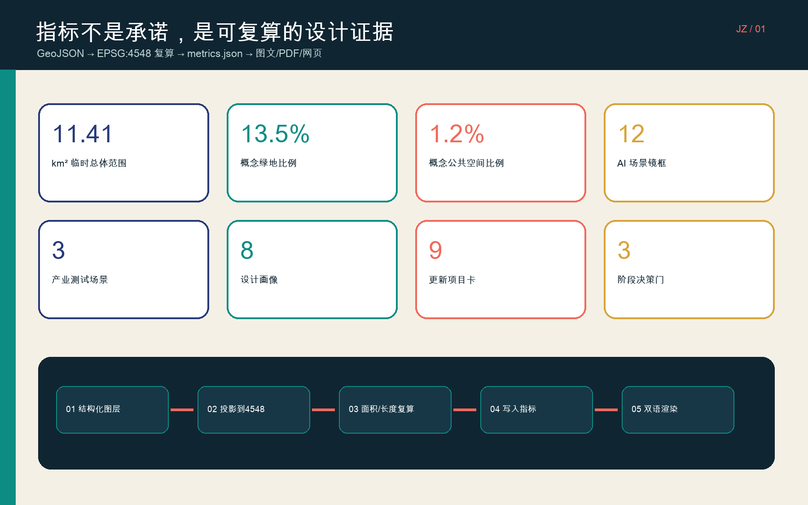

# 京张城市片场 / JING-ZHANG CIVIC STUDIO

“城市片场”不是把京张做成一场科技表演，而是把 AI 内容进入城市前必须经过的责任过程变成空间：**创作—核验—署名—公开复核—纠错—撤回**。众智园承担可信制作，AI 原点承担共同创作，大钟寺承担公共首映；京张故事轨把三处片场和公共反馈串成一条线。方案的价值不在一张未来效果图，而在每个场景能否回答：谁负责、用了什么、谁可能受影响、如何不用 AI 也能获得服务、何时必须停机。

本成果是开源征集中的概念研究包，不是法定规划、审批材料、建设承诺或合作公告。总体范围和三处重点区采用仓库提供的临时粗略图形；所有由图形推算的面积、比例和长度都必须在官方红线到位后重算。[source:BOUNDARY-SOURCE] [data:geometry/site_boundary.geojson#SITE-001]

## 设计依据与资料清单

方案先按资料权威性分层。第一层是北京市规划自然资源主管部门公开的项目公告，用于确认项目目的、三层工作范围、三处重点区名称及公告约面积；第二层是仓库中已清权的场地包、智能体任务书、规范索引和结构化枚举，用于确定提交格式、任务覆盖和允许的设计空间；第三层是全球机构官网与公开标准，只能支持机制研究，不能替代北京的法定条件。[source:OFFICIAL-ANNOUNCEMENT] [source:SITE-PACKAGE]

本包明确没有获得官方总体红线、三处重点区精确多边形、地块与权属、现状建筑普查、遗产保护范围、道路红线、市政容量、公共设施现状、容积率、高度、密度、绿地率和退界等控制条件。因此，`site_boundary.geojson` 与 `key_areas.geojson` 只作为计算和排版包络；`land_use.geojson`、`buildings.geojson` 等是参与者提出的概念图层，不得倒推为现状或获批方案。[source:SOURCE-REGISTRY] [standard:MOHURD-CONTROL-DETAILED-PLANNING]

北京电影学院公开招生资料用于说明电影与技术交叉教育是可研究的本地背景，但不表示学校参与本方案；C2PA 只提供“记录内容来源与编辑历史”的机制启发，内容凭证不等于事实真伪证明。MIT Media Lab、MIT Open Documentary Lab、Ars Electronica Futurelab、ZKM、Mila 与 S+T+ARTS 同样只作运营机制参考，不构成合作、背书或落地条件。[source:BFA-2026-GUIDE] [source:C2PA-SPEC]

机器可复核材料包括 `sources.json`、`assumptions.json`、`metrics.json`、23 项任务覆盖矩阵、6 项标准矩阵、15 项设计深度矩阵和 9 个空间图层。正文负责解释判断，JSON/GeoJSON 负责复算，五张图、离线网页和 PDF 负责评审阅读；任何展示层都不能覆盖结构化证据。[standard:PROJECT-OFFICIAL-ANNOUNCEMENT] [depth:existing_conditions_diagnosis]

## 三层范围工作框架

**统筹研究范围约 43.6 km²**：只做产业链、人才、文化、公共治理、交通与蓝绿系统的机制研究，不绘制项目级建筑结论。**总体设计范围约 11.4 km²**：在临时包络内提出“一轨三棚两翼十二镜”的城市设计结构、概念用地、空间原型、慢行网络与项目次序。**重点区域公告合计约 368.4 ha**：分别讨论众智园约 192.1 ha、AI 原点约 104.3 ha、大钟寺约 72.0 ha 的角色与实施门槛；这些面积来自公告约值，而本包的重点区多边形只是粗略定位。[source:OFFICIAL-ANNOUNCEMENT] [depth:three_level_scope_framework]

三层范围通过同一条责任链衔接：统筹层决定“什么内容生态值得形成”；总体层决定“责任节点如何被城市空间承载”；重点区层决定“谁在何处完成哪一道核验”。产业研究不直接生成建筑红线，概念用地不直接生成产权处置，重点区场景也不直接生成采购或建设清单。每向下一层推进，都要增加官方资料、现场证据、利益相关者参与和专业审查，而不是增加叙事确定性。[standard:MOHURD-URBAN-DESIGN-MEASURES] [depth:overall_spatial_structure]

仓库临时总体图形仅依据公告文字、约面积和道路名称形成，三处重点区也按公告顺序与约面积粗略推导。它们可用于测试数据链和表达结构，不可用于认定京张遗址公园实际线位、地块边界、道路红线或建设范围。官方多边形到位后，必须替换 4 个约束图形，重新裁切六类用地、九类建筑基底、绿地、公共空间、道路和分期，并刷新全部指标、图件、HTML 与 PDF。[source:KEY-AREA-SOURCE] [data:geometry/constraints.geojson#CONSTRAINT-001]

## 统筹研究范围产业与未来城市研究

方案把“AI 创新带”的产业链收敛为一条**可信内容价值链**：上游是模型、芯片、算力与媒体工具的研发测试；中游是电影、教育、设计、公共说明和文化记忆的共同创作；下游是内容凭证、知识产权、无障碍、多语种、公共复核、发行和创作者服务。它不是把所有企业归入“内容产业”，而是用一个可被公众理解的场景，把信软、法律、教育、文化、治理和生活服务串起来。[source:AGENT-TASKBOOK] [standard:PROJECT-AGENT-OPEN-CALL-TASKBOOK]

总体结构是“**一轨三棚两翼十二镜**”。一轨是京张故事轨：承载可追溯的历史叙事、慢行停留与公众反馈；三棚分别是众智园可信制作棚、AI 原点共同创作棚和大钟寺公共首映棚；中关村服务翼提供法律、知识产权、金融、人才和传播转化，小月河测试翼承担低速设备、环境感知与公共空间原型。十二镜不是打卡装置，而是十二个有负责人、退出方式和停止条件的服务界面。[data:geometry/roads.geojson#ROAD-001] [metric:public_scenario_count]

名称与视觉识别使用原创的“开放镜框 × 铁路枕木 × 方括号”组合：未闭合镜框表示内容可被质疑和修订，平行短线表示京张铁路记忆，方括号表示每项 AI 输出都必须附上下文。主色为深靛、青绿、珊瑚红和纸张米白；不使用企业 Logo、影视角色、第三方字体图形或外部地图截图。这个识别系统优先出现在规则说明、来源卡和公共复核台，而不是被做成巨型景观物。[depth:blue_green_public_space] [source:SITE-PACKAGE]

六个全球案例只转译机制，不复制建筑：MIT Media Lab 提供跨学科研究与外部协作；MIT Open Documentary Lab 提供开放、共同创作和新叙事孵化；Ars Electronica Futurelab 提供艺术—科学研发与公众交流；ZKM 把研究、制作、展览、档案和社会讨论放进同一机构；Mila 把开放科学、学术协同、产业转化与伦理使命结合；S+T+ARTS 用驻留、奖项、学院和区域节点连接艺术家、科学家和工程师。京张的转译是“三道门”：研究成果先在可信制作棚测试，再与社区共创，最后进入公共复核，而不是直接发布。[source:MIT-MEDIA-LAB] [source:MIT-ODL] [source:ZKM]

## 总体设计范围城市更新与控规深度城市设计

总体空间不以“新地标群”为起点，而以既有城市中的**可插拔责任节点**为起点。概念用地被分为科研 0802、教育 0804、公园绿地 1401、文化 0803、商业服务 05 和社区服务 0702 六类，共同覆盖临时总体包络且不重叠。中部青绿带预留故事轨和连续公共接口，两侧布置研发、教育、文化、转化和社区支持；这是一种供后续控规核验的功能假设，不是法定用地调整。[standard:MNR-LAND-USE-CLASSIFICATION-GUIDE] [data:geometry/land_use.geojson#LU-001]

九类建筑基底只表达所需的空间原型：可信媒体测试、内容凭证、创作者权利诊所、共同创作教室、青年影像实验、公共服务说明、无障碍媒介、公共首映复核、独立创作者孵化。它们优先考虑在安全、权属和结构允许时进行适应性再利用；若现场证明不适合，再比较租赁、临时构筑或新建。因缺少真实建筑数据，本包没有给任何现状建筑贴“保留、改造、拆除”标签，也不计算总建筑面积或容积率。[data:geometry/buildings.geojson#BLDG-001] [metric:floor_area_ratio]

道路图层只提出一条南北故事轨和三条东西横联，分别服务可信制作、共同创作和公共首映。它们表达步行、骑行和轨道接驳方向，不宣称真实站口、车道、红线或过街设施已核验。市政与新基建采用“先小后大”：先验证端侧处理、隐私日志、断网运行、人工接管和传统市政兼容性，再讨论集中算力、能源或设备网络；任何设备无法人工接管或影响无障碍通行时，场景停止。[data:geometry/roads.geojson#ROAD-002] [depth:municipal_new_infrastructure]

城市风貌控制不规定未经批准的高度数值，而提出四条后续审查规则：遗产相关界面保持可读的旧新层次；沿故事轨形成小尺度、可停留、首层开放的公共界面；技术设备集中、可维护、不过度占据屋顶与街面；发光、声音、摄像和交互装置设置时段、强度与退出机制。建筑高度、天际线、屋顶、退界和视廊必须在官方控制和现场视线分析后决定。[depth:height_massing_character] [standard:MOHURD-CONTROL-DETAILED-PLANNING]

## 重点区域详细设计

**01 众智园｜可信制作棚。** 定位为 AI 媒体工具进入城市前的验证区，空间上由可信测试、内容凭证、红队和无障碍基准四类小型工作单元围绕共享核验庭组织。建筑策略优先利用可安全适配的研发或办公空间，不预设拆除；慢行横廊连接故事轨，受控测试与日常公共通行分时分区。核心场景是来源压力测试、多语种无障碍基准和生成式媒体安全红队。进入深化的门槛是官方范围、现状测绘、设备风险评估、数据控制者和人工放行责任人全部明确。[data:geometry/key_areas.geojson#PROV-KEY-001] [depth:three_key_area_detailed_design]

**02 北京 AI 原点｜共同创作棚。** 定位为高校能力与城市需求之间的翻译区，以共同创作教室、青年影像实验、社区记忆棚和公共说明工坊组成开放课程环。空间重点不是展示最强模型，而是让学生、教师、居民、小店和文化工作者能提出问题、查看来源、拒绝采集、修改署名和撤回作品。横向慢行与骑行接口连接故事轨；所有涉及真实人物和社区记忆的内容先取得逐项同意，并保留纸笔、人工讲解和线下工作坊。[data:geometry/key_areas.geojson#PROV-KEY-002] [source:MIT-ODL]

**03 大钟寺｜公共首映棚。** 定位为公开复核、创作者服务和内容转化区，设置城市首映台、独立创作者权利门诊、无障碍公共放映和多语种人才服务。这里的“首映”不是宣传发布，而是把来源、AI 参与程度、权利人、修改记录、适用边界和撤回入口同时展示给公众；有人提出权利、准确性、安全或歧视异议时，先暂停传播，再由人类负责人处理。与轨道站点和街道的具体连接必须通过现场无障碍审计后确定。[data:geometry/key_areas.geojson#PROV-KEY-003] [source:C2PA-SPEC]

三处重点区共享同一套“制作单”：输入来源、授权状态、AI 角色、人类主责、受影响对象、无障碍版本、非数字替代、发布时间、纠错与撤回记录。空间上的区别只在于哪一道责任最突出。由于重点区多边形为粗略矩形，本节只能确定角色、相互关系和项目门槛；建筑位置、规模、拆改留、车行出入口、消防、市政、遗产和公共空间边界均不得据此实施。[source:KEY-AREA-SOURCE] [standard:PROJECT-OFFICIAL-ANNOUNCEMENT]

## AI 创新生态、人才画像与 AI+ 场景

八类画像用于检查服务是否遗漏人，而不是把人群变成画像数据：①模型与媒体工具研发团队；②电影、设计和独立内容创作者；③学生与教师；④居民、家庭与老年人；⑤小店经营者与一线劳动者；⑥权利人、档案与文化工作者；⑦残障、多语种和数字能力有限的访客；⑧运营者、审核者与公共部门工作人员。每类人都要能知道 AI 在做什么、选择不用 AI、找到人类负责人并提出申诉。[metric:persona_count] [source:AGENT-TASKBOOK]

十二张场景卡如下，均标记为 `concept_only`，均有非数字替代和停止条件：

1. **媒体来源压力测试（产业测试）**｜众智园｜服务工具团队与权利人；输入为已清权测试素材，AI 只检测凭证链缺口；人类安全负责人决定是否放行；无法确认来源即停止，不进入公共传播。
2. **多语种与无障碍基准（产业测试）**｜众智园｜服务残障与多语种使用者；只用获得同意的测试集，AI 生成字幕、音频描述和翻译候选；人类语言与无障碍评审签收；错误率或冒犯反馈越线即停止。
3. **生成式媒体安全红队（产业测试）**｜众智园｜服务产品团队与公众；用合成或获授权素材测试误导、冒用和有害输出；AI 生成受控攻击样本，人类安全组隔离环境；无法控制外泄或人工接管即停止。
4. **可追溯遗产导览**｜故事轨｜服务访客与文化工作者；只引用可公开来源，AI 负责检索与多语种草稿，人类编辑核实；同时提供纸质地图与人工讲解；来源不足则显示“未知”而非补写。[data:geometry/public_space.geojson#PUBLIC-004]
5. **可撤回社区记忆棚**｜AI 原点｜服务居民与档案工作者；逐项同意录音、图像和署名，AI 只做整理与检索；人类档案负责人控制访问；参与者撤回、权属争议或敏感信息出现即下线。
6. **青年 AI 影像素养课**｜AI 原点｜服务学生、教师和家长；使用课程自制或清权材料，AI 作为比较与批判对象；教师主责，保留无设备课程；未成年人同意、版权或安全条件不满足即停止。
7. **多语种人才入城台**｜片区公共服务点｜服务新来人才与家庭；只处理用户主动提交且最小必要的信息，AI 生成办事路径候选，人类窗口核对；保留纸质和人工服务；涉及资格裁决或敏感推断时禁用 AI。
8. **无障碍公共首映**｜大钟寺｜服务公众与创作者；展示清权内容、来源卡和无障碍版本，AI 仅辅助字幕与描述，人类策展人放行；现场保留人工说明和安静时段；权利、准确性或无障碍投诉触发暂停。
9. **独立创作者权利门诊**｜大钟寺｜服务创作者与权利人；AI 只整理合同问题与凭证清单，不给最终法律结论；律师或合格顾问主责；无人工复核、利益冲突或事实不全时不输出结论。
10. **公共服务说明工坊**｜AI 原点 / 服务翼｜服务居民与公共服务人员；用正式公开文件生成通俗草稿，人类业务人员逐句核对；原文与人工窗口始终可用；政策更新、来源冲突或高风险个案时停止自动说明。
11. **小店文化故事工具箱**｜故事轨邻里界面｜服务小店和一线劳动者；只用经营者主动提供的清权材料，AI 辅助排版与多语种，不做顾客画像；人工确认后发布；撤回同意或影响正常经营即下线。
12. **低速设备公共空间测试**｜小月河测试翼｜服务设备团队、行人与管理者；仅记录最小化的安全事件数据，AI 辅助避障，人类安全员现场接管；设置绕行和无设备时段；接管失效、投诉或通行受阻即停测。[metric:industry_test_count]

## 用地、建筑规模与拆改留方案

六类概念用地采用国土空间用地分类子集编码，形成不重叠的完整分区：科研 0802 承载可信测试，教育 0804 承载共同创作，公园绿地 1401 承载故事轨，文化 0803 承载制作与首映，商业服务 05 承载权利与转化，社区服务 0702 提供生活支持。这一分区用于测试功能关系，不对真实地块作性质变更；官方地块与用地条件到位后，必须以合法拓扑重新切分。[data:geometry/land_use.geojson#LU-006] [depth:land_use_layout]

九个概念建筑基底在 EPSG:4548 下并集约 450,981.632 m²，只能解读为“空间类型的示意占地”，不能解读为现状建筑面积、批准基底或建设指标。总建筑面积、容积率、建筑密度、高度、层数和地下空间均为未知，因为场地包没有官方控制条件和建筑普查。图纸因此只表达小尺度、首层公共、设备可维护和分期适配四项原则，不提供虚假的精确强度。[metric:building_footprint_area_sqm] [depth:development_intensity_controls]

拆改留采用四步门槛而不是先给结论：第一步做产权、年代、结构、消防、能耗、使用和文化价值调查；第二步由专业团队形成保留、修缮、适应性再利用、局部替换和必要拆除的证据矩阵；第三步与使用者、邻里和运营方共同评估搬迁、租金、施工和营业影响；第四步才把分类写入项目图层。任何真实建筑在前三步完成前，都不得因为本概念图的位置而被视为可拆。[depth:retain_renovate_demolish] [source:SOURCE-REGISTRY]

空间供给优先顺序是：共享现有空间与时段 → 轻量设备和可逆装修 → 安全适配既有建筑 → 经论证的小规模新建。这样既降低前期资本和碳负担，也让规则、服务和用户需求先被验证。若某项场景无法形成稳定运营主责、无障碍方案、维护预算与退出机制，即使空间条件允许，也不进入下一阶段。[standard:MOHURD-URBAN-DESIGN-MEASURES] [data:geometry/phasing.geojson#PHASE-001]

## 交通、轨道、市政与公共服务设施

概念交通网由约 8,938.604 m 的南北故事轨和三条东西横联组成。故事轨承担步行、停留、导览与公共复核；三条横联分别连接可信制作、共同创作和公共首映。长度来自临时图形上的概念线位，不是现场测量的通行里程。轨道站点、公交、道路断点、停车、非机动车停放、装卸和消防均需官方数据与现场流量调查后另行设计。[metric:story_rail_length_m] [depth:traffic_rail_slow_parking]

步行与无障碍优先不是安装更多传感器，而是保证连续、可理解、可退出：每个数字界面旁设置人类服务点或明确联系方式；导览同时提供大字、易读、多语种、音频和纸质版本；设备不得压缩净宽、遮挡盲道或强迫刷脸；安静时段、无设备时段和绕行路线进入运营规则。任何自动门、机器人或交互装置失去人工接管时，默认进入安全停机。[data:geometry/roads.geojson#ROAD-004] [source:AGENT-TASKBOOK]

市政与新型基础设施采用“边缘处理、最小数据、可断网、可审计、可维护”的原则。摄像、声音和位置数据不作为默认输入；确需测试时，先定义数据控制者、保留周期、访问权限、删除机制和公众标识。端侧算力与设备电力优先接入可核验的既有条件，不为了展示 AI 另建无法维护的系统。能源、水、通信、环卫、消防和防洪结论均留待市政专业复核。[depth:municipal_new_infrastructure] [source:SITE-PACKAGE]

公共服务设施围绕“权利、学习、解释、生活”四类组织：创作者权利门诊解决合同和署名入口，共同创作教室支持教育与媒体素养，公共说明工坊把正式信息翻译成可理解版本，社区服务点保留人工和非数字路径。它们可以先以共享空间和服务班次验证需求，不以新建大型中心作为服务存在的前提。[data:geometry/buildings.geojson#BLDG-003] [standard:PROJECT-AGENT-OPEN-CALL-TASKBOOK]

## 蓝绿空间、公共空间与城市风貌

概念绿地并集约占临时总体包络的 13.4709%，由中部故事绿廊和小月河生态接口组成；公共场景镜框并集约占 1.1761%。两项比例都是参与者设计值，不是法定绿地率或公共空间率。故事轨在图上被表达为公共叙事骨架，但临时边界不能证明其与真实京张遗址公园的准确相交关系；官方公园线、河道蓝线、保护范围和现状通行条件到位后必须重画。[metric:green_ratio] [metric:public_space_ratio]

公共空间按“经过—停留—参与—复核—退出”组织。经过者不必留下数据；停留者可以查看来源卡；参与者逐项选择授权；复核者能看到 AI 角色和人类负责人；退出者能关闭交互、选择非数字服务或申请撤回。夜间照明、声音、屏幕亮度和活动时段服从邻里安宁，无明确运营和投诉处置责任时，不安装持续运行的互动设施。[data:geometry/public_space.geojson#PUBLIC-008] [depth:blue_green_public_space]

三处“朝圣/荣誉”节点被改写成可问责的公共设施，而非巨型纪念物：**百年一镜**用带来源链接的时间框呈现京张历史，未知处明确留白；**开源片尾墙**只展示主动加入且可撤回的贡献者、权利与版本记录；**城市首映台**公开展示制作单、无障碍版本、申诉和纠错状态。三者都是概念节点，名称、位置、形态和运营须与文化、遗产、无障碍和社区参与共同深化。[metric:honor_node_count] [source:AGENT-TASKBOOK]

风貌语言来自“开放镜框”和“铁路节奏”，但保持克制：首层界面透明可读、入口清楚、设备可维护，材料优先耐久和可替换，屏幕与动态灯光不成为街道主角。历史材料不被仿古复制，新构件以可辨识、可逆的方式接入；所有字体、图像、人物肖像、企业标识和影片片段在使用前逐项清权。[standard:MOHURD-URBAN-DESIGN-MEASURES] [depth:height_massing_character]

## 更新项目清单、实施政策与分期计划

九张项目卡按“先规则、再空间、后扩展”排序，均为建议而非已确定安排：

| 项目卡 | 建议位置与作用 | 前置依赖与停止条件 |
|---|---|---|
| P01 内容制作单与来源规则 | 全带通用；统一来源、AI 角色、署名、纠错和撤回字段 | 法律、权利、数据与无障碍评审未通过则不启用 |
| P02 可信媒体测试棚 | 众智园；完成三项产业测试 | 无隔离环境、人工放行人或安全处置流程则停止 |
| P03 共同创作课程环 | AI 原点；学校、社区和创作者共同试课 | 无真实参与者与知情同意设计则不采集内容 |
| P04 创作者权利门诊 | 大钟寺；合同、署名和凭证咨询入口 | 无合格人类顾问则不输出个案结论 |
| P05 百年一镜与来源导览 | 故事轨；可追溯历史叙事 | 官方遗产资料或现场条件不明则只做室内/线上原型 |
| P06 无障碍公共首映台 | 大钟寺；公开复核与申诉 | 无障碍审核、权利清单和投诉处置未通过则不开放 |
| P07 小月河低速测试时段 | 测试翼；受控设备与公共空间测试 | 现场安全员、绕行、保险或人工接管缺一即停 |
| P08 九类空间适配 | 三处重点区；在真实建筑中匹配空间类型 | 测绘、产权、结构、消防和使用者协商未完成则不施工 |
| P09 驻留、首映与开源档案计划 | 全带；长期研究、交流与公共记录 | 稳定运营主体、预算、维护和撤回机制不明则不扩展 |

三期不是年份承诺，而是三道决策门。**第一阶段：规则与公共原型**，只做 P01—P04 的低成本验证并公开问题清单；**第二阶段：空间适配与片区联动**，官方边界、现场调查和主体明确后推进 P05—P08；**第三阶段：长期运营与国际协作**，只有前两阶段证明服务有效、公平、可维护，才讨论 P09。每一期图形只是工作包络，不是征拆或投资边界。[data:geometry/phasing.geojson#PHASE-003] [metric:phase_count]

年度活动体系建议采用“春季开源审片、夏季共同创作驻留、秋季城市首映、冬季责任复盘”四个节奏，配套月度权利门诊与常态媒体素养课。活动不以流量和大型发布会为唯一指标，而看问题被发现的数量、纠错时长、无障碍覆盖、贡献者留存、撤回是否顺畅和真实服务需求。活动品牌、国际传播和招引转化均须在主办、资金、签证、版权、安全和公共空间许可明确后实施。[source:STARTS] [standard:PROJECT-AGENT-OPEN-CALL-TASKBOOK]

运营建议设“人类总责—场景主责—权利与数据—无障碍—设施维护—公众监督”六类角色，并发布版本日志、问题清单和年度停止事项。公共资金、采购、收费、招商和场地使用都需要合法程序；本提案不替任何政府、学校、企业或社区确定主体。一个场景如果找不到愿意承担停止、纠错和维护责任的人，就不应通过增加 AI 功能来掩盖运营缺口。[depth:phasing_implementation] [metric:renewal_project_count]

## 指标体系、面积复算与合规矩阵

所有空间指标从同一套 GeoJSON 以 EPSG:4548 投影复算：临时总体包络为 **11,412,825.386 m²**；九类概念建筑基底并集为 **450,981.632 m²**；绿地并集比例为 **0.134709**；公共空间镜框并集比例为 **0.011761**；概念故事轨长度为 **8,938.604 m**。这些值验证的是数据链是否一致，不是官方精度或实施承诺。[metric:site_area_sqm] [metric:building_footprint_area_sqm] [metric:story_rail_length_m]

非空间指标为：三处重点区、十二张场景卡、三项产业测试、八类设计画像、三处公共荣誉节点、九张更新项目卡和三道阶段决策门。计数可以确认方案是否交付了对应内容，却不能证明场景有效、居民认可或产业目标实现。未来评价应把“发布数量”改成“来源完整度、人工复核完成度、纠错时长、退出成功率、无障碍任务完成率和非数字服务可用率”，并由真实运营数据验证。[metric:key_area_count] [metric:industry_test_count] [metric:honor_node_count]

法定容积率、总建筑面积、高度、密度、绿地率、停车、公共设施与市政容量全部保持 unknown，不以概念基底推算。官方红线到位后的重算顺序是：替换约束图形 → 修复拓扑 → 重新裁切参与者图层 → EPSG:4548 面积/长度复算 → 更新 `metrics.json` → 更新三个矩阵 → 重新生成五图、双语 HTML、A3 与 A0 PDF → 全量自检。[depth:metrics_recalculation] [source:SITE-PACKAGE]

`compliance_matrix.json` 覆盖公告与智能体任务书的 23 个强制任务；`standard_matrix.json` 记录 5 个必需标准响应和 1 个非强制资料缺口；`design_depth_matrix.json` 覆盖 15 项设计深度。矩阵中的“addressed/complete”表示本概念包提供了可审阅回应，不表示规划条件、工程设计或公众程序已经完成。正文、矩阵和空间数据发生冲突时，以结构化图层和指标为准，并触发重新渲染。[standard:PROJECT-OFFICIAL-ANNOUNCEMENT] [depth:risk_missing_data]

## 风险、版权与合规说明

**空间与专业风险。** 临时总体边界和三处重点区不是官方红线，且场地包缺少地块、权属、建筑、遗产、交通和市政条件；因此任何建筑位置、拆改留、交通连接、绿地和分期都只能作为讨论假设。官方数据到位后若出现不相交、越界、冲突或面积变化，应优先改图和指标，而不是保留概念叙事。[source:BOUNDARY-SOURCE] [depth:risk_missing_data]

**参与和公平风险。** 本次没有现场踏勘、居民访谈、无障碍走查、商户访谈或利益相关者工作坊。八类画像来自设计推演，不是人口统计或需求证据。后续必须把居民、学生、创作者、小店、一线劳动者、残障和数字能力有限者纳入共同设计，并公开哪些意见被采纳、拒绝或仍有争议；不能用一次展示替代持续参与。[data:assumptions.json#A-FIELDWORK-003] [source:MIT-ODL]

**AI、权利与隐私风险。** 内容来源记录不等于事实为真；生成式媒体可能造成冒用、误导、歧视、劳动替代、版权和隐私伤害。所有公共输出保留原始来源、AI 角色、人类负责人、纠错与撤回入口；敏感判断、高风险个案、资格裁决和无法人工接管的服务禁用自动决定。数据默认不收集，确需处理时遵循目的限定、最小必要、短期保留和可删除。[source:C2PA-SPEC] [data:assumptions.json#A-PROVENANCE-006]

**实施与承诺风险。** 本提案没有确认运营主体、资金、采购、场地、许可、合作方、施工或活动日程。学校、机构、企业和政府名称只作为背景或角色假设；所有“项目、阶段、驻留、首映”均为深化建议。进入任何真实行动前须取得相应授权、法定程序、专业审查、保险和公众沟通，不得用本次开源征集结果暗示政府批准或必然实施。[data:assumptions.json#A-PARTNERS-004] [standard:MOHURD-CONTROL-DETAILED-PLANNING]

**版权与生成说明。** 文本与原创图形以 CC BY 4.0 提交；五张核心图、离线网页和 PDF 均由本包 GeoJSON、指标和原创矢量构图生成，不含外部地图瓦片、第三方照片、企业 Logo、影视角色或未经许可字体资产。外部机构名称和链接仅作事实性来源标注。完整说明见 `report/copyright_statement.md`；若后续加入现场照片、档案或合作素材，必须逐项记录权利人、许可、署名和撤回条件。[data:report/copyright_statement.md#scope] [source:SOURCE-REGISTRY]

## 参考资料

1. 北京市规划和自然资源委员会海淀分局：《百年京张·AI 创新带城市设计国际方案征集资格预审公告》，用于项目任务、三层范围和公告约面积；本方案不据公告文字推断精确红线。[source:OFFICIAL-ANNOUNCEMENT]
2. open-city-ai/haidian：`brief/site-package`、`agent_taskbook.json`、`source_registry.json` 与设计标准索引，用于资料边界、提交合同、任务覆盖和临时图形；仓库处理材料不产生新的官方权威。[source:SITE-PACKAGE]
3. 住房城乡建设主管部门城市设计与控制性详细规划相关规则，以及自然资源主管部门国土空间用地分类指南，用于区分城市设计建议、法定控制和用地编码。[standard:MOHURD-URBAN-DESIGN-MEASURES]
4. 北京电影学院：《2026 年艺术类本科、高职招生简章》，仅用于电影与技术交叉教育的本地背景研究，不表示参与或合作。[source:BFA-2026-GUIDE]
5. C2PA，Specification / About，用于内容来源、编辑历史和 Content Credentials 的机制研究；凭证不能替代事实核查。[source:C2PA-SPEC]
6. MIT Media Lab，About the Lab，用于跨学科研究、迭代实验与外部协作机制参考；不复制其机构或会员模式。[source:MIT-MEDIA-LAB]
7. MIT Open Documentary Lab，About，用于开放、共同创作、互动叙事、工作坊与项目孵化机制参考。[source:MIT-ODL]
8. Ars Electronica Futurelab 与 ZKM 官方简介，用于艺术—科学研发、制作、展览、档案、公众交流与旧建筑适配的机制参考。[source:ARS-FUTURELAB] [source:ZKM]
9. Mila，About Mila，用于开放科学、学术协作、产业转化、伦理与公共利益使命的机制参考，不采用其规模宣传作为本地指标。[source:MILA]
10. S+T+ARTS，About，用于驻留、奖项、学院和区域节点等长期活动机制参考；本方案未承诺任何国际合作或活动资源。[source:STARTS]

本清单只列真正影响设计判断的主要材料。完整的可用性、用途和限制记录在 `sources.json`，资料缺口和未完成工作记录在 `assumptions.json` 与 `self_check.json`。当新资料与本方案冲突时，以新取得的官方资料、现场证据和法定程序为准，并保留版本差异与修订理由。[depth:existing_conditions_diagnosis] [data:assumptions.json#A-CONTROLS-001]
