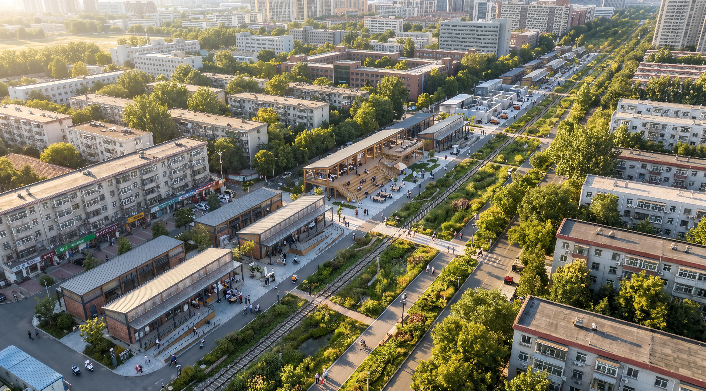
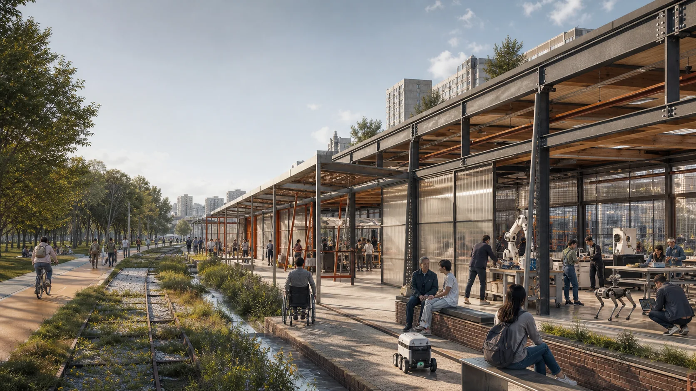
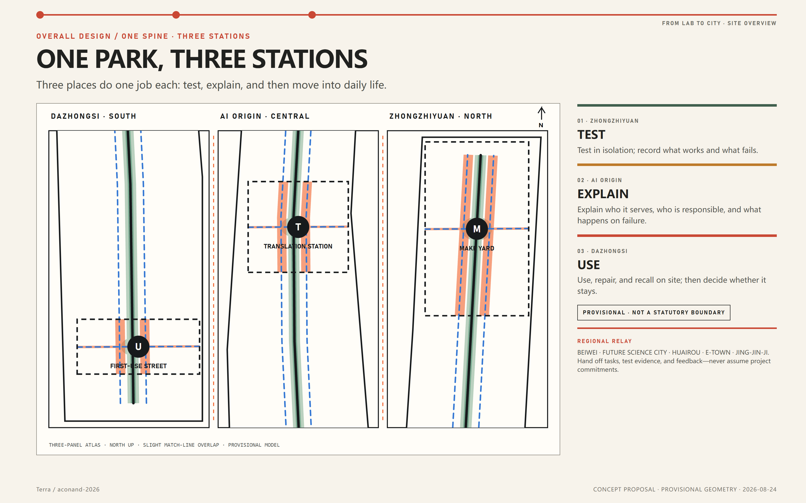
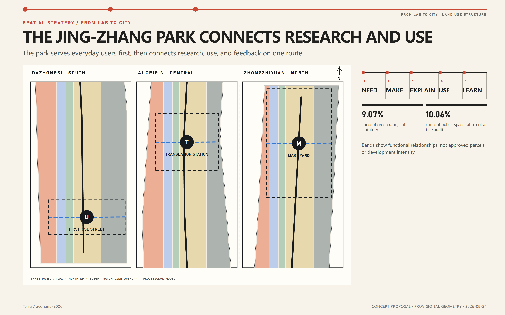
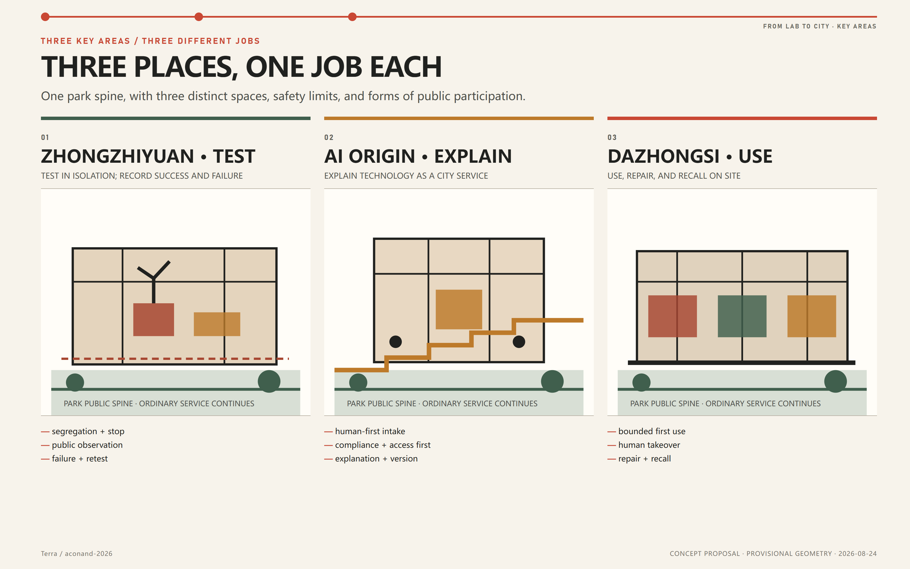
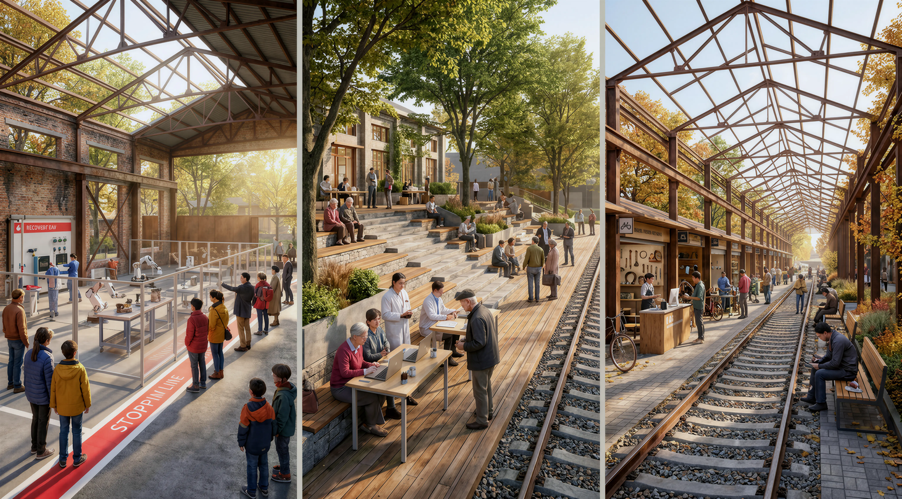
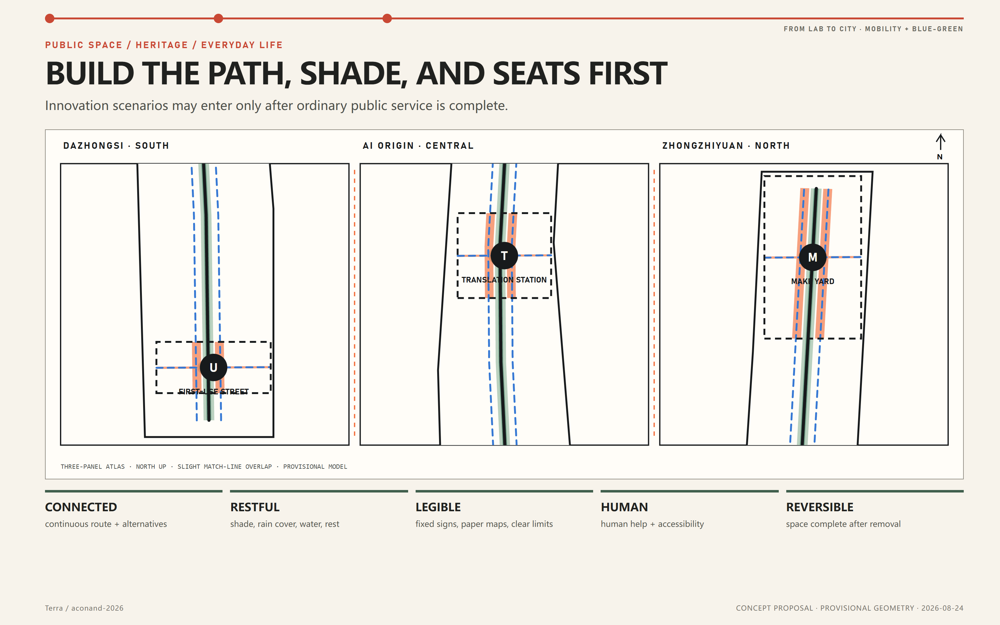
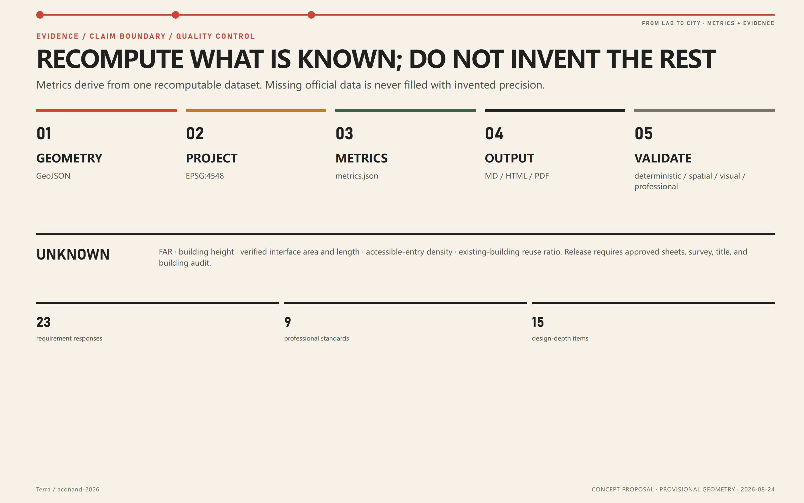

# FROM LAB TO CITY / 让创新走进日常

**One Park, Three Stations, Bringing Innovation into Everyday Life**

> **ONE PARK, THREE STATIONS, BRINGING LABORATORY RESULTS INTO EVERYDAY CITY LIFE.**

*Agent-generated synthetic overall concept image. It communicates the spatial vision of one park and three stations; it is not a site photograph, survey, statutory plan, evidence of public opinion, approved government rendering, or engineering-feasibility conclusion.* [source:AGENT-GENERATED-DESIGN]

*A local synthetic concept image that clarifies the threshold between the public front and working back; its people, signs, and activities are design communication.* [source:AGENT-GENERATED-DESIGN]

## Design Basis and Source Inventory

### Why Do AI Results Struggle to Reach Daily Life?

#### Design judgement

Phase I of Jing-Zhang Railway Heritage Park already supports real public life. Official reporting in August 2026 still described Phase II as approaching opening, while the approximately nine-kilometre link remained a corridor objective rather than proof that every segment had been accepted. With this north–south public backbone taking shape, the proposal does not draw a competing “innovation axis”. It focuses on missing links, services, and shared uses between the park, campuses, neighbourhoods, stations, and existing buildings. [source:HERITAGE-PARK-PHASE1] [source:HERITAGE-PARK-PHASE2]

Haidian does not lack AI research or technical results. What is missing is the path from the laboratory into the real city. This proposal uses the Jing-Zhang Railway Heritage Park to complete that path. The park first secures everyday public service for everyone. Zhongzhiyuan tests technology, AI Origin explains the service, and Dazhongsi places it into limited daily use. Faults, maintenance costs, and public feedback then return to the next research cycle: **define the need → make a prototype → explain the service → use at limited scale → return the feedback**.

#### Fact, proposal, and unknown

| Layer | How it is used | Boundary of use |
|---|---|---|
| Official announcements and statutory public pages | Project name, task scopes, three key areas, approved-plan status, and facts stated on the page | No inferred GIS boundary, parcel, FAR, or height |
| Government plans, guidance, and reporting | Urban renewal, AI industry, greenway, park, and implementation context | Policy direction is not a project-specific land, funding, or permit commitment |
| Structured organizer repository | Submission contract, schemas, validation, and temporary calculation frame | Provisional polygons are not survey or statutory boundaries |
| Agent-generated proposal | Conceptual land-use support, public space, prototypes, phases, scenarios, and operations | Open co-creation recommendations for professional development |

The 2026 public page for the approved plan confirms nine blocks, 16.7 square kilometres, and 75 leading-function divisions. Its statutory attachment returned HTTP 404 on 22 August 2026. This proposal therefore respects the published “one belt, one axis, two centres, multiple nodes” structure but leaves parcel controls unknown. The 2024 consultation draft is background on planning evolution, never a substitute for the final plan. [source:CONTROL-2026-PUBLIC] [source:CONTROL-2024-DRAFT]

Full publication dates, access dates, rights, permitted uses, and limitations are recorded in `sources.json`; eleven critical data gaps and release triggers are in `assumptions.json`. No third-party photograph, remote map tile, corporate mark, or uncleared font is embedded. All derived content must be recalculated when cleared official geometry arrives. [source:SITE-PACKAGE] [source:PROVISIONAL-BOUNDARIES]

## Three-Level Scope Framework

The three scopes are three kinds of work, not successive zoom levels of one polygon:

| Scope | Call figure | Work in this proposal | Spatial evidence |
|---|---:|---|---|
| Coordinated research | about 43.6 km² | Space, industry, talent, finance, computing, data, scenarios, three areas and two wings | No invented GIS boundary; mechanism and official facts only |
| Overall design | about 11.4 km² | Renewal, support land use, public space, mobility, utility interfaces, character, and implementation | Repository provisional polygon recalculates to 11.413 km² |
| Key detailed design | about 368.4 ha | Differentiated prototypes for Zhongzhiyuan, AI Origin, and Dazhongsi | Three provisional key-area polygons, not official redlines |

The submitted overall-design polygon recalculates to 11,412,825.386 m² in EPSG:4548. It demonstrates internal package consistency, not an approval area. [data:geometry/site_boundary.geojson#SITE-001] [metric:site_area_sqm]

One working path connects the three scope levels. Coordinated research frames industrial and civic problems; overall design provides the continuous park, mobility, public service, and site interfaces; the three key areas perform controlled testing, explanation, and limited use; faults, maintenance costs, and public feedback return to the next cycle. The key-area count is checked against the locked layer. [data:geometry/key_areas.geojson#PROV-KEY-001] [metric:key_area_count]

## Coordinated Research Area: Industry and Future City Research

### Overall concept: one park, three stations

The spatial structure is **one Jing-Zhang park + three stations + professional services on both sides + one feedback loop**:

- **PARK PUBLIC SPINE**: continuous walking, rest, ordinary wayfinding, accessibility, and human help; complete even when smart systems are off;
- **Zhongzhiyuan / TEST**: controlled validation of models, computing, chips, devices, robotics, safety, and standards;
- **AI Origin / EXPLAIN**: explanation, problem matching, open collaboration, talent, accessibility, and compliance before deployment;
- **Dazhongsi / USE**: bounded use in daily life, with repair, recall, feedback, and decisions on whether to scale;
- **Zhongguancun Technology Services**: legal, IP, standards, design, investment readiness, and international support;
- **Xiaoyuehe Everyday Services**: real neighbourhood, environmental, ageing, accessibility, mobility, and public-service problems;
- **DEFINE → MAKE → EXPLAIN → USE → LEARN**: failure, misuse, maintenance, and public response must return.

This translates Haidian’s 0-to-1 and 1-to-100 direction into a spatial lifecycle without inventing companies, output values, recruitment deals, or fiscal commitments. [source:HAIDIAN-FIVE-YEAR-2026] [source:AI-ORIGIN-2026]

### Seven basic conditions

| Element | Spatial and operating response |
|---|---|
| Land | No assumed acquisition; start with lawful public relationships, reversible renewal, and restorable sites |
| Space | Long-life frames with 100-day or seasonal short-life fit-outs |
| Industry | Each station does one clear job rather than cloning the same incubator three times |
| Finance | Funding categories and S/M/L complexity bands only; no fabricated amounts |
| Talent | Clinics, open steps, short courses, real projects, and maintenance as learning |
| Compute/data | Open interfaces, metered small pilots, synthetic/public data first, minimal collection |
| Scenarios | Pass necessity, spatial, governance, and expansion gates before bounded first use |

### Regional coordination: five tasks with clear inputs and outputs

The Jing-Zhang Belt does not reduce nearby innovation nodes to abstract arrows. It states what task may be handed in and what evidence must be returned. Every hand-off needs a project record, an accountable owner, a defined boundary, and a stop condition. Without a formal agreement, an intention to collaborate is not described as a committed project.

| Partner node | Role in primary official evidence | How this proposal connects | No implied commitment |
|---|---|---|---|
| Zhongguancun AI Beiwei Community | Haidian's Fifteenth Five-Year Plan describes it as a research-institute engine linking frontier incubation and applied scenarios [source:HAIDIAN-FIVE-YEAR-2026] | Send publishable early-stage results and industry questions to small controlled tests at Zhongzhiyuan, or explain the service at AI Origin; return city-use findings as the next problem list | No invented institution, partnership, or tenancy |
| Future Science City | Its official profile focuses on advanced energy, advanced manufacturing, healthcare, and central-enterprise R&D [source:FUTURE-SCIENCE-CITY-PROFILE] | Bring shared technical and engineering questions to controlled tests at Zhongzhiyuan; transfer only test records, technical interfaces, maintenance needs, and retest evidence | No promise of a project, fund, land, or shared facility |
| Huairou Science City | Its official role centres on major science facilities, national strategic research capacity, and original innovation [source:HUAIROU-SCIENCE-CITY-PROFILE] | Explain publishable methods and city questions at AI Origin; return findings from use at Dazhongsi as researchable questions rather than scientific conclusions | No assumption that scientific findings, sensitive data, or facilities can be shared |
| Beijing E-Town (Yizhuang) | Official result-transfer programmes describe it as a “Three Science Cities and One High-Tech Area” platform for industrialisation [source:ETOWN-RESULT-TRANSFER-2025] | Only a project that passes a 100-day trial and professional review may seek an industrialisation channel; its first-use record travels with it | First use is not mass-production readiness; no promised landing, investment, or policy support |
| Beijing–Tianjin–Hebei | Haidian's plan calls for coordinated AI hardware, software, algorithms, models, applications, robotics test scenarios, and technology transfer [source:HAIDIAN-FIVE-YEAR-2026] | Release a portable interface version, failure log, repair requirements, and exit conditions for later lawful retesting | No named external site, funding, or data exchange without agreements |

The Jing-Zhang Belt therefore does not replace science cities or industrial districts. It fills the **city-side gap**: turning real problems into testable tasks and first-use outcomes into evidence that can travel back.

### Lessons from eight primary-source cases

| Case | Transferable mechanism | Not copied |
|---|---|---|
| Singapore Punggol Digital District | Shared long-life infrastructure, interoperability, controlled testing before deployment | Single-platform lock-in and sensor maximisation [source:CASE-PDD] |
| Yangjae / Seoul AI Hub | Different spaces for learning, incubation, growth, and research partnership | Foreign policy incentives as Beijing promises [source:CASE-SEOUL-AI-HUB] |
| Barcelona 22@ | Productive use, knowledge, mixed city, infrastructure, heritage, and innovation on one implementation ledger | Office growth as a proxy for inclusion and innovation [source:CASE-BARCELONA-22] |
| Cambridge Kendall / Volpe | Open institutional edges and bind development value to public benefit | High intensity without local statutory and community checks [source:CASE-KENDALL-VOLPE] |
| London Knowledge Quarter | Institutional alliance, public-realm audit, and small-project bank | Branding a network without access, projects, or funding [source:CASE-KNOWLEDGE-QUARTER] |
| Helsinki Smart Kalasatama | Short neighbourhood pilots, co-design, everyday benefit, public learning | Treating residents as unpaid test subjects [source:CASE-SMART-KALASATAMA] |
| Paris Rive Gauche / Station F | Reuse large-span frames, replaceable interiors, public forecourts, mixed city | One mega-incubator as the entire belt [source:CASE-PARIS-RIVE-GAUCHE] |
| Toronto Quayside | Necessity, privacy, independent digital oversight before deployment | Platform first, public authorisation later [source:CASE-QUAYSIDE] |

The identity no longer asks readers to learn an abstract symbol. A thin line and three station dots run through the booklet and boards, marking testing, explanation, and use. The shared line is **FROM LAB TO CITY**. [standard:PROJECT-AGENT-OPEN-CALL-TASKBOOK]

## Overall Design Area: Urban Renewal and Regulatory-Plan-Level Urban Design

### The Jing-Zhang Park Connects Research and Use

The overall area is organised by the existing and emerging heritage park, not by drawing another longitudinal axis. Five continuous support bands express conceptual roles and support topology checks. Differences between key areas are carried by public forecourts, building prototypes, activities, and phasing rather than false parcel precision. [data:geometry/land_use.geojson#LU-001] [depth:overall_spatial_structure]

**FROM LAB TO CITY** is not about placing experimental equipment in a park. It is a reusable spatial and governance method. The **park public spine** protects unconditional everyday access and service. An **open public foreground with a controlled work area** makes innovation understandable while containing risk. A **public project record** leaves evidence to continue, revise, or exit after every test. Rather than expressing an AI district through device density, giant screens, or a new skyline, the proposal creates identity through a testable process: real need—controlled test—clear explanation—bounded use—repair or recall—public learning or exit.

### Five urban-design rules

1. **Complete ordinary service first**: restore passage, accessibility, shade, rest, and human service before smart layers.
2. **Public front, controlled back**: people can understand and respond; high-risk work remains separated.
3. **Durable frame, replaceable fit-out**: long-life structure and utilities, replaceable test and service units.
4. **Occupation earns public value**: every pilot leaves repair, knowledge, or service—not merely exposure.
5. **Every system can come down**: equipment, data, accounts, interfaces, and sites have stop and recovery plans.

### Land use, intensity, and renewal boundary

Conceptual green and public space are separate recomputable layers. The building layer contains nine typological envelopes only. Because the final plan attachment, existing-building survey, ownership, daylight, roads, and utilities are unavailable, FAR and height remain `unknown`; parametrically polished massing is not used to simulate approval precision. [standard:MOHURD-CONTROL-DETAILED-PLANNING] [metric:floor_area_ratio] [metric:building_height_m]

The renewal sequence is: **protect everyday public service → repair access and ground-floor relationships → reuse verified-safe frames → insert replaceable fit-outs → consider replacement last**. Real retain/renovate/demolish decisions require building-by-building survey, structure, heritage, title, and operational review.

## Detailed Design of Key Areas

### Zhongzhiyuan: test it first

This is where technology is tested clearly before it reaches the public; its spatial working label is **MAKE YARD**. People can observe from a gallery, while compatibility tests, robotic prototyping, synthetic data, and repair/loading stay in a controlled area. The building family comprises a reusable long hall, a safety gatehouse, and a repair depot. The first 100-day project selects one low-risk device with limited interfaces, tests segregation, emergency stop, and human sign-off, then publishes failures and retest methods. Unclassified machines never enter the open park. [data:geometry/key_areas.geojson#PROV-KEY-001]

### AI Origin: define and explain it first

This is where technology is explained and turned into a usable city service; its spatial working label is **TRANSLATION STATION**. Residents, institutions, and researchers bring real problems to a human desk before moving into small rooms for confidentiality, compliance, accessibility, data, and maintenance review. Open steps publish traceable versions and failures. The first 100-day project runs a fixed weekly clinic. AI assists summaries, retrieval, and translation; humans decide commissioning, resource commitments, and service refusal. [data:geometry/key_areas.geojson#PROV-KEY-002]

### Dazhongsi: prove it in daily use

This is where technology is proven in daily life; its spatial working label is **FIRST-USE STREET**. Reusable large-span frames host first use, a human service counter, repair and recall, voluntary small-business trials, and public acceptance tables. The approximately 3.95-hectare Lanjing Lijia renewal is a real anchor, not a basis for extrapolating statutory controls to the whole key area. The first 100-day project accepts only low-risk services with a human equivalent and same-day removal. Maintenance cost, complaints, and reasons to exit are reported alongside performance. [source:BLUE-SCENE-2026] [data:geometry/key_areas.geojson#PROV-KEY-003]

*This synthetic concept image compares the three sites' different spatial tasks. Its people, signs, buildings, and activities are design communication—not a site photograph, existing-condition reconstruction, statutory plan, or government-approved rendering.* [source:AGENT-GENERATED-DESIGN]

All three put public park space first, followed by an accessible forecourt, a room for explanation and review, a controlled work area, and maintenance access. Their principal tasks cannot be exchanged. Completeness is audited under the key-area design-depth item. [depth:three_key_area_detailed_design]

## AI Innovation Ecosystem, Personas, and AI+ Scenarios

### Ten user groups

The proposal covers researchers; developers and start-ups; older residents; children and carers; disabled and temporarily mobility-limited people; small merchants and frontline staff; park/building operators; public-service and professional workers; domestic/international visitors; and independent safety, ethics, and accessibility reviewers. Each persona combines a goal, a likely form of algorithmic exclusion, and a non-digital guarantee. Personas are not commercial profiles. [standard:BARRIER-FREE-ENVIRONMENT-LAW] [standard:ELDERLY-SMART-TECH-PLAN-2020-45]

### Thirteen scenario cards

| ID | Scenario | Primary place | Risk and human boundary |
|---|---|---|---|
| S01 | Visible full-stack compatibility yard | MAKE | L3; separation, professional sign-off, emergency stop |
| S02 | Low-speed service robot safety gate | MAKE → bounded USE | L3; closed testing before any public-space use |
| S03 | Model and agent red-team theatre | MAKE + TRANSLATE | L3; synthetic/public data, human severity decision |
| S04 | Energy and cooling sandbox | MAKE | L1/L3; metered simulation on non-critical loads |
| S05 | Research-to-city clinic | TRANSLATE | L1/L2; human triage, no automated commissioning |
| S06 | Open-interface multilingual explainer | TRANSLATE | L1; source, version, and human editing remain visible |
| S07 | Accessibility co-design room | TRANSLATE + USE | L1/L2; field audit before algorithmic routing |
| S08 | First-use, repair, and recall assistant | USE | L1/L2; human desk, repairable and returnable |
| S09 | Opt-in small-business co-pilot bench | USE | L2; minimal in-store data, staff can exit |
| S10 | Multimodal accessible wayfinding | Park spine | L1/L2; recommends field-verified routes only |
| S11 | Heat-comfort and rest assistant | Xiaoyuehe/park | L1; environmental data, no personal tracking |
| S12 | Night human-help triage | Park spine | L1; direct human line, AI cannot refuse help |
| S13 | Centennial engineering and open-culture interpreter | Belt-wide | L1; traceable public/original content only |

S01–S04 provide at least four industry test and validation scenarios. Every proposal passes necessity, spatial, governance, and expansion gates. Default exclusions include indiscriminate face recognition, emotion inference, child profiling, automated public-service eligibility, predictive policing, and unappealable person scoring. [standard:GENERATIVE-AI-INTERIM-MEASURES] [source:CASE-QUAYSIDE]

### Human journeys

- A researcher moves from clinic to red team, compatibility test, accessibility review, and only then bounded first use.
- An older resident can navigate, ask a person, use paper information, and receive a written repair receipt without installing an app.
- A wheelchair user audits a real route; physical barriers are repaired before the route model is updated.
- A merchant retains the ordinary workflow, can export/delete data, and exits if maintenance burden outweighs value.
- An international visitor sees making, translation, first use, and repair before entering a human-owned collaboration route.

The taskbook’s scenario, persona, spatial-operational mapping, and human-review requirements are covered here and in the structured matrix. No pilot is represented as approved. [source:AGENT-TASKBOOK]

## Land Use, Building Scale, and Retain-Renovate-Demolish Strategy

The land-use layer uses repository-approved codes and five continuous support bands that exactly cover the provisional overall boundary. It is a conceptual support structure, not a parcel re-zoning plan. Green and public space are separately recomputable. [standard:MNR-LAND-USE-CLASSIFICATION-GUIDE] [data:geometry/land_use.geojson#LU-001]

Nine low-confidence prototype envelopes total 56,168 m² of footprint. They test durable frames, replaceable fit-out, open public foregrounds, controlled work areas, and maintenance access. They are not an existing-building inventory, total development capacity, or approved footprint. [data:geometry/buildings.geojson#BLDG-001] [metric:building_footprint_area_sqm]

### Retain—repair—insert—replace

| Decision | Priority condition | Required evidence |
|---|---|---|
| Retain | Verified structural, cultural/carbon, and public-use value | Survey, structure, heritage, title, fire |
| Repair | Usable frame with poor threshold, access, environment, or maintenance | Field audit, operator need, cost |
| Insert | Reversible clinic, repair, test, or human-service unit can work | Load, egress, permit, removal, recovery |
| Replace | Safety, function, or lifecycle cannot pass and law allows | Statutory plan, professional study, public impact, procedure |

Until those inputs exist, the reuse floor-area ratio remains unknown. The proposal supplies a decision method, not a demolition map. [depth:retain_renovate_demolish] [metric:reuse_floor_area_ratio]

## Transport, Rail, Municipal Infrastructure, and Public Services

### North–south: make everyday public service continuous

Continuity does not mean claiming every segment is open. Verified sections use consistent route IDs, ordinary maps, and bilingual information; construction, closure, inaccessibility, and unknown sections are labelled honestly; each segment offers rest, access to city streets, and human help. The 9,296.64-metre park-spine model line is an analytic line inside the provisional boundary, not a surveyed park distance. [data:geometry/roads.geojson#ROAD-001] [metric:common_ground_design_length_m]

### East–west: verify existing links before proposing construction

Existing streets, station thresholds, campus and park gates, river edges, and neighbourhood paths are screened as possible east–west links. Passage, accessibility, traffic, railway, heritage, blue-green, title, and maintenance are audited before wayfinding, waiting, light, drainage, and service flows are improved. This concept makes no bridge, tunnel, underground, or structural feasibility conclusion. [depth:traffic_rail_slow_parking]

### Municipal and new infrastructure

Energy, cooling, computing, data, communications, and logistics begin with open interfaces, independent metering, and small pilots. AI can forecast and advise but never bypass ordinary controls. Missing utility, capacity, drainage, flood, tree, soil, fire-water, and network evidence prevents any engineering-capacity commitment. [source:CASE-PDD] [depth:municipal_new_infrastructure]

Public service remains both digital and human: status masts, fixed signs, paper/tactile/large-text/captioned information, staffed windows, and emergency contacts form one chain. Accessible-entry density remains unknown until field audit; provisional polygon perimeter is not used as frontage. [metric:accessible_entries_per_km]

## Blue-Green Network, Public Space, and Urban Character

The provisional design model contains 1,034,634.044 m² of green space (9.0655%) and 1,147,875.019 m² of public space (10.0578%). These values test internal design geometry only; they are neither existing-condition nor statutory indicators. [metric:green_ratio] [metric:public_space_ratio]

The park is the public spine shared by all three stations. Twelve reversible and legible components form the kit: continuous walking strip, explanation and review room, human-help window, status marker, observation rail, removable service pod, repair island, feedback table, quiet booth, shade canopy, offline guide box, and maintenance label. [data:geometry/green_space.geojson#GREEN-001] [data:geometry/public_space.geojson#PUBLIC-001]

### Three public landmarks that do real work

The landmarks are working public places, not sculptures or event-only showrooms. Zhongzhiyuan makes testing and calibration visible; AI Origin makes problems and translation visible; Dazhongsi makes use, human takeover, repair, and recall visible. A shared project record uses `OPEN / TEST / FIX / STOP / SHARE`. Stopping a harmful project is as visible as launching one. No personal popularity score or sensor-derived “contribution rank” is created.

### Visible, testable, and repairable

Centennial Jing-Zhang engineering culture contributes **CONNECT**; Zhongguancun innovation culture contributes **TEST**; accountable AI culture must add **CARE**. The spatial story loops: connect a problem, make testing visible, accept maintenance, and create a new connection. Specific people, dates, artefacts, and protected objects require official historical and heritage review. [source:HAIDIAN-DISTRICT-PLAN-2035] [source:URBAN-RENEWAL-WHITEPAPER-2022]

The visual identity combines warm paper, graphite, railway oxide red, park green, and a restrained amber accent. Colour is never the sole state cue. No remote font or corporate logo is used, and the proposal identity stays distinct from official place names and heritage signage. [standard:MOHURD-URBAN-DESIGN-MEASURES]

## Renewal Projects, Implementation Policy, and Phasing

### First project list (concept)

| Project | Band | First dependency | Exit/conversion |
|---|---|---|---|
| D00 official-data recovery and field audit | S–M | Approved sheets, survey, title, professional data | Recalculate or reject candidate interfaces |
| B01 park public-service repair package | S–L | Access, accessibility, landscape, traffic, maintenance | Become ordinary public improvement |
| P100-M device compatibility and safety test | M | Site, safety, utility, insurance, responsibility | Stop / same scale / professional development |
| P100-T research-to-city clinic | S | Human rota, confidentiality, fair access, complaints | Public needs and project routing |
| P100-U everyday trial and repair hall | M | Product responsibility, people, repair, retirement | Recall / stop / professional development |
| N01 durable-frame/replaceable-fit-out network | M–L | Buildings, fire, utilities, title, operator | Replicate only components that pass expansion review |
| O01 open project bank and work ledger | S | Rights, maintenance, takedown | Open knowledge or timed retirement |
| E01 four-season programme and open week | S–M | Venue, safety, content, partners | Renew through work outputs, not attendance |

S/M/L express relative complexity, not cost. No investment, return, or construction date is stated before survey, design, and market testing. [depth:renewal_project_list]

### The 100-day charter

Days 1–20 establish the ordinary-service and data baseline; 21–35 cover co-design and professional pre-review; 36–50 cover reversible installation and drills; 51–80 bounded operation; 81–90 public and independent review; 91–100 data/site retirement or the next decision. The only outcomes are **stop, supplement evidence, continue at the same scale, or enter professional development**. [data:geometry/phasing.geojson#PHASE-001] [depth:phasing_implementation]

Governance defines responsibility before later implementation names specific organisations. The system needs corridor coordination, an accountable everyday park-service operator, hosts for the three stations, pilot proposers, professional review, public review, and an independent pause function. Funding is described only as ordinary public service, controlled tests, activities, commercial first use, and independent review. Personal data is not monetised, and sponsorship cannot control ordinary passage.

### Participants, responsibility, and phase metrics

| Phase | Responsible roles and participants | Decision metrics and feedback |
|---|---|---|
| Data recovery and pre-entry | Professional survey/planning teams; everyday park-service operator | Source completeness, field baseline, unresolved statutory conflicts; no design commitment before the data gate passes |
| Days 0–100 | Key-area host, pilot proposer, professional and public review groups | Ordinary-passage availability; incident, human-takeover, and maintenance records; complaints and response; stop/supplement/same-scale/develop decision |
| Years 1–3 | Everyday park-service operator, owners/users, implementation and maintenance teams | Verified projects, public-service hours, reusable-component ratio, operating burden; replicate only components that pass expansion review |
| After year 3 | Coordinating secretariat, independent review, relevant professional teams | Joint evaluation of public value against maintenance, energy, and rights burdens; consolidate, adjust, or retire |

Only after formal data becomes available will each metric receive a baseline, method, accountable owner, target, and review cycle; no numeric target is invented here. These are proposed governance roles, not claims that any real organisation has committed to participate.

The suggested annual rhythm is easy to follow: identify city needs in spring, test prototypes in summer, try them in daily life in autumn, and review failure, maintenance, and exit in winter. **FROM LAB TO CITY OPEN WEEK** is a working international label, not a confirmed event, date, fund, or partnership. [source:CASE-SMART-KALASATAMA]

## Metrics, Area Recalculation, and Compliance Matrix

| Metric | Current value/status | Meaning |
|---|---:|---|
| Provisional overall area | 11,412,825.386 m² | EPSG:4548, low confidence |
| Concept green space | 1,034,634.044 m² / 9.0655% | Recomputable, not existing/statutory green |
| Concept public space | 1,147,875.019 m² / 10.0578% | Recomputable, not title/access audit |
| Prototype footprint | 56,168 m² / 9 envelopes | Typology testing, not building inventory |
| Innovation-station roles | 3 roles | MAKE/TRANSLATE/USE read from forecourt/building attributes |
| 100-day conceptual extent | 212,306.044 m² | Phasing model, not approved project boundary |
| Interface area/frontage | unknown | Needs surveyed frontage, title, entry, operating boundary |
| FAR/height | unknown | Needs final approved sheets and parcel conditions |
| Accessible-entry density | unknown | Needs field audit and verified frontage |
| Reuse floor-area ratio | unknown | Needs building, structural, title, and retain/replace audit |

The three formal visual metrics are recalculated from submitted GeoJSON and match the offline HTML `data-value` declarations. [metric:site_area_sqm] [depth:metrics_recalculation]

The compliance matrix covers seventeen announcement requirements and six Agent tasks (23 total). The standards matrix records nine references; the design-depth matrix covers fifteen items. After both languages, five figures, A3/A0, HTML, and the final concept aerial were complete, the persisted full self-check was rerun: deterministic, spatial, visual, and professional gates all pass, with `can_enter_formal_review=true`; only three non-blocking provisional key-area notices remain. `self_check.json` is the controlling machine status.

## Risk, Copyright, and Compliance

| Risk | Current response | Release trigger |
|---|---|---|
| Final plan attachment unavailable | Intensity, height, roads, and parcel controls remain unknown | Valid approved sheets and professional review |
| Provisional geometry error | Locked source, warnings, replace-and-recalculate workflow | Cleared official GIS/CAD from organiser |
| Buildings/title missing | Prototypes only; no building-by-building decision | Survey, title, structure, heritage audit |
| Mobility/utilities/heritage missing | No bridge, capacity, fire, or protection-line conclusion | Discipline data and lawful review |
| Phase II status incomplete | No claim that the entire corridor is accepted/open | As-built/opening data and field walk |
| AI/public risk | Necessity, minimal data, human decision, ordinary service continuity, emergency stop, retirement | Project-specific public-interest and safety review |
| Operator/funding absent | Roles, charter, complexity band, decision gates only | Named parties sign site, funding, and responsibility plan |

Every AI scenario is an uncertified design hypothesis. Public space and human service remain useful when smart systems are off; high-risk tests stay in controlled work areas; people remain responsible for admission, service, incidents, complaints, repair, and stopping. [depth:risk_missing_data] [standard:GENERATIVE-AI-INTERIM-MEASURES]

**Public-source limits, personal privacy, and copyright authorisation** are hard boundaries. Only official public or rights-cleared material may be used; non-public planning, trade secrets, personal data, movement traces, identifiable faces, and voiceprints are excluded. Generated findings require human and professional review, and high-risk conclusions can be independently paused. The local concept image used text only. The overall aerial used only three project-generated submission assets as references in one three-image Banana Pro run, followed by one low-strength 6K enhancement of the Agent-selected candidate. The three-key-area triptych used one reference sheet assembled only from project-generated submission assets, followed by one three-image run and one low-strength 6K enhancement. People, signs, and settings in all three images are synthetic; the complete method and rights boundaries are retained. On 23 August 2026, the account holder confirmed that outputs from this commercial enterprise account may be published publicly. That authorisation is recorded in `report/copyright_statement.md`; the final fork, push, or Pull Request will still be a separate action after the package is final.

The package embeds only text, graphics, design geometry, and offline pages generated by Terra / aconand-2026, plus organizer-provided provisional geometry. To keep all four HTML files readable where no Chinese system font is installed, it also embeds a reduced Noto Sans SC subset containing only glyphs used by this submission. The subset is redistributed under the SIL Open Font License 1.1, with its source, licence, and checksums registered in `sources.json`, the copyright statement, and `manifest.json`. Official and case materials are factual citations; their photography, maps, marks, and layouts are not copied. HTML loads no CDN, remote script, remote font, iframe, form, tracker, or external API. [source:AGENT-GENERATED-DESIGN] [source:FONT-NOTO-SANS-SC]

**All spatial, scenario, activity, governance, finance, and implementation content is an open co-creation concept, reference proposal, and material for professional teams to develop. It does not replace formal planning, constitute government approval, or promise implementation.** [source:AGENT-TASKBOOK]

## References

### Project, statutory, and policy sources

- Organizer repository site package, schemas, and validation contract. [source:SITE-PACKAGE]
- Agent-facing open-call taskbook. [source:AGENT-TASKBOOK]
- Official prequalification announcement. [source:OFFICIAL-ANNOUNCEMENT]
- 2026 public page for the approved corridor plan. [source:CONTROL-2026-PUBLIC]
- Official news on the 2026 approval. [source:CONTROL-2026-APPROVAL-NEWS]
- 2024 consultation-draft overview, background only. [source:CONTROL-2024-DRAFT]
- Haidian Urban Renewal Classification Implementation Guide 2025. [source:URBAN-RENEWAL-GUIDE-2025]
- Lanjing Lijia urban-renewal case. [source:BLUE-SCENE-2026]
- Phase I and Phase II park updates. [source:HERITAGE-PARK-PHASE1] [source:HERITAGE-PARK-PHASE2]
- Haidian Fifteenth Five-Year Plan and District Territorial Spatial Plan. [source:HAIDIAN-FIVE-YEAR-2026] [source:HAIDIAN-DISTRICT-PLAN-2035]
- Regional context for AI Beiwei Community and Beijing–Tianjin–Hebei coordination. [source:HAIDIAN-FIVE-YEAR-2026]
- Regional roles of Future Science City, Huairou Science City, and Beijing E-Town. [source:FUTURE-SCIENCE-CITY-PROFILE] [source:HUAIROU-SCIENCE-CITY-PROFILE] [source:ETOWN-RESULT-TRANSFER-2025]
- AI Origin briefing and Beijing agent-economy report. [source:AI-ORIGIN-2026] [source:AGENT-ECONOMY-2026]
- Beijing Greenway Guide and Beijing Urban Renewal White Paper. [source:GREENWAY-GUIDE-2025] [source:URBAN-RENEWAL-WHITEPAPER-2022]

### Primary-source global cases

- Punggol Digital District, JTC. [source:CASE-PDD]
- Yangjae / Seoul AI Hub, Seoul Metropolitan Government. [source:CASE-SEOUL-AI-HUB]
- Barcelona 22@, Barcelona City Council. [source:CASE-BARCELONA-22]
- Kendall Square / Volpe, City of Cambridge. [source:CASE-KENDALL-VOLPE]
- Knowledge Quarter London. [source:CASE-KNOWLEDGE-QUARTER]
- Smart Kalasatama, Forum Virium Helsinki. [source:CASE-SMART-KALASATAMA]
- Paris Rive Gauche / STATION F. [source:CASE-PARIS-RIVE-GAUCHE]
- Toronto Quayside digital governance, Waterfront Toronto. [source:CASE-QUAYSIDE]

Complete URLs, dates, rights, limitations, standard records, and local archive hashes are in `sources.json`; all data gaps and recalculation triggers are in `assumptions.json`.
