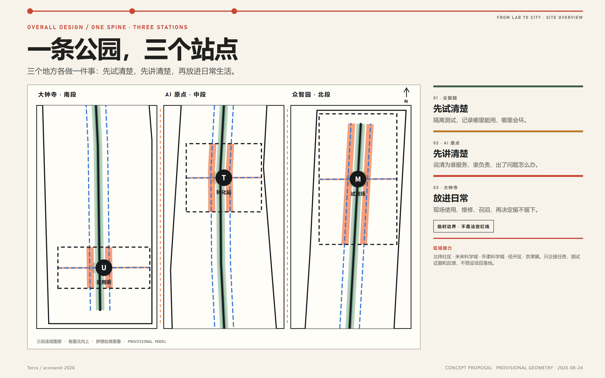
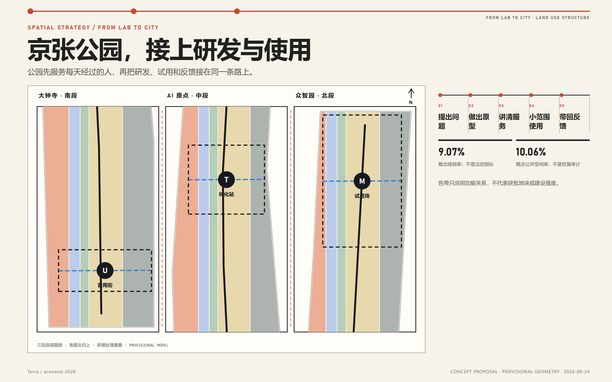
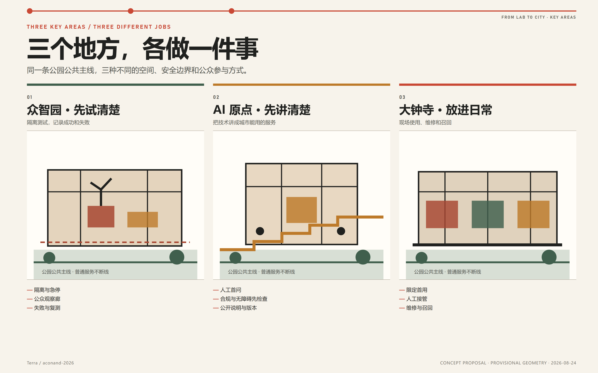
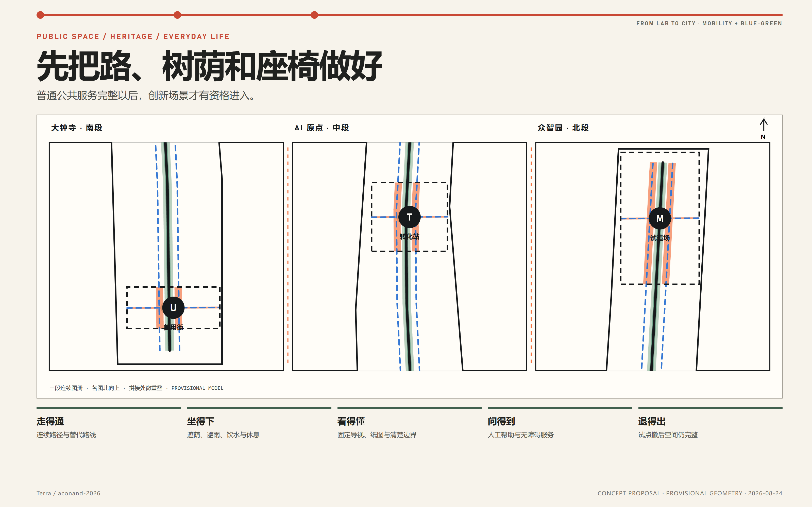
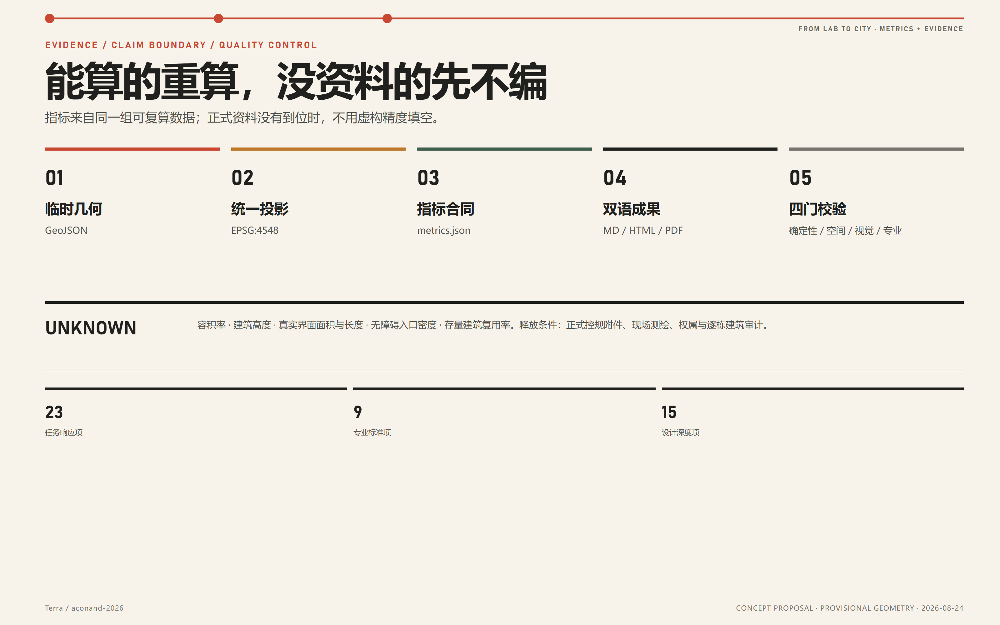

# 让创新走进日常 / FROM LAB TO CITY

**百年京张 AI 创新带城市设计**  
**One Park, Three Stations, Bringing Innovation into Everyday Life**

> **一条公园，三个站点，把实验室成果带进城市生活。**  
> **ONE PARK, THREE STATIONS, BRINGING LABORATORY RESULTS INTO EVERYDAY CITY LIFE.**

*Agent 生成的合成总体概念建议图。它表达“一条公园，三个站点”的空间愿景，不是现场照片、测绘成果、法定规划、公众意见证据、政府审定效果图或工程可行性结论。* [source:AGENT-GENERATED-DESIGN]

*局部合成概念建议图，用于补充总体鸟瞰中公共前场与工作后场的门槛关系；人物、标识和活动均为设计表达。* [source:AGENT-GENERATED-DESIGN]

## 设计依据与资料清单

### AI 成果，为什么难走进日常？

#### 设计判断

京张铁路遗址公园一期已经投入真实使用；截至 2026 年 8 月，官方对二期的表述仍是“近期开园”，远期目标是形成约 9 公里的连续公园。既然南北公共骨架已经出现，方案不再另画一条与它竞争的“新轴”，而是集中解决公园与园区、校园、社区、站点和存量建筑之间缺少连接、缺少服务、缺少共同使用的问题。[source:HERITAGE-PARK-PHASE1] [source:HERITAGE-PARK-PHASE2]

海淀不缺 AI 研究和技术成果，真正缺少的是成果从实验室走向真实城市的这一段路。本方案用京张铁路遗址公园补上这段路：公园先保证人人可用的日常服务；众智园先把设备试清楚，AI 原点先把服务讲清楚，大钟寺再把成果放进日常生活；故障、维护成本和公众意见回到下一轮研发。完整过程是：**提出问题 → 做出原型 → 讲清服务 → 小范围使用 → 带回反馈**。

#### 事实层、设计层与未知层

| 层级 | 本方案怎样使用 | 关键边界 |
|---|---|---|
| 官方公告与法定公开页 | 确认项目名称、任务范围、三重点区、获批控规状态与公开正文事实 | 不从文字或新闻图推断精确红线、地块、容积率和高度 |
| 政府规划、指引与公开报道 | 支撑城市更新、AI 产业、绿道、公园和现实锚点判断 | 政策方向不等于具体项目已获土地、资金或许可 |
| 主办仓库结构化资料 | 作为投稿合同、文件 schema、校验规则和临时计算框架 | 仓库临时 polygon 不是法定或测绘边界 |
| 本方案生成内容 | 表达概念用地、公共空间、建筑原型、分期、场景与运营 | 全部是概念建议，可供专业团队深化研究 |

2026 年获批控规公开页确认九个街区、16.7 平方公里和 75 个主导功能分区，但其法定附件截至 2026-08-22 返回 404。本方案因此承接“一带一轴、两心多点”等已公开结构，却不填写无法核验的地块控制；2024 年公示草案只用于理解规划演变，绝不替代最终图则。[source:CONTROL-2026-PUBLIC] [source:CONTROL-2024-DRAFT]

所有来源、发布日期、访问日期、权利、允许用途与限制保存在 `sources.json`；11 项关键缺口及释放条件保存在 `assumptions.json`。图件不嵌入第三方照片、远程地图瓦片、企业标识或未授权字体，正式边界恢复后须重算全部派生内容。[source:SITE-PACKAGE] [source:PROVISIONAL-BOUNDARIES]

## 三层范围工作框架

方案将三种范围视为三种不同工作，而不是同一边界的缩放：

| 层级 | 公告口径 | 本方案任务 | 空间证据 |
|---|---:|---|---|
| 统筹研究范围 | 约 43.6 km² | 研究空间、产业、人才、资金、算力、数据、场景，以及三区两翼和区域协同 | 不伪造该层 GIS；用公开事实和机制图表达 |
| 总体设计范围 | 约 11.4 km² | 城市更新、用地支持结构、公共空间、慢行、市政接口、风貌和实施框架 | 仓库临时范围复算为 11.413 km² |
| 重点详细设计 | 约 368.4 ha | 众智园约 192.1 ha、AI 原点约 104.3 ha、大钟寺约 72.0 ha 的差异化空间与运营原型 | 三个临时重点区 polygon，非正式红线 |

总体设计临时范围由包内 GeoJSON 在 EPSG:4548 下复算为 11,412,825.386 m²；它只证明提交包内部一致，不是审批面积。[data:geometry/site_boundary.geojson#SITE-001] [metric:site_area_sqm]

三层任务通过同一条工作路径相互衔接：统筹研究明确产业问题和协作关系；总体设计提供连续公园、慢行、公共服务和场地接口；三处重点区依次完成受控测试、服务说明和小范围使用；故障、维护成本与公众意见再回到下一轮研究。三处重点区数量可由锁定图层核对。[data:geometry/key_areas.geojson#PROV-KEY-001] [metric:key_area_count]

## 统筹研究范围产业与未来城市研究

### 总体概念：一条公园，三个站点

空间结构是：**一条京张公园 + 三个站点 + 两侧专业服务 + 一条反馈回路。**

- **公园公共主线 / PARK SPINE**：连续慢行、休息、普通导视、无障碍和人工帮助；即使智能设备关闭也能完整使用；
- **众智园：先试清楚 / TEST**：对模型、算力、芯片、设备、机器人、安全与标准进行受控验证；
- **AI 原点：先讲清楚 / EXPLAIN**：解释成果、匹配问题，把人才、合规、无障碍与开源协作放到应用之前；
- **大钟寺：放进日常 / USE**：在真实生活中小范围使用，并在同一地点完成维修、召回、反馈与是否扩大应用的判断；
- **中关村科技服务**：法律、知识产权、标准、设计、资本准备和国际合作；
- **小月河生活服务**：社区、环境、养老、无障碍、出行和公共服务中的真实问题；
- **提出问题 → 做出原型 → 讲清服务 → 小范围使用 → 带回反馈**：失败、误用、维护与公众意见必须回流。

该结构把海淀“0—1 到 1—100”的政策方向落实为一套空间流程，同时不虚构企业名单、产值、招商或财政承诺。[source:HAIDIAN-FIVE-YEAR-2026] [source:AI-ORIGIN-2026]

### 七项基本条件

| 要素 | 空间/运营回答 |
|---|---|
| 土地 | 不预设征拆；先筛选已有合法公共关系、可逆更新和可恢复场地 |
| 空间 | 长屋提供长寿命骨架，短装按 100 天或一季更换 |
| 产业 | 三个站点各做一件事，避免再造三个同质化孵化器 |
| 资金 | 只列资金类别与 S/M/L 成本带；未测绘询价前不编造金额 |
| 人才 | 门诊、开源阶梯、短课、真实项目和维修共同构成学习场 |
| 算力/数据 | 开放接口、可计量小试点、合成/公开数据优先、数据最小化 |
| 场景 | 先过必要性、空间、治理和扩展四道门，再进入限定首用 |

### 区域协同：五类任务，来路和去向都说清楚

京张带不把周边创新节点画成抽象连线，而是明确“什么任务可以交过来、什么证据必须送回去”。每次交接都要有项目记录、责任人、适用边界和停止条件；没有正式协议时，不把交流意向写成项目落地。

| 协同对象 | 一手依据中的角色 | 本方案怎样接上 | 明确不作的承诺 |
|---|---|---|---|
| 中关村 AI 北纬社区 | 海淀“十五五”规划将其定位为“两院动力源”，承担前沿孵化与场景应用衔接 [source:HAIDIAN-FIVE-YEAR-2026] | 把可公开的早期成果和产业问题送到众智园小范围测试，或在 AI 原点把服务讲清楚；把城市使用反馈整理成下一轮问题清单 | 不虚构具体机构、合作项目或入驻关系 |
| 未来科学城 | 官方园区介绍聚焦先进能源、先进制造、医药健康和央企研发 [source:FUTURE-SCIENCE-CITY-PROFILE] | 将共性技术和工程问题送到众智园受控测试；只交接测试记录、技术接口、维护要求和复测证据 | 不承诺项目、基金、土地或设施共享 |
| 怀柔科学城 | 官方定位强调重大科技基础设施、国家战略科技力量和原始创新 [source:HUAIROU-SCIENCE-CITY-PROFILE] | 在 AI 原点把可公开的研究方法与城市问题讲清楚；把大钟寺的使用反馈整理成可研究的问题，而不是替代科学判断 | 不假定科研结论、敏感数据或设施可以直接共享 |
| 北京经开区（亦庄） | 官方成果转化行动强调“三城一区”平台和科技成果产业化 [source:ETOWN-RESULT-TRANSFER-2025] | 只有通过 100 天试用和专业复核的项目，才可继续对接产业化渠道；首用记录随项目一并移交 | 不把“城市首用”写成“已经量产”，不承诺落地、投资或政策支持 |
| 京津冀 | 海淀“十五五”规划提出人工智能软硬件、算法、模型和应用协同，以及机器人测试场景和成果转化合作 [source:HAIDIAN-FIVE-YEAR-2026] | 输出可携带的接口版本、失败记录、维修要求和退出条件，供后续依法依约复测 | 未有协议时，不指定异地场址、资金和数据交换 |

因此，京张带不替代科学城和产业区；它补的是“城市侧”：把真实问题变成可测试任务，把首用结果变成可回传证据。

### 八个全球案例：哪些做法值得借鉴

| 案例 | 带回京张的机制 | 明确不照搬 |
|---|---|---|
| 新加坡榜鹅数字园区 | 共享长寿命底座、互操作接口、部署前受控试验 | 单一平台锁定和传感器最大化 [source:CASE-PDD] |
| 首尔 Yangjae / Seoul AI Hub | 按教育、孵化、成长和研究合作配置不同空间 | 把境外优惠政策写成北京承诺 [source:CASE-SEOUL-AI-HUB] |
| 巴塞罗那 22@ | 生产、知识、混合城市、基础设施、遗产和开放创新同账实施 | 用办公增长替代包容与创新 [source:CASE-BARCELONA-22] |
| 剑桥 Kendall / Volpe | 打开科研大院边缘，收益绑定公共空间、公交和技能 | 不核验控规就复制高强度开发 [source:CASE-KENDALL-VOLPE] |
| 伦敦 Knowledge Quarter | 机构联盟、公共空间审计和小项目库 | 把网络品牌当作实际空间实施 [source:CASE-KNOWLEDGE-QUARTER] |
| 赫尔辛基 Smart Kalasatama | 短周期街区试点、居民共创、日常收益和公开学习 | 把居民当免费测试对象 [source:CASE-SMART-KALASATAMA] |
| 巴黎 Rive Gauche / Station F | 大跨骨架复用、可替换内部、公共前厅和混合城市 | 用单一巨型孵化器代表全带 [source:CASE-PARIS-RIVE-GAUCHE] |
| 多伦多 Quayside | 数字治理、必要性、隐私和独立复核先于部署 | 先建平台、后补公共授权 [source:CASE-QUAYSIDE] |

视觉识别不再另造一套难懂的符号。贯穿图册与展板的是一条细线和三个站点，分别指向测试、说明和使用；主句统一为：**让创新走进日常。** [standard:PROJECT-AGENT-OPEN-CALL-TASKBOOK]

## 总体设计范围城市更新与控规深度城市设计

### 空间结构：京张公园接上研发与使用

总体范围不以一条新轴重画城市，而以现有和在建的遗址公园串联三种工作。五条纵向支持带只用于表达概念功能和校验图件拓扑；三处重点区的差异通过公共前场、建筑原型、活动和分期表达，不能被理解为法定地块。[data:geometry/land_use.geojson#LU-001] [depth:overall_spatial_structure]

“让创新走进日常”不是把实验设备摆进绿地，而是一套可复用的空间和治理方法：**公园公共主线**保证无条件的日常通行与服务；**公开前场与受控工作区**让公众理解和反馈，同时隔离风险；**公开项目记录**使每次试验都留下继续、修正或退出的证据。方案不以设备密度、巨型屏幕或新天际线表现 AI，而是用一条可验证的过程建立辨识度：真实需求进入—受控试验—讲清服务—小范围使用—维修或召回—公开学习或退出。

### 五条城市设计规则

1. **先把普通服务做好**：先修通行、无障碍、遮荫、休息与人工服务；
2. **公开前场，受控后场**：公众可理解和反馈，高风险过程保持隔离；
3. **长久骨架，可换内装**：结构和基础设施耐久，试验、展示和服务单元可替换；
4. **占用有公共回报**：任何试点都要留下修复、知识或服务，不以曝光抵偿占地；
5. **能上也能下**：设备、数据、账号、接口和场地都具备停止与恢复方案。

### 用地、强度与城市更新边界

概念绿地和公共空间分别由独立图层表达，建筑层只放置 9 个类型验证包络。由于获批控规附件、现状建筑、权属、日照、道路和市政条件缺失，容积率与建筑高度保持 `unknown`，不使用参数化外观制造审批精度。[standard:MOHURD-CONTROL-DETAILED-PLANNING] [metric:floor_area_ratio] [metric:building_height_m]

城市更新顺序是：**保公共基线 → 开门修边 → 复用安全骨架 → 插入短装 → 最后才讨论替换。** 真实拆改留必须在逐栋测绘、结构、文保、权属和运营核验后决定。

## 重点区域详细设计

### 众智园：先试清楚

这里先把技术“试明白”，空间工作名为“试造场 / MAKE YARD”。公众可以沿观察廊看到研发过程，但兼容性测试、机器人试造、合成数据和维修装卸都留在受控区域。建筑采用可复用长屋、安全门房和维修仓三个原型。首个 100 天项目只选择一种低风险设备和有限接口，先做隔离、急停和人工签字，再公开失败清单与复测方法；未经分级的机器不得进入开放公园。[data:geometry/key_areas.geojson#PROV-KEY-001]

### AI 原点：先把问题讲清楚

这里把技术“讲明白、变成能用的服务”，空间工作名为“转化站 / TRANSLATION STATION”。居民、机构和研究团队先在人工窗口提出问题，再进入小型转化室完成保密、合规、无障碍、数据和维护初审；开放阶梯用于发布可追溯的成果版本与失败记录。首个 100 天项目设置每周固定门诊，AI 只辅助摘要、检索和翻译，立项、资源承诺和服务拒绝仍由人决定。[data:geometry/key_areas.geojson#PROV-KEY-002]

### 大钟寺：好不好用，现场见

这里让技术在真实生活中“用明白”，空间工作名为“首用街 / FIRST-USE STREET”。可复用的大跨骨架容纳首用大厅、人工服务台、维修与召回廊、小微商户共试和公共验收桌。蓝景丽家约 3.95 ha 的更新案例只作为现实锚点，不外推整个重点区指标。首个 100 天项目只接纳低风险、可由人工替代、可在当天撤下的服务；维护成本、投诉和退出原因与体验效果同样公开。[source:BLUE-SCENE-2026] [data:geometry/key_areas.geojson#PROV-KEY-003]

*合成概念图用于比较三处场地的不同空间任务；人物、标识、建筑和活动均为设计表达，不是现场照片、现状复原、法定规划或政府审定效果图。* [source:AGENT-GENERATED-DESIGN]

三处都把公园公共空间放在最前面，再依次设置公众可进入的前场、完成说明与审查的过渡空间、受控工作区和维修后勤通道；但三处承担的工作不能互换。完整性由重点区设计深度矩阵核对。[depth:three_key_area_detailed_design]

## AI 创新生态、人才画像与 AI+ 场景

### 十类使用者

方案覆盖研究人员、开发者/初创团队、本地老年居民、儿童与照护者、残障及临时行动不便者、小微商户与一线员工、公园/建筑运维人员、公共服务与专业人员、国内外访客、独立安全伦理与无障碍复核者。每类画像都同时写明目标、可能被算法排除的方式和非数字保障，不把用户画像变成商业推荐或人员评分。[standard:BARRIER-FREE-ENVIRONMENT-LAW] [standard:ELDERLY-SMART-TECH-PLAN-2020-45]

### 十三张场景卡

| ID | 场景 | 主场 | 风险级别与人工边界 |
|---|---|---|---|
| S01 | 可见全栈兼容性试验场 | MAKE | L3，物理隔离、专业签字、急停 |
| S02 | 低速服务机器人安全门 | MAKE → 限定 USE | L3，封闭测试先行，未通过不进公园 |
| S03 | 模型与智能体红队剧场 | MAKE + TRANSLATE | L3，合成/公开数据，人类定级 |
| S04 | 能源与冷却协同沙盘 | MAKE | L1/L3，只做可计量非关键负荷模拟 |
| S05 | 校园成果门诊 | TRANSLATE | L1/L2，人工分诊，不自动立项 |
| S06 | 开源接口与多语解释台 | TRANSLATE | L1，原文、版本与人工校对并存 |
| S07 | 无障碍共创审查室 | TRANSLATE + USE | L1/L2，现场审计优先于算法 |
| S08 | 城市首用与维修召回助手 | USE | L1/L2，人工柜台、可退可修 |
| S09 | 小微商户自愿共试台 | USE | L2，店内最少数据、员工可退出 |
| S10 | 多模态无障碍寻路 | 公园公共主线 | L1/L2，只推荐经人工核验的路径 |
| S11 | 热舒适与休息服务助手 | 小月河翼/公园 | L1，环境数据，不追踪个人 |
| S12 | 夜间人工求助与事件分诊 | 公园公共主线 | L1，直通真人，AI 无权拒绝 |
| S13 | 百年工程与开源文化解释器 | 全带 | L1，只用可追溯公开/原创内容 |

至少 S01—S04 是产业测试验证场景。所有场景在进入空间前必须经过必要性、空间、治理、扩展四道门；无差别人脸识别、情绪推断、未成年人画像、自动决定公共服务资格、预测性执法和无法申诉的人员评分不进入本方案。[standard:GENERATIVE-AI-INTERIM-MEASURES] [source:CASE-QUAYSIDE]

### 人物旅程

- 研究者从成果门诊进入红队和兼容性测试，通过无障碍共审后才进入限定首用；
- 老年居民无需下载 App，沿普通导视到人工窗口，可选择语音辅助并拿到纸面回执；
- 轮椅使用者先参与现场走查，物理障碍修复后才更新算法路线；
- 小商户保留原经营流程，数据可导出、删除，维护负担过高即可退出；
- 国际访客依次看到试造、转化、首用和维修，再通过公开项目库进入真实合作入口。

任务书要求的场景、画像、空间—运营映射和人工复核均在本节与任务覆盖矩阵中形成证据，不声称任何试点已经批准。[source:AGENT-TASKBOOK]

## 用地、建筑规模与拆改留方案

用地层采用仓库允许的统一代码和五条连续支持带，精确覆盖临时总边界；它是一张概念支撑结构，不是地块用地调整。绿地和公共空间另由可复算图层表达。[standard:MNR-LAND-USE-CLASSIFICATION-GUIDE] [data:geometry/land_use.geojson#LU-001]

建筑层含 9 个低置信度原型包络，合计基底 56,168 m²，只用于验证“耐久骨架、可换内装、前场开放、后场受控、维修可达”的空间关系；不代表真实建筑清单、总建设量或批准建筑基底。[data:geometry/buildings.geojson#BLDG-001] [metric:building_footprint_area_sqm]

### 保—修—插—换四步法

| 决策 | 何时优先 | 所需证据 |
|---|---|---|
| 保留 | 结构安全、文化/碳价值明确，能支持公共关系 | 测绘、结构、文保、权属与消防 |
| 修复 | 主体可用但首层、入口、无障碍、环境或维护不佳 | 现场审计、运营需求与成本 |
| 插入 | 可用短装补充门诊、维修、测试或人工服务 | 负荷、疏散、许可、可撤与恢复 |
| 替换 | 安全、功能或长期维护无法通过且依法允许 | 法定规划、专业论证、公众影响与实施程序 |

在上述资料缺失时，真实复用建筑面积比例保持未知；方案只给方法，不画逐栋拆除结论。[depth:retain_renovate_demolish] [metric:reuse_floor_area_ratio]

## 交通、轨道、市政与公共服务设施

### 南北方向：让日常公共服务真正连续

“连续”不等于声称每一段已经开放。已经核验的路段使用统一编号、普通地图和双语信息；施工、封闭、不可达和未知路段如实标注；每一段都应能转向城市街道、找到休息处和人工帮助。模型中的公园主线长约 9,296.64 m，只是临时边界内的分析线，不是现状公园实测里程。[data:geometry/roads.geojson#ROAD-001] [metric:common_ground_design_length_m]

### 东西方向：先核验现有连接，再决定是否建设

从现有街道、站口、园区和校园入口、河岸与社区通道中筛选东西向连接点，先核验通行、无障碍、交通、铁路、文保、蓝绿、权属和维护条件，再改善方向识别、等候、照明、排水与服务流线。桥、隧、地下和结构性工程不在本方案中下可行性结论。[depth:traffic_rail_slow_parking]

### 市政与新基础设施

共享能源、冷却、算力、数据、通信和物流采用开放接口、独立计量和小试点；AI 只能辅助预测与提示，不绕过常规控制。由于管线、容量、排水、防涝、树木、土壤、消防和网络条件缺失，本方案不承诺负荷或工程能力。[source:CASE-PDD] [depth:municipal_new_infrastructure]

公共服务遵守“数字与人工并行”：状态桅杆、固定导视、纸图、触觉/大字/字幕、人工窗口和紧急联系方式共同组成服务链；每公里无障碍入口数量待现场审计，不用临时 polygon 周长制造指标。[metric:accessible_entries_per_km]

## 蓝绿空间、公共空间与城市风貌

临时设计模型中，绿地面积 1,034,634.044 m²，比例 9.0655%；公共空间面积 1,147,875.019 m²，比例 10.0578%。两者只说明方案几何内部结构，不能写成现状或法定指标。[metric:green_ratio] [metric:public_space_ratio]

公园是三个站点共同的公共主线。12 类组件——连续步行带、说明与审查室、人工求助窗、状态标识、观察栏、可撤服务舱、维修岛、反馈台、安静休息舱、遮荫雨棚、离线导览盒和维护说明牌——都必须可逆、可修、可关闭，并能被普通人理解。[data:geometry/green_space.geojson#GREEN-001] [data:geometry/public_space.geojson#PUBLIC-001]

### 三处能真正工作的公共地标

三个地标不是雕塑，也不是只在活动期间开放的展示馆，而是能持续工作的公共场所：众智园公开测试与校准，AI 原点公开问题与转化过程，大钟寺公开体验、人工接管、维修和召回。三处共用一份项目记录，按“开放、测试、修复、停止、分享”登记进展；主动停止与成功发布同样可见，不制作个人流量榜或传感器“贡献分”。

### 看得见、试得起、修得了

百年京张工程文化提供 **CONNECT / 连接**，中关村创新文化提供 **TEST / 试错**，AI 新文化必须增加 **CARE / 维护**。空间故事循环为：连接问题，公开试错，承担维护，再建立新的连接。涉及具体人物、年代、实物和文保对象时，必须回到官方史料与专业审查。[source:HAIDIAN-DISTRICT-PLAN-2035] [source:URBAN-RENEWAL-WHITEPAPER-2022]

视觉以 Rail Carbon、Common-ground Green、Work Signal Orange、Interface Blue 和 Warm Paper 构成。颜色不单独编码状态，不使用远程字体或企业 Logo；总体品牌、文化导视与官方地名系统保持清楚层级。[standard:MOHURD-URBAN-DESIGN-MEASURES]

## 更新项目清单、实施政策与分期计划

### 首批项目清单（概念）

| 项目 | 成本带 | 首要依赖 | 退出/转化 |
|---|---|---|---|
| D00 正式数据恢复与全线现场审计 | S—M | 获批图则、测绘、权属与专业资料 | 重算或淘汰候选界面 |
| B01 公园公共服务修复包 | S—L | 通行、无障碍、绿地、交通和维护 | 固化为普通公共改善 |
| P100-M 设备兼容与安全测试 | M | 场地、安全、设施、保险和责任 | 停止/同尺度/专业深化 |
| P100-T 校园成果门诊 | S | 人工轮值、保密、公平准入和投诉 | 形成公开需求与项目去向 |
| P100-U 日常试用与维修厅 | M | 产品责任、人工服务、维修和退役 | 召回/停止/专业深化 |
| N01 耐久骨架与可换内装网络 | M—L | 建筑、消防、市政、权属和运营 | 只复制通过扩展审查的组件 |
| O01 公开项目库与工作账 | S | 权利、维护和下架机制 | 开放知识或按期退役 |
| E01 四季活动与开放周 | S—M | 场地许可、安全、内容与合作方 | 以工作成果而非流量续期 |

S/M/L 只表示相对复杂度，不是造价。未完成测绘、设计和市场询价前不填写投资额、收益和建设时序。[depth:renewal_project_list]

### 100 天章程与四种结论

第 1—20 天建立普通服务与数据基线，第 21—35 天共创和专业预审，第 36—50 天可逆搭建与演练，第 51—80 天限定运行，第 81—90 天公共/独立复核，第 91—100 天完成数据与场地退役或下一轮决定。结论只有：**停止、补证、继续同尺度、进入专业深化**。[data:geometry/phasing.geojson#PHASE-001] [depth:phasing_implementation]

治理先定义责任，再由后续实施确定具体机构：需要有人统筹全线，有人负责公园日常服务，有人运营三个站点，有人提出项目，另有专业审查、公众复核和独立暂停角色。资金只列普通公共服务、受控测试、活动、商业首用和独立复核五类；个人数据不得变现，任何赞助方也不能排他控制公共通行。

### 参与主体、责任与阶段指标

| 阶段 | 主责角色与参与主体 | 决策指标与反馈 |
|---|---|---|
| 数据恢复与进入前 | 专业测绘/规划团队、公园日常服务责任方 | 资料来源完整性、现场基线、未解决法定冲突；未过数据门，不进入设计承诺 |
| 第 0—100 天 | 重点区主场方、场景提出方、专业审查组、公共复核组 | 普通通行可用性，事件、人工接管与维护记录，投诉及处理，停止/补证/同尺度/深化结论 |
| 第 1—3 年 | 公园日常服务责任方、业主/使用者、实施与运维团队 | 经验证项目数量、公共服务时段、可复用组件比例、运维负担；只有通过扩展审查的组件才能复制 |
| 第 3 年以后 | 协调秘书处、独立复核角色、相关专业团队 | 公共价值与维护、能源、权利负担的综合评估；决定固化、调整或退役 |

每项指标只有在取得正式资料后，才登记基线、计算口径、责任方、目标值和复核周期；本阶段不虚构数值。表中参与主体是实施治理角色，不代表任何现实机构已经承诺参与。

年度活动建议与这条工作路径对应：春季公开征集城市问题，夏季进行受控测试，秋季开展小范围使用，冬季公开复盘失败、维护和退出。国际交流可使用 **FROM LAB TO CITY OPEN WEEK** 作为工作名称。活动、日期、资金和合作均非既定承诺。[source:CASE-SMART-KALASATAMA]

## 指标体系、面积复算与合规矩阵

| 指标 | 当前值/状态 | 证据含义 |
|---|---:|---|
| 总体临时范围 | 11,412,825.386 m² | EPSG:4548 复算，低置信度 |
| 概念绿地 | 1,034,634.044 m² / 9.0655% | 几何可复算，非现状/法定绿地 |
| 概念公共空间 | 1,147,875.019 m² / 10.0578% | 几何可复算，非权属/开放审计 |
| 原型建筑基底 | 56,168 m² / 9 个 | 类型验证，不是建筑清单 |
| 三个站点角色 | 3 类 | 从公共前场与建筑属性读取测试/说明/使用 |
| 100 天概念范围 | 212,306.044 m² | 分期几何，不是批准项目边界 |
| 界面面积/长度 | unknown | 缺真实临街面、权属、入口和运营边界 |
| 容积率/高度 | unknown | 缺最终获批图则和逐地块条件 |
| 无障碍入口密度 | unknown | 缺现场审计和真实界面长度 |
| 复用建筑面积比例 | unknown | 缺逐栋测绘、结构、权属与保拆改分类 |

三项 formal 核心视觉指标由提交 GeoJSON 复算，并与离线 HTML 的 `data-value` 一致。[metric:site_area_sqm] [depth:metrics_recalculation]

任务覆盖矩阵逐项响应 17 条公告要求和 6 条 Agent 任务，共 23 项；专业标准矩阵登记 9 项依据；设计深度矩阵覆盖 15 项。双语正文、五图、A3/A0、HTML 和最终概念鸟瞰完成后已持久化重跑完整自检：deterministic、spatial、visual、professional 四门均通过，`can_enter_formal_review=true`；临时重点区只产生 3 条非阻断精度提示。最终机器状态以 `self_check.json` 为准。

## 风险、版权与合规说明

| 风险 | 当前处理 | 释放条件 |
|---|---|---|
| 最终控规附件不可下载 | 强度、高度、道路和地块控制保持未知 | 取得有效获批图则并专业复核 |
| 临时边界偏差 | 锁定原几何、全图警示、可替换重算 | 主办方提供清权 official GIS/CAD |
| 现状建筑/权属缺失 | 只做原型，不做逐栋保拆改 | 完成测绘、权属、结构和文保审计 |
| 交通、市政和文保缺失 | 不作桥隧、容量、消防或保护线结论 | 各专业资料与依法审查 |
| 公园二期状态不完整 | 不声称全线均已验收开放 | 取得竣工/开放资料和现场走查 |
| AI 技术与公共风险 | 必要性、最少数据、人工终审、普通服务不断线、急停和退役 | 项目级公共利益与安全审查 |
| 运营与资金未落实 | 只定义角色、章程、成本带和决策门 | 真实主体签署场地、资金和责任计划 |

所有 AI 场景都是未经现场认证的设计假设。即使智能设备关闭，公共空间和人工服务仍可使用；高风险测试只能进入受控工作区；人类对准入、服务、事故、投诉、维修和停止承担最终责任。[depth:risk_missing_data] [standard:GENERATIVE-AI-INTERIM-MEASURES]

**公开资料边界、个人隐私与版权授权**是三条硬边界：只使用官方公开或已取得许可的资料，不引入非公开规划、商业秘密、个人隐私、行为轨迹、可识别人脸或声纹；生成式结果须经人工与专业复核，高风险结论可被独立暂停。局部概念图只使用文字提示；总体鸟瞰仅使用本投稿自产的三张图件作为参考，经 Banana Pro 一次三图生成，并对 Agent 选中的一张做一次低强度 6K 细节增强；三处重点区三联图仅使用一张由本投稿自产图件组成的参考拼图，也只进行一次三图生成和一次低强度 6K 增强。三张图中的人物、标识和场景均为合成表达，完整生成记录与权利边界已留档。2026-08-23，账户持有人确认该企业商业账号生成成果可以公开发布；该授权已记录在 `report/copyright_statement.md`，最终 fork、push 或 Pull Request 仍需在成果定稿后单独执行。

投稿包只嵌入 Terra / aconand-2026 生成的文字、图形、设计几何和离线页面，以及主办仓库提供的临时几何；为保证四个 HTML 在没有中文系统字体的环境中仍可读，另内嵌一个仅含本投稿所需字形的 Noto Sans SC 子集，按 SIL Open Font License 1.1 再分发，并在 `sources.json`、版权声明和 `manifest.json` 中登记来源、许可与校验值。官方与案例资料仅作事实引用，不转载其照片、地图、Logo 或版式。HTML 不加载 CDN、远程脚本、远程字体、iframe、表单、跟踪或外部 API。[source:AGENT-GENERATED-DESIGN] [source:FONT-NOTO-SANS-SC]

**所有空间、场景、活动、治理、资金与实施内容均为开放共创的概念建议、参考方案和可供专业团队深化研究的材料；不替代正式规划，不构成政府审定结论或实施承诺。** [source:AGENT-TASKBOOK]

## 参考资料

### 项目、法定与政策资料

- 主办仓库场地包、schema 与校验合同。[source:SITE-PACKAGE]
- Agent 开源征集任务书摘录。[source:AGENT-TASKBOOK]
- 国际方案征集资格预审公告。[source:OFFICIAL-ANNOUNCEMENT]
- 2026 年获批沿线街区控规公开版页面。[source:CONTROL-2026-PUBLIC]
- 2026 年控规获批官方报道。[source:CONTROL-2026-APPROVAL-NEWS]
- 2024 年公示草案“一图读懂”（仅背景）。[source:CONTROL-2024-DRAFT]
- 海淀区城市更新分类实施指引（2025）。[source:URBAN-RENEWAL-GUIDE-2025]
- 蓝景丽家城市更新案例。[source:BLUE-SCENE-2026]
- 京张铁路遗址公园一期与二期公开进展。[source:HERITAGE-PARK-PHASE1] [source:HERITAGE-PARK-PHASE2]
- 海淀区“十五五”规划与海淀分区规划。[source:HAIDIAN-FIVE-YEAR-2026] [source:HAIDIAN-DISTRICT-PLAN-2035]
- 北纬社区与京津冀协同背景。[source:HAIDIAN-FIVE-YEAR-2026]
- 未来科学城、怀柔科学城与北京经开区的区域角色。[source:FUTURE-SCIENCE-CITY-PROFILE] [source:HUAIROU-SCIENCE-CITY-PROFILE] [source:ETOWN-RESULT-TRANSFER-2025]
- AI 原点新闻发布会、北京市智能体经济报道。[source:AI-ORIGIN-2026] [source:AGENT-ECONOMY-2026]
- 北京市绿道系统规划设计指南、北京城市更新白皮书。[source:GREENWAY-GUIDE-2025] [source:URBAN-RENEWAL-WHITEPAPER-2022]

### 全球案例一手来源

- Punggol Digital District（JTC）。[source:CASE-PDD]
- Yangjae / Seoul AI Hub（Seoul Metropolitan Government）。[source:CASE-SEOUL-AI-HUB]
- Barcelona 22@（Barcelona City Council）。[source:CASE-BARCELONA-22]
- Kendall Square / Volpe（City of Cambridge）。[source:CASE-KENDALL-VOLPE]
- Knowledge Quarter London。[source:CASE-KNOWLEDGE-QUARTER]
- Smart Kalasatama（Forum Virium Helsinki）。[source:CASE-SMART-KALASATAMA]
- Paris Rive Gauche / STATION F。[source:CASE-PARIS-RIVE-GAUCHE]
- Toronto Quayside digital governance（Waterfront Toronto）。[source:CASE-QUAYSIDE]

完整 URL、日期、权利、用途限制、标准来源和本地归档校验值见 `sources.json`；全部缺口与重算触发器见 `assumptions.json`。
