# 智脉共生：京张公民轨枕

**一条永久的普通城市线，三道把东西城区重新系在一起的公民轨枕。** 京张遗址公园的南北轨迹是记忆、步行、骑行、蓝绿与人工服务不被 AI 占用的普通城市基线；众智园、AI 原点与大钟寺分别形成安全花园轨枕、权利共享轨枕与站城验收轨枕。横向轨枕不是进入运行铁路的工程线，而是把东西街区、园区、校园或站城接回日常公共生活的空间隐喻与概念设计。

**AI 上街，先拿 PASS / NO PASS, NO AI。** PASS 是 Public Acceptance & Safe-Street Standard 的项目内部简称，不是法定标准或政府认证。v3.8 把它落实为 **PASS 时空许可编译器**：输入公开现状、无 AI 普通基线、空间约束与公共服务缺口；由 AI 生成不少于三个明示不确定性的时空方案；再由确定性城市硬门与人审排除不可接受选项；最终只输出有地点、时段、占地、构件、人员、有效期和恢复方法的限时空间许可。到期、红线触发或任一 PASS 条件失败，AI 插件撤除，恢复普通花园、普通展廊或纯人工服务。

## 评委一页结论：从已建公园到可验收的 AI 城市

**不重做公园，不复制园区，不用科技展示代替城市建设。** 北京市规划自然资源委公开材料显示，京张铁路遗址公园南起北京北站、北至北五环，全长约 9 公里、服务 9 个街镇，其难点是运行铁路、13 号线、城市道路、多权属与横向缝合共存，必须分段实施 [source:OFFICIAL-JZ-PARK-PLAN-2021]。北京市园林绿化局公开信息又证明，其中一期已建成开放约 2.5 公里、16.8 公顷，已经承担遗产展示、绿色休闲、东西缝合与高校科研串联 [source:OFFICIAL-JZ-PARK-PHASE1-2023]。因此本案的城市设计原点是“已建公共性不可被 AI 侵蚀”，而不是在临时边界里凭空做总平面。

城市空间与 AI 系统是两个先后层级。**第一层是永久的普通城市基线**：铁路记忆、连续步行骑行、三处东西缝合、蓝绿海绵、无障碍、可见的人工服务。**第二层是限时的 AI 插件**：只能进入不占基本通行、有责任人、有急停、有申诉、有过期日期的可逆服务带。拆除所有 AI 设备后，街道仍然完整，这才是“AI-Native 城市”的底线。

三处重点区形成三种不可互换的城市原型：众智园用“公众花园—解释廊—受控测试环—后勤”处理安全边界；AI 原点用“校园/园区孔隙—成果街—共享首层—日常支路”处理开源转化与生活；大钟寺用“站城前厅—地面普通服务—98.6 米站城轨枕—人工双服务台”处理大客流日常服务。三者共享 PASS 协议，但平面、断面、人流、后勤和失败恢复都不同。

### 策略取舍：为什么不选“展示带”或“三个孤立测试园”

| 策略 | 已识别的结构性问题 | 需要的城市动作 | 可核证输出 | 取舍 |
|---|---|---|---|---|
| 科技展示带 | 节庆可见，但市民容易被降格为观众 | 增加全年普通公共服务与退出后用途 | 无 AI 时的连续通行和人工服务 | 不采用为主策略 |
| 三个孤立测试园 | 专业可控，但切断公共主脊和日常生活 | 以遗产慢行、横向缝合和共享首层连接 | 每区独立验收、跨区可复核 | 只保留受控测试后场 |
| **PASS 公共验收城市** | AI 的责任和失败恢复通常不可见 | **普通城市永久；AI 只进入可逆服务带** | **四条件、项目责任、现场演练、停止回执** | **采用** |

PASS 胜出的关键不是设计团队给自己打分，而是它同时回答“空间在无 AI 时怎样成立”“AI 在哪里进入”“由谁验收”以及“失败后城市怎样恢复”。

### AI 规划闭环：从矛盾到限时空间许可

PASS 编译器不让 AI 直接决定道路、地块或人的权利，而是把这些专业与公共决定前的探索变得可比、可追溯、可到期：

| 步骤 | 输入 / 动作 | AI 的受限角色 | 人的决定 | 空间输出 |
|---|---|---|---|---|
| 0 普通基线 | 步行、无障碍、人工服务、蓝绿与日常业态 | 不生成替代方案 | 确认不可侵占的基线 | `ordinary_baseline` |
| 1 问题编码 | 公开现状、现场待核表、服务缺口与约束 | 指出冲突、资料缺口和不确定性 | 专业人员核准问题定义 | `verified / public-map / hypothesis / field-pending` |
| 2 备选生成 | 无 AI 基线 + 红线 + 可逆构件库 | 生成地点×时段×构件的三个备选 | 不把模型排名当作定案 | `option_A/B/C` |
| 3 共同选择 | 专业审查、无障碍共走、运营班次与受影响群体意见 | 记录取舍与未缓解风险 | 具名人员签字、保留否决权 | `selected_option + reasons` |
| 4 限时许可 | 唯一 A、当值 R、有效期、占地与恢复方法 | 生成可读时空许可草案 | 专业与公众门全部闭合才可限时开启 | `place / time / footprint / kit / staff / expiry / restore` |
| 5 到期复位 | 实际运行指标、投诉、事件与维护记录 | 比较基线和目标，不自动续期 | 续期、改稿或撤除 | 设备清点 + 普通基线恢复回执 |

三处轨枕的编译结果必须不同。众智园比较“全天围合”“限时共享”“完全分离”，优先保留普通花园和安全后勤；AI 原点比较“园区内展厅”“分布式首层”“节庆式市集”，优先选择可追溯的分布式共享首层；大钟寺比较“立体连廊先行”“室内体验先行”“地面普通服务先行”，在未获得工程与权属资料前只保留第三项作为低后悔、可逆的首期假设。全部桌面比较只是合成推演，不冒充现场绩效。

#### 内容寻址的 AI 空间决策记录

v3.8 不再只写“AI 生成三个方案”。同一条固定提示词、三份冻结输入和模型捕获输出分别保存于 `ai-spatial-generation-prompt.json`、`public-context.json` / `design-actions-public-context.json` / `fact-diagnosis-action-crosswalk.json` 与 `ai-spatial-options-output.json`；提示词、输入与输出均登记 SHA-256。生成端由 OpenAI Codex 城市设计智能体完成，但参与者无法获得精确服务 build 与 seed，所以**模型逐字复现明确为 false**；下游城市硬门由零联网只读 runner 确定性复跑。该边界比虚构“可复现大模型”更重要 [metric:ai_prompt_output_content_addressed_ratio] [metric:deterministic_city_gate_replayable]。

| 场地 | 场地特异目标向量 | AI 第一顺位 | 确定性硬门 | 设计团队桌面条件优选 | 尚未完成 |
|---|---|---|---|---|---|
| 众智园 CT-01 | 围护、普通通行、河缘照护、公众学习、可逆 | A 全天围合 | **FAIL：普通花园通行被取消** | B 限时测试湾＋连续普通路线 | 河缘工程、净宽、运营与公众复核 |
| AI 原点 CT-02 | 权利可见、普通通行、首层连续、公众学习、可逆 | B 分布式共享首层 | 桌面通过、现场待核 | B 来源窗—权利台—撤回桌 | 首层权属、阈值净宽、租户与公众复核 |
| 大钟寺 CT-03 | 网络连续、普通通行、避冲突、人工服务、可逆 | A 连廊先行 | **FAIL：缺铁路/工程/权属/审批证据** | C 地面普通服务＋12米可撤模块 | 站口、消防、盲道、排水、权属与公众复核 |

三行记录绑定九条同坐标候选几何、三条 A—A 剖面、三个时空许可和三份预注册协议。两次改选不是“人一定更正确”的表演，而是证明城市硬约束可以推翻模型排名；三项公众与专业最终选择继续为 `false`，现场绩效、报价和许可继续为 `null` [metric:ai_site_specific_objective_vector_count] [metric:ai_rank_one_hard_constraint_override_count]。

为避免“排名＋理由”仍停留在叙述层，v3.8 把九个候选逐一投影到各场地五项目标，形成 45 个 `PASS / HOLD / FAIL / UNKNOWN` 桌面单元；每格至少回链一条候选几何或城市门证据，并由 runner 核对目标全集、状态词表和证据引用 [metric:ai_candidate_evaluation_cell_count]。三条反事实链进一步固定“AI 第一顺位 → 独立派生硬门 → 设计团队条件优选 → 专业/受影响公众终选仍为 false” [metric:ai_counterfactual_chain_count]。这些状态是设计团队对已捕获方案的桌面评估，不是新的模型推理，也不是现场优劣结论。

### 品牌、区域接口与国际传播

品牌不另造一套与运营无关的 Logo：一张铁路票/护照形入场卡上并列 P、A、S、S 四格，青绿表示普通城市基线完整，橙色表示限时试点，红色 **NO PASS** 表示停止并恢复。每一块导视、服务台和场景卡必须同时提供中英文、图形符号与纸质人工入口，不得以手机、账户或人脸作为基本服务门槛。

对内，京张不向其他科技城输出“一张总平面”，而输出可拆分的接口：向怀柔科学城提供“前沿成果怎样进入公共验收”的问题卡；向北京经开区提供“工程原型怎样交付急停、人工接管与退出证据”的验收包；向未来科学城与北纬社区提供人才、研究和原型共验接口；向京津冀输出脱离个人数据和专有平台的 PASS 场景包。这些都是建议性协同接口，不代表对方机构已参与。

对外只传播一句话：**NO PASS, NO AI — the city works before, during and after AI.** 国际访客不需先理解中国规划术语，只需在近百米的站城验收序列中亲身经历告知、人工服务、共同测试、申诉与恢复，便能理解京张的独特贡献：不是世界上设备最多的 AI 街区，而是最先让公众对 AI 拥有入场权、中止权与恢复权的城市实验。

## 设计依据与资料清单

方案首先锁定资料权力边界：仓库公开任务书 `brief/public-brief.md` 与官方公告用于确认项目愿景、三层范围文字、公告面积约值和设计任务 [source:OFFICIAL-ANNOUNCEMENT] [standard:PROJECT-OFFICIAL-ANNOUNCEMENT]；清权任务书用于三大定位、五大功能、三区两翼和六项 agent 任务 [source:AGENT-TASKBOOK] [standard:PROJECT-AGENT-OPEN-CALL-TASKBOOK]。

城市设计、控规编制和用地分类分别受本地标准快照约束 [standard:MOHURD-URBAN-DESIGN-MEASURES] [standard:MOHURD-CONTROL-DETAILED-PLANNING] [standard:MNR-LAND-USE-CLASSIFICATION-GUIDE]。建筑设计深度文件尚无可核验官方正文，只登记为数据缺口 [standard:MOHURD-ARCH-DESIGN-DEPTH-2016]。

公共 AI 的适用边界另由三份背景依据校准：生成式 AI 暂行办法只在向境内公众提供生成内容服务的法定范围内引用，申诉数字时限仍是本项目自设目标 [standard:GENERATIVE-AI-INTERIM-MEASURES]；无障碍环境建设法第 39 条的人工办理要求不被泛化到全部公共空间 [standard:BARRIER-FREE-ENVIRONMENT-LAW]；国办发〔2020〕45 号只作为传统与智能服务并行的政策参照，其 2020—2022 阶段目标不写成 2026 年仍在执行的项目义务 [standard:ELDERLY-SMART-TECH-PLAN-2020-45]。

仓库资料包、登记表与处理事实包分别作为规则、可用性判断与阅读导航 [source:SITE-PACKAGE] [source:SOURCE-REGISTRY] [source:PROCESSED-FACT-PACK]。

当前 `SITE_BOUNDARY` 和三处 `KEY_AREA` 都来自仓库临时粗略 polygon [source:BOUNDARY-SOURCE] [source:KEY-AREA-SOURCE]。它们以 `official_boundary=false`、`geometry_role=provisional_constraint` 写入 [data:geometry/site_boundary.geojson#SITE-001] 与 [data:geometry/key_areas.geojson#PROV-KEY-001]，只用于生成、自检、展示和非连续性设计讨论。公告约 11.4 平方公里是任务规模，不因本包复算为 11.41 平方公里就变成精确红线。official polygons 到位后必须重做用地、建筑、道路、绿地、公共空间、分期、图片、PDF、HTML 和全部空间指标；现状、权属、文保、交通、市政和控规缺口已在 `assumptions.json` 登记 [depth:existing_conditions_diagnosis]。

六个国际案例只作为机制参照：one-north 的多片区工作-生活-学习复合 [source:CASE-ONE-NORTH]，Maria 01 的既有建筑适应性再利用和共同体 [source:CASE-MARIA01]，STATION F 的大型创业校园与分层项目 [source:CASE-STATIONF]，MaRS 的研究-企业-资本-公共使命连接 [source:CASE-MARS]，Seoul AI Hub 的专业孵化、培训与交流 [source:CASE-SEOULAI]，Kendall Square 的混合功能与公共空间长期治理 [source:CASE-KENDALL]。这些来源均为背景材料，不支撑本项目红线、控规、企业落位、投资额或实施承诺。

### 机制谱系与拒绝迁移：公民轨枕究竟新在哪里

本案不以“国际案例很多”证明原创性，而是逐一说明可迁移机制、拒绝迁移内容和本地空间结果。比较范围只限下列六个已登记案例，不声称全球唯一。

| 案例 | 可迁移机制 | 明确不迁移 | PASS 的在地转译 | 可见空间证据 |
|---|---|---|---|---|
| one-north | 工作—生活—学习的多片区生态 | 新城规模、机构和投资承诺 | 三地共享一套入场/退出接口，但各自目标向量不同 | 一条主脊＋三条不同轨枕 |
| Maria 01 | 既有建筑适应性再利用与创业共同体 | 固定园区主体和封闭会员制 | AI 原点以多孔共享首层承载来源、权利、修订和撤回 | 来源窗—权利台—撤回桌连续首层 |
| STATION F | 分层项目与集中创业服务 | 巨型单体校园与封闭加速器逻辑 | 服务拆成可逆、可到期、带人工窗口的街道构件 | 两个人工台＋纸质回执＋普通路线 |
| MaRS | 研究、企业、资本与公共使命连接 | 组织结构、资金渠道和企业名单 | 把“连接”改写为每个项目唯一 A、验证文件和停止回执 | 项目—责任—证据—恢复链 |
| Seoul AI Hub | AI 孵化、培训与专业交流 | 场地规模、运营主体和绩效 | 众智园先用普通花园和后勤硬门约束测试 | 非对称河园边＋限时测试湾 |
| Kendall Square | 创新区混合功能和长期公共空间治理 | 土地制度、容积率和开发模式 | 大钟寺先修复地面普通服务，再讨论未来立体联系 | 98.6米地面候选＋12米可撤模块 |

六个案例分别解决生态、建筑再利用、创业服务、协作网络、孵化和长期治理；本案新增的组合是：**在既有遗产走廊上，让 AI 先生成同坐标空间备选，再由普通城市硬约束改选，并把优选压成有构件、人员、到期和恢复的限时空间许可。** 这是一条待验证的设计贡献，不是已被国际同行认可的标准。

方案不是从“一脊三地两翼”的形式倒推理由，而是从五组待验证的城市矛盾建立因果链：南北铁路记忆连续、日常横向联系可能割裂，因此提出主脊与三类东西缝合；创新资源高度集聚、公众进入门槛仍需核验，因此把首层开放和人工服务点作为公地界面；AI 场景可见、责任链往往不可见，因此把告知、数据、决定、申诉做成四道空间门；园区更新容易先谈增量，因此坚持保留适配、可逆嵌入和正式资料后置判断；三个重点区都承担 AI 功能，因此必须用安全梯度、孔隙共享和站城客厅三种不同空间语法避免同质化。前两组属于工作假设，必须由公开现状、现场踏勘和官方图纸校准，不能被图面写成既成事实。

v3.8 延续 2026 年现状基线并把事实状态直接写在图上。北京市园林绿化局已公开二期配套项目完工：北段清华东路至北五环为约 30.01 公顷整体建设，南段为配套工程，并形成京张之环、铁轨花园、铁轨/油罐车/汽笛互动装置和鱼骨状慢行网络 [source:OFFICIAL-JZ-PARK-PHASE2-COMPLETE-2026]。2024 年的二期任务报道只用于解释演进过程，不再写成当前“计划建设” [source:OFFICIAL-JZ-PARK-PHASE2-2024]；区园林绿化局关于 13 号线阻隔、北三环北侧就近入口和跨线联系仍需协调的公开答复继续作为大钟寺关系诊断 [source:OFFICIAL-JZ-PARK-ACCESS-RESPONSE-2024]。这些事实支持“在哪里查、为什么缝合”，不授权本案自行确定桥、隧道、道路或入口线位。

组织方公告将众智园约 192.1 公顷范围定位为“花园型 AI 街区”，强调建筑—绿地—水系一体化、五环交通联系与清河文化 [source:OFFICIAL-ANNOUNCEMENT]；AI 原点社区的官方公开定位是以五道口为核心、约 3 平方公里的近校创新生态，强调高校院所、创新载体与人才创业第一站 [source:OFFICIAL-AI-ORIGIN-2026]。二者只作空间诊断的地名、关系和任务依据，不将任何企业、建筑、用地或绩效自动写入实施承诺；已失效网页中的具体四至、企业和载体信息不再作为证据。

大钟寺的场地链更具体：北京地铁公开站点页确认 13 号线大钟寺站 A/B 口、站内直梯、坡道、盲道与无障碍厕所等服务信息，具体出入口及地面链仍必须现场核验 [source:OFFICIAL-BEIJING-SUBWAY-DAZHONGSI-2026]。蓝景丽家更新单元的公开规划反馈显示，居民关注日照、绿地、噪声、光污染和 700 平方米社区配套，规划回应要求新建项目与东侧京张绿廊融合 [source:OFFICIAL-LANJING-PUBLIC-FEEDBACK-2025]；后续公开规划条件明确更新单元北至规划街坊三路、东至 13 号线用地西边界、南至北三环、西至方恒广场，街坊二路不小于 18 米、街坊四路与五路不小于 15 米，并要求绿色空间向遗址公园渗透、与大钟寺站地上地下慢行衔接 [source:OFFICIAL-LANJING-PLANNING-2025]。这些是关系和宽度约束，公开附图未在本包地理配准为正式 GIS。本案因此把大钟寺首期试点定义为“无新桥隧前提的地面普通服务轨枕”，而不是凭空指定一条新街。

公开 OSM 以 ODbL 冻结为三个北向研究窗，采用 **0° 边缘缓冲**，仅保留坐标位于声明 bbox 内的连续源顶点段；补入大钟寺公开道路与轨道抽取后，严格裁切共保留 985 个抽样要素 [metric:public_context_clipped_feature_count] [metric:public_context_processing_pad_deg]，并逐窗记录输入哈希与资料日期 [source:OSM-PUBLIC-CONTEXT-20260814]。公开地图、组织方临时约束和设计动作使用三套图例；尤其大钟寺公开站点研究窗与 `PROV-KEY-003` 不重合，图面明确并列而不强行套合。公共底图不标成官方现状、法定边界、文保控制面、权属或工程线位。

在这三张公开坐标窗内，`design-actions-public-context.json` 为每地绘制 3 个条件式候选、1 个桌面优选和 1 条可回溯剖面线：共 9 个候选 [metric:design_action_candidate_count]、3 个条件优选 [metric:selected_desktop_spatial_choice_count]、3 条 A—A 线 [metric:mapped_section_line_count]。只读许可验收器把同一 `option_id` 与时空许可表对齐，检查坐标窗、公开建筑包络、桌面排除区、道路/轨道相交、权利/工程空值与剖面引用。补入大钟寺道路和轨道后，原斜向优选暴露出穿越北三环与轨道的冲突，已被规则淘汰；新的 98.6 米北侧服务前厅线避开已登记的公共地图道路、轨道与建筑几何 [metric:dazhongsi_selected_public_map_road_rail_intersection_count]。三处优选的桌面阻断碰撞数现为 0 [metric:selected_desktop_collision_count]，但这仍不证明权属、消防、交通、文保、净宽、站口、工程或许可成立；三处 `field_performance` 仍为 null。

三个条件优选不再只是线符号，而被编译为三条可画剖面、可到期复位的空间带 [metric:selected_spatial_band_count]：众智园 84.6 米河园轨枕，目标带宽 8.4 米；AI 原点 98.1 米街坊轨枕，目标带宽 9.6 米；大钟寺 98.6 米站城轨枕，目标带宽 8.4 米。共同语法为 3.0 米普通无障碍净通道 [metric:ordinary_clear_route_target_m_each]、0.6 米京张记忆接缝、2.4 米可撤 AI 侧带，再由雨水花园/解释廊、共享首层阈值或人工等候前厅形成不同永久边缘。全部宽度是条件式设计目标，现场实测仍为 null。

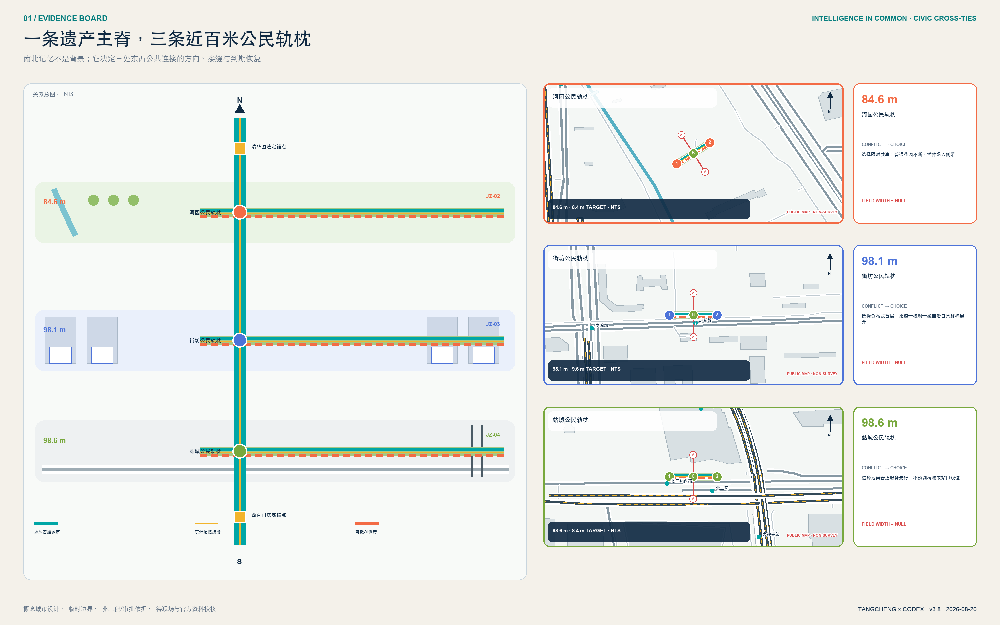

## 三层范围工作框架

三层范围不是三套互不相干的图，而是一条从战略到空间再到验证的证据链。43.6 平方公里统筹研究范围负责回答“海淀的 AI 创新链如何跨机构协作”；约 11.4 平方公里总体设计范围负责回答“哪些城市空间能承载这种协作”；三处重点区负责回答“如何用可逆的小尺度项目验证”。该传导由 [depth:three_level_scope_framework] 与 [depth:overall_spatial_structure] 管理，以 [data:geometry/site_boundary.geojson#SITE-001]、[data:geometry/key_areas.geojson#PROV-KEY-002] 和 [metric:key_area_count] 为机器证据。

总体结构命名为“1 条公地主脊 + 3 个差异化公地 + 2 个协作翼 + N 个可审计节点”。“1”是京张记忆与开放智能公地主脊；“3”是众智园安全治理公地、原点社区开源转化公地、大钟寺智能原生生活公地；“2”是中关村科技服务翼、小月河场景赋能翼；“N”由十二个首批场景节点构成。三层范围的 provisional 边界在图中始终以低对比虚线出现，设计重点落在廊道、节点、东西缝合与运营关系，而不是把粗略 polygon 当作正式构图。

每一层都设置“空间输出、运营输出、复核门槛”：统筹层输出生态图谱和协作协议；总体层输出用地、公共空间、慢行和概念承载单元；重点区输出场景卡、项目清单和风险前置条件。任何指标若不能从 GeoJSON 或可信来源复算，就进入 unknown；任何项目若依赖权属、道路、文保、市政或审批，就不得在分期中表述为确定建设 [depth:risk_missing_data]。

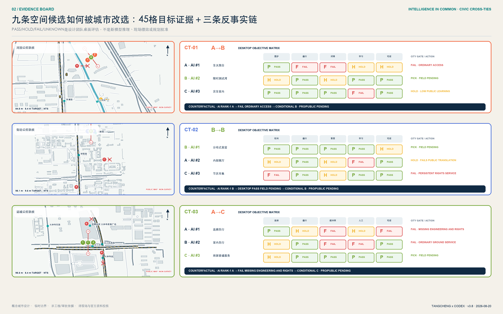

## 统筹研究范围产业与未来城市研究

“智脉共生 / Intelligence in Common · Jingzhang”的品牌不是给 AI 贴视觉标签，而是把“技术如何成为公共能力”作为辨识核心。Logo 方向由两条平行轨线、三枚公地节点和一条开放缺口构成：轨线代表京张历史与面向未来的协作，三点代表三区，缺口代表持续接纳新贡献。色彩采用遗址深蓝、公共青绿、验证橙三色；所有字形使用开源或系统字体，图形由本方案原创几何生成，不借用企业标识。命名、英文名和视觉系统回应 [source:AGENT-TASKBOOK]，不暗示政府认定品牌。

产业生态采用“问题进入 - 能力组队 - 沙盒验证 - 公共复盘 - 规模转化”五步闭环。众智园聚焦模型、算力、工具链、安全评测和标准治理；原点社区聚焦高校成果、开源协作、知识产权、孵化和人才服务；大钟寺聚焦智能体、智能终端、内容消费和国际路演；科技服务翼提供法务、资本、标准和国际化接口；场景赋能翼提供真实问题、公共体验和用户反馈。这个闭环把五大功能转成空间与运营角色，而非企业名单或产值许诺 [depth:overall_spatial_structure]。

区域协同不是在地图上画放射线，而是建立“问题、能力、验证、转化”的开放接口：京张带负责公共场景与可审计协议；北纬社区和未来科学城可作为人才、基础研究与原型协作的概念接口；怀柔科学城可连接科学设施和前沿研究问题；北京经开区可连接具身智能、汽车和先进制造的工程验证；京津冀合作通道可沉淀跨城市场景卡、评测方法和退出规则。上述均为协同建议，不代表任何机构已参与或承诺资源；真实合作须由公开征集、协议和责任主体确认。

六个案例的可转化机制被有选择地使用：one-north 提示以公共空间串联多专业片区；Maria 01 提示先做适应性再利用和共同体；STATION F 提示按成长阶段配置服务；MaRS 提示把科研、资本、客户和公共使命放在同一转化链；Seoul AI Hub 提示 AI 专业孵化需要培训与交流并重；Kendall Square 提示创新区必须持续治理首层活力、开放空间和混合生活。京张的独特增量是“公共可审计”：所有测试场景公开目的、数据边界、人工复核和退出机制，不以无感监控换取便利。

## 总体设计范围城市更新与控规深度城市设计

总体范围以“保留适配优先、可逆嵌入其次、正式控规后再谈增量”为更新原则。用地由同一 provisional boundary 拓扑切分成科研、教育、文化、居住、社区服务、商业服务、绿地七类概念承载区 [data:geometry/land_use.geojson#LU-001] [depth:land_use_layout]；建筑层只表达小尺度容量与公共界面原型 [data:geometry/buildings.geojson#BLDG-001]，不把未知现状建筑写成拆除或新建对象。总建筑规模、容积率、建筑密度、高度和退线继续为 unknown [depth:development_intensity_controls] [depth:height_massing_character] [depth:retain_renovate_demolish]。

空间结构包含四个互相校核的系统：一是连续的京张公地主脊，串联文化、生态、慢行和活动；二是三条东西缝合概念线，分别服务大钟寺站、原点社区校园园区、众智园清河界面；三是十二个可预约、可审计、可关闭的场景节点；四是“共享基础服务 + 专业片区”用地结构。绿地与公共空间不是剩余地，而是创新交往、测试复盘和公众质询的第一基础设施 [metric:green_ratio] [metric:public_space_ratio]。

控规深度通过“已知 - 建议 - 待确认”三栏控制：用地代码、提交几何和派生面积属于可复算已知；空间结构、公共空间节点和运营机制属于概念建议；道路红线、四线、强度、高度、工程、市政、权属和文保属于待官方资料确认。这样既保持方案深度，又不越过 [standard:MOHURD-CONTROL-DETAILED-PLANNING] 的法定边界。

## 重点区域详细设计

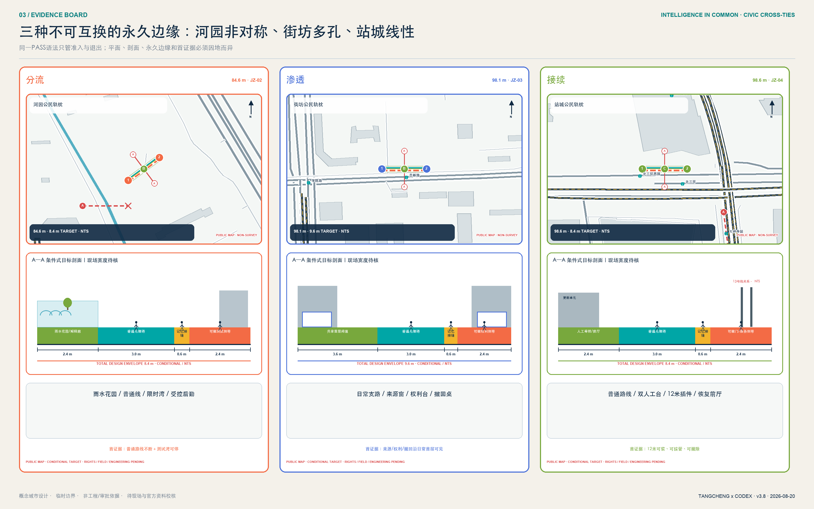

三区共享同一份公共验收护照，但不复制同一种形态。护照是跨片区的治理接口，三种原型才是城市设计：众智园把“可停止”做成花园—观察廊—测试环的安全断面；原点社区把“可追溯、可撤回”做成成果街—清权台—贡献者客厅的开放首层；大钟寺把“有人工、可申诉”做成站城客厅中的四段公共验收街。四道条件不是加权评分，任一未闭合即不得激活 AI，并恢复普通步行、人工服务或非智能展示的 no-AI 基线。

三张重点区详设图采用约 1:1000 的条件式原型，不把临时粗略边界、未知站口或未知建筑写成现状事实。每张图同时交付六类证据：低对比概念底板；普通公众与测试后勤分流；一条建筑—首层—公共空间剖面；人工服务、物理急停与申诉位置；`AI 未启用 / 限时运行 / 失败恢复` 三状态；以及项目责任、成本带、阶段门、首证据和退出条件。图面空间关系可供专业团队深化，真实落位仍须现场和官方资料。

### 众智园：安全治理公地

众智园以“看得见的全栈自主与安全治理”为定位，在 provisional 区域 [data:geometry/key_areas.geojson#PROV-KEY-001] 内形成“一环、一厅、三台”：清河创新花园环；模型安全与标准展示厅；模型评测、具身智能、城市服务三类验证台。沿清河界面优先使用可逆展亭、雨棚、户外评测标记和预约式测试，不预设河道蓝线或工程条件。建筑策略为保留适配优先，利用首层和公共空间建立“标准形成 - 测试 - 解释 - 申诉”流程；对外交通只提出接驳方向，待五环、道路和消防资料后深化。

空间原型采用“公众花园界面 - 观察与解释廊 - 可控测试环 - 安全研发后场”四级梯度。公众流线不穿越测试后勤，观察廊设置责任牌、人工值守、急停和退出口；测试环只在预约、围合和安全员到位时开放。首期三个概念动作是安全治理门厅、可撤除测试铺装和清河界面公共复盘台，分别在 G1 专业审查、G2 安全沙盒和 G3 限时试点后进入；河道、消防和权属任一条件不清即退出。

其验收原型为“**安全验收庭**”：2.4 米雨水花园缓冲、3.0 米连续无障碍净通道、1.8 米受控服务带和 2.4 米观察门廊均为自设概念目标，不是现状断面或工程标准。场地运营者是唯一 A，测试安全员负责现场 R；第一份可接受证据不是机器人演示视频，而是一次由残障者代表参与、物理暂停信号真实生效、普通花园通行保持连续的双路径演练。任何失控、侵占净通道或责任人缺席，立即恢复为不启用 AI 的公众花园。

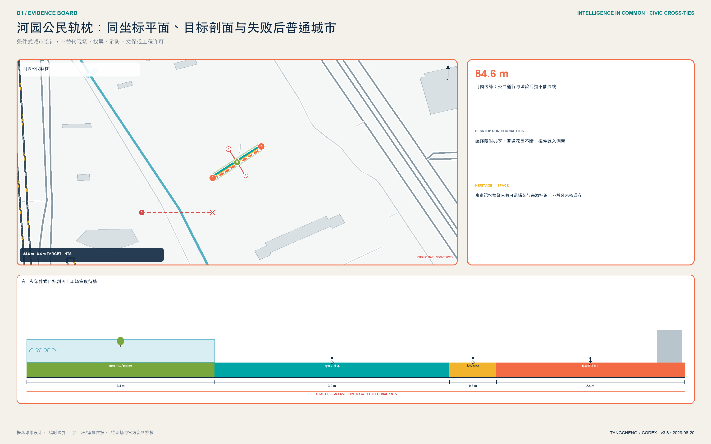

### 北京 AI 原点社区：开源转化公地

原点社区围绕 [data:geometry/key_areas.geojson#PROV-KEY-002] 组织“开放成果街 + 贡献者客厅 + 近校生活网”。开放成果街把发布、知识产权、法务、孵化和小规模路演串联；贡献者客厅用可追溯档案而非企业广告记录代码、数据集、标准与公共贡献；近校生活网补足学习、托育、健康、夜间协作与慢行。更新采用微更新、首层开放和时段共享，涉及校园、园区或权属空间时只提出接口与协商机制，不作具体改造决定。

空间原型采用“校园/园区孔隙 - 开放成果街 - 共享首层 - 近校生活支路”的织补语法。成果街不是单一商业街，而是发布、清权、协作和生活服务交替出现的步行序列；每个发布节点必须同时看到版权来源、人工联系人和撤回入口。首期三个概念动作是可追溯成果橱窗、贡献者客厅和无障碍共创台；只有在园区边界、首层消防、时段管理和居民代表协商完成后才能试点。

其验收原型为“**权利与贡献廊**”：一侧是来源、许可和版本可见的成果窗，中部是有人值守的权利服务台，另一侧是贡献者与公众共同评议的长桌；普通穿行和纸质咨询始终开放。园区运营者是唯一 A，清权编辑与无障碍主持人分别承担内容和现场 R；第一份可接受证据是一项测试成果完成“来源核验—公众质询—贡献者更正/撤回—版本留痕”的闭环。来源不清、撤回无响应或发布阻断普通通行时，恢复为不使用 AI 推荐的公共展廊。

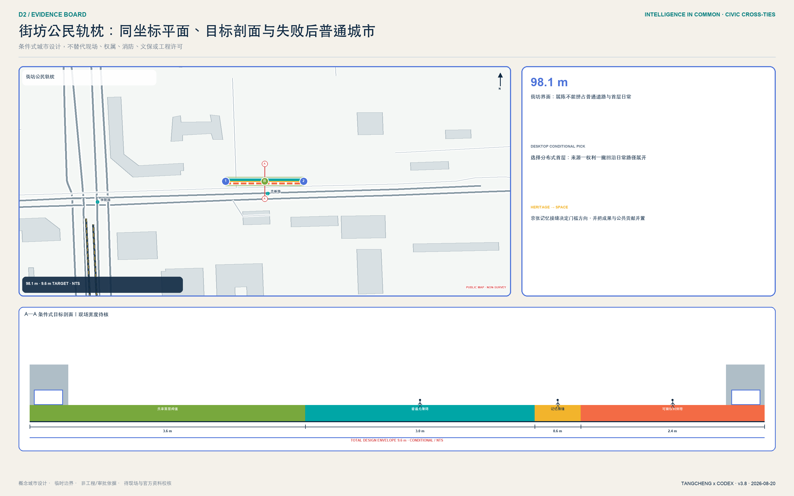

### 大钟寺：站城验收轨枕

大钟寺不再从未经核验的“未来广场”起笔，而从公开可核验的站、公园、更新单元与北三环关系起笔。提交的 [data:geometry/key_areas.geojson#PROV-KEY-003] 仍只是组织方临时控制几何，不能替代大钟寺公开研究窗口；正式边界到位前，两者不强行套合。首期只研究“站城前厅 + 四象限地面缝合 + **98.6 米北侧站城公民轨枕** + 人工双服务台”，优先连续过街、非机动车秩序和无障碍，不预判桥隧方案。98.6 米是公开坐标窗内经道路/轨道粗筛后的条件式服务前厅序列，不是现状道路、地块、站口或工程线位。

其验收原型由场地运营者承担唯一 A，人工服务负责人承担 R；第一份可接受证据是同一位测试者在无手机、无账户、无人脸识别条件下完成普通服务，并在 30 秒自设目标内转人工、取得申诉与回滚回执。数字入口故障、人工桌无人或退出不留痕时，立即恢复为纯人工双桌服务。

首期试点用一份可询价、可测量且不虚构报价的性能任务书管理；它不是采购单或施工图：

| 项目槽 | 进入 G1/G2 前必须填满的内容 | 当前状态 |
|---|---|---|
| 候选落位 | 站口—公园—更新单元之间的连续地面服务链 | 公开关系已知；精确线位待现场与正式图纸 |
| 排除条件 | 不占基本通行、盲道、消防、出入口、骑行停放；不进入运行铁路 | 条件性设计，未获工程许可 |
| 现场核验 | 早晚高峰 2 次计数、全程无障碍共走、夜间照明与噪声记录、人工台班次访谈 | 待执行；模板预置 |
| 最小构件量 | 先把 98.6 米候选中的 CH43.3—55.3 米画成 12 米询价准备性能任务书：4 道免打孔可撤门、2 个并行服务台、2 个物理急停、2 个纸质回执站、4 条可逆接口轨及 1 组普通路线保护件 | 桩号是桌面居中参考、不是最终放样；0—30 天现场核验后可平移或取消；最终尺寸、数量和 IP/电气证明待专业与供应商确认 |
| 最小人员 | 1 名当值服务负责人 + 1 名人工作业员；开放时不得空岗 | 自设运营底线 |
| 成本与询价 | L1 可逆导视/家具/班次；L2 临时构件/局部接口；预留三家询价与偏差栏 | 不填货币，未取得报价 |
| 运维与数据 | 每班开闭检查；每周独立验收；只记设施级计数、停机、申诉和恢复，不留连续个人轨迹 | 运行草案，待责任人签字 |
| 验收与退出 | 基线、目标、样本、频率、证据文件、独立验收人与签字槽；任一红线触发即清点设备并恢复双人工服务 | 桌面演练通过不等于现场通过 |

90 天不是宣传倒计时，而是证据生产顺序：0—30 天只做现场核验与无 AI 基线；31—60 天只做离线搭建、人工班次和停止恢复演练；61—90 天仅在场地、无障碍、安全、责任与公众门均签字后限时运行。若跨线联系仍未具备正式条件，试点不等待桥隧，也不冒充解决了跨线问题，而在已核准的地面服务范围内先证明“普通服务不断、AI 可停、公众可申诉”。

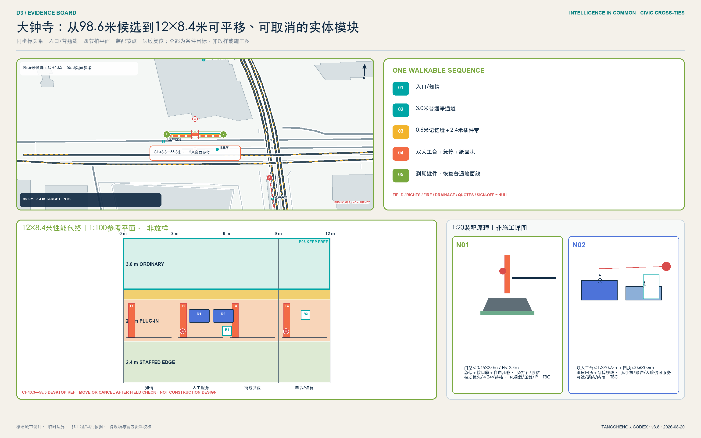

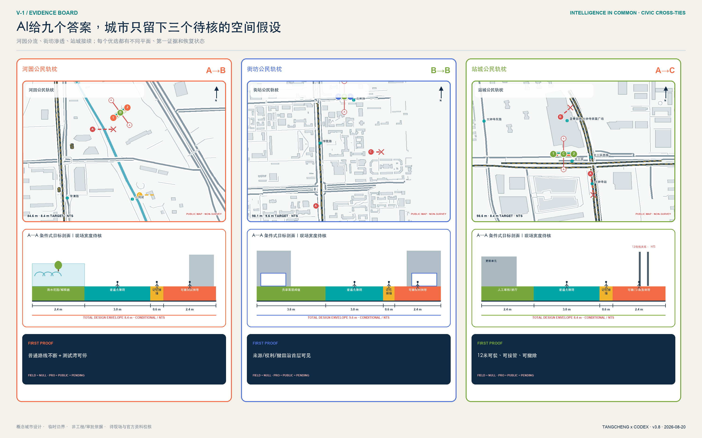

大钟寺 98.6 米条件式站城轨枕把验收流程变成四个连续、身体可感知的阈值：知情门廊、双轨服务台、公共共验庭、申诉与恢复廊。图面只给出四段的相对顺序；每段精确长度、站口、净宽与工程界面待现场和正式图纸后设计。全程保留 3.0 米普通无障碍净通道，基本服务不以手机、账户或人脸为门槛；设备可撤、可复用、不得侵占通行。原型数量、四道验收门和人工兜底目标分别由 [metric:public_acceptance_prototype_count] [metric:public_acceptance_threshold_count] [metric:human_fallback_target_seconds] 记录。

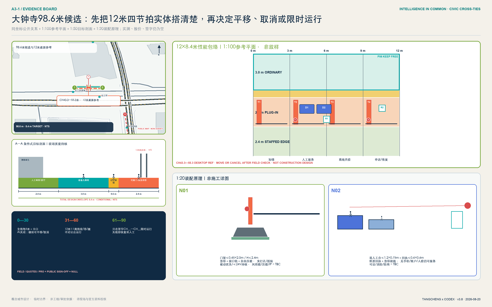

这条街的价值不在于再造一个“AI 打卡点”，而在于建立城市尺度的 use-before-deploy：先由真实使用者和专业人员共同验收，再决定技术是否进入日常公共空间。它把“看得见、说得清、接得住、退得回”变成国际访客能走完、普通居民能质询、运营者必须承担责任的京张辨识度。站口、道路断面、轨道保护、疏散和权属资料不到位时不得工程化。

## AI 创新生态、人才画像与 AI+ 场景

方案以八类画像校验空间：开源研究者需要可持续协作和贡献记录；初创团队需要低门槛试验、法务和客户入口；产业工程师需要跨团队集成与安全评测；高校师生需要成果转化和步行可达的第三空间；周边居民尤其老人、儿童与残障者需要低扰动、可解释、可申诉的服务；公共运营者需要明确责任、审计和退出机制；国际人才需要中英双语、纸质备份和可追踪申诉；公园清洁、保安、设施维修等一线劳动者需要不被黑箱排班、不被连续轨迹监控，并能物理停止设备。八类画像不来自个人跟踪数据，而是任务书要求下的需求假设 [metric:persona_count]。

十二张场景卡均映射到 [data:geometry/public_space.geojson#PUBLIC-001]，并遵循数据最小化、目的限定、默认不识别个人、高影响决策人工复核、可申诉与可退出：

| 卡片 | 空间与用户 | 数据和人工复核 | 运营边界 |
| --- | --- | --- | --- |
| S01 开源成果发布厅 | 原点社区；高校、开发者 | 投稿者主动提交；版权与事实人工复核 | 不采集观众身份，贡献可撤回更正 |
| S02 模型安全评测沙盒（测试） | 众智园；模型团队、评测者 | 合成/授权测试集；红队结果双人复核 | 与生产系统隔离，不公开敏感漏洞 |
| S03 具身智能公共空间试验径（测试） | 众智园；工程师、公众 | 预约、围栏、匿名事件记录；安全员可急停 | 不在无告知公共环境自主运行 |
| S04 城市服务智能体验证站（测试） | 众智园；公共服务团队 | 公开模拟案例；专业人员最终决定 | 不接入真实高影响业务后端 |
| S05 可解释慢行导航站 | 公地主脊；通勤者 | 聚合路况、用户主动反馈；运营员复核 | 不记录连续个人轨迹 |
| S06 无障碍出行共创台 | 原点至大钟寺；残障者、老人 | 自愿标注障碍；无障碍顾问复核 | 不把障碍类型推断为个人健康信息 |
| S07 京张记忆解说智能体 | 遗址公园；居民、访客 | 公开史料；史实编辑与文保人员复核 | 明示 AI 生成，不虚构人物与事件 |
| S08 社区 AI 服务台 | 社区界面；居民 | 当次问答最小化留存；人工转办 | 不做自动资格、信用或福利决定 |
| S09 人才学习协作驿站 | 原点社区；师生、开发者 | 自愿报名；课程与导师人工审核 | 不以黑箱评分筛选人才 |
| S10 低碳能源数字镜像亭 | 公地主脊；运营者、公众 | 设施级聚合数据；工程师复核 | 不宣称已完成能源容量测算 |
| S11 数据授权与申诉会客厅 | 大钟寺；企业、公众 | 授权记录与审计日志；法务/伦理复核 | 提供撤回、异议和纠错通道 |
| S12 国际智能原生路演客厅 | 大钟寺；企业、访客 | 发布者清权材料；策展人工审核 | 不把路演写成招商或投资承诺 |

S02-S04 是三类产业测试验证场景 [metric:testbed_scenario_count]，其共同门槛为隔离环境、明确责任人、现场急停、风险分级和复盘公开；十二场景总量由 [metric:scenario_count] 复算。AI 场景必须增强人的能力，不能替代规划审批、医疗法律专业判断或公共服务最终决定。

十二场景进一步归并为三类可画、可搭、可退出的空间原型。A 类“受控试验场”服务 S02-S04，包含告知门、缓冲带、测试区、安全员视线、观众边界、后勤口和急停；B 类“公共廊道与共创点”服务 S05、S06、S10，包含连续无障碍通行、非跟踪式感知、人工帮助点和设施级数据镜像；C 类“展示、服务与协作厅”服务其余场景，包含开放前厅、内容清权、人工终审、申诉窗口和可撤回档案。所有节点都必须让人三十秒内读懂“目的、数据、责任、退出”，设备不得占用基本通行净空。

每张场景卡同时是一张结构化验收护照：`visual/assets/acceptance-passports.json` 逐项登记所属片区、风险级别、唯一责任角色、人工最终角色、数据与保存规则、审计频率、no-AI 基线、成功 KPI 和红线。它不是装饰性二维码或“通过即永久上线”的许可证；每次开放都有时限，证据过期、条件变化或红线触发都必须重新验收。护照与七件可逆公共空间组件共同落地：C01 告知信号门廊、C02 人工/AI 双桌、C03 连续无障碍净通道、C04 共验长桌、C05 物理暂停信号、C06 申诉与回滚回执、C07 可逆设施轨。组件只占用受控服务带，不占普通通行；尺寸是概念目标，仍需专业校核。

逐场景治理字段已写入 `geometry/public_space.geojson`：风险等级、最终责任角色、保存规则、审计频率、成功 KPI 和暂停条件不再复用同一泛化句。共同试点目标为：上线前责任、告知、风险分级和急停演练覆盖率 100%；高影响输出人工最终决定覆盖率 100%；默认生物识别采集和连续个人轨迹留存均为 0；严重安全事件目标为 0；申诉在 1 个工作日内确认，并以 5 个工作日给出处理结果为试点目标。上述是运营目标，不是现状绩效或政府承诺。

为了证明这套门槛至少逻辑可执行，提交附带只读、零网络的 `visual/assets/acceptance-runner.js`。它读取十二张护照和 24 个合成桌面案例：12 条正向路径必须满足四条件与全部红线，12 条反向路径分别故意缺失一项条件或触发红线，必须阻止激活并恢复 no-AI 基线。当前运行结果是 24/24 逻辑通过；`field_performance=null`、`deployment_decision=not_authorized_not_run` 明确说明这不是现场绩效、居民意见或部署授权。真实试点仍须完成 G0-G4 与独立评估。

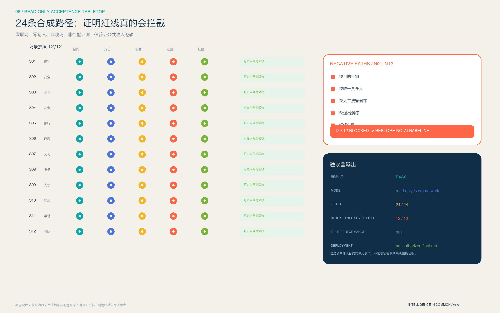

其中“基本服务不以手机、账户或人脸为门槛”是本方案主动提高的公共服务底线 [metric:phone_free_basic_access_target_ratio]，不是对全部场所适用的法律结论；“1 日确认、5 日目标答复”也不是法规规定的数字时限。若场景构成面向境内公众的生成式 AI 内容服务，才在相应法定范围内执行投诉举报和内容治理要求；医疗、社保、金融、生活缴费等列举场所的人工办理边界则按无障碍法第 39 条另行核对，不偷换适用范围。

## 用地、建筑规模与拆改留方案

用地结构采用国土空间分类子集，完整覆盖当前提交边界并共享切分坐标。科研用地承载全栈研发和开源转化，教育科研协作靠近原点社区，商业服务承载科技服务与智能原生生活，社区与居住承载人才日常，文化与公园形成京张公共底座。七类概念用地及面积见 [data:geometry/land_use.geojson#LU-006]，类别数量与各分项面积均在结构化指标中复算 [metric:land_use_category_count] [metric:land_use_area_0802_sqm]。这些是概念分区，不是审定用地。

建筑层采用“保留适配 - 共享首层 - 可逆嵌入 - 条件成熟后更新”四级方法。由于没有现状建筑和权属底数，提交的 16 个基底只是用于校验公共空间与容量关系的概念承载单元 [data:geometry/buildings.geojson#BLDG-002]。概念基底总面积与覆盖率分别为 [metric:building_footprint_area_sqm]、[metric:concept_building_coverage_ratio]；它们不能替代建筑密度或拆改留结论。正式深化需逐栋补齐结构安全、产权、用途、年代、消防、能耗、历史价值和运营状态，再由专业团队分类。

高度体量采用“主脊低扰动、节点可识别、背景连续、重点区差异化”的定性引导。公地主脊保持人行尺度和历史可读性；场景节点靠夜间光环境、标识和可逆构件识别，不追求大体量地标；具体高度、强度、屋顶和天际线需叠加控规、文保、航空和城市景观条件后确定。

## 交通、轨道、市政与公共服务设施

交通以 [data:geometry/roads.geojson#ROAD-001] 表达“主脊连续 + 三处东西缝合 + 两翼接口”。ROAD-001 是步行骑行与服务主脊；ROAD-002-004 对应大钟寺、原点、众智园的概念缝合；ROAD-005-006 对应科技服务翼和场景赋能翼。这些线只表示联系方向，不是道路红线、轨道线位或桥隧工程。概念主脊长度由 [metric:greenway_length_m] 复算，待官方道路、站点、断面、过街、停车和消防条件后校准 [depth:traffic_rail_slow_parking]。

市政与公共服务采用“城市基础设施 + AI 新基建共址但不混权”的原则：端侧算力优先服务低时延公共体验，能源镜像只显示设施级聚合数据，分布式能源和海绵设施先做监测与需求验证，公共服务智能体必须保留人工窗口。算力、能源、排水、管线、消防和网络安全缺少容量资料，因而不做工程测算 [depth:municipal_new_infrastructure]。服务设施按人才、企业、社区、国际访客四类需求组合，而非依赖单一供应商。

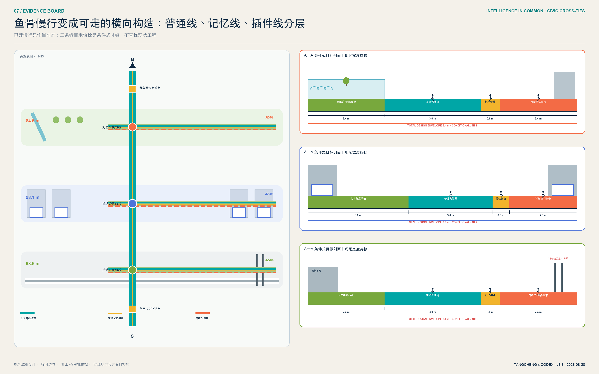

## 蓝绿空间、公共空间与城市风貌

蓝绿系统把遗址公园理解为创新带的“第一会议室”：连续绿脊提供日常步行、骑行、休息、开放讨论和文化阅读，三条东西绿缝把两侧高校、园区、社区和站点接入。绿地不是测试场的免责空间，所有试验需预约、告知、限时、急停和恢复；河道、文保、绿线、蓝线和安全控制待官方资料后优先避让。[data:geometry/green_space.geojson#GREEN-001] 与 [metric:green_space_area_sqm] 说明概念网络规模，[depth:blue_green_public_space] 说明其专业证据链。

公共空间以十二个场景节点和四个“朝圣/荣誉”概念地标组织：众智园“安全之镜”公开展示评测方法与纠错；原点社区“开源星图”记录可核验贡献；大钟寺“智能原生会客厅”连接路演、申诉与公众体验；公地主脊“百年算法年轮”把京张史、中关村创新史与 AI 治理里程碑并置。它们用原创几何、开源/系统字体和可逆设施表达，不使用人物肖像、企业商标或未经授权图像，不追求过度网红化。

城市风貌以深蓝轨迹、青绿公地、橙色验证节点为统一识别，建筑界面强调首层可见、室内外协作和夜间克制。历史文化不是科技装饰：京张铁路回答“城市如何连接”，中关村回答“知识如何转化”，AI 新文化回答“技术如何被公共治理”。导视同时显示地点、场景目的、数据边界、责任主体和申诉入口，让视觉识别直接服务可信运行。

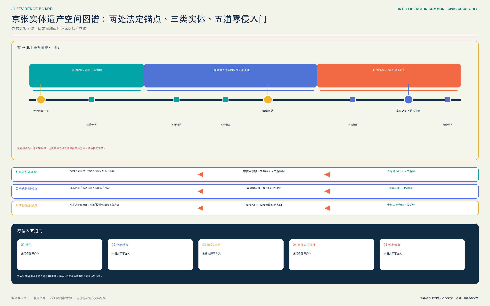

百年京张不再只用抽象六段叙事。官方一期资料确认恢复老京张正线、修复保留清华园站房，并利用旧铁轨、道岔、机车和火车转盘展示铁路文化 [source:OFFICIAL-JZ-PARK-PHASE1-2023]；2026 完工资料进一步确认京张之环、铁轨花园、油罐车、汽笛互动装置和鱼骨慢行网络 [source:OFFICIAL-JZ-PARK-PHASE2-COMPLETE-2026]。这些是“实体类型已由官方公开、逐件坐标未声称”的资产登记。

清华园车站旧址与平绥西直门车站旧址构成走廊上的两处法定遗产锚点。北京市文物局已公布两处保护范围和建设控制地带文字规则 [source:OFFICIAL-QINGHUAYUAN-PROTECTION-2026] [source:OFFICIAL-XIZHIMEN-PROTECTION-2026]；但相对墙线、房屋编号和距离文字不能替代官方附图与控制点。本案因此只画非定位规则框，设置“官方附图未入库即零侵入”的 G0 门，不数字化虚构法定 polygon。PASS 所借用的“联锁”只表示遗产清单、坐标精度、冲突检查与人工批准未闭合便不能放行，绝不暗示真实铁路信号工程。

实体遗产不是附加图标，而是空间动作的触发器：站房、老正线、旧轨、道岔、机车与转盘只触发零侵入观察、来源标识和人工解释廊；京张之环、铁轨花园、油罐车与汽笛只作为当代诠释设施进入公众学习线路，绝不冒充原真遗存。两类关系共同决定 0.6 米记忆接缝、可撤解释界面和大钟寺 12 米服务模块的朝向；许可到期或任一遗产门失败后，撤除插件，只保留无障碍步行、人工服务与普通花园。逐件坐标仍为 `null`，因此这是一条“类型—动作—普通基线”关系链，不是资产定位图。

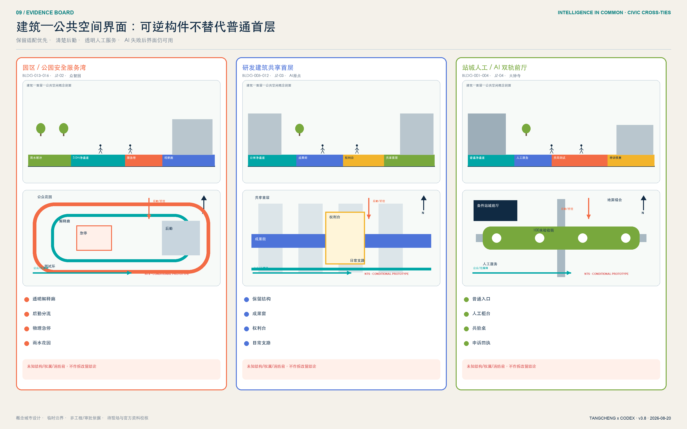

## 更新项目清单、实施政策与分期计划

八项概念项目形成从空间到运营的最小可行组合 [metric:renewal_project_count]：JZ-01 公地主脊连续性诊断；JZ-02 众智园安全验收庭；JZ-03 原点权利与贡献廊；JZ-04 大钟寺站城验收轨枕；JZ-05 十二场景治理协议；JZ-06 京张贡献与记忆节点；JZ-07 公共数据授权和申诉会客厅；JZ-08 全球开放智能公地年度计划。每项都必须先补充权属、道路、文保、市政、安全或运营条件，不能把清单当作立项或投资承诺。八项均在交付合约中绑定几何证据 [metric:renewal_project_geometry_ref_coverage_ratio]，并用“事实—可证伪诊断—空间动作—图纸—项目—停止条件”交叉表闭合 [metric:fact_diagnosis_action_crosswalk_ratio]；这只证明桌面证据结构完整，不证明落位已经现场成立。

v3.8 保留八份逐项目交付合约，并给 JZ-01—08 增加 `geometry_refs`：每个项目必须指向带日期的公开地图 feature、同坐标条件式设计动作，或明确的 provisional feature；图面针脚不得再由像素假落位。JZ-02—04 的优选动作与 A—A 剖面线直接进入项目引用，JZ-04 继续作为现场可核、人员可排、构件可数、报价可留槽的单一深试点；遗产相关 JZ-01/JZ-06 还必须通过资产登记覆盖、坐标精度、法定控制资料、冲突检查和人工签字五项门。成本带只描述工作量级和询价前提，不虚构货币投资额；任何一项不因其他项目或总体平均表现而放行。

AI 的规划作用在 v3.8 中被压缩成一条可审计决策链，而不是“生成即采纳”：Codex 城市设计智能体在每个公开研究窗提出三条坐标候选并给出比较次序，城市硬约束随后检查普通通行、已登记空间冲突、工程/权属资料、人工值守和恢复能力；设计团队只能留下一个“桌面条件优选”，专业人员与受影响公众仍保留最终否决。三地共九个候选、三个条件优选中，有两次 AI 第一顺位因普通通行或缺工程/权属证据被改选 [metric:ai_spatial_option_case_count] [metric:ai_rank_one_hard_constraint_override_count]。每次改选都绑定 geometry、A—A 剖面、时空许可、验证协议与恢复状态；这证明人可追溯地推翻 AI，而不证明现场或审批通过。

三个条件优选各自预注册一份 90 天验证协议 [metric:preregistered_validation_protocol_count] [metric:preregistered_validation_chain_coverage_ratio]：在激活前写死观测位置、无 AI 基线、样本单位与最低样本、频率、测量方法、PASS/HOLD 阈值、缺测处理、采集/复核/签署角色、证据文件和恢复动作。大钟寺把 98.6 米桌面候选中的 CH43.3—55.3 米标作 12 米询价准备验证任务书 [metric:dazhongsi_inquiry_ready_validation_unit_length_target_m]，以六类可数构件和五份验收文件先做 1:1 离线安装—撤除演练 [metric:dazhongsi_inquiry_ready_component_type_count]。该桩号只是同坐标桌面参考，0—30 天核验后遇门口、盲道、排水、消防、装卸、道路、轨道、权属或普通通行冲突必须平移或取消。所有基线和绩效继续为 `null`，专业与公众签字为 `false`，采购单未授权，三家报价金额也为 `null`；协议完整度不能冒充实施完成度。

### 大钟寺 12 米物质实施档案：可讨论、可平移、可取消

`dazhongsi-component-library.json` 把 CH43.3—55.3 桌面参考段落成 **12.0×8.4 米性能包络**：横向由 3.0 米普通净通道目标、0.6 米京张记忆缝、2.4 米可撤 AI 侧带和 2.4 米永久人工等候边构成；纵向分为四个 3 米节拍——知情、人工服务、离线共验、申诉/清点/恢复。比例仅用于设计沟通，绝非现场放样或施工图 [metric:dazhongsi_reference_spatial_beat_count]。

| 构件 | 数量与参考落位 | 装配/失效原则 | 必须保持为空的专业输入 |
|---|---|---|---|
| P01 可撤信息门 | 4，道道对应四个3米节拍，只进入2.4米插件带 | 自由压载、橡胶隔离、免打孔/胶粘；撤除后成对照片复核表面 | 风荷载、压载重量、最终尺寸、户外/IP证明 |
| P02 双人工服务台 | 2，集中于 CH46.3—49.3 的服务节拍 | 一高一无障碍目标位；断电断网仍提供服务 | 台面高度、膝部空间、回转与消防负荷 |
| P03 物理急停 | 2，整合于第二、第四门架 | 不设独立绊倒物；被动或≤24V仅为性能目标 | 控制类别、电气设计、认证与IP等级 |
| P04 纸质回执站 | 2，与服务台及恢复段一体 | 无手机、账户、人脸、电力或网络仍可用 | 防雨、容量和可达触及范围 |
| P05 可逆接口轨 | 4，每个3米节拍一条，全部在线缆侧带内 | 可重复紧固、标签化清点；不得跨普通路线 | 截面、荷载、走线、接地和耐候证明 |
| P06 普通路线保护件 | 1，沿12米连续维护3.0米普通路线目标 | 不覆盖盲道、排水、消防、装卸或入口 | 实际净宽、门扇、盲道、排水、消防/装卸位置 |

两处 1:20 图只表达装配原理：N01“门架＋急停＋接口轨＋自由压载底座”，N02“双人工台＋纸质回执＋急停视线”；它们都标 `NOT CONSTRUCTION DETAIL`。0—30 天先沿 98.6 米每 5 米及全部卡口测量；任一冲突即把 12 米模块在候选内平移或取消。31—60 天只做 1:1 离线安装、接管、停机和撤除；61—90 天只在专业与受影响公众签字后的实际 `CH__—CH__` 限时运行。报价、签字、现场净宽和绩效继续为空 [metric:dazhongsi_component_placement_count] [metric:dazhongsi_assembly_principle_node_count]。

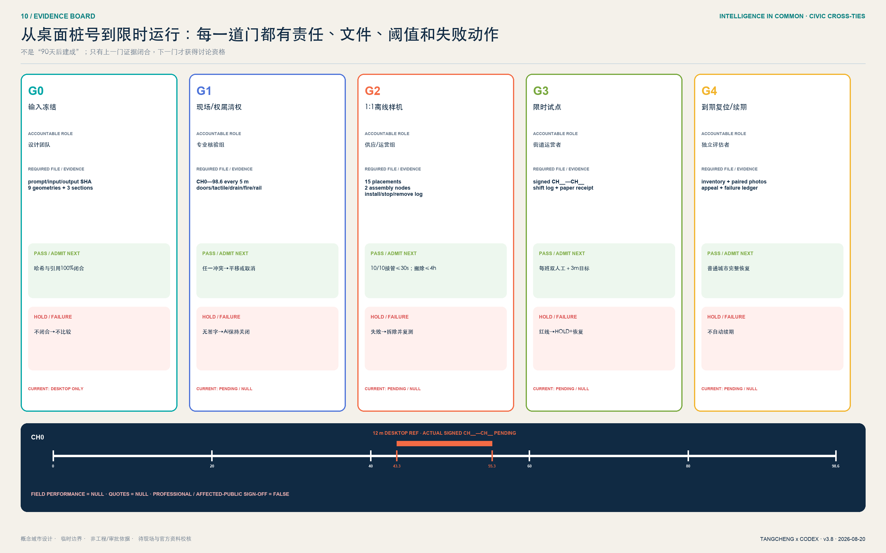

分期不是建设工期，而是“先协议、再网络、后更新”的风险顺序。[data:geometry/phasing.geojson#PHASE-001] 先在三处重点区做可逆试点，面积 [metric:phase_1_area_sqm]；PHASE-002 连续化公地主脊，面积 [metric:phase_2_area_sqm]；PHASE-003 在官方资料和专业审查后适配片区更新，面积 [metric:phase_3_area_sqm]。三阶段总数由 [metric:phase_count] 复算，[depth:renewal_project_list] 与 [depth:phasing_implementation] 负责把项目、依赖和证据对应。

首个可执行动作不是大片建设，而是三区同步但彼此独立准入的 **90 天公共验收巡回试点** [metric:pilot_duration_days]：0—30 天分别完成普通服务基线、无障碍共走、责任与数据清单，不激活 AI；31—60 天各搭一套可撤原型，以人工主导离线模拟并演练暂停、转人工、撤回和申诉；61—90 天只有各自护照四条件与红线全部通过的原型才限时开放，每日复盘、每周独立验收。众智园先证明“停得住”，原点先证明“撤得回”，大钟寺先证明“接得住”。六条红线 KPI 是激活前告知 100%、高影响输出人工最终决定 100%、基本服务手机/账户/人脸强制门槛为 0、转人工目标不超过 30 秒、申诉 1 日确认/5 日目标答复、严重安全事件目标为 0 [metric:pilot_redline_kpi_count]。任何一地失败只暂停该原型并恢复其普通基线，不用平均分、另外两地表现或宣传价值掩盖伤害。

每个项目均有独立的唯一 A，不再用一个全局 RACI 模糊责任：JZ-01 为主脊计划负责人，JZ-02 为众智园场地运营者，JZ-03 为原点园区运营者，JZ-04 为大钟寺街道运营者，JZ-05 为公共验收计划办公室，JZ-06 为遗产解说策展人，JZ-07 为独立申诉办公室负责人，JZ-08 为公地计划秘书处。人工服务、无障碍、安全、数据、法务等按项目承担 R；居民、老人和残障者代表、维护人员及独立评估者按受影响范围作为 C 共同验收。成本只采用 L1（运营、家具、导视）、L2（临时构筑、首层适配、局部系统）和待官方条件的 L3 级别，不虚构货币金额；采购底线是开放接口、数据最小化、无厂商锁定和退出条款。

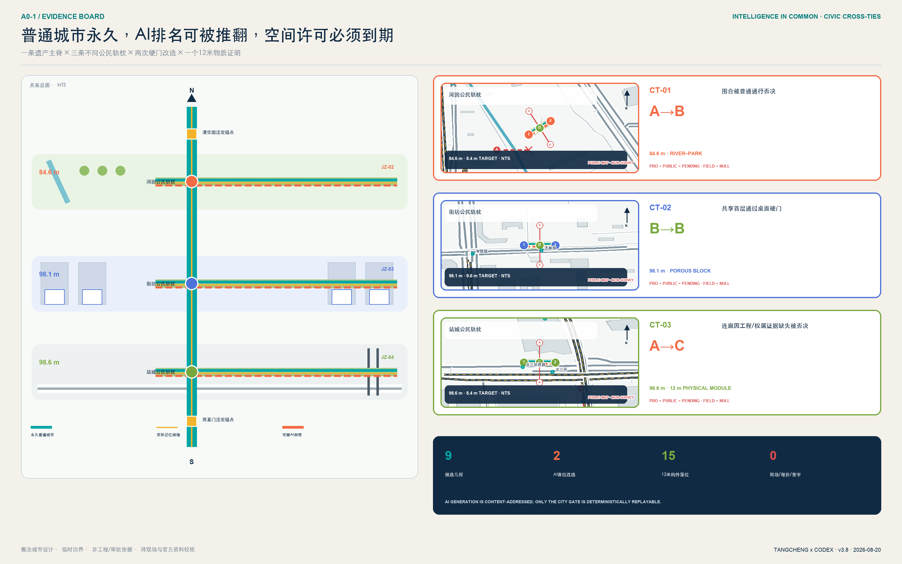

年度运营提出四季循环：春季“开源贡献月”发布问题与数据许可；夏季“城市测试周”只在隔离、预约和急停条件下验证；秋季“全球开放智能公地论坛”对比城市案例与治理；冬季“贡献档案季”复盘失败、纠错和公共价值。开发者社区以 issue、复盘和导师机制持续运营；场景开放采用申请、伦理/安全审查、限时测试、公众反馈、退出五步流程；国际传播以可验证贡献而非夸张排名为核心。

为避免“人人负责等于无人负责”，方案提出概念性的“京张开放智能公地理事会”：园区与公园运营方负责场地开放，高校和研发机构负责方法审查，企业与开发者负责产品和事件责任，居民及残障者代表拥有质询席位，数据、法律、安全和文化遗产专家拥有专业否决建议权，政府与法定专业部门保留依法应有的最终权限。每个场景仍必须有唯一具名运营责任人；理事会不能代替法定审批，也不能稀释事故责任。

实施采用 G0-G4 阶段门：G0 完成资料来源、版权和空间数据清权；G1 完成权属、文保、交通、市政、消防和无障碍专业审查；G2 完成安全沙盒、公众告知、责任人、急停和申诉演练；G3 进入限时试点并公开成功与失败；G4 由独立评估决定适配、扩展或退出。八项 JZ 项目分别进入这些门，而不是按大片着色面积直接开工；`geometry/phasing.geojson` 的面积表示风险审查辖区，不是施工 footprint 或投资规模。

## 指标体系、面积复算与合规矩阵

空间指标统一把 EPSG:4326 GeoJSON 投影到 EPSG:4548 后计算 [depth:metrics_recalculation]。临时边界面积只用于本包内部一致性 [metric:site_area_sqm]；建筑、绿地和公共空间分别从对应图层取 union 后计算 [data:geometry/buildings.geojson#BLDG-001] [data:geometry/green_space.geojson#GREEN-002] [data:geometry/public_space.geojson#PUBLIC-004]。

公共空间概念面积与比例由结构化指标记录 [metric:public_space_area_sqm] [metric:public_space_ratio]，绿地概念面积与比例同样从叠加网络复算 [metric:green_space_area_sqm] [metric:green_ratio]。重点区数量、场景、测试场景、画像、项目和阶段均由结构化文件或正文表格计数，不以宣传文字估算。

这里的 `green_ratio` 是跨用地叠加的概念蓝绿网络包络，并不等同于法定 1401 公园绿地比例；四个 feature 必须 union 后计算，不能相加。`public_space_ratio` 是十二个场景所需公共空间支持包络，不等同于厅、亭或设备本体面积。16 个建筑 polygon 是空间原型基底，其 0.8% 只称“原型基底占比”，不得解读为现状或规划建筑覆盖率。正式稿取得现状建筑和 official polygons 后，应把场景影响区、室内外公共空间和法定绿地拆成不同语义图层，再决定是否保留这些指标。

机器可读的完整指标索引保留在 `metrics.json`，正文只解释最影响设计判断的面积、网络、场景与实施指标。概念建筑基底和公地主脊分别由 [metric:building_footprint_area_sqm] [metric:greenway_length_m] 支撑，场景与分期数量由 [metric:scenario_count] [metric:phase_count] 支撑。

冲奖版增加一组非空间、非现状绩效的“公共验收指标”：3 个差异化原型由 [metric:public_acceptance_prototype_count] 管理，12 张护照由 [metric:public_acceptance_passport_count] 管理，4 道联锁条件由 [metric:public_acceptance_interlock_gate_count] 管理，7 件可逆组件由 [metric:reversible_public_realm_component_count] 管理。24 条合成推演路径及其中 12 条否决路径分别由 [metric:acceptance_tabletop_case_count] [metric:acceptance_tabletop_blocked_negative_path_count] 管理。

90 天试点由 [metric:pilot_duration_days] 管理，30 秒人工兜底由 [metric:human_fallback_target_seconds] 管理。基本服务无强制手机/账户/人脸目标覆盖率 100% 和 6 条红线 KPI 分别由 [metric:phone_free_basic_access_target_ratio] 与 [metric:pilot_redline_kpi_count] 管理。它们只能作为项目自设验收契约；桌面测试只证明规则逻辑，不得展示为现状成绩、法定标准、居民同意或政府承诺。

`compliance_matrix.json` 覆盖公告 1.3、1.4、1.5 与 agent.1-agent.6；`standard_matrix.json` 覆盖 mandatory 标准并把缺失建筑深度文件标记为资料缺口；`design_depth_matrix.json` 覆盖十五项 formal 深度。用地与交通的关键证据分别由 [depth:land_use_layout] [depth:traffic_rail_slow_parking] 管理。

蓝绿空间与风险边界分别由专业证据链 [depth:blue_green_public_space] [depth:risk_missing_data] 管理。全部 PASS 仅表示包可进入内容审查，不代表方案优秀、获批或可实施。

## 风险、版权与合规说明

第一风险是精度误导：临时 polygon 可能改变用地切分、重点区关系和所有面积，故图面以虚线淡化边界，正文不使用“精确红线”措辞。第二风险是规划越界：容积率、高度、密度、道路、四线、权属、拆改留和工程均为 unknown，方案只给方法与待确认清单。第三风险是技术伤害：公共 AI 场景限定聚合或主动授权数据，高影响决定必须人工复核，并提供停止、申诉、纠错和删除机制。第四风险是文化与版权：史实需专业核对，Logo、图标、图表、地图和字体均使用本方案原创几何、仓库清权数据或系统/开源资产。

本提交不使用秘密地图、商业地图截图、远程地图瓦片、新闻图片、个人隐私、企业内部表格或未经授权的品牌素材。OSM 开放矢量只作带日期、低对比、ODbL 署名的方向性背景，不支撑现状或工程结论。双语 PNG、A3/A0、离线 HTML、GeoJSON 与 JSON 由同一设计证据链派生；三区概念氛围图由 OpenAI 内置图像生成工具生成，无文字、无品牌，并在图面醒目标记“AI 生成概念效果图 / 非现场照片”。它们不证明现状、边界、居民意见或工程可行性，结构化数据和专业图纸优先。`visual/index.html` 无远程脚本、字体、表单、iframe、API 或跟踪；两个验收器只读本地 JSON、零联网且不写入文件。九类风险及停止/回滚证据登记在 `risk.json`。版权与生成说明见待补控制登记层 [data:geometry/constraints.geojson#PENDING-CONTROLS-001] 和 `report/copyright_statement.md`；该 feature 只是沿 SITE-001 临时包络建立的“控制条件核验范围”，`not_a_control_line=true`，不表示任何已公布控制线或建设许可；数据缺口、人工复核和官方资料替换流程由 [depth:risk_missing_data] 管理。

安全审查还覆盖了外部 Skill 的执行面：未运行会写入个人目录的安装器，未运行联网抓取、GitHub API 或外部 AI 评审脚本；依赖装在仓库内隔离环境并仅使用二进制 wheel。发布 PR 前只应包含本投稿目录，且需由真实 GitHub 作者确认署名、知识产权和对外提交。

## 参考资料

正式任务依据包括官方公告、清权 agent 任务书、城市设计管理办法、控规编制审批办法和国土空间用地分类指南；生成式 AI、无障碍环境与适老智能技术三份文件仅在各自适用边界内作为公共服务和风险治理参照。其本地快照、哈希与获取状态见 `brief/site-package/standards/`。空间生成只使用仓库登记的 provisional boundaries，明确不可用于官方红线、精确面积或审批。国际案例来源仅用于比较创新空间与运营机制，并在 `sources.json` 中标注 background，不向本项目移植企业名单、量化绩效或政策承诺。

机器证据文件依次为 `geometry/*.geojson`、`metrics.json`、三类矩阵、`risk.json`、验收护照/桌面案例/只读 runner、manifest/sources/assumptions/self_check、双语正文、双语 PNG、HTML 与 PDF。`geometry/constraints.geojson` 只登记需要补齐官方控制资料的核验包络，表达“控制条件未知且必须补齐”，而不是已经确认或没有约束；[data:geometry/phasing.geojson#PHASE-003] 表达风险顺序，不是开发时序。核心来源回链为 [source:OFFICIAL-ANNOUNCEMENT] [source:AGENT-TASKBOOK] [source:SOURCE-REGISTRY]，核心标准回链为 [standard:PROJECT-OFFICIAL-ANNOUNCEMENT] [standard:PROJECT-AGENT-OPEN-CALL-TASKBOOK]，核心空间回链为 [data:geometry/site_boundary.geojson#SITE-001]，核心指标回链为 [metric:site_area_sqm]。
