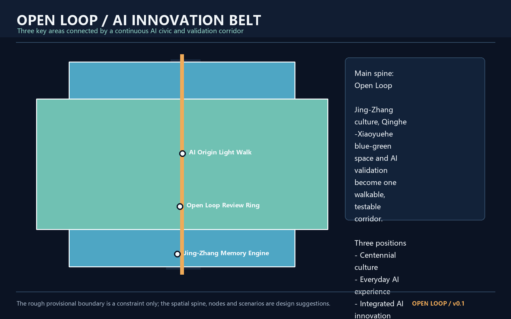
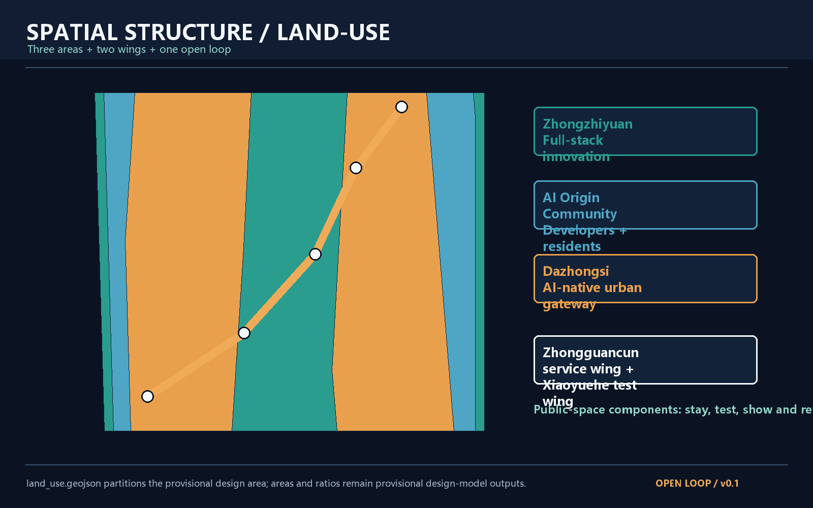
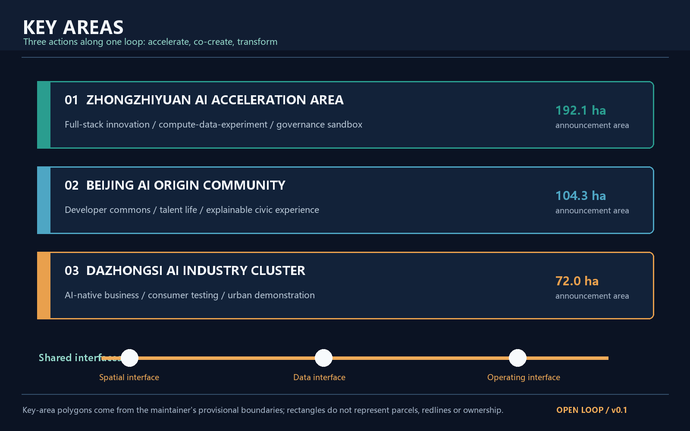
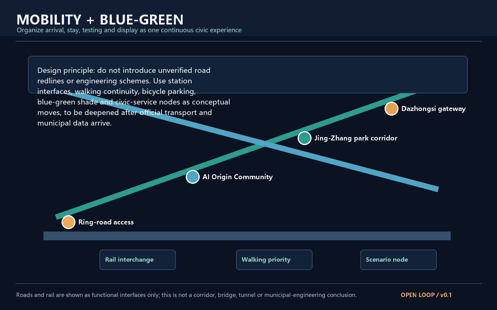
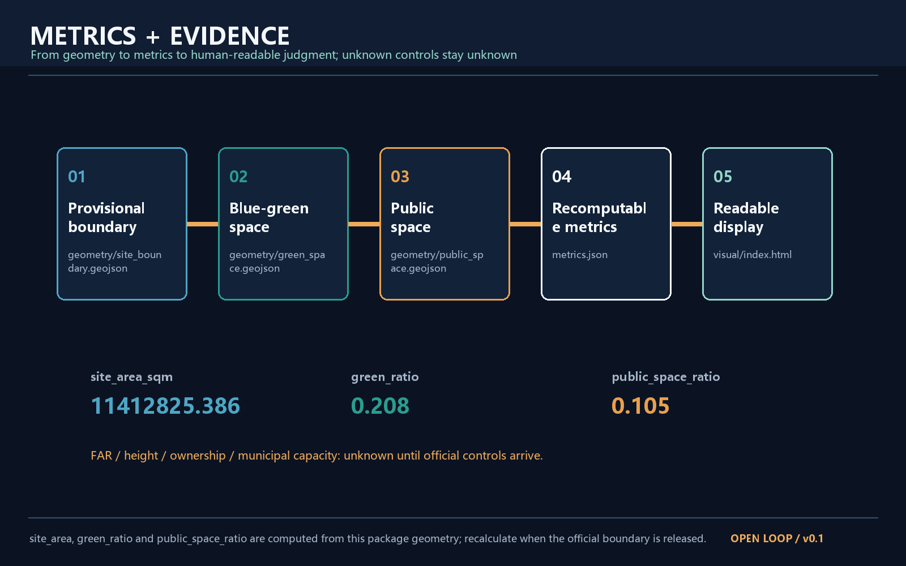

# Open Loop AI Innovation Belt

## 0. Executive summary

Open Loop is not a single road. It is an open urban loop made of public space, blue-green corridors, developer communities, industry testbeds and cultural narratives. Its basic unit is “arrive - stay - test - display - review - keep developing”. The proposal is a conceptual reference scheme for professional deepening. It does not replace statutory planning or constitute an approved government conclusion. [source:SRC-2026-BJ-GH-QUAL-PREANNOUNCEMENT] [source:SRC-2026-0518-AGENT-OPEN-CALL-TASKBOOK]

The three positions are Centennial Jing-Zhang Culture Belt, Urban AI Life Experience Belt and AI Integrated Innovation Belt. The five functions are full-stack autonomous innovation, world-class AI ecosystem, AI-plus scenario empowerment, intelligent AI vitality city and global discourse on AI governance. The three areas and two wings operate through one public loop. [source:SRC-2026-0518-AGENT-OPEN-CALL-TASKBOOK]

## 1. Basis and source inventory

The submitted boundary is the maintainer-provided rough provisional polygon. No precise official CAD/GIS redline is publicly available in the repository. The polygon was fitted from the announcement's written edges, approximately 11.4 square kilometres and the announced key-area values. It is for generation, display and intake self-check only, not an official redline, approval basis or ownership boundary. [source:SRC-PROVISIONAL-BOUNDARIES-2026] [data:geometry/site_boundary.geojson#SITE-001]

The official announcement and taskbook support the project name, three scope levels, approximate areas, key areas and design tasks. Urban design management, regulatory detailed planning and land-use classification are used as professional references. The precise boundary, existing buildings, ownership, transport alignments, engineering capacity and statutory controls remain pending. [source:PROJECT-OFFICIAL-ANNOUNCEMENT] [standard:MOHURD-URBAN-DESIGN-MEASURES]

## 2. Three-level scope framework

The coordinated research area is approximately 43.6 square kilometres. The overall design area is approximately 11.4 square kilometres. The key detailed design area is approximately 368.4 hectares and includes Zhongzhiyuan, Beijing AI Origin Community and Dazhongsi from north to south. [source:SRC-2026-BJ-GH-QUAL-PREANNOUNCEMENT] [data:geometry/key_areas.geojson#KEY-001]

The three levels are linked. The regional layer defines how innovation resources move. The overall design layer defines how urban interfaces receive that movement. The key-area layer defines how people experience, test and review it. Once official polygons are supplied, all geometry, metrics, figures, HTML and drawings must be recalculated as one package. [depth:three_level_scope] [assumption:A-BOUNDARY-001]

## 3. Regional strategy and future-city structure

The name is “Open Loop”. “Open” means open data, open scenarios and open collaboration. “Loop” means a cycle from innovation to civic experience and back to developer feedback. The identity direction uses an open teal loop passing through warm orange nodes. It uses original geometry and generic fonts only. [source:SRC-2026-0518-AGENT-OPEN-CALL-TASKBOOK]

Zhongzhiyuan becomes the full-stack base for compute, data, experiments and governance interfaces. AI Origin Community becomes the developer and resident co-creation interface. Dazhongsi becomes the conversion gateway for AI-native business and public demonstration. The Zhongguancun technology-service wing supplies specialist connections, while the Xiaoyuehe scenario-empowerment wing supplies a continuous public testing interface. [standard:MOHURD-URBAN-DESIGN-MEASURES]

Seven public examples were used as mechanism references: MaRS, Station F, Oodi, Brainport Eindhoven, one-north, Pittsburgh AI and robotics districts, and King's Cross. The comparison is background learning, not a claim about local facts or committed investment. [assumption:A-ECOSYSTEM-001]

## 4. Overall urban design

The overall design area is organized as one open loop, three interface types and six node types. The loop combines the Jing-Zhang heritage line, the Qinghe-Xiaoyuehe blue-green line and the AI scenario-validation line. Interface types are station gateways, shared innovation edges and community public edges. Node types are arrival, memory, developer, test, honour and night-life nodes. [depth:overall_structure] [data:geometry/roads.geojson#RD-001]

The land-use layer is a conceptual partition into autonomous innovation, community co-creation, and culture-and-urban-life zones. It covers the submitted provisional boundary but does not claim statutory land-use codes or regulatory parcels. [data:geometry/land_use.geojson#LU-001] [standard:MNR-LAND-USE-CLASSIFICATION-GUIDE]

FAR, building height and retain-renovate-demolish decisions are not statutory conclusions. Buildings are represented as conceptual background, renovation opportunity or possible insertion, pending ownership, heritage, engineering and regulatory review. [data:geometry/buildings.geojson#BLD-001] [assumption:A-CONTROLS-001]

## 5. Three key areas

### 5.1 Zhongzhiyuan AI acceleration area

The proposed role is a verifiable base for full-stack autonomous innovation. Its concept includes an innovation gateway, a low-friction public interface for compute and data, test courtyards and an open governance-review line. It does not name tenants, investment amounts or specific demolition or construction parcels. [data:geometry/key_areas.geojson#KEY-001] [depth:key_area_zhongzhiyuan]

### 5.2 Beijing AI Origin Community

The proposed role is a daily community for developers, residents and urban-problem co-creation. The “AI Origin living room - developer lanes - talent living loop” supports shared work, learning, public services and night-time safety. Every interaction keeps a clear human channel, exit path and non-digital alternative. [data:geometry/key_areas.geojson#KEY-002] [standard:BARRIER-FREE-ENVIRONMENT-LAW] [depth:key_area_ai_origin]

### 5.3 Dazhongsi AI industry cluster

The proposed role is a conversion gateway for AI-native commerce and business. Station and business interfaces can host explainable AI services, enterprise demonstrations, consumer testing and developer evenings. These are operating concepts, not confirmed leasing, investment or government commitments. [data:geometry/key_areas.geojson#KEY-003] [depth:key_area_dazhongsi]

## 6. AI ecosystem, personas and scenario cards

Five personas are covered: developers and researchers; AI companies and service providers; residents and families; international visitors and innovation talent; and city governance and maintenance teams.

Ten scenario cards are included: Jing-Zhang semantic guide, accessible walking assistant, developer scenario sandbox, urban-energy observatory, Xiaoyuehe microclimate test, AI night public space, public-facility collaboration, youth AI creation table, enterprise compliance exhibition and global developer week. The sandbox, energy observatory and microclimate test are the three industry test and validation scenarios. All retain human review, data minimization, non-digital alternatives and staged testing. [source:SRC-2026-0518-AGENT-OPEN-CALL-TASKBOOK] [assumption:A-PRIVACY-001]

## 7. AI public space, landmarks and culture

Three AI pilgrimage landmarks are proposed: the Jing-Zhang Memory Engine, the Open Loop Review Ring and the AI Origin Light Walk. They are conceptual public nodes for archives, public review and contributor recognition. They do not represent approved construction and use no unlicensed portraits, trademarks or historical images. [data:geometry/public_space.geojson#PS-003]

The cultural narrative has three periods and one open action: Jing-Zhang connects distant places through engineering; Zhongguancun connects knowledge and industry; AI-native culture connects agents and people to public problems. Wayfinding differentiates the overall belt identity, Jing-Zhang cultural signs and individual node names. [depth:cultural_narrative]

## 8. Mobility, municipal interfaces and blue-green public space

The proposal provides functional interfaces only: station gateways, walk-first connections, bicycle parking, bilingual wayfinding, shaded blue-green paths and modular edge services. It does not define road alignments, rail lines, bridges, tunnels or municipal engineering feasibility. [data:geometry/roads.geojson#RD-001] [data:geometry/green_space.geojson#GR-001] [standard:MOHURD-URBAN-DESIGN-MEASURES]

## 9. Renewal, policies and phasing

In years 0-2, establish an open-loop base map, temporary public-space components, small AI scenario tests, bilingual wayfinding and a public review ledger. In years 3-5, connect the three key areas and operate the developer community and scenario library. In years 6-10, accumulate global AI events, contributor archives, open testing standards and public-space assets as a long-term brand. Every step requires professional design, ownership coordination, safety review, public participation and statutory approval. [data:geometry/phasing.geojson#PH-001] [depth:phasing_implementation]

The annual operating cycle can be spring urban-problem collection, summer scenario-validation season, autumn global AI innovation week, and winter public review and annual learning. It is an operating proposal, not a confirmed government schedule. [source:SRC-2026-0518-AGENT-OPEN-CALL-TASKBOOK]

## 10. Metrics and compliance

The three core visual metrics are recomputable from the submitted geometry: `site_area_sqm` is approximately 11,412,825 square metres, `green_ratio` is green-space area divided by site area, and `public_space_ratio` is public-space area divided by site area. They are provisional design-model outputs and must be recalculated when official polygons arrive. [metric:site_area_sqm] [metric:green_ratio] [metric:public_space_ratio]

FAR, building height, ownership, existing floor area, road capacity, energy load and municipal capacity remain unknown. This protects the evidence boundary. The proposal instead completes spatial structure, land-use partition, public-space network, scenario nodes, renewal projects, phasing and risk disclosure. [standard:MOHURD-CONTROL-DETAILED-PLANNING]

## 11. Risk, rights and official-boundary statement

The package uses public or cleared repository materials only. It does not use private data, internal corporate data, unlicensed marks, portraits, news images or remote map screenshots. Figures are locally generated explanatory artifacts. The boundary, scenarios, events, policies and spatial nodes are conceptual proposals. When official boundary, regulatory planning, ownership, transport, municipal, heritage and safety data arrive, the whole package must be replaced and recalculated. [source:SRC-PROVISIONAL-BOUNDARIES-2026] [standard:PROJECT-AGENT-OPEN-CALL-TASKBOOK]

## 12. References

1. Haidian Branch of Beijing Municipal Commission of Planning and Natural Resources, qualification pre-announcement, 2026-05-09.
2. Agent open-call taskbook excerpt for the Centennial Jing-Zhang AI Innovation Belt, 2026-05-18.
3. Maintainer provisional boundary and key-area GeoJSON, open-city-ai/haidian, 2026-06-05.
4. Ministry of Housing and Urban-Rural Development, Urban Design Management Measures.
5. Ministry of Housing and Urban-Rural Development, Measures for Regulatory Detailed Planning.
6. Ministry of Natural Resources, Land-use Classification Guide.
7. OpenStreetMap Foundation, Copyright and License, used only as licensing background.
