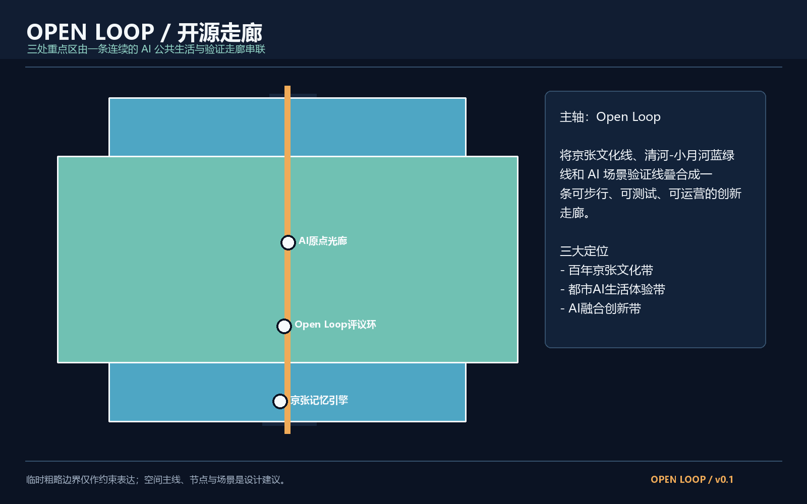
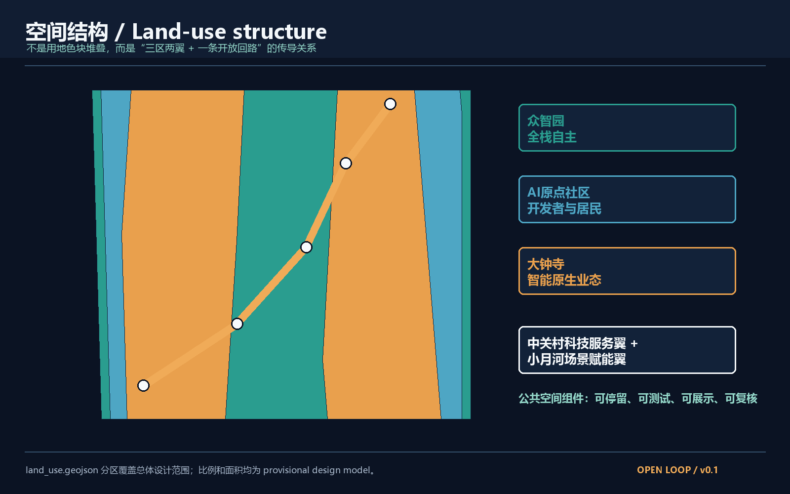
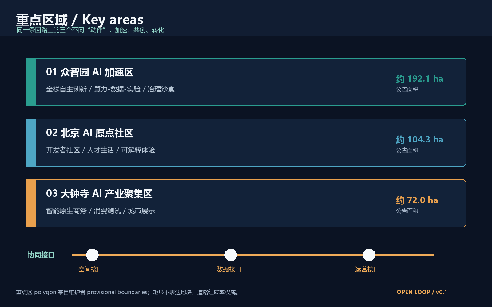
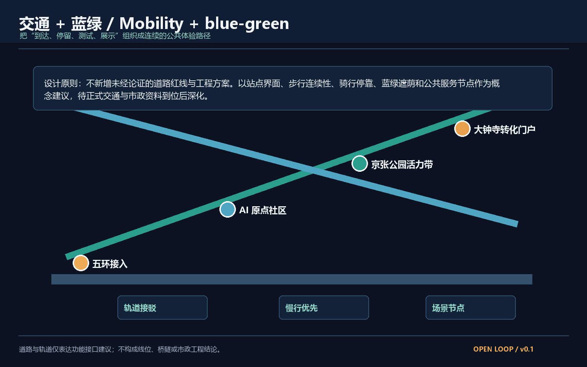
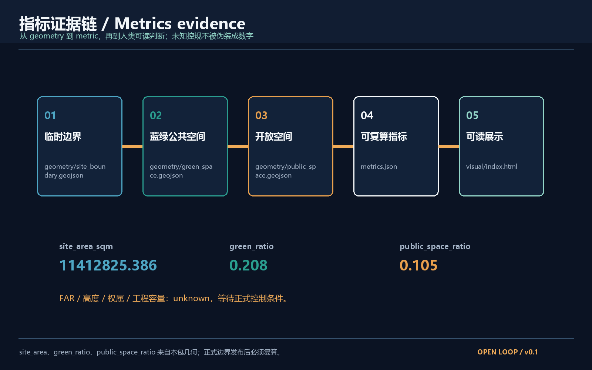

# Open Loop 开源走廊 / Open Loop AI Innovation Belt

## 0. 方案摘要

“Open Loop 开源走廊”不是一条单一的道路，而是一条由公共空间、蓝绿网络、开发者社区、产业测试和文化叙事共同组成的开放回路。它以“到达 - 停留 - 测试 - 展示 - 复核 - 继续开发”为基本体验单元，把三区两翼组织为一套可持续迭代的城市系统。方案是概念建议、参考方案和可供专业团队深化研究的材料，不替代正式规划，不构成政府审定结论。[source:SRC-2026-BJ-GH-QUAL-PREANNOUNCEMENT] [source:SRC-2026-0518-AGENT-OPEN-CALL-TASKBOOK]

三大定位是“百年京张文化带、都市AI生活体验带、AI融合创新带”。五大功能对应“AI全栈自主创新体系、世界级AI创新生态、AI+场景赋能新范式、智能化AI活力城市、AI治理全球话语权”。三区两翼通过一条开放回路连接：众智园负责全栈自主创新，北京AI原点社区负责开发者与居民共创，大钟寺负责智能原生业态转化；中关村科技服务翼提供全球要素和专业服务，小月河场景赋能翼提供连续的公共测试界面。[source:SRC-2026-0518-AGENT-OPEN-CALL-TASKBOOK]

## 1. 设计依据与资料清单

本方案使用的边界是仓库维护者提供的临时粗略 polygon，当前公开资料没有可直接验证的正式 CAD/GIS 红线。临时范围依据公告文字四至、约 11.4 平方公里面积和三处重点区的公告面积拟合，仅用于生成、展示和临时自检，不是 official redline、审批依据或精确权属边界。[source:SRC-PROVISIONAL-BOUNDARIES-2026] [data:geometry/site_boundary.geojson#SITE-001]

官方公告和任务书可支撑项目名称、三层范围文字、面积约束、三处重点区和任务目标；城市设计管理、控规编制审批、国土空间用地分类作为专业表达参照。缺失的正式边界、现状建筑、权属、交通线位、工程容量和法定控规指标均在本包中标记为待正式数据补齐。[source:SRC-2026-BJ-GH-QUAL-PREANNOUNCEMENT] [standard:MOHURD-URBAN-DESIGN-MEASURES] [standard:MOHURD-CONTROL-DETAILED-PLANNING]

## 2. 三层范围工作框架

统筹研究范围约 43.6 平方公里，承担区域产业协同、京津冀创新网络和未来城市形态研究；总体设计范围约 11.4 平方公里，承担京张遗址公园周边城市地区和产业区的城市更新与公共空间系统；重点区域范围约 368.4 公顷，自北向南为众智园、北京AI原点社区、大钟寺AI产业聚集区。[source:SRC-2026-BJ-GH-QUAL-PREANNOUNCEMENT] [data:geometry/key_areas.geojson#KEY-001]

三层范围不是三张互不相干的图。统筹研究层定义“创新要素如何流动”，总体设计层定义“空间界面如何承接流动”，重点区域层定义“人如何在节点上体验、测试和反馈”。当前几何保持 `provisional_constraint`，因此本方案只给出设计结构和概念指标；取得正式 polygon 后，site_boundary、key_areas、land_use、green_space、public_space、roads、phasing、metrics、图纸和 HTML 应整体重算。[depth:three_level_scope] [assumption:A-BOUNDARY-001]

## 3. 统筹研究范围产业与未来城市研究

### 3.1 总体概念与命名体系

主名称为“Open Loop 开源走廊 / Open Loop AI Innovation Belt”。“Open”表达开放数据、开放场景和开放协作，“Loop”表达从创新到城市体验再回到开发者反馈的循环。中文简称“开源走廊”，英文简称“Open Loop”。视觉识别建议使用一条不闭合的青绿色环线穿过暖橙色节点，形成“未完成、可加入、可继续开发”的开放符号；Logo 只使用原创几何线条和通用字体，不使用未经授权的企业标识、人物肖像或特定字体。[source:SRC-2026-0518-AGENT-OPEN-CALL-TASKBOOK]

### 3.2 五大功能的空间转译

AI全栈自主创新体系转译为众智园的算力、数据、实验和治理接口；世界级AI创新生态转译为AI原点社区的开发者客厅、共享工作、人才服务与跨机构展示；AI+场景赋能新范式转译为小月河场景赋能翼的可插拔公共测试界面；智能化AI活力城市转译为连续慢行、蓝绿遮荫、无障碍人工服务和可解释交互；AI治理全球话语权转译为公开的模型测试规约、荣誉展示节点和年度公共评议。[standard:MOHURD-URBAN-DESIGN-MEASURES] [data:geometry/public_space.geojson#PS-001]

### 3.3 5-8个全球案例的可转化经验

下表只提炼公开可讨论的机制，不编造企业名单、投资额或政策承诺。

| 案例 | 可借鉴机制 | 本方案空间化转译 |
| --- | --- | --- |
| 加拿大多伦多 MaRS | 研究、创业与公共活动共置 | AI原点社区的开发者客厅与公共展示 |
| 法国 Station F | 大体量共享空间与创业服务 | 中关村科技服务翼的服务接口，不预设具体物业 |
| 芬兰赫尔辛基 Oodi | 公共图书馆兼具数字制作与公共服务 | 京张公园边界的“公共AI客厅” |
| 荷兰 Brainport Eindhoven | 产业链协作和测试环境 | 众智园的场景验证台账 |
| 新加坡 one-north | 研发、生活与开放空间混合 | 三区之间的生活-创新连续界面 |
| 美国匹兹堡 AI/机器人走廊 | 产业测试与高校、城市问题耦合 | 小月河场景赋能翼的城市问题赛题 |
| 英国伦敦 King’s Cross | 旧铁路文化与新产业共生 | 京张遗址公园的文化叙事和更新接口 |

这些案例是背景学习，不是本地事实依据；真正落地仍需本地权属、控规、运营与专业论证。[source:SRC-2026-0518-AGENT-OPEN-CALL-TASKBOOK] [assumption:A-ECOSYSTEM-001]

## 4. 总体设计范围城市更新与控规深度城市设计

总体设计范围采用“一条开放回路、三种界面、六类节点”的结构。开放回路由京张铁路文化线、清河-小月河蓝绿线、AI场景验证线叠合形成；三种界面是站点门户、园区共享界面、社区公共界面；六类节点是到达、记忆、开发、测试、荣誉和夜间生活节点。[depth:overall_structure] [data:geometry/roads.geojson#RD-001]

用地层把总体范围分为“AI自主创新、社区共创、文化与城市生活”三个概念分区，完整覆盖本包提交的 provisional site boundary，不宣称与法定用地代码或控规地块一致。[data:geometry/land_use.geojson#LU-001] [standard:MNR-LAND-USE-CLASSIFICATION-GUIDE]

建筑规模、容积率、建筑高度和拆改留不作法定判断。建筑层只表达“保留为背景、改造为建议、新建为概念供给”的空间类型，具体地块、权属、文保、工程和审批条件待正式资料到位后由专业团队校核。[data:geometry/buildings.geojson#BLD-001] [assumption:A-CONTROLS-001]

## 5. 重点区域详细设计

### 5.1 众智园 AI 自主创新加速区

定位是“全栈自主创新的可验证底座”。空间结构建议为一条北五环接入的创新门廊、一个低门槛算力与数据公共服务接口、三类测试庭院和一条面向治理议题的公开评议线。建筑更新只区分保留、可改造、可插入，不指定具体拆除或新建地块。产业测试优先服务信软、机器人、城市计算与低碳运维，但不预设入驻企业和投资规模。[data:geometry/key_areas.geojson#KEY-001] [depth:key_area_zhongzhiyuan]

### 5.2 北京 AI 原点社区

定位是“开发者、居民和城市问题共创的日常社区”。以“AI原点客厅 - 开发者街巷 - 人才生活环”组织共享办公、社区服务、公共学习、夜间安全和儿童友好界面。所有智能交互提供清晰的人工入口、退出方式和非数字替代流程，不把人脸识别、持续定位或个人画像作为必要条件。[data:geometry/key_areas.geojson#KEY-002] [standard:BARRIER-FREE-ENVIRONMENT-LAW] [depth:key_area_ai_origin]

### 5.3 大钟寺 AI 产业聚集区

定位是“智能原生新业态的城市转化门户”。建议在站点和商务界面组织可解释的 AI 服务、企业展示、消费测试和开发者夜校，让产业成果以公共体验形式被理解，不把商业设想写成已经确定的招商或投资安排。重点是空间可见性、运营弹性和人类复核，而不是炫技装置。[data:geometry/key_areas.geojson#KEY-003] [depth:key_area_dazhongsi]

## 6. 用地、建筑规模与拆改留方案

用地层以“AI自主创新、社区共创、文化与城市生活、蓝绿公共界面”表达总体设计范围的概念分区，四个相邻 polygon 由同一临时边界分割而来，覆盖关系可由 `geometry/land_use.geojson` 复核。建筑层只表达保留背景、可改造界面和可插入的新供给三种建议类型，不把建筑轮廓、容积率、高度或权属写成正式控制。[data:geometry/land_use.geojson#LU-001] [data:geometry/buildings.geojson#BLD-001]

拆改留策略优先保留京张文化叙事和可继续使用的城市界面，以小尺度改造、公共空间补丁、临时场景组件和可逆的新建接口为主；需要拆除、产权调整、文保审批或工程论证的事项只作为待核查清单。正式 polygon、现状建筑调查和控规条件到位后，应整体重算建筑量、公共空间比例和分期边界，不把本包的概念几何当作地块红线。[standard:MNR-LAND-USE-CLASSIFICATION-GUIDE] [standard:MOHURD-CONTROL-DETAILED-PLANNING] [assumption:A-CONTROLS-001]

## 7. AI 创新生态、人才画像与 AI+ 场景

### 6.1 五类用户画像

1. 开发者与研究者：需要开放算力、公开数据目录、可复用场景和低摩擦交流。
2. AI企业与产业服务者：需要测试场地、合规咨询、展示机会和跨机构连接。
3. 周边居民与家庭：需要安全、可理解、非数字替代和夜间可达的公共服务。
4. 国际访客与创新人才：需要双语导视、可信来源、连续体验路线和可解释的城市故事。
5. 城市治理与运维团队：需要可审计指标、人工复核、异常处置和不依赖单一供应商的接口。

### 6.2 十张AI场景卡

| 编号 | 场景 | 空间位置 | 人工复核与边界 |
| --- | --- | --- | --- |
| S01 | 京张文化语义导览 | 京张公园入口与记忆节点 | 史实由人工编辑审核，允许纸质导览 |
| S02 | 无障碍步行助手 | 公园-社区-站点连续界面 | 只提供建议，不替代现场服务 |
| S03 | 开发者场景沙盒 | AI原点社区 | 使用脱敏数据，结果由专家复核 |
| S04 | 城市能源观察台 | 众智园测试庭院 | 只展示设计模型，不宣称实测容量 |
| S05 | 小月河水岸微气候试验 | 小月河场景赋能翼 | 先做短期试验，须有安全与生态评估 |
| S06 | AI夜间公共空间 | 大钟寺站点界面 | 无持续人脸识别，保留人工巡查 |
| S07 | 公共设施故障协作 | 三区公共空间 | 事件工单可追溯，个人信息最小化 |
| S08 | 青少年AI创作台 | AI原点社区学习节点 | 家长与教师参与，内容人工审核 |
| S09 | 企业合规体验展 | 大钟寺转化门户 | 只展示清权案例，不承诺采购 |
| S10 | 全球开发者开放周 | 全线六类节点 | 活动为年度运营建议，状态需逐年确认 |

其中 S03、S04、S05 为不少于三个的产业测试验证场景。所有场景都可以先以低成本、可撤除、可复盘的临时设施试点，不把成熟度未知的技术写成全面部署。[source:SRC-2026-0518-AGENT-OPEN-CALL-TASKBOOK] [assumption:A-PRIVACY-001]

## 8. 蓝绿空间、公共空间与城市风貌

三个 AI 朝圣地标建议为：一是“京张记忆引擎”，把铁路遗址、时间线和公众故事做成可更新的公共档案节点；二是“Open Loop 评议环”，展示公开测试规约、模型说明和年度人类评议结果；三是“AI原点光廊”，以可解释的数据流和开发者贡献记录形成夜间可读的荣誉展示。三者均为概念节点，不代表已获批准建设，不使用未经授权的肖像、商标或历史图像。[source:SRC-2026-0518-AGENT-OPEN-CALL-TASKBOOK] [data:geometry/public_space.geojson#PS-003]

文化叙事采用“三段时间、一个开放动作”：京张铁路代表以工程连接远方，中关村文化代表以知识连接产业，AI新文化代表以智能体协作连接公共问题。导视系统区分一带整体 Logo、京张文化符号和各节点名称，不把文化资源只当作科技装饰。[depth:cultural_narrative]

## 9. 交通、轨道、市政与公共服务设施

方案只提出功能接口：站点门户提供清晰换乘、步行优先、骑行停靠和双语导视；蓝绿系统以京张遗址公园、清河-小月河与遮荫步行网络形成连续公共体验；新型基础设施采用可插拔、可维护、可替换的端侧服务节点，不绑定单一厂商。道路中心线、轨道接驳、市政和桥隧工程均不作为法定线位或工程可行性结论。[data:geometry/roads.geojson#RD-001] [data:geometry/green_space.geojson#GR-001] [standard:MOHURD-URBAN-DESIGN-MEASURES]

## 10. 更新项目清单、实施政策与分期计划

近期 0-2 年建议先做“开放回路底图、临时公共空间组件、AI场景小规模试验、双语导视和公开评议台账”；中期 3-5 年建议形成三个重点区的连续接口、开发者社区运营和可复制场景库；长期 6-10 年建议把全球 AI 创新活动、贡献者档案、开放测试标准和城市公共空间资产沉淀为长期品牌。每一步都必须经过专业设计、权属协调、交通和安全评估、公众参与及正式审批。[data:geometry/phasing.geojson#PH-001] [depth:phasing_implementation]

年度活动系统建议为“春季城市问题征集、夏季场景验证季、秋季全球AI创新周、冬季公共评议与年度复盘”。活动品牌和运营机制是概念建议，不是已确定政府安排；转化路径为“问题公开 - 场景共创 - 小规模测试 - 人工复核 - 专业深化 - 公开复盘”。[source:SRC-2026-0518-AGENT-OPEN-CALL-TASKBOOK]

## 11. 指标体系、面积复算与合规矩阵

本包的三个核心视觉指标均从提交几何复算：`site_area_sqm` 约 11,412,825 平方米，`green_ratio` 为 `green_space` 面积除以 `site_boundary` 面积，`public_space_ratio` 为 `public_space` 面积除以 `site_boundary` 面积。它们是 provisional design model，不是法定控制指标，正式 polygon 到位后必须重算。[metric:site_area_sqm] [metric:green_ratio] [metric:public_space_ratio]

FAR、建筑高度、权属、现状建筑量、道路容量、能源负荷和市政容量均为 unknown。把这些指标保留为 unknown 是对资料边界负责，不是用口号替代设计。当前设计深度通过空间结构、用地分区、公共空间、场景节点、更新项目、分期和风险说明落实；最终专业评分仍需正式资料和专业团队复核。[data:geometry/land_use.geojson#LU-001] [standard:MOHURD-CONTROL-DETAILED-PLANNING]

## 12. 风险、版权与合规说明

本包只使用仓库公开或清权资料，未使用个人隐私、企业内部数据、未授权商标、人物肖像、新闻图片或远程地图截图。图件由本地 Python/PIL 与 ReportLab 数据驱动生成，属于解释层。临时边界、AI场景、活动、政策和空间节点均为概念建议。请在正式边界、控规、权属、交通、市政、文保和安全条件发布后进行全包替换和重算。[source:SRC-PROVISIONAL-BOUNDARIES-2026] [standard:PROJECT-AGENT-OPEN-CALL-TASKBOOK]

本包的主要风险不是把概念画得不够完整，而是把暂时不可验证的条件误读成正式结论。site_boundary 与 key_areas 仍是维护者提供的 provisional constraint，不得作为官方红线、精确面积、产权边界或审批依据；land_use、buildings、roads、green_space、public_space 与 phasing 是由临时范围推导的设计建议，正式 polygon 到位后必须联动重算。FAR、建筑高度、现状建筑量、道路容量、轨道接驳、市政容量和投资安排均保持 unknown，不能由图纸、渲染或比例尺反推。涉及铁路文化、文保和公共记忆的内容应由权威资料和人工编辑核实；涉及 AI 场景的内容应遵循最小化采集、人工复核、可退出、非数字替代和无障碍服务原则。所有实施建议还需要权属协调、交通与消防安全、生态和工程评估、公众参与以及正式规划审批。英文版图件、PDF、HTML 与中文成果采用同一组几何和指标，但只作为双语阅读材料，不构成额外事实来源。[data:geometry/site_boundary.geojson#SITE-001] [metric:site_area_sqm] [assumption:A-CONTROLS-001]

## 13. 参考资料

1. 北京市规划和自然资源委员会海淀分局，百年京张AI创新带城市设计国际方案征集资格预审公告，2026-05-09。
2. 面向全球智能体开展百年京张AI创新带城市设计开源征集任务书摘录，2026-05-18。
3. Open-city-ai/haidian 临时边界与三处重点区 GeoJSON，维护者公开文件，2026-06-05。
4. 住房和城乡建设部，城市设计管理办法。
5. 住房和城乡建设部，城市、镇控制性详细规划编制审批办法。
6. 自然资源部，国土空间调查、规划、用途管制用地用海分类指南。
7. OpenStreetMap Foundation，Copyright and License，仅作为开放数据许可背景，不作为本包正式边界。

上述资料均用于说明设计依据、来源边界或专业参照；正式边界、控规和工程条件仍以组织方后续公开的权威资料为准。[source:SRC-2026-BJ-GH-QUAL-PREANNOUNCEMENT] [source:SRC-PROVISIONAL-BOUNDARIES-2026]
