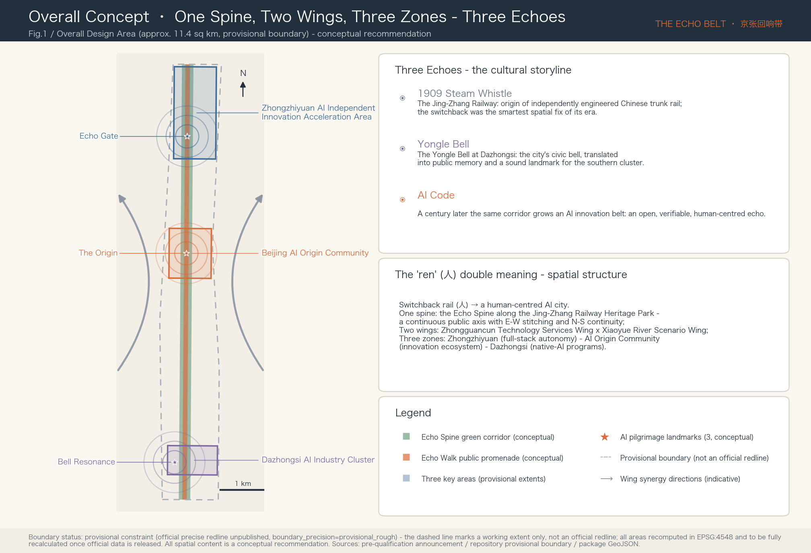
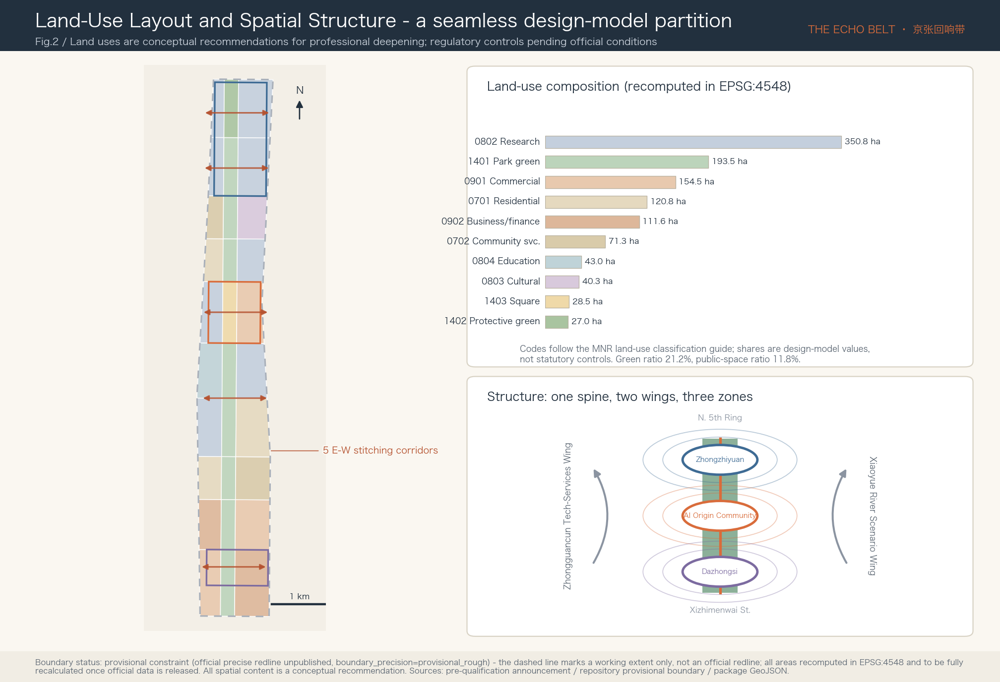
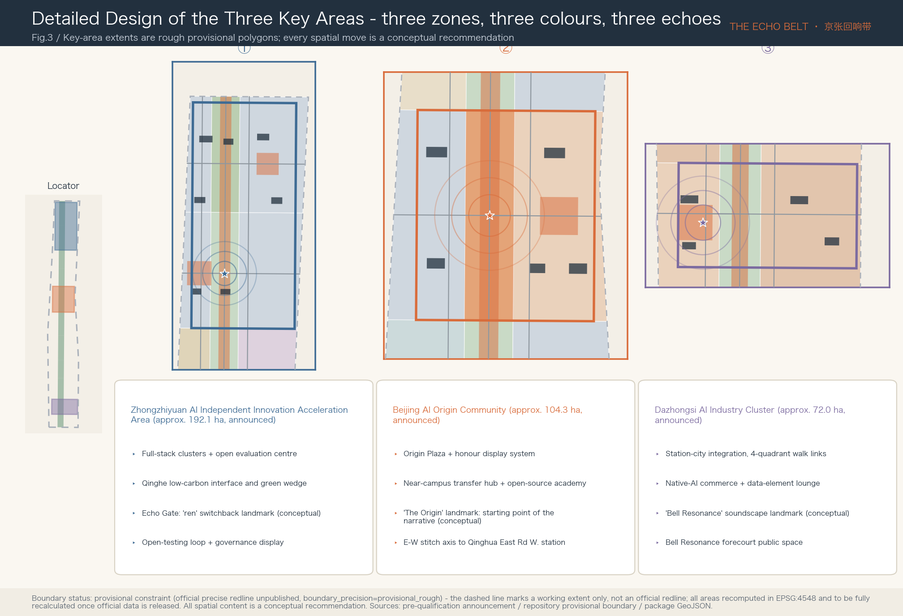
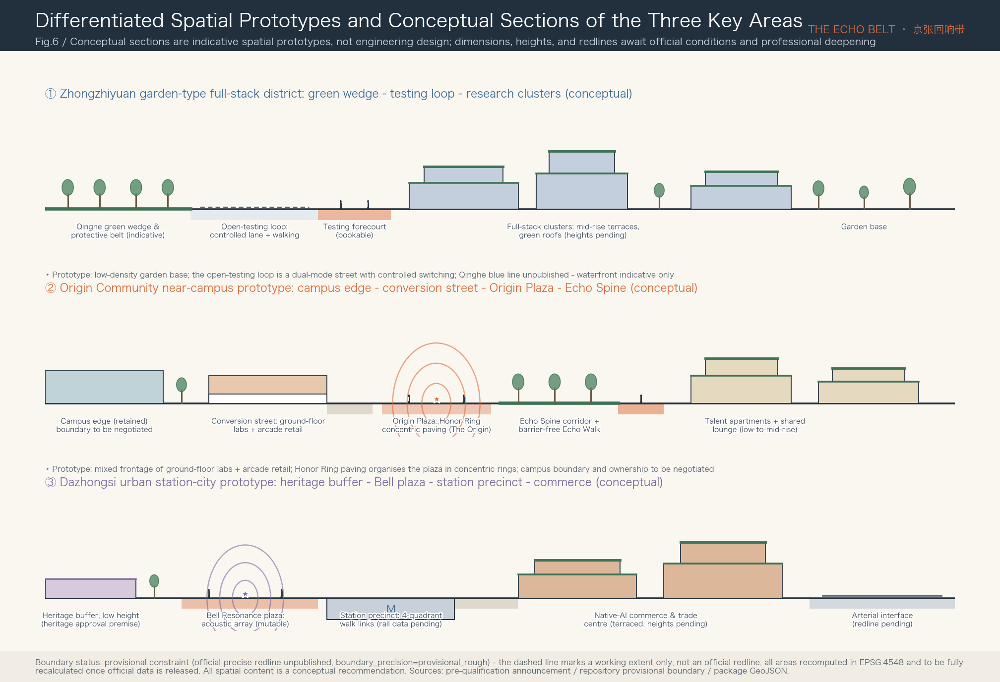
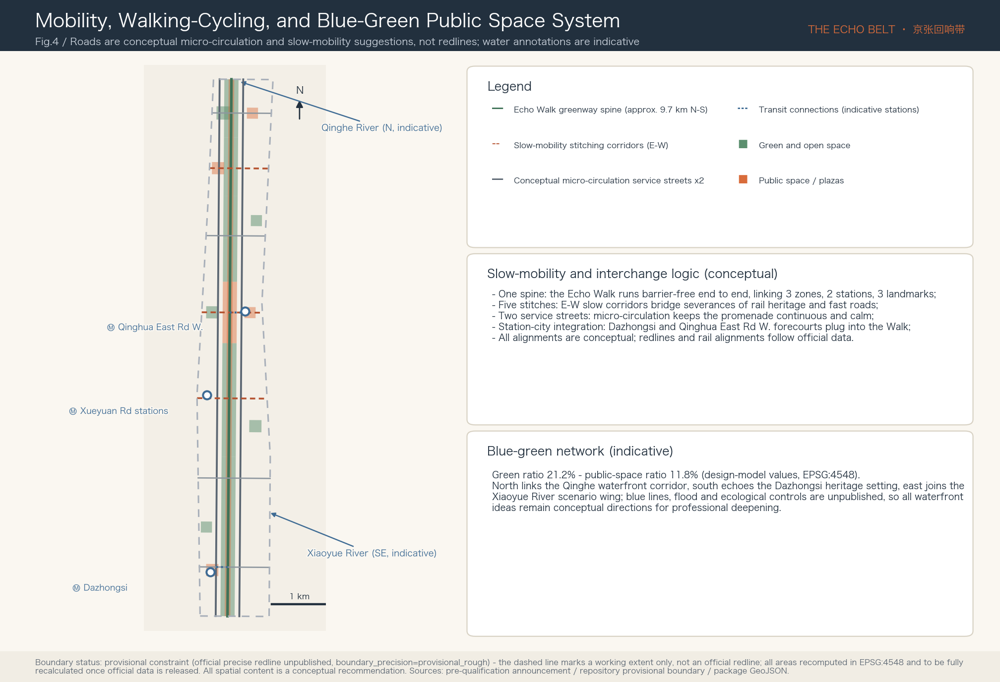
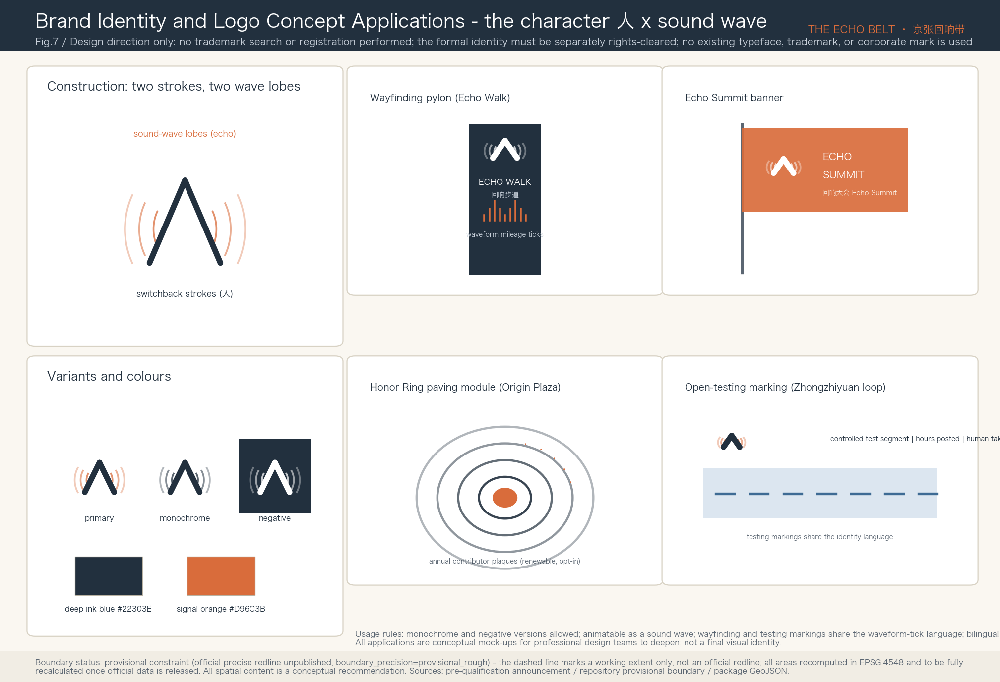
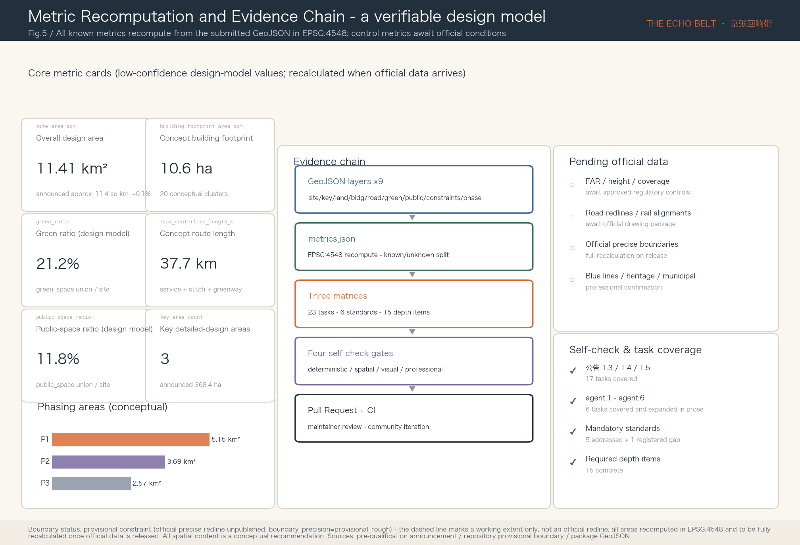

# The Echo Belt 京张回响带

In 1909 the first whistle of the Jing-Zhang Railway sounded from this corridor - the first trunk railway independently designed by Chinese engineers, and Zhan Tianyou's switchback alignment was the smartest spatial fix of its era. More than a century later, the Centennial Jing-Zhang AI Innovation Belt grows along the same corridor. This proposal reads that fact as an **echo: the steam whistle (independent innovation of 1909), the bell (the civic civilisation embodied by the Yongle Bell at Dazhongsi), and code (today's AI) - three echoes answering one another within one linear space**. Hence the name "The Echo Belt / 京张回响带". The character 人 ("ren", person) carries a double meaning here: the engineering wisdom of the 人-shaped switchback is translated into the governance commitment of a human-centred AI city. Spatially the proposal offers the conceptual structure of "one spine, two wings, three zones": the linear green corridor of the Jing-Zhang Railway Heritage Park as the spine (Echo Spine), the Zhongguancun Technology Services Wing and the Xiaoyue River Scenario Enablement Wing as the two wings, and the Zhongzhiyuan AI Independent Innovation Acceleration Area, the Beijing AI Origin Community, and the Dazhongsi AI Industry Cluster as the three zones. Every spatial statement in this package is a conceptual recommendation and reference scheme for professional teams to deepen; it does not replace statutory planning and does not constitute a government-approved conclusion.

## Design Basis and Source List

The first basis of this proposal is the Pre-qualification Announcement for the International Solicitation of Urban Design Proposals for the Centennial Jing-Zhang AI Innovation Belt issued by the Haidian Branch of the Beijing Municipal Commission of Planning and Natural Resources, which fixes the three scope levels, the three key areas, the design tasks, and the deliverable depth [source:OFFICIAL-ANNOUNCEMENT]. The second basis is the agent-facing open-call taskbook excerpt, which adds the three positionings, five functions, three zones and two wings, the six required agent tasks (agent.1-agent.6), the ten co-creation principles, and the unified boundary clause [source:AGENT-TASKBOOK]. The enums, metric conventions, allowed design space, and schema constraints in the site package are the machine-readable basis of the structured data in this package [source:SITE-PACKAGE].

Before selecting evidence, the proposal read the public source registry in full and uses materials strictly within its three usability tiers - formal-ready, background-only, and provisional-only [source:SOURCE-REGISTRY]. Formal claims rely only on the officially registered announcement, taskbook, and professional standards; the "three zones and two wings" industry context and Haidian's "1+X+1" industrial system are used for background narrative only [source:SRC-THREE-AREAS-WINGS] [source:SRC-HAIDIAN-1X1]; the six global AI-ecosystem cases introduced later in this chapter come from publicly verifiable institutional pages and serve as background and mechanism references only, never as support for planning-control conclusions. The processed materials (fact pack, task list, missing-data checklist) are used only as a reading navigation layer [source:PROCESSED-FACT-PACK].

On spatial data one key limitation must be stated first: **the official precise redline has not been published, and every boundary in this package is a provisional constraint**. The submitted overall design boundary and the three key-area polygons are taken from the rough provisional geometry inferred by the repository maintainers from the announcement's textual extents and approximate areas, explicitly attributed with official_boundary=false and boundary_precision=provisional_rough [source:BOUNDARY-SOURCE] [source:KEY-AREA-SOURCE]. They may be used only for proposal generation, visualisation, interim self-checks, and design discussion - never as an official redline, an approval basis, or a precise-area conclusion; once official boundaries and key-area redlines are released, the land-use, road, green-space, public-space, building, and phasing layers plus all area metrics must be recalculated as a whole package, with the trigger recorded in the assumptions register [depth:risk_missing_data]. This organizer-side data gap does not block content scoring.

Figure 1 is derived directly from the submitted boundary, key-area, green-space, and public-space layers, with the provisional boundary drawn only as a low-contrast dashed line [data:geometry/site_boundary.geojson#SITE-001]. Each chapter keeps one to three directly relevant evidence anchors beside its key judgments; the complete indexes of sources, metrics, standards, depth items, and task coverage remain in the structured files and are not repeated in prose.

## Three-Level Scope Framework

The proposal organises its work strictly along the announcement's three levels. The Coordinated Research Area of about 43.6 sq km (north to the North 5th Ring Road, east to the Jingzang Expressway, south to Xizhimenwai Street, west to Wanquanhe Road) carries the strategic research on the AI industrial ecosystem and future city form; the Overall Design Area of about 11.4 sq km - the urban districts and industrial areas within 1-2 km of the Jing-Zhang Railway Heritage Park - carries the overall urban-renewal framework and regulatory-plan-level urban design; the Key-Area Detailed Design Area of about 368.4 ha comprises, from north to south, the Zhongzhiyuan AI Independent Innovation Acceleration Area (approx. 192.1 ha), the Beijing AI Origin Community (approx. 104.3 ha), and the Dazhongsi AI Industry Cluster (approx. 72.0 ha) [source:OFFICIAL-ANNOUNCEMENT] [depth:three_level_scope_framework].

The three levels are not three sets of drawings but one transmission chain: the research level answers "why this corridor", the overall level answers "how the corridor is organised", and the key areas answer "what the critical districts become". The package's spatial anchors: the submitted boundary recomputes to about 11.41 sq km in EPSG:4548, deviating about 0.1% from the announced value while remaining a provisional design-model figure [data:geometry/site_boundary.geojson#SITE-001] [metric:site_area_sqm]; the three key areas are expressed in a dedicated layer and each checked against the announced areas [data:geometry/key_areas.geojson#PROV-KEY-001] [metric:key_area_count].

The limits of the provisional boundary are restated here: the provisional polygons are inferred from textual extents, and their rectangular edges must not be read as parcel or road redlines; every area and ratio derived from them is a low-confidence design-model value; the layers and metrics requiring recalculation once official data arrives are individually registered. The proposal therefore deliberately expresses its spatial judgments structurally - spine, wings, zones, stitching corridors, nodes - relationships that survive a boundary correction, leaving only exact alignments and areas for professional teams to refine on official data.

| Level | Design question | Proposal answer | Data anchor |
| --- | --- | --- | --- |
| Coordinated Research Area (approx. 43.6 sq km) | How to organise the AI ecosystem and future city form | The innovation chain "university sourcing - open-source collaboration - enterprise conversion - public experience - international communication"; the three-zones-two-wings synergy loop | Task coverage matrix, standard matrix |
| Overall Design Area (approx. 11.4 sq km) | How renewal, land use, transport, utilities, and character are laid out | One spine, two wings, three zones; a seamless ten-class land-use partition; five E-W stitching corridors | Land-use, road, green-space, public-space, phasing layers |
| Key-Area Detailed Design Area (approx. 368.4 ha) | How the three districts reach detailed-design depth | Three zones, three colours, three echoes: positioning, spatial moves, landmarks, scenarios, and implementation dependencies per zone | Key-area layer and the triptych of Fig.3 |

## Coordinated Research Area: Industry and Future City Research

**Overall concept and naming system (answering agent.1).** The main name is 京张回响带, in English The Echo Belt. The judgment behind the name: the corridor's most distinctive asset is not land but the historical narrative of "the origin of China's independent innovation" - the 1909 whistle answered a century later by AI code. "Echo" carries both historical depth and an acoustic image, is short and extensible in both languages, and can register event brands [source:AGENT-TASKBOOK]. The naming system extends across four tiers - master brand, spatial sub-brands, event brand, community brand: the spatial sub-brands are the Echo Spine (the heritage-park main axis) and the Echo Walk (the continuous public promenade); the three key areas keep their announced statutory names without invented aliases; the event brand is the Echo Summit; the developer community is the Echo Commons. The logo direction takes the character 人 as its prototype: one falling and one rising stroke are at once the switchback alignment of the railway and a pair of sound-wave lobes, coloured deep ink blue with signal orange (drawn from railway signal colours), usable in monochrome and in negative space, and animatable as a sound wave. This is a design direction only; it uses no existing typeface, trademark, or corporate mark, and the formal visual identity must be separately rights-cleared and designed [standard:PROJECT-AGENT-OPEN-CALL-TASKBOOK].

**Three positionings, five functions, and the synergy loop of three zones and two wings.** The Centennial Jing-Zhang Culture Belt maps to the cultural narrative system of the Echo Spine; the Urban AI Life Experience Belt maps to the Echo Walk and the scenario-card system; the AI Fusion Innovation Belt maps to the industrial organisation of the three zones. The five functions divide spatially: Zhongzhiyuan carries the full-stack independent AI innovation system and the global voice in AI governance; the AI Origin Community carries the world-class AI innovation ecosystem; Dazhongsi carries native-AI new business formats; the Zhongguancun Technology Services Wing provides global allocation of factors and capital enablement; the Xiaoyue River Scenario Enablement Wing provides AI-enabled scenarios and a living lab for the vibrant city. The synergy loop runs "sourcing (Origin Community) → acceleration (Zhongzhiyuan) → conversion (Dazhongsi) → services (Zhongguancun Wing) → experience (Xiaoyue River Wing) → back to sourcing"; the structure diagram at the lower right of Fig.2 illustrates this loop [depth:overall_spatial_structure].

**Global AI innovation ecosystem cases (answering agent.2, six cases).** The selection covers three spatial prototypes - campus-type, park-type, and district-type - all from public institutional pages and used as mechanism references only:

| Case | Spatial prototype | Transferable mechanism | Matching district |
| --- | --- | --- | --- |
| Station F, Paris | Single mega-structure startup campus | Compresses "release - roadshow - media" under one roof, creating a high-frequency launch mechanism | Origin Community release hall |
| one-north, Singapore | Government-led 200-ha innovation district | Phased land release + themed quarters (Biopolis/Fusionopolis) binding industry themes to spatial districts | Theming of the three zones |
| Kendall Square, Cambridge MA | Innovation district at the university's doorstep | "Lab + street retail" mixed ground floors keep researchers on the street | Near-campus conversion street |
| King's Cross Knowledge Quarter, London | Station-renewal-driven knowledge district | Rail heritage (Coal Drops Yard) translated into public retail and culture | Dazhongsi station-city integration |
| Zhangjiang AI Island, Shanghai | Small AI-themed campus | "Whole-area scenario openness": the campus itself as a standing test field for AI products | Zhongzhiyuan open-testing loop |
| MaRS, Toronto | Conversion hub between hospitals and universities | A non-profit operator coordinating incubation, investment, and policy experiments | Echo Commons operating reference |

The shared lesson: the spatial carrier of an innovation ecosystem must simultaneously provide "a stage to release, a field to test, and a street to stay", which this proposal assigns to the Origin Plaza, the Zhongzhiyuan open-testing loop, and the Echo Walk respectively [source:CASE-STATIONF] [source:CASE-ONE-NORTH]. Case details, provenance, and retrieval dates are registered in the package source list [source:CASE-KENDALL].

**Future city form research.** The corridor's hypothesis is a "linear open innovation district": no longer organised by walled campuses but by a 9.7-km continuous public space, with research, housing, services, and culture layered along the spine, and AI infrastructure (edge computing, explainable wayfinding, sensing substrate) embedded in the public-space component library as new municipal utilities. On factor mechanisms, the proposal suggests list-based supply across eight categories - land (stock renewal first), space (shared test fields and release facilities), industry (three-zone division), capital (conceptual guidance-fund direction), talent (talent apartments and international community), computing power (distributed edge nodes), data (compliant data-element circulation spaces), and scenarios (an open scenario catalogue). All of these are mechanism suggestions, not funding, investment-attraction, or policy commitments [source:SRC-HAIDIAN-1X1] [depth:existing_conditions_diagnosis].

**Regional innovation-synergy matrix (answering the taskbook's "regional synergy" dimension).** The taskbook lists "innovation synergy with the Beiwei Community, Future Science City, Huairou Science City, the Beijing Economic-Technological Development Area (BDA), and Beijing-Tianjin-Hebei" as a review dimension [source:AGENT-TASKBOOK]. This section separates, per counterpart, "source-supported facts" from "conceptual mechanisms pending negotiation": the former are limited to the cited sentences, while the latter are unilateral design suggestions of this proposal - they imply no counterpart's agreement to cooperate and constitute no cross-regional planning arrangement.

| Counterpart | Source-supported facts | Suggested synergy mechanism (conceptual, to be negotiated) | Spatial interface in this proposal |
| --- | --- | --- | --- |
| Zhongguancun AI Beiwei Community | Located in the northern core of Zhongguancun Science City, positioned as an international AI-native incubation platform, among others [source:SRC-AI-BEIWEI-RECRUIT]; in 2026 it and the Beijing AI Origin Community were jointly named "OPC Pioneer Communities" [source:SRC-BEIWEI-ORIGIN-OPC] | Complementary north-south incubation nodes: Beiwei focuses on early OPC incubation, the Origin Community in this belt on near-campus conversion and releases; the Echo Commons online repository and honour system open to both communities | Origin release hall, open-source academy, Honor Ring |
| Future Science City | The Beijing International Science and Technology Innovation Centre Regulation assigns it the integration of central-SOE innovation resources and major common-technology R&D platforms [source:SRC-BJ-STIC-REGULATION] | A "submit-and-return" channel between its common-technology platforms and the Zhongzhiyuan evaluation centre; mutual demonstration points for energy-related AI scenarios | Zhongzhiyuan evaluation centre, open-testing loop |
| Huairou Science City | The Regulation assigns it the national major-science-facility cluster and the concentrated site of the comprehensive national science centre [source:SRC-BJ-STIC-REGULATION] | Basic-research outcomes take "science communication and conversion roadshows" through the open-source academy and release hall; a basic-research track at the Echo Summit | Origin release hall, Echo Summit |
| BDA (innovation-cluster demonstration area) | The Regulation assigns it the conversion and industrialisation of the three science cities' outcomes [source:SRC-BJ-STIC-REGULATION] | The Dazhongsi trade centre acts as a "display-and-matchmaking" front desk toward manufacturing scenarios; scenarios that pass testing are recommended into BDA industrialisation channels | Dazhongsi trade centre, open scenario catalogue |
| Beijing-Tianjin-Hebei | The Regulation mandates advancing the BTH national technology innovation centre and the BTH collaborative-innovation community [source:SRC-BJ-STIC-REGULATION] | A BTH scenario track at the Echo Summit; the open scenario catalogue open to BTH city partners for observation and mutual recognition of lessons | Echo Summit, open scenario catalogue |

The taskbook names the "Beiwei Community" in shorthand; this section reads it as the "Zhongguancun AI Beiwei Community" per public reporting - should the organizer mean another entity, the corresponding row must be rewritten. None of the background sources above supports any planning-control conclusion.

## Overall Design Area: Urban Renewal and Regulatory-Plan-Level Urban Design

The land-use plan is expressed as a seamless partition of the submitted boundary: ten classes and 30 parcel units - park and protective green about 220.5 ha (19.3%), research about 350.8 ha (30.7%), commercial plus business-finance about 266.1 ha (23.3%), residential and community services about 192.1 ha (16.8%), education and culture about 87.3 ha (7.7%), squares about 28.5 ha (2.5%) - with adjacent parcels sharing boundary coordinates, free of gaps and overlaps [data:geometry/land_use.geojson#LU-001] [standard:MNR-LAND-USE-CLASSIFICATION-GUIDE] [depth:land_use_layout]. Land-use codes follow the numeric system of the MNR land-use classification guide; the shares are design-model values serving structural discussion, not statutory controls.

The renewal framework is organised around "retention first, stitching as form": universities, research institutes, and the built park are retained and upgraded; renewal concentrates on three space types - underperforming interfaces flanking the rail heritage (turned into activated ground floors along the Echo Walk), stock commercial facilities in Dazhongsi (turned into native-AI programs), and broken ends of the stitching corridors (turned into station forecourts and pocket parks). The building layer submits 20 conceptual clusters (footprint approx. 10.6 ha) as renewal demonstration intents covering eight types: research, laboratory, incubation, release, talent apartments, community service, cultural display, and mobility facilities [data:geometry/buildings.geojson#BLDG-001] [metric:building_footprint_area_sqm].

On development intensity the proposal is deliberately honest: **FAR, building height, coverage, and setback controls are uniformly registered as pending official data**, because approved regulatory conditions and official design conditions are unpublished; the package keeps only geometry-recomputable conceptual quantities (footprint area, conceptual density 0.9%) and states plainly that they are not statutory control values [standard:MOHURD-CONTROL-DETAILED-PLANNING] [depth:development_intensity_controls]. The directional suggestion on height and massing: the first interface flanking the Echo Spine favours low-to-mid-rise, terraced forms with green roofs to protect the linear park's sky view; height-zoning conclusions await professional calculation once official conditions are published [depth:height_massing_character].

Industry goals and the innovation indicator system are managed in three families: geometry-recomputable spatial indicators enter the metrics file with explicit formulas; control indicators that depend on official conditions remain pending with stated reasons; performance indicators that depend on operations (AI innovation index, talent density, scenario usage frequency, etc.) are listed as calibration directions for the operating stage without fabricated target values [depth:metrics_recalculation].

## Detailed Design of Key Areas

The three key areas share a seven-part depth framework - positioning, spatial structure, building renewal, mobility, public space, AI scenarios, implementation risk - and three landmarks form the identification system of "three zones, three colours, three echoes" [data:geometry/key_areas.geojson#PROV-KEY-001] [depth:three_key_area_detailed_design]. The key-area polygons are rough provisional extents; all spatial moves below are conceptual recommendations.

**Zhongzhiyuan AI Independent Innovation Acceleration Area (approx. 192.1 ha, blue)** - a garden-type full-stack innovation district. The structure is organised by "open-testing loop + Qinghe interface": a protective green belt and a low-carbon innovation interface face the 5th Ring in the north; full-stack clusters (models, computing, evaluation, standards) line the testing loop; the open evaluation and safety-governance centre is visitable and bookable by the public. Building renewal combines new research clusters with retained upgrading; the open-testing loop road segment hosts low-speed autonomous driving and robot validation (controlled first, opened later); public space centres on the Qinghe green wedge and the testing forecourt. The landmark is the **Echo Gate**: an open gate structure honouring the switchback alignment, whose two slanted wings form the character 人 and whose inner faces begin the northern section of the developer honour wall; it marks the corridor's northern entrance in axis with the heritage park [data:geometry/public_space.geojson#PUBLIC-005]. Implementation risks: Qinghe blue-line, flood, and ecological controls are unpublished, so waterfront and testing-loop ideas need professional deepening.

**Beijing AI Origin Community (approx. 104.3 ha, orange)** - a near-campus community for a world-class AI ecosystem. The structure is organised by "Origin Plaza + E-W stitch axis": the plaza sits at the crossing of the Echo Spine and the stitch axis, reaching universities to the west and Qinghua East Road West station to the east; the near-campus conversion hub, open-source academy, release hall, and honour gallery enclose the plaza; talent apartments and a community shared lounge complete daily life. The landmark is **The Origin**: a ground installation marking the starting point of China's AI narrative and the carrier of the honour display system - concentric paving rings engrave the annual contributor roll (humans and agents side by side) around a renewable open-source monument at the centre; it is the fixed venue of the Echo Commons annual ceremony [data:geometry/public_space.geojson#PUBLIC-002]. Implementation risks: campus boundaries, ownership, and ground-floor program changes require negotiation with universities and owners; the proposal presumes no ownership conclusion.

**Dazhongsi AI Industry Cluster (approx. 72.0 ha, purple)** - an urban district for native-AI business and international exchange. The structure is organised by "station-city integration + four-quadrant walking links": four-quadrant crossings and the Bell Resonance forecourt organise the station area; the native-AI commerce block, intelligent-terminal trade centre, and data-element lounge line the station; the southern end responds to the heritage setting of the Dazhongsi (Juesheng Temple). The landmark is **Bell Resonance**: a sound-medium AI landmark - an array of acoustic installations on the plaza answers the historical soundscape of the Yongle Bell on the hour with algorithmically generated bell variations, driven only by public environmental sensing, manually silenceable, with no individual identification; it turns the "echo" theme into an audible public experience [data:geometry/public_space.geojson#PUBLIC-003]. Implementation risks: heritage-protection extents and construction-control conditions are unpublished; every idea touching the heritage environment is premised on heritage-authority approval.

Figure 6 gives the three areas differentiated spatial prototypes and conceptual sections along "garden type - near-campus district type - urban station-city type": Zhongzhiyuan carries a dual-mode testing street with controlled switching on a low-density garden base; the Origin Community joins campus and plaza through a mixed frontage of ground-floor labs and arcade retail; Dazhongsi organises its station-city interface with a terraced section that stays low beside the heritage setting and rises toward the arterial side [depth:height_massing_character]. The sections are indicative prototypes, not engineering design; dimensions and heights await official conditions and professional deepening.

## AI Innovation Ecosystem, Personas, and AI+ Scenarios

**User personas (six classes, answering agent.3).** Personas verify whether spatial supply covers real groups; they are built from public context, never from individual data, and operations use aggregate statistics only [source:AGENT-TASKBOOK].

| Persona | Typical needs | Spatial response | Privacy and review boundary |
| --- | --- | --- | --- |
| Open-source developers | Release, collaboration, community reputation | Origin release hall, Honor Ring roll, night collaboration space | No individual trajectories; contribution data listed only after personal confirmation |
| Startup teams | Low-cost space, computing power, test fields | Zhongzhiyuan shared test field, edge-computing kiosks | Computing and data services need separate authorisation |
| Faculty and students | Conversion, cross-campus collaboration | Near-campus conversion street, open-source academy, stitch axis | Campus data and research outputs need university authorisation |
| Enterprise R&D and international visitors | Display, roadshows, recruiting, exchange | Dazhongsi trade centre, international roadshow lounge | Corporate marks and case displays must be rights-cleared |
| Residents (incl. elderly and children) | Commuting, leisure, community services, low disturbance | Barrier-free Echo Walk, pocket parks, parallel traditional service windows | No commercial profiling; AI services keep human channels |
| City operations and governance staff | Facility monitoring, event safety, emergency | Governance display centre, explainable operations panels | All governance AI outputs executed only after human review |

**Public participation and inclusiveness mechanisms (suggested).** The Echo Commons council includes resident representatives and is suggested to run on quarterly meetings plus an annual public deliberation; scenario cards and public-space components hold dedicated trial sessions for children and the elderly and trials with accessibility groups during the controlled-testing stage, with feedback feeding the stage-gate evaluations; governance-AI outputs get an objection channel combining online forms and offline human windows with published handling deadlines; and every AI service keeps a no-digital-device alternative (human windows, telephone, and paper processes) [standard:BARRIER-FREE-ENVIRONMENT-LAW]. All of the above are operational suggestions; the statutory form of participation is fixed by subsequent procedures.

**AI scenario cards (twelve, four of which are industry testing-and-validation scenarios).** Each card is organised by six elements - spatial carrier, service group, operating data, privacy boundary, human review, operator - and every carrier can be located in the submitted layers [depth:blue_green_public_space]; cards marked [TEST] are industry testing-and-validation scenarios following the three stages "controlled test → evaluation → limited opening", and a test scenario never implies approved operation.

| # | Scenario card | Spatial carrier | Six-element digest |
| --- | --- | --- | --- |
| 01 | Open-source release hall | Origin Community release hall | For developers and universities; aggregate event data; organiser-run; human content review |
| 02 | Echo Honor Ring | Origin Plaza | Annual contributor paving roll; data confirmed by the person; community council maintained |
| 03 | [TEST] Low-speed autonomous shuttle | Zhongzhiyuan open-testing loop | Controlled segment first; on-board data de-identified; safety officer on duty; test-agency operated |
| 04 | [TEST] Service-robot street validation | Echo Walk north section | Limited hours and right-of-way; no facial capture; remote + on-site double review |
| 05 | [TEST] Model safety evaluation sandbox | Zhongzhiyuan evaluation centre | Enterprise submissions; data stays in sandbox; reports signed by humans |
| 06 | [TEST] Urban sensing and explainable wayfinding | Echo Walk full line | Environment and aggregate flow only; no individual identification; public algorithm notes |
| 07 | AI walking companion navigation | Echo Walk | For visitors and accessibility users; on-device processing; fully switch-off-able |
| 08 | AI + community health pre-triage | Community service facilities | Triage suggestions only, no diagnosis; physician review; health-agency operated |
| 09 | AI + education open lab classes | Open-source academy | For schools and the public; content approved by teachers |
| 10 | AI + legal and civic guide | Dazhongsi lounge | Navigation and document lists only; lawyers/staff transact; human windows kept |
| 11 | Native-AI retail and data-element display | Dazhongsi commerce block | Authorised data-transaction display; auditable compliance |
| 12 | Bell Resonance soundscape and night vitality | Bell Resonance plaza | Algorithmic soundscape; decibel and time management; manual mute |

**Stage gates for the test scenarios (cards 03-06).** The four industry testing-and-validation scenarios set explicit stage gates between "controlled test → evaluation → limited opening"; concrete numeric thresholds are fixed by the competent authorities and operators in each pilot plan, and this package presets no fabricated precision; everything is a suggested mechanism, and both testing permits and operation are premised on authority approval [standard:GENERATIVE-AI-INTERIM-MEASURES].

| Scenario | Entry to controlled test | Entry to evaluation | Entry to limited opening | Pause / exit triggers | Data responsibility & review output |
| --- | --- | --- | --- | --- | --- |
| 03 Low-speed autonomous shuttle | Authority test permit; controlled segment with safety officers; insurance plan | Controlled mileage reached with zero at-fault incidents | Human-signed and published evaluation report; hearings on hours and right-of-way | Any at-fault incident; abnormal rise in takeover frequency; concentrated complaints | Test agency owns on-board data de-identification; review outputs a seasonal test report with a public digest |
| 04 Service-robot street validation | Approved hours and right-of-way; remote + on-site double review in place | No-facial-capture compliance audit passed; pedestrian-conflict events declining | Hearing for extended hours, incl. accessibility-group trial feedback | Pedestrian-conflict events; accessibility complaints | Operator owns log retention; review outputs a district robot-operation code |
| 05 Model safety evaluation sandbox | Technical and contractual guarantees that data never leaves the sandbox | Stable submission flow and human-signed report mechanism | Public report template; re-evaluation mechanism established | Any data-leak event pauses immediately | Evaluation centre owns data-destruction records; review outputs methodology updates |
| 06 Urban sensing & explainable wayfinding | No-individual-identification design review; algorithm-notes panels online | Aggregate data quality and complaint-rate assessment passed | Off-switch spot checks passed; algorithm notes continuously public | Discovery of any individual-identification capability takes it offline | Operator owns data-retention limits; review outputs an annual transparency report |

The scenario-space-operation mapping principles: every scenario must simultaneously have a spatial anchor, an operator, and an exit mechanism; no scenario may require non-public data, personal privacy, or a designated vendor as a precondition; scenarios that cannot be human-reviewed do not enter the list [standard:GENERATIVE-AI-INTERIM-MEASURES]. The Xiaoyue River Scenario Enablement Wing extends the public experience path eastward, receiving scenario-card spillover and rotation trials; exact alignments await official data.

## Land Use, Building Scale, and Retain-Renovate-Demolish Strategy

The land-use judgments are explained in the overall chapter; this chapter covers scale and the retain-renovate-demolish logic. Land-use areas are recomputed in EPSG:4548 and registered per class: research about 350.8 ha, park green about 193.5 ha, commercial about 154.5 ha, residential about 120.8 ha, business-finance about 111.6 ha, and the remaining five classes about 210.4 ha in total [data:geometry/land_use.geojson#LU-002] [metric:land_use_0802_area_sqm]. The meaning of this composition: the corridor rests on research as its base, the green spine as its skeleton, station commerce as its catalyst, and existing housing as its community foundation - a structural hypothesis, not a regulatory conclusion.

The retain-renovate-demolish strategy is a methodological framework of four classes - retain, renovate, renew, new-build: universities, research institutes, the built park, and heritage settings are all retained; underperforming interfaces flanking the rail heritage and ageing commercial facilities are mainly renovated; the 20 conceptual clusters represent "renew + new-build" intent locations [data:geometry/buildings.geojson#BLDG-014] [depth:retain_renovate_demolish]. **This package draws no parcel-level demolition conclusion**: building surveys, ownership, structural safety, and engineering conditions are unpublished, and any parcel-by-parcel verdict would be fabrication; what is submitted is the classification method, the judgment criteria (four dimensions: locational efficacy, structural condition, cultural value, ownership willingness), and demonstration intents for professional teams to execute on official data.

On building scale, the conceptual clusters have a footprint of about 10.6 ha and a conceptual coverage of about 0.9% (new demonstration clusters only, excluding existing stock) [metric:building_density]; total floor area and FAR remain pending for lack of official controls, with reasons and recalculation paths written into the metrics file and assumptions register [metric:site_area_sqm]. Space-supply strategy suggests managing statistics across five categories - shared labs, releasable venues, testable fields, talent housing, active ground floors - rather than measuring innovation space by office floor area alone.

## Transport, Rail, Municipal Infrastructure, and Public Services

The core transport judgment: the corridor's scarcest transport resource is not road capacity but a **continuous, calm, barrier-free walking experience**. The package submits about 37.7 km of conceptual network: a 9.7-km Echo Walk greenway spine running end to end; five E-W stitching corridors crossing the severances of the rail heritage and fast roads at the Dazhongsi forecourt, Jimen, Xueyuan Road, the Origin Community, and the Echo Gate / Zhongzhiyuan section; two N-S conceptual micro-circulation service streets flanking the Walk to organise access traffic and keep the axis calm; and transit connections linking Dazhongsi and Qinghua East Road West station forecourts [data:geometry/roads.geojson#ROAD-003] [metric:road_centerline_length_m] [depth:traffic_rail_slow_parking]. All alignments are conceptual: road redlines, rail alignments, and bridge/tunnel engineering follow official data and professional design, and this package proposes no engineering geometry conclusion.

Transit-station integration focuses on two nodes: Dazhongsi station reorganises its precinct with four-quadrant walking links, its Bell Resonance forecourt plugging directly into the Echo Walk; Qinghua East Road West station reaches the Origin Plaza via the E-W stitch axis. Parking and cycle strategy suggests "consolidated peripheral parking + zero vehicles along the Walk + tiered cycle parking", with volumes subject to a dedicated transport study.

Municipal and new infrastructure follow "traditional utilities as the floor, new infrastructure embedded in public space": distributed energy and edge-computing kiosks are arranged with pocket parks and plazas (the physical substrate of scenario cards 03/06), and explainable wayfinding and environmental sensing are standard items of the public-space component library; pipeline, energy-load, drainage/flood, and fire conditions are unpublished, so all municipal-capacity conclusions are listed as prerequisites for formal deepening [depth:municipal_new_infrastructure]. Public services are distributed along the stitching corridors: community health, education, culture, and civic services embed into the flanking neighbourhoods, and AI services always keep traditional human channels, answering accessibility and ageing-friendly requirements [standard:BARRIER-FREE-ENVIRONMENT-LAW].

## Blue-Green Network, Public Space, and Urban Character

The blue-green system is organised as "one spine, one loop, two waters": the spine is the Echo Spine green corridor (park green about 193.5 ha including the 27.0-ha northern protective belt); the loop is the composite of greenway and stitching corridors; the two waters are the indicative connections to the Qinghe in the north and the Xiaoyue River in the southeast - river blue lines and ecological controls are unpublished, so all waterfront ideas are conceptual directions [data:geometry/green_space.geojson#GREEN-001] [metric:green_ratio] [depth:blue_green_public_space]. The design meaning of the 21.2% green ratio: a continuous green spine, rather than scattered token green, supports the daily running, commuting, and encounters of the talent community - green space as infrastructure.

The public-space system comprises the Echo Walk (continuous public promenade), Origin Plaza, Bell Resonance plaza, Echo Gate plaza, the release plaza, the testing forecourt, and five pocket parks, with a public-space ratio of 11.8% [data:geometry/public_space.geojson#PUBLIC-001] [metric:public_space_ratio]. The **AI public-space component library (answering agent.4)** proposes eight standard items: explainable wayfinding screens, edge-computing kiosks, environmental sensing columns, soundscape installations, honour paving modules, open-testing markings, accessibility companion facilities, and movable release stages - each required to ship with "public algorithm notes + a physical off switch + no-individual-identification defaults".

**AI pilgrimage landmarks and the honour display system.** The three landmarks - The Origin, the Echo Gate, and Bell Resonance - carry the pilgrimage experience through three media: inscription, gateway, and sound; all are conceptual recommendations. The honour display system, the **Echo Honor Ring**, uses the concentric paving of the Origin Plaza as its core carrier and extends along the Echo Walk as a developer honour wall: each year the roll grows through open nomination and community deliberation (human and agent contributors side by side), with renewable, traceable plaque modules - a physical carrier of "memorable contribution" [source:AGENT-TASKBOOK].

**Cultural narrative and urban character (answering agent.5).** The storyline "Steam Whistle, Bell, Code - Three Echoes" compresses three histories into one corridor: the railway whistle stands for the origin of a century of independent innovation, the Yongle Bell for the deep time of civic civilisation, and AI code for the new era's echo. The spatial culture system runs "engineering in the north, academia in the middle, bell sound in the south": the northern section themes the switchback and engineering heritage (Echo Gate), the middle section themes Zhongguancun innovation culture and the open-source spirit (The Origin), and the southern section themes bell soundscape and street culture (Bell Resonance). The wayfinding and signage direction proposes "sound-wave graduation" as a unified visual language - station names, mileage, and story points appear as waveform ticks, bilingual throughout, sharing origins with the logo direction yet managed independently from the belt's master logo system to avoid conflation.

Figure 7 turns the brand narrative into visible visual rules: the logo construction (two strokes of 人 x two sound-wave lobes), monochrome and negative variants, the deep-ink-blue x signal-orange colour system, and four concept applications - wayfinding pylon, Honor Ring paving module, Echo Summit banner, and open-testing markings - so that the brand, the AI components, and the public space share one extensible waveform-tick language [source:AGENT-TASKBOOK]. All are conceptual mock-ups; no trademark search has been performed, and the formal visual identity must be separately rights-cleared and designed. The urban keynote suggests "grey-brick base, signal-orange accents, a green spine throughout", with building-character directions of low-to-mid-rise terracing, greened fifth facades, and transparent rail-side interfaces; all character controls are at suggestion level and must be fixed by subsequent statutory procedures under the Urban Design Management Measures [standard:MOHURD-URBAN-DESIGN-MEASURES] [depth:height_massing_character]. The one-line international narrative: "From the first whistle to the next echo - one Chinese corridor answering the same question for a century: how does independent innovation stay human-centred?"

## Renewal Projects, Implementation Policy, and Phasing

The renewal project list organises eight conceptual projects by "spatial anchor + mechanism package", all reference schemes:

| No. | Project | Type | Phase | Key dependencies |
| --- | --- | --- | --- | --- |
| EB-01 | Echo Walk end-to-end continuity and gap stitching | Public space / mobility | P1 | Road redlines, under-bridge space, traffic review |
| EB-02 | Origin Plaza and Honor Ring | Public space / culture | P1 | Ownership negotiation, plaza engineering |
| EB-03 | Near-campus conversion street | Renewal / industry | P1 | Campus boundary, ground-floor program, ownership willingness |
| EB-04 | Zhongzhiyuan open-testing loop and evaluation centre | Industry / new infrastructure | P2 | Testing regulation, safety assessment, operator |
| EB-05 | Echo Gate and Qinghe green wedge | Landmark / blue-green | P2 | Blue-line flood control, heritage and landscape review |
| EB-06 | Dazhongsi station-city integration and Bell Resonance plaza | Transit integration / commerce | P2 | Rail facilities, heritage conditions, commercial ownership |
| EB-07 | Mid-belt stock interface renovation | Urban renewal | P3 | Building survey, structural assessment, resident participation |
| EB-08 | Full-line deployment of the AI public-space component library | New infrastructure / operations | P3 | Energy and computing conditions, maintenance mechanism |

**Implementation-grade suggestion matrix (EB-01 - EB-08).** The table below refines the eight conceptual projects into an implementation-grade suggestion matrix; "suggested responsible-party type" names a type of party, never a confirmed unit, acceptance indicators are suggested conventions rather than statutory metrics, everything is a suggestion rather than an approved arrangement, and operating-cost sources all await dedicated studies [depth:renewal_project_list].

| No. | Suggested responsible-party type | Prerequisite materials | Pilot deliverables | Suggested acceptance indicators | Pause / exit triggers | Review output |
| --- | --- | --- | --- | --- | --- | --- |
| EB-01 | District platform company + park manager | Road redlines, under-bridge ownership, traffic review | 1-km demonstration segment + accessibility audit report | Fewer gaps, barrier-free continuity rate, aggregate walking volume | Safety incident; unresolved ownership dispute | Gap-stitching design manual |
| EB-02 | Sub-district + community council + design team | Ownership negotiation minutes, plaza engineering conditions | Plaza phase 1 + first Honor Ring roll ceremony | Completion acceptance; 100% personal confirmation of the roll | New ownership or heritage conditions | Revised community charter for the honour system |
| EB-03 | University asset owner + district S&T dept. + operator | Campus boundary confirmation, ground-floor program list, ownership willingness | 3-5 pilot ground-floor units | Number of settled conversion projects (aggregate) | University objection; fire-code failure | Near-campus mixed ground-floor guideline |
| EB-04 | Testing certification body + campus operator | Testing regulation permits, safety assessment, insurance plan | Controlled test segment + evaluation-centre trial run | Zero major safety incidents; evaluation reports signed | Any safety redline pauses immediately | Testing-loop operation white paper |
| EB-05 | District landscape & water authorities + cultural institution | Qinghe blue-line/flood, landscape and structural review | Gate design deepening + green-wedge phase 1 | Flood-compliance confirmation; public satisfaction survey | Blue-line condition conflict | Waterfront segment design guideline |
| EB-06 | Rail owner + commercial owners + heritage authority | Rail facility conditions, heritage approval, commercial ownership | One 4-quadrant crossing + Bell plaza sound trial | Reduced crossing detour distance; soundscape decibel compliance | Heritage-authority veto; structural risk | Station-city integration assessment report |
| EB-07 | Property owners + sub-district + resident representatives | Building survey, structural assessment, resident-participation records | 1-2 interface renovation samples | Structural safety appraisal passed; resident satisfaction | Structural failure; majority resident objection | Stock-interface renovation code |
| EB-08 | Municipal departments + operator + computing-service provider | Energy/computing conditions, O&M and data-compliance plan | One demonstration point for each of 3 component types | 100% explainability-note coverage; off-switch compliance | Data-compliance incident | Component-library O&M standard |

Phasing matches the submitted phasing layer: Phase 1 (1-3 years) starts with the Origin Community and the mid-north Echo Spine public space (approx. 5.15 sq km); Phase 2 (3-5 years) advances Dazhongsi station-city integration (approx. 3.69 sq km); Phase 3 (5-10 years) completes mid-belt stitching and full scenario coverage (approx. 2.57 sq km) [data:geometry/phasing.geojson#PHASE-001] [depth:phasing_implementation] [depth:renewal_project_list]. Policy suggestions include positive-list management of stock renewal, socialised commissioning of public-space operations, a regulatory sandbox for testing scenarios, and a community self-governance charter for the honour system; all are policy research suggestions and constitute no confirmed government arrangement or funding commitment.

**Annual event system and long-term operations (answering agent.6).** The event system takes the **Echo Summit** as its annual flagship (autumn; main venues at the Origin Plaza and the release hall; including the exhibition of the global agent open-call results), supported by a four-season rhythm: the Open-Source Season in spring (Echo Commons code marathon), Testing Week in summer (Zhongzhiyuan scenario open days), the Echo Summit in autumn, and Bell Night in winter (Dazhongsi soundscape and culture night). The developer community, the **Echo Commons**, operates as "online repository + three offline anchors": the release hall (outcomes), the open-source academy (education), and the testing loop (validation); its council combines universities, enterprises, developers, and resident representatives, and the Honor Ring roll is its annual public ceremony. Scenario-opening operations propose a four-step mechanism of "catalogue - application - evaluation - exit"; the public experience route is the Echo Walk's "three echoes" narrative line. International communication and conversion: the Echo Summit is the entrance, converting through the Zhongguancun Technology Services Wing's landing services into a "attend - test - settle" funnel. All events and conversion mechanisms are operational suggestions with no promised outcomes [source:AGENT-TASKBOOK] [depth:renewal_project_list].

## Metrics, Area Recalculation, and Compliance Matrix

Every known metric recomputes from the submitted geometry in EPSG:4548, with formulas, source files, confidence, and assumptions registered item by item in the metrics file; the three core visual metrics match the electronic display page exactly [depth:metrics_recalculation]. Core values and their design meanings: the overall area is about 1,141.3 ha (announced approx. 1,140 ha; provisional-boundary recomputation) [metric:site_area_sqm]; the green ratio is 21.2% - a continuous green spine supporting everyday encounter and active commuting [metric:green_ratio]; the public-space ratio is 11.8% - the walk-plus-plaza system supporting high-frequency meetings of the innovation community [metric:public_space_ratio]; the conceptual building footprint of 10.6 ha and the 37.7-km conceptual network give order-of-magnitude references for renewal and connectivity [metric:building_footprint_area_sqm].

Metrics pending official data matter just as much: FAR, total floor area, and building height remain pending with stated reasons for lack of approved regulatory conditions; the three key-area areas are checked against announced values (all recomputation deviations within the 3% tolerance) while remaining provisional geometry. The point of layered metric management: reviewers can tell at a glance which values are "recomputable design-model values", which are "control values awaiting official conditions", and which are "performance values awaiting operational data" - and no class may impersonate another.

The compliance matrix fully covers announcement 1.3 (three goals), 1.4 (three scopes), 1.5 (all research, overall, and key-area sub-items) plus agent.1-agent.6 - 23 tasks in total - each mapped to chapters, layers, metrics, drawings, display sections, sources, assumptions, and self-check items; the standard matrix covers all mandatory standards and honestly registers the unverifiable Building Engineering Design Document Depth Provision (2016) as a data gap; all 15 required items in the design depth matrix are complete [standard:PROJECT-OFFICIAL-ANNOUNCEMENT] [depth:metrics_recalculation].

## Risk, Copyright, and Compliance

**Spatial data risk.** The package's largest uncertainty is the provisional boundary: all boundaries and key-area polygons are provisional constraints, unusable for official redlines, approval, or precise-area conclusions; the layers and metrics to recalculate once official data is released are individually registered in the assumptions file with explicit triggers [source:BOUNDARY-SOURCE] [depth:risk_missing_data]. The second risk layer is the control-condition gap: regulatory indicators, road redlines, blue lines, heritage control lines, and municipal capacities are unpublished, so related conclusions are all downgraded to pending confirmation, and the constraint layer honestly remains empty with a declared data gap.

**Boundary-clause conformance.** This proposal makes no statutory planning judgments on FAR, building height, or intensity; draws no parcel-level demolition conclusions; proposes no road alignments, rail alignments, bridge/tunnel, or pipeline engineering schemes; performs no underground-space or municipal-capacity professional calculations; touches no land ownership, investment estimation, or approval judgments; uses no non-public data; and presents no event, policy, or investment-attraction idea as a confirmed arrangement [source:AGENT-TASKBOOK]. All spatial suggestions uniformly use the wording "conceptual recommendation / reference scheme / for professional teams to deepen".

**Copyright and generation disclosure.** All prose, geometry, figures, drawings, and the electronic display page were generated by the declared AI agent (beita1 / Cola, model claude-fable-5); the five core figures and their English versions are derived programmatically from the package GeoJSON and metrics; the cover image was generated by an image model from a prompt and is registered as a conceptual illustration, representing neither reality nor an official rendering; the provenance, retrieval dates, and use limits of the six case sources and two government background sources are registered in the source list; figures and PDFs are rasterised with system fonts, while the four offline HTML pages embed a Noto Sans SC webfont subsetted to the characters actually used in the package (SIL Open Font License 1.1, subset renamed as the licence requires) so Chinese renders in offline review environments [source:FONT-NOTO-SANS-SC]; detailed licensing notes are in the copyright statement [depth:risk_missing_data]. The package uses no unauthorised trademark, typeface, image, likeness, or paper figure. The proposal follows the public-interest-first principle and contains no corporate or product promotion.

**AI governance compliance.** All AI scenarios follow data minimisation, explainability, switch-off capability, and final human review; the compliance boundary of generative-AI service scenarios is read through Article 2 of the Interim Measures for the Management of Generative AI Services, presuming no completed filing or assessment [standard:GENERATIVE-AI-INTERIM-MEASURES]; public-facing service venues keep human service channels [standard:BARRIER-FREE-ENVIRONMENT-LAW]. The proposal accepts revision requests from maintainers and professional reviewers based on the self-check results and matrix files.

## References

The principal materials that genuinely shaped this proposal are listed below; the complete machine index and licensing information reside in the source list and the three matrix files.

1. Haidian Branch, Beijing Municipal Commission of Planning and Natural Resources: Pre-qualification Announcement for the International Solicitation of Urban Design Proposals for the Centennial Jing-Zhang AI Innovation Belt, 2026-05-09 [source:OFFICIAL-ANNOUNCEMENT]
2. Taskbook excerpt for the agent-facing open call of the Centennial Jing-Zhang AI Innovation Belt, 2026-05-18 [source:AGENT-TASKBOOK]
3. Repository site package (enums, allowed design space, metric conventions, provisional boundaries and their derivation notes) [source:SITE-PACKAGE]
4. Ministry of Housing and Urban-Rural Development: Urban Design Management Measures, 2017 [standard:MOHURD-URBAN-DESIGN-MEASURES]
5. Ministry of Housing and Urban-Rural Development: Measures for the Formulation and Approval of Regulatory Detailed Plans of Cities and Towns [standard:MOHURD-CONTROL-DETAILED-PLANNING]
6. Ministry of Natural Resources: Guide to Land and Sea Use Classification for Territorial Spatial Survey, Planning, and Use Regulation, 2023 [standard:MNR-LAND-USE-CLASSIFICATION-GUIDE]
7. Beijing Municipal Science & Technology Commission and Zhongguancun Administrative Committee: "Three Zones and Two Wings" building a world-class AI cluster, 2026-04 (background) [source:SRC-THREE-AREAS-WINGS]
8. People's Government of Haidian District: Haidian "1+X+1" modern industrial system, 2026-03 (background) [source:SRC-HAIDIAN-1X1]
9. Public institutional pages of Station F (Paris), one-north (JTC, Singapore), Kendall Square Association (Cambridge MA), King's Cross Knowledge Quarter (London), Zhangjiang AI Island (Shanghai), and MaRS Discovery District (Toronto), retrieved 2026-08 (case background) [source:CASE-STATIONF] [source:CASE-MARS]
10. Beijing International Science and Technology Innovation Centre Regulation, effective 2024-03-01 (regional-synergy background) [source:SRC-BJ-STIC-REGULATION]
11. Public reporting on the Zhongguancun AI Beiwei Community (Haidian government portal, 2025-07; NCSTI service platform, 2026-07) (regional-synergy background) [source:SRC-AI-BEIWEI-RECRUIT] [source:SRC-BEIWEI-ORIGIN-OPC]
12. Noto Sans SC open-source typeface (Google Fonts, SIL Open Font License 1.1; used only as a subsetted embedded webfont for offline Chinese rendering in the HTML pages) [source:FONT-NOTO-SANS-SC]
