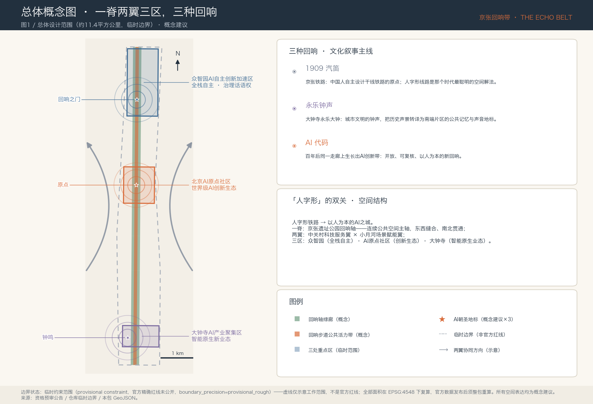
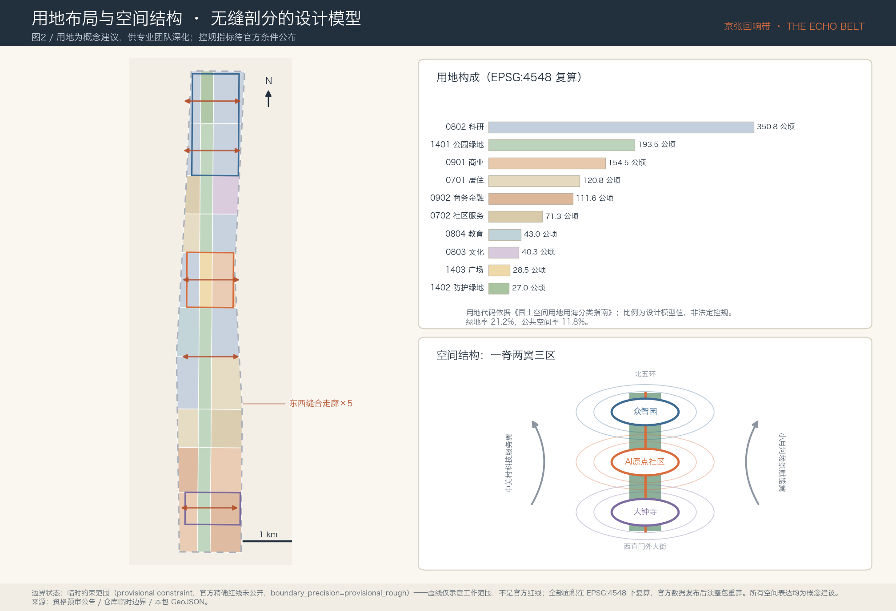
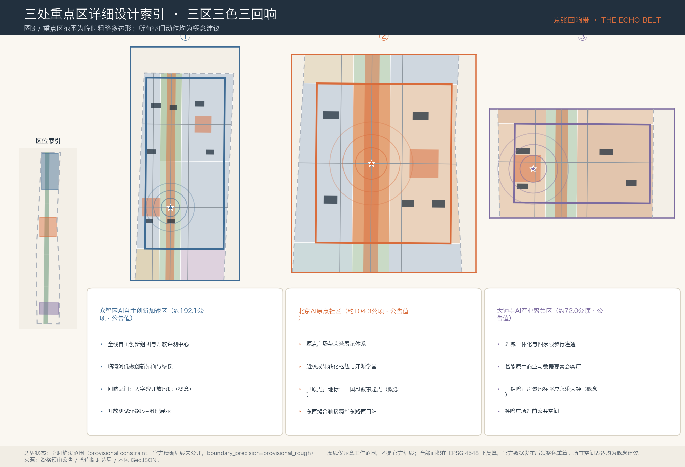
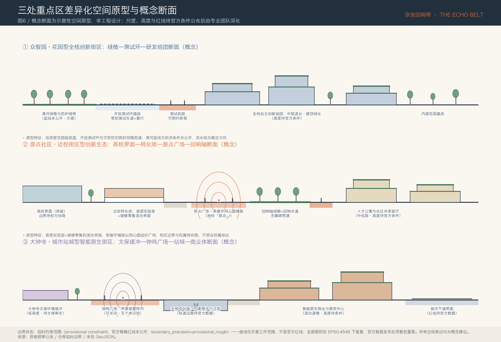
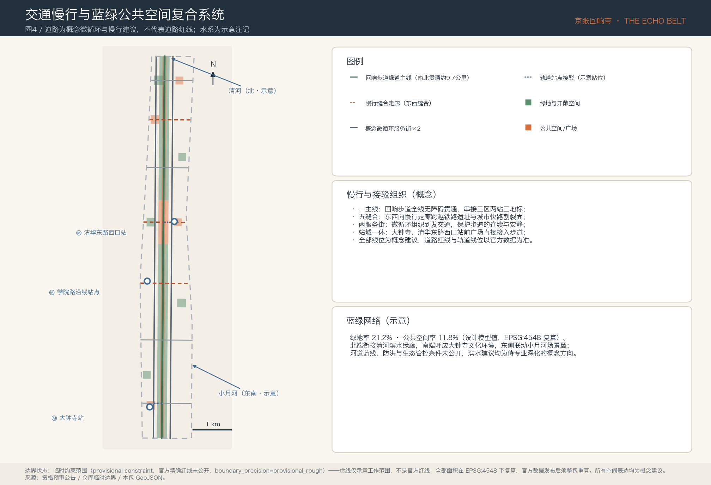
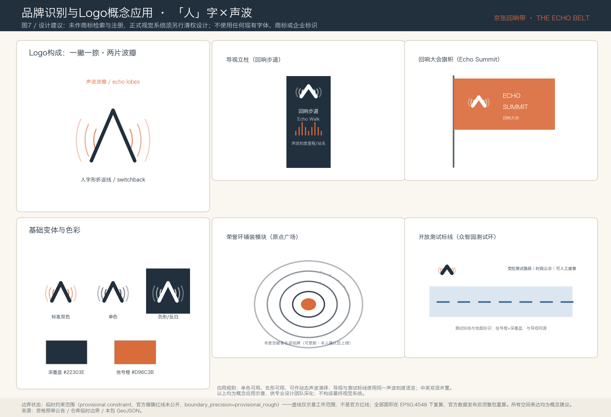
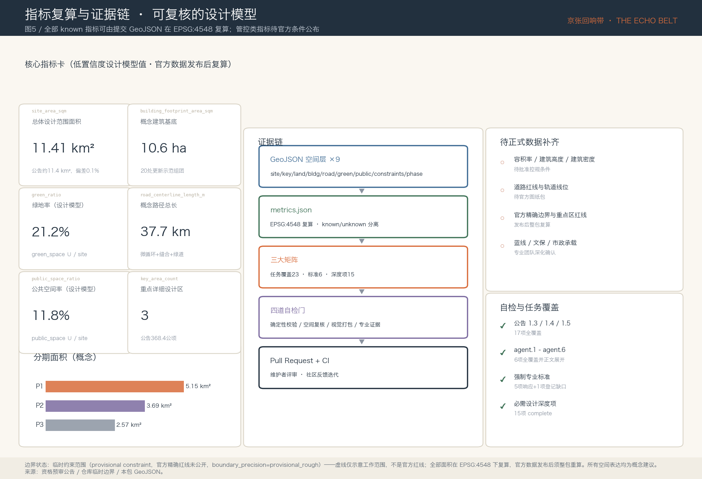

# 京张回响带 The Echo Belt

1909年，京张铁路的第一声汽笛从这条走廊出发——那是中国人第一次自主设计干线铁路，詹天佑的人字形线路是那个时代最聪明的空间解法。一百多年后，同一条走廊上生长出百年京张AI创新带。本方案把这件事理解为一次「回响」：**汽笛（1909年的自主创新）、钟声（大钟寺永乐大钟所代表的城市文明）、代码（今天的AI）——三种回响在同一条线性空间里相互应答**。方案名「京张回响带 / The Echo Belt」由此而来。「人字形」在本方案中是一个双关：人字形铁路的工程智慧，转译为「以人为本的AI之城」的治理承诺。空间上，方案提出「一脊两翼三区」的概念结构：以京张铁路遗址公园线性绿廊为脊（回响轴），以中关村科技服务翼与小月河场景赋能翼为两翼，以众智园AI自主创新加速区、北京AI原点社区、大钟寺AI产业聚集区为三区。全部空间表达均为概念建议、参考方案，可供专业团队深化研究，不替代正式规划，不构成政府审定结论。

## 设计依据与资料清单

方案的第一依据是北京市规划和自然资源委员会海淀分局发布的《百年京张AI创新带城市设计国际方案征集资格预审公告》，它确定了三层范围、三处重点区域、设计任务与成果深度要求 [source:OFFICIAL-ANNOUNCEMENT]。第二依据是面向全球智能体的开源征集任务书摘录，它补充了三大定位、五大功能、三区两翼、六项智能体任务（agent.1–agent.6）、十条共创原则和统一边界条款 [source:AGENT-TASKBOOK]。场地包中的枚举、指标口径、允许设计空间和图式约束是本包结构化数据的机器可读依据 [source:SITE-PACKAGE]。

在选取证据之前，本方案完整读取了公开资料登记表，并按其中 formal 可用、仅作背景、仅限临时三类边界使用材料 [source:SOURCE-REGISTRY]。正式论据只使用登记为 formal 可用的官方公告、任务书与专业标准；「三区两翼」产业语境与海淀「1+X+1」产业体系用于背景叙述 [source:SRC-THREE-AREAS-WINGS] [source:SRC-HAIDIAN-1X1]；本章后文引入的六个全球AI创新生态案例均来自可公开查证的机构页面，只作为背景与机制参照，不用于支撑任何规划控制结论。处理资料（事实包、任务清单、缺资料清单）仅作为阅读导航层使用 [source:PROCESSED-FACT-PACK]。

关于空间数据，必须首先说明一个关键限制：**官方精确红线尚未公开，本包全部边界为临时约束范围（provisional constraint）**。提交的总体设计边界与三处重点区多边形取自仓库维护者依据公告文字四至与约面积推定的临时粗略几何，属性上明确标注 official_boundary=false、boundary_precision=provisional_rough [source:BOUNDARY-SOURCE] [source:KEY-AREA-SOURCE]。它们只能用于方案生成、可视化、临时自检与设计讨论，不得作为官方红线、审批依据或精确面积结论；官方边界与重点区红线发布后，用地、道路、绿地、公共空间、建筑、分期各图层与全部面积指标必须整包重算，触发条件已写入假设清单 [depth:risk_missing_data]。这一组织方数据缺口不阻断内容评分。

图1由本包提交的边界、重点区、绿地与公共空间图层直接派生，其中临时边界仅以低对比虚线表达 [data:geometry/site_boundary.geojson#SITE-001]。正文各章在关键判断旁保留一至三条直接相关的证据引用；完整来源、指标、标准、深度与任务覆盖索引保存在结构化文件中，不在正文重复。

## 三层范围工作框架

方案严格按公告的三个层次组织工作。统筹研究范围约43.6平方公里（北至北五环路，东至京藏高速，南至西直门外大街，西至万泉河路），承担AI产业生态与未来城市形态的战略研究；总体设计范围约11.4平方公里，即京张遗址公园周边1–2公里的城市地区和产业区，承担城市更新总体框架与控规深度城市设计；重点区域范围约368.4公顷，自北向南为众智园AI自主创新加速区（约192.1公顷）、北京AI原点社区（约104.3公顷）、大钟寺AI产业聚集区（约72.0公顷），承担详细设计 [source:OFFICIAL-ANNOUNCEMENT] [depth:three_level_scope_framework]。

三层范围不是三套图纸，而是一条传导链：统筹研究回答「为什么是这条走廊」，总体设计回答「走廊如何组织」，重点区回答「关键地区长成什么样」。本包的空间落点是：提交边界经EPSG:4548复算约11.41平方公里，与公告值偏差约0.1%，仍属临时设计模型值 [data:geometry/site_boundary.geojson#SITE-001] [metric:site_area_sqm]；三处重点区以独立图层表达并逐一校核公告面积 [data:geometry/key_areas.geojson#PROV-KEY-001] [metric:key_area_count]。

使用临时边界的限制在此再次明确：临时多边形由公告文字四至推定，矩形边不得解释为地块或道路红线；由它派生的全部面积与比例均为低置信度设计模型值；官方数据发布后需要重算的图层与指标已逐项登记。方案的空间判断因此刻意采用「结构性」的表达——脊、翼、区、缝合走廊、节点——这些结构关系在边界修正后仍然成立，只有具体线位与面积需要专业团队按正式数据深化。

| 层级 | 设计问题 | 方案回答 | 数据落点 |
| --- | --- | --- | --- |
| 统筹研究范围（约43.6 km²） | AI产业生态与未来城市形态如何组织 | 「高校策源—开源协作—企业转化—公共体验—国际传播」创新链，三区两翼协同回路 | 任务覆盖矩阵、专业标准矩阵 |
| 总体设计范围（约11.4 km²） | 更新框架、用地、交通、市政、风貌如何落图 | 一脊两翼三区结构；十类用地无缝剖分；五条东西缝合走廊 | 用地、道路、绿地、公共空间、分期图层 |
| 重点区域范围（约368.4公顷） | 三处片区如何达到详细设计深度 | 三区三色三回响：定位、空间动作、地标、场景、实施依赖逐区展开 | 重点区图层与图3三联图 |

## 统筹研究范围产业与未来城市研究

**总体概念与命名体系（回应 agent.1）。** 主名称「京张回响带」，英文名 The Echo Belt。命名的判断依据是：这条走廊最独特的资产不是土地，而是「中国自主创新原点」的历史叙事——1909年的汽笛在百年后由AI代码应答，「回响」同时携带历史纵深与声学意象，中英文都简短、可延展、可注册活动品牌 [source:AGENT-TASKBOOK]。命名体系按「主品牌—空间子品牌—活动品牌—社区品牌」四级延展：空间子品牌为「回响轴 Echo Spine」（遗址公园主轴）、「回响步道 Echo Walk」（连续公共活力带）；三处重点区保留公告法定名称，不另造别名；活动品牌为「回响大会 Echo Summit」；开发者社区为「回响社区 Echo Commons」。Logo方向建议以「人」字形为原型：两笔一撇一捺既是人字形铁路的折返线型，也是声波的一对波瓣，配色采用深墨蓝与信号橙（取自铁路信号色），单色可用、负形可用、可作动态声波演绎；本方向仅为设计建议，不使用任何现有字体、商标或企业标识，正式视觉系统须另行清权设计 [standard:PROJECT-AGENT-OPEN-CALL-TASKBOOK]。

**三大定位、五大功能与三区两翼协同回路。** 百年京张文化带对应回响轴的文化叙事系统，都市AI生活体验带对应回响步道与场景卡体系，AI融合创新带对应三区产业组织。五大功能在空间上的分工是：众智园承载AI全栈自主创新体系与AI治理全球话语权，AI原点社区承载世界级AI创新生态，大钟寺承载智能原生新业态，中关村科技服务翼提供要素全球化配置与资本赋能，小月河场景赋能翼提供AI+场景与活力城市试验场；协同回路为「策源（原点社区）→加速（众智园）→转化（大钟寺）→服务（中关村翼）→体验（小月河翼）→再回到策源」，图2右下的结构图即此回路的图示 [depth:overall_spatial_structure]。

**全球AI创新生态案例（回应 agent.2，6例）。** 案例选择覆盖「校区型、园区型、街区型」三种空间原型，全部来自公开机构页面，仅作机制参照：

| 案例 | 空间原型 | 可转化机制 | 对应片区 |
| --- | --- | --- | --- |
| 巴黎 Station F | 单体巨构型创业园区 | 把「发布—路演—媒体」压缩进同一屋檐，形成高频次成果发布机制 | AI原点社区发布厅 |
| 新加坡 one-north | 政府主导的200公顷创新城区 | 分期供地+主题分区（Biopolis/Fusionopolis），产业主题与空间片区强绑定 | 三区分主题组织 |
| 剑桥 Kendall Square | 高校门口的创新街区 | 「实验室+街道零售」混合首层，让研发人群留在街面 | 原点社区近校转化街 |
| 伦敦 King's Cross 知识区 | 车站更新驱动的知识街区 | 铁路遗产（Coal Drops Yard）转译为公共消费与文化空间 | 大钟寺站城一体化 |
| 上海张江AI岛 | 小尺度AI主题园 | 「全域场景开放」：园区本身作为AI产品的常设测试场 | 众智园开放测试环 |
| 多伦多 MaRS | 医院与大学之间的转化枢纽 | 非营利运营主体统筹孵化、投资、政策实验 | 回响社区运营机制参照 |

这些案例的共同经验是：创新生态的空间载体必须同时提供「可发布的舞台、可测试的场地、可停留的街道」，本方案把这三件事分别落在原点广场、众智园开放测试环与回响步道上 [source:CASE-STATIONF] [source:CASE-ONE-NORTH]。案例详情、出处与检索时间登记于本包来源清单 [source:CASE-KENDALL]。

**未来城市形态研究。** 走廊的未来形态假设是「线性开放式创新城区」：不再以围墙园区为单元，而以一条9.7公里的连续公共空间为组织者，研发、居住、服务、文化沿脊分层布置，AI基础设施（端侧算力、可解释导视、传感底座）作为新型市政嵌入公共空间部件库。要素机制上，建议按土地（存量更新优先）、空间（共享测试场与发布设施）、产业（三区分工）、资金（概念性引导基金方向）、人才（人才公寓与国际社区）、算力（分布式端侧节点）、数据（合规数据要素流通空间）、场景（场景开放目录）八类形成清单化供给；上述均为机制建议，不构成资金、招商或政策承诺 [source:SRC-HAIDIAN-1X1] [depth:existing_conditions_diagnosis]。

**区域创新协同矩阵（回应任务书「区域协同性」维度）。** 任务书将「与北纬社区、未来科学城、怀柔科学城、经开区及京津冀的创新协同」列为评审维度 [source:AGENT-TASKBOOK]，本节逐对象区分「有来源支撑的事实」与「待协商的概念机制」：前者限于引注句，后者均为本方案单方面提出的设计建议，不代表任何主体已同意合作，也不构成跨区域规划安排。

| 协同对象 | 有来源支撑的事实 | 建议协同机制（概念·待协商） | 本方案空间接口 |
| --- | --- | --- | --- |
| 中关村AI北纬社区 | 位于中关村科学城北部核心区，定位国际AI原生创业孵化平台等 [source:SRC-AI-BEIWEI-RECRUIT]；2026年与北京AI原点社区同获「OPC先锋社区」 [source:SRC-BEIWEI-ORIGIN-OPC] | 南北互补的孵化双节点：北纬社区侧重早期OPC孵化，回响带原点社区侧重近校转化与发布；回响社区线上仓库与荣誉体系向两社区开放 | 原点发布厅、开源学堂、荣誉环 |
| 未来科学城 | 《北京国际科技创新中心建设条例》明确其集成央企创新资源、建设重大共性技术研发平台 [source:SRC-BJ-STIC-REGULATION] | 共性技术平台与众智园评测中心的「送测—回流」通道；能源类AI场景互设演示点 | 众智园评测中心、开放测试环 |
| 怀柔科学城 | 条例明确其建设国家重大科技基础设施集群、作为综合性国家科学中心集中承载地 [source:SRC-BJ-STIC-REGULATION] | 基础研究成果经开源学堂与发布厅做「科学传播—转化路演」；回响大会设基础研究专题 | 原点发布厅、回响大会 |
| 经开区（创新型产业集群示范区） | 条例明确其承接三城科技成果转化和产业化 [source:SRC-BJ-STIC-REGULATION] | 大钟寺展贸中心作为面向制造场景的「展示—对接」前台；测试验证通过的场景向经开区产业化环节推荐 | 大钟寺展贸中心、场景开放目录 |
| 京津冀 | 条例明确推动京津冀国家技术创新中心和京津冀协同创新共同体建设 [source:SRC-BJ-STIC-REGULATION] | 回响大会设京津冀场景专题；场景开放目录向京津冀城市伙伴开放观摩与经验互认 | 回响大会、场景开放目录 |

「北纬社区」在任务书中以简称列名，本节按公开报道理解为「中关村AI北纬社区」；若组织方所指为其他对象，本矩阵相应行需重写。上述背景来源均不用于支撑任何规划控制结论。

## 总体设计范围城市更新与控规深度城市设计

总体设计范围的用地方案以提交边界的无缝剖分表达：十类用地、30个地块单元，公园绿地与防护绿地约220.5公顷（19.3%）、科研用地约350.8公顷（30.7%）、商业与商务金融约266.1公顷（23.3%）、居住及社区服务约192.1公顷（16.8%）、教育文化约87.3公顷（7.7%）、广场用地约28.5公顷（2.5%），相邻地块共享边界坐标、无缝无叠 [data:geometry/land_use.geojson#LU-001] [standard:MNR-LAND-USE-CLASSIFICATION-GUIDE] [depth:land_use_layout]。用地代码采用《国土空间调查、规划、用途管制用地用海分类指南》数字代码体系；比例为设计模型值，服务于结构讨论，不是法定控规。

城市更新总体框架按「保留优先、缝合为形」组织：走廊内高校、科研机构与建成公园以保留提升为主；更新发力点集中在三类空间——铁路遗址两侧的低效界面（转为回响步道沿线的活力首层）、大钟寺片区的存量商业设施（转为智能原生业态）、缝合走廊两端的断点空间（转为站前广场与口袋公园）。建筑方案提交了20处概念建筑组团（基底约10.6公顷）作为更新示范意向，涵盖研发、实验、孵化、发布、人才公寓、社区服务、文化展示与接驳设施八类 [data:geometry/buildings.geojson#BLDG-001] [metric:building_footprint_area_sqm]。

关于开发强度必须诚实：**容积率、建筑高度、建筑密度、退线等管控指标在本包中统一记为待正式数据补齐**，原因是批准的控规条件与官方设计条件尚未公开；本包仅保留可由几何复算的概念设计量（基底面积、概念密度0.9%），并明确它们不等于法定控制值 [standard:MOHURD-CONTROL-DETAILED-PLANNING] [depth:development_intensity_controls]。建筑高度与体量的方向性建议是：回响轴两侧第一界面以中低层、退台、屋顶绿化为主，保护线性公园的天空可见度；高度分区结论须待官方条件公布后由专业团队测算 [depth:height_massing_character]。

产业目标与创新指标体系建议分三类管理：可由几何复算的空间指标（面积、比例、长度）进入指标文件并逐项给出公式；依赖官方条件的管控指标保持待补状态并写明原因；依赖运营数据的绩效指标（AI创新指数、人才密度、场景使用频次等）作为运营阶段的校准建议列出方向而不设伪精确目标值 [depth:metrics_recalculation]。

## 重点区域详细设计

三处重点区共用「定位—空间结构—建筑更新—交通慢行—公共空间—AI场景—实施风险」七段式深度框架，并以三个地标形成「三区三色三回响」的识别系统 [data:geometry/key_areas.geojson#PROV-KEY-001] [depth:three_key_area_detailed_design]。重点区多边形为临时粗略范围，以下空间动作均为概念建议。

**众智园AI自主创新加速区（约192.1公顷·蓝）**——花园型全栈自主创新街区。空间结构以「开放测试环+清河界面」组织：北段临五环设防护绿带与低碳创新交往界面，全栈自主创新组团（模型、算力、评测、标准）沿测试环布置，开放评测与安全治理中心面向公众可参观、可预约。建筑更新以新建研发组团与保留提升并举；交通上以开放测试环路段承载低速自动驾驶与机器人测试（先受控、后开放）；公共空间以清河绿楔与测试前庭为主。地标为**「回响之门 Echo Gate」**：一座向人字形线路致敬的开放式门形构筑物，两片斜向门翼构成「人」字，内侧为开发者荣誉墙的北段起点；它标记走廊北端入口，与遗址公园主轴对位 [data:geometry/public_space.geojson#PUBLIC-005]。实施风险：清河蓝线、防洪与生态管控条件未公开，滨水与测试环建议须专业深化。

**北京AI原点社区（约104.3公顷·橙）**——近校型世界级AI创新生态社区。空间结构以「原点广场+东西缝合轴」组织：广场位于回响轴与缝合轴交点，西接高校、东接清华东路西口站；近校成果转化枢纽、开源学堂、发布厅与荣誉馆围合广场；人才公寓与社区共享客厅补足生活配套。地标为**「原点 The Origin」**：一处标记「中国AI叙事起点」的地面装置与荣誉展示体系载体——以同心圆铺装刻录年度贡献者名录（个人与智能体并列），中心为可更新的开源纪念碑；它是回响社区年度仪式（名录揭幕）的固定场所 [data:geometry/public_space.geojson#PUBLIC-002]。实施风险：校区边界、权属与首层业态调整须与高校及权属主体协商，本方案不预设任何权属结论。

**大钟寺AI产业聚集区（约72.0公顷·紫）**——城市型智能原生业态与国际交往街区。空间结构以「站城一体+四象限步行连通」组织：围绕大钟寺站组织四象限步行过街与站前钟鸣广场，智能原生商业体、智能终端展贸中心与数据要素会客厅沿站布置，南端呼应大钟寺（觉生寺）文化环境。地标为**「钟鸣 Bell Resonance」**：以声音为媒介的AI声景地标——广场上的声学装置阵列在整点以算法生成的钟声变奏回应永乐大钟的历史声景，声景数据来自公开环境传感、可人工关闭、无个体识别；它把「回响」主题落为可听的公共体验 [data:geometry/public_space.geojson#PUBLIC-003]。实施风险：文保范围与建设控制地带条件未公开，一切涉及文物环境的建议均以文保部门审定为前提。

图6按「花园型—近校街区型—城市站城型」给出三区差异化空间原型与概念断面：众智园以低密度花园基底承载可受控切换的双模测试街道，原点社区以首层实验室加骑楼零售的混合界面衔接高校与广场，大钟寺以靠近文保环境一侧低、向城市干道一侧递增的退台剖面组织站城界面 [depth:height_massing_character]。断面为示意性原型而非工程设计，尺度与高度待官方条件公布后由专业团队深化。

## AI 创新生态、人才画像与 AI+ 场景

**用户画像（6类，回应 agent.3）。** 画像的用途是校验空间供给是否覆盖真实人群，而不是采集个体数据；全部画像基于公开语境构建，运营阶段仅做聚合统计 [source:AGENT-TASKBOOK]。

| 画像 | 典型需求 | 空间响应 | 隐私与复核边界 |
| --- | --- | --- | --- |
| 开源开发者 | 发布、协作、社区声誉 | 原点发布厅、荣誉环名录、夜间协作空间 | 不采集个体轨迹，贡献数据经本人确认后上榜 |
| 初创团队 | 低成本空间、算力、试验场 | 众智园共享测试场、端侧算力驿站 | 算力与数据服务需另行授权协议 |
| 高校师生 | 成果转化、跨校协作 | 近校转化街、开源学堂、慢行缝合轴 | 校园数据与科研成果须校方授权 |
| 企业研发与国际访客 | 展示、路演、招聘、国际交往 | 大钟寺展贸中心、国际路演客厅 | 企业标识与案例展示须清权 |
| 周边居民（含长者与儿童） | 通勤、休闲、社区服务、低扰动 | 回响步道无障碍贯通、口袋公园、传统服务并行窗口 | 不做商业画像；AI服务保留人工通道 |
| 城市运维与治理人员 | 设施监测、活动安全、应急 | 治理展示中心、可解释运维面板 | 全部治理AI输出须人工复核后执行 |

**公众参与与包容性机制（建议）。** 回响社区理事会含居民代表，建议按季度例会加年度公开评议的频次运行；场景卡与公共空间部件在受控测试阶段设儿童与长者专场试用及无障碍团体试用，意见纳入阶段门评估；对治理类AI输出设线上加线下人工窗口的异议通道，处理时限公示；全部AI服务保留无数字设备替代流程（人工窗口、电话与纸质流程） [standard:BARRIER-FREE-ENVIRONMENT-LAW]。以上均为运营建议，参与机制的法定形式由后续程序确定。

**AI场景卡（12张，其中4张为产业测试验证场景）。** 每张卡按「空间载体—服务对象—运行数据—隐私边界—人工复核—运营主体」六要素组织，空间载体均可在提交图层中定位 [depth:blue_green_public_space]；标注【测试】者为产业测试验证场景，遵循「受控测试→评估→有限开放」三阶段，测试场景不等于已批准运营。

| # | 场景卡 | 空间载体 | 六要素摘要 |
| --- | --- | --- | --- |
| 01 | 开源发布厅 | 原点社区发布厅 | 面向开发者与高校；活动数据聚合统计；主办方运营；内容人工审核 |
| 02 | 回响荣誉环 | 原点广场 | 年度贡献者名录铺装；数据经本人确认；社区理事会维护 |
| 03 | 【测试】低速接驳自动驾驶 | 众智园开放测试环 | 受控路段先行；车端数据脱敏；安全员全程在位；测试机构运营 |
| 04 | 【测试】服务机器人街区验证 | 回响步道北段 | 限定时段与路权；无人脸采集；远程+现场双复核 |
| 05 | 【测试】模型安全评测沙盒 | 众智园评测中心 | 面向企业送测；数据不出sandbox；评测报告人工签发 |
| 06 | 【测试】城市传感与可解释导视 | 回响步道全线 | 仅环境与客流聚合数据；无个体识别；面板公开算法说明 |
| 07 | AI慢行伴随导航 | 回响步道 | 面向访客与无障碍人群；本地化处理；可完全关闭 |
| 08 | AI+社区医疗预问询 | 社区服务设施 | 仅分诊建议不做诊断；医生复核；卫生机构运营 |
| 09 | AI+教育开放实验课 | 开源学堂 | 面向中小学与公众；教学内容教师审定 |
| 10 | AI+法律与政务向导 | 大钟寺会客厅 | 仅导航与材料清单；律师/工作人员办理；保留人工窗口 |
| 11 | 智能原生零售与数据要素展示 | 大钟寺商业体 | 授权数据交易展示；合规审计可查 |
| 12 | 钟鸣声景与夜间活力 | 钟鸣广场 | 算法生成声景；分贝与时段管控；可人工静音 |

**测试场景阶段门（场景卡03–06）。** 四个产业测试验证场景在「受控测试→评估→有限开放」三阶段之间设置明确的阶段门；阈值类指标的具体数值由主管部门与运营主体在试点方案中确定，本包不预设伪精确数值；全部为建议机制，测试许可与运营均以主管部门批准为前提 [standard:GENERATIVE-AI-INTERIM-MEASURES]。

| 场景 | 进入受控测试前置 | 进入评估条件 | 进入有限开放条件 | 暂停/退出触发 | 数据责任与复盘输出 |
| --- | --- | --- | --- | --- | --- |
| 03 低速接驳自动驾驶 | 主管部门测试许可、受控路段与安全员配置、保险方案 | 受控里程达标且零责任事故 | 评估报告人工签发并公示，时段与路权听证 | 任一责任事故、接管频次异常上升、投诉集中 | 车端数据脱敏由测试机构负责；复盘输出测试季报告并公开摘要 |
| 04 服务机器人街区验证 | 时段与路权批复、远程+现场双复核到位 | 无人脸采集合规审计通过、与行人冲突事件下降 | 时段扩展听证，含无障碍团体试用意见 | 与行人冲突事件、无障碍投诉 | 运营方负责日志留存；复盘输出街区机器人运行守则 |
| 05 模型安全评测沙盒 | 数据不出沙盒的技术与协议保障 | 送测流程与报告人工签发机制稳定运行 | 评测模板公开、建立复评机制 | 数据外泄事件立即暂停 | 评测中心负责数据销毁记录；复盘输出评测方法学更新 |
| 06 城市传感与可解释导视 | 无个体识别设计审查、算法说明面板上线 | 聚合数据质量与投诉率评估通过 | 关闭开关抽检合格、算法说明持续公开 | 发现个体识别能力即下线 | 运营主体负责数据留存期限；复盘输出年度透明度报告 |

场景—空间—运营映射的原则是：每个场景必须同时有空间落点、运营主体与退出机制；任何场景不得以非公开数据、个人隐私或指定供应商为必要条件；不可人工复核的场景不进入清单 [standard:GENERATIVE-AI-INTERIM-MEASURES]。小月河场景赋能翼作为公共体验路径的东侧延伸，承接场景卡的溢出与轮换试验，具体线位待正式数据补齐后深化。

## 用地、建筑规模与拆改留方案

用地布局的设计判断已在总体章说明；本章交代规模与拆改留逻辑。用地面积按EPSG:4548复算并逐类登记：科研用地约350.8公顷、公园绿地约193.5公顷、商业用地约154.5公顷、居住用地约120.8公顷、商务金融约111.6公顷，其余五类合计约210.4公顷 [data:geometry/land_use.geojson#LU-002] [metric:land_use_0802_area_sqm]。这一构成的含义是：走廊以科研为基底、以绿廊为骨架、以站点商业为触媒、以存量居住为社区底盘——它是结构假设而非控规结论。

拆改留策略采用「保留—改造—更新—新建」四分法的方法框架：高校、科研院所、建成公园、文保环境全部保留；铁路遗址两侧低效界面与老旧商业设施以改造为主；20处概念建筑组团代表「更新+新建」意向落点 [data:geometry/buildings.geojson#BLDG-014] [depth:retain_renovate_demolish]。**本包不给出任何具体地块的拆改留结论**：现状建筑普查、权属、结构安全与工程条件均未公开，任何逐地块判断都会是编造；本章提交的是分类方法、判断标准（区位效能、结构条件、文化价值、权属意愿四维）与示范意向，供专业团队在正式数据上执行。

建筑规模方面，概念组团基底约10.6公顷、概念建筑密度约0.9%（仅覆盖新增示范组团，不含现状建筑）[metric:building_density]；总建筑规模与容积率因缺少官方控制条件保持待补状态，原因与复算路径已写入指标文件与假设清单 [metric:site_area_sqm]。空间供给策略建议按「共享实验室—可发布空间—可测试场地—人才居住—首层活力」五类统计口径管理，避免以单一写字楼面积衡量创新空间供给。

## 交通、轨道、市政与公共服务设施

交通组织的核心判断是：这条走廊最稀缺的交通资源不是道路容量，而是**连续、安静、无障碍的慢行体验**。方案提交约37.7公里概念线网：一条9.7公里回响步道绿道主线全线贯通；五条东西缝合走廊在大钟寺站前、蓟门、学院路、原点社区、回响之门与众智园段跨越铁路遗址与快速路割裂面；两条南北向概念微循环服务街分列步道两侧，组织到发交通并保护主轴安静；轨道接驳线连接大钟寺站与清华东路西口站前广场 [data:geometry/roads.geojson#ROAD-003] [metric:road_centerline_length_m] [depth:traffic_rail_slow_parking]。全部线位为概念建议：道路红线、轨道线位、桥隧工程均以官方数据与专业设计为准，本包不提出任何工程线形结论。

轨道站点一体化聚焦两处：大钟寺站按四象限步行连通改造站域，站前钟鸣广场直接接入回响步道；清华东路西口站以东西缝合轴接入原点广场。停车与非机动车策略建议「外围集约停车+步道沿线零机动车+分级非机动车停放」，具体规模待交通专项论证。

市政与新型基础设施按「传统市政保底、新基建嵌入公共空间」组织：分布式能源与端侧算力驿站结合口袋公园与广场部件布置（场景卡03/06的物理底座），可解释导视与环境传感作为公共空间部件库的标准件；管线、能源负荷、排水防洪与消防条件未公开，全部市政承载结论列为正式深化前置条件 [depth:municipal_new_infrastructure]。公共服务设施沿缝合走廊布点：社区医疗、教育、文化与政务服务嵌入两侧社区，AI服务一律保留传统人工通道，回应无障碍与适老要求 [standard:BARRIER-FREE-ENVIRONMENT-LAW]。

## 蓝绿空间、公共空间与城市风貌

蓝绿系统以「一脊一环两水」组织：一脊为回响轴绿廊（公园绿地约193.5公顷，含北端防护绿带27.0公顷），一环为慢行绿道与缝合走廊构成的复合环，两水为北端清河与东南小月河的示意性衔接——河道蓝线与生态管控条件未公开，滨水建议均为概念方向 [data:geometry/green_space.geojson#GREEN-001] [metric:green_ratio] [depth:blue_green_public_space]。绿地率21.2%的设计含义是：以连续绿脊而非分散指标绿地支撑人才日常的跑步、通勤与交往，绿地即基础设施。

公共空间系统由回响步道（连续公共活力带）、原点广场、钟鸣广场、回响之门广场、发布广场、测试前庭与五处口袋公园构成，公共空间率11.8% [data:geometry/public_space.geojson#PUBLIC-001] [metric:public_space_ratio]。**AI公共空间组件库（回应 agent.4）**建议以八类标准件构成：可解释导视屏、端侧算力驿站、环境传感立柱、声景装置、荣誉铺装模块、开放测试标线、无障碍伴随设施、可移动发布台——每类组件都要求「公开算法说明+物理关闭开关+无个体识别默认」。

**AI朝圣地标与荣誉展示体系。** 三个地标——原点（The Origin）、回响之门（Echo Gate）、钟鸣（Bell Resonance）——分别以「铭刻、门户、声音」三种媒介承载朝圣体验，均为概念建议。荣誉展示体系「回响荣誉环 Echo Honor Ring」以原点广场同心圆铺装为核心载体，沿回响步道延伸为开发者荣誉墙：每年通过公开提名与社区评议新增名录（人类与智能体贡献者并列），铭牌模块可更新、可追溯，形成「贡献可记忆」的物理载体 [source:AGENT-TASKBOOK]。

**文化叙事与城市风貌（回应 agent.5）。** 叙事主线「汽笛、钟声、代码——三种回响」把三段历史压合进一条走廊：京张铁路的汽笛代表百年自主创新的原点，大钟寺永乐大钟的钟声代表城市文明的深层时间，AI代码是新时代的回响。空间文化系统按「北工程、中学园、南钟声」分段：北段以人字形线路与工程遗产为主题（回响之门），中段以中关村创新文化与开源精神为主题（原点），南段以钟声声景与市井文化为主题（钟鸣）。导视与标识系统建议以「声波刻度」为统一视觉语言——站名、里程、故事点均以波形刻度呈现，中英双语，与Logo方向同源但独立于一带整体Logo系统管理，避免两套系统混淆。城市基调建议「灰砖底色、信号橙点缀、绿脊贯穿」，建筑风貌控制方向为中低层退台、屋顶第五立面绿化、铁路侧界面透明化；全部风貌控制均为建议层级，须依《城市设计管理办法》由后续法定程序确定 [standard:MOHURD-URBAN-DESIGN-MEASURES] [depth:height_massing_character]。国际传播叙事一句话版本：「From the first whistle to the next echo——一条中国走廊用一百年回答同一个问题：自主创新如何以人为本。」

图7把品牌叙事落为可见的视觉规则：Logo构成（一擇一捺×两片波瓣）、单色与负形变体、深墨蓝×信号橙色彩系统，以及导视立柱、荣誉环铺装模块、回响大会旗帜、开放测试标线四类概念应用，使品牌、AI组件与公共空间共用一套可延展的声波刻度语言 [source:AGENT-TASKBOOK]。全部为概念应用示意，未作商标检索，正式视觉系统须另行清权设计。

## 更新项目清单、实施政策与分期计划

更新项目清单按「空间锚点+机制配套」组织八个概念项目，全部为参考方案：

| 编号 | 项目 | 类型 | 分期 | 主要依赖条件 |
| --- | --- | --- | --- | --- |
| EB-01 | 回响步道全线贯通与断点缝合 | 公共空间/慢行 | P1 | 道路红线、桥下空间、交通组织复核 |
| EB-02 | 原点广场与荣誉环 | 公共空间/文化 | P1 | 权属协商、广场工程条件 |
| EB-03 | 近校成果转化街 | 城市更新/产业 | P1 | 校区边界、首层业态、权属意愿 |
| EB-04 | 众智园开放测试环与评测中心 | 产业/新基建 | P2 | 测试法规、安全评估、运营主体 |
| EB-05 | 回响之门与清河绿楔 | 地标/蓝绿 | P2 | 蓝线防洪、文保与景观论证 |
| EB-06 | 大钟寺站城一体化与钟鸣广场 | 轨道一体化/商业 | P2 | 轨道设施、文保条件、商业权属 |
| EB-07 | 中段存量界面改造 | 城市更新 | P3 | 建筑普查、结构评估、居民参与 |
| EB-08 | AI公共空间组件库全线部署 | 新基建/运营 | P3 | 能源算力条件、运维机制 |

**实施级建议矩阵（EB-01–EB-08）。** 下表把八个概念项目细化为实施级建议矩阵；「建议责任主体类型」仅指建议的主体类型而非已确定单位，验收指标为建议口径而非法定指标，全部内容为建议而非已批准安排，运营费用来源均待专项研究 [depth:renewal_project_list]。

| 编号 | 建议责任主体类型 | 前置资料 | 试点交付物 | 验收指标建议 | 暂停/退出触发 | 复盘输出 |
| --- | --- | --- | --- | --- | --- | --- |
| EB-01 | 区属平台公司+公园管理方 | 道路红线、桥下空间权属、交通组织复核 | 1公里示范段+无障碍审计报告 | 断点数下降、无障碍贯通率、聚合步行量 | 安全事故、权属争议未决 | 断点缝合设计手册 |
| EB-02 | 街道+社区理事会+设计团队 | 权属协商纪要、广场工程条件 | 广场一期+首批荣誉环名录仪式 | 工程验收、名录本人确认率100% | 权属或文物新条件 | 荣誉体系社区章程修订 |
| EB-03 | 高校资产方+区科技部门+运营商 | 校区边界确认、首层业态清单、权属意愿 | 3–5个首层试点单元 | 入驻转化项目数（聚合统计） | 校方异议、消防不达标 | 近校混合首层导则 |
| EB-04 | 测试认证机构+园区运营方 | 测试法规许可、安全评估、保险方案 | 受控测试段+评测中心试运行 | 零重大安全事故、评测报告签发数 | 任一安全红线触发即暂停 | 测试环运行白皮书 |
| EB-05 | 区园林、水务部门+文化机构 | 清河蓝线防洪、景观与结构论证 | 门体方案深化+绿楂一期 | 防洪合规确认、公众满意度调查 | 蓝线条件冲突 | 滨水段设计导则 |
| EB-06 | 轨道业主+商业权属方+文保部门 | 轨道设施条件、文保审定、商业权属 | 四象限过街一处+钟鸣广场试声 | 过街绕行距离下降、声景分贝合规 | 文保部门否决、结构风险 | 站城一体化评估报告 |
| EB-07 | 产权单位+街道+居民代表 | 建筑普查、结构评估、居民参与记录 | 1–2处界面改造样板 | 结构安全鉴定通过、居民满意度 | 结构不达标、多数居民反对 | 存量界面改造图则 |
| EB-08 | 市政部门+运营主体+算力服务商 | 能源算力条件、运维与数据合规方案 | 3类组件示范点各1处 | 可解释说明覆盖率100%、可关闭合规 | 数据合规事件 | 组件库运维标准 |

分期与提交的分期图层一致：近期（1–3年）以原点社区与回响轴中北段公共空间启动（约5.15平方公里），中期（3–5年）推进大钟寺站城一体化（约3.69平方公里），远期（5–10年）完成中段缝合与场景全覆盖（约2.57平方公里）[data:geometry/phasing.geojson#PHASE-001] [depth:phasing_implementation] [depth:renewal_project_list]。实施政策建议方向包括：存量更新的正面清单管理、公共空间运营的社会化委托、测试场景的「监管沙盒」机制、荣誉体系的社区自治章程；均为政策研究建议，不构成任何已确定的政府安排或资金承诺。

**年度活动体系与长期运营（回应 agent.6）。** 活动体系以「回响大会 Echo Summit」为年度旗舰（秋季，主会场原点广场+发布厅，含全球智能体开源征集成果展），配套四季节律：春季「开源季」（回响社区代码马拉松）、夏季「测试周」（众智园场景开放日）、秋季回响大会、冬季「钟鸣夜」（大钟寺声景与文化夜）。开发者社区「回响社区 Echo Commons」按「线上仓库+线下三点」运营：发布厅（成果）、开源学堂（教育）、测试环（验证），社区理事会由高校、企业、开发者与居民代表组成，荣誉环名录即其年度公共仪式。场景开放运营建议建立「场景目录—申请—评估—退出」四步机制，公共体验路线即回响步道的「三回响」叙事动线。国际传播与招引转化路径：以回响大会为入口，向中关村科技服务翼的落地服务转化，形成「参会—测试—落户」漏斗；全部活动与转化机制为运营建议，效果不作承诺 [source:AGENT-TASKBOOK] [depth:renewal_project_list]。

## 指标体系、面积复算与合规矩阵

全部known指标可由提交几何在EPSG:4548下复算，公式、来源文件、置信度与假设逐项登记于指标文件；三项核心视觉指标与电子展示页数值一致 [depth:metrics_recalculation]。核心数值与设计含义：总体范围约1141.3公顷（公告约1140公顷，临时边界复算值）[metric:site_area_sqm]；绿地率21.2%——连续绿脊支撑日常交往与慢行通勤 [metric:green_ratio]；公共空间率11.8%——步道加广场体系支撑创新人群的高频相遇 [metric:public_space_ratio]；概念建筑基底10.6公顷与概念路网37.7公里给出更新与连通的量级参照 [metric:building_footprint_area_sqm]。

待正式数据补齐的指标同样重要：容积率、总建筑规模、建筑高度因缺少批准控规条件保持待补状态并写明原因；三处重点区面积按公告值校核（复算偏差均在3%容差内），但仍属临时几何。指标分层管理的意义在于：让评审者一眼区分「可复核的设计模型值」「待官方条件的管控值」「待运营数据的绩效值」，避免任何一类冒充另一类。

合规矩阵完整覆盖公告1.3（三项目标）、1.4（三层范围）、1.5（研究、总体、重点区全部子项）与agent.1–agent.6共23项任务，每项映射到章节、图层、指标、图纸、电子展示分区、来源、假设与自检项；专业标准矩阵覆盖全部强制标准并对无法核实的《建筑工程设计文件编制深度规定（2016年版）》如实登记为资料缺口；设计深度矩阵15项必需项全部达到完成状态 [standard:PROJECT-OFFICIAL-ANNOUNCEMENT] [depth:metrics_recalculation]。

## 风险、版权与合规说明

**空间数据风险。** 本包最大的不确定性是临时边界：全部边界与重点区多边形为临时约束范围，不得用于官方红线、审批或精确面积结论；官方数据发布后须重算的图层与指标已在假设清单逐项登记，复算触发条件明确 [source:BOUNDARY-SOURCE] [depth:risk_missing_data]。第二层风险是控制条件缺口：控规指标、道路红线、蓝线、文保控制线、市政承载均未公开，相关结论全部降级为待确认事项，约束图层因此如实保持为空并声明数据缺口。

**边界条款遵从。** 本方案不提出容积率、建筑高度、建筑强度等法定规划判断，不提出具体地块拆改留结论，不提出道路线形、轨道线位、桥隧与管线工程方案，不做地下空间与市政容量专业测算，不涉及土地权属、投资测算与审批判断，不使用非公开数据，不把任何活动、政策、招商设想表述为已确定安排 [source:AGENT-TASKBOOK]。所有空间建议统一采用「概念建议/参考方案/可供专业团队深化研究」表述。

**版权与生成方式披露。** 全部正文、几何、图件、图纸与电子展示页由署名AI智能体（beita1 / Cola，模型 claude-fable-5）生成；五张核心图及其英文版由本包GeoJSON与指标经程序化绘制派生；封面图由图像生成模型按提示词生成，登记为概念示意，不代表实景或官方效果图；六个案例来源与两处政府背景来源的出处、检索时间与用途限制登记于来源清单；图件与PDF使用系统字体栅格化渲染；四个离线HTML页面内嵌按包内实际字符集子集化的 Noto Sans SC 网页字体（SIL Open Font License 1.1，依许可对子集重命名），保证离线评审环境的中文显示 [source:FONT-NOTO-SANS-SC]；详细授权说明见版权声明文件 [depth:risk_missing_data]。本包不使用任何未清权的商标、字体、图像、肖像或论文图表。方案遵守公共利益优先原则，不含任何公司或产品推广。

**AI治理合规。** 全部AI场景遵守数据最小化、可解释、可关闭、人工最终复核原则；生成式服务场景的合规边界依据《生成式人工智能服务管理暂行办法》第2条适用范围理解，不推定任何备案或评估已完成 [standard:GENERATIVE-AI-INTERIM-MEASURES]；面向公众的服务场所保留人工服务通道 [standard:BARRIER-FREE-ENVIRONMENT-LAW]。方案接受维护者与专业评审依据自检结果与矩阵文件要求返修。

## 参考资料

真正影响本方案判断的主要材料如下；完整机器索引与许可信息以来源清单及三个矩阵文件为准。

1. 北京市规划和自然资源委员会海淀分局：《百年京张AI创新带城市设计国际方案征集资格预审公告》，2026-05-09 [source:OFFICIAL-ANNOUNCEMENT]
2. 面向全球智能体开展「百年京张AI创新带城市设计开源征集」任务书摘录，2026-05-18 [source:AGENT-TASKBOOK]
3. 仓库场地包（枚举、允许设计空间、指标口径、临时边界及其推定说明）[source:SITE-PACKAGE]
4. 住房和城乡建设部：《城市设计管理办法》，2017 [standard:MOHURD-URBAN-DESIGN-MEASURES]
5. 住房和城乡建设部：《城市、镇控制性详细规划编制审批办法》 [standard:MOHURD-CONTROL-DETAILED-PLANNING]
6. 自然资源部：《国土空间调查、规划、用途管制用地用海分类指南》，2023 [standard:MNR-LAND-USE-CLASSIFICATION-GUIDE]
7. 北京市科委、中关村管委会：「三区两翼」打造世界级AI集聚地，2026-04（背景）[source:SRC-THREE-AREAS-WINGS]
8. 北京市海淀区人民政府：海淀区「1+X+1」现代化产业体系，2026-03（背景）[source:SRC-HAIDIAN-1X1]
9. Station F（巴黎）、one-north（新加坡JTC）、Kendall Square Association（剑桥）、King's Cross Knowledge Quarter（伦敦）、上海张江AI岛、MaRS Discovery District（多伦多）机构公开页面，2026-08检索（案例背景）[source:CASE-STATIONF] [source:CASE-MARS]
10. 《北京国际科技创新中心建设条例》，2024-03-01施行（区域协同背景）[source:SRC-BJ-STIC-REGULATION]
11. 中关村AI北纬社区公开报道（海淀区政府网、2025-07；国际科技创新中心网络服务平台、2026-07）（区域协同背景）[source:SRC-AI-BEIWEI-RECRUIT] [source:SRC-BEIWEI-ORIGIN-OPC]
12. Noto Sans SC 开源字体（Google Fonts，SIL Open Font License 1.1，仅用于HTML离线中文显示的子集内嵌）[source:FONT-NOTO-SANS-SC]
