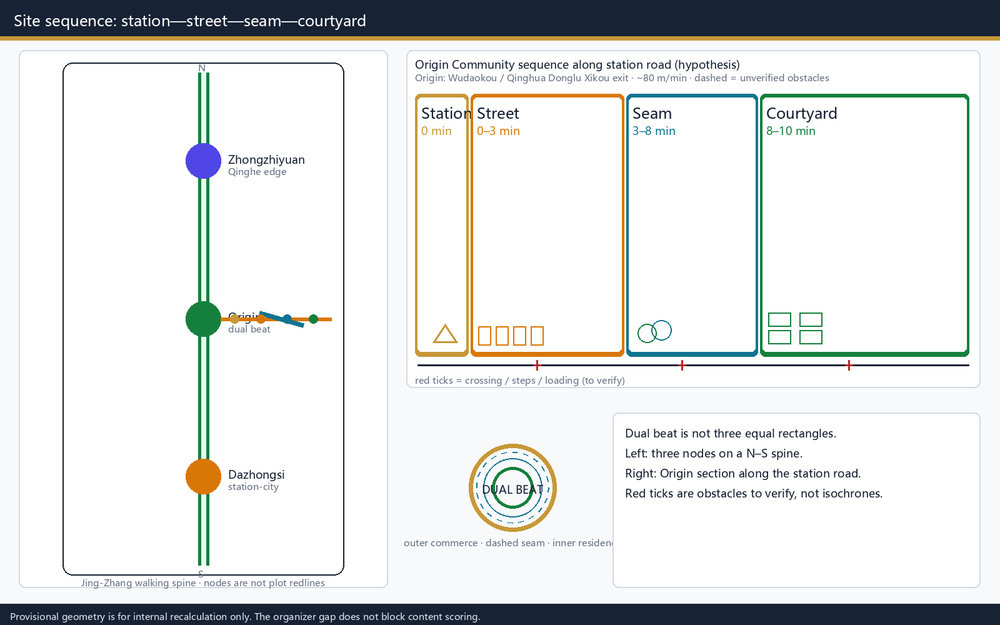
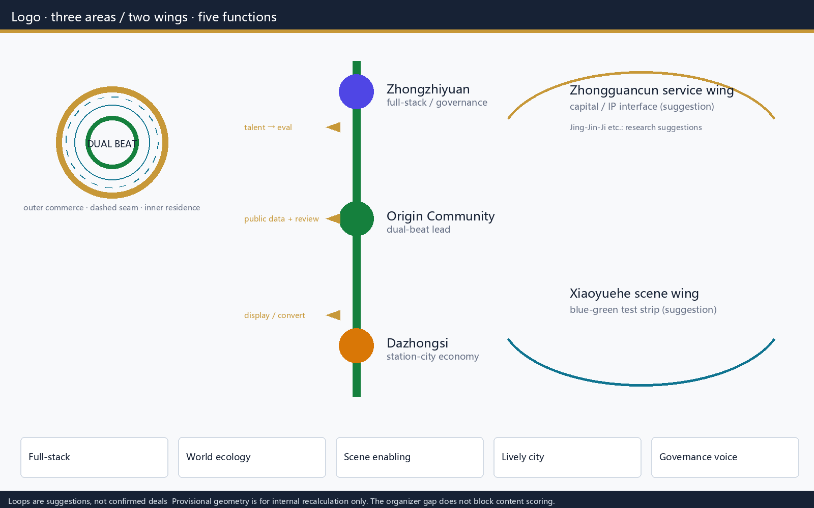
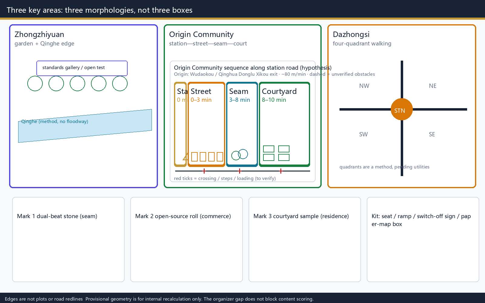
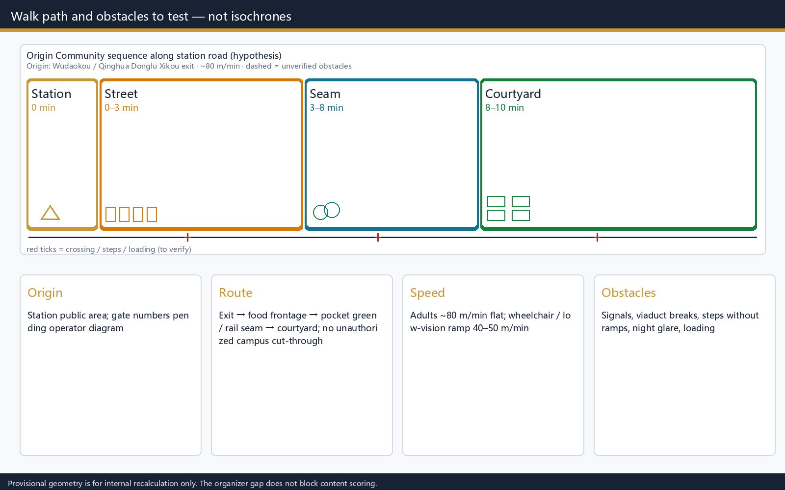
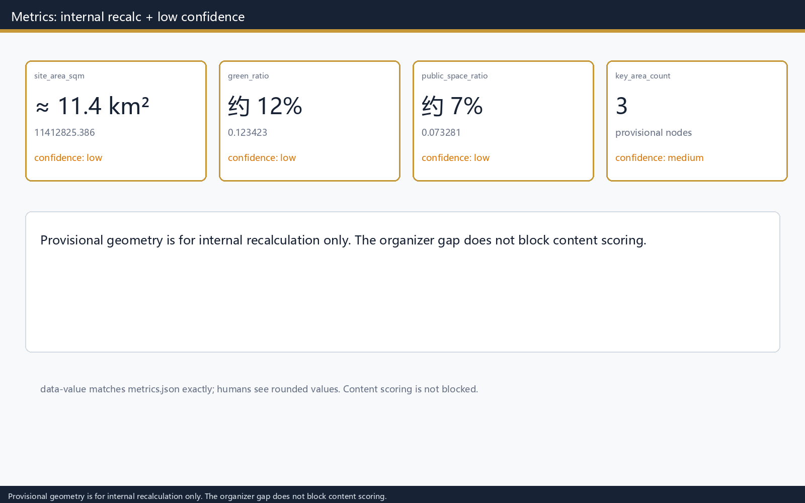

# ORIGIN DUAL BEAT: Commerce Beat Near Stations, Residence Beat Inward

> Participant observation (binawoh): Wudaokou feels “messy, crowded, more like student territory.” This package does not treat that as a stain to erase. It treats it as the starting point for Origin Community: keep a commerce beat at the station, then walk inward to a residence beat. Walk-minute rings are testable hypotheses, not verified isochrones.

## Design Basis and Source List

The first authority is the Haidian Branch of Beijing Municipal Commission of Planning and Natural Resources prequalification announcement for the Centennial Jing-Zhang AI Innovation Belt [source:OFFICIAL-ANNOUNCEMENT]. Machine-readable tasks come from the site package and the agent taskbook [source:AGENT-TASKBOOK]. Public-source usability follows the registry; background or provisional-only material is not promoted into an official redline [source:SOURCE-REGISTRY].

Current `geometry/site_boundary.geojson` and the three key areas are provisional (`official_boundary=false`) [data:geometry/site_boundary.geojson#SITE-001]. Area numbers are an internal recalculation of that polygon in EPSG:4548, on the order of the announced 11.4 km², with **low** confidence. When official polygons arrive, the whole stack must be recalculated. Missing organizer polygons **do not block content scoring** [metric:site_area_sqm].

## Three-Level Scope Framework

The coordinated research area (~43.6 km²) answers industry loops. The overall design area (provisional geometry ~11.4 km²) answers renewal structure, walking, and character. The key areas (three provisional patches) test detailed actions [depth:three_level_scope_framework].

Dual beat is not a new redline. It translates the announced three areas and two wings into walkable distance layers: near-station commerce, a transition seam, and inward residence. Zhongzhiyuan, Origin Community, and Dazhongsi sit north to south on the Jing-Zhang walking spine. The Zhongguancun tech-service wing and Xiaoyuehe scene-enabling wing are conceptual loops, not confirmed administrative deals [standard:PROJECT-OFFICIAL-ANNOUNCEMENT].

## Brand, Logo, and Three-Area Two-Wing Structure

**Name:** ORIGIN DUAL BEAT. **Subtitle:** commerce beat near stations, residence beat inward. **Logo:** a warm outer ring (commerce), a cool-green inner ring (residence), and a dashed seam between them. The mark in this package is a concept identifier, not a registered trademark [source:AGENT-TASKBOOK].

Three identities: Jing-Zhang cultural belt (heritage-park walking spine); urban AI living-experience belt (Origin Community dual beat); AI fusion-innovation belt (Zhongzhiyuan governance display + Dazhongsi intelligent-economy display). Five functions mapped to space: full-stack autonomy (Zhongzhiyuan); world-class ecology (Origin Community); scene enabling (Xiaoyuehe wing, conceptual); lively city (low-disturbance residence beat); governance voice (Zhongzhiyuan standards display, a suggestion).

Coordination loop (suggestion, not confirmed by counterparties): Origin Community sends near-campus open source and people who stay; Zhongzhiyuan returns evaluation and standard interfaces; Dazhongsi hosts conversion display and station-city edges; the Zhongguancun wing is hypothesized as capital/IP service; the Xiaoyuehe wing is hypothesized as a blue-green test strip. Links to Beiwei Community, Future Science City, Huairou, the Economic-Technological Development Area, and Jing-Jin-Ji are **research suggestions** for knowledge, talent, and compute — not implementation promises.

## Coordinated Research Area: Industry and Future City Research

The coordinated layer does not invent fake-precise redlines. It strings university origins, open-source collaboration, firm conversion, and public experience into an auditable chain, and it labels which items are announcement tasks versus this package’s suggestions [source:AGENT-TASKBOOK]. Jing-Zhang Heritage Park is a public seam, not a science-park facade. Wudaokou-type stations are commerce-beat nodes: busy, student-led, high turnover. Turning them into quiet campus gates would fight the field observation and push “long stay” farther away.

Future urban form answers how work and living share one corridor: the outer ring hosts publishing, meeting, and short stays; the inner ring hosts living, care, and opt-out digital services. Industry KPIs, talent density, and compute capacity stay unknown without official statistics; only spatial method is claimed [standard:PROJECT-AGENT-OPEN-CALL-TASKBOOK].

Four ecosystem chains (concept; missing numbers stay unknown): **talent** stays in Origin Community, is evaluated at Zhongzhiyuan, and is shown at Dazhongsi; **data** is limited to public data and de-identified patrols — campus and household data stay out; **capital** is a research interface via the Zhongguancun wing, with no fund or tax promise in this package; **compute** is a location principle for edge nodes, with no live users. Global events, developer community, and pilgrimage routes are conceptual suggestions for later professional work, not settled government programs.

## Overall Design Area: Urban Renewal and Regulatory-Plan-Level Urban Design

Overall design organizes land use, building footprints, micro-circulation, and blue-green space at regulatory-plan urban-design depth, while FAR, height, and road redlines stay unknown until official controls exist [standard:MOHURD-CONTROL-DETAILED-PLANNING]. Inside Origin Community (provisional patch PROV-KEY-002) dual beat is written as **station — street — green seam — courtyard**, not three equal rectangles. Walk times are **hypotheses to test**, not isochrones.

Parameters that must be rewritten after a site walk (not treated as measured):

- **Origin:** public area at Wudaokou / Qinghua Donglu Xikou station exits (gate numbers pending the operator diagram).
- **Speed:** about 80 m/min for adults on the flat; 40–50 m/min on a continuous ramp for wheelchair users and people with low vision.
- **Hypothesized path:** exit → food frontage → pocket green / rail-side seam → courtyard gate inland or east; do not cut through unauthorized campus gates.
- **Known obstacles (to verify):** crossing signals, rail or viaduct breaks, steps without ramps, night glare, loading occupying the walk. Not validated on a full walk network.

| Layer | Walk hypothesis | Lead form | Spatial action |
| --- | --- | --- | --- |
| Outer commerce beat | 0–3 minutes from exit | Station square + continuous ground-floor shops | Open ground floor; courtyards not on the same frontage |
| Transition seam | 3–8 minutes | Pocket green / rail-side belt | Catch overflow; mark “entering residence beat” |
| Inner residence beat | 8–10 minutes | Courtyard gate and community desk | Low-disturbance repair; AI services are opt-out |

Land-use polygons cover the submitted boundary without overlap [data:geometry/land_use.geojson#LU-001]. Building footprints are discussion placeholders, not a demolition list [data:geometry/buildings.geojson#BLDG-001]. FAR, height, and density stay unknown pending a formal regulatory plan [depth:land_use_layout].

## Detailed Design of Key Areas

All three key areas are provisional rectangles. Their edges are not plots or road redlines [data:geometry/key_areas.geojson#PROV-KEY-001].

| Patch | Role | Detailed action (concept) | AI and operations |
| --- | --- | --- | --- |
| Zhongzhiyuan | Garden-type full-stack and governance display | Qinghe edge as open test and standards gallery; external traffic discussed only as interchange method | Evaluation booking and safety display, human review |
| Origin Community | Near-campus conversion + dual-beat living | Station street, green seam, inner courtyard; no named demolition at Wudaokou | Public wayfinding outside; repair inside, with opt-out |
| Dazhongsi | Station-city intelligent-economy display | Four-quadrant walking as method, pending junction and utility data | Pitch parlor; firm marks need clearance |

Retain / renovate / demolish: without tenure and survey, only the method is given — open the outer frontage, repair inner courtyards — not building-by-building verdicts [depth:three_key_area_detailed_design].

## AI Innovation Ecosystem, Personas, and AI+ Scenarios

Ecosystem map (concept): land and space follow announced roles across the three areas; people stay in Origin Community, are evaluated at Zhongzhiyuan, and are shown at Dazhongsi; compute and data are not assumed authorized — only public data plus human review; money links to the Zhongguancun wing stay “to be researched” [source:AGENT-TASKBOOK].

Five cases are mechanism comparisons only and **must not be copied**. Sources are registered:

| Case | Verifiable source | Comparison | Fit condition | Do not copy |
| --- | --- | --- | --- | --- |
| Kendall Square, Cambridge | [source:CASE-KENDALL] | Near-campus conversion parlor | Dense universities, published zoning | Land price, visas, Boston housing |
| King's Cross, London | [source:CASE-KINGS-CROSS] | Rail heritage and crowd layering | Large station, long-term owner | Property and heritage law |
| Tsukuba city center | [source:CASE-TSUKUBA] | Research-city daily life | National labs clustered | Student/commute mix unlike Wudaokou |
| Nanshan, Shenzhen | [source:CASE-NANSHAN] | Industry street vs living setback | Dense industry district | Renewal powers unlike Haidian |
| one-north, Singapore | [source:CASE-ONENORTH] | Walking seams between clusters | Statutory plan with industry land | State land system |

If a comparison goes beyond what the source page states, it drops to a research hypothesis, not a local fact. Full persona and scenario tables sit in the next chapter. The lock here: outer ring can display; inner ring can opt out; every public service keeps a human and paper fallback [depth:overall_spatial_structure].

## User Personas, Scenario Cards, and Industry Tests

The persona table is completed to six groups. Each row covers accessibility, digital ability, non-digital fallback, and interest risk.

| Persona | Need | Dual-beat response | Access / digital | Non-digital fallback | Interest risk |
| --- | --- | --- | --- | --- | --- |
| University students and staff | Conversion meetings, daily walking | Outer parlor; inner living return | Bilingual signs; mid-high digital | Paper times and human desk | Campus data stays out of models |
| Early teams | Cheap display, evaluation door | Outer pitch; evaluation at Zhongzhiyuan | Booking to avoid sudden crowds | Numbered tickets and duty staff | Compute rights separate |
| Nearby residents | Low disturbance, commute seam | Residence set back; night bright-out/dark-in | Spoken notice; mixed digital | Neighborhood notice and hotline | No behavior tracking |
| Older people and caregivers | Continuous ramps, rest, company | Seam seating and shade | Large type and voice; low digital | Human escort and paper map | No health data collection |
| Children and caregivers | Crossing safety, night visibility | Stagger station crowds and courtyard gates | Caregiver sightlines; no child devices | On-site stewards | No child profiling |
| Frontline and low-digital workers | Delivery, cleaning, shop duty | Outer loading windows; inner noise ban | Icons first; app optional | Paper repair slips, duty phone | Labor data stays out |
| Blind and low-vision people | Continuous guidance, voice, accessible crossings | Voice and tactile strip on the seam; keep events off the walk | Voice first; smartphone not required | Human guide point, tactile map | No biometrics |

**Complaints and non-digital channels (all personas):** on-site duty desk, paper form, spoken record, posted phone; written or spoken reply within 5 working days; emergency shutdown of screens or devices at once. No mandatory app and no QR-only entrance.

**At least ten scenario cards** (S01–S10) are separate from **five industry-test scenes** (T1–T5). S11/S12 are no longer used as tests.

| ID | Scene | Carrier | Input data | AI | Human review | Operator (hypothesis) | Privacy / exit | Maturity | Metric |
| --- | --- | --- | --- | --- | --- | --- | --- | --- | --- |
| S01 | Multilingual transfer signs | Commerce beat, station | Public lines and exit numbers | Language switch, path text | Station staff vs on-site signs | Rail operator (TBC) | No personal tracking; screens off → paper | Concept | Sampled comprehension |
| S02 | Open-source parlor | Commerce beat, ground floor | Public event calendar | Clash alerts | Host reviews topics | Community host (hyp.) | Alias signup allowed | Concept | Events and complaints |
| S03 | Crowd slowdown cue | Seam | Aggregate density, no ident | Crowd band | Duty officer confirms | Street duty (hyp.) | No faces stored | Concept | False-alarm rate |
| S04 | Pocket-park breaks | Seam | Public map + patrol | Break list | Monthly walk | Park manager (hyp.) | Location type only | Concept | Breaks closed |
| S05 | Quiet-hours notice | Residence beat | Posted timetable | Optional reminder | Neighborhood committee | Community (hyp.) | One-tap unsubscribe | Concept | Opt-out and noise complaints |
| S06 | Conversion-desk booking | Commerce beat | Room vacancy table | Slot match | Front desk | Incubator (hyp.) | ID number not required | Concept | No-show rate |
| S07 | Continuous accessible path | Whole belt | Ramp/step patrol | Passable cue | Disabled-persons org or volunteers | TBC | No disability status stored | Concept | Length of remaining breaks |
| S08 | Event calendar | Commerce beat | Host filings | Clash check | Human publish | Host | Poster-only option | Concept | Clashes blocked |
| S09 | Facility repair | Residence beat | Repair slips | Classify and route | Property confirms | Property (hyp.) | Anonymous option | Concept | 48h response share |
| S10 | Night lighting grades | Seam | Fixture inventory | Bright-out / dark-in advice | City management / property | TBC | No camera ID | Concept | Complaints and lux checks |

Industry tests (each independent: carrier, data, AI, human review, operator, privacy/exit, maturity, metric):

1. **T1 transfer-sign sandbox:** mock station; public exit numbers; AI only lays out copy; station staff match the site; exit restores paper; no personal traces; metric is sampled comprehension. Maturity: desktop prototype.
2. **T2 monthly walking-break inspection:** seam; public basemap plus de-faced patrol photos; AI proposes points; humans sign on site; whole list withdrawable; metric is breaks closed. Maturity: process trial.
3. **T3 open-source pitch booking:** commerce ground floor; room occupancy; AI blocks clashes; desk may refuse; no ID numbers; metrics are complaints and no-shows. Maturity: operations draft.
4. **T4 accessible-path spot check:** station to courtyard gate; ramp/step inventory; AI flags breaks; disabled-persons org or volunteers confirm on site; no disability status stored; metric is remaining break length. Maturity: walk list.
5. **T5 noise-complaint loop:** residence-beat edge; posted hours plus anonymous slips; AI only classifies; neighborhood/property reply in 5 days; table deletable; metrics are on-time reply and repeat complaints. Maturity: process trial.

Every public-facing service keeps on-site humans, paper or spoken channels, a complaint phone, and emergency rollback (screens off / devices removed). Scenes land on public-space and road layers [data:geometry/public_space.geojson#PUBLIC-001].

## Pilgrimage Landmarks, Honor System, and Public-Space Kit

Three pilgrimage landmarks are conceptual devices, not statutory monuments:

1. **Dual-beat boundary stone** (seam): marks commerce/residence change, with accessibility notes and a human help point.
2. **Open-source parlor roll** (commerce beat): shows only authorized public contributions, withdrawable.
3. **Near-campus courtyard sample** (residence beat): shows a low-disturbance frontage; no household data.

Public-space kit (concept): seat plus shade, ramp segments, switch-off signs, paper-map box, graded night lights, loading-window plaques. Honor display records proposals and public contributions; it does not replace government honors [source:AGENT-TASKBOOK]. Devices prefer the seam and commerce ground floor, not residence courtyards.

## Cultural Narrative, Wayfinding, and International Communication

Narrative: Jing-Zhang railway wrote “distance” as urban experience; dual beat writes the same experience as a busy station and a livable courtyard. Zhongguancun culture sits in the open-source parlor; AI culture sits in opt-out and human review, not an all-knowing screen. Qinghuayuan Station and the Beijing Film Academy are public cultural clues only; no invented heritage control lines [standard:MOHURD-URBAN-DESIGN-MEASURES].

Wayfinding: warm outer ring, green inner ring, dashed seam; Chinese and English together; low-digital paths use icons and numbers only. International copy for review: “ORIGIN DUAL BEAT keeps the station busy and the courtyard quiet, by walkable distance, not by clearing students off the street.” No claim of approval or completion.

## Land Use, Building Scale, and Retain-Renovate-Demolish Strategy

Land use closes over the submitted boundary [data:geometry/land_use.geojson#LU-001]. Four north–south bands are a corridor discussion, not a regulatory plan sheet: west R&D, west-center green, east-center industry service, east community support. Building-footprint area is an internal recalculation at medium confidence and must not be stretched into FAR [metric:building_footprint_area_sqm].

Without tenure, retain/renovate/demolish is method only: commerce frontage favors open edges and night management; residence beat keeps courtyard structure, repairs entries, and cuts noise; no named demolition of a Wudaokou or campus building [depth:retain_renovate_demolish]. Intensity and height stay unknown pending a formal plan [depth:development_intensity_controls].

## Transport, Rail, Municipal Infrastructure, and Public Services

Roads and walking stay inside the submitted boundary and are checked against green and public space [data:geometry/roads.geojson#ROAD-001]. North Fifth Ring overpass and Wudaokou / Qinghua Donglu Xikou / Dazhongsi station links are methods pending redlines and utilities. Parking and cycles are principles only — short stay on the outer ring, no through traffic inside — with no stall counts. New infrastructure and edge compute are location principles only: no live user data, safety review required [depth:traffic_rail_slow_parking].

Municipal and public services become a dependency list under data gaps: water, power, and telecom assume the existing corridor; community services sit in the residence beat; innovation platforms sit in the commerce beat. Any utility relocation is pending official files [depth:municipal_new_infrastructure].

## Blue-Green Network, Public Space, and Urban Character

The Jing-Zhang Heritage Park walking spine is the public seam among the three areas. Green and public-space ratios come from internal recalculation of provisional geometry, about 12% and 7%, **low** confidence, used only for in-package checks [metric:green_ratio]. Character: outer ring may take stronger signs and event lighting; the seam completes the change with greenery and seats; the inner ring lowers ads, night noise, and glare [depth:blue_green_public_space].

Without a regulatory plan, height and massing do not fake a skyline. Only the character method remains: bright outside, dark inside; gather near the station; keep quiet inward [depth:height_massing_character].

## Renewal Projects, Implementation Policy, and Phasing

Project roles are hypotheses, not obtained commitments [depth:renewal_project_list]. The phasing layer only marks a discussable near-term extent, not a statutory timetable [data:geometry/phasing.geojson#PHASE-001].

| ID | Name | Phase | Lead / partner (hyp.) | Resource band (concept) | Precondition | Light pilot | Gate | Deliverable | Acceptance |
| --- | --- | --- | --- | --- | --- | --- | --- | --- | --- |
| JZ-01 | Walking-break stitching | Near 0–12 mo | Street + parks (TBC) | Low: signs + one ramp | Tenure under bridges | One ramp and signs | Site walk pass | Break list v0 | ≥1 trial segment closed |
| JZ-02 | Qinghe innovation edge | Mid 12–36 mo | Park + water (TBC) | Mid: temporary gallery, no section change | Blue line and flood | Temporary gallery | Ecology check | Edge method | No floodway take |
| JZ-03 | Near-campus conversion street | Near 0–12 mo | Community host (hyp.) | Low: one-week pitch and calendar | Ground-floor rights | One-week pitch | Noise-complaint cap | Calendar | Complaints not up |
| JZ-04 | Dazhongsi four-quadrant walking | Mid 12–36 mo | Rail + traffic (TBC) | Mid: ground signs, no junction change | Junctions and utilities | Ground signs | Traffic review | Connectivity method | No legal junction change |
| JZ-05 | Edge-compute node | Long 36 mo+ | Facility operator (TBC) | High and cancellable: safety review first | Energy and safety | No live user data | Safety review | Location principle | No personal data |
| JZ-06 | Public event route | Near, rolling | Host + volunteers | Low: one day/quarter + insurance | Public-space permit | One day per quarter | Safety plan | Route and rollback | Zero forced capture |

Implementation policy is limited to posting, opt-out, human review, noise caps, and public-space permits. There is no “guaranteed delivery” and no bypass of approvals [depth:phasing_implementation].

## Annual Calendar, Developer Community, and Long-term Operations

**Annual calendar (concept):** March open-source parlor day; June public walking-break walk (including low-vision volunteers); September near-campus conversion week; November Dazhongsi display week. Developer community: public issue board, monthly office hours, withdrawable credit, no paywall. Scene opening: 14-day notice, on-site humans, shutdown any time. Public experience: paper maps, spoken tour, and tactile strips together. Path from communication to attraction: copy → public pack → professional contact; this package does not promise investment or tax.

**Long-term operations and money (hypothesis, TBC):** near-term low-cost items (JZ-01/03/06) lean on street maintenance and volunteers; mid-term (JZ-02/04) wait for park/rail program funds before a project file; JZ-05 spends nothing without a safety review. This package creates no fund and no charging right. Governance: quarterly public complaint ledger, annual walk, exit before expansion — any sign screen, booking system, or honor roll can be shut within one working day and replaced with paper [source:AGENT-TASKBOOK].

## Metrics, Area Recalculation, and Compliance Matrix

Known values such as `site_area_sqm` stay geometrically consistent for machine checks, but drawings and prose use provisional precision: about 11.4 km², green and public-space ratios about 12% and 7% [metric:site_area_sqm]. Confidence is low. Missing official polygons must not be written as a bar to content scoring.

The compliance matrix points agent.1–agent.6 to distinct chapters — brand structure, ecosystem cases, persona tests, landmarks, culture/wayfinding, and operations — instead of one repeated generic set [depth:metrics_recalculation]. Public-space and green ratios also come from submitted layers [metric:public_space_ratio].

## Risk, Copyright, and Compliance

This package is not official approval, not a regulatory plan, not a tenure finding, and not an implementation promise. HTML loads no CDN, remote tiles, remote font servers, iframes, or forms; used glyphs are subset-embedded so the page remains readable where system CJK fonts are missing. Figures are generated locally from GeoJSON and metrics. New external cases are recorded in `sources.json`. Machine indexes live in the structured files [source:SITE-PACKAGE].

Main risks: provisional area is not for permitting; walk-minute rings are unverified; case mechanisms do not copy into Haidian tenure and renewal powers; AI scenes that collect personal data fall outside this package. Gaps are listed in assumptions.json [depth:risk_missing_data].

## References

- Prequalification announcement, site package, source registry, and agent taskbook: SITE-PACKAGE, SOURCE-REGISTRY, OFFICIAL-ANNOUNCEMENT, AGENT-TASKBOOK in `sources.json` [source:SITE-PACKAGE].
- Provisional boundaries BOUNDARY-SOURCE and KEY-AREA-SOURCE: generation and discussion only, not official redlines.
- Case pages: Kendall Square (Cambridge CDD), King's Cross (kingscross.co.uk), City of Tsukuba, Nanshan District Government, JTC one-north. Retrieved 2026-08-26. Use: mechanism inspiration, not copyable planning.
- Package license: COMMUNITY-DISPLAY-ONLY.
