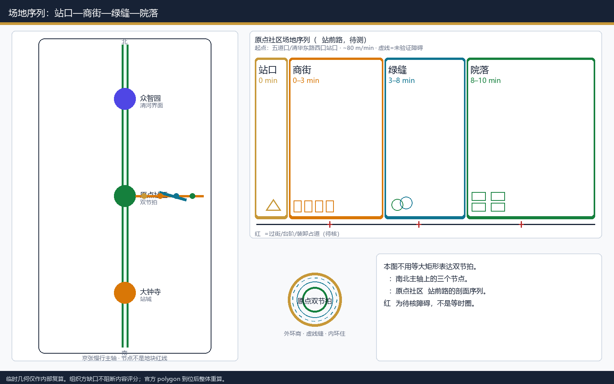
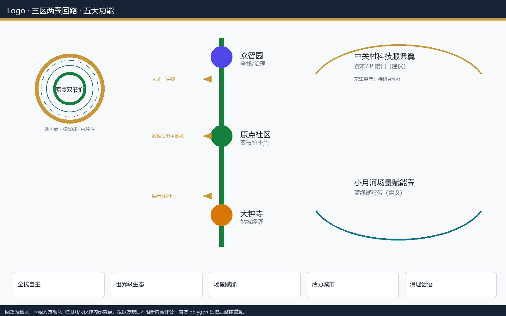
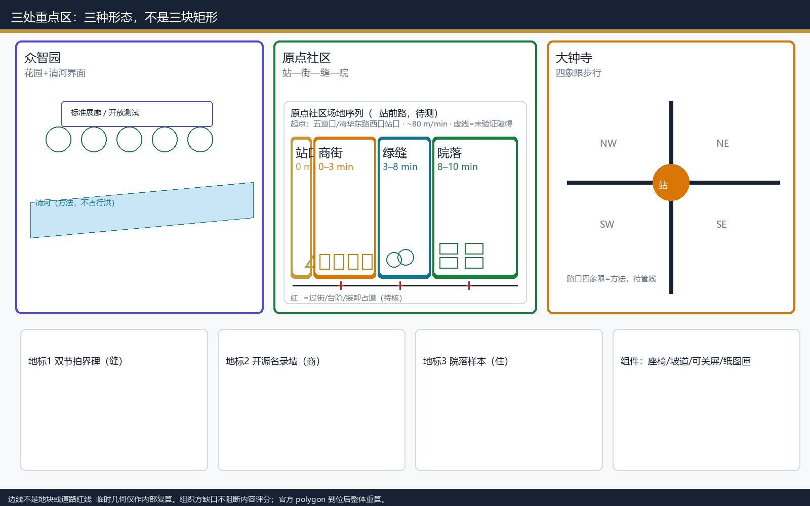
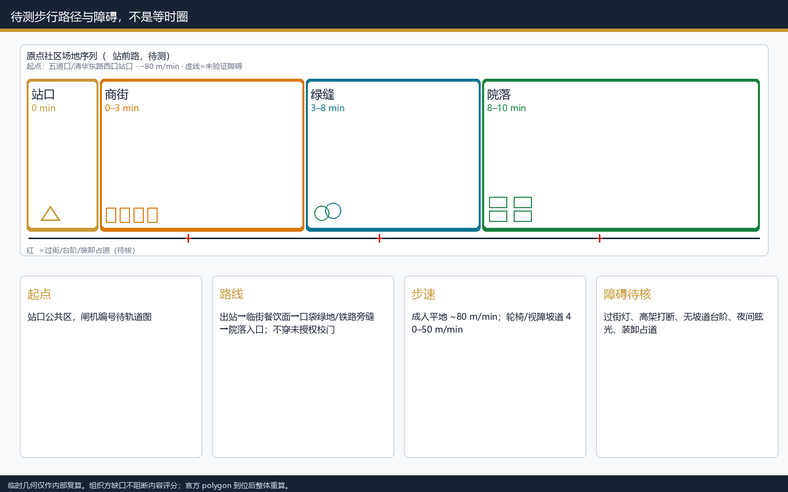
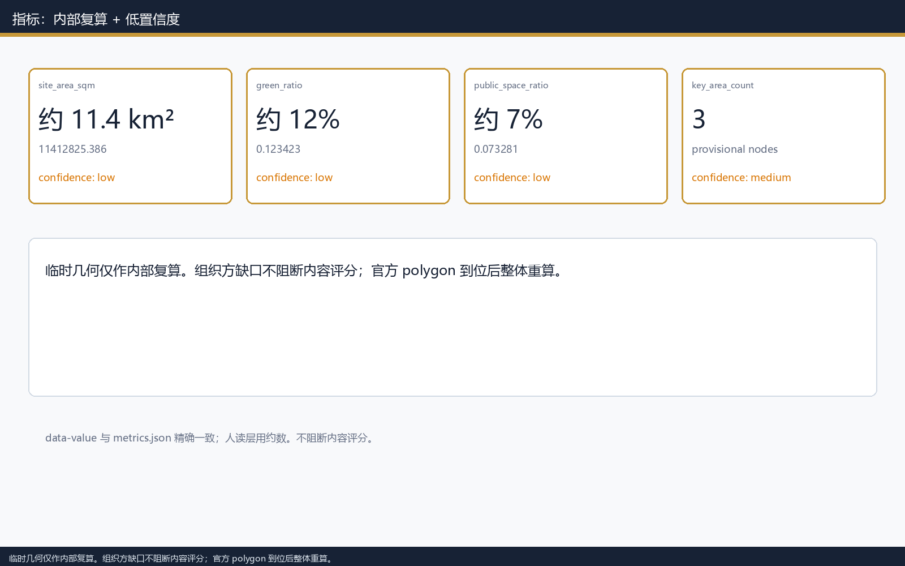

# 原点双节拍 ORIGIN DUAL BEAT：近站商节拍、向内住节拍

> 参与者观察（binawoh）：五道口「很乱、人很多、更像学生地盘」。本方案不把这种现场感受当成待消灭的污点，而当成原点社区组织的起点：外圈保留商节拍，向内步行过渡到住节拍。步行分钟圈是待测假设，不是已验证等时线。

## 设计依据与资料清单

本包以北京市规划和自然资源委员会海淀分局《百年京张AI创新带城市设计国际方案征集资格预审公告》为第一依据 [source:OFFICIAL-ANNOUNCEMENT]。机器可读任务来自场地包与面向智能体任务书 [source:AGENT-TASKBOOK]。公开资料可用性以登记表为准，不把 background 或 provisional-only 升格为官方红线 [source:SOURCE-REGISTRY]。

当前 `geometry/site_boundary.geojson` 与三处重点区均为 `official_boundary=false` 的临时粗略范围 [data:geometry/site_boundary.geojson#SITE-001]。面积数字是该临时多边形在 EPSG:4548 下的内部复算，约合公告所述 11.4 平方公里量级，置信度为低；官方 polygon 到位后须整体重算。组织方尚未提供官方范围**不阻断**当前内容评分 [metric:site_area_sqm]。

## 三层范围工作框架

统筹研究范围（约 43.6 km²）回答产业协同与区域回路；总体设计范围（临时几何约 11.4 km²）回答更新结构、慢行和风貌方法；重点区域（三处临时片区）验证详细设计动作 [depth:three_level_scope_framework]。

双节拍不是新画一条红线，而是把公告「三区两翼」转成可走的距离分层：近站商、过渡缝、向内住。众智园、原点社区、大钟寺自北向南排在京张慢行主轴上；中关村科技服务翼与小月河场景赋能翼作为概念回路，不是已落实的行政协作 [standard:PROJECT-OFFICIAL-ANNOUNCEMENT]。

## 品牌、Logo与三区两翼总体结构

**主名称**：原点双节拍 / ORIGIN DUAL BEAT。**副标题**：近站商节拍，向内住节拍。**Logo**：外环暖色商节拍、内环冷绿住节拍、中间虚线为过渡缝。Logo 样稿见本包图件与 A3 首页，不是注册商标，仅作概念识别 [source:AGENT-TASKBOOK]。

三大定位对应：京张文化带（遗址公园慢行主轴）、都市 AI 生活体验带（原点社区双节拍）、AI 融合创新带（众智园治理展示 + 大钟寺智能经济展示）。五大功能落到空间：全栈自主（众智园）、世界级生态（原点社区）、场景赋能（小月河翼，概念）、活力城市（住节拍低扰动）、治理话语（众智园标准展示，概念建议）。

三区两翼协同回路（概念建议，未经对方确认）：原点社区向众智园输送近校开源与人才停留；众智园回输评测与标准接口；大钟寺承接转化展示与站城界面；中关村科技服务翼假设提供资本与 IP 服务接口；小月河场景赋能翼假设提供蓝绿场景试验带。与北纬社区、未来科学城、怀柔科学城、经开区、京津冀的关系写成**待研究的知识/人才/算力协作建议**，没有实施承诺。

## 统筹研究范围产业与未来城市研究

统筹层不新增伪精确红线。它把高校策源、开源协作、企业转化、公共体验串成一条可审计的链，并标明哪些是公告任务、哪些是本方案建议 [source:AGENT-TASKBOOK]。京张遗址公园是公共缝合线，不是产业园门面。五道口类站点是商节拍类型节点：热闹、学生主导、高周转。若把这类节点直接改成安静园区界面，会与现场观察冲突，也会把人才「长期停留」推到更远的地方。

未来城市形态按双节拍回答工作与居住如何共处：外圈承担发布、会客、短停留；内圈承担可住、可照护、可退出数字服务。产业战略数字、人才密度和算力容量在缺少官方统计时一律保持 unknown，只保留空间方法 [standard:PROJECT-AGENT-OPEN-CALL-TASKBOOK]。

生态四条链（概念，缺数则 unknown）：**人才**在原点社区停留、在众智园评测、在大钟寺展示；**数据**只允许公开数据与去标识巡查，校园与住户数据不入库；**资本**经中关村科技服务翼作待研究接口，本包不承诺基金或税收；**算力**只给端侧节点位置原则，不接真实用户。全球活动、开发者社区和朝圣路线均写为概念建议，供专业团队深化，不得写成已经确定的政府安排。

## 总体设计范围城市更新与控规深度城市设计

总体设计按控规深度城市设计组织用地、建筑基底、道路微循环和蓝绿，但容积率、高度、道路红线在官方条件缺失时保持 unknown [standard:MOHURD-CONTROL-DETAILED-PLANNING]。原点社区内（临时片区 PROV-KEY-002）把双节拍写成**站口—商街—绿缝—院落**的形态，而不是三块等大矩形。步行时间是**待测假设**，不是等时圈。

待测参数（须现场走查后改写，不得当已测）：

- **起点**：五道口站 / 清华东路西口站出入口公共区域（具体闸机编号待轨道运营图）。
- **步速**：成人平地约 80 m/min；视障与轮椅按连续坡道 40–50 m/min 校核。
- **假设路径**：出站 → 临街餐饮面 → 口袋绿地/铁路旁绿缝 → 向东或向内的居住院落入口；不穿越未授权校园门。
- **已知障碍（待核）**：过街灯、铁路或高架打断、台阶无坡道、夜间眩光、装卸占道。未用完整步行网络验证。

| 圈层 | 待测步行假设 | 主导形态 | 空间动作 |
| --- | --- | --- | --- |
| 外圈商节拍 | 出站 0–3 分钟 | 站口广场 + 一层连续店面 | 一层开放，居住院落不贴同一临街面 |
| 过渡缝 | 3–8 分钟 | 口袋绿地 / 铁路旁绿带 | 承接外溢人流，标识「进入住节拍」 |
| 内圈住节拍 | 8–10 分钟 | 院落入口与社区服务点 | 低扰动更新，AI 服务改为可选退出 |

用地分区覆盖提交边界且无重叠 [data:geometry/land_use.geojson#LU-001]。建筑基底只表达设计讨论用的占位，不指定拆哪一栋 [data:geometry/buildings.geojson#BLDG-001]。FAR、高度、密度保持 unknown，待正式控规 [depth:land_use_layout]。

## 重点区域详细设计

三处重点区均为临时矩形，边线不得解释为地块或道路红线 [data:geometry/key_areas.geojson#PROV-KEY-001]。

| 片区 | 定位 | 详细动作（概念） | AI 与运营 |
| --- | --- | --- | --- |
| 众智园 | 花园型全栈与治理展示 | 清河界面作开放测试与标准展廊；对外交通只讨论接驳方法 | 评测预约、安全治理展示，人工复核 |
| 原点社区 | 近校转化 + 双节拍居住 | 站口商街、过渡绿缝、内院居住分层；不点名拆除五道口 | 公开导视在外圈，社区报修在内圈且可退出 |
| 大钟寺 | 站城一体的智能经济展示 | 四象限步行连通作为方法，待路口与管线资料 | 路演客厅，企业标识须清权 |

拆改留：缺少权属与现状普查时，只给「外圈界面开放、内圈院落更新」的方法，不给楼栋结论 [depth:three_key_area_detailed_design]。

## AI 创新生态、人才画像与 AI+ 场景

生态图谱（概念）：土地与空间在三区之间按公告职能分工；人才在原点社区停留、在众智园评测、在大钟寺展示；算力与数据不假设已有授权，只设「公开数据 + 人工复核」接口；资金与中关村科技服务翼的关系标为待研究 [source:AGENT-TASKBOOK]。

五个案例只作机制对照，**不可照搬**，来源已登记：

| 案例 | 可核验来源 | 比较点 | 适用条件 | 不可照搬 |
| --- | --- | --- | --- | --- |
| 坎布里奇 Kendall Square | [source:CASE-KENDALL] | 近校转化客厅 | 高校密集、控制性区划公开 | 地价、签证与波士顿住房市场不同 |
| 伦敦 King's Cross | [source:CASE-KINGS-CROSS] | 轨道遗产与人流分层 | 大站点、长期业主统筹 | 产权与铁路遗产制度不同 |
| 筑波市中心 | [source:CASE-TSUKUBA] | 研究城日常与配套 | 国家研究机构集聚 | 学生/通勤结构与五道口不同 |
| 深圳南山区 | [source:CASE-NANSHAN] | 产业街与居住退界讨论 | 高密度产业区 | 更新权限与海淀不同 |
| 新加坡 one-north | [source:CASE-ONENORTH] | 慢行缝串联功能组团 | 法定规划与产业地同步 | 土地国有制度不可复制 |

若对照超出来源页面所写机制，降级为待研究假设，不作为本地事实。画像与场景卡的完整表见下一章；此处只锁定原则：外圈可展示、内圈可退出、所有面向公众的服务保留人工与纸质替代 [depth:overall_spatial_structure]。

## 用户画像、场景卡与产业测试

画像表补足至六类。每类给出无障碍、数字能力、非数字替代和利益风险。

| 画像 | 需求 | 双节拍响应 | 无障碍 / 数字能力 | 非数字替代 | 利益风险 |
| --- | --- | --- | --- | --- | --- |
| 高校师生 | 转化会客、日常慢行 | 外圈客厅，内圈可回住 | 双语导视；中高数字能力 | 纸质时刻与人工问询 | 校园数据不得入模 |
| 初创团队 | 低成本展示、评测入口 | 外圈路演，评测去众智园 | 预约制减少突发拥挤 | 现场号牌与值班 | 算力授权另议 |
| 周边居民 | 低扰动、通勤缝 | 住节拍退后，夜间外亮内暗 | 口语通知；数字能力不一 | 居委会告示与热线 | 禁止行为追踪 |
| 老年人与照护者 | 连续坡道、休息点、陪同 | 过渡缝设座椅与遮荫 | 大字与语音；低数字能力 | 人工陪同与纸图 | 不采集健康数据 |
| 儿童与照护者 | 过街安全、夜间可见 | 商节拍人流与住区入口错峰 | 看护视野；儿童不持设备 | 现场协管 | 不做儿童画像 |
| 一线服务与低数字能力者 | 送货、保洁、商铺值班 | 外圈装卸时段，内圈禁噪声 | 图标优先；可不用 App | 纸质报修单、值班电话 | 用工数据不入库 |
| 视障与低视力者 | 连续导盲、语音、无障碍过街 | 过渡缝设声讯与触感条，商节拍避免活动挡道 | 语音优先；可不持智能手机 | 人工导引点、凸点地图 | 不采集生物识别 |

**投诉与非数字通道（所有画像共用）**：现场值班点、纸质表格、口述记录、公示电话；5 个工作日内书面或口头回复；紧急情况可立即关屏/撤装置。不做强制 App、不设仅二维码入口。

**不少于 10 张场景卡**（S01–S10）与 **5 个产业测试场景**（T1–T5）分开书写。S11/S12 不再充当测试场景。

| 编号 | 场景 | 空间载体 | 输入数据 | AI 能力 | 人工复核 | 运营主体（假设） | 隐私 / 退出 | 成熟度 | 可测指标 |
| --- | --- | --- | --- | --- | --- | --- | --- | --- | --- |
| S01 | 多语言换乘导视 | 商节拍站口 | 公开线路与出口编号 | 语种切换、路径说明 | 站务对照现场牌 | 轨道运营方（待确认） | 无个人追踪；可关屏用纸图 | 概念 | 导视被理解次数（抽样） |
| S02 | 开源发布客厅 | 商节拍一层 | 公开活动日历 | 档期冲突提示 | 主理人审题目 | 社区主理人（假设） | 报名可用假名 | 概念 | 场次与投诉数 |
| S03 | 人流减速提示 | 过渡缝 | 聚合密度，无 ident | 拥挤档位 | 值班员确认 | 街道值班（假设） | 不存人脸 | 概念 | 误报率 |
| S04 | 口袋公园断点 | 过渡缝 | 公开地图 + 巡查 | 断点列表 | 每月人工走查 | 公园管理（假设） | 只发布位置类型 | 概念 | 断点闭合数 |
| S05 | 安静时段告示 | 住节拍 | 公示的时段表 | 提醒推送（可选） | 居委会 | 社区（假设） | 一键退订 | 概念 | 退订率、噪声投诉 |
| S06 | 转化驿站预约 | 商节拍 | 空闲房间表 | 档期匹配 | 接待台 | 孵化空间（假设） | 不强制证件号 | 概念 | 爽约率 |
| S07 | 无障碍连续路径 | 全带 | 坡道与台阶巡查 | 可通行提示 | 残联或志愿者 | 待确认 | 不存残疾状况 | 概念 | 连续中断段长度 |
| S08 | 活动日历 | 商节拍 | 主办方报送 | 撞期检查 | 人工发布 | 主理人 | 可只看海报 | 概念 | 冲突拦截数 |
| S09 | 设施报修 | 住节拍 | 报修单 | 分类分派 | 物业确认 | 物业（假设） | 可选匿名 | 概念 | 48h 响应比 |
| S10 | 夜间照明分级 | 过渡缝 | 灯具台账 | 外亮内暗建议 | 城管/物业 | 待确认 | 无摄像识别 | 概念 | 投诉与照度抽检 |

产业测试场景（每条独立，含载体、数据、AI、人工复核、运营主体、隐私退出、成熟度、指标）：

1. **T1 换乘导视沙盒**：载体为模拟站口；输入公开出口编号；AI 只做文案排版；站务对照现场；退出改回纸牌；无个人轨迹；指标为抽样理解率。成熟度：桌面原型。
2. **T2 慢行断点月检**：载体为过渡缝；输入公开底图加去人脸巡查照；AI 出候选点；人工现场签字；清单可整表撤回；指标为断点闭合数。成熟度：流程试验。
3. **T3 开源路演预约**：载体为商节拍一层；输入房间占用表；AI 防撞期；接待台可拒绝；不采集证件号；指标为投诉与爽约。成熟度：运营草稿。
4. **T4 无障碍连续路径抽检**：载体为站口到院落入口；输入坡道/台阶台账；AI 标中断段；残联或志愿者现场确认；不存残疾状况；指标为剩余中断长度。成熟度：走查清单。
5. **T5 噪声投诉闭环**：载体为住节拍边界；输入公示时段与匿名投诉单；AI 只做分类分派；居委会/物业 5 日回复；可整表删除；指标为按时回复率与重复投诉。成熟度：流程试验。

面向公众的每项服务都保留现场人工、纸质/口述、申诉电话、紧急降级（关屏/撤装置）。场景落到公共空间与道路图层 [data:geometry/public_space.geojson#PUBLIC-001]。

## 朝圣地标、荣誉体系与公共空间组件

三处朝圣地标均为概念装置，不是法定纪念物：

1. **双节拍界碑**（过渡缝）：标示商/住转换，附无障碍说明与人工问询点。
2. **开源客厅名录墙**（商节拍）：只展示已获授权的公开贡献，可撤回。
3. **近校院落样本**（住节拍）：展示低扰动界面，不采集住户信息。

公共空间组件库（概念）：座椅+遮荫、坡道段、可关屏导视、纸质地图匣、夜间分级灯、装卸时段牌。荣誉展示只记录方案与公开贡献，不代替政府授勋 [source:AGENT-TASKBOOK]。组件优先落在过渡缝与商节拍一层，避免把装置塞进住节拍院落。

## 文化叙事、导视与国际传播

叙事主线：京张铁路把「距离」写成城市经验；双节拍把同一经验写成近站热闹与向内可住。中关村创新文化落在开源客厅；AI 文化落在可退出、可复核，而不是全知屏幕。清华园火车站、北影等只作公开文化线索，不编造文保控制线 [standard:MOHURD-URBAN-DESIGN-MEASURES]。

导视符号：外环暖、内环绿、虚线缝；中英并列；低数字能力路径只用图标+数字编号。国际传播文案（可直接审阅的概念稿）：“ORIGIN DUAL BEAT keeps the station busy and the courtyard quiet, by walkable distance, not by clearing students off the street.” 不宣称已获批准或已建成。

## 用地、建筑规模与拆改留方案

用地闭合覆盖提交边界 [data:geometry/land_use.geojson#LU-001]。四条南北向分区只表达走廊内的功能分层讨论，不是控规图则：西侧研发、中西绿地、中东产业服务、东侧社区配套。建筑基底面积为内部复算，置信度中等，不得外推容积率 [metric:building_footprint_area_sqm]。

拆改留在权属未清时只给方法：商节拍临街鼓励界面开放与夜间经营管理；住节拍以保留院落结构、修补入口与降噪为主；不得点名拆除某一栋五道口或校园建筑 [depth:retain_renovate_demolish]。强度与高度控制保持 unknown，待正式控规 [depth:development_intensity_controls]。

## 交通、轨道、市政与公共服务设施

道路与慢行留在提交边界内，与绿地、公共空间互校 [data:geometry/roads.geojson#ROAD-001]。北五环上跨、五道口/清华东路西口/大钟寺站接驳写成方法，待红线与管线资料。停车与非机动车只讨论「外圈短停、内圈禁止过境」的原则，不给车位数。新型基础设施和端侧算力只给位置原则：不接真实用户数据、须安全评估 [depth:traffic_rail_slow_parking]。

市政与公共服务在资料缺口下写成依赖清单：给水、电力、通信以既有走廊为假设；社区服务落在住节拍；创新服务平台落在商节拍。任何管线改迁都标为待正式资料 [depth:municipal_new_infrastructure]。

## 蓝绿空间、公共空间与城市风貌

京张遗址公园慢行主轴是三区的公共缝合线。绿地与公共空间比例来自临时几何内部复算，约 12% 与 7%，置信度为低，只用于本包互校 [metric:green_ratio]。风貌控制：外圈允许更高标识与活动照明；过渡缝用绿量和座椅完成转换；内圈降低广告、限制夜间噪声与眩光 [depth:blue_green_public_space]。

建筑高度与体量在缺少控规时不画伪精确天际线，只保留「外亮内暗、近站可聚、向内可静」的风貌方法 [depth:height_massing_character]。

## 更新项目清单、实施政策与分期计划

项目角色均为假设，不是已获承诺 [depth:renewal_project_list]。分期图层只表达可讨论的近期范围，不是法定时序 [data:geometry/phasing.geojson#PHASE-001]。

| 编号 | 名称 | 阶段 | 牵头/协作（假设） | 资源量级（概念） | 前置条件 | 轻量试点 | 决策门 | 交付物 | 验收指标 |
| --- | --- | --- | --- | --- | --- | --- | --- | --- | --- |
| JZ-01 | 慢行断点缝合 | 近期 0–12 月 | 街道+公园（待确认） | 低：标识+一段坡道 | 桥下空间权属 | 一段坡道与标识 | 现场走查通过 | 断点清单 v0 | 闭合 ≥1 处试验段 |
| JZ-02 | 清河创新界面 | 中期 12–36 月 | 园区+水务（待确认） | 中：临时展廊，不改断面 | 蓝线与防洪 | 临时展廊 | 生态条件复核 | 界面设计方法 | 不占行洪断面 |
| JZ-03 | 近校转化街 | 近期 0–12 月 | 社区主理人（假设） | 低：一周路演与档期 | 首层使用权 | 一周路演 | 噪声投诉阈值 | 档期表 | 投诉不升 |
| JZ-04 | 大钟寺四象限步行 | 中期 12–36 月 | 轨道+交通（待确认） | 中：地面导视，不改路口 | 路口与管线 | 地面导视 | 交通组织审查 | 连通方法图 | 不改变法定路口 |
| JZ-05 | 端侧算力节点 | 长期 36 月+ | 设施运营（待确认） | 高且可取消：先安全评估 | 能源与安全 | 不接真实用户数据 | 安全评估 | 位置原则 | 无个人数据 |
| JZ-06 | 公共活动路线 | 近期滚动 | 主理人+志愿 | 低：季度一天+保险 | 公共空间许可 | 季度一天 | 安全方案 | 路线与降级预案 | 零强制采集 |

实施政策建议限于：公示、可退出、人工复核、噪声阈值、公共空间许可。正文不把概念试点写成已经批准的实施安排 [depth:phasing_implementation]。

## 年度活动日历、开发者社区与长期运营

**年度活动日历（概念）**：3 月开源客厅开放日；6 月慢行断点公众走查（含视障志愿者）；9 月近校转化周；11 月大钟寺展示周。开发者社区：公开议题板、月度办公时间、贡献可撤回、不设付费门槛。场景开放：提前 14 日公示、现场人工、可随时关停。公众体验：纸质地图、语音讲解、触感条并行。国际传播到招引：传播文案 → 公开资料包 → 专业团队接洽；本方案不承诺投资或税收。

**长期运营与资金（假设，待确认）**：近期低成本项目（JZ-01/03/06）以街道公共空间维护费与志愿为主；中期（JZ-02/04）需园区/轨道专项后再立项；JZ-05 无安全评估不得支出。没有本包自设的基金或收费权。治理：季度公开投诉台账、年度走查、退出条款优先于扩张——任何导视屏、预约系统和名录墙都可以在一个工作日内关闭并改回纸质 [source:AGENT-TASKBOOK]。

## 指标体系、面积复算与合规矩阵

`site_area_sqm` 等 known 值保持与几何一致以便机器复算，但在图面与正文中按临时精度表达为约 11.4 km²、绿地与公共空间比例约 12% 与 7% [metric:site_area_sqm]。置信度为低。不得把「缺少官方 polygon」写成不能参加内容评分。

合规矩阵把 agent.1–agent.6 分别指向品牌结构、生态案例、画像测试、地标组件、文化导视、项目运营等不同章节，而不再用同一组通用章节代替 [depth:metrics_recalculation]。公共空间比例与绿地比例同样来自提交图层 [metric:public_space_ratio]。

## 风险、版权与合规说明

本方案不是官方批准、不是控规、不是权属结论、不是实施承诺。HTML 不加载 CDN、远程瓦片、远程字体文件服务器、iframe 或表单；本包将所用字形子集嵌入页面，以便在无系统中文字体的环境中阅读。图件由本地脚本从 GeoJSON 与指标生成。新增外部案例已写入 `sources.json`。完整机器索引见结构化文件 [source:SITE-PACKAGE]。

主要风险：临时边界面积不可用于审批；步行分钟圈未经网络验证；案例机制不可复制到海淀产权与更新权限；AI 场景若采集个人数据即超出本包范围。缺口清单见 assumptions.json [depth:risk_missing_data]。

## 参考资料

- 资格预审公告与场地包、来源登记表、面向智能体任务书，见 `sources.json` 中 SITE-PACKAGE、SOURCE-REGISTRY、OFFICIAL-ANNOUNCEMENT、AGENT-TASKBOOK [source:SITE-PACKAGE]。
- 临时边界来源 BOUNDARY-SOURCE、KEY-AREA-SOURCE：仅用于生成与讨论，不是官方红线。
- 案例页：Kendall Square（剑桥 CDD）、King's Cross（kingscross.co.uk）、筑波市官网、南山区政府网、JTC one-north。检索日期 2026-08-26。使用边界：机制启发，不可当作可复制规划。
- 本包许可：COMMUNITY-DISPLAY-ONLY。
