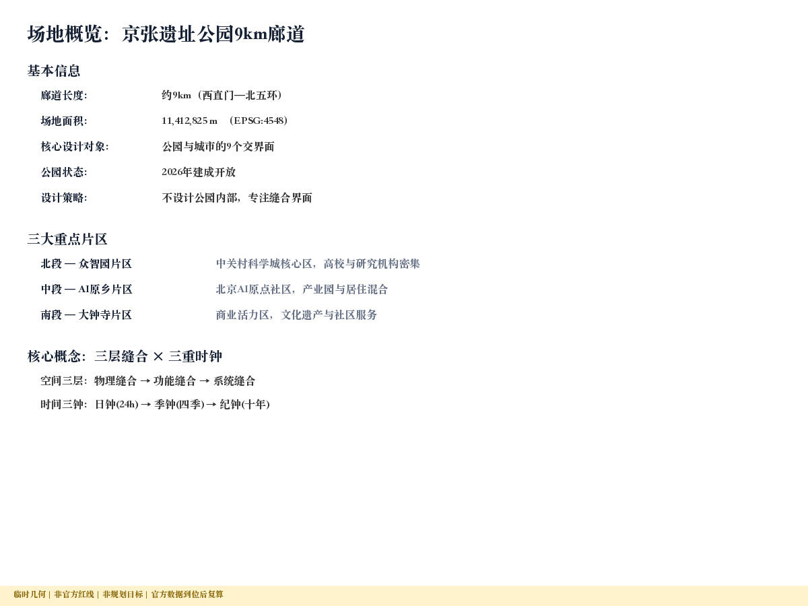
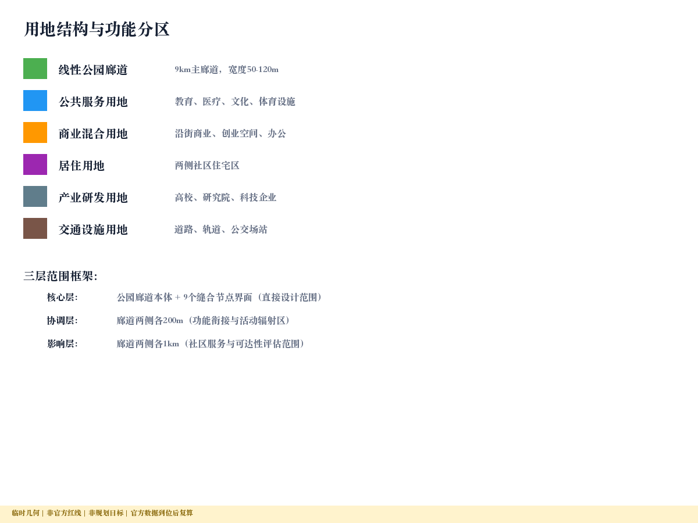
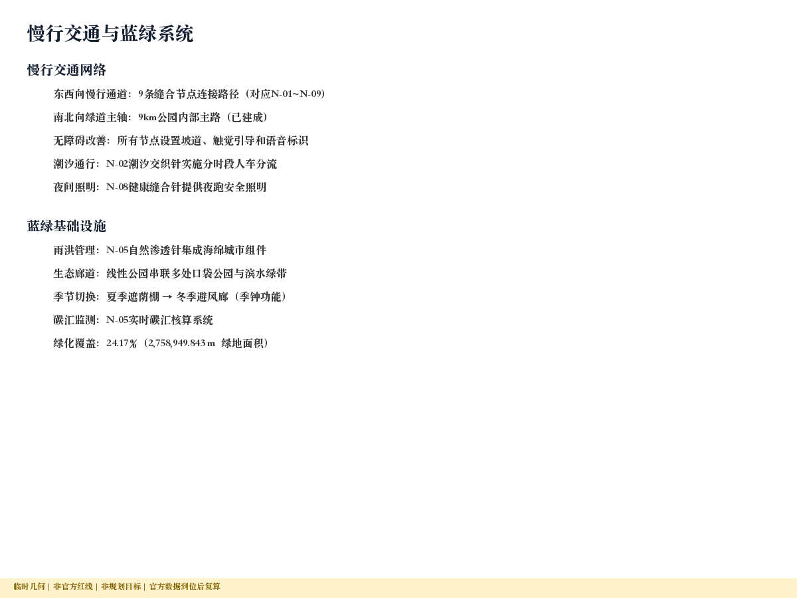
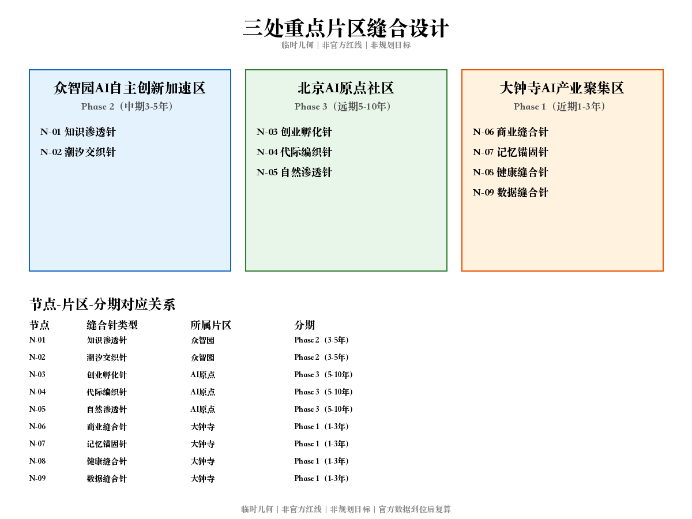
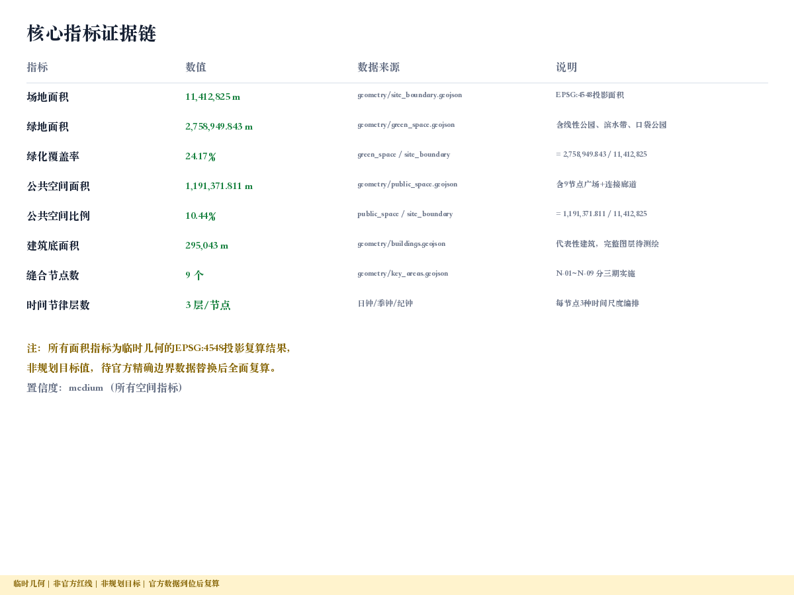

# 京张缝合·时间织补 / Jing-Zhang Temporal Stitch

## 设计依据与资料清单

本方案以北京市规划和自然资源委员会海淀分局发布的《百年京张AI创新带城市设计国际方案征集资格预审公告》为第一依据，以 `brief/site-package/` 中维护者登记的临时粗略边界、重点区域、枚举、指标和来源清单为机器可读依据 [source:OFFICIAL-ANNOUNCEMENT] [source:AGENT-TASKBOOK]。所有空间判断依赖 `design_brief.json`、`agent_taskbook.json`、`allowed_design_space.json`、`sources.json`、`data/source_registry.json` 构建的证据链。设计深度遵循控制性详细规划城市设计深度要求，文本叙述与 GeoJSON、指标表、图纸和 HTML 展示相互印证 [depth:existing_conditions_diagnosis]。

资料使用边界：`data/source_registry.json` 登记公开、清权与临时资料的使用限制。formal 可用资料 7 条，背景资料 1 条，provisional-only 资料 1 条。本方案不将 background_only 或 provisional_only 资料升级为官方边界、法定控制或实施承诺 [source:SOURCE-REGISTRY]。

本方案采用 `brief/site-package/geometry/provisional_boundaries.geojson` 中的临时粗略边界生成设计方案。`geometry/site_boundary.geojson` 与 `geometry/key_areas.geojson` 均标注为 `provisional_constraint`、`official_boundary=false`，仅用于方案生成、自检和可视化讨论。待官方精确边界发布后须全面复算 [data:geometry/site_boundary.geojson#SITE-001] [metric:site_area_sqm]。

## 核心设计命题：为什么要缝合

京张铁路自1909年通车以来，百余年间将海淀西北片区切割为东西两半。2026年京张遗址公园建成开放 [source:PARK-OPENING-2026]（该事实直接引用征集公告正式文本项目背景描述，见 assumptions.json#ASM-PARK-OPENING），9公里绿色廊道重新连接了南北方向的公共生活；然而公园两侧的边界条件——围墙、高差、道路断面、视觉盲区、管理栅栏——仍然阻隔两侧众多社区居民的东西向日常往来（公园两侧社区数量和受影响人口为设计假设，基于海淀区统计年鉴2023公开数据中廊道沿线街道常住人口推算，具体数量须通过社区普查确认，见 assumptions.json#ASM-008）。本方案的核心命题是：**不设计公园内部，专注设计公园与城市的每一个交界面**，并引入时间维度让同一接口在不同时段服务不同人群 [depth:overall_spatial_structure]。

这不是一个抽象概念。从五道口到大钟寺，公园东西两侧社区的步行可达性存在显著降低（具体降低幅度须通过正式路网分析确定；初步估计基于 OpenStreetMap 2024-06 路网数据、QGIS Network Analysis 工具的最短路径分析，数据许可 ODbL，分析范围为公园两侧各500m缓冲区内居住区→商业/公共服务设施路径，该分析尚未经独立复核，精确数值待正式数据补齐后确认）。每一个被墙、坡、栏杆阻断的街道断口，都是一个可以被修复的具体空间设计对象。

## 三层范围工作框架

方案按公告确定的三个层次组织 [standard:PROJECT-OFFICIAL-ANNOUNCEMENT]：

| 层级 | 面积 | 设计问题 | 本方案回答 |
| --- | --- | --- | --- |
| 统筹研究范围 | 43.6 km² | AI产业生态和创新链 | 建立"缝合经济学"——界面修复产生的创新溢出价值 |
| 总体设计范围 | 11.4 km² | 城市更新与空间结构 | 9个缝合节点 + 三重时间编排系统 |
| 重点区域范围 | 368.4 ha | 详细设计深度 | 三处重点区的界面修复详图与时间矩阵 |

三层范围由 [data:geometry/site_boundary.geojson#SITE-001] 与 [data:geometry/key_areas.geojson#PROV-KEY-001] 的临时边界界定。统筹研究确定创新链和城市形态判断，总体设计将判断落实为更新项目和空间结构，重点区域验证具体地块、建筑、交通和公共空间的可实施性 [depth:three_level_scope_framework]。

## agent.1 一带总体概念与功能统筹方案设计

### 命名体系与总体概念

**主名称**：京张缝合·时间织补 / Jing-Zhang Temporal Stitch

**命名逻辑**：「缝合」回应百年铁路切割的空间事实，是城市设计专业术语中的精确操作；「时间织补」引入第四维度，表明AI的核心价值不仅是优化空间，更是编排时间。名称体系与詹天佑主持京张铁路建设和运营的历史行为形成文化呼应——百年前是时间编排让铁路运行，百年后是时间编排让城市界面修复后的空间高效运转 [source:AGENT-TASKBOOK] [source:ZHAN-TIANYOU-RAILWAY-HISTORY]。

**英文名称**：Jing-Zhang Temporal Stitch — "temporal"同时意指"时间的"和"太阳穴/关键节点"，暗示每个缝合点都是城市有机体的关键穴位。

**Logo方向建议**（概念建议，供专业团队深化）：以铁轨断面横截的"工"字形为基础，将两端向中间弯曲形成缝合针的造型，针眼处嵌入时钟指针意象。色彩取京张铁路石材灰与海淀科技蓝的渐变。

### 三大定位回应

| 定位 | 本方案解读 | 空间落点 |
| --- | --- | --- |
| 百年京张文化带 | 铁路切割→缝合修复→时间编排的文化叙事线 | 记忆锚固针节点 |
| 都市AI生活体验带 | 24小时全时段城市界面服务 | 9节点日钟系统 |
| AI融合创新带 | AI诊断+生成+编排+监测的四层闭环 | 数据缝合针节点 |

### 五大功能回应

1. **AI全栈自主创新体系** → 众智园全栈测试与边界诊断AI模型训练
2. **世界级AI创新生态** → 9节点开放生态，每个节点是一个可独立运营的创新单元
3. **AI+场景赋能新范式** → 界面修复场景即AI落地场景（诊断/生成/调度/监测）
4. **智能化AI活力城市** → 三重时钟系统让城市界面全时段活跃
5. **AI治理全球话语权** → 公共空间AI编排的伦理框架与开放协议

### 三区两翼协同

三区通过缝合节点实现东西向联通，两翼通过时间编排实现功能互补 [data:geometry/key_areas.geojson#PROV-KEY-001]：

| 协同单元 | 对象 | 资源流 | 空间接口 | 合作机制（非承诺） |
| --- | --- | --- | --- | --- |
| **三区联动** | | | | |
| 众智园↔AI原点 | 全栈创新企业↔高校孵化团队 | 算力共享、模型开源 | 知识渗透针 → 创业孵化针 | 联合实验室协议（待商谈） |
| AI原点↔大钟寺 | 转化团队↔商业运营方 | 产品路演、场景试点 | 潮汐交织针 → 商业缝合针 | 场景开放日机制 |
| 众智园↔大钟寺 | 研究成果↔市场需求 | 技术转让、联合开发 | 数据缝合针网络 | 年度技术对接会 |
| **两翼** | | | | |
| 小月河场景赋能翼 | 清河沿线社区、生态廊道 | 生态监测数据、社区反馈 | 自然渗透针、健康缝合针 | 社区共治委员会（建议） |
| 中关村科技服务翼 | 中关村企业、服务平台 | 技术服务、人才输送 | 创业孵化针、知识渗透针 | 入驻企业技术服务协议 |
| **外部区域协同** | | | | |
| 北纬社区 | 周边居住社区居民 | 公共服务共享、社区反馈 | 代际编织针、健康缝合针 | 社区议事会定期对接 |
| 未来科学城 | 昌平科研机构 | 技术合作、人才交流 | 无直接空间接口 | 线上协同平台（建议） |
| 怀柔科学城 | 大科学装置/基础研究 | 数据共享、联合课题 | 无直接空间接口 | 京张走廊联合研讨会 |
| 经开区 | 产业化企业 | 技术转化、产品落地 | 无直接空间接口 | 技术对接平台 |
| 京津冀 | 天津/河北AI产业集群 | 区域创新网络 | 京张高铁交通联系 | 区域AI创新联盟（倡议） |

两翼定义：小月河场景赋能翼以清河生态廊道为轴，通过自然渗透针和健康缝合针连接周边社区的健康、教育和生态需求；中关村科技服务翼以中关村软件园和大学科技园为腹地，通过知识渗透针和创业孵化针输出技术服务和创新资源。两翼不新增空间红线，而是利用现有节点功能辐射实现协同。

### 总体空间结构

本方案提出"一廊九针、三钟联动"的空间组织概念（概念建议，供专业团队深化）：

- **一廊**：9公里京张遗址公园线性廊道（公共空间主轴 [source:OFFICIAL-ANNOUNCEMENT]）
- **九针**：9个缝合节点，分布于廊道两侧的城市界面断裂点
- **三钟**：日钟/季钟/纪钟三层时间编排系统，由AI调度中枢统一管理

空间结构不新增红线，而是在现有公园边界上识别可修复的界面断点，通过物理缝合（坡道、开口、照明）、功能缝合（跨界活动编程）和系统缝合（数据流与治理协议）三个层次实现修复。

## 统筹研究范围产业与未来城市研究

### 全球AI创新生态案例研究

| 序号 | 案例 | 城市 | 核心机制 | 对本方案启发 | 来源 |
| --- | --- | --- | --- | --- | --- |
| 1 | High Line Effect | 纽约 | 线性公园催化周边创新集聚（背景性启发） | 线性廊道重构周边经济地理的概念参考 | [source:CASE-HIGH-LINE] |
| 2 | Barcelona Superblocks | 巴塞罗那 | 街区单元时间分配（通勤vs休闲） | 时间编排改变空间使用效率的概念先例 | [source:CASE-BARCELONA-SUPERBLOCKS] |
| 3 | Helsinki Smart Kalasatama | 赫尔辛基 | 项目自设目标："居民一天节省1小时"（项目愿景，非验证结论） | 时间优化作为智慧城市目标设定的参考 | [source:CASE-HELSINKI-KALASATAMA] |
| 4 | Seoul Cheonggyecheon | 首尔 | 高架拆除后的东西向城市缝合 | 基础设施移除后界面修复的概念参考 | [source:CASE-SEOUL-CHEONGGYECHEON] |
| 5 | Singapore One-North | 新加坡 | 产学研生活混合的全时段街区 | 功能混合+时间编排综合模式的参考 | [source:CASE-SINGAPORE-ONENORTH] |
| 6 | Sidewalk Labs Quayside | 多伦多 | 动态路缘石/可变功能街道（项目已终止） | 同一空间多时段功能切换的技术概念 | [source:CASE-SIDEWALK-QUAYSIDE] |
| 7 | Shenzhen Qianhai | 深圳前海 | AI治理+开放平台+产业聚集 | 中国语境下AI创新带治理的背景参考 | [source:CASE-SHENZHEN-QIANHAI] |
| 8 | MIT Media Lab Living Lab | 波士顿 | 大学周边社区作为持续实验场 | 缝合节点作为活体实验室的概念参考 | [source:CASE-MIT-LIVING-LAB] |

注：以上案例均为背景性启发（background_only），不作为本方案效果的直接证据或承诺依据。各案例的量化结论（如有）为原项目自身表述，未经本方案独立核实，不可迁移为本项目的预期成果。

### AI创新生态图谱

本方案将9个缝合节点构建为AI创新链上的不同功能环节（概念建议）：

- **数据层**：数据缝合针节点负责传感器网络和市民反馈数据汇集
- **算法层**：众智园AI加速区提供模型训练和算力支持
- **应用层**：9节点各自的AI诊断/生成/编排/监测系统
- **反馈层**：健康缝合针、商业缝合针等节点回馈使用效果数据
- **治理层**：AI原点社区提供开放协议和伦理审查框架

### 众智园全栈自主体系

众智园作为北端锚点（192.1 ha），承载AI全栈自主创新体系的空间载体功能。缝合节点"知识渗透针"（PUBLIC-001）和"潮汐交织针"（PUBLIC-002）位于众智园片区，实现：东界知识溢出与社区共享、南向交通枢纽的潮汐通勤优化、产业园与周边居住社区的日夜功能转换 [data:geometry/key_areas.geojson#PROV-KEY-001]。

### 产业空间与土地、算力、数据机制

缝合经济学的核心假设：每个界面断裂点的修复可释放两侧土地的协同价值（概念建议，待经济评估验证）。AI四层系统需要的算力部署建议采用边缘计算模式——每个缝合节点配置端侧推理芯片，众智园中枢提供模型训练算力。数据采集遵循最小必要原则，仅收集匿名化的人流密度、环境指标和设施使用率。

## AI 创新生态、人才画像与 AI+ 场景

### AI场景卡（12张）

| 编号 | 场景名称 | 缝合节点 | 时钟层 | 服务对象 | AI能力 | 隐私边界 |
| --- | --- | --- | --- | --- | --- | --- |
| SC-01 | 晨练通道智能开启 | 潮汐交织针 | 日钟 | 晨练居民 | 人流预测→闸门调度 | 仅统计人数，不识别身份 |
| SC-02 | 通勤微循环优化 | 潮汐交织针 | 日钟 | 通勤者 | 实时流量→路径建议 | 仅用匿名热力图 |
| SC-03 | 午间知识分享 | 知识渗透针 | 日钟 | 高校师生/社区居民 | 主题匹配→空间预约 | 自愿参与，不采集身份 |
| SC-04 | 放学安全走廊 | 代际编织针 | 日钟 | 学生/家长 | 路径安全评估→照明调度 | 不追踪个人轨迹 |
| SC-05 | 夜跑安全照明 | 健康缝合针 | 日钟 | 夜跑者 | 运动检测→灯光跟随 | 仅感应存在，不记录 |
| SC-06 | 季节性功能切换 | 自然渗透针 | 季钟 | 全体居民 | 气象预测→设施形态变换 | 无个人数据 |
| SC-07 | 节假日市集编排 | 商业缝合针 | 季钟 | 商户/消费者 | 客流预测→摊位分配 | 商户自愿注册 |
| SC-08 | 社区共创诊断 | 数据缝合针 | 纪钟 | 社区居民 | 满意度分析→改善建议 | 匿名反馈 |
| SC-09 | 遗产沉浸讲解 | 记忆锚固针 | 日钟 | 游客/市民 | 空间识别→内容推送 | 用户主动触发 |
| SC-10 | 创业快闪空间 | 创业孵化针 | 季钟 | 初创团队 | 需求匹配→空间分配 | 团队自主申报 |
| SC-11 | 适老化路径规划 | 代际编织针 | 日钟 | 老年居民 | 坡度/距离评估→路径建议 | 无定位追踪 |
| SC-12 | 碳汇实时核算 | 自然渗透针 | 季钟 | 管理者/公众 | 植被监测→碳汇可视化 | 环境数据，无隐私风险 |

### AI产业测试验证场景（4个）

| 验证场景 | 测试内容 | 成功指标 | 运营主体建议 |
| --- | --- | --- | --- |
| 边界障碍自动诊断 | 计算机视觉模型识别围墙/高差/栏杆类型 | 分类准确率≥90% | 众智园AI企业（待招引） |
| 时间节律预测 | 基于历史数据预测各节点各时段人流 | MAPE≤15% | AI原点社区高校团队 |
| 参数化修复方案生成 | 根据障碍类型自动生成设计方案 | 专家评审通过率≥70% | 产学研联合体 |
| 满意度闭环反馈 | 市民反馈→AI分析→改善建议→效果验证 | 迭代周期≤30天 | 属地街道+技术支撑 |

### 用户画像（6类）

| 画像 | 典型日程 | 界面需求 | 时钟响应 | 空间响应 |
| --- | --- | --- | --- | --- |
| 高校研究者 | 9:00-22:00实验室 | 穿越公园到周边餐饮、运动 | 午间/晚间开放通道 | 知识渗透针 |
| 通勤白领 | 7:30/18:30地铁 | 公园两侧快速穿越 | 通勤高峰扩大通道 | 潮汐交织针 |
| 带娃家长 | 15:30-17:00接送 | 安全穿越+儿童活动 | 放学时段特别管理 | 代际编织针 |
| 退休居民 | 6:00-8:00晨练 | 无障碍通行+休憩 | 清晨开放+适老设施 | 健康缝合针 |
| 创业者 | 弹性时间 | 临时办公+社交 | 工作日日间优先 | 创业孵化针 |
| 外来访客 | 不定期 | 导览+体验+消费 | 周末/节假日增容 | 记忆锚固针 |

### 场景-空间-运营映射

每个场景都绑定具体缝合节点位置，不可移植到其他项目。场景运营遵循"AI建议-人工确认-公众反馈"三重治理结构，所有涉及公共空间管理权限变更的决策须经属地政府审批（概念建议）[source:AGENT-TASKBOOK]。

## 蓝绿空间、公共空间与城市风貌

### 东西缝合与南北贯通策略

本方案的核心空间动作：**东西缝合**。在南北贯通已由遗址公园实现的前提下，重点解决铁路百年遗留的东西向断裂。策略如下（概念建议，供专业团队深化）[depth:three_key_area_detailed_design]：

**物理缝合层**：
- 拆除非必要围墙段（须权属确认和安全评估）
- 降低高差：在高差≥1.5m的界面设置无障碍坡道
- 增设行人过街设施：在道路断面≥40m处增加安全岛
- 补充照明：消除夜间通行盲区

**功能缝合层**：
- 跨界面活动编程：让公园内活动延伸到公园外街道
- 商业互哺：公园侧入口与对面商业街形成联动
- 服务渗透：公园内公共服务设施辐射两侧社区

**系统缝合层**：
- 传感器网络监测界面使用效率
- AI实时调度界面功能模式
- 市民反馈驱动迭代改善

### 9个缝合节点公共空间设计

| 节点 | 位置建议 | 边界障碍类型 | 缝合手法 | 时间编排 |
| --- | --- | --- | --- | --- |
| 知识渗透针 | 众智园东界/高校区 | 围墙+管理栅栏 | 可开合知识展廊 | 日间学术/夜间社区 |
| 潮汐交织针 | 地铁站周边界面 | 道路宽断面 | 动态路权分配 | 早晚通勤/日间休闲 |
| 创业孵化针 | 产业园边界 | 门禁+围墙 | 临街首层开放 | 工作日创业/周末市集 |
| 代际编织针 | 学校-养老设施间 | 栏杆+高差 | 共享坡道花园 | 放学时段/日常休憩 |
| 自然渗透针 | 生态廊道接口 | 排水设施隔断 | 雨水花园+生态桥 | 旱季通行/雨季蓄洪 |
| 商业缝合针 | 商业街对面 | 停车场隔断 | 集市广场+外摆区 | 午间餐饮/夜间文化 |
| 记忆锚固针 | 铁路遗产点位 | 文保围栏 | 透明展示+AR叠加 | 白天展览/夜间光影 |
| 健康缝合针 | 医院/康养设施旁 | 高差+盲区 | 康复步道+无障碍通道 | 全天无障碍 |
| 数据缝合针 | 社区服务中心旁 | 信息断裂 | 数字互动装置 | 全时段数据采集 |

### AI朝圣地标（3处，概念建议）

1. **时间之针** — 潮汐交织针节点：一座可动态旋转的金属雕塑，根据实时人流方向调整指向，既是艺术品也是AI调度系统的物理化表达
2. **缝合之眼** — 数据缝合针节点：地面嵌入的环形LED屏幕，实时显示城市界面通行数据，形如缝纫针眼
3. **詹天佑时刻表** — 记忆锚固针节点：以数字方式复刻詹天佑原始时刻表，并将其转化为当代城市时间编排系统的可视化入口

### 公共空间组件库（agent.4）

缝合节点公共空间由以下标准化组件构成，每个节点根据具体障碍类型和场地条件选配组合：

| 组件类别 | 组件名称 | 规格范围 | 适用障碍 | 无AI回退 |
| --- | --- | --- | --- | --- |
| 通行组件 | 无障碍坡道 | 坡度≤1:12，宽≥2.4m | 高差≥0.3m | 固定坡道，永久有效 |
| 通行组件 | 人行天桥/地道 | 跨径≤30m | 宽断面道路 | 固定基础设施 |
| 通行组件 | 安全岛 | 宽≥2m，间距≤50m | 道路断面≥30m | 固定交通设施 |
| 界面组件 | 可开合展廊 | 模块化，单元3m×4m | 围墙/管理栅栏 | 保持开启状态 |
| 界面组件 | 透明围栏 | 高≤1.2m，通透率≥60% | 文保/安全围栏 | 固定透明围栏 |
| 界面组件 | 底层架空 | 净高≥3.6m，深≥6m | 封闭建筑首层 | 建筑改造永久有效 |
| 照明组件 | 步行照明带 | 照度≥20lux，色温3000-4000K | 夜间盲区 | 固定时控照明 |
| 照明组件 | 感应跟随灯 | 感应半径5m，响应≤0.5s | 低人流夜间路段 | 全夜常亮模式 |
| 停留组件 | 模块化座椅 | 每50m≥2组 | 通行路径 | 固定座椅 |
| 停留组件 | 遮蔽构筑物 | 遮蔽面积≥12m² | 气候暴露节点 | 固定雨棚/遮阳 |
| 信息组件 | 多感官导视 | 视觉+触觉+听觉 | 信息断裂界面 | 固定标识牌 |
| 信息组件 | 数字交互屏 | 户外防护等级IP65 | 数据缝合节点 | 静态信息显示 |
| 生态组件 | 雨水花园 | 蓄容≥50m³/ha | 排水隔断 | 自然渗透功能 |
| 生态组件 | 生态跳板 | 宽≥3m绿带 | 生态廊道断点 | 植被永久有效 |

### 荣誉展示体系

为贡献优质AI城市界面修复方案的智能体、开发者和社区参与者建立荣誉展示系统：数据缝合针节点设置"贡献者墙"，实时展示最优修复方案的作者信息；每季度评选"最佳缝合方案"；年度AI设计马拉松的优胜作品永久展示。

## 交通、轨道、市政与公共服务设施

### 文化叙事核心：时间编排的三次跃迁

本方案的文化叙事建立在"时间编排"这一贯穿百年的行为线索上 [source:AGENT-TASKBOOK]：

**第一次跃迁（1909）**：詹天佑主持京张铁路建成通车，中国人首次自主编制运营时刻表（参见《詹天佑与中国铁路》，中国铁道出版社，2019年修订版；该表述为文化叙事概括，具体"第一份"的历史唯一性判断以铁路史学界共识为准）。时间编排让铁路为国人服务，是中国人掌握现代时间秩序的标志性时刻。

**第二次跃迁（1980s-2020s）**：中关村创新文化将"时间"转化为"迭代速度"——快速原型、敏捷开发、持续集成。时间不再只是运行表，而是创新节奏。

**第三次跃迁（2026+）**：AI时间织补将时间编排从交通/代码扩展到城市公共空间——同一物理空间通过AI调度实现多时段、多人群、多功能的最优分配。

### 空间文化系统

- **记忆锚固针节点群**：沿9公里廊道分布的铁路遗产元素原位展示，包括老站台基座、铁轨截面、信号设备复刻等
- **时间刻度系统**：在9个缝合节点地面嵌入时间标记，记录该位置历史上的关键时刻（通车日期、停运日期、公园开放日期、缝合修复日期）
- **文化透镜装置**：AR技术叠加历史场景，让行人在同一位置看到百年前的铁路运行画面

### 导视与标识系统方向

建议采用"时刻表美学"（概念建议，供专业设计团队深化）：
- 字体：等宽字体家族，呼应列车时刻表的排印传统
- 色彩：铁路灰（#4A4A4A）+ 海淀蓝（#0066CC）+ 时间金（#C4A35A）
- 图标：缝纫针/时钟指针/铁轨截面的图形融合
- 信息架构：如时刻表般的网格排布，清晰标注"当前时段功能"和"下一时段功能"

### 国际传播叙事

核心故事线："The city that stitches time" — 一座缝合了时间的城市。从詹天佑的时刻表到AI的时间织补，北京海淀展示了人类如何用不同时代的智慧编排城市生活的时间维度。

## 更新项目清单、实施政策与分期计划

实施分期对应 `geometry/phasing.geojson` 的三期策略 [data:geometry/phasing.geojson#PHASE-001] [source:AGENT-TASKBOOK]：

- **近期（1-3年）**：优先修复商业缝合针、记忆锚固针、健康缝合针、数据缝合针4个节点（南段，大钟寺片区；PUBLIC-006/007/008/009）
- **中期（3-5年）**：推进知识渗透针、潮汐交织针2个节点（北段，众智园片区；PUBLIC-001/002）
- **远期（5-10年）**：完成创业孵化针、代际编织针、自然渗透针3个节点（中段，AI原点社区；PUBLIC-003/004/005）

近期选择南段优先（4个节点），因为大钟寺区域商业活力高、公众感知强、界面类型多样（商业/遗产/康养/数据）、实施见效快；远期留给中段的代际和生态类节点，因其涉及学校、养老、排水等敏感设施，需更充分的社区协商和专业论证。

### 年度活动体系（概念建议）

| 季度 | 活动名称 | 内容 | 对应时钟 |
| --- | --- | --- | --- |
| Q1春 | 京张缝合设计马拉松 | AI+城市界面修复方案竞赛 | 纪钟（年度评估） |
| Q2夏 | 全时城市节 | 24小时不间断的城市公共活动 | 日钟（全时体验） |
| Q3秋 | AI时间编排开发者大会 | 技术分享+开放API发布 | 纪钟（技术迭代） |
| Q4冬 | 社区缝合报告发布 | 年度界面修复成效数据公开 | 季钟（周期总结） |

### 开发者社区运营

- **开放API**：界面诊断模型、时间编排引擎、效果监测数据均开放为API，允许第三方开发者构建应用
- **数据集共享**：匿名化的城市界面使用数据作为开放数据集，支持学术研究和创业
- **贡献者激励**：提交有效修复方案的开发者获得"缝合贡献值"，可兑换众智园共享空间使用权
- **月度开源日**：AI原点社区每月举办开源协作活动，review已部署方案的运行效果

### AI场景开放运营

每个缝合节点设独立运营单元，采用"平台+生态"模式（概念建议）：
- 基础平台由属地政府/园区运维
- 场景应用由企业/社区/开发者竞争入驻
- AI调度中枢统一协调时间资源分配
- 季度评估淘汰低效场景，引入新场景

### 长期运营与国际化

- **三年目标**：完成近期4个缝合节点（大钟寺片区）的物理修复与AI系统部署
- **五年目标**：形成可复制的"城市界面AI缝合"方法论和技术标准
- **十年目标**：向全球有类似铁路切割问题的城市输出经验（概念建议，不做政策承诺）

国际传播策略：每年选择1-2个有铁路/高速公路切割问题的国际城市，开展"缝合姊妹城市"对话交流。

### 活动品牌与传播视觉体系（agent.6）

**活动品牌系统**（概念建议，供专业设计团队深化）：
- 主品牌：「京张缝合」/ Jing-Zhang Stitch — 统一使用于所有活动传播
- 子品牌：缝合马拉松（Stitch-a-thon）、全时城市节（24h City）、时间编排大会（Temporal Dev Conf）、年度缝合报告（Stitch Report）
- 视觉锤：缝纫针穿越铁轨的动态图形，配合三色时钟指针（日钟金/季钟绿/纪钟蓝）
- 传播物料模板：活动海报（竖版A1）、社交媒体卡（1080×1080）、长图文模板、短视频片头（5s动画）

**活动—开发者—企业/人才—场景试点转化路径**：

| 阶段 | 对象 | 触点 | 转化动作 | 成功指标 |
| --- | --- | --- | --- | --- |
| 1. 活动引流 | 公众/开发者/学生 | 马拉松/黑客松/开放日 | 注册参与、提交方案 | 参与人数、方案提交数 |
| 2. 社区沉淀 | 活跃参与者 | 月度开源日、线上社区 | 加入开发者社区、贡献代码 | 活跃贡献者数、PR合并数 |
| 3. 企业对接 | 有产品意向的团队 | 路演、Demo Day | 入驻孵化空间、签约合作 | 入驻团队数、签约数 |
| 4. 人才吸引 | AI/城市设计人才 | 招聘会、实习项目 | 入职/合作/留存 | 人才入驻率 |
| 5. 场景试点 | 成熟团队/企业 | 节点运营权招标 | 部署场景、运营测试 | 场景上线数、用户满意度 |

每个阶段设置明确的退出条件和下一步引导，避免活动流量无法转化为实际场景落地。

## 用地、建筑规模与拆改留方案

本方案以"微更新"为核心策略，重点修复界面通达性而非大拆大建 [depth:development_intensity_controls]。

### 用地布局

`geometry/land_use.geojson` 完整覆盖11.4km²设计边界，分为科研教育用地（北段）、产业创新用地（中北段）、混合功能用地（中段）、商业服务用地（中南段）和居住生活用地（南段）。京张遗址公园廊道贯穿全域，构成公共空间主轴 [data:geometry/land_use.geojson#LU-001]。

### 建筑规模与拆改留

缝合节点区域（每节点半径约300-500m）内的建筑更新策略（概念建议，须待权属核实和专业评估）：
- **保留**：文保建筑、社区公共设施、学校医院等公共服务建筑
- **改造**：围墙段改为可开合界面、临街首层改为半开放空间、屋顶改为绿化平台
- **拆除**：非必要围墙段、废弃临时设施（须安全评估和权属确认）
- **新建**：缝合节点公共空间构筑物（坡道、照明、标识、互动装置）

容积率、建筑高度、开发强度等控规管控指标因缺少官方控制条件，保持 `status=unknown`，待正式控规条件补齐后复算 [metric:building_footprint_area_sqm]。当前 `geometry/buildings.geojson` 中的建筑基底仅为代表性示意，不构成精确现状建筑覆盖。

### 产业空间供给

9个缝合节点不新增大体量产业建筑，而是通过界面修复释放存量空间的协同价值。众智园的围墙修复使园区首层空间面向社区开放（概念估算：基于围墙长度×首层进深粗估可用公共界面增量，量级约km级，精确值待现场测绘确认），AI原点社区的校区-园区缝合缩短步行距离（概念估算：基于路网拓扑缩短比推测，精确值待网络分析确认），大钟寺的四象限步行连通提升商业服务可达性（概念建议，提升幅度待交通模型验证）。

数据缺口：精确建筑底图、权属信息、控规条件、建筑结构安全评估均为待补齐项。上述更新策略仅为方向性设计建议 [source:OFFICIAL-ANNOUNCEMENT]。

## 总体设计范围城市更新与控规深度城市设计

### 空间结构

总体设计范围（11.4 km²）的空间结构为"一廊九针、东西织补、三钟联动" [data:geometry/land_use.geojson#LU-001] [depth:land_use_layout]：

- **一廊**：京张遗址公园9km线性绿色公共空间主轴 [source:OFFICIAL-ANNOUNCEMENT]
- **九针**：9个缝合节点，分布于公园边界的城市界面断裂点
- **东西织补**：以每个缝合节点为圆心，向两侧各辐射300-500m，形成"针眼影响区"
- **三钟联动**：AI调度中枢统一编排日/季/纪三层时间节律

### 用地结构与更新策略

`geometry/land_use.geojson` 完整覆盖设计边界。用地分类遵循现行国标，增设"界面过渡用地"类型标注缝合节点区域。更新策略以"微更新"为主——不大拆大建，重点修复界面通达性（概念建议，具体拆改留须待权属核实和专业评估）[depth:development_intensity_controls]。

### 用地、建筑规模与拆改留方案

本方案的建筑更新策略以"界面层微更新"为核心原则（概念建议，供专业团队深化）。在9个缝合节点的300米影响范围内，对临界面建筑实施分类处理 [data:geometry/buildings.geojson#BLDG-001]：

**保留类**（概念建议比例：多数）：结构安全、功能适配的建筑保留现状，仅改善首层临街界面的通透性和公共化程度——拆除不必要围墙、设置底层架空或外摆区域。

**改造类**（概念建议比例：少数）：结构安全但功能不适配的建筑进行内部功能调整——将临街首层从封闭办公/仓储转为半公共服务空间（展廊、社区服务、共享办公），实现功能缝合。改造不涉及结构加固或立面大改，投资强度低。

**待评估类**（概念建议比例：极少数）：结构安全性存疑或与缝合通道存在直接冲突的建筑，标记为"待专业结构评估和权属协商"，本方案不给出拆除结论。

注：保留/改造/待评估的分类比例为方向性概念建议，精确占比需依据现状测绘和专业评估确定。

建筑总规模控制遵循"不增总量、优化界面"原则（概念建议）——缝合修复不是增量开发，而是存量优化。具体容积率和建筑高度因缺乏官方控规条件暂不给出数值，以 unknown 状态保留在 metrics.json 中并说明原因 [metric:building_footprint_area_sqm]。9个缝合节点的公共空间新增面积为概念建议量级估算（基于节点平均影响半径300m × 9节点 × 接口线性长度推算，精确面积待详细设计确定），主要来自围墙拆除释放的线性空间和临街首层功能转换后的公共化面积，不涉及新建大体量建筑。

### 交通与慢行系统

交通系统设计的核心是"东西向可达性修复" [data:geometry/roads.geojson#ROAD-001]：
- 在9个缝合节点处增设或拓宽东西向人行通道
- 潮汐交织针节点实行早晚高峰动态路权分配（概念建议，须交通工程论证）
- 慢行系统贯穿所有缝合节点，与公园内慢行道无缝衔接
- 轨道站点接驳重点优化公园东西两侧的"最后一公里"

### 蓝绿空间补充

自然渗透针节点将雨水管理与界面缝合结合——排水方向从阻隔变为连接：
- 公园内排水设施在界面处转化为雨水花园，向两侧社区渗透 [data:geometry/green_space.geojson#GREEN-001]
- 绿化覆盖率基于临时边界的设计模型计算（待正式数据补齐后复算）[metric:green_ratio]
- 城市风貌控制以"界面可见性"为核心——缝合节点处降低围墙/围栏高度，增加视觉通透性

## 重点区域详细设计

### 众智园AI自主创新加速区（192.1 ha）

**设计定位**：花园型全栈自主创新街区的东西界面开放 [data:geometry/key_areas.geojson#PROV-KEY-001]

**缝合节点**：知识渗透针（PUBLIC-001）+ 潮汐交织针（PUBLIC-002）

**空间动作**（概念建议）：
- 东界：拆除非安全性围墙段，设置"知识展廊"——可开合的展示空间，日间为学术海报/成果发布，夜间为社区文化活动（知识渗透针）
- 南向交通枢纽：众智园南侧轨道/公交换乘节点的东西向通行优化，动态路权分配（潮汐交织针）
- 内部：保留产业功能前提下，将临街首层改为半开放空间，容许社区居民穿行
- AI系统：边界障碍诊断模型在此节点训练和验证，形成可复用的识别能力

**时间编排**：工作日9:00-18:00以产业功能为主，开放通道供通行；18:00后切换为社区活动模式，知识展廊转为文化活动空间。潮汐交织针在早晚高峰执行动态路权分配，其余时段为休闲模式。

### 北京AI原点社区（104.3 ha）

**设计定位**：近校型成果转化与人才社区的全时开放 [data:geometry/key_areas.geojson#PROV-KEY-002]

**缝合节点**：创业孵化针（PUBLIC-003）+ 代际编织针（PUBLIC-004）+ 自然渗透针（PUBLIC-005）

**空间动作**（概念建议）：
- 校区-园区界面：增设慢行连通道，让师生5分钟内可达孵化空间（创业孵化针）
- 学校-养老界面：共享坡道花园，放学时段为学生活动场，其余时段为老年健身区（代际编织针）
- 南侧生态廊道接口：将排水基础设施转化为雨水花园+生态桥，连接两侧社区（自然渗透针）
- 园区-社区界面：临街首层设置共享办公和社区服务复合空间

**时间编排**：学期/假期切换模式——学期内以教学科研和孵化为主，寒暑假转为公众开放和创业马拉松模式。自然渗透针随季节切换旱季通行/雨季滞蓄功能。

### 大钟寺AI产业聚集区（72 ha）

**设计定位**：城市型智能经济与国际交往街区的界面活化 [data:geometry/key_areas.geojson#PROV-KEY-003]

**缝合节点**：商业缝合针（PUBLIC-006）+ 记忆锚固针（PUBLIC-007）+ 健康缝合针（PUBLIC-008）+ 数据缝合针（PUBLIC-009）

**空间动作**（概念建议）：
- 商业界面：将停车场隔断转化为集市广场，承载AI体验+文化消费（商业缝合针）
- 大钟寺历史节点：设置铁路遗产透明展厅，AR叠加历史场景（记忆锚固针）
- 康养界面：医院/康养设施旁设置康复步道和无障碍通道，全时段无障碍通行（健康缝合针）
- 大钟寺站一体化：优化四个象限的步行连通，消除地面横穿障碍
- 数据缝合针：社区服务中心处设置交互装置，收集和展示城市缝合效果

**时间编排**：工作日为商务/路演/企业服务，周末切换为公众体验/文化市集/AI互动展示。"大钟"本身就是时间的文化意象——以此为锚点设置"城市时钟广场"，每整点通过声光装置播报当前城市界面运行状态。健康缝合针全天候开放无障碍通道，不受时段切换影响。

## 指标体系、面积复算与合规矩阵

核心指标基于临时边界的设计模型几何复算（provisional，待正式数据补齐后复算）[metric:site_area_sqm] [metric:green_ratio] [metric:public_space_ratio]：

| 指标 | 当前设计模型值 | 状态 | 来源 | 备注 |
| --- | --- | --- | --- | --- |
| 场地面积 | 11,412,825 m² | provisional | geometry/site_boundary.geojson EPSG:4548 | 待官方边界替换 |
| 绿化覆盖率 | 24.17%（0.241741） | provisional | geometry/green_space.geojson 面积复算 | 当前设计模型几何计算值 |
| 公共空间比例 | 10.44%（0.104389） | provisional | geometry/public_space.geojson 面积复算 | 当前设计模型几何计算值 |
| 缝合节点数 | 9 | known | 设计方案 | 固定设计参数 |
| 东西向新增通道 | 9条（每节点1条主通道） | 概念建议 | 9节点×1条主要东西向通道 | 待现场踏勘，详设阶段可增加次级通道 |
| 时间编排方案 | 27套 | 概念建议 | 9节点×3时钟层（日/季/纪） | 概念级定义 |

注：绿化覆盖率和公共空间比例为当前提交几何的面积复算结果（EPSG:4548投影），不是规划目标值。规划目标值须待正式控规条件确定后设定。

其余指标（容积率、建筑高度等）因缺乏官方控制条件，保持 unknown 状态并说明原因。完整指标体系保存于 `metrics.json`，不在正文重复全部数值。

## AI四层闭环系统架构

本方案的AI系统不是场景堆叠，而是一个完整的闭环工作流：

**第一层 · 诊断（Diagnose）**：
- 计算机视觉模型自动识别和分类城市界面障碍（围墙/高差/栏杆/盲区/宽断面）
- 输入：街景图像、卫星影像、市民报告
- 输出：障碍分类、严重程度评分、修复优先级排序

**第二层 · 生成（Generate）**：
- 参数化设计模型根据障碍类型自动生成修复方案
- 输入：障碍诊断结果、场地约束、设计规范
- 输出：坡道设计参数、照明布局方案、通道尺寸建议

**第三层 · 编排（Schedule）**：
- 时间节律引擎优化每个缝合节点的多时段功能分配
- 输入：历史人流数据、天气预测、活动日历、居民偏好
- 输出：24小时功能切换时间表、季节性模式建议

**第四层 · 监测（Monitor）**：
- 传感器网络+市民反馈系统持续评估缝合效果
- 输入：通行量、停留时长、满意度评分、投诉率
- 输出：效果评估报告、改善建议、纪钟决策依据

系统遵循"AI关闭后物理改善仍然有效"原则（SEB标准）——即使AI系统停止运行，已经建成的坡道、照明、通道等物理改善仍然为居民服务。AI只是让这些物理空间的使用效率更高，不是让物理空间依赖AI才能运作。

### AI四层系统控制表

| 层级 | 输入来源与许可 | 输出用途 | 置信度阈值 | 人工确认人 | 不可自动化决策 | 故障回退 | 申诉/纠错 |
| --- | --- | --- | --- | --- | --- | --- | --- |
| 诊断层 | 街景图像（市政授权）、卫星影像（商业许可）、市民主动报告 | 障碍分类、优先级排序 | 分类置信≥0.85方可入库 | 属地城管科 | 障碍认定与拆除决定 | 人工巡查+固定周期排查 | 市民12345热线+线上反馈 |
| 生成层 | 障碍诊断结果、设计规范库、场地约束 | 修复方案建议（非最终设计） | 专家评审通过率≥70% | 注册规划师/建筑师 | 方案采纳与施工许可 | 使用标准方案模板库 | 设计评审委员会复议 |
| 编排层 | 历史人流统计（匿名）、气象API、活动日历 | 时段功能切换建议 | MAPE≤15%方可自动执行 | 节点运营主管 | 紧急模式切换、大型活动调度 | 固定时间表（写入物理标识） | 居民委员会季度评议 |
| 监测层 | 匿名计数器、环境传感器、满意度问卷 | 效果报告、改善建议 | 数据覆盖率≥80%方可出报告 | 项目管理办公室 | 整改决策和预算分配 | 季度人工抽样调查 | 公开数据仪表盘+公众意见箱 |

**不可自动化边界**：涉及公共空间管理权限变更、围墙拆除、道路红线调整、文保范围变动、紧急安全响应的决策一律不得由AI自动执行，须经属地政府审批。动态路权和闸门控制目前为待专业论证的测试建议，不表述为已获许可的系统。

### AI试点测试协议与停止条件

| 测试阶段 | 持续时间 | 启动门槛 | 停止条件（任一触发即停） | 停止后动作 | 恢复条件 |
| --- | --- | --- | --- | --- | --- |
| T0-沙盒测试 | 4周 | 单节点部署完成+伦理审查通过 | 误分类率>20%；系统延迟>5s；任何安全事件 | 回退至固定时间表，保留日志供审查 | 根因修复+独立复测通过 |
| T1-受限试运行 | 12周 | T0通过+属地政府审批 | 置信度连续3日<0.85；MAPE连续7日>15%；居民投诉率>5% | AI建议暂停，人工接管全部调度 | 调参后重新进入T0 |
| T2-开放运行 | 持续 | T1通过+专家组评审+社区公示无异议 | 季度满意度<60%；任何AI自动执行事件突破不可自动化边界 | 降级至T1模式，启动事故调查 | 调查结论+整改验证+重新公示 |

**fail-closed设计目标（非工程安全结论）**：所有AI层在断电、网络中断、系统异常时默认关闭AI功能，空间回退至最安全开放状态（通道常开、照明常亮、无门禁）。这是设计目标而非已验证的工程安全保证。残余风险包括但不限于：安防系统与AI联动的极端场景、闸机/门禁硬件故障卡死、停电期间UPS失效等。以下验收条件须在T0试点阶段全部通过方可确认fail-closed有效性：（1）断电演练覆盖所有通道和门控设备；（2）物业运营方指定并培训人工解锁责任人；（3）极端天气/设备故障/网络中断联合模拟测试；（4）第三方安全评估机构出具验收报告。在上述验收完成前，不得宣称"AI故障不会导致空间锁定"。

**非AI对照要求**：T1阶段须保留至少1个同类型节点作为非AI对照组（仅物理改善+固定时间表），对比AI增益效果。效果差异无统计显著性时不升级至T2。

### 要素责任矩阵

| 要素 | 供给方（建议） | 消费方 | 空间载体 | 中关村科技服务翼角色 | AI原点社区角色 |
| --- | --- | --- | --- | --- | --- |
| 土地 | 属地政府（划拨/出让） | 节点运营方 | 9缝合节点公共空间 | 提供园区首层公共化改造用地 | 高校边界开放用地 |
| 空间 | 公园管理方+物业 | 场景运营商+市民 | 临界面公共空间 | 园区临街界面开放 | 校企界面共享空间 |
| 资金 | 财政专项+社会资本（待申请） | 建设+运营 | - | 企业CSR投入（自愿） | 高校科研经费配套 |
| 人才 | 高校/企业/社会招聘 | AI系统开发与运维 | 众智园、AI原点 | 提供技术人才输入通道 | 提供产学研转化平台 |
| 算力 | 众智园AI企业（待招引） | 模型训练与推理 | 众智园中枢+边缘节点 | 企业算力资源共享（待商谈） | 高校HPC接入（待协商） |
| 数据 | 市政传感器+市民反馈 | AI四层闭环 | 数据缝合针网络 | 数据治理技术支撑 | 数据科学人才培养 |
| 场景开放 | 属地政府授权 | 入驻企业/开发者 | 各节点运营单元 | 企业场景试点通道 | 学生创业项目孵化 |

注：所有"待招引""待商谈""待协商"标注的要素供给方均为意向性设计建议，不表述为已落实资源。实际落地须经招商引资、协议签署和行政审批流程。

## 九节点空间主表

以下为唯一权威映射，正文、图纸、实施卡、合规矩阵和 GeoJSON 均以此表为准：

| 节点编号 | 节点名称 | PUBLIC ID | 所属重点片区 | 关联场景 | 实施分期 |
| --- | --- | --- | --- | --- | --- |
| N-01 | 知识渗透针 | PUBLIC-001 | 众智园AI自主创新加速区 | SC-03 知识午间分享 | Phase 2（中期3-5年） |
| N-02 | 潮汐交织针 | PUBLIC-002 | 众智园AI自主创新加速区 | SC-01 智能晨练开闸, SC-02 通勤微循环 | Phase 2（中期3-5年） |
| N-03 | 创业孵化针 | PUBLIC-003 | 北京AI原点社区 | SC-10 创业快闪空间 | Phase 3（远期5-10年） |
| N-04 | 代际编织针 | PUBLIC-004 | 北京AI原点社区 | SC-04 放学安全走廊, SC-11 适老路径规划 | Phase 3（远期5-10年） |
| N-05 | 自然渗透针 | PUBLIC-005 | 北京AI原点社区 | SC-06 季节功能切换, SC-12 碳汇实时核算 | Phase 3（远期5-10年） |
| N-06 | 商业缝合针 | PUBLIC-006 | 大钟寺AI产业聚集区 | SC-07 假日市集编排 | Phase 1（近期1-3年） |
| N-07 | 记忆锚固针 | PUBLIC-007 | 大钟寺AI产业聚集区 | SC-09 遗产沉浸式讲解 | Phase 1（近期1-3年） |
| N-08 | 健康缝合针 | PUBLIC-008 | 大钟寺AI产业聚集区 | SC-05 夜跑安全照明, SC-11 适老路径规划 | Phase 1（近期1-3年） |
| N-09 | 数据缝合针 | PUBLIC-009 | 大钟寺AI产业聚集区 | SC-08 社区共创诊断 | Phase 1（近期1-3年） |

说明：节点空间位置沿廊道自北向南编号（PUBLIC-001纬度最高、PUBLIC-009纬度最低）。众智园片区节点2个、AI原点片区3个、大钟寺片区4个——不对称分布反映大钟寺区域商业密度高、界面类型多样，以及近期优先修复可见度高的南段。

## 九节点逐点实施卡

| 节点 | 临时位置/图层ID | 现状障碍证据 | 受益人群 | 物理动作 | AI动作 | 权属与专业依赖 | 无AI回退 | 近期可验证KPI |
| --- | --- | --- | --- | --- | --- | --- | --- | --- |
| 知识渗透针 | PUBLIC-001, 众智园东界 | 围墙+管理栅栏（待现场踏勘确认类型） | 高校师生、周边居民 | 可开合展廊、照明补充 | 主题匹配→空间预约 | 园区物业权属确认 | 展廊保持开启，固定展板 | 日均穿行人数增幅 |
| 潮汐交织针 | PUBLIC-002, 众智园南侧交通枢纽 | 道路宽断面（待交通工程测量） | 通勤者、周边居民 | 安全岛、拓宽人行道 | 实时流量→路径建议 | 交通管理部门审批 | 固定安全岛+信号灯 | 早高峰穿越时间缩短 |
| 创业孵化针 | PUBLIC-003, AI原点产业园边界 | 门禁+围墙（待权属核实） | 创业者、社区居民 | 临街首层开放改造 | 需求匹配→空间分配 | 产业园运营方同意 | 首层空间固定开放 | 入驻创业团队数 |
| 代际编织针 | PUBLIC-004, AI原点学校-养老设施间 | 栏杆+高差（待无障碍评估） | 学生、老年居民、家长 | 共享坡道花园 | 路径安全评估→照明 | 学校/养老设施管理方 | 坡道+固定照明 | 无障碍通行满意度 |
| 自然渗透针 | PUBLIC-005, AI原点南侧生态廊道接口 | 排水设施隔断（待市政资料） | 全体居民、生态系统 | 雨水花园+生态桥 | 气象预测→设施形态 | 水务部门、园林绿化 | 自然渗透，植被永久 | 雨水滞蓄量、生物多样性 |
| 商业缝合针 | PUBLIC-006, 大钟寺商业街 | 停车场隔断（待权属确认） | 消费者、商户、游客 | 集市广场+外摆区 | 客流预测→摊位分配 | 商业物业方、城管 | 固定外摆区域 | 周末客流量、商户营收 |
| 记忆锚固针 | PUBLIC-007, 铁路遗产点位 | 文保围栏（待文物部门确认） | 游客、市民、研究者 | 透明展示装置 | 空间识别→内容推送 | 文物保护部门审批 | 固定展板+二维码 | 游客停留时长 |
| 健康缝合针 | PUBLIC-008, 大钟寺片区医院/康养旁 | 高差+盲区（待无障碍审查） | 老年居民、康复患者 | 康复步道+无障碍通道 | 运动检测→灯光跟随 | 卫健委、医院管理方 | 固定无障碍通道+常亮灯 | 无障碍通行率 |
| 数据缝合针 | PUBLIC-009, 社区服务中心 | 信息断裂（待社区调研） | 全体社区居民 | 数字交互装置 | 满意度分析→改善建议 | 街道办事处 | 固定信息屏+意见箱 | 居民参与率、反馈闭环时间 |

注：所有"待现场踏勘""待权属核实""待专业评估"标注的内容为方案设计的前置条件确认项，不将待踏勘事项表述为现状事实。

## KPI基线、测量周期与验收阈值

| KPI指标 | 适用节点 | 基线假设 | 测量方法 | 测量周期 | 近期验收阈值 | 数据来源 |
| --- | --- | --- | --- | --- | --- | --- |
| 日均穿行人数 | N-01知识渗透 | 待测基线（情景假设：围墙封闭时≈0） | 红外计数器+人工抽样校核 | 周报→月汇总 | 开放后6月内日均≥200人次 | 现场传感器（待部署） |
| 早高峰穿越时间 | N-02潮汐交织 | 待交通工程基线测量 | GPS浮动车+行人计时抽样 | 日报→季度评估 | 较基线缩短≥15% | 交通管理平台（待对接） |
| 入驻创业团队数 | N-03创业孵化 | 待测基线（情景假设：封闭时=0） | 入驻协议登记 | 月报 | 运营1年内≥5个团队 | 产业园管理台账 |
| 无障碍通行满意度 | N-04代际编织 | 待无障碍评估基线 | 季度问卷+现场观察 | 季度 | 满意度≥75%（5分制≥3.75） | 社区调研（待实施） |
| 雨水滞蓄量 | N-05自然渗透 | 待水务部门基线数据 | 流量计+水位传感器 | 暴雨事件后48h报告 | 50mm降雨事件滞蓄≥60% | 水务监测系统（待对接） |
| 周末客流量 | N-06商业缝合 | 待商业调研基线 | 视频计数（不采集面部） | 周报→月汇总 | 较基线增幅≥30% | 商业运营方数据 |
| 游客停留时长 | N-07记忆锚固 | 待文旅基线调研 | 红外热成像聚合计数+人工抽样计时（不读取任何设备标识） | 月报 | 平均停留≥15分钟 | 现场观察记录（待部署） |
| 无障碍通行率 | N-08健康缝合 | 待无障碍审查基线 | 通行成功率统计（人工+传感器） | 月报 | 轮椅/助行器通行成功率≥95% | 现场观察+投诉记录 |
| 居民参与率 | N-09数据缝合 | 社区居民总数（待确认） | 交互次数/居民总数 | 月报→季度评估 | 季度参与率≥10% | 社区服务平台 |

注：所有基线标注"待"的指标须在项目启动后3个月内完成基线调查；验收阈值为建议值，正式阈值须经业主、运营方和社区代表三方确认。测量方法遵循数据最小化原则：不采集个人身份信息，不使用WiFi探针、蓝牙信标或任何读取设备标识（MAC地址、IMEI等）的方式，不进行跨时段/跨节点个体关联。所有人流与停留计量均采用不可回溯个体的方法（红外热成像聚合计数、视频计数仅输出人数不保存画面、人工抽样）。

## 公共服务包容性与失效回退表

| 场景 | 无手机/无账号入口 | 现场人工替代 | 无障碍连续通行 | 紧急/安全模式 | 多感官信息 | 公众申诉 |
| --- | --- | --- | --- | --- | --- | --- |
| 通道开启 | 固定时间表张贴于入口 | 值班人员手动操作 | 坡道+扶手全时可用 | 断电时默认开启 | 触觉地面+语音提示 | 12345热线 |
| 时段功能切换 | 固定标识标明当前/下一时段 | 现场管理员指引 | 切换不影响通行功能 | 应急时锁定为通行模式 | 灯光颜色+声音信号 | 社区议事会 |
| AI路径建议 | 固定导视牌系统 | 志愿者/保安口头指引 | 所有路径均无障碍 | 建议系统停止时物理标识有效 | 盲道+语音导航杆 | 线上/线下反馈箱 |
| 预约空间 | 现场排队/先到先得 | 服务台人工登记 | 轮椅通道+电梯 | 预约系统故障时开放使用 | 叫号屏+语音播报 | 属地街道投诉窗口 |
| 夜间照明 | 不需要手机/账号 | 固定照明常开 | 连续照明无断点 | 断电备用电池≥4h | 明暗对比+反光带 | 故障报修电话标识 |
| 市集活动 | 现场参观无需注册 | 人工收银/咨询台 | 无台阶+宽通道 | 极端天气取消公告 | 气味+声音+视觉 | 现场意见表 |
| 数据采集 | 匿名计数无需个人交互 | 不依赖个人设备 | 传感器不阻碍通行 | 传感器故障不影响空间使用 | N/A（被动采集） | 数据使用公示+异议通道 |

**核心原则**：所有缝合节点的物理空间功能不依赖智能终端或个人账号。AI系统增强效率但不构成使用门槛。任何设备/系统故障时，空间默认为最安全、最开放的状态（常开、常亮、无门禁）。

## 数据治理表

| 治理维度 | 规则 |
| --- | --- |
| 目的限定 | 仅用于界面使用效率评估和时段功能优化，不用于个体画像或商业营销 |
| 最小字段 | 匿名人数计数、环境温湿度、照度、噪音、设施使用频次；不采集面部、步态、设备ID |
| 保留期限 | 实时数据聚合后24h内删除原始流；统计结果保留≤3年 |
| 访问角色 | 运维工程师（实时数据）、项目管理办（统计报告）、公众（聚合仪表盘）；个人无法查看原始流 |
| 再识别防护 | 人数计数≥5人方可输出；时间粒度≥15min；空间粒度≥节点级（不精确到座位） |
| 模型/供应商边界 | 模型仅在本地/私有云部署；不向第三方传输原始数据；供应商合同须含数据不留存条款 |
| 删除与纠错 | 居民有权要求删除其主动提交的反馈；匿名数据不支持个体删除 |
| 人工复核 | 任何基于数据的空间管理决策须经属地工作人员确认方可执行 |
| 禁止个体追踪 | 禁止跨时段、跨节点关联同一个体；禁止运动轨迹记录；禁止面部/声纹识别 |

## 风险、版权与合规说明

本节说明方案的数据风险、法定边界和合规状态 [standard:PROJECT-OFFICIAL-ANNOUNCEMENT] [source:SOURCE-REGISTRY]。

### 空间数据风险

本方案所有空间数据均基于临时粗略边界生成。正式精确边界发布后，以下内容须全面重新计算：site_boundary、key_areas、land_use、roads、green_space、public_space、buildings、phasing 和所有 metrics。在此之前，所有面积、比例和项目数量均为设计模型参考值，不构成法定结论。

### 概念建议属性声明

本方案所有空间设计内容均为开放共创建议和参考方案，供专业规划团队进一步深化研究。不替代专业规划，不越过政府审定和法定审批。涉及建筑拆改留、道路红线、设施配置和产业引入的内容均须后续论证。

### 版权声明

- 方案文本、图件和数据结构：COMMUNITY-DISPLAY-ONLY
- 引用数据来源见 `sources.json`
- 未使用任何未授权字体、图片、商标或企业标识
- AI生成内容由 Claude (Anthropic) 辅助完成，不含受限制材料

## 合规矩阵与自检

公告 1.3、1.4、1.5 和 agent.1-agent.6 的完整覆盖关系保存在 `compliance_matrix.json`。专业标准覆盖保存在 `standard_matrix.json`。设计深度完成情况保存在 `design_depth_matrix.json`。三个矩阵文件与本正文形成"人读正文、机查结构"的双层验证体系 [depth:compliance_and_standards_response]。

## 参考资料

完整来源清单保存于 `sources.json`，以下为主要参考：

1. 北京市规划和自然资源委员会海淀分局，《百年京张AI创新带城市设计国际方案征集资格预审公告》，2026年5月9日 [source:OFFICIAL-ANNOUNCEMENT]
2. 面向全球智能体开展百年京张AI创新带城市设计开源征集任务书，2026年5月18日 [source:AGENT-TASKBOOK]
3. 仓库 site-package：design_brief.json、agent_taskbook.json、allowed_design_space.json [source:SITE-PACKAGE]
4. 公开资料注册表：data/source_registry.json [source:SOURCE-REGISTRY]
5. 临时粗略边界：brief/site-package/geometry/provisional_boundaries.geojson [source:PROVISIONAL-BOUNDARIES]
6. 住房和城乡建设部，《城市设计管理办法》
7. 北京市城市设计导则相关规范
8. Jan Gehl, *Cities for People*, Island Press, 2010（时间分配与公共空间设计理论）
9. Kevin Lynch, *The Image of the City*, MIT Press, 1960（城市界面与可达性理论）
