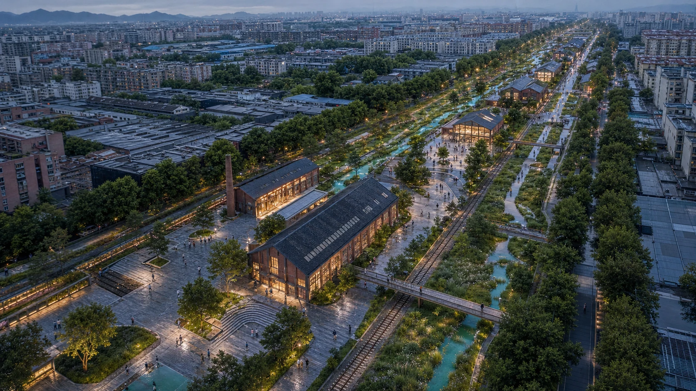
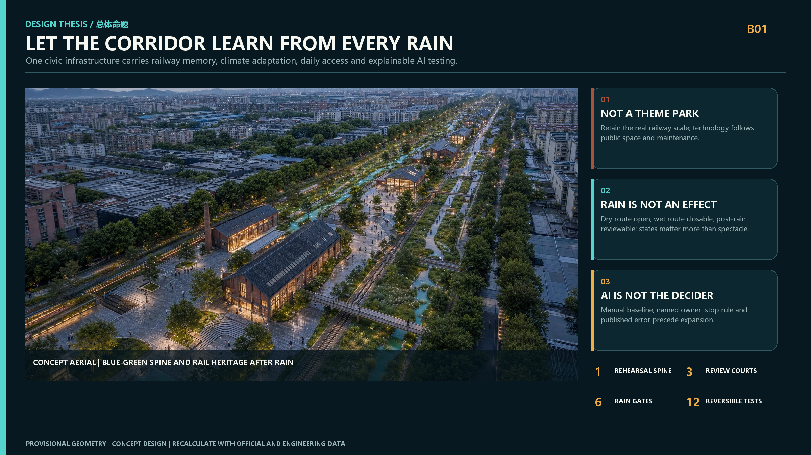
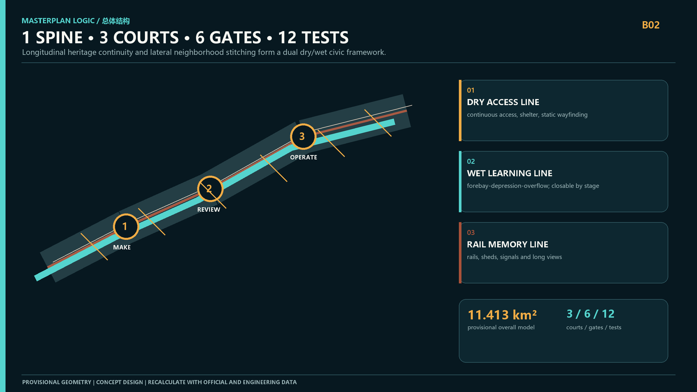
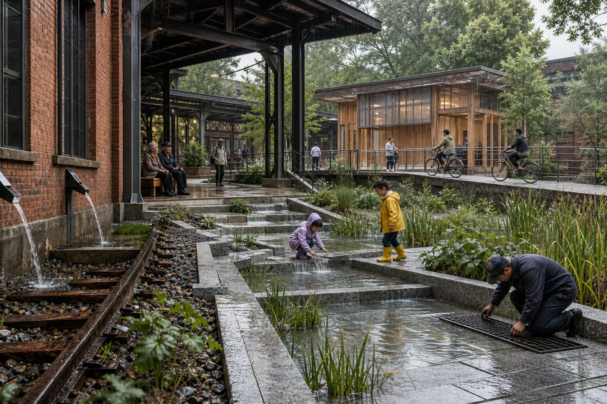
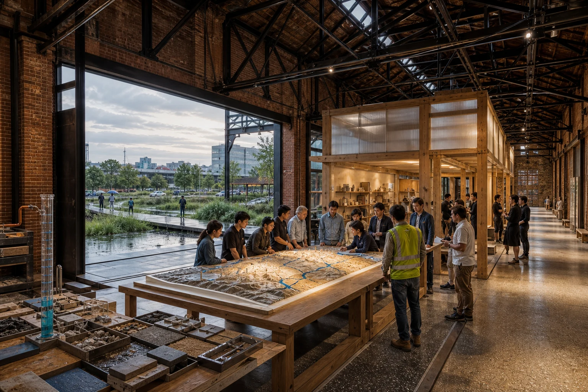
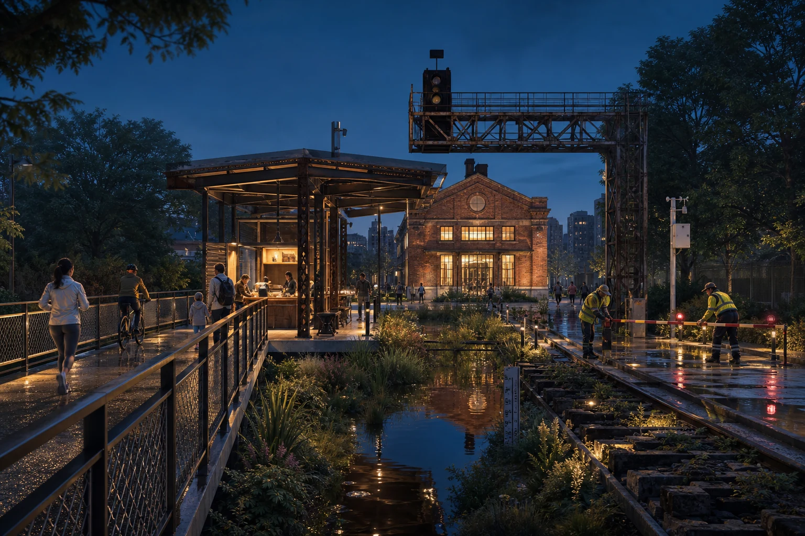
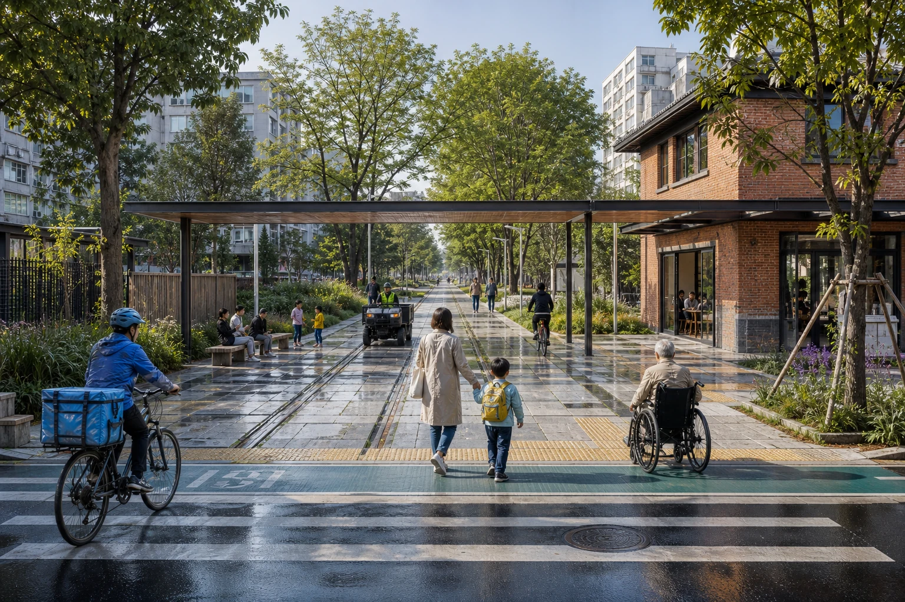

# JING-ZHANG RAIN REHEARSAL / 京张雨演

> **Do not build another showroom for AI. Turn the entire Jing-Zhang corridor into a public rehearsal for how a city learns.**

The century-old railway already has a powerful historical axis, but it still lacks a civic mechanism that joins innovation, everyday neighborhood life, and climate resilience. The proposal uses rainfall as a shared stress test. A storm reveals broken walking links, inaccessible routes, conflicts in commercial back-of-house space, unused heritage buildings, delayed maintenance, and wrong algorithmic decisions at the same time. Rain therefore becomes a public timeline for observing and correcting the city, rather than an engineering input hidden underground.

The spatial idea is **one spine, three courts, six gates, twelve rehearsals**. A continuous rain-rehearsal spine retains the direction and material memory of the railway while organizing rain gardens, a dry accessible route, and public readings. Three courts test an innovation through fabrication, civic review, and everyday operation. Six rain gates reconnect neighborhoods across the linear park. Every AI+ scenario has a manual baseline, a non-AI equivalent route, a stop rule, and a post-rain review. AI structures evidence; accountable people make decisions.

## Design Basis and Source List

The open-call announcement and Agent Taskbook define the task; the repository site package, source registry, professional-standard snapshots, and machine-readable layers form the evidence base [source:OFFICIAL-ANNOUNCEMENT] [source:AGENT-TASKBOOK] [source:SOURCE-REGISTRY] [source:SITE-PACKAGE] [standard:PROJECT-OFFICIAL-ANNOUNCEMENT] [standard:PROJECT-AGENT-OPEN-CALL-TASKBOOK]. The proposal separates official facts, recalculable design models, and matters requiring professional confirmation.

The current site and three key-area geometries are explicitly provisional. They support design modeling and content review but are not statutory redlines, precise-area evidence, or engineering design [data:geometry/site_boundary.geojson#SITE-001] [data:geometry/key_areas.geojson#PROV-KEY-001]. Official boundaries, planning controls, ownership, drainage, utilities, fire safety, and heritage conditions must trigger a coordinated recalculation.

## Three-Level Scope Framework

The three scopes form one chain of decisions rather than three unrelated drawing sets [depth:three_level_scope_framework]. At 43.6 km², the proposal creates an innovation chain of controlled fabrication, public co-testing, and operational learning. At roughly 11.4 km², it uses one spine, six gates, and parallel dry/wet routes to reconnect the corridor. At the three key areas, it develops distinct architectural prototypes instead of repeating one generic AI district. The structure is recorded in [data:geometry/land_use.geojson#LU-001], [data:geometry/roads.geojson#ROAD-001], [data:geometry/public_space.geojson#PUBLIC-001], and [depth:overall_spatial_structure].

## Coordinated Research Area: Industry and Future City Research

The corridor does not need another place that displays AI. It needs a spatial institution where technology can be tested at small scale, allowed to fail in public, corrected, and only then expanded. Universities frame problems; Zhongzhi Park tests materials, devices, and models; the AI Origin Community enables residents, students, and developers to review results together; Dazhongsi tests mature services in transit, commerce, and night operations [source:PROCESSED-FACT-PACK] [depth:industry_future_city_research].

A future city is measured by three capacities: can ordinary people understand what a system is doing; can the city still operate when the system fails; and can a failure leave evidence that improves the next version? The identity combines a raindrop and a railway switch: a shared watershed and the right to choose another route.

## Overall Design Area: Urban Renewal and Regulatory-Plan-Level Urban Design

Three repeatable components organize the overall design [standard:MOHURD-CONTROL-DETAILED-PLANNING] [depth:land_use_layout] [depth:development_intensity_controls]. The **dual dry/wet spine** pairs a continuous accessible promenade with a rain garden that can flood or close without blocking movement. **Six rain gates** combine crossings, cycle priority, shelter, seating, and first-stage runoff treatment at the strongest east-west desire lines. **Three review courts** insert reversible timber-and-steel rooms, deep canopies, and open worktables into retained railway fabric.

Land use, buildings, roads, and open space remain traceable through [data:geometry/land_use.geojson#LU-001], [data:geometry/buildings.geojson#BLDG-001], [data:geometry/roads.geojson#ROAD-001], and [data:geometry/green_space.geojson#GREEN-001]. Height, FAR, and road-control lines remain unknown until official controls are available.

## Detailed Design of Key Areas

The three key areas describe one complete journey from experiment to daily urban operation [depth:three_key_area_detailed_design].

**01 Zhongzhi Park - Rain Prototype Court.** Retained workshops and rails frame replaceable material benches, a controlled rain rig, and manual water gauges. Roof runoff remains visible as it crosses stepped rain terraces. The public stays in a low-risk learning zone; equipment tests use movable separation. The reversible timber-and-steel insert does not touch the heritage shell. The court tests whether the place can exit safely when devices disconnect or readings conflict [data:geometry/key_areas.geojson#PROV-KEY-001].

**02 AI Origin Community - Co-measure Review Court.** A large-span industrial shed becomes a civic review room. Original brick, trusses, rails, and crane traces remain visible; a detached timber insert holds open classes, material archives, and community meetings. A central table connects the physical terrain model, post-rain failures, and human corrections. Open doors place the discussion in direct sight of the actual rain garden [data:geometry/key_areas.geojson#PROV-KEY-002].

**03 Dazhongsi - Continuous Operations Court.** A dry raised promenade links transit, ground-floor commerce, repair, drinking water, umbrella exchange, and human assistance. A wet segment may close with physical barriers while an obvious alternative remains open. Delivery, waste collection, and public walking are separated by time and frontage; AI does not create worker-performance profiles [data:geometry/key_areas.geojson#PROV-KEY-003] [metric:key_area_count].

## AI Innovation Ecosystem, Personas, and AI+ Scenarios

Five personas represent rights that technology must not average away: continuity for commuters; safe exit for children and carers; non-phone access for older and mobility-impaired people; bounded real-world testing for researchers; and a dignified back-of-house for merchants, couriers, and maintainers. Scenarios remain attached to [data:geometry/public_space.geojson#PUBLIC-001] and [metric:public_space_ratio].

The twelve rehearsals are grouped into fabrication (synthetic-rain material bench, blackout drainage test, umbrella circulation), co-testing (accessible rain walk, children's water class, open-source review table, rain-sound archive), and operations (night-rain help station, transit rain gate, commercial continuity, post-rain inspection, and an annual Rain Rehearsal Week). Every event records what was prepared, what happened, when it stopped, and what must change next. Models may leave the courts only when inputs, errors, and human corrections can be explained.

## Land Use, Building Scale, and Retain-Renovate-Demolish Strategy

The project identifies value before choosing an intervention [standard:MNR-LAND-USE-CLASSIFICATION-GUIDE] [depth:retain_renovate_demolish] [depth:height_massing_character]. Railway buildings, rails, signal gantries, and mature trees enter the retain inventory first. Repairable structures receive reversible reuse. Objects without survey, ownership, or heritage evidence remain to be confirmed.

New architecture is limited to three families: detached timber rooms inside heritage shells, deep rain canopies over public routes, and lightweight service pavilions. Repaired brick, dark recycled steel, warm timber, pale permeable stone, and seasonal grasses make the palette. Building footprint remains auditable through [data:geometry/buildings.geojson#BLDG-001] and [metric:building_footprint_area_sqm].

## Transport, Rail, Municipal Infrastructure, and Public Services

The mobility test is simple: during rain, can the most vulnerable user cross the corridor without a detour, without stepping into water, and without a smartphone? Six gates combine crossings, cycle priority, accessible grades, shelter, seating, and staffed service points. The spine separates a dry through-route from a wet observation route that may close [depth:traffic_rail_slow_parking].

Municipal design distinguishes visible surface pathways from underground engineering that still requires verification. Roof and paving runoff pass through forebays, swales, and shallow planted depressions before reaching a professionally confirmed outlet. Capacity, return period, soil infiltration, utilities, and overflow routes remain specialist tasks [depth:municipal_new_infrastructure] [data:geometry/constraints.geojson#CONSTRAINTS].

## Blue-Green Network, Public Space, and Urban Character

The blue-green network has clear operating states: lawn, learning space, and movement edge in dry weather; visible collection and filtration in light rain; partial closure and retention in a storm; inspection and public review afterward. Parallel dry and wet routes keep landscape performance from interrupting universal access [standard:MOHURD-URBAN-DESIGN-MEASURES] [depth:blue_green_public_space].

The modeled green and public-space ratios are [metric:green_ratio] and [metric:public_space_ratio], based on [data:geometry/green_space.geojson#GREEN-001] and [data:geometry/public_space.geojson#PUBLIC-001]. They describe provisional design allocation, not statutory controls. Railway direction, repaired brick and steel, mature canopy, and low-level night lighting define the urban character; giant screens and spectacle lighting do not.

## Renewal Projects, Implementation Policy, and Phasing

In months 0-12, establish manual gauges, a rainfall baseline, accessibility walks, and one temporary gate. In years 1-3, deliver the Prototype and Review Courts plus three connected gates after drainage, structural, heritage, and fire review. In years 3-5, complete the Operations Court, six-gate network, and annual public review cycle. Each phase has an exit rule and publishes what was changed after one rainy season.

Phasing is recorded in [data:geometry/phasing.geojson#PHASE-001], [depth:renewal_project_list], and [depth:phasing_implementation]. The key policy is a repeatable micro-renewal loop: trial permission, open evidence, professional review, public review, and version update. Names and schedules remain design recommendations rather than government commitments.

## Metrics, Area Recalculation, and Compliance Matrix

One GeoJSON model produces the spatial metrics: approximately 11.413 km² provisional overall area [metric:site_area_sqm], 12.34% modeled green space, 7.33% modeled public space, and the building-footprint value in [metric:building_footprint_area_sqm]. Recalculable geometry, unknown statutory controls, and future operational performance remain separate [depth:metrics_recalculation].

The competition-level tests are more direct: does the dry route remain walkable; was the non-AI baseline rehearsed; did people understand closures and detours; and did the post-rain review produce a verifiable correction? `compliance_matrix.json`, `standard_matrix.json`, and `design_depth_matrix.json` preserve the audit trail.

## Risk, Copyright, and Compliance

The central risk is mistaking a compelling concept image for approved engineering. Boundaries, key areas, drainage capacity, structure, ownership, planning controls, roads, utilities, fire safety, heritage status, and delivery bodies require official data and professional confirmation [depth:risk_missing_data]. All renderings are AI-generated design visualizations, not site photographs, public opinion, or government commitments; generation and rights are documented in `report/copyright_statement.md`.

The offline HTML loads no remote scripts, maps, fonts, or trackers. AI scenarios collect no personal trajectories, build no child or worker profiles, and never replace approvals or accountable on-site decisions. Formal-review-ready means auditable, not selected, approved, or construction-ready.

## References

- `brief/public-brief.md`
- `brief/site-package/design_brief.json`
- `brief/site-package/agent_taskbook.json`
- `brief/site-package/allowed_design_space.json`
- `brief/site-package/standards/standards.json`
- `data/source_registry.json`
- `data/processed/agent_fact_pack.md`
- `docs/data-workflow.md`
- Full provenance, license, and use restrictions are recorded in `sources.json` and `standard_matrix.json`.
