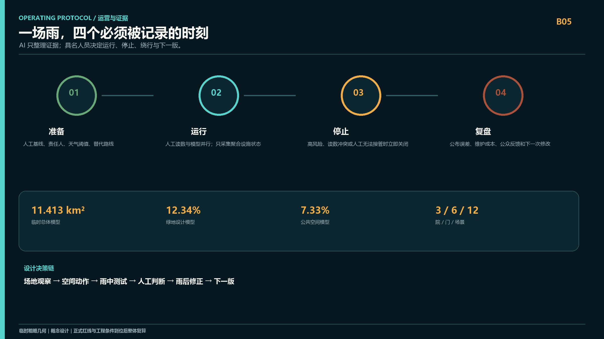
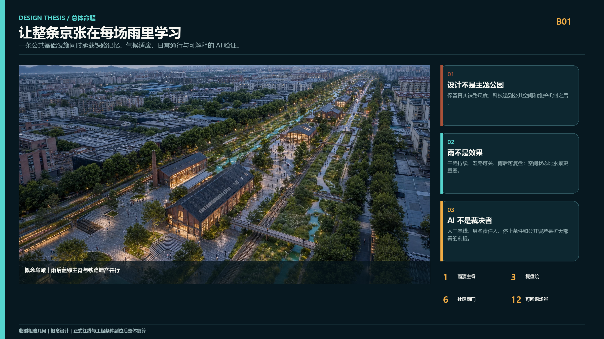
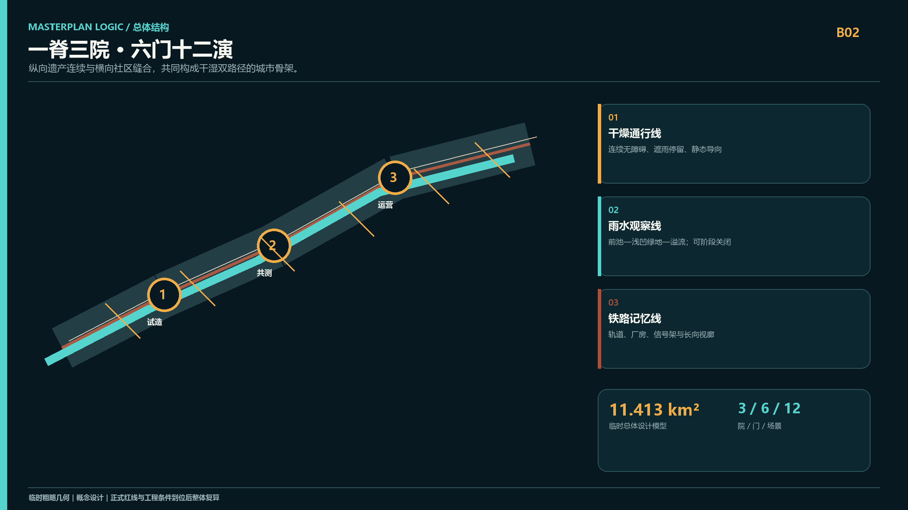
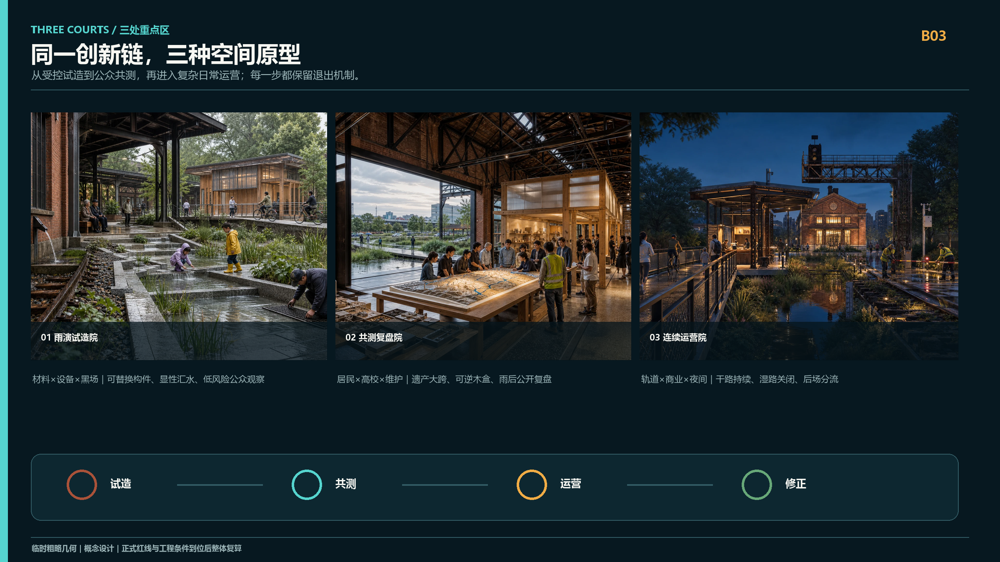
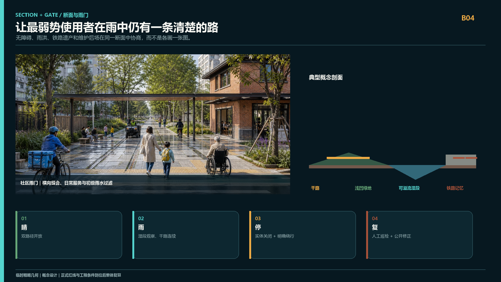

# 京张雨演 / JING-ZHANG RAIN REHEARSAL

> **不是为 AI 建一座展厅，而是让整条京张成为一场城市如何学习的公开演练。**

百年京张已经拥有清晰的历史轴线，却仍缺少一种把产业创新、社区日常与气候韧性真正缝合起来的公共机制。方案选择“降雨”作为共同压力测试：它会同时暴露慢行断点、无障碍失效、商业后场冲突、遗产空间闲置、设施维护滞后与算法判断偏差。雨不再只是被地下管网带走的工程对象，而成为城市共同观察、共同修正的时间界面。

“京张雨演”提出 **一脊三院、六门十二演**：一条连续雨演主脊保留铁路方向感，组织雨水花园、干燥慢行线与公共读数；三座复盘院完成“试造—共测—运营”的递进验证；六道雨门把东西两侧社区重新接回遗址公园；十二个 AI+ 场景全部具备人工基线、无 AI 等价路径、停止条件和雨后复盘。AI 不决定城市，只负责把现场证据组织得更可读，最终判断始终交给具名的人。

## 设计依据与资料清单

公开征集公告和面向智能体任务书共同定义任务 [source:OFFICIAL-ANNOUNCEMENT] [source:AGENT-TASKBOOK]。

场地包与来源登记构成事实底座 [source:SOURCE-REGISTRY] [source:SITE-PACKAGE]；专业标准快照约束成果深度 [standard:PROJECT-OFFICIAL-ANNOUNCEMENT]。

智能体任务书的专业要求另由本地快照核对 [standard:PROJECT-AGENT-OPEN-CALL-TASKBOOK]。方案把“官方事实、可复算设计模型、待专业确认事项”分开表达，不以渲染图制造现状或审批结论。

当前 `SITE_BOUNDARY` 与三处 `KEY_AREA` 为明确标注的临时粗略几何，只用于构建设计模型、核对结构和接受内容评审；不作为法定红线、精确面积或工程设计依据 [data:geometry/site_boundary.geojson#SITE-001] [data:geometry/key_areas.geojson#PROV-KEY-001]。正式边界、控规、权属、排水、市政、消防与文保条件到位后，应整体替换图层并重算指标。完整来源、假设和审查轨迹分别见 `sources.json`、`assumptions.json` 与 `self_check.json`。

## 三层范围工作框架

方案不是在三个范围内分别作图，而是建立一条从区域判断到建筑动作的传导链 [depth:three_level_scope_framework]：

| 层级 | 核心判断 | 设计成果 | 评审方式 |
| --- | --- | --- | --- |
| 43.6 km² 统筹研究 | AI 创新带缺少可被公众理解、被企业验证、被治理吸收的共同界面 | “开放试造—公众共测—日常运营”创新链 | 看产业、人才与公共价值是否形成闭环 |
| 约 11.4 km² 总体设计 | 铁路遗产纵向连续，东西社区联系和蓝绿系统仍需缝合 | 一条雨演主脊、六道雨门、连续干湿双路径 | 看结构能否落到用地、道路、绿地和项目 |
| 三处重点区 | 三个片区不应复制同一种“AI 园区” | 试造院、复盘院、运营院三类空间原型 | 看建筑、公共空间、交通与运营能否被实施 |

总体结构由 [data:geometry/land_use.geojson#LU-001]、[data:geometry/roads.geojson#ROAD-001] 和 [data:geometry/public_space.geojson#PUBLIC-001] 共同表达。

整体空间深度由 [depth:overall_spatial_structure] 复核。它不是新增控制线，而是帮助专业团队在官方条件到位后快速校准的空间骨架。

## 统筹研究范围产业与未来城市研究

京张 AI 创新带真正稀缺的不是又一个展示 AI 的园区，而是**允许技术在真实城市中被小规模验证、公开失败、修正后再扩大的空间制度**。方案建立四段创新链：高校与科研机构提出问题；众智园完成材料、设备和模型的受控测试；原点社区让居民、学生和开发者共同复核；大钟寺把成熟能力放入轨道、商业和夜间运营中继续检验。产业空间从“办公面积”升级为包含试验场、共创桌、维护后场和公众反馈面的复合基础设施 [source:PROCESSED-FACT-PACK] [depth:industry_future_city_research]。

未来城市形态不以屏幕和传感器密度衡量，而以三项能力衡量：普通人是否看得懂系统正在做什么；系统失效时城市是否仍能运行；一次失败是否能留下可供下一次设计使用的证据。品牌识别采用“水滴 / 道岔”双符号：水滴代表共同流域，道岔代表技术必须保留选择权。

## 总体设计范围城市更新与控规深度城市设计

总体设计以京张遗址公园为纵向骨架，把更新动作压缩为三种可识别构件 [standard:MOHURD-CONTROL-DETAILED-PLANNING] [depth:land_use_layout] [depth:development_intensity_controls]：

1. **干湿双脊。** 保存铁路线性记忆；靠城市一侧设置连续、无障碍的干燥慢行线，靠公园一侧设置可溢流、可封闭的雨水花园。二者通过可视水口、人工标尺和维护踏步建立联系，但互不替代。
2. **六道雨门。** 在东西向需求最强的位置形成社区前厅，整合过街、骑行、停留、避雨和初级净化。每道雨门都有不依赖手机的导向、无障碍连续面和可到达的人工服务点。
3. **三座复盘院。** 利用可保留或可逆改造的铁路建筑与首层空间，嵌入轻型木—钢盒体、深檐廊架和开放工作台。新介入不覆盖遗产构件，设备可拆换，公共空间在无活动时仍是日常公园。

用地与建筑分别落在 [data:geometry/land_use.geojson#LU-001] 和 [data:geometry/buildings.geojson#BLDG-001]。

道路与开放空间分别落在 [data:geometry/roads.geojson#ROAD-001] 和 [data:geometry/green_space.geojson#GREEN-001]。建筑高度、容积率和道路红线在缺少正式条件时保持 unknown。

## 重点区域详细设计

三处重点区不是同一形式的复制，而是一次城市创新从实验到日常的完整旅程 [depth:three_key_area_detailed_design]。

### 01 众智园｜雨演试造院

保留铁路厂房和轨道痕迹，在厂房檐下设置可替换材料台、合成降雨架和人工量水尺；屋面雨水经明渠进入阶梯雨庭，溢流方向在地面上清楚可读。儿童和公众只进入低风险观察区，设备试验区以可移动构件分隔。新增部分采用与遗产外壳脱开的木—钢轻体。这里验证的不是“算法有多聪明”，而是设备断网、读数冲突和维护不到位时空间还能否安全退出 [data:geometry/key_areas.geojson#PROV-KEY-001]。

### 02 北京 AI 原点社区｜共测复盘院

将一处可开放的工业大跨空间改造为“城市复盘厅”：原砖墙、钢桁架和吊车梁继续作为时间证据；新木构盒体与遗产外壳脱开，容纳开放课堂、材料档案和社区议事。中央长桌同时展示地形模型、雨后故障和人工修正，所有模型输出都必须回到现场照片、匿名读数和维护记录。面向雨庭的大门完全开启后，室内讨论与室外真实积水痕迹处于同一视线 [data:geometry/key_areas.geojson#PROV-KEY-002]。

### 03 大钟寺｜连续运营院

重点不是再造地标，而是让轨道接驳、首层商业、夜间服务和维护后场在强降雨后仍可连续工作。方案设置一条高于浅凹绿地的干燥公共廊道，把社区服务、修理、饮水、雨具借还和人工求助串联起来；积水段以实体栏杆和低位信号封闭，同时给出清楚绕行。配送、垃圾清运与公众步行分时分面组织，不以 AI 对劳动者做绩效画像 [data:geometry/key_areas.geojson#PROV-KEY-003] [metric:key_area_count]。

## AI 创新生态、人才画像与 AI+ 场景

五类人不是“用户标签”，而是五种不能被技术平均掉的空间权利：通勤者需要连续；儿童与照护者需要可退出；老年人与行动不便者需要不用手机也能抵达；研究者需要真实但有边界的测试；商户、骑手与维护者需要不被算法考核的工作后场。场景依附于 [data:geometry/public_space.geojson#PUBLIC-001] 和 [metric:public_space_ratio]，不漂浮在平台界面中。

| 场景组 | 12 个雨演动作 | AI 的有限角色 | 无 AI 基线 / 停止条件 |
| --- | --- | --- | --- |
| 试造 | 01 合成雨材料台；02 黑场排水；03 雨具循环 | 比较材料、预测补货、记录误差 | 人工量尺与纸质借还；读数冲突即停止外推 |
| 共测 | 04 无障碍雨行；05 儿童水路课；06 开源复盘桌；07 雨声档案 | 汇总匿名设施状态、辅助整理版本 | 现场引导与实体模型；不得采集儿童生物信息 |
| 运营 | 08 夜雨安心站；09 轨道接驳雨门；10 商业连续运营；11 雨后巡检；12 Rain Rehearsal Week | 预测拥堵与维护优先级、形成复盘草案 | 人工广播、静态绕行、具名维护决定；高风险即关闭场景 |

每次演练生成一张四格记录：**准备了什么—现场发生什么—何时停止—下次改什么**。只有输入来源、误差和人工修正都能公开解释的模型，才允许从院内测试进入主脊；任何扩大部署都要重新审查隐私、无障碍和运营责任。

## 用地、建筑规模与拆改留方案

更新遵循“先识别价值，再决定介入” [standard:MNR-LAND-USE-CLASSIFICATION-GUIDE] [depth:retain_renovate_demolish] [depth:height_massing_character]。铁路站房、厂房、轨道、信号架和成熟树木首先进入保留清单；结构安全可修复但功能封闭的建筑采用可逆改造；缺少测绘、权属或文保结论的对象一律标记待确认。

新建筑不是独立造型，而是三类小尺度部件：脱开遗产墙体的室内木盒、覆盖公共路径的深檐雨廊、服务维护和社区使用的轻型亭。体量服从既有檐口和铁路方向，材料控制为修补砖、深色再生钢、温暖木材、浅灰透水石和季相草本。建筑基底由 [data:geometry/buildings.geojson#BLDG-001] 和 [metric:building_footprint_area_sqm] 复核；最终规模待正式控规与结构鉴定确认。

## 交通、轨道、市政与公共服务设施

交通设计只回答一个问题：下雨时，最弱势的使用者能否不绕远、不涉水、不依赖手机穿过这条带。六道雨门将人行过街、骑行优先、无障碍坡面、遮雨停留和社区服务合并为一个清楚的横向空间；铁路主脊内部以干燥通行线和可暂时关闭的湿地观察线分工 [depth:traffic_rail_slow_parking]。

市政策略采用“看得见的地表路径 + 待核验的地下工程”双层表达。屋面与铺地径流先经前池、植草沟和浅凹绿地，再进入需由水务专业确认的排放系统；所有容量、重现期、土壤渗透、地下管线和溢流去向均不由概念模型替代 [depth:municipal_new_infrastructure] [data:geometry/constraints.geojson#CONSTRAINTS]。公共服务设施优先布置在既有建筑首层和雨门前厅，设备停机后仍能提供座椅、饮水、照明、纸质地图和人工求助。

## 蓝绿空间、公共空间与城市风貌

蓝绿系统不是装饰性“生态带”，而是一组有明确使用状态的空间：晴天是草坡、课堂和慢行边界；小雨时展示汇水与过滤；暴雨时部分关闭、承担调蓄；雨后开放巡检与复盘。干湿双路径让景观性能不以牺牲通行连续性为代价 [standard:MOHURD-URBAN-DESIGN-MEASURES] [depth:blue_green_public_space]。

设计模型中的绿地比例和公共空间比例分别为 [metric:green_ratio] 与 [metric:public_space_ratio]。

两类比例来源为 [data:geometry/green_space.geojson#GREEN-001] 和 [data:geometry/public_space.geojson#PUBLIC-001]。这些数值只说明当前几何模型的空间分配，不等同于法定指标。城市风貌以铁路遗产的长向尺度、砖与钢的材料连续性、成熟树冠和低位夜间照明为主，避免巨型屏幕、霓虹装置或仿科技造型覆盖百年京张本身。

## 更新项目清单、实施政策与分期计划

| 阶段 | 项目 | 可交付成果 | 启动条件 | 退出 / 复盘 |
| --- | --- | --- | --- | --- |
| 0-12 个月 | RR-01 人工标尺与雨演基线；RR-02 一道样板雨门 | 现场测绘、人工雨天日志、无障碍走查、临时构件 | 场地产权和安全许可 | 不能保持干燥通行即撤除临时设施 |
| 1-3 年 | RR-03 试造院；RR-04 复盘院；三道连续雨门 | 可逆建筑插入、雨庭样段、公开复盘制度 | 排水、结构、文保、消防专业审查 | 一季运行后按维护成本和公众反馈调整 |
| 3-5 年 | RR-05 连续运营院；RR-06 六门成网与年度雨演周 | 轨道接驳、商业后场、完整主脊运营 | 站城、道路与市政条件落实 | 每年公开误差、关闭记录和下一年度版本 |

分期由 [data:geometry/phasing.geojson#PHASE-001]、[depth:renewal_project_list] 与 [depth:phasing_implementation] 约束。政策重点不是一次性投资，而是建立“试点许可—开放数据—专业复核—公众复盘—版本更新”的微更新机制；活动名称和实施时序均为设计建议，不代表政府承诺。

## 指标体系、面积复算与合规矩阵

空间指标来自同一套 GeoJSON 复算：临时总体范围约 11.413 km² [metric:site_area_sqm]，绿地模型约 12.34%，公共空间模型约 7.33%，建筑基底面积见 [metric:building_footprint_area_sqm]。三类数字严格分开：可由几何复算的写入 `metrics.json`；依赖法定控规的保持 unknown；依赖运营的数据在建成后持续采集 [depth:metrics_recalculation]。

更重要的竞赛评估指标是四个问题：雨中连续路线是否真实可走；无 AI 基线是否每次都被演练；关闭和绕行是否被公众理解；雨后是否留下可验证的修正。`compliance_matrix.json` 把公告任务映射到章节、图层、图纸和页面；`standard_matrix.json` 与 `design_depth_matrix.json` 分别记录规范覆盖和专业深度。

## 风险、版权与合规说明

最大风险不是效果图不够确定，而是把概念图误读为已批准工程。因此本方案明确：边界、重点区、排水能力、结构安全、权属、控规、道路、市政、消防、文保和实施主体均须由官方资料与专业团队确认 [depth:risk_missing_data]。所有渲染图为 AI 生成的设计想象，用于解释空间关系，不是现状照片、公众意见或政府承诺；图像来源、提示词范围和版权状态见 `report/copyright_statement.md`。

HTML 不加载远程脚本、地图、字体或追踪器；AI 场景不采集个人轨迹、不建立儿童或劳动者画像、不以算法替代审批和现场责任。方案当前状态只表示机器可读、可进入专业评审，不表示已选中、已审批或可直接施工。

## 参考资料

- `brief/public-brief.md`
- `brief/site-package/design_brief.json`
- `brief/site-package/agent_taskbook.json`
- `brief/site-package/allowed_design_space.json`
- `brief/site-package/standards/standards.json`
- `data/source_registry.json`
- `data/processed/agent_fact_pack.md`
- `docs/data-workflow.md`
- 完整来源、许可、用途边界与检索日期见 `sources.json`；专业标准快照见 `standard_matrix.json` [source:SITE-PACKAGE]。
