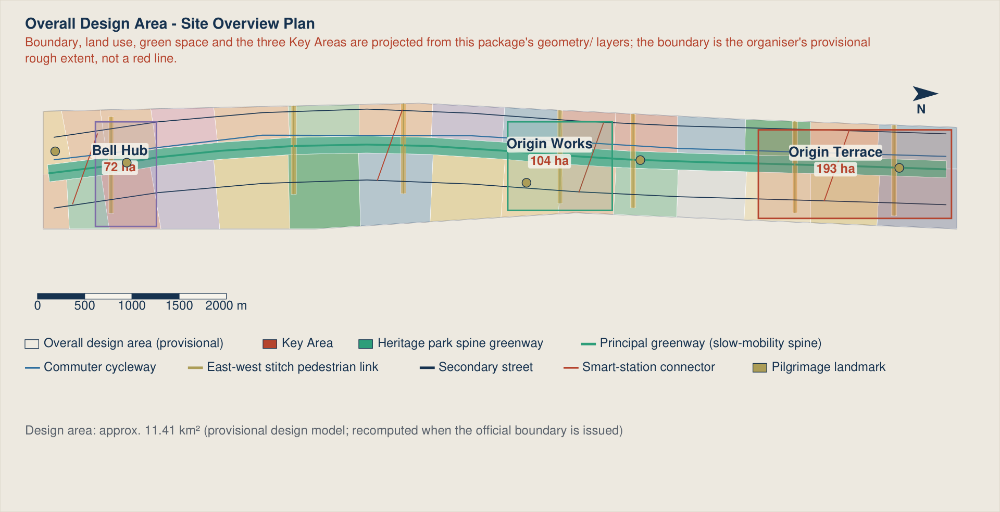
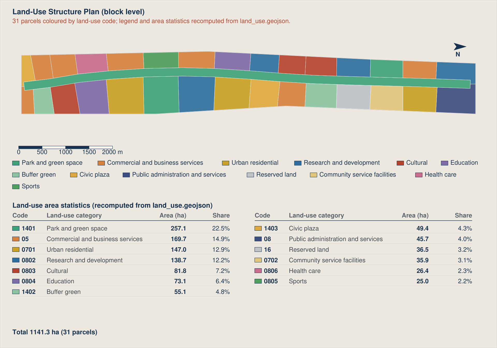
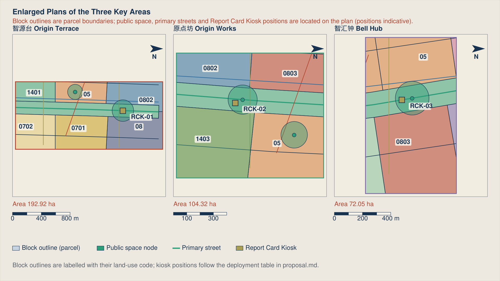
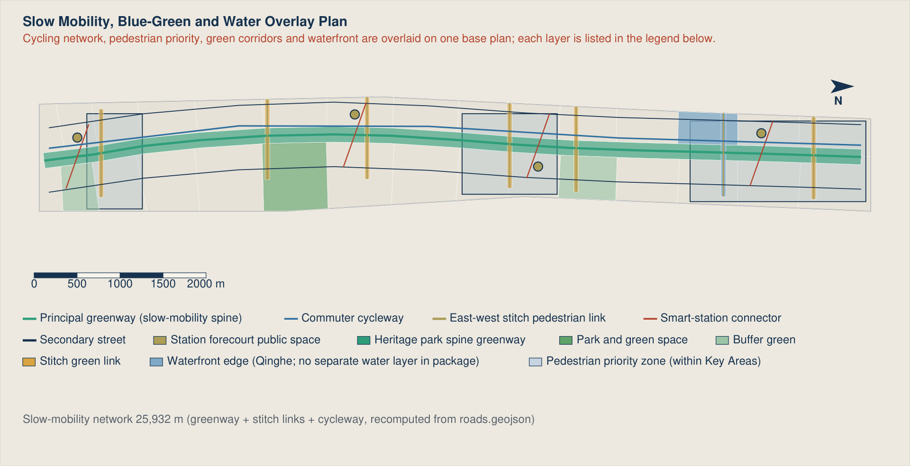
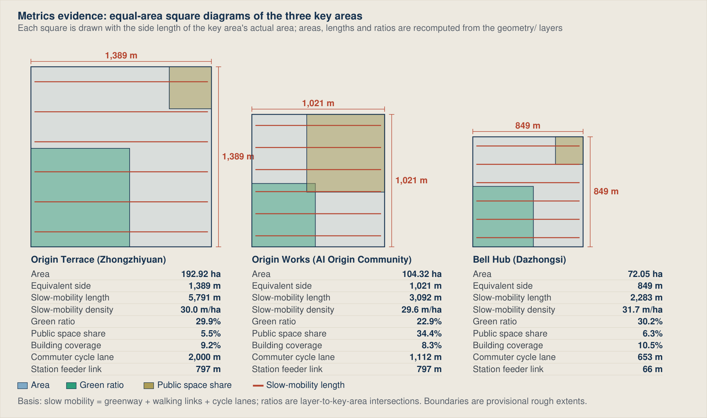

# JINGZHANG RISING - A Century of Self-Reliance, the Character for People Rising

> The proposal in one sentence: let the spirit of self-reliance embodied in Zhan Tianyou's herringbone switchback grow, along the very same corridor, into the Chinese character for "people" that begins the Chinese word for artificial intelligence - AI, for the people.

## Overall Concept, Name, English Name and Naming System

The overall concept is: taking the "herringbone switchback" at Qinglong Bridge as a geometric motif, forming a spatial narrative of "a century of self-reliance, the character for people rising". Through four origin points of independent innovation and AI governance demonstration, we give Haidian the spatial identity of "the source of independent innovation".

The concept is integrated in three layers from the outset rather than added as a later chapter: the spatial layer uses the folded 人 geometry to organise one spine, three terraces, two wings and two stitches; the operating layer records century-long contributions, present experiments and future corrections as a Temporal Commons; the governance layer uses "human fallback + public report card" to decide whether an AI service may enter public space. The three layers answer what it looks like, how it accumulates value over time, and why it may be admitted.

Name: JINGZHANG RISING (京张向上)

English Name: JINGZHANG RISING

Naming System: One spine · Three terraces · Two wings · Two stitching systems

JINGZHANG RISING
One spine · Three terraces · Two wings · Two stitching systems

## One-Page Jury Entry: Seven Evidence Dimensions and Six Agent Tasks

This page is an evidence navigator, not a self-score. Every row points to an institution, spatial move, implementation sequence or deliverable that can be checked directly. If the index conflicts with the narrative, structured files or figures, the structured evidence and public boundary declarations govern.

| Jury question | Direct answer | Where to verify | Failure test |
| --- | --- | --- | --- |
| Does it answer the brief completely? | The three scope levels, three positionings, five functions, three areas and two wings, and `agent.1-agent.6` form a section-layer-metric-drawing-web loop | The next table, 23 rows in `compliance_matrix.json`, and task coverage in Figure 05 [standard:PROJECT-AGENT-OPEN-CALL-TASKBOOK] | If any mandatory task has no openable output, it is not covered |
| Is there an irreplaceable original judgement? | "A century of self-reliance, the character for people rising" links the 1909 engineering achievement, the 1949 examination journey, the 1980 Zhongguancun origin and contemporary AI self-reliance; "human fallback + public report card" turns the proposition into an admission rule | "Four Origins" and "Human fallback and public report card" [depth:overall_spatial_structure] [depth:risk_missing_data] | If generic technology-park language can replace it without loss, the proposition fails |
| Does AI genuinely enter urban planning? | Twelve cards specify space, operation, minimum data, human route, release evidence and exit; four industrial tests address stack adaptation, business stress, embodied safety and multi-agent coordination | "Twelve AI+ scenario cards" and "Four industry-grade test scenarios" [metric:scenario_card_count] [metric:industry_test_scenario_count] | Equipment names without responsibility and exit conditions are not AI planning innovation |
| Can it be implemented? | Three first-start pilots use six 90-day evidence gates for baseline, tabletop rehearsal, shadow flow, AI-off drill, authorised trial and independent review; one-year indicators then decide continuation, redesign or exit | "First-start pilots" and "The first 90-day evidence gates" [depth:phasing_implementation] | If ownership, permission, human route or restoration responsibility is missing, on-site action cannot start |
| Does it protect public interest? | Six core personas plus residents, elderly people, visitors, disabled people, low-income and flexible workers are mapped to real situations; AI is never the only public-service entrance | "Six personas", "What six user groups actually face", and "Inclusion is an admission condition" | If an equivalent human route fails, the AI route stops too |
| Does it respect risk and compliance? | Fifty-seven known metrics are recomputable and three statutory-control metrics remain explicitly unknown; ten risks, a file-by-file rights ledger and provisional-boundary warnings are disclosed | `metrics.json`, the risk register and `report/copyright_statement.md` [assumption:A-CONTROLS-001] | A fact unsupported by public or cleared evidence does not enter a conclusion |
| Is the expression complete? | Five paired bilingual fixed figures, bilingual A3/A0 PDFs, and paired narrative and interactive offline HTML can each be read independently; every deliverable is a static file and depends on no video or executable content | `assets/figures/`, `drawings/`, `report/`, `visual/` | If a primary channel is unreadable, text or static figures provide an equivalent fallback |

| Agent task | Delivered mandatory outputs | Direct entry |
| --- | --- | --- |
| `agent.1` overall concept and function coordination | Chinese/English names, naming system, logo direction, three positionings, five functions, three-areas/two-wings loop, overall structure and regional interfaces | This chapter, Figure 01, and "The coordination loop" |
| `agent.2` **full-stack self-reliance** and innovation ecosystem | Eight cases, AI innovation ecosystem map, six-layer stack, eight-factor guarantees and technology testing | "Coordinated-area industry and future-city research" and "Factor guarantees and technology testing" |
| `agent.3` AI+ scenarios and active city | Twelve full operating cards, four industrial validation scenarios, six core personas, and scenario-space-operation-exit mapping | "AI innovation ecosystem, personas and AI+ scenarios" |
| `agent.4` public space, new business and landmarks | Continuous heritage-park spine, north-south continuity and east-west stitching, four pilgrimage landmarks, an honour display system and six public-space components | "Four Origins", "Honour display system and public-space component library", and Figure 03 |
| `agent.5` fused cultural narrative | Railway-examination-Zhongguancun-AI four-origin timeline, folded-angle wayfinding, symbols and international copy | "Four Origins", "Naming system and visual identity", and "International communication" |
| `agent.6` global activities and long-term operation | One conference, one competition, one festival and one list; monthly developer-community operation; scenario opening; seven-step attraction-to-conversion pathway; brand assets | "Global AI event system" and "Developer-community operation and conversion pathway" |

---

## Design Basis and Source List

This is an agent-authored design package for the open call for the Centennial Jing-Zhang AI Innovation Belt urban design. Its primary basis is the organiser's official announcement and the agent-facing open-call taskbook [source:OFFICIAL-ANNOUNCEMENT] [standard:PROJECT-OFFICIAL-ANNOUNCEMENT]. The announcement requires the urban-design depth of a regulatory detailed plan and of a comprehensive implementation plan. This package therefore does not treat written vision as the deliverable; it treats recomputable structured evidence as the foundation.

Task decomposition, mandatory items and forbidden claims come from the open-call taskbook [source:AGENT-TASKBOOK] [standard:PROJECT-AGENT-OPEN-CALL-TASKBOOK]. Site enumerations, the allowed design space, metric definitions and schemas come from the site package [source:SITE-PACKAGE]. The permitted use of each source is bounded by the registry: background-only and provisional-only material must never be promoted into an official boundary, a statutory plan, or a government commitment [source:SOURCE-REGISTRY]. The processed fact pack is a reading-navigation layer only and is not a new authority [source:PROCESSED-FACT-PACK].

An honest statement about the boundary. The official `SITE_BOUNDARY` and the three official `KEY_AREA` polygons have not been released. This package uses the organiser's registered provisional rough surrogate boundary [source:BOUNDARY-SOURCE] [source:KEY-AREA-SOURCE]. Accordingly `geometry/site_boundary.geojson` and `geometry/key_areas.geojson` are both marked `official_boundary=false` and `geometry_role=provisional_constraint`. All spatial output is a conceptual recommendation available for professional teams to develop further; it must not be used as an official redline, an approval basis, or a precise-area basis [assumption:A-CONTROLS-001].

The site area is recomputed from geometry [data:geometry/site_boundary.geojson#SITE-001] [metric:site_area_sqm]. The count and total area of the key areas are cross-checked against a separate layer [data:geometry/key_areas.geojson#PROV-KEY-001] [metric:key_area_count]. Once official polygons are published, the whole package must be regenerated - geometry, metrics, drawings and HTML - rather than patched file by file [depth:existing_conditions_diagnosis].

Method statement. The package was generated by an AI agent from public material and the structured data in this repository: first lock the boundary and constraints, then generate the land-use, building, road, green-space, public-space, phasing and AI-service-node layers, and finally recompute every metric back from those layers into `metrics.json`. Any area, ratio, scale or project count that cannot be recomputed from structured data is excluded from the conclusions. Any quantified control of floor area ratio, height limit, demolition decision or road redline is marked `unknown` and deferred to statutory process [standard:MOHURD-CONTROL-DETAILED-PLANNING].

| Basis level | Content | Location in this package |
| --- | --- | --- |
| Call requirements | Announcement tasks 1.3/1.4/1.5 and agent.1-agent.6 | 23 mapped rows in `compliance_matrix.json` |
| Technical standards | Urban design measures, regulatory planning, land-use classification, design depth | 6 entries in `standard_matrix.json` |
| Design depth | 15 items from existing-conditions diagnosis to risk register | `design_depth_matrix.json` |
| Spatial evidence | 9 layers, 31 parcels, 92 building footprints | `geometry/` |
| Quantitative evidence | 60 metrics: 57 known and 3 unknown | `metrics.json` |

## Three-Level Scope Framework

The three levels defined by the announcement are translated here into three different kinds of work, not three drawings at different scales [depth:three_level_scope_framework].

The coordinated research area (about 43.6 sq km) answers "why". It addresses the position of Haidian's AI ecosystem within national self-reliant innovation, how the innovation chain and the industrial chain interlock in space, and what urban form suits AI-era productive forces. Its outputs are strategic judgements, a naming system, ecosystem mechanisms and international narrative. It draws no redlines.

The overall design area (11.41 sq km) answers "how it grows". It converts strategy into verifiable spatial structure: land-use zoning, a renewal framework, transport and utilities support, blue-green and public space, and character control. This level is the scope of every GeoJSON layer in this package [data:geometry/land_use.geojson#LU-SPINE-001] [metric:land_use_total_area_sqm].

The key areas (three, about 369.3 ha in total) answer "how it is done". They bring the structure down to blocks, parcels, buildings, public space and scenarios, and test whether it can actually be built [data:geometry/key_areas.geojson#PROV-KEY-002] [metric:key_area_total_area_sqm].

The three levels are bound by two-way verification: if a strategy at one level cannot become recomputable space at the level below, the strategy is judged hollow and revised; if space at one level cannot be traced back to a strategy and a source above, the space is judged arbitrary and deleted. `compliance_matrix.json` fixes this as a five-part tuple of section, layer, metric, drawing and HTML; a missing element means the task is not covered [depth:overall_spatial_structure].

| Level | Core question | Answer in this proposal | Structured location |
| --- | --- | --- | --- |
| Coordinated research area | How to organise the AI ecosystem and future urban form | Full-stack self-reliant innovation chain, four-origins narrative, global event system | `compliance_matrix.json`, `standard_matrix.json` |
| Overall design area | How industry, renewal, transport and character land on the map | One spine, three terraces, two wings, two stitching systems; 31 parcels | [data:geometry/land_use.geojson#LU-001] [data:geometry/roads.geojson#ROAD-001] |
| Key areas | How the three districts reach detailed-design depth | Three distinct sets of moves for Origin Terrace, Origin Works and Bell Hub | [data:geometry/key_areas.geojson#PROV-KEY-003] |

### The Coordination Loop: Three Positionings, Five Functions, Three Districts and Two Wings

The announcement and the agent taskbook fix three frameworks: the three positionings, the five functions, and the three districts with two wings [source:AGENT-TASKBOOK] [standard:PROJECT-AGENT-OPEN-CALL-TASKBOOK]. This proposal does not reinvent them and does not rename them. It answers the harder question: how the three close into a loop rather than sitting as three separate lists [depth:overall_spatial_structure].

#### 1. The three positionings are a timeline, not three parallel belts

| Positioning (official) | Question answered | Time | What this proposal does |
| --- | --- | --- | --- |
| Centennial Jing-Zhang Cultural Belt (百年京张文化带) | Where we came from | Past to present | Four origins (1909 self-reliance, 1949 the examination journey, 1980 innovation, 2026 AI) strung into 9.6 walkable kilometres |
| Urban AI Life Experience Belt (都市AI生活体验带) | How people use it now | Present | Twelve AI+ scenario cards covering commuting, healthcare, admin, childcare and employment, each with a staffed human channel |
| AI Convergence Innovation Belt (AI融合创新带) | Where we are going | Present to future | Full-stack self-reliant innovation chain, open-source ecosystem, industry-grade test scenarios |

These are yesterday, today and tomorrow on one line, not three parallel belts. A proposal that only tells history becomes a memorial park; one that only builds industry becomes a business park; one that only sells experience becomes a shopping street. All three share the same 9,574.15 m heritage spine [metric:heritage_spine_length_m], so the positionings layer on one route instead of competing for land.

#### 2. How the five functions divide the work

| Function (official) | Core role | Spatial anchor | Verifiable delivery |
| --- | --- | --- | --- |
| Full-stack self-reliant AI system | Chip to framework to model to application | Zhongzhiyuan AI Self-Reliant Innovation Acceleration Area | Full-stack blocks organised by chain segment, not by company size |
| World-class AI innovation ecosystem | Open source, talent, capital, translation | Beijing AI Origin Community | Open-source release hall, corridor desks, campus-adjacent translation blocks |
| New paradigm of AI+ scenario empowerment | Scenario opening, testing, iteration | Xiaoyuehe Scenario Empowerment Wing | Twelve scenario cards plus four industry-grade test scenarios |
| Intelligent, vibrant AI city | Everyday, perceptible public services | The spine and the three terraces | Three-colour status display plus human fallback channel |
| Global voice in AI governance | Standards, evaluation, institutional export | Zhongzhiyuan AI Self-Reliant Innovation Acceleration Area | Human fallback and the public answer sheet as a reproducible minimum |

The fifth function carries the heaviest investment here, deliberately. Catching up on chips and models takes time, but the vacancy in governance rules exists right now. No city anywhere has answered who is accountable once AI enters public service. The answer offered here is not a declaration but a copyable checklist: six public-answer-sheet items and five hard requirements for the human channel. That is the most citable path, and the truest sense of the word "voice" [depth:risk_missing_data].

#### 3. The loop: making factors actually circulate

Three districts and two wings, if merely placed side by side, are only a zoning diagram. Here they are organised as one directed, closed loop:

> Zhongzhiyuan (build capability) → Origin Community (gather talent, translate results) → Xiaoyuehe Wing (supply scenarios, validate) → Dazhongsi (form industries, meet the market) → Zhongguancun Wing (allocate factors and capital) → back into Zhongzhiyuan (reinvest in R&D)

| Step | District (official name) | Input | Output | Handed to next |
| --- | --- | --- | --- | --- |
| 1 Capability | Zhongzhiyuan AI Self-Reliant Innovation Acceleration Area | R&D, compute, standards | Self-reliant models and evaluation definitions | Capability that can be tested |
| 2 Talent | Beijing AI Origin Community | Open-source community, housing, translation space | Teams and open-source results | Products awaiting validation |
| 3 Scenarios | Xiaoyuehe Scenario Empowerment Wing | Real settings, test permissions | Validation data and failure records | Solutions proven usable |
| 4 Industry | Dazhongsi AI Industry Cluster | Station-city footfall, consumption, data factors | Revenue and market feedback | Commercial proof |
| 5 Factors | Zhongguancun Technology Service Wing | Capital, IP, global allocation | Reinvestment and international channels | Back to step 1 |

The value of this loop is that it can be checked. Every break has an observable symptom: capability nobody validates (1→3 broken), open-source results that never commercialise (2→4 broken), revenue that never returns to R&D (4→5→1 broken). Whether the loop closes is therefore listed as an observable item in the annual public recomputation, rather than being drawn as an arrow diagram and left there [depth:phasing_implementation].

Why the two wings are wings and not districts. Neither wing holds independent spatial primacy. Their job is to feed the three districts in both directions: one supplies factors and capital, the other supplies scenarios and validation. A wing is judged not by its own output but by how many additional closed loops it lets the three districts complete.

#### 4. Regional innovation coordination

The belt is not an island, and its place in Beijing and the wider region must be stated [depth:three_level_scope_framework]:

| Partner | Relationship | Division of labour |
| --- | --- | --- |
| Huairou Science City | Upstream | Takes the industrialisation downstream of its large facilities and basic research; does not duplicate large scientific facilities |
| Future Science City (Changping) | Parallel, complementary | Upstream general AI capability feeding its energy and pharmaceutical platforms |
| Beijing Economic-Technological Development Area (Yizhuang) | Downstream | Supplies algorithms and standards; leaves advanced manufacturing and connected-vehicle scale-up there, and does not compete for manufacturing land |
| Beiwei Community (北纬社区) | Neighbouring innovation community | Named in the announcement; included in the belt's innovation-community network through shared open-source releases, events and talent services, with slow-mobility and public-service interfaces reserved |
| Beijing-Tianjin-Hebei (the Zhangjiakou end) | The other end of the corridor | Algorithms and standards stay in Haidian; large-scale training compute and green power sit at the Zhangjiakou end (see the regional collaboration chapter) |

A necessary boundary statement: apart from this design area, none of the above lies within the scope of this urban design. This proposal makes no land-use, indicator or construction arrangement for any of them, and every statement here is a judgement about coordination and a conceptual recommendation [assumption:A-CONTROLS-001]. The organiser's public materials give no boundary or statutory extent for "Beiwei Community," so it is treated only as a coordination partner: its geography is not inferred and no space is allocated to it, pending official data and the recalculation protocol.

## Coordinated Research Area: Industry and Future City Research

### 1. Positioning: the origin corridor of China's self-reliant AI

"A century of self-reliance" is not a slogan. It rests on two publicly recorded events roughly a century apart along the same corridor — with one qualification: this package holds no verifiable published original for either, so both are carried below as **narrative assumptions pending verification**, used for cultural narrative and positioning only and never as the basis for any spatial metric or statutory conclusion [source:HIST-JINGZHANG-1909] [source:HIST-ZGC-APPROVALS].

In 1909 the Jing-Zhang Railway was completed. On the public record it was surveyed, designed and built by Chinese engineers, and in the Guangou section its chief engineer Zhan Tianyou used a herringbone switchback and a vertical-shaft excavation method to climb the gradients there. (No confirmatory claim is made about its precedence as the first self-built trunk line, about contemporary assessments of the difficulty, or about the number of years by which it was delivered early: this package could not obtain a verifiable published original for any of these.)

In 2009 the State Council approved the development of the Zhongguancun Science Park as a national demonstration zone for independent innovation, formally designating it the Zhongguancun National Independent Innovation Demonstration Zone. The words "independent innovation" thereby entered the formal name of a national-level zone. (No exact date, document number or reply title is cited: this package could not obtain a verifiable published original, so the claim is carried as a narrative assumption pending verification [source:HIST-ZGC-APPROVALS].)

The two events are roughly a century apart and occurred along the same corridor: once as engineering practice on the rails, once as a national policy designation that this place carries the responsibility to demonstrate independent innovation. Today the same corridor must answer a third question — whether artificial intelligence can be self-reliant, and once self-reliant, whom it serves.

The proposal therefore states its positioning:

> The Centennial Jing-Zhang AI Innovation Belt = the origin corridor of China's self-reliant AI.
> From building our own railway to building our own intelligence; from the character 人 to artificial intelligence; from technological self-reliance to a people-centred city.

Three testable propositions follow [source:AGENT-TASKBOOK]:

1. Origination. This is one of the earliest cradles of Chinese technology entrepreneurship and artificial intelligence, and should carry zero-to-one origination rather than absorbing spillover. The institutional lineage can broadly be traced: the Beijing New Technology Industry Development Experimental Zone was established in 1988, the Zhongguancun Science Park was approved in 1999, and the national independent innovation demonstration zone in 2009. Three approvals trace one clear curve of national intent. (These years and their sequence are carried as narrative assumptions pending verification; this package could not obtain verifiable published originals, and no ranking or precedence claim is asserted for any of the three [source:HIST-ZGC-APPROVALS].)
2. Self-reliance. The belt should close a full-stack loop across chips and compute, frameworks and models, data and corpora, scenarios and applications, becoming a spatial exemplar of accelerating high-level technological self-reliance [standard:PROJECT-OFFICIAL-ANNOUNCEMENT].
3. People-centredness. The benefits of AI must first be felt by the residents, students, elderly people and founders along this belt, translated into public space that can be touched rather than left in industrial indicators.

### 1b. Beijing's third centennial line: placing this corridor in the city's spatial lineage

Beijing's urban order has always been organised by lines. To understand the weight of this corridor it must be read against Beijing's own spatial lineage rather than against science parks elsewhere.

| Line | Time depth | Spatial character | Urban function carried |
| --- | --- | --- | --- |
| Central Axis | over six centuries | due north-south, ritual order | spine of the national cultural centre |
| Chang'an Avenue | over seven decades | due east-west, national image | frontage of the national political centre |
| Jing-Zhang line | over one century | north-west diagonal, engineering reason | carrier of the international science and technology innovation centre |

In July 2024 "Beijing Central Axis: A Building Ensemble Exhibiting the Ideal Order of the Chinese Capital" was inscribed on the World Heritage List. Roughly 7.8 kilometres long, it is recognised as the concentrated expression of the ideal order of a Chinese capital. Its greatness lies in what it expresses: the human arrangement of order — orientation, hierarchy and rite established by human will.

The Jing-Zhang line expresses something equally great: human accommodation of, and triumph over, real conditions. It could not run straight, because the terrain forbade it; so it doubled back, climbed and detoured, using engineering reason to carry trains upward within given constraints. The Central Axis is straight; the Jing-Zhang line bends. One is rite, the other engineering. Together they form Beijing's complete urban spirit: the capacity to impose order, and the honesty to face reality.

An explicit disclaimer is required. This proposal does not propose any new statutory axis. The spatial structure established by the Beijing Master Plan (2016-2035) is the statutory framework and is followed in full [standard:MOHURD-URBAN-DESIGN-MEASURES] [assumption:A-CONTROLS-001]. The "third centennial line" described here is a positioning judgement in the sense of cultural lineage, used to explain this corridor's place and magnitude within Beijing's urban spirit, and thereby to justify its character standards, investment intensity and narrative ambition. It neither supplements nor amends the statutory spatial structure.

The direct corollary is this: the design standard for this corridor should be benchmarked against the Central Axis, not against an industrial park. Its public space must withstand scrutiny a century from now; its paving, the proportion of its structures, its wayfinding and its naming system should all be held to the standard of a cultural route rather than of estate servicing. That is the underlying reason this proposal insists on a walkable four-origin narrative, on a single folded-angle geometry, and on landmarks rather than signage [depth:height_massing_character].

### 2. Five functions and the coordination of three districts and two wings

The five functions required by the announcement are given spatial carriers [standard:PROJECT-AGENT-OPEN-CALL-TASKBOOK]:

| Function | Spatial carrier | Test metric |
| --- | --- | --- |
| Original innovation origination | Origin Terrace and near-campus research blocks | Research land area [metric:research_land_area_sqm] |
| Translation and incubation | Origin Works and the western service wing | Commercial service land [metric:commercial_service_land_area_sqm] |
| AI-native new business forms | Bell Hub and station-city nodes | AI public service nodes [metric:ai_public_space_node_count] |
| Belt-wide scenario opening | Heritage spine and the eastern scenario wing | Scenario cards [metric:scenario_card_count] |
| International exchange and culture | Four pilgrimage landmarks and the event system | Pilgrimage landmarks [metric:pilgrimage_landmark_count] |

The three districts are the three key areas, read as three ascending terraces of innovation potential. The two wings are the western Zhongguancun technology-service wing (universities, institutes and professional services supplying talent, capital, legal and standards capacity to the belt) and the eastern Xiaoyuehe scenario-enablement wing (residential communities and everyday services supplying real scenarios, real data and real users). Seven east-west stitching links connect the wings to the spine [metric:east_west_stitch_count].

#### AI innovation ecosystem map: eight factors as one conversion chain, not a checklist

The taskbook requires land, space, industry, funding, talent, compute, data and scenarios to be addressed together. This proposal organises them as an ecosystem map of entry condition - spatial interface - checkable output - return direction [depth:overall_spatial_structure]:

| Factor | Entry condition | Spatial interface | Checkable output | Return path |
| --- | --- | --- | --- | --- |
| Land | Ownership, regulatory planning and public-interest conditions confirmed through statutory process | Three terraces and reserved land | A list of reversible and convertible carriers | Reassign use when technology changes instead of creating stranded assets |
| Space | Daily passage, accessibility and human service are not displaced by tests | Spine, seven stitches and station forecourts | Equivalent AI and non-AI routes for the same task | User review informs the next spatial revision |
| Industry | Technology-stack position, real need and responsible party stated | Six-layer full-stack blocks at Zhiyuan Terrace | Re-testable prototype, model or service contract | Results return to research and standards |
| Funding | No unsupported amount promised; public, social-capital and restoration responsibilities separated first | Four accounts: public skeleton, cultural anchors, innovation carriers and station-city works | Stage budget, restoration guarantee and exit cost | Failing an evidence gate stops expansion |
| Talent | Contributions, tasks and living services traceable; titles do not replace outcomes | Origin Works desks, youth housing and release hall | Open-source submissions, translation projects and public-explanation hours | Contributions enter honour display and later scenario eligibility |
| Compute | Capacity, energy, green-power basis and disconnection method explainable | Intelligence Bell and edge-compute stops | Published load, energy and green-power basis | Use and energy results constrain scheduling |
| Data | Source, authorisation, minimisation, retention, refusal and deletion complete | Data-compliance window and four-layer Temporal Commons | Data catalogue, authorisation record and post-use review | Publishable parts return to the commons; personal information does not |
| Scenarios | Non-AI baseline, human takeover, failure and exit written first | Xiaoyuehe wing and twelve scenario nodes | Scenario cards, test records and public report cards | Continue, revise or retire conclusions return to the three areas and two wings |

This map describes conceptual responsibility relationships, not existing policy, funding or institutional commitments. A real loop means each factor can say what it received, why the next factor may accept it, and where it returns after failure [assumption:A-CONTROLS-001].

### 3. A full-stack self-reliant innovation system

This proposal argues that industry along the belt should be organised not by sector but by layer of the self-reliant technology stack, so that each layer has an explicit carrier and an explicit adjacency requirement [source:PROCESSED-FACT-PACK]:

| Stack layer | Suggested carrier | Adjacency requirement |
| --- | --- | --- |
| Compute and chips | Northern research blocks of Origin Terrace; edge-compute waypoints | Close to energy and utility trunks |
| Frameworks and toolchains | Open-source engineering cluster, central Origin Terrace | Close to the open-source release hall |
| Foundation models and corpora | Near-campus research band of Origin Works | Close to universities and corpus-compliance bodies |
| Domain models and applications | Bell Hub industry cluster and both wings | Close to real scenarios and users |
| Standards, safety and governance | Standards and governance institute, Origin Terrace | Close to international exchange facilities |
| Open-source community and talent | Community blocks of Origin Works | Close to public space and housing |

Because the layers are separated but not segregated, every jump along the self-reliant chain occurs within walking distance. All six layers are carried on research, commercial-service and public-service land inside the overall design area [data:geometry/land_use.geojson#LU-002].

### 4. Urban form for AI-era productive forces

Six principles are proposed for urban form [depth:overall_spatial_structure]:

1. Testability first - streets, squares and campuses are testing grounds that can be legally applied for and genuinely used, not merely landscape to be admired.
2. Compute as a utility - edge compute, edge nodes and data interfaces are deployed with public nodes as new municipal infrastructure, not as isolated machine rooms.
3. Mixing over zoning - research, housing, services and public space are highly mixed to compress commuting and support a fifteen-minute innovation living circle.
4. Data visible and controllable - sensing devices in public space must be identifiable, explainable and refusable, protecting personal information rights.
5. Elastic reserve - land is deliberately reserved for technological forms that cannot yet be predicted [metric:reserved_land_area_sqm].
6. Human scale is not diluted by technology - as technological density rises, street scale, shade and seating density must rise with it.

### 5. Eight global cases and what makes this belt different

Eight global innovation districts were compared [metric:ecosystem_case_count] in order to identify what here cannot be copied:

| Case | What to learn | How this belt differs |
| --- | --- | --- |
| Silicon Valley and Stanford | The revolving door of university, capital and firms | This belt must be led by national self-reliance strategy, not purely by markets |
| King's Cross Knowledge Quarter, London | Rail heritage converted into a knowledge district | The heritage here carries a stronger self-reliance narrative, not only industrial aesthetics |
| MILA, Montreal | University-led AI cluster and talent policy | This belt must cover the full stack, not only algorithms |
| Station F, Paris | Very large single-building incubation | This belt uses a linear multi-anchor model to avoid single-point monopoly |
| one-north, Singapore | Government-led mixed research and industry blocks | This belt renews an existing built-up area rather than building a new town |
| Tokyo station-city development | Three-dimensional stitching of rail and city | This belt prioritises ground-level public life over large underground megastructures |
| Zhangjiang AI Island, Shanghai | Concentrated demonstration of applications | This belt favours open blocks over enclosed campuses |
| Hetao and Xilihu, Shenzhen | Cross-boundary and industry-academia mechanisms | This belt holds a cultural origin narrative as its unique asset |

Conclusion: the one asset that cannot be replicated here is the historical legitimacy of a century of self-reliance and the herringbone symbol. Naming, logo, landmarks and events must therefore be built around that asset rather than following generic technology-park vocabulary.

A horizontal scan of eight cases is not enough. Three of them are closely comparable to this belt on three conditions at once — railway heritage, innovation function, and an existing resident community — and deserve to be read for their costs and lessons rather than mined for their headline successes.

**The three readings below are the author's design observations and judgements, formed from public reporting and professional discussion. They are not established facts verified against per-item primary sources.** This package carried out no field study of these projects and holds no registrable primary source for them, so they are not stated in an "established" register; readers should verify against primary material [source:GLOBAL-CASE-OBSERVATIONS].

Case one: King's Cross, London — the closest analogue, and the one to be most wary of.

The comparability lies in its conversion of railway land and historic station buildings into a knowledge and creative district, its retention of substantial industrial fabric, and its embedding in existing urban tissue rather than a new town. What is worth learning is its very long phasing with the skeleton first: public space, pedestrian connections and open squares were built ahead of much of the commercial floorspace, so the district held public value before letting was complete.

The project has also been the subject of sustained public debate about gentrification and the position of lower-income residents and small businesses. **The design judgement the author draws from that debate** is unambiguous: physical accessibility of public space is not social accessibility. This proposal therefore lists existing local residents among its six user groups and places them at the threshold position, writes the human fallback as a binding clause, and requires the composition of review participants to be published — each a direct defence against gentrification risk [depth:renewal_project_list].

Case two: one-north, Singapore — a government-led research and industry district.

The comparability lies in government leadership, a research-industry mix, and organisation at walkable block scale rather than as gated compounds. What is worth learning is the long-run elasticity of its functional mix: plot functions may be adjusted between research, office, residential and service uses across cycles rather than being locked in once.

**In the author's reading**, one condition differs fundamentally from this belt: one-north is closer to new build on low-intensity land, whereas this belt is renewal within a dense built-up area involving existing ownership, existing residents and existing businesses. This proposal therefore does not transplant its block template and borrows only its elasticity logic, expressed as deliberately reserved flexible land [metric:reserved_land_area_sqm]. New-town experience should not be applied directly to inner-city renewal.

Case three: station-city integration in Tokyo — vertical stitching, and the trade-off against ground-level publicness.

The comparability lies in the Bell Hub district at the southern end of this belt, which faces the same problem of combining a rail station with urban functions. What is worth learning is the maturity of its interchange efficiency and vertical connection.

**The cost the author observes** is that high-intensity underground and elevated systems tend to come at the expense of the publicness of the ground-level street, with pedestrians drawn into commercialised interior circulation and open-air city life relatively weakened. The core asset of this belt is precisely an open-air, continuous, free heritage park spine. This proposal therefore makes an explicit trade-off: station-city integration is adopted only locally within the Bell Hub district, and on the precondition that it neither severs the ground-level continuity of the spine nor forces pedestrian flow indoors [depth:traffic_rail_slow_parking].

None of the three "cost" readings above is a finding of fact about, or an evaluation of, the projects concerned. They are cited to constrain this proposal's own trade-offs, not to judge others.

The three cases together yield the proposal's three self-imposed constraints:

1. Skeleton first, but the skeleton must be a social skeleton, not only a physical one (King's Cross).
2. Borrow elasticity, but do not transplant a new-town template into inner-city renewal (one-north).
3. Pursue efficiency, but not at the cost of ground-level publicness (Tokyo).

### 6. Naming system and visual identity

Name: JINGZHANG RISING. The Chinese name combines intelligence with the idea of a vein - the rail corridor, a cultural bloodline and an innovation network at once. The subtitle is "A century of self-reliance, the character for people rising".

The naming system follows the station tradition of the Jing-Zhang Railway, producing an extensible "smart station" series so that the whole belt is coherent in language [source:AGENT-TASKBOOK]:

| Level | Naming rule | Example |
| --- | --- | --- |
| Belt | Jingzhang AI Belt | JINGZHANG RISING |
| Terrace (key area) | Terrace / Works / Hub | Origin Terrace, Origin Works, Bell Hub |
| Station (public node) | Place name plus smart station | Wudaokou, Zhichun, Qinghe, Dazhongsi smart stations |
| Landmark | Single word plus terrace, gate, bell or stele | Herringbone Terrace, Ganfao Gate, Bell of Compute, Origin Stele |
| Stitch | Number plus stitching link | Stitching links one to seven |

Logo direction. A single motif: the herringbone switchback. Two strokes fold upward from lower left and lower right and cross, with the crossing point projecting above to form the character for "people"; the negative space between them reads naturally as the letter A - for AI, Autonomy and Advance. A distinct fold angle is retained at the reversal, quoting the geometry of the Qinglongqiao switchback directly, so that those who know recognise it instantly and those who do not still read "rising". Core palette: steel blue `#16324F` for rail and reason, brick red `#B5442E` for the old station brick and warmth, intelligent green `#2E9E7A` for the heritage park and ecology, honour gold `#D9A441` for contribution.

The logo is not only graphic but a buildable spatial prototype: the retaining wall of Herringbone Terrace, the frame of Ganfao Gate, the bridge section of the stitching links and the arrows of the wayfinding system are all derived from the same fold geometry, so brand and space share one origin.

### 7. A line that must be drawn: a symbol may be quoted, geography may not be stretched

The herringbone switchback stands at Qinglongqiao Station in Yanqing District, a reversing section built to climb the steep Badaling grade on the Guangou stretch of the Jing-Zhang Railway. It lies tens of kilometres in a straight line from this overall design area, outside the scope of this commission, and outside the Haidian section of the Jing-Zhang Railway Heritage Park [source:SITE-PACKAGE].

This proposal therefore draws an explicit distinction:

- What may be quoted: the spirit of self-reliance the character 人 carries, the engineering reason embodied in doubling back to climb, and the folded-angle geometry derived from it as a visual motif.
- What may not be stretched: any diagram that treats the switchback as the spatial structure, road pattern or urban grain of this site. The spatial structure proposed here is one spine, three terraces, two wings and two stitching systems, determined by the site's own elongated north-south form, the alignment of the existing rail corridor and the present east-west severance — and not by the geometry of the switchback.

This distinction is drawn because the persuasive power of urban design rests on factual accuracy. A proposal that draws an engineering relic sixty kilometres away into its own structural diagram will not survive professional scrutiny, however handsome the drawing [standard:MOHURD-URBAN-DESIGN-MEASURES]. This proposal would rather forgo a layer of formal resonance than sacrifice factual rigour [assumption:A-CONTROLS-001].

### Regional Collaboration: Turning "Jing-Zhang" From a Historical Noun Back Into a Functional Relationship

#### 1. Why regional collaboration must be answered

"Jing-Zhang" is a two-ended place name. Most proposals use only the "Jing" end and consume "Zhang" as historical rhetoric. This proposal treats that as the single largest waste in the brief: Zhangjiakou is not the backdrop of the Jing-Zhang story; it is the other half of today's AI infrastructure.

An innovation belt that closes its loop inside Haidian is a park. Only when it carries a division of labour between the two ends of the corridor does it deserve the word "belt." Coordinated Development of the Beijing-Tianjin-Hebei Region has been elevated to a national strategy and an outline plan setting out its strategic goals and priority tasks has been issued. (The exact dates, meetings and document titles are carried as a narrative assumption pending verification; this package holds no verifiable published original, and nothing here is used as the basis for any spatial or metric conclusion.) Regional collaboration here is therefore not an appended chapter; it is the condition for honouring the name "Jing-Zhang."

#### 2. Algorithms in Haidian, computing power and green electricity in Zhangjiakou

This is the hard core of the regional argument, and it rests on two public-policy threads. (This package holds no verifiable published original for either; both are carried as narrative assumptions pending verification, used only to explain the regional division of labour and never as the basis for any computing, energy or traffic conclusion.)

First, Zhangjiakou is a physical node in the national computing layout. The East Data West Computing programme was launched in 2022, laying out national computing hub nodes and national data centre clusters across the country; the Zhangjiakou data centre cluster is one of the clusters on the Beijing-Tianjin-Hebei side. (The exact launch date and the specific counts of hubs and clusters are carried as narrative assumptions pending verification; this package could not obtain a verifiable published original, and nothing here is used to derive computing capacity or energy figures [source:REGION-EAST-DATA-WEST-COMPUTING].)

Second, Zhangjiakou hosts a State Council-approved renewable energy demonstration zone, established in 2016. (The exact date and document number are carried as a narrative assumption pending verification; this package could not obtain a verifiable published original [source:REGION-ZJK-RENEWABLE-2016]. Note: its name does not carry the words "national level," this proposal does not inflate it, and no green-power share or supply capacity is derived from it.)

Together these two facts produce a combination that is rare anywhere in the country: a computing host region less than two hundred kilometres from the capital, rich in renewable energy, and already designated within a national computing hub. What Haidian holds is the other end — algorithms, models, talent and an open-source ecosystem.

The proposal therefore sets out a division of labour across the two ends of the corridor:

| End | Carries | Spatial anchor | Why this end |
| --- | --- | --- | --- |
| Haidian end (this design area) | Algorithms, models, standards, talent, open-source governance, scenario validation | Zhiyuan Terrace / Origin Works / Zhihui Bell | Dense universities, institutes and corporate headquarters; a high-density intellectual space where people follow knowledge |
| Zhangjiakou end (collaborating region, outside this design area) | Large-scale training compute, green power supply, energy-intensive back end | Zhangjiakou data centre cluster (existing national layout) | Cool climate aids heat rejection, renewable supply is abundant, and it already holds a national computing hub designation |

This division also answers a constraint Haidian cannot avoid: reduction-led development. Beijing pursues reduction-led development, and Haidian's land and energy quotas are extremely tight. Forcing energy-intensive training compute into Haidian is neither consistent with that direction nor economic. Placing compute in Zhangjiakou while keeping algorithms in Haidian is a rational division within one corridor — not an act of pushing a problem onto a neighbour.

A necessary boundary statement: the Zhangjiakou end is outside the scope of this urban design. This proposal makes no land-use, indicator or construction arrangement for Zhangjiakou and makes no commitment on any party's behalf. What the Haidian end can do is reserve the spatial and institutional interfaces required to take up this division of labour — the three interfaces below.

#### 3. Three interfaces reserved at the Haidian end

Interface one: compute scheduling (Zhihui Bell). A compute-scheduling and green-power accounting counter offers firms in the belt one-stop brokerage for "local inference plus remote training," and publishes the renewable share of every scheduled job. Developers should not have to negotiate for machine rooms themselves; cross-regional collaboration becomes a public service you can order over a counter.

Interface two: mutual recognition of standards (Zhiyuan Terrace). The model evaluation, safety assessment and data-compliance definitions issued by Zhiyuan Terrace are opened to mutual recognition with the northern end of the corridor. A standard that holds only in Haidian is a park rule; only when the other end adopts it does it become a corridor standard.

Interface three: two-way talent (Origin Works). A "corridor desk" scheme lets open-source teams registered at Origin Works apply for short residencies and compute quotas at collaborating nodes, and vice versa. Talent movement is the most honest indicator of collaboration: what counts is whether people come, not whether documents are signed.

#### 4. Relationship to Beijing's "three cities and one zone" and neighbouring districts

Beijing has built an innovation layout known as the "three cities and one zone," centred on Zhongguancun Science City, Huairou Science City, Future Science City (in Changping) and the Beijing Economic-Technological Development Area (Yizhuang). This design area lies within Zhongguancun Science City, so the belt must fill a gap rather than start a parallel venture:

- Huairou Science City leads on large scientific facilities and basic research; this belt takes the downstream role of translating those results into industry and scenarios, and does not duplicate large facilities.
- Future Science City (Changping) leads on energy and pharmaceutical industrialisation platforms; the relationship is upstream general AI capability supplying downstream sector scenarios.
- Yizhuang carries advanced manufacturing and connected-vehicle deployment at scale; this belt supplies algorithms and standards and does not compete for manufacturing land.
- Yanqing hosts the 人-shaped switchback and was an Olympic competition zone; its relationship to the belt is cultural-narrative collaboration along the same railway heritage line, not industrial collaboration. As stated earlier, the switchback does not constitute a basis for this site's spatial structure.

The Beijing-Zhangjiakou high-speed railway is in service, connecting the Beijing, Yanqing and Zhangjiakou competition zones of the Beijing 2022 Winter Olympics. It gives "one hour between the two ends of the corridor" a realistic basis, and makes the division of labour above a discussable option in commuting and operations terms. (The exact opening date and actual journey time are carried as a narrative assumption pending verification; this package holds no verifiable published original, and nothing here is used to derive traffic volume, journey time or modal split [source:REGION-JINGZHANG-HSR]. Note also: the official host city of the Beijing 2022 Winter Olympics was Beijing, with Zhangjiakou as one competition zone; this proposal does not use the phrase "co-hosted.")

### International Communication: Reproducibility as the Common Language

International communication here does not rely on promotional-film image projection. It rests on one thing an outsider can independently verify: every spatial conclusion in this proposal can be recomputed by a third party from the layers shipped in this package.

Three routes:

First, natively bilingual delivery. Chinese and English are both natively written rather than machine round-tripped, and figures, drawings and HTML are all supplied in both languages. International peers read the whole proposal, not an abstract.

Second, open-source reproducibility. Metrics are recomputed from layers, methods are stated in the text, and what cannot be recomputed is marked unknown. That practice is itself the most effective address to an international professional audience. A proposal willing to publish what it does not know is more credible than one whose every number is perfect.

Third, human fallback and the public answer sheet as an exportable institutional sample. Cities everywhere face the same question: once AI enters public service, who is answerable when it fails. The answer offered here is a reproducible minimum requirement rather than a statement of principle. This is the part of the belt most likely to be cited internationally, and it is the most persuasive form a Chinese contribution can take — not announcing that we have solved it, but publishing how we do it and what happens when it fails.

### Long-Term Operations: Making Sure Someone Still Runs This Belt in Ten Years

The commonest failure in urban design is not that a thing cannot be built, but that no one is answerable for keeping it running once built. Three mechanisms are proposed.

One: the operator is fixed before construction, not after. Each terrace names its responsible operator and assessment definitions before work starts. Any project without a named operator does not enter the implementation list.

Two: public return and exit conditions are written into admission. The "public return" and "exit condition" items among the six public-answer-sheet entries also serve as admission conditions: an entity enjoying public resources in this belt must publish the return it offers the public — open compute windows, public-interest scenarios, training places for residents — and agree in advance how it exits if the return is not delivered. Admission without an exit condition is admission without a constraint.

Three: an annual public recomputation. Once a year the same scripts recompute the layers and metrics, and the result is published and compared with the previous year. Indicators may change, but the change must be visible. This mechanism also allows the package to be rerun in full, rather than patched file by file, once the official `SITE_BOUNDARY` and `KEY_AREA` polygons are released [depth:existing_conditions_diagnosis].

## Overall Design Area: Urban Renewal and Regulatory-Plan-Level Urban Design

### 1. Spatial structure: one spine, three terraces, two wings, two stitching systems

The overall design area is a long north-south strip of 11.41 sq km [metric:site_area_sqm]. The structure is:

One spine - the Jing-Zhang rail heritage park as a cultural and innovation spine, continuous for 9.57 km north to south [metric:heritage_spine_length_m], with a spine area of 172.33 ha [metric:heritage_spine_area_sqm]. The spine is the only continuous public good along the belt and no development may interrupt it.

Three terraces - Origin Terrace, Origin Works and Bell Hub from north to south, forming three climbable platforms of innovation. The word "terrace" is chosen deliberately against "park": a park is enclosed, a terrace is open and can be ascended.

Two wings - the western technology-service wing and the eastern scenario-enablement wing, feeding the spine in both directions.

Two stitching systems - north-south stitching by the continuous spine greenway, and east-west stitching by seven pedestrian links across the corridor, together dissolving the century-old severance the railway created [data:geometry/green_space.geojson#GREEN-STITCH-01].

### 2. Four origins: anchoring the cultural narrative

The proposal fuses the centennial Jing-Zhang culture, Zhongguancun culture and new AI culture into a walkable four-origins storyline, the core narrative that distinguishes this belt from any other innovation district [depth:blue_green_public_space]:

| Origin | Year | Historical meaning | Spatial anchor |
| --- | --- | --- | --- |
| Origin of self-reliance | 1909 | Zhan Tianyou completes the Jing-Zhang Railway with the herringbone switchback, surveyed, designed and built by Chinese engineers (narrative assumption pending verification) | Herringbone Terrace |
| Origin of the examination | 1949 | Tsinghuayuan Station, the arrival point of the journey described as going to sit an examination - a symbol of mission and self-scrutiny | Ganfao Gate |
| Origin of innovation | 1980 | The first non-state technology venture in Zhongguancun, the beginning of Chinese technology entrepreneurship | Bell of Compute |
| Origin of AI | 2026- | The cradle of full-stack self-reliant AI and its open-source ecosystem | Origin Stele |

The four origins are threaded by the spine into a route of about 9.6 km. A continuous metal herringbone band is proposed within the paving, with a touchable bronze marker at each origin, so the narrative can be read by the body without depending on interpretive signage.

A note on the Examination Origin: the most underrated asset on this site.

In 1949 the Central Committee moved from Xibaipo to Beiping, and the well-known formulation of "going to the capital to sit the examination" comes from that journey; the special train arrived at Tsinghuayuan Station, one of the original stops on the Jing-Zhang Railway. The site of its old station building lies within this overall design area, along the Haidian section of the Jing-Zhang Railway Heritage Park [source:SITE-PACKAGE]. (No departure or arrival day is given: this package could not obtain a verifiable published original, so the account is carried as a narrative assumption pending verification [source:HIST-TSINGHUAYUAN-1949].)

This means something rare in national terms: one railway corridor carries both the starting point of Chinese engineering self-reliance (1909) and the starting point of the Communist Party of China in government (1949). The Jing-Zhang Railway remains, including Tsinghuayuan Station and the former Xizhimen Station, are a Major Site Protected at the National Level. In 2021 the Jing-Zhang Railway Heritage Park opened to the public, and the restored Tsinghuayuan station building opened as an exhibition space on the theme of that 1949 journey.

From this the proposal derives a contemporary reading of the Examination Origin: technological self-reliance is not a single pass mark but an examination that must be sat again and again. It translates into three design principles, each of which lands in space and institution:

1. There must be an examination hall. The Examination Gate is not merely a commemorative frame; alongside it, within Origin Works, an "AI Examination Waystation" is proposed: a standing, publicly open venue where residents try AI services and comment on the spot, with comments compiled and published quarterly.
2. There must be an examination paper. Every AI service entering public space on this belt must publish its service commitment, data provenance, human takeover arrangement and failure record (see "Human fallback and the public report card" below).
3. There must be examiners. The assessors are not industry experts but the actual users of the belt: residents, students, elderly people, founders, commuters and visitors.

It should be stated plainly that this proposal uses these historical resources only as background_only narrative threads pending verification, for spatial interpretation and commemorative expression. It does not treat them as formal source evidence, makes no political declaration, fabricates no historical material and alters no protected fabric. Any action touching protected heritage must be separately submitted for approval under the applicable law and the requirements of the heritage authorities [assumption:A-CONTROLS-001].

### 2.2 Honour display system and public-space component library

The taskbook requires not only landmark numbers but also an honour display system and public-space component library. This proposal combines them into a family of recognisable, reversible components that still work without a smartphone [depth:blue_green_public_space].

Honour display is not a celebrity wall; it is a public ledger of contribution and correction. The Origin Stele retains verified long-term contributions; the release hall carries a quarterly version board; the Compute Bell shows the three-colour service state; the annual list records new contributions, failure reviews and public corrections. Each entry contains only the contribution, version, evidence, public return, failure and correction state. Irrelevant personal data are excluded, and corporate publicity, donation amount or administrative rank are not treated as honour. Unreviewed material remains "pending verification" and cannot enter the permanent layer.

| Code | Component | Required task | Equivalent route when AI is off | Installation and withdrawal condition |
| --- | --- | --- | --- | --- |
| C1 | Herringbone dual-entry service desk | Show AI and human entrances, service limits and waiting positions together | Human desk independently completes every core item | Install after staffing, queue and fire conditions are verified; remove with the service |
| C2 | Public report-card board | Show commitment, data, takeover, failure, public return and exit | Fixed paper board and human explanation | No green state if any of the six items is missing |
| C3 | Three-colour status post | Make green, amber and red status visible in public space | Mechanical flip sign or paper status card | Source and responsible person traceable; remove when service ends |
| C4 | Physical accessible wayfinding | Show continuous route, ramps, lifts, rest points and temporary breaks | Tactile map, ground line, fixed arrows and human escort | Verify segment by segment on site; cover or remove immediately when the route changes |
| C5 | Reversible test boundary | Separate ordinary passage from time-limited testing and show exit and emergency stop | Physical barrier, safety officer and ordinary route | Set briefly only after permission, capacity, stop and restoration are complete |
| C6 | Origin rest-and-story unit | Provide seating, shade, verified history, correction entry and honour-version record | Fixed panel, paper leaflet and human guide | Do not attach to protected fabric; install after historical, structural and accessibility review |

The six components specify task, information and geometric family, not dimensions, construction or engineering details without site measurement. The folded angle comes from the logo motif, but usability comes before recognition; no component may obstruct passage, accessibility, heritage protection or ordinary service to preserve brand consistency.

### 3. Land-use layout and partition method

Land use is not divided arbitrarily but by anchor catchment, so that every parcel can answer which node it serves and how long it takes to walk there:

1. Lock the organiser's provisional rough extent as the submitted boundary.
2. Generate a 180 m wide public spine along the rail heritage corridor.
3. Build Voronoi catchments from thirty smart-station and innovation anchors.
4. Intersect the catchments with the remainder outside the spine to form a complete partition.
5. Recompute every parcel area in EPSG:4548 and write it into the metrics.

The method guarantees complete coverage without overlap: 31 parcels [metric:land_use_parcel_count], with a total land-use area [metric:land_use_total_area_sqm] whose coverage gap against the site is 0.31 sq m and whose worst pairwise overlap is 0.02 sq m, both far inside review tolerance [depth:land_use_layout]. Land-use codes follow the national land and sea use classification guide [standard:MNR-LAND-USE-CLASSIFICATION-GUIDE].

### 4. Development intensity: a deliberate refusal to answer

The proposal does not state a **statutory** floor area ratio, height limit or total floor area. These belong to statutory regulatory planning, and before official boundaries, a building survey, tenure records and utility capacity data are published, any number would be an irresponsible guess. `metrics.json` therefore marks `floor_area_ratio`, `building_height_control_m` and `total_floor_area_sqm` as `unknown` with explicit recalculation triggers [depth:development_intensity_controls] [standard:MOHURD-CONTROL-DETAILED-PLANNING].

At the overall design level the proposal offers principles for organising intensity, to be given values later through statutory process: a low-intensity public interface band within 100 m of the spine; high-intensity mixed cores at the three terraces; intensity at the wings harmonised with existing communities; and a dual gradient across the belt - lower closer to the spine, higher closer to rail stations.

At the block scale of the Key Areas, principles alone cannot show whether the design can be built, so sections 5.1-5.3 give **recomputable concept ranges** per block (coverage cap × storeys = proposed FAR cap; storeys × floor-to-floor height = proposed height). These ranges are not written into `metrics.json` and are not control instruments, so they do not conflict with keeping the three statutory metrics `unknown` — the boundary between the two, and the three tests it rests on, are set out in section 3 of the metrics chapter [assumption:A-CONTROLS-001].

### 5. Height, massing and character control principles

Building coverage is recomputed at 7.29% [metric:building_coverage_ratio], with a total footprint area [metric:building_footprint_area_sqm] across 92 registered footprints [metric:building_footprint_count]. On that basis four principles are proposed [depth:height_massing_character] [standard:MOHURD-URBAN-DESIGN-MEASURES]:

1. The spine view corridor must not be blocked - a continuous band of open sky along the spine, with new massing set back and stepping down.
2. Continuity of the brick-red base - the plinth materials of new buildings echo the brick and stone of the old Jing-Zhang stations, carrying a century of time forward.
3. The fifth elevation - roofs flanking the spine are designed as a coordinated surface, seen from towers and bridges.
4. Against megastructures - small and medium blocks on a dense street network are encouraged; single volumes that sever the pedestrian network are opposed.

Actual height figures must follow official boundaries and regulatory conditions. This proposal gives relative relationships only, never absolute values.

## Detailed Design of Key Areas

The three key areas total about 369.3 ha [metric:key_area_total_area_sqm], all expressed as provisional rough extents and offered as conceptual recommendations [data:geometry/key_areas.geojson#PROV-KEY-001] [depth:three_key_area_detailed_design].

Naming, so that two sets of names are never confused. The competition names the three areas 众智园 (Crowd-Intelligence Park), AI原点社区 (AI Origin Community) and 大钟寺 (Dazhongsi). This proposal additionally gives each a design name — Origin Terrace, Origin Works and Bell Hub respectively — and those are what the drawings and the visual tabs use. Where a sentence refers to the competition's area, the official name governs; the design names never replace it.

### 1. Origin Terrace (Zhongzhiyuan AI self-reliant innovation acceleration area)

Position: the origination core of the full-stack self-reliant AI system and a national height for standards and governance.

Spatial moves:
- A low-carbon waterfront innovation corridor along the Qinghe river, with research buildings opening to the water and fully public ground floors.
- A central full-stack block where chip, framework, model and application teams mix along an 800 m walking axis, so cross-layer collaboration takes three minutes on foot.
- A standards and governance institute for AI rules research and international dialogue - the spatial carrier of the belt's ambition in global AI governance.
- Herringbone Terrace at the northern end: a self-reliance memorial terrace derived from the Qinglongqiao fold, climbable and overlooking the belt, first of the four origins [data:geometry/public_space.geojson#PUBLIC-001].

AI scenarios: autonomous driving test segments, unmanned delivery, intelligent inspection, compute-scheduling visualisation.

### 2. Origin Works (Beijing AI Origin Community)

Position: a near-campus community for translation and for global open-source talent, and the clearest expression of people-centredness along the belt.

Spatial moves:
- An open-source release hall, the standing venue for Chinese-language AI open-source releases and the main hall of an annual open-source congress.
- The Origin Stele, an honour monument for open-source contributors that combines e-paper with bronze plaques and records, on a long rolling basis, the names of individuals and teams who contribute to the belt's open-source ecosystem - so that contribution is remembered by the city itself [data:geometry/public_space.geojson#PUBLIC-002].
- Ganfao Gate, a gate structure toward the former Tsinghuayuan Station, marking 1949 and reminding visitors that technological self-reliance is likewise an examination that must be sat again and again.
- Near-campus incubation blocks and a proof-of-concept centre, giving a ten-minute walking loop from dormitory to laboratory to desk to pitch.
- Small rental homes for young talent with shared kitchens, childcare and fitness, lowering the cost of living for founders.

AI scenarios: open-source model evaluation, a talent-service agent, community shared-space scheduling, compliant university-city data collaboration.

### 3. Bell Hub (Dazhongsi AI industry cluster)

Position: a hub for AI-native business forms, station-city integration, consumption, data elements and industrial services.

Spatial moves:
- A spatial image of the bell, drawing on rail access and the cultural resources of the Great Bell Temple.
- The Bell of Compute, a public installation that visualises in real time the belt's compute load, energy use and share of green power, turning invisible computation into a civic spectacle that can be watched, discussed and scrutinised [data:geometry/public_space.geojson#PUBLIC-003].
- A cluster for data-element trading and compliance services, supplying lawful corpora for industrial model training.
- AI-native retail blocks where embodied-intelligence retail, AI dining and agent-guided touring are trialled continuously.
- A four-quadrant station concourse dissolving the severance that stations impose on the city.

AI scenarios: agent-assisted retail, city operation check-ups, energy optimisation, digital cultural interpretation.

### 4. How the three terraces relate

The terraces are not three parallel parks but a conveyor of innovation: Origin Terrace produces self-reliant technology from zero to one; Origin Works carries it from one to ten through open source and translation; Bell Hub takes it from ten to N through business forms and consumption. They are linked by the spine greenway and by rail, forming a flow of innovation that can be observed and measured.

### 5. Detailed spatial design of the key areas: block form, street sections and public space

The three key areas below are worked to regulatory-plan depth. All values are concept proposals for a professional team to develop further; floor area ratio and building height stay open until official regulatory conditions are published [assumption:A-CONTROLS-001].

#### 5.1 Origin Terrace (Zhongzhiyuan) detailed spatial design

##### Block typology

| Block | Function | Proposed FAR | Proposed height range | Proposed plot coverage |
| --- | --- | --- | --- | --- |
| ZZ-A | Full-stack R&D block (chips / compute) | 2.7–3.6 | 25–34 m (6–8 storeys) | ≤45% |
| ZZ-B | Framework and model research cluster | 3.2–4.8 | 34–50 m (8–12 storeys) | ≤40% |
| ZZ-C | Standards governance institute and international exchange | 1.4–2.1 | 20–30 m (4–6 storeys) | ≤35% |
| ZZ-D | Waterfront innovation corridor (mixed R&D + public) | 0.9–1.5 | 13–21 m (3–5 storeys) | ≤30% |
| ZZ-E | Flexible reserve land | 0.4–0.8 | 8–17 m (2–4 storeys) | ≤20% |

How FAR and height are derived (the same rule in all three Key Areas): **proposed FAR cap = proposed plot-coverage cap × proposed storeys**, and **proposed height = proposed storeys × floor-to-floor height**, taking 4.2 m for R&D and offices, 3.0 m for housing, 4.5 m for retail and 5.0 m for civic and cultural uses. The three columns constrain each other, so a reviewer can re-derive every row with the same arithmetic (e.g. ZZ-A: 45% × 8 storeys = 3.6; 8 × 4.2 m ≈ 34 m). All values are concept proposals and are not statutory figures; once official planning controls are published, the statutory FAR and height limits must replace them and everything recomputed [assumption:A-CONTROLS-001].

Organising principles: ZZ-A to ZZ-B are arranged linearly along the 800 m full-stack walking axis, so that the four research layers — chip, framework, model, application — are within a three-minute walk of one another; ZZ-C sits at the north end next to the Herringbone Terrace and carries standard-setting and external exchange; ZZ-D opens to the Qing River with a fully public ground floor facing the water; ZZ-E reserves no less than 8% of the total area as flexible land for technology shifts nobody can foresee today [depth:land_use_layout] [data:geometry/land_use.geojson#LU-002].

##### Principal street section

**Full-stack walking axis (ZZ-A to ZZ-B):**

| Element | Width (m) |
| --- | --- |
| Furniture zone (smart poles, Report Card Kiosk, seating) | 2.0 |
| Sidewalk | 4.0 |
| Cycle lane (two-way) | 3.0 |
| Planting strip | 1.5 |
| Slow lane (one-way) | 3.5 |
| Planting strip | 1.5 |
| Sidewalk | 3.5 |
| Furniture zone | 2.0 |
| **Total** | **21.0** |

This is a pedestrian-first section with no through carriageway; the slow lane admits only service vehicles and autonomous delivery vehicles at ≤20 km/h. Continuous tree canopy runs the full length, with a design coverage of ≥70% [depth:traffic_rail_slow_parking].

##### Public space network

| Node | Area (m²) | Primary function |
| --- | --- | --- |
| Herringbone Terrace Plaza | approx. 3,200 | Commemoration of self-reliant innovation, belt-wide viewpoint, large launch events |
| Full-Stack Garden | approx. 1,800 | Outdoor working and informal exchange for researchers |
| Qing River waterfront walk | linear, approx. 12,000 | Running, strolling, waterside rest, demonstration of smart inspection |
| Standards Institute courtyard | approx. 900 | International exchange and small academic events |

The four nodes are strung by the full-stack walking axis and the waterfront walk into a continuous network with a walking catchment radius of ≤400 m, so that from any block a researcher reaches at least one public space node within a five-minute walk [depth:blue_green_public_space].

##### Interface conditions

Building interface along the full-stack walking axis:
- Setback: ≥6 m (including furniture zone and sidewalk)
- Ground-floor transparency: ≥60% (sight lines pass through; research activity is visible)
- Continuous canopy coverage: ≥70%
- Ground-floor use: public display, open laboratory windows, shared meeting space, cafés and food; enclosed storage or machine rooms may not face the walking axis

##### Spatial metrics (concept proposal)

| Metric | Target | Note |
| --- | --- | --- |
| Length of the full-stack axis | 800 m | Three-minute walking coverage |
| Slow-mobility network density | 30.0 m/ha (recomputed) | = 5,791 m of slow-mobility route ÷ 192.92 ha of key area [metric:zhongzhiyuan_slow_mobility_density_m_per_ha] |
| Walking access rate to public space | ≥95% | 400 m radius coverage |
| Green ratio | 29.9% (recomputed) | Intersection of green_space.geojson with the key-area boundary [metric:zhongzhiyuan_green_ratio] |
| Street canopy coverage | ≥70% (walking axis) / ≥35% (key-area average) | Canopy is a shading measure and is not on the same basis as the green ratio above; the two must not be added |

These are concept design targets; final values must be verified by a professional team against statutory regulatory conditions [assumption:A-CONTROLS-001].

##### AI embedded in space

**Open autonomous-driving test section.** On the service road north of block ZZ-A, approximately 600 m long and 7.0 m wide (one lane each way), with V2X roadside units (RSU) at 120 m spacing. Each RSU group occupies 0.3 m² (pole-mounted) and works with inductive sensing loops embedded in the surface. The test section is physically separated from the ordinary slow-mobility network by retractable bollards and reflective markers; outside test hours the bollards drop and the road returns to being an ordinary service road [depth:ai_scenario_integration].

**Edge-compute waypoints.** Distributed along the full-stack walking axis at roughly 200 m spacing, each occupying about 4 m² (a 1.6 × 2.5 m stainless-steel cabinet) and providing edge inference capacity. Cabinet height is ≤2.2 m; where it shares a pole with a smart lighting column the footprint drops to 1.2 m². A transparent window lets passers-by see the running-status indicators inside. Maintenance access faces the rear of the adjacent building and does not interrupt sight lines along the axis [metric:ai_public_space_node_count].

#### 5.2 Origin Works (AI Origin Community) detailed spatial design

##### Block typology

| Block | Function | Proposed FAR | Proposed height range | Proposed plot coverage |
| --- | --- | --- | --- | --- |
| YD-A | Campus-adjacent incubation block (translation of results) | 2.5–3.5 | 21–29 m (5–7 storeys) | ≤50% |
| YD-B | Open-source community housing block (youth rental) | 2.7–4.05 | 18–27 m (6–9 storeys) | ≤45% |
| YD-C | Open-source release hall and demo-day cluster | 1.05–1.75 | 15–25 m (3–5 storeys) | ≤35% |
| YD-D | Community living-service belt | 1.2–2.0 | 13–21 m (3–5 storeys) | ≤40% |
| YD-E | Public open experiment ground | 0.15–0.3 | 5–10 m (1–2 storeys) | ≤15% |

FAR and height follow the same arithmetic as 5.1 (coverage cap × storeys; storeys × floor-to-floor height, taking 3.0 m for housing, 5.0 m for the release hall and experiment ground, 4.2 m elsewhere); all are concept proposals subject to statutory planning controls [assumption:A-CONTROLS-001]. YD-B is held to 6–9 storeys to keep it at community scale, so youth rental housing does not become a set of high-rise towers.

Organising principles: YD-A abuts the universities, closing a ten-minute walking loop of dormitory — laboratory — desk — demo day; YD-B provides affordable small units, with shared kitchens, childcare and fitness lowering the cost of living; YD-C faces the spine greenway and is the public-facing display interface; YD-D retains and upgrades the existing community retail network; YD-E is a fully open outdoor proof-of-concept ground [depth:land_use_layout] [data:geometry/key_areas.geojson#PROV-KEY-002].

##### Principal street section

**Origin Works main pedestrian spine (YD-A to YD-C):**

| Element | Width (m) |
| --- | --- |
| Setback planting strip | 3.0 |
| Sidewalk | 3.5 |
| Cycle lane (two-way) | 3.0 |
| Central linear garden | 4.0 |
| Cycle lane (two-way) | 3.0 |
| Sidewalk | 3.5 |
| Setback planting strip | 3.0 |
| **Total** | **23.0** |

The section is symmetrical around the central linear garden and closed to motor traffic along its whole length; cycle lanes are distinguished from sidewalks by coloured permeable concrete; the central garden carries seating, drinking water, public Wi-Fi and a Report Card Kiosk [depth:traffic_rail_slow_parking].

##### Public space network

| Node | Area (m²) | Primary function |
| --- | --- | --- |
| Examination Gate Plaza | approx. 2,400 | Cultural commemoration, public assembly, the annual examination ceremony |
| Release Hall forecourt | approx. 1,600 | Demo-day queuing, outdoor viewing of live streams, informal socialising |
| Origin Stele Garden | approx. 1,200 | Contributor honours, quiet reflection, small commemorations |
| Community pocket parks (×3) | approx. 600 each | Children's play, exercise for older residents, neighbourly exchange |

The nodes are linked continuously by the central linear garden; the three pocket parks are set into the interface corners between YD-B and YD-D with a service radius of ≤200 m [depth:blue_green_public_space].

##### Interface conditions

Building interface along the Origin Works pedestrian spine:
- Setback: ≥3 m (planted with trees to form a green colonnade)
- Ground-floor transparency: ≥55% (sight lines pass through to the inner courtyard)
- Continuous canopy coverage: ≥65%
- Ground-floor use: community retail, childcare drop-off, shared-kitchen entrances, open-source studio windows; residential entrances may not open directly onto the pedestrian spine

##### Spatial metrics (concept proposal)

| Metric | Target | Note |
| --- | --- | --- |
| Ten-minute walking circle | 800 m radius | Covers the whole dormitory — laboratory — desk — demo-day sequence |
| Slow-mobility network density | 29.6 m/ha (recomputed) | = 3,092 m of slow-mobility route ÷ 104.32 ha of key area [metric:ai_origin_community_slow_mobility_density_m_per_ha] |
| Walking access rate to public space | ≥98% | 200 m radius coverage |
| Public space share of the key area | 34.4% (recomputed) | Includes the open experiment ground and the central linear garden [metric:ai_origin_community_public_space_ratio] |
| Community retail coverage | ≥90% | Everyday services within a five-minute walk |

##### AI embedded in space

**Edge inference node array.** Placed in the underground service duct beneath the central garden of the pedestrian spine at roughly 150 m spacing. Each node occupies 2.4 m², with only a 0.6 × 0.6 m ventilation and inspection cover flush with the garden paving at surface level. Power comes through the municipal utility corridor and heat is rejected through an underground duct into the planting belt. The nodes give community AI services — youth talent matching, shared-space scheduling, accessible navigation — local inference at ≤15 ms latency [depth:ai_scenario_integration].

**Environmental sensors.** Mounted at the top of lighting columns (6 m height) at 80 m spacing, each with a footprint of 0 m² (pole-attached), collecting temperature, humidity, PM2.5, noise, illuminance and pedestrian density. The data drives adaptive lighting (dimming to 30% when flow falls to ≤5 people/min, saving roughly 40% of energy) and community safety awareness. Sensor housings are ≤12 cm in diameter and colour-matched to the column, so visual impact is minimal. No personal biometric data is collected and retention is ≤72 hours. **That retention limit and the no-biometrics rule are self-imposed technical and operational constraints pending verification, and rest on no statute**: general environmental sensing is neither a generative-AI service nor an accessibility matter, so this package attaches no such citation to it. Applicable personal-information and data-security assessment, a data-minimisation case and independent review must be completed separately before go-live [assumption:A-OPERATIONS-001].

#### 5.3 Bell Hub (Dazhongsi) detailed spatial design

##### Block typology

| Block | Function | Proposed FAR | Proposed height range | Proposed plot coverage |
| --- | --- | --- | --- | --- |
| DZ-A | Station-city composite retail (over-track development) | 3.3–5.5 | 27–45 m (6–10 storeys) | ≤55% |
| DZ-B | Data-factor and industry-service cluster | 3.2–4.8 | 34–50 m (8–12 storeys) | ≤40% |
| DZ-C | AI-native retail block | 1.8–2.7 | 18–27 m (4–6 storeys) | ≤45% |
| DZ-D | Heritage buffer belt (around Dazhongsi) | 0.75–1.0 | ≤18 m (3–4 storeys, must stay below heritage control requirements) | ≤25% |
| DZ-E | Station forecourt concourse and interchange | 0.6–0.9 | 10–15 m (2–3 storeys) | ≤30% |

FAR and height follow the same arithmetic as 5.1 (4.5 m for retail, 4.2 m for industry service, 5.0 m for the concourse); all are concept proposals [assumption:A-CONTROLS-001]. DZ-D is derived in reverse: the ≤18 m limit comes first from the heritage view corridor, and storeys (≤4) and FAR (≤1.0) are read back from it — the heritage constraint governs development intensity here, never the other way round.

Organising principles: DZ-A develops vertically over the rail station with underground interchange links; DZ-B and DZ-C sit either side of the spine forming a continuous industry — consumption — experience interface; DZ-D holds building height and mass down strictly and keeps view corridors open to protect the Dazhongsi skyline; DZ-E organises a four-quadrant walking concourse that dissolves the way the station currently cuts the city apart [depth:land_use_layout] [data:geometry/key_areas.geojson#PROV-KEY-003].

##### Principal street section

**AI-native retail street (DZ-C):**

| Element | Width (m) |
| --- | --- |
| Retail spill-out zone | 2.5 |
| Sidewalk | 4.5 |
| Cycle lane (one-way) | 2.0 |
| Planting strip (with rain garden) | 2.0 |
| Bus / feeder lane | 3.5 |
| Planting strip | 1.5 |
| Cycle lane (one-way) | 2.0 |
| Sidewalk | 3.5 |
| Retail spill-out zone | 2.5 |
| **Total** | **24.0** |

The street runs on a transit-plus-slow-mobility model with private vehicles excluded; spill-out zones are demountable and are withdrawn at night to release walking space; the bus lane carries the station-city feeder function [depth:traffic_rail_slow_parking].

##### Public space network

| Node | Area (m²) | Primary function |
| --- | --- | --- |
| Bell of Compute Plaza | approx. 2,800 | Compute visualisation installation, public viewing and science outreach, festivals |
| Four-quadrant station concourse | approx. 3,600 | Rail interchange, retail wayfinding, city information |
| Dazhongsi Culture Garden | approx. 2,000 | Heritage display, quiet rest, protection of view corridors |
| Data Market terrace | approx. 800 | Data-product display, industry matching, outdoor meetings |

The four-quadrant concourse is the largest public space in this area; it connects to the station hall by an underground link and opens in four directions at grade, dissolving the severance the station imposes on the city [depth:blue_green_public_space].

##### Interface conditions

Interface conditions for the Dazhongsi heritage buffer belt (DZ-D):
- Setback: ≥12 m (including planting strip and footpath, protecting heritage view corridors)
- Maximum building height: ≤18 m (concept proposal, subject to confirmation by the heritage authority)
- Material constraints: warm brick and stone, timber and matt metal on the façade; no large glass curtain walls
- Ground-floor transparency: ≥40% (deliberately lower than elsewhere, to match the restrained character of the heritage setting)
- Continuous canopy coverage: ≥55% (lower than the ≥70% of the full-stack walking axis: native trees planted in segments, clear height beneath the canopy ≥4.5 m and canopy top ≤12 m, so the Dazhongsi view corridor stays open)
- No large LED screens or animated advertising facing the heritage asset

##### Spatial metrics (concept proposal)

| Metric | Target | Note |
| --- | --- | --- |
| Walking access rate within the 500 m station catchment | ≥85% | Covers the main functions of DZ-A/B/C/E |
| Slow-mobility network density | 31.7 m/ha (recomputed) | = 2,283 m of slow-mobility route ÷ 72.05 ha of key area [metric:dazhongsi_slow_mobility_density_m_per_ha] |
| Heritage buffer width | ≥12 m | Protection of view corridors |
| Green ratio | 30.2% (recomputed) | Intersection of green_space.geojson with the key-area boundary [metric:dazhongsi_green_ratio] |
| Walking access rate to public space | ≥92% | 300 m radius coverage |

##### AI embedded in space

**The Bell of Compute installation.** At the centre of the Bell of Compute Plaza, occupying about 25 m² (a circular base roughly 5.6 m in diameter) and about 8 m high. Modelled on the ancient bell of Dazhongsi, its shell is perforated weathering steel with a ring LED matrix inside that displays the belt's live compute load (green — amber — red), green-power share and carbon intensity. With no power the installation remains a sculpture, and an engraved plate at its base carries the summary of the latest published answer sheet. Maintenance access comes from below ground, with no inspection door visible at grade [data:geometry/public_space.geojson#PUBLIC-003] [depth:ai_scenario_integration].

**AI retail sensing system.** The smart lighting columns of the DZ-C AI-native retail street (25 m spacing) integrate footfall-counting cameras (fisheye lens, anonymous counts only, no images stored) and environmental sensors. The data drives dynamic adjustment of shop spill-out zones (narrowing them by 0.5 m at peak to release walking space, restoring them off-peak). Sensing devices sit at the top of the column (5.5 m height) as an 8 cm hemispherical dome colour-matched to the pole. Every device carries a plate reading "AI sensing device · counting only · no images stored". **"Counting only" and "no images stored" are self-imposed technical and operational constraints pending verification, and rest on no statute**: footfall counting is not a generative-AI service, and the Barrier-Free Environment Construction Law is not a compliance basis for camera sensing. Applicable personal-information and data-security assessment, a data-minimisation case and independent review must be completed separately before go-live [assumption:A-OPERATIONS-001].

### 6. The Report Card Kiosk: making governance visible and touchable in public space

The Report Card Kiosk (答卷亭) is a piece of street furniture derived from this proposal's governance rule of human fallback plus a public answer sheet. Its job is to keep the running state of AI public services, the answer-sheet record and the human-channel information continuously visible in physical space, instead of leaving them inside an online system [depth:report_card_kiosk_typology] [depth:ai_scenario_integration].

##### Physical specification

| Parameter | Value |
| --- | --- |
| Overall dimensions (W × D × H) | 1,800 × 2,200 × 2,800 mm |
| Footprint | 3.96 m² |
| Structure | Freestanding base, fixed with anchor bolts, demountable and relocatable |
| Primary materials | Weathering-steel shell + stainless-steel structural frame |
| Screen | 32-inch high-brightness outdoor LCD (1500 nit), anti-glare glass |
| Power | Mains supply (≤200 W), 4-hour UPS backup |
| Communications | Dual redundant 5G / wired |
| Colour | Body in steel blue #16324F; status shown in the standard three colours (green #2E9E7A / amber #D9A441 / red #B5442E) |

##### Two operating modes

**Active mode (powered).** The screen cycles through the answer-sheet status of every AI public service in the surrounding area: service name, completion of the six answer-sheet items (F1–F6), three-colour admission status, the most recent human-takeover record, and the most recent failure with how it was resolved. Residents can touch the screen for the detail of a single service, or scan a code to reach the full answer-sheet page.

**Passive mode (no power or fault).** Below the screen sits a permanently fixed A3 stainless-steel etched plate carrying, in engraved text: the list of AI services in this area, the 24-hour human help line, and a QR code to the latest answer-sheet summary (a permanent link to the GitHub repository). Even with the kiosk completely unpowered, a passer-by can still obtain the essentials.

##### Deployment plan

| Code | Key area | Location | Clear zone radius | Wheelchair turning | Sight lines |
| --- | --- | --- | --- | --- | --- |
| RCK-01 | Origin Terrace | Southeast corner of Herringbone Terrace Plaza | ≥2.5 m | ≥1.8 m | Faces the full-stack walking axis, does not block the main view of the terrace |
| RCK-02 | Origin Works | West side of Examination Gate Plaza | ≥2.0 m | ≥1.5 m | Faces the central linear garden, backs onto a wall |
| RCK-03 | Bell Hub | Quadrant B of the four-quadrant station concourse | ≥2.5 m | ≥1.8 m | Faces the interchange exit, the direction of heaviest flow |
| RCK-04 | Spine greenway | Junction of stitching link #3 (Beihang section) | ≥2.0 m | ≥1.5 m | Faces the slow-mobility crossing, also serving east-west pedestrians |

Article 39 of the Barrier-Free Environment Construction Law supplies only the on-site guidance and human-service baseline for the medical, social-security, financial, utility-payment and other public-service settings it enumerates; it does not prove that a kiosk location or camera-sensing arrangement is compliant. A screen bottom edge ≤1.1 m above ground, a Braille summary, a tactile guide strip, a clear operating zone and wheelchair turning space are **concept design targets** here. A compliance finding may be made only after the applicable technical standard is identified, the actual route and location are checked segment by segment, and an accessibility professional verifies them [standard:BARRIER-FREE-ENVIRONMENT-LAW] [assumption:A-OPERATIONS-001].

##### Data flow path

AI service backend → the belt's unified governance data bus (fibre) → area aggregation node → kiosk terminal (dual 5G / wired) → screen rendering engine (24 hours of data cached locally, cache displayed when the network is down). The data carries only service status and anonymous statistics, and contains no personal information or business data. **That data boundary is a self-imposed technical and operational constraint pending verification, and rests on no statute**; applicable personal-information and data-security assessment and independent review must be completed separately before go-live [assumption:A-OPERATIONS-001].

### 7. An example of AI-driven adaptive spatial configuration

One concrete case of AI-driven spatial adaptation, to show how an AI capability produces a real spatial effect through physical infrastructure [depth:ai_scenario_integration].

**Case: adaptive lighting on the Origin Works pedestrian spine**

Trigger: when the environmental sensors along the pedestrian spine detect pedestrian density of ≤5 people per minute for five consecutive minutes, the system enters energy-saving mode.

Spatial effect:
1. Street lighting dims from 100% to 30% (over a 60-second transition, to avoid an abrupt change)
2. In-ground lights in the central linear garden switch from white to a warm, low-brightness guiding light
3. Report Card Kiosk screen brightness drops to 40% in step

Recovery: when any sensor detects pedestrian density of ≥10 people per minute, full brightness returns within 60 seconds.

Physical infrastructure:
- Sensing layer: sensors at the top of lighting columns (as above, 80 m spacing, pole-attached, 0 m² footprint)
- Decision layer: the area's edge inference nodes (underground, as above, ≤15 ms latency)
- Actuation layer: smart lighting-column controllers (inside the column base, no additional footprint)
- Communications: sensor → edge node → column controller, wired PoE throughout

Human override: facilities staff can force full brightness from any Report Card Kiosk or a handheld terminal, at a priority above the AI decision. The system logs every AI adjustment and every human override, and both enter the quarterly published answer sheet [depth:risk_missing_data].

Annual energy saving (concept estimate): assuming an average of six low-density hours per day, lighting energy use along the pedestrian spine falls by roughly 35%–42%.

## AI Innovation Ecosystem, Personas, and AI+ Scenarios

### 1. Six personas

Six personas are used to derive spatial and service supply [metric:persona_count], so that the belt is built for people rather than for technology:

| Persona | Core need | Spatial and policy response |
| --- | --- | --- |
| Origination scientist | Quiet, long horizons, interdisciplinary encounter | Near-campus research blocks, academic public halls, long-lease laboratories |
| Open-source engineer | Low cost, strong collaboration, being seen | Release hall, Origin Stele, shared desks, young-talent rental housing |
| Founder | Fast validation, finding money and people | Proof-of-concept centre, pitch hall, one-stop enterprise services |
| Industry engineer | Real scenarios and real data | Open testing grounds, data-compliance services, scenario application channel |
| International talent | Language, daily life and status convenience | Bilingual wayfinding, international community, exchange centre |
| Local resident including elderly and children | Not to be excluded by technology; tangible benefit | Barrier-free and age-friendly design, AI service points, digital literacy classes |

A key judgement: the satisfaction of the sixth persona is the true measure of this belt. An innovation belt that makes local elderly residents feel excluded has failed in governance terms. Every AI public-service node must therefore also provide a human fallback channel; AI must never be the only way to obtain a public service.

### 2. Twelve AI+ scenario cards

Twelve full operating cards are prepared [metric:scenario_card_count]. The table completes the taskbook's scenario-space-operation mapping: each card states the user task, space, recommended responsibility combination, minimum data, non-AI route, release evidence and exit condition. Every item under "release evidence" is evidence a future pilot must obtain before opening, not performance this proposal claims has already been achieved. Without authorisation, baseline and a human route, the scenario remains unopened [source:AGENT-TASKBOOK] [depth:risk_missing_data].

| # / scenario | User task and public value | Space and recommended responsibility | Minimum data and non-AI route | Evidence before release | Failure, downgrade and exit |
| --- | --- | --- | --- | --- | --- |
| 01 AI walking and accessible routing | Residents, elderly people, wheelchair users and families with pushchairs find a continuous route | Spine and stitches; transport/landscape professionals + local operator | Only field-verified ramps, lifts, works and passage status; physical map, continuous signs and human escort remain | The same trip works through AI and fixed wayfinding; every accessible segment is field-checked | Any mismatch marks the route unavailable; physical wayfinding remains; repeated error triggers withdrawal and re-test |
| 02 Multilingual heritage guide | Visitors, students and international guests understand the four origins accurately | Origin Route; heritage/history professionals + guide operator | Read only registered public history; no personal tracking; fixed panels, leaflet and human guide remain | Every fact traces to a source and translations receive human review | Remove erroneous history or translation until corrected; never present a concept landmark as built |
| 03 Enterprise-service copilot | Founders find public policy, premises, qualification and professional-service entrances | Enterprise halls; public service desk + licensed professionals | Read only dated public policy and directories; desk and telephone referral remain | Source, version, expiry date and next human responsibility are complete | Stale information, eligibility error or approval-like claim triggers suspension; professional conclusions go to humans |
| 04 City operation review | Operators aggregate issues and the public sees improvement rather than automated punishment | Intelligence Bell operations hall; city operator + independent reviewer | Only lawfully authorised facility and incident aggregates; manual inspection, paper log and appeal remain | Data authority, false-positive review, human takeover and publication basis reviewed | Unauthorised data, automatic penalty or unexplained false positives end public use |
| 05 Community AI service point | Residents complete booking referral, meal and home-help enquiries | Community nodes; neighbourhood service body + relevant provider | Minimum information only, no mandatory face recognition; counter, telephone and paper directory remain | Same-place, same-hours, same-rights, same-prominence and switchability all verified | AI-only access, unstaffed human lane or unequal cost stops the AI lane too |
| 06 Open-model public evaluation | Researchers and citizens understand model version, capability and limit | Origin Works release hall; open-source community + independent evaluator | Cleared test set and version record, no private uploads; human baseline evaluation remains | Dataset source, version, reproduction steps, failure examples and conflicts disclosed | Non-reproducible result, best-result cherry-picking or version substitution removes the ranking |
| 07 Controlled low-speed delivery / driving | Firms test physical safety while the public may decline participation | Separately authorised time and segment; tester + site owner + safety officer | Safety-necessary data only, no facial recognition; ordinary passage and human delivery remain | Permission, insurance, enclosure, capacity, physical stop, takeover and restoration complete | Boundary breach, stop failure, or obstruction of accessibility/daily passage terminates the test |
| 08 Compute and green-power visualisation | Citizens and regulators understand resource cost | Compute Bell; facility operator + energy-metering professional | Calibrated aggregates only, no commercially sensitive load; monthly human report remains | Meter source, period, missing-data marker and method readable | Meter/account mismatch or missing data shown as normal takes the display offline |
| 09 Young-talent landing service | Young people find housing, desks, events and service entrances | Origin Works talent hall; talent-service desk + community operator | Public service information only, no inferred eligibility; human advice and paper list remain | Directory, eligibility boundary, human review and complaint route complete | Any promise of eligibility, subsidy, housing or approval is withdrawn and corrected |
| 10 University-industry data matchmaking | University and firm decide whether a lawful conversation may start, not exchange data directly | Near-campus research band; university research management + data-compliance professionals | Stage one exchanges metadata and purpose only, not raw personal data; human compliance meeting remains | Ownership, purpose, minimisation, de-identification, retention and deletion reviewed | Unauthorised raw-data exchange or purpose drift terminates matchmaking and is reviewed |
| 11 Facility inspection and predictive maintenance | Operators find faults earlier without automatic closure | Belt-wide facilities; asset/operator + professional inspector | Equipment status and manual inspection records; scheduled inspection and on-site reporting remain | False-positive/negative baseline, human confirmation, work order and restoration responsibility complete | Automatic shutdown without confirmation, concentrated false positives or unclear responsibility returns to manual inspection |
| 12 Digital literacy and AI general knowledge | Residents of all ages learn capability, boundary, risk and exit | Community cultural facilities; community educator + volunteer tutor | Minimum registration only, no profiling; in-person teaching, paper materials and questions remain | Content, child protection, accessible materials and feedback receive human review | Marketing disguised as training, forced registration or no human teaching cancels eligibility |

All twelve cards share four hard rules: same-task equivalence, minimum data, human final decision and reversibility. Scenario count is not an achievement. A scenario may move from concept card to controlled pilot only when an ordinary user can complete the task, refuse unnecessary permission, find a person, challenge a result and exit safely.

### 3. Four industry-grade test scenarios

Above the twelve civic and industrial cards sit four industry-grade test scenarios [metric:industry_test_scenario_count] that verify the real performance of the self-reliant stack: full-stack hardware-software adaptation, long-cycle real-business stress testing of large models, safety testing of embodied intelligence in complex public space, and city-scale multi-agent coordination drills. These must be organised by designated bodies under explicit authorisation and safety boundaries; the proposal states spatial and institutional needs only and makes no technical promises.

### 4. Human fallback and the public report card: the governance core

Without an enforceable institution, the scenarios, landmarks and spatial structure above would degrade into display. This section sets out the governance core of the proposal. It is where the Examination Origin lands institutionally, and it is what separates this proposal from a conventional AI park plan [depth:risk_missing_data] [standard:PROJECT-AGENT-OPEN-CALL-TASKBOOK].

Stated in one sentence: on this belt, any AI service facing the public must provide both a human fallback lane and a public report card. Neither may be omitted, and without both it may not go live.

#### 4.1 The human fallback lane

Definition. Every AI node providing a public service must offer, at the same physical location and during the same service hours, a human service path that requires no smartphone, no account registration, no biometric identification and no algorithmic judgement, and that can independently complete every core service item.

Five binding requirements are proposed for inclusion in the design and acceptance conditions for public space on this belt:

| Requirement | Content | Spatial implication |
| --- | --- | --- |
| H1 Same place | the human lane sits within the same premises, within walking distance, not in another building or another time slot | plans must reserve a staffed position and waiting space |
| H2 Same hours | the human lane operates for no less time than the AI lane | affects staffing and shift patterns |
| H3 Same rights | outcome, turnaround and cost through the human lane are no worse than through the AI lane | institutional, not spatial |
| H4 Same prominence | signage for the human lane is no smaller or less prominent than for the AI lane | fixed in the wayfinding standard |
| H5 Switchable | a user may transfer from the AI lane to the human lane at any point without rejoining the queue | circulation must support lateral transfer |

Why this is written as a binding clause rather than an aspiration. An innovation belt that makes those who cannot, will not or are unable to use smart devices feel excluded has failed in governance terms, however impressive its industrial indicators. AI must not become the only way to obtain a public service. This is not a reservation about technology; it is the concrete redemption of the phrase "a people-centred city".

#### 4.2 The public report card

Definition. Every AI service entering public space on this belt must publish, at fixed intervals and in a fixed format, a report card covering six items, none of which may be omitted:

1. F1 Service commitment — what it does, what it does not do, whom it serves and where its limits lie.
2. F2 Data provenance — what data it collects, on what basis, how long it is kept, whether it can be refused, and how it can be deleted.
3. F3 Human takeover — who may halt it, how, and who is accountable afterwards.
4. F4 Failure record — misjudgements, faults, complaints and their resolution during the period. Reporting achievements without reporting failures is not permitted.
5. F5 Public return — verifiable benefit delivered to the public in time, cost, accessibility or safety.
6. F6 Exit condition — under what circumstances it should be downgraded or withdrawn.

The assessors are users, not experts. A standing review mechanism is proposed at the Examination Waystation, open to residents, students, elderly people, founders, commuters and visitors, with results published alongside the report cards.

The same report card is instantiated differently in the three areas rather than copied onto three screens:

| Key area | What the report card must foreground | Equivalent human route | Immediate red condition |
| --- | --- | --- | --- |
| Zhiyuan full-stack test court | Model/device version, cleared data, test boundary, physical stop and independent retest | Human baseline test, on-site safety officer and paper test record | Unclear data rights, boundary breach or stop failure |
| Origin Works model counter | Service item, minimum data, five human-lane conditions, completion by elderly and disabled users | Counter, telephone, paper directory and human transfer | AI-only entry or interrupted human lane |
| Intelligence Bell operations hall | Load, energy, green-power basis, three-colour service state, complaints and maintenance | Human inspection, monthly report and appeal | Inconsistent metering, missing data disguised as normal, or no human review |

Figure 03 places these three instances beside their shared evidence gates. The instances answer what each area does; the common report card answers why a service may be admitted.

#### 4.3 Three-colour status and the downgrade path

Report cards and reviews translate into a status indication that is visible in space, expressed in railway signalling vocabulary consistent with the belt's cultural motif:

| Status | Meaning | Action |
| --- | --- | --- |
| Green | report card complete, review satisfactory, human lane operating | normal operation |
| Amber | report card incomplete, concentrated adverse comment, or human lane failing the five requirements | rectify within a set period; service continues but the rectification items are posted on site |
| Red | rectification overdue, a serious failure has occurred, or the human lane has been interrupted | the AI service is downgraded and suspended, and the human lane carries the full load until service is restored |

The critical design point: the fallback is always the human lane, never a second AI system. This ensures that ultimate reliability does not depend on the technology itself.

Status indication is proposed for aggregate visualisation on public structures such as the Compute Bell, making the health of AI services across the belt a public landscape citizens see daily rather than operational data buried in a back office [depth:municipal_new_infrastructure].

#### 4.4 Failure modes and responses

Every institution can fail. Four failure modes and their responses are set out in advance rather than assuming the institution works automatically:

| Failure mode | Symptom | Response |
| --- | --- | --- |
| Report cards become formalities | the card turns into public relations copy, reporting only successes | the failure record is a mandatory field; two consecutive periods with no failures recorded triggers an audit |
| The human lane exists on paper only | a counter exists but is unstaffed, or queues are extreme | the five requirements enter acceptance and annual review; same hours and same rights are quantifiably auditable |
| Review is captured by a few | participant composition is skewed and unrepresentative of actual users | participant composition is published without personal identifying information; skew triggers supplementary sampling |
| Status indication loses meaning | everything is permanently green; amber and red never appear | the criteria and the assessing body are separated; assessment records are retained and traceable |

#### 4.5 Relationship to existing institutions

Everything in this section is a conceptual governance recommendation for an open call, offered for further study by professional teams and competent authorities. It does not constitute statutory planning content, a condition of administrative licensing, or any government commitment [assumption:A-CONTROLS-001]. Any arrangement involving the processing of personal information must be separately assessed and approved under the Personal Information Protection Law, the Data Security Law and related rules. Any change to how public service items are transacted must be determined through statutory procedure.

This proposal creates no new administrative body, no new charge and no new mandatory obligor. The implementation path proposed is to embed the requirements above into the design guidelines, tenancy conditions and operating assessments of public space and public service facilities on this belt — landing them through existing instruments rather than adding an institutional layer.

### 5. The Temporal Commons: AI Innovation as an Open Data Ecosystem

The Temporal Commons is the proposal's core differentiation. Rather than describe Jingzhang Rising as a "geographic space", it is better understood as a data-infrastructure timeline [depth:overall_spatial_structure] [depth:phasing_implementation]. It is a place where past heritage, present innovation and future ecosystem coexist and mutually reinforce each other through transparent data, collective learning from failure, and cross-generational dialogue.

#### 5.1 From geographic space to temporal commons

| Dimension | Traditional business park model | Jingzhang Rising "temporal commons" model |
|-----------|--------------------------------|------------------------------------------|
| Spatial role | Tenant leasing, property management | Data hub, governance laboratory |
| Value flow | Land-value capture | Shared innovation outcomes and data contribution |
| Enterprise relationship | Competition or acquisition | Collaboration with "contribution-to-capability" cycles |
| Time scale | 5-10 year update cycles | Hundred-year heritage → modern innovation → future ecosystem (three-generation progression) |
| Data flow | Each company proprietary; data silos | Public-layer data open, application-layer data contributed back, governance-layer answer sheets transparent |
| Measurement | GDP, talent settlement numbers | "Data contribution rate", "human-fallback coverage rate", "governance failure records" |

#### 5.2 The four-layer data architecture of the temporal commons

Layer 1: Public Foundation Data (Government-issued, permanently open)
- Source: Urban built-environment scans, weather, traffic flow, public events
- Access: Enterprises and research institutions may use for product development and algorithm validation
- Responsibility: Government departments update periodically and annotate source and method
- Spatial host: Zhiyuan Terrace's "AI Open Data Center" [data:geometry/key_areas.geojson#PROV-KEY-001]

Layer 2: Industrial Application Data (Enterprise-submitted, terms public)
- Process: Data generated by AI products operating in pilot scenarios (e.g., actual traffic flows from signal optimisation, selection rates from recommendation algorithms)
- Return mechanism: After product launch, each quarter a "application outcome review" is filed; publishable portions are shared within the belt (reducing redundant development)
- Incentive design: Teams contributing high-quality data gain later funding connections, government procurement advantage, and tax benefits
- Spatial host: Origin Square's "Innovation Outcome Translation Center" [data:geometry/key_areas.geojson#PROV-KEY-002]

Layer 3: Governance Transparency Data (System-generated, real-time queryable)
- Content: Three-colour status cards for AI services, failure records, human-channel response times, public complaints and feedback summary
- Visualization: Real-time 3D dashboard (displayed centrally on public structures like the Compute Clock)
- Access: Entire society may query (without personal identifiers), real-time update, no delay
- Spatial host: Intelligence Bell's "Governance Visualization Center" [data:geometry/key_areas.geojson#PROV-KEY-003]

Layer 4: Academic & Community Data (Agreement-based sharing, research feedback)
- Process: Universities and community groups may apply for access to anonymised datasets for academic research and social assessment
- Responsibility: Published results must cite the data source; findings must be shared back with belt community
- Deliverable: Annual "Jingzhang Data Stories", collecting academic findings, community feedback, and policy suggestions
- Spatial host: Peking University, Tsinghua, Chinese Academy of Sciences research centres within the belt (specific data-authorisation rules must be separately justified under the PRC Data Security Law and related current regulations; this proposal does not presuppose a standard name)

#### 5.3 Cross-generational co-creation framework

Three-generation dialogue: past-present-future [depth:overall_spatial_structure]:

| Era | Representative figures | Inherited legacy | Present responsibility | Future promise |
|-----|------------------------|-------------------|----------------------|-----------------|
| Century past (1909-2009) | Zhan Tianyou and self-reliant pioneers | Jing-Zhang Railway heritage (physical) + self-reliant spirit (culture) | Protect heritage, tell the story well, inspire successors | Commit to continuing self-reliance |
| Present (2009-2026) | Zhongguancun innovators, Haidian planners | Full-stack self-reliance chain, compute concentration, governance exploration | Open scenarios, share data, record failures | Replicable methodology |
| Future (2026+) | AI developers, residents, global participants | New technology, new products, new governance experience | Contribute data continuously, participate in review, drive iteration | Apply globally |

Physical manifestation:
- Temporal timeline path: Four "era pillars" (1909, 1949, 1980, 2026) embedded along 9.6 km of the spine, each inscribed with "where we came from", "what we do here", "how the next generation will use it"
- Annual co-creation forum: "Cross-generational dialogue" themed conference held each autumn at Zhiyuan Terrace, inviting railway historians, contemporary innovation leaders, young developers and outside visitors
- Open Data Prize: Annual recognition for "most socially valuable data contribution" and "most honest failure record", with winners receiving belt community spending credit and honour certificate

#### 5.4 Alignment with global AI governance

The "Temporal Commons + Transparency + Failure Records" model proposed by Jingzhang Rising echoes yet differs from publicly known categories of international governance practice. The paradigms listed here are widely recognised international governance approaches, cited to situate this proposal's relative position - they are not performance-data citations of any specific project and are not treated as recomputable metrics:

| Governance paradigm | Representative regions | Core mechanism | Jingzhang innovation |
|-----------|----------|-----------------|---------------------|
| Open Data Movement | Globally common practice | Public data opening | Jingzhang adds "application data return" (enterprises must contribute) + "failure record transparency" (not only successes) |
| Regulatory Sandbox | Common regulatory tool used in Singapore, the UK, and elsewhere | Controlled experimentation | Jingzhang adds "temporal progression" (sandbox is not just short-term trial, but long-term ecosystem) |
| AI Ethics Board | Common governance form in the EU, California, and elsewhere | Ethical review | Jingzhang adds "human fallback" (review findings translate to human-channel design) |
| Data Commons | Common community practice in India, Kenya, and elsewhere | Community data commons | Jingzhang adds "three-colour visualization" (governance becomes public landscape, not just backend data) |

Necessary declaration: the table above is a general comparison of governance-paradigm categories; it does not represent that this team has verified the official data or performance metrics of any specific project. Citing specific case data would require separate verification with a traceable, citable source.

#### 5.5 Risk and boundaries of the temporal commons

Necessary declarations of limit and assumption [assumption:A-CONTROLS-001]:

1. Data security and privacy legal boundaries: All data sharing and publication in this proposal must strictly comply with PRC *Data Security Law* and *Personal Information Protection Law*; any data practice must be professionally assessed and approved by regulators.
2. Enterprise data property boundaries: Ownership, use rights and benefit rights over enterprise-generated application data must be clearly defined in tenancy contracts; this proposal does not arbitrate property disputes.
3. Political risk of government data publication: Certain public data may carry security sensitivity; publication must pass statutory security review.
4. Sustainability of cross-generational framework: A hundred-year planning cycle exceeds the governance span of any single actor; sustained commitment requires institutional and legal safeguards (e.g. revision of city master plans, legislative protection).

The proposal recommends embedding "Temporal Commons" guiding principles in the *Jingzhang Rising Urban Design Guidelines*; specific data-governance rules shall be co-drafted by data protection, informatization and industry associations, not determined by planning alone.

### 6. The institutional design of scenario opening

A scenario is not an event; it is an institution. The proposal recommends a closed loop of an open scenario list plus application, review, authorisation and post-hoc review: government periodically publishes the public spaces, facilities and data available for opening; teams apply through a standard process; authorised tests must publish their boundaries and safety plans; and on completion a review report must be filed with the publishable portion made public. Opening without losing control is the core competitiveness of governance here.

### 7. Factor guarantees and technology testing: keeping the innovation chain from breaking halfway

The real threshold of an innovation belt is not whether good ideas exist, but at which link an idea breaks. The proposal offers guarantee-mechanism recommendations for four key factors [depth:overall_spatial_structure]:

| Factor | Common breaking point | Recommended guarantee mechanism | Spatial host |
| --- | --- | --- | --- |
| Compute | Small teams cannot afford or negotiate machine-room access | A compute-scheduling and green-power accounting window offering one-stop matching of "local inference + remote training" and public disclosure of green-power share | Intelligence Bell |
| Data | Data holders are afraid to open it; those who want it cannot get it | A public data opening list + tiered authorisation + post-use review disclosure | Origin Terrace |
| Scenarios | No real environment exists to verify lab-scale indicators | The scenario-opening list institution (see above) and the four industry-grade test scenarios | Xiaoyue River Scenario-Empowerment Wing |
| Talent and capital | Teams arrive but cannot be retained; early projects cannot raise funds | Corridor workspaces, low-cost housing, global factor allocation and IP/capital empowerment via the Zhongguancun Technology Services Wing | Origin Works / Zhongguancun Technology Services Wing |

Three bottom lines for technology testing. Testing on this belt differs from a closed laboratory - it happens in real public space and must therefore be constrained:

1. Tests must publish their boundaries: the test area, timing, affected population and exit method must be publicised in advance; the public has the right to know it is inside a test environment.
2. Tests must be immediately terminable: any test in public space must have an instant human-termination method, and the pre-existing service must be fully restored after termination.
3. Tests must file a review, including failures: a test that only reports success and never failure is not a test. The publishable portion of the review report must be published - the same logic as the failure-record clause in the public report card.

The factor-guarantee mechanism design is entirely a conceptual recommendation. The actual arrangements for fiscal, land, data-authorisation and property-rights matters must be determined through statutory procedure; this proposal makes no commitment on behalf of any entity [assumption:A-CONTROLS-001].

## Land Use, Building Scale, and Retain-Renovate-Demolish Strategy

### 1. Land-use structure

The partition covers the overall design area completely; the principal categories are [data:geometry/land_use.geojson#LU-003] [standard:MNR-LAND-USE-CLASSIFICATION-GUIDE]:

| Category | Scale | Structural role |
| --- | --- | --- |
| Park and buffer green space | See green metrics [metric:green_space_area_sqm] | The physical body of the spine and stitches |
| Commercial and service land | [metric:commercial_service_land_area_sqm] | Translation, incubation and new business forms |
| Urban residential land | [metric:residential_land_area_sqm] | Housing for talent and residents |
| Research land | [metric:research_land_area_sqm] | Physical carrier of full-stack self-reliance |
| Reserved land | [metric:reserved_land_area_sqm] | Elasticity for unforeseeable technological forms |

Reserved land is a deliberate position. In a field whose technological form evolves rapidly, consuming all land at once is a form of planning arrogance. A share of land is therefore reserved for the needs of a decade from now.

### 2. Principles for retain, renovate and demolish

Principles - not building-by-building decisions - are given for the 92 footprints [data:geometry/buildings.geojson#BLDG-001] [depth:retain_renovate_demolish]:

| Class | Criterion | Recommended action |
| --- | --- | --- |
| Retain | Historic value, sound structure, continuing use | Strict protection; prioritise cultural and public functions |
| Renovate | Sound structure but obsolete function or closed frontage | Public ground floors, added links, green retrofit |
| New build | Currently low-efficiency or already ready for renewal | Build to mixed-use and dense-network principles |

A necessary statement: this proposal makes no demolition decision for any specific building. Actual disposal must follow tenure, structural safety assessment, heritage valuation and resident consultation through statutory process [assumption:A-CONTROLS-001] [standard:MOHURD-ARCH-DESIGN-DEPTH-2016]. The `action` field in the layer is a conceptual classification suggestion for professional teams to develop.

### 3. Building scale

Footprint scale is recomputed from geometry at 7.29% coverage. Total floor area and floor area ratio stay `unknown` in `metrics.json` because the statutory conditions and a building survey are unavailable, and no belt-wide figure is estimated from them. Block-scale storey counts do appear in sections 5.1-5.3, but only as recomputable concept ranges that stop at the block and are never aggregated into a belt-wide floor area. This is a concrete instance of choosing honesty over apparent completeness.

## Transport, Rail, Municipal Infrastructure, and Public Services

### 1. North-south continuity

The spine greenway runs continuously north to south, with a slow-mobility network of 25.93 km [metric:slow_mobility_network_length_m] and a road centreline length of [metric:road_centreline_length_m] [data:geometry/roads.geojson#ROAD-STITCH-01]. Continuity depends less on new construction than on removing breaks: unified levels, paving, wayfinding and night lighting, so that 9.6 km can be walked in one go without forced detours [depth:traffic_rail_slow_parking].

Commuter cycleways and leisure greenways should be separated. Commuting wants speed and directness; the greenway wants slowness and scenery. Mixing them is the main reason many greenways in China are underused.

### 2. East-west stitching

Seven stitching links cross the rail corridor [metric:east_west_stitch_count]. Each is simultaneously a green link, a pedestrian link and a view corridor, joining western campuses to eastern communities. Their sections derive from the logo fold geometry, giving the family a recognisable trait.

### 3. How AI actually enters transport, rather than adding screens

Most "smart transport" fails because it optimises vehicle throughput rather than the experience of people. Every AI transport application in this belt must answer one question: whose journey did it shorten [depth:traffic_rail_slow_parking]?

| AI capability | Real problem addressed | Where | Verifiable indicator | What it must not do |
| --- | --- | --- | --- | --- |
| Adaptive signal timing | Long crossing waits on stitching links push pedestrians into unsafe crossings | Seven stitching links and main junctions | Average pedestrian wait; unsafe crossing counts | Never trade pedestrian green time for vehicle throughput |
| Walking-route guidance | Rail severance forces detours; newcomers cannot tell where to cross | Spine and terrace wayfinding | Actual reduction in detour distance | No compulsory app; a physical wayfinding equivalent must exist |
| Tidal kerbside management | Commuter peaks and evening activity need opposite arrangements | Kerbside along the belt | Illegal parking rate; cycle clutter | Not used to issue automated fines |
| Accessible-route detection | Wheelchair and pram users cannot tell which routes have steps | Whole slow-mobility network | Continuous accessible-route coverage | Accessibility information is never a paid feature |
| Feeder demand forecasting | First and last services mismatch actual end-of-trip demand | Rail stations along the belt | Interchange waiting time | Prediction never replaces guaranteed baseline service |

One hard constraint: whenever any of these services fails, the existing physical wayfinding, staffed presence and fixed timetable must remain independently usable. Signals must not enter an unpredictable state because an algorithm failed, and signboards must not be replaced by "scan the code for directions." This is the human-fallback principle applied to transport.

On rail. Existing stations along the belt form its skeleton. This proposal adds no line proposals: network changes follow statutory process and are not for a design proposal to decide [assumption:A-CONTROLS-001]. What the proposal can do is convert the 300 m around each station from space you pass through into space you stay in, through concourses, four-quadrant walking connections and feeder arrangements, so that interchange need not happen in rain or full sun.

### 4. Station-city integration

Rail stations along the belt organise four-quadrant walking, cycle interchange and feeder services through station concourses. A station concourse is not a retail atrium but a civic living room: it should provide free seating, drinking water, baby-care and accessible facilities, along with an AI service point and a staffed fallback counter.

### 5. Parking and kerbside space governance

The required design depth covers four transport items — roads, rail, slow mobility and parking — so parking cannot be absent [depth:traffic_rail_slow_parking]. The basic judgement here is that on a belt led by walking and rail, the goal of parking supply is not "enough" but "no encouragement to drive across the spine".

| Issue | Position | Spatial method | Boundary |
| --- | --- | --- | --- |
| Car parking | Cap the total, intercept at the edge | Parking is concentrated at the outer edges of the three terraces and around rail stations; no on-street parking along the spine | Maximum provision by key area is proposed in 5d; the caps do not replace statutory provision standards and must be checked by transport impact assessment and the competent authority |
| Cycle parking | Close by, orderly, never blocking movement | Consolidated parking areas at every station and every stitching-link landing point, marked out and sheltered | Capacity must follow measured demand |
| Kerbside space | Time-shared rather than permanently assigned | Peak hours keep it clear, off-peak allows loading, evenings allow event use | Time-of-day rules require approval by the transport authority |
| Shared mobility | Orderly feeder use without taking the footway | Fixed docking points around stations; returns outside the fence are refused | Operating rules to be agreed between the authority and operators |

Three hard constraints. First, no parking or docking arrangement may encroach on the continuous accessible route or on fire access. Second, AI applications in kerbside management are for information and dispatch only, never for issuing automatic fines. Third, the continuity of the spine at grade takes priority over parking convenience — where they conflict, parking gives way. Parking provision standards, kerbside sections and engineering feasibility must all be determined by qualified parties against official transport data; this proposal states a governance position only [assumption:A-TRANSPORT-001] [assumption:A-CONTROLS-001].

### 5b. Detailed slow-mobility network design (by key area)

The three subsections above state positions; this one gives specifications at construction depth. **Lengths, densities and areas are all recomputed from the geometry/ layers of this package in EPSG:4548**, so a reviewer can re-derive them from the same data; section widths, surface materials and signal timings are concept proposals subject to a dedicated transport assessment [depth:traffic_rail_slow_parking] [assumption:A-TRANSPORT-001] [data:geometry/roads.geojson#ROAD-CYCLE-01].

#### Cycling network by key area

| Key area | Slow-mobility length inside the area (recomputed) | of which commuter cycle lane | Minimum clear cycle-lane width | Separation from motor traffic | Surface material |
| --- | --- | --- | --- | --- | --- |
| Origin Terrace (Zhongzhiyuan) | 5,791 m [metric:zhongzhiyuan_slow_mobility_length_m] | 2,000 m [metric:zhongzhiyuan_cycleway_length_m] | 3.0 m two-way (1.5 m per direction) | Physical separation by a 1.5 m planting strip | Coloured permeable asphalt (red-brown, void ratio ≥18%) |
| Origin Works (AI Origin Community) | 3,092 m [metric:ai_origin_community_slow_mobility_length_m] | 1,112 m [metric:ai_origin_community_cycleway_length_m] | 3.0 m two-way | Central linear garden plus a 12 cm raised kerb | Coloured permeable concrete (grey-green) |
| Bell Hub (Dazhongsi) | 2,283 m [metric:dazhongsi_slow_mobility_length_m] | 653 m [metric:dazhongsi_cycleway_length_m] | 2.0 m one-way × 2 | Bollards at 1.2 m spacing plus an 8 cm raised surface | Permeable asphalt (dark grey) with a high-friction wearing course |

The three key areas together hold 11,166 m of slow-mobility route, contained within the belt's total slow-mobility network of 25,932 m [metric:slow_mobility_network_length_m]; the remainder lies along the north and south ends of the spine greenway and the seven stitching links [data:geometry/roads.geojson#ROAD-STITCH-03]. There is only one continuity test for the cycling network: **no point on any 1 km cycling route may require dismounting and pushing**; a section that fails this test is not counted in the table above.

#### Pedestrian priority zones by key area

| Key area | Boundary of the pedestrian priority zone | Surface treatment | Speed limit | Access control |
| --- | --- | --- | --- | --- |
| Origin Terrace | The full 800 m of the full-stack walking axis plus the 6 m setback strips on both sides | 300 × 600 mm stone in a broken-bond pattern, continuous tactile paving, no level changes | Service vehicles ≤20 km/h; autonomous delivery vehicles ≤15 km/h | Retractable bollards at both ends; only registered service vehicles and emergency vehicles admitted |
| Origin Works | The full 1,100 m of the main pedestrian spine (including the 4.0 m central linear garden) | Permeable pavers plus wood-composite decking in the central garden | Private motor vehicles excluded; emergency vehicles ≤15 km/h | Stone bollards at the ends plus a 15 cm raised surface; a 4.0 m clear fire route maintained at all times |
| Bell Hub | The full length of the DZ-C AI-native retail street plus the 3,600 m² four-quadrant station concourse | Slip-resistant stone; spill-out zones bounded by a contrasting stone band | Buses and feeders ≤20 km/h; private vehicles excluded | Time-based physical closure: loading admitted 07:00–09:00, bollards up at all other times |

#### One intersection in detail: stitching link #3 × spine greenway (Tsinghua Garden Station section)

Slow-mobility systems fail at intersections rather than along links, so one intersection is worked out in full here and the rest are derived from the same family [data:geometry/roads.geojson#ROAD-STITCH-03].

| Design element | Specification |
| --- | --- |
| Plan form | Raised crossing table, 12 cm above the carriageway, 1:12 ramps on both sides, table dimensions 12.0 m × 9.0 m |
| Cycle-pedestrian separation | On the table the cycle lane narrows to 2.5 m and shifts 0.5 m outward to force a lower speed; the walking route is 4.0 m; a 0.4 m tactile separation strip (6 mm raised) runs between them |
| Signal timing | Pedestrian and cycle phases are separated: pedestrian green 22 s + 4 s clearance, cycle green 18 s, cycle time 80 s, maximum pedestrian wait ≤45 s |
| Sight triangle | 25 m of unobstructed approach for cyclists; building corners set back ≥3 m; planting trimmed to ≤0.6 m; no advertising light boxes |
| Night lighting | ≥30 lx on the table, ≥10 lx vertical illuminance, 3000 K, arranged to avoid glare for cyclists |
| Accessibility | No level change across the table, continuous tactile paving, audible crossing signal and tactile warning strip; ≥1.8 m clear width for wheelchairs [standard:BARRIER-FREE-ENVIRONMENT-LAW] |
| Failure fallback | On signal failure the intersection switches automatically to four-way red flash plus physical give-way signs; signs and markings are independent of any networked system and remain readable offline |

#### Micro-mobility docking points (shared bikes and e-scooters)

| Key area | Docking points | Spaces per point | Average spacing | Main locations |
| --- | --- | --- | --- | --- |
| Origin Terrace | 6 | 20–30 | approx. 250 m | Qinghe station exits, both ends of the full-stack walking axis, east side of Herringbone Terrace Plaza, entrance to the Qing River waterfront walk, edge of the ZZ-E reserve land |
| Origin Works | 5 | 15–25 | approx. 200 m | Zhichun station exits, west side of Examination Gate Plaza, Release Hall forecourt, two of the three pocket parks |
| Bell Hub | 4 | 25–40 | approx. 300 m | One at each of the four directional exits of the Dazhongsi four-quadrant concourse |

Fifteen points in total, about 380 spaces. Three rules: docking points sit inside the furniture zone and never occupy the walking width; geofencing applies and returns outside the fence are refused; each point keeps a ≥1.5 m wheelchair bypass. Parking demand must be verified against measured data — what this proposal gives is the structure of locations, not a demand forecast [assumption:A-DATA-001].

#### Slow-mobility spatial metrics by key area

| Metric | Origin Terrace | Origin Works | Bell Hub | Basis |
| --- | --- | --- | --- | --- |
| Key-area size (ha) | 192.92 | 104.32 | 72.05 | Recomputed from key_areas.geojson [data:geometry/key_areas.geojson#PROV-KEY-001] |
| Slow-mobility network density (m/ha) | 30.0 [metric:zhongzhiyuan_slow_mobility_density_m_per_ha] | 29.6 [metric:ai_origin_community_slow_mobility_density_m_per_ha] | 31.7 [metric:dazhongsi_slow_mobility_density_m_per_ha] | Recomputed = slow-mobility length ÷ key-area size |
| Green ratio | 29.9% [metric:zhongzhiyuan_green_ratio] | 22.9% [metric:ai_origin_community_green_ratio] | 30.2% [metric:dazhongsi_green_ratio] | Recomputed = green area ÷ key-area size |
| Public space share | 5.5% [metric:zhongzhiyuan_public_space_ratio] | 34.4% [metric:ai_origin_community_public_space_ratio] | 6.3% [metric:dazhongsi_public_space_ratio] | Recomputed; the high value at Origin Works comes from the open experiment ground and the linear garden |
| Pedestrian route directness ratio (target) | ≤1.25 | ≤1.20 | ≤1.30 | Actual walking route ÷ straight-line distance; to be verified by measurement |
| Average crossing wait (target) | ≤40 s | ≤35 s | ≤45 s | Peak-period average; to be verified by measurement |

The first four rows are recomputed existing and proposed values; the last two are targets awaiting measurement. They sit in the same table but are not of the same kind and must not be read as if they were. Directness ratio and waiting time have no usable operational baseline, so this proposal gives targets without claiming a current value [assumption:A-DATA-001].

### 5c. Detailed station-area integration design

The design-depth anchor for station areas is [depth:station_area_integration]; station identification, catchment gradient, interchange design and the first/last mile are each given below.

#### Station identification

| Station | Lines (per public network maps; to be confirmed against official rail data) | Relationship to the key areas | Recomputed feeder-link length |
| --- | --- | --- | --- |
| Qinghe Station | Metro Line 13, Changping Line; national rail Qinghe Station (Beijing–Zhangjiakou high-speed rail) | Northern gateway of Origin Terrace | 797 m [data:geometry/roads.geojson#ROAD-TRANSIT-01] |
| Wudaokou Station | Metro Line 13 | Southern end of Origin Terrace, northern interface of Origin Works | 797 m [data:geometry/roads.geojson#ROAD-TRANSIT-02] |
| Zhichunlu Station | Metro Line 13, Line 10 | Southern gateway of Origin Works | 798 m [data:geometry/roads.geojson#ROAD-TRANSIT-03] |
| Dazhongsi Station | Metro Line 13 | Core of Bell Hub | 798 m [data:geometry/roads.geojson#ROAD-TRANSIT-04] |

This proposal adds no rail line recommendation; network changes follow statutory procedure [assumption:A-CONTROLS-001]. Station and line pairs are listed from public network maps; engineering interface conditions, ridership and exit locations must be assessed separately against official rail data [assumption:A-TRANSPORT-001].

#### Three-tier intensity gradient in the 500 m catchment

A station area is not "a station plus retail" but a graded spatial structure. The three tiers are expressed through verifiable built-form measures rather than floor area ratio, which must wait for statutory regulatory conditions [assumption:A-CONTROLS-001]:

| Ring | Radius | Maximum plot coverage (concept proposal) | Public use at ground floor | Land-use mix target (share of floor area) | Principal pedestrian routes |
| --- | --- | --- | --- | --- | --- |
| Station core | 0–150 m | ≤55% | ≥70% | Retail and services 40–50%, public services 15–20%, office and R&D 30–40%, housing ≤10% | Station hall directly into the four-quadrant concourse |
| Transition | 150–300 m | ≤45% | ≥50% | Office and R&D 35–45%, retail and services 25–35%, housing 20–30% | Spine greenway branches and internal block streets |
| Outer | 300–500 m | ≤35% | ≥30% | Housing 40–50%, public services 20–25%, retail and services 15–20% | Stitching-link landing points strung with community pocket parks |

The three tiers have no hard edges; building height and street-wall continuity carry the transition. Within 150 m of the station core, no closed podium frontage without an entrance is permitted — the most common killer of walking experience in station areas.

#### Interchange design, station by station

| Station | Covered walkway length | Wayfinding strategy | Cycle parking within 50 m of the exits |
| --- | --- | --- | --- |
| Qinghe | 320 m (station hall → station concourse → spine greenway entrance) | Three-level physical wayfinding: platform level points to the area, concourse level to the greenway and the three terraces, street level to specific nodes; all with Braille and high-contrast type | 400 spaces (including a 60-space shared-bike zone) |
| Wudaokou | 260 m (station hall → south end of the full-stack walking axis) | The same three levels, plus a pointer towards the heritage park spine | 350 spaces (including a 50-space shared-bike zone) |
| Zhichun | 240 m (station hall → Origin Works pedestrian spine) | The same three levels, plus pointers to the universities and the Release Hall | 300 spaces (including a 40-space shared-bike zone) |
| Dazhongsi | 380 m (continuous through the four-quadrant concourse) | The same three levels, with a principal wayfinding column in each quadrant plus Report Card Kiosk RCK-03 | 500 spaces (including an 80-space shared-bike zone) |

That is 1,550 cycle parking spaces in total. The hard requirement for wayfinding is that it works offline: any route guidance that depends on scanning a code or an app must have an equivalent physical version [standard:BARRIER-FREE-ENVIRONMENT-LAW]. Parking capacity must be verified against measured demand [assumption:A-DATA-001].

#### First and last mile

| Mode | Target share of station access | Spatial provision |
| --- | --- | --- |
| Walking | 50% | Continuous step-free walking routes; within 500 m of a station the walking network density is not below the key-area average |
| Cycling and shared bikes | 30% | 300–500 parking spaces per station plus 2–4 geofenced docking points |
| Bus and shuttle | 15% | 2–3 bus bays of ≥12 m per station, in laybys, with sheltered waiting |
| Car and ride-hail | ≤5% | One pick-up/drop-off area per station (25 m long, 2 bays), within 80 m of an exit, never occupying a cycle lane |

The shares are **targets, not forecasts**: this proposal has no station OD data and makes no ridership forecast [assumption:A-DATA-001]. First and last services must keep fixed timetables and a staffed enquiry point, and algorithmic dispatch must not replace guaranteed basic service — this is how human fallback lands in the feeder network.

### 5d. Parking and kerbside metrics by key area

#### Maximum provision (concept proposal, spaces per 1,000 m² of floor area)

This table sets **maximums, not minimums**. The purpose of a maximum is to stop parking supply from eating the walking realm; it does not replace statutory provision standards. Where the statutory minimum exceeds the maximum proposed here, the statutory standard prevails and an adjustment should be sought through the transit-proximity reduction procedure [assumption:A-TRANSPORT-001] [assumption:A-CONTROLS-001]:

| Key area | Office / R&D | Housing | Retail | Civic and cultural |
| --- | --- | --- | --- | --- |
| Origin Terrace | ≤0.35 | ≤0.50 | ≤0.30 | ≤0.20 |
| Origin Works | ≤0.30 | ≤0.45 (youth rental housing ≤0.20) | ≤0.25 | ≤0.15 |
| Bell Hub | ≤0.25 | ≤0.40 | ≤0.20 | ≤0.15 |

Reasoning for the gradient: Bell Hub is covered by rail stations on three sides and can push parking lowest; Origin Works is dominated by youth rental and shared living, where car ownership is structurally lower; Origin Terrace needs headroom for equipment delivery and external visitors.

#### Location and type of parking facilities

| Key area | Consolidated parking locations | Type | Surface parking |
| --- | --- | --- | --- |
| Origin Terrace | Three locations: east of ZZ-A, north of ZZ-C, edge of ZZ-E | Mainly underground (levels -1/-2); ZZ-E uses mechanical stacked parking for flexible demand | Loading bays and accessible bays only |
| Origin Works | Two locations at the edge of the YD-D service belt plus one mechanical facility in YD-B | Underground plus mechanical; shared between uses by time of day (offices by day, housing at night) | No on-street parking; six accessible bays only |
| Bell Hub | Beneath the DZ-A station-city composite (levels -2/-3) plus one mechanical facility in DZ-B | Underground structured plus mechanical | No new surface parking anywhere in the DZ-D heritage buffer belt |

#### Kerbside time-of-day allocation

| Period | Origin Terrace | Origin Works | Bell Hub |
| --- | --- | --- | --- |
| 07:00–09:30 | Movement priority, no stopping | Movement priority, no stopping | Movement priority; bus lane in operation |
| 09:30–16:30 | Loading, 30 min limit | Loading, 20 min limit (community retail) | Loading, 30 min limit (spill-out zones withdrawn) |
| 16:30–19:30 | Movement priority, no stopping | Movement priority, no stopping | Movement priority; bus lane in operation |
| 19:30–23:00 | Event use (launches, markets) by prior notice | Evening community event use | Night market and spill-out zones released |
| 23:00–07:00 | Waste collection and loading | Waste collection and loading | Waste collection and loading |
| At all times | ≥2 accessible bays per block; no stopping on fire routes; the continuous accessible route may not be occupied | As left | As left |

Time-of-day rules require approval by the transport authority before implementation; AI applications in kerbside management are for information and dispatch only, never for issuing automatic fines — stated in subsection 3 above and here bound to specific time periods.

#### Electric-vehicle charging provision

| Key area | Charging bays as a share of all parking spaces | of which fast charging | Reserve |
| --- | --- | --- | --- |
| Origin Terrace | ≥40% | ≥10% | Cable trays and switchgear capacity reserved so that 100% of bays can be converted |
| Origin Works | ≥35% | ≥8% | As above |
| Bell Hub | ≥30% | ≥12% (serving short-stay retail parking) | As above |

Actual supply capacity for charging must be confirmed against municipal utility data; this proposal draws no load calculation conclusion [assumption:A-MUNICIPAL-001] [depth:municipal_new_infrastructure].

### 6. Municipal and new infrastructure

The principle is that new infrastructure follows public nodes [depth:municipal_new_infrastructure]: edge-compute waypoints, edge nodes, distributed energy, storage and charging are co-located compactly with public space nodes rather than forming isolated machine-room islands. In addition:

- Compute facilities must publish energy use and green-power share, feeding the Bell of Compute.
- Sensing devices in public space must carry a unified identification mark and an explanatory code stating collection scope, purpose and retention period.
- Data transmission and storage must meet statutory personal-information and data-security requirements.

Capacity, routing and load assessment for conventional utilities must follow official data; this proposal draws no engineering conclusions [assumption:A-CONTROLS-001].

### 7. The energy cost of compute must be made visible

An AI innovation belt cannot dodge an awkward fact: compute is a heavy electricity user. A proposal that discusses compute capacity without discussing its energy cost is not honest, and under reduction-led development it would not survive scrutiny [depth:municipal_new_infrastructure].

Three layers of response:

First, move the bulk out. Large-scale training compute sits at the Zhangjiakou end (see the regional collaboration chapter); the Haidian end keeps only the light compute needed for inference and development. This is a division on the energy ledger, not a rhetorical one.

Second, whatever stays must publish its cost. Edge-compute waypoints and nodes within the belt must publish three figures: live energy use, green-power share, and where the waste heat goes. Heat rejection is certain to occur; the only question is whether it is dumped into the air or recovered. The proposal suggests exploring recovery for space heating or hot-water pre-heating at public nodes where conditions allow — feasibility requires professional thermal assessment, and this proposal draws no engineering conclusion and promises no recovery ratio.

Third, turn energy use into public information. The Bell of Compute is not only a sculpture; it is a live display of energy use and green-power share. Once residents can see how much power this belt used today and how much of it was green, compute stops being an abstraction and becomes a public question. This follows the same logic as the public answer sheet: publish first, and only then can there be discussion; make it visible, and only then can there be constraint.

Load forecasting, substation capacity and heating-network capacity must be assessed by qualified parties against official utility data; this proposal draws no engineering conclusions [assumption:A-CONTROLS-001].

### 8. Public services

Education, health, elderly care, childcare, culture and sport are provided on a fifteen-minute innovation living circle, with two gaps prioritised: low-cost housing and shared living facilities for young founders, and age-friendly and digital-assistance facilities for older residents. Continuous barrier-free design applies along the whole belt in line with accessibility legislation.

## Blue-Green Network, Public Space, and Urban Character

### 1. Blue-green system

Green space totals 336.56 ha, a green ratio of 29.49% [metric:green_ratio] [data:geometry/green_space.geojson#GREEN-001]. The system has three tiers: the linear heritage park as a continuous skeleton, the stitching green links as lateral infiltration, and community parks and buffer green as a capillary network. Native species and low-maintenance ground cover are recommended for the spine to reduce long-term upkeep, with some deliberately wild stretches retained to avoid over-horticulture along the whole line.

### 2. Public space

Public space totals 84.66 ha, or 7.42% [metric:public_space_ratio] [metric:public_space_area_sqm] [data:geometry/public_space.geojson#PUBLIC-004]. Ten AI public-service nodes are provided [metric:ai_public_space_node_count], each attached to a station, square or cultural facility.

Four pilgrimage landmarks [metric:pilgrimage_landmark_count] form the apex of the public-space system: Herringbone Terrace for self-reliance, Ganfao Gate for mission, the Bell of Compute for transparency, and the Origin Stele for contribution. Together they make a route that AI practitioners worldwide might travel specifically to walk - giving Chinese AI a place of pilgrimage of its own. This is not tourism packaging but the spatial infrastructure of professional identity.

### 3. Urban character

The aim of character control is that a person walking the belt can read time: rails, old stations, old workshops, 1990s technology buildings, contemporary research buildings and future public installations coexist on one line. A single unified style is rejected in favour of legible segments within an overall continuity: continuity is carried by spine paving, wayfinding, lighting colour temperature and the herringbone symbol, while each segment keeps the character of its own era [standard:MOHURD-URBAN-DESIGN-MEASURES].

Night lighting should be low-brightness, warm and low-glare, making the spine a quiet vein of light with the four landmarks as points of emphasis, avoiding over-illumination.

## Renewal Projects, Implementation Policy, and Phasing

### 1. Renewal project list

Projects are ordered as public first, anchors next, community benefit throughout [depth:renewal_project_list]:

| Category | Representative projects | Priority |
| --- | --- | --- |
| Public skeleton | Spine greenway continuity, seven stitching links, accessibility system | Highest |
| Cultural anchors | Herringbone Terrace, Ganfao Gate, Bell of Compute, Origin Stele | High |
| Innovation carriers | Release hall, proof-of-concept centre, standards and governance institute | High |
| Station nodes | Four station concourses and interchange upgrades | Medium-high |
| Community welfare | AI service points, age-friendly retrofit, young-talent rental housing | Medium-high |
| New infrastructure | Edge-compute waypoints, distributed energy, charging | Medium |

### 2. Phasing

Three phases are proposed [metric:phase_count] [data:geometry/phasing.geojson#PHASE-001] [depth:phasing_implementation], with a first-phase area of 514.90 ha [metric:phase_one_area_sqm]:

| Phase | Suggested years | Theme | Key deliverables |
| --- | --- | --- | --- |
| One | 2026-2028 | Origin momentum | Northern spine continuity, release hall, Herringbone Terrace, first open scenario list |
| Two | 2029-2031 | Stitching the middle | Stitching links complete, full-stack block, Bell of Compute, young-talent housing |
| Three | 2032-2035 | Gateway renewal | Bell Hub station-city works, southern gateway, event system in steady state |

The logic: public space and cultural anchors first, because they are within government control, deliver quickly and build consensus; innovation carriers second, because industrial attraction takes time; complex station works last, because they need multi-party coordination. This order produces visible public benefit from the earliest investment.

### 3. Implementation policy recommendations

Six recommendations are offered as recommendations only, not policy commitments [assumption:A-CONTROLS-001]:

1. An open scenario list system - published periodically, openly applied for, time-limited authorisation, mandatory review.
2. Recognition of open-source contribution - contribution to the belt's open-source ecosystem as a reference in talent recognition and resource allocation.
3. Flexible management of mixed use - explore moderate compatibility and conversion of land-use functions within the statutory framework.
4. Incentives for public ground floors - reward owners who open ground floors to public functions.
5. Data compliance services up front - a public compliance service window to lower costs for smaller teams.
6. A long-term operating body - a stable belt-level operator so that the belt is not left unmanaged after construction.

### 4. Investment sequence and funding structure: no figures, but a structure and a test

This proposal gives no investment figures. Cost estimation depends on bills of quantities, the cost of resolving ownership, compensation standards and current schedules of rates, none of which this package has obtained. Any number would be unfounded inference and would damage the proposal's credibility [assumption:A-CONTROLS-001].

But withholding figures is not withholding implementation. What is given instead is an investment structure, an ordering logic and a start test — three things that can be applied directly once data arrives, and that do not expire when the data changes.

Four categories are proposed, whose funding character and recovery routes differ fundamentally and should not be managed as one:

| Category | Content | Funding character | Recovery |
| --- | --- | --- | --- |
| A Public skeleton | spine greenway continuity, stitching links, accessibility, wayfinding | wholly public | not directly recovered; recovered indirectly through uplift |
| B Cultural anchors | Ren Terrace, Examination Gate, Compute Bell, Origin Stele | mainly public | not recovered; measured by cultural reach and visits |
| C Innovation premises | open-source hall, proof-of-concept centre, standards and governance institute | public guidance plus private capital | rent, service fees, shared development |
| D Station-city works | station forecourt integration, vertical connection, municipal provision | multi-party coordination | balanced through comprehensive development |

Ordering: A to B to C to D, for three reasons.

1. Decreasing public control. Category A lies almost wholly within the public sector's control; category D requires coordination across rail, utilities and ownership, with the longest programme and the greatest uncertainty. Do the controllable first.
2. Decreasing speed of visible effect. Greenway continuity and accessibility works are felt by citizens in the year they complete; station works may take three to five years to appear. Letting citizens see change early is the cheapest way to build consensus.
3. Decreasing constraint on what follows. Once the public skeleton is set it locks urban structure for the long term and must therefore be done first and done right, whereas the function of innovation premises can follow technological change and should not be fixed prematurely.

Go / no-go test. Four checks are proposed before any project starts; failing any one, it should not proceed:

| Test | Question |
| --- | --- |
| Clear title | is ownership of land and buildings established and free of unresolved dispute |
| Data in place | are current regulatory plan conditions, structural safety appraisals, utility and traffic surveys complete |
| Fallback viable | if the project includes an AI public service, has the human fallback lane been designed in parallel and funded |
| Reversible | if the technology path changes in three years, can the investment be repurposed rather than only written off |

The fourth test deserves emphasis. In a field whose technical form is evolving fast, exhausting every condition at once is a form of planning arrogance. It is also why the proposal deliberately reserves flexible land [metric:reserved_land_area_sqm].

### 5. What six user groups actually face, and how the design answers

The personas in this proposal are not only an industry analysis; they are a test of the design. The table below pairs each group's real difficulty with the specific spatial or institutional answer offered here, so that people-centredness can be checked rather than merely asserted [depth:three_key_area_detailed_design]:

| User | Principal difficulty | Answer in this proposal | Checkable indicator |
| --- | --- | --- | --- |
| University staff, students, researchers | laboratories are physically separated from industry; the path to application is long | Origin Works places the translation interface next to the campuses; a ten-minute walking loop from dormitory to laboratory to desk to pitch | ten-minute walk coverage |
| Founders and open-source developers | high premises cost; nowhere affordable to be seen | small rental units, an open-source hall, and the Origin Stele honours system | public space ratio [metric:public_space_ratio] |
| Corporate technical and product staff | no real test settings; high cost of trial and error | four industry-grade test scenarios plus the scenario opening list | scenario card count [metric:scenario_card_count] |
| Existing local residents | marginalised by renewal; new facilities feel unrelated to them | the five human fallback requirements, a standing review at the Examination Waystation, and neighbourhood AI service points | human lane compliance rate |
| Elderly residents | high threshold for smart devices; excluded by digitalised services | AI must not become the only way to obtain a public service (binding clause) | the five requirements: same place, hours, rights, prominence, switchability |
| Commuters and visitors | severance by the railway east to west; long detours | seven cross-corridor stitching links plus north-south continuity of the spine | slow mobility network length [metric:slow_mobility_network_length_m] |
| Out-of-town visitors | do not know what to see, where to enter, or where they can cross | four origins strung into an "origin route"; a continuous metal 人-stroke inlay readable by the body without interpretive signage; physical wayfinding in station concourses | continuity of origin markers; physical wayfinding coverage |
| Disabled and mobility-impaired users | steps, gaps and temporary obstructions make a known route fail without warning | continuous barrier-free design along the whole belt; accessible-route information published free of charge | continuous accessible-route coverage |
| Low-income and gig workers | upgrading raises living costs and pushes them out | low-cost housing and shared living facilities enter the renewal project list; the public-return clause requires occupants to offer free training places | low-cost housing supply; number of public-interest places |

A standard the proposal sets for itself. The last three rows are its threshold. An innovation belt that makes local elderly people feel excluded, that a wheelchair user cannot traverse, or that pushes out the low-income residents who were already there, has failed in governance terms — however impressive its industrial indicators [depth:renewal_project_list].

### 5b. Inclusion is an admission condition, not a patch

The position of disadvantaged groups cannot be repaired afterwards; it can only be protected in advance. Three requirements are written into admission rather than aspiration:

One: accessibility is continuous, or it does not count. The common failure is compliance at points and rupture along the line — every building passes, yet the route from a front door to the metro entrance cannot be travelled. Acceptance is therefore measured on the continuous route, not on isolated facilities: any single break renders that route non-compliant. Design must meet accessibility legislation, with technical parameters set by qualified parties under the applicable codes [assumption:A-CONTROLS-001].

Two: accessibility information must be free and open. Which route has steps, which ramp is under repair, which lift is out of service — this is essential information for wheelchair and pram users. It must not be a paid feature and must not require a proprietary app, and should be published as open data that third parties may use.

Three: fallback for the digitally excluded carries no entry test. The five hard requirements for the human channel apply regardless of who is at the counter; nobody must prove they "cannot use a phone" in order to be served by a person. A concession you must first prove you deserve is simply a new barrier.

On visitors and residents. The cultural narrative addresses outside visitors, but not at the cost of local daily life. The event system and pilgrimage landmarks must avoid the tourist-district pattern of being overwhelmed during festivals and empty the rest of the year: the four origins are first a daily walking route for residents and only second a destination for visitors. The measure of success is not visitor numbers, but whether local people use it every day.

### 6. A global AI event system

A long-term event system of one congress, one contest, one festival and one honour list is proposed: an annual global AI open-source congress at Origin Works, a city-scale AI scenario challenge using the whole belt as its arena, a civic AI culture festival staged on the spine, and an annual open-source contribution list announced at the Origin Stele. The purpose of the event system is to convert one-off construction spending into a continuing asset of attention.

#### Developer-community operation and attraction-to-conversion pathway

If events produce only footfall and no maintainers, validation record or subsequent project, they are not long-term operation. The proposal recommends a rhythm of monthly maintenance, quarterly rehearsal and annual disclosure. This is a conceptual operating mechanism, not a claim that an organisation or budget already exists [depth:phasing_implementation].

| Cycle | Community action | Required public output | Test against empty event-making |
| --- | --- | --- | --- |
| Monthly | Maintainer rotation, public issue diagnosis, scenario-card revision and public explanation | Version record, unresolved issues and next responsible role | A talk without a reusable contribution is incomplete |
| Quarterly | Choose one scenario for tabletop negative-case rehearsal and AI-off drill | Failure record, human-takeover result and revised card | A scenario that hides failure or cannot complete the human route may not advance |
| Annually | One congress, one contest, one festival, one list, plus public review | Annual public report card, contribution/correction ledger and continue/retire list | An event that reports only visitors and media, not public return, is downgraded |

Three roles are proposed without creating a new administrative level: maintainers keep code, data and document versions; scenario owners carry permission, site, human takeover and restoration; public reviewers test whether a real task can be understood, completed and exited. Anyone may raise an issue, but an on-site pilot requires one accountable entity and professional review; contributor identity never substitutes for permission or safety assessment.

The seven-step route from global visit to local conversion is: `public issue -> reproducible proposal -> scenario-card review -> tabletop negative-case rehearsal -> authorised limited trial -> public report card and independent review -> continue, revise or retire`. The international congress brings issues and teams; Origin Works translates; Zhiyuan Terrace validates; Intelligence Bell provides the adoption interface; Xiaoyuehe and corridor users provide feedback; the Zhongguancun service wing supplies legal, IP, standards, capital and internationalisation referrals. A project that fails the previous link cannot jump ahead through investment promotion, event popularity or official visits.

### 7. First-start pilots: turning "can this be built" into something auditable within a year

Whether a proposal is implementable does not depend on how many phases it draws. It depends on whether it dares to name the first pilot and write down the failure test in advance. Three first-start pilots are therefore proposed. They prioritise existing service counters, existing walking interfaces and a list-based institutional pilot; they do not assume simple ownership and do not require major demolition. Any on-site action still requires ownership, permission and measured conditions to be confirmed, while preparatory verification can proceed without treating provisional boundaries as official redlines [depth:phasing_implementation] [assumption:A-CONTROLS-001].

| Pilot | Location | First-year action | Suggested lead body | Acceptance test after one year | Failure test (triggers exit or redesign) |
| --- | --- | --- | --- | --- | --- |
| 1. Human-fallback model counter | A candidate existing government or community service counter within Origin Works, selected only after G0 ownership and operating review | Convert one counter to the five hard requirements; staff the human channel on site and publish all six answer-sheet items | Local subdistrict office plus the counter's operating unit | 100% compliance with all five human-channel conditions; all six report-card items published; older-user completion no lower than the G0 baseline | AI becomes the only entry point, or a red-status downgrade leaves no human channel to absorb demand |
| 2. One stitching link opened | Select one of the seven conceptual links after G0 field audit; no number is fixed now and no ownership or engineering simplicity is claimed | First audit real detour and barriers, then prepare a reference scheme for lighting, wayfinding, accessibility and continuity | Local parks/transport authority plus the railway landowner | Walking detour falls against G0 baseline; every accessible segment passes field check; daily use reaches the G0 pre-published threshold for three months | No construction if ownership or safety fails; if the disclosed threshold is missed after opening, review, revise or exit |
| 3. First scenario-opening list | Candidate space in the Xiaoyuehe wing after ownership and permission review | Publish three test issues with application, assessment, authorisation and exit procedures | District science and technology authority plus scenario landowners | Every issue receives a compliant application; at least one lawfully enters the site and files a validation report including failures | No compliant application, or no application can move from paper to lawful on-site entry |

#### The first 90-day evidence gates: prove control before opening

The table compresses the common first 90 days of the three one-year pilots into six evidence gates. It is a proposed execution order, not a completed trial. Before D1 all three pilots remain "not authorised, not operating on site". Calendar time cannot replace evidence; failure at any gate freezes the pilot at its prior state [depth:phasing_implementation].

| Gate | Suggested period | Common action across three pilots | Required evidence | If not passed |
| --- | --- | --- | --- | --- |
| G0 Baseline and rights | D1-15 | Verify ownership, permission, existing service, non-AI baseline, affected groups and data gaps | One-page baseline, responsibility list and prohibited-data list | Desk research only; no site entry |
| G1 Negative-case tabletop | D16-30 | Rehearse six failures per pilot: missing responsibility, data excess, failed human route, inability to stop, no restoration duty and hidden failure - eighteen protocol cases in total | Per-case "must block / must return" record and revision list | If any negative case could pass, rewrite the rule |
| G2 Spatial shadow flow | D31-45 | Demonstrate with paper, markings and ordinary reversible elements; do not replace current service or collect public data | Circulation, accessibility, fire safety, human workstation and removal drawings/photos | Remove mock-up if ordinary passage or human service is obstructed |
| G3 Deliberate AI-off drill | D46-60 | Disconnect the intelligent step and complete the same task by human or low-tech route | Takeover time, re-queuing, information loss and restoration responsibility | If the same task cannot be completed, the AI route does not open |
| G4 Time-limited authorised trial | D61-75 | Trial at small scale only after ownership, permission, safety and notice are complete; otherwise continue shadow flow | First public report card, complaints/failures and end date | Overreach, missing notice, inability to exit or serious complaint returns to G2 |
| G5 Independent review and decision | D76-90 | Review by professionals not responsible for delivery and by actual users | One of four decisions - continue, revise, rebuild or exit - with responsible person | No independent review or hidden failure means no expansion into the one-year pilot |

The three pilots have different special tests: the model counter tests the five human-lane conditions; the stitching link tests actual detour, continuous accessibility and ordinary passage; the scenario list tests whether an application can move from paper to lawful entry. Common gates do not make them the same project; they ensure none can bypass baseline, human route, stopping and restoration.

Why these three. Each tests one of the proposal's three central claims: whether the governance core survives contact with a real counter (1), whether stitching actually changes walking behaviour (2), and whether opening scenarios actually attracts real teams (3). None depends on the official boundary, none involves a demolition decision, and each returns a yes or no within a year.

On the failure tests. The final column is not a disclaimer; it is the methodological position of this proposal: an implementation plan unwilling to write its failure test in advance cannot be held to account afterwards. If a pilot misses its target, the reason should be published and the scheme adjusted, rather than quietly scaled up. This is the same logic as the "failure record" and "exit condition" entries in the public answer sheet [depth:risk_missing_data].

### 8. From one-off investment to lasting brand assets and collaboration channels

What does an innovation corridor leave behind in the end? Not buildings, which age; not single events, which disperse. Only three things endure [depth:phasing_implementation]:

First: brand equity. The name, the "Herringbone Rising" motif, the Four Origins and the Bell of Compute form an extensible visual and narrative system that can be deployed across events, publishing, cultural products, wayfinding and international communication without loss of consistency. The test is simple: if a different team runs this ten years from now, will this identity still be recognisable? The proposal therefore **recommends that, on adopting this scheme, the organiser separately release the visual identity under an explicit public licence** permitting non-commercial reuse, rather than locking it inside a single operating company — widely used symbols become assets; monopolised symbols become liabilities. To be precise: this submission package itself is supplied under `COMMUNITY-DISPLAY-ONLY` and grants no reuse right whatsoever. The public licence above is a recommendation addressed to the organiser, to be decided and issued separately by the rights holder; this proposal does not purport to grant it [assumption:A-LICENCE-001].

Second: collaboration channels. The value of "one congress, one contest, one festival, one list" lies not in holding meetings, but in regularly generating continuing relationships: the Open-Source Congress creates an annual contact point for international teams; the Challenge creates continuous pairing between enterprises and venue owners; the Contribution List creates an enduring identity bond between developers and the corridor. The proposal recommends establishing institutional landing mechanisms — corridor desks, scenario-opening catalogues, open-source maintainer seats — so that when the congress ends, the channel remains open.

Third: reproducible methodology, not just visitable showpieces. What is truly worth replicating along this corridor is not a particular greenway section, but the "human fallback + public report card" governance system, the loop-closure verification method, and the discipline of pre-specifying failure criteria. These do not depend on local site conditions and can be extended to any city. The proposal therefore recommends publishing regulatory texts, evaluation criteria and recalculation scripts openly, making them citeable, challengeable and improvable.

These three elements together support a higher goal: anchoring a global AI industry height and pilgrimage site — the industrial height answered by supply-chain completeness, the pilgrimage site answered by whether there is a compelling reason to make the journey.

Boundary statement: All brand, event and collaboration mechanisms above are conceptual recommendations for professional teams to develop further and do not constitute formal government decisions or legal commitments [assumption:A-CONTROLS-001].

Milestones and responsibility interfaces. Phase 1 (2026-2028) takes the three pilots and the opening of the northern spine as its milestone; Phase 2 (2029-2031) takes a completed stitching network and the formed full-stack blocks; Phase 3 (2032-2035) takes station-city integration and a steady-state event system. Each phase may begin only after the previous phase has published its recomputation and pilot conclusions; if that is not done, the next phase does not start. All lead bodies above are suggestions; actual mandates must be settled through statutory process, and this proposal makes no commitment on any organisation's behalf [assumption:A-CONTROLS-001].

## Metrics, Area Recalculation, and Compliance Matrix

### 1. Recalculation principle

Every spatial metric is recomputed from the `geometry/` layers in EPSG:4548 and rounded back from the emitted coordinates, so that the declared value equals the value a reviewer recomputes [depth:metrics_recalculation]. The current `metrics.json` contains 60 metrics: 57 known and 3 unknown [data:geometry/constraints.geojson#CONS-SITE-PROV] [metric:constraint_feature_count].

### 2. Core metrics

| Metric | Value | Note |
| --- | --- | --- |
| Overall design area | 11.41 sq km | Recomputed from the provisional extent |
| Heritage spine length | 9.57 km | Continuous north to south |
| Land-use parcels | 31 | Complete coverage, no overlap |
| Green ratio | 29.49% | Three-tier green system |
| Public space share | 7.42% | Including ten AI service nodes |
| Building coverage | 7.29% | 92 footprints |
| Slow-mobility network | 25.93 km | Commuting separated from leisure |
| East-west stitching links | 7 | Pedestrian links across the corridor |
| Key areas | 3 | About 369.3 ha in total |

Two levels must be kept apart. As **statutory control metrics**, `floor_area_ratio`, `building_height_control_m` and `total_floor_area_sqm` stay `unknown` in `metrics.json` until the competent authority sets them; this package does not fill them in [standard:MOHURD-CONTROL-DETAILED-PLANNING]. As **urban-design concept proposals**, sections 5.1-5.3 do give a FAR and height range for each of the fifteen blocks, and they differ from statutory figures on three tests, any one of which failing would send them back to `unknown`: they are recomputable (coverage cap × storeys, storeys × floor-to-floor height, checkable row by row); they are labelled as concept proposals and bound to [assumption:A-CONTROLS-001]; and they never enter `metrics.json`, the area recalculation or any control instrument. An urban design that will not even propose an intensity range cannot be assessed for feasibility, but proposing a recomputable range is not the same act as inventing a plausible statutory FAR — the difference is exactly those three tests.

### 3. Three unknown metrics and why they remain blank

`metrics.json` explicitly marks `floor_area_ratio`, `building_height_control_m` and `total_floor_area_sqm` as `unknown` rather than writing speculative values [depth:development_intensity_controls]. 

This reflects a fundamental methodological stance: statutory development intensity belongs strictly to regulatory planning. Before official site boundaries, parcel property surveys and municipal capacity studies are released, supplying arbitrary statutory FAR or height numbers is irresponsible. Once official regulatory planning conditions are published, these three metrics will be calculated and populated in strict accordance with statutory procedures [assumption:A-CONTROLS-001].

### 4. Topology self-check

| Check | Result | Tolerance |
| --- | --- | --- |
| Land-use coverage gap | 0.31 sq m | <= 1141 sq m |
| Worst pairwise overlap | 0.02 sq m | <= 1.00 sq m |
| Key-area identity completeness | 3/3 pass | Required |
| Boundary trust labelling | Provisional declared | Required |

### 5. Compliance matrix

`compliance_matrix.json` maps the 17 announcement tasks from 1.3.1 to 1.5.3.3 and the six agent tasks to an eight-part tuple of section, layer, metric, drawing, HTML, source, assumption and self-check. `standard_matrix.json` covers six standards and `design_depth_matrix.json` covers fifteen depth items. The matrices and this text index each other, so a reviewer can move from any row directly to its evidence.

## Risk, Copyright, and Compliance

### 1. Boundary and data risk

The highest-severity risk: the official `SITE_BOUNDARY` and the three official `KEY_AREA` polygons have not been released, so this package uses a provisional rough surrogate [source:BOUNDARY-SOURCE] [source:KEY-AREA-SOURCE] [depth:risk_missing_data]. Consequently every area, ratio and length is a value recomputed against a surrogate boundary and must be recomputed in full once official data is published. The limitation is declared consistently in `metrics.json`, `assumptions.json`, the drawing footers and the HTML display; it is neither hidden nor softened.

### 2. Risk register: rating, impact and response

This proposal does not reduce risk to a disclaimer; it sets it out as a register that can be checked item by item. Risks are rated by how far they could overturn the proposal's conclusions: high means that once the data arrives, the related conclusions may be replaced wholesale.

| No. | Risk | Rating | Impact on this proposal | Response |
| --- | --- | --- | --- | --- |
| R1 | official boundary unpublished; provisional substitute in use | high | all area, ratio and length metrics require wholesale recalculation | flagged throughout; recalculation protocol below |
| R2 | current regulatory plan conditions not obtained | high | plot ratio, height limit and total floor area cannot be given | the three are marked `status: unknown`; no inference |
| R3 | land ownership and title relations unknown | high | feasibility and sequence of renewal projects undetermined | the renewal list gives categories and order only, not plot-level disposal |
| R4 | structural safety appraisals missing | high | retain-renovate-demolish cannot be concluded | criteria only; explicitly no demolition decisions |
| R5 | traffic and patronage surveys missing | medium | the **scale** of station integration and stitching links cannot be verified | sections, signal timing, parking caps and equipment spacing are **all given as concept assumptions and registered line by line** in the "concept parameter register" below [assumption:A-TRANSPORT-001] |
| R6 | underground and civil defence conditions unknown | medium | feasibility of vertical development unknown | station-city integration confined locally and preconditioned |
| R7 | population and employment data missing | medium | the scale of public service provision cannot be verified | provision principles and catchment logic only |
| R8 | heritage and historic building registers incomplete | medium | positions of cultural anchors may need to move | anchor positions are indicative, subject to heritage authority confirmation |
| R9 | rapid evolution of technology paths | medium | innovation premises may become mismatched | reserved flexible land; the go test includes reversibility |
| R10 | governance mechanism degrades in practice | medium | human fallback and report cards become formalities | four failure modes and responses already set out |

A standard for disclosure. R1 to R4 are high-rated, and share one characteristic: conclusions are unobtainable because data is missing. This proposal treats all four the same way — it declines to answer explicitly, and states the reason and the conditions under which an answer becomes possible — rather than filling the gap with design inference. That is this proposal's basic understanding of professionalism [standard:MOHURD-CONTROL-DETAILED-PLANNING].

#### Concept parameter register: which figures are not verified against site or specialist data

One class of number, touched by R5, R6 and R7, needs to be stated separately. This proposal does give specific figures — section widths, signal timings, parking caps, equipment spacing — down to the decimal. That is deliberate: a professional team needs a starting point it can criticise and replace, not a principle it cannot argue with. But precision is not verification. The table below registers each class as a concept assumption and names the data it depends on and the event that triggers a recheck. **No row below is an engineering conclusion, and none should be cited as a design basis** [depth:risk_missing_data].

| Parameter class | Specific figures given | Where the figure comes from | Data it depends on | Recheck trigger |
| --- | --- | --- | --- | --- |
| Standard street sections | Origin Terrace 21.0 m, Origin Works 23.0 m, Bell Hub 24.0 m, and the carriageway / footway / planting widths within them | Indicative sections drawn from a pedestrian-first principle; no surveyed road line was applied | Road red lines, existing cross-sections, utility positions [assumption:A-TRANSPORT-001] [assumption:A-MUNICIPAL-001] | Once red lines and utility data are obtained, transport and municipal specialists re-allocate the bands |
| Intersections and signals | Raised table 12 cm, 1:12 ramps, pedestrian green 22 s + 4 s clearance, cycle green 18 s, cycle time 80 s, 25 m sight triangle | Indicative timings following ordinary safety practice | Traffic counts, turning movements, crossing demand, rail interface [assumption:A-TRANSPORT-001] | A dedicated traffic impact assessment once counts and OD data are available |
| Maximum parking provision | Office ≤0.25–0.35, housing ≤0.40–0.50, retail ≤0.20–0.30, civic ≤0.15–0.20 (spaces per 1,000 m² GFA); fast-charging share ≥30–40% | Concept caps reflecting a policy stance against car growth | Parking demand survey, existing supply, statutory provision standards [assumption:A-TRANSPORT-001] | Verified against measured demand and the current provision standard |
| Station-area feeders | Covered walkways 240–380 m, bike hubs within 50 m, 500 m walk catchment | Indicative distances based on comfortable walking range | Station entrance positions, patronage OD, rail engineering interface [assumption:A-TRANSPORT-001] | Agreed with the operator once the rail interface is released |
| AI equipment positions | Edge-compute nodes every 200 m / 4 m² each (Origin Works 150 m / 2.4 m²), V2X roadside units every 120 m, pole sensors every 80 m at 6 m height | Indicative spacing derived from coverage radius; no radio-coverage simulation performed | Power capacity, duct routing, radio-coverage simulation, pole ownership [assumption:A-MUNICIPAL-001] | Coverage simulation and power check before any pilot design |
| Report Card Kiosk | 1,800 × 2,200 × 2,800 mm, footprint 3.96 m², clear zone ≥2.0 m, wheelchair turning ≥1.5 m, screen centre 1,000–1,200 mm | Product-level indicative dimensions derived from accessibility clearances | Site conditions, power and fire conditions at each location [standard:BARRIER-FREE-ENVIRONMENT-LAW] [assumption:A-MUNICIPAL-001] | Base and orientation adjusted to site conditions once locations are fixed |
| Public space areas | Herringbone Plaza approx. 3,200 m², Examination Gate Plaza approx. 2,400 m², Origin Stele Garden approx. 1,200 m², pocket parks approx. 600 m² | Recomputed from this package's concept `public_space.geojson` | Tenure, existing buildings, heritage protection zones [assumption:A-HERITAGE-001] | Boundaries redrawn and areas recomputed once tenure and protection zones are known |

The point of the table is this: **"a precise figure was given" and "that figure has been verified" are two different claims.** This proposal makes the first and explicitly denies the second, and writes down, for each class, the data it depends on and the event that should overturn it — so that whoever takes this forward knows which document to obtain first and which number to discard first.

### 3. Recalculation protocol: what happens when official data is published

So that this package can be updated quickly and verifiably once the official boundary is released, a recalculation protocol is agreed in advance [depth:metrics_recalculation]:

1. Scope of substitution — only the geometry of `geometry/site_boundary.geojson` and `geometry/key_areas.geojson` is replaced; other layers are clipped and re-registered to the new boundary.
2. Recalculation basis — all areas and lengths are recomputed in EPSG:4548, with coordinates retained to nine decimal places to preserve the tolerance at which parcels tile without gaps.
3. Metrics that must be recomputed — site area, land-use total, green ratio, public space ratio, building coverage, spine length and area, key area totals, phasing areas, slow mobility and road lengths: all fifty-seven known metrics.
4. What is unaffected — the overall positioning, the logic of the spatial structure, the four-origin narrative, the governance design, and the naming and visual system do not change with the boundary, because they rest on historical fact and institutional logic rather than on particular coordinates.
5. Record of recalculation — a before-and-after comparison of metrics must be retained and published; silent substitution is not permitted.

The fourth point is a structural strength of this proposal: it separates what may be overturned (numbers) from what may not (logic and narrative), so that the proposal's core value does not expire when the data changes.

### 4. Missing data register

The following gaps limit the depth of this proposal and must be filled in statutory process [assumption:A-CONTROLS-001]: regulatory conditions and planning indices; road redlines and utility routes; building survey and structural safety assessment; land tenure; heritage and protected-building registers; current population and employment data; rail station patronage; and underground and civil-defence conditions.

### 5. Explicit boundaries of this proposal

This is a conceptual recommendation for an open call, with the following explicit boundaries:

- It does not constitute a statutory plan, a regulatory detailed plan, or any approval basis.
- It does not constitute a government decision, policy commitment or investment commitment.
- It makes no demolition decision for any specific building and draws no road redline.
- It provides no quantified conclusion for statutory controls such as floor area ratio or height limit.
- It does not represent the position of any government body, company or university.
- All spatial content is available for professional teams to develop and requires statutory confirmation before implementation.

### 6. Factual integrity

The proposal invents no company name, investment figure, policy document, approval number or letter of intent. Its Jing-Zhang, Zhongguancun and regional-coordination history is carried throughout as background_only narrative assumptions pending verification; it is not collectively described as verified history and does not enter the formal source evidence. The eight global-case comparisons are the author's design observations, not findings of fact about those projects. Every numeric metric can be verified by recomputing this package's `geometry/` layers.

**Source registration and downgrade notice for historical and regional claims.** The specific facts that carry the core narrative and the regional-coordination argument are registered individually in `sources.json` and mapped as follows:

| Claim in the text | Registered source | Current status |
| --- | --- | --- |
| The Jing-Zhang Railway was completed in 1909, surveyed, designed and built by Chinese engineers | [source:HIST-JINGZHANG-1909] | pending verification |
| In 1949 the Central Committee entered Beiping and its train arrived at Tsinghuayuan Station; the "going to sit an examination" formulation | [source:HIST-TSINGHUAYUAN-1949] | pending verification |
| The 1988 / 1999 / 2009 lineage of national approvals for Zhongguancun | [source:HIST-ZGC-APPROVALS] | pending verification |
| The East-Data-West-Computing programme and the Zhangjiakou data-centre cluster | [source:REGION-EAST-DATA-WEST-COMPUTING] | pending verification |
| The Zhangjiakou renewable energy demonstration zone, established 2016 | [source:REGION-ZJK-RENEWABLE-2016] | pending verification |
| The opening of the Jing-Zhang high-speed railway and corridor accessibility | [source:REGION-JINGZHANG-HSR] | pending verification |
| The differentiating comparisons drawn from eight global cases (the King's Cross gentrification debate, one-north's development conditions, the ground-level publicness cost of Tokyo station-city) | [source:GLOBAL-CASE-OBSERVATIONS] | author's design observation, not established fact |

**Downgrade notice.** The six historical and regional threads are commonly repeated narratives, but this package **has not obtained a registrable public URL** for them. Each is therefore registered as `background_only` and flagged `verification_status: pending_public_url_registration` — that is, pending verification. Correspondingly, **every unverifiable exact date, reply document number, precedence claim and construction-schedule figure has been removed from the body text**, and **any wording presenting these items as confirmed national-level fact has been withdrawn**; only year-level narrative remains. They are used **only for cultural narrative, landmark naming and regional background, and never as the basis for any spatial metric, area, alignment, capacity or statutory conclusion**. The comparative statements drawn from the eight global cases have been rewritten as **the author's design observations** and are no longer presented as established fact.

**On the withdrawn film.** This package previously shipped a bilingual proposal film. Its narration was already-synthesised audio containing historical statements this package could not verify (including a specific approval formulation and a day-level date in 1949), and the narration cannot be re-synthesised in this environment. Editing only the captions would leave them contradicting their own soundtrack, and the qualification still would not reach the point where a viewer actually hears the claim. The film, its captions, transcripts and posters have therefore been **withdrawn outright**, rather than keeping a finished entry point that asserts unverified claims behind a distant disclaimer. The static deliverables — body text, figures, drawings and bilingual HTML — never depended on the video, so no spatial conclusion or metric changes.

If verification later shows that any statement cannot be supported, this proposal will delete that statement rather than soften it. This mirrors the treatment of R1–R4: **better to mark something uncertain than to use an uncleared fact as though it were cleared.**tion. All numeric metrics can be verified by recomputing the `geometry/` layers in this package.

### 7. Copyright and licence

This package is submitted under a `COMMUNITY-DISPLAY-ONLY` licence for display, review and community exchange in this open call.

**Licence scope, stated per asset class**: `COMMUNITY-DISPLAY-ONLY` covers everything in this package uniformly — the body text (`proposal.md` / `proposal.en.md`), the figures (`assets/figures/`), the drawings (`drawings/`), the geometry (`geometry/`), the structured matrices and metrics (`*.json`), the HTML deliverables (`report/`, `visual/`), the cover plate (`assets/media/cover.png`), and the brand and visual identity system (naming, wordmark, herringbone motif, four-origin names, palette and component library). **It grants display and review rights only, and grants no reuse, redistribution, adaptation or commercial licence of any kind.** Nothing anywhere in this package constitutes an open-source licence, a Creative Commons licence, or a non-commercial reuse grant. Where the body text refers to a "public licence" or "non-commercial reuse", that is a **recommendation** addressed to the organiser, to be decided and issued separately by the rights holder; this proposal does not purport to grant it.

**Third-party exception**: the only third-party asset redistributed here is the embedded Chinese font subset, Droid Sans Fallback (Apache License 2.0, © Google Inc.). Its licence and attribution requirements are set out in section 4 of `report/copyright_statement.md`; it sits outside `COMMUNITY-DISPLAY-ONLY` and applies under the Apache-2.0 terms on its own. Apart from that, all drawings, diagrams, HTML display and geometry were generated for this submission; no third-party copyrighted images, map basemaps, fonts beyond permitted use, or commercial datasets were used.

**Attribution requirement**: any use separately licensed by the rights holder must credit the author `cf3901646` and the scheme name "JINGZHANG RISING", and must retain the provisional-boundary notice and the statement that this is not statutory planning.

The herringbone and four-origins motifs are original interpretations of the background_only narrative threads registered individually in `sources.json`; this package does not upgrade them to verified history.

### 8. AI generation statement

This proposal was generated by an AI agent; its method, sources, recalculation process and limitations are declared here and in `agent.json`. Its value claim is that it is traceable, recomputable and refutable: any spatial conclusion can be followed along the chain of text, matrix, layer and metric, and independently verified.

## References

A. Call and task basis

1. Announcement of the international call for the Centennial Jing-Zhang AI Innovation Belt urban design [source:OFFICIAL-ANNOUNCEMENT]
2. Agent-facing open-call taskbook [source:AGENT-TASKBOOK]
3. Site package: design brief, allowed design space, enums, ranges, schemas [source:SITE-PACKAGE]
4. Source registry and its use boundaries [source:SOURCE-REGISTRY]
5. Processed fact pack as a reading-navigation layer [source:PROCESSED-FACT-PACK]

B. Technical standards

6. Measures for the administration of urban design [standard:MOHURD-URBAN-DESIGN-MEASURES]
7. Regulatory detailed planning norms [standard:MOHURD-CONTROL-DETAILED-PLANNING]
8. Guide to land and sea use classification for territorial spatial survey, planning and control [standard:MNR-LAND-USE-CLASSIFICATION-GUIDE]
9. Provisions on the depth of building engineering design documents, 2016 [standard:MOHURD-ARCH-DESIGN-DEPTH-2016]

C. Structured evidence in this package

10. Boundary and constraint layers [data:geometry/site_boundary.geojson#SITE-001] [data:geometry/constraints.geojson#CONS-RAIL-001]
11. Land-use and building layers [data:geometry/land_use.geojson#LU-004] [data:geometry/buildings.geojson#BLDG-002]
12. Mobility and blue-green layers [data:geometry/roads.geojson#ROAD-STITCH-02] [data:geometry/green_space.geojson#GREEN-002]
13. Public-space and phasing layers [data:geometry/public_space.geojson#PUBLIC-005] [data:geometry/phasing.geojson#PHASE-002]
14. Key-area layer [data:geometry/key_areas.geojson#PROV-KEY-002]
15. Metric recalculation file `metrics.json` [metric:phase_one_area_sqm]

D. Historical and cultural references (background_only narrative threads pending verification)

16. The Jing-Zhang Railway, completed 1909 under Zhan Tianyou, surveyed, designed and built by Chinese engineers (narrative assumption pending verification; see sources.json)
17. The herringbone switchback at Qinglongqiao Station
18. The former Tsinghuayuan Station and its significance in 1949
19. The origins and development of technology entrepreneurship in Zhongguancun
20. Public reporting on the construction of the Jing-Zhang rail heritage park

E. Global references (author's design observations, not established facts)

21. Stanford and Silicon Valley; King's Cross Knowledge Quarter, London; MILA, Montreal; Station F, Paris; one-north, Singapore; Tokyo station-city development; Zhangjiang AI Island, Shanghai; Hetao and Xilihu, Shenzhen [metric:ecosystem_case_count]
