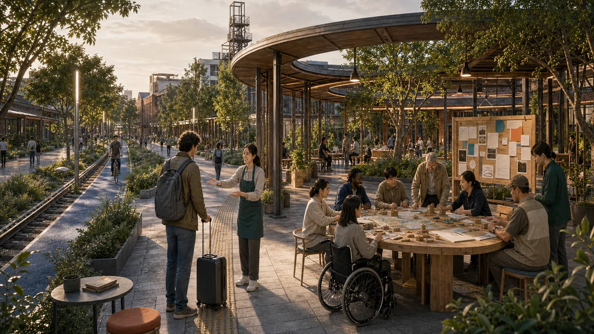
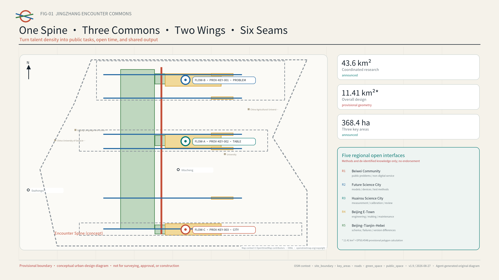
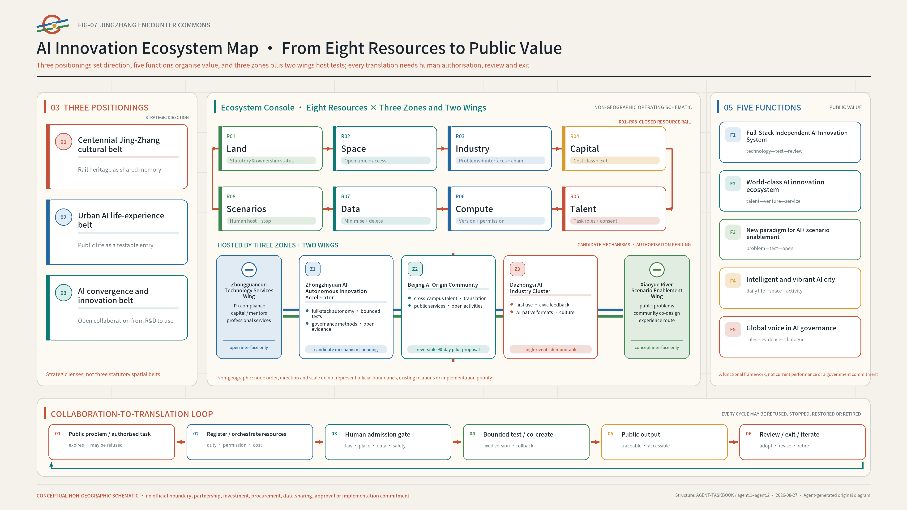
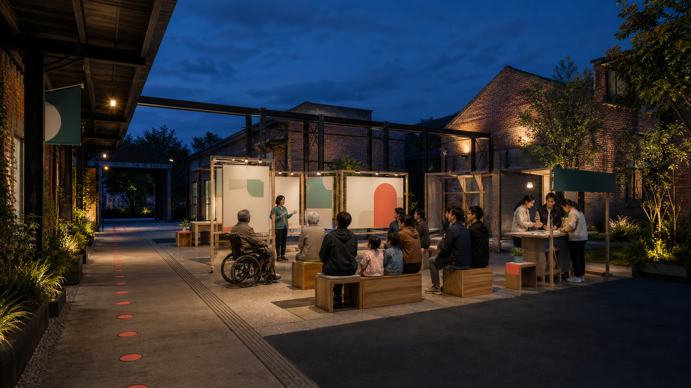
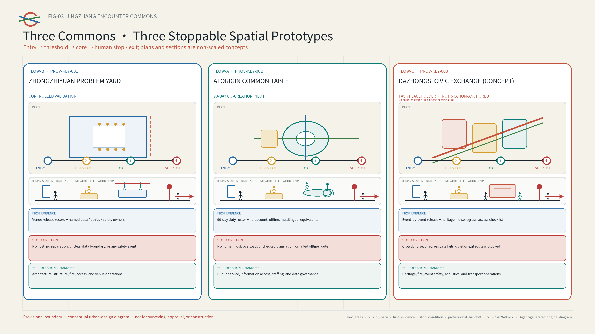
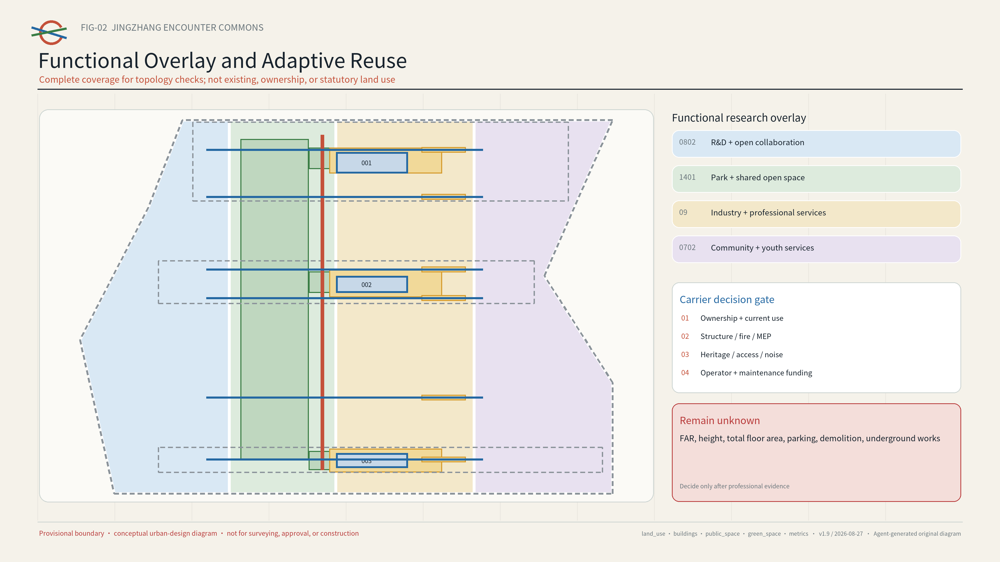
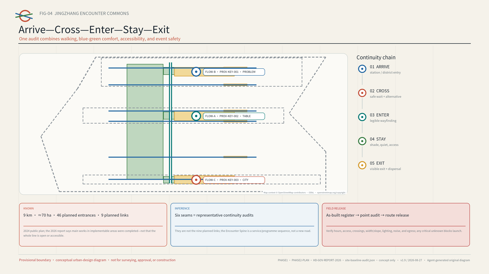
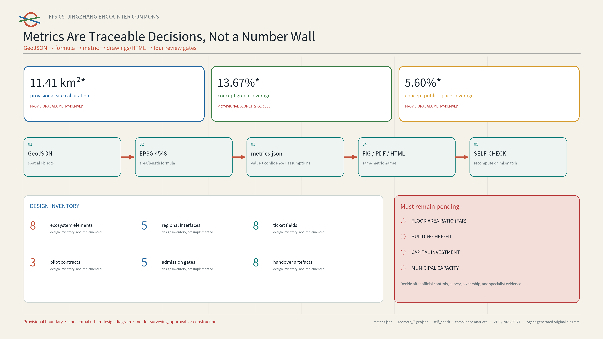

# JINGZHANG ENCOUNTER COMMONS

> Turn talent density into meaningful collaboration.
> Complete a public task together—without needing a local account.

*AI-generated concept visual | Presentation layer (2026-08-26): a first-time visitor follows physical wayfinding to a human host and an open common table. This is not a site photograph, existing-condition evidence, an official plan, an approved design, or built work; people, buildings, dimensions, materials, and locations are illustrative.[source:AI-CONCEPT-VISUALS-20260809]*

## Executive Summary: Complete a Public Task Together—Without an Account

### One sentence

Without a local account or private relationship data, a person can find an authorised public task along Jing-Zhang, complete it with others, and leave safely with a visible result. AI searches only public catalogues of tasks, spaces, times, and authorised resources; people decide whether to enter, decline a suggestion, stop an activity, and exit at any time.[depth:overall_spatial_structure] [metric:encounter_ticket_field_count]

### One person

Imagine a young international newcomer visiting Haidian for the first time, with limited Chinese, no local account, and a dead phone battery. We call this composite persona Lin; they are not a real interviewee. Lin follows physical bilingual wayfinding, hears the task, minimum-data rule, and exit route from a human host, contributes by paper card or speech at one AI Origin Common Table, reviews a bilingual result, deletes temporary preferences, and leaves by a visible route without creating a permanent account. This ninety-minute table session turns inclusion into six checkable actions rather than a value statement.

### Three experiences

| Place and duty | What one person experiences | What happens when a condition fails |
| --- | --- | --- |
| FLOW-A · AI Origin co-create (`PROV-KEY-002`) | Join an open common table without registration; a human host keeps paper, spoken, and non-AI routes equivalent | No human host, exceeded capacity, unchecked critical translation, or failed offline route: stop |
| FLOW-B · Zhongzhiyuan verify (`PROV-KEY-001`) | Bring a public problem into an isolated test bay; work through outage, physical stop, AI-off bypass, and checklist-based restoration | No named duty holder, separation, stop, or restoration: do not release |
| FLOW-C · Dazhongsi exchange (`PROV-KEY-003`) | Put a first-use result before the public; authorise each event separately, then strike it that evening and restore the place | Any heritage, noise, crowd, egress, or exit failure: cancel |

These are not one plaza with three names. AI Origin lets people frame a task together, Zhongzhiyuan tests technology and boundaries, and Dazhongsi exposes the result to public review. The Encounter Spine links co-create—verify—exchange as a rollback-capable task process that may span different days. `FLOW-A/B/C` indicate story order only; the fixed spatial IDs remain Zhongzhiyuan `PROV-KEY-001`, AI Origin `PROV-KEY-002`, and Dazhongsi `PROV-KEY-003`, and the flow labels are never reused for RACI or cost classes. Ninety minutes refers only to one AI Origin table session, not a single walk between all three places.[data:geometry/key_areas.geojson] [depth:three_key_area_detailed_design]

### One implementation-readiness evidence set

The offline replay registers three expected-pass tickets, five expected-invalid tickets, and five spatial fixtures as thirteen fixed tasks. All thirteen produced their expected release or rejection, and all eighteen underlying assertions passed. The 100% figure means only that the checker behaved as expected; it is not a service success rate or field result.[metric:simulation_task_count] [metric:simulation_success_rate] [metric:synthetic_assertions_passed]

The Zhongzhiyuan fixture also exhausts all sixty-four combinations of public path, separation, duty holder, physical stop, AI-off bypass, and restoration. Only the complete combination passes; five invalid tickets and four incomplete spatial cases are rejected as expected. Real field release remains unauthorised and blocked.[metric:spatial_boolean_combinations_checked] [metric:expected_rejection_count]

### Why Jing-Zhang

The Jing-Zhang corridor already brings together universities, research teams, founders, and communities, but talent density alone does not create collaboration. Public problems, available venues, open time slots, mentors, and services sit in different organisations, leaving young people to navigate access rules, information gaps, and trust barriers again and again. Haidian's public material reports that AI Origin Community has more than 10,000 practitioners and that people aged 25-35 exceeded 70% in a local enterprise survey.[source:HD-AI-ORIGIN-FIRST-STOP]

Phase I of Jing-Zhang Railway Heritage Park opened across approximately 2.5 kilometres and 16.8 hectares. A 2024 official plan described a public-space baseline of about nine kilometres and seventy hectares, including 46 planned entrances, nine planned urban links, three paths plus greenery, and eight planned community activity areas. Haidian's 2026 government report states that main works in implementable Phase II areas had been completed.[source:BEIJING-JZ-PARK-PHASE1] [source:BEIJING-JZ-PARK-PHASE2-PLAN] [source:HD-GOV-REPORT-2026]

The proposal therefore adds reversible operating rules to existing and emerging public space instead of designing another park. A planned entrance is not necessarily built, open, or accessible; any route still requires as-built and operating records plus a point-by-point field check.

One Encounter Spine links three Commons, two resource wings, and six connections that still need repair. A reversible ninety-day pilot at AI Origin is the first step.[metric:pilot_duration_days] [depth:overall_spatial_structure]

| Delivery layer | What this version supplies | How a professional team takes over |
| --- | --- | --- |
| Spatial | One Spine, Three Commons, Two Wings, Six Seams, and three plan-section prototypes | Re-site and dimension them with official polygons, ownership, transport, and field evidence |
| Operations | An eight-field Encounter Ticket, three pilot contracts, and five admission gates | Obtain signatures from authorised venue, safety, access, data, and operations roles |
| Evidence | A ninety-day baseline, eight commissioning/handover artefacts, and public review and retirement records | Verify access, hosting, deletion, and exit before discussing expansion |
| Coordination | Five open interfaces with Beiwei Community, Future Science City, Huairou Science City, Beijing E-Town, and the Beijing-Tianjin-Hebei region | Convert an interface into cooperation only after a reply and agreement; none is presented as endorsement or commitment |

A simple test lets reviewers decide whether the proposal works: can a person without a smartphone, unwilling to provide private data, or needing accessible or multilingual support still find a task, enter the place, obtain human help, see the result, and leave safely? If not, the scenario must not launch. [metric:encounter_ticket_field_count] [metric:handoff_artifact_count]

## Design Basis and Source List

This proposal turns “a high-quality district that attracts global AI innovators” into a testable urban-design question. Talent is already dense, but public problems, available spaces, open time slots, and collaboration resources are scattered across organisations and entry points, so chance encounters rarely become shared work. Haidian’s official material describes the Beijing AI Origin Community as friendly to entrepreneurship, encounter, and growth. Another official report notes narrow social circles and limited emotional support among young technology workers and documents the “Future Relationship Lab.” A mobile talent-service station opened in 2026, providing a local foundation for public-service navigation. The proposal therefore designs social infrastructure, not a friendship product: AI helps people find public tasks and shared resources, while each person decides whether to take part.[source:HD-YOUTH-RELATIONSHIP-LAB] [source:HD-AI-ORIGIN]

Sources are used in three tiers. The official announcement, public Agent taskbook, repository standards, and Haidian government pages define the objectives, scope, and local facts. Six primary-source city or district cases offer methods that may transfer, but not ready-made solutions. The proposal's concept layers, metrics, and operating assumptions remain design recommendations. `sources.json` records each publisher, link, intended use, rights status, and limitation; `assumptions.json` records every uncertainty.[source:SOURCE-REGISTRY] [standard:PROJECT-AGENT-OPEN-CALL-TASKBOOK]

`visual/assets/site-baseline-audit.json` separates public facts about Jing-Zhang Railway Heritage Park, design inferences, and matters still requiring field confirmation. This prevents planned quantities, construction status, and present-day operating conditions from being treated as interchangeable.[source:BEIJING-JZ-PARK-PHASE1] [source:BEIJING-JZ-PARK-PHASE2-PLAN] [source:HD-GOV-REPORT-2026]

Until as-built and operating records are available and each point has been checked in the field, planned entrances and construction status cannot justify a published route or a pilot launch.

| Known fact | Design inference made by this proposal only | Required field audit and professional handoff |
| --- | --- | --- |
| Phase I public baseline of approximately 2.5 km/16.8 ha; the 2024 plan describes approximately 9 km/70 ha and 46 planned entrances | Treat the planned entrance set as a candidate access-audit universe and overlay an operating protocol on existing public space | Obtain as-built boundary, current entrance, and operator registers; verify hours, step-free continuity, and emergency exit point by point |
| The 2024 plan describes nine planned urban links and three paths plus greenery | The six “seams” are representative arrive–cross–enter–stay–exit audit transects only | Verify crossing control, clear width/slope, conflict points, night lighting, and a safe alternative; do not publish an unverified route |
| The 2024 plan describes eight planned community activity areas; the 2026 report records completion of main works in implementable Phase II areas | Overlay reversible Commons prototypes on candidate carriers only | Verify ownership, operator, capacity, fire, noise, heritage, and data conditions; do not launch without authorisation |

Rail conditions also need to be read separately. Beijing government material records that the Jing-Zhang high-speed railway runs in an underground tunnel within the Fifth Ring, that the former surface railway corridor became heritage public space, and that the former railway and existing elevated Line 13 were described as parallel or adjacent. Future changes to Line 13 mentioned in the same article must not be treated as present-day conditions. The proposal therefore creates `IF-TYPE-01`, a representative interface dossier with no fixed coordinates and no scale claim. It admits only existing or formally approved crossings to the candidate set, and records operating-rail constraints, surface heritage space, basic everyday services, and the five-stage arrival-to-exit route separately. If the exact alignment, tunnel protection boundary, authority, or current crossing status is unknown, the line stays broken on the drawing rather than being invented.[source:BEIJING-JZ-PARK-PHASE2-PLAN]

A candidate seam can move from “pending and not authorised” (`pending/not_authorized`) to a published route only after four people walk the same arrival-to-exit journey together. An authorised venue operator checks ownership or operating authority, hours, capacity, and the right to stop activity on site. A resident or community representative checks everyday access, noise, and complaint response. An accessibility participant completes the whole journey without a local account, with no working phone, and with any needed mobility or sensory support. A safety or transport professional checks crossings, lighting, fire safety, and egress. Each role must be accepted by a real, named participant. The public record keeps only the date, an anonymised issue and stop list, repair owner, recheck date, and publish-or-withdraw decision; it never publishes identities, precise trajectories, or accessibility and complaint details. [depth:traffic_rail_slow_parking]

The repository currently contains no official precise polygon for the overall design area or the three key areas. `geometry/site_boundary.geojson` and `geometry/key_areas.geojson` reuse the organiser-provided provisional rough geometry and explicitly state `official_boundary=false`. Grey dashed outlines support composition, checking, and provisional area calculations only; they are not official redlines, road boundaries, property lines, or approval evidence. The announced 43.6 km², approximately 11.4 km², and 368.4 ha are brief figures. The value 11,412,825.386 m² is the EPSG:4548 calculation of the provisional polygon; the two must not be conflated as a precise statutory area. All layers, ratios, and drawings must be recomputed when official geometry becomes available.[source:BOUNDARY-SOURCE]

Every spatial action is a “conceptual recommendation, reference scheme, or item for professional deepening.” The package makes no final determination on FAR, building height, retain-renovate-demolish decisions, road or rail alignments, municipal capacity, investment, ownership, approval, or development sequence. Proposed events are not government commitments, and no private, internal-enterprise, or unpublished planning data are used.[standard:MOHURD-CONTROL-DETAILED-PLANNING] [depth:risk_missing_data]

## Three-Level Scope Framework

The three scales move from strategy to system to prototype; they are not separate drawing exercises. The 43.6 km² coordinated research area links universities, research institutions, enterprises, communities, and regional innovation resources. The approximately 11.4 km² overall design area turns those links into public-space, walking, service, and operating networks. The 368.4 ha key-area scope tests three encounter prototypes that could be repeated elsewhere. Announced figures of 192.1 ha for Zhongzhiyuan, 104.3 ha for the AI Origin Community, and 72.0 ha for Dazhongsi organise the work only; provisional rectangles are not parcel boundaries.[source:OFFICIAL-ANNOUNCEMENT] [depth:three_level_scope_framework]

The overall structure is “One Spine, Three Commons, Two Wings, Six Seams, Twelve Scenes.” The Encounter Spine organises a sequence of public spaces along the Jing-Zhang corridor. The three Commons are the Common Problem Yard at Zhongzhiyuan, Common Table Yard at AI Origin, and Common City Yard at Dazhongsi. The two wings are the Zhongguancun Technology Services Wing and Xiaoyue River Scenario Enablement Wing. Six east–west seams are representative continuity-audit transects sampled from the planned network; they test road, campus, park, and accessibility discontinuities and are not the nine planned urban links reported by the official source. Twelve scenarios can be launched at small scale, evaluated, and retired.[source:BEIJING-JZ-PARK-PHASE2-PLAN]

Each of the taskbook's three positionings has a distinct job here. The **Centennial Jing-Zhang Cultural Belt** protects cultural integrity through traceable history, heritage public space, and shared memories that can be withdrawn. The **Urban AI Life Experience Belt** places account-free, multilingual, accessible AI public services along everyday walking and dwelling routes. The **AI Convergence Innovation Belt** links public problems, controlled tests, limited first use, and exit reviews in one verifiable pathway. The five functions are equally concrete. Zhongzhiyuan carries the **Full-Stack Independent AI Innovation System** and **Global Voice in AI Governance** through prototypes for isolated validation, standards, and safety governance. AI Origin carries the **World-Class AI Innovation Ecosystem** through cross-campus talent, incubation and translation, and open services. The Xiaoyue River wing carries the **New Paradigm for AI+ Scenario Enablement** by bringing real public problems into trials. The three Commons, the Encounter Spine, and public first use at Dazhongsi test the **Intelligent and Vibrant AI City**.[source:AGENT-TASKBOOK]

The “Three Zones and Two Wings” form a reversible collaboration loop. The Xiaoyue River Scenario Enablement Wing brings forward authorised, publishable problems. The Zhongguancun Technology Services Wing adds intellectual-property, capital, and professional-service interfaces. AI Origin organises talent, open-source collaboration, and incubation support. Zhongzhiyuan performs full-stack validation, standards work, and safety governance. Dazhongsi hosts limited first use, consumer and content experiences, and public feedback. Non-sensitive methods and failure records return to the public ledger for a decision to continue, revise, or archive. This is a candidate protocol, not evidence that any organisation is participating and not a promise of investment attraction, finance, or policy support.[metric:regional_interface_count] [depth:overall_spatial_structure]

This is not a new infrastructure corridor or statutory structure; it is an operating map that places tasks, spaces, times, resources, and accountable hosts on one interface, with one numbered traceability chain for the spatial layer and six concept connections.[data:geometry/roads.geojson#ROAD-SPINE-001] [metric:connector_count]

An open ledger closes the loop across all three levels. The coordinated level publishes verifiable public problems and resources. The overall level registers candidate spaces, open hours, accessibility, and safety conditions. The key-area level runs controlled pilots. Each pilot produces a public output, retrospective, and retirement record before replication, revision, or archiving. A node without field survey, ownership coordination, fire-safety review, and professional confirmation remains only a candidate. [depth:overall_spatial_structure]

## Coordinated Research Area: Industry and Future City Research

Instead of listing companies, the proposal describes the AI ecosystem through the taskbook's eight resources: land, space, industry, capital, talent, compute, data, and scenarios. Land records statutory and ownership status; space records available times and entry conditions; industry and capital receive no automatic data rights; people join as roles in public tasks, not as ranked profiles; compute and data must state their version, permission, and deletion rules; and every scenario needs a human owner and a way to stop. Zhongzhiyuan focuses on full-stack technology and controlled validation. AI Origin focuses on cross-campus talent, venture development, and public services. Dazhongsi focuses on first use, civic feedback, and cultural communication. The two wings bring professional services and real public problems. Whenever a resource is used, the responsible person, time limit, cost class, and exit condition must be clear. [source:AGENT-TASKBOOK] [metric:ecosystem_element_count] [depth:existing_conditions_diagnosis]

The standalone **AI Innovation Ecosystem Map** below is a mechanism map, not a directory of companies. Eight resources enter a pool with declared sources, permissions, and expiry, then pass through six steps: public problem → human admission → space-and-time matching → controlled validation → public output → adopt, revise, or archive. The three zones respectively organise the ecosystem, validate technology and governance, and host public first use; the two wings add professional factors and real scenarios. Every connection requires an accountable person, minimum-data rule, and exit condition. Without authorisation, it remains a candidate.[source:AGENT-TASKBOOK] [metric:ecosystem_element_count]

Six primary-source cases form a library of useful methods. The proposal borrows the method, not the scale, authority, or business model:

| Case | Primary mechanism | Jing-Zhang transfer | What is not copied |
| --- | --- | --- | --- |
| Singapore Punggol Digital District | Education, industry, community, and a living lab in proximity | Link campuses, firms, and city tests through public problems | Development intensity or platform vendor |
| Helsinki Varaamo | One interface to discover and reserve public rooms and equipment | Candidate space–time–facility ledger | Any assumption that local spaces are already authorised |
| Seoul Community Space | Search, programme discovery, and registration across public/private shared spaces | Let operators publish genuinely available time slots | A historical space count as a current fact |
| Paris Quartier Jeunes | Youth employment, rights, health, culture, and shared work in one welcoming place | Account-free equivalent service entry at the Common Table | Institutional staffing or service commitments |
| MIT Kendall Square | Research, housing, retail, culture, open space, and community input | Connect innovation display to everyday life | Ownership, development, or university governance models |
| Paris UrbanLab | Real-condition pilots that can stop or pivot | A test–review–scale/exit gate | Treating a concept pilot as an approved project |

Together, the cases reveal a planning innovation: scarce urban resources include not only area but also accessible time, legible invitations, trusted hosts, and preserved public outputs. The space ledger therefore records more than square metres: public/reservable/restricted status, accessibility, noise and capacity, data need, host, maintainer, and exit route.[source:CASE-PUNGGOL] [source:CASE-PARIS-URBANLAB]

### Five Regional Open Interfaces: Share Methods, Do Not Presume Partnerships

The taskbook names Beiwei Community, Future Science City, Huairou Science City, Beijing E-Town, and Beijing-Tianjin-Hebei coordination as a deep-review dimension. This proposal does not claim endorsement from any of them. It proposes five candidate interfaces with the status “open, with no commitment” (`open_interface_no_commitment`). Coordination begins with one reproducible public task, one shared field set, one independent review, and one adopt-or-exit decision—not a signing photograph or an exchange of personal data. [source:AGENT-TASKBOOK] [metric:regional_interface_count]

| Candidate interface | Non-sensitive artefact Jing-Zhang can open | Method that may return | Hard boundary |
| --- | --- | --- | --- |
| Beiwei Community | Public-problem template, non-smartphone route, and accessibility checklist | Community hosting, preservation of minority views, and repair language | No resident recruitment or raw-opinion transfer before authorisation |
| Future Science City | Public-task orchestration and space-time conflict test | Validation methods linking research facilities and city services | No assumed procurement, policy recognition, or data sharing |
| Huairou Science City | Multilingual public-explanation and evidence-level templates | Measurement, calibration, science communication, and independent review | No uncleared content and no equation of communication with safety certification |
| Beijing E-Town | Offline, stop, spare-part, and retirement fields for the event-operations sandbox | Engineering, manufacturing, interoperability, and lifecycle experience | No named vendor and no self-certification of safety by a supplier |
| Beijing-Tianjin-Hebei | De-located Encounter Ticket schema, failure examples, and version differences | Cross-city access, maintenance, and exit lessons | Exchange de-identified knowledge assets only, never personal or sensitive operating data |

The original identity combines an “open ring” with twin Jing-Zhang rails. Two trajectories meet at a circle with a visible gap, signifying voluntary entry and exit at any time. Origin Blue represents trustworthy services, Signal Orange an open invitation, Park Green public space, and Rail Grey the historic base. The primary English brand name is JINGZHANG ENCOUNTER COMMONS; sub-brands are COMMON PROBLEM YARD, COMMON TABLE YARD, and COMMON CITY YARD. No corporate mark, portrait, or third-party image is used.[standard:PROJECT-AGENT-OPEN-CALL-TASKBOOK]

## Overall Design Area: Urban Renewal and Regulatory-Plan-Level Urban Design

Renewal follows a simple order: open the rules first, add lightweight components next, and consider permanent works only later. First, record when existing indoor and outdoor spaces are available and who can enter. Second, use movable tables, clear wayfinding, shade, lighting, temporary power, and small accessibility improvements to make an Encounter Commons visible and reachable within a fifteen-minute walk. Third, qualified teams study buildings, roads, municipal systems, or permanent landscape works only when actual use, public feedback, and professional surveys support them. This tests real demand and operating capacity before assuming large-scale demolition or construction.[standard:MOHURD-URBAN-DESIGN-MEASURES] [depth:land_use_layout]

`land_use.geojson` divides the full provisional area into four conceptual zones, showing relationships among innovation R&D, public green space, commercial and professional services, and community support. It does not represent existing land use or statutory zoning. `buildings.geojson` marks three carrier envelopes that may be suitable for adaptive reuse but still require field checks; it is not a building survey or a retain-renovate-demolish decision. Development intensity, total floor area, height, and parcel boundaries remain “unknown” (`unknown`) pending statutory controls, ownership records, surveys, and professional capacity evidence.[data:geometry/land_use.geojson#LU-001] [depth:development_intensity_controls]

The announcement asks for an AI Innovation Index, talent density, and industry-output scale.[source:OFFICIAL-ANNOUNCEMENT] This proposal records them as calculable contracts with no current value, rather than manufacturing a ranking from missing data. The AI Innovation Index would aggregate normalised measures of open-source outputs, standards/patents, conversion from controlled tests, cross-organisation public-task completion, and accessible public services using professionally approved weights. Talent density would be “verified AI R&D and product FTE ÷ officially operational AI innovation floor area, per 10,000 m².” AI industry output would aggregate verified, non-duplicated AI principal-business revenue within one year and one approved statistical boundary. All three remain `unknown`; they require an official statistical definition and baseline, authorised aggregate employment and enterprise data, official boundaries, and verified functional floor area. They may be calculated and published only after statistical and industry specialists confirm those inputs and definitions.[metric:ai_innovation_index] [metric:ai_talent_density] [metric:ai_industry_output_cny]

Here, “1+X+1” is treated as an industrial-organisation question to verify, not as a ratio to draw in advance. Core AI capability enters a common-technology and controlled-validation layer; “X” AI+ lead industries are organised as scenario clusters around real public problems; and technology and everyday services form support interfaces for talent, enterprises, and the public. Universities and institutes, incubators, unicorn and listed companies, professional services, and communities are candidate contributors in a resource ledger—not asserted partners. Four conceptual functions—innovation R&D, public green space, commercial and professional services, and community support—carry the sequence from research through validation and translation to public service, without pre-assigning statutory use or fixed shares. Industrial survey data, authorised actors, official boundaries, verified building functions, and statutory controls must exist before industry, planning, and operations teams jointly confirm proportions and priority locations against task demand, public access, and capacity.[source:OFFICIAL-ANNOUNCEMENT] [data:geometry/land_use.geojson#LU-001] [depth:land_use_layout]

Four decision labels are reserved for later deepening: retain and share time; adaptive-reuse candidate; temporary activation; and pending assessment. A label may advance only after field survey, structural and fire safety, accessibility, heritage, noise, operator, maintenance, and ownership checks. Demolition is never a default action. Transport and rail work covers walking transfers, crossing waits, and event-day operations only—not road redlines, bridges, tunnels, underground works, or track alignment. Municipal work prioritises reversible power, network, lighting, and edge-device interfaces; capacity and energy claims await specialist calculations.[depth:retain_renovate_demolish] [depth:municipal_new_infrastructure]

## Detailed Design of Key Areas

The three key areas share one Encounter Protocol but perform different roles in the innovation cycle. Each has a public entry, controlled validation mode, visible public output, and exit-oriented landmark. Provisional boundaries show relative position only; professional teams must select final locations within official geometry and verified field conditions.[data:geometry/key_areas.geojson#PROV-KEY-001] [depth:three_key_area_detailed_design]

`PROV-KEY-003` is a temporary placeholder based only on task order and announced area; it is not a spatial frame anchored to Dazhongsi Station. Open repository Issue #1029 reports that the placeholder lies approximately 2.26 km from Dazhongsi Station, but this is neither an organiser decision nor official geometry. This version therefore makes no claim about station quadrants, station-to-site routes, or station-area integration. Every “Dazhongsi Common City Yard” action remains a transferable prototype.[source:REPO-ISSUE-1029]

Each key area first answers the announcement task, then leaves unknown conditions to professional design development. Every “strategy” below is conceptual and deliberately unpinned:

| Key area | Concept strategy | Evidence still needed | Trigger for design development |
| --- | --- | --- | --- |
| Zhongzhiyuan AI Independent Innovation Acceleration Area | Use a garden innovation district to connect full-stack independent technology, standards and safety governance, industry display, and controlled testing; review buildings, green space, water, Qinghe culture, low-carbon encounter space, and external transport as one system | Official polygon; existing/in-progress project inventory, title and building survey; authorisation for national-level platforms and operators; Fifth Ring transport, green-water, ecology, and cultural studies | Define use proportions, retain-renovate decisions, display carriers, and transport/blue-green proposals only after the official scope, project list, and operator are confirmed and transport, ecology, heritage, building, and safety surveys are complete |
| Beijing AI Origin Community | Use a near-campus district to support original innovation, a talent zone, open-source collaboration, incubation and translation, and brand events; add release/display, housing and daily services, campus–district walking, and transit access through low-disturbance renewal | Official polygon; authorised university, institute, and project inventory; title, building-condition, and retain-renovate basis; housing/service gaps; actual walking and station conditions around Wudaokou, Qinghuadongluxikou, campuses, and districts | Select incubation/translation carriers, use proportions, station access, and organic-renewal projects only after the official scope and authorised resource ledger are available and building, demand, transport, and accessibility surveys are complete |
| Dazhongsi AI Industry Cluster | Use an urban innovation district for limited first use of agents, smart terminals, content consumption, and AI+ services; conceptually examine compliant data/digital-asset services, the commercial environment, multifunctional green space, international exchange, and static transport | Official polygon; authorised evidence on real priority sites, enterprises, and university renewal; Dazhongsi entrances, flows, four-quadrant crossings, cycle parking, commercial services, and green-space conditions | Undertake station integration, four-quadrant connections, carrier layout, and public-realm development only when the official scope is confirmed to have a real station relationship and ownership, operating, transport, commercial, green-space, and compliance evidence is available; no siting before then |

This creates an auditable chain of “concept strategy → evidence gap → development trigger.” It does not replace the announcement's required coordination of existing, in-progress, and renewal projects, and it invents no development quantum, company list, or implementation conclusion.[source:OFFICIAL-ANNOUNCEMENT] [depth:three_key_area_detailed_design]

**Zhongzhiyuan Common Problem Yard.** “Publish the problem before recruiting the technology.” Communities, districts, and public-service organisations frame public problems as bounded task cards. R&D teams test models, robots, or tools in an isolated setting, and a host decides whether a result can enter limited first use. Spatial prototypes include an open problem wall, reconfigurable test tables, a separated demonstration strip, and a failure-review bench. The landmark “First Open Table” displays only the problem, validation conditions, and public output—not firm rankings or private relationships. Every model or robot test still requires separate safety, data, and operating approval.

This iteration turns the prototype into a synthetic tabletop test that combines a plan, a not-to-scale section, and acceptance checks. S01 assumes a ninety-minute activity with a candidate capacity of twelve, plus a four-hour venue block for setup, rehearsal, and restoration. The layout includes one public-problem threshold, three controlled test bays, one physical emergency stop, one clear non-AI bypass, and one strike-and-restoration checklist. Four responsibilities are defined: acceptance by an authorised operator, a named test lead, an accessibility and safety reviewer, and a steward for setup and restoration. The package runner confirms that the S01 contract and complete baseline case pass, and that cases with missing separation, no duty holder, a blocked bypass, or failed restoration are rejected as expected. No real operator has accepted the plan, and no field walkthrough or professional sign-off has taken place. `field_release_status` therefore remains blocked, and the synthetic PASS must not be presented as evidence of venue performance.[metric:industry_test_count]

**AI Origin Common Table Yard.** Proposed as the first ninety-day, low-cost pilot, it combines a cross-campus table, mentor clinic, OPC compliance clinic, multilingual newcomer desk, and talent/public-service navigation. People may view activities without an account and register on site. AI recommends from public task tags, capacity, language, and time; a host must confirm before publication. The pilot collects no face, contact list, precise trajectory, emotional state, or private-relationship data and never predicts “who should know whom.” The “Public Contribution Moment Wall” records shared documents, fixes, translations, tests, and retirement decisions only.[source:HD-TALENT-MOBILE-STATION] [metric:pilot_duration_days]

*AI-generated concept visual | Presentation layer (2026-08-09): this image shows a candidate setting with account-free entry, human hosting, an open common table, and a clearly marked exit. It is not a real-site record, existing-condition survey, authorised event, or implementation commitment. Space, occupancy, structures, and operating status still require field and professional review.[source:AI-CONCEPT-VISUALS-20260809]*

**Dazhongsi Common City Yard.** It brings R&D outputs into settings where the public can understand, try, and respond to them. Activities include co-edited cultural guides, evening demonstrations, explainable AI-native consumer experiences, and joint reviews by citizens and enterprises. The spatial prototype includes a closable display interface, a quiet feedback table, an accessible viewing area, and a clearly marked night-time boundary. The “Centennial Junction” connects a verifiable Jing-Zhang railway timeline with Zhongguancun's culture of open collaboration through original graphics; history is not used as technology-themed decoration. Every evening opening, commercial event, noise condition, fire arrangement, and heritage question requires event-specific approval.[source:CASE-PARIS-QJ]

*AI-generated concept visual | Presentation layer (2026-08-09): this image shows a transferable prototype for first use, public feedback, a quiet edge, and distributed exits. It does not depict the actual Dazhongsi site, station entrance, buildings, or an approved event. Siting, dimensions, heritage, fire, noise, and operating conditions still require official material, field survey, and specialist review.[source:AI-CONCEPT-VISUALS-20260809]*

These are not one generic plaza with three names. They are three transferable prototypes that integrate plan, section, and operations. The table defines the spatial sequence, the first evidence required, the hard-stop point, and the conditions for professional handover. All dimensions shown in the figures are component-level suggestions; siting and dimensioning await official polygons, ownership records, and field surveys.[metric:spatial_prototype_count] [depth:three_key_area_detailed_design]

| Prototype | Plan-section sequence | First evidence required | On-site hard stop | Who takes over next |
| --- | --- | --- | --- | --- |
| Zhongzhiyuan Common Problem Yard | Public foyer → rule threshold → closable test tables/controlled demonstration strip → human emergency-stop desk → failure archive | Authorised venue operator, test boundary, and equipment-safety checklist | No named duty holder; sandbox breach; uncontrolled equipment/person risk | Joint sign-off by venue operations, safety, data/ethics, and equipment specialists |
| AI Origin Common Table Yard | Park/campus/street edge → quiet and accessible buffer → common table → multilingual/mentor service bar → visible exit | Continuous accessible route, capacity, and opening-hours walk-through; Phase I of Jing-Zhang Railway Heritage Park serves only as baseline context for publicly accessible space | Offline equivalent fails; crowd/noise breach; personal data exceed minimum | Public-space, access, fire, and day-to-day operations review [source:BEIJING-JZ-PARK-PHASE1] |
| Dazhongsi Common City Yard | Four-way urban arrival → public-service forecourt → reversible first-use/feedback strip → heritage and quiet edge → distributed exits | Official scope and a real candidate site, then arrival/crossing/egress, heritage, and noise checks | No safe exit; heritage/resident impact; commercial display displaces public feedback | Planning, transport, heritage, fire, city-management, and community confirmation |

## AI Innovation Ecosystem, Personas, and AI+ Scenarios

Personas describe the task someone is trying to complete and the barrier they face on entry; they never become persistent relationship profiles. The seven types are: a student or young researcher seeking cross-campus collaboration; a first-time or OPC founder looking for a compliance path; an engineer looking for a real public problem; a resident or community group seeking public participation; an international newcomer needing a multilingual entry point; a frontline operator responsible for safety and service; and a visitor with mobility or sensory access needs who requires a continuous route or a quiet way to take part. A person may change roles between tasks, and no persona is used to score, rank, or infer sensitive traits.[source:HD-YOUTH-RELATIONSHIP-LAB] [metric:persona_count]

The following ninety-minute synthetic journey checks whether inclusion works in practice. A first-time international newcomer with limited Chinese, no local account, and a dead phone battery follows physical bilingual wayfinding and enters through a staffed walk-in desk. They choose an authorised public task and contribute on a paper card or by speaking. Afterwards, they can review a bilingual output, ask for temporary preferences to be deleted or make a complaint, and leave by a clearly marked route without creating a persistent account. `visual/assets/ordinary-person-journey.json` states the limited role of AI, the responsible person, the minimum data, and the hard stop at every step. This is a composite design scenario for a future pilot to test, not field user research or performance evidence.

Encounter Ticket 0.2 is the minimum operating contract for all twelve scenarios. It has eight fields: (1) public task ID and expiry; (2) entry, accessibility, and exit; (3) candidate space, time, and capacity; (4) minimum data and deletion date; (5) named human host and stop authority; (6) resource dependencies and cost class; (7) public output and rights status; and (8) complaints, review, and a decision to adopt, revise, or retire. It creates no persistent account, relationship graph, or personal score.

The full schema, fixture envelope, three valid but unauthorised synthetic S01–S03 tickets, five expected-invalid cases, and twelve-scenario index are in `visual/assets/encounter-ticket.schema.json`, `encounter-ticket.fixture.schema.json`, `encounter-ticket.example.json`, `encounter-ticket.expected-invalid.json`, and `encounter-ticket.scenarios.json`.

Run `node visual/assets/run-encounter-ticket-validation.js --check` from the submission directory to replay checks for the current schema's supported keyword subset, formats, chronology, data boundaries, authorisation conditions, three positive fixtures, five negative fixtures, and the twelve-scenario index. `simulation.json` registers those tickets and five spatial fixtures as thirteen individually recomputable tasks; `encounter-ticket.validation.json` stores the input hashes, eighteen assertions, and replay summary.[metric:simulation_task_count] [metric:synthetic_assertions_passed]

The runner also binds the S01 Zhongzhiyuan spatial fixture to the first Encounter Ticket and exhausts all sixty-four combinations of six spatial conditions. Only the complete baseline passes, four incomplete cases are rejected as expected, and field release remains blocked. The runner implements only the Draft 2020-12 keyword subset used by this proposal; it is not a complete engine, and a synthetic pass does not establish field performance.[metric:spatial_boolean_combinations_checked] [metric:expected_rejection_count]

The first three are industry-validation protocols that have not yet been authorised or run. Their real-world performance remains “no result” (`performance_results=null`). Schema validation and a synthetic tabletop rehearsal do not prove that a real service is usable, safe, lawful, publicly accepted, or scalable. The remaining nine place technology inside everyday public services instead of requiring another app.[metric:industry_test_count]

| ID | Scenario and users | AI’s limited duty | Space/time | Human gate, output, and exit |
| --- | --- | --- | --- | --- |
| S01 | Open Task Orchestration Interoperability Test: teams/communities | With public/synthetic tasks, spaces, times, devices, and access rules only, test permission filtering, conflict checks, human reassignment, and rollback | Zhongzhiyuan isolation; fixed version and fixture | Problem owner and test lead co-sign; field-level evidence JSON; hard stop on overreach, unexplained result, or failed rollback |
| S02 | Grounded Multilingual Public-Service Test: newcomers | With dated/source-linked public material and synthetic questions only, test citation coverage, refusal, translation variance, expiry, and human transfer | AI Origin; frozen corpus snapshot | Bilingual public-service worker signs off; versioned Q&A evidence; refuse/transfer on no source, critical mistranslation, or expiry |
| S03 | Accessible Event Operations Sandbox: operators/disabled visitors | With synthetic capacity, route, time, and resource constraints only, test route continuity, conflicts, offline fallback, emergency stop, and strike recovery | Tabletop sandbox for all Commons; approved field rehearsal only | Venue/access/safety roles jointly release; before/after state and restoration receipt; cancel if any safety path fails |
| S04 | Cross-campus Project Clinic: students/researchers | Recommend table session by public topic and equipment | AI Origin, weekends | Institution/venue confirms; next-step list; expire in 30 days |
| S05 | Mentor Hour: first-time founders | Organise public questions and optional services | Rotating service-wing point | Mentor confirms; anonymous topic note; no private-chat storage |
| S06 | OPC Compliance Clinic: small teams | Navigate public policy, IP, and service entry | AI Origin, booked slot | Professional explains; not legal advice; withdraw stale material |
| S07 | Talent and Health Service Navigation: youth/newcomers | Multilingual search of public services; no diagnosis | Common Table, account-free | Staff reviews; links/checklist only; no health record retained |
| S08 | Public Test-Partner Call: R&D teams/citizens | Turn validation conditions into a legible invitation | Controlled Zhongzhiyuan area | Ethics/safety review; public result; no start without approval |
| S09 | Community AI Co-design: residents/groups | Cluster anonymous issues and show disagreement | Xiaoyue River wing | Community host confirms; preserve minority views; delete raw text |
| S10 | Co-edited Cultural Guide: visitors/cultural workers | Check public sources and draft multilingual copy | Dazhongsi, day/evening | Cultural specialist signs off; traceable version; withdraw disputes |
| S11 | Evening Open Demo: engineers/citizens | Draft plain-language explanation and Q&A queue | Dazhongsi, limited hours | Host/venue releases; public feedback; stop if noise limit fails |
| S12 | Annual Encounter Week: all users | Aggregate public tasks and accessible event schedule | Three Commons, annual candidate | Joint curators confirm; output index; new permission each edition |

All three test Agents recommend but do not decide. Only public catalogues enter the retrieval layer. A rule engine first filters candidates by permission, accessibility, capacity, and freshness; the model then explains its ranking among eligible options; and a host decides whether to use the result. No permanent personal account is required by default. One-time registration tokens are deleted after the review, and public outputs are stored separately from private raw input. Walk-in, telephone, and staff-assisted channels remain equivalent access routes; refusing AI never reduces eligibility.[standard:PROJECT-AGENT-OPEN-CALL-TASKBOOK] [metric:scenario_card_count]

Every pilot must pass five admission gates in sequence: G0 legal, ownership, and task authorisation; G1 venue, safety, access, and capacity; G2 data, content source, rights, and deletion; G3 named host, non-AI equivalent, failure/emergency stop/recovery; and G4 public benefit, independent review, complaints, and handover. A `blocked` gate or missing evidence prevents launch. Detailed status, role, evidence path, and stop rule are in `visual/assets/pilot-contracts.json`.[metric:admission_gate_count]

## Land Use, Building Scale, and Retain-Renovate-Demolish Strategy

The land-use language follows two rules: do not invent statutory classes, and do not present a design overlay as existing conditions. Four polygons cover the full area using the repository's current codes from the numeric system in MNR Document 2023 No. 234, for innovation R&D, green and open space, commercial and professional services, and community support. `LU-003` now uses `09` (commercial-service land); `05` means wetland only. Together the polygons form a topologically complete conceptual partition; their widths do not establish planning controls. Three building envelopes compare three cost paths: sharing available time in existing space, lightweight adaptive reuse, and temporary outdoor components. Their areas are calculations from concept polygons, not surveyed building footprints.[standard:MNR-LAND-USE-CLASSIFICATION-GUIDE] [data:geometry/land_use.geojson#LU-003] [data:geometry/buildings.geojson#BLDG-COMMON-001]

The retain-renovate-demolish table will be used only during professional design development, after six matters can be checked: ownership and current use; structure, fire safety, and MEP; heritage and character; all-weather accessibility; operator and maintenance funding; and evidence from at least one full pilot cycle. Until all six are available, the status remains “pending assessment.” Permanent new buildings, height, FAR, above- and below-ground scale, and parking supply remain “unknown” (`unknown`). Massing in the A3/A0 material shows component scale and interface relationships only. [depth:height_massing_character] [standard:MOHURD-ARCH-DESIGN-DEPTH-2016]

The component library includes an open table, movable host station, quiet seat, wheelchair turning bay, multilingual e-ink sign, temporary shade, closable power/network box, public contribution card, and exit marker. Each must be maintainable, replaceable, and useful offline. Sensors are not default components; any attendance estimate first uses manual time samples and non-identifying totals. [metric:building_footprint_area_sqm]

## Transport, Rail, Municipal Infrastructure, and Public Services

The Encounter Spine is a public-space and programme concept, not a new road or rail line. The 46 planned entrances, nine planned urban links, and three paths plus greenery in the 2024 public plan are a verification baseline only. This proposal's six east–west connections sample representative barriers with a five-stage audit—arrive, cross, enter, stay, exit—and do not map one-to-one to those planned quantities.[source:BEIJING-JZ-PARK-PHASE2-PLAN]

One north–south line and six cross-lines in `roads.geojson` express intentions requiring field verification. No specific entrance or safe route is published before an as-built/operating register is obtained; any crossing of a major road, railway, campus, or controlled district requires separate transport, engineering, ownership, and safety study.[data:geometry/roads.geojson#ROAD-CONNECT-001] [depth:traffic_rail_slow_parking]

IF-TYPE-01 in `visual/assets/site-baseline-audit.json` is therefore a representative interface dossier, not a seventh seam or a proposal for a new rail crossing. It first confirms an ordinary public route and an existing or approved crossing, then checks waiting conditions, accessibility, lighting, staffed service, and exit. No conceptual line may automatically cross an active-rail boundary, future Line 13 works, or an area whose authority has not been verified.[source:BEIJING-JZ-PARK-PHASE2-PLAN]

Rail stations are service-transfer interfaces, not alignments that this proposal can edit. Candidate interventions include continuous, legible directions from exits to the Commons; staggered dispersal; walking and cycle-parking guidance; pre-checked accessible routes; and a rule to close or shrink an event under crowd pressure. Live footfall, video surveillance, and individual trajectories are not prerequisites. Any future lawful use of aggregate data requires data-protection, minimisation, and purpose review.

The municipal and digital base keeps interfaces few and boundaries strict: power and network connections can be switched off, the event list works offline, public-service links have a local mirror, devices keep health logs, and a person retains the master switch. Paper task cards, human hosts, and fixed service desks preserve basic operation when AI fails. Edge devices collect no biometric identifiers, do not reuse tokens across events, and do not depend on vendor lock-in.[source:HD-TALENT-MOBILE-STATION] [standard:MOHURD-URBAN-DESIGN-MEASURES]

## Blue-Green Network, Public Space, and Urban Character

The blue-green strategy does not add technology objects to parks; it treats ecological comfort as a precondition for encounter. The concept green layer tests continuous shade, rain alternatives, seat spacing, quiet areas, and night boundaries. The public-space layer contains three Commons and open-table candidates. Green and public-space ratios are computed from provisional design polygons and express concept-layer coverage only—not existing green ratio, regulatory control, or implementation commitment.[data:geometry/green_space.geojson#GREEN-SPINE-001] [depth:blue_green_public_space]

The three pilgrimage landmarks honour contribution rather than serve as celebrity photo-op sites. The First Open Table remembers the moment a problem becomes public. The Centennial Junction links Jing-Zhang’s connective history to open collaboration in Zhongguancun. The Public Contribution Moment Wall records shared outputs, major corrections, and failures deliberately retired. The honour system displays only authorised public contribution names, with an anonymous option; it never displays relationships, spending, financing, or algorithmic ranking.[source:AGENT-TASKBOOK] [metric:landmark_count]

The cultural story moves “from rails connecting places to open collaboration connecting knowledge” and uses three content labels to prevent invention. `fact` accepts only traceable public history; `memory` records the contributor's consent and way to withdraw it; `design_interpretation` is clearly labelled as contemporary design. An optional walking story may link heritage facts, the First Open Table, failure reviews, and annual Encounter Week, but it cannot replace formal heritage interpretation. Wayfinding uses short bilingual text, one numbering system, and reachable placement. The main logo identifies the whole corridor; the three Commons icons explain spatial functions. The original vector mark and minimum-use rules are in `visual/assets/encounter-commons-logo.svg`. Five character principles guide the design: legible to the public, restrained by day and night, reversible, respectful of visible heritage, and honest about failure.[source:BEIJING-JZ-PARK-PHASE1] [depth:height_massing_character]

## Renewal Projects, Implementation Policy, and Phasing

Ten projects form a “mechanism before space” package: P01 public problem and space-time ledger; P02 ninety-day AI Origin Common Table; P03 controlled Zhongzhiyuan Common Problem test; P04 Dazhongsi first use and feedback; P05 accessibility/safety audit of six connections; P06 multilingual newcomer desk; P07 rotating OPC and mentor clinics; P08 three landmarks and contribution archive; P09 monthly City Problem Table and quarterly Cross-campus Open Day; and P10 annual Encounter Week. Each has a candidate accountable party, prerequisite, minimum output, public retrospective, and stop rule. No fiscal allocation or delivery party is presumed.[data:geometry/phasing.geojson#PHASE-001] [metric:project_count] [depth:renewal_project_list]

| Project | Primary users | A / R / C slots awaiting real acceptance | Minimum resource and cost class | Start gate, minimum output, and stop/recovery |
| --- | --- | --- | --- | --- |
| P01 Space-Time Ledger | Problem owners, venue operators, public | A authorised task/venue owner; R ledger steward; C access/data | Existing staff and public catalogue, A | G0–G2; authorised catalogue with expiry; hide and version-archive any stale/unowned item |
| P02 AI Origin Common Table | Youth, international newcomers, disabled visitors | A authorised venue operator; R named host; C fire/access/multilingual/data | Existing place and movable table, A | G0–G4; ninety-day baseline and public review; stop on failed offline equivalent/safety, delete expiring data, return place |
| P03 Zhongzhiyuan Test | Public problem owners, R&D teams, evaluators | A authorised test venue; R test lead; C device safety/ethics/independent review | Isolated equipment and reversible enclosure, B | Re-run G0–G4 per fixture; versioned evidence JSON and rollback receipt; hard stop on sandbox breach, no explanation, or failed restoration |
| P04 Dazhongsi First Use | Citizens, cultural workers, enterprise testers | A real venue/event operator; R duty holder; C planning/transport/heritage/fire/community | Reversible single-event display and feedback desk, B | Obtain official scope and real site before G0–G4; feedback and strike receipt; cancel without safe exit or if commercial display displaces public feedback |
| P05 Six-Seam Walk-through | Walk/cycle users, mobility/sensory-impaired visitors | A relevant place/road management slot; R access auditor; C transport/community | Manual walk, paper form, managed photo rights, A | G0–G1; arrive-to-exit barrier/alternative list; do not publish an unauthorised/unsafe route, record it as pending only |
| P06 Multilingual Newcomer Desk | International newcomers, public-service staff | A service-operation slot; R bilingual worker; C authoritative source/access | Frozen public-material snapshot and human desk, A | G2–G3; source-linked answer version; refuse and transfer to human on no source, critical mistranslation, or expiry |
| P07 OPC/Mentor Clinic | First-time founders, small teams | A rotating professional-service organisation; R duty professional; C IP/compliance/conflicts | Existing service slot, A | G0, G2–G4; next-step list labelled non-legal conclusion; stop without duty holder, conflict disclosure, or fresh material |
| P08 Landmarks/Contribution Archive | Public, railway culture, community contributors | A public-space/content operator; R editor; C heritage/rights/community | Reversible wayfinding and rights register, B | G0, G2, G4; fact-memory-interpretation register; remove disputed/withdrawn/uncleared content and retain no private relationship |
| P09 Monthly/Quarterly Open Day | Youth, residents, campuses, districts | A authorised co-host per edition; R edition host; C safety/community/data | Shared venue and rota, A | New G0–G4 per edition; task/output/complaint review; shrink/revise after two cycles with no public output or exclusionary participation |
| P10 Annual Encounter Week | Public and five regional-interface candidates | A authorised curator for that edition; R lead duty holder; C all professional/public seats | Multi-site temporary programme, B; permanent works separately C | Independent annual permission; public output index and handover pack; cancel edition if host, budget, safety, or approval is absent |

The ninety-day evaluation uses the first two weeks to establish a baseline. Data are recorded once per session and aggregated once per week: whether public tasks remain valid; whether they were completed or retired; whether the account-free alternative worked; accessibility failures; host hours and cost class; complaint receipt and closure; on-time deletion; and site restoration.

The minimum admission rules are: every session has a named host and a non-AI route before opening; every expiring token is deleted on its stated date; and every safety or accessibility incident receives human review. These are targets for a real pilot to test, not existing performance.

Any incident involving personal safety or rights, critical source failure, failure of an accessible route with no equivalent alternative, missed deletion, or vacant A responsibility triggers an immediate stop and a public recovery decision. [metric:pilot_duration_days]

| Phase | Concept window | Priority projects | Gate to advance | Stop/revert condition |
| --- | --- | --- | --- | --- |
| 1 Validate | 0–90 days | P01, P02, P05, P06 | Named operator; site, safety, access, and data review; public retrospective | No operator, material safety/privacy issue, or no offline equivalent |
| 2 Network | 4–12 months | P03, P04, P07, P09 | Two stable cycles; executable cross-organisation protocol; complaint/maintenance loop | Exclusionary participation, maintenance failure, or no demonstrable benefit |
| 3 Embed | After 12 months | P08, P10 and any justified permanent deepening | Independent professional/public support; clear ownership, funds, and approval | Site or statutory conditions do not support it; annual review retires it |

Long-term operation needs four roles. A Public Problem role checks that an issue is valid. A Space Operations role decides capacity, time, and safety. A Data and Ethics role reviews minimum data, model boundaries, and deletion. A Youth and Community role can veto exclusionary design. Monthly City Problem Tables, quarterly Cross-campus Open Days, and annual Jing-Zhang Encounter Week are proposed brands only; hosts, dates, budgets, and scale still require approval and partnership agreements. [depth:phasing_implementation]

The developer community operates through a public problem backlog, versioned starter kits, open office hours, maintainer review, and a public change log. Issues may contain publishable material only. Code, models, data, and content undergo separate licence, safety, and personal-information checks. Rotating maintainers merge contributions or explain rejections under a code of conduct. An issue with no real owner or public output for two cycles is archived; contributor counts, commit volume, and social relationships never become talent scores.

International communication uses one bilingual evidence pack with traceable sources, captions or alternative text, and failure cases, reviewed by a human translator and subject specialist before release. Attraction and conversion follow a gated path: public task → bilingual open clinic → controlled sandbox → independent review → service or candidate-space referral → limited pilot → adopt, revise, or archive. Talent, developers, and enterprises opt in, and a real operator authorises each stage. Entry to a clinic or sandbox promises no space, procurement, funding, talent designation, or policy support. Communication therefore produces a reviewable next step, not an unfulfillable investment-attraction claim.[source:AGENT-TASKBOOK]

The three pilot contracts leave each responsibility for a real organisation to accept and sign; they make no commitment on an organisation's behalf. P02 AI Origin Common Table uses ten working days to prepare a launch pack and ninety days to establish a baseline. P03 Zhongzhiyuan industry testing is authorised for each fixture and version. P04 Dazhongsi first use is authorised for each event. Every contract identifies A (accountable), R (responsible on site), C (consulted on safety, accessibility, data, and specialist matters), and I (public information), together with conditions for expansion, stopping, and returning the site. Until an authorised party accepts a responsibility, its status remains “not authorised” (`not_authorized`).[metric:pilot_contract_count] [metric:pilot_start_workdays]

Opening and handover require eight items: (1) authorisation and a named A responsibility; (2) a snapshot of the space-time ledger; (3) a capacity, accessibility, and safety walk-through; (4) a data inventory and deletion plan; (5) a rights register for content, fonts, and branding; (6) a drill for human hosting, emergency stop, outage, and recovery; (7) a walk-in or telephone test of the non-AI route; and (8) templates for the baseline, public notice, and final adopt, revise, or retire decision. If one item is missing, the plan cannot be described as operational. Costs use three classes: A for shared existing space and staff, B for reversible components or temporary services, and C for permanent or specialist works that still need quantities and approval. No investment total is invented.[metric:handoff_artifact_count]

The conversion path is “public problem → controlled test → limited first use → resident/professional review → replicate, revise, or archive.” Success is not measured by registrations or connection counts. It means completing public tasks, producing work across organisations, providing an accessible equivalent, resolving complaints, deleting data on time, and making voluntary exit work in practice. A scenario with no public output for two cycles, or whose maintenance needs exceed the operator's capacity, must shrink or close.[metric:phase_count]

## Metrics, Area Recalculation, and Compliance Matrix

Metrics have four classes. Announced scope figures are approximately 43.6 km² coordinated research, approximately 11.4 km² overall design, and 368.4 ha across three key areas. Recomputable provisional-geometry values include site-polygon area, concept green/public-space coverage, candidate building-envelope area, and Encounter Spine length. Design-inventory counts include three Commons, six connections, twelve scenarios, seven personas, three landmarks, ten projects, and three phases. A fourth class contains planning metrics with defined formulas but unavailable official data: the AI Innovation Index, talent density, and AI industry output. Geometry values must be recalculated with any official polygon or layer change; inventory counts update with the proposal version; the fourth class may be calculated only after its statistical definitions, aggregate data, and spatial denominators are authorised.[metric:site_area_sqm] [metric:ai_innovation_index] [depth:metrics_recalculation]

| Metric | Current status | Interpretation |
| --- | --- | --- |
| site_area_sqm / green_ratio / public_space_ratio | known, medium/low confidence | Mechanically reproducible from submitted provisional/concept polygons; not statutory or existing-condition indicators |
| commons_count=3 / connector_count=6 / scenario_card_count=12 | known design inventory | Completeness checks; no claim that items are built or operating |
| ecosystem_element_count=8 / regional_interface_count=5 | known mechanism inventory | Structural coverage only; every regional relation remains a no-commitment suggestion |
| encounter_ticket_field_count=8 / pilot_contract_count=3 / admission_gate_count=5 | known protocol inventory | Protocol completeness, not approval or actual operation |
| spatial_prototype_count=3 / handoff_artifact_count=8 / pilot_start_workdays=10 | known design targets | Prototypes, artefacts, and preparation window await real operators and professional verification |
| ai_innovation_index / ai_talent_density / ai_industry_output_cny | unknown, defined metric contracts | `metrics.json` records formulas, reasons for missing data, data requirements, and calculation/recalculation triggers; no value or ranking is published now |
| floor_area_ratio / building_height_m | unknown | No official control, survey, ownership, or specialist condition; no guessed value |
| investment_cny / municipal_capacity | unknown | No delivery body, engineering design, price basis, or professional assessment |
| Pilot outcomes | baseline pending | Formula only; evaluate once lawful, voluntarily provided, minimal data are available |

Five core figures, nine GeoJSON files, the A3 booklet, A0 boards, bilingual offline HTML, narrative, and three compliance, standard, and depth matrices share the same metric names. `metrics.json` records the formula, source file, confidence, and assumptions; `self_check.json` stores deterministic, spatial, visual, and professional-evidence checks. Any discrepancy must be corrected by recalculating and regenerating every affected output, never by editing one displayed number.[data:geometry/site_boundary.geojson#SITE-001] [metric:green_ratio]

## Risk, Copyright, and Compliance

The compliance floor is explicit: use public material only; do not process privacy-sensitive information without consent; check copyright for images, fonts, and text; require human sign-off with a review record for consequential judgments; and stop publication whenever a data, spatial, or operating compliance check fails.

The highest ethical risk is turning “encounter” into interpersonal profiling, dating matching, or surveillance. This proposal prohibits recommendations based on face, contact list, precise trajectory, emotion, health, ethnicity, religion, sexual orientation, or social relationship. It processes only actively submitted public tasks, language, accessibility needs, time, and resource preferences. Default safeguards include short-lived tokens, deletion on expiry, human hosting, explainable suggestions, and an account-free alternative. Any future data processing requires a separate legal and security assessment. [standard:PROJECT-AGENT-OPEN-CALL-TASKBOOK]

Spatial risks include provisional-boundary error, ownership, campus and district access, heritage, fire, noise, crossings, and municipal capacity. To avoid false precision, the proposal uses transferable node types. Phase 1 is limited to reversible events and field surveys; bridges, underground space, permanent buildings, and road changes require specialist design development. Technical risks include hallucination, mistranslation, bias, vendor lock-in, and outage; safeguards include linked sources, human sign-off, offline lists, rule-first filtering, and replaceable interfaces.[source:BOUNDARY-SOURCE] [depth:risk_missing_data]

Equity measures include offline equivalent access, free basic participation, accessible seats, multilingual and plain-language text, quiet sessions, a community veto seat, and no ranking by spending or funding. Operating risk is reduced by small pilots, one accountable owner per item, maintenance funding before launch, two-cycle review, and explicit retirement. `risk.json` rates eight dimensions from 1–5 with mitigation and human-review routes. Missing official boundaries, existing conditions, ownership, transport, municipal, and heritage data are registered as assumptions rather than fabricated spatial anchors.

The declared Agent generated the text, submission-specific graphics, design GeoJSON, HTML, and PDF. Public facts come only from registered sources in `sources.json`. Figures use no third-party raster basemap, photograph, trademark, remote font, or remote script. Low-contrast major-road, rail, water, park, university, and selected-station context in the overview and mobility figures derives from OpenStreetMap vector data, credited to OpenStreetMap contributors under the ODbL. It is orientation context only—not official survey, ownership, or planning evidence. Noto Sans SC is used under the SIL Open Font License 1.1 for rasterised PNG glyphs, PDF subsetting, and two package-local glyph subsets that keep Chinese readable in offline HTML; no remote font request is made. Rights and limitations are detailed in `report/copyright_statement.md`. The `COMMUNITY-DISPLAY-ONLY` front-matter licence is not the same as the intellectual-property terms of the separate institutional qualification route.[source:SOURCE-REGISTRY] [source:OSM-CONTEXT-20260809]

The three spatial-setting images were independently generated on 2026-08-09 from text-only prompts written for this proposal, using OpenAI image generation in Codex. The cover was regenerated on 2026-08-26 using those three images and two project-authored diagrams only as internal style references. The tool exposed no model ID, and no peer work or third-party photograph was supplied as direct image input. All AI imagery helps reviewers understand candidate spatial prototypes and human use only; it provides no evidence for boundaries, existing conditions, ownership, dimensioning, engineering feasibility, approval, or implementation outcomes.[source:AI-CONCEPT-VISUALS-20260809]

## References

Core references are the public announcement of the Haidian Branch of the Beijing Municipal Commission of Planning and Natural Resources; the repository’s public taskbook and site package; Haidian government pages on AI Origin, youth practice, and talent services; and primary pages from Singapore JTC, the Cities of Helsinki, Seoul and Paris, and MIT. Full URLs, access dates, uses, and limitations are in `sources.json`. No copyrighted image or lengthy source text is reproduced.[source:OFFICIAL-ANNOUNCEMENT] [source:SITE-PACKAGE] [standard:PROJECT-OFFICIAL-ANNOUNCEMENT]

Five evidence entry points organise the package: provisional scope and key areas in `geometry/site_boundary.geojson` and `geometry/key_areas.geojson`; design overlays and nodes in `geometry/land_use.geojson` and `spatial.json`; calculations in `metrics.json`; task traceability in `compliance_matrix.json`; and gaps/risks in `risk.json` and `assumptions.json`. The current identifier contract keeps four namespaces distinct: announcement tasks `1.3.1` through `1.5.3.3`, Agent tasks `agent.1` through `agent.6`, professional standards in `standard_ids` only, key areas `PROV-KEY-001` through `PROV-KEY-003`, and drawing locators `A3 P01` through `A3 P16` plus `A0 B01` through `A0 B07`. Before submission, the package is rerendered, finalised, self-checked, and preflighted against the latest main branch. Any official-polygon or rule change triggers whole-package recomputation; old diagrams are never treated as official conclusions.[source:PROCESSED-FACT-PACK] [data:geometry/key_areas.geojson#PROV-KEY-002]
