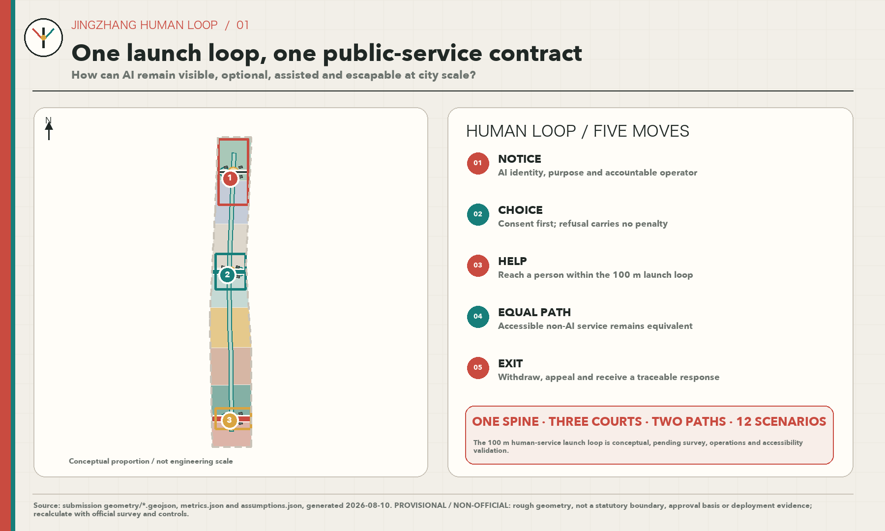
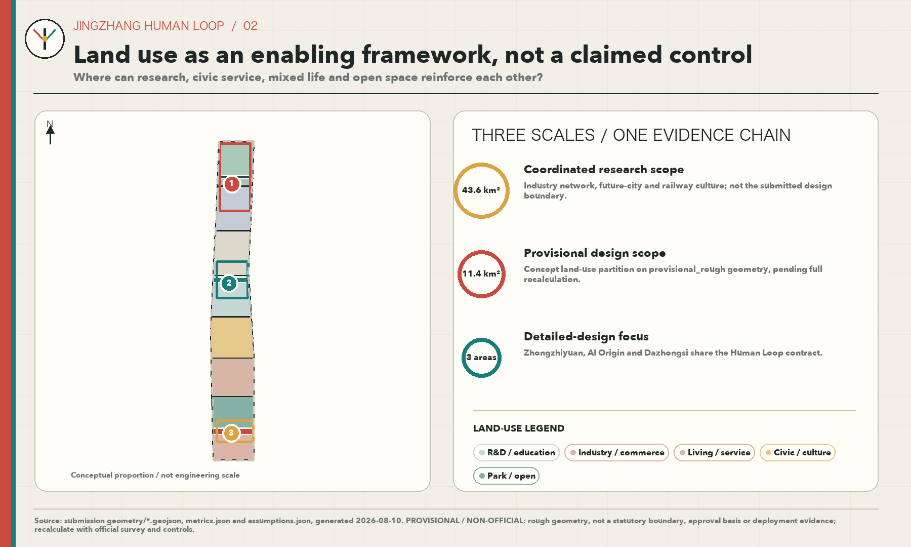
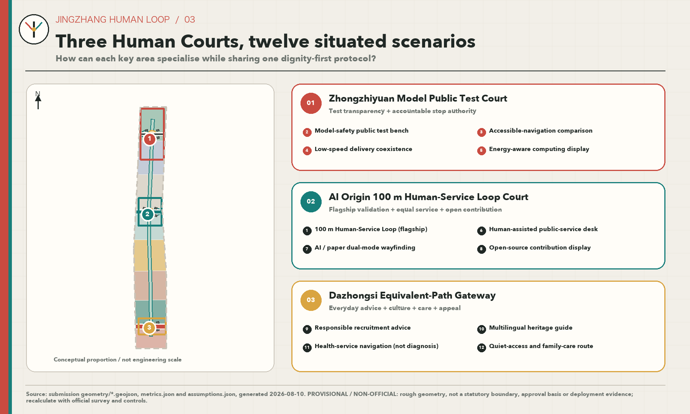
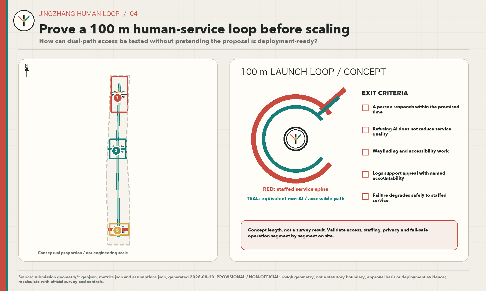
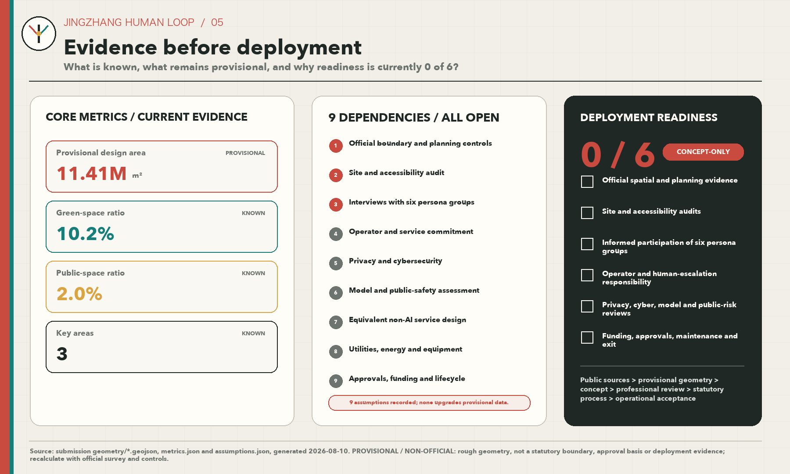

# JINGZHANG HUMAN LOOP

> One first-launch 100-metre Human-Service Loop and nine dependencies: AI-enabled services must be visible and optional, offer human help and an equivalent non-AI path, and permit exit or appeal.

## Design Basis and Source List

This proposal treats the public announcement for the Centennial Jing-Zhang AI Innovation Belt Open Call for Urban Design, the Agent Open Call Taskbook, local snapshots of professional standards, the public Source Registry, and the site package as task evidence—not as evidence of existing site conditions. The only spatial base currently available is the repository's provisional rough boundary. No Official Boundary, building or ownership survey, statutory controls, road or municipal engineering conditions, site visit, accessibility audit, operator commitment, or user interview has been completed. This is therefore an urban-design reference proposal that may support Content Review; it is not an approved plan, engineering design, or deployment record. [source:OFFICIAL-ANNOUNCEMENT] [standard:PROJECT-OFFICIAL-ANNOUNCEMENT] [depth:existing_conditions_diagnosis]

“JINGZHANG HUMAN LOOP” makes that evidence boundary part of the design method. Every number must trace to a formula in `metrics.json`; every location must trace to a GeoJSON feature; every statutory judgment must wait for official material; and every AI-enabled service must identify who receives notice, who may refuse, and who assumes human responsibility. Complete provenance, rights, and use limits remain in `sources.json`. International cases are Background Only and do not support local land use, Development Intensity, or engineering alignments. [source:SOURCE-REGISTRY] [source:SITE-PACKAGE] [depth:risk_missing_data]

Deployment readiness has six independent gates: (1) official spatial and Regulatory Detailed Planning evidence; (2) site and accessibility audits; (3) interviews and informed participation with all six hypothetical persona groups; (4) a named operator, human-service response time, and escalation responsibility; (5) privacy-impact, cybersecurity, model-safety, and public-risk reviews; and (6) funding, procurement, approvals, maintenance, and exit arrangements. None has verifiable evidence today, so deployment readiness is explicitly **0/6**. This status is separate from whether the submission package passes deterministic checks or proceeds to Content Review. [metric:deployment_readiness_met_count] [metric:deployment_readiness_total_count]

## Three-Level Scope Framework

The three levels progress from strategy to structure to prototype. The approximately 43.6-square-kilometre Coordinated Research Area addresses the AI Innovation Ecosystem, talent, future-city questions, and the relationship of the Three Zones and Two Wings. The approximately 11.4-square-kilometre Overall Design Area addresses structural recommendations for Urban Renewal, Land-Use Layout, mobility, Blue-Green Space, and Public Services. The three Key-Area Detailed Design Areas test locally specific proposals that professional teams may deepen. The currently projected Overall Design Area measures about 11,412,825 square metres, but it is derived from provisional geometry. It maintains internal consistency among layers, metrics, and figures; it is not an Official Planning Boundary or an exact scoring area. [depth:three_level_scope_framework] [data:geometry/site_boundary.geojson#SITE-001] [metric:site_area_sqm]

The spatial grammar is “one spine, three courts, two paths.” The spine is a civic-rights spine organised in the direction of the Jing-Zhang Railway Heritage Park; it does not create another planning boundary. The three courts are candidate Human-Service Courts in Zhongzhiyuan, Beijing AI Origin Community, and Dazhongsi. The two paths are an AI-assisted path and a non-AI path that must deliver an equivalent outcome. The levels do not enlarge one rough drawing. The coordinated level sets principles, the overall level organises networks, and the key-area level tests one 100-metre module. The key-area count and provisional locations are checked through the same evidence layer. [depth:overall_spatial_structure] [data:geometry/key_areas.geojson#PROV-KEY-001] [metric:key_area_count]

The 100 metres are not a surveyed engineering length. They define a reversible design module long enough to hold five successive touchpoints—notice, choice, human help, equivalent fulfilment, and exit or appeal—yet short enough to expose conflicts before a large technical system is built. When official polygons arrive, Land Use, roads, Green Space, Public Space, illustrative buildings, phasing, and every area-based metric must be clipped and recalculated from source geometry. If the three key areas move, the candidate prototype must be selected again rather than shifted mechanically. [source:BOUNDARY-SOURCE] [depth:metrics_recalculation]

## Coordinated Research Area: Industry and Future City Research

The ambition is not to automate the city everywhere. It is to create an innovation belt where the way AI serves people can be publicly examined. Three positionings guide the proposal: a traceable Full-Stack Independent AI Innovation corridor; an AI public-life test ground that everyone can enter; and a responsibility-oriented cultural belt connecting the history of the Jing-Zhang Railway with Zhongguancun innovation. Five functions follow: research and open source; testing and validation; enterprise translation; Public Services; and international exchange with lifelong learning. The Taskbook's Three Zones and Two Wings remain the organising structure. The three key areas are differentiated nodes, the Zhongguancun Technology Services Wing supports research and translation, and the Xiaoyue River Scenario Enablement Wing hosts public-space and everyday-life scenarios. Human Loop is the service protocol they share, not a new administrative unit. [source:AGENT-TASKBOOK] [standard:PROJECT-AGENT-OPEN-CALL-TASKBOOK] [depth:overall_spatial_structure]

The Chinese name “京张有人” states that people live along Jing-Zhang and that a responsible person must remain reachable in an automated service chain. The English name `JINGZHANG HUMAN LOOP` preserves the proper name and makes human takeover part of the identity. The Logo direction combines a railway switch, the Chinese character 人, and a closed loop. Railway-signal red marks caution or human takeover; public-service teal marks access and equality; warm paper grey keeps planning information readable. The mark is an original geometric composition and does not use corporate marks, portraits, or uncleared imagery. Trademark screening, accessible-colour testing, and organiser brand review remain prerequisites for formal use.

Seven public cases contribute Background Only mechanisms; none establishes a local control:

| Case | Transferable mechanism | What cannot be transferred |
| --- | --- | --- |
| Vector Institute, Toronto | A sustained interface among research, talent, and industrial adoption suggests that an innovation belt needs translation services, not only workspaces. [source:CASE-VECTOR-INSTITUTE] | Its institution does not prove local industry scale, space demand, or operator responsibility. |
| Mila, Montréal | Open science, community, and partnership networks suggest public interfaces where contributions and rules remain legible. [source:CASE-MILA] | Partner counts and governance cannot become local metrics. |
| one-north, Singapore | Testing embedded in a mixed-use innovation district suggests small, zoned, and reversible trials within daily life. [source:CASE-ONE-NORTH] | Its land regime, transport system, and approvals cannot be transplanted. |
| Helsinki Kalasatama | Living Lab practice combined with resident collaboration suggests defining participation and feedback before deployment. [source:CASE-SMART-KALASATAMA] | Those pilots do not demonstrate acceptance by Haidian residents. |
| Seoul AI Hub | A phased chain of startup support, education, and industry–academia–research links informs differentiation among the three courts. [source:CASE-SEOUL-AI-HUB] | Its programme size, investment, and policies are not local commitments. |
| STATION F, Paris | Continuing programmes organise a startup community, suggesting that space, service hours, and accountable hosts should be designed together. [source:CASE-STATION-F] | A single campus model cannot replace public-interest duties in an open district. |
| Kendall Square / The Foundry, Cambridge | Community-accessible space and adaptive reuse within an innovation district suggest placing a public entrance beside an industry entrance. [source:CASE-KENDALL-FOUNDRY] | Local buildings cannot be retained, renovated, or removed by analogy. |

Four principles are extracted: interfaces need people; prototypes must be reversible; public and industrial entrances must be equally legible; and operating rules must appear with the space. Future-city research therefore asks whether the five rights complete one service loop before counting sensors. Industrial coordination, events, and international communication can be scaled only after the nine dependencies are satisfied. [standard:MOHURD-URBAN-DESIGN-MEASURES]

## Overall Design Area: Urban Renewal and Regulatory-Plan-Level Urban Design

The overall structure places the civic-rights spine above technology display. Conceptual Land-Use zones combine research, Public Services, education and culture, residential support, and open space. Roads and Green Space create continuous access, while three Human-Service Courts turn a complex system into visible points of responsibility. The partition is a topology sample made within a Provisional Boundary to verify complete coverage and network relationships. It is not statutory land use, an existing-condition survey, or evidence of parcel ownership. Floor Area Ratio, Building Height, Building Coverage Ratio, setbacks, road lines, and facility standards remain pending official data. [standard:MOHURD-CONTROL-DETAILED-PLANNING] [depth:land_use_layout] [depth:development_intensity_controls]

The first prototype is proposed for a reversible, step-free, and bypassable public interface within Beijing AI Origin Community: a **100-metre Human-Service Loop**. It is not a compulsory route. It is the spatial script of five rights. At the entrance, plain language states that AI is present. A user then chooses an AI or human/paper route without explaining why. Human help remains reachable from any point. The non-AI route delivers an equivalent outcome without unreasonable burden. At the end, the user may stop, withdraw, appeal, and receive a reference number. The notional 0/25/50/75/100-metre touchpoints are for prototype layout only and must change after measurement and accessibility review. [data:geometry/public_space.geojson#PUBLIC-001] [data:geometry/roads.geojson#ROAD-001]

Nine dependencies govern any prototype or expansion:

| Dependency | Evidence required | Design consequence |
| --- | --- | --- |
| D1 Official Boundary and controls | Official polygons, Land Use, and intensity controls | Determines location, area, and statutory coordination. |
| D2 Site and accessibility audit | Slope, clear width, crossings, lighting, noise, and obstacles | Determines actual alignment and spacing. |
| D3 Interviews with six persona groups | Recruitment, informed consent, disagreement, and unmet needs | Determines language, hours, and the non-AI path. |
| D4 Operator and service commitment | Accountable entity, staffing, response time, and escalation | Determines whether “human help” is real. |
| D5 Privacy and cybersecurity | Data inventory, minimisation, retention, access control, and response | Determines which technologies may enter Public Space. |
| D6 Model and public-safety assessment | Failure modes, red-teaming, Human Review, and stop thresholds | Determines what AI may do and when it must exit. |
| D7 Equivalent non-AI service design | Outcome, time, cost, language, and accessibility comparison | Prevents service degradation for people refusing AI. |
| D8 Municipal, energy, and equipment conditions | Power, communications, drainage, fire safety, maintenance, and spares | Determines facility form; reversible low-tech options come first. |
| D9 Approval, finance, and lifecycle | Ownership, permits, procurement, budget, upkeep, removal, and appeals | Determines whether and how a prototype may become a pilot. |

The dependency total is a proposal-management count, not evidence of site completion. [metric:dependency_count] Buildings, roads, and Public Space in the package are conceptual carriers. “First launch” means a recommended validation sequence only; it does not mean that a site is selected, authorised, or under construction.

## Detailed Design of Key Areas

The three key areas use three courts with distinct duties. Zhongzhiyuan AI Independent Innovation Acceleration Area receives a proposed “Model Public Test Court,” where a research team could disclose a test purpose, known failures, and human shutdown procedures while the Qinghe-facing edge supports low-carbon exchange and walking. Beijing AI Origin Community receives the proposed “Human-Service Loop Court,” hosting the only first 100-metre prototype and placing university translation, open-source release, talent support, and a resident-accessible human desk together. Dazhongsi AI Industry Cluster receives an “Equivalent-Path Gate Court,” demonstrating AI and non-AI routes with the same result where rail, commerce, and enterprise visitors meet. [data:geometry/key_areas.geojson#PROV-KEY-001] [data:geometry/key_areas.geojson#PROV-KEY-002] [data:geometry/key_areas.geojson#PROV-KEY-003]

In Zhongzhiyuan, building moves prioritise reversible exhibition, shared evaluation, and publicly accessible ground floors, without judging any specific building's future. Mobility links the court to public transport and the Blue-Green Network without asserting engineering alignments. In AI Origin, the prototype sits at a campus–park–neighbourhood interface so that residents are not treated as involuntary test subjects; participation begins with recruitment and consent. In Dazhongsi, equivalent routes, human enquiry, and exit or appeal remain conspicuous so that a high-footfall commercial setting does not exclude people who refuse profiling or smart terminals. [depth:three_key_area_detailed_design]

All three polygons are provisional constraints. Detailed design is therefore directional and covers seven readable elements: positioning, spatial structure, building-renewal method, walking and cycling, Public Space, AI-enabled scenario, and implementation risk. When Official Boundaries, existing buildings, station interfaces, heritage controls, waterways, and municipal evidence arrive, court areas, building carriers, links, and metrics must all be recalibrated. The proposal does not assert parcel availability, displacement, an operator, or an approved Integrated Planning Implementation Plan. [source:KEY-AREA-SOURCE] [depth:risk_missing_data]

## AI Innovation Ecosystem, Personas, and AI+ Scenarios

The following six groups are **hypothetical personas awaiting interviews**, not research findings: (1) researchers and developers concerned with testing, release, responsibility, and late-hour collaboration; (2) startup operators concerned with affordable services, compliance support, and customer validation; (3) university students and young talent concerned with learning, employment, housing, and safe travel; (4) surrounding residents and caregivers concerned with quiet, children, family services, and freedom from compulsory profiling; (5) older people, disabled people, and people with low digital confidence concerned with accessibility, comprehension, and human help; and (6) visitors, couriers, and frontline service workers concerned with multilingual wayfinding, quick assistance, rest, and appeals. Each group requires separate recruitment, informed and withdrawable interviews, and explicit recording of counterexamples. Public statistics or AI inference cannot substitute for participation. [source:AGENT-TASKBOOK] [depth:existing_conditions_diagnosis]

The flagship 100-metre Human-Service Loop tests one complete service journey only. Before entering, a hypothetical persona can see the AI notice. The person can select a path without justifying the choice. If an error occurs, a human is reachable within a stated time. Both paths deliver an equivalent result. At the end, the person can stop data use, find an appeal route, and track the response. The first task should use low-risk public information and event registration. Medical diagnosis, law enforcement, credit, hiring decisions, and other high-impact uses remain outside the prototype. A human reviewer must have correction and shutdown authority, and logs retain only necessary fields for a limited period. [data:geometry/public_space.geojson#PUBLIC-001] [metric:deployment_readiness_met_count]

The other eleven scenarios are dependency mappings only. None is described as deployed, tested, or used by real participants:

| # | Concept and type | Candidate space / persona | Minimum-data and human boundary | Dependencies |
| --- | --- | --- | --- | --- |
| 01 | 100-metre Human-Service Loop, flagship validation | AI Origin; all six personas | Public information and registration only; full human takeover, exit, and appeal | D1–D9 |
| 02 | Model-safety public test bench, industry TVS | Zhongzhiyuan; researchers and public observers | Synthetic or rights-cleared test set; red-team and safety lead can stop | D4–D6, D9 |
| 03 | Accessible-navigation comparison, industry TVS | Civic-rights spine; disabled and low-confidence users | No continuous trajectory retention; accessibility professional reviews | D2, D3, D5–D7 |
| 04 | Low-speed delivery coexistence, industry TVS | Service interface; residents and couriers | Equipment state and conflict events only; site safety lead has priority | D2, D4–D6, D9 |
| 05 | Energy-aware computing display, industry TVS | Zhongzhiyuan; research and facility teams | Aggregated energy only; energy and safety staff confirm interpretation | D4–D6, D8 |
| 06 | Human-assisted Public Service desk | Three courts; residents and visitors | Minimum fields needed for service; human remains accountable | D3–D7, D9 |
| 07 | AI/paper dual-mode wayfinding | Two paths; all groups | No identity data; human audit of legibility and equivalence | D2, D3, D7 |
| 08 | Open-source contribution and version display | AI Origin; developers and students | Voluntary public contribution only; copyright and community moderation | D3–D5, D9 |
| 09 | Responsible recruitment advice | Dazhongsi; enterprises and young talent | No automated selection or ranking; professional explanation and appeal | D3–D7, D9 |
| 10 | Multilingual heritage guide | Civic-rights spine; visitors and residents | No face recognition; human review of history and translation | D3–D7 |
| 11 | Health-service navigation, not diagnosis | Three courts; residents and caregivers | No condition inference; public provider information checked by a person | D3–D7, D9 |
| 12 | Quiet-access and family-care route | Civic-rights spine; families, older users, and workers | No individual profile; community participation sets hours and conflict rules | D2, D3, D5, D7 |

The twelve cards satisfy design-coverage requirements, but coverage is not deployment. Only cards 02–05 are labelled industry Testing and Validation Scenarios, and each remains conditional. The first evaluation should measure whether errors are noticed, a human is reachable, non-AI outcomes are equivalent, and exit works—not substitute call volume or dwell time for Public Interest and Inclusivity. [metric:scenario_card_count] [metric:testing_scenario_count]

## Land Use, Building Scale, and Retain-Renovate-Demolish Strategy

The Land-Use layer is a complete shared-edge partition within one provisional boundary. Its purpose is to test the structural relationship among research, Public Services, education and culture, residential support, and open space; it does not propose statutory land-use change. Names and codes follow the registered national land-and-sea-use classification reference. Every polygon must cover the submitted boundary without gaps or overlap and must be recalculated when the Official Boundary arrives. [standard:MNR-LAND-USE-CLASSIFICATION-GUIDE] [depth:land_use_layout] [data:geometry/land_use.geojson#LU-001]

The buildings layer expresses only a small number of conceptual carriers: reversible service kiosks, shared evaluation rooms, public ground-floor interfaces, and sheltered rest points. Summed Building Footprint area checks consistency among the layer, drawings, and metrics; it cannot establish total floor area or investment. Floor Area Ratio remains pending statutory controls, storey information, and official geometry. [data:geometry/buildings.geojson#BLDG-001] [metric:building_footprint_area_sqm] [metric:floor_area_ratio] Building Height, massing, roofs, fire safety, structure, and Urban Character all require professional development. [depth:height_massing_character]

Demolish–Renovate–Retain is a decision process here, not a parcel conclusion. First establish an inventory of existing buildings, ownership, structural safety, utilisation, cultural value, and lifecycle carbon. Then compare retention, repair, adaptive reuse, partial removal, and new construction. Finally, planning, architecture, structure, heritage, fire, operations, and public-participation reviewers make the decision together. That object-level evidence is absent, so the proposal does not label any existing building for retention or demolition. [depth:retain_renovate_demolish] [depth:development_intensity_controls]

## Transport, Rail, Municipal Infrastructure, and Public Services

The two paths do not divide technical from non-technical people. They provide two equivalent service chains for one purpose. The AI-assisted path may use explainable navigation, booking, and dynamic information. The non-AI path must use fixed wayfinding, paper or spoken information, a human desk, and a physically accessible route to deliver the same outcome. Both share safety, shelter, seating, lighting, and appeals. Refusing AI must not bring longer waits, higher costs, or fewer services. Current road lines are a conceptual network; Transit-Station Integration, crossings, cycling, and parking all await field and management evidence. [depth:traffic_rail_slow_parking] [data:geometry/roads.geojson#ROAD-001]

Municipal and New Infrastructure serve the five rights before technology display. The entrance notice remains readable without power. Human calling has an offline fallback. The non-AI path continues during network failure. A data device discloses its collection boundary and shutdown state. Service records distinguish system advice, human decisions, and appeal outcomes. Edge computing, communications, power, drainage, fire safety, and distributed energy are pending configuration items; a concept map cannot prove capacity. [depth:municipal_new_infrastructure] [data:geometry/constraints.geojson#CONSTRAINTS]

One small human-staffed point is the first Public Service facility. Enterprise advice, talent services, public courses, and scenario booking are secondary. Opening hours, response times, service languages, and referral partners must be established jointly by a named operator and the six groups. Until D4 is met, human help is a design requirement—not an available service. Health, employment, legal, and public-safety information remains navigation and explanation only; qualified people retain final professional judgment. [source:SOURCE-REGISTRY]

## Blue-Green Network, Public Space, and Urban Character

The direction of the Jing-Zhang Railway Heritage Park is read as a civic-rights spine. The language of railway signals, switches, and stations indicates when technology operates, when it changes mode, and where a responsible person can be found. Green Space and Public Space layers organise continuous walking, cycling, rest, quiet access, and the three courts. Ratio metrics test whether industrial building concepts displace open space, but both numerator and Provisional Boundary denominator are for internal recalculation only. [depth:blue_green_public_space] [data:geometry/green_space.geojson#GREEN-001] [metric:green_ratio]

Three pilgrimage or honour-display nodes are conceptual public components. Zhongzhiyuan's “Model Public Test Court” discloses objectives, failures, and shutdown records. AI Origin's “100-metre Human-Service Loop Court” displays open-source contributions while preserving the right to remain anonymous or undisplayed. Dazhongsi's “Equivalent-Path Gate Court” uses paired wayfinding and human enquiry to demonstrate that refusing AI does not remove service. These landmarks are not monumental objects. They make contribution, disagreement, correction, and human accountability readable in the city. [data:geometry/public_space.geojson#PUBLIC-001] [metric:public_space_ratio]

Urban Character uses warm paper grey, railway-signal red, and public-service teal as a low-noise identity. Provisional geometry remains a low-contrast dashed line, while the five rights and responsibility nodes stay prominent. Typography, icons, tactile cues, and multilingual information require accessibility testing. The cultural narrative connects a century of Jing-Zhang engineering and public transport, Zhongguancun's movement from experimentation and open source to industry, and an emerging AI culture of transparency, choice, correction, and care. It cannot substitute for a heritage survey; every historic name, asset location, and building interface awaits formal evidence. [standard:MOHURD-URBAN-DESIGN-MEASURES] [depth:height_massing_character]

## Renewal Projects, Implementation Policy, and Phasing

The renewal list follows “evidence first, prototype second, then decide whether to expand”: JZ-HL-01 official-data and site audit; 02 interviews with six groups; 03 reversible 100-metre prototype; 04 accountability design for three Human-Service Courts; 05 equivalent AI/non-AI wayfinding; 06 low-risk testing protocol; 07 accessible and quiet travel along the spine; and 08 an evidence, exit, and appeal ledger. All eight are development tasks, not construction or procurement commitments. Each requires an accountable party, dependencies, stop conditions, and a removal method. [depth:renewal_project_list] [data:geometry/phasing.geojson#PHASE-001]

Phasing is gate-led rather than year-led. Phase 0 assembles official geometry, survey, regulatory, ownership, and risk evidence. Phase 1 conducts interviews, service blueprinting, privacy-impact review, and accessibility audit. Phase 2 may use paper signs, temporary furniture, and human staffing to build a reversible 100-metre mock-up only after the relevant gates pass. Phase 3 uses a public evaluation to decide whether to revise, stop, or seek expansion approval. With deployment readiness at 0/6, the proposal remains at Phase 0 design-evidence work. [depth:phasing_implementation] [metric:deployment_readiness_met_count]

Long-term operations are also Conceptual Recommendations: an annual Human Loop Public Test Week, quarterly developer-responsibility workshops, monthly human-service open days, and continuing appeal reviews. International exchange should communicate verifiable methods, failures, and corrections rather than package the proposal as an official success. Policy directions include service-equivalence clauses, data minimisation, human-response times, accessible co-design, pilot sunset clauses, and an independent appeal route. Events, investment attraction, finance, and institutional partnerships require separate authorisation, budgets, and approvals; this proposal makes no arrangement for any organisation. [standard:PROJECT-AGENT-OPEN-CALL-TASKBOOK]

## Metrics, Area Recalculation, and Compliance Matrix

Spatial metrics have three categories. The first can be recalculated from current GeoJSON: provisional Overall Design Area by projected area in EPSG:4548; Building Footprint as the sum of footprint polygons; Green Space and Public Space ratios as their polygon areas divided by provisional site area; and key-area count as a feature count. [metric:site_area_sqm] [metric:building_footprint_area_sqm] [metric:key_area_count] These values demonstrate consistency among text, data, and figures. They do not establish official area or planning controls. [depth:metrics_recalculation]

The second category awaits formal regulatory or engineering evidence: Floor Area Ratio, Building Height, Building Coverage Ratio, setbacks, road lines, municipal capacity, and service radii. No pseudo-precise value is assigned. The third category is operational validation: human-help connection rate, outcome-equivalence rate, exit completion rate, appeal closure time, and time from error discovery to shutdown. These may be collected only with a named operator, consenting participants, and an approved protocol. At present, formulas may be defined but results cannot be populated. [metric:floor_area_ratio] [metric:green_ratio] [metric:public_space_ratio]

Proposal-management metrics record twelve scenario cards, four industry testing candidates, nine dependencies, and zero of six deployment gates currently passed. [metric:scenario_card_count] [metric:testing_scenario_count] [metric:dependency_count] The **0/6** result is the honest conclusion for site deployment. It does not prevent a complete evidence package from undergoing Content Review; conversely, a fully passing machine check cannot turn 0/6 into 6/6.

`compliance_matrix.json` maps the announcement and agent.1–agent.6; `standard_matrix.json` records responses to five mandatory standards; and `design_depth_matrix.json` records fifteen design-depth items. They are completeness controls, not substitutes for judgment. The core figure shows the data–layer–metric–task–risk loop. Formal recalculation must rerun from source geometry rather than edit displayed numbers by hand.

## Risk, Copyright, and Compliance

The primary risk is reading a reviewable concept package as a deployable project. This proposal includes no site visit, real participant, operator commitment, Official Boundary, or statutory controls. It has not completed privacy, safety, accessibility, heritage, transport, municipal, fire, structural, or finance review. The provisional-constraint layer supports visualisation and internal recalculation only. Formal siting, area, engineering alignment, and construction decisions require D1–D9 evidence and review by the relevant professionals and public-participation process. [depth:risk_missing_data] [data:geometry/constraints.geojson#CONSTRAINTS] [source:BOUNDARY-SOURCE]

AI risks include incorrect advice, automation bias, opaque escalation, excessive collection, function creep, failure of human staffing, and a non-AI path that exists in name but produces an inferior outcome. Mitigation follows an order: remove unnecessary AI; limit purpose and data; design notice and choice; then add Human Review, shutdown, and appeals. High-impact decisions remain outside the first task. The six personas are research hypotheses and cannot support individual inference or commercial profiling. Recruitment, consent, compensation, privacy, and withdrawal protocols must precede interviews. [metric:deployment_readiness_total_count]

Text, diagrams, and the Logo direction are AI-assisted outputs for which the submitting author remains responsible. Public cases retain provenance and use limits and remain Background Only. Package figures should derive from structured data and original geometry; they must not embed remote maps, news images, corporate marks, portraits, or unknown assets. The complete copyright and toolchain record belongs in `report/copyright_statement.md`; a community-display licence does not relicense third-party material. The proposal claims no official approval, investment, or implementation commitment and remains open to professional correction of facts, translation, accessibility, and evidence boundaries. [source:SITE-PACKAGE] [standard:PROJECT-OFFICIAL-ANNOUNCEMENT]

## References

The following human-readable sources directly affected the proposal. Machine-readable provenance, access dates, licences, transformations, and limitations remain in `sources.json`. [source:SOURCE-REGISTRY]

1. Haidian Branch of the Beijing Municipal Commission of Planning and Natural Resources, public announcement for the Centennial Jing-Zhang AI Innovation Belt Open Call; used for tasks, scopes, and deliverable depth, not as an approval of this proposal. [source:OFFICIAL-ANNOUNCEMENT]
2. Project maintainers, Agent Open Call Taskbook and local reference snapshot; used for agent.1–agent.6, the three positionings, five functions, and six co-creation tasks. [source:AGENT-TASKBOOK]
3. `brief/site-package/` and `data/source_registry.json`; used for provisional geometry, enums, evidence-use limits, and gap management. Provisional items cannot become official controls. [source:SITE-PACKAGE]
4. Ministry of Natural Resources, national land-and-sea-use classification guide, local official reference; used for classification expression only. [standard:MNR-LAND-USE-CLASSIFICATION-GUIDE]
5. Ministry of Housing and Urban-Rural Development, local official references for Urban Design and Regulatory Detailed Planning; used to organise spatial and deliverable depth without inventing missing local controls. [standard:MOHURD-CONTROL-DETAILED-PLANNING]
6. Vector Institute, About; research–industry–talent interface mechanism, Background Only. [source:CASE-VECTOR-INSTITUTE]
7. Mila, About and Industry Partnerships; open science and partnership-network mechanism, Background Only. [source:CASE-MILA]
8. JTC, one-north feature materials; mixed innovation district and testing mechanism, Background Only. [source:CASE-ONE-NORTH]
9. Forum Virium Helsinki, Smart Kalasatama materials; Living Lab and resident-collaboration mechanism, Background Only. [source:CASE-SMART-KALASATAMA]
10. Seoul Metropolitan Government, Seoul AI Hub; phased enterprise-support and education mechanism, Background Only. [source:CASE-SEOUL-AI-HUB]
11. STATION F, About; continuing programmes and startup-community operations, Background Only. [source:CASE-STATION-F]
12. City of Cambridge, Kendall Square and The Foundry; public access and adaptive-reuse mechanisms in an innovation district, Background Only. [source:CASE-KENDALL-FOUNDRY]
