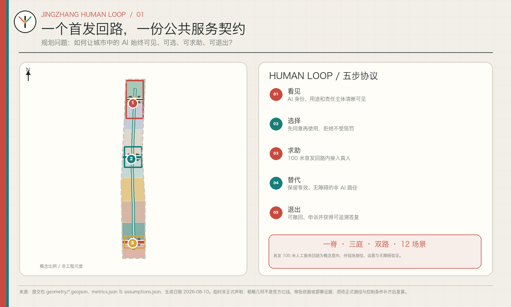
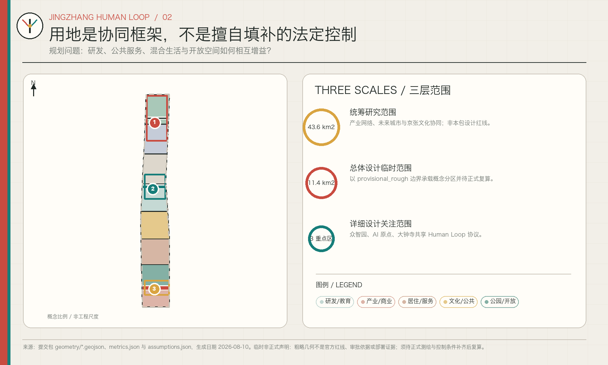
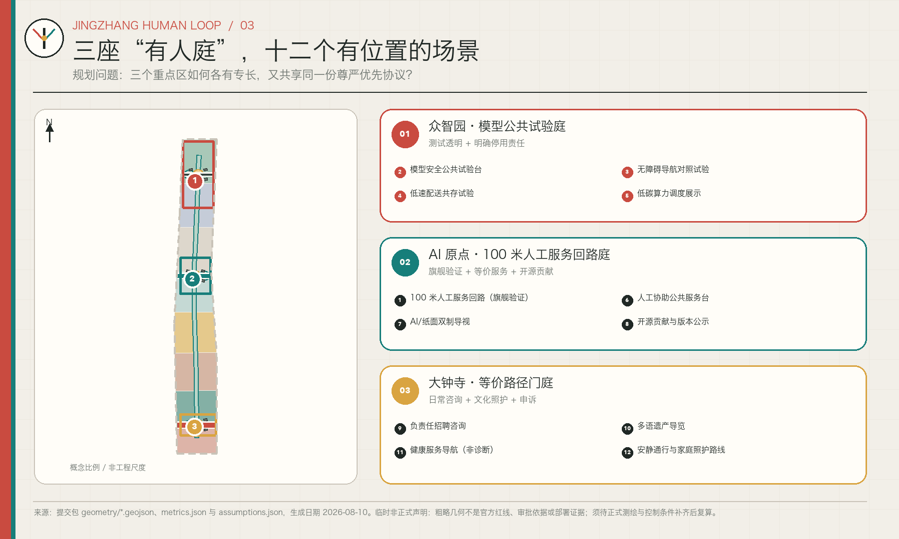
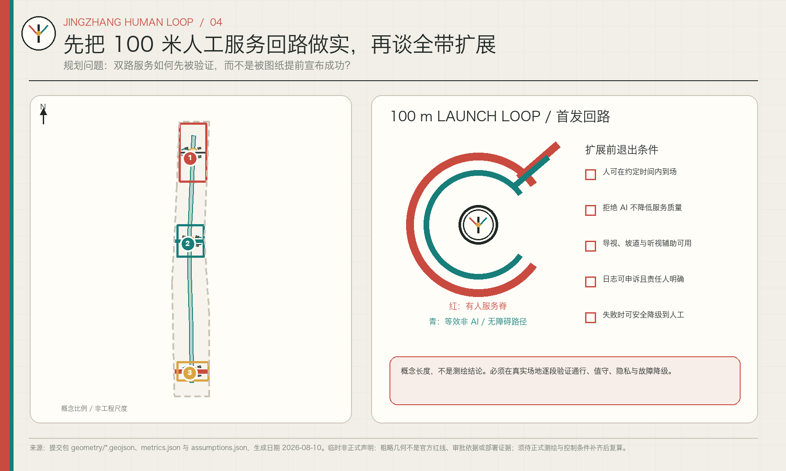
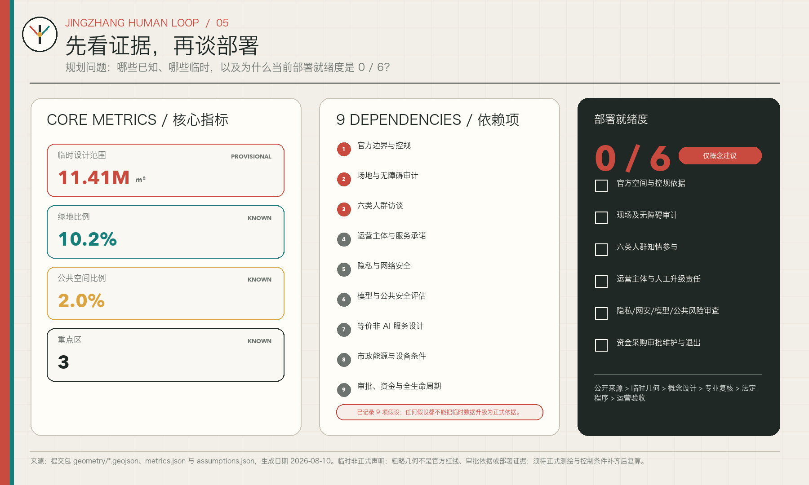

# 京张有人 / JINGZHANG HUMAN LOOP

> 一个首发 100 米人工服务回路与九项依赖：让 AI 服务始终可见、可选、可求助、有等价非 AI 路径，并可退出申诉。

## 设计依据与资料清单

本方案把《百年京张 AI 创新带城市设计开源征集》的公开公告、面向智能体任务书、本地专业标准快照、公开来源登记表和场地包作为任务依据，而不把它们误读为现场事实。当前可用的空间底板是仓库提供的临时粗略边界；尚未取得官方精确红线、现状建筑和权属、法定控规指标、道路与市政工程条件，也没有完成现场踏勘、无障碍审计、运营方确认或用户访谈。因此，本提案是可进入内容讨论的城市设计参考方案，不是审定规划、工程方案或部署证明。[source:OFFICIAL-ANNOUNCEMENT] [standard:PROJECT-OFFICIAL-ANNOUNCEMENT] [depth:existing_conditions_diagnosis]

“京张有人”把证据边界直接写进设计：任何数值先回到 `metrics.json` 的公式，任何空间位置先回到 GeoJSON 的 feature，任何法定判断先等待官方资料，任何 AI 服务先回答谁能看见、谁能拒绝、谁来人工接管。来源的完整权利、许可和用途记录保存在 `sources.json`；背景案例只用于提炼机制，不能支撑本地土地用途、开发强度或工程线位。[source:SOURCE-REGISTRY] [source:SITE-PACKAGE] [depth:risk_missing_data]

部署就绪采用六道独立门槛：①官方空间与控规依据；②现场及无障碍审计；③六类人群访谈和知情参与；④明确运营主体、人工服务时限与升级责任；⑤隐私影响、网络安全、模型安全和公共风险审查；⑥资金、采购、审批、维护与退出安排。当前六项均无可核验证据，故部署就绪度明确为 **0/6**；它与投稿包能否通过机器检查或进入内容评审是两回事。[metric:deployment_readiness_met_count] [metric:deployment_readiness_total_count]

## 三层范围工作框架

三层范围采用“战略—结构—原型”递进。约 43.6 平方公里统筹研究范围只承担产业生态、人才、未来城市和“三区两翼”关系研究；约 11.4 平方公里总体设计范围承担城市更新、用地、交通、蓝绿空间和公共服务的结构性建议；三个重点区域承担可供专业团队深化的局部设计。当前总体设计边界的投影复算值约为 11,412,825 平方米，但它来自 provisional geometry，仅用于保持本包图层、指标和图件内部一致，不能被称为官方红线或精确计分面积。[depth:three_level_scope_framework] [data:geometry/site_boundary.geojson#SITE-001] [metric:site_area_sqm]

空间语法是“一脊、三庭、双路”。“一脊”是依托京张铁路遗址公园方向组织的公共权利脊，不额外生成新的规划边界；“三庭”是众智园、北京 AI 原点社区和大钟寺三个重点区域内的人工服务庭候选点；“双路”是 AI 辅助路径与能够取得同等服务结果的非 AI 路径。三层之间不是把一张粗图放大，而是用统筹层提出原则、总体层安排网络、重点层验证一个 100 米模块。重点区域数量和临时位置由同一数据层核对。[depth:overall_spatial_structure] [data:geometry/key_areas.geojson#PROV-KEY-001] [metric:key_area_count]

100 米不是经过测量的工程线长，而是首轮可逆样机的设计模块：足够容纳入口告知、方式选择、人工求助、等价办理与退出申诉五个连续触点，又足够短，便于在不先建大系统的情况下观察冲突。官方 polygon 到位后，应从源边界重新裁切用地、道路、绿地、公共空间、建筑示意和分期图层，并重算所有面积与比例；若三处重点区位置变化，首发回路候选点也必须重新选址，而不是平移现有图形。[source:BOUNDARY-SOURCE] [depth:metrics_recalculation]

## 统筹研究范围产业与未来城市研究

总体定位不是“让城市到处自动化”，而是建设一条能公开检验 AI 如何服务人的创新带。三项定位分别是：可追溯的全栈自主创新走廊、人人可进入的 AI 公共生活试验场、把京张铁路与中关村创新史连接起来的责任文化带。五项功能为研究与开源、测试与验证、企业转化、公共服务、国际交流与终身学习。“三区两翼”继续采用任务书结构：三处重点区域形成差异化节点，中关村科技服务翼提供研发和转化支持，小月河场景赋能翼承接公共空间与生活场景；“Human Loop”是它们共同遵守的服务协议，而不是新增行政单元。[source:AGENT-TASKBOOK] [standard:PROJECT-AGENT-OPEN-CALL-TASKBOOK] [depth:overall_spatial_structure]

命名“京张有人”同时指向两件事：京张沿线有人生活，也意味着自动化系统的责任链上始终找得到人。英文名 `JINGZHANG HUMAN LOOP` 保留京张专名，并把“人工接管回路”写进品牌。Logo 概念以铁路道岔、汉字“人”和闭合回路线组合：铁路信号红代表需要注意或人工接管，公共服务青代表可达与平等路径，暖灰底代表可阅读的规划纸张。该图形由本方案原创构成，不使用企业标志、人物肖像或未清权图像；在正式应用前仍需商标检索、可访问性色彩测试和主办方品牌审查。

七个公开案例只提供背景机制，不构成本地控制依据：

| 案例 | 可借鉴机制 | 不可直接搬用的部分 |
| --- | --- | --- |
| Vector Institute（多伦多） | 研究、人才与产业采用之间设置持续接口，提示创新带需要“转译服务”而非只有办公楼。[source:CASE-VECTOR-INSTITUTE] | 其组织模式不能证明本地产业规模、空间需求或运营主体。 |
| Mila（蒙特利尔） | 开放科学、社区和伙伴网络并行，启发“贡献可见、规则可读”的公共协作界面。[source:CASE-MILA] | 伙伴数量和治理制度不能换算为本地指标。 |
| one-north（新加坡） | 混合功能创新区内嵌试验与日常生活，启发小步、分区、可退出的场景验证。[source:CASE-ONE-NORTH] | 其土地制度、交通和审批条件不能移植。 |
| Helsinki Kalasatama | Living Lab 与居民协作、敏捷试点相结合，提示先定义参与和反馈再部署。[source:CASE-SMART-KALASATAMA] | 试点结果不代表海淀居民已接受本方案。 |
| Seoul AI Hub | 创业支持、教育和产学研网络形成阶段性服务链，启发三庭分工和公共课程。[source:CASE-SEOUL-AI-HUB] | 项目规模、投资和政策不作为本地承诺。 |
| Station F（巴黎） | 园区以持续项目运营组织创业社群，启发把空间、服务时段和责任人一起设计。[source:CASE-STATION-F] | 单一园区模式不能替代开放城区的公共利益约束。 |
| Kendall Square / The Foundry（剑桥） | 创新区同时保留社区可进入的公共设施与适应性再利用，启发创新收益与社区入口并置。[source:CASE-KENDALL-FOUNDRY] | 当地更新经验不能证明本地建筑可保留、改造或拆除。 |

综合这些案例，本方案只提取四个可验证原则：接口要有人、试点要可逆、公共入口要与产业入口同等清晰、运营规则要与空间同时出现。未来城市研究因此不以传感器数量为目标，而以“五项权利是否完成一次闭环”作为首要问题；产业协同、活动策划和国际传播均需在九项依赖满足后再讨论规模化。[standard:MOHURD-URBAN-DESIGN-MEASURES]

## 总体设计范围城市更新与控规深度城市设计

总体结构将公共权利脊置于高于技术展示的层级：用地分区提供研发、公共服务、教育文化、居住配套和开放空间的概念性组合，道路与绿地形成连续通达，三处人工服务庭把复杂系统变成可找到的责任节点。分区仅是基于临时边界的完整拓扑样本，用来验证无缝覆盖和网络关系；它不替代法定用地、现状调查或地块权属。开发强度、建筑高度、建筑密度、退线、道路红线和公共设施标准均待正式条件补齐。[standard:MOHURD-CONTROL-DETAILED-PLANNING] [depth:land_use_layout] [depth:development_intensity_controls]

首发原型建议在北京 AI 原点社区的公共界面内选择一段可逆、无门槛、全天可绕行的候选场所，布置 **100 米人工服务回路**。它不是一条强制动线，而是五项权利的空间脚本：入口先用清楚语言说明“这里有 AI”；随后让使用者选择 AI 或人工/纸面方式；任一点都能找到真人或可靠的人工呼叫；非 AI 路径取得等价结果且不增加不合理负担；末端允许停止、撤回、申诉并获得记录编号。具体 0/25/50/75/100 米触点只用于样机排布，必须经现场测量和无障碍审计后调整。[data:geometry/public_space.geojson#PUBLIC-001] [data:geometry/roads.geojson#ROAD-001]

原型扩展受九项依赖约束，任何一项缺失都不能用漂亮图面替代：

| 依赖 | 必须补齐的证据 | 对设计的影响 |
| --- | --- | --- |
| D1 官方边界与控规 | 官方 polygon、用地和强度条件 | 决定选址、面积和法定衔接。 |
| D2 场地与无障碍审计 | 坡度、净宽、过街、照明、噪声和障碍物 | 决定 100 米实际走向与触点间距。 |
| D3 六类人群访谈 | 招募、知情同意、分歧和未满足需求 | 决定服务语言、时段和非 AI 路径。 |
| D4 运营主体与服务承诺 | 责任单位、人工值守、响应时限和升级链 | 决定“求助”是否真实可用。 |
| D5 隐私与网络安全 | 数据清单、最小化、保存期限、访问控制和应急 | 决定何种技术可以进入公共空间。 |
| D6 模型与公共安全评估 | 错误模式、红队、人工复核和停用阈值 | 决定 AI 能做什么、何时必须退出。 |
| D7 等价非 AI 服务设计 | 办理结果、时间、费用、语言和无障碍对比 | 防止拒绝 AI 的人被降级服务。 |
| D8 市政能源与设备条件 | 供电、通信、排水、消防、维护和备件 | 决定设施形式，优先低技术可逆方案。 |
| D9 审批、资金与全生命周期 | 权属、许可、采购、预算、维护、撤除和申诉治理 | 决定是否以及如何从样机进入试点。 |

上述依赖总数是方案管理计数，不是现场完成度。[metric:dependency_count] 图层中的建筑、道路和公共空间均是概念载体；任何“首发”只表示建议的验证顺序，不表示已选址、已获许可或已进入建设。

## 重点区域详细设计

三处重点区域以“三庭”承担不同责任。众智园 AI 自主创新加速区建议设置“模型公共试验庭”：研发团队可展示测试边界、错误类型和人工停用方式，清河界面承担低碳交往与步行连接；但模型、安全和场地条件均须专业核验。北京 AI 原点社区建议设置“人工服务回路庭”，承载唯一的首发 100 米样机，把高校成果转化、开源发布、人才服务与居民可进入的人工柜台并置。大钟寺 AI 产业聚集区建议设置“等价路径门庭”，在轨道、商业和企业访客流线交汇处演示 AI 与非 AI 两条同结果路径。[data:geometry/key_areas.geojson#PROV-KEY-001] [data:geometry/key_areas.geojson#PROV-KEY-002] [data:geometry/key_areas.geojson#PROV-KEY-003]

众智园的建筑动作优先讨论可逆展示、共享评测和首层开放，不判断具体建筑拆留；交通动作强调与公共交通和蓝绿慢行衔接，不给出工程线位。原点社区把旗舰回路置于“校园—园区—社区”的公共界面，避免把居民当作被动试验对象；所有参与先经招募与同意。大钟寺将等价路径、人工问询和退出申诉放在显眼入口，避免高流量商业空间把拒绝画像或不使用智能终端的人排除在外。[depth:three_key_area_detailed_design]

三个 polygon 均为临时约束范围，详细设计只达到方向性“定位—空间结构—建筑更新方法—交通慢行—公共空间—AI 场景—实施风险”七项表达。官方边界、现状建筑、轨道接口、文保条件、河道与市政资料补齐后，三庭面积、建筑载体、连线和指标都需重新校准。没有这些证据时，本方案不声称地块可用、不判断拆迁、不承诺运营方，也不把重点区概念写成规划综合实施方案的审定结论。[source:KEY-AREA-SOURCE] [depth:risk_missing_data]

## AI 创新生态、人才画像与 AI+ 场景

下列六类人群是**待访谈的假设画像**，不是调研结论：①研究人员与开发者，关心测试、发布、责任边界和夜间协作；②初创企业运营者，关心低成本服务、合规咨询与客户验证；③高校学生和青年人才，关心学习、就业、居住与安全通勤；④周边居民和照护者，关心安静、儿童与家庭服务、不被强制画像；⑤老年人、残障人士及低数字熟练度使用者，关心无障碍、可理解和真人帮助；⑥访客、配送及一线服务人员，关心多语言、快速问路、休息与申诉。每类至少需要独立招募、可退出访谈和反例记录，不能由公开统计或 AI 推断替代。[source:AGENT-TASKBOOK] [depth:existing_conditions_diagnosis]

旗舰场景“100 米人工服务回路”只验证一次完整服务旅程：假设画像进入前能看见 AI 告知；在不解释个人原因的情况下选择路径；途中遇到错误能在明确时限内接通真人；两条路径交付同等办理结果；结束时可停止数据使用、取得申诉入口并追踪处理。建议测试任务使用低风险的园区公共信息与活动报名，不涉及医疗诊断、执法、信用、招聘录用或其他高影响决定。人工复核者必须拥有纠错与停用权限，日志只保留必要字段和有限期限。[data:geometry/public_space.geojson#PUBLIC-001] [metric:deployment_readiness_met_count]

其余 11 个场景只做依赖映射，不声称已部署、已测试或有真实使用者：

| # | 概念场景与性质 | 候选空间 / 人群 | 最小数据与人工边界 | 关键依赖 |
| --- | --- | --- | --- | --- |
| 01 | 100 米人工服务回路（旗舰验证） | 原点社区；六类画像 | 公共信息与报名数据；真人全程接管、可退出申诉 | D1–D9 |
| 02 | 模型安全公共试验台（产业测试） | 众智园；研发与公众观察者 | 合成或清权测试集；红队与安全负责人可停用 | D4–D6、D9 |
| 03 | 无障碍导航对照试验（产业测试） | 权利脊；残障与低数字熟练者 | 不保存连续轨迹；无障碍专业人员复核 | D2、D3、D5–D7 |
| 04 | 低速配送共存试验（产业测试） | 服务界面；居民与配送人员 | 仅设备状态与冲突事件；现场安全员优先 | D2、D4–D6、D9 |
| 05 | 低碳算力调度展示（产业测试） | 众智园；研发与设施团队 | 聚合能耗；能源与安全人员确认解释 | D4–D6、D8 |
| 06 | 人工协助公共服务台 | 三庭；居民与访客 | 办理所需最少字段；人工为最终责任人 | D3–D7、D9 |
| 07 | AI/纸面双制导视 | 双路；所有人群 | 无需身份数据；人工巡检可读性与等价性 | D2、D3、D7 |
| 08 | 开源贡献与版本公示 | 原点社区；开发者与学生 | 仅自愿公开贡献；版权与社区主持复核 | D3–D5、D9 |
| 09 | 负责任招聘咨询 | 大钟寺；企业与青年人才 | 不做自动录用或排序；专业人员解释与申诉 | D3–D7、D9 |
| 10 | 多语遗产导览 | 权利脊；访客与居民 | 不做人脸识别；史料和译文由人审校 | D3–D7 |
| 11 | 健康服务导航（非诊断） | 三庭；居民与照护者 | 不推断病情；只指向公开机构信息并人工核对 | D3–D7、D9 |
| 12 | 安静通行与家庭照护路线 | 权利脊；家庭、老人和服务人员 | 不生成个体画像；社区参与确定时段与冲突规则 | D2、D3、D5、D7 |

12 张卡片满足任务书的设计覆盖要求，但覆盖不等于部署。只有 02–05 被标注为产业测试验证候选，且仍需相应依赖；其余是公共服务或文化运营概念。建议以“错误是否被发现、真人是否可达、非 AI 结果是否等价、退出是否有效”衡量首轮，而不是以调用量或停留时长替代公共价值。[metric:scenario_card_count] [metric:testing_scenario_count]

## 用地、建筑规模与拆改留方案

用地层采用同一临时边界内共享边的完整分区，目的在于测试产业研发、公共服务、教育文化、居住配套与开放空间的结构关系，而不是提出法定用地变更。分类名称和代码遵循仓库登记的国土空间用地分类参考，所有 polygon 必须无缝覆盖、无重叠，并随官方边界整体重算。[standard:MNR-LAND-USE-CLASSIFICATION-GUIDE] [depth:land_use_layout] [data:geometry/land_use.geojson#LU-001]

建筑图层只表达少量概念性载体：可逆服务亭、共享评测空间、首层公共界面和遮雨休息点。建筑基底面积可从示意 footprint 求和，用来检查图件与指标是否一致，却不能推导总建筑面积或投资；容积率当前待正式控规、楼层和官方边界补齐。[data:geometry/buildings.geojson#BLDG-001] [metric:building_footprint_area_sqm] [metric:floor_area_ratio] 建筑高度、体量、屋顶、消防、结构和风貌均是待专业深化项。[depth:height_massing_character]

“拆改留”在此只是一套决策流程：先建立现状建筑、权属、结构安全、使用强度、文化价值和全生命周期碳清单；再分别比较保留、修缮、适应性再利用、局部拆除与新建；最后由规划、建筑、结构、文保、消防、运营和公众参与共同复核。当前缺少上述对象级证据，因此不能给任何既有建筑贴上拆除或保留结论。[depth:retain_renovate_demolish] [depth:development_intensity_controls]

## 交通、轨道、市政与公共服务设施

“双路”不是把步行者分成技术人群与非技术人群，而是为同一目的提供两条等价服务链。AI 路径可使用可解释导航、预约和动态信息；非 AI 路径必须用固定导视、纸面/语音说明、人工柜台和可通行的无障碍路线取得同等结果。两路应共享安全、遮雨、座椅、照明和申诉入口，不得以更长等待、更高费用或更少服务惩罚拒绝 AI 的人。道路线当前是概念网络，轨道接驳、路口过街、非机动车与停车组织均须等待现场和管理资料。[depth:traffic_rail_slow_parking] [data:geometry/roads.geojson#ROAD-001]

市政与新型基础设施先服务五项权利，再服务技术展示：入口告知牌可在无电条件下阅读；人工呼叫应有离线替代；网络中断时非 AI 路径继续工作；数据设备明确采集范围和停用状态；服务日志区分系统建议、人工决定和申诉结果。端侧算力、通信、供电、排水、消防和分布式能源仅作为待核的配置项，不能凭概念图判断承载能力。[depth:municipal_new_infrastructure] [data:geometry/constraints.geojson#CONSTRAINTS]

公共服务设施以一个小型人工值守点为首发核心，周围才配置企业咨询、人才服务、公共课程和场景预约。是否全天值守、响应时限、服务语言和转介机构必须由运营主体与六类人群共同确定；在 D4 未满足前，“求助”只是一项设计要求，不应被画成已经可用的服务。任何涉及健康、就业、法律或公共安全的信息只做导航与解释，最终专业判断由具备职责的人完成。[source:SOURCE-REGISTRY]

## 蓝绿空间、公共空间与城市风貌

京张铁路遗址公园方向被解释为“公共权利脊”：历史铁路的信号、道岔与站点语言，用来提示技术何时运行、何时切换、责任人在哪里。绿地和公共空间图层共同组织连续步行、骑行、休息、安静通行和三个服务庭；比例指标用于检查开放空间是否被产业建筑挤压，但因分母和边界均为 provisional，只能作当前方案内部复算。[depth:blue_green_public_space] [data:geometry/green_space.geojson#GREEN-001] [metric:green_ratio]

三处“朝圣/荣誉”节点均为概念性公共组件：众智园“模型公共试验庭”公开测试目标、错误与停用记录；原点社区“100 米人工服务回路庭”展示开源贡献，同时保留匿名或不展示的权利；大钟寺“等价路径门庭”用双向导视和人工问询证明拒绝 AI 不会失去服务。地标不追求巨型物体，而把贡献、异议、纠错和人工责任变成可读的城市界面。[data:geometry/public_space.geojson#PUBLIC-001] [metric:public_space_ratio]

城市风貌以暖灰纸面、铁路信号红和公共服务青建立低噪声识别系统：临时边界始终是低对比虚线，五项权利和责任节点保持高对比；字体、图标、触觉和多语信息需经可访问性检查。文化叙事连接三条线：百年京张的工程与公共交通记忆，中关村从试验、开源到产业转化的创新文化，以及 AI 新文化对透明、选择、纠错和照护的要求。该叙事不能替代文保调查，任何历史名称、遗存位置和建筑界面都需正式资料复核。[standard:MOHURD-URBAN-DESIGN-MEASURES] [depth:height_massing_character]

## 更新项目清单、实施政策与分期计划

项目清单按“先证据、后样机、再决定是否扩展”组织：JZ-HL-01 官方资料与场地审计；02 六类人群访谈；03 100 米可逆样机；04 三庭人工服务责任设计；05 AI/非 AI 等价导视；06 低风险测试验证协议；07 权利脊无障碍与安静通行改进；08 公开证据与退出申诉台账。八项均是深化任务，不是开工或采购清单；每项需明确责任主体、依赖、停止条件和撤除方式。[depth:renewal_project_list] [data:geometry/phasing.geojson#PHASE-001]

分期以门槛而非年份驱动。第 0 期整理官方资料、测绘、控规、权属和风险清单；第 1 期完成访谈、服务蓝图、隐私影响与无障碍审计；第 2 期只有在相关门槛通过后，才可考虑使用纸面导视、临时家具和人工值守搭建可逆 100 米样机；第 3 期依据公开评估决定修正、停止或申请扩展。当前部署就绪 0/6，因此本提案停留在第 0 期设计证据阶段。[depth:phasing_implementation] [metric:deployment_readiness_met_count]

长期运营同样是概念建议：可形成每年一次“Human Loop 公共测试周”、季度开发者责任工作坊、每月人工服务开放日和持续的申诉回顾；全球交流只分享可复核方法、失败与修正，不包装为官方成就。政策方向包括公共服务等价条款、数据最小化、人工服务时限、无障碍共同设计、试点日落条款和独立申诉渠道。活动、招商、资金和机构合作均需另行授权、预算与审批，本方案没有代表任何机构作出安排。[standard:PROJECT-AGENT-OPEN-CALL-TASKBOOK]

## 指标体系、面积复算与合规矩阵

空间指标分三类阅读。第一类可从当前 GeoJSON 重算：临时总体范围面积由 EPSG:4548 投影求面积，建筑基底为 footprint 面积之和，绿地与公共空间比例分别以相应 polygon 面积除以临时范围面积，重点区域数量为 feature 计数。[metric:site_area_sqm] [metric:building_footprint_area_sqm] [metric:key_area_count] 这些值证明包内图、数、文一致，不证明官方面积或规划指标。[depth:metrics_recalculation]

第二类是待正式数据补齐的法定与工程指标，包括容积率、建筑高度、建筑密度、退线、道路红线、市政容量和设施服务半径；当前不得赋予伪精确数字。第三类是运营验证指标：人工求助接通率、两路结果等价率、退出完成率、申诉关闭时间、错误发现与停用时间。后者必须在具名运营者、经同意参与者和批准协议存在后才可采集；目前只能定义公式，不能填写成果值。[metric:floor_area_ratio] [metric:green_ratio] [metric:public_space_ratio]

项目管理指标明确记录 12 张场景卡、其中 4 个测试验证候选、九项依赖，以及六道部署门槛当前通过 0 项。[metric:scenario_card_count] [metric:testing_scenario_count] [metric:dependency_count] 这里的 **0/6** 是诚实的现场部署结论，不影响投稿包以完整证据链接受内容审查；反过来，即使机器自检全部通过，也不会自动把 0/6 改成 6/6。

`compliance_matrix.json` 逐项映射公告和 agent.1–agent.6，`standard_matrix.json` 记录五项强制标准响应，`design_depth_matrix.json` 记录 15 项设计深度；它们用于查漏，不代替正文判断。核心图展示数据—图层—指标—任务—风险的回路，正式复算时必须从源几何重跑，不可手工修改展示数字。

## 风险、版权与合规说明

首要风险是把“可评审的概念包”误读为“可部署项目”。本方案没有现场踏勘、没有真实参与者、没有运营者承诺、没有官方精确边界和法定控规，也没有完成隐私、安全、无障碍、文保、交通、市政、消防、结构或资金审查。临时约束层只用于可视化和内部复算；任何正式选址、面积、工程线位和建设判断都必须在 D1–D9 证据到位后由相应专业人员和公众参与程序复核。[depth:risk_missing_data] [data:geometry/constraints.geojson#CONSTRAINTS] [source:BOUNDARY-SOURCE]

AI 风险包括错误建议、自动化偏见、不可解释升级、过度采集、功能漂移、人工值守失效以及非 AI 路径名义存在但结果较差。缓解顺序是：先删除不必要的 AI，再限制用途和数据，再设计可见告知与选择，再配置人工复核、停用和申诉；高影响事项不进入首发任务。六类画像均为研究假设，禁止用于个体推断或商业画像；访谈前须制定招募、同意、补偿、隐私和退出方案。[metric:deployment_readiness_total_count]

正文、图表与 Logo 方向由 AI 辅助生成，责任归投稿者；引用的公开案例保留来源与用途限制，外部事实仅作背景。包内图件应由结构化数据和自制图形生成，不嵌入远程地图、新闻图片、企业商标、人物肖像或来源不明素材。完整版权和工具链声明以 `report/copyright_statement.md` 为准；社区展示许可不等于第三方资产再许可。方案不声称官方批准、不作投资或实施承诺，并接受专业评审对事实、翻译、可访问性和证据边界的进一步修订。[source:SITE-PACKAGE] [standard:PROJECT-OFFICIAL-ANNOUNCEMENT]

## 参考资料

以下是直接影响本方案判断的人类可读书目；完整机器记录、访问日期、许可、转换与限制见 `sources.json`。[source:SOURCE-REGISTRY]

1. 北京市规划和自然资源委员会海淀分局，《百年京张 AI 创新带城市设计国际方案征集资格预审公告》；用于任务、三层范围与成果深度，不代表本方案获批。[source:OFFICIAL-ANNOUNCEMENT]
2. 项目维护者整理，《面向智能体的开源征集任务书》及本地参考快照；用于 agent.1–agent.6、三大定位、五大功能和六项共创任务。[source:AGENT-TASKBOOK]
3. `brief/site-package/` 与 `data/source_registry.json`；用于临时边界、枚举、来源用途和缺口管理，provisional 项不得升级为官方控制。[source:SITE-PACKAGE]
4. 自然资源部，《国土空间调查、规划、用途管制用地用海分类指南》本地官方参考；仅用于分类表达。[standard:MNR-LAND-USE-CLASSIFICATION-GUIDE]
5. 住房城乡建设部，城市设计与控制性详细规划相关本地官方参考；用于组织空间、公共空间和成果深度，不补造缺失的本地控规。[standard:MOHURD-CONTROL-DETAILED-PLANNING]
6. Vector Institute, About；研究—产业—人才连接机制，background only。[source:CASE-VECTOR-INSTITUTE]
7. Mila, About and Industry Partnerships；开放科学与伙伴网络机制，background only。[source:CASE-MILA]
8. JTC, one-north feature materials；混合创新区与试验机制，background only。[source:CASE-ONE-NORTH]
9. Forum Virium Helsinki, Smart Kalasatama materials；Living Lab 与居民协作机制，background only。[source:CASE-SMART-KALASATAMA]
10. Seoul Metropolitan Government, Seoul AI Hub；阶段性企业支持与教育机制，background only。[source:CASE-SEOUL-AI-HUB]
11. STATION F, About；持续项目运营与创业社群机制，background only。[source:CASE-STATION-F]
12. City of Cambridge, Kendall Square and The Foundry；创新区公共入口与适应性再利用机制，background only。[source:CASE-KENDALL-FOUNDRY]
