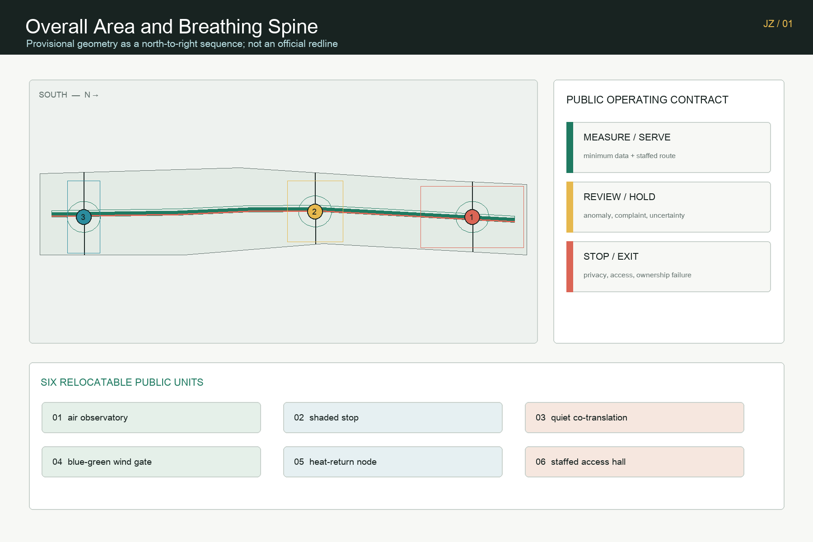
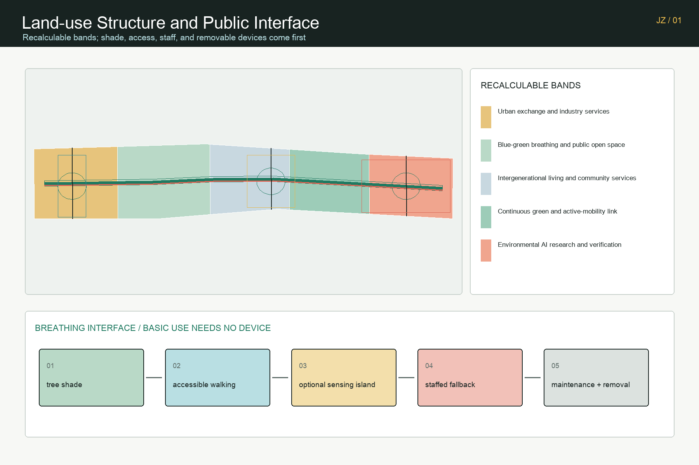
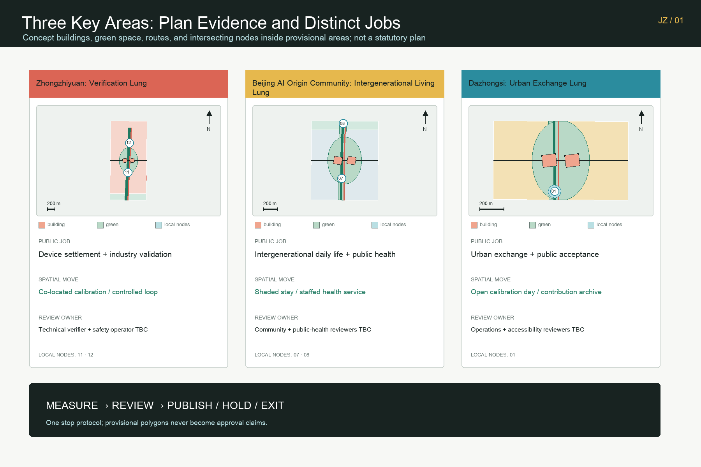
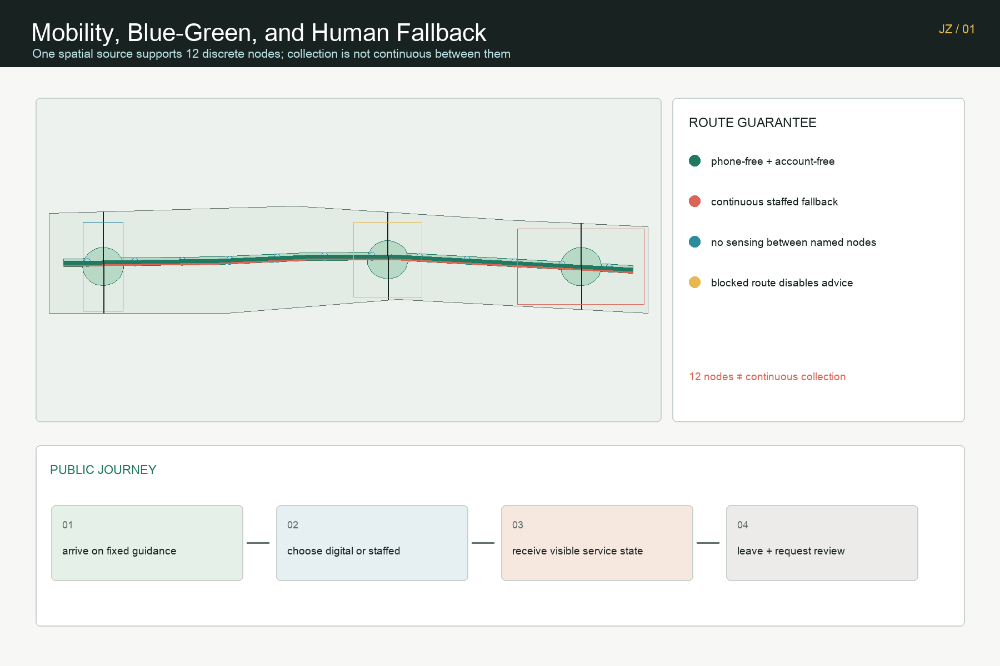
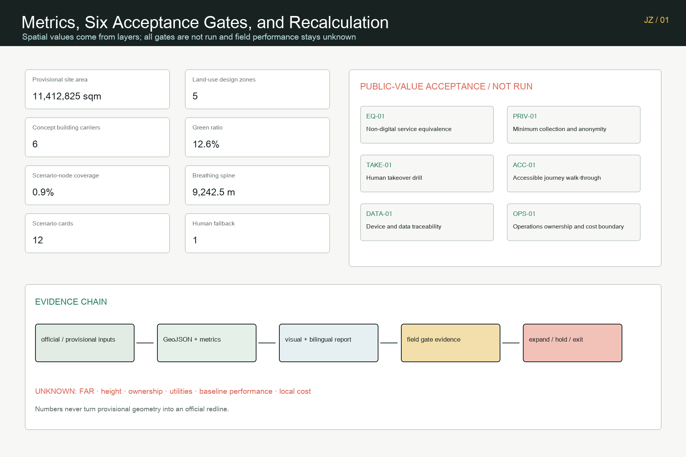

# Jing-Zhang Breathing Commons: Verifiable Urban Climate and Public Wellbeing

> A measurable and pauseable public condition shared by people, city, and compute.

## Design Basis and Source List

The proposal first answers the official announcement's three scope levels, three key areas, AI industry ecosystem, urban renewal, transport and municipal systems, public space, and implementation requirements. It then translates the agent taskbook's identity, global cases, scenario cards, personas, pilgrimage landmarks, cultural narrative, and long-term operating program into reviewable spatial and operational outputs. These documents define the task; they do not mean that the proposal has received official endorsement or an implementation commitment. [source:OFFICIAL-ANNOUNCEMENT] [standard:PROJECT-OFFICIAL-ANNOUNCEMENT]

Formal claims use only materials permitted by the repository source registry. The current `SITE_BOUNDARY` and all three `KEY_AREA` polygons are maintainer-registered rough provisional geometry. They may support proposal generation, figures, deterministic intake, and content discussion, but they are not official redlines, precise-area evidence, planning approvals, or engineering controls. The provisional Dazhongsi rectangle is not treated as a verified station catchment. Every spatial layer will be recalculated when official polygons arrive. [source:SOURCE-REGISTRY] [data:geometry/site_boundary.geojson#PROV-SITE-001]

The package does not contain verified existing buildings, ownership, road redlines, precise station relations, heritage controls, utilities, energy capacity, flood, fire-safety, or site-specific environmental baselines. FAR, building height, density, statutory green ratio, and setbacks therefore remain `unknown`. Areas and ratios describe the submitted design layers only; they are recalculated in EPSG:4548 and kept separate from announced task scales, statutory controls, and measured existing conditions. [depth:existing_conditions_diagnosis] [depth:risk_missing_data]

Six public-sector cases are used only for method comparison: long-term phasing and public routes in Helsinki Kalasatama; the district platform in Singapore Punggol Digital District; the public test-and-adoption chain in Testbed Seoul; transparent sensing in Amsterdam; cooling public space in Paris Oasis; and an accessible service network in Barcelona climate shelters. These references provide no Jing-Zhang site data and no foreign target is transferred to Beijing. [source:HELSINKI-KALASATAMA] [source:AMSTERDAM-SENSING]

## Three-Level Scope Framework

The coordinated research area answers “why”: how Haidian's concentration of algorithms, compute, universities, and enterprises can become an urban capability that people can experience, industries can validate, and governance can audit. The overall design area answers “how to connect”: it organizes industry, communities, campuses, blue-green space, and public services around one breathing spine. The three key areas answer “where to validate first”: Zhongzhiyuan focuses on environmental AI verification, the Beijing AI Origin Community on intergenerational daily services, and Dazhongsi on urban exchange. [depth:three_level_scope_framework] [standard:PROJECT-AGENT-OPEN-CALL-TASKBOOK]

The overall structure is not a new boundary. It is one spine, three lungs, two wings, and six plug-in unit types. The spine combines active mobility, shade, rest, accessibility, environmental observation, and staffed service. The three lungs are differentiated open-validation areas. The Zhongguancun technology-service wing supplies standards, data compliance, procurement, capital, and talent interfaces; the Xiaoyue River scenario wing supplies blue-green settings, resident feedback, and urban operations. Air observatories, shaded stops, quiet co-translation points, blue-green wind gates, heat-return nodes, and staffed accessibility halls can move when official geometry changes. [depth:overall_spatial_structure] [data:geometry/key_areas.geojson#PROV-KEY-001]

### Regional collaboration interface matrix (conceptual recommendation)

The two wings are not written as an established alliance. They translate potential collaborators into a discussable object-resource-interface-conversion path. Each row is a research proposal requiring separate negotiation of actors, permissions, venues, data, and funding; none is a government, park, community, or regional cooperation commitment.

| Potential collaborator | Resource or question | Jing-Zhang interface | Conversion path to public value | Evidence status |
| --- | --- | --- | --- | --- |
| Beiwei Community | Resident questions, daily-service feedback, accessibility observations | Paper/on-site question desk, staffed-route receipts, anonymized issue briefs | Community question -> scenario brief -> staffed validation -> public review record | Conceptual; negotiation pending |
| Future Science City | Engineering and industry pilot questions, methods, test capacity | Technology-service wing standards, data compliance, insurance, bounded-test handoff | Engineering question -> controlled prototype -> recalculable public-service method | Conceptual; negotiation pending |
| Huairou Science City | Research themes, environmental and public-health measurement methods | Blue-green observation nodes, method exchange, field-protocol review | Research question -> measurement protocol -> local calibration record | Conceptual; negotiation pending |
| Beijing E-Town | Manufacturing, device integration, maintenance, procurement questions | Device calibration, maintenance evidence, enterprise-service interface | Validated pilot -> maintainable device package -> locally reviewed adoption option | Conceptual; negotiation pending |
| Beijing-Tianjin-Hebei collaboration nodes | Cross-region scenarios, open methods, comparable public-service questions | Portable protocols, bilingual evidence summaries, locally reviewed cross-site comparison | Local evidence -> comparable method -> regional learning and recalibration | Conceptual; negotiation pending |

This matrix describes interface design only. It does not claim partner consent, data access, funding, procurement, or event permission. When formal material and authorization arrive, each row must add an accountable actor, evidence source, and exit condition. [source:AGENT-TASKBOOK] [depth:industry_space_mapping]

One boundary derives the whole spatial model. Five land-use partitions fully cover the provisional design area; the breathing spine and non-AI equivalent route stay inside it; green and public-space areas are measured after union; and three non-overlapping phase polygons cover the submitted boundary. The narrative, GeoJSON, metrics, five figures, A3/A0 drawings, and offline interaction therefore refer to one dataset rather than separate and conflicting drawings. [data:geometry/land_use.geojson#LU-BREATH-01] [metric:site_area_sqm] [metric:land_use_zone_count]

## Coordinated Research Area: Industry and Future City Research

“Jing-Zhang Breathing Commons” shifts the identity of an AI innovation belt from screens and devices to a public promise: technology must make air, thermal comfort, quietness, walking safety, resource efficiency, and service accessibility easier to understand and review. The identity system uses a green spine, coral human fallback, cyan environmental feedback, and yellow public collaboration. These semantics work on maps, ground guidance, sensor notices, scenario cards, and the honor wall. The proposed mark uses two open lung leaves around a vertical Jing-Zhang trace, without official institutional marks or uncleared company trademarks. [source:AGENT-TASKBOOK] [depth:overall_spatial_structure]

The industry ecosystem closes a “measure—validate—adopt—return value” loop. Universities and research teams propose models and methods. Zhongzhiyuan provides controlled tests for environmental sensing, edge compute, low-speed robots, and heat reuse. The technology-service wing supplies data compliance, standards, insurance, procurement, and finance. After adoption, enterprises publish energy, failure, service-coverage, and exit records to the evaluation layer. Communities and professionals decide whether a scenario expands. AI supports recommendations; it never assumes planning, operations, or public-safety responsibility. [source:JTC-PUNGGOL] [source:SEOUL-TESTBED]

The six global cases contribute governance actions, not copied urban forms. Kalasatama informs long phasing; Punggol informs industry-campus-district interfaces; Seoul informs the path from regulatory advice to testing, certification, and adoption; Amsterdam informs visible, interruptible, contestable sensing; Paris Oasis informs cooling, water, and opening hours as public service; Barcelona informs a walkable climate-support network. Every local application still requires Beijing regulation, local measurement, professional review, and public communication. [source:PARIS-OASIS] [source:BARCELONA-CLIMATE-SHELTERS]

The future city is not “smart everywhere.” It makes three operating states visible. Green means ordinary service; yellow means insufficient data or pending human review; red means automatic advice stops and staffed service takes over. A passerby can use shade, water, seating, an accessible route, and staffed help without logging in or accepting behavioral profiling. A participant who opts into testing receives a clear notice, minimum-data rule, limited retention, and withdrawable consent. The same state machine protects the public and provides enterprises with a realistic but bounded validation environment.

## Overall Design Area: Urban Renewal and Regulatory-Plan-Level Urban Design

Five conceptual land-use partitions are clipped to the provisional area: environmental AI research and validation in the north; continuous green and active-mobility connections in the north-center; intergenerational living and community service in the center; blue-green breathing and public open space in the south-center; and urban exchange and industry service in the south. Codes follow registered land-use semantics but do not replace statutory land use. When approved controls arrive, parcels, road redlines, and ownership must drive a new partition instead of preserving the current horizontal bands. [standard:MNR-LAND-USE-CLASSIFICATION-GUIDE] [depth:land_use_layout]

The building layer contains only six conceptual program carriers: one environmental calibration lab and one open validation/public service hall in each key area. They show functional adjacency, public interface, and operating relations. They are not surveyed existing buildings or retain, demolish, and build decisions. The footprint metric is only the geometric sum of these six concepts. Total floor area, FAR, height, density, setbacks, and fire-safety conditions await official data and professional confirmation. [data:geometry/buildings.geojson#BLDG-BREATH-11] [metric:concept_building_count] [metric:building_footprint_area_sqm]

Renewal follows “operate first, add reversible facilities second, transform space last.” The near term starts with baselines, removable shade, staffed service, and sensor calibration only where public-space permission exists. The mid term connects the breathing spine after official geometry and municipal coordination. The long term discusses building renewal and district infrastructure only after planning controls, ownership, finance, transport, and engineering conditions are known. This sequence separates concept design from statutory implementation and makes withdrawal affordable. [standard:MOHURD-CONTROL-DETAILED-PLANNING] [depth:development_intensity_controls]

Urban character avoids a uniform technology shell. A “breathing work interface” keeps ground floors publicly legible and enterable; equipment and sensing purposes are visible; roofs and facades support shade, planting, or environmental tests only after structural, fire, energy, and maintenance review. Height, massing, retain-renovate-demolish choices, and heritage relations remain pending, preventing a concept rendering from implying a settled plan. [depth:height_massing_character] [depth:retain_renovate_demolish]

## Detailed Design of Key Areas

Zhongzhiyuan is the Verification Lung. An open calibration yard, edge-compute service point, low-speed robot loop, compute-heat return node, and blue-green interface form its spatial program. At least three industry tests are required: co-located calibration of sensors at different price points; comparison of microclimate models with manual observation; and perception review of low-speed maintenance robots under occlusion and human presence. Each test records time, device, error, human judgment, and stop reason. A failed test cannot become a public notice. [data:geometry/key_areas.geojson#PROV-KEY-001] [depth:three_key_area_detailed_design]

The Beijing AI Origin Community is the Intergenerational Living Lung. Quiet co-translation points, an accessible comfort route, staffed heat-risk service, community environmental Q&A, talent collaboration, and daily-life support form a walkable public network. Children, older people, disabled people, night workers, and people without smartphones retain equivalent service without AI. Staff review environmental advice, health notices never diagnose individuals, and behavior does not feed commercial profiling. [data:geometry/key_areas.geojson#PROV-KEY-002] [source:BARRIER-FREE-LAW]

Dazhongsi is the Urban Exchange Lung. The proposal considers four-quadrant walking, public stopping, industry display, content consumption, roadshow, and service conversion inside the rough provisional geometry. It does not claim that the current polygon is a verified station area or precise interchange catchment. Six removable unit types can be rearranged after official station, road, and underground-space data arrive. The design tests exchange from city to enterprise and from public experience to procurement, rather than competing through a false-precision landmark. [data:geometry/key_areas.geojson#PROV-KEY-003] [source:KEY-AREA-SOURCE]

All three areas share the green/yellow/red state protocol and a public change log, but they have different baselines, reviewers, and stop thresholds. Zhongzhiyuan is reviewed by technical test and safety teams; the Origin Community by community service, accessibility, and public-health personnel; Dazhongsi by transport, public-space, event, and industry-service operators. Any cross-area comparison must disclose sampling period, equipment, and site differences. Rankings may not imply conclusions beyond the evidence.

## AI Innovation Ecosystem, Personas, and AI+ Scenarios

Five core personas are not marketing categories; they are a design and governance checklist. Open-source developers need published methods, reproducible tests, and contribution credit. Startups need affordable testing, compliance advice, and an exit path after failure. Leading enterprises and buyers need cross-device comparison, clear liability, and adoption evidence. Nearby residents need quietness, shade, accessibility, staffed service, and a right not to participate. Students and researchers need translation pathways, teaching observation, and research ethics. Night workers, children, older people, and disabled people are horizontal equity checks on every card.

| Scenario | Spatial carrier | AI role | Human review and stop condition |
| --- | --- | --- | --- |
| 01 Accessible comfort route | Spine and service halls | Combines slope, shade, and crowding advice | Staff confirm; blocked route disables advice |
| 02 Heat-risk notice and staffed service | Living Lung | Predicts an exposure category | Public-health review; no threshold without baseline |
| 03 Anonymous environmental sensing | Verification Lung | Detects air, heat, and noise change | Device calibration; stop if anonymity fails |
| 04 Low-speed maintenance robot | Controlled test loop | Assists cleaning and inspection | Safety operator takes over near people |
| 05 Blue-green irrigation assistance | Green space and wind gates | Suggests irrigation timing and amount | Landscape staff decide; anomaly blocks execution |
| 06 Night lighting and quietness coordination | Quiet co-translation points | Suggests time-based lighting | Operator review; safety and complaints prevail |
| 07 Public return of compute waste heat | Heat-return node | Matches heat source and public demand | Energy engineer approves; no safe condition means no connection |
| 08 Public-space comfort notice | Twelve nodes | Aggregates crowding and comfort state | On-site review; no face recognition |
| 09 Allergy and air notice | Air observatory | Combines public monitoring and calibration | Medical disclaimer; no individual diagnosis |
| 10 Heritage-material environment monitoring | Centennial Air Archive Hall | Helps detect environmental change | Heritage expert decides; no invented control line |
| 11 Community environmental Q&A | Staffed service hall | Retrieves registered sources | Staff verify sources; unknown questions are refused clearly |
| 12 Event-day temporary breathing commons | Reversible public facilities | Adjusts guidance and staff allocation | Event lead decides; excess capacity shifts to manual control |

Twelve public-space polygons correspond to the twelve cards. Each records `ai_status=decision_support_only`, `human_review=required`, an anomaly or staff stop condition, and a non-AI equivalent service. The portfolio includes environmental sensor calibration, microclimate model comparison, and low-speed robot perception as three industry-validation scenarios, making testing a documented workflow rather than a performance. [data:geometry/public_space.geojson#PUBLIC-SCENARIO-01] [metric:scenario_card_count]

Three pilgrimage and honor nodes form a public learning route. The Centennial Air Archive Hall juxtaposes steam-era engineering memory, green public life, and environmental intelligence without inventing historical pollution data. The Visible Wind Platform presents real-time or pending-measurement status through color, touch, sound, and staff explanation. The Breathing Corridor Honor Wall records contributions that completed public review, maintenance, and public return, clearly separating concept, pilot, verification, and implementation so that recognition does not imply official endorsement.

## Land Use, Building Scale, and Retain-Renovate-Demolish Strategy

The land-use layer intersects the provisional design boundary with five continuous bands. The submission contains no internal gaps or overlap and uses registered codes for industry service, green open space, community service, and research innovation. This layer tests spatial narrative and area recalculation; it does not convert horizontal cuts into real parcels or approved land use. Official parcels, road redlines, ownership, and planning controls must generate a new partition and new figures, metrics, and hashes. [data:geometry/land_use.geojson#LU-BREATH-05] [standard:MNR-LAND-USE-CLASSIFICATION-GUIDE]

Six conceptual building carriers support environmental calibration, open validation, public service, quiet co-translation, and industry adoption. Every footprint is clipped to its key area and the overall provisional boundary and carries `scale_status=conceptual_footprint_not_approved`. The proposal does not infer retain-renovate-demolish choices from news images, OSM buildings, or coarse aerial views. When survey, structural safety, use rights, heritage, and operating conditions are known, professional teams can classify retention, repair, retrofit, replacement, or new construction. [metric:concept_building_count] [standard:MOHURD-ARCH-DESIGN-DEPTH-2016] [depth:retain_renovate_demolish]

Building scale follows a “published condition first” discipline. A conceptual footprint area can be recalculated today, but total floor area, FAR, or population capacity cannot be derived from it. Height, massing, and roof statements remain interface principles rather than invented numbers. Any device or energy connection requires structural, fire, acoustic, electrical, maintenance, and accessibility review while preserving a usable public state without equipment.

The renewal strategy is vendor-neutral. Shared calibration, public standards, community service, and adoption evidence create place value, not permanent dependency on one model or brand. Modules use replaceable hardware, readable data dictionaries, limited retention, and restoration of public space after exit. If a technology pathway changes, the city still retains shade, active mobility, planting, and staffed service as public assets.

## Transport, Rail, Municipal Infrastructure, and Public Services

The movement system contains one breathing spine, one parallel non-AI equivalent walking route, and three key-area cross-connections. The spine prioritizes walking, cycling, shade, continuous rest, and accessibility. The staffed fallback route needs no phone, account, or live sensor and includes fixed guidance and findable staff. The cross-connections are conceptual centerlines inside the provisional boundary. Real junctions, road redlines, station entrances, and crossing works await official transport material. [data:geometry/roads.geojson#ROAD-BREATH-001] [metric:breathing_spine_length_m]

Rail integration never substitutes a nearest-point line for professional transport design. Relationships with Dazhongsi, Wudaokou, and Qinghuadongluxikou require station facilities, entrances, passenger flows, junctions, accessibility, and underground-space data. While these are missing, the proposal retains only movable service points, a four-quadrant walking audit method, and manual crowd management. No exact distance, ridership gain, or interchange-time claim enters the formal conclusion. [depth:traffic_rail_slow_parking] [source:BOUNDARY-SOURCE]

Municipal and digital infrastructure follows “measure before connection.” Air, heat, noise, soil-moisture, and energy sensors register device, precision, calibration time, retention period, and accountable operator. Edge compute handles only scenario-necessary data. Waste-heat return needs energy, fire, health, and maintenance review. Where utilities, drainage, flood protection, power, and communications capacity are absent, the number and specification of facilities stay pending. [depth:municipal_new_infrastructure] [source:GENERATIVE-AI-RULES]

Public service is evaluated by accessibility rather than device density. Every digital notice has fixed guidance, accessible stopping space, and staffed explanation. An anomaly changes the state from green to yellow; a staff takeover changes it to red and stops automatic advice. The geometry records one continuous human fallback route. That count comes from the road file rather than promotional copy. [data:geometry/constraints.geojson#CONSTRAINT-PROVISIONAL-001] [metric:human_fallback_route_count]

`public_space_ratio` is more precisely the “scenario-node coverage” of the active intervention union. It is not a statutory green-space ratio, proof of adequate public-space supply, or a built-condition percentage.

## Blue-Green Network, Public Space, and Urban Character

The blue-green structure combines a continuous breathing green spine, generated from a conceptual 48-meter buffer, with three lungs constrained inside the submitted site. The width is a generation method, not an approved control. Formal design must use existing vegetation, sunlight, wind, soil, stormwater, underground utilities, fire access, and maintenance capacity. The current green ratio divides the union of submitted green polygons by the provisional site area and only compares versions within this proposal. [data:geometry/green_space.geojson#GREEN-SPINE-001] [metric:green_ratio]

Twelve small public scenario nodes prevent the entire corridor from becoming a continuous collection zone. Ordinary segments between nodes default to no sensing or minimum technology. Testing activates only where purpose, notice, and accountability are explicit. The public-space ratio is also recomputed from the layer union. It is not a statutory green-space ratio, proof of adequate public-space supply, or a built-condition percentage. [metric:public_space_ratio] [depth:blue_green_public_space]

Urban character compresses three time periods into a walkable material language. Jing-Zhang engineering memory uses durable, repairable, low-glare linear elements. Contemporary public life uses trees, seating, water, ramps, and safe night lighting. Environmental intelligence uses visible, interruptible, explainable sensing and state signs. Equipment may not obscure heritage, block accessible movement, or turn public space into dynamic advertising. [standard:MOHURD-URBAN-DESIGN-MEASURES] [source:MOHURD-URBAN-DESIGN]

The Centennial Air Archive Hall does not display unverified historic air data. It shows how instruments, error, missing values, controversy, and method change over time. The Visible Wind Platform exposes both data status and staff explanation. The honor wall records maintenance, verification, and public return rather than installation volume. Culture therefore becomes a century-scale reminder of public responsibility, not scenery applied to AI.

## Renewal Projects, Implementation Policy, and Phasing

The near term, zero to eighteen months, proposes four reversible workstreams: professional verification of provisional scopes; baselines for air, heat, shade, noise, walking, and accessibility; staffed service and calibration pilots in the three lungs; and a published data dictionary and stop protocol. Public-space permission, an accountable operator, privacy review, device calibration, and a withdrawable budget are prerequisites. If one is absent, automatic functions do not start. Near-term geometry shows reversible areas around the three key zones. [data:geometry/phasing.geojson#PHASE-001] [depth:renewal_project_list]

The mid term, eighteen to forty-eight months, connects validated units into a continuous spine after official geometry, roads, municipal systems, and operating conditions are known. Cross-area standards cover device calibration, accessibility, procurement, insurance, and data minimization. Expansion depends on published evaluation: whether service is more accessible, fallback works, maintenance cost is affordable, and privacy or equity harm appears. A scenario that misses the gate remains local or exits; sunk cost is not an expansion criterion. [depth:phasing_implementation] [metric:phase_count]

Only after forty-eight months does the proposal discuss district renewal, building retrofit, energy networks, and large industry-space coordination. Approved planning controls, ownership, finance, transport, utilities, and public feedback are prerequisites. Together the three phase polygons cover the submitted area, but they express a sequence of work rather than a government annual plan, construction schedule, or funding commitment.

Long-term operation follows a weekly, monthly, quarterly, and annual rhythm. Weekly logs publish device and accessibility faults. A monthly open calibration day invites public observation. Quarterly reviews include technical, community, accessibility, public-health, and operations staff. An annual Jing-Zhang Breathing Week updates the Centennial Air Archive. Developer contributions, resident feedback, and maintenance labor receive equal recognition. Event names, hosts, and dates remain concept recommendations until authorized.

### The First 90-Day Loop: Breathing Calibration Pilot

The first pilot does not aim to “launch an AI device.” It aims to run a public-service calibration round that can be reviewed in public and paused at any time. During days 0–14, community-service, environmental-testing, accessibility, and operations staff confirm permissions, public notices, staffed fallback points, the data dictionary, and baseline sampling; all automatic advice stays off until the baseline is usable. During days 15–45, only three minimum units open: the accessible comfort route, anonymous environmental sensing, and heat-risk staffed service. Each unit has a named reviewer and a retained non-AI equivalent. During days 46–90, an open calibration day publishes records of data completeness, human takeover response, accessible-service success, false notices, and maintenance hours, then decides whether each unit expands, stays local, or exits.

This pilot does not invent new planning controls. It asks four traceable operational questions: can people receive an equivalent service without an account or phone; can staff take over during an anomaly; is collection minimal, explainable, and withdrawable; and does maintenance have a named owner and affordable workload? Unauthorized collection, repeated failure, inaccessible service, or an untraceable source sends the scenario back to the staffed route and into a public review. Breathing therefore becomes a verifiable public-work method before it becomes a permanent spatial facility.

### Six Public-Value Acceptance Gates

`visual/assets/review-evidence.json` turns the 90-day pilot from narrative into a signable, stoppable acceptance contract. It defines six entry gates, all currently `not_run`. The artifact proves what evidence is required; it does not claim approval, completed testing, or public value already achieved.

| Gate | Pass rule before activation | Spatial or operating action on failure |
| --- | --- | --- |
| EQ-01 Non-digital service equivalence | 12/12 scenarios register a usable equivalent without a phone, account, or live sensor | Automatic advice stays off; fixed guidance and staffed service remain |
| PRIV-01 Minimum collection and anonymity | Zero unauthorized personal identifiers in reviewed pilot payloads | Stop collection; review the data dictionary, retention, and deletion path |
| TAKE-01 Human takeover drill | Every active scenario completes an owned anomaly drill before public operation | Automatic functions stay off; a verbal promise is not evidence |
| ACC-01 Accessible journey walk-through | Each lung completes one arrival-to-service-to-exit journey with zero unresolved blocker | Disable digital guidance; route service to an accessible staffed point |
| DATA-01 Device and data traceability | Every active device records ID, precision, calibration, retention, operator, and public notice | An unregistered or overdue device produces no public advice |
| OPS-01 Operations ownership and cost boundary | Every unit has an authorized operator, maintenance window, consumables and removal list, and an approved withdrawable cost envelope | An ownerless or unfunded unit does not activate or expand |

The responsibility chain defines roles without pretending that organizations have committed: competent authority, authorized operator, independent technical verifier, accessibility reviewer, and community/public-health reviewers all remain `TBC`. There are only three decisions. Expand only when all applicable safety gates pass and field evidence supports public value. Hold locally when safety passes but effect, workload, or affordability remains uncertain. Exit when a stop rule persists or authorization or funding is absent. Known design quantities are limited to three pilot lungs, twelve scenario records, and one continuous non-AI route. Site verification, baselines, reversible works, devices and calibration, staffed service, accessibility review, maintenance and removal, and public reporting need a quantity sheet and local quotes. Until then, total cost and any affordability conclusion remain `unknown`. [metric:scenario_card_count] [metric:human_fallback_route_count] [depth:phasing_implementation]

## Metrics, Area Recalculation, and Compliance Matrix

Every known spatial value is calculated from submitted GeoJSON in EPSG:4548. The provisional site area, conceptual footprint area, green union, public-space union, spine length, scenario nodes, human fallback routes, key areas, and phase counts can be regenerated from files. FAR and building height stay unknown. Numerical precision in the provisional area never changes its legal or professional status. [metric:key_area_count] [depth:metrics_recalculation]

Metrics have three layers. The first records fact status: source, date, geometry role, official-boundary flag, and missing material. The second contains recalculated design-layer values. The third will contain field-performance measures such as thermal-comfort change, false-notice rate, human takeover time, successful accessible service, energy use, and maintenance cost. Without a baseline and test protocol, the third layer contains no invented target.

The machine compliance matrix covers every task in announcement sections 1.3, 1.4, and 1.5 and agent.1 through agent.6, mapping each to report sections, GeoJSON, metrics, drawings, visualization, sources, assumptions, and four self-check gates. The standard matrix separates task requirements, urban design, regulatory planning, land-use classification, and architectural depth. The depth matrix records existing conditions, structure, land use, intensity, character, retain-renovate-demolish, transport, municipal systems, blue-green space, key areas, projects, phases, recalculation, and risk. [standard:MOHURD-ARCH-DESIGN-DEPTH-2016] [depth:metrics_recalculation]

## Risk, Copyright, and Compliance

Spatial risk comes from provisional geometry, especially the unverified Dazhongsi relation. Technical risk includes sensor drift, model transfer, network loss, and hardware obsolescence. Governance risk includes unclear responsibility, scope expansion, personal profiling, and automatic advice mistaken for an official decision. Equity risk includes digital barriers, broken accessibility, and maintenance resources concentrated on display nodes. Whole-package recalculation, co-located calibration, offline and staffed routes, minimum data, accountable roles, stop controls, and a public maintenance log respond to these risks. [data:geometry/constraints.geojson#CONSTRAINT-PROVISIONAL-001] [depth:risk_missing_data]

The proposal does not claim planning approval, construction commitment, enterprise partnership, or resident consent. It does not treat conceptual footprints as existing buildings, provisional geometry as a statutory redline, foreign case metrics as Beijing baselines, or AI advice as a medical, planning, transport, or public-safety decision. Functions requiring personal or sensitive data remain off by default. If later justified, they require a separate lawful assessment, explicit purpose, minimum collection, limited retention, and an exit. [standard:MOHURD-CONTROL-DETAILED-PLANNING] [source:GENERATIVE-AI-RULES]

Text, GeoJSON, diagrams, PDFs, offline Canvas interaction, and the programmatic cover were originally produced by the participating Agent. The cover is labeled conceptual; it is not a site photograph, official rendering, or evidence of construction. The package uses no remote map, CDN, tracker, news image, identifiable person, or uncleared trademark. External cases retain their original rights and appear only as linked method summaries. The full declaration is in `report/copyright_statement.md`.

Readiness language separates three states. The package can become ready for deterministic intake and content review. Current spatial geometry remains provisional. Professional judgments dependent on official polygons, planning controls, engineering material, and site baselines remain pending. Every later change regenerates figures, HTML, and manifest hashes and reruns deterministic validation, spatial review, visual packaging, and professional evidence gates.

## References

Task sources include the official announcement, agent taskbook, repository site package, source registry, and processed fact pack. Professional references include the public documents on urban-design administration, regulatory detailed planning, land-use classification, architectural design depth, generative AI services, and barrier-free environment. They are represented separately in source, standard, and design-depth matrices; the prose keeps only claim-adjacent evidence markers. [source:SITE-PACKAGE] [source:PROCESSED-FACT-PACK]

External method references include Kalasatama, Punggol Digital District, Testbed Seoul, Amsterdam Responsible Sensing, Paris Oasis, and Barcelona climate shelters. They inform phasing, testing, transparent sensing, cooling public space, and accessible service networks. They do not establish Jing-Zhang conditions and never replace Beijing regulation, professional measurement, or public communication. [source:JTC-PUNGGOL] [source:SEOUL-TESTBED]

Complete usage limits, retrieval dates, and geometry provenance appear in `sources.json`. Unknown conditions, impacts, and recalculation actions after official polygons arrive appear in `assumptions.json`. Spatial files, metrics, standards, design depth, and task coverage connect the offline reading layer to structured evidence so that reviewers never have to infer facts from a rendering.
