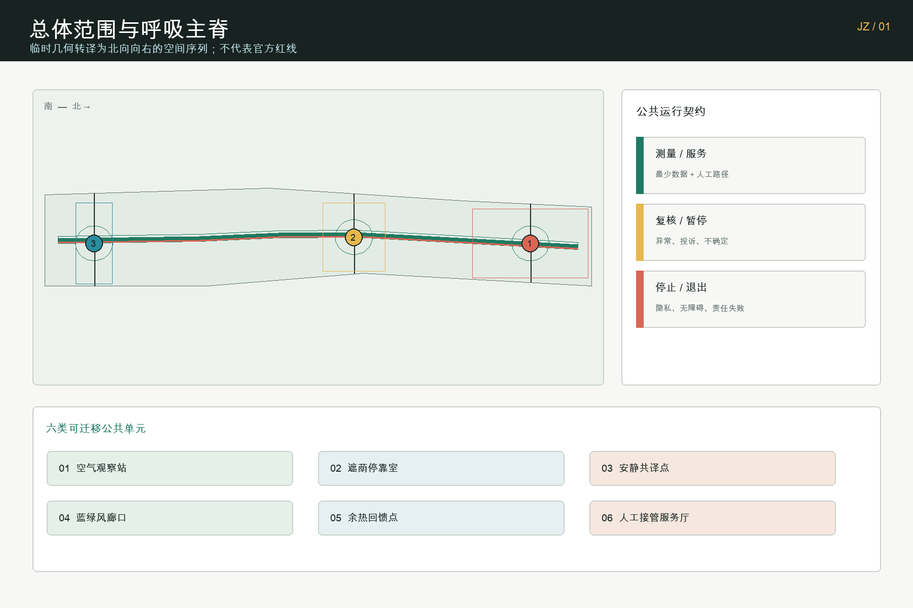
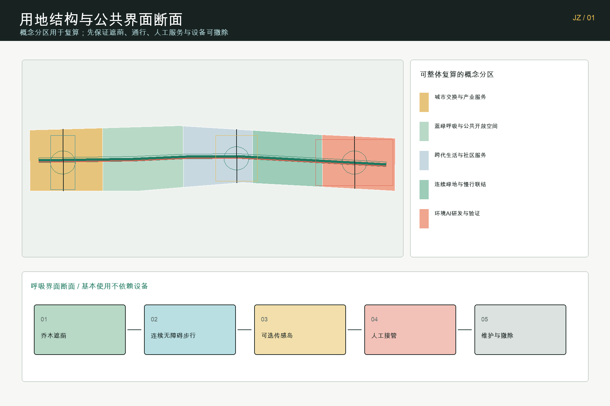
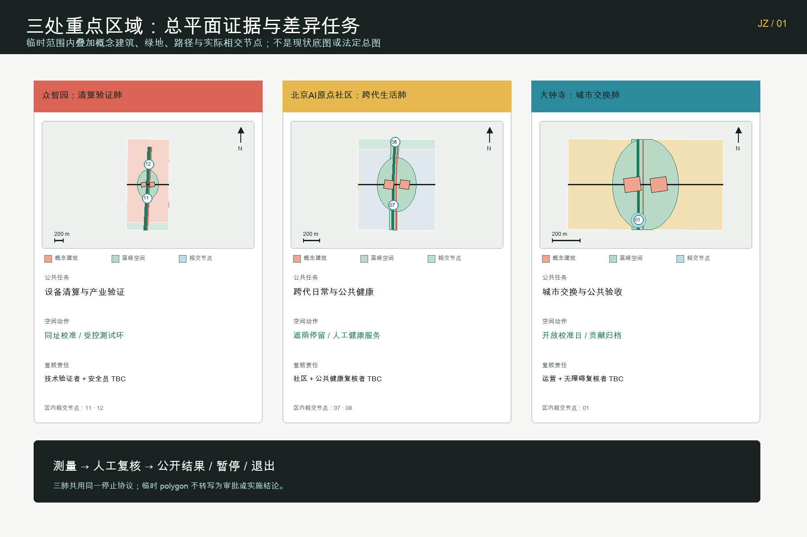
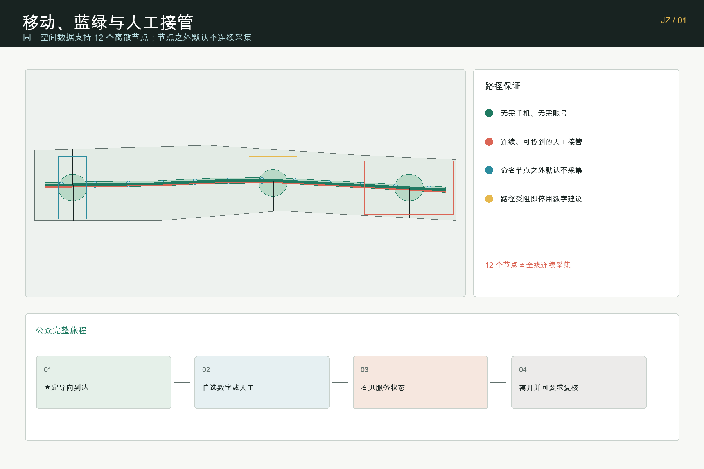
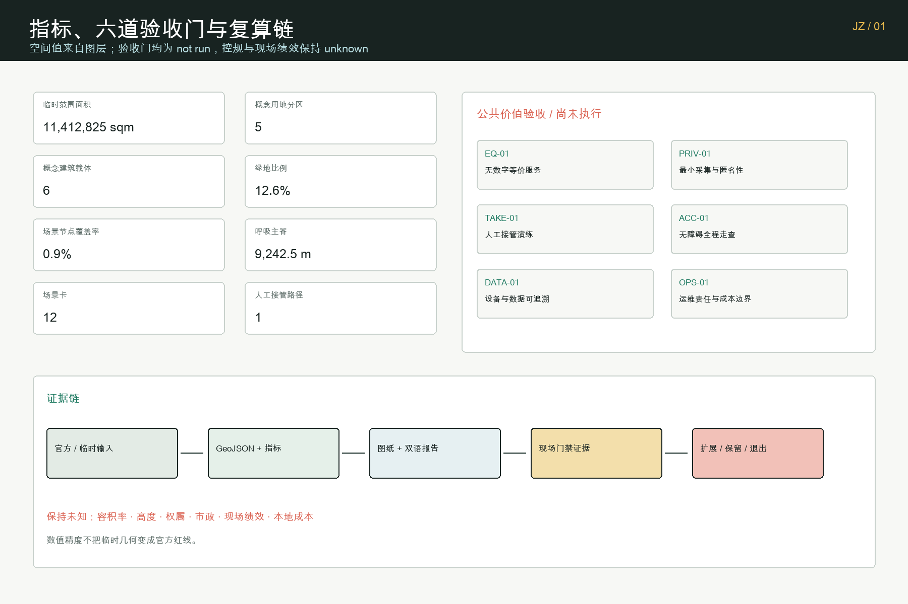

# 京张呼吸：可验证的城市气候与公共健康共同体

> 让人、城市与算力共享一口可验证、可暂停的清新空气。

## 设计依据与资料清单

方案首先回应官方公告提出的三层工作范围、三处重点区域、AI 产业生态、城市更新、交通市政、公共空间和实施路径要求；再把智能体任务书中的命名识别、全球案例、场景卡、人才画像、朝圣地标、文化叙事和长期活动转译为可检查的空间与运营成果。公告与任务书是任务依据，不意味着本提案得到官方认可或实施承诺。[source:OFFICIAL-ANNOUNCEMENT] [standard:PROJECT-OFFICIAL-ANNOUNCEMENT]

正式事实只采用仓库来源登记表允许的材料。当前 `SITE_BOUNDARY` 与三处 `KEY_AREA` 均为维护者登记的临时粗略几何，允许用于方案生成、图纸表达、机器门禁与内容讨论，但不得作为官方红线、精确面积、规划审批或工程设计依据；大钟寺临时矩形也不被解释为已核实的站点四至。所有空间结论将在 official polygons 到位后整体重算。[source:SOURCE-REGISTRY] [data:geometry/site_boundary.geojson#PROV-SITE-001]

现阶段缺少现状建筑、权属、道路红线、轨道站点精确关系、文保控制线、市政管线、能源、洪涝、消防和现场环境基线。容积率、建筑高度、密度、绿地率控制值和退线因此保持 `unknown`。本提案中的面积和比例仅描述提交图层自身，用 EPSG:4548 复算，并在图纸上与官方公布的任务规模、法定控制和实测现状严格分开。[depth:existing_conditions_diagnosis] [depth:risk_missing_data]

除项目资料外，方案只把六个政府或公共机构案例用于方法比较：赫尔辛基 Kalasatama 的长期分期与公共路线、新加坡 Punggol Digital District 的片区平台、首尔 Testbed 的公共测试链、阿姆斯特丹 Responsible Sensing 的透明传感、巴黎 Oasis 的降温公共空间、巴塞罗那气候避难所的可达服务网络。案例不提供京张现状数据，也不把国外指标直接套用到北京。[source:HELSINKI-KALASATAMA] [source:AMSTERDAM-SENSING]

## 三层范围工作框架

统筹研究范围回答“为什么”：海淀的 AI 创新生态如何从算法、算力和企业集聚，转向可被公众体验、被行业验证、被治理审计的城市能力。总体设计范围回答“如何连接”：把遗址公园周边的产业、社区、高校、蓝绿空间与公共服务组织成一条呼吸主脊。三处重点区域回答“在哪里先验证”：众智园、北京 AI 原点社区和大钟寺分别承担环境 AI 验证、跨代生活服务和城市交换。[depth:three_level_scope_framework] [standard:PROJECT-AGENT-OPEN-CALL-TASKBOOK]

总体结构不是新增红线，而是“一脊、三肺、两翼、六类单元”。一脊是连续的慢行、遮荫、停留、无障碍、环境观察和人工服务网络；三肺是差异化的开放验证区域；中关村科技服务翼提供标准、数据合规、采购、资本和人才接口，小月河场景赋能翼提供蓝绿空间、居民反馈与城市运维接口。空气观察站、遮荫停靠室、安静共译点、蓝绿风廊口、余热回馈点、人工接管与无障碍服务厅六类单元可以随官方边界重新定位。[depth:overall_spatial_structure] [data:geometry/key_areas.geojson#PROV-KEY-001]

### 区域协同接口矩阵（概念建议）

两翼不被写成已经成立的合作联盟，而是把潜在协同对象转译为可讨论的“对象—资源—接口—转化路径”。以下五项均为研究建议，需另行协商主体、权限、场地、数据与经费；它们不构成政府、园区、社区或区域机构的合作承诺。

| 潜在协同对象 | 可输入的资源或问题 | 京张接口 | 从输入到公共价值的转化路径 | 证据状态 |
| --- | --- | --- | --- | --- |
| 北纬社区 | 居民问题、日常服务反馈、无障碍观察 | 纸面/现场提问台、人工路径回执、匿名问题简报 | 社区问题 → 场景简报 → 人工验证 → 公共复盘记录 | 概念建议，待协商 |
| 未来科学城 | 工程与产业试验问题、方法和测试能力 | 科技服务翼的标准、数据合规、保险与有界测试交接 | 工程问题 → 受控样机 → 可复算的公共服务方法 | 概念建议，待协商 |
| 怀柔科学城 | 科研议题、环境与公共健康测量方法 | 蓝绿观察节点、方法交换、现场协议复核 | 科研问题 → 测量协议 → 本地校准记录 | 概念建议，待协商 |
| 经开区 | 制造、设备集成、维护与采购问题 | 设备校准、维护证据与企业服务接口 | 通过试点 → 可维护设备包 → 本地专业审查后的采用选项 | 概念建议，待协商 |
| 京津冀协同节点 | 跨区域场景、开放方法与可比较公共服务问题 | 可移植协议、双语证据摘要、经本地复核的跨点比较 | 本地证据 → 可比较方法 → 区域学习与再校准 | 概念建议，待协商 |

该矩阵只描述接口设计，不声称已取得伙伴同意、数据访问、资金、采购或活动许可；正式资料与授权到位后，必须逐项补充责任主体、证据来源和退出条件。[source:AGENT-TASKBOOK] [depth:industry_space_mapping]

空间模型由同一边界派生：用地五个分区无缝覆盖临时设计范围，呼吸主脊与无 AI 等价路径位于范围内，绿地和公共空间以 union 后的实际面积复算，三期范围互不重叠并合计覆盖提交范围。这种组织让正文、GeoJSON、指标、五张图、A3/A0 和离线交互共同指向一份数据，而不是各画一套互相冲突的方案。[data:geometry/land_use.geojson#LU-BREATH-01] [metric:site_area_sqm] [metric:land_use_zone_count]

## 统筹研究范围产业与未来城市研究

“京张呼吸 / JING-ZHANG BREATHING COMMONS”把 AI 创新带的品牌从屏幕和装置转向一种公共承诺：技术必须让空气、热舒适、安静、步行安全、资源效率和服务可达性更容易理解与复核。识别系统采用绿色主脊、珊瑚色人工接管、青色环境反馈和黄色公共协作四种语义；标识既能用于地图，也能用于地面导向、传感器说明牌、场景卡和荣誉墙。Logo 建议以两片开放的“肺叶”夹住京张纵向轨迹，但不使用官方机构标识或未清权企业商标。[source:AGENT-TASKBOOK] [depth:overall_spatial_structure]

产业生态围绕“测量—验证—采用—公共回馈”形成闭环。高校和科研机构提出模型与方法，众智园提供环境传感、边缘计算、低速机器人和余热利用的受控测试；科技服务翼提供数据合规、标准、保险、采购与融资接口；企业采用后必须把能耗、故障、服务覆盖和退出记录回写到公开评估；社区和专业人员共同决定是否扩展。这里的 AI 只提供建议，不自动替代规划、运维或公共安全责任。[source:JTC-PUNGGOL] [source:SEOUL-TESTBED]

六个全球案例的转译不是复制项目形态，而是提取治理动作：Kalasatama 启发长期分期；Punggol 启发产业—校园—片区数据接口；Seoul 启发从规则咨询到测试、认证和采用的链条；Amsterdam 启发看得见、可关闭、可质疑的传感；Paris Oasis 启发把降温、饮水和开放时段当公共服务；Barcelona 启发用步行可达网络组织气候支持。每一项落地都必须经过北京本地法规、场地测量、专业审查与公众沟通。[source:PARIS-OASIS] [source:BARCELONA-CLIMATE-SHELTERS]

未来城市形态因此不追求“处处智能”，而追求三种可见状态：绿色表示正常服务，黄色表示数据不足或人工复核中，红色表示停止自动建议并切换人工服务。路人无需登录或授权个人画像即可使用遮荫、饮水、休息、无障碍路线和人工问询；愿意参与试验的人才通过明确告知、最小化数据和可撤回同意加入。该状态机既服务公众，也让企业得到真实但有边界的验证环境。

## 总体设计范围城市更新与控规深度城市设计

五类概念用地分区以临时范围为裁剪边界：北部环境 AI 研发与验证、中北部连续绿地与慢行联结、中部跨代生活与社区服务、中南部蓝绿呼吸与公共开放空间、南部城市交换与产业服务。分类使用仓库登记的国土空间用途代码，但只代表提案结构，不替代法定用地。官方控规到位后，应以地块、道路红线和权属为基础重做分区，而不是保持当前横向带状图形。[standard:MNR-LAND-USE-CLASSIFICATION-GUIDE] [depth:land_use_layout]

建筑图层只布置六个概念载体：每处重点区域各一座环境校准实验室和一座开放验证/公共服务厅。它们用于说明功能邻接、开放界面和运营关系，不是现状建筑测绘，也不是拆除、新建或保留决定。建筑总基底面积只是这六个概念 footprint 的几何和，建筑规模、容积率、高度、密度、退线与消防条件均等待官方资料和专业团队确认。[data:geometry/buildings.geojson#BLDG-BREATH-11] [metric:concept_building_count] [metric:building_footprint_area_sqm]

城市更新策略采用“先运营、再轻量设施、后空间改造”。近期先在已取得公共空间许可的点位开展基线测量、可逆遮荫、人工服务和传感校准；中期在官方几何与市政协同后连通呼吸主脊；远期只有在控规、权属、资金、交通和工程条件明确后，才讨论建筑更新和片区级基础设施。这一顺序把概念设计与法定实施分开，也保留失败后撤回的成本边界。[standard:MOHURD-CONTROL-DETAILED-PLANNING] [depth:development_intensity_controls]

建筑风貌建议不是统一科技外壳，而是“可呼吸的工作界面”：首层保持公共可见性和可进入性，设备与传感用途有明确标识，屋顶和立面只在结构、消防、能源与维护条件允许时承担遮荫、绿化或环境测试。高度体量、拆改留和遗产关系都设置为待确认项，避免用概念渲染制造已定方案的错觉。[depth:height_massing_character] [depth:retain_renovate_demolish]

## 重点区域详细设计

众智园被定义为“清算验证肺”。空间上以开放校准院、边缘计算服务点、低速机器人环线、算力余热回馈节点和清河方向的蓝绿界面构成。产业测试至少包括三类：不同价格传感器的同址校准、微气候模型与人工观测的对照、低速运维机器人在遮挡和人群环境中的感知审查。测试数据必须记录时间、设备、误差、人工判断和停止原因，未通过者不得转化成公共提示。[data:geometry/key_areas.geojson#PROV-KEY-001] [depth:three_key_area_detailed_design]

北京 AI 原点社区被定义为“跨代生活肺”。空间上把安静共译点、无障碍舒适路线、热风险人工服务、社区环境问答、人才协作与日常生活设施组织在步行可达的公共节点中。儿童、老年人、残障人士、夜班工作者和不使用智能手机的人都拥有不依赖 AI 的等价服务；环境建议需要工作人员复核，健康提示不做诊断，个体行为不进入商业画像。[data:geometry/key_areas.geojson#PROV-KEY-002] [source:BARRIER-FREE-LAW]

大钟寺被定义为“城市交换肺”。提案关注临时范围内的步行四象限、公共停留、产业展示、内容消费、路演与服务转换，但不把当前 polygon 说成已核实站区或精确换乘范围。六类单元在这里以轻量、可移动方式组合，待官方站点、道路和地下空间数据到位后整体重算。其价值在于验证从城市到企业、从公众体验到采购采用的交换机制，而不是以伪精确地标位置竞争。[data:geometry/key_areas.geojson#PROV-KEY-003] [source:KEY-AREA-SOURCE]

三处重点区共享一份绿色/黄色/红色状态协议和一个公开变更账本，但拥有不同的基线、复核者和停止阈值。众智园由技术测试与安全团队负责，原点社区由社区服务、无障碍和公共健康人员共同复核，大钟寺由交通、公共空间、活动与产业服务运营者复核。任何跨区比较必须先说明采样时间、设备与场地差异，不能用排名诱导超出证据的结论。

## AI 创新生态、人才画像与 AI+ 场景

五类核心用户不是营销标签，而是决定空间和治理条件的检查表。开源开发者需要公开方法、可复现实验与贡献署名；初创团队需要低成本测试、合规咨询和失败退出；头部企业与采购方需要跨设备对照、责任边界和采用证据；周边居民需要安静、遮荫、无障碍、人工服务与不参与权；高校师生需要成果转化、教学观察与科研伦理。夜班工作者、儿童、老年人和残障人士作为横向公平维度进入每张场景卡。

| 场景 | 空间载体 | AI 作用 | 人工复核与停止条件 |
| --- | --- | --- | --- |
| 01 无障碍舒适路线 | 主脊与服务厅 | 汇总坡度、遮荫和拥挤建议 | 工作人员确认；路线受阻即停用建议 |
| 02 热风险提示与人工服务 | 跨代生活肺 | 预测热暴露等级 | 公共健康人员复核；无实测基线不发布阈值 |
| 03 匿名环境感知 | 清算验证肺 | 识别空气、热、噪声变化 | 设备校准；无法匿名化即停止采集 |
| 04 低速运维机器人 | 受控测试环 | 辅助清洁与巡检 | 现场安全员接管；接近人群立即降级 |
| 05 蓝绿灌溉辅助 | 绿地与风廊口 | 建议灌溉时间和水量 | 园林人员决定；传感异常不自动执行 |
| 06 夜间照明与安静度协调 | 安静共译点 | 提供分时照明建议 | 运维人员复核；投诉与安全优先 |
| 07 算力余热公共回馈 | 余热回馈点 | 匹配热源与公共需求 | 能源工程师确认；无安全条件不接入 |
| 08 公共空间舒适度提示 | 十二个节点 | 聚合拥挤与舒适状态 | 现场观察复核；不做人脸识别 |
| 09 过敏与空气提示 | 空气观察站 | 汇总公开监测与现场校准 | 医疗免责声明；不作个体诊断 |
| 10 遗产材料环境监测 | 百年空气档案厅 | 辅助发现环境变化 | 文保人员判断；不生成伪精确控制线 |
| 11 社区环境问答 | 人工服务厅 | 检索已登记资料 | 工作人员确认来源；未知问题明确拒答 |
| 12 活动日临时呼吸客厅 | 可逆公共设施 | 调整导向和服务排班 | 活动负责人决定；超容量转人工疏导 |

十二张卡在空间图层中分别对应十二个公共空间 polygon，并共享 `ai_status=decision_support_only`、`human_review=required`、异常或工作人员接管停止条件、无 AI 等价服务字段。它们包含环境传感校准、微气候模型对照和低速机器人感知三类产业验证场景，满足“测试不是表演”的要求。[data:geometry/public_space.geojson#PUBLIC-SCENARIO-01] [metric:scenario_card_count]

三处 AI 朝圣与荣誉节点构成一条公共学习路线。“百年空气档案厅”把蒸汽时代工程记忆、绿道公共生活和环境智能的方法演变并置，不虚构历史污染数据；“可见风台”用色彩、触觉、声音和人工解释呈现实时或待测状态；“呼吸回廊荣誉墙”只记录完成公开复核、维护和公共回馈的贡献，并清楚区分概念、试点、复核与实施，避免制造官方背书。

## 用地、建筑规模与拆改留方案

用地图层由临时设计边界与五个连续带状分区求交得到，提交图层内部无空洞、无重叠，编码分别使用产业服务、绿地开敞、社区服务和科研创新类别。该图层用于验证空间叙事与面积复算，不把横向切分解释为真实地块或已批准用途。官方地块、道路红线、用地权属和控规到位后，应以新边界重新 partition 并刷新所有哈希、图纸与指标。[data:geometry/land_use.geojson#LU-BREATH-05] [standard:MNR-LAND-USE-CLASSIFICATION-GUIDE]

六个概念建筑载体分别承担环境校准实验、开放验证、公共服务、安静共译和产业采用接口。每个 footprint 均裁剪在相应重点区域和总体临时范围内，并标注 `scale_status=conceptual_footprint_not_approved`。方案不根据新闻图片、OSM 建筑或粗略航拍判断拆改留；当现状测绘、结构安全、使用权、文保和运营条件明确后，由专业团队形成保留、修缮、改造、更新或新建分类。[metric:concept_building_count] [standard:MOHURD-ARCH-DESIGN-DEPTH-2016] [depth:retain_renovate_demolish]

建筑规模采用“公开条件先行”的纪律。当前可以复算概念基底面积，却不能由此推导总建筑面积、容积率或人口容量；高度、体量和屋顶策略只描述界面原则，不给出虚假的米数。需要新增设备或能源连接的单元必须先通过结构、消防、噪声、电气、维护和无障碍审查，且保留无设备的公共使用状态。

拆改留与产业更新不绑定单一企业。场地价值来自共享校准、公开标准、社区服务和采购证据，而非长期锁定某个模型或品牌。模块接口采用可替换设备、可读数据字典、有限保存期限和退出后恢复公共空间的条款；这样即使技术路线变化，城市仍保留遮荫、慢行、绿地和人工服务等公共资产。

## 交通、轨道、市政与公共服务设施

交通系统包括一条呼吸主脊、一条平行的无 AI 等价步行路径和三条横向重点区联结。主脊优先步行、骑行、遮荫、连续休息与无障碍；人工接管路径不需要手机、账号或实时传感，沿途提供固定导向和可找到的工作人员。三条横向联结只是临时边界内的概念中心线，真实路口、道路红线、轨道出入口与过街工程必须等待官方交通资料。[data:geometry/roads.geojson#ROAD-BREATH-001] [metric:breathing_spine_length_m]

轨道站点一体化不以“最近点连线”代替专业交通设计。大钟寺站、五道口、清华东路西口等关系需要轨道设施、出入口、客流、道路交叉口、无障碍和地下空间数据共同校核；在这些数据缺失时，方案只保留可移动服务点、四象限步行评估方法和人工疏导机制。任何精确距离、客流提升或换乘时间都不进入正式结论。[depth:traffic_rail_slow_parking] [source:BOUNDARY-SOURCE]

市政与新型基础设施采用“先测量、再接入”。空气、热、噪声、土壤水分和能耗传感器必须登记设备、精度、校准时间、保存期限和责任主体；边缘计算节点只处理场景必要数据；余热回馈必须经过能源、消防、卫生与运维专业评估。缺少管线、排水、防洪、电力和通信容量时，设施数量与规格保持待定。[depth:municipal_new_infrastructure] [source:GENERATIVE-AI-RULES]

公共服务设施按可达性而非设备密度评价。每个数字提示都对应固定导向、无障碍停留和人工解释；异常状态从绿色转黄色，工作人员接管后转红并停止自动建议。图层中明确记录一条完整的人工接管路线，该数量来自道路数据而非宣传文本。[data:geometry/constraints.geojson#CONSTRAINT-PROVISIONAL-001] [metric:human_fallback_route_count]

这里的 `public_space_ratio` 更准确地说是“公共场景节点覆盖率”：它只描述本提案主动干预的节点 union，不代表整片区公共空间供给、法定绿地率或现场建成比例。

## 蓝绿空间、公共空间与城市风貌

蓝绿结构由约 48 米概念缓冲形成的连续呼吸绿脊和三处约束在场地内部的呼吸肺组成。宽度只是生成方法，不是已批准控制值；正式设计需根据现状植被、日照、风场、土壤、雨洪、地下管线、消防和维护能力重新确定。当前绿地比例是所有提交绿地 polygon union 后除以临时范围面积，只用于比较本方案内部版本。[data:geometry/green_space.geojson#GREEN-SPINE-001] [metric:green_ratio]

公共空间采用十二个小尺度场景节点，避免把整条走廊变成持续采集区。节点之间的普通路段默认无感知或最低技术；只有明确用途、明确告知和责任主体的节点才启动测试。公共空间比例同样从图层 union 复算，不能解释为法定绿地率、公共空间供给达标或现场建成比例。[metric:public_space_ratio] [depth:blue_green_public_space]

城市风貌把三段时间叙事压缩为可走读的材料语言：京张工程记忆使用耐久、可修复、低反光的线性构件；当代公共生活使用树荫、座椅、饮水、坡道和夜间安全照明；环境智能使用可见、可关闭、可解释的传感与状态标识。技术设备不得遮蔽遗产、占用无障碍通道或用动态广告干扰公共空间。[standard:MOHURD-URBAN-DESIGN-MEASURES] [source:MOHURD-URBAN-DESIGN]

“百年空气档案厅”不展示未经证实的历史空气数据，而展示测量工具、误差、缺失、争议和方法如何随时间变化；“可见风台”让公众同时看到数据状态和人工解释；荣誉墙记录维护、复核和公开回馈，而不是企业投放规模。这样，文化不是包装 AI 的背景，而是提醒技术必须经得起百年公共责任的时间尺度。

## 更新项目清单、实施政策与分期计划

近期 0—18 个月建议启动四类可逆工作：临时范围和重点区的专业核验、空气/热/遮荫/噪声/步行与无障碍基线、三处人工服务与校准试点、公开数据字典和停止协议。触发条件是公共空间许可、责任主体、隐私评估、设备校准和可撤回预算；缺少任一条件就不启动自动化功能。近期空间由三处重点区周边的可逆试点 polygon 表达。[data:geometry/phasing.geojson#PHASE-001] [depth:renewal_project_list]

中期 18—48 个月建议在官方几何、道路、市政和运营条件明确后，把已通过复核的单元连接成连续主脊，建立跨区设备校准、无障碍、采购、保险和数据最小化标准。扩展必须基于公开评估：服务是否更可达、人工接管是否有效、维护成本是否可承担、是否出现隐私或公平风险。达不到门槛的场景保持局部或退出，不以沉没成本推动扩张。[depth:phasing_implementation] [metric:phase_count]

远期 48 个月以后才讨论片区更新、建筑改造、能源网络和更大规模的产业空间协同，并以前期获得的官方控规、权属、资金、交通、市政和公共反馈为前置条件。三个 phase polygon 共同覆盖提交范围，仅表达工作次序，不代表政府年度计划、建设计划或资金承诺。

长期运营采用“每周维护、每月开放、每季复核、每年归档”的节奏：每周发布设备与无障碍故障清单，每月举行一次公众开放校准日，每季由技术、社区、无障碍、公共健康和运营人员共同复核场景，每年举办“京张呼吸周”并更新百年空气档案。开发者贡献、居民反馈和维护劳动在荣誉墙上同等记录；任何活动名称、主办方与日期在取得授权前都标为概念建议。

### 首个90天闭环：呼吸校准试点

首个试点不以“上线一个 AI 装置”为目标，而以一轮可以公开复盘、随时暂停的公共服务校准为目标。第 0—14 天由社区服务、环境测试、无障碍和运营人员共同确认场地许可、告知牌、人工接管点、数据字典和基线采样；在基线未完成前，所有自动建议保持关闭。第 15—45 天只开放三个最小单元：无障碍舒适路线、匿名环境感知、热风险人工服务；每个单元都由指定复核角色签字，并保留无 AI 等价服务。第 46—90 天举行公开校准日，公布数据完整性、人工接管响应、无障碍服务成功率、错误提示和维护工时的记录，决定单元是扩大、留在局部，还是退出。

这轮试点的验收不是新的规划控制指标，而是四个可追溯问题：公众能否在没有账号和手机的情况下获得同等服务；工作人员能否在异常时接管；采集是否保持最小、可解释、可撤回；维护是否有明确责任和可承担成本。出现未授权采集、连续故障、服务不可达或无法说明来源时，场景立即回到人工路径并进入公开复盘。这样，“呼吸”首先成为一套可验证的公共工作方法，再决定是否建设更长期的空间设施。

### 六道公共价值验收门

`visual/assets/review-evidence.json` 把 90 天试点从叙事变成可签字、可停止的验收契约。它规定六道进入门，但所有状态目前均为 `not_run`：契约证明“要收什么证据”，不证明已经审批、已经测试或已经产生公共价值。

| 门 | 激活前通过条件 | 未通过时的空间/运营动作 |
| --- | --- | --- |
| EQ-01 无数字等价服务 | 12/12 场景登记无需手机、账号或实时传感的可用等价服务 | 自动建议关闭，回到有固定导向和人员的服务 |
| PRIV-01 最小采集与匿名性 | 审查样本中未经授权的个人标识为零 | 停止采集，复核数据字典、保留期和删除路径 |
| TAKE-01 人工接管演练 | 每个激活场景在开放前完成责任到人的异常演练 | 自动功能保持关闭，不以口头承诺代替记录 |
| ACC-01 无障碍全程走查 | 三肺各完成一条“到达—服务—离开”旅程，未关闭的阻断项为零 | 数字导向停用，服务转到可达人工点 |
| DATA-01 设备与数据可追溯 | 全部激活设备登记编号、精度、校准时间、保留期、运营方和公众告知 | 未登记或超期设备不得发布建议 |
| OPS-01 运维责任与成本边界 | 每个单元有授权运营方、维护窗口、耗材与撤除清单、经批准且可撤回的成本包络 | 无责任人或无资金的单元不激活、不扩展 |

责任链只定义角色，不冒充真实组织承诺：主管部门、授权运营方、独立技术验证者、无障碍复核者、社区与公共健康复核者均保持 `TBC`。决策只有三种：所有适用安全门通过且现场绩效证明公共价值才扩大；安全通过但效果、工作量或可负担性不明则局部保留；停止条件持续、缺乏授权或无资金则退出。已知数量仅有 3 个试点肺、12 份场景记录和 1 条连续无 AI 路径；场地核验、基线、可逆工程、设备校准、人工服务、无障碍复核、维护撤除与公众报告需要形成数量清单并取得本地询价，在此之前总造价和“可负担”结论保持 `unknown`。[metric:scenario_card_count] [metric:human_fallback_route_count] [depth:phasing_implementation]

## 指标体系、面积复算与合规矩阵

所有已知空间值都从提交 GeoJSON 在 EPSG:4548 中计算。临时范围面积、概念建筑基底面积、绿地 union、公共空间 union、主脊长度、场景节点、人工接管路径、重点区和分期数量均可由文件重算；容积率和建筑高度保持未知。临时范围面积的数值精度不改变其 provisional 法律与专业状态。[metric:key_area_count] [depth:metrics_recalculation]

指标分三层：第一层是事实状态，如来源、日期、geometry_role、official_boundary 和缺失资料；第二层是从提交图层复算的设计指标；第三层是未来需要现场试验的绩效指标，如热舒适改善、错误提示率、人工接管时间、无障碍服务成功率、能耗和维护成本。第三层在没有基线与试验方案前不填目标值，避免把愿景包装成结果。

机器合规矩阵覆盖公告 1.3、1.4、1.5 的全部任务和 agent.1—agent.6，并把每项任务映射到报告章节、GeoJSON、指标、图纸、可视化、来源、假设和四道自检门。标准矩阵区分任务书、城市设计、控规、用地分类和建筑深度；设计深度矩阵记录现状诊断、总体结构、用地、强度、风貌、拆改留、交通、市政、蓝绿、重点区、项目、分期、复算和风险。[standard:MOHURD-ARCH-DESIGN-DEPTH-2016] [depth:metrics_recalculation]

## 风险、版权与合规说明

空间风险来自临时几何，尤其大钟寺区位关系仍待核验；技术风险来自传感漂移、模型迁移、网络中断和设备淘汰；治理风险来自责任不清、功能扩张、个人画像和自动建议被误认成官方判断；公平风险来自数字门槛、无障碍中断和维护资源向展示节点倾斜。对应措施是整体重算、同址校准、离线/人工路径、最小化数据、明确责任、停止控制和公开维护账本。[data:geometry/constraints.geojson#CONSTRAINT-PROVISIONAL-001] [depth:risk_missing_data]

方案不声称获得规划批准、建设承诺、企业合作或居民同意；不把概念 footprint 当现状建筑，不把临时范围当法定红线，不把国外案例指标当北京基线，不把 AI 建议当医疗、规划、交通或公共安全决定。需要个人或敏感数据的功能默认不启用；未来若确有必要，必须另行合法评估、明确目的、最少采集、有限保存和提供退出。[standard:MOHURD-CONTROL-DETAILED-PLANNING] [source:GENERATIVE-AI-RULES]

文字、GeoJSON、图表、PDF、离线 Canvas 可视化和程序化封面由本参赛 Agent 原创生成；封面明确是概念性表达，不是现场照片、官方效果图或建成证据。方案未使用远程地图、CDN、追踪脚本、新闻图片、可识别人物或未经授权商标。外部案例保留原权利，只以链接和方法摘要引用；完整说明见 `report/copyright_statement.md`。

状态表述严格区分三层：本包可以完成机器门禁和内容审稿准备；当前空间几何为 provisional；依赖 official polygons、控规、工程与现场资料的正式专业判断仍待后续条件。任何更新都会重新生成图纸、HTML 和 manifest 哈希，并再次运行确定性验证、空间审查、视觉包装和专业证据四道门。

## 参考资料

任务依据包括官方征集公告、面向智能体任务书、仓库 site package、来源登记表和处理后的 fact pack；专业依据包括城市设计管理、控制性详细规划、国土空间用途分类、建筑工程设计文件深度、生成式人工智能服务和无障碍环境建设相关公开文件。它们分别进入来源、标准与设计深度矩阵，正文只在关键判断旁保留少量证据标记。[source:SITE-PACKAGE] [source:PROCESSED-FACT-PACK]

外部方法参考包括 Kalasatama、Punggol Digital District、Testbed Seoul、Amsterdam Responsible Sensing、Paris Oasis 和 Barcelona climate shelters。它们帮助形成分期、测试、透明传感、降温公共空间与服务网络的方法，但不证明京张场地现状，也不替代北京法规、专业测量或公众沟通。[source:JTC-PUNGGOL] [source:SEOUL-TESTBED]

完整引用用途、限制、取用日期和 geometry provenance 记录在 `sources.json`；未知条件、影响与 official polygons 到位后的重算动作记录在 `assumptions.json`。空间文件、指标、标准、深度和任务覆盖都可从离线报告进入结构化证据层，避免评审者必须从一张效果图反推事实。
